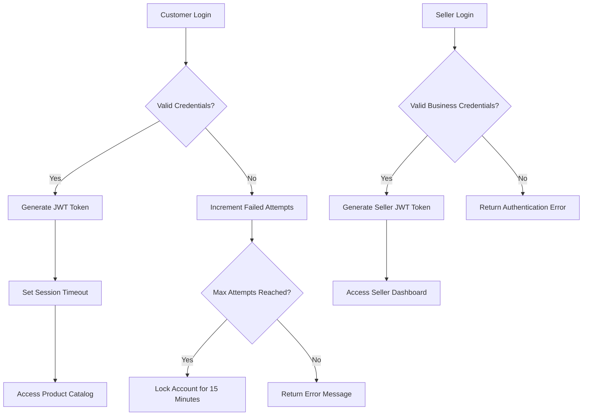
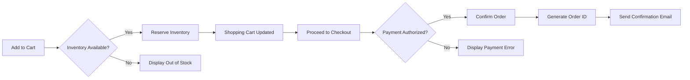
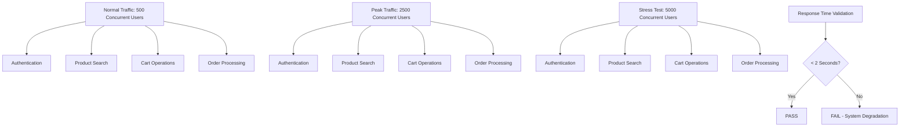
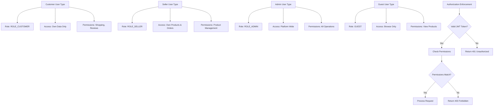
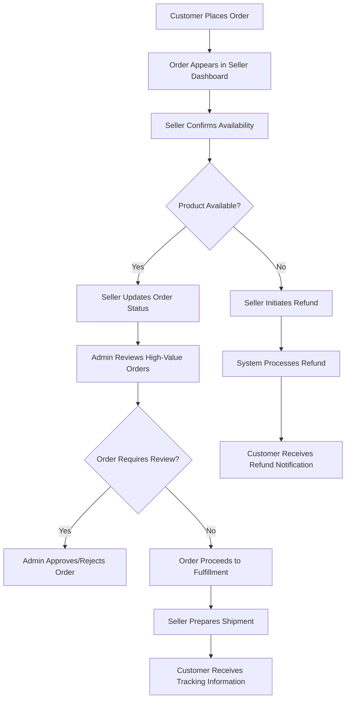

# Testing and Quality Assurance Requirements for E-commerce Shopping Mall Platform

## Testing Strategy Overview

THE shopping mall platform SHALL maintain comprehensive testing coverage across all critical business functions to ensure reliability, security, and optimal user experience. THE testing strategy SHALL encompass functional testing, performance validation, security verification, and user acceptance testing throughout the entire development lifecycle.

WHEN developing new features or modifying existing functionality, THE development team SHALL implement corresponding test cases BEFORE deployment to production environments. THE testing approach SHALL follow industry best practices and maintain automation coverage of at least 80% for core business functions.

### Testing Philosophy and Approach

THE testing strategy SHALL prioritize user-critical workflows and business-critical functions, ensuring that the most important features receive the highest testing priority. THE quality assurance processes SHALL integrate seamlessly with continuous integration and deployment pipelines, providing rapid feedback on code quality and system stability.

THE platform SHALL maintain separate testing environments for development, integration, staging, and production to ensure proper validation at each stage of the development lifecycle. THE testing environments SHALL mirror production configurations to provide accurate validation results and minimize deployment risks.

### Testing Lifecycle and Quality Gates

THE testing lifecycle SHALL include unit testing, integration testing, system testing, and user acceptance testing phases. THE development team SHALL establish clear quality gates at each phase, with specific criteria for advancement to the next testing stage.

THE quality gates SHALL include minimum code coverage requirements, maximum allowable defect counts, and performance benchmark compliance for each testing phase. THE platform SHALL document all testing results and provide comprehensive reporting to stakeholders throughout the development process.

## Functional Testing Requirements

THE functional testing suite SHALL validate all API endpoints, business logic, data integration, and user workflows across the shopping mall platform. THE functional tests SHALL cover both positive scenarios (expected behavior) and negative scenarios (error handling and validation).

### API Testing Requirements

THE system SHALL implement comprehensive API testing for all endpoints, including authentication flows, product management operations, order processing, payment handling, and administrative functions. THE API tests SHALL validate request/response formats, error codes, status codes, and data integrity throughout all operations.

WHEN testing authentication APIs, THE test suite SHALL validate successful login/logout procedures, password reset functionality, token expiration handling, and access control enforcement for each user actor type (customer, seller, admin, guest). THE authentication tests SHALL verify that each actor can only access permitted resources and is properly restricted from unauthorized operations.

THE product management API tests SHALL validate product creation, updating, deletion, and retrieval operations for sellers. THE tests SHALL verify proper inventory tracking, category management, pricing validation, and image upload functionality. THE testing SHALL ensure that sellers can only manage their own products and cannot access other sellers' inventory.

### Business Logic Validation

THE functional testing SHALL validate all business rules and workflows, including order processing from cart creation through fulfillment, payment authorization and settlement, refund processing, and inventory management. THE tests SHALL verify that business rules are properly enforced across all system interactions.

THE order processing tests SHALL validate the complete lifecycle: shopping cart management, checkout workflow, payment integration, order confirmation, inventory deduction, shipping coordination, and delivery tracking. THE tests SHALL verify proper state transitions and ensure data consistency throughout the process.

THE inventory management tests SHALL validate stock tracking, low-stock alerts, automatic inventory deductions upon order confirmation, and inventory restoration upon order cancellation or return. THE tests SHALL verify that inventory updates are transactionally safe and prevent overselling scenarios.

### Error Handling and Edge Case Testing

THE system SHALL implement comprehensive error handling tests for all failure scenarios, including network interruptions, database connection failures, payment gateway unavailability, and invalid user inputs. THE error handling tests SHALL verify appropriate error messages, graceful degradation, and data integrity preservation during failures.

THE edge case testing SHALL validate system behavior during extreme conditions, including high-volume concurrent operations, large dataset processing, boundary value inputs, and resource constraint scenarios. THE tests SHALL ensure system stability and appropriate resource management during stress conditions.

## Performance Testing Requirements

THE shopping mall platform SHALL maintain optimal performance metrics to ensure excellent user experience and system reliability under various load conditions. THE performance testing SHALL establish baseline metrics and validate that all operations meet or exceed defined benchmarks.

### Response Time Benchmarks

THE system SHALL respond to API requests within specified time limits: authentication operations within 2 seconds, product searches within 3 seconds, shopping cart operations within 1 second, and order processing within 5 seconds. THE response time requirements SHALL apply under normal load conditions with up to 1000 concurrent users.

THE database query performance SHALL optimize for common shopping patterns, ensuring that frequently accessed data such as product catalogs, user profiles, and order histories respond within acceptable timeframes. THE system SHALL implement proper indexing strategies and query optimization to maintain consistent performance as data volume increases.

THE user interface performance SHALL prioritize perceived speed, with page loads, search results, and interactive elements responding instantaneously to user actions. THE frontend performance SHALL focus on critical path optimization, resource compression, and content delivery network integration to minimize latency across different geographic regions.

### Load Testing Scenarios

THE performance testing SHALL validate system behavior under various user load scenarios, including normal daily traffic patterns, peak shopping periods such as holidays and promotional events, and unexpected traffic spikes. THE load testing SHALL simulate realistic user behaviors including browsing, searching, adding items to cart, and completing purchases.

THE system SHALL maintain stable performance characteristics under sustained load conditions, with resource utilization remaining within acceptable limits for CPU, memory, database connections, and network bandwidth. THE performance testing SHALL identify potential bottlenecks and provide recommendations for system optimization and scaling strategies.

THE load testing scenarios SHALL include simulation of mobile device usage, tablet access, and desktop browsers to ensure consistent performance across all user access points. THE testing SHALL account for varying network conditions including high-speed broadband, mobile data, and slower connection speeds typical in certain geographic regions.

### Scalability and Stress Testing

THE platform SHALL demonstrate scalability capabilities through horizontal scaling of application servers, database sharding strategies, and content delivery network optimization. THE scalability testing SHALL validate that system performance improves proportionally with additional resources and that diminishing returns do not occur prematurely.

THE stress testing SHALL determine system breaking points and validate graceful degradation when resources become constrained. THE testing SHALL identify maximum concurrent user capacity, peak transaction throughput, and data volume limits that require architectural modifications.

THE scalability validation SHALL include database performance testing with millions of product listings, large user bases, and extensive transaction histories to ensure that growth does not compromise system responsiveness or reliability.

## Security Testing Requirements

THE security testing SHALL validate all aspects of platform security, including authentication mechanisms, authorization controls, data protection, payment processing security, and compliance with industry standards. THE security tests SHALL encompass both automated vulnerability scans and manual penetration testing procedures.

### Authentication and Authorization Testing

THE security tests SHALL validate that JWT token generation and validation processes are implemented correctly, with proper secret key management and secure token transmission protocols. THE testing SHALL verify that access tokens expire within configured timeframes and that refresh token mechanisms provide secure session management.

THE authorization testing SHALL ensure that each user actor type (customer, seller, admin, guest) has appropriate access permissions and is properly restricted from unauthorized operations. THE tests SHALL validate role-based access control (RBAC) implementation across all API endpoints and system functions.

THE authentication tests SHALL include validation of password complexity requirements, brute force attack prevention, account lockout mechanisms, and multi-factor authentication implementation where applicable. THE security testing SHALL verify that user credentials are properly encrypted and never exposed in system logs or error messages.

### Data Protection and Privacy Testing

THE security tests SHALL validate data encryption in transit and at rest, ensuring that sensitive information such as payment details, personal identification data, and authentication credentials receive appropriate cryptographic protection. THE testing SHALL verify that encryption key management follows industry best practices and regulatory requirements.

THE platform SHALL implement comprehensive data privacy testing to ensure compliance with data protection regulations such as GDPR, CCPA, and PCI DSS standards. THE privacy testing SHALL validate data collection transparency, user consent mechanisms, data retention policies, and user data deletion capabilities.

THE security validation SHALL include testing for SQL injection prevention, cross-site scripting (XSS) protection, cross-site request forgery (CSRF) prevention, and other common web application vulnerabilities. THE tests shall verify that all user inputs are properly validated and sanitized before processing.

### Payment Security Compliance

THE payment security testing SHALL validate PCI DSS compliance for all payment processing operations, ensuring that credit card data is handled securely throughout the transaction lifecycle. THE testing shall verify that payment information is never stored in plain text and that tokenization is properly implemented for recurring transactions.

THE payment gateway integration testing shall validate secure communication protocols, proper SSL/TLS implementation, and certificate validation. THE tests shall ensure that payment processing errors do not expose sensitive financial information and that appropriate fraud detection mechanisms are in place.

THE security audit trail testing shall verify that all payment transactions are logged with appropriate detail levels for accounting and dispute resolution purposes, while ensuring that sensitive payment data is properly redacted or masked in log files.

## User Acceptance Testing Requirements

THE user acceptance testing (UAT) shall validate that the shopping mall platform meets business requirements and provides satisfactory user experience for all actor types. THE UAT process shall include comprehensive testing scenarios that simulate real-world usage patterns and business workflows.

### End-to-End Testing Scenarios

THE UAT suite shall validate complete user workflows from initial platform access through transaction completion, including account registration, product discovery, cart management, payment processing, order tracking, and post-purchase activities. THE end-to-end testing shall verify that all system components work together seamlessly to deliver expected business outcomes.

THE customer journey testing shall validate the shopping experience from a customer's perspective, including product search functionality, product detail page accuracy, shopping cart persistence, checkout process efficiency, and order confirmation reliability. THE testing shall ensure that customers can complete purchases without confusion or technical difficulties.

THE seller workflow testing shall validate merchant capabilities including product catalog management, order processing, inventory updates, sales analytics access, and customer communication tools. THE UAT shall verify that sellers can efficiently manage their businesses through the platform without encountering system limitations or workflow disruptions.

### Cross-Actor Testing Requirements

THE user acceptance testing shall validate interactions between different user types, ensuring that collaborative workflows such as dispute resolution, product inquiries, and customer service interactions function properly across all actor boundaries. THE testing shall verify that role-based permissions are properly enforced and that information sharing occurs only as intended by business requirements.

THE cross-actor testing shall validate that administrative functions provide appropriate oversight and control capabilities without interfering with legitimate customer and seller activities. THE testing shall ensure that platform policies are consistently enforced and that violation handling procedures work effectively across all user types.

THE multi-actor feature testing shall validate shared platform capabilities such as review systems, messaging functions, and marketplace discovery tools to ensure that collaborative features enhance rather than complicate the user experience for all participants.

## Quality Assurance Processes

THE quality assurance processes shall establish consistent standards for code quality, testing coverage, defect management, and continuous improvement throughout the platform development lifecycle. THE QA processes shall integrate automated testing, manual verification, and feedback collection to maintain high quality standards.

### Code Review and Standards

THE development team shall implement mandatory code review processes for all changes to production code, ensuring that coding standards, security best practices, and architectural guidelines are consistently followed. THE code review process shall include automated static analysis, peer review verification, and security vulnerability scanning before code deployment.

THE code quality standards shall enforce consistent formatting, documentation requirements, error handling practices, and performance optimization guidelines across all development teams. THE QA team shall maintain code quality metrics and provide regular reports on code health, technical debt, and improvement opportunities.

THE development standards shall include requirements for unit testing, with minimum code coverage thresholds established for critical business functions. THE unit testing requirements shall mandate that developers write tests for all new functionality and that test coverage reports are reviewed before code acceptance.

### Test Automation Integration

THE quality assurance processes shall integrate comprehensive test automation throughout the development pipeline, including automated unit tests, integration tests, API tests, and end-to-end functional tests. THE automation strategy shall prioritize test maintainability, execution speed, and reliability to support continuous integration workflows.

THE automated testing framework shall provide comprehensive reporting capabilities, including test execution results, performance metrics, code coverage analysis, and quality trend tracking. THE reporting shall enable stakeholders to understand quality levels and make informed decisions about deployment readiness.

THE test automation shall include regression testing suites that validate existing functionality remains intact when new features are added or system modifications are made. THE regression testing shall be executed automatically as part of the deployment pipeline and shall identify potential issues before they reach production environments.

### Quality Metrics and Reporting

THE quality assurance processes shall establish measurable quality metrics including defect density, test coverage percentages, performance benchmark compliance, and user satisfaction ratings. THE quality metrics shall be tracked over time to identify trends and improvement opportunities.

THE quality reporting shall provide stakeholders with comprehensive visibility into platform quality levels, including automated dashboard reporting, regular quality assessments, and trend analysis for long-term quality planning. THE reporting shall balance technical detail with business relevance to support informed decision-making.

THE quality improvement process shall include regular review of testing effectiveness, identification of quality gaps, and adjustment of testing strategies based on observed results and user feedback. THE continuous improvement approach shall ensure that quality assurance processes evolve with platform growth and changing user requirements.

## Test Data Management

THE testing framework shall implement comprehensive test data management strategies to ensure realistic testing scenarios while protecting sensitive information and maintaining test environment consistency. THE test data management shall support both automated and manual testing requirements across all testing phases.

### Test Data Generation and Maintenance

THE test data generation system shall create realistic datasets that represent typical marketplace scenarios, including diverse product catalogs, varied user profiles, realistic inventory levels, and representative transaction histories. THE test data shall be designed to support both functional validation and performance testing requirements.

THE test data maintenance process shall ensure that testing datasets remain current with application changes and continue to represent realistic user scenarios as the platform evolves. THE maintenance process shall include regular updates to reflect new feature requirements, data model changes, and business rule modifications.

THE test data security shall implement data masking and anonymization techniques to ensure that realistic testing scenarios can be created without exposing sensitive production data or user information. THE security measures shall comply with data protection regulations while supporting comprehensive testing requirements.

## Continuous Integration and Deployment Integration

THE testing framework SHALL integrate seamlessly with continuous integration and deployment pipelines to provide automated validation of code changes and ensure quality gates are met before production deployment. THE CI/CD integration SHALL include automated test execution, quality metric reporting, and deployment decision support based on test results.

WHEN code changes are committed to version control repositories, THE CI/CD pipeline SHALL automatically trigger appropriate test suites including unit tests, integration tests, and security tests. THE automated testing SHALL validate that new code changes do not introduce regressions and meet established quality standards before allowing progression to subsequent deployment stages.

THE deployment integration SHALL include automated rollback capabilities when critical tests fail or quality metrics fall below established thresholds. THE rollback mechanisms SHALL ensure that production systems remain stable and that quality issues are identified and resolved before affecting end users.

## Compliance and Regulatory Testing

THE testing framework SHALL validate compliance with applicable regulatory requirements including data protection laws, payment industry standards, accessibility guidelines, and industry-specific regulations. THE compliance testing SHALL ensure that the platform meets all legal and regulatory obligations while maintaining optimal user experience.

THE regulatory testing SHALL include validation of data retention policies, user consent management, privacy settings implementation, and data export capabilities required by regulations such as GDPR and CCPA. THE testing SHALL verify that users have appropriate control over their personal information and that data handling practices comply with applicable privacy laws.

THE accessibility testing SHALL validate that the platform provides equitable access to users with disabilities, including screen reader compatibility, keyboard navigation support, color contrast compliance, and alternative text provisions for visual content. THE accessibility validation SHALL ensure compliance with WCAG guidelines and applicable accessibility regulations.