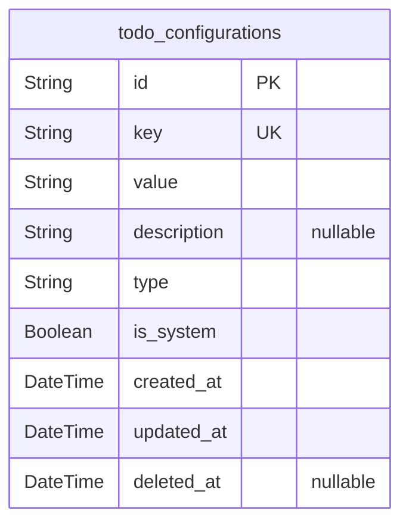
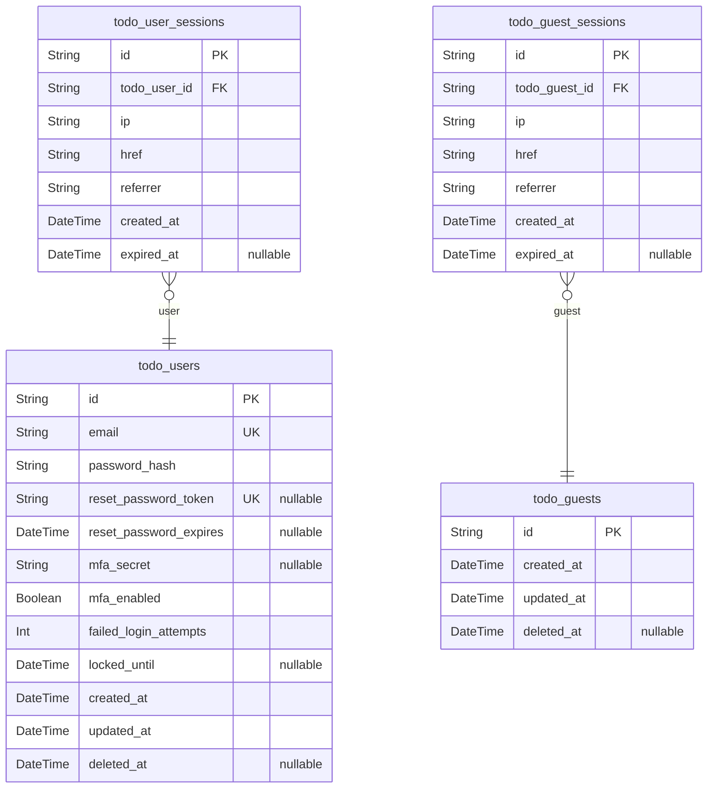
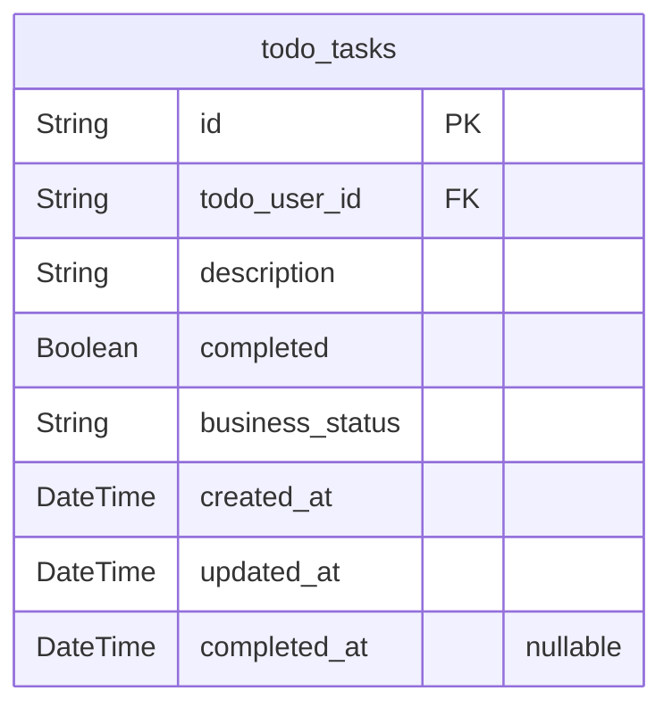

# Prisma Markdown

> Generated by [`prisma-markdown`](https://github.com/samchon/prisma-markdown)

- [Systematic](#systematic)
- [Actors](#actors)
- [Todo](#todo)

## Systematic

### `todo_configurations`

System-wide configuration settings that store application-wide settings
and preferences. This table provides a flexible key-value store for
various configuration parameters that can be adjusted without requiring
code changes or deployments.

Properties as follows:

- `id`: Primary Key.
- `key`
  > Unique configuration key identifier used to reference the setting in
  > application code.
- `value`
  > Configuration value stored as string. Can contain JSON data for complex
  > configuration objects.
- `description`: Human-readable description of what this configuration setting controls.
- `type`
  > Configuration type indicating if this is a string, number, boolean, or
  > JSON configuration value.
- `is_system`
  > Whether this is a system-level configuration that cannot be modified by
  > users. Defaults to true for critical settings.
- `created_at`: Timestamp when the configuration was initially created.
- `updated_at`: Timestamp when the configuration was last modified.
- `deleted_at`
  > Timestamp when the configuration was soft deleted. Null if the
  > configuration is active.

## Actors

### `todo_users`

Registered users with comprehensive authentication fields supporting
password reset, account security, and multi-factor authentication. Each
user account is associated with a unique email address and encrypted
password hash for secure authentication.

Properties as follows:

- `id`: Primary Key.
- `email`
  > User's email address for authentication and communication. Must be unique
  > across all registered users.
- `password_hash`
  > Encrypted password hash for secure authentication using industry-standard
  > hashing algorithms.
- `reset_password_token`
  > Security token for password reset requests. Generated when user requests
  > password reset, valid for 30 minutes as specified in requirements.
- `reset_password_expires`
  > Timestamp when the password reset token expires. Used to enforce the
  > 30-minute token validity requirement.
- `mfa_secret`
  > Security token for multi-factor authentication setup and verification.
  > Enables 2FA functionality as mentioned in requirements analysis.
- `mfa_enabled`
  > Whether multi-factor authentication is enabled for this user account.
  > Defaults to false for new accounts.
- `failed_login_attempts`
  > Number of consecutive failed login attempts. Used to implement account
  > lockout after 5 failed attempts as specified in security requirements.
- `locked_until`
  > Timestamp when account lockout expires after failed login attempts.
  > Implements time-based account recovery for security protection.
- `created_at`
  > Timestamp when the user account was created. Automatically set on
  > registration.
- `updated_at`
  > Timestamp when the user account was last updated. Automatically updated
  > on any account changes.
- `deleted_at`
  > Timestamp when the user account was soft deleted. Null if the account is
  > active. Enables account recovery without data loss.

### `todo_user_sessions`

User session tracking for authentication and audit purposes. Each session
represents a logged-in user's current session with connection metadata.

Properties as follows:

- `id`: Primary Key.
- `todo_user_id`: The user's [todo_users.id](#todo_users) who owns this session.
- `ip`: IP address of the user's connection.
- `href`: Connection URL when the session was created.
- `referrer`: Referrer URL when the session was created.
- `created_at`: Timestamp when the session was created.
- `expired_at`: Timestamp when the session expires. Null if the session is still active.

### `todo_guests`

Guest users who can access basic functionality without registration.
Guests provide temporary access to demonstrate the service's value
proposition.

Properties as follows:

- `id`: Primary Key.
- `created_at`: Timestamp when the guest access was created.
- `updated_at`: Timestamp when the guest access was last updated.
- `deleted_at`
  > Timestamp when the guest access was soft deleted. Null if the guest
  > access is active.

### `todo_guest_sessions`

Guest session tracking for temporary authentication. Each session
represents a guest user's current session with connection metadata for
audit purposes.

Properties as follows:

- `id`: Primary Key.
- `todo_guest_id`: The guest user's [todo_guests.id](#todo_guests) who owns this session.
- `ip`: IP address of the guest's connection.
- `href`: Connection URL when the session was created.
- `referrer`: Referrer URL when the session was created.
- `created_at`: Timestamp when the session was created.
- `expired_at`
  > Timestamp when the guest session expires. Null if the session is still
  > active.

## Todo

### `todo_tasks`

Individual todo tasks that users can create, complete, and manage. Each
task represents a single unit of work that can be completed and tracked
over time. Tasks are associated with users and support simple completion
status tracking.

Properties as follows:

- `id`: Primary Key.
- `todo_user_id`: User who created and owns this task. References {\link todo_users.id}
- `description`
  > Task description content up to 500 characters. Users can edit this to
  > modify what the task involves.
- `completed`
  > Completion status of the task. False indicates incomplete, true indicates
  > completed.
- `business_status`
  > Business workflow status of the task. Values: pending, processing,
  > completed. Required for workflow management as specified in requirements.
- `created_at`
  > Timestamp when the task was created. Automatically set when task is first
  > added.
- `updated_at`
  > Timestamp when the task was last modified. Updated automatically on any
  > change to the task.
- `completed_at`
  > Timestamp when the task was marked as completed. Only set when task
  > transitions to completed state.
