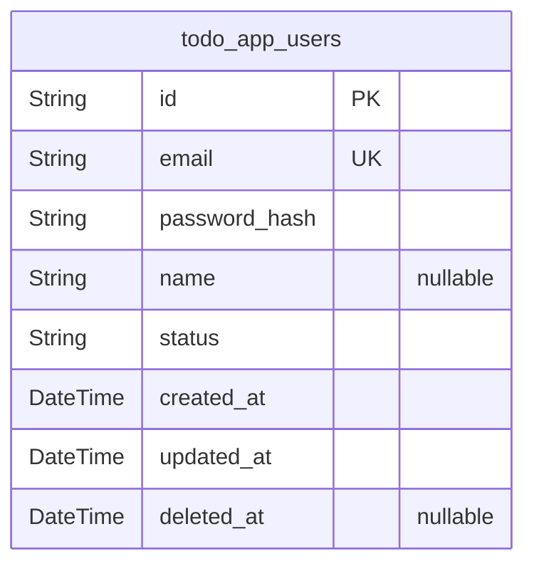
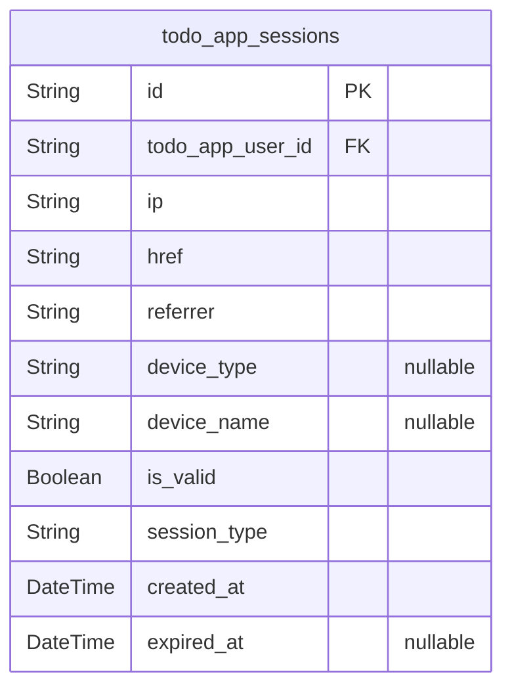
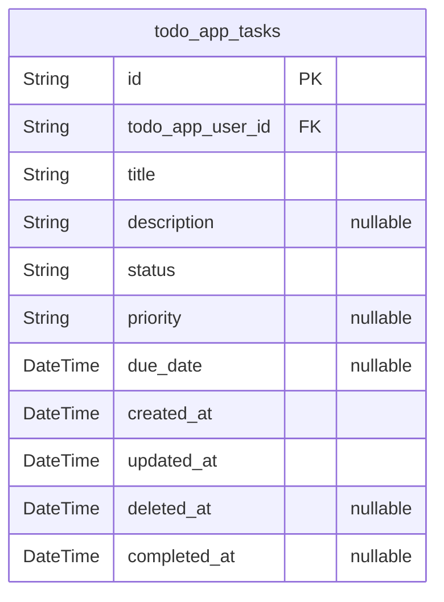

# Prisma Markdown

> Generated by [`prisma-markdown`](https://github.com/samchon/prisma-markdown)

- [Systematic](#systematic)
- [Actors](#actors)
- [Operations](#operations)

## Systematic

### `todo_app_users`

User account information for the Todo application.

Stores authentication credentials and basic user profile information.
Each user has exclusive access to their own tasks and data. User accounts
support JWT-based authentication with session management across multiple
devices.

Users can create, manage, and complete their personal todo tasks while
maintaining data isolation from other accounts. The system supports
password-based authentication with modern security standards.

Properties as follows:

- `id`: Primary Key.
- `email`
  > User email address for authentication and account identification. Must be
  > unique across all user accounts and follow valid email format.
- `password_hash`
  > Hashed password for secure authentication. Uses bcrypt or comparable
  > strong hashing algorithm to protect user credentials.
- `name`
  > User display name for personalization. Optional field that can be updated
  > by the user at any time.
- `status`
  > Account status indicating active or inactive state. Valid values: active,
  > inactive. Used for account management and administrative controls.
- `created_at`
  > Timestamp when the user account was created. Automatically set during
  > registration process.
- `updated_at`
  > Timestamp of the most recent account modification. Updated automatically
  > when profile information changes.
- `deleted_at`
  > Timestamp when the user account was soft deleted. Null for active
  > accounts, set when user requests account deletion.

## Actors

### `todo_app_sessions`

Enhanced user session management for JWT authentication enabling
multi-device access, security monitoring, and session lifecycle control.

Stores authentication session details supporting up to 5 concurrent
sessions per user account. Each session represents a device-specific
login with comprehensive tracking including device identification, IP
geolocation, and security monitoring for token lifecycle management and
audit compliance.

Sessions automatically expire after 30 days with configurable
invalidation support. The system maintains session continuity through
persistent refresh tokens while providing security monitoring through IP
address tracking and device fingerprinting. Enhanced with session type
differentiation and explicit validation status for comprehensive access
control.

Properties as follows:

- `id`: Primary Key.
- `todo_app_user_id`: Associated user's [todo_app_users.id](#todo_app_users).
- `ip`
  > IP address of the device establishing the session for security tracking.
  > Supports IPv4 and IPv6 formats.
- `href`: URL where the session was initiated for audit trail.
- `referrer`: Referrer URL indicating the source page.
- `device_type`: Device category: web, mobile, tablet, api for session differentiation.
- `device_name`: User-friendly device identifier for cross-device management.
- `is_valid`
  > Session validity status for explicit invalidation support. Defaults to
  > true.
- `session_type`
  > Authentication context: standard, mfa, oauth for security policy
  > enforcement.
- `created_at`: Timestamp when the session was established.
- `expired_at`: Timestamp when the session expires and requires re-authentication.

## Operations

### `todo_app_tasks`

Core task management entity for the Todo application.

Stores individual todo items with complete lifecycle tracking from
creation through completion. Each task belongs to a specific user and
maintains independent management capabilities supporting the
application's focus on simple, effective task organization.

Tasks support essential productivity features including due date
management, priority levels, and completion status tracking. The model
enables users to create, organize, and track their daily activities
through an intuitive interface that emphasizes ease of use over
complexity.

Properties as follows:

- `id`: Primary Key.
- `todo_app_user_id`: Task owner's [todo_app_users.id](#todo_app_users).
- `title`
  > Task title describing what needs to be completed. Maximum 200 characters
  > to ensure clarity and readability while preventing overly verbose
  > descriptions that could impact performance.
- `description`
  > Optional detailed description providing additional context about the
  > task. Supports up to 1000 characters for comprehensive task information
  > while maintaining system performance.
- `status`
  > Current task status indicating completion state. Values: 'pending' for
  > active tasks requiring completion, 'completed' for finished tasks.
- `priority`
  > Task priority level helping users focus on urgent items. Values: 'none',
  > 'low', 'medium', 'high' with 'medium' as default for balanced task
  > organization.
- `due_date`
  > Optional due date for time-sensitive tasks. Supports realistic planning
  > horizons up to 5 years in the future while preventing unrealistic
  > deadline setting.
- `created_at`
  > Timestamp when the task was first created. Automatically set upon task
  > creation for audit trail and chronological organization.
- `updated_at`
  > Timestamp of the most recent task modification. Automatically updated
  > whenever any task field changes to maintain accurate change tracking.
- `deleted_at`
  > Timestamp when the task was soft deleted. Used for implementing task
  > deletion with recovery capability while maintaining data integrity.
- `completed_at`
  > Timestamp when the task was marked as completed. Records completion time
  > for productivity analytics and user reference.
