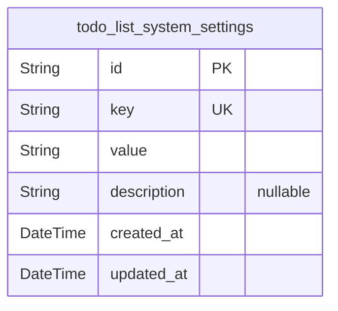
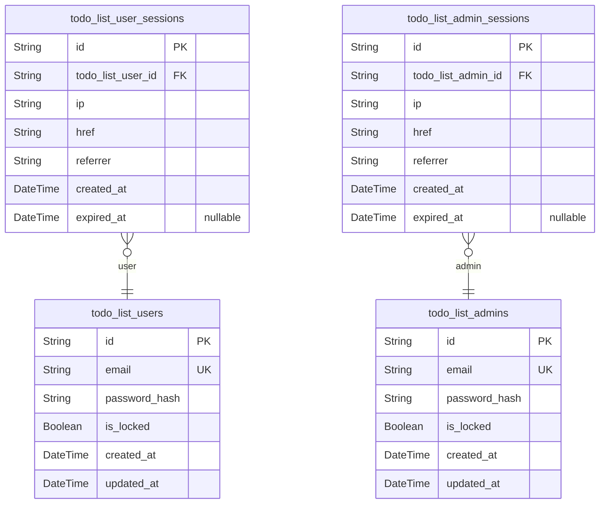
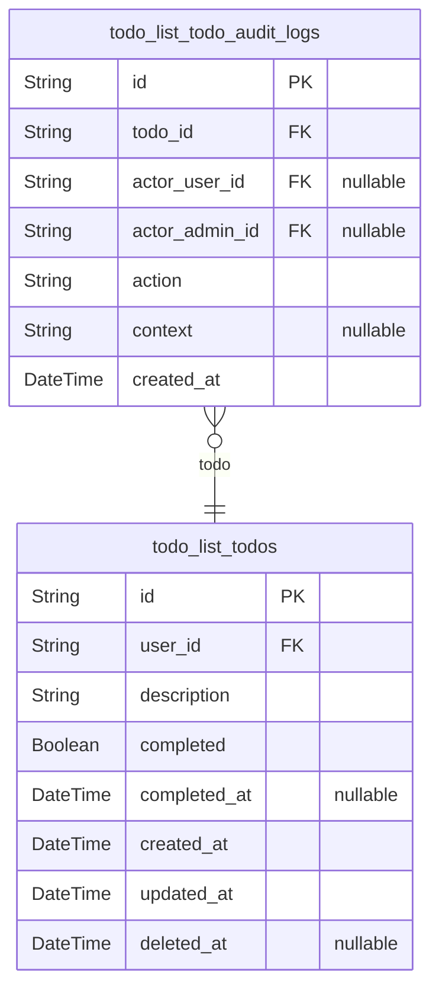

# Prisma Markdown

> Generated by [`prisma-markdown`](https://github.com/samchon/prisma-markdown)

- [Systematic](#systematic)
- [Actors](#actors)
- [Todos](#todos)

## Systematic

### `todo_list_system_settings`

Global system settings and platform-wide configuration parameters.

This table stores platform-level flags, operational options, or dynamic
infrastructure configuration values that affect the overall behavior of
the Todo List service. It allows the backend to flexibly enable, disable,
or adjust global features without redeployment. Each record represents a
uniquely identified setting (by key), with support for versioned values,
clear description, and retrieval metadata.

This is the authoritative source for all service-wide configuration
values. There are no foreign keys; all relationships are internal to this
domain component. Optimized for rapid lookup and extensibility.

Properties as follows:

- `id`: Primary Key.
- `key`
  > Unique setting identifier. This field acts as a business-meaningful key
  > for the configuration parameter (e.g., 'max_login_attempts',
  > 'enable_signup'). Maximum length: 100 characters. Index enforced.
- `value`
  > Setting value as a string. Used to store dynamic configuration values in
  > string format. Up to 1024 characters. Application responsible for
  > type-casting on retrieval.
- `description`
  > Detailed description of the setting. Used for documenting the business
  > context, operational semantics, or instructions for each platform option.
  > Optional, for service administrator reference.
- `created_at`
  > Timestamp indicating when the setting was first created. Set by the
  > backend upon insertion (ISO 8601 format, UTC).
- `updated_at`
  > Timestamp of the most recent update to this setting. Managed by the
  > backend (ISO 8601 format, UTC).

## Actors

### `todo_list_users`

Registered end users of the Todo List system.

Represents any individual who can register, authenticate, and manage
their personal set of todo items. Each user is identified by a unique
email and secures access with a hashed password. Designed for strict
privacy and least-privilege access: users may act only on their own data
and cannot view or alter other users. Status fields support account
locking for abuse or compliance. Auditing is handled via associated
session and audit log tables.

Properties as follows:

- `id`: Primary Key.
- `email`
  > Unique email address for login, identity, and communication for this
  > user. Must be globally unique across all users.
- `password_hash`
  > Bcrypt or argon2id hash of user's chosen password. Never store a plain
  > password; always enforce strong hash.
- `is_locked`
  > True if the user account is locked or suspended and should not be allowed
  > to authenticate. Used for abuse prevention and compliance.
- `created_at`: UTC timestamp when the user account was created.
- `updated_at`: UTC timestamp for the latest account modification or status change.

### `todo_list_user_sessions`

Authentication sessions for end users of the Todo List system.

Each session tracks login context for a specific user, including
connection IP and access URL. Sessions are used for token validation,
security context, and auditing. Multiple sessions may exist per user,
supporting concurrent device access. Expired sessions are tracked for
compliance and security analysis. Managed via parent user lifecycle. Only
allowed fields per session table standard.

Properties as follows:

- `id`: Primary Key.
- `todo_list_user_id`: Foreign key to session-owning user. Links to [todo_list_users.id](#todo_list_users).
- `ip`: IP address for the origin of the session, for security auditing.
- `href`
  > Original connection URL associated with this session, useful for context
  > and traceability.
- `referrer`: Referrer URL context for original login or session creation.
- `created_at`: UTC timestamp of session authentication creation event.
- `expired_at`: UTC timestamp when this session expired (null means still active).

### `todo_list_admins`

Administrator accounts for privileged operations and oversight in the
Todo List service.

Admins have the ability to view, edit, and manage any user's todos as
well as oversee user accounts and system health. Each admin is identified
by a unique email and secures access via a hashed password field. Admin
accounts are strictly separated from regular users for security and
compliance. Includes lock flag for suspensions and audit triggers. Admin
capabilities are managed exclusively by the RBAC patterns of the
application; they do not have their own todo entries.

Properties as follows:

- `id`: Primary Key.
- `email`: Globally unique admin login address for identity and communication.
- `password_hash`
  > Strong cryptographic hash of admin password for login authentication.
  > Plain password never stored.
- `is_locked`
  > True if admin is suspended or access is temporarily revoked. Used for
  > security and compliance enforcement.
- `created_at`: UTC timestamp for admin account creation.
- `updated_at`: UTC timestamp for last update to the admin account.

### `todo_list_admin_sessions`

Authentication session records for administrators in the Todo List system.

Each session logs admin login context, including IP and URL reference
chains, for auditing privileged system access. Supports concurrent
sessions per admin (for monitoring concurrent workstations or incident
response). Expired sessions are kept for compliance and future security
analysis. Follows the session table standard for admins as a distinct
actor class. Managed through the parent admin lifecycle only.

Properties as follows:

- `id`: Primary Key.
- `todo_list_admin_id`: Foreign key to session-owning admin. Links to [todo_list_admins.id](#todo_list_admins).
- `ip`: IP address where admin logged in to begin session.
- `href`: Target URL of session origin, useful for context and audit trail.
- `referrer`: Upstream URL from which admin accessed this session. Used in audit trails.
- `created_at`: UTC timestamp of session authentication creation.
- `expired_at`: UTC time session expired; null for active session.

## Todos

### `todo_list_todos`

Main table for user-owned todo items following strict ownership policy.

Defines individual todos with required description, completion status,
timestamps, and ownership linked directly to the user. Enforces business
rules for CRUD, soft/hard delete, and status toggling. Supports API
filtering by completion and deleted state. Titles and descriptions are
validated for length, content, and duplication. Each todo is owned by
exactly one user and cannot be accessed or modified by others except
admins via compliance interfaces. Soft delete logic enforces 2-minute
undo for user deletions, immediate permanent deletion by admins. Temporal
fields track creation, last update, soft deletion, and completion
timestamps. Only users may create todos; admins cannot own personal
tasks.

Properties as follows:

- `id`: Primary Key. Unique identifier for each todo item.
- `user_id`
  > Foreign key referencing the owning user. Associates todo with exactly one
  > user. [todo_list_users.id](#todo_list_users).
- `description`
  > Todo task description, maximum 255 characters. Cannot be empty or
  > whitespace only. Must be unique for user within duplicate suppression
  > interval.
- `completed`: Completion state of the todo. True if completed, false if incomplete.
- `completed_at`
  > Timestamp for when the todo was marked as complete, in UTC. Null if
  > incomplete.
- `created_at`: Timestamp when the todo was created, in UTC ISO 8601 format.
- `updated_at`
  > Timestamp when the todo was last updated (description or completed
  > status).
- `deleted_at`
  > Timestamp for when the todo was soft-deleted (for undo window); null if
  > not deleted or after hard deletion.

### `todo_list_todo_audit_logs`

Audit trail for all privileged or destructive operations on todos,
supporting compliance, traceability, and support review.

Records all user and admin actions affecting todo items, including CRUD
operations, status changes, and admin interventions. Logs actor context
(user or admin), action type, timestamps, affected todo item, and reason
or context messages. This table is append-only; records are immutable and
never deleted. Used exclusively for compliance, security, and recovery
audits; not directly visible to end users. Supports queries by actor,
action, time, and affected todo for post-incident or operational review.
Ensures historical accountability for all todo lifecycle events.

Properties as follows:

- `id`: Primary Key. Unique audit log entry identifier.
- `todo_id`
  > Foreign key referencing the affected todo item. {@link
  > todo_list_todos.id}.
- `actor_user_id`
  > Foreign key to the acting user involved in the audited operation, if
  > applicable. Nullable if action was performed only by an admin. {@link
  > todo_list_users.id}.
- `actor_admin_id`
  > Foreign key to the acting admin if the operation was performed by an
  > administrator. Nullable if actor was a regular user. {@link
  > todo_list_admins.id}.
- `action`
  > Action type: created, updated, completed, uncompleted, deleted, restored,
  > admin_deleted, admin_edited. Fixed set for audit granularity.
- `context`
  > Optional audit details: inputs, reason, API source, context message, etc.
  > Allows traceability and user support in incident review.
- `created_at`
  > Timestamp for when the audit log entry was created, in UTC ISO 8601
  > format.
