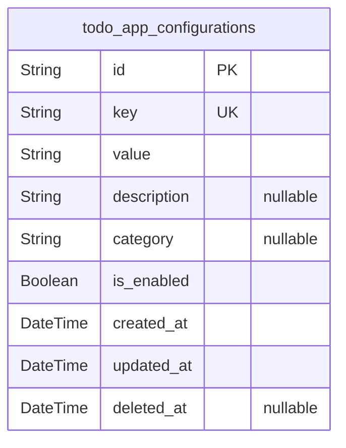
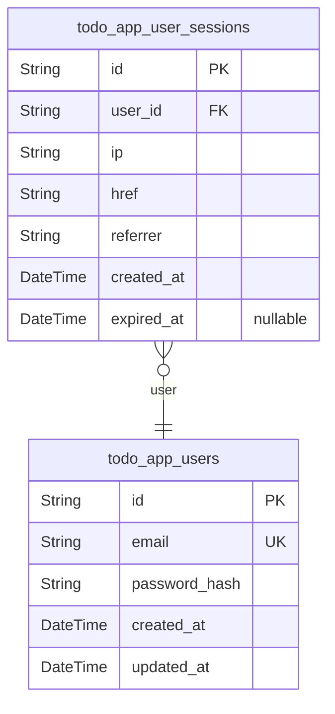
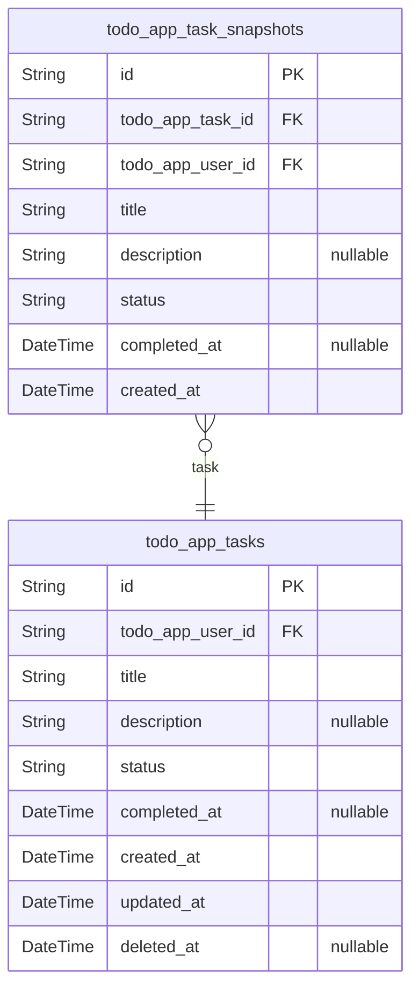

# Prisma Markdown

> Generated by [`prisma-markdown`](https://github.com/samchon/prisma-markdown)

- [Systematic](#systematic)
- [Actors](#actors)
- [Tasks](#tasks)

## Systematic

### `todo_app_configurations`

System-wide application configuration settings.

Stores key-value pairs for application-wide settings that control system
behavior, features, and operational parameters. These configurations
affect all users and are typically managed by system administrators
rather than individual users.

Configurations include settings like maximum task limits, session
timeouts, feature flags, and other system-level parameters that maintain
consistent application behavior across all user interactions. Each
configuration entry maintains a unique key with flexible value storage
for different data types.

Properties as follows:

- `id`: Primary Key
- `key`
  > Unique configuration key identifier used for lookups and type safety
  > validation
- `value`
  > Configuration value stored as string with flexible parsing for different
  > data types
- `description`
  > Human-readable description explaining the configuration's purpose and
  > usage
- `category`
  > Configuration category grouping for organization and administrative
  > management
- `is_enabled`: Whether this configuration is currently active and enforced by the system
- `created_at`: Timestamp when the configuration was initially created
- `updated_at`: Timestamp when the configuration was last modified
- `deleted_at`: Soft deletion timestamp for configuration history

## Actors

### `todo_app_users`

User accounts for authentication and task ownership.

Each user has their own private todo list and can only access tasks they
created. The user entity serves as the primary actor for task management
operations across the application.

Properties as follows:

- `id`: Primary Key.
- `email`
  > User email address used for authentication. Must be unique across all
  > users and follows RFC 5322 format.
- `password_hash`
  > Hashed password for secure authentication. Meets security requirements of
  > minimum 8 characters with letters and numbers.
- `created_at`: Timestamp when the user account was created.
- `updated_at`: Timestamp when the user account was last modified.

### `todo_app_user_sessions`

User session management for authentication tracking.

Sessions enable secure user authentication across multiple devices while
maintaining audit trails of login activity.

Properties as follows:

- `id`: Primary Key.
- `user_id`
  > Reference to the user account this session belongs to. {@link
  > todo_app_users.id}
- `ip`: IP address of the user's connection for security tracking.
- `href`: Connection URL where the session was established.
- `referrer`: Referrer URL that directed to the session creation.
- `created_at`: Timestamp when the session was created.
- `expired_at`
  > Timestamp when the session expires. Null if the session is currently
  > active.

## Tasks

### `todo_app_tasks`

Core todo task entity representing individual items in a user's personal
task list.

Tasks are the fundamental business entity of the todo application,
enabling users to capture, track, and complete their daily
responsibilities. Each task belongs exclusively to one user and maintains
privacy through strict ownership rules.

Tasks support a simple lifecycle: creation, modification, completion, and
deletion. The completion status provides immediate visual feedback about
progress, while creation timestamps enable chronological organization.

Soft deletion allows users to remove tasks while preserving audit trails
for data integrity. The task title captures the essential description of
the responsibility, supporting up to 200 characters for detailed task
descriptions.

Properties as follows:

- `id`: Primary Key.
- `todo_app_user_id`
  > Task owner's [todo_app_users.id](#todo_app_users). Each task belongs to exactly one
  > authenticated user.
- `title`
  > Task title describing the responsibility or action needed. Limited to 200
  > characters for concise descriptions.
- `description`
  > Optional detailed description providing additional context or notes about
  > the task. Supports longer form content.
- `status`
  > Current task completion status. Values: 'pending' for incomplete tasks,
  > 'complete' for finished tasks.
- `completed_at`: Timestamp when the task was marked as complete. Null for pending tasks.
- `created_at`: Task creation timestamp. Records when the user first created this task.
- `updated_at`: Last modification timestamp. Updates whenever task properties change.
- `deleted_at`
  > Soft deletion timestamp. Records when task was deleted while preserving
  > historical data.

### `todo_app_task_snapshots`

Historical snapshots of todo tasks capturing point-in-time states for
audit trails and change tracking.

Task snapshots preserve the complete state of tasks at specific moments,
enabling users to track modification history and maintain audit trails
for personal organization accountability. Each snapshot captures an
immutable record of task properties including title, description, status,
and completion details.

The snapshot pattern is essential for maintaining data integrity when
users modify existing tasks, providing historical context that might be
needed for personal productivity analysis, accountability tracking, or
recovering from accidental changes.

Snapshots are created automatically when tasks are modified, forming an
append-only historical record that supports long-term productivity
insights and ensures users can understand how their task organization
evolved over time.

Properties as follows:

- `id`: Primary Key.
- `todo_app_task_id`
  > Reference to the original task's [todo_app_tasks.id](#todo_app_tasks). Links
  > snapshot to source task.
- `todo_app_user_id`
  > Snapshot owner's [todo_app_users.id](#todo_app_users). Maintains ownership tracking
  > for historical records.
- `title`
  > Task title at the time of snapshot. Preserves exact wording during this
  > historical moment.
- `description`
  > Task description at the time of snapshot. Maintains additional context if
  > present.
- `status`
  > Task status at snapshot time. Records completion state during this
  > historical moment.
- `completed_at`
  > Completion timestamp at snapshot time. Records when task was completed if
  > applicable.
- `created_at`
  > Snapshot creation timestamp. Records when this historical snapshot was
  > captured.
