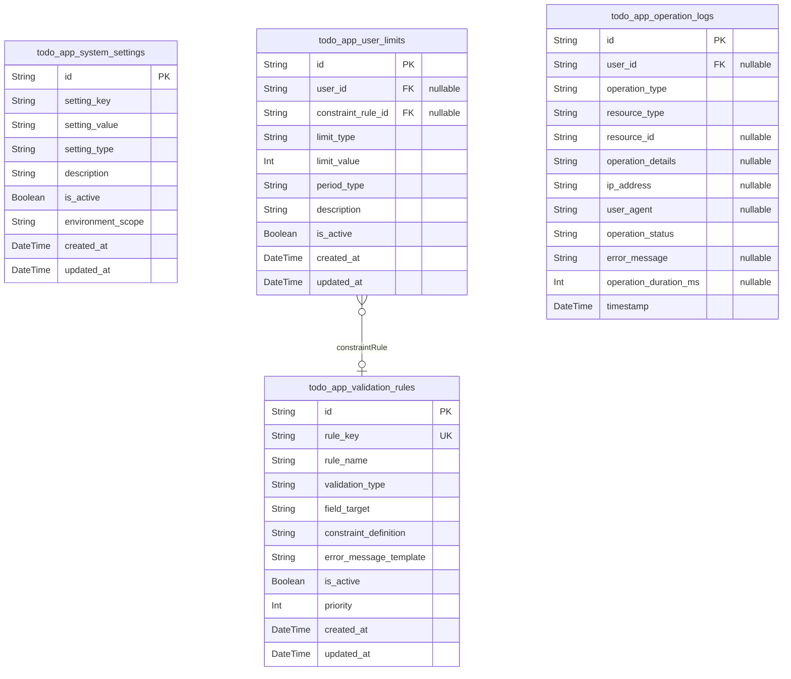
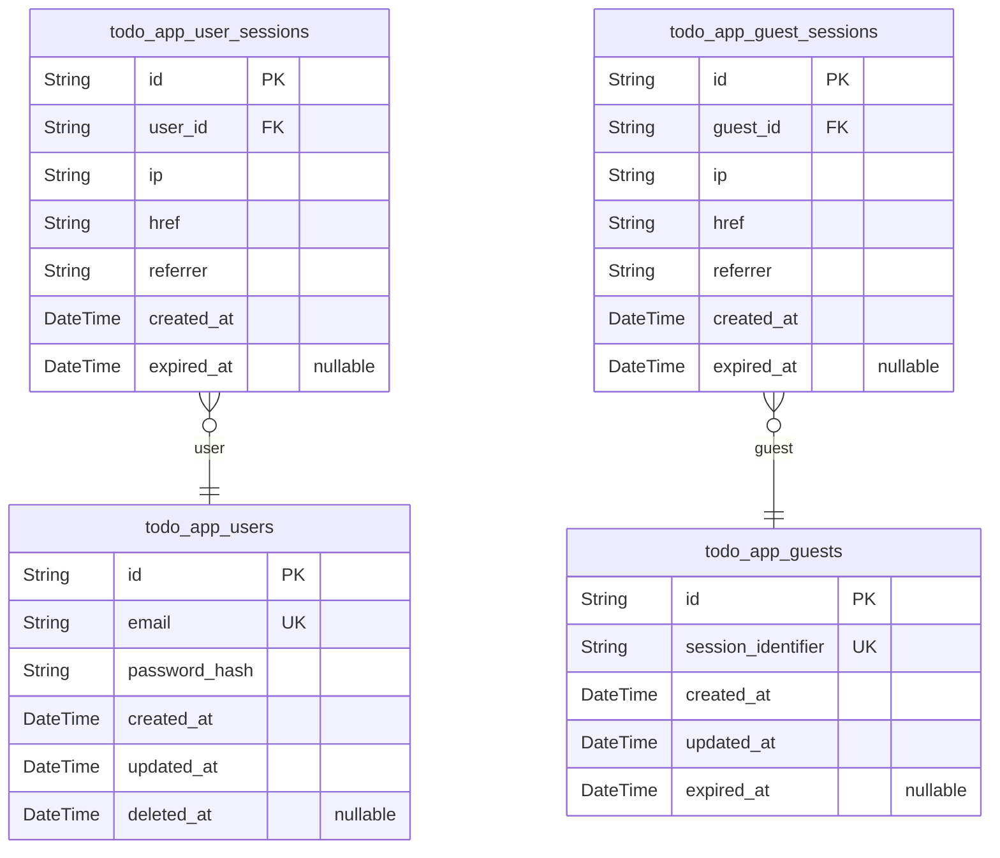
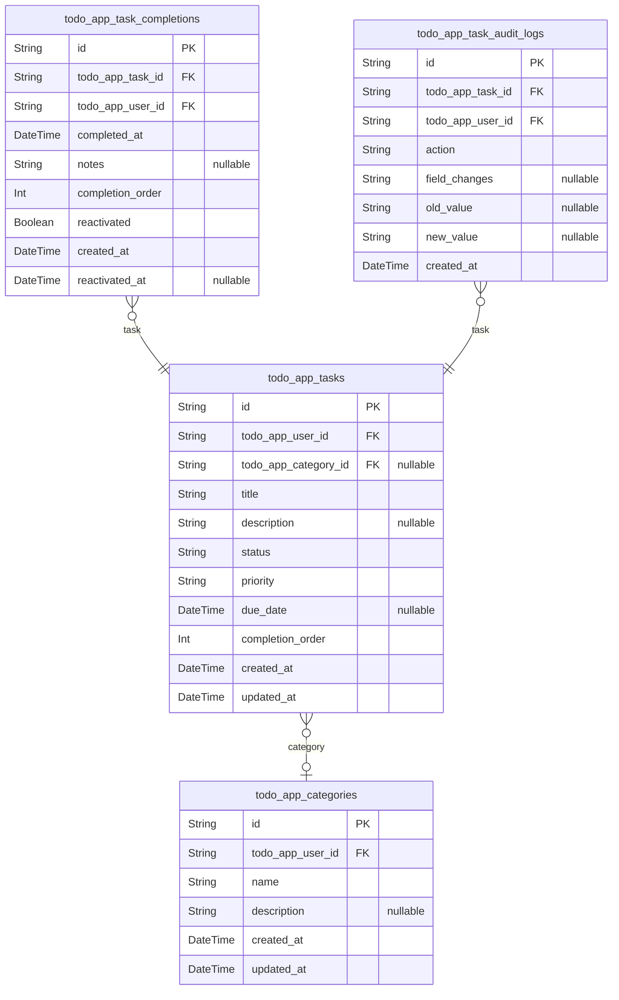
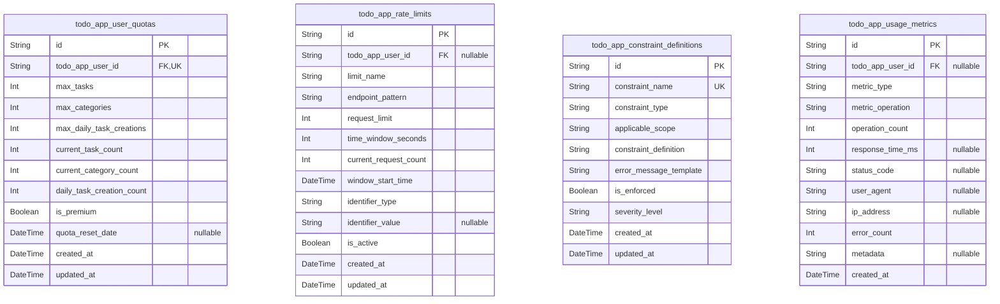

# Prisma Markdown

> Generated by [`prisma-markdown`](https://github.com/samchon/prisma-markdown)

- [Systematic](#systematic)
- [Actors](#actors)
- [Tasks](#tasks)
- [BusinessRules](#businessrules)

## Systematic

### `todo_app_system_settings`

System configuration and application-wide settings that govern the
baseline behavior and operational parameters of the todo application.

This table stores critical application settings including rate limits,
feature toggles, maintenance modes, and global configuration options.
Settings are typically managed by system administrators and referenced by
application logic to enforce constraints and control application
behavior.

The configuration is designed to be flexible and scalable, supporting
different deployment environments and operational requirements without
requiring code changes. Settings include both technical parameters and
business rule definitions that control the user experience across the
entire application.

Properties as follows:

- `id`: Primary Key.
- `setting_key`
  > Unique identifier for the configuration setting. Used as a reference key
  > in application code to retrieve specific configuration values.
- `setting_value`
  > The actual configuration value for this setting. Can store various data
  > types as serialized strings including numbers, JSON objects, or simple
  > text.
- `setting_type`
  > Data type classification for this setting (e.g., 'string', 'number',
  > 'boolean', 'json'). Used by the application to properly parse and
  > validate setting values.
- `description`
  > Human-readable description explaining the purpose and usage of this
  > configuration setting. Helps administrators understand what each setting
  > controls.
- `is_active`
  > Whether this configuration setting is currently active and should be
  > considered by the application. Allows for soft-disabling without
  > deletion. Default: true.
- `environment_scope`
  > Deployment environment where this setting applies (e.g., 'development',
  > 'staging', 'production'). Supports different configs per environment.
- `created_at`
  > Timestamp when this configuration setting was created. Used for audit
  > purposes and change tracking.
- `updated_at`
  > Timestamp when this configuration setting was last modified. Tracks
  > configuration changes over time.

### `todo_app_validation_rules`

Validation rules and constraints that enforce data quality and business
logic across the todo application.

This table defines the validation criteria for various data inputs
including field length limits, format requirements, and business rule
constraints. Validation rules are referenced by application logic to
ensure data integrity and provide consistent error messages to users.

Rules include format validation for emails, data type checks, range
constraints, and custom business logic validations that apply
system-wide. The flexible rule definition system allows for easy updates
and additions as business requirements evolve.

Properties as follows:

- `id`: Primary Key.
- `rule_key`
  > Unique identifier for this validation rule. Used as a reference key in
  > application logic to apply specific validation criteria.
- `rule_name`
  > Human-readable name for this validation rule. Used for administrative
  > interfaces and error message generation.
- `validation_type`
  > Type of validation rule (e.g., 'length', 'format', 'range', 'custom').
  > Determines how the rule is applied during validation.
- `field_target`
  > Target field or data type this rule applies to (e.g., 'task.title',
  > 'user.email', 'category.name'). Specifies what the rule validates.
- `constraint_definition`
  > JSON definition of the validation constraints including min/max values,
  > patterns, or custom logic. Defines the actual validation criteria.
- `error_message_template`
  > Template for error messages when this rule fails validation. Supports
  > placeholders for field names and constraint values.
- `is_active`
  > Whether this validation rule is currently enforced. Allows disabling
  > rules without deletion for maintenance or temporary issues. Default:
  > true.
- `priority`
  > Priority order for rule application when multiple rules apply to the same
  > field. Lower numbers have higher priority (executed first).
- `created_at`
  > Timestamp when this validation rule was created. Tracks when rules were
  > introduced into the system.
- `updated_at`
  > Timestamp when this validation rule was last modified. Tracks changes to
  > validation criteria over time.

### `todo_app_user_limits`

User-specific limits and quotas that control access to system resources
and prevent abuse of the todo application.

This table defines operational limits such as maximum tasks per user,
category creation limits, bulk operation constraints, and API rate
limits. Limits are customizable per user and help ensure fair resource
usage across all users of the application.

The table supports both system-wide defaults and custom limits for
specific users or user groups. Limits can be adjusted based on user
activity patterns, premium features, or administrative decisions to
optimize system performance and user experience.

Properties as follows:

- `id`: Primary Key.
- `user_id`
  > Reference to the user this limit applies to. Null values indicate
  > system-wide default limits.
- `constraint_rule_id`
  > Reference to the validation rule that defines this limit. Links to
  > detailed constraint definitions from validation rules table.
- `limit_type`
  > Type of limit being enforced (e.g., 'task_count', 'category_count',
  > 'bulk_operation_size', 'api_rate'). Defines what resource is being
  > limited.
- `limit_value`
  > The maximum allowed value for this limit (e.g., 1000 for max tasks, 50
  > for max categories). Zero or negative values indicate no limit.
- `period_type`
  > Time period for which this limit applies (e.g., 'lifetime', 'daily',
  > 'weekly', 'monthly'). Determines how limits reset or accumulate.
- `description`
  > Human-readable description explaining the purpose and implications of
  > this user limit. Helps with administrative decisions and user
  > communication.
- `is_active`
  > Whether this user limit is currently enforced. Allows for temporary
  > relaxation or permanent removal of limits without data deletion. Default:
  > true.
- `created_at`
  > Timestamp when this user limit was created or customized for this user.
  > Tracks when limits were established.
- `updated_at`
  > Timestamp when this user limit was last modified. Tracks changes to
  > user-specific limits over time.

### `todo_app_operation_logs`

Operational audit log tracking system events, user actions, and
administrative activities for compliance and troubleshooting purposes.

This table records detailed information about various operations
including task creation, modification, and deletion events, system
configuration changes, and administrative actions. Logs support system
monitoring, usage analytics, and troubleshooting capabilities.

The audit trail includes comprehensive event details, user attribution,
timing information, and outcome status. Logs are designed for analytical
purposes and may be archived or rotated based on retention policies to
manage storage requirements while maintaining necessary audit trails.

Properties as follows:

- `id`: Primary Key.
- `user_id`
  > Reference to the user who initiated this operation. Null for
  > system-initiated events or operations by guest users.
- `operation_type`
  > Type of operation being logged (e.g., 'task.create', 'task.update',
  > 'system.config_change', 'admin.user_management'). Categorizes events for
  > filtering and analysis.
- `resource_type`
  > Type of resource affected by this operation (e.g., 'task', 'category',
  > 'user', 'system'). Links operations to application entities.
- `resource_id`
  > Identifier of the specific resource affected by this operation. May
  > reference tasks, users, or other entities depending on resource_type.
- `operation_details`
  > JSON structure containing detailed operation information including
  > before/after states, parameter values, and operation-specific data.
  > Supports comprehensive audit trails.
- `ip_address`
  > IP address from which the operation was initiated. Used for location
  > analysis and security monitoring. Stored as string to support IPv6.
- `user_agent`
  > Browser or client user agent string providing device and software
  > information. Useful for analytics and troubleshooting.
- `operation_status`
  > Outcome of the operation (e.g., 'success', 'failure', 'partial_success').
  > Tracks whether operations completed successfully.
- `error_message`
  > Error details if the operation failed. Stores specific failure
  > information for debugging and analysis purposes.
- `operation_duration_ms`
  > Time taken to complete the operation in milliseconds. Useful for
  > performance monitoring and optimization analysis.
- `timestamp`
  > When this operation was performed. Represents the precise time of the
  > logged event.

## Actors

### `todo_app_users`

Authenticated users of the todo application with full access to create
and manage personal tasks.

This table represents registered users who have completed the email
verification process and maintain active accounts within the system.
Users receive unique identifiers, store hashed passwords for
authentication, and can access all core todo functionality including task
creation, organization, and completion tracking.

The table stores essential user credentials including encrypted password
hashes, ensuring security while maintaining usability. Each user account
is independent and maintains strict data isolation preventing cross-user
access or visibility of personal tasks and organizational preferences.

Properties as follows:

- `id`: Primary Key.
- `email`
  > User email address used for account authentication and communication.
  > Must be unique across all registered users and follow standard email
  > format validation.
- `password_hash`
  > Securely hashed password for user authentication. Always stores encrypted
  > hash rather than plain text, meeting modern security standards for
  > credential protection.
- `created_at`
  > Timestamp when user account was created, recorded automatically during
  > registration process for audit trail and account management purposes.
- `updated_at`
  > Timestamp of last user account modification, updated automatically when
  > profile information changes for change tracking and audit purposes.
- `deleted_at`
  > Soft delete timestamp for account deactivation. When set, indicates
  > account is inactive and user cannot authenticate, but data is preserved
  > for recovery or compliance purposes.

### `todo_app_user_sessions`

Authenticated user sessions tracking login activity and connection
metadata for security and audit purposes.

Sessions represent individual authenticated access instances for
registered users, storing connection details like IP addresses, browser
information, and authentication timestamps for security monitoring and
session management.

This table maintains security audit trails enabling users to view active
sessions, detect potential unauthorized access, and manage their
authentication state across multiple devices or browsers. Sessions
persist according to user preferences with appropriate expiration
mechanisms.

Properties as follows:

- `id`: Primary Key.
- `user_id`
  > Reference to the authenticated user's [todo_app_users.id](#todo_app_users). Links
  > session to specific user account for authentication tracking.
- `ip`
  > IP address from which the user connected, stored for security monitoring
  > and session tracking to detect potential unauthorized access attempts.
- `href`
  > Connection URL or current page location when session was created, helps
  > track user journey and session context for security and debugging
  > purposes.
- `referrer`
  > Referrer URL indicating how user arrived at the application, useful for
  > understanding user flow and session origination for security and
  > analytics.
- `created_at`
  > Session creation timestamp when user successfully authenticated, recorded
  > automatically during login process for session duration tracking.
- `expired_at`
  > Session expiration timestamp when authentication expires according to
  > user preferences. Controls access duration and security timeout behavior.

### `todo_app_guests`

Guest users providing temporary access to explore application features
without full registration commitment.

Guest accounts enable prospective users to experience core functionality
through demonstration content and basic feature exploration while
maintaining clear differentiation from full registered user experiences.

The table provides seamless upgrade pathways when guests decide to
register, supporting data preservation and account conversion workflows
through unified session management patterns.

Properties as follows:

- `id`: Primary Key.
- `session_identifier`
  > Unique identifier for guest session tracking, generated automatically for
  > session management and upgrade tracking when guests transition to
  > registered users.
- `created_at`
  > Timestamp when guest session was initiated, recorded for session duration
  > tracking and analysis of guest engagement patterns.
- `updated_at`
  > Last modification timestamp for guest session updates, tracked for
  > session management and data export purposes.
- `expired_at`
  > Guest session expiration timestamp controlling temporary access duration.
  > Prevents indefinite guest usage and maintains resource management.

### `todo_app_guest_sessions`

Guest user sessions maintaining temporary access tracking and connection
metadata for provisional user experiences.

Sessions enable guest users to explore demonstrations and temporary
features while collecting audit trails and security information for
system monitoring and potential conversion tracking.

This table supports clean session termination when temporary access
expires and maintains security standards appropriate for provisional user
management while enabling upgrade workflows to full registered accounts.

Properties as follows:

- `id`: Primary Key.
- `guest_id`
  > Reference to the guest user's [todo_app_guests.id](#todo_app_guests). Links session
  > to specific guest account for access tracking.
- `ip`
  > IP address from which guest connected, collected for security monitoring
  > and session tracking in temporary user experiences.
- `href`
  > Connection URL or page location during guest session creation, helps
  > understand guest engagement patterns and session contexts.
- `referrer`
  > Referrer URL showing how guest arrived at application, useful for
  > analyzing guest acquisition sources and session origins.
- `created_at`
  > Session creation timestamp when guest access began, recorded for
  > temporary session duration management and usage tracking.
- `expired_at`
  > Guest session expiration timestamp controlling temporary access duration
  > and resource cleanup according to guest policies.

## Tasks

### `todo_app_tasks`

Core task entity representing individual todo items managed by users.

Tasks form the fundamental units of work in the todo application,
containing essential information needed for task completion tracking and
organization. Each task belongs to a specific user and can be associated
with categories and completion records.

The task lifecycle includes states: pending (default), in-progress, and
completed. Tasks support prioritization through Low, Medium, and High
levels, with Low as the default priority to minimize decision friction.
Users can add optional due dates and belong to categories for
organization.

Task creation emphasizes minimal required information - only a title is
mandatory - with optional fields for descriptions, due dates, priorities,
and categories. This design supports rapid task capture while providing
flexibility for detailed planning when desired.

Properties as follows:

- `id`: Primary Key.
- `todo_app_user_id`: Task creator's [todo_app_users.id](#todo_app_users)
- `todo_app_category_id`
  > Task's [todo_app_categories.id](#todo_app_categories). Links tasks to categories for
  > organization
- `title`
  > Task title between 1-200 characters. The essential task description
  > required for creation.
- `description`
  > Optional task description up to 2,000 characters providing additional
  > context or instructions
- `status`: Task lifecycle status: pending (default), in-progress, or completed
- `priority`
  > Task priority level: Low (default), Medium, or High used for sorting and
  > visual distinction
- `due_date`
  > Optional due date for task completion. Validates to prevent past dates
  > and limits to 1 year in future
- `completion_order`
  > Manual sort order for task positioning within user's preferred
  > organization
- `created_at`: Task creation timestamp
- `updated_at`: Last modification timestamp

### `todo_app_categories`

User-defined organizational categories for grouping related tasks.

Categories provide a hierarchical organization system enabling users to
group tasks by project, context, or any classification scheme they
choose. Each category belongs to a specific user and contains any number
of associated tasks.

Category names must be unique within user accounts and conform to
character restrictions to ensure system compatibility. The system limits
users to 50 categories maximum to prevent over-complexity while providing
sufficient organizational flexibility.

Categories support flexible organization patterns including work/personal
divisions, project-based groupings, or contextual organization schemes.
Users can filter tasks by category and perform bulk operations on all
tasks within a category.

Properties as follows:

- `id`: Primary Key.
- `todo_app_user_id`: Category creator's [todo_app_users.id](#todo_app_users)
- `name`
  > Category name between 2-50 characters using only letters, numbers,
  > spaces, and hyphens
- `description`
  > Optional category description providing context about the category's
  > purpose
- `created_at`: Category creation timestamp
- `updated_at`: Last modification timestamp

### `todo_app_task_completions`

Record of task completion events capturing when tasks are marked complete.

This table tracks the completion lifecycle of tasks, providing
accountability and enabling completion statistics calculation. Each
completion record represents a unique completion event with timestamps
and optional completion notes.

The system supports task reopening by maintaining completion history even
when tasks are later reactivated. This allows for productivity analytics
including completion rates, time-to-completion, and streak tracking.

Completion records are created when tasks transition to completed status
and maintain references back to the original task. Users can add
completion notes to document how tasks were accomplished or any relevant
outcomes.

Properties as follows:

- `id`: Primary Key.
- `todo_app_task_id`: Reference to [todo_app_tasks.id](#todo_app_tasks) for the completed task
- `todo_app_user_id`: Reference to [todo_app_users.id](#todo_app_users) of the user who completed the task
- `completed_at`: Timestamp when the task was marked complete
- `notes`: Optional notes explaining how the task was completed or any outcomes
- `completion_order`: Order of completion for sorting purposes within user's completion history
- `reactivated`: Flag indicating if this completion was followed by task reactivation
- `created_at`: Completion record creation timestamp
- `reactivated_at`: Timestamp when task was subsequently reactivated if applicable

### `todo_app_task_audit_logs`

Historical audit trail capturing all modifications to tasks for
accountability and recovery.

This table serves as the complete change log for all task operations
including creation, updates, completion, category changes, and other
modifications. Each entry represents a specific action performed on a
task with detailed change tracking.

Audit logs support compliance requirements, provide change history for
user reference, and enable system administrators to monitor task
lifecycle patterns for improvements. The snapshot approach ensures
historical data integrity even as tasks are modified or deleted.

Every task modification creates a new audit log entry capturing the
before-and-after state information. This design supports comprehensive
change tracking while maintaining optimal performance for current task
operations by separating historical data.

Properties as follows:

- `id`: Primary Key.
- `todo_app_task_id`: Reference to [todo_app_tasks.id](#todo_app_tasks) being audited
- `todo_app_user_id`: Reference to [todo_app_users.id](#todo_app_users) who performed the action
- `action`
  > Type of action performed: CREATE, UPDATE, DELETE, COMPLETE, REACTIVATE,
  > MOVE, etc.
- `field_changes`: JSON representation of field changes made during this action
- `old_value`: Previous value for fields that changed (for single-field changes)
- `new_value`: New value for fields that changed (for single-field changes)
- `created_at`: Audit log entry timestamp when the action occurred

## BusinessRules

### `todo_app_user_quotas`

Individual user quota limits and usage tracking for business rule
enforcement.

Tracks each user's consumption against predefined limits like maximum
tasks (1000), categories (100), and other resource allocations. Supports
both hard limits that prevent further usage and soft limits that trigger
warnings.

The quota system prevents system abuse while providing fair resource
allocation across all users. Usage metrics are updated atomically to
ensure accuracy during high-concurrency scenarios.

Quotas can be configured per user to provide premium features or
accommodate special requirements while maintaining system integrity.

Properties as follows:

- `id`: Primary Key.
- `todo_app_user_id`: User who owns these quota limits. [todo_app_users.id](#todo_app_users)
- `max_tasks`
  > Maximum number of tasks allowed for this user. Default 1000 for standard
  > users.
- `max_categories`
  > Maximum number of custom categories allowed. Default 100 for standard
  > users.
- `max_daily_task_creations`: Maximum tasks that can be created per day. Default 30 to prevent spam.
- `current_task_count`
  > Current number of tasks this user has created. Updated atomically on task
  > operations.
- `current_category_count`: Current number of categories created by this user.
- `daily_task_creation_count`: Number of tasks created today by this user. Resets at midnight.
- `is_premium`
  > Whether this user has premium quota allowances. Premium users get higher
  > limits.
- `quota_reset_date`: Date when daily quotas will reset. Used for tracking daily limits.
- `created_at`: When these quota settings were established.
- `updated_at`: Last modification time for any quota setting.

### `todo_app_rate_limits`

System-wide rate limiting configuration and enforcement tracking.

Manages rate limit rules for different API endpoints and user actions.
Tracks both global rate limits (per IP, per endpoint) and user-specific
limits to prevent abuse and ensure fair usage.

The rate limiting system implements sliding window counters with
automatic reset mechanisms. Different endpoints can have different rate
limits based on their resource consumption and frequency patterns.

Supports both authenticated user limits and anonymous IP-based
restrictions to protect the system from various attack vectors while
maintaining legitimate user access.

Properties as follows:

- `id`: Primary Key.
- `todo_app_user_id`
  > Optional user associated with this rate limit. Null for global or
  > IP-based limits. [todo_app_users.id](#todo_app_users)
- `limit_name`
  > Descriptive name for this rate limit rule. Examples: 'task_creation',
  > 'user_registration', 'guest_access'.
- `endpoint_pattern`
  > API endpoint pattern this limit applies to. Supports wildcards for
  > pattern matching.
- `request_limit`: Maximum number of requests allowed within the time window.
- `time_window_seconds`
  > Time window in seconds for the rate limit. Common values: 60, 300, 3600,
  > 86400.
- `current_request_count`
  > Current request count within the active time window. Resets automatically
  > when window expires.
- `window_start_time`
  > Start time of the current rate limit window. Used for sliding window
  > calculations.
- `identifier_type`
  > Type of identifier for this rate limit. Values: 'user_id', 'ip_address',
  > 'global'.
- `identifier_value`: The actual identifier value. Could be user ID, IP address, or 'global'.
- `is_active`: Whether this rate limit rule is currently active and being enforced.
- `created_at`: When this rate limit rule was created.
- `updated_at`: Last modification time for this rate limit rule.

### `todo_app_constraint_definitions`

Business rule and validation constraint definitions for the todo
application.

Stores the specification for all business rules including data
validation, format requirements, computational limits, and operational
constraints applied throughout the system.

Each constraint definition includes validation logic, error messages,
enforcement mechanisms, and applicability scope. Constraints can be
global (system-wide) or contextual (applied based on conditions).

This centralized constraint management enables business rules to be
modified without code changes while maintaining consistency across all
system operations.

Properties as follows:

- `id`: Primary Key.
- `constraint_name`
  > Unique name for this business rule constraint. Used for referencing in
  > code and logs.
- `constraint_type`
  > Type of constraint. Values: 'validation', 'limit', 'format',
  > 'business_rule'.
- `applicable_scope`
  > Where this constraint applies. Values: 'global', 'user', 'guest',
  > 'task_creation', 'authentication'.
- `constraint_definition`
  > JSON or structured definition of the constraint rule. Stores validation
  > logic, format patterns, or business rule specifications.
- `error_message_template`
  > Template for error messages when this constraint is violated. Can include
  > placeholders for context-specific information.
- `is_enforced`
  > Whether this constraint is currently being enforced. Allows soft
  > disabling of rules without deletion.
- `severity_level`
  > Severity when violated. Values: 'error' (blocks operation), 'warning'
  > (allows with notification).
- `created_at`: When this constraint definition was created.
- `updated_at`: Last modification time for this constraint definition.

### `todo_app_usage_metrics`

System usage metrics and analytics data for monitoring and business
intelligence.

Captures operational data about API usage, task operations,
authentication events, and system performance. This data drives rate
limiting decisions, quota enforcement, and system optimization.

Usage metrics are collected asynchronously to minimize performance impact
while providing comprehensive visibility into system operation patterns.
Data supports both real-time monitoring and historical analysis.

Metrics enable proactive system management by identifying usage patterns,
potential abuse scenarios, and areas requiring capacity planning or
optimization.

Properties as follows:

- `id`: Primary Key.
- `todo_app_user_id`
  > User associated with this metric. Null for global or guest metrics.
  > [todo_app_users.id](#todo_app_users)
- `metric_type`
  > Type of metric being recorded. Examples: 'api_request', 'task_operation',
  > 'authentication_event'.
- `metric_operation`
  > Specific operation or endpoint. Examples: 'task_create', 'login_attempt',
  > 'search_query'.
- `operation_count`
  > Number of operations captured in this metric record. Used for batching
  > operations to minimize volume.
- `response_time_ms`: Average response time in milliseconds for captured operations.
- `status_code`: HTTP status code or operation result for captured requests.
- `user_agent`: User agent string for web requests. Used for analytics and debugging.
- `ip_address`: Client IP address, anonymized for privacy compliance.
- `error_count`: Number of errors encountered in captured operations.
- `metadata`: JSON metadata containing additional context relevant to the metric.
- `created_at`: When this usage metric was recorded.
