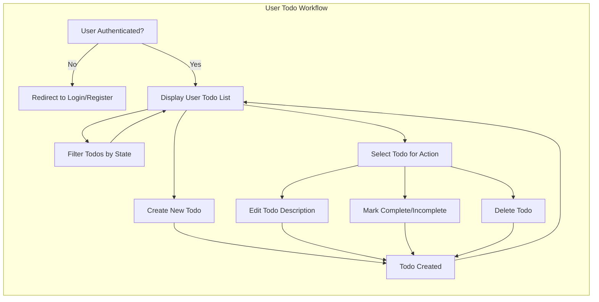
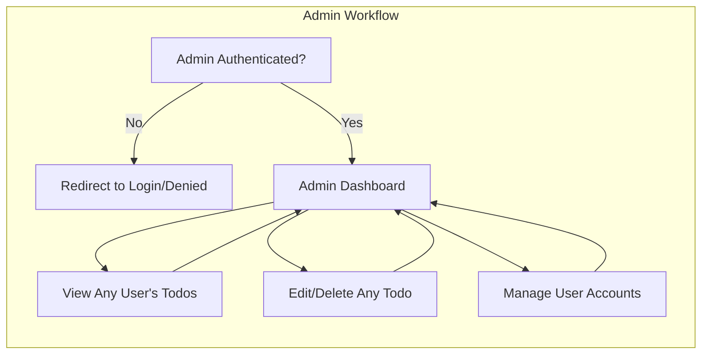

# Functional Requirements for Todo List Service

## 1. Introduction

The Todo List service ("todoList") is a minimalistic application designed for recording, organizing, and managing personal tasks ("todos") as well as enabling essential administrative oversight. The backend must support all business rules and user flows required for end-to-end todo management. This specification outlines functional requirements using EARS format and covers standard use, error, administrative, and compliance scenarios. All requirements are actionable, measurable, and fully implementable by software engineers.

### 1.1 Scope and Objective

The goal is to enable users to manage their own todo items—create, read, update, delete, and mark as completed or incomplete—while maintaining strict authentication and permissioning. Administrative features are included solely for service maintenance and troubleshooting. Any functionality or rule not explicitly required for minimal viable operations is excluded.

## 2. Functional Requirement List

| ID   | EARS Requirement                                                                                  |
|------|--------------------------------------------------------------------------------------------------|
| FR1  | THE service SHALL allow a user to register, log in, and authenticate via secure API.              |
| FR2  | WHEN a registered user is authenticated, THE service SHALL allow the user to create a todo.       |
| FR3  | WHEN a user creates a todo, THE service SHALL store the todo with a description and state.        |
| FR4  | THE service SHALL allow a user to view all their todos.                                           |
| FR5  | WHEN a user views their todos, THE service SHALL return a list of their current todos.            |
| FR6  | THE service SHALL allow a user to edit the description of their own todo.                         |
| FR7  | THE service SHALL allow a user to delete their own todo.                                          |
| FR8  | WHEN a user marks a todo as completed, THE service SHALL update the todo state accordingly.       |
| FR9  | THE service SHALL allow a user to mark a todo as incomplete.                                      |
| FR10 | THE service SHALL allow a user to filter their todos by completion state.                         |
| FR11 | IF a user attempts to access, modify, or delete another user's todo, THEN THE service SHALL deny the action. |
| FR12 | THE service SHALL prevent unauthenticated users from accessing user todos.                        |
| FR13 | THE service SHALL record the creation and last modification timestamp for each todo.              |
| FR14 | THE service SHALL limit each todo description to 255 characters.                                  |
| FR15 | THE service SHALL allow an admin to view, edit, or delete any user's todo.                        |
| FR16 | THE service SHALL allow an admin to view and manage all user accounts.                            |
| FR17 | THE service SHALL allow a user to log out and end their session.                                  |

All requirements above are mandatory and must be implemented as described without deviation.

## 3. Feature Descriptions

### 3.1 User Registration and Authentication
- Users SHALL register with a unique email and password for secure identification.
- WHEN a user logs in, THE service SHALL authenticate credentials and establish a user session through API.
- WHEN a user is logged out (voluntarily or by session expiry), THEN all further access to user or admin endpoints SHALL require login.

### 3.2 Todo Ownership and Basic Task Management
- Authenticated users SHALL create todos, each with a required text description (max 255 characters).
- Each todo owned by a user SHALL only be visible, modifiable, or removable by that user or an admin.
- Todos SHALL default to "incomplete" state; users may toggle between completed and incomplete at any time while authenticated.
- WHEN listing todos, THE service SHALL support filtering by all, completed, or incomplete status.
- Each todo SHALL feature an immutable creation timestamp and an updatable last modified timestamp, both following ISO 8601.

### 3.3 Admin Features
- Admins SHALL have authority to view, edit, and delete any user's todos as needed for operational support.
- Admins SHALL access a dashboard providing overview of all users and their todos (with filtering by user optional).
- Admins SHALL manage user accounts: view details, disable accounts, or delete users entirely.
- Admin-related actions SHALL be fully auditable in compliance logs.
- Admins SHALL not be allowed to create personal todos for themselves; their role is restricted to oversight and support.

### 3.4 Constraints and Validations
- User authentication is a prerequisite for all actions except registration and login.
- Unauthorized access (unauthenticated or lacking permission) SHALL yield denial with a clear, actionable error message.
- Todos with empty, whitespace-only, or oversized descriptions SHALL be rejected and an explicit validation error returned.
- Users SHALL only perform CRUD (create, read, update, delete) on their own todos.
- All timestamps for creation and modification SHALL be automatically set and maintained by the service backend.

## 4. Business Rules and Validation Criteria

### Todo Data Structure
- Every todo SHALL contain a system-generated unique ID, descriptive text (max 255 length), completion state (boolean), creation timestamp, and last modified timestamp.
- Descriptions are mandatory, non-empty, and may not consist of whitespace only.
- Completion state is strictly boolean (complete/incomplete).

### Permission Matrix (Summarized)
| Action                 | User (Authenticated) | Admin                     | Unauthenticated |
|------------------------|---------------------|---------------------------|-----------------|
| Register/Login/Logout  | ✅                  | ✅                        | ✅              |
| Create Todo            | ✅                  | 🚫                        | 🚫              |
| View Own Todos         | ✅                  | 🚫 (N/A)                  | 🚫              |
| View Any Todo          | 🚫                  | ✅                        | 🚫              |
| Edit Own Todo          | ✅                  | 🚫 (N/A)                  | 🚫              |
| Edit Any Todo          | 🚫                  | ✅                        | 🚫              |
| Delete Own Todo        | ✅                  | 🚫 (N/A)                  | 🚫              |
| Delete Any Todo        | 🚫                  | ✅                        | 🚫              |
| Manage Users           | 🚫                  | ✅                        | 🚫              |

### Ownership Enforcement
- Users SHALL never be able to view, edit, or delete todos belonging to other users.
- Admins SHALL have full access for oversight, but may not create their own todos.

### Input Constraints
- Descriptions exceeding 255 characters, or inputs with only whitespace, SHALL be invalid and rejected.
- Each user action (other than registration/login) REQUIRES a valid, authenticated session.

### Auditing and Compliance
- All admin access and actions affecting user or todo data SHALL be logged for audit and compliance purposes.
- Service SHALL maintain immutable audit trails for all destructive or privilege-elevated operations.

## 5. Success Metrics & Service Validation
- Users can reliably and consistently create, view, update, and delete only their own todos, with all edge cases and business rules enforced.
- Unauthorized or invalid actions generate immediate and clear denial or error feedback, with no data leakage or corruption.
- Admins have complete oversight and management power over todos and users, solely for service support.
- Standard user operations (CRUD) SHALL complete within 2 seconds in normal load.
- Service SHALL demonstrate at least 99% uptime outside scheduled maintenance.
- All audit logs and administrative actions are available for review, supporting traceability and regulatory demands.

## 6. User and Admin Workflows (Mermaid Diagrams)

### 6.1 User Todo Management Workflow

### 6.2 Admin Oversight and Management Workflow

## 7. Error and Edge Case Handling

- IF a user requests access to any function while unauthenticated, THEN THE service SHALL return an informative access denied error within 2 seconds.
- IF a user attempts to manipulate todos not owned by them, THEN THE service SHALL return an actionable error and prevent data disclosure or update.
- IF an admin attempts to create their own personal todo, THEN THE service SHALL deny the request and log the event for audit purposes.
- IF user input fails validation (empty/oversized description), THEN THE service SHALL reject the operation, returning precise error feedback, and take no destructive action.
- IF an unexpected server/system error occurs, THEN THE service SHALL respond with a generic message containing a unique error reference for support inquiry.

## 8. Performance and Reliability Expectations

- Every user and admin operation (including authentication, CRUD, account management) SHALL complete within 2 seconds under standard conditions and typical load.
- Service SHALL be available at least 99% of the time, exclusive of maintenance windows.
- In cases of system error, high load, or downtime, THE service SHALL provide clear and actionable feedback to the user and suggest an appropriate retry or support contact avenue.

---

All requirements must be interpreted as mandatory and sustained for the lifetime of the Todo List service. Backend implementers are expected to enforce all business rules herein, without introducing any features or assumptions beyond those explicitly specified. This enhanced requirements document forms the production contract against which system implementation and acceptance testing SHALL be performed.