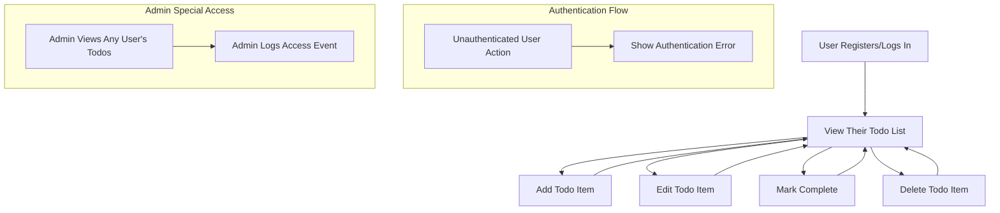

# Todo List Application Requirements Analysis

## 1. Introduction & Scope

The Todo List application provides individual users with a clear, secure, and reliable way to capture, view, update, complete, and delete personal tasks. The scope of this requirements analysis covers only the essential functionality necessary to operate a basic, single-user Todo system with robust privacy, authentication, error handling, and operational guarantees for a production backend. No advanced features (sharing, notifications, analytics, teams) are included.

## 2. Actors and Permissions

**Actors:**
- User: An individual registered with the application authorized to manage only their personal todo items.
- Admin: System staff entrusted to access other users’ todo data solely for urgent maintenance, compliance, or support-related reasons (never for business exploitation or advertising).

**Permissions:**
- WHEN a user is authenticated, THE system SHALL allow them to perform any operation (create, view, update, mark complete, delete) on their own todos only.
- WHEN an unauthenticated request is made, THE system SHALL deny all actions and return an error with a prompt for authentication.
- WHEN an admin logs in, THE system SHALL grant them access to any user’s todos ONLY for authorized support or recovery actions; all such access SHALL be logged with rationale and timestamp.
- THE system SHALL guarantee users cannot access, view, edit, or delete other users’ todos under any circumstance.

## 3. Functional Requirements

### 3.1 Todo Management
- WHEN a user creates a todo item, THE system SHALL persist the new todo and return the updated personal todo list within 1 second.
- WHEN a user edits a todo (title, description, due date, or status), THE system SHALL update the item and reflect changes immediately in their todo list.
- WHEN a user marks a todo as complete, THE system SHALL display the item as completed and visually distinguish it (e.g., by moving to a 'Completed' section or highlighting it).
- WHEN a user deletes a todo, THE system SHALL remove the item from their list and confirm removal within 1 second.
- WHEN a user views their todo list, THE system SHALL fetch all (active + completed) personal todos and display them in a clear, chronological order (default by creation time).
- IF a user attempts to modify or delete a completed todo, THE system SHALL permit this, preserving user control.
- WHEN a user attempts an operation on another user’s todo, THE system SHALL deny the request and return an error (see error handling below).

### 3.2 Authentication
- WHEN a user registers, THE system SHALL require a unique identifier (e.g., email or username) and a password; registration SHALL fail for already-taken identifiers.
- WHEN a user logs in, THE system SHALL authenticate credentials and initiate a session on success.
- WHEN a user logs out, THE system SHALL terminate their session immediately.
- WHEN a user session expires, THE system SHALL require fresh authentication for any further access.
- THE system SHALL never expose any user's credentials or personal data to other users at any time.

### 3.3 Data Privacy & Security
- WHEN a user is authenticated, THE system SHALL isolate all todo data to that user; nothing is ever accessible to others.
- THE system SHALL protect todo data with encryption at rest and in transit (implementation handled downstream).
- WHEN an admin accesses user data, THE system SHALL require extra authentication (e.g., 2FA) and log the activity including reason and affected records.

## 4. Non-Functional Requirements

- THE system SHALL process all user requests (for create, update, delete, view) within 1 second under normal load (defined as 99% of requests for up to 10,000 DAU).
- THE system SHALL maintain 99.9% uptime over a rolling 30-day period, excluding scheduled maintenance with advanced notice.
- THE system SHALL support English language interface (all backend error messages and API responses in English).
- THE system SHALL store todos in a durable, recoverable data store with daily automated backups and restore procedures documented.

## 5. Error Handling & Edge Cases

- IF a user submits malformed or incomplete data when creating or editing a todo, THEN THE system SHALL reject the request and return an actionable validation error describing the missing or invalid field(s).
- IF a user is not authenticated or provides an expired/invalid session token, THEN THE system SHALL deny all access and return an error requiring login.
- IF a requested todo item does not exist (wrong ID) or is already deleted, THEN THE system SHALL return an error indicating the resource is not available.
- IF the system experiences a temporary internal failure during an action, THEN THE system SHALL respond with a clear error and log the event for investigation.
- THE system SHALL provide all error messages in clear, actionable English, never leaking sensitive debug details or system internals.

## 6. Workflows & Diagrams

## 7. Success Metrics & Compliance

- Number of active users (Daily/Monthly Active Users)
- Task completion rates per user
- 7/30/90-day retention rate of users
- 99.9% operational uptime
- Zero unauthorized data access incidents
- Average API response time for all core endpoints < 1 second

## 8. Out of Scope
No support for team collaboration, notifications, analytics, prioritization, or tagging. No recurring tasks. Only the essential todo CRUD and authentication features required for a robust individual productivity tool.
