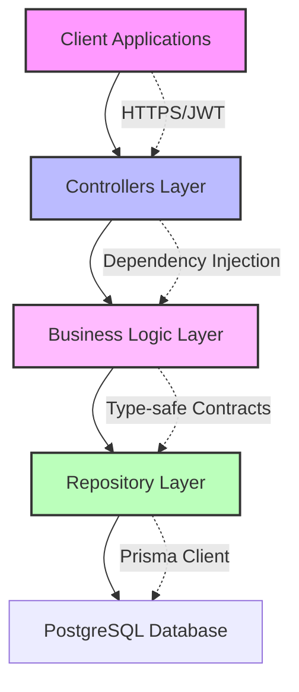
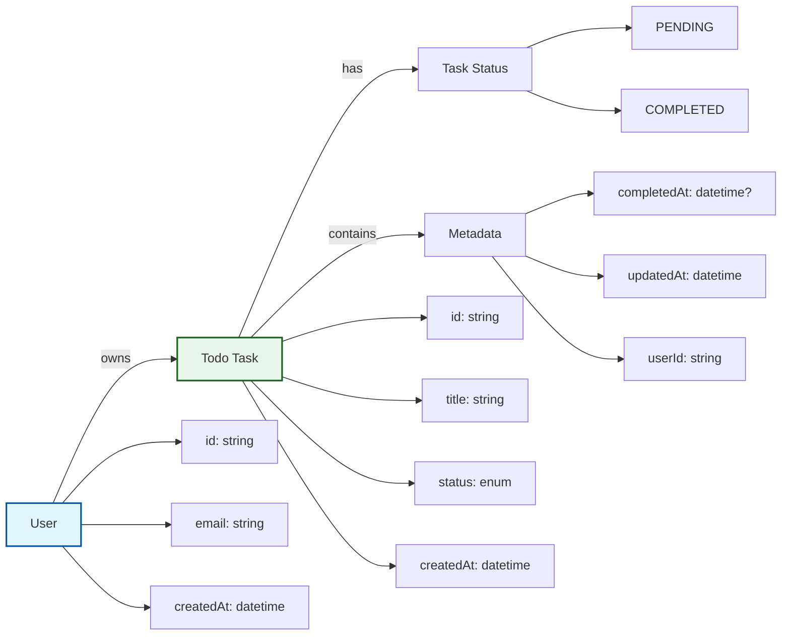
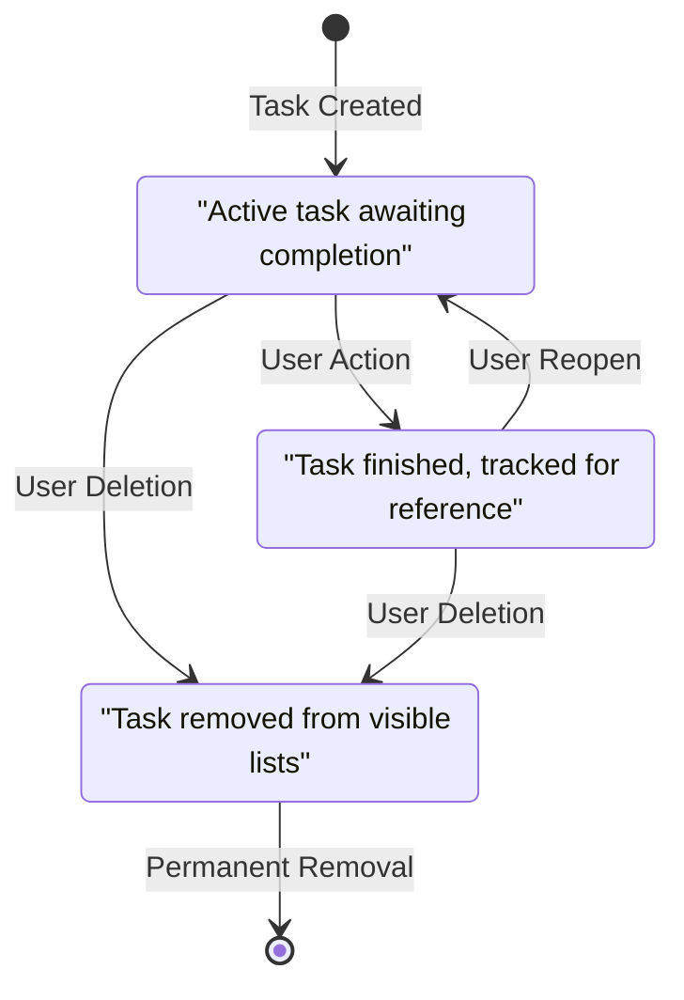

# Todo Application Backend System Design

## Executive Overview

This document presents the backend architecture for a minimal Todo list application designed to provide essential task management functionality without complexity overhead. The system implements core CRUD operations for todo items while maintaining offline capability and clean architecture principles.

**Key Architectural Goals:**
- Transform simple business requirements into production-ready code
- Ensure sub-500ms response times through optimized data access patterns
- Maintain offline-first approach with seamless sync capability
- Implement security-first design protecting user task data

## System Architecture

### Backend Service Structure

The Todo backend service follows a three-layer architecture optimized for the minimal requirements while ensuring maintainability and type safety:



The architecture prioritizes performance through efficient data access patterns, ensures security through proper input validation, and maintains clean separation of concerns with NestJS dependency injection.

## Business Entities and Relationships

### Core Domain Models



The entity model supports all functional requirements including task lifecycle management, user isolation, and completion status tracking while maintaining efficient data access patterns for sub-500ms response times.

## Business Process Workflows

### Task Creation Process

WHEN a user creates a task, THE system SHALL perform the following workflow:

1. Validate the task title contains at least one visible character (not just whitespace)
2. Generate a secure unique identifier using cryptographic randomness
3. Assign the authenticated user as the task owner
4. Set initial status to PENDING
5. Store creation timestamp using the system's timezone
6. Persist immediately to local storage for offline availability
7. Queue for server synchronization if internet connectivity exists
8. Return the created task with its system-assigned identifier within 300 milliseconds

**Validation Requirements:**
- Task title must be between 1-200 characters to prevent abuse while allowing meaningful descriptions
- Cannot contain malicious script injection payloads (XSS protection mandatory)
- Title uniqueness per user is not required (duplicate task names allowed)

### Task Completion Process

WHEN a user marks a task as complete, THE system SHALL perform the following workflow:

1. Verify user authentication and task ownership
2. Validate the task currently exists in PENDING status
3. Update status to COMPLETED with current timestamp
4. Store completion timestamp for analytics and user reference
5. Immediately persist changes to local storage
6. Reorganize display lists to show completed items separately
7. Send completion notification to server if online within 2 seconds
8. Return confirmation to user interface within 200 milliseconds

**Business Logic:** Completed tasks maintain visibility for user reference but appear in a dedicated completion section sorted by completion date (newest first).

### Task Deletion Process

WHEN a user deletes a task, THE system SHALL perform the following workflow:

1. User initiates deletion request for a specific task
2. System presents confirmation dialog requiring explicit user action
3. Upon confirmation, retrieve the task details including status
4. Remove task from the user's task collection
5. Delete associated metadata in the local storage
6. Add deletion record to synchronization queue
7. Return success confirmation to the user interface
8. Update task counts and display lists immediately

**Critical Considerations:** Deletion is permanent with no recovery option. The confirmation requirement prevents accidental data loss while seamless integration with offline sync ensures data consistency.

### Authentication Integration Process

WHEN a user accesses the todo system, THE system SHALL perform the following authentication workflow:

1. Verify presence of valid JWT authentication token
2. If token exists, validate against backend authentication service
3. Extract user identifier from validated token claims
4. Load the user's specific todo data from storage
5. If token is invalid or expired, redirect to authentication flow
6. Upon successful re-authentication, restore any locally stored changes
7. Merge offline changes with server data respecting timestamp preferences
8. Establish secure session with automatic refresh management

**Session Management:** 24-hour active session with optional 7-day "remember me" functionality for trusted devices. Session tokens contain user roles and permissions for authorization decisions.

## Data Management Requirements

### CRUD Operation Specifications

**Create Operations:**
- Accept task title, optional description, and optional priority level
- Generate system identifiers using cryptographically secure UUIDs
- Validate input data against business rules
- Persist to multiple storage layers for reliability
- Return complete task object with generated metadata

**Read Operations:**
- Filter tasks by user ownership and status
- Support pagination for lists exceeding 50 items
- Provide sorting by creation date, completion date, title, or priority
- Include full-text search capability within task titles
- Return metadata including total task counts and completion statistics

**Update Operations:**
- Allow modification of title, description, priority, and status
- Track modification timestamp for conflict resolution
- Validate changes against task dependencies if applicable
- Notify sync service of changes for server propagation
- Maintain audit trail of modifications including original values

**Delete Operations:**
- Require confirmation before permanent removal
- Cascade deletion to related data (completed status, sync records)
- Handle deletion failures gracefully with user feedback
- Set up recovery options for accidental deletion (limited time window)

### Status Management Process

THE system SHALL manage task status through the following states and transitions:



Status transitions maintain data integrity through atomic operations, ensuring users cannot manipulate task states unpredictably. The three-state model provides sufficient flexibility for basic todo functionality without complexity overhead.

## Performance and Scaling Specifications

### Response Time Guarantees

**THE system SHALL achieve the following performance metrics under normal operating conditions:**

- Task creation endpoint response: ≤ 200 milliseconds
- Task status update: ≤ 100 milliseconds 
- User task list loading: ≤ 500 milliseconds for active lists up to 100 items
- Search function response: ≤ 300 milliseconds across 1000 tasks
- Authentication validation: ≤ 50 milliseconds for cached requests

**Performance Optimization Strategies:**

1. Implement aggressive caching for frequently accessed task lists
2. Use database indexing on user_id and status columns
3. Implement connection pooling for database connections
4. Compress API responses exceeding 5KB
5. Implement pagination for lists exceeding 50 visible items

### Data Limits and Management

**THE system SHALL enforce the following operational limits:**

- Maximum active tasks per user: 1,000 items
- Maximum completed tasks retained: 10,000 items
- Task title length: 1-200 characters
- Task description length: 0-2,000 characters
- Local storage quota: 5MB per user account

**Automatic Cleanup Process:**
WHEN a user's task count exceeds reasonable limits, THE system SHALL:
1. Notify the user about approaching storage limits
2. Suggest archiving or deleting completed tasks
3. Provide bulk operations for efficient data management
4. Automatically archive very old completed tasks (configurable retention period)

## Security and Validation Requirements

### Input Validation Specifications

**THE system SHALL implement comprehensive input validation for all data entry points:**

- Title sanitization to prevent XSS and injection attacks
- Length validation to prevent buffer overflow scenarios
- Type validation ensuring data matches expected schemas
- Rate limiting protection on all user-facing endpoints
- SQL injection prevention through parameterized queries

**Validation Workflow:**
WHEN validation errors occur, THE system SHALL:
1. Return specific error messages indicating the validation failure reason
2. Highlight the failing field with a descriptive error text
3. Preserve user input to prevent data re-entry requirement
4. Log validation failures for security monitoring
5. Implement graduated response for repeated failures (rate limiting)

### Data Protection Requirements

**THE system SHALL protect user task data through the following mechanisms:**

- Encrypt sensitive task content at rest using AES-256-GCM
- Implement row-level security to prevent cross-user data access
- Secure API communications using HTTPS with TLS 1.3
- Implement proper session management to prevent session fixation
- Store authentication tokens with appropriate encryption schemes

**Privacy Controls:**
Users maintain full control over their task data with the following capabilities:
- Export all personal data in standardized format (JSON)
- Delete account and associated data permanently
- View all data collection and processing activities
- Configure data retention periods for completed tasks

## Error Handling and Recovery

### Application Error Scenarios

**THE system SHALL handle the following error conditions gracefully:**

**Network Failures:**
- Store operations locally when connectivity is unavailable
- Queue changes for synchronization when connection restored
- Provide clear offline status indicators to users
- Maintain core functionality without internet connectivity

**Database Failures:**
- Failover to local storage when primary database unavailable
- Implement database backup and restoration procedures
- Provide graceful degradation when data access fails
- Log all database errors for investigation and resolution

**Authentication Failures:**
- Encrypt local data using user credentials when authentication fails
- Support emergency access procedures for legitimate users
- Implement account recovery mechanisms for forgotten credentials
- Prevent unauthorized access through multiple authentication factors

### User-Facing Error Messages

**MAPEH system SHALL provide clear, actionable error messages:**

When task creation fails due to validation:
- "Please enter a task title that contains at least one visible character"
- "Your task title is too long. Please limit to 200 characters or less"

When authentication fails:
- "We can't verify your account. Please check your credentials and try again"
- "Your session has expired. Please log in again to save your changes"

When network issues occur:
- "Changes are saved locally and will sync when connection is restored"
- "Working offline: Your data is stored on this device for safety"

## Development Standards

### TypeScript and NestJS Best Practices

**THE implementation SHALL follow established patterns for enterprise-grade TypeScript applications:**

```typescript
# Example Service Pattern
@Service()
export class TodoService {
  constructor(
    @InjectRepository(Todo)
    private todoRepository: Repository<Todo>,
    private userService: UserService
  ) {}
  
  async createTask(userId: string, createData: CreateTodoDto): Promise<Todo> {
    // Implementation follows business rules
  }
}
```

**Required Architecture Patterns:**

1. **Repository Pattern**: All data access through repository layer with Prisma
2. **Service Layer**: Business logic encapsulated in dedicated services
3. **Dependency Injection**: Constructor injection throughout the application
4. **Exception Filters**: Centralized error handling for all endpoints
5. **Pipes and Guards**: Request validation and authorization checks
6. **Interceptors**: Cross-cutting concerns like logging and caching

### Testing Requirements

**THE system SHALL maintain comprehensive test coverage:**

- Unit tests for all business logic functions (minimum 80% coverage)
- Integration tests for all API endpoints
- End-to-end tests for critical user workflows
- Load testing for performance-critical operations
- Security testing for authentication and authorization

**Testing Strategy:**
Unit tests validate individual functions against edge cases. Integration tests confirm API contracts and database interactions. End-to-end tests verify complete user workflows including offline/online transitions.

## Deployment Configuration

### Environment-Specific Settings

**THE system SHALL support deployment across development, staging, and production environments:**

- Database connection strings through environment variables
- Encryption keys managed by secret management systems
- API endpoint configurations for different domains
- Logging levels adjust per environment needs
- Resource scaling based on deployment requirements

### Monitoring and Observability

**THE system SHALL provide comprehensive monitoring capabilities:**

- Application performance metrics (response times, error rates)
- Business metrics (task creation rates, completion patterns)
- System health indicators (database connectivity, memory usage)
- User experience metrics (session duration, feature usage)
- Security monitoring (failed authentication attempts, validation errors)

**Alerting Thresholds:**
When system metrics exceed defined thresholds, THE system SHALL:
1. Notify operations teams of degradation within 2 minutes
2. Provide diagnostic information for rapid problem identification
3. Initiate automated recovery procedures where applicable
4. Maintain service availability through graceful degradation

---

*This specification defines the complete backend architecture for a minimal Todo application that transforms simple requirements into production-ready implementation. All business processes, authentication requirements, and performance specifications are included for immediate backend development.*