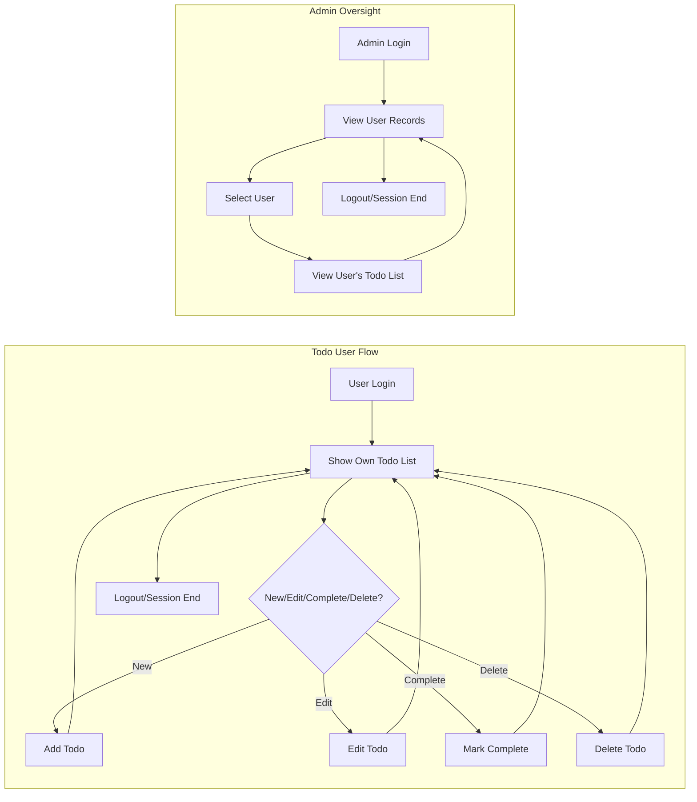

# Todo List Minimum Requirements Analysis

## Introduction & Scope
The purpose of this requirements analysis is to define the essential, minimal business and system requirements for a Todo list backend application. The focus is on simplicity, privacy, security, and usability, providing only the basic functionality essential for effective personal task management. No superfluous features, integrations, or advanced modes are to be included. All requirements use the EARS format and are designed to be directly actionable by backend developers. This document excludes all database schemas and API specifications per best practice for requirements documentation.

## User Actors & Permission Model
- User: An individual who manages their own personal list of todos. Each user interacts exclusively with their private set of todos and cannot access, modify, or view the todos of any other user.
- Admin: A privileged user able to view user activity and todos solely to support, troubleshoot, and maintain system reliability. Admins do not create or complete todos for users, nor do they participate in regular task management.

### Permission Matrix
| Actor  | View Own Todos | View Others' Todos | Add/Edit/Delete Todos | View User Accounts |
|--------|----------------|--------------------|----------------------|-------------------|
| User   | Yes            | No                 | Yes                  | No                |
| Admin  | No             | Yes                | No                   | Yes               |

## Core Business Requirements (EARS Format)
- WHEN a user logs in successfully, THE user SHALL only have access to their own todos.
- WHEN a user views their todo list, THE system SHALL retrieve and show only that user's todos in chronological or user-defined order.
- WHEN a user enters a new todo item and submits it, THE system SHALL create a new todo for that user with the provided content and mark it as incomplete by default.
- WHEN a user edits an existing todo, THE system SHALL update the content and/or completion status, only if the todo belongs to the user.
- WHEN a user marks a todo as completed, THE system SHALL set the completion status and associated timestamp for tracking.
- WHEN a user deletes a todo, THE system SHALL permanently remove that todo for the respective user.
- WHEN an admin accesses a user's record for support or audit, THE system SHALL allow viewing of the user's todos without the ability to alter or complete them.
- WHEN a user or admin attempts to access todos or accounts they are not authorized for, THE system SHALL deny the request and return a relevant error message without revealing any sensitive data.
- WHEN a user or admin is not authenticated, THE system SHALL prevent all access to todos and user data.

## User Workflows and Scenarios

### Example User Scenario
- WHEN a user logs in, the todo list is displayed. WHEN the user adds, edits, completes, or deletes an item and confirms the change, THE system SHALL update the list in real time and maintain data consistency.

### Example Admin Scenario
- WHEN an admin needs to investigate a user-related issue, THE admin SHALL search by user and view only that user's records and todos, for support or compliance reasons, never to modify user todos.

## Authentication & Data Access Controls
- WHEN any API or UI endpoint is called, THE system SHALL require verified authentication (e.g., JWT/OAuth token or session) before granting access.
- WHEN authentication succeeds, THE system SHALL enforce per-user data scope using the user's identity.
- WHEN authentication fails or session is invalid/expired, THE system SHALL deny access and return an authentication error.
- WHEN an admin logs in, THE system SHALL enforce least privilege, allowing only observation of user and todo data, never modification.

## Business Rules & Validation
- WHEN a user adds or edits a todo, THE system SHALL validate that todo content is non-empty and not only whitespace.
- WHEN a todo is created or updated, THE system SHALL ensure text length does not exceed X characters (system setting, e.g., 255).
- WHEN a user attempts to create more than Y todos (system limit), THE system SHALL reject the new todo with a clear message specifying the quota.
- WHEN input fails validation, THE system SHALL return descriptive error messages specifying invalid fields/conditions.

## Error Handling & Edge Cases
- WHEN any server error or unexpected issue occurs, THE system SHALL respond with a generic error that does not leak internal details.
- WHEN a user or admin attempts an unauthorized action, THE system SHALL log the event for audit and return a relevant error.
- WHEN a network or infrastructure problem prevents access, THE system SHALL communicate outage or retry suggestions.

## Non-Functional Requirements
- THE system SHALL process all routine user task operations within 1 second under normal load.
- THE system SHALL encrypt all sensitive data in transit and at rest.
- THE system SHALL log all authentication, authorization, and permission errors for audit and troubleshooting.
- THE system SHALL maintain 99.9% uptime, excluding scheduled maintenance.
- THE system SHALL automatically expire sessions after N minutes of inactivity.
- THE system SHALL provide a privacy policy and clear terms of use to all users.
- THE system SHALL allow users to delete their accounts and permanently remove all their todo data if required by regulation.

## Business Context & Value Proposition Reference
For reference, the todo list service is designed for personal and organizational users valuing minimalism, security, privacy, and efficiency. See 'Core Value Proposition' for further details. All service design focuses on "bare minimum, essential utility."