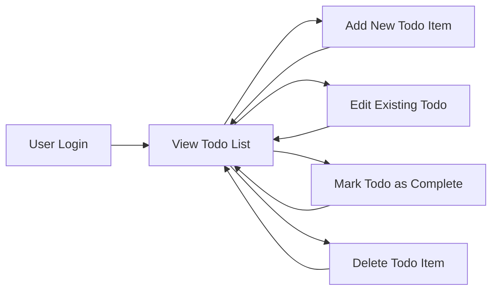

# Minimal Todo List Application—Requirements Analysis

## Service Overview

The minimalist Todo list backend service is designed to allow users to efficiently manage personal tasks through a simple, secure, and intuitive workflow. The core purpose is to let individual users create, view, update, complete, and delete their own todo items securely, while providing administrative oversight features to designated administrators. The application is engineered to present only necessary functionality, avoiding unnecessary complexity or features beyond the essentials of personal task management.

## Actors and Roles

- **User**: A registered person who manages only their own todos. Users can:
  - Log in securely
  - View their own todo list
  - Add, edit, complete, or delete only their own todo items
- **Administrator**: A privileged user responsible for service-wide maintenance. Admins can:
  - Perform all regular user operations on their own account
  - View and manage todo items for all users
  - Remove or edit items belonging to any user
  - Suspend or reactivate user accounts as required

## Workflow & User Journeys

### Regular User Journey
1. User logs in using secure credentials
2. User reviews their personal todo list
3. User creates a new todo with a title (required), and optional description and due date (if supported)
4. User edits existing todo items as needed
5. User marks completed tasks
6. User deletes todo items no longer needed
7. (Optional) User logs out to end session

### Administrator Journey
1. Admin logs in securely
2. Admin may review any user's todo list
3. Admin manages (edits/deletes) any todo item as needed
4. Admin manages user accounts, including suspending/reactivating accounts

## Workflow Diagram

## Functional Requirements (EARS Format)

### Personal Task Management (User)

- WHEN a user is logged in, THE system SHALL present only the todos belonging to that user, ordered by creation date or priority.
- WHEN a user adds a todo, THE system SHALL require a title and SHALL accept optional description and due date.
- WHEN a user adds a todo, THE system SHALL store it immediately and show it in the user’s list.
- WHEN a user edits a todo, THE system SHALL allow modification only by the owner or an administrator.
- WHEN a user marks a todo as complete, THE system SHALL update the completion status.
- WHEN a user deletes a todo, THE system SHALL confirm the action and remove it from the user’s list.
- IF the user attempts to access or edit a todo not owned by them, THE system SHALL reject the request and show an error message.

### Administrative Oversight (Admin)

- WHERE a user has admin privileges, THE system SHALL allow the admin to view, edit, and delete any user’s todo items.
- WHERE a user has admin privileges, THE system SHALL allow suspension or reactivation of user accounts according to company policy.

### Security, Authentication, and Permissions

- WHEN a user is unauthenticated, THE system SHALL prevent all access to todo items and administrative functions.
- WHEN a user attempts any action, THE system SHALL verify the user's access rights before proceeding.
- THE system SHALL expose only actions the logged-in user is allowed to perform, hiding or disabling unauthorized operations.
- THE system SHALL provide clear error messages and not leak information about other users’ data or items.
- THE system SHALL store all personal todo data in adherence to privacy law and only allow access as specified by permissions.

### Usability and Simplicity

- THE system SHALL present only the minimal UI/UX elements necessary for personal todo management, hiding all advanced or unused functionality.
- THE system SHALL require the minimal amount of user input to complete standard todo operations.

## Business Rules and Constraints

- Each user SHALL only see, modify, or delete their own items unless they are an administrator.
- Todo items MUST have a non-empty title.
- Completed items should be clearly distinguishable from incomplete ones.
- Deleted items cannot be recovered by users (admins may restore if policy allows, optional).
- Administrative actions SHALL be logged for audit purposes.
- System SHALL limit the maximum number of todos shown per page (e.g., pagination), default to 20 unless configured otherwise.
- System SHALL enforce input validation: titles max 255 chars, descriptions max 1,024 chars, due dates (if used) must be in ISO 8601 format.
- The application SHALL perform all actions with maximum response time not exceeding 1 second under normal load.

## Error Cases and Edge Scenarios

- IF a user tries to update or delete a todo that does not exist, THE system SHALL show a specific error message.
- IF a user is suspended, THE system SHALL deny all login attempts and display a suspension notice.
- IF an admin is deleted or suspended by another admin, THE system SHALL log the action and revoke all permissions immediately.
- IF data fails to save due to server error, THE system SHALL show a retry prompt and never lose modifications on the client.
- IF the user session expires, THE system SHALL redirect immediately to login and preserve unsaved todo input in local client storage.

## Non-Functional Requirements

- The backend SHALL provide high reliability and availability for all users.
- Data SHALL be encrypted at rest and in transit.
- Service SHALL gracefully degrade with meaningful error messages in case of outages or downtime.
- System SHALL follow best practices of data minimization and user privacy by design.

## Summary

This requirements analysis defines all essential business logic, actor roles, minimal workflows, security and permission enforcement, error cases, business rules and constraints necessary for a production-grade, minimalist Todo list backend service. No features beyond those specified here (such as file attachments, subtasks, reminders, etc.) are included, per the principle of minimalism. This document forms the sole requirements foundation for subsequent backend architecture, modeling, and implementation in TypeScript, NestJS, and Prisma.