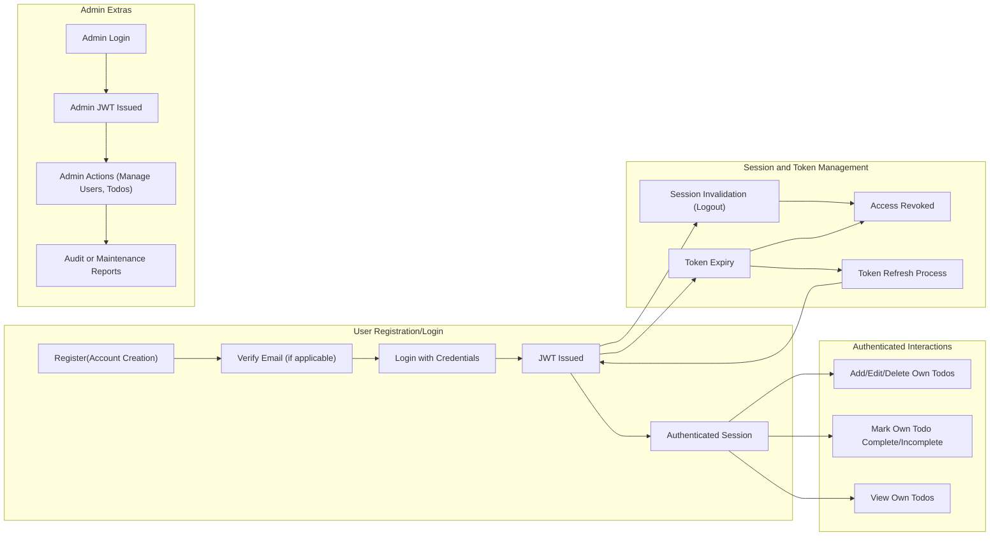

# User Actors and Permissions for Todo List Service

## 1. User Actor List and Definitions

| Actor  | Description |
|--------|--------------------------------------------------------------------------------------------------------------------------------------------------------------------|
| user   | A registered individual who can add, view, edit, mark as complete, and delete their own todo items. Users may only interact with their own data and are prohibited from accessing or modifying items belonging to other users. |
| admin  | A system administrator with the authority to view and manage any user's todos, manage user accounts, and perform maintenance or audit operations. Admins have the ability to access all data for support, compliance, and operational purposes. |

## 2. Permission Matrix

This matrix summarizes CRUD and administrative permissions for each actor on core business activities.

| Action                                 | user | admin |
|-----------------------------------------|------|-------|
| View own todos                         | ✅   | ✅    |
| Add own todo                           | ✅   | ✅    |
| Edit own todo                          | ✅   | ✅    |
| Delete own todo                        | ✅   | ✅    |
| Mark own todo as complete/incomplete   | ✅   | ✅    |
| View any user's todos                  | ❌   | ✅    |
| Edit any user's todo                   | ❌   | ✅    |
| Delete any user's todo                 | ❌   | ✅    |
| Mark any user's todo complete/incomplete| ❌   | ✅    |
| Manage user accounts                   | ❌   | ✅    |
| Access admin/maintenance functions     | ❌   | ✅    |

## 3. Authentication and Session Management

### Authentication Requirements (EARS Format)
- THE system SHALL require registration via email and password using secure endpoints.
- THE system SHALL require users to authenticate (login) before granting access to todo features or administrative actions.
- WHEN authentication is successful, THE system SHALL issue a JWT that encodes user ID, role, and permissions.
- THE system SHALL provide secure login, logout, and session management for all actors.
- WHEN a user logs out, THE system SHALL invalidate their session and JWT to prevent reuse.
- IF an invalid or expired token is provided, THEN THE system SHALL deny access to protected features and provide a clear error message.
- THE system SHALL implement session expiry through JWT (access expires in 15–30 minutes; refresh within 7–30 days).
- THE system SHALL support password resets through a secure, user-initiated flow with appropriate identity validation.
- WHEN authentication fails, THE system SHALL log the attempt and respond with an appropriate error message.
- THE system SHALL sign and verify JWT tokens with secrets stored securely, never checked into version control.

### JWT Token Structure and Security
- THE system SHALL encode in the JWT: unique user ID, user role (user/admin), permissions, and expiration timestamp.
- THE system SHALL only accept tokens signed with the project's secret and SHALL reject all invalid signatures.

### Authentication Workflows (Mermaid)

## 4. Business Role Descriptions

### user
- Registered users SHALL perform all CRUD operations on their own todos and SHALL NOT access or affect any data owned by others.
- WHEN viewing, editing, or deleting todos, THE system SHALL ensure filtering and validation so only the user's own items are exposed.
- WHEN a user session expires or the user logs out, THEN THE system SHALL revoke access immediately.
- Users SHALL be able to securely reset their password, change account details, and log out via protected endpoints.
- IF users attempt any forbidden action (accessing others' data, using wrong permissions), THEN THE system SHALL respond with a 403 Forbidden error and SHALL NOT leak any sensitive data.

### admin
- Admins SHALL have all user capabilities plus system administration privileges.
- Admins SHALL manage any user's data, perform user account operations (view, enable/disable, delete), and execute system maintenance tasks.
- WHEN performing admin actions, THE system SHALL record the action in an audit log including actor, timestamp, and affected records.
- Admins SHALL access maintenance, audit, and compliance features through dedicated endpoints and interfaces, with full role-based controls.
- IF an admin attempts a prohibited operation outside their scope, THEN THE system SHALL respond with a 403 Forbidden or other appropriate error.

## 5. Additional Business Rules for Access Control

- WHEN any API request is made to a protected endpoint, THE system SHALL verify the JWT and associated permissions before processing.
- IF the JWT is invalid, expired, or missing, THEN THE system SHALL return a 401 Unauthorized error and SHALL NOT process the request.
- IF a user attempts to perform any operation not permitted by their role, THEN THE system SHALL log the attempt and return a 403 Forbidden response with no sensitive details disclosed.
- WHEN an admin deletes a user, THE system SHALL remove or anonymize that user's todos per system retention policy.
- ALL failed authentication, authorization, or administrative actions SHALL be logged with full context for later audit.
- WHEN an error occurs, THE system SHALL provide detailed, actionable error messages in API responses without exposing sensitive internal implementation details.

---

This requirements specification defines ALL user actors, permissions, authentication workflows, session rules, business logic, role-based access controls, error handling, edge case behavior, and security mandates required for a minimal, production-grade Todo List backend. Every statement is actionable for backend engineers and EARS-compliant for implementation. No APIs or schema details appear here—only business logic in natural language.