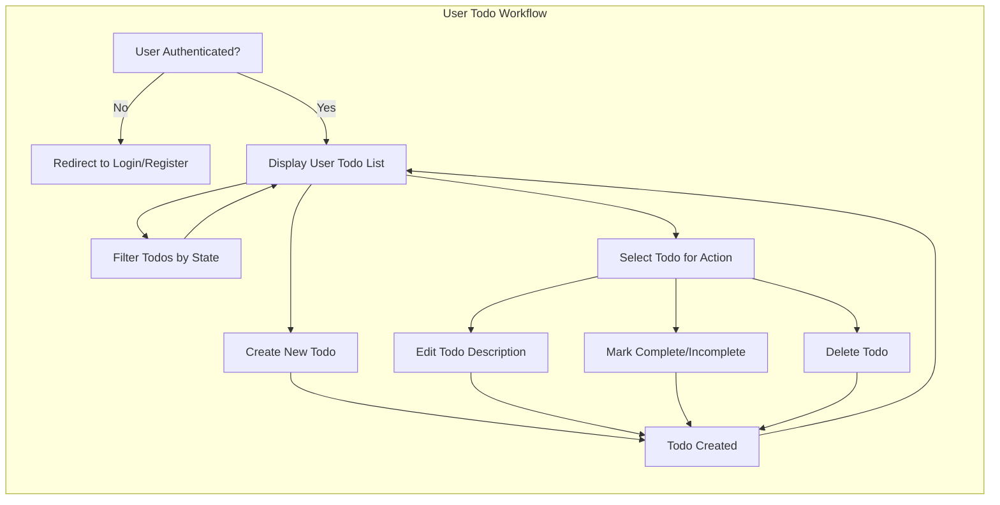
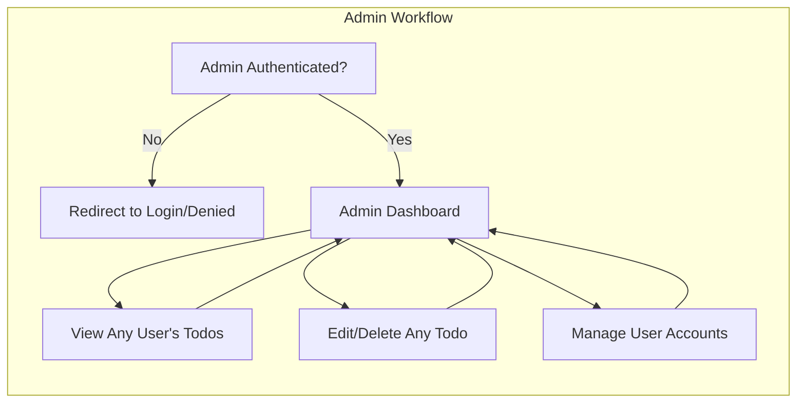

# Todo List Service — Requirements Analysis

## 1. Purpose and Scope
The Todo List Service ("todoList") is designed to provide a minimal, focused backend application enabling users to manage personal todo items. The analysis defines all requirements and business rules necessary for backend developers, specifying what must be supported for typical users and administrators. The scope includes only required functionality for a fully operational Todo list, with no extra features.

## 2. Core Requirements (EARS Format)
| ID  | EARS Requirement                                                                           |
|-----|--------------------------------------------------------------------------------------------|
| FR1 | THE service SHALL allow a user to register, log in, and authenticate via secure API.        |
| FR2 | WHEN a registered user is authenticated, THE service SHALL allow the user to create a todo. |
| FR3 | WHEN a user creates a todo, THE service SHALL store the todo with a description and state.  |
| FR4 | THE service SHALL allow a user to view all their todos.                                     |
| FR5 | WHEN a user views their todos, THE service SHALL return a list of their current todos.      |
| FR6 | THE service SHALL allow a user to edit the description of their own todo.                   |
| FR7 | THE service SHALL allow a user to delete their own todo.                                    |
| FR8 | WHEN a user marks a todo as completed, THE service SHALL update the todo state accordingly. |
| FR9 | THE service SHALL allow a user to mark a todo as incomplete.                                |
| FR10| THE service SHALL allow a user to filter their todos by completion state.                   |
| FR11| IF a user attempts to access, modify, or delete another user's todo, THEN THE service SHALL deny the action. |
| FR12| THE service SHALL prevent unauthenticated users from accessing user todos.                  |
| FR13| THE service SHALL record the creation and last modification timestamp for each todo.         |
| FR14| THE service SHALL limit each todo description to 255 characters.                            |
| FR15| THE service SHALL allow an admin to view, edit, or delete any user's todo.                  |
| FR16| THE service SHALL allow an admin to view and manage all user accounts.                      |
| FR17| THE service SHALL allow a user to log out and end their session.                            |

## 3. Features and User Stories
### 3.1 Registration and Authentication
- Users register using email and password. Password strength requirements apply.
- Successful registration enables login. Pre-authentication required for all business operations except registration and login.
- Logged-in users maintain authenticated sessions until logout or expiry.
- Admins authenticate using secure credentials and may access all admin features.

### 3.2 Todo Management for Users
- **Create**: Authenticated users create todos, setting a non-empty description (max 255 chars). State defaults to incomplete.
- **Read**: Authenticated users see a list of all their own todos, with ability to filter by state (complete/incomplete/all).
- **Update (Edit)**: Description of existing todos can be changed by the owner, up to 255 characters, unless description would become blank/whitespace.
- **Toggle Completion**: Each todo’s completion status can be toggled by its owner.
- **Delete**: Users may delete any of their own todos.
- Timestamps for creation and last modification are maintained for each todo.

### 3.3 Todo Management for Admin
- Admins may view, edit, or delete any todo for support, compliance, or maintenance purposes.
- Admin may list todos for any user or view all todos in the system.
- Admins may view and manage all user accounts, including disabling or deleting users.
- Admin accounts are exclusively for administrative management; admins cannot create regular todos for themselves.

### 3.4 Filtering and Searching
- Users may filter their todo list by completion state. Admins may apply similar filters system-wide or per-user.

## 4. Business Rules & Validation
### 4.1 Data Rules
- Each todo must have:
  - Unique identifier
  - Description (mandatory, string, 1–255 printable characters)
  - Completion state (boolean: complete/incomplete)
  - Creation timestamp (ISO 8601 format)
  - Update timestamp (ISO 8601 format)
- Blank or whitespace-only descriptions are not permitted.
- Description field enforces 255 character maximum on creation and update.

### 4.2 Permission and Ownership
- Users only view, modify, delete their own todos.
- Admins have access to any todo, but cannot create personal (regular user) todos.
- Unauthorized attempts at access or modification result in denial and a clear, actionable error response.
- Admin actions must be auditable (the backend shall record who made changes for support/recovery).

### 4.3 Authentication Requirements
- All endpoints except registration and login require valid authentication tokens.
- Unauthenticated users must be denied business operations (view, create, update, delete todos).
- Users must be able to log out and invalidate their session at will.

## 5. Success Metrics
- Registered users can reliably create, retrieve, update, mark, and delete their todos.
- Unauthorized access is always denied, with informative and secure messaging.
- Admins may manage all todos and users according to business policies.
- Standard operations (create/update/delete) are confirmed within 2 seconds under typical load.
- Service uptime must exceed 99% except for planned maintenance.
- All rules above are testable in acceptance testing; there must be no ambiguity for developers or QA.

## 6. Visual Workflow Diagrams
### 6.1 User Todo Flow

### 6.2 Admin Workflow

## 7. Error Handling & Edge Cases
- IF user is not authenticated, THEN THE service SHALL deny access and provide a specific error.
- IF user accesses or modifies another user’s todo, THEN THE service SHALL deny with a suitable error message.
- IF todo description is empty, whitespace, or over 255 characters, THEN THE service SHALL return a validation error and not proceed.
- IF admin attempts to create personal todo, THEN THE service SHALL refuse the action and record the attempt.
- IF system experiences unhandled or unexpected errors, THEN THE service SHALL respond with a generic error and tracking code for user support.
- IF service encounters high load or downtime, THEN THE service SHALL advise the user to retry later.

## 8. Authentication and Permission Matrix
| Action                            | User (self) | Admin           |
|------------------------------------|:-----------:|:---------------:|
| Register, login, logout           | Yes         | Yes*            |
| Create todo                       | Yes         | No              |
| View own todos                    | Yes         | Yes             |
| Edit own todo                     | Yes         | Yes             |
| Delete own todo                   | Yes         | Yes             |
| View all users’ todos             | No          | Yes             |
| Edit/delete arbitrary user’s todo | No          | Yes             |
| Manage user accounts              | No          | Yes             |
| *Admin accounts are provisioned differently; only login/logout needed for service management. |

## 9. Non-Functional Expectations
- Response time: All business operations shall complete in 2 seconds or less under normal conditions.
- System shall be available 99% of the time, tracked monthly.
- Data consistency and integrity must be ensured in all CRUD activity.
- All error messages shall be actionable and localization-ready.

---
This requirements specification enables backend developers to implement a minimal, production-ready Todo list service that meets all specified business needs, user scenarios, and administrative controls.