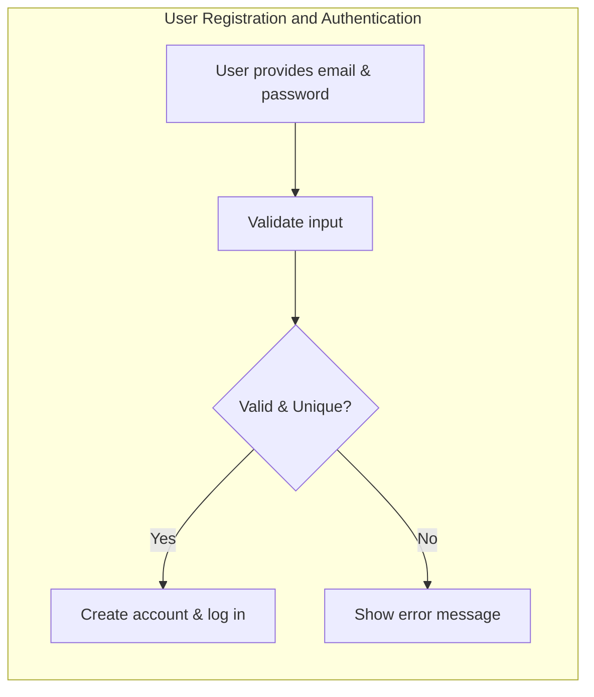
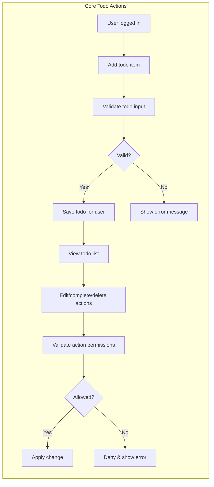
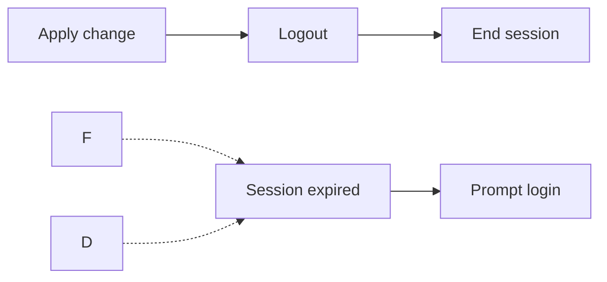
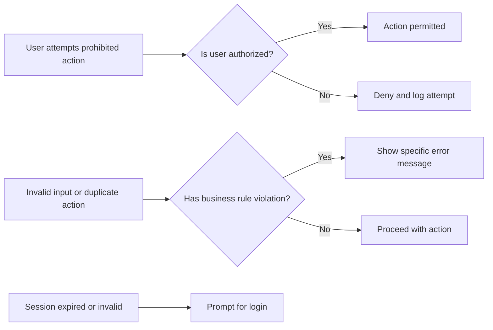

# Minimal Todo List Backend Requirements

## Introduction
A Todo list backend provides a simple, reliable way for individual users to record, manage, and organize actionable items. The service targets non-technical users who need basic personal productivity. The scope is strictly limited to the minimum feature set necessary for a fully usable task list application and excludes non-core or advanced features.

## User Actors and Permissions
- **User**: Any registered individual able to manage their own todos exclusively. Cannot view, edit, or delete any other user's todos.
- **Admin**: (Optional/minimal scope) May inspect, edit, or delete any user's todos in accordance with audit requirements and business policy. Admin is not a general user and does not have a personal todo list.

### Permissions Matrix
| Feature              | User                           | Admin                |
|----------------------|--------------------------------|----------------------|
| View own todos       | Yes                            | N/A                  |
| View any user's todos| No                             | Yes                  |
| Add todo             | Yes (for self only)            | No                   |
| Edit todo            | Yes (for self only)            | Yes (for any user)   |
| Delete todo          | Yes (for self only)            | Yes (for any user)   |

## Authentication and Session Management
- WHEN a user registers with a valid email and password, THE system SHALL create the user's account, enforce email uniqueness, and immediately create an authenticated session.
- WHEN a user logs in with valid credentials, THE system SHALL issue a session token (e.g., JWT) valid for a minimum of 30 minutes of inactivity, automatically renewed upon active use.
- IF authentication fails or a session is expired/revoked, THE system SHALL deny all further requests and state that authentication is required.
- WHEN a user logs out, THE session SHALL be terminated.
- WHEN an unauthenticated actor attempts any state-changing operation, THE system SHALL provide a clear, non-technical error message and require login.
- All authentication flows must fully comply with the permissions matrix above.

## Core Functional Requirements (EARS Format)

### 1. User Registration
- WHEN a new user provides a valid, unique email and password, THE system SHALL register the user and automatically create a session.
- IF email is already registered, THE system SHALL reject registration and show an error.
- IF user provides invalid data, THE system SHALL reject with a clear error message.

### 2. User Authentication (Login/Logout)
- WHEN a registered user logs in with the correct credentials, THE system SHALL start a session.
- IF provided credentials are invalid, THE system SHALL reject login with a clear, non-technical error.
- WHEN user logs out, THE system SHALL immediately terminate the session.
- IF any authenticated action is attempted with an invalid or expired token, THE system SHALL deny access and require login.

### 3. Add, Edit, Delete Todos
- WHEN an authenticated user submits a non-empty todo description, THE system SHALL create a todo owned by that user. Description max length: 255 chars.
- IF todo submission is invalid (blank, overlength, bad params), THE system SHALL reject with a specific error.
- WHEN user edits their own todo with valid update, THE system SHALL persist the change and return the updated item details.
- IF editing/deletion is attempted by anyone other than the owner or admin, THE system SHALL reject access with forbidden error.
- WHEN a user deletes their own todo, THE system SHALL remove it from their list.
- WHEN an admin deletes or edits any user's todo, THE system SHALL perform the action and log it for audit.

### 4. View Todos
- WHEN a user requests their own todo list, THE system SHALL only show their items, sorted by newest first.
- WHEN an admin requests a user's todo list, THE system SHALL provide all items for that user.
- IF a regular user requests another user's list, THE system SHALL deny access with a forbidden error.

### 5. Complete/Inactivate Todos
- WHEN a user marks a todo completed, THE system SHALL persist this status and update the completion timestamp.
- WHEN reactivating a completed todo, THE completion status SHALL revert to incomplete.
- IF a user tries to change completion of a todo they do not own, THE system SHALL deny access.

## User Flows (Standard/Alternative/Error/Edge)
- Standard and alternative flows are described fully in EARS format above and by explicit workflows in visual diagrams (see below).
- Edge and error cases include:
    - Duplicate add/edit/delete actions: system SHALL prevent and reject as appropriate.
    - Invalid data entry (empty/too long description, unsupported due date): system SHALL reject with specific message.
    - Session expiry/invalid token: system SHALL provide authentication error and require re-login.
    - Unauthorized action: system SHALL provide clear forbidden/permission denied message without exposing protected data.
    - System failures (network, crash): system SHALL provide a simple, non-technical failure message. Internal errors must never be revealed to end users.

## Business Rules and Validation
- Todo descriptions must be non-empty and ≤ 255 characters.
- Optional: due date (must be in the future), priority (optional, fixed set), tags (reserved for future).
- Only owners (or admin) may edit/delete a todo.
- System must confirm destructive changes (delete) before finalizing.
- System may support future expansion for labels and priorities, but must not expose features not fully implemented.

## Non-Functional and UX Requirements
- System SHALL provide immediate response (<1s backend) for all successful or failed actions.
- Error messages SHALL be specific, non-technical, and actionable.
- User session persistence SHALL last for at least 30 minutes of inactivity.
- No user SHALL see another user's todos (except admin with explicit access).
- System SHALL confirm all destructive actions before proceeding.
- System SHALL be robust enough to prevent lost data during critical operations.

## Visual Workflow Diagrams (Mermaid)

### User Registration and Authentication

### Core Todo Flows and Permissions

### Session and Error Handling

### Error and Edge Case Handling

## Implementation Notes
- All requirements are stated for implementation-readiness without database schema, API details, or irrelevant technical information.
- The above standards define the entire functional and business logic required for a minimal todo list backend service.
- Additional features, integrations, or user interfaces are explicitly out of scope for this minimal version.