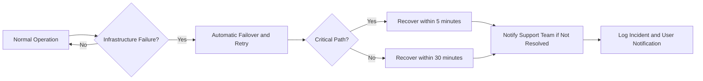
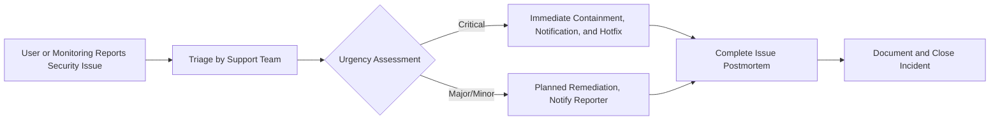

# Non-Functional Requirements for Todo List Backend Service

## Performance Expectations

WHEN a user adds, updates, checks, or deletes a todo item, THE system SHALL respond to the API request within 1 second under normal load (up to the 95th percentile of requests). WHEN load temporarily spikes to maximum projected concurrency, THE system SHALL ensure no more than 5% of requests exceed the standard 1 second response target, with no request taking longer than 3 seconds. WHEN retrieving a user’s complete todo list (up to 1,000 items), THE system SHALL deliver a sorted, most-recently-modified view in less than 500ms for 95% of requests.

WHEN an integrated external notification or authentication provider is used, THE system SHALL ensure such integration does not add more than 0.5 seconds latency to any affected API call. WHEN scheduled or unscheduled maintenance occurs, THE system SHALL provide service unavailability notification in the user interface, including an estimated time to recovery when possible. 

### API Performance Table
| Function             | Standard API Latency | Max Allowable (Peak) |
|----------------------|---------------------|----------------------|
| Add/Edit/Delete Todo | ≤ 1s                | ≤ 3s                 |
| List Todos           | ≤ 500ms             | ≤ 2s                 |
| Auth/Login           | ≤ 1s                | ≤ 4s (w/ext. systems)|

## Reliability and Availability

THE system SHALL maintain operational uptime of at least 99.9% measured over any rolling 30-day window, excluding up to 4 hours of previously announced maintenance per month. WHEN infrastructure or software failure occurs, THE system SHALL automatically failover and restore critical service functions (user authentication, todo creation/viewing) within 5 minutes, with non-critical functions restored within 30 minutes.

THE system SHALL utilize daily point-in-time backups, transaction log retention for at least 7 days, and automatic failover with full redundancy to eliminate single points of failure. WHEN a backup is performed, THE system SHALL ensure that user-facing performance is not degraded by more than a 10% increase in API response times.

## Data Privacy and Security

THE system SHALL require authenticated user sessions for all operations involving reading, adding, updating, or deleting todo items, except for limited demonstration endpoints which SHALL NOT store user data or personal information.

WHEN a user logs in, THE system SHALL issue a short-lived access token (JWT, max 30 days), renewable only through explicit user re-authentication. THE system SHALL restrict todo access to the creating user (data isolation), with system admin roles permitted to access all todos only for support, recovery, or audit. All admin actions affecting user data SHALL be fully audit-logged.

WHEN a user initiates account deletion, THE system SHALL permanently erase all associated personal and todo data within 24 hours, subject to legal retention constraints outlined in the Compliance section. THE system SHALL implement current strong encryption standards (e.g., AES-256 at rest, TLS v1.2+ in transit) for all data.

WHEN more than 5 failed login attempts are recorded within a 2-minute window for any account, THEN THE system SHALL lock the account for 10 minutes and send a security notification to the account’s registered email. All user-provided inputs SHALL be automatically validated on the backend to prevent security exploits (such as injection and XSS attacks).

WHEN a user or security system reports a vulnerability or data risk, THE system SHALL provide a clear reporting process with remediation standards and SLAs defined by company security policy.

## Compliance

WHEN user data is collected, stored, or processed, THE system SHALL comply with all applicable data privacy laws and digital service regulations in the region of operation (e.g., GDPR in the EU, domestic privacy law in Korea). WHERE required by law, user and transaction data SHALL only be retained for the minimum statutory period, after which it SHALL be securely deleted.

WHEN a user requests a machine-readable export of their data, THE system SHALL deliver all available personal information and todos in a standard format (such as CSV or JSON) within 48 hours of request.

WHEN a data breach is confirmed, THE system SHALL notify affected users within the legally required notification window (such as 72 hours for GDPR). All compliance procedures, staff training, and access rights reviews SHALL be formally documented and regularly audited.

*Summary Table:*
| NFR Category          | Requirement Summary                                        |
|----------------------|------------------------------------------------------------|
| Performance          | ≤ 1s API, 1,000 concurrent users, sorted list ≤ 500ms      |
| Reliability          | 99.9% uptime, 5/30 min recovery, full backups, no data loss|
| Privacy & Security   | Auth required, data isolation, encryption, admin audit log |
| Compliance           | GDPR/laws, retention and export, timely breach notification |

All requirements are specific, measurable, and necessary for the minimum viable Todo List application, ensuring production-quality reliability, security, and compliance from the backend API and data handling perspective.