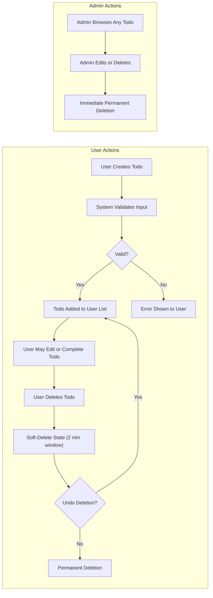

# Business Rules and Constraints for Todo List Service

## Rule List

### Todo Item Ownership and Permissions
- WHEN a user is authenticated, THE system SHALL allow the user to add, view, edit, mark as complete, and delete their own todo items.
- WHEN a user is not authenticated, THE system SHALL deny all access to todo items and return an authentication error.
- WHEN an admin accesses the system, THE system SHALL allow the admin to view, edit, and delete any todo item, regardless of ownership.
- WHEN a user tries to access or modify a todo item not owned by them, THE system SHALL deny the operation and return an error explaining the access attempt was unauthorized.

### Todo Creation, Completion, and Editing Control
- WHEN a user creates a todo item, THE system SHALL require a non-empty title with at least 1 up to 150 characters (not whitespace only).
- WHEN a user creates a new todo matching title and content of an existing todo they've made in the past 1 minute, THE system SHALL reject it as a duplicate.
- WHEN a user marks a todo as complete, THE system SHALL set a completion timestamp (in UTC, ISO 8601 format) if the todo is not deleted and not previously completed.
- WHEN a user attempts to complete a todo multiple times, THE system SHALL ignore repeat completions and only retain the original completion.
- WHEN a user edits a todo, THE system SHALL update a last modified timestamp and maintain data consistency, but WHEN a todo is 'Completed', THE system SHALL only allow non-content changes (e.g., status flags, completion note if applicable) and prohibit content edits.

### Admin Operations
- WHEN an admin deletes any user's todo, THE system SHALL immediately remove the item and log the deletion for audit purposes.
- WHEN a user deletes their todo, THE system SHALL move it to a soft-delete state for 2 minutes (unless the user is admin, in which case deletion is permanent immediately).
- WHEN a user deletes a completed todo, THE system SHALL apply the same soft-delete and deletion logic as for active todos.
- IF a deleted todo is accessed, THEN THE system SHALL return an error indicating that the item no longer exists.

### Todo States and Lifecycle
- Todo items SHALL support three valid states: Active, Completed, Deleted.
- WHEN a user deletes a todo, THE system SHALL enforce a 2-minute undo window for non-admins, after which the record is permanently deleted.
- WHEN an admin performs deletion, THE system SHALL not enforce this delay and deletion is permanent instantly.
- WHEN editing a completed todo, THE system SHALL allow status field changes (completion note or similar) but not content edits.
- WHEN a deleted todo is accessed by any method, THE system SHALL return an error: item does not exist.

### Limits and Rate Control
- WHEN user exceeds 500 active todo items, THE system SHALL prevent the creation of new todos and return a related error.
- WHEN a registered user performs more than 10 todo operations (create, edit, complete, delete) in any 10-second rolling window, THE system SHALL block additional operations for that user with a clear rate-limit error until window resets.
- WHEN API usage or system load for a user exceeds 100 requests per second, THE system SHALL return a service busy error.

## Validation Conditions

### Field Constraints
- title: required, minimum 1 character, maximum 150 characters, not whitespace only
- description: optional, up to 1,000 characters
- due date: optional, if provided, must be ISO 8601 format and not in the past (unless editing an item past due)
- completion status: required, boolean

### Field Validation EARS Requirements
- WHEN a todo is created or updated, THE system SHALL validate that the title field is required, between 1 and 150 characters (inclusive), and not whitespace.
- IF description is provided, THEN THE system SHALL ensure it does not exceed 1,000 characters.
- IF due date is provided, THEN THE system SHALL require that it is a valid future ISO 8601 datetime string (except when editing past items).
- WHEN marking todo as complete, THE system SHALL validate that todo is not already deleted.
- WHEN updating a todo, THE system SHALL verify that all state changes are valid (e.g., Active to Completed is allowed, but Completed to Active is not permitted without admin rights).
- IF fields outside specified attributes are provided (e.g., arbitrary metadata), THEN THE system SHALL reject the request and respond with a validation error explaining the invalid field(s).

## Operational Constraints

### Storage, Retention, and Deletion
- WHEN a todo is deleted by a non-admin user, THE system SHALL soft-delete (retain) the item for 2 minutes to allow undo; after 2 minutes, item is permanently deleted.
- WHEN an admin deletes a todo, THE system SHALL allow forced, immediate permanent deletion.
- THE system SHALL guarantee transactional data consistency—no data loss, even under concurrent operations.

### Authentication and Security
- All todo item operations SHALL enforce request authentication using JWT (JSON Web Token).
- THE system SHALL log all failed and unauthorized access attempts for audit and security review.

### Time and Audit Logging
- All timestamp data (creation, modification, completion, deletion) SHALL be stored in UTC with ISO 8601 encoding.
- WHEN returning timestamps to the client, THE system SHALL allow local timezone rendering on request.
- THE system SHALL log all admin deletions for later review.

### Concurrency and System Load
- THE system SHALL support up to 20,000 concurrent users.
- THE system SHALL guarantee support for up to 100 API requests per second per user.
- WHEN system-level resource limits are exceeded, THE system SHALL return a standardized busy error and suggest retry timing to the user or client.

## Visualizations

### Mermaid Diagram: Todo Item and User/Role Lifecycle

---

All business rules, validations, and operational constraints herein must be strictly adhered to for any backend implementation of the Todo list service. These form the minimum, non-negotiable requirements—no backend feature should violate or neglect these rules.