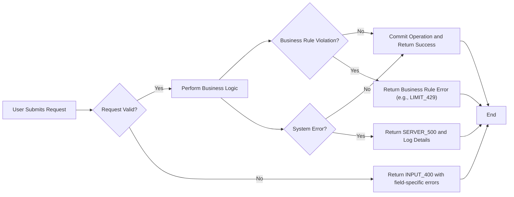

# Todo List Service: Minimum Requirements Analysis

## Introduction
A Todo list backend service enables users to manage simple tasks. This minimum-version specification defines the essential business requirements and behavioral expectations for a robust, single-user Todo list application, including authentication and comprehensive error handling. The service prioritizes clarity, predictability, and highest usability for its core features.

---

## User Actors and Permissions
| Actor  | Description                                 |
|--------|---------------------------------------------|
| user   | Any authenticated individual managing their personal todo list |
| admin  | (Optional for audit and debugging; not required for minimum functionality) |

- WHEN unauthenticated, users SHALL NOT access any Todo list functionality.
- WHEN authenticated, users SHALL ONLY access, modify, or delete their own Todo items.
- IF admin actor exists, THEN admin SHALL be able to audit but NOT alter or delete user todos directly.

---

## Minimal Functional Requirements (EARS Format)
### Todo Item Management
- WHEN a user is authenticated, THE system SHALL allow creating a new todo item with a required text description and optional completion flag (default: incomplete).
- WHEN a user creates a todo with empty or blank description, THE system SHALL reject the creation with INPUT_400 error and message "Todo description must not be empty."
- WHEN a user creates a todo with description exceeding the system-defined limit (e.g., 256 characters), THE system SHALL reject the request with INPUT_400 error and specify the maximum length allowed.
- WHEN a user lists todos, THE system SHALL return all their own todo items sorted by creation time, newest first.
- WHEN a user updates a todo description, THE system SHALL validate presence and length as per above rules, and SHALL update only if the todo belongs to the user.
- WHEN a user marks a todo as complete or incomplete, THE system SHALL update the corresponding status only if the todo belongs to the user.
- WHEN a user deletes a todo, THE system SHALL delete only if the todo belongs to them, and deleting completed todos SHALL be allowed and idempotent.

### Error Handling and Business Rule Enforcement
Based on robust error handling strategy:
- WHEN a user provides incorrect input (missing fields, description too long, non-existent todo id), THE system SHALL respond with INPUT_400 or NOTFOUND_404 error and a clear, actionable message.
- WHEN an action is attempted on another user's todo id, THE system SHALL return AUTH_403 "Forbidden" error and SHALL NOT reveal whether such a todo exists.
- WHEN requests exceed quota (optional daily creation limit), THE system SHALL respond with LIMIT_429 and guidance when the user may retry.
- WHEN technical issues arise, THE system SHALL return a SERVER_500 error with non-technical user feedback and SHALL not expose system internals.

### Idempotency and Resource State
- WHEN an operation is repeated (e.g., marking already completed todo as complete), THE system SHALL treat the operation idempotently and return updated status without error.

### Success Criteria for Functional Requirements
- All workflows SHALL be covered by automated tests derived from these requirements.

---

## Authentication, Authorization, and Session Management
- WHEN a request is received for any Todo list API, THE system SHALL require the user to authenticate using industry standard methods (e.g., password, OAuth, etc.).
- WHEN authentication fails or session expires, THE system SHALL return AUTH_401 and SHALL NOT disclose user existence or system details.
- WHEN logged in, each user SHALL only access, update, complete, or delete their own todos, never those of others.

---

## User Scenarios & Workflows
### Standard Todo CRUD
- WHEN authenticated, users SHALL be able to:
  - Create: Add a todo item with a short textual description.
  - Read: Retrieve a list of all their todo items, newest first, including completion state.
  - Update: Edit the description or completion status of their own todos.
  - Delete: Remove their own todo items.

### Error and Edge Case Scenarios
- WHEN a user sends a request with incomplete or malformed data, THE system SHALL return an INPUT_400 error specifying which input is incorrect.
- WHEN a user attempts to delete or update a todo they do not own, THE system SHALL return AUTH_403 error.
- WHEN a request uses an expired or invalid authentication token, THE system SHALL return AUTH_401 error and require the user to re-authenticate.
- WHEN system experiences a transient error (e.g., database unavailable), THE system SHALL retry where safe, log the issue, and return SERVER_500 if unsuccessful.
- WHEN the same create, complete, or delete operation is repeated, THE system SHALL act idempotently.

---

## Input and Output Validation
- WHEN any field is required by business rules, THE system SHALL validate its presence and enforce minimum/maximum length where appropriate.
- WHEN optional fields are omitted, THE system SHALL supply sensible defaults (e.g., incomplete status for new todos).
- WHEN invalid or extra fields are supplied, THE system SHALL ignore extras and validate essentials only.

---

## Error Handling: Codes and Principles
- Error response to users SHALL include:
  - HTTP error class (e.g., 400, 401, 403, 404, 429, 500)
  - Error code (AUTH_401, AUTH_403, INPUT_400, NOTFOUND_404, LIMIT_429, SERVER_500, etc.)
  - Clear, actionable human-friendly message
  - Optional validation hints for input corrections

### Error Handling Workflow (Mermaid Diagram)

---

## Non-Functional Requirements
- THE system SHALL respond to user requests within 1 second under normal load.
- THE system SHALL be available 99.9% of the time (excluding planned maintenance).
- THE system SHALL never expose implementation details, stack traces, or sensitive data in any user-facing message.
- ALL processes SHALL be atomic where possible, ensuring users never see partial changes.
- ALL error conditions SHALL be covered by test cases and logged internally for system monitoring and debugging.

---

## Conclusion
- This specification is sufficient for backend engineers to implement a minimal, production-grade Todo list backend service with industry-standard reliability and user-centric error handling, meeting all key business requirements without ambiguity.