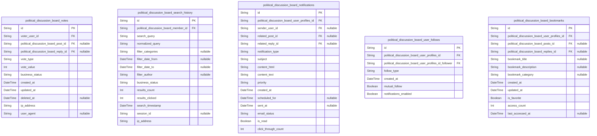

# Prisma Markdown

> Generated by [`prisma-markdown`](https://github.com/samchon/prisma-markdown)

- [Systematic](#systematic)
- [Actors](#actors)
- [Content](#content)
- [Interaction](#interaction)
- [Moderation](#moderation)
- [Media](#media)
- [Session](#session)

## Systematic

### `political_discussion_board_system_config`

System-wide configuration settings that control operational parameters
and feature toggles across the political discussion board platform. These
key-value pairs define system behavior and are referenced by other
domains.

Properties as follows:

- `id`: Primary Key.
- `updated_by_admin_id`
  > Administrator who last updated this configuration setting {@link
  > political_discussion_board_admin.id}
- `created_by_admin_id`
  > Administrator who created this configuration setting {@link
  > political_discussion_board_admin.id}
- `config_key`
  > Unique identifier for the configuration parameter (e.g.,
  > 'max_post_length', 'voting_threshold')
- `config_value`
  > Value for the configuration parameter, stored as string and parsed by
  > application logic
- `description`
  > Business description explaining the purpose and usage of this
  > configuration parameter
- `category`
  > Functional category grouping for related settings (e.g., 'security',
  > 'limits', 'features')
- `created_at`: Timestamp when this configuration was first created
- `updated_at`: Timestamp when this configuration was last updated
- `is_active`
  > Whether this configuration setting is currently active and should be
  > applied by the system
- `data_type`
  > Data type hint for parsing the config_value (string, integer, boolean,
  > json)

### `political_discussion_board_audit_log`

Comprehensive audit trail capturing all significant user actions and
system events for compliance, security monitoring, and moderation
workflows across the entire platform.

Properties as follows:

- `id`: Primary Key.
- `target_post_id`
  > Related post that was affected by this action {@link
  > political_discussion_board_posts.id}
- `target_reply_id`
  > Related reply that was affected by this action {@link
  > political_discussion_board_replies.id}
- `user_id`
  > User who performed this action, if applicable {@link
  > political_discussion_board_member.id}
- `action_type`
  > Type of action performed (login, post_create, reply_edit, vote,
  > moderation_action)
- `description`: Detailed description of what action was taken and relevant context
- `ip_address`: IP address from which the action originated for security monitoring
- `user_agent`
  > Browser or client user agent string for device tracking and security
  > analysis
- `action_timestamp`: Exact timestamp when this action occurred for chronological audit trail
- `metadata`
  > Additional JSON metadata about the action, such as changes made or system
  > state
- `user_type`: Type of user who performed the action (guest, member, moderator, admin)

### `political_discussion_board_error_log`

Application error tracking system for monitoring system reliability,
debugging issues, and maintaining platform stability. Captures technical
errors and system failures for operational excellence.

Properties as follows:

- `id`: Primary Key.
- `user_id`
  > User who encountered this error, if applicable {@link
  > political_discussion_board_member.id}
- `error_type`
  > Category of error (authentication_error, validation_error,
  > database_error, server_error)
- `error_message`: Detailed error message or exception description for debugging purposes
- `error_code`: Machine-readable error code for programmatic handling and categorization
- `severity`
  > Severity level (low, medium, high, critical) indicating impact on system
  > functionality
- `stack_trace`
  > Stack trace or function call chain where the error originated for
  > developer debugging
- `request_url`: URL or endpoint where the error occurred for request tracking and analysis
- `request_method`: HTTP request method (GET, POST, PUT, DELETE) used when the error occurred
- `timestamp`: Timestamp when the error occurred for timeline analysis and debugging
- `resolved_at`
  > Timestamp when this error was resolved, if applicable for tracking
  > resolution time
- `resolution_notes`
  > Notes about how this error was resolved for future reference and
  > documentation

## Actors

### `political_discussion_board_guest`

Guest user accounts with limited read-only access to public political
discussions. These users can browse content but cannot participate in
discussions or access premium features.

Properties as follows:

- `id`: Primary Key.
- `user_profile_id`
  > Target model's [political_discussion_board_user_profiles.id](#political_discussion_board_user_profiles).
  > Optional link to detailed profile information.
- `username`
  > Unique username for guest identification. Used for session tracking and
  > browsing history.
- `email`
  > Email address for account tracking and optional registration prompts.
  > Must be valid format for potential future conversion.
- `password_hash`
  > Hashed password for guest account security. Required even for limited
  > access accounts to maintain security standards.
- `email_verified`
  > Whether the email address has been verified through confirmation process.
  > False for most guest accounts unless converted.
- `is_active`
  > Account status indicating whether the guest account is currently active
  > and allowed to browse content.
- `last_login_at`
  > Timestamp of the most recent login to track guest engagement and session
  > management.
- `created_at`
  > Account creation timestamp for tracking guest user acquisition and
  > analytics.
- `updated_at`
  > Last modification timestamp for account information changes like password
  > updates.
- `deleted_at`
  > Soft deletion timestamp for guest accounts that have been removed or
  > expired due to inactivity.

### `political_discussion_board_member`

Registered member users with authentication capabilities. These users
form the core community with full participation rights, voting
privileges, and reputation-based features essential for quality political
discourse.

Properties as follows:

- `id`: Primary Key.
- `user_profile_id`
  > Related profile information containing personal and professional details
  > [political_discussion_board_user_profiles.id](#political_discussion_board_user_profiles)
- `username`: Unique username for community identification
- `email`: Email address for account recovery and notifications
- `password_hash`: Hashed password using bcrypt with salt for secure authentication
- `email_verified`: Whether email has been verified through confirmation process
- `reputation_score`: Community reputation score from 0-10000 based on quality contributions
- `is_active`: Account activation status for security and suspension
- `last_login_at`: Last login timestamp for activity tracking and engagement metrics
- `created_at`: Registration timestamp for user lifecycle analytics
- `updated_at`: Account modification timestamp for tracking changes
- `deleted_at`: Soft deletion timestamp for account suspension/termination

### `political_discussion_board_moderator`

Trusted community moderators with special privileges to manage content,
enforce policies, and maintain civil discourse standards in political
discussions.

Properties as follows:

- `id`: Primary Key.
- `member_id`
  > Target model's [political_discussion_board_member.id](#political_discussion_board_member) Reference to
  > the underlying member account that grants basic permissions.
- `user_profile_id`
  > Target model's [political_discussion_board_user_profiles.id](#political_discussion_board_user_profiles)
  > Redundant but convenient reference to profile information.
- `moderator_level`
  > Moderator hierarchy level (1-5) indicating scope of responsibilities and
  > escalation authority. Higher levels have more permissions.
- `appointed_at`
  > Date when the user was granted moderator privileges. Used for tenure
  > tracking and responsibility assignment.
- `moderator_status`
  > Current moderation status: active, training, review, suspended. Controls
  > access to moderation tools.
- `areas_of_expertise`
  > Comma-separated list of political, economic, or policy areas where the
  > moderator has special knowledge.
- `total_moderations`
  > Total number of moderation actions taken (approvals, rejections,
  > warnings). Tracks moderator activity and effectiveness.
- `accuracy_rate`
  > Percentage rate of moderation decisions upheld on appeal. Quality metric
  > for moderator performance evaluation.
- `last_moderation_at`
  > Timestamp of most recent moderation action for activity monitoring and
  > workload distribution.
- `created_at`
  > Moderator role creation timestamp for tracking community governance
  > development.
- `updated_at`
  > Last update timestamp for moderator status changes, level modifications,
  > or performance reviews.

### `political_discussion_board_admin`

System administrators with comprehensive platform management privileges
including user management, system configuration, and emergency response
capabilities.

Properties as follows:

- `id`: Primary Key.
- `member_id`
  > Target model's [political_discussion_board_member.id](#political_discussion_board_member) Reference to
  > the underlying member account that forms the base of administrative
  > privileges.
- `admin_level`
  > Administrator hierarchy level (1-10) indicating system access scope.
  > Level 10 provides complete system control.
- `can_manage_users`
  > Whether the admin can create, modify, or delete user accounts and manage
  > user permissions across the platform.
- `can_manage_content`
  > Whether the admin can edit, hide, or remove any content including posts,
  > replies, and user-generated material.
- `can_manage_system`
  > Whether the admin can modify system configuration, platform settings, and
  > global preferences.
- `can_access_analytics`
  > Whether the admin can view platform analytics, user statistics, and
  > performance metrics.
- `can_manage_moderators`
  > Whether the admin can appoint, train, supervise, and remove community
  > moderators.
- `is_super_admin`
  > Whether this administrator has unlimited privileges across all platform
  > functions and data access.
- `appointed_at`
  > Date when the user was granted administrative privileges for
  > authorization tracking and audit compliance.
- `last_admin_action_at`
  > Timestamp of most recent administrative action for security monitoring
  > and activity tracking.
- `created_at`
  > Administrator role creation timestamp for system governance tracking and
  > role management.
- `updated_at`
  > Last update timestamp for permission changes, level modifications, or
  > administrative reviews.

### `political_discussion_board_user_profiles`

Comprehensive user profile information containing personal details,
professional background, interests, and preferences for personalized user
experience and community engagement.

Properties as follows:

- `id`: Primary Key.
- `user_type`
  > Type of user account this profile belongs to: guest, member, moderator,
  > admin. Determines which user entity references this profile.
- `user_id`
  > Foreign key reference to the specific user account (guest, member,
  > moderator, or admin ID) that this profile describes.
- `display_name`
  > Public display name shown throughout the platform and in community
  > interactions. Can be different from username.
- `biography`
  > Personal biography or description of interests, expertise, and background
  > for community introduction and credibility.
- `location`
  > Geographic location information (city, state, country) for regional
  > community building and local issue discussions.
- `profession`
  > Professional background or current occupation relevant to political and
  > economic discussions for credibility establishment.
- `education_level`
  > Highest level of education completed for community context and discussion
  > credibility purposes.
- `political_affiliation`
  > Self-identified political affiliation or ideology for transparent
  > community discourse. Optional to encourage diverse participation.
- `interests`
  > Comma-separated list of political, economic, or policy interests for
  > content recommendations and community matching.
- `profile_image_url`
  > URL to profile image or avatar for visual identification in community
  > interactions and user interface.
- `website_url`
  > Personal website or professional URL for additional information about the
  > user's background or expertise.
- `twitter_handle`
  > Twitter or social media handle for cross-platform identity verification
  > and extended community connections.
- `profile_visibility`
  > Profile visibility setting: public, members_only, private. Controls who
  > can view detailed profile information.
- `is_verified`
  > Whether the profile has been verified through identity confirmation or
  > professional credential validation.
- `verification_notes`
  > Internal notes about the verification process including verification
  > method, date, and verifying administrator.
- `privacy_settings`
  > JSON configuration for privacy preferences including notification
  > settings, data sharing options, and visibility controls.
- `notification_preferences`
  > JSON configuration for email and in-app notification preferences
  > including frequency, topics, and delivery methods.
- `created_at`
  > Profile creation timestamp for tracking user onboarding and profile
  > completion analytics.
- `updated_at`
  > Last modification timestamp for profile information updates including
  > biography, interests, or privacy changes.

## Content

### `political_discussion_board_categories`

Discussion categories that organize posts by topic area including fiscal
policy, international trade, and regulatory developments.

Properties as follows:

- `id`: Primary Key.
- `created_by_admin_id`
  > Administrator who created this category {@link
  > political_discussion_board_admin.id}
- `updated_by_admin_id`
  > Administrator who last updated this category {@link
  > political_discussion_board_admin.id}
- `name`: Category name describing the topic area for discussions
- `description`: Detailed explanation of what discussions belong in this category
- `color_code`: Hex color code for visual distinction in the interface
- `sort_order`: Numerical order for displaying categories in menus
- `is_active`: Whether this category is available for new posts
- `created_at`: Category creation timestamp
- `updated_at`: Last modification timestamp
- `deleted_at`: Soft deletion timestamp for category removal

### `political_discussion_board_tags`

Tags for flexible topic classification that complement categories. Tags
allow granular topic labeling and cross-categorization of political and
economic discussions, enabling users to find content by specific issues,
people, or themes.

Properties as follows:

- `id`: Primary Key.
- `name`: Tag name for topic classification like "inflation" or "healthcare"
- `description`: Explanation of what content this tag should be applied to
- `color_code`: Hex color code for visual tag styling
- `usage_count`: Number of posts currently using this tag
- `is_active`: Whether new posts can use this tag
- `created_at`: Tag creation timestamp
- `updated_at`: Last modification timestamp
- `deleted_at`: Soft deletion timestamp

### `political_discussion_board_posts`

Main discussion posts that form the core content of the platform. Posts
represent individual topics of political and economic discourse,
containing user-generated content and serving as the foundation for
threaded reply conversations. Users create posts to start discussions on
specific policies, issues, or questions.

Properties as follows:

- `id`: Primary Key.
- `political_discussion_board_category_id`: Target model's [political_discussion_board_categories.id](#political_discussion_board_categories)
- `political_discussion_board_member_id`: Member who created this post [political_discussion_board_member.id](#political_discussion_board_member)
- `title`: Post title that appears in discussion listings and search results
- `content`
  > Main post content with full discussion starter text and supporting
  > arguments
- `status`: Post status: draft, published, locked, or archived
- `view_count`: Number of times this post has been viewed by community members
- `is_pinned`: Whether this post is pinned to the top of category listings
- `allow_replies`: Whether new replies are allowed on this post
- `created_at`: Post creation timestamp for auditing and sorting
- `updated_at`: Last modification timestamp
- `deleted_at`: Soft deletion timestamp for post removal while preserving audit trail

### `political_discussion_board_replies`

Threaded replies that form discussion conversations under posts. Replies
enable nested conversations about political and economic topics, allowing
users to respond to specific points, ask questions, and engage in
meaningful dialogue while maintaining conversation thread structure.

Properties as follows:

- `id`: Primary Key.
- `political_discussion_board_post_id`: Target model's [political_discussion_board_posts.id](#political_discussion_board_posts)
- `political_discussion_board_member_id`: Member who created this reply [political_discussion_board_member.id](#political_discussion_board_member)
- `parent_reply_id`
  > Target model's [political_discussion_board_replies.id](#political_discussion_board_replies) for reply
  > threading
- `content`: Reply content that responds to the post or parent reply
- `depth_level`: Thread depth level (0 for direct post replies, max 4)
- `sort_order`: Display order within the same parent reply level
- `is_accepted`: Whether this reply is marked as the accepted or most helpful answer
- `created_at`: Reply creation timestamp for conversation ordering
- `updated_at`: Last modification timestamp
- `deleted_at`
  > Soft deletion timestamp for reply removal while preserving conversation
  > structure

### `political_discussion_board_post_tags`

Junction table enabling many-to-many relationships between posts and
tags. This allows flexible topic classification where posts can have
multiple tags and tags can be applied to multiple posts, providing rich
content discovery and filtering capabilities for political and economic
discussions.

Properties as follows:

- `id`: Primary Key.
- `political_discussion_board_post_id`: Target model's [political_discussion_board_posts.id](#political_discussion_board_posts)
- `political_discussion_board_tag_id`: Target model's [political_discussion_board_tags.id](#political_discussion_board_tags)
- `created_at`: When this tag assignment was created

### `political_discussion_board_content_snapshots`

Historical snapshots capturing content states over time for audit trails
and content recovery. Snapshots preserve the original state of posts and
replies when edited, providing immutable historical records essential for
content moderation and transparency in political and economic
discussions.

Properties as follows:

- `id`: Primary Key.
- `political_discussion_board_post_id`
  > Target model's [political_discussion_board_posts.id](#political_discussion_board_posts) if this is a
  > post snapshot
- `political_discussion_board_reply_id`
  > Target model's [political_discussion_board_replies.id](#political_discussion_board_replies) if this is a
  > reply snapshot
- `content_type`: Whether this is a post or reply snapshot
- `original_title`: The title content at time of snapshot
- `original_content`: The content body at time of snapshot
- `author_notes`: Reason for edit or additional context
- `version_number`: Sequential version number for this content
- `snapshot_at`: When this snapshot was created

## Interaction

### `political_discussion_board_votes`

Voting system for political discussion content where users rate posts and
replies, with quality-based scoring that influences content visibility
and author reputation. Handles vote creation, modification, and
retraction with fraud detection capabilities.

Properties as follows:

- `id`: Primary Key.
- `voter_user_id`
  > The voter's user ID - can reference members, moderators, or admins for
  > proper user tracking
- `political_discussion_board_post_id`: The post being voted on (exclusive with reply votes)
- `political_discussion_board_reply_id`: The reply being voted on (exclusive with post votes)
- `vote_type`: Type of vote: upvote, downvote, neutral vote for quality control
- `vote_value`: Numerical vote value (1 for upvote, -1 for downvote, 0 for neutral)
- `business_status`
  > Current status of the vote: active, retracted, flagged, or system_removed
  > for lifecycle management
- `created_at`: When this vote was cast
- `updated_at`: Last modification timestamp for vote changes
- `deleted_at`: Soft delete timestamp for vote withdrawal
- `ip_address`: IP address for vote fraud detection and duplicate prevention
- `user_agent`: Browser user agent for additional fraud detection

### `political_discussion_board_search_history`

User search history tracking for analytics, personalization, and privacy
management while enabling search result optimization. Tracks search
queries, filters, and user engagement with results for improving search
algorithms.

Properties as follows:

- `id`: Primary Key.
- `political_discussion_board_member_id`: The member who performed the search for proper user tracking
- `search_query`: The actual search terms entered by the user
- `normalized_query`: Normalized version of search for aggregation and analytics
- `filter_categories`: Comma-separated list of category filters applied
- `filter_date_from`: Start date for date range filter if applied
- `filter_date_to`: End date for date range filter if applied
- `filter_author`: Author filter if applied (username or profile_id)
- `business_status`
  > Business status: active, filtered, flagged for search activity lifecycle
  > management
- `results_count`: Number of search results returned
- `results_clicked`: Number of results the user clicked on
- `search_timestamp`: When the search was performed
- `session_id`: Session identifier for grouping related searches
- `ip_address`: IP address for privacy compliance and abuse detection

### `political_discussion_board_notifications`

Email notification system for user interactions, content updates, and
community activities with customizable preferences and delivery tracking

Properties as follows:

- `id`: Primary Key.
- `political_discussion_board_user_profiles_id`
  > Recipient of the notification {@link
  > political_discussion_board_user_profiles.id}
- `sender_user_id`: User who triggered the notification (null for system notifications)
- `related_post_id`
  > Related post for content notifications {@link
  > political_discussion_board_posts.id}
- `related_reply_id`
  > Related reply for discussion notifications {@link
  > political_discussion_board_replies.id}
- `notification_type`: Type: new_reply, mention, vote, follow, subscription_digest, newsletter
- `subject`: Email subject line for the notification
- `content_html`: HTML content of the notification email
- `content_text`: Plain text version of the notification email
- `priority`: Priority level: urgent, normal, low, digest
- `created_at`: When the notification was created
- `scheduled_for`: When to send the notification (for batch processing)
- `sent_at`: When the notification was actually sent
- `email_status`: Email delivery status: pending, sent, failed, bounced, suppressed
- `is_read`: Whether the user has marked this notification as read
- `click_through_count`: Number of times user clicked links in the notification

### `political_discussion_board_user_follows`

Social following system allowing users to follow other users for content
discovery and activity notifications

Properties as follows:

- `id`: Primary Key.
- `political_discussion_board_user_profiles_id`
  > The user being followed {@link
  > political_discussion_board_user_profiles.id}
- `political_discussion_board_user_profiles_id_follower`
  > The user doing the following {@link
  > political_discussion_board_user_profiles.id}
- `follow_type`: Type of follow: general, content_only, urgent_notifications
- `created_at`: When the follow relationship was established
- `mutual_follow`: Whether both users follow each other back
- `notifications_enabled`: Whether follower wants notifications about followed user's new content

### `political_discussion_board_bookmarks`

Content bookmarking system for users to save and organize interesting
discussions and posts for later reference

Properties as follows:

- `id`: Primary Key.
- `political_discussion_board_user_profiles_id`
  > User who bookmarked the content {@link
  > political_discussion_board_user_profiles.id}
- `political_discussion_board_posts_id`: Bookmarked post (exclusive with reply bookmarks)
- `political_discussion_board_replies_id`: Bookmarked reply (exclusive with post bookmarks)
- `bookmark_title`: Custom title users can set for personal organization
- `bookmark_description`: Optional note about why this was bookmarked
- `bookmark_category`: User-defined category for organizing bookmarks
- `created_at`: When the bookmark was created
- `updated_at`: When the bookmark was last modified
- `is_favorite`: Whether this is marked as a favorite bookmark
- `access_count`: How many times the user has accessed this bookmark
- `last_accessed_at`: When the user last accessed this bookmark

## Moderation

### `political_discussion_board_content_reports`

Content violation reports submitted by users to flag inappropriate
content including posts, replies, or other community contributions

Properties as follows:

- `id`: Primary Key.
- `reporter_id`
  > User who submitted the report. {@link
  > political_discussion_board_member.id}
- `content_author_id`
  > Author of the content being reported. {@link
  > political_discussion_board_member.id}
- `content_type`: Type of content being reported (post, reply, attachment)
- `content_id`: Reference ID to the actual content item
- `category`: Primary category of violation (spam, harassment, misinformation, etc.)
- `severity`: Assigned severity level (1-5) for prioritization
- `description`: Detailed explanation of the violation
- `evidence`: Links to supporting evidence or screenshots
- `status`: Current status (pending, under_review, resolved, false_report)
- `resolution`: Explanation of resolution decision
- `resolution_date`: When the report was resolved
- `created_at`: When the report was submitted
- `updated_at`: Last modification timestamp

### `political_discussion_board_moderation_actions`

Official actions taken by moderators including warnings, content removal,
user restrictions, and bans

Properties as follows:

- `id`: Primary Key.
- `moderator_id`
  > Moderator who performed the action. {@link
  > political_discussion_board_moderator.id}
- `target_user_id`
  > User who received the moderation action. {@link
  > political_discussion_board_member.id}
- `content_report_id`
  > Associated content report if action resulted from user report. {@link
  > political_discussion_board_content_reports.id}
- `action_type`
  > Type of moderation action (warning, content_removal,
  > temporary_suspension, permanent_ban, etc.)
- `content_type`: Type of content affected (post, reply, attachment, profile, user)
- `content_id`: Reference to specific content item or user
- `reason`: Detailed explanation of why the action was taken
- `severity`: Action severity level (1-10) for escalation tracking
- `duration`: Duration in days for temporary actions (null for permanent actions)
- `effective_until`: When temporary restrictions expire
- `escalated_from`: Previous warning that was escalated to this action
- `is_appealable`: Whether this action can be appealed
- `status`: Current status (active, expired, overturned)
- `created_at`: When the action was performed
- `updated_at`: Last status update
- `expires_at`: When the action automatically expires if temporary

### `political_discussion_board_appeals`

User appeals against moderation actions including appeal review process
and final decisions

Properties as follows:

- `id`: Primary Key.
- `appellant_id`: User who filed the appeal. [political_discussion_board_member.id](#political_discussion_board_member)
- `moderation_action_id`
  > Moderation action being appealed. {@link
  > political_discussion_board_moderation_actions.id}
- `reviewer_id`
  > Moderator who reviewed the appeal. {@link
  > political_discussion_board_moderator.id}
- `appeal_reason`: Detailed explanation of why the moderation action should be overturned
- `new_evidence`: Additional evidence or context that wasn't considered originally
- `acknowledgment`: User acknowledgment of policy violation if applicable
- `status`: Appeal status (pending, under_review, approved, rejected, dismissed)
- `review_notes`: Internal notes from reviewer about decision process
- `decision`: Final decision outcome with detailed explanation
- `decision_date`: When the appeal decision was made
- `filing_date`: When the appeal was submitted

### `political_discussion_board_moderation_queue`

Centralized queue for organizing and prioritizing content moderation
tasks across all moderation activities

Properties as follows:

- `id`: Primary Key.
- `assigned_moderator_id`
  > Moderator currently assigned to handle this item. {@link
  > political_discussion_board_moderator.id}
- `item_type`
  > Type of item in queue (content_report, flagged_user, pattern_match,
  > manual_review)
- `item_id`: Reference ID to the actual item (report, user, pattern, etc.)
- `priority`: Priority score (1-100) for queue ordering
- `category`: Primary category for routing (harassment, spam, misinformation, policy)
- `status`: Queue status (waiting, assigned, in_progress, completed, escalated)
- `estimated_effort`: Estimated effort in minutes for resolution
- `deadline`: Due date based on SLA and priority
- `notes`: Administrative notes and context
- `created_at`: When item entered the queue
- `assigned_at`: When item was assigned to moderator
- `completed_at`: When processing was completed

### `political_discussion_board_policy_violations`

Catalog of specific policy violations and community standards used for
categorizing infractions and tracking enforcement patterns

Properties as follows:

- `id`: Primary Key.
- `parent_violation_id`
  > Parent category for hierarchical violation organization. {@link
  > political_discussion_board_policy_violations.id}
- `code`: Unique identifier for policy violation category (H1, D3, M2 format)
- `name`: Human-readable name of the policy violation
- `description`: Detailed description of what constitutes this violation
- `category`: Primary category (harassment, spam, misinformation, hate, etc.)
- `severity_level`: Default severity level (1-5) for automatic categorization
- `first_action`: Default first action for this violation type
- `repeat_escalation`: Whether repeated violations escalate severity
- `requires_appeal`: Whether violations of this type can be appealed
- `is_active`: Whether this violation type is currently enforced
- `created_at`: When this violation category was established
- `updated_at`: Last modification time

## Media

### `political_discussion_board_attachments`

File attachment management system for user content including posts,
replies, and user profiles. Handles file validation, storage management,
and access control with support for multiple attachment types within size
constraints.

Properties as follows:

- `id`: Primary Key.
- `uploaded_by_id`
  > The member who uploaded this attachment. References user who owns the
  > file attachment.
- `political_discussion_board_post_id`: Associated post when attachment belongs to a main discussion topic.
- `political_discussion_board_reply_id`
  > Associated reply when attachment belongs to a comment or reply in
  > discussions.
- `political_discussion_board_content_snapshot_id`
  > Associated content snapshot when attachment is part of historical content
  > preservation.
- `file_name`: Original filename provided by the user for attachment identification.
- `file_size`: File size in bytes for storage tracking and quota management.
- `mime_type`: MIME type for file format identification and browser handling.
- `file_hash`: SHA256 hash for duplicate detection and integrity verification.
- `storage_path`: Internal storage path or object key in cloud storage system.
- `download_count`: Number of times the attachment has been downloaded for analytics.
- `business_status`
  > Business processing status: pending, approved, rejected, processing for
  > approval workflows.
- `is_virus_scanned`: Whether the file has passed malware scanning security checks.
- `scan_status`
  > Malware scan status: clean, suspicious, infected, not_scanned for
  > security tracking.
- `created_at`: Timestamp when the attachment was first uploaded to the system.
- `updated_at`: Timestamp when the attachment record was last modified.
- `deleted_at`
  > Soft delete timestamp for attachment removal while preserving referential
  > integrity.

### `political_discussion_board_file_metadata`

Comprehensive metadata storage for all file types including EXIF data,
technical specifications, and content analysis. Provides detailed
technical information for search, categorization, and processing
workflows.

Properties as follows:

- `id`: Primary Key.
- `attachment_id`
  > The associated attachment this metadata describes. Links to parent file
  > object.
- `width`: Image width in pixels for image attachments, null for other file types.
- `height`: Image height in pixels for image attachments, null for other file types.
- `duration`: Media duration in seconds for audio/video files, null for other types.
- `bit_rate`: Audio/video bit rate in kilobits per second for quality assessment.
- `codec`: Video or audio codec used in media files for compatibility checking.
- `color_space`: Color space information for images and videos for processing purposes.
- `camera_make`: Camera manufacturer from EXIF data for photography uploads.
- `camera_model`: Specific camera model from EXIF data for detailed equipment info.
- `focal_length`: Focal length information from EXIF for photography context.
- `iso_speed`: ISO speed rating from EXIF for photography analysis.
- `capture_date`: Original capture timestamp from EXIF or file creation date.
- `gps_latitude`: GPS latitude from EXIF for location-based content tagging.
- `gps_longitude`: GPS longitude from EXIF for location-based content tagging.
- `description`: User-provided description or automatically extracted text content.
- `tags`: Comma-separated tags for content categorization and search optimization.
- `language`: Detected language for text content in documents or image OCR results.
- `word_count`: Counted words in text-based documents for content analysis.
- `page_count`: Total pages in document files for navigation and preview generation.
- `has_text_layer`: Whether document contains searchable text layer for indexing.
- `ocr_confidence`: Confidence score for OCR text extraction accuracy percentage.
- `ai_analysis_score`: AI content analysis confidence for automated categorization.
- `created_at`: Timestamp when metadata was extracted and stored.
- `updated_at`: Timestamp when metadata record was last modified.

### `political_discussion_board_image_processing`

Image processing workflow tracking for thumbnail generation, format
conversion, and optimization. Manages processing pipeline for various
image sizes and formats needed for web delivery.

Properties as follows:

- `id`: Primary Key.
- `attachment_id`
  > The attachment being processed for image transformations and
  > optimizations.
- `processing_status`
  > Current status: pending, processing, completed, failed for workflow
  > tracking.
- `original_format`: Original image file format before processing for version tracking.
- `target_formats`: JSON array of target formats: webp, avif, jpeg for multi-format delivery.
- `size_variant`: Size variant being processed: original, large, medium, small, thumbnail.
- `width_pixels`: Target width in pixels for this specific processing variant.
- `height_pixels`: Target height in pixels for this specific processing variant.
- `quality_percentage`: JPEG quality setting percentage for compression optimization.
- `processing_started_at`: Timestamp when processing began for performance monitoring.
- `processing_completed_at`: Timestamp when processing finished successfully.
- `processing_duration_seconds`: Calculated processing time in seconds for workflow optimization.
- `output_file_size`: Final processed file size in bytes for delivery optimization.
- `error_message`: Error details if processing failed for debugging and retry logic.
- `retry_count`: Number of processing attempts for resilience and monitoring.
- `created_at`: Timestamp when this processing job was created.
- `updated_at`: Timestamp when processing status or results were last updated.

### `political_discussion_board_content_delivery`

Content delivery network optimization and geographic distribution
tracking. Manages CDN endpoints, caching policies, and performance
monitoring for global content delivery.

Properties as follows:

- `id`: Primary Key.
- `attachment_id`: The content attachment being delivered through CDN infrastructure.
- `cdn_provider`
  > Content delivery network provider: cloudflare, fastly, akamai,
  > aws_cloudfront.
- `edge_location`: Geographic edge location code for optimal content delivery routing.
- `cache_status`
  > Current cache status: hit, miss, expired, invalidating for delivery
  > tracking.
- `cache_duration_seconds`: Configured cache duration in seconds for CDN optimization settings.
- `content_encoding`: Content encoding like gzip, br, deflate for optimal delivery compression.
- `content_type`: MIME type served by CDN may vary from original for optimization.
- `response_time_ms`: Measured response time in milliseconds for performance monitoring.
- `transfer_bytes`: Total bytes transferred including compression and encoding overhead.
- `hit_count`: Number of cache hits for this delivery endpoint and optimization.
- `miss_count`: Number of cache misses requiring origin server fetching.
- `last_accessed_at`: Most recent access timestamp for cache lifecycle management.
- `user_region`: Geographic region of accessing user for performance analytics.
- `network_type`: Network type: residential, mobile, enterprise for delivery optimization.
- `created_at`: Timestamp when this delivery configuration was created.
- `updated_at`: Timestamp when delivery metrics were last updated.

## Session

### `political_discussion_board_sessions`

User authentication sessions managing login state across the platform
with enhanced security tracking and business logic support for the
political discussion board's multi-tier user system.

Properties as follows:

- `id`: Primary Key.
- `user_id`
  > The user's [political_discussion_board_member.id](#political_discussion_board_member) who owns this
  > session, supporting all user types through unified member model.
- `session_token`
  > Cryptographically secure session token for authentication with high
  > entropy generation.
- `user_agent`
  > Browser or client user agent for device fingerprinting and security
  > analysis.
- `expires_at`
  > Timestamp when session expires, with automatic cleanup processes for
  > expired sessions.
- `last_activity_at`: Timestamp of last authenticated activity for session timeout management.
- `is_active`
  > Whether session is currently valid for authentication, enabling session
  > revocation.
- `session_type`
  > Type of session: web, mobile, api, admin for different access patterns
  > and security levels.
- `business_status`
  > Business status: active, suspended, expired, revoked for session
  > lifecycle management.
- `login_method`
  > Authentication method used: password, oauth, mfa for security tracking
  > and compliance.
- `created_at`
  > Timestamp when session was created for audit trails and session duration
  > tracking.
- `updated_at`
  > Timestamp when session was last updated for activity monitoring and
  > security analysis.

### `political_discussion_board_access_tokens`

OAuth2-style access tokens for API authentication with enhanced security
features and business logic support for premium authentication tiers.

Properties as follows:

- `id`: Primary Key.
- `user_id`
  > The member user's [political_discussion_board_member.id](#political_discussion_board_member) who owns
  > this access token.
- `session_id`
  > The session's [political_discussion_board_sessions.id](#political_discussion_board_sessions) that this
  > access token is linked to for token lifecycle management.
- `token_hash`
  > Hashed access token for secure storage and verification with
  > cryptographic hashing.
- `scopes`
  > Comma-separated permission scopes granted to this token for fine-grained
  > API access control.
- `expires_at`
  > Timestamp when access token expires with automatic cleanup and renewal
  > processes.
- `is_revoked`
  > Whether token has been manually revoked before expiration for security
  > incident response.
- `token_type`
  > Token type: bearer, jwt for different authentication schemes and security
  > levels.
- `business_status`
  > Business status: active, expired, revoked, suspended for token lifecycle
  > tracking.
- `rate_limit_tier`
  > API rate limiting tier (1-5) based on user subscription level for premium
  > feature support.
- `created_at`
  > Timestamp when access token was created for security audits and token
  > lifecycle management.
- `last_used_at`
  > Timestamp when token was last used for activity monitoring and security
  > analysis.
- `updated_at`
  > Timestamp when token was last updated for revocation tracking and
  > security monitoring.

### `political_discussion_board_refresh_tokens`

OAuth2 refresh tokens for seamless re-authentication with enhanced
security features and business logic support for premium user tiers.

Properties as follows:

- `id`: Primary Key.
- `access_token_id`
  > The access token's [political_discussion_board_access_tokens.id](#political_discussion_board_access_tokens)
  > that this refresh token is linked to for token lifecycle management.
- `user_id`
  > The member user's [political_discussion_board_member.id](#political_discussion_board_member) who owns
  > this refresh token for unified authentication.
- `token_hash`
  > Hashed refresh token for secure storage and verification with
  > cryptographic protection.
- `expires_at`
  > Timestamp when refresh token expires with automatic cleanup and rotation
  > processes.
- `is_revoked`
  > Whether refresh token has been manually revoked for security incident
  > response and user logout.
- `rotation_count`
  > Number of times this token has been rotated for security tracking and
  > token lifecycle management.
- `business_status`
  > Business status: active, rotated, revoked, expired for refresh token
  > lifecycle tracking.
- `created_at`
  > Timestamp when refresh token was created for security audits and token
  > age tracking.
- `updated_at`
  > Timestamp when refresh token was last updated for rotation tracking and
  > security monitoring.

### `political_discussion_board_multi_factor_auth`

Multi-factor authentication records for enhanced security with support
for various 2FA methods including TOTP, SMS, and hardware tokens with
business logic for premium user tiers.

Properties as follows:

- `id`: Primary Key.
- `user_id`
  > The member user's [political_discussion_board_member.id](#political_discussion_board_member) who owns
  > this MFA configuration for unified authentication.
- `method_type`
  > Type of MFA method: totp, sms, hardware, backup_codes for different
  > security levels.
- `secret_encrypted`
  > Encrypted secret key for TOTP or hardware token setup with secure
  > encryption.
- `phone_number`
  > Phone number for SMS-based MFA stored in E.164 format with privacy
  > protection.
- `backup_codes`: Comma-separated backup codes for account recovery with secure generation.
- `is_enabled`
  > Whether MFA is currently enabled for this user with immediate effect on
  > authentication.
- `is_verified`
  > Whether the MFA method has been successfully verified through setup
  > process.
- `verification_attempts`
  > Number of verification attempts during setup process for security
  > monitoring.
- `backup_codes_used`
  > Number of backup codes that have been consumed for security tracking and
  > account recovery.
- `last_used_at`
  > Timestamp when MFA was last used for activity monitoring and security
  > analysis.
- `created_at`
  > Timestamp when MFA configuration was created for audit trails and setup
  > tracking.
- `updated_at`
  > Timestamp when MFA configuration was last updated for status changes and
  > security monitoring.

### `political_discussion_board_login_attempts`

Security audit log of login attempts for account protection and intrusion
detection. Tracks both successful and failed authentication attempts with
detailed context for security analysis.

Properties as follows:

- `id`: Primary Key.
- `user_id`
  > The member user's [political_discussion_board_members.id](#political_discussion_board_members)
  > associated with this login attempt when identified.
- `ip_address_id`
  > Reference to IP address configuration for security analysis and
  > geographic tracking.
- `username_attempted`
  > Username or email attempted during login for failed attempt analysis and
  > account enumeration protection.
- `ip_address`
  > IP address from which login attempt originated for security tracking and
  > rate limiting.
- `user_agent`
  > Browser or client user agent string for device identification and
  > security fingerprinting.
- `was_successful`
  > Whether this login attempt was successful for security monitoring and
  > intrusion detection.
- `failure_reason`
  > Reason for login failure: invalid_credentials, account_locked,
  > mfa_required for security analysis.
- `attempt_number`
  > Sequential attempt number for this IP/user combination for rate limiting
  > and security analysis.
- `geographic_location`
  > Geographic location derived from IP for security analysis and anomaly
  > detection.
- `risk_score`
  > Security risk score (1-100) based on patterns, location, and attempt
  > characteristics.
- `is_suspicious`
  > Whether this attempt has been flagged as suspicious for security
  > monitoring and investigation.
- `attempted_at`
  > Timestamp when login attempt was made for timeline analysis and rate
  > limiting.
- `additional_context`
  > Additional JSON-encoded context for security analysis including device
  > fingerprinting data.
