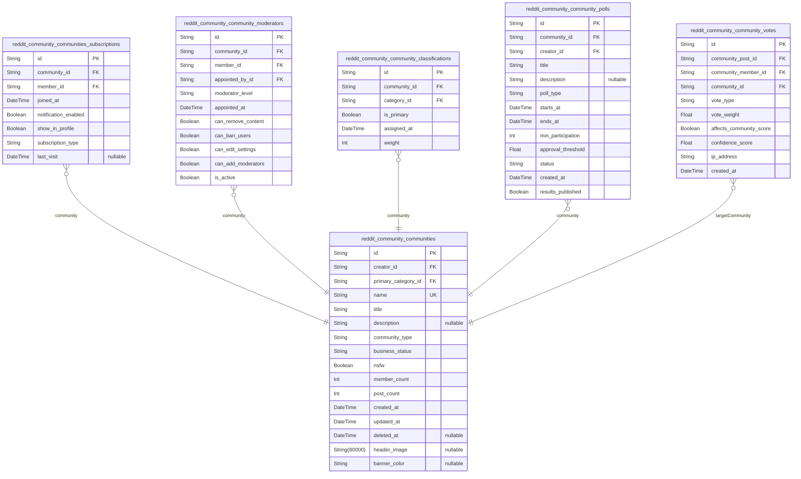

# Prisma Markdown

> Generated by [`prisma-markdown`](https://github.com/samchon/prisma-markdown)

- [Systematic](#systematic)
- [Actors](#actors)
- [Content](#content)
- [Communities](#communities)
- [VotingKarma](#votingkarma)
- [Comments](#comments)
- [Subscriptions](#subscriptions)
- [Moderation](#moderation)
- [Profiles](#profiles)
- [default](#default)

## Systematic

### `reddit_community_platform_settings`

Core platform configuration and settings management for the Reddit
community platform. Manages system-wide parameters that affect all
communities and users.

Properties as follows:

- `id`: Primary Key.
- `setting_key`: Unique identifier for the platform setting configuration key.
- `setting_value`: The value or configuration data for this platform setting.
- `setting_type`: The data type of this setting (string, number, boolean, json).
- `description`
  > Detailed description explaining the purpose and usage of this platform
  > setting.
- `category`
  > The functional category this setting belongs to (admin, moderation,
  > content, etc).
- `is_public`: Whether this setting is visible to the public or only to administrators.
- `is_editable`: Whether this setting can be modified through the admin interface.
- `min_value`: The minimum acceptable numeric value for this setting if applicable.
- `max_value`: The maximum acceptable numeric value for this setting if applicable.
- `default_value`: The default value that should be used if no explicit value is set.
- `validation_rules`: JSON array containing validation rules for this setting's values.
- `created_at`: The timestamp when this platform setting was first created.
- `updated_at`: The timestamp when this platform setting was last modified.
- `updated_by`
  > The timestamp when this platform setting was last updated by an admin
  > user.

### `reddit_community_content_categories`

Content categorization system for organizing posts and discussions into
hierarchical topic classifications across communities.

Properties as follows:

- `id`: Primary Key.
- `parent_id`
  > Content category's [reddit_community_content_categories.parent_id](#reddit_community_content_categories)
  > for hierarchical categorization.
- `name`: The display name of this content category used in user interfaces.
- `slug`: URL-friendly identifier for this category used in links and routing.
- `description`: Detailed description explaining the purpose and scope of this category.
- `is_active`
  > Whether this category is currently active and available for content
  > organization.
- `sort_order`: The display order position for this category within its parent level.
- `icon_name`: Name of the icon asset to display for this category in the UI.
- `color_hex`: Hexadecimal color code for this category's visual styling.
- `level`: Hierarchy level (0-5) indicating depth within category tree structure.
- `level_path`: Dot-separated path of this category within the complete hierarchy.
- `created_at`: Timestamp when content category was first created.
- `updated_at`: Timestamp when content category was last modified.

### `reddit_community_report_reasons`

Standardized report reason definitions used across all communities for
consistent content moderation and user reporting workflows.

Properties as follows:

- `id`: Primary Key.
- `reason_code`: Unique code identifier for this report reason used in APIs and logic.
- `title`: The display title shown to users when selecting report reasons.
- `description`: Detailed explanation of when to use this report reason.
- `category`
  > The category this reason belongs to (spam, harassment, policy_violation,
  > etc).
- `severity_level`: Severity rating (1-5) used for priority sorting in moderation queues.
- `is_active`: Whether this report reason is active and available for users.
- `is_auto_approved`
  > Whether content reported with this reason should be auto-hidden and
  > queued.
- `requires_explanation`
  > Whether selecting this reason requires users to provide additional
  > context.
- `minimum_explanation_length`: Minimum number of characters required for the explanation when required.
- `escalation_threshold`
  > Number of reports before auto-escalating to admin review (null means no
  > auto escalation).
- `help_text`: Help text shown to reporters guiding their submission for this reason.
- `example_text`: Sample content showing what this reason is appropriate for reporting.
- `sort_order`: The position this reason should appear in when shown to users.
- `created_at`: Timestamp when this report reason was created.
- `updated_at`: Timestamp when this report reason was last updated.

### `reddit_community_audit_logs`

Comprehensive audit trail logging system that tracks all significant
platform activities, configuration changes, user actions, and system
events for compliance and debugging purposes.

Properties as follows:

- `id`: Primary Key.
- `performed_by_id`
  > User's [reddit_community_members.id](#reddit_community_members) who performed the audited
  > action.
- `impacted_user_id`
  > User's [reddit_community_members.id](#reddit_community_members) who was impacted by the
  > audited action.
- `action_type`: The type of action performed (create, update, delete, login, logout, ban).
- `entity_type`
  > The platform entity affected (user, community, post, comment, vote,
  > admin).
- `entity_id`: The ID of the specific entity that was modified or affected.
- `action_description`: Human-readable description of the specific action that was performed.
- `previous_values`: JSON string containing previous state of modified fields before change.
- `new_values`: JSON string containing new state of modified fields after change.
- `severity_level`: Severity level (1-5) for filtering and prioritizing audit entries.
- `ip_address`: IP address associated with the user action for security tracking.
- `user_agent`: User agent string from the browser or client application.
- `session_id`: Session ID linking this audit entry to user authentication context.
- `action_status`: Whether the action completed (succeeded, failed, partially_completed).
- `error_message`: If status is failed, contains the error details or failure reason.
- `metadata`: JSON metadata with additional context fields for specific audit types.
- `timestamp`: The exact timestamp when this audit action was performed.
- `created_at`: Audit log entry creation timestamp.

## Actors

### `reddit_community_guest_profiles`

Guest user profiles for non-authenticated browsing with limited platform
access. Guest accounts enable content viewing and community discovery
without requiring registration, providing seamless entry into the
platform ecosystem.

Properties as follows:

- `id`: Primary Key.
- `user_id`: Target user's [reddit_community_user_profiles.id](#reddit_community_user_profiles)
- `guest_alias`: Anonymous display name for guest browsing sessions
- `session_id`: Unique session identifier for tracking guest activity
- `last_ip_address`: Most recent IP address used by the guest
- `device_info`: Browser and device metadata for session management
- `browsing_preferences`: JSON-encoded preferences for content filtering and display
- `total_views`: Total number of posts and comments viewed during guest session
- `is_active`: Whether the guest session is currently active
- `session_started_at`: When the guest session was initiated
- `session_expires_at`: When the guest session will automatically expire
- `created_at`: Record creation timestamp
- `updated_at`: Record last update timestamp

### `reddit_community_members`

Registered member accounts with full platform access including
authentication, karma tracking, and community participation privileges.

Properties as follows:

- `id`: Primary Key.
- `user_id`: Target user's reddit_community_user_profiles.id
- `username`: Unique username for member identification
- `email`: Email address for authentication and notifications
- `password_hash`: Hashed password for secure authentication
- `email_verified`: Whether the member's email address has been verified
- `business_status`: Current business workflow status (active, suspended, banned, pending)
- `post_karma`: Total karma earned from post submissions
- `comment_karma`: Total karma earned from comment contributions
- `total_karma`: Combined karma score from all contributions
- `reputation_level`: Current reputation level based on karma thresholds
- `can_create_communities`: Whether the member can create new communities
- `is_moderator`: Whether the member has moderator privileges in any community
- `deleted_at`: Soft delete timestamp for account deactivation
- `last_login_at`: Most recent login timestamp
- `joined_at`: When the member joined the platform
- `created_at`: Record creation timestamp
- `updated_at`: Record last update timestamp

### `reddit_community_moderators`

Community moderator accounts with permissions for content management,
user supervision, and community governance within specific communities.

Properties as follows:

- `id`: Primary Key.
- `user_id`: Moderator's [reddit_community_user_profiles.id](#reddit_community_user_profiles)
- `community_id`: Moderated community's [reddit_community_communities.id](#reddit_community_communities)
- `member_id`: Member account's [reddit_community_members.id](#reddit_community_members)
- `moderator_level`: Moderator hierarchy level: head, senior, or junior
- `permissions_set`: JSON-encoded object defining specific moderation permissions
- `appointed_by`: Member ID of the moderator who appointed this role
- `moderation_count`: Total number of moderation actions taken
- `appointed_at`: When the moderator role was assigned
- `last_moderation_at`: Most recent moderation action timestamp
- `is_active`: Whether the moderator role is currently active
- `created_at`: Record creation timestamp
- `updated_at`: Record last update timestamp

### `reddit_community_admin_accounts`

Platform administrator accounts with system-wide privileges for platform
management, policy enforcement, and administrative oversight across all
communities.

Properties as follows:

- `id`: Primary Key.
- `user_id`: Administrator's [reddit_community_user_profiles.id](#reddit_community_user_profiles)
- `admin_level`: Admin hierarchy level (super, senior, support)
- `admin_role`: Specific administrative role (platform, legal, community, technical)
- `permissions_matrix`: JSON-encoded object defining system-wide permissions
- `appointed_at`: When the administrator role was assigned
- `last_admin_action_at`: Most recent administrative action timestamp
- `is_active`: Whether the admin account is currently active
- `created_at`: Record creation timestamp
- `updated_at`: Record last update timestamp

### `reddit_community_user_profiles`

Core user profile information serving as the public identity interface
with display customization and verification status.

Properties as follows:

- `id`: Primary Key
- `user_id`: Parent user profile reference
- `display_name`: User's public display name shown in communities and posts
- `bio`: Brief user biography or description visible in profile
- `location`: User's public location information
- `website_url`: User's personal website URL
- `reddit_url`: User's Reddit profile URL
- `twitter_url`: User's Twitter profile URL
- `is_verified`: Whether user's email and identity are verified
- `verification_date`: Date when user was verified
- `deleted_at`: Soft delete timestamp for profile deactivation
- `created_at`: Record creation timestamp
- `updated_at`: Record last update timestamp

## Content

### `reddit_community_posts`

Core content posts that users create within communities, supporting
multiple content types including text, links, and images with
comprehensive editing capabilities and version control. Enhanced with
proper soft delete handling and improved moderation status tracking.

Properties as follows:

- `id`: Primary Key.
- `reddit_community_member_id`: Author's reddit_community_members.id
- `reddit_community_id`: Belonged community's reddit_community_communities.id
- `slug`: URL-friendly identifier for the post, unique within the community
- `type`: Type of post: text, link, image, video, poll, or collection
- `status`: Publication status: draft, published, scheduled, or archived
- `visibility`: Visibility level: public, community_only, members_only, or private
- `moderation_status`
  > Current moderation status: pending, approved, flagged, hidden, removed,
  > or deleted
- `score`: Calculated score based on upvotes minus downvotes
- `is_pinned`: Whether the post is pinned to the top of the community feed
- `allow_comments`: Whether comments are allowed on this post
- `allow_voting`: Whether voting is enabled for this post
- `comment_count`: Total number of comments on this post
- `created_at`: Timestamp when the post was created
- `updated_at`: Timestamp when the post was last modified
- `deleted_at`: Timestamp when the post was soft deleted

### `reddit_community_post_snapshots`

Historical snapshots capturing post content states at specific points in
time, enabling rollback capabilities and content history tracking for
version control.

Properties as follows:

- `id`: Primary Key.
- `reddit_community_posts_id`: Original post's [reddit_community_posts.id](#reddit_community_posts)
- `title`: Snapshot of the post title at this point in time.
- `body`: Snapshot of the post body/content at this point in time.
- `link_url`: Snapshot of the linked URL for link posts.
- `content_metadata`
  > JSON metadata for post content including image URLs, embedded media, or
  > structured data.
- `edit_reason`: Optional reason provided by the editor for this snapshot.
- `created_at`: Timestamp when this snapshot was created.

### `reddit_community_post_units`

Individual units within multi-part posts, enabling structured content
like series, albums, or step-by-step guides with proper sequencing and
organization.

Properties as follows:

- `id`: Primary Key.
- `reddit_community_posts_id`: Parent post's [reddit_community_posts.id](#reddit_community_posts)
- `parent_reddit_community_post_unit_id`: Parent unit for nested hierarchy [reddit_community_post_units.id](#reddit_community_post_units)
- `sequence_order`: Display order of this unit within the post.
- `type`: Type of unit: text, image, video, link, poll, or embedded.
- `title`: Title for this specific unit.
- `content_summary`: Brief summary or description of the unit content.
- `content_data`: JSON data containing unit-specific content, URLs, or media references.
- `is_required`: Whether this unit must be completed or viewed.
- `created_at`: Timestamp when this unit was created.
- `updated_at`: Timestamp when this unit was last updated.

### `reddit_community_post_unit_options`

Configuration options for interactive post units, enabling features like
poll choices, quiz answers, or interactive elements within multi-part
content.

Properties as follows:

- `id`: Primary Key.
- `reddit_community_post_units_id`: Parent unit's [reddit_community_post_units.id](#reddit_community_post_units)
- `option_key`: Identifier for this option within the unit.
- `option_label`: Display label for this option.
- `option_data`: JSON data containing option configuration, values, or metadata.
- `sequence_order`: Display order of this option within the unit.
- `is_correct`: Whether this option is correct (for quizzes).
- `created_at`: Timestamp when this option was created.

### `reddit_community_comments`

Individual comment entities with nested reply support up to 6 levels
deep. Contains text content, author information, vote statistics, and
hierarchical positioning for threaded discussions. Fixed unique
constraint reference issue.

Properties as follows:

- `id`: Primary Key.
- `reddit_community_post_id`: Target model's reddit_community_posts.id
- `parent_id`: Parent comment's reddit_community_comments.id for nested replies
- `reddit_community_member_id`: Target model's reddit_community_members.id
- `content`: Comment text content up to 10,000 characters with full markdown support
- `depth`: Nesting depth level from 1-6 indicating reply chain position
- `upvotes`: Number of upvotes received for this comment
- `downvotes`: Number of downvotes received for this comment
- `is_deleted`: Whether the comment has been soft-deleted by author
- `is_moderator_removed`: Whether the comment was removed by moderators
- `is_hidden`: Whether the comment is hidden due to low score or moderation
- `created_at`: Timestamp when comment was first created
- `updated_at`: Timestamp when comment content was last edited
- `deleted_at`: Timestamp when comment was soft-deleted if applicable

## Communities

### `reddit_community_communities`

Community (subreddit) entities that serve as the primary organizational
units for content and discussions. Communities can be public, restricted,
or private, and support custom themes, rules, and member management with
comprehensive moderation and analytics capabilities.

Properties as follows:

- `id`: Primary Key.
- `creator_id`: Creator user's [reddit_community_user_profiles.id](#reddit_community_user_profiles)
- `primary_category_id`
  > Primary category for community discovery {@link
  > reddit_community_content_categories.id}
- `name`: Unique community name (3-21 characters, alphanumeric and underscores only)
- `title`: Display title of the community
- `description`: Community description and purpose
- `community_type`: Community access type: public, restricted, or private
- `business_status`: Current operational status: active, archived, suspended, under_review
- `nsfw`: Whether community contains NSFW content requiring age verification
- `member_count`: Current number of community members
- `post_count`: Total number of posts in the community
- `created_at`: Community creation timestamp
- `updated_at`: Last modification timestamp
- `deleted_at`: Soft deletion timestamp for community removal
- `header_image`: URL of community header image
- `banner_color`: Primary color for community theme

### `reddit_community_communities_subscriptions`

User subscriptions to communities with join/leave functionality,
notification preferences, and subscription metadata for feed
personalization.

Properties as follows:

- `id`: Primary Key.
- `community_id`: Subscribed community's [reddit_community_communities.id](#reddit_community_communities)
- `member_id`: Subscribing user's [reddit_community_members.id](#reddit_community_members)
- `joined_at`: Timestamp when user joined the community
- `notification_enabled`: Whether user wants notifications for community activity
- `show_in_profile`: Whether subscription is visible in user's public profile
- `subscription_type`: Type of subscription: regular, premium, or founder
- `last_visit`: Last time user visited this community

### `reddit_community_community_moderators`

Moderators assigned to communities with hierarchical permissions (head,
senior, junior) and granular control over community management functions.

Properties as follows:

- `id`: Primary Key.
- `community_id`: Moderated community's [reddit_community_communities.id](#reddit_community_communities)
- `member_id`: Moderator user's [reddit_community_members.id](#reddit_community_members)
- `appointed_by_id`: Member who appointed this moderator [reddit_community_members.id](#reddit_community_members)
- `moderator_level`: Moderator hierarchy level: head, senior, or junior
- `appointed_at`: When this user became a moderator
- `can_remove_content`: Permission to remove posts and comments
- `can_ban_users`: Permission to ban community members
- `can_edit_settings`: Permission to modify community settings
- `can_add_moderators`: Permission to appoint other moderators
- `is_active`: Whether moderator is currently active

### `reddit_community_community_classifications`

Community classification system for discovery and categorization,
supporting multiple categories per community and hierarchical topic
organization for better content discovery.

Properties as follows:

- `id`: Primary Key.
- `community_id`: Classified community's [reddit_community_communities.id](#reddit_community_communities)
- `category_id`: Classification category [reddit_community_content_categories.id](#reddit_community_content_categories)
- `is_primary`: Whether this is the primary classification for the community
- `assigned_at`: When classification was assigned
- `weight`: Classification weight for sorting and recommendation

### `reddit_community_community_polls`

Democratic governance polls for community decisions including rule
changes, moderator appointments, and policy modifications with
configurable voting periods and participation requirements.

Properties as follows:

- `id`: Primary Key.
- `community_id`: Community holding the poll [reddit_community_communities.id](#reddit_community_communities)
- `creator_id`: Member who created the poll [reddit_community_members.id](#reddit_community_members)
- `title`: Poll question or title
- `description`: Detailed explanation of the poll and its implications
- `poll_type`
  > Type of poll: rule_change, moderator_addition, policy_modification, or
  > general
- `starts_at`: When voting period begins
- `ends_at`: When voting period ends
- `min_participation`: Minimum number of votes required for valid poll
- `approval_threshold`: Percentage of votes needed for approval (0.0-1.0)
- `status`: Current status: draft, active, completed, or cancelled
- `created_at`: Poll creation timestamp
- `results_published`: Whether results have been published to community

### `reddit_community_community_votes`

Individual vote records for posts and comments within communities,
serving as real-time mechanism for content ranking and community
engagement metrics. Provides integration between community content and
voting system with audit trail capabilities.

Properties as follows:

- `id`: Primary Key.
- `community_post_id`: Community content being voted on [reddit_community_posts.id](#reddit_community_posts)
- `community_member_id`: Community member casting vote [reddit_community_members.id](#reddit_community_members)
- `community_id`: Target community [reddit_community_communities.id](#reddit_community_communities)
- `vote_type`: Type of vote: upvote or downvote
- `vote_weight`: Weighted score multiplier based on voter reputation
- `affects_community_score`: Whether this vote affects community popularity calculations
- `confidence_score`: Confidence score for anti-manipulation detection
- `ip_address`: IP address of voter for fraud detection
- `created_at`: Timestamp when vote was cast

## VotingKarma

### `reddit_community_votes`

Individual vote records for posts and comments, serving as the core
mechanism for content curation and karma calculation. Tracks vote type,
timing, and voter information for real-time ranking updates and
anti-manipulation analysis.

Properties as follows:

- `id`: Primary Key.
- `user_id`: Voter's [reddit_community_members.id](#reddit_community_members)
- `content_id`: Target content's ID (post or comment)
- `content_comment_id`: Target comment's [reddit_community_comments.id](#reddit_community_comments) if voting on comment
- `content_type`: Type of content voted on: 'post' or 'comment'
- `vote_type`: Type of vote: 'upvote' or 'downvote'
- `vote_weight`
  > Calculated weight of vote based on voter reputation and anti-manipulation
  > factors
- `ip_address`: IP address of voter for fraud detection
- `user_agent`: Browser user agent for fraud detection
- `created_at`: Timestamp when vote was cast
- `updated_at`: Timestamp when vote was modified

### `reddit_community_karma_history`

Complete audit trail of karma changes for users, tracking every
karma-modifying event including votes received, votes reverted, and
system adjustments. Essential for reputation calculations and dispute
resolution.

Properties as follows:

- `id`: Primary Key.
- `user_id`: User whose karma changed [reddit_community_members.id](#reddit_community_members)
- `source_id`: Source content ID that caused karma change
- `karma_type`: Type of karma: 'post' or 'comment'
- `change_amount`: Amount of karma change (positive or negative)
- `change_reason`: Reason for karma change: 'upvote','downvote','revert','adjustment'
- `source_type`: Type of source content: 'post','comment','award','manual'
- `community_id`: Community where karma was earned [reddit_community_communities.id](#reddit_community_communities)
- `previous_balance`: User karma balance before this change
- `new_balance`: User karma balance after this change
- `created_at`: Timestamp when karma change occurred

### `reddit_community_vote_snapshots`

Point-in-time snapshots of voting patterns and content scores for
historical analysis and algorithm calibration. Captures vote
distributions, engagement metrics, and ranking factors used in content
sorting algorithms.

Properties as follows:

- `id`: Primary Key.
- `content_id`: Content being snapshotted (post or comment)
- `content_type`: Type of content: 'post' or 'comment'
- `community_id`: Community ID for context [reddit_community_communities.id](#reddit_community_communities)
- `snapshot_type`: Type of snapshot: 'ranking','trending','algorithm','manual'
- `upvote_count`: Number of upvotes at snapshot time
- `downvote_count`: Number of downvotes at snapshot time
- `net_score`: Calculated net score (upvotes - downvotes)
- `controversy_score`: Controversy calculation: (upvotes+downvotes)/max(|net_score|,1)
- `hot_score`: Hot algorithm score for content ranking
- `comment_count`: Number of comments at snapshot time
- `engagement_rate`: Engagement rate calculation
- `vote_velocity`: Votes per hour rate at snapshot time
- `created_at`: Timestamp when snapshot was created

### `reddit_community_reputation_levels`

Defines reputation tiers and associated privileges based on karma
thresholds. Controls access to advanced features, moderation
capabilities, and platform recognition programs.

Properties as follows:

- `id`: Primary Key.
- `level_name`
  > Name of reputation level: 'New
  > User','Regular','Active','Established','Veteran','Elite'
- `level_order`: Numeric order of level (1-6) for ranking purposes
- `min_karma`: Minimum total karma required for this level
- `max_karma`: Maximum karma for this level (null for highest level)
- `privileges`: JSON array of unlocked privileges for this level
- `badge_color`: Hex color code for level badge display
- `badge_icon`: URI to badge icon for visual representation
- `description`: Description of reputation level and benefits
- `is_active`: Whether this reputation level is currently active
- `created_at`: When reputation level was defined
- `updated_at`: When reputation level was last modified

## Comments

### `reddit_community_comment_moderation_queue`

Centralized moderation queue for comment content review with SLA tracking
and processing status for all moderation actions across communities.

Properties as follows:

- `id`: Primary Key
- `content_report_id`: Associated report's [reddit_community_content_reports.id](#reddit_community_content_reports)
- `assigned_moderator_id`: Assigned moderator's [reddit_community_moderators.id](#reddit_community_moderators)
- `community_id`: Community where content exists [reddit_community_communities.id](#reddit_community_communities)
- `reddit_community_comment_id`: Target model's [reddit_community_comments.id](#reddit_community_comments)
- `queue_type`
  > Queue type (report_review, automated_flag, dmca_notice, legal_review,
  > appeal_review)
- `sla_deadline`: SLA deadline based on violation severity (4h/24h/72h)
- `priority_level`: Priority classification (high, medium, low) for processing order
- `status`: Status (pending, in_review, approved, rejected, deferred, escalated)
- `review_notes`: Moderator notes and decision rationale
- `enforcement_action`
  > Action taken (no_action, warning, content_removal, user_restriction,
  > user_ban, community_ban)
- `moderation_status`: Status pending/reviewed/approved/removed/appealed
- `priority`: Priority level high/medium/low for review urgency
- `reason_detail`: Detailed explanation of reported violation
- `escalated_to_admin`: Whether item was escalated to platform administrators
- `created_at`: When item entered queue
- `started_review_at`: When moderator began review
- `resolved_at`: When resolution was completed

### `reddit_community_comment_votes`

Voting records for individual comments tracking upvotes and downvotes
with user identification and timestamps. Enables anti-manipulation
measures and karma calculations.

Properties as follows:

- `id`: Primary Key.
- `reddit_community_comment_id`: Target model's [reddit_community_comments.id](#reddit_community_comments)
- `reddit_community_member_id`: Target model's [reddit_community_members.id](#reddit_community_members)
- `vote_type`: Type of vote either 'upvote' or 'downvote'
- `weight`: Karma weight multiplier based on user reputation
- `created_at`: Timestamp when the vote was cast
- `ip_address`: IP address of voting user for anti-manipulation
- `user_agent`: Browser user agent string for fraud detection

### `reddit_community_comment_threads`

Thread structure management for nested comment discussions supporting up
to 6 levels deep. Maintains parent-child relationships and thread state
for display optimization.

Properties as follows:

- `id`: Primary Key.
- `reddit_community_post_id`: Target model's [reddit_community_posts.id](#reddit_community_posts)
- `max_depth_reached`: Maximum nesting depth achieved in this thread
- `comment_count`: Total number of comments in the thread
- `hidden_count`: Number of comments hidden due to low scores
- `sort_default`: Default sorting mode best/new/controversial/old
- `is_locked`: Whether new comments are disabled for this thread
- `created_at`: Timestamp when thread was first created
- `updated_at`: Timestamp of last structural change
- `last_activity`: Timestamp of most recent comment activity

## Subscriptions

### `reddit_community_user_subscriptions`

User subscription relationships with communities including subscription
status, preferences, and engagement tracking. Supports subscription
management, feed customization, and community relationship analytics.

Properties as follows:

- `id`: Primary Key.
- `user_id`: Target user's [reddit_community_user_profiles.id](#reddit_community_user_profiles)
- `community_id`: Target community's [reddit_community_communities.id](#reddit_community_communities)
- `subscription_status`: Active subscription status: active, inactive, pending_approval
- `subscription_type`: Type of subscription: standard, priority, muted
- `joined_at`: Timestamp when user joined the community
- `last_engagement_at`: Last time user engaged with community content
- `engagement_score`: Calculated engagement level based on interactions
- `notification_frequency`
  > Preferred notification frequency: real_time, daily_digest, weekly_digest,
  > none
- `is_primary_subscription`: Whether this is a primary subscription for feed priority
- `subscription_priority`: Priority level for feed sorting (higher = more important)
- `created_at`: Record creation timestamp
- `updated_at`: Record update timestamp
- `deleted_at`: Soft delete timestamp for subscription history

### `reddit_community_subscription_preferences`

Individual subscription preferences and settings for personalized user
experience. Controls notification settings, display preferences, and feed
customization options for each subscription relationship.

Properties as follows:

- `id`: Primary Key.
- `subscription_id`: Target subscription's [reddit_community_user_subscriptions.id](#reddit_community_user_subscriptions)
- `feed_priority`: Feed priority weight (0-100) for algorithm calculations
- `show_nsfw_content`: Whether to show NSFW content from this community
- `show_spoiler_content`: Whether to show spoiler content from this community
- `content_type_filter`: Content type filter: all, text_only, link_only, media_only
- `sorting_preference`: Default sorting: hot, new, top, controversial, rising
- `time_filter`: Time filter preference: today, week, month, year, all_time
- `auto_refresh_enabled`: Whether feed auto-refresh is enabled
- `desktop_notifications`: Whether desktop notifications are enabled
- `push_notifications`: Whether push notifications are enabled
- `email_notifications`: Whether email notifications are enabled
- `notification_keywords`: Keywords for smart notification filtering (comma-separated)
- `mute_community`: Temporarily mute all notifications from this community
- `mute_until`: End date for community muting
- `created_at`: Preference creation timestamp
- `updated_at`: Preference update timestamp

### `reddit_community_feed_algorithms`

Feed algorithm configurations for personalized content delivery. Defines
sorting weights, recommendation factors, and machine learning model
parameters for individual users.

Properties as follows:

- `id`: Primary Key.
- `user_id`: Target user's [reddit_community_user_profiles.id](#reddit_community_user_profiles)
- `algorithm_type`
  > Algorithm type: collaborative, content_based, popularity_based,
  > social_graph
- `collaborative_weight`: Weight for collaborative filtering (0.0-1.0)
- `content_similarity_weight`: Content similarity weight in recommendations
- `popularity_weight`: Popularity score weight for trend content
- `social_graph_weight`: Social network relationship weight
- `recency_weight`: Content age weight (newer = higher)
- `engagement_weight`: Engagement rate weight (comments + votes)
- `user_interest_weight`: User-specific interest category weights
- `diversity_factor`: Ensures recommendation diversity (0.1-1.0)
- `freshness_threshold`: Maximum content age in hours for fresh feed
- `recommendation_pool_size`: Number of candidate items per recommendation batch
- `personalization_strength`: Overall personalization intensity (0.0-1.0)
- `learning_rate`: ML model learning rate for adaptive algorithms
- `cold_start_strategy`: Strategy for new users (popular, diverse, social)
- `model_version`: Current ML model version identifier
- `last_trained_at`: Last time algorithm was retrained
- `created_at`: Algorithm creation timestamp
- `updated_at`: Algorithm update timestamp

### `reddit_community_content_discoveries`

Content discovery history and recommendations including viewed content,
clicked suggestions, and discovery effectiveness metrics. Tracks user
behavior for improving recommendation algorithms and feed
personalization.

Properties as follows:

- `id`: Primary Key.
- `user_id`: Target user's [reddit_community_user_profiles.id](#reddit_community_user_profiles)
- `content_id`: Content item ID (post, comment, or community ID)
- `source_community_id`
  > Community where discovery originated {@link
  > reddit_community_communities.id}
- `recommendation_source_id`
  > Feed algorithm or recommendation source {@link
  > reddit_community_feed_algorithms.id}
- `content_type`: Type of content: post, comment, community, user
- `discovery_method`: Discovery source: feed, search, recommendation, trending, social
- `discovery_context`
  > Context of discovery: hot_list, new_list, recommendation_card,
  > search_result
- `user_interaction`: User's interaction: viewed, clicked, upvoted, downvoted, commented
- `interaction_duration`: Duration of interaction in seconds
- `recommendation_confidence`: Algorithm confidence score when recommended
- `user_satisfaction`: Whether user appeared satisfied (clicked/upvoted)
- `is_organic_discovery`: Non-recommendation natural discovery
- `rank_position`: Position in feed or recommendation list
- `time_to_interaction`: Time between display and interaction in seconds
- `discovered_at`: Discovery timestamp for analytics
- `interaction_at`: User interaction timestamp if applicable
- `session_id`: User session identifier for correlation

## Moderation

### `reddit_community_content_reports`

User-submitted reports for content violations across posts, comments, and
user profiles with priority scoring and anonymous reporter protection.

Properties as follows:

- `id`: Primary Key.
- `reporter_id`: Reporter user's [reddit_community_members.id](#reddit_community_members)
- `content_author_id`: Author of reported content's [reddit_community_members.id](#reddit_community_members)
- `post_id`: Reported post's [reddit_community_posts.id](#reddit_community_posts) if applicable
- `comment_id`: Reported comment's [reddit_community_comments.id](#reddit_community_comments) if applicable
- `community_id`: Community where violation occurred [reddit_community_communities.id](#reddit_community_communities)
- `report_category`
  > Violation category (harassment_hate, spam_misleading, violence_threats,
  > inappropriate_nsfw, copyright_infringement, personal_info, impersonation,
  > community_rule)
- `severity_level`
  > Severity classification (level_1_minor, level_2_moderate,
  > level_3_serious, level_4_severe) for progressive discipline
- `violation_type`: Specific violation type within the main category
- `description`
  > Detailed explanation of violation with minimum 30 characters for
  > community rule violations
- `priority_score`
  > Automated priority score (0-100) for queue ordering based on severity and
  > user patterns
- `auto_escalation_triggered`: Whether automatic escalation occurred due to pattern or threshold
- `status`
  > Report status (submitted, under_review, resolved_approved,
  > resolved_rejected, escalated)
- `escalation_reason`: Reason for escalating to administrators if applicable
- `resolution_notes`: Internal notes from moderator review and resolution
- `created_at`: Timestamp when report was submitted
- `updated_at`: Timestamp of last status update
- `resolved_at`: Timestamp when resolution was finalized

### `reddit_community_moderation_queue`

Centralized moderation queue for content review workflows with SLA
tracking and processing status for all moderation actions across
communities.

Properties as follows:

- `id`: Primary Key.
- `content_report_id`: Associated report's [reddit_community_content_reports.id](#reddit_community_content_reports)
- `assigned_moderator_id`: Assigned moderator's [reddit_community_moderators.id](#reddit_community_moderators)
- `community_id`: Community where content exists [reddit_community_communities.id](#reddit_community_communities)
- `queue_type`
  > Queue type (report_review, automated_flag, dmca_notice, legal_review,
  > appeal_review)
- `sla_deadline`: SLA deadline based on violation severity (4h/24h/72h)
- `priority_level`: Priority classification (high, medium, low) for processing order
- `enforcement_level`: Enforcement level (1-4) for progressive discipline framework
- `review_notes`: Moderator notes and decision rationale
- `status`: Queue status (pending, in_review, approved, rejected, deferred, escalated)
- `enforcement_action`
  > Action taken (no_action, warning, content_removal, user_restriction,
  > user_ban, community_ban)
- `enforcement_duration`
  > Duration in days for temporary restrictions (null for permanent or
  > warning)
- `escalated_to_admin`: Whether item was escalated to platform administrators
- `appeal_deadline`: Deadline for user to submit appeal if applicable
- `created_at`: Timestamp when item entered queue
- `started_review_at`: When moderator began review
- `resolved_at`: When resolution was completed

### `reddit_community_violation_records`

Historical records of all policy violations and enforcement actions
supporting progressive discipline through user behavior pattern tracking
across communities and time periods.

Properties as follows:

- `id`: Primary Key.
- `user_id`: Violating user's [reddit_community_members.id](#reddit_community_members)
- `moderator_id`: Taking action moderator's [reddit_community_moderators.id](#reddit_community_moderators)
- `community_id`: Community where violation occurred [reddit_community_communities.id](#reddit_community_communities)
- `related_post_id`: Violating post's [reddit_community_posts.id](#reddit_community_posts) if applicable
- `related_comment_id`: Violating comment's [reddit_community_comments.id](#reddit_community_comments) if applicable
- `violation_type`: Type of violation (harassment, spam, community_rule, content_policy, dmca)
- `severity_level`
  > Severity classification (level_1_minor, level_2_moderate,
  > level_3_serious, level_4_severe)
- `enforcement_action`
  > Action taken (warning, content_removal, posting_restriction,
  > temporary_ban, permanent_ban)
- `action_duration_days`: Duration of restriction in days (null for warnings or permanent actions)
- `policy_section`: Specific platform policy or community rule violated
- `violation_description`: Detailed description of specific violation and evidence
- `violating_content_evidence`: JSON containing screenshots/content excerpts as evidence
- `user_response`: User's explanation or appeal submission
- `appeal_status`: Appeal status (none_pending, under_appeal, appeal_approved, appeal_denied)
- `cross_community_pattern`: Whether part of cross-community violation pattern
- `expires_at`: When temporary restrictions expire (null for permanent actions)
- `created_at`: Timestamp when violation was recorded
- `resolved_at`: When resolution was completed including appeals
- `moderator_justification`: Required justification from moderator taking action

### `reddit_community_automated_moderation`

Automated content moderation results from AI/ML systems tracking content
screening confidence scores, automated actions, and model performance for
machine learning moderation workflows.

Properties as follows:

- `id`: Primary Key.
- `content_post_id`: Screened post's [reddit_community_posts.id](#reddit_community_posts) if applicable
- `content_comment_id`: Screened comment's [reddit_community_comments.id](#reddit_community_comments) if applicable
- `community_id`: Community where content was posted [reddit_community_communities.id](#reddit_community_communities)
- `screening_type`
  > Type of automated screening (text_analysis, image_recognition,
  > link_validation, pattern_detection)
- `confidence_score`: ML model confidence score (0.0-1.0) for violation prediction
- `violation_flags`
  > Detected violation types (harassment, spam, nsfw, copyright,
  > impersonation)
- `automated_action`
  > Automated action taken (immediate_removal, priority_review,
  > standard_queue, no_action)
- `action_threshold`: Confidence threshold that triggered automated action
- `model_version`: Version identifier of ML model used for screening
- `processing_time_ms`: Processing time in milliseconds for performance monitoring
- `false_positive_flag`: Whether human review identified this as false positive
- `created_at`: Timestamp when automated screening completed
- `human_review_required`: Whether human review is required based on confidence level
- `cross_reference_id`: Reference to human review when escalated
- `model_accuracy_feedback`: JSON containing model performance feedback for training improvement

### `reddit_community_user_bans`

User-level enforcement actions including temporary and permanent bans
from individual communities, with appeal processes and rehabilitation
tracking for progressive discipline.

Properties as follows:

- `id`: Primary Key.
- `user_id`: Banned user's [reddit_community_members.id](#reddit_community_members)
- `community_id`: Community where ban is applied [reddit_community_communities.id](#reddit_community_communities)
- `moderator_id`: Banning moderator's [reddit_community_moderators.id](#reddit_community_moderators)
- `ban_type`: Ban type: temporary, permanent, community_wide
- `ban_duration_days`: Duration in days (null for permanent bans)
- `ban_level`: Enforcement level (1-4) based on violation severity
- `reason_category`: Violation category that triggered the ban
- `reason_details`: Detailed explanation of ban reason with evidence
- `ban_effective_at`: When the ban becomes active
- `ban_expires_at`: When temporary ban expires (null for permanent)
- `is_appealable`: Whether user can appeal this ban
- `appeal_deadline`: Deadline for submitting appeal
- `previous_violation_count`: Number of prior violations used for progressive discipline
- `rehabilitation_required`: Whether user must complete rehabilitation before appeal
- `created_at`: When ban was imposed
- `updated_at`: Last modification timestamp

### `reddit_community_appeals`

User-submitted appeals for moderation decisions with multi-level review
hierarchy, transparent appeal tracking, and fair resolution process for
all enforcement actions.

Properties as follows:

- `id`: Primary Key.
- `violation_record_id`
  > Original violation being appealed {@link
  > reddit_community_violation_records.id}
- `appellant_user_id`: User submitting appeal [reddit_community_members.id](#reddit_community_members)
- `assigned_reviewer_id`: Reviewer handling appeal [reddit_community_moderators.id](#reddit_community_moderators)
- `appeal_reason`: Detailed explanation of why violation decision should be overturned
- `new_evidence_provided`: JSON containing new evidence, screenshots, or supporting documentation
- `appeal_status`: Status: submitted, under_review, approved, rejected, escalated
- `review_level`: Review level: initial, senior_moderator, community_council, admin_panel
- `assigned_reviewer_notes`: Review notes from assigned reviewer
- `review_decision`: Reviewer decision: uphold_original, modify_action, overturn_completely
- `decision_explanation`: Detailed explanation of appeal decision
- `final_action_taken`: Action resulting from appeal decision
- `deadline_for_response`: Deadline for user to respond to reviewer questions
- `deadline_for_decision`: Deadline for reviewer to provide decision
- `escalated_reason`: Reason for escalating to higher review level
- `appeal_fees_paid`: Whether any appeal fees were paid or waived
- `created_at`: When appeal was submitted
- `review_started_at`: When review process began
- `resolved_at`: When final decision was made
- `finalized_at`: When decision was implemented and finalized

## Profiles

### `reddit_community_user_activities`

Individual tracking of user activities across the platform including
posts, comments, votes, and community interactions used for analytics,
personalization, and reputation calculation while maintaining historical
audit trails

Properties as follows:

- `id`: Primary Key.
- `user_profile_id`: User profile associated with activity
- `activity_type`
  > Type of activity: post_creation, comment_creation, vote, subscription,
  > profile_update, login, logout
- `user_agent`: Client information from user agent
- `ip_address`: IP address of the user for security tracking
- `activity_duration_seconds`: Duration of activity in seconds
- `is_completed`: Whether activity completed successfully
- `karma_delta`: Karma change associated with this activity
- `platform_reputation_score`: Platform-wide reputation score calculated from this activity
- `session_id`: UUID of current session
- `community_id`: Optional community ID where activity occurred
- `post_id`: Optional post ID where activity occurred
- `comment_id`: Optional comment ID where activity occurred
- `vote_id`: Related vote ID if activity involved voting
- `event_timestamp`: When the activity occurred
- `created_at`: When this activity record was created
- `deleted_at`: Timestamp when activity was soft deleted

### `reddit_community_user_privacy_settings`

Comprehensive privacy controls for user data visibility, sharing
preferences, and access levels across the platform ecosystem with GDPR
compliance

Properties as follows:

- `id`: Primary Key.
- `user_profile_id`: User profile whose privacy is being controlled
- `profile_visibility`: Profile visibility level: public, followers_only, or private
- `show_karma`: Whether to display karma scores publicly
- `profile_view_permission`: Who can view profile information
- `show_activities`: Whether to show activity history publicly
- `allow_followers`: Whether other users can follow this profile
- `search_visibility`: Whether profile appears in search results
- `email_notifications`: Email notification preferences
- `push_notifications`: Push notification preferences
- `browser_notifications`: Browser notification preferences
- `notification_frequency`: Notification frequency: immediate, daily_digest, weekly_digest, none
- `message_privacy_level`: Who can send direct messages
- `contact_preferences`: Whether to accept contact from non-followers
- `blocked_users`: JSON array of blocked user IDs
- `blocked_communities`: JSON array of blocked community IDs
- `data_export_enabled`: Whether user can export their personal data
- `location_sharing`: Whether to display location information publicly
- `created_at`: Record creation timestamp
- `updated_at`: Last update timestamp
- `deleted_at`: Timestamp when privacy settings were soft deleted

### `reddit_community_profile_customizations`

User customization preferences for profile appearance, themes, and
personalization including color schemes, layout preferences, and display
options

Properties as follows:

- `id`: Primary Key.
- `user_profile_id`: User profile whose settings are being customized
- `theme_preference`: Preferred theme: light, dark, or auto
- `color_scheme`: Custom color scheme for profile elements as hex values
- `font_size`: Preferred font size: small, medium, or large
- `layout_density`: Content density preference: compact, normal, or comfortable
- `display_name_highlight`: Whether to highlight usernames in community posts
- `show_breadcrumbs`: Whether to display navigation breadcrumbs in profile
- `show_join_date`: Whether to display account creation date prominently
- `show_comment_count`: Whether to show total comment count on profile
- `show_karma_breakdown`: Whether to display detailed karma breakdown on profile
- `sections_visibility`: JSON array of profile sections to show/hide by default
- `priority_feed_suggestions`: Whether to prioritize personalized feed suggestions
- `show_community_badges`: Whether to show community badges on profile
- `auto_mark_read`: Whether to automatically mark notifications as read
- `created_at`: Record creation timestamp
- `updated_at`: Last update timestamp
- `deleted_at`: Timestamp when customization was soft deleted

## default

### `mv_reddit_community_user_subscription_analytics`

Materialized view for subscription analytics including engagement scores,
subscription patterns, and feed optimization metrics. Supports real-time
feed personalization and subscription recommendation systems.

Properties as follows:

- `id`: Primary Key.
- `user_id`: Target user's [reddit_community_user_profiles.id](#reddit_community_user_profiles)
- `community_id`: Target community's [reddit_community_communities.id](#reddit_community_communities)
- `total_subscriptions`: Total number of user subscriptions
- `active_subscriptions`: Number of currently active subscriptions
- `avg_engagement_score`: Average engagement score across all communities
- `total_posts_viewed`: Total posts viewed across all subscriptions
- `total_comments_made`: Total comments posted across all communities
- `total_votes_cast`: Total votes cast across all communities
- `last_subscription_added_at`: Timestamp of most recent subscription
- `feed_refresh_frequency`: Average feed refresh frequency in minutes
- `recommendation_click_rate`: Rate at which recommendations are clicked
- `subscription_churn_rate`: Rate of subscription cancellations
- `most_active_category`: Most engaged content category
- `calculated_at`: Analytics calculation timestamp

### `mv_reddit_community_popular_subscriptions`

Materialized view tracking most popular community subscriptions with
engagement metrics. Used for trending community discovery and popular
feed generation based on subscription patterns and engagement quality.

Properties as follows:

- `id`: Primary Key.
- `community_id`: Target community's [reddit_community_communities.id](#reddit_community_communities)
- `total_subscribers`: Total number of subscribed users
- `active_subscribers`: Number of active subscribers in past 30 days
- `new_subscribers_last_week`: Number of new subscribers last 7 days
- `engagement_score`: Community engagement score based on interactions
- `avg_subscription_duration`: Average user subscription duration in days
- `subscription_growth_rate`: Growth percentage over past month
- `churn_rate`: User unsubscribing rate percentage
- `top_discovery_methods`: Top sources of community discovery
- `peak_engagement_hour`: Peak hour for community engagement
- `content_quality_score`: Calculated content quality score
- `trending_score`: Current trending score for discovery rankings
- `calculated_at`: Analytics calculation timestamp
