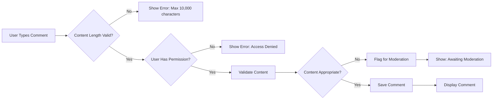
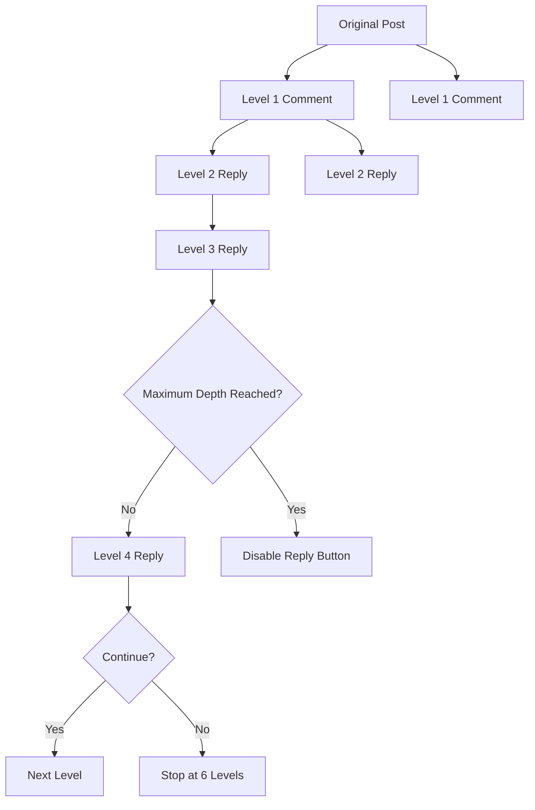
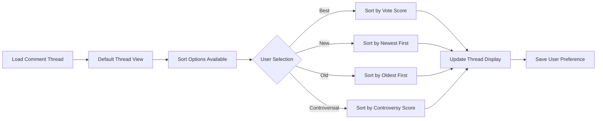
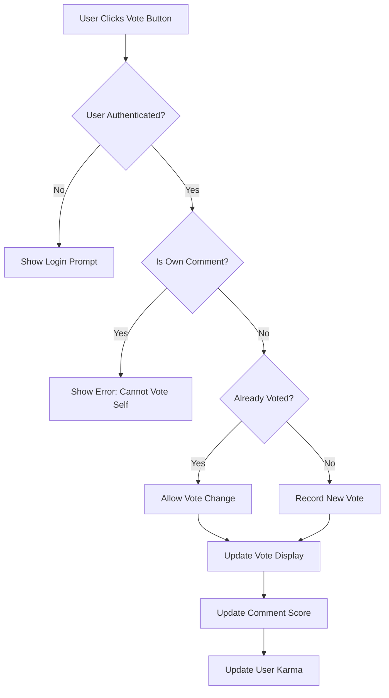
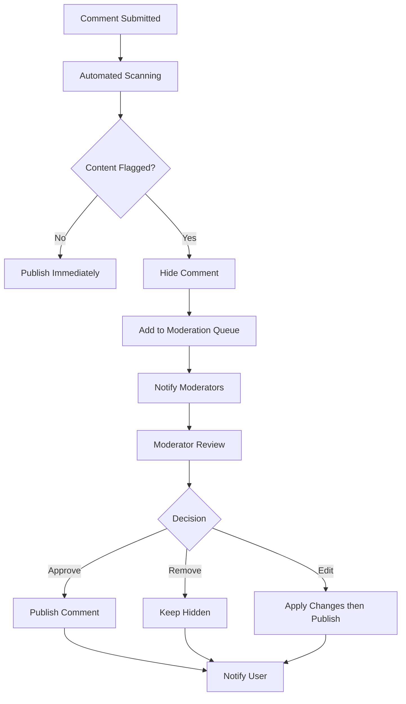
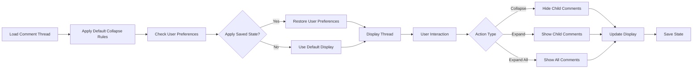

# Commenting System Requirements

## 1. Comment Creation

### Core Commenting Functions
THE system SHALL allow registered users to create comments on posts within communities they have access to.

WHEN a user creates a comment, THE system SHALL store the comment text, author information, timestamp, and associate it with the target post or parent comment.

THE system SHALL support comments up to 10,000 characters in length.

WHEN a comment is submitted, THE system SHALL validate that the content is not empty and does not exceed the character limit.

### User Role Permissions
WHEN a guest attempts to create a comment, THE system SHALL deny access and display a message requiring user registration.

WHILE a member is authenticated, THE system SHALL allow them to create comments on any public post or community they are subscribed to.

IF a member is banned from a community, THEN THE system SHALL prevent them from commenting in that community.

WHEN a moderator creates a comment, THE system SHALL display a moderator badge alongside their comment to indicate their role.

### Content Validation and Processing
THE system SHALL filter comments for prohibited content including spam, harassment, and platform policy violations.

WHEN a comment contains potentially harmful content, THE system SHALL flag it for moderator review before making it visible.

THE system SHALL support basic text formatting including paragraphs, line breaks, and markdown-style formatting for links and emphasis.

WHEN a comment is submitted, THE system SHALL automatically detect and convert URLs to clickable links.

### Comment Creation Workflow

## 2. Nested Replies System

### Thread Depth Management
THE system SHALL support nested comment replies up to 6 levels deep.

WHEN a comment reaches the maximum nesting depth, THE system SHALL disable the reply button and display a message indicating the limit has been reached.

THE system SHALL maintain parent-child relationships between comments to preserve conversation context.

WHEN displaying nested comments, THE system SHALL use visual indentation to indicate reply depth and conversation hierarchy.

### Reply Chain Management
THE system SHALL automatically notify users when someone replies to their comment.

WHEN a user replies to a comment, THE system SHALL maintain a link to the parent comment and display context about the parent in the reply interface.

THE system SHALL allow users to view the original post and full comment thread when composing a reply.

IF a parent comment is deleted, THEN THE system SHALL preserve the reply while updating the display to indicate the original comment was removed.

### Comment Linking and References
THE system SHALL generate unique identifiers for each comment to enable direct linking.

WHEN a comment is created, THE system SHALL generate a permalink that users can share to direct others to that specific comment.

THE system SHALL support internal comment references using @username mentions to notify other users.

### Nested Reply Architecture

## 3. Comment Threading

### Thread Organization
THE system SHALL organize comments into chronological threads by default, with the oldest comments displayed first within each nesting level.

WHEN displaying comment threads, THE system SHALL show the total number of comments in each thread and the number of direct replies for each comment.

THE system SHALL provide users with options to sort comments within threads by newest, oldest, or most voted.

### Sorting and Display Preferences
WHEN a user selects a sorting preference, THE system SHALL apply that preference to all comments within the current thread while maintaining the nested structure.

THE system SHALL remember individual user sorting preferences for comment threads and apply them automatically during future visits.

WHILE displaying threaded comments, THE system SHALL maintain clear visual indicators showing the relationship between parent and child comments.

### Thread Navigation
THE system SHALL provide navigation controls to quickly jump to top-level comments within a thread.

WHEN a thread contains many nested levels, THE system SHALL provide "jump to parent" functionality to help users navigate back up the conversation chain.

THE system SHALL highlight new comments that have been added since the user's last visit to the thread.

### Thread Interaction Controls

## 4. Comment Voting System

### Voting Mechanics
THE system SHALL allow registered users to upvote or downvote individual comments.

WHEN a user votes on a comment, THE system SHALL immediately update the comment's score and persist the vote.

THE system SHALL prevent users from voting multiple times on the same comment by maintaining vote records.

IF a user attempts to vote on their own comment, THEN THE system SHALL display an error message and prevent self-voting.

### Comment Karma Calculation
THE system SHALL calculate comment karma as the total score (upvotes minus downvotes) received by a user's comments.

WHEN calculating comment karma, THE system SHALL include all comments made by the user across all communities and posts.

THE system SHALL update user karma in real-time as votes are cast on their comments.

THE system SHALL display comment karma separately from post karma in user profiles.

### Vote Visibility and Impact
THE system SHALL display the current vote score next to each comment, updating the display in real-time as votes are cast.

WHEN sorting comments by "best" or "controversial", THE system SHALL use vote scores to determine comment ranking within threads.

THE system SHALL collapse comments with significantly negative scores by default while providing users the option to expand and view them.

THE system SHALL highlight highly-voted comments with visual indicators to draw attention to quality contributions.

### Voting Rules by User Role

## 5. Comment Moderation

### Content Review Process
THE system SHALL automatically scan all new comments for spam, inappropriate content, and policy violations using automated filters.

WHEN a comment triggers automated moderation filters, THE system SHALL flag it for human moderator review and hide it temporarily from public view.

THE system SHALL maintain a moderation queue where moderators can review flagged comments and take appropriate actions.

### Moderator Actions
WHEN a moderator reviews a comment, THE system SHALL allow them to approve it, remove it, or edit it to remove problematic content.

THE system SHALL log all moderator actions including the moderator's identity, timestamp, and reason for the action.

IF a comment is removed by a moderator, THEN THE system SHALL display a removal notice to users attempting to view the comment, including the reason for removal when appropriate.

### Community-Specific Moderation
THE system SHALL allow community moderators to set specific rules for comment content within their communities.

WHEN a comment violates community-specific rules, THE system SHALL flag it for review by that community's moderation team.

THE system SHALL enable community moderators to set automated actions for repeat offenders, including temporary posting restrictions.

THE system SHALL provide moderators with tools to view a user's comment history and track patterns of problematic behavior.

### Moderation Workflow

## 6. Collapse/Expand Threads

### User Control Mechanisms
THE system SHALL provide collapse/expand controls for individual comment threads to help users manage long conversations.

WHEN a user collapses a comment thread, THE system SHALL hide all child comments while displaying a summary showing the number of hidden replies.

THE system SHALL remember each user's collapsed thread preferences using browser local storage or user account settings.

### Default Display Behavior
THE system SHALL automatically collapse comments with very low scores (below -5 points) by default.

WHEN displaying long comment threads, THE system SHALL collapse deeply nested replies (levels 4+ deep) to improve readability.

THE system SHALL provide an "expand all" option to quickly show all comments in a thread regardless of current collapse state.

### Thread State Persistence
THE system SHALL maintain thread collapse/expand state when users navigate between posts or refresh the page.

WHEN a user returns to a post they previously viewed, THE system SHALL restore their previous thread collapse/expand preferences.

THE system SHALL sync thread preferences across devices when users are logged into their accounts.

### Performance Optimization
THE system SHALL implement lazy loading for deeply nested comment threads to improve page load performance.

WHEN a user expands a collapsed thread with many replies, THE system SHALL load comments progressively to maintain responsive performance.

THE system SHALL cache comment thread structure to reduce database queries for frequently accessed discussions.

### Thread Management Interface
