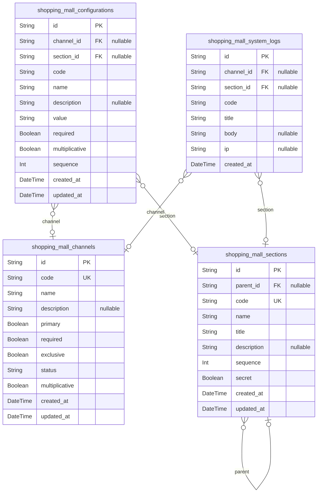
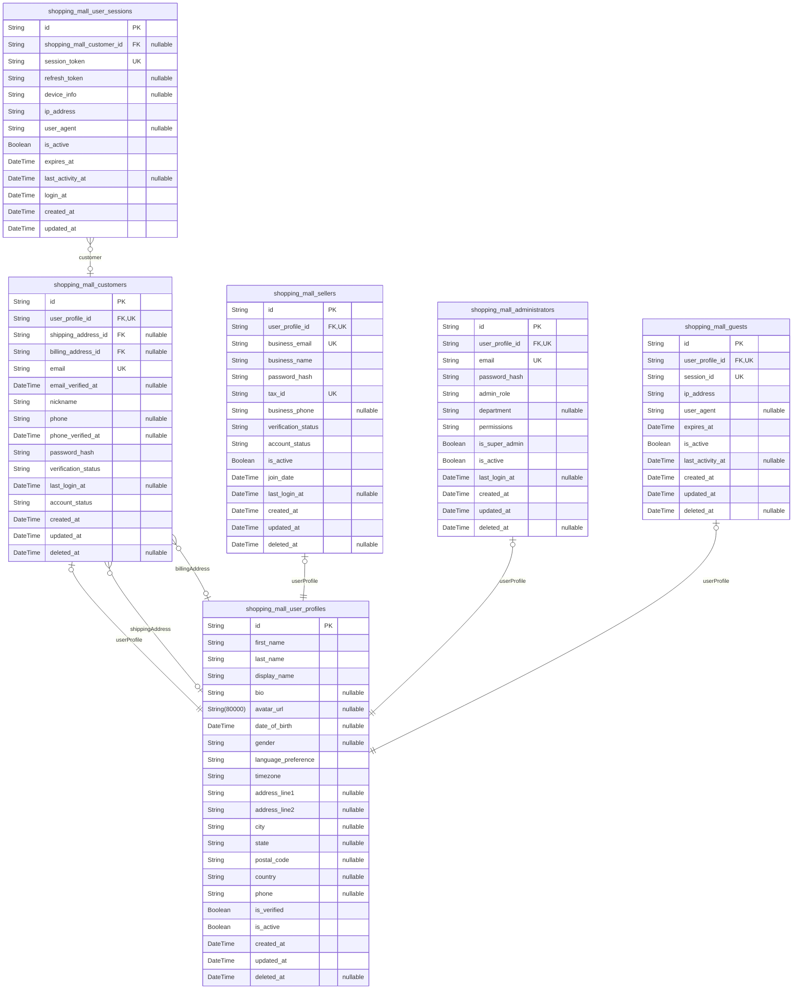
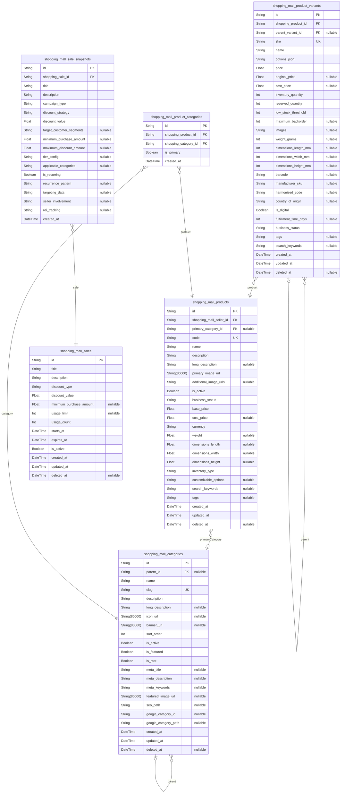
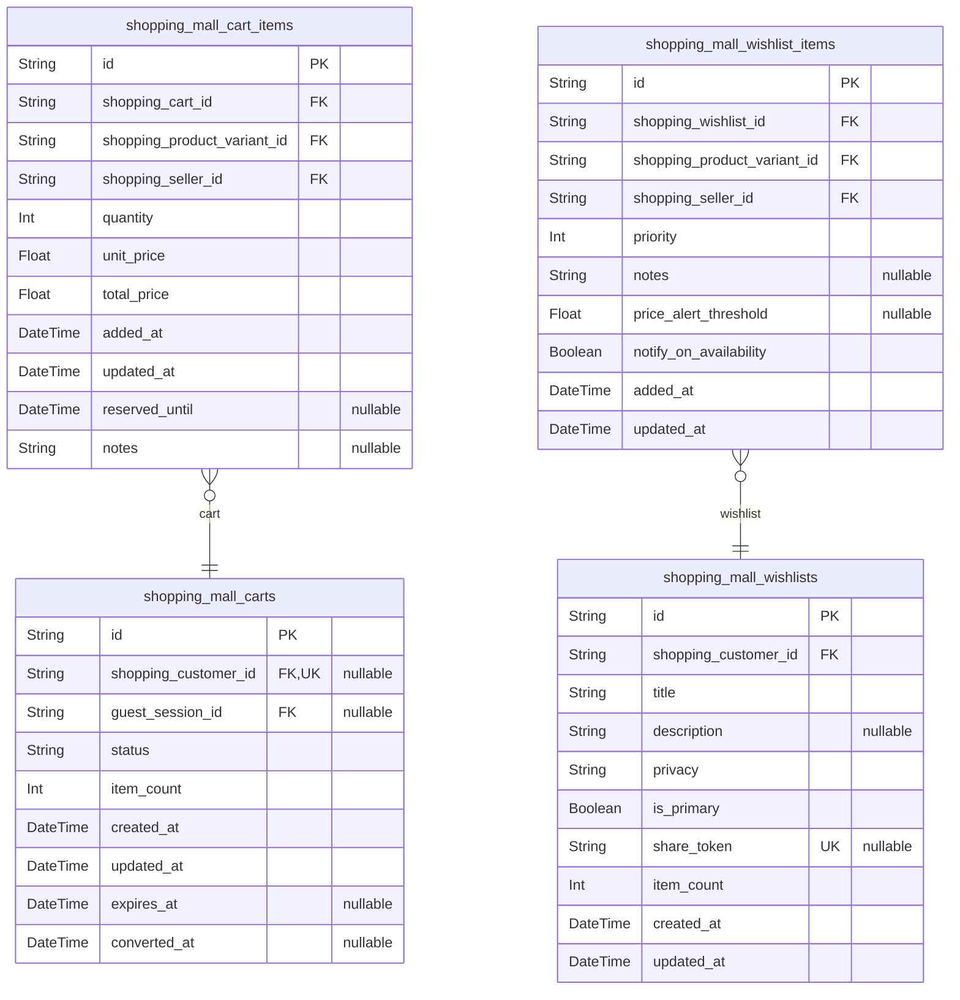
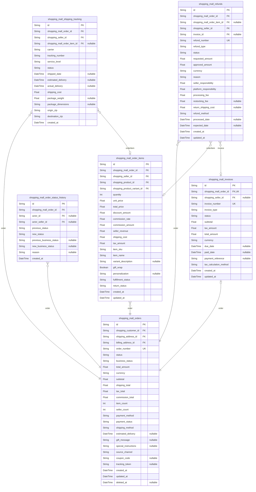
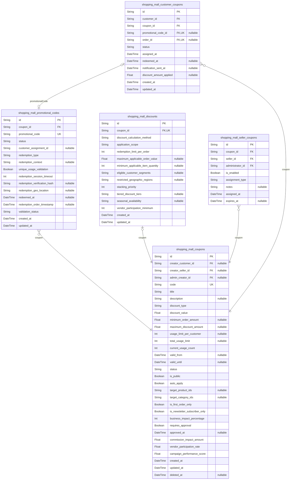
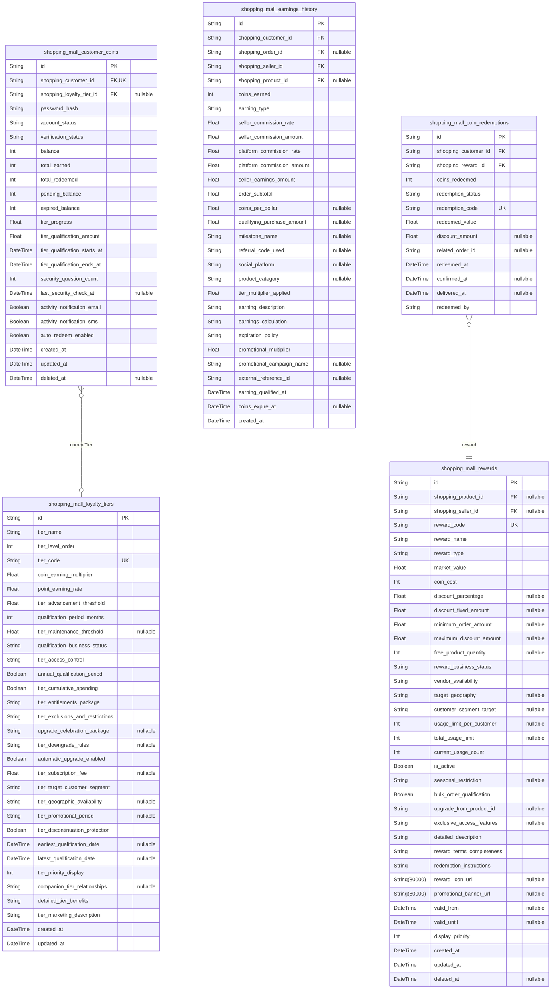
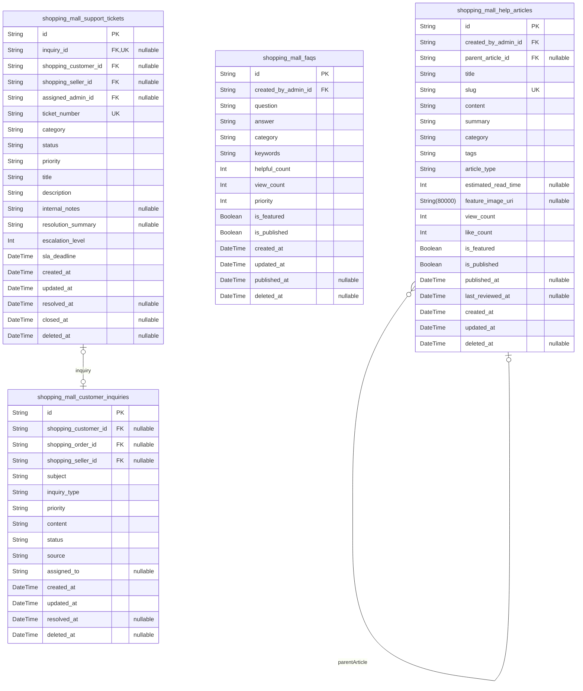
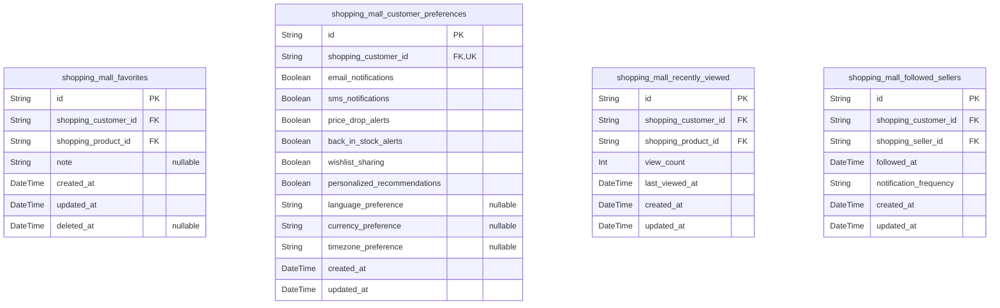
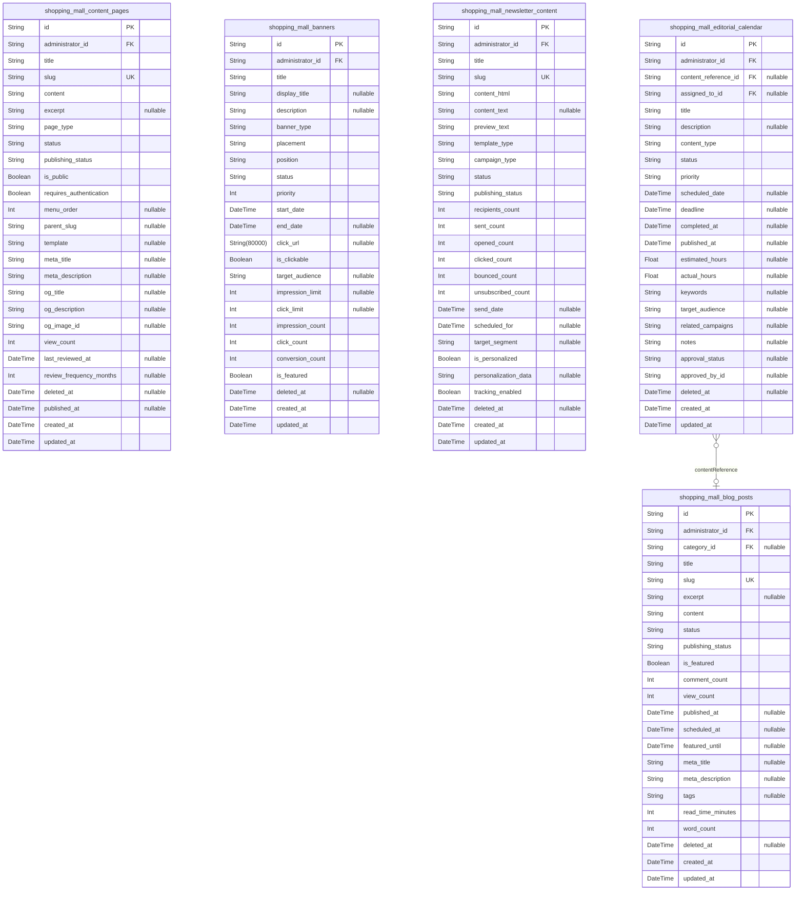

# Prisma Markdown

> Generated by [`prisma-markdown`](https://github.com/samchon/prisma-markdown)

- [Systematic](#systematic)
- [Actors](#actors)
- [Sales](#sales)
- [Carts](#carts)
- [Orders](#orders)
- [Coupons](#coupons)
- [Coins](#coins)
- [Inquiries](#inquiries)
- [Favorites](#favorites)
- [Articles](#articles)

## Systematic

### `shopping_mall_channels`

Marketplace channel configuration defining different sales channels or
storefronts within the multi-vendor shopping mall platform. Channels
organize sellers and products into distinct market segments or geographic
regions.

Properties as follows:

- `id`: Primary Key.
- `code`
  > Unique channel identifier code used for system reference and URL
  > generation.
- `name`
  > Display name of the channel shown to customers and sellers in the
  > marketplace.
- `description`
  > Detailed description explaining the channel's purpose, target audience,
  > and business model.
- `primary`: Indicates if this is the primary/default channel for the platform.
- `required`
  > Specifies whether seller participation in this channel is mandatory or
  > optional.
- `exclusive`
  > Determines if sellers can only participate in this channel or multiple
  > channels simultaneously.
- `status`
  > Channel operational status indicating active, inactive, or maintenance
  > modes.
- `multiplicative`
  > Configures whether channel settings multiply with other configuration
  > parameters or override them.
- `created_at`: Timestamp when the channel configuration was created.
- `updated_at`: Timestamp when the channel configuration was last modified.

### `shopping_mall_sections`

Content sections for organizing marketplace features, content blocks, and
navigation elements within the platform. Sections provide logical
groupings for UI components and functionality organization.

Properties as follows:

- `id`: Primary Key.
- `parent_id`
  > Parent section's [shopping_mall_sections.id](#shopping_mall_sections) for hierarchical
  > section organization.
- `code`
  > Unique section identifier code used for system reference and navigation
  > routing.
- `name`
  > Display name of the section shown in navigation and administrative
  > interfaces.
- `title`
  > Section title used for display headers and SEO optimization in content
  > areas.
- `description`
  > Detailed description explaining the section's content and organizational
  > purpose.
- `sequence`
  > Display order position for sections within their parent container or
  > navigation structure.
- `secret`
  > Indicates if this section contains restricted administrative or
  > system-level content.
- `created_at`: Timestamp when the section was created.
- `updated_at`: Timestamp when the section was last modified.

### `shopping_mall_configurations`

System-wide configuration settings controlling platform behavior, feature
flags, integration parameters, and operational rules across the entire
shopping mall marketplace.

Properties as follows:

- `id`: Primary Key.
- `channel_id`
  > Channel's [shopping_mall_channels.id](#shopping_mall_channels) this configuration applies
  > to, or null for global settings.
- `section_id`
  > Section's [shopping_mall_sections.id](#shopping_mall_sections) this configuration belongs
  > to, or null for system-wide settings.
- `code`
  > Unique configuration key code used for programmatic reference and system
  > integration.
- `name`
  > Human-readable name describing the configuration setting's purpose and
  > functionality.
- `description`
  > Detailed explanation of the configuration setting, its impact, and
  > recommended values.
- `value`
  > Configuration value stored as string for maximum flexibility across
  > different data types.
- `required`
  > Indicates if this configuration parameter is mandatory for system
  > operation.
- `multiplicative`
  > Specifies whether configuration values combine mathematically with other
  > settings or act as absolute values.
- `sequence`
  > Display order for configuration settings within groups or administrative
  > interfaces.
- `created_at`: Timestamp when the configuration was created.
- `updated_at`: Timestamp when the configuration was last modified.

### `shopping_mall_system_logs`

System audit logs recording platform activities, user actions,
administrative changes, errors, and operational events for compliance,
troubleshooting, and system monitoring purposes.

Properties as follows:

- `id`: Primary Key.
- `channel_id`
  > Channel's [shopping_mall_channels.id](#shopping_mall_channels) where the logged event
  > occurred, if applicable.
- `section_id`
  > Section's [shopping_mall_sections.id](#shopping_mall_sections) related to the logged event,
  > if applicable.
- `code`
  > Log event type code identifying the specific system action or event that
  > occurred.
- `title`: Human-readable title describing the logged event for quick identification.
- `body`
  > Detailed event description containing context, parameters, and relevant
  > data.
- `ip`
  > IP address from which the logged action originated, for security and
  > auditing purposes.
- `created_at`: Timestamp when the system log entry was created.

## Actors

### `shopping_mall_customers`

Customer accounts representing registered users who can browse products,
manage shopping carts, place orders, write reviews, and maintain multiple
shipping addresses. Customers have complete e-commerce lifecycle access
including wishlist management and personalized recommendations.

Properties as follows:

- `id`: Primary Key.
- `user_profile_id`
  > Related [shopping_mall_user_profiles.id](#shopping_mall_user_profiles) containing comprehensive
  > customer profile information.
- `shipping_address_id`: Customer's default shipping address for checkout convenience.
- `billing_address_id`: Customer's default billing address for payment processing.
- `email`
  > Customer email address used for authentication and communication. Must be
  > unique across the platform.
- `email_verified_at`: Timestamp of email verification completion for security confirmation.
- `nickname`: Customer display name visible to other users and in communications.
- `phone`
  > Customer phone number for order notifications, delivery coordination, and
  > account verification.
- `phone_verified_at`: Timestamp of phone verification completion for secure communication.
- `password_hash`
  > Bcrypt-hashed password for secure authentication supporting complex
  > password requirements.
- `verification_status`
  > Account verification status indicating email confirmation, phone
  > verification, and identity validation progress.
- `last_login_at`
  > Timestamp of customer's most recent platform login used for activity
  > tracking and session management.
- `account_status`: Customer account operational status: active, suspended, closed.
- `created_at`
  > Account creation timestamp for customer lifecycle tracking and business
  > analytics.
- `updated_at`
  > Last account modification timestamp tracking profile changes and business
  > information updates.
- `deleted_at`
  > Account soft deletion timestamp enabling customer recovery while
  > maintaining data integrity for order history.

### `shopping_mall_sellers`

Seller accounts representing businesses and vendors who can manage
product catalogs, track inventory, process orders, and operate their own
digital storefronts within the marketplace ecosystem.

Properties as follows:

- `id`: Primary Key.
- `user_profile_id`
  > Related [shopping_mall_user_profiles.id](#shopping_mall_user_profiles) containing comprehensive
  > seller profile information.
- `business_email`
  > Business email address for seller authentication and professional
  > communication.
- `business_name`
  > Official business name registered with appropriate authorities for
  > marketplace verification.
- `password_hash`
  > Bcrypt-hashed password providing secure access to seller dashboard and
  > business operations.
- `tax_id`
  > Government-issued tax identification number for business verification and
  > compliance reporting.
- `business_phone`
  > Primary business contact phone for customer service and payment
  > processing communication.
- `verification_status`
  > Business verification status tracking through document validation,
  > license confirmation, and banking verification.
- `account_status`
  > Seller account operational status controlling marketplace visibility and
  > selling privileges.
- `is_active`
  > Business active status determining storefront visibility and order
  > processing capabilities.
- `join_date`
  > Seller registration date for business relationship tracking and
  > marketplace growth analytics.
- `last_login_at`
  > Most recent seller dashboard access timestamp for activity monitoring and
  > security auditing.
- `created_at`
  > Seller account creation timestamp for business analytics and regulatory
  > compliance.
- `updated_at`
  > Last business information update tracking changes for compliance and
  > audit purposes.
- `deleted_at`
  > Business account suspension timestamp enabling recovery analysis while
  > maintaining transaction history.

### `shopping_mall_administrators`

Administrator accounts with platform oversight capabilities including
user management, content moderation, financial monitoring, system
configuration, and comprehensive reporting access for marketplace
operations.

Properties as follows:

- `id`: Primary Key.
- `user_profile_id`
  > Related [shopping_mall_user_profiles.id](#shopping_mall_user_profiles) containing comprehensive
  > administrator profile information.
- `email`
  > Administrator email address for secure login and administrative
  > notifications.
- `password_hash`
  > Bcrypt-hashed password with enhanced security requirements for
  > administrative account protection.
- `admin_role`
  > Administrative role designation determining system access permissions and
  > operational responsibilities.
- `department`
  > Organizational department assignment for role-based access control and
  > internal communication routing.
- `permissions`
  > Granular permission configuration defining specific administrative
  > capabilities and data access restrictions.
- `is_super_admin`
  > Super administrator privileges enabling unrestricted platform access and
  > critical configuration changes.
- `is_active`
  > Administrator account active status controlling platform management
  > capabilities and sensitive operation access.
- `last_login_at`
  > Last administrative dashboard access timestamp for security monitoring
  > and activity auditing.
- `created_at`
  > Administrator account creation timestamp for organizational tracking and
  > security audit purposes.
- `updated_at`
  > Last administrative permission update timestamp tracking access changes
  > for security compliance.
- `deleted_at`
  > Administrator account deactivation timestamp maintaining audit trail
  > while disabling management access.

### `shopping_mall_guests`

Guest user tracking for temporary shopping experiences enabling product
browsing, cart management, and anonymous session persistence while
maintaining privacy and data minimization standards for unregistered
platform visitors.

Properties as follows:

- `id`: Primary Key.
- `user_profile_id`
  > Related [shopping_mall_user_profiles.id](#shopping_mall_user_profiles) containing temporary guest
  > profile information.
- `session_id`
  > Temporary session identifier for guest user tracking and cart persistence
  > across page visits.
- `ip_address`
  > Visitor IP address for session management and basic geographic analysis
  > while respecting privacy regulations.
- `user_agent`
  > Browser user agent information enabling session management and device
  > recognition for guest experience optimization.
- `expires_at`
  > Guest session expiration timestamp enabling automatic cleanup while
  > preserving user data during authorized periods.
- `is_active`
  > Guest session active status for cart operations and temporary feature
  > access control.
- `last_activity_at`
  > Most recent guest interaction timestamp for session lifetime management
  > and data cleanup scheduling.
- `created_at`
  > Guest session creation timestamp for anonymous shopping analytics and
  > session duration tracking.
- `updated_at`
  > Last guest interaction tracking for session renewal and activity
  > monitoring during anonymous browsing.
- `deleted_at`
  > Guest session cleanup timestamp enabling data minimization while
  > maintaining privacy compliance standards.

### `shopping_mall_user_sessions`

User authentication session management tracking login sessions across
devices and browsers with comprehensive security monitoring, access
control, and automatic session cleanup for enhanced platform security and
user experience management.

Properties as follows:

- `id`: Primary Key.
- `shopping_mall_customer_id`
  > Related customer's [shopping_mall_customers.id](#shopping_mall_customers) when session
  > belongs to a registered customer.
- `session_token`
  > Secure session token for authentication validation and API access
  > authorization while maintaining security standards.
- `refresh_token`
  > JWT refresh token enabling extended session duration without repeated
  > authentication challenges.
- `device_info`
  > Device and browser information for session identification across multiple
  > access points and security monitoring.
- `ip_address`
  > Session IP address for security monitoring and geolocation tracking while
  > respecting user privacy requirements.
- `user_agent`
  > Browser user agent providing device and platform information for session
  > management and analytics.
- `is_active`
  > Session active status controlling authentication validity and user access
  > authorization throughout platform operations.
- `expires_at`
  > Session expiration timestamp enforcing security policies and automatic
  > logout protocols for user protection.
- `last_activity_at`
  > Most recent platform interaction timestamp tracking user engagement and
  > session lifecycle management.
- `login_at`
  > Initial session creation tracking authentication events and activity
  > analysis across platform modules.
- `created_at`
  > Session creation timestamp for session analytics and security monitoring
  > across authentication events.
- `updated_at`
  > Last session activity tracking for session renewal calculations and
  > automatic expiration management.

### `shopping_mall_user_profiles`

Comprehensive user profile information serving as the central repository
for all user types enabling detailed profile management, comprehensive
personal information, social features platform-wide across the
marketplace.

Properties as follows:

- `id`: Primary Key.
- `first_name`
  > User first name for personalized communication and profile identification
  > throughout the marketplace platform.
- `last_name`
  > User last name enabling complete profile identification and
  > personalization across customer service and communication.
- `display_name`
  > Public display name visible to other users for communication and social
  > interaction within platform guidelines.
- `bio`
  > User biography description supporting personal profile customization and
  > social engagement features.
- `avatar_url`
  > Profile photo URL for user identification and social features within
  > platform content guidelines and privacy standards.
- `date_of_birth`
  > User date of birth for age verification, personalized recommendations,
  > and demographic analytics while respecting privacy.
- `gender`
  > User gender identification for personalized experiences and demographic
  > analytics with complete privacy protection.
- `language_preference`
  > Preferred interface language for localized experience and communication
  > preferences supporting international users.
- `timezone`
  > User timezone preference for date/time display and notification
  > scheduling consistent with personal preferences.
- `address_line1`
  > Primary address information for shipping, billing, and location-based
  > service personalization while maintaining privacy.
- `address_line2`
  > Secondary address information such as apartment number or suite detail
  > for complete address specification.
- `city`
  > City location information for geographic services, shipping optimization,
  > and regional customization features.
- `state`
  > State or province information for address validation, tax calculations,
  > and regional compliance requirements.
- `postal_code`
  > Postal code for address verification, shipping calculations, and
  > geographic service optimization.
- `country`
  > Country identification for international shipping, compliance
  > requirements, and regional service configuration.
- `phone`
  > Primary contact phone number for customer service, order notifications,
  > and platform communication while maintaining privacy.
- `is_verified`
  > Profile verification status confirming identity validation and completion
  > requirements for platform trust building.
- `is_active`
  > Profile active status controlling visibility and platform access while
  > maintaining data integrity for historical purposes.
- `created_at`
  > Profile creation timestamp for identity management and user lifecycle
  > analytics across platform operations.
- `updated_at`
  > Last profile modification timestamp for change tracking and audit trail
  > maintenance across user activities.
- `deleted_at`
  > Profile deletion timestamp enabling data minimization while maintaining
  > compliance requirements for record retention.

## Sales

### `shopping_mall_products`

Core product definitions representing unified catalog items offered by
sellers across the marketplace. Contains standardized product information
with temporal tracking for price history and promotional integration
while maintaining complete seller relationship audit trails.

Properties as follows:

- `id`: Primary Key.
- `shopping_mall_seller_id`
  > Belonged seller's [shopping_mall_sellers.id](#shopping_mall_sellers). Links products to
  > their offering sellers and enables comprehensive seller-specific
  > performance tracking across marketplace operations.
- `primary_category_id`
  > Primary category's [shopping_mall_categories.id](#shopping_mall_categories) for main product
  > classification while supporting multiple category assignments for
  > enhanced discoverability.
- `code`
  > Unique product identifier code used for SKU generation and comprehensive
  > inventory management across the marketplace platform.
- `name`
  > Product display name used in catalog listings and search results with
  > comprehensive multilingual support for customer discovery.
- `description`
  > Detailed product description supporting rich formatting and multimedia
  > content for comprehensive customer information and persuasive marketing.
- `long_description`
  > Extended product description supporting unlimited text content for SEO
  > optimization and comprehensive customer education about product features.
- `primary_image_url`
  > URL of the main product image for catalog display and customer visual
  > presentation with automatic image optimization for various device sizes.
- `additional_image_urls`
  > JSON array containing URLs of additional product images supporting
  > comprehensive visual representation and customer confidence building.
- `is_active`
  > Product visibility control enabling sellers to activate, deactivate, or
  > preview listings without losing historical performance data.
- `business_status`
  > Business workflow status tracking product lifecycle stages including
  > active, discontinued, seasonal, limited, exclusive and promotion-ready
  > states.
- `base_price`
  > Base retail price for the product used as default pricing reference
  > before promotional adjustments and seller-specific markup calculations.
- `cost_price`
  > Product acquisition cost enabling margin calculations and comprehensive
  > seller performance analytics across product lifecycle management.
- `currency`
  > Product pricing currency code (USD, EUR, etc.) supporting comprehensive
  > international marketplace operations with automatic conversion.
- `weight`
  > Product weight in kilograms for accurate shipping calculations and
  > inventory management across multiple fulfillment centers.
- `dimensions_length`
  > Product length in centimeters for shipping calculations and efficient
  > warehouse storage space allocation requirements.
- `dimensions_width`
  > Product width in centimeters enabling optimal warehouse carton selection
  > and automated capacity planning for marketplace seller inventory
  > management.
- `dimensions_height`
  > Product height in centimeters supporting dimensional weight calculations
  > and comprehensive shipping cost optimization across multiple carrier
  > platforms.
- `inventory_type`
  > Inventory management classification enabling differentiated tracking
  > strategies including standard, perishable, serialized, bundle, and
  > digital product handling.
- `customizable_options`
  > JSON configuration defining personalized product options enabling
  > customer customization while maintaining proper SKU generation for
  > fulfillment tracking.
- `search_keywords`
  > Enhanced search keywords and synonyms supporting intelligent discovery
  > algorithms and comprehensive external search engine optimization.
- `tags`
  > Flexible tagging system for categorization beyond traditional hierarchies
  > enabling semantic search and cross-category product discovery
  > capabilities.
- `created_at`
  > Product creation timestamp for audit trails and chronological tracking
  > across seller performance analysis and marketplace growth metrics.
- `updated_at`
  > Last modification timestamp for data freshness monitoring and
  > synchronization across distributed marketplace systems and external
  > integrations.
- `deleted_at`
  > Soft deletion timestamp enabling product recovery and maintaining
  > historical integrity for comprehensive marketplace analytics.

### `shopping_mall_product_variants`

Individual SKU inventory variants representing specific product
combinations with comprehensive option tracking. Enables granular
inventory management per variant with independent pricing capabilities
and real-time stock level monitoring while maintaining complete pricing
history for marketplace operations.

Properties as follows:

- `id`: Primary Key.
- `shopping_product_id`
  > Belonged product's [shopping_mall_products.id](#shopping_mall_products) linking variants to
  > parent products and maintaining comprehensive variant hierarchy
  > relationships.
- `parent_variant_id`
  > Parent variant's [shopping_mall_product_variants.id](#shopping_mall_product_variants) enabling
  > variant configuration inheritance and simplified management for complex
  > product option hierarchies.
- `sku`
  > Unique Stock Keeping Unit identifier for this specific variant
  > combination across the entire marketplace platform with comprehensive
  > barcode integration.
- `name`
  > Variant display name showing option combinations clearly identifiable by
  > customers and supporting multilingual marketplace operations with size,
  > color, and material descriptions.
- `options_json`
  > Comprehensive variant option details stored as JSON structure including
  > unlimited color, size, material, configuration options enabling flexible
  > product customization.
- `price`
  > Variant-specific price enabling premium pricing for specific options
  > while maintaining competitive pricing strategies for enhanced marketplace
  > profitability.
- `original_price`
  > Non-promotional reference price supporting markdown display and savings
  > calculations providing customer value indicators and improved conversion
  > rates.
- `cost_price`
  > Variant acquisition cost enabling precise profit margin calculations and
  > comprehensive seller performance analytics across product lifecycle
  > management.
- `inventory_quantity`
  > Available inventory count for this specific SKU variant enabling
  > per-variant stock management with automated restock triggers and low
  > stock notifications.
- `reserved_quantity`
  > Currently reserved inventory count for pending orders preventing
  > overselling while maintaining accurate real-time stock visibility across
  > marketplace operations.
- `low_stock_threshold`
  > Inventory level triggering proactive seller alerts for reorder management
  > and automated marketplace notifications preventing stockout scenarios.
- `maximum_backorder`
  > Maximum allowable backorder quantity enabling oversell scenarios for
  > high-velocity products while maintaining customer expectation management.
- `images`
  > Variant-specific image gallery URLs supporting different photography for
  > option combinations including advanced product visualization and
  > lifestyle imagery.
- `weight_grams`
  > Precise product weight in grams for accurate shipping cost calculations
  > with industry-compliant dimensional weight pricing across carrier
  > integrations.
- `dimensions_length_mm`
  > Product length in millimeters for precise fulfillment center operations
  > with automated dimensional shipping rate calculations for marketplace
  > environments.
- `dimensions_width_mm`
  > Product width in millimeters enabling optimal warehouse carton selection
  > and automated capacity planning for marketplace seller inventory
  > management.
- `dimensions_height_mm`
  > Product height in millimeters supporting dimensional weight calculations
  > and comprehensive shipping cost optimization across multiple carrier
  > platforms.
- `barcode`
  > Universal Product Code (UPC) or equivalent barcode identifier enabling
  > comprehensive retail integration and efficient point-of-sale system
  > operations.
- `manufacturer_sku`
  > Original manufacturer SKU code providing audit trail capabilities and
  > enabling comprehensive cross-referencing across marketplace seller
  > integrations.
- `harmonized_code`
  > International harmonized system code for global trade classification
  > enabling comprehensive customs documentation and international shipping
  > compliance.
- `country_of_origin`
  > ISO country code indicating product origin enabling regulatory
  > compliance, import/export documentation, and comprehensive quality
  > control monitoring.
- `is_digital`
  > Digital product flag enabling separate fulfillment workflows for digital
  > downloads eliminating inventory requirements while maintaining
  > comprehensive marketplace integration.
- `fulfillment_time_days`
  > Standard processing time in business days setting customer expectations
  > while enabling automated shipping calculation and comprehensive delivery
  > planning.
- `business_status`
  > Variant-specific business workflow status tracking lifecycle stages
  > including active, seasonal, limited, exclusive, and discontinued states.
- `tags`
  > Flexible variant-specific tags and keywords enhancing search visibility
  > and enabling sophisticated marketplace discovery algorithms with
  > comprehensive semantic analysis.
- `search_keywords`
  > Variant-specific search optimization keywords and synonyms supporting
  > enhanced product discovery across marketplace search algorithms and
  > external platforms.
- `created_at`
  > Variant creation timestamp for audit trails and chronological tracking
  > across comprehensive seller performance monitoring and business
  > intelligence analysis.
- `updated_at`
  > Last modification timestamp for data freshness monitoring and
  > synchronization across multi-vendor marketplace operations with
  > comprehensive audit compliance.
- `deleted_at`
  > Soft deletion timestamp enabling variant recovery while maintaining
  > historical data integrity for comprehensive marketplace analytics and
  > seller performance tracking.

### `shopping_mall_categories`

Hierarchical category system enabling intuitive product organization and
discovery. Serves as the primary navigation mechanism for customers to
browse products across the marketplace with unlimited depth support and
comprehensive meta-information management.

Properties as follows:

- `id`: Primary Key.
- `parent_id`
  > Parent category's [shopping_mall_categories.id](#shopping_mall_categories) for unlimited
  > hierarchical depth and logical category relationships supporting complex
  > marketplace taxonomy.
- `name`
  > Category display name used in navigation menus and product filtering for
  > enhanced customer discovery with multilingual support.
- `slug`
  > SEO-friendly URL identifier enabling optimized category navigation and
  > comprehensive search engine visibility.
- `description`
  > Comprehensive category description supporting SEO optimization and
  > providing additional context for improved customer browsing experience.
- `long_description`
  > Extended category description supporting unlimited text content for
  > enhanced customer education and advanced search engine optimization.
- `icon_url`
  > URL of category icon for visual navigation aids and promotional display
  > purposes with comprehensive device responsiveness.
- `banner_url`
  > URL of category banner image for enhanced visual presentation and
  > marketing campaign integration across marketplace operations.
- `sort_order`
  > Manual positioning control enabling strategic category ordering in
  > navigation menus and display interfaces for improved user experience.
- `is_active`
  > Category visibility control enabling platform managers to activate,
  > deactivate, or phase out category navigation as marketplace strategy
  > evolves.
- `is_featured`
  > Featured category flag enabling promotional category highlighting for
  > seasonal campaigns, new product categories, and strategic marketplace
  > positioning.
- `is_root`
  > Root category classification enabling proper taxonomy management with
  > distinction between primary categories and subcategories for improved
  > organization.
- `meta_title`
  > Category SEO meta title optimization for improved search engine rankings
  > and enhanced customer discovery across external platforms.
- `meta_description`
  > Category SEO meta description for comprehensive search engine
  > optimization and improved category visibility across major search
  > platforms.
- `meta_keywords`
  > Category SEO keywords and meta tags supporting improved search visibility
  > with comprehensive keyword density optimization for marketplace
  > discovery.
- `featured_image_url`
  > URL of category featured image for homepage display and promotional
  > marketing integration supporting seasonal product category campaigns.
- `seo_path`
  > Comprehensive SEO-friendly category path supporting advanced structured
  > data and comprehensive search engine optimization across marketplace
  > taxonomy.
- `google_category_id`
  > Google category classification supporting product feed integration and
  > comprehensive Google Shopping campaign management capabilities.
- `google_category_path`
  > Google category path mapping supporting comprehensive Google Shopping
  > integration with complete hierarchical category assignment for marketing
  > optimization.
- `created_at`
  > Category creation timestamp for audit trails and comprehensive
  > chronological tracking across seller performance analysis and business
  > intelligence reporting.
- `updated_at`
  > Last category modification timestamp for data freshness monitoring and
  > synchronization with comprehensive marketplace taxonomy management.
- `deleted_at`
  > Soft deletion timestamp enabling category recovery while maintaining
  > historical integrity for comprehensive marketplace analytics and seller
  > performance tracking.

### `shopping_mall_product_categories`

Junction table enabling many-to-many relationships between products and
categories. Supports flexible product categorization within the
hierarchical taxonomy system and enables complex navigation paths for
enhanced customer discovery.

Properties as follows:

- `id`: Primary Key.
- `shopping_product_id`
  > Belonged product's [shopping_mall_products.id](#shopping_mall_products). Links products to
  > their category assignments.
- `shopping_category_id`
  > Belonged category's [shopping_mall_categories.id](#shopping_mall_categories). Links products
  > to their category taxonomy.
- `is_primary`
  > Primary category designation for main categorization while supporting
  > multiple category assignments.
- `created_at`
  > Association creation timestamp for tracking when products were added to
  > categories.

### `shopping_mall_sales`

Active sales and promotional campaigns including discounts, special
offers, and marketing events. Manages current promotional state with
temporal constraints and enables real-time customer engagement through
discounted pricing strategies.

Properties as follows:

- `id`: Primary Key.
- `title`
  > Promotional campaign title displayed to customers and used in marketing
  > materials.
- `description`
  > Detailed promotional description explaining offer terms and customer
  > benefits.
- `discount_type`
  > Discount method applied 'percentage', fixed_amount', 'buy_x_get_y'
  > enabling various promotion strategies.
- `discount_value`
  > Discount amount or percentage value applied based on discount_type
  > configuration.
- `minimum_purchase_amount`
  > Minimum order value required for promotion eligibility enabling
  > order-level targeted campaigns.
- `usage_limit`
  > Maximum usage count for limited-time offers creating urgency and scarcity
  > marketing effects.
- `usage_count`
  > Current usage tracking for performance monitoring and limitation
  > enforcement.
- `starts_at`
  > Campaign activation timestamp enabling automated promotional scheduling
  > and time-limited offers.
- `expires_at`
  > Campaign termination timestamp supporting seasonal promotions and ending
  > date automation.
- `is_active`
  > Active campaign status controlling customer visibility and promotional
  > availability.
- `created_at`: Campaign creation timestamp for audit trails and chronological tracking.
- `updated_at`
  > Last modification timestamp for campaign updates and synchronization
  > tracking.
- `deleted_at`
  > Soft deletion timestamp enabling campaign recovery and maintaining
  > historical integrity.

### `shopping_mall_sale_snapshots`

Historical snapshots capturing promotional campaign state at specific
times for price tracking analytics, sales history evaluation, and
comprehensive audit trail management supporting strategic business
intelligence operations.

Properties as follows:

- `id`: Primary Key.
- `shopping_sale_id`
  > Belonged promotional campaign's [shopping_mall_sales.id](#shopping_mall_sales) linking
  > snapshots to active campaigns for comprehensive historical tracking and
  > analytics reporting.
- `title`
  > Snapshot comprehensive campaign title supporting promotional
  > identification and historical reference for complete audit trail and
  > business intelligence reporting.
- `description`
  > Snapshot detailed campaign description preserving promotional details for
  > comprehensive audit trail and historical analysis documentation.
- `campaign_type`
  > Snapshot advanced campaign classification preserving multi-vendor
  > promotional strategy details for comprehensive historical campaign
  > performance analysis.
- `discount_strategy`
  > Snapshot complex pricing strategy details preserving promotional
  > calculation methodology for comprehensive historical discount tracking
  > and profit analysis.
- `discount_value`
  > Snapshot marketing campaign value preserving historical discount amounts
  > for comparative ROI analysis and promotional effectiveness measurement.
- `target_customer_segments`
  > Snapshot comprehensive targeting strategy preserving customer segments
  > for historical analysis of promotional campaign reach and impact
  > measurement.
- `minimum_purchase_amount`
  > Snapshot minimum purchase requirement preserving historical eligibility
  > details for accurate retrospective campaign effectiveness analysis.
- `maximum_discount_amount`
  > Snapshot maximum value protection preserving historical margin protection
  > details for accurate promotional impact and profitability analysis.
- `tier_config`
  > Snapshot sophisticated tiering configuration preserving progressive
  > discount levels for comprehensive historical campaign complexity
  > tracking.
- `applicable_categories`
  > Snapshot strategic inventory classification preserving category targeting
  > for historical campaign inventory optimization analysis.
- `is_recurring`
  > Snapshot recurring campaign flag preserving automated promotional
  > patterns for historical scheduling analysis and marketplace promotional
  > rhythm tracking.
- `recurrence_pattern`
  > Snapshot recurring configuration preserving seasonal promotional
  > automation details for comprehensive historical marketing calendar
  > analysis.
- `targeting_data`
  > Snapshot comprehensive targeting data preserving customer segments and
  > campaign scope for complete historical performance analysis and
  > optimization insights.
- `seller_involvement`
  > Snapshot seller participation strategy preserving multi-vendor
  > distribution details for comprehensive marketplace promotional balance
  > tracking.
- `roi_tracking`
  > Snapshot advanced analytics configuration preserving comprehensive ROI
  > tracking setup for complete historical campaign impact measurement.
- `created_at`
  > Snapshot creation timestamp for historical chronological ordering
  > supporting comprehensive promotional lifecycle analysis and marketplace
  > performance evaluation.

## Carts

### `shopping_mall_carts`

Shopping cart management for customers and guests, storing active cart
sessions with customer relationships, session tracking, status
management, and temporal fields for audit trails. Supports both
authenticated customers and guest sessions with cart persistence across
devices.

Properties as follows:

- `id`: Primary Key.
- `shopping_customer_id`
  > Target customer's [shopping_mall_customers.id](#shopping_mall_customers). Nullable for guest
  > carts.
- `guest_session_id`
  > External guest session identifier for cart persistence. Required when
  > customer is null.
- `status`: Cart status: active, abandoned, converted, expired.
- `item_count`: Total number of items in cart. Auto-calculated from cart items.
- `created_at`: Cart creation timestamp.
- `updated_at`: Last cart modification timestamp.
- `expires_at`
  > Cart expiration timestamp for guest sessions. Usually 30 days from
  > creation.
- `converted_at`: Timestamp when cart items were successfully ordered.

### `shopping_mall_cart_items`

Individual cart items linking carts to specific product variants with
quantity, pricing snapshot, and reservation tracking. Supports complex
multi-vendor cart scenarios with proper SKU-level inventory management.

Properties as follows:

- `id`: Primary Key.
- `shopping_cart_id`: Target cart's [shopping_mall_carts.id](#shopping_mall_carts).
- `shopping_product_variant_id`: Target product variant's [shopping_mall_product_variants.id](#shopping_mall_product_variants).
- `shopping_seller_id`
  > Target seller's [shopping_mall_sellers.id](#shopping_mall_sellers) for commission
  > calculations.
- `quantity`: Number of units added to cart. Validates against current inventory.
- `unit_price`
  > Price per unit at time of cart addition. Snapshot for price change
  > handling.
- `total_price`: Total price for this line item (quantity * unit_price).
- `added_at`: Timestamp when item was added to cart.
- `updated_at`: Last modification timestamp for quantity changes.
- `reserved_until`
  > Inventory reservation expiration timestamp. Usually 30 minutes from last
  > update.
- `notes`: Optional notes about the cart item selection.

### `shopping_mall_wishlists`

Customer wishlists for saving products for future purchase consideration.
Supports multiple wishlists per customer with privacy settings and
sharing capabilities. Independent from cart functionality to serve
different shopping intentions.

Properties as follows:

- `id`: Primary Key.
- `shopping_customer_id`
  > Target customer's [shopping_mall_customers.id](#shopping_mall_customers). Required for
  > wishlist ownership.
- `title`: Wishlist display name or title. Maximum 100 characters.
- `description`: Optional wishlist description or notes. Maximum 500 characters.
- `privacy`
  > Privacy setting: public, private, or shared. Controls sharing
  > capabilities.
- `is_primary`: Whether this is the customer's primary/default wishlist.
- `share_token`: Unique sharing token for shared wishlists. Used in public URLs.
- `item_count`: Total number of items in wishlist. Auto-calculated from wishlist items.
- `created_at`: Wishlist creation timestamp.
- `updated_at`: Last wishlist modification timestamp.

### `shopping_mall_wishlist_items`

Individual wishlist items linking wishlists to specific product variants
with customer notes and timestamps. Supports wishlist-specific
functionality like price drop notifications and availability alerts.

Properties as follows:

- `id`: Primary Key.
- `shopping_wishlist_id`: Target wishlist's [shopping_mall_wishlists.id](#shopping_mall_wishlists).
- `shopping_product_variant_id`: Target product variant's [shopping_mall_product_variants.id](#shopping_mall_product_variants).
- `shopping_seller_id`: Target seller's [shopping_mall_sellers.id](#shopping_mall_sellers) for notification routing.
- `priority`: Item priority within wishlist (1-10) for sorting and filtering.
- `notes`: Customer notes about why this item is saved. Maximum 500 characters.
- `price_alert_threshold`
  > Customer's desired price point for price drop notifications. Null if not
  > desired.
- `notify_on_availability`: Whether to notify customer when item becomes available if out of stock.
- `added_at`: Timestamp when item was added to wishlist.
- `updated_at`: Last modification timestamp.

## Orders

### `shopping_mall_orders`

Order management system for multi-vendor marketplace transactions. Tracks
customer purchases across multiple sellers with unified order experience
while maintaining separate seller-specific fulfillment workflows.
Supports complex order lifecycle from placement through delivery
confirmation.

Properties as follows:

- `id`: Primary Key.
- `shopping_customer_id`: Purchasing customer's [shopping_mall_customers.id](#shopping_mall_customers)
- `shipping_address_id`: Delivery address reference for order fulfillment routing
- `billing_address_id`: Billing address reference for payment and invoice processing
- `order_number`
  > Unique order identifier formatted as ORD-YYYYMMDD-NNNNNN for customer
  > reference
- `status`
  > Current order status in lifecycle: confirmed, processing, ready_to_ship,
  > shipped, delivered, cancelled, returned
- `business_status`
  > Business workflow status: pending_payment, paid, partial_refund,
  > fully_refunded, disputed
- `total_amount`: Total order value including all items, shipping, taxes, and fees
- `currency`: Transaction currency code (USD, EUR, etc.) for multi-currency support
- `subtotal`: Sum of all item prices before shipping and taxes
- `shipping_total`: Combined shipping costs across all sellers in the order
- `tax_total`: Total tax amount calculated based on shipping destinations
- `commission_total`: Platform commission calculated from seller revenues
- `item_count`: Total number of items across all order lines
- `seller_count`: Number of distinct sellers fulfilling this order
- `payment_method`
  > Customer's selected payment method: credit_card, paypal, apple_pay,
  > google_pay
- `payment_status`: Payment processing status: authorized, captured, failed, refunded
- `shipping_method`: Selected shipping speed: standard, expedited, express, same_day
- `estimated_delivery`: Projected delivery date based on shipping method and destinations
- `gift_message`: Optional gift message for recipient when order contains gift items
- `special_instructions`: Customer delivery instructions or order notes
- `source_channel`: Order origination channel: web, mobile_app, api, admin
- `coupon_code`: Applied promotional code for discount tracking
- `tracking_token`: Marketing campaign tracking for attribution analysis
- `created_at`: Order placement timestamp
- `updated_at`: Last modification timestamp
- `deleted_at`: Soft deletion timestamp for order cancellation or removal

### `shopping_mall_order_items`

Individual line items within multi-vendor orders supporting commission
calculations and seller-specific fulfillment workflows

Properties as follows:

- `id`: Primary Key.
- `shopping_mall_order_id`: Parent order [shopping_mall_orders.id](#shopping_mall_orders)
- `shopping_seller_id`: Selling vendor [shopping_mall_sellers.id](#shopping_mall_sellers)
- `shopping_product_id`: Product reference [shopping_mall_products.id](#shopping_mall_products)
- `shopping_product_variant_id`: Specific variant SKU [shopping_mall_product_variants.id](#shopping_mall_product_variants)
- `quantity`: Number of units ordered for this item
- `unit_price`: Price per unit at time of order
- `total_price`: Total price for this line item (quantity * unit_price)
- `discount_amount`: Discount applied to this specific item
- `commission_rate`: Platform commission percentage for this item
- `commission_amount`: Calculated platform commission for this item
- `seller_revenue`: Net revenue to seller after commission deduction
- `shipping_cost`: Allocated shipping cost for this item
- `tax_amount`: Calculated tax for this line item
- `item_sku`: SKU code at time of order for audit trail
- `item_name`: Product name snapshot at order time
- `variant_description`: Variant options selected (color, size, etc.)
- `gift_wrap`: Whether this item requires gift wrapping
- `personalization`: Custom text or personalization instructions
- `fulfillment_status`: Item-level fulfillment: pending, processing, shipped, delivered
- `return_status`: Return processing: none, requested, approved, received, refunded
- `created_at`: Item creation timestamp
- `updated_at`: Last modification timestamp

### `shopping_mall_order_status_history`

Historical record of all order status changes creating comprehensive
audit trail for customer service, dispute resolution, and operational
analysis. Tracks complete lifecycle with timestamps and actor
identification.

Properties as follows:

- `id`: Primary Key.
- `shopping_mall_order_id`: Related order [shopping_mall_orders.id](#shopping_mall_orders)
- `actor_id`: User who made the change (customer, seller, admin, system)
- `actor_seller_id`
  > Seller actor when change initiated by vendor {@link
  > shopping_mall_sellers.id}
- `previous_status`: Order status before this change
- `new_status`: Order status after this change
- `previous_business_status`: Business workflow status before change
- `new_business_status`: Business workflow status after change
- `reason`: Detailed explanation for status change
- `created_at`: Timestamp when the status change was recorded

### `shopping_mall_invoices`

Billing documents for orders supporting payment reconciliation, tax
reporting, and financial audit requirements. Links orders to payment
processing and provides comprehensive billing history.

Properties as follows:

- `id`: Primary Key.
- `shopping_mall_order_id`: Related order [shopping_mall_orders.id](#shopping_mall_orders)
- `shopping_seller_id`: Seller for this invoice portion [shopping_mall_sellers.id](#shopping_mall_sellers)
- `invoice_number`: Unique invoice identifier for accounting and tax purposes
- `invoice_type`
  > Invoice category: customer_invoice, seller_statement, commission_invoice,
  > refund_invoice
- `status`: Invoice status: draft, issued, paid, overdue, cancelled
- `subtotal`: Invoice subtotal before taxes and fees
- `tax_amount`: Calculated tax amount for this invoice
- `total_amount`: Total invoice amount including taxes
- `currency`: Invoice currency matching order currency
- `due_date`: Payment due date for this invoice
- `paid_date`: Actual payment receipt date
- `payment_reference`: Payment processor transaction reference
- `tax_calculation_method`: Tax calculation method used: destination_based, origin_based, exempt
- `created_at`: Invoice creation timestamp
- `updated_at`: Last modification timestamp

### `shopping_mall_shipping_tracking`

Logistics tracking information for order shipments supporting multiple
carriers, delivery methods, and real-time status updates. Integrates with
carrier systems for comprehensive delivery management.

Properties as follows:

- `id`: Primary Key.
- `shopping_mall_order_id`: Parent order [shopping_mall_orders.id](#shopping_mall_orders)
- `shopping_seller_id`: Shipping seller [shopping_mall_sellers.id](#shopping_mall_sellers)
- `shopping_mall_order_item_id`: Specific items in this shipment [shopping_mall_order_items.id](#shopping_mall_order_items)
- `carrier`: Shipping carrier: fedex, ups, usps, dhl, amazon_logistics
- `tracking_number`: Carrier tracking number for external tracking
- `service_level`: Shipping service: ground, expedited, express, overnight, same_day
- `status`
  > Shipping status: label_created, picked_up, in_transit, out_for_delivery,
  > delivered, failed_delivery
- `shipped_date`: Date package shipped from seller
- `estimated_delivery`: Carrier estimated delivery date
- `actual_delivery`: Confirmed delivery date and time
- `shipping_cost`: Actual shipping cost charged to customer
- `package_weight`: Package weight in pounds for shipping calculations
- `package_dimensions`: Package dimensions LxWxH in inches
- `origin_zip`: Shipping origin ZIP code
- `destination_zip`: Delivery destination ZIP code
- `created_at`: Record creation timestamp

### `shopping_mall_refunds`

Refund processing system for returns, cancellations, and dispute
resolution. Manages financial reconciliation across sellers and platform
while maintaining comprehensive audit trail for accounting and
compliance.

Properties as follows:

- `id`: Primary Key.
- `shopping_mall_order_id`: Original order [shopping_mall_orders.id](#shopping_mall_orders)
- `shopping_mall_order_item_id`: Specific item being refunded [shopping_mall_order_items.id](#shopping_mall_order_items)
- `shopping_seller_id`: Seller responsible for refund [shopping_mall_sellers.id](#shopping_mall_sellers)
- `invoice_id`
  > Related invoice for financial reconciliation {@link
  > shopping_mall_invoices.id}
- `refund_number`: Unique refund identifier for tracking and accounting
- `refund_type`
  > Refund reason: return, cancellation, damaged, defective,
  > dispute_resolution
- `status`: Refund status: requested, approved, processing, completed, rejected
- `requested_amount`: Original refund amount requested by customer
- `approved_amount`: Final approved refund amount after review
- `currency`: Refund currency matching original order currency
- `reason`: Detailed explanation of refund request
- `seller_responsibility`: Portion of refund borne by seller (0-100%)
- `platform_responsibility`: Portion of refund borne by platform (0-100%)
- `processing_fee`: Non-refundable processing fee amount
- `restocking_fee`: Restocking fee deducted from refund
- `return_shipping_cost`: Cost of return shipping if applicable
- `refund_method`: Refund processed to: original_payment, store_credit, alternate_method
- `processed_date`: Date refund was processed and funds transferred
- `expected_date`: Estimated refund processing completion date
- `created_at`: Refund request timestamp
- `updated_at`: Last modification timestamp

## Coupons

### `shopping_mall_coupons`

Primary promotional campaigns with comprehensive discount management,
usage limits, and validity constraints across the marketplace

Properties as follows:

- `id`: Primary Key
- `creator_customer_id`
  > Target customer's [shopping_mall_customers.id](#shopping_mall_customers) who created this
  > coupon
- `creator_seller_id`
  > Target seller's [shopping_mall_sellers.id](#shopping_mall_sellers) who created this coupon
  > for their store promotions
- `admin_creator_id`
  > Target administrator's [shopping_mall_administrators.id](#shopping_mall_administrators) who
  > created platform-wide promotional coupons
- `code`
  > Unique coupon code for customer input. Must be alphanumeric with maximum
  > length 50 characters
- `title`: Descriptive name for the coupon campaign displayed to customers
- `description`: Detailed explanation of the discount offer with terms and conditions
- `discount_type`: Type of discount: 'percentage' for % off, 'fixed' for flat amount off
- `discount_value`
  > Discount amount based on type: percentage (0-100) or fixed amount in
  > currency
- `minimum_order_amount`: Minimum purchase amount required to validate coupon eligibility
- `maximum_discount_amount`: Maximum discount that can be applied to prevent excessive discounts
- `usage_limit_per_customer`: Maximum number of times a single customer can use this coupon
- `total_usage_limit`: Maximum total uses across all customers for limited promotional campaigns
- `current_usage_count`: Track of how many times this coupon has been redeemed
- `valid_from`: Start date when coupon becomes valid for customer use
- `valid_until`: Expiration date when coupon becomes invalid
- `status`
  > Coupon lifecycle status: 'draft', 'active', 'expired', 'disabled',
  > 'sold_out'
- `is_public`: Whether coupon is available to all customers or restricted segments
- `auto_apply`: Whether coupon is automatically applied at checkout without customer entry
- `target_product_ids`: Comma-separated list of specific product IDs this coupon applies to
- `target_category_ids`: Comma-separated list of category IDs this coupon applies to
- `is_first_order_only`: Whether coupon is restricted to customers with no previous orders
- `is_newsletter_subscriber_only`: Whether coupon requires active newsletter subscription
- `business_impact_percentage`: Percentage of discount absorbed by platform versus seller (0-100)
- `requires_approval`: Whether this promotional campaign requires moderator approval
- `approved_at`: Timestamp when promotional campaign was approved for market use
- `commission_impact_amount`: Expected commission reduction amount for seller participation validation
- `vendor_participation_rate`: Percentage of sellers participating in this promotional campaign
- `campaign_performance_score`: Calculated effectiveness score based on conversion and engagement metrics
- `created_at`: Timestamp when coupon was created for audit tracking
- `updated_at`: Timestamp when coupon was last modified tracking lifecycle changes
- `deleted_at`: Soft delete timestamp for discontinued coupons maintaining data integrity

### `shopping_mall_promotional_codes`

Individual promotional codes within coupon campaigns supporting bulk
generation for mass distribution or personalized campaigns

Properties as follows:

- `id`: Primary Key
- `coupon_id`
  > Target coupon's [shopping_mall_coupons.id](#shopping_mall_coupons) that this promotional
  > code belongs to
- `promotional_code`: Unique promotional code string typically 8-16 alphanumeric characters
- `status`: Code status: 'available', 'redeemed', 'expired', 'disabled'
- `customer_assignment_id`
  > If assigned to specific customer, stores their ID for personalized
  > campaigns
- `redemption_type`
  > How the code was redeemed: 'customer_entered', 'auto_applied',
  > 'system_assigned'
- `redemption_context`
  > Context details for redemption tracking like landing page or campaign
  > source
- `unique_usage_validation`
  > Boolean ensuring redemption validation across customer and order
  > constraints
- `redemption_session_timeout`: Maximum duration in minutes a redemption can be pending validation
- `redemption_verification_hash`: Security hash for validating redemption authenticity against manipulation
- `redemption_geo_location`: Geographic context for redemption for fraud detection and market analysis
- `redeemed_at`: Timestamp when code was successfully redeemed by customer
- `redemption_order_timestamp`: Timestamp when associated order completed payment processing
- `validation_status`: Current validation state: 'verified', 'pending', 'rejected', 'expired'
- `created_at`: Timestamp when code was generated for campaign lifecycle tracking
- `updated_at`: Timestamp when code status was last updated

### `shopping_mall_discounts`

Calculation rules for how coupons affect orders defining discount
application methods with hierarchical exclusions and sophisticated
promotional combinations

Properties as follows:

- `id`: Primary Key
- `coupon_id`
  > Target coupon's [shopping_mall_coupons.id](#shopping_mall_coupons) for discount application
  > rules
- `discount_calculation_method`
  > How discount is calculated: 'percentage_of_subtotal',
  > 'percentage_of_item', 'fixed_amount', 'tiered'
- `application_scope`
  > What the discount applies to: 'entire_order', 'specific_items',
  > 'category_total', 'tiered_bonus'
- `redemption_limit_per_order`: Maximum number of times this discount can apply to a single order
- `maximum_applicable_order_value`
  > Upper price limit for order eligibility to prevent abuse on high-value
  > orders
- `minimum_applicable_item_quantity`: Minimum quantity of qualifying items required for discount application
- `eligible_customer_segments`: JSON array of customer segment codes eligible for this discount
- `restricted_geographic_regions`
  > Comma-separated regions where this discount is not applicable for legal
  > compliance
- `stacking_priority`
  > Priority order when multiple discounts apply (higher values override
  > lower)
- `tiered_discount_tiers`
  > Structured tiers for graduated discount calculations: min quantity,
  > discount percentage
- `seasonal_availability`: Date-ranges when this discount can be applied for holiday campaigns
- `vendor_participation_minimum`: Minimum number of participating sellers for marketplace-wide applicability
- `created_at`: Timestamp when discount rule was created for audit tracking
- `updated_at`: Timestamp when discount rule was last modified

### `shopping_mall_seller_coupons`

Junction table managing coupon distribution to specific sellers. Enables
marketplace-wide promotions targeting specific vendor participation.

Properties as follows:

- `id`: Primary Key.
- `coupon_id`
  > Target coupon's [shopping_mall_coupons.id](#shopping_mall_coupons) that is available to the
  > seller.
- `seller_id`
  > Target seller's [shopping_mall_sellers.id](#shopping_mall_sellers) who can use this coupon
  > for their store.
- `administrator_id`
  > Target administrator's [shopping_mall_administrators.id](#shopping_mall_administrators) who
  > assigned this coupon to seller.
- `is_enabled`
  > Whether seller can actively use and distribute this coupon to their
  > customers.
- `assignment_type`
  > Assignment method: 'auto' (system assigned), 'seller_request' (seller
  > opted in), 'admin_selection' (manual assignment).
- `notes`
  > Administrative notes about why coupon was assigned to this seller. Used
  > for internal tracking.
- `assigned_at`: Timestamp when coupon was assigned to seller. Tracks assignment timeline.
- `expires_at`
  > When seller's ability to use this coupon expires. Different from coupon's
  > customer validity.

### `shopping_mall_customer_coupons`

Tracks individual customer coupon usage, redemptions, and eligibility.
Prevents coupon abuse while enabling personalized promotional campaigns.

Properties as follows:

- `id`: Primary Key.
- `customer_id`
  > Target customer's [shopping_mall_customers.id](#shopping_mall_customers) who has access to or
  > has used this coupon.
- `coupon_id`
  > Target coupon's [shopping_mall_coupons.id](#shopping_mall_coupons) that was provided to or
  > used by the customer.
- `promotional_code_id`
  > Target promotional code's [shopping_mall_promotional_codes.id](#shopping_mall_promotional_codes) that
  > was redeemed by customer.
- `order_id`
  > Target order's [shopping_mall_orders.id](#shopping_mall_orders) where coupon was applied.
  > Links redemption to transaction.
- `status`
  > Coupon status for customer: 'assigned' (available to use), 'redeemed'
  > (successfully used), 'expired' (past validity), 'cancelled' (manually
  > revoked).
- `assigned_at`
  > Timestamp when coupon was first made available to customer. Tracks
  > assignment timing.
- `redeemed_at`
  > Timestamp when customer successfully applied coupon to order. Tracks
  > redemption timing.
- `notification_sent_at`
  > When customer was notified about coupon availability. Used for engagement
  > tracking.
- `discount_amount_applied`
  > Actual discount amount that was applied to order. Used for financial
  > reconciliation.
- `created_at`
  > Record creation timestamp. Tracks customer-coupon relationship
  > establishment.
- `updated_at`: Record modification timestamp. Tracks status changes and usage updates.

## Coins

### `shopping_mall_customer_coins`

Customer digital coin account with secure financial asset management,
offering loyalty program participation with comprehensive balance
tracking, tier progression, and usage analytics across the multi-vendor
marketplace.

Properties as follows:

- `id`: Primary Key.
- `shopping_customer_id`
  > Account owner's [shopping_mall_customers.id](#shopping_mall_customers) linking coin balance
  > to registered customer identity.
- `shopping_loyalty_tier_id`
  > Current loyalty tier's [shopping_mall_loyalty_tiers.id](#shopping_mall_loyalty_tiers) determining
  > earning rate and unlockable rewards.
- `password_hash`
  > Secure password hash protecting coin account access with encryption
  > standards suitable for financial asset management.
- `account_status`
  > Financial account status: active, suspended, closed, locked maintaining
  > security and audit trail.
- `verification_status`
  > Account verification level: unverified, email_verified, identity_verified
  > ensuring compliance.
- `balance`
  > Current redeemable coin balance with proper validation for secure
  > financial operations.
- `total_earned`
  > Lifetime coins earned including expired coins for comprehensive customer
  > value tracking.
- `total_redeemed`
  > Total coins successfully redeemed for rewards enabling redemption history
  > analysis.
- `pending_balance`
  > Coins pending redemption or processing enabling real-time accurate
  > balance calculations.
- `expired_balance`
  > Accumulated expired coins removed from active circulation for audit
  > compliance.
- `tier_progress`
  > Progress percentage toward next loyalty tier (0-100) supporting tier
  > milestone celebrations.
- `tier_qualification_amount`
  > Monthly spending amount contributing to tier progression for transparent
  > customer guidance.
- `tier_qualification_starts_at`
  > Current tier qualification period start date enabling monthly/annual
  > qualification tracking.
- `tier_qualification_ends_at`
  > Current tier qualification period end date ensuring automatic tier
  > progression.
- `security_question_count`
  > Number of failed security question attempts with automatic lockout
  > protection.
- `last_security_check_at`
  > Last successful security verification maintaining financial account
  > integrity.
- `activity_notification_email`
  > Automatic email notification when coin activity occurs providing customer
  > security awareness.
- `activity_notification_sms`
  > SMS notification for significant coin transactions maintaining security
  > monitoring.
- `auto_redeem_enabled`
  > Automatic redemption when eligible rewards become available enhancing
  > customer experience.
- `created_at`
  > Coin account creation timestamp for audit trail and account lifecycle
  > tracking.
- `updated_at`: Last account activity including balance changes ensuring data freshness.
- `deleted_at`
  > Account suspension timestamp for audit compliance while preserving
  > transaction history.

### `shopping_mall_earnings_history`

Comprehensive audit trail for coin earnings across multi-vendor
marketplace operations, supporting sophisticated seller commission
calculations, multi-order attribution, and detailed revenue tracking for
business intelligence and financial reconciliation.

Properties as follows:

- `id`: Primary Key.
- `shopping_customer_id`
  > Customer earning coins [shopping_mall_customers.id](#shopping_mall_customers) enabling
  > loyalty program participation.
- `shopping_order_id`
  > Related multi-vendor order [shopping_mall_orders.id](#shopping_mall_orders) linking
  > earnings to purchase transactions.
- `shopping_seller_id`
  > Selling vendor [shopping_mall_sellers.id](#shopping_mall_sellers) whose products generated
  > coin earnings for commission tracking.
- `shopping_product_id`
  > Specific product [shopping_mall_products.id](#shopping_mall_products) generating earnings
  > enabling product-level analytics.
- `coins_earned`: Coins credited to customer account from qualifying purchase activity.
- `earning_type`
  > Source activity: purchase, review, social_share, referral, welcome_bonus,
  > milestone, manual_adjustment.
- `seller_commission_rate`
  > Commission percentage applied to seller at time of earning snapshot for
  > audit trail.
- `seller_commission_amount`
  > Actual commission amount calculated from transaction for transparent
  > financial tracking.
- `platform_commission_rate`
  > Platform commission rate at time of transaction enabling accurate
  > financial reconciliation.
- `platform_commission_amount`
  > Platform commission amount ensuring proper revenue attribution across
  > marketplace operations.
- `seller_earnings_amount`: Net seller amount after commission enabling vendor profitability analysis.
- `order_subtotal`
  > Order subtotal qualified for coin earning calculations supporting
  > detailed analytics.
- `coins_per_dollar`
  > Earning rate calculation coins per dollar enabling transparent program
  > mechanics.
- `qualifying_purchase_amount`
  > Purchase amount meeting loyalty program requirements for accurate earning
  > attribution.
- `milestone_name`
  > Specific milestone achievement when earnings come from loyalty milestones
  > enabling recognition.
- `referral_code_used`
  > Referral code generating earnings for affiliate tracking and marketing
  > attribution.
- `social_platform`
  > Social media platform generating social_share earnings for multi-channel
  > marketing.
- `product_category`
  > Product category generating earnings enabling category-based earning
  > optimization.
- `tier_multiplier_applied`
  > Loyalty tier bonus multiplier applied to base earning rate for
  > transparent tier benefits.
- `earning_description`
  > Detailed earning activity description for customer reference and
  > comprehensive audit trail.
- `earnings_calculation`
  > Transparent calculation breakdown showing how earning amount was
  > determined.
- `expiration_policy`
  > Coin expiration rules applied to this earning instance ensuring clear
  > customer communication.
- `promotional_multiplier`
  > Promotional earning multiplier applied during special campaigns for
  > accurate attribution.
- `promotional_campaign_name`
  > Specific promotional campaign that enhanced earning for marketing
  > effectiveness analysis.
- `external_reference_id`
  > External system reference enabling integration with marketing platforms
  > and affiliates.
- `earning_qualified_at`
  > Earning qualification timestamp ensuring suitable delay for returns and
  > disputes.
- `coins_expire_at`
  > These specific coins expiration date maintaining accurate expiry
  > management per earning.
- `created_at`
  > Record creation timestamp for comprehensive chronological tracking across
  > marketplace operations.

### `shopping_mall_coin_redemptions`

Historical record of all coin redemptions for rewards. Provides audit
trail for coin spending and maintains redemption history for loyalty
program tracking.

Properties as follows:

- `id`: Primary Key.
- `shopping_customer_id`: Customer who redeemed coins [shopping_mall_customers.id](#shopping_mall_customers).
- `shopping_reward_id`: Reward that was redeemed [shopping_mall_rewards.id](#shopping_mall_rewards).
- `coins_redeemed`: Number of coins redeemed for this reward. Positive integer.
- `redemption_status`: Status: 'pending', 'confirmed', 'delivered', 'cancelled', 'expired'.
- `redemption_code`: Unique verification code for tracking the reward redemption.
- `redeemed_value`: Monetary value of reward in USD at time of redemption.
- `discount_amount`
  > Discount amount applied to order when reward is used. Null if not applied
  > to order.
- `related_order_id`: Order ID if reward was applied to an order. Null for standalone rewards.
- `redeemed_at`: Timestamp when redemption was initiated.
- `confirmed_at`: Timestamp when redemption was confirmed/approved.
- `delivered_at`: Timestamp when reward was delivered or applied.
- `redeemed_by`: Method used: 'customer_self', 'admin_assisted', 'automatic'.

### `shopping_mall_rewards`

Comprehensive reward catalog enabling coin redemption for discounts,
products, and special offers while managing sophisticated vendor-specific
availability, geographical restrictions, and time-based campaigns with
transparent value calculations for business intelligence.

Properties as follows:

- `id`: Primary Key.
- `shopping_product_id`
  > Redeemable product [shopping_mall_products.id](#shopping_mall_products) enabling
  > product-specific reward offerings.
- `shopping_seller_id`
  > Offering vendor [shopping_mall_sellers.id](#shopping_mall_sellers) providing reward
  > supporting seller-specific promotions.
- `reward_code`
  > Unique reward identifier for catalog organization and redemption
  > processing.
- `reward_name`
  > Customer-facing name displayed prominently in reward catalog and
  > redemption interfaces.
- `reward_type`
  > Primary category: discount_percentage, discount_fixed, free_product,
  > free_shipping, upgrade, exclusive_access, gift_card.
- `market_value`
  > Monetary value in USD for accounting purposes enabling transparent
  > business financial tracking.
- `coin_cost`
  > Coins required for redemption supporting flexible pricing strategies for
  > different customer bands.
- `discount_percentage`
  > Discount rate applied when redemption type is discount_percentage
  > enabling percentage-based rewards.
- `discount_fixed_amount`
  > Fixed monetary discount for discount_fixed type providing transparent
  > pricing for customers.
- `minimum_order_amount`
  > Minimum purchase requirement enabling strategic reward application for
  > business growth.
- `maximum_discount_amount`
  > Discount cap for percentage-based rewards maintaining cost control and
  > business sustainability.
- `free_product_quantity`
  > Number of products awarded for free_product type supporting bundle reward
  > strategies.
- `reward_business_status`
  > Business workflow: draft, active, limited_time, seasonal, exclusive,
  > expired enabling lifecycle management.
- `vendor_availability`
  > Availability scope: marketplace_wide, seller_specific, category_limited,
  > geographic_restricted.
- `target_geography`
  > Geographic limitations if reward restricted to specific regions
  > supporting international operations.
- `customer_segment_target`
  > Eligible customer segments: all_customers, new_customers,
  > loyalty_tier_specific, vip_only.
- `usage_limit_per_customer`
  > Maximum redemptions per customer preventing reward abuse while
  > encouraging program participation.
- `total_usage_limit`
  > Total reward redemption limit enabling scarcity marketing and cost
  > control strategies.
- `current_usage_count`
  > Redemption counter tracking program effectiveness and availability status
  > for customer guidance.
- `is_active`
  > Reward active status controlling visibility and availability in reward
  > catalog.
- `seasonal_restriction`
  > Seasonal availability enabling holiday-specific and event-based reward
  > campaigns.
- `bulk_order_qualification`
  > Indication if reward requires minimum cart size for activation supporting
  > upselling strategies.
- `upgrade_from_product_id`
  > Reference enabling upgrade reward types where specific products unlock
  > premium offerings.
- `exclusive_access_features`
  > Features unlocked by exclusive_access reward type providing VIP customer
  > privileges.
- `detailed_description`
  > Comprehensive reward explanation communicating benefits value proposition
  > effectively.
- `reward_terms_completeness`
  > Complete terms and conditions ensuring customer understanding of
  > redemption requirements.
- `redemption_instructions`
  > Step-by-step guidance for customers ensuring smooth reward application
  > and usage.
- `reward_icon_url`
  > Visual representation in reward catalog enhancing customer recognition
  > and engagement.
- `promotional_banner_url`
  > Marketing materials supporting reward promotion across platform
  > touchpoints.
- `valid_from`
  > Availability start date supporting planned reward campaigns for strategic
  > business timing.
- `valid_until`
  > Availability end date maintaining automatic reward lifecycle management
  > and customer clarity.
- `display_priority`
  > Catalog positioning enabling strategic reward highlighting based on
  > business priorities.
- `created_at`
  > Reward creation timestamp providing comprehensive audit trail for
  > business analysis.
- `updated_at`
  > Last modification tracking for reward optimization and maintenance
  > synchronization.
- `deleted_at`
  > Reward catalog removal timestamp supporting soft deletion while
  > maintaining transaction history.

### `shopping_mall_loyalty_tiers`

Sophisticated tier hierarchy enabling customer progression through
loyalty program with transparent qualification requirements, earning
multipliers, and automatic upgrade capabilities supporting strategic
customer retention and value optimization.

Properties as follows:

- `id`: Primary Key.
- `tier_name`
  > Descriptive name identifying tier level (Bronze, Silver, Gold, Platinum)
  > for customer recognition.
- `tier_level_order`
  > Numbered hierarchy for technical progression calculations enabling
  > automated tier upgrades.
- `tier_code`: Unique systematic identifier for integration and business logic reference.
- `coin_earning_multiplier`
  > Base earning rate multiplier providing transparent tier benefits and
  > upgrade incentives.
- `point_earning_rate`
  > Points earned per dollar spent providing alternative calculation method
  > for customer flexibility.
- `tier_advancement_threshold`
  > Spending required within qualification period for tier progression
  > enabling clear customer goals.
- `qualification_period_months`
  > Measurement timeframe (months) for tier qualification tracking providing
  > predictable evaluation cycles.
- `tier_maintenance_threshold`
  > Minimum spending required to maintain current tier preventing automatic
  > downgrade.
- `qualification_business_status`
  > Tier workflow: active, upcoming, retiring, exclusive, invitation_only
  > enabling tier lifecycle management.
- `tier_access_control`
  > Access restriction: public, invitation_only, exclusive,
  > regional_restricted, segmented_based.
- `annual_qualification_period`
  > Annual vs monthly qualification period selection supporting different
  > business calendar preferences.
- `tier_cumulative_spending`
  > Lifetime vs annual spending calculation enabling multiple progression
  > strategies for customer retention.
- `tier_entitlements_package`
  > Comprehensive benefits JSON package detailing specific tier privileges
  > and customer value propositions.
- `tier_exclusions_and_restrictions`
  > Transparent limitations and exclusions ensuring clear customer
  > understanding of tier boundaries.
- `upgrade_celebration_package`
  > Automatic upgrade experiences including bonuses, notifications, and
  > recognition for milestone celebrations.
- `tier_downgrade_rules`
  > Downgrade policies providing clear expectations and maintaining positive
  > customer relationships.
- `automatic_upgrade_enabled`
  > Automated promotion to next tier when qualified ensuring smooth customer
  > progression experience.
- `tier_subscription_fee`
  > Optional premium tiers charging monthly subscription fee for exclusive
  > benefits and premium experiences.
- `tier_target_customer_segment`
  > Targeted customer group: all_customers, premium_customers,
  > business_customers, new_customers, specific_segments.
- `tier_geographic_availability`
  > Market availability: global, specific_countries, invitation_only,
  > regional_restrictions supporting international expansion.
- `tier_promotional_period`
  > Conditional availability: always_available, seasonal_only,
  > promotional_periods, beta_customer_exclusive.
- `tier_discontinuation_protection`
  > Protection preventing active customers from losing earned tier status
  > during business changes.
- `earliest_qualification_date`
  > Tier availability start date controlling product launch timing and market
  > introduction strategy.
- `latest_qualification_date`
  > Tier availability end date supporting planned lifecycle management and
  > graceful transition planning.
- `tier_priority_display`
  > Position in customer interface supporting strategic presentation of tier
  > progression hierarchy.
- `companion_tier_relationships`
  > Tier relationships enabling complementary tiers and strategic upgrade
  > pathway optimization.
- `detailed_tier_benefits`
  > Complete benefit description enabling transparent value proposition
  > communication supporting customer decisions.
- `tier_marketing_description`
  > Customer-facing marketing materials communicating tier benefits and
  > upgrade strategies effectively.
- `created_at`
  > Tier system creation timestamp supporting comprehensive audit trail and
  > system evolution tracking.
- `updated_at`
  > Last tier optimization enabling continuous improvement based on customer
  > behavior and business results.

## Inquiries

### `shopping_mall_customer_inquiries`

Customer inquiry submissions and communications tracking system enabling
customers to submit questions, complaints, feedback, and support requests
with complete audit trail management. Supports inquiry categorization,
priority assignment, and communication history preservation for customer
service excellence.

Properties as follows:

- `id`: Primary Key.
- `shopping_customer_id`
  > Target customer's [shopping_mall_customers.id](#shopping_mall_customers) who submitted the
  > inquiry
- `shopping_order_id`
  > Related order's [shopping_mall_orders.id](#shopping_mall_orders) if inquiry concerns
  > specific order
- `shopping_seller_id`
  > Target seller's [shopping_mall_sellers.id](#shopping_mall_sellers) if inquiry concerns
  > specific seller
- `subject`: Brief summary of the inquiry subject matter
- `inquiry_type`
  > Primary category of inquiry: order_issue, product_question,
  > shipping_concern, billing_inquiry, general_support, complaint, feedback
- `priority`
  > Urgency level: low, medium, high, urgent based on inquiry content and
  > impact
- `content`: Detailed description of the inquiry or issue requiring support attention
- `status`
  > Current processing status: open, in_progress, pending_customer,
  > pending_vendor, resolved, closed
- `source`
  > Submission channel: website, email, phone, mobile_app, seller_portal,
  > admin_portal
- `assigned_to`: Admin staff member or support agent assigned to handle this inquiry
- `created_at`: Timestamp when the inquiry was first submitted
- `updated_at`: Timestamp when the inquiry was last modified
- `resolved_at`: Timestamp when the inquiry was marked as resolved
- `deleted_at`: Soft deletion timestamp for legal audit trail preservation

### `shopping_mall_support_tickets`

Structured support ticket management system handling technical issues,
account problems, and complex service requests requiring defined workflow
processes and resolution tracking. Enables multi-step problem resolution
with internal team coordination and customer communication management.

Properties as follows:

- `id`: Primary Key.
- `inquiry_id`
  > Parent customer inquiry's [shopping_mall_customer_inquiries.id](#shopping_mall_customer_inquiries)
  > this ticket addresses
- `shopping_customer_id`
  > Customer's [shopping_mall_customers.id](#shopping_mall_customers) if ticket is
  > customer-initiated
- `shopping_seller_id`
  > Seller's [shopping_mall_sellers.id](#shopping_mall_sellers) if ticket concerns seller
  > account or products
- `assigned_admin_id`
  > Supporting admin's [shopping_mall_administrators.id](#shopping_mall_administrators) assigned to
  > handle this ticket
- `ticket_number`
  > Human-readable ticket identifier: format TIC-YYMMDD-8digit-sequence for
  > easy reference
- `category`
  > Ticket classification: technical_issue, account_problem, billing_dispute,
  > order_error, seller_complaint, platform_bug, feature_request,
  > data_correction
- `status`
  > Workflow status: new, assigned, in_progress, escalation_required,
  > waiting_customer, waiting_vendor, testing_resolution, resolved, closed,
  > archived
- `priority`
  > Service level priority: critical_1h_response, high_4h_response,
  > medium_24h_response, low_72h_response
- `title`: Concise title summarizing the issue or request requiring resolution
- `description`
  > Detailed technical description of the problem, symptoms, and expected
  > resolution
- `internal_notes`: Internal team communication and technical notes not visible to customers
- `resolution_summary`
  > Final resolution description explaining solution applied and customer
  > communication
- `escalation_level`: Escalation hierarchy level: 0=regular, 1=team_lead, 2=manager, 3=director
- `sla_deadline`
  > Deadline for initial response based on priority level and creation
  > timestamp
- `created_at`: Ticket creation timestamp
- `updated_at`: Last modification timestamp
- `resolved_at`: Resolution completion timestamp
- `closed_at`: Final closure timestamp after verification
- `deleted_at`: Soft deletion timestamp for audit trail maintenance

### `shopping_mall_faqs`

Frequently asked questions content management for public knowledge base
supporting customer self-service and reducing support volume. Enables
categorized question organization with structured answers and helpfulness
tracking.

Properties as follows:

- `id`: Primary Key.
- `created_by_admin_id`: Admin's [shopping_mall_administrators.id](#shopping_mall_administrators) who created this FAQ entry
- `question`: Customer-oriented question phrased for easy search and understanding
- `answer`
  > Comprehensive detailed answer with step-by-step instructions when
  > applicable
- `category`
  > Knowledge area classification: ordering, payment, shipping, returns,
  > account, products, sellers, technical
- `keywords`: Search terms and synonyms for improved FAQ discovery
- `helpful_count`: Number of users who found this FAQ helpful
- `view_count`: Total number of times this FAQ has been viewed
- `priority`: Display ordering priority where lower numbers appear first
- `is_featured`: Whether this FAQ should be prominently featured in search results
- `is_published`: Publication status controlling public visibility
- `created_at`: Creation timestamp
- `updated_at`: Last modification timestamp
- `published_at`: Publication timestamp
- `deleted_at`: Soft deletion timestamp

### `shopping_mall_help_articles`

Comprehensive help documentation articles forming extended knowledge base
with rich content, categorized guides, tutorials, and platform policy
explanations. Supports multimedia content and hierarchical organization
for customer education.

Properties as follows:

- `id`: Primary Key.
- `created_by_admin_id`
  > Author admin's [shopping_mall_administrators.id](#shopping_mall_administrators) who created this
  > article
- `parent_article_id`
  > Parent article's [shopping_mall_help_articles.id](#shopping_mall_help_articles) for hierarchical
  > content organization
- `title`: Article headline optimized for search and clear topic identification
- `slug`: URL-friendly identifier for article navigation: getting-started-guide
- `content`: Comprehensive article content with markdown support for rich formatting
- `summary`: Brief excerpt displayed in search results and category listings
- `category`
  > Primary classification: getting-started, account-management,
  > selling-guide, buying-guide, platform-policies, technical-help
- `tags`: Comma-separated tags for cross-referencing and improved discoverability
- `article_type`
  > Content format: tutorial, guide, policy, announcement, troubleshooting,
  > faq-collection
- `estimated_read_time`: Estimated reading time in minutes for user convenience
- `feature_image_uri`: Header image URI for visual appeal and social media sharing
- `view_count`: Total article views for popularity tracking
- `like_count`: User likes or positive ratings for quality indication
- `is_featured`: Featured article designation for homepage and prominent placement
- `is_published`: Publication status controlling article visibility
- `published_at`: Publication timestamp when article became publicly available
- `last_reviewed_at`: Last content accuracy review timestamp for currency maintenance
- `created_at`: Article creation timestamp
- `updated_at`: Last content modification timestamp
- `deleted_at`: Soft deletion timestamp for content management and audit

## Favorites

### `shopping_mall_favorites`

Customer's favorite products for quick access and personalized shopping
experience. Enables customers to save frequently purchased or desired
items for easy reordering and wishlist management across the multi-vendor
marketplace.

Properties as follows:

- `id`: Primary Key.
- `shopping_customer_id`: Customer's [shopping_mall_customers.id](#shopping_mall_customers) who saved the favorite item
- `shopping_product_id`: Product item's [shopping_mall_products.id](#shopping_mall_products) that was favorited
- `note`: Optional note or reminder about why this item was favorited
- `created_at`: Timestamp when the item was added to favorites
- `updated_at`: Last modification timestamp for the favorite record
- `deleted_at`
  > Soft deletion timestamp - favorites can be removed and potentially
  > restored

### `shopping_mall_customer_preferences`

Customer-specific preferences and settings for personalized platform
experience. Contains user customization options, notification
preferences, privacy settings, and interface preferences that enhance the
shopping experience across the multi-vendor marketplace.

Properties as follows:

- `id`: Primary Key.
- `shopping_customer_id`: Customer's [shopping_mall_customers.id](#shopping_mall_customers) who owns these preferences
- `email_notifications`: Whether to receive promotional email notifications
- `sms_notifications`: Whether to receive SMS/text notifications for orders and shipping
- `price_drop_alerts`: Whether to receive notifications when favorited items drop in price
- `back_in_stock_alerts`: Whether to receive notifications when out-of-stock items become available
- `wishlist_sharing`: Whether the customer's wishlist is publicly shareable via URL
- `personalized_recommendations`
  > Whether to enable personalized product recommendations based on browsing
  > history
- `language_preference`: Customer's preferred interface language (e.g., 'en-US', 'ko-KR')
- `currency_preference`: Customer's preferred currency for price display (e.g., 'USD', 'KRW')
- `timezone_preference`: Customer's preferred timezone for timestamp display
- `created_at`: Timestamp when the preferences were first established
- `updated_at`: Last modification timestamp for preferences

### `shopping_mall_recently_viewed`

Customer's recently viewed products for browsing history tracking and
personalized recommendations. Supports the shopping experience by
enabling customers to quickly return to previously browsed items and
provides data for recommendation algorithms.

Properties as follows:

- `id`: Primary Key.
- `shopping_customer_id`: Customer's [shopping_mall_customers.id](#shopping_mall_customers) who viewed the product
- `shopping_product_id`: Product item's [shopping_mall_products.id](#shopping_mall_products) that was viewed
- `view_count`: Number of times this product was viewed by the customer
- `last_viewed_at`: Timestamp of the most recent viewing session
- `created_at`: Timestamp when the product was first viewed
- `updated_at`: Last modification timestamp

### `shopping_mall_followed_sellers`

Customer's followed sellers for brand loyalty and new product
notifications. Enables customers to receive updates about new products,
promotions, and seller activities while providing sellers with follower
analytics for marketing insights in the multi-vendor marketplace.

Properties as follows:

- `id`: Primary Key.
- `shopping_customer_id`: Customer's [shopping_mall_customers.id](#shopping_mall_customers) who follows the seller
- `shopping_seller_id`: Seller's [shopping_mall_sellers.id](#shopping_mall_sellers) who is being followed
- `followed_at`: Timestamp when the seller was initially followed
- `notification_frequency`
  > Preferred notification frequency: 'immediate', 'daily_digest',
  > 'weekly_digest', 'none'
- `created_at`: Timestamp when the follow relationship was established
- `updated_at`: Last modification timestamp

## Articles

### `shopping_mall_blog_posts`

Blog post content management for shopping mall platform with publishing
workflow and author relationships

Properties as follows:

- `id`: Primary Key.
- `administrator_id`: Author administrator's [shopping_mall_administrators.id](#shopping_mall_administrators)
- `category_id`: Primary category's [shopping_mall_categories.id](#shopping_mall_categories)
- `title`: Blog post title displayed to readers
- `slug`: URL-friendly slug for SEO optimization
- `excerpt`: Brief excerpt or summary for previews
- `content`: Main blog post content in markdown or HTML format
- `status`: Publishing status: draft, pending, published, archived
- `publishing_status`: Detailed workflow state
- `is_featured`: Whether post appears in featured section
- `comment_count`: Number of approved comments
- `view_count`: Total view count for analytics
- `published_at`: When the post was published
- `scheduled_at`: When the post is scheduled for publication
- `featured_until`: When featured status expires
- `meta_title`: SEO meta title override
- `meta_description`: SEO meta description
- `tags`: Comma-separated tags for filtering
- `read_time_minutes`: Estimated reading time in minutes
- `word_count`: Total word count for content analysis
- `deleted_at`: Soft delete timestamp for content removal
- `created_at`: When the blog post was created
- `updated_at`: When the blog post was last modified

### `shopping_mall_content_pages`

Static content pages for shopping mall platform including policies, help,
and marketing content

Properties as follows:

- `id`: Primary Key.
- `administrator_id`: Page author's [shopping_mall_administrators.id](#shopping_mall_administrators)
- `title`: Page title displayed to visitors
- `slug`: URL path segment for page navigation
- `content`: Page content in HTML or markdown format
- `excerpt`: Brief summary for navigation aids
- `page_type`: Type: about, policy, help, terms, privacy, contact, custom
- `status`: Publishing status: draft, published, archived
- `publishing_status`: Detailed workflow state for content approval
- `is_public`: Whether page is accessible to public visitors
- `requires_authentication`: Whether login is required to view page
- `menu_order`: Display order in navigation menus
- `parent_slug`: Parent page slug for hierarchical navigation
- `template`: Page template identifier for custom layouts
- `meta_title`: Override page title for SEO
- `meta_description`: SEO meta description
- `og_title`: OpenGraph title for social sharing
- `og_description`: OpenGraph description
- `og_image_id`: OpenGraph image file's [attachment_files.id](#attachment_files)
- `view_count`: Page view analytics counter
- `last_reviewed_at`: When page content was last reviewed
- `review_frequency_months`: Months between content reviews
- `deleted_at`: Soft delete timestamp
- `published_at`: When page became publicly available
- `created_at`: When the content page was created
- `updated_at`: When the content page was last modified

### `shopping_mall_banners`

Promotional banner management for shopping mall platform with placement
and targeting features

Properties as follows:

- `id`: Primary Key.
- `administrator_id`: Banner creator's [shopping_mall_administrators.id](#shopping_mall_administrators)
- `title`: Internal banner title for management
- `display_title`: Customer-facing banner title
- `description`: Banner description or call-to-action text
- `banner_type`: Type: hero, sidebar, popup, footer, interstitial
- `placement`: Page placement: home, category, product, checkout, global
- `position`: Position on page: top, bottom, left, right, center
- `status`: Active, inactive, scheduled, expired
- `priority`: Display priority (higher shows first)
- `start_date`: When banner becomes active
- `end_date`: When banner expires
- `click_url`: URL for banner click-through
- `is_clickable`: Whether banner supports click-through
- `target_audience`: Audience targeting: all, new_customers, returning_customers
- `impression_limit`: Maximum impressions before deactivation
- `click_limit`: Maximum clicks before deactivation
- `impression_count`: Current impression counter
- `click_count`: Current click counter
- `conversion_count`: Conversion tracking counter
- `is_featured`: Promotional priority flag
- `deleted_at`: Soft delete timestamp
- `created_at`: When banner was created
- `updated_at`: When banner was last modified

### `shopping_mall_newsletter_content`

Newsletter and email marketing content management with subscription
targeting and campaign tracking

Properties as follows:

- `id`: Primary Key.
- `administrator_id`: Content creator's [shopping_mall_administrators.id](#shopping_mall_administrators)
- `title`: Newsletter subject line or internal title
- `slug`: URL-friendly identifier for tracking
- `content_html`: HTML email content body
- `content_text`: Plain text email content alternative
- `preview_text`: Preview snippet shown in email clients
- `template_type`: Email template: newsletter, promotional, transactional
- `campaign_type`: Campaign: weekly, product_launch, sale, announcement
- `status`: Status: draft, scheduled, sent, archived
- `publishing_status`: Detailed workflow state
- `recipients_count`: Total recipients in campaign
- `sent_count`: Number of emails successfully sent
- `opened_count`: Number of email opens tracked
- `clicked_count`: Number of link clicks tracked
- `bounced_count`: Number of bounced emails
- `unsubscribed_count`: Number of unsubscribes
- `send_date`: When newsletter was/will be sent
- `scheduled_for`: Scheduled send date and time
- `target_segment`: Recipient segment: all, new_customers, vip, inactive
- `is_personalized`: Whether content uses personalization tokens
- `personalization_data`: Personalization tokens and merge fields
- `tracking_enabled`: Whether email tracking is enabled
- `deleted_at`: Soft delete timestamp
- `created_at`: When newsletter content was created
- `updated_at`: When newsletter content was last modified

### `shopping_mall_editorial_calendar`

Editorial content scheduling and planning system for coordinated content
publishing

Properties as follows:

- `id`: Primary Key.
- `administrator_id`: Calendar owner's [shopping_mall_administrators.id](#shopping_mall_administrators)
- `content_reference_id`: Linked content resource ID for scheduling
- `assigned_to_id`: Assigned creator's [shopping_mall_administrators.id](#shopping_mall_administrators)
- `title`: Editorial item title or topic
- `description`: Detailed assignment description
- `content_type`: Type: blog_post, newsletter, banner, content_page
- `status`: Status: planned, assigned, in_progress, completed, published
- `priority`: Priority: low, medium, high, urgent
- `scheduled_date`: Target publication or completion date
- `deadline`: Hard deadline for content delivery
- `completed_at`: When editorial item was completed
- `published_at`: When associated content was published
- `estimated_hours`: Estimated effort required in hours
- `actual_hours`: Actual hours spent on creation
- `keywords`: SEO and topic keywords
- `target_audience`: Intended audience description
- `related_campaigns`: Associated marketing campaigns
- `notes`: Internal notes and communications
- `approval_status`: Editorial approval: pending, approved, rejected
- `approved_by_id`: Approving administrator's ID
- `deleted_at`: Soft delete timestamp
- `created_at`: When editorial item was created
- `updated_at`: When editorial item was last modified
