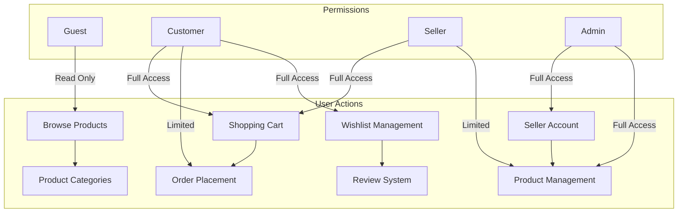

# User Requirements Analysis - E-commerce Shopping Mall Platform

## Executive Summary

This document defines comprehensive user management and authentication requirements for the shoppingMall e-commerce platform. The system supports four distinct user roles: guests, customers, sellers, and administrators, each with specific permissions and capabilities. The platform provides seamless user registration, secure authentication, comprehensive address management, and role-based access control to support a multi-vendor marketplace environment.

## User Roles and Permissions

### Role Hierarchy and Business Context

**THE platform SHALL implement four distinct user roles with escalating permissions:**

**Guest Users** represent non-authenticated visitors who can browse the marketplace without creating an account. Guests have read-only access to product catalogs, categories, and search functionality but cannot perform any transactional operations.

**Customer Users** are registered platform members who can complete the full shopping lifecycle. Customers can browse products, manage shopping carts and wishlists, place orders, write product reviews, and maintain multiple shipping addresses for their account.

**Seller Users** are business account holders who operate their own shops within the marketplace. Sellers can create and manage product catalogs with variants, track inventory levels per SKU, process customer orders, manage business information, and access sales analytics for their shop performance.

**Administrator Users** are platform staff who oversee marketplace operations. Administrators can manage all user accounts, moderate content including products and reviews, process refunds and disputes, configure system settings, and access comprehensive platform analytics.

### Permission Matrix by Role

WHEN admin users access role permissions, THE system SHALL display this comprehensive capability matrix formatted exactly as follows:

THE permission structure SHALL strictly enforce these business rules:

- **Guest Users** can view catalog, categories, search results, and basic company information
- **Customer Users** gain all guest capabilities plus cart, wishlist, checkout, order history, address management, and review submission
- **Seller Users** receive customer capabilities plus complete product catalog control, order processing, inventory tracking, sales analytics, and customer communication tools
- **Administrator Users** receive all capabilities plus platform administration, user management, financial oversight, system configuration, and comprehensive monitoring

### Role Transition Rules

**WHEN a customer user applies for seller account status, THE system SHALL validate business information and approve or deny the request within 5 business days.**

**THE system SHALL maintain historical data when users transition between roles, ensuring order history and profile information remain accessible.**

**IF a seller account is suspended or terminated, THEN THE system SHALL preserve customer-facing product information while disabling transactional capabilities.**

## Registration Requirements

### Customer Registration Process

**THE customer registration SHALL require the following mandatory information:** email address, password, full name, and phone number. Email addresses must be unique across the platform and verified through a confirmation process.

**WHEN a customer submits registration information, THE system SHALL validate email format, enforce password complexity requirements, and check for duplicate email addresses within 3 seconds.**

**THE system SHALL send a verification email containing a unique confirmation link that expires after 24 hours.**

**IF email verification is not completed within 24 hours, THEN THE system SHALL allow re-sending of verification email up to 3 times before requiring alternative verification methods.**

**WHILE a customer account remains unverified, THE system SHALL allow browsing but prevent any transactional activities including cart additions and wishlist creation.**

### Seller Registration Process

**THE seller registration SHALL extend customer registration with additional business information including business name, tax identification number, business address, banking details for revenue payouts, and business license documentation.**

**WHEN a seller submits registration, THE system SHALL place the account in pending status and notify administrators for manual review and approval within 2 business days.**

**THE system SHALL validate business license authenticity and cross-reference tax identification numbers against official business registries.**

**IF business information validation fails, THEN THE system SHALL provide specific feedback about which documents or information require correction.**

**WHERE a seller operates from a country requiring specific business licenses, THE system SHALL verify appropriate licensing based on product categories the seller intends to offer.**

## Authentication Requirements

### Login and Session Management

**THE authentication system SHALL support email and password login for all user types, with optional remember-me functionality for sessions lasting up to 30 days.**

**WHEN a user attempts login, THE system SHALL implement rate limiting allowing maximum 5 failed attempts per 15-minute window per IP address.**

**IF a user exceeds failed login attempts, THEN THE system SHALL temporarily lock the account for 30 minutes and send security notification emails to the registered email address.**

**THE system SHALL generate JWT tokens with 15-minute access token expiration and 7-day refresh token expiration for authenticated users.**

**WHILE users remain authenticated, SHALL maintain active sessions allowing seamless navigation across all permitted platform areas without repeated authentication prompts.**

### Password Security and Recovery

**THE system SHALL enforce password complexity requiring minimum 8 characters including at least one uppercase letter, one lowercase letter, one number, and one special character.**

**THE system SHALL hash passwords using bcrypt or stronger encryption before storage, with unique salts per user credential.**

**WHEN users request password reset, THE system SHALL send a unique reset link to the registered email address that expires after 1 hour.**

**IF a password reset request originates from an unrecognized device or IP address, THEN THE system SHALL require additional identity verification through email confirmation before allowing password change.**

**THE system SHALL maintain password history preventing users from reusing their previous 5 passwords within a 12-month period.**

## Address Management System

### Customer Address Requirements

**THE address management system SHALL support multiple addresses per customer account with designations for home, work, and gift recipient locations.**

**WHEN a customer adds a new address, THE system SHALL validate postal code format, verify city and state combinations, and suggest address corrections for common formatting errors.**

**THE system SHALL store the following mandatory address fields for shipping purposes:** recipient full name, street address, apartment/unit number (when applicable), city, state/province, postal code, country, and phone number for delivery contact.

**THE system SHALL allow customers to save up to 10 shipping addresses in their address book with custom labels like "Home," "Office," "Parents' House" for easy identification.**

**WHERE a customer designates an address as default shipping address, THE system SHALL automatically select this address during checkout while allowing one-click address switching.**

### Address Validation and Verification

**THE system SHALL integrate with address validation services to verify deliverability and suggest corrections for invalid or incomplete addresses.**

**IF an address validation service indicates a non-deliverable address, THEN THE system SHALL notify the customer immediately and suggest alternative address formats or nearby pickup locations.**

**THE system SHALL maintain address validation history for audit purposes and flag addresses that consistently generate delivery issues.**

**WHEN processing international addresses, THE system SHALL display appropriate address format examples and validate against country-specific postal code patterns.**

## Profile Management

### Customer Profile Features

**THE profile management system SHALL allow customers to update personal information including full legal name, email address, phone number, preferred communication language, and contact preferences.**

**WHEN a customer changes their email address, THE system SHALL require email verification before updating the account, sending confirmation to both old and new email addresses.**

**THE system SHALL maintain profile update history with timestamps and changes made for account security and customer service purposes.**

**THE system SHALL allow customers to upload profile pictures with file size limits of 2MB and automatic image optimization for web display.**

**IF a customer uploads inappropriate profile content, THEN THE system SHALL remove the content immediately and send a notification about community guidelines violation.**

### Seller Profile Management

**THE seller profile SHALL include business information such as legal business name, business description, customer service policies, shipping policies, return policies, business contact hours, and customer support channels.**

**WHEN sellers update their profile information, THE system SHALL validate changes against platform policies and implement updates within 2 hours of approval.**

**THE system SHALL display seller ratings, customer service response metrics, and recent customer feedback summary with appropriate statistical calculations on public seller profiles.**

**THE system SHALL allow sellers to customize their storefront appearance including banner images, logo uploads, color scheme customization, and branded product layouts within platform design standards.**

## Account Security Requirements

### Multi-Factor Authentication Implementation

**THE system SHALL support optional two-factor authentication through SMS text messages or authenticator applications including Google Authenticator, Microsoft Authenticator, and Authy.**

**WHEN a user enables two-factor authentication, THE system SHALL require verification code entry for all login attempts from unknown devices, unrecognized IP addresses, or after 60 days of browser inactivity.**

**THE system SHALL provide backup recovery codes that users can store securely offline for account access. WHEN primary authentication methods become unavailable, these recovery codes enable account recovery without customer service intervention.**

**IF a user loses access to their two-factor authentication device, THEN THE system SHALL implement identity verification through email confirmation, security questions, and identity document verification before allowing account recovery.**

### Account Activity Monitoring

**THE system SHALL monitor user account activities including login locations, device fingerprinting, login timing patterns, password reset requests, and suspicious activity indicators through machine learning algorithms.**

**WHEN unusual account activity is detected such as access from unusual geographic locations, the system SHALL send immediate security alerts to registered email addresses within 5 minutes while limiting account activities pending security verification.**

**THE system SHALL allow users to view comprehensive recent account activity including complete login history with device identification, geographic location information, session durations, and any automated security actions taken by the platform.**

**IF unauthorized access to an account is suspected through failed login attempts, unusual access patterns, or customer reports, THEN THE system SHALL allow users to remotely log out of all active sessions across all devices and require immediate password change for account protection.**

## Guest User Capabilities

### Browsing and Product Discovery

**THE system SHALL allow guest users to browse all public product catalogs, view detailed product descriptions, access product reviews and ratings, navigate product categories, and utilize comprehensive search functionality without creating accounts or logging in.**

**WHEN guest users perform product searches, THE system SHALL provide complete search functionality with advanced filtering, sorting options, relevance ranking, and category drill-down navigation identical to authenticated customer search experiences.**

**THE system SHALL display product pricing, availability status, seller information, shipping estimates, promotional offers, and customer reviews to guest users to facilitate comprehensive product comparison and informed browsing decisions.**

**THE system SHALL track guest browsing sessions through browser cookies to provide personalized product recommendations if the user later creates an account during the same browsing session while respecting privacy regulations concerning data collection.**

**WHERE guest users add products to shopping cart, THE system SHALL temporarily store cart contents in browser local storage with 48-hour persistence through cookies while maintaining inventory synchronization to prevent overselling scenarios when inventory levels fluctuate.**

### Guest to Customer Conversion

**WHEN a guest user attempts to complete checkout or save items for later purchase, THE system SHALL offer streamlined account registration during the checkout process with minimal required information collection while preserving cart contents across the conversion process.**

**THE system SHALL preserve all guest shopping cart contents, browse history, product comparisons, and search results when a guest converts to registered customer status ensuring that no shopping context is lost during account creation and verification.**

**THE system SHALL allow guest users to register for limited email communications including price drop alerts for specific products, product availability restock notifications, and promotional offers while maintaining strict consent compliance with email marketing regulations.**

## Business Rules and Constraints

### Account Lifecycle Management

**THE system SHALL support comprehensive account suspension capabilities for policy violations including graduated restriction levels escalating from temporary account limitations to complete account suspension based on violation severity and customer history patterns.**

**WHEN an account is suspended for policy violations, THE system SHALL notify the account holder via email with specific violation explanations, supporting evidence, suspension duration information, appeal process instructions, and customer service contact information for further clarification.**

**THE system SHALL maintain account data for minimum 90 days after account deletion to support order history inquiries, warranty claims processing, and legal compliance requirements while permanently removing personal identification information according to privacy regulations.**

**IF an account deletion request is received from a customer, THEN THE system SHALL anonymize all personal identification information according to GDPR compliance requirements while preserving transaction records, order history, and communication logs required for tax reporting, dispute resolution, and legal compliance purposes.**

### Compliance and Legal Requirements

**THE system SHALL comply with all applicable regional data protection regulations including General Data Protection Regulation (GDPR), California Consumer Privacy Act (CCPA), and other applicable privacy laws based on user geographic location and operational jurisdiction.**

**THE system SHALL obtain explicit consent for all data processing activities including marketing communications, third-party service integration, analytics processing, and business transaction record keeping while providing easy opt-out mechanisms across all communication channels.**

**WHERE special categories of personal information are collected such as financial account details, authentication credentials, or government identification, THE system SHALL implement additional security measures and obtain explicit consent for specific processing purposes as required by applicable privacy regulations.**

## Integration Requirements

This comprehensive user requirements document establishes foundational authentication and authorization requirements that directly impact all other platform modules including product catalog browsing permissions, shopping cart functionality, order processing authorization systems, seller portal access controls, payment security integration, and administrative dashboard authentication requirements.

The defined user roles and permission structure must be consistently applied across all subsequent technical system modules to maintain security standards, preserve user experience consistency, and ensure appropriate authorization controls throughout the complete platform ecosystem.

> *Developer Note: This document defines **business requirements only**. All technical implementations (architecture, APIs, database design, etc.) are at the discretion of the development team.*