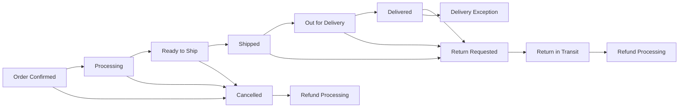

# Order Management System Requirements Analysis

## Executive Summary

The order management system serves as the backbone of the shopping-mall platform, orchestrating the complete order lifecycle from initial placement through final fulfillment. This system must handle complex multi-vendor marketplace scenarios where customers can purchase products from multiple sellers in a single order while maintaining accurate inventory tracking, processing payments, and providing real-time status updates to all stakeholders.

## Order Placement Process

### Order Initiation
WHEN a customer clicks the "Place Order" button with a non-empty cart, THE system SHALL validate the following conditions before order creation:
- All products in cart are still available in requested quantities
- No inventory has been reserved by other customers since cart creation
- Customer's primary address is configured and verified
- Payment method is properly configured and valid
- Seller account status is active for all vendors in the order

### Order Creation Workflow
THE system SHALL process order creation through these sequential steps:

1. **Inventory Lock Process**
   WHEN a customer initiates checkout, THE system SHALL reserve inventory quantities for each product variant (SKU) in the cart for a maximum of 15 minutes
   WHILE inventory is reserved, THE system SHALL prevent other customers from purchasing those reserved quantities
   IF inventory reservation fails due to insufficient stock, THEN THE system SHALL notify the customer which items became unavailable and offer to modify the cart

2. **Multi-Vendor Order Splitting**
   WHEN an order contains products from multiple sellers, THE system SHALL automatically create separate order sub-orders for each seller
   THE system SHALL ensure each seller receives only their applicable items while preserving the customer-facing order as a unified shopping experience
   THE system SHALL calculate separate shipping costs, taxes, and seller margins for each sub-order

3. **Payment Authorization**
   WHEN inventory reservation succeeds, THE system SHALL proceed to payment authorization
   THE system SHALL authorize the full order amount on customer's payment method but capture funds only upon order confirmation
   IF payment authorization fails, THEN THE system SHALL release all reserved inventory and notify customer of payment failure with retry options

4. **Order Confirmation**
   WHEN payment authorization succeeds, THE system SHALL capture payment and create the order
   THE system SHALL assign a unique order number in format ORD-{YYYY}{MM}{DD}-{8-digit-sequence}
   THE system SHALL set initial order status to "Confirmed" for customers and "Pending" for sellers

### Order Validation Rules
THE system SHALL enforce the following business rules during order placement:
- Minimum order value must be $10.00 before shipping and taxes
- Maximum single product quantity per order is 999 units
- Customer must have verified email address for orders over $500
- International orders require phone number verification
- Business customers (with tax ID) receive automatic tax exemption application

## Order Status Tracking

### Order Status Lifecycle
THE system SHALL maintain and track the following order status values with specific allowed transitions:

### Status Definition and Requirements

**Confirmed Status**
WHEN an order is created, THE system SHALL set status to "Confirmed" for 24 hours
THE system SHALL allow customers to cancel orders during this status without cancellation fees
THE system SHALL notify sellers immediately upon order confirmation to begin processing

**Processing Status**
WHEN sellers acknowledge receipt of order, THE system SHALL update status to "Processing"
THE system SHALL provide sellers with maximum processing time based on product category:
- Standard products: 3 business days
- Custom/handmade products: 7 business days
- Digital products: 1 business day
IF a seller fails to update status within allowed processing time, THEN THE system SHALL automatically escalate to customer service intervention

**Ready to Ship Status**
WHEN sellers mark items ready for shipment, THE system SHALL update status to "Ready to Ship"
THE system SHALL ensure shipping labels are generated and carrier pickup is scheduled
THE system SHALL provide customers with estimated shipping carrier assignment within 4 hours

**Shipped Status**
WHEN shipping carrier scans the package, THE system SHALL update status to "Shipped"
THE system SHALL capture and store tracking information from carrier
THE system SHALL begin providing real-time tracking updates to customers
THE system SHALL estimate delivery date based on shipping method and destination

**Delivered Status**
WHEN carrier confirms delivery, THE system SHALL update status to "Delivered"
THE system SHALL request customer confirmation of receipt within 48 hours
THE system SHALL prompt customers to review products 3-7 days after delivery

## Order Confirmation

### Immediate Confirmation Response
WHEN an order is successfully created, THE system SHALL provide immediate confirmation to customers within 2 seconds, including:
- Order number and confirmation timestamp
- Complete order summary with items, quantities, and prices
- Total amount paid including item costs, shipping, and taxes
- Estimated delivery timeframe for each product
- Immediate access to order tracking dashboard

### Confirmation Communication Channels
THE system SHALL send order confirmation through the following channels:
- Email confirmation within 30 seconds of order placement
- SMS text message confirmation for mobile-verified accounts within 60 seconds
- In-app notification and push notification for mobile app users
- WhatsApp Business message for customers who opt-in to WhatsApp notifications

### Confirmation Content Requirements
THE order confirmation communication SHALL include:
- Personalized greeting with customer name
- Order number prominently displayed for easy reference
- Itemized list of all purchased products with images
- Individual seller information for each item (multi-vendor orders)
- Total amount charged to payment method
- Expected delivery date ranges for each seller's items
- Direct links to track order status
- Clear cancellation policy and procedures
- Customer service contact information for order inquiries

## Order Modifications

### Modification Time Windows
THE system SHALL enforce the following modification policies:
- Customers can modify orders within 2 hours of placement for standard shipping
- Premium shipping orders (same-day/next-day) can be modified within 30 minutes
- Modifications are not allowed once order status changes to "Ready to Ship" or beyond
- Subscription-based or recurring orders have separate modification rules

### Allowable Modifications
WHEN modification is requested within allowed timeframe, THE system SHALL support these changes:
- Increase or decrease item quantities (within inventory availability)
- Remove specific items from order
- Change shipping address to a verified address in customer's address book
- Upgrade shipping method to faster delivery options
- Add promotional codes or coupons (if valid for original order date)

### Prohibited Modifications
THE system SHALL prevent the following modifications at all times:
- Adding new products to existing orders
- Changing payment method after order confirmation
- Shipping to unverified addresses not in customer's profile
- Reducing order value below minimum order requirements
- Applying expired promotional codes or discounts

### Modification Processing
WHEN a customer requests order modification, THE system SHALL:
- Verify modification eligibility based on current order status and timing
- Validate requested changes against inventory availability
- Recalculate order totals including shipping costs and taxes
- Seek customer confirmation of any additional charges
- Send updated order confirmation reflecting all changes
- Notify affected sellers of order modifications
- Adjust shipping estimates based on modification impacts

## Order History

### Historical Data Access
THE system SHALL provide customers with complete order history accessible 24/7, including:
- All orders placed in the past 3 years with full details
- Orders from inactive seller accounts (clearly marked as seller unavailable)
- Refunded and cancelled orders with detailed reasoning
- Partial shipments and split orders clearly identified
- Detailed payment history for each order including refunds
- Complete communication history for customer service interactions

### Order History Filtering and Search
THE order history interface SHALL support the following search and filter capabilities:
- Date range filtering (specific dates, months, years)
- Product category filtering
- Seller-specific filtering
- Order status filtering (delivered, cancelled, returned)
- Price range filtering
- Keyword search across product names and order details
- Quick filters for last 30 days, last 6 months, last year
- Filter combinations for complex queries

### Order Repetition and Reordering
THE system SHALL facilitate repeat purchases through:
- "Buy Again" functionality for previously purchased items still available
- Bulk reordering of multiple previous items at once
- Shopping list creation from frequently purchased items
- Price comparison showing current prices versus previous purchase amounts
- Availability checking before allowing reorders
- automatic notification if previously purchased items are back in stock

### Business Customer Order History
WHERE customers have business accounts, THE system SHALL provide:
- Purchase order number tracking and correlation
- Department-based order allocation for corporate accounting
- Month-end summaries for expense reporting
- Tax-exempt order identification and reporting
- Bulk order reporting for procurement analysis
- Custom reporting exports in multiple formats (CSV, Excel, PDF)

## Customer Notifications

### Notification Timing and Triggers
THE system SHALL send notifications based on these specific events and timing:
- Order confirmation: Immediately upon successful order placement
- Order processing start: When seller confirms receipt and begins processing
- Shipping confirmation: When carrier scans package for shipment
- Out for delivery: When package is loaded on delivery vehicle
- Delivery confirmation: Immediately upon carrier confirmation of delivery
- Delivery exception: Within 30 minutes of carrier reporting an issue
- Return authorization: Within 2 hours of approved return request
- Refund processing: When refund is initiated and when completed

### Notification Channel Preferences
THE system SHALL support customer preference management for notifications:
- Email notifications (configurable frequency: immediate, daily digest, weekly summary)
- SMS notifications for critical updates only (shipping, delivery, exceptions)
- Push notifications for mobile app users
- WhatsApp Business messages for opted-in customers
- In-app notification center for all account activity
- Holiday/vacation mode to temporarily reduce notifications

### Notification Content Standards
ALL notifications SHALL maintain the following content standards:
- Clear subject lines identifying order number and notification type
- Personalized greeting using customer's preferred name
- Concise summary of current order status and what it means
- Specific next steps or actions required from customer
- Direct deep links to relevant sections in customer dashboard
- Customer service contact information for order-specific inquiries
- Option to adjust notification preferences for future orders
- Compliance with GDPR and other privacy regulations including unsubscribe options

### Emergency and Exception Notifications
THE system SHALL provide enhanced notifications for order issues:
- Inventory shortage after order confirmation (within 30 minutes of discovery)
- Seller processing delays beyond promised timeframe
- Shipping carrier delays or rerouting
- Delivery failures requiring customer intervention
- Payment processing issues during fulfillment
- Suspected fraud holds requiring verification

## Missing Critical Business Processes

### Complete Order Processing Workflows

THE system SHALL define comprehensive workflows for different product types:

**Standard Physical Products**
- Inventory reservation upon checkout
- Seller notification for processing
- Packaging and shipping coordination
- Delivery tracking and confirmation
- Customer receipt verification

**Digital Products**
- Immediate download access upon payment confirmation
- Download link generation and delivery
- Access code management
- License key distribution
- Usage tracking and reporting

**Services and Appointments**
- Scheduling coordination
- Service provider assignment
- Appointment reminders and confirmations
- Service completion tracking
- Customer satisfaction follow-up

### International Order Requirements

THE system SHALL handle international orders with these specifications:

**Customs and Duties**
- Automatic duty and tax calculation
- Customs documentation generation
- Import/export compliance verification
- Duty payment options
- Shipping restrictions validation

**International Payment Processing**
- Multi-currency payment support
- Exchange rate handling
- International payment method validation
- Cross-border compliance verification

**Regional Compliance**
- Local tax calculation and remittance
- Regional shipping regulations compliance
- Product restriction enforcement
- Regulatory documentation

### Emergency Order Processing

THE system SHALL handle emergency scenarios:

**System Outages**
- Order queue preservation during outages
- Recovery procedures for lost orders
- Customer notification during downtime
- Order status reconciliation after recovery

**Payment Failures**
- Automatic retry mechanisms
- Alternative payment suggestions
- Order retention during payment disputes
- Customer communication during payment issues

**Seller Failures**
- Automatic seller substitution
- Customer notification for seller unavailable
- Order reallocation to alternative sellers
- Refund processing for affected orders

### Advanced Business Logic

THE system SHALL implement sophisticated business rules:

**Customer Value Tiers**
- VIP customer priority processing
- Loyalty program integration
- Personalized service levels
- Exclusive order tracking features
- Dedicated support channel access

**Seasonal Processing**
- Holiday order surge handling
- Seasonal inventory allocation
- Special shipping arrangements
- Extended customer service hours
- Promotional order processing

**Dynamic Pricing**
- Real-time price adjustments
- Promotional code integration
- Dynamic shipping cost calculation
- Regional pricing variations
- Special customer pricing eligibility

### Integration Specifications

**Shipping Carrier Integration**
THE system SHALL support comprehensive integration with shipping carriers providing real-time rate calculation, tracking number assignment, delivery status updates, shipping label generation, customs documentation creation, delivery confirmation capture, and delivery problem escalation.

**Payment Gateway Integration (Beyond Basic)
THE system SHALL implement advanced payment processing including multi-currency handling, automatic retry on payment failures, payment method suggestions for failed transactions, fraud detection integration, chargeback management, payment dispute resolution, and commission distribution across sellers and platform.

**Financial System Integration**
THE platform SHALL integrate with accounting systems providing automated journal entries, revenue recognition processing, tax calculation and reporting, seller payment scheduling, refund processing automation, financial reconciliation reports, and comprehensive audit trails for all financial transactions.

### Error Handling and Recovery

**Order State Recovery**
THE system SHALL implement automatic order recovery from various failure scenarios including database connection failures, payment processing timeouts, shipping system connectivity issues, inventory synchronization failures, and seller system integration problems with detailed logging and customer notification systems.

**Data Integrity Safeguards**
THE platform SHALL maintain data integrity through transaction rollback mechanisms, inventory reconciliation processes, financial accuracy verification, customer satisfaction tracking, and order audit trail maintenance ensuring complete visibility into all order processing operations and historical modifications.

This expanded order management system requirements document provides comprehensive business specifications that developers need to implement a robust, scalable, and customer-focused order processing system for the multi-vendor e-commerce platform. The detailed requirements ensure proper handling of all business scenarios, regulatory compliance, and operational excellence that marketplace operators require for successful business operations.