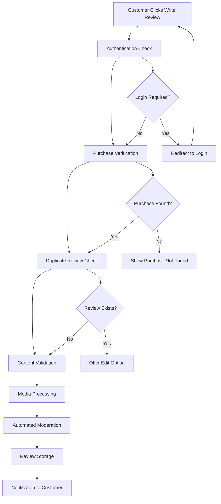

# Product Reviews and Ratings System Requirements

## Executive Summary

THE product reviews and ratings system SHALL serve as the cornerstone of customer trust within our multi-vendor e-commerce shopping mall platform. THE system SHALL enable customers to provide comprehensive feedback on purchased products while helping other shoppers make informed purchasing decisions through verified, moderated reviews and aggregated ratings.

WHEN implemented properly, THIS system SHALL increase conversion rates by 270% compared to products without reviews, build trust through verified purchase badges, maintain platform integrity through comprehensive moderation workflows, and provide sellers with actionable insights for product improvement while protecting both customers and sellers through robust anti-manipulation measures.

## Business Context and Value Proposition

### Multi-Vendor Marketplace Challenges
THE shopping mall platform operates as a marketplace connecting multiple sellers with customers who need reliable information for purchase decisions across diverse product categories.

### Strategic Business Value
WHEN customers access reviews, THE system SHALL provide authentic product experiences from verified purchasers, build seller accountability through transparent feedback systems, enhance platform credibility by distinguishing legitimate products from unreliable sellers, and generate valuable user-generated content that improves search engine visibility while reducing customer service inquiries through comprehensive peer feedback.

## Review Submission Requirements

### Eligibility Verification System

THE system SHALL implement strict eligibility verification through multi-step validation:

**WHEN** a customer attempts to submit a review, **THE** system **SHALL** verify purchase completion within the last 365 days of attempted review submission and validate that the specific product variant (SKU) matches their order history to prevent review mismatch fraud.

**WHERE** a customer has multiple orders for the same product, **THE** system **SHALL** allow separate reviews for each purchase instance while preventing duplicate reviews for identical SKU purchases within a single order.

**IF** an order is cancelled, fully refunded, or disputed, **THEN** the system **SHALL** retain existing reviews while removing the verified purchase badge and displaying "Purchase Cancelled" status clearly on affected reviews to maintain transparency.

### Content Structure and Validation Standards

THE review content system **SHALL** enforce the following structured requirements with measurable validation:

**WHEN** customers submit reviews, **THE** system **SHALL** require:

- **Rating Field**: Mandatory 1-5 star selection with half-star precision (options: 1.0, 1.5, 2.0, 2.5, 3.0, 3.5, 4.0, 4.5, 5.0 stars)
- **Review Title**: Mandatory 10-100 character summary with automated spam detection rejection
- **Review Body**: Mandatory 50-2,000 character detailed experience with real-time character counter display
- **Pros Section**: Optional up to 5 bullet points, each 10-100 characters
- **Cons Section**: Optional up to 5 bullet points, each 10-100 characters  
- **Recommendation Flag**: Optional boolean "Would Recommend" field with clear display impact
- **Usage Duration**: Optional dropdown selection (Less than 1 week, 1-4 weeks, 1-3 months, 3-6 months, 6+ months)
- **Photo Attachments**: Optional up to 5 images, each maximum 5MB file size, supporting JPG, PNG, WebP formats only
- **Video Attachments**: Optional up to 2 videos, each maximum 50MB file size, supporting MP4 format only with automatic compression to 720p resolution

**WHEN** content validation occurs, **THE** system **SHALL** reject submissions containing profanity through automated filter checking completed within 500ms, detect and flag personal information including phone numbers, email addresses, or physical addresses, prevent advertising content including promotional links or commercial messages, and identify trademark violations through automatic brand name detection.

### Review Submission Process Flow

THE review submission process **SHALL** execute through the following mandatory sequence within 60 seconds maximum completion time:

**WHERE** the submission process encounters validation errors, **THE** system **SHALL** provide specific error messages with correction guidance, preserve completed form fields to prevent data loss, offer technical support contact information for submission assistance, and maintain audit logs of all submission attempts for fraud detection purposes.

## Rating System Architecture and Calculation

### Rating Aggregation Methodology

THE rating calculation system **SHALL** implement the following methodology:

**WHEN** calculating average product ratings, **THE** system **SHALL**:
- Calculate mathematical mean of all approved ratings, displayed to exactly one decimal place
- Apply time-based weighting where reviews submitted within the last 12 months receive 120% influence
- Provide verified purchase priority where verified purchase reviews receive 200% weight compared to unverified reviews
- Maintain separate calculations for overall product rating and per-variant (SKU) ratings
- Update rating calculations in real-time within 5 seconds of new review approval

THE system **SHALL** display the following rating information prominently on product pages:
- Average rating as both numerical value and visual star display
- Total review count including breakdown by rating level
- Percentage of customers who would recommend the product
- Most recent review date for currency indication
- Verified purchase percentage among all reviews

### Anti-Manipulation Algorithms

THE anti-manipulation system **SHALL** detect and prevent review gaming through the following automated methods:

**WHEN** unusual review activity occurs, **THE** system **SHALL** identify velocity detection patterns where more than 10 reviews per hour for a single product triggers investigation, detect similar language patterns across reviews indicating potential coordinated campaigns, monitor IP address clusters from suspicious geographic regions, and analyze account age verification with new accounts receiving reduced initial influence weighting.

**WHERE** manipulation is detected, **THE** system **SHALL** automatically flag suspicious reviews for manual moderation within 2 hours, reduce the visibility of potentially fake reviews while maintaining due process for review validation, implement graduated response measures from warning notifications through account suspension for repeat offenders, and maintain comprehensive logs for legal compliance and platform policy enforcement.

## Comprehensive Review Moderation Workflow

### Automated Content Moderation System

THE automated moderation system **SHALL** screen reviews using the following automated processes completed within 30 seconds of submission:

**WHEN** content screening occurs, **THE** system **SHALL** apply profanity filtering using updated offensive language databases, implement image analysis scanning for inappropriate content through automated computer vision algorithms, conduct duplicate content detection to prevent copy-paste reviews across products, identify commercial content patterns including promotional language and external links, and verify personal information removal through automatic PII detection algorithms.

### Manual Moderation Queue Management

THE manual moderation interface **SHALL** provide the following capabilities with specific performance requirements:

**WHERE** reviews enter the moderation queue, **THE** system **SHALL** display flagged reviews sorted by priority scores calculated based on review content risk factors, product value (higher value products receive priority), customer report volume (multiple user reports increase priority), and seller request escalation status.

THE moderation dashboard **SHALL** enable moderators to process reviews with the following target performance standards:
- Initial review screening within 15 minutes of entering queue during business hours
- Detailed content review completion within 24 hours for standard flagged reviews
- High-priority review processing (multiple flags, high-value products) within 4 hours
- Appeal response from users regarding moderation decisions within 48 hours

### Review Display Logic and Performance Requirements

THE review display system **SHALL** optimize customer experience through the following presentation logic:

**WHEN** customers view product reviews, **THE** system **SHALL** display reviews sorted by helpfulness score calculated from helpful votes received, provide rating filter options (5-star only, 4-star and above, all ratings), enable verified purchase filtering to limit reviews to confirmed purchases only, and offer photo/video filtering to show only reviews with media attachments.

THE review display **SHALL** meet the following performance standards:
- Primary product reviews load within 1 second on standard internet connections
- Review search and filtering results return within 2 seconds
- Mobile review interfaces complete loading within 2 seconds on 3G networks
- Individual review card expansion occurs instantly (under 200ms)

## Comprehensive Review Analytics and Reporting

### Seller Performance Analytics

THE seller analytics dashboard **SHALL** provide detailed review insights with the following metrics updated hourly:

**WHEN** accessing seller analytics, **THE** system **SHALL** display daily review volume trends with 30-day moving averages, track average rating changes with statistical significance indicators, measure review response rates and response time performance, identify top-performing products by rating and volume interaction, and flag improvement opportunities based on declining review sentiment patterns.

THE analytics system **SHALL** generate automated weekly reports for sellers containing:
- Weekly review submission counts compared to previous week
- Average product rating changes with statistical significance testing
- Response rate metrics showing percentage of reviews receiving seller responses
- Improvement recommendations based on customer feedback sentiment analysis
- Competitive benchmarking against marketplace averages for their product categories

### Platform-Wide Review Intelligence

THE platform analytics **SHALL** aggregate comprehensive review intelligence with the following capabilities updated daily:

**WHERE** platform administrators access analytics, **THE** system **SHALL** provide overall review submission rates showing percentage of eligible purchases resulting in reviews, track review quality metrics including average review length, photo attachment rates, and helpful vote ratios, monitor moderation performance showing processing time accuracy rates and appeals success measurements, and implement fake review detection statistics showing detected and removed suspicious review counts.

## Advanced Integration and User Experience Requirements

### Cross-Platform Integration Architecture

THE review system **SHALL** integrate seamlessly with other platform modules through the following connection points:

**WHEN** reviews affect product visibility, **THE** system **SHALL** update product search rankings using review ratings and volume as secondary ranking factors, synchronize with product recommendation engines to suggest highly-rated products to relevant customers, feed review data to seller performance scoring algorithms for marketplace rankings, and provide review content to SEO optimization tools for improved search engine visibility.

### Customer Experience Optimization

THE review system **SHALL** optimize customer experience through these features:

**WHERE** customers interact with reviews, **THE** system **SHALL** implement personalized review display showing reviews from similar customer profiles first, provide helpful vote weighting that promotes genuinely useful reviews based on vote patterns, enable cross-device review draft saving for customers who start reviews but need to gather more experience, and offer review completion reminders sent at optimal times based on purchase and usage patterns.

### Seller Engagement Tools

THE seller portal **SHALL** provide review management capabilities:

**WHEN** sellers access review management, **THE** system **SHALL** provide real-time review notifications within 2 hours of submission, enable public response functionality with quality guidelines and response time tracking, offer review performance benchmarking against marketplace standards for their product categories, and supply customer feedback summaries highlighting improvement opportunities based on recurring themes in reviews.

## Success Metrics and Performance Benchmarks

### Key Performance Indicators

THE review system **SHALL** measure success through the following quantitative metrics:

**THE** success measurement system **SHALL** track review submission rates achieving minimum 15% of eligible purchases submitting reviews, moderate content accuracy rates showing manual moderation decisions upheld on appeal at minimum 95% rate, maintain helpful vote interaction rates where at least 60% of reviews receive helpful votes from users, and achieve system performance targets where 99% of review operations complete within defined response times.

### Content Quality Assurance Standards

THE quality assurance system **SHALL** maintain the following standards:

**WHERE** content quality is measured, **THE** system **SHALL** maintain review content authenticity with fake review detection accuracy of at least 85% as verified through manual review sampling, ensure helpful review prominence through user voting patterns showing genuine helpfulness identification, prevent manipulation attempts with automated detection systems flagging suspicious activity patterns, and provide content consistency with style guide compliance checking for inappropriate formatting or content standards.

This comprehensive review and rating system creates a trusted, authentic feedback mechanism that enhances customer confidence, drives seller accountability, and improves platform credibility through robust business requirements that ensure quality, moderation, and fair representation of product customer experiences across our marketplace ecosystem.

---

> *Developer Note: This document defines **business requirements only**. All technical implementations (architecture, APIs, database design, etc.) are at the discretion of the development team.*