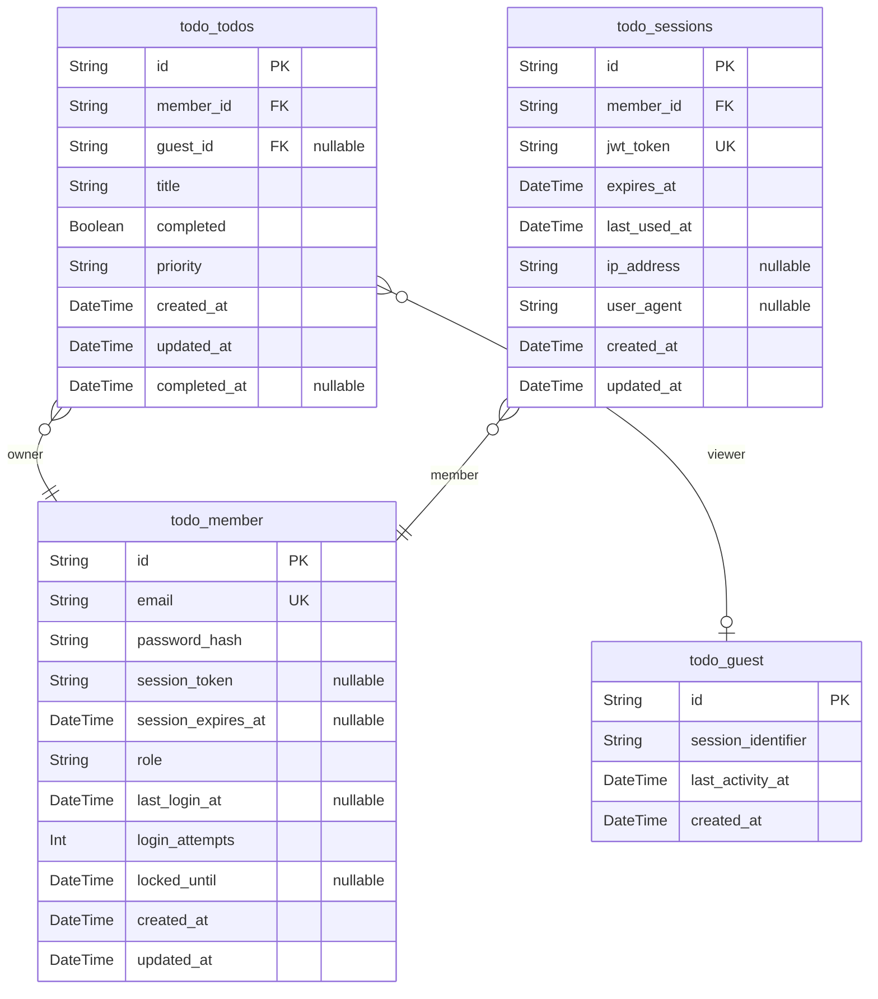

# Prisma Markdown

> Generated by [`prisma-markdown`](https://github.com/samchon/prisma-markdown)

- [Actors](#actors)

## Actors

### `todo_guest`

Guest users represent unauthenticated visitors who can only view
demonstration todos. These users have read-only access to sample content
to understand application functionality without requiring registration or
personal data collection.

Properties as follows:

- `id`: Primary Key.
- `session_identifier`: Unique session identifier for tracking guest browsing activity.
- `last_activity_at`: Timestamp of the guest's last activity for session management.
- `created_at`: Timestamp when the guest session was created.

### `todo_member`

Member users are authenticated users with full CRUD access to their
personal todo collections. These users can create, read, update, and
delete their own todo items while maintaining complete privacy and data
ownership.

Properties as follows:

- `id`: Primary Key.
- `email`: Member's email address for authentication and account identification.
- `password_hash`: Securely hashed password for JWT authentication.
- `session_token`: Current JWT session token for persistent authentication.
- `session_expires_at`: JWT session token expiration timestamp.
- `role`: User role for access control (member/admin).
- `last_login_at`: Timestamp of the member's last successful login for session tracking.
- `login_attempts`: Number of consecutive failed login attempts for security monitoring.
- `locked_until`: Account lockout timestamp after excessive failed login attempts.
- `created_at`: Timestamp when the member account was created.
- `updated_at`: Timestamp of the last account modification.

### `todo_todos`

Core todo items representing tasks that users need to complete. Supports
the complete todo lifecycle from creation through completion with
essential tracking fields.

Properties as follows:

- `id`: Primary Key.
- `member_id`: The member user who owns this todo. [todo_member.id](#todo_member)
- `guest_id`: Guest user viewing this demo todo. [todo_guest.id](#todo_guest)
- `title`
  > The primary task description using natural language. Supports up to 500
  > characters for comprehensive task descriptions.
- `completed`
  > Completion status indicating whether the task is finished. Defaults to
  > false for new todos.
- `priority`
  > Priority level for organization (Low/Medium/High). Defaults to Medium
  > when not specified.
- `created_at`
  > Timestamp recording when the todo was created. Automatically set by the
  > system and never editable.
- `updated_at`
  > Timestamp recording the most recent change to the todo. Automatically
  > updated whenever any property changes.
- `completed_at`
  > Timestamp when the todo was marked as complete. Only set when completion
  > status changes to true.

### `todo_sessions`

JWT session management for member authentication and secure access
control. Manages active sessions and provides secure authentication
tokens.

Properties as follows:

- `id`: Primary Key.
- `member_id`: Owning member user. [todo_member.id](#todo_member)
- `jwt_token`: JWT authentication token for secure session management.
- `expires_at`: Token expiration timestamp for session validity.
- `last_used_at`: Last time this session token was used for authentication.
- `ip_address`: IP address for session security tracking.
- `user_agent`: Browser user agent for session identification.
- `created_at`: When the session was created.
- `updated_at`: Last modification timestamp.
