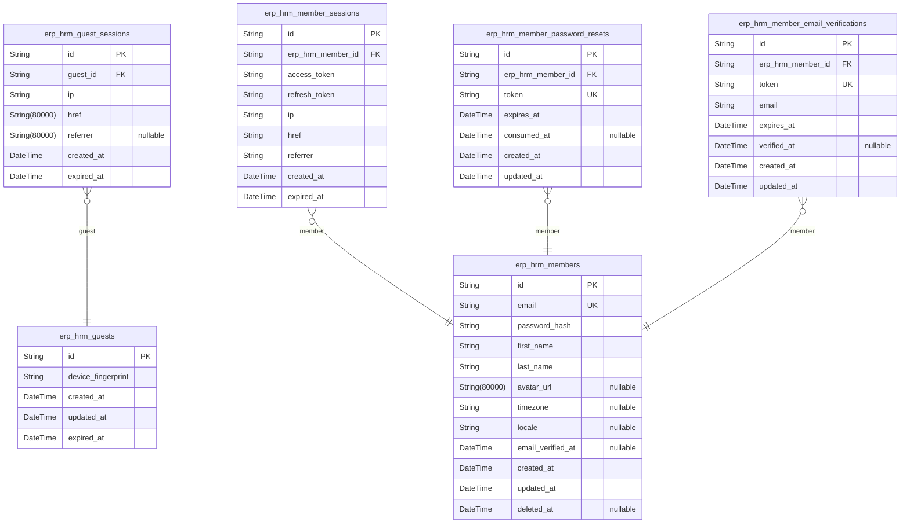
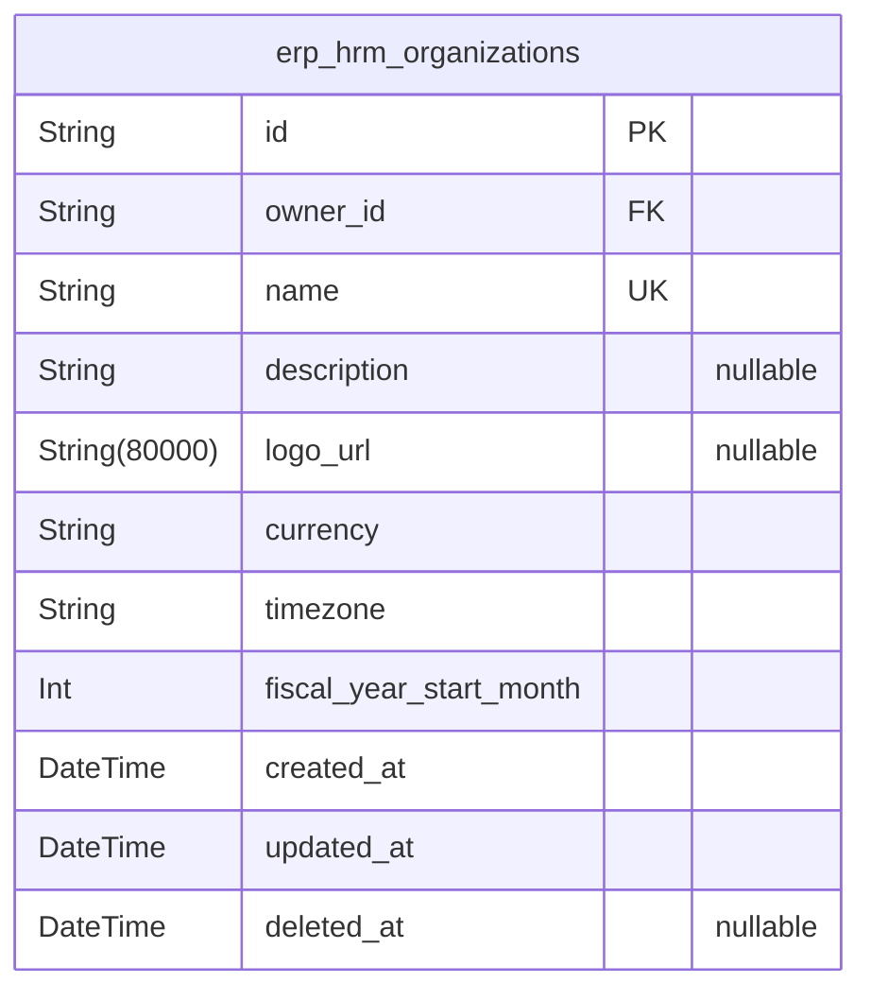
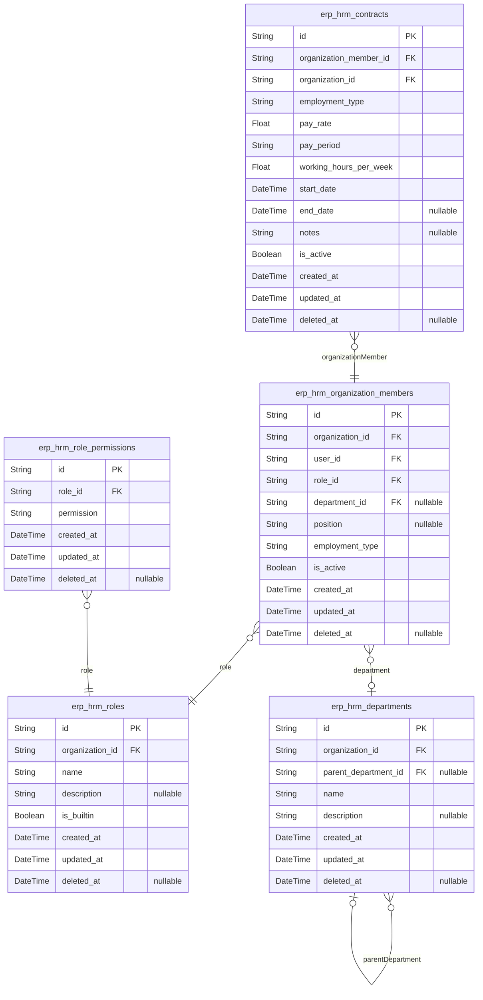
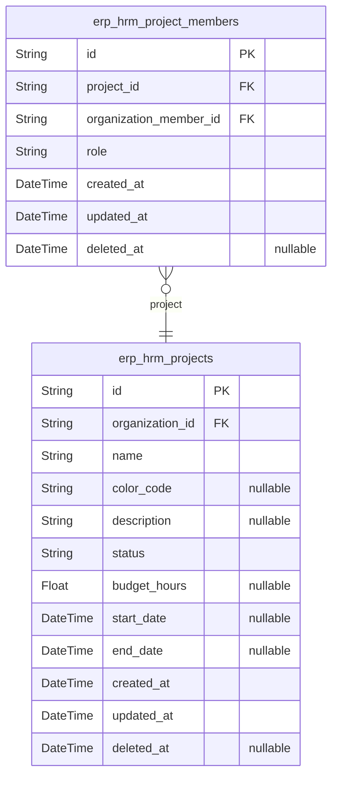
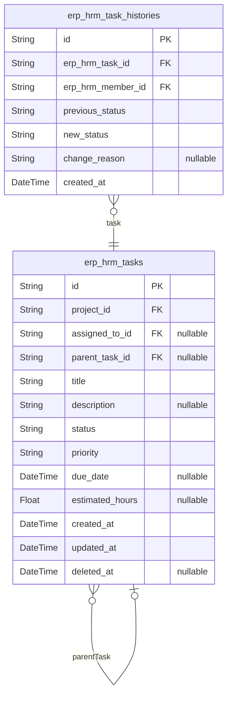
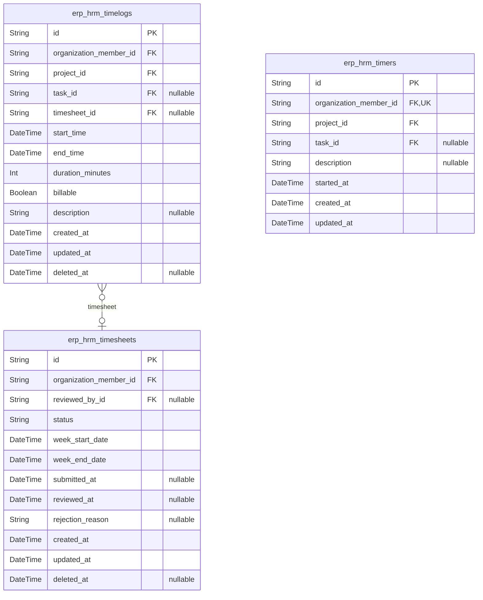
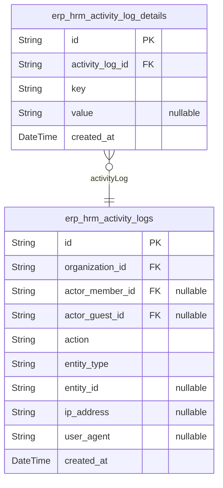

# Prisma Markdown

> Generated by [`prisma-markdown`](https://github.com/samchon/prisma-markdown)

- [Actors](#actors)
- [Systematic](#systematic)
- [Organization](#organization)
- [Project](#project)
- [Task](#task)
- [Time](#time)
- [Activity](#activity)

## Actors

### `erp_hrm_guests`

Temporary guest accounts for unauthenticated visitors before
registration. Guests are identified by device fingerprint and have
limited access to pre-authentication features. Guest accounts are
temporary and expire after a set duration.

Properties as follows:

- `id`: Primary Key.
- `device_fingerprint`
  > Unique device fingerprint identifying the guest's device/browser. Used to
  > recognize returning guests before registration.
- `created_at`: Timestamp when the guest account was created.
- `updated_at`: Timestamp when the guest account was last updated.
- `expired_at`
  > Timestamp when the guest account expires. Used for automatic cleanup of
  > stale guest accounts.

### `erp_hrm_guest_sessions`

Temporary session tokens for guest access to pre-authentication features.
Guest sessions allow unauthenticated visitors to interact with the system
before registration. Each session tracks connection metadata (IP,
referrer) and has an expiration for security. Sessions are append-only
audit records of guest access.

Properties as follows:

- `id`: Primary Key.
- `guest_id`: Belonged guest's [erp_hrm_guests.id](#erp_hrm_guests).
- `ip`: Client IP address at session creation.
- `href`: URL where the guest session was initiated.
- `referrer`: Referrer URL indicating the source of the guest session.
- `created_at`: Creation time of the session.
- `expired_at`: Session expiration time. After this time, the session is no longer valid.

### `erp_hrm_members`

Global member identity representing registered users with email/password
credentials. This is the canonical identity record that spans across all
organizations - a single user account can belong to multiple
organizations via [erp_hrm_organization_members](#erp_hrm_organization_members). Contains
authentication credentials and profile information.

Properties as follows:

- `id`: Primary Key.
- `email`
  > Unique email address used for authentication and communication. Must be
  > valid email format.
- `password_hash`
  > Bcrypt hashed password for authentication. Never store plain text
  > passwords.
- `first_name`: Member's first name for profile display.
- `last_name`: Member's last name for profile display.
- `avatar_url`: Optional URL to member's profile avatar image.
- `timezone`
  > Member's preferred timezone for displaying dates and times. Defaults to
  > organization timezone if not set.
- `locale`
  > Member's preferred language locale (e.g., 'en-US', 'ko-KR') for localized
  > content.
- `email_verified_at`: Timestamp when email was verified. Null if not yet verified.
- `created_at`: Timestamp when the member account was created.
- `updated_at`: Timestamp when the member account was last updated.
- `deleted_at`: Soft delete timestamp. Null if account is active.

### `erp_hrm_member_sessions`

JWT session tokens for authenticated member sessions. Tracks active login
sessions with access tokens, refresh tokens, and connection metadata (IP,
referrer). Each session belongs to a member and expires after a defined
period for security. Sessions are append-only audit records of member
authentication events.

Properties as follows:

- `id`: Primary Key.
- `erp_hrm_member_id`: Belonged member's [erp_hrm_members.id](#erp_hrm_members).
- `access_token`: JWT access token for API authentication.
- `refresh_token`: JWT refresh token for obtaining new access tokens.
- `ip`: Client IP address from which the session was initiated.
- `href`: URL or endpoint where the authentication request originated.
- `referrer`: HTTP referrer header indicating the source of the authentication request.
- `created_at`: Timestamp when the session was created.
- `expired_at`
  > Timestamp when the session expires. Used for security to limit session
  > lifetime.

### `erp_hrm_member_password_resets`

Temporary password reset tokens for member account recovery.

Each record represents a single password reset request initiated by a
member. The system generates a unique token that is delivered to the
member's registered email address. The token has a limited validity
period defined by expires_at. Once used successfully, the consumed_at
timestamp is set to prevent replay attacks.

Password reset tokens are single-use and expire automatically after a
configured time period (typically 24 hours). Members can request multiple
reset tokens, but only the most recent unexpired token is valid for use.
This table maintains an audit trail of all password reset attempts for
security monitoring purposes.

[erp_hrm_members](#erp_hrm_members)

Properties as follows:

- `id`: Primary Key.
- `erp_hrm_member_id`
  > Belonged member's [erp_hrm_members.id](#erp_hrm_members). The member who requested
  > the password reset.
- `token`
  > Unique cryptographically secure random token sent to the member's email
  > for password reset verification. Must be unpredictable and single-use.
- `expires_at`
  > Timestamp when the reset token becomes invalid. Tokens past this datetime
  > cannot be used for password reset regardless of consumption status.
- `consumed_at`
  > Timestamp when the token was successfully used to reset the password.
  > Once consumed, the token is permanently invalidated to prevent replay
  > attacks. Null if not yet consumed.
- `created_at`
  > Timestamp when the password reset was requested and this record was
  > created.
- `updated_at`
  > Timestamp of the last update to this record. Typically set when the token
  > is consumed.

### `erp_hrm_member_email_verifications`

Email verification tokens for member registration confirmation.

Stores verification tokens sent to users during the registration process
to confirm ownership of their email address. Each token is time-limited
for security purposes and becomes invalid after expiration or upon
successful verification.

Properties as follows:

- `id`: Primary Key.
- `erp_hrm_member_id`: The member account awaiting email verification. [erp_hrm_members.id](#erp_hrm_members)
- `token`
  > Cryptographically secure verification token sent to the user's email
  > address. Must be unique and unpredictable.
- `email`
  > The email address being verified. Stored to ensure the verified email
  > matches the token recipient.
- `expires_at`
  > Timestamp when the verification token becomes invalid. Tokens are
  > typically valid for a limited time (e.g., 24 hours) for security.
- `verified_at`
  > Timestamp when the email was successfully verified. Null until
  > verification is completed.
- `created_at`: Timestamp when the verification token was created.
- `updated_at`: Timestamp when the verification record was last modified.

## Systematic

### `erp_hrm_organizations`

Root tenant entity representing companies/organizations in the erpHrm
system.

This table serves as the aggregate root for all organization-scoped data
isolation. Each organization contains identity information (name,
description, logo) and configuration settings (currency, timezone, fiscal
calendar) that define how the organization operates within the system.

Organizations are owned by a User (referenced via owner_id) who has
administrative control. All other domain entities (members, roles,
departments, projects, tasks, etc.) belong to an organization and are
isolated from other organizations.

Soft deletion is supported via deleted_at to allow for data recovery and
maintain referential integrity with historical records.

Properties as follows:

- `id`: Primary Key.
- `owner_id`
  > Owner user's [erp_hrm_members.id](#erp_hrm_members). The user who created and owns
  > this organization.
- `name`: Organization name. Display name for the company/organization.
- `description`
  > Optional organization description. Brief summary of the organization's
  > purpose or business.
- `logo_url`: Optional URL to the organization's logo image.
- `currency`
  > Default currency for the organization in ISO 4217 format (e.g., USD, EUR,
  > KRW). Used for financial calculations and reporting.
- `timezone`
  > Organization's default timezone in IANA format (e.g., America/New_York,
  > Asia/Seoul). Used for datetime localization.
- `fiscal_year_start_month`
  > Month when the fiscal year starts (1-12). Used for financial reporting
  > and analytics.
- `created_at`: Timestamp when the organization was created.
- `updated_at`: Timestamp when the organization was last updated.
- `deleted_at`: Soft delete timestamp. Null if active, set when organization is deleted.

## Organization

### `erp_hrm_organization_members`

Employee records linking global users to specific organizations. Each
record represents a membership that connects a user account to an
organizational context, enabling the user to perform work within that
organization. Contains role assignment for access control, optional
department placement for organizational structure, position/title for
hierarchy identification, employment type classification, and activation
status for lifecycle management. Serves as the bridge entity that makes
all work data (timelogs, timesheets, project assignments)
organization-scoped.

Key business relationships:
- Belongs to [erp_hrm_organizations](#erp_hrm_organizations) via organization_id
- Links to global [erp_hrm_members](#erp_hrm_members) via user_id
- Assigned [erp_hrm_roles](#erp_hrm_roles) for permissions
- Optionally belongs to [erp_hrm_departments](#erp_hrm_departments)
- Has many [erp_hrm_contracts](#erp_hrm_contracts), [erp_hrm_project_members](#erp_hrm_project_members),
[erp_hrm_timelogs](#erp_hrm_timelogs), [erp_hrm_timesheets](#erp_hrm_timesheets), {@link
erp_hrm_timers}

Properties as follows:

- `id`: Primary Key.
- `organization_id`: Belonged organization's [erp_hrm_organizations.id](#erp_hrm_organizations).
- `user_id`: Linked global user's [erp_hrm_members.id](#erp_hrm_members).
- `role_id`: Assigned role's [erp_hrm_roles.id](#erp_hrm_roles) determining permissions.
- `department_id`: Optional department assignment's [erp_hrm_departments.id](#erp_hrm_departments).
- `position`
  > Optional job title or position within the organization (e.g., 'Senior
  > Developer', 'Project Manager').
- `employment_type`
  > Classification of working relationship: 'full_time', 'part_time',
  > 'contractor', or 'intern'.
- `is_active`
  > Activation status indicating whether the member can perform work
  > activities. true=active, false=deactivated.
- `created_at`: Timestamp when the membership was created.
- `updated_at`: Timestamp of last membership update.
- `deleted_at`: Soft deletion timestamp for preserving historical work records.

### `erp_hrm_roles`

Permission sets defined within an organization. Includes built-in roles
(Owner, Manager, Employee) and custom roles with configurable
permissions. Assigned to organization members to control access rights.
Each role belongs to exactly one organization and role names must be
unique within that organization.

Properties as follows:

- `id`: Primary Key.
- `organization_id`: Belonged organization's [erp_hrm_organizations.id](#erp_hrm_organizations).
- `name`: Role name (e.g., Owner, Manager, Employee, or custom role name).
- `description`: Optional description of the role's purpose and responsibilities.
- `is_builtin`
  > Whether this is a system-defined built-in role (Owner, Manager, Employee)
  > or a custom user-defined role.
- `created_at`: Creation timestamp.
- `updated_at`: Last update timestamp.
- `deleted_at`: Soft delete timestamp. Null if role is active.

### `erp_hrm_departments`

Organizational hierarchy structure representing functional divisions or
departments within a company.

Departments provide the organizational structure needed to categorize
employees and reflect the company's internal hierarchy. Each department
belongs to exactly one organization and can optionally have a parent
department, supporting single-level parent-child nesting for department
trees.

Departments are used for employee classification, organizational
reporting, and filtering employee lists. Employees may be optionally
assigned to a single department within their organization, reflecting
their placement within the organizational structure.

The department hierarchy enables organizational chart visualization and
department-based grouping for management and reporting purposes.

Properties as follows:

- `id`: Primary Key.
- `organization_id`: Belonged organization's [erp_hrm_organizations.id](#erp_hrm_organizations).
- `parent_department_id`
  > Parent department's [erp_hrm_departments.id](#erp_hrm_departments) for hierarchical
  > department structure. Null for top-level departments.
- `name`: Department name (e.g., 'Engineering', 'Sales', 'Human Resources').
- `description`
  > Optional description providing additional context about the department's
  > purpose and responsibilities.
- `created_at`: Record creation timestamp.
- `updated_at`: Record last update timestamp.
- `deleted_at`: Soft delete timestamp. Null if department is active.

### `erp_hrm_contracts`

Employment contract records for organization members. Tracks formal
employment agreements including compensation terms, working hours, and
employment periods. Maintains complete historical record of all contracts
with only one active contract per member at any time. Supports payroll
processing, labor cost calculations, and compliance audit trails.

Properties as follows:

- `id`: Primary Key.
- `organization_member_id`: Belonged organization member's [erp_hrm_organization_members.id](#erp_hrm_organization_members).
- `organization_id`
  > Belonged organization's [erp_hrm_organizations.id](#erp_hrm_organizations) for data
  > isolation.
- `employment_type`: Type of employment. Values: 'full-time', 'part-time', 'contract'.
- `pay_rate`: Compensation amount per pay period (salary) or per hour (hourly).
- `pay_period`
  > Payment frequency. Values: 'hourly', 'daily', 'weekly', 'bi-weekly',
  > 'monthly'.
- `working_hours_per_week`
  > Expected working hours per week for capacity planning and availability
  > forecasting.
- `start_date`: Date when the contract terms take effect.
- `end_date`: Date when the contract terms end. Null for currently active contracts.
- `notes`
  > Additional terms, special conditions, or contextual information about the
  > agreement not captured in structured fields.
- `is_active`
  > Whether this is the currently active contract for the member. Only one
  > contract per member can be active at a time.
- `created_at`: Record creation timestamp.
- `updated_at`: Record last update timestamp.
- `deleted_at`: Soft delete timestamp. Null if record is active.

### `erp_hrm_role_permissions`

Individual permission assignments for roles in normalized form. Each
record represents one permission granted to a role, satisfying 1NF
compliance by decomposing permissions into atomic values rather than
storing as arrays. This table enables fine-grained permission management
and efficient permission lookups for access control decisions.

Properties as follows:

- `id`: Primary Key.
- `role_id`
  > Belonged role's [erp_hrm_roles.id](#erp_hrm_roles). The role this permission is
  > assigned to.
- `permission`
  > The permission identifier (e.g., 'organization.manage',
  > 'employee.manage', 'project.view', etc.). Represents a specific
  > functional capability granted to the role.
- `created_at`: Record creation timestamp.
- `updated_at`: Record last update timestamp.
- `deleted_at`: Soft deletion timestamp. Null if record is active.

## Project

### `erp_hrm_projects`

Work initiatives within an organization that serve as containers for
tasks and time tracking.

Projects represent organizational work efforts with defined scope,
timelines, and team assignments. Each project belongs to a single
organization and can have multiple members assigned through {@link
erp_hrm_project_members}. Projects contain tasks ([erp_hrm_tasks](#erp_hrm_tasks))
and accumulate time entries ([erp_hrm_timelogs](#erp_hrm_timelogs)) from assigned
members.

Projects progress through a lifecycle status: active (receiving new
work), archived (temporarily inactive), and completed (finished). Only
active projects can receive new timelogs. Archived projects may be
reactivated, while completed projects represent final closure.

Planning attributes include budget hours for capacity planning and
optional start/end dates for scheduling. The color code provides visual
identification in user interfaces.

Properties as follows:

- `id`: Primary Key.
- `organization_id`: Belongs to [erp_hrm_organizations.id](#erp_hrm_organizations).
- `name`: Project name identifying the work initiative.
- `color_code`: Hex color code for visual identification in UI.
- `description`: Detailed description of project scope and objectives.
- `status`: Lifecycle status: active, archived, or completed.
- `budget_hours`: Planned budget hours for capacity planning.
- `start_date`: Scheduled project start date.
- `end_date`: Scheduled project end date.
- `created_at`: Timestamp when the project was created.
- `updated_at`: Timestamp when the project was last modified.
- `deleted_at`: Soft deletion timestamp. Null if active.

### `erp_hrm_project_members`

Links organization members to projects with role designation, enabling
project team composition. Each record represents an employee's assignment
to a project with their specific role within that project context.
Project member roles are independent of organization-level roles.

Properties as follows:

- `id`: Primary Key.
- `project_id`: Belonged project's [erp_hrm_projects.id](#erp_hrm_projects).
- `organization_member_id`: Assigned organization member's [erp_hrm_organization_members.id](#erp_hrm_organization_members).
- `role`
  > Project-specific role designation. Valid values: 'member' (standard
  > participation rights) or 'project-lead' (task management authority within
  > the project).
- `created_at`: Record creation timestamp.
- `updated_at`: Record last update timestamp.
- `deleted_at`: Soft deletion timestamp. Null if record is active.

## Task

### `erp_hrm_tasks`

Work items representing units of work within projects. Tasks support a
status workflow (Open, In-Progress, Completed, Closed), priority
classification (Low, Medium, High, Critical), assignment to organization
members, and single-level parent-child hierarchy for basic work breakdown
structures. Each task belongs to a [erp_hrm_projects](#erp_hrm_projects) and can
optionally reference a parent task for sub-task relationships. Task
assignment is optional via [erp_hrm_organization_members](#erp_hrm_organization_members). Tasks
serve as the primary work tracking entity that timelogs are recorded
against.

Properties as follows:

- `id`: Primary Key.
- `project_id`
  > Belonged project's [erp_hrm_projects.id](#erp_hrm_projects). The project this task
  > belongs to.
- `assigned_to_id`
  > Assigned member's [erp_hrm_organization_members.id](#erp_hrm_organization_members). The
  > organization member responsible for completing this task. Null if
  > unassigned.
- `parent_task_id`
  > Parent task's [erp_hrm_tasks.id](#erp_hrm_tasks). For sub-tasks, references the
  > parent task. Limited to single-level nesting - child tasks cannot have
  > their own children. Null for top-level tasks.
- `title`: Task title or name. Brief summary of the work to be performed.
- `description`
  > Detailed description of the task. May include requirements, acceptance
  > criteria, or additional context.
- `status`
  > Current status of the task. Allowed values: 'Open', 'In-Progress',
  > 'Completed', 'Closed'. Open indicates ready to start, In-Progress
  > indicates actively being worked, Completed indicates finished but not yet
  > closed, Closed indicates archived or no longer active.
- `priority`
  > Priority level of the task. Allowed values: 'Low', 'Medium', 'High',
  > 'Critical'. Determines relative importance and urgency for work planning.
- `due_date`
  > Optional deadline for task completion. When specified, indicates when the
  > task should be finished.
- `estimated_hours`
  > Optional estimated effort in hours required to complete the task. Used
  > for planning and capacity management.
- `created_at`: Timestamp when the task was created.
- `updated_at`: Timestamp when the task was last updated.
- `deleted_at`
  > Timestamp for soft delete. Null if task is active, set when task is
  > deleted.

### `erp_hrm_task_histories`

Immutable audit trail recording status changes for tasks. Captures the
complete history of task state transitions including previous and new
status values, the user who performed the change, optional reason for the
change, and precise timestamp. This append-only table ensures full
accountability and compliance for task workflow tracking. References
[erp_hrm_tasks](#erp_hrm_tasks) as the subject task and [erp_hrm_members](#erp_hrm_members) as
the user who made the change.

Properties as follows:

- `id`: Primary Key.
- `erp_hrm_task_id`: Target task's [erp_hrm_tasks.id](#erp_hrm_tasks).
- `erp_hrm_member_id`: Member who performed the change's [erp_hrm_members.id](#erp_hrm_members).
- `previous_status`
  > Task status before the change occurred (e.g., 'open', 'in_progress',
  > 'completed').
- `new_status`
  > Task status after the change occurred (e.g., 'open', 'in_progress',
  > 'completed').
- `change_reason`: Optional explanation or reason for the status change.
- `created_at`: Timestamp when the status change was recorded.

## Time

### `erp_hrm_timelogs`

Individual time entries recording work sessions performed by employees.
Each timelog represents a discrete unit of tracked time with start and
end timestamps, duration calculated in minutes, project and optional task
associations, and billable status classification. Timelogs form the
foundational data for time tracking, payroll calculations, and project
cost analysis. They can be aggregated into weekly timesheets for approval
workflows. Timelogs have lifecycle constraints based on timesheet
association - those not included in approved timesheets remain editable
by their creators or users with time management permissions, while
approved timelogs are permanently locked for audit integrity.

Properties as follows:

- `id`: Primary Key.
- `organization_member_id`: Employee who created this timelog. [erp_hrm_organization_members.id](#erp_hrm_organization_members)
- `project_id`: Project this time was logged against. [erp_hrm_projects.id](#erp_hrm_projects)
- `task_id`
  > Optional task within the project that this time was logged against.
  > [erp_hrm_tasks.id](#erp_hrm_tasks)
- `timesheet_id`
  > Optional timesheet this timelog is included in. Null when timelog is
  > independent. [erp_hrm_timesheets.id](#erp_hrm_timesheets)
- `start_time`: Timestamp when the work session began.
- `end_time`: Timestamp when the work session ended.
- `duration_minutes`
  > Duration of the work session in minutes, rounded to the nearest minute.
  > Calculated from start_time and end_time.
- `billable`
  > Whether this time entry is billable to clients or internal. True for
  > billable hours chargeable to clients, false for non-billable internal
  > work.
- `description`
  > Optional description documenting what work was performed during this time
  > entry.
- `created_at`: Timestamp when the timelog was created.
- `updated_at`: Timestamp when the timelog was last updated.
- `deleted_at`: Timestamp for soft deletion. Null if the timelog is active.

### `erp_hrm_timesheets`

Weekly collections of timelogs belonging to organization members with a
complete approval workflow lifecycle. Timesheets aggregate all work hours
recorded by an employee during a specific week, enabling structured
review and approval processes.

The timesheet progresses through a status lifecycle: draft (initial
collection of timelogs), submitted (awaiting review), approved (accepted
and locked), or rejected (returned for correction). Once approved, all
associated timelogs are locked to preserve the historical record.

Timesheets belong to a specific organization member and capture the week
boundaries (start and end dates). When reviewed, the system records the
reviewing organization member, review timestamp, and optional rejection
reason to provide complete audit trail of the approval process.

[erp_hrm_organization_members](#erp_hrm_organization_members) - The employee who owns this timesheet
[erp_hrm_organization_members](#erp_hrm_organization_members) - The organization member who
reviewed/approved the timesheet
[erp_hrm_timelogs](#erp_hrm_timelogs) - Time entries included in this timesheet

Properties as follows:

- `id`: Primary Key.
- `organization_member_id`
  > The organization member (employee) who owns this timesheet. {@link
  > erp_hrm_organization_members.id}
- `reviewed_by_id`
  > The organization member who reviewed and approved or rejected this
  > timesheet. [erp_hrm_organization_members.id](#erp_hrm_organization_members)
- `status`
  > Current status of the timesheet in the approval workflow. Values: 'draft'
  > (collecting timelogs), 'submitted' (awaiting review), 'approved'
  > (accepted and locked), 'rejected' (returned for correction).
- `week_start_date`
  > Start date of the week covered by this timesheet (inclusive). Typically
  > Sunday or Monday based on organization settings.
- `week_end_date`: End date of the week covered by this timesheet (inclusive).
- `submitted_at`
  > Timestamp when the timesheet was submitted for approval. Null while in
  > draft status.
- `reviewed_at`
  > Timestamp when the timesheet was reviewed (approved or rejected). Null
  > until review occurs.
- `rejection_reason`
  > Explanation provided when a timesheet is rejected. Null for approved
  > timesheets or when not yet reviewed.
- `created_at`: Timestamp when the timesheet record was created.
- `updated_at`: Timestamp of the last update to this timesheet record.
- `deleted_at`
  > Soft delete timestamp. Null if the timesheet is active, set when soft
  > deleted for data retention.

### `erp_hrm_timers`

Active real-time tracking sessions for in-progress work that convert to
timelogs when stopped.

Timers provide live time tracking capabilities, allowing employees to
capture work duration as it occurs rather than estimating after
completion. Each timer records the exact moment tracking began and
associates the session with a project and optionally a specific task.
When stopped, the timer automatically calculates the elapsed duration and
creates a timelog entry containing the project, task, description, and
calculated duration.

An employee can have at most one active timer at any moment. Timers
persist indefinitely until explicitly stopped, accommodating various work
patterns including long sessions. The timer serves as temporary state
that gets converted to permanent timelog records upon completion.

Properties as follows:

- `id`: Primary Key.
- `organization_member_id`: Employee who owns this timer. [erp_hrm_organization_members.id](#erp_hrm_organization_members)
- `project_id`
  > Project being worked on during this timer session. {@link
  > erp_hrm_projects.id}
- `task_id`: Optional specific task being worked on. [erp_hrm_tasks.id](#erp_hrm_tasks)
- `description`: Description of the work being performed during this timer session.
- `started_at`
  > Timestamp when the timer began tracking. Used to calculate duration when
  > converting to timelog.
- `created_at`: Record creation timestamp.
- `updated_at`: Record last update timestamp.

## Activity

### `erp_hrm_activity_logs`

Audit trail logging all significant actions performed by users within an
organization. Records who performed what action, when, and on which
entity. Supports compliance and security auditing requirements.

Properties as follows:

- `id`: Primary Key.
- `organization_id`: Belonged organization's [erp_hrm_organizations.id](#erp_hrm_organizations).
- `actor_member_id`
  > Member who performed the action's [erp_hrm_members.id](#erp_hrm_members). Nullable
  > when action performed by system or guest.
- `actor_guest_id`
  > Guest who performed the action's [erp_hrm_guests.id](#erp_hrm_guests). Nullable when
  > action performed by member.
- `action`
  > The type of action performed (e.g., 'create', 'update', 'delete',
  > 'login', 'logout').
- `entity_type`
  > The type of entity affected by the action (e.g., 'member', 'department',
  > 'project', 'task').
- `entity_id`: The UUID of the specific entity affected by the action.
- `ip_address`: IP address from which the action was performed.
- `user_agent`: User agent string of the client that performed the action.
- `created_at`: Timestamp when the log entry was created.

### `erp_hrm_activity_log_details`

Normalized key-value pairs storing detailed metadata for activity log
entries. Supports flexible schema for different action types while
maintaining 1NF compliance by decomposing variable action details into
atomic key-value records rather than storing JSON. Common metadata
includes before/after values for status changes, rejection reasons for
timesheet reviews, and other contextual data that reconstructs full
circumstances of recorded actions.

Properties as follows:

- `id`: Primary Key.
- `activity_log_id`: Parent activity log entry. [erp_hrm_activity_logs.id](#erp_hrm_activity_logs)
- `key`
  > Metadata key identifying the type of detail being stored (e.g.,
  > 'previous_status', 'new_status', 'rejection_reason', 'before_value',
  > 'after_value').
- `value`
  > Metadata value associated with the key. Stores the actual contextual data
  > such as status values, rejection reasons, or before/after states.
- `created_at`: Timestamp when this detail record was created.
