**erpHrm — Business concepts, relationships, and states from user perspective**

Business concepts, relationships, and states from user perspective

# Domain Concepts

Describe what each concept means in the business domain and its key attributes.

## Organization Concept

An Organization represents a company or business entity that operates within the platform as an isolated tenant. Each organization maintains its own complete set of employees, projects, and operational data completely separate from other organizations. The organization has a display name that identifies it throughout the system, an optional description explaining its purpose, and an optional logo image for visual identification. Organizations also configure operational settings including a default currency for financial reporting, a timezone for scheduling and time tracking, and a fiscal year start month for accounting purposes. The organization serves as the primary boundary for data isolation, ensuring that all employee records, time entries, projects, and reports remain strictly contained within the organization. When an organization is removed from the system, all associated business data including employees, projects, tasks, timelogs, and timesheets are permanently removed along with it.

## User Concept

A User represents an individual person who has registered an account on the platform using their email address and a password for authentication. The user account is global and exists independently of any organization, allowing a single person to participate in multiple organizations without creating separate accounts. Each user maintains a personal profile containing a display name shown throughout the interface, an optional avatar image for visual identification, and an optional phone number for contact purposes. The profile information is shared across all organizations the user belongs to, ensuring consistent identity regardless of which organization context they are working in. Users can update their profile information and change their authentication password at any time. A user account can be removed from the system, but this action is restricted when the user is the sole owner of an organization unless proper ownership transfer or organization deletion occurs first.

### User Identity and Authentication

A User represents an individual person who has registered an account on the platform. Each user is uniquely identified by their email address, which serves as the primary identifier for authentication and communication purposes. The email address must be unique across the entire platform—no two users may share the same email address.

Users authenticate themselves using a password associated with their email address. The password is kept confidential and is used to verify the user's identity during login. Users may change their password at any time after providing their current password for verification.

### Global Account Nature

A user account is global and exists independently of any organization. This means a single person can participate in multiple organizations without creating separate accounts for each organization. The user account transcends organizational boundaries—when a user joins additional organizations, they do so under the same account identity rather than creating new identities.

This cross-organization identity allows users to maintain a consistent presence across all organizations they belong to. The same email address, profile information, and authentication credentials apply regardless of which organization context the user is currently working in. When users switch between organizations, their underlying account identity remains unchanged—only the organizational context shifts.

### User Profile

Each user maintains a personal profile containing information that is shared across all organizations the user belongs to. The profile includes:

- **Display name**: A name shown throughout the interface to identify the user to others
- **Avatar image**: An optional image for visual identification in the interface
- **Phone number**: An optional contact number for the user

The profile information is shared across all organizations the user belongs to, ensuring consistent identity regardless of which organization context they are working in. Changes made to profile information are immediately reflected across all organizations.

### Account Deletion Restrictions

A user may request deletion of their account from the system. However, account deletion is restricted when the deletion would leave organizations in an invalid state.

If the user is the sole owner of one or more organizations, the account cannot be deleted until one of the following conditions is met:
- Ownership of the organization is transferred to another user within that organization
- The organization itself is deleted by the owner

When a user account is deleted, the user's employee records in other organizations where they are not the sole owner are marked as "deactivated" rather than being removed. This preserves the historical record of work performed by that user while preventing further access to the system.

## OrganizationMember Concept

An OrganizationMember represents a user's membership within a specific organization, serving as the bridge between the global user account and the organizational context. Each membership establishes which role the person holds within that organization, determining what actions they are authorized to perform. Members may optionally be assigned to a department and have a position or job title recorded for organizational hierarchy purposes. The employment type distinguishes between full-time employees, part-time workers, contractors, and interns for classification and reporting purposes. Members have an activation status indicating whether they are currently active or deactivated, with deactivated members unable to log time or submit timesheets while preserving their historical records. A user can hold memberships in multiple organizations simultaneously, each with potentially different roles and employment classifications. The organization member record maintains the link between the person and all their time entries, project assignments, and timesheets within that specific organization.

### Organization Membership Link

The OrganizationMember entity represents the connection between a user account and a specific organization. This membership record serves as the bridge that links the global user identity to an organizational context. When a user is invited to or joins an organization, an OrganizationMember record is created establishing this association.

Each OrganizationMember record contains:
- A reference to the organization the user belongs to
- A reference to the user account
- The role assigned to the user within that organization
- Optional department assignment
- Optional position or job title
- Employment type classification
- Current activation status

The membership link is what enables users to operate within the organization's scope. All subsequent actions such as time tracking, project work, and timesheet submission are tied to this specific membership record. A single user account can have multiple OrganizationMember records—one for each organization they belong to—but within any given organization, a user has exactly one membership record.

The OrganizationMember record maintains the relationship to all work performed within the organization:
- All timelogs logged by the member
- All timesheets submitted by the member
- All project memberships
- All contract records for the member
- All timers started by the member

When a user switches between organizations, they are effectively switching which OrganizationMember context is active, thereby changing which set of organizational data they can access and interact with.

### Member Role Assignment

Every OrganizationMember is assigned exactly one role within the organization. The role determines what permissions the member has and what actions they are authorized to perform. Role assignment is a core aspect of the membership that governs access control.

The organization provides three built-in roles that cannot be deleted:
- **Owner**: Full access to all features, can manage roles and members
- **Manager**: Can manage employees, projects, approve timesheets, view reports  
- **Employee**: Can track time, submit timesheets, view own data

In addition to built-in roles, organizations can create custom roles with specific combinations of permissions. These permissions include:
- Organization management
- Employee management and viewing
- Project management and viewing
- Time management, approval, and viewing
- Report access

Role assignment can be changed by users who have the employee management permission. When a role is changed, the member's permissions are immediately updated to reflect the new role's capabilities. The role assignment is stored as part of the OrganizationMember record and is specific to that organization.

A user's role may differ across organizations they belong to. For example, a user could be an Owner in one organization and an Employee in another, with completely different permission sets in each context.

### Member Department Assignment and Position

OrganizationMembers may optionally be assigned to a department within the organization. Department assignment helps organize employees into functional or hierarchical groups and enables filtering and reporting by organizational unit.

Departments are defined at the organization level and can have a one-level parent-child nesting structure. When assigned to a department, the member becomes part of that organizational unit. If the department is deleted, the member's department assignment is cleared (set to no department) without affecting the membership itself.

In addition to department assignment, members may have a position or job title recorded. The position field captures the member's role designation within the organization hierarchy (such as "Senior Developer", "Project Manager", "HR Director"). This position information is optional and is stored as text on the OrganizationMember record.

Both department and position are organizational-specific attributes that:
- Help identify where the member fits in the organization structure
- Enable filtering the employee list by department
- Support organizational reporting and analysis
- Have no impact on permissions or system access

Department assignment and position can be modified by users with employee management permission.

### Employment Type Classification

Each OrganizationMember has an employment type that classifies their working relationship with the organization. The employment type distinguishes between different categories of workers for organizational, reporting, and potentially billing purposes.

The available employment types are:
- **Full-time**: Employees working standard full hours (typically defined in their contract)
- **Part-time**: Employees working reduced hours compared to full-time
- **Contractor**: External workers engaged on a contract basis
- **Intern**: Temporary positions for training or educational purposes

Employment type classification:
- Is set when the member is added to the organization
- Can be modified by users with employee management permission
- Does not directly affect system permissions or capabilities
- May be used for filtering employee lists and generating reports
- Provides context for human resource management decisions

The employment type works in conjunction with contract records, which capture the specific terms of engagement including pay rate, pay period, and working hours. While the contract defines the specific agreement terms, the employment type provides the broader classification of the working relationship.

### Member Activation Status

OrganizationMembers have an activation status indicating whether they are currently active or deactivated within the organization. This status controls whether the member can perform work-related actions in the system.

The two status values are:
- **Active**: The member can log time, submit timesheets, and perform all actions permitted by their role
- **Deactivated**: The member cannot log new time or submit timesheets

Deactivation serves as a soft removal mechanism that:
- Prevents the member from performing new work activities
- Preserves all historical data including timelogs, timesheets, and project associations
- Maintains the membership record for potential reactivation
- Allows the organization to retain work history for departed employees

When a member is deactivated:
- Any active timer is stopped (if applicable)
- Draft timesheets remain but cannot be submitted
- The member can no longer be assigned to new tasks or projects
- Existing project memberships are preserved

Deactivated members can be reactivated by users with employee management permission. Upon reactivation, the member regains full access to perform actions according to their role and can resume normal work activities. The historical record remains intact throughout the deactivation and reactivation cycle.

### Multiple Organization Memberships

Users can hold memberships in multiple organizations simultaneously through separate OrganizationMember records. This multi-tenancy capability allows the same user account to participate in different organizations with potentially different roles, permissions, and employment classifications in each context.

When a user belongs to multiple organizations:
- Each organization membership is completely independent
- The user selects which organization context to work in when logging in
- The user can switch between organizations without logging out
- Each membership has its own role, department, position, and employment type
- Work data (timelogs, timesheets, projects) is strictly isolated between organizations
- The global user profile (display name, avatar, phone) is shared across all organizations

The organization context determines:
- Which employees, projects, and tasks are visible
- What permissions the user has for actions
- Which timelogs and timesheets can be accessed
- What reports can be viewed

A user can be an Owner in one organization while being an Employee in another. The system enforces strict data isolation between organizations, ensuring members cannot see data from organizations other than their currently selected context.

When a user deletes their account, their employee records in organizations where they are not the sole owner are marked as deactivated. If they are the sole owner of an organization, they must either transfer ownership or delete the organization before account deletion can proceed.

## Role Concept

A Role represents a defined set of permissions that determine what actions an organization member is authorized to perform within the system. The platform provides three built-in roles that cannot be removed: the Owner role with unrestricted access to all features including role and member management, the Manager role with capabilities to manage employees and projects and approve timesheets, and the Employee role with abilities to track time and submit timesheets. Organizations can define custom roles with specific names and selected permissions tailored to their unique organizational structure. Available permissions include capabilities such as managing organization settings, managing or viewing employees, managing or viewing projects, managing time entries, approving timesheets, viewing all employee time data, and accessing reports. Each organization member is assigned exactly one role at any given time, and changing a member's role immediately updates their access rights throughout the system. Custom roles can only be removed when no members are currently assigned to them, preventing orphaned permissions.

### Role Definition and Purpose

A Role represents a named collection of permissions that defines what actions an organization member is authorized to perform within the system. From a business perspective, a role serves as an access control profile that governs the functional capabilities available to employees based on their responsibilities.

Each role has the following key business attributes:

| Attribute | Business Meaning |
|-----------|-----------------|
| Name | The display name that identifies the role to organization administrators and members |
| Built-in Flag | Indicates whether the role is provided by the platform (cannot be deleted) or custom-created by the organization |
| Permissions | The specific set of functional capabilities granted to members assigned this role |

Roles exist within the scope of a single organization. Each organization maintains its own set of roles, including the three built-in roles and any custom roles created by organization administrators. Roles are not shared across organizations—even users who belong to multiple organizations will have different role assignments in each organization context.

### Built-in Roles

The platform provides three built-in roles that every organization automatically possesses. These roles represent common organizational hierarchy patterns and cannot be deleted or renamed by organization administrators.

**Owner Role**
The Owner role represents the highest level of access within an organization. Members assigned this role have unrestricted access to all features and data within the organization. This role is typically assigned to the individual who created the organization and serves as the ultimate authority for organizational settings, role management, and member administration.

Key characteristics:
- Full access to all organizational features and data
- Authority to manage organization settings including name, currency, timezone, and fiscal calendar
- Exclusive permission to manage custom roles (create, edit, delete)
- Authority to transfer ownership or delete the organization
- Cannot be removed from the organization without transferring ownership first

**Manager Role**
The Manager role represents supervisory and administrative responsibilities within an organization. Members assigned this role can oversee employees, projects, and time-related workflows without having full organizational control.

Key characteristics:
- Authority to invite, edit, and deactivate employees
- Authority to create and manage projects and tasks
- Authority to approve or reject timesheets submitted by employees
- Access to view organization reports and analytics
- Cannot manage organization-level settings or custom roles

**Employee Role**
The Employee role represents the standard workforce member who tracks time and manages their own work. This is the most restrictive built-in role, designed for individuals whose primary interaction with the system is logging time and submitting timesheets.

Key characteristics:
- Authority to log time entries (timelogs) and track time using the timer
- Authority to submit timesheets for approval
- Access to view their own timelogs, timesheets, and assigned tasks
- Access to view projects they are assigned to
- Cannot access other employees' data or organizational administrative functions

### Custom Roles

In addition to the three built-in roles, organizations can create custom roles to accommodate unique organizational structures or specialized responsibilities. Custom roles allow organizations to define precise permission sets that align with their specific business needs.

Each custom role has:
- A name chosen by the organization administrator
- A selected subset of available permissions from the platform's permission catalog
- The same assignment mechanism as built-in roles (one role per member)

Custom roles provide flexibility for organizations that need access patterns not covered by the standard Owner/Manager/Employee hierarchy. For example, an organization might create a "Project Lead" custom role with permissions to view all projects and approve timesheets but without permissions to manage employees, or a "Finance" role with report viewing permissions but no project management capabilities.

Unlike built-in roles, custom roles can be modified or removed by organization administrators, subject to certain constraints related to current assignments.

### Available Permissions

The platform defines a catalog of discrete permissions that can be combined to create role capability profiles. Each permission represents a functional domain within the system. Roles (both built-in and custom) are defined by the specific permissions they include.

**Organization Management Permission**
Grants authority to modify organization-level settings including the organization name, description, logo, currency, timezone, and fiscal start month. This permission is included in the Owner role.

**Employee Management Permission**
Grants authority to invite new employees to the organization, edit existing employee records (department, position, employment type), create and manage employee contracts, and deactivate or reactivate employees. This permission is included in the Owner and Manager roles.

**Employee Viewing Permission**
Grants authority to view the employee list and employee details including contracts and historical data. This permission enables access to employee information without the ability to modify records. This permission is included in the Owner and Manager roles.

**Project Management Permission**
Grants authority to create new projects, edit project details, archive or complete projects, delete projects (when no timelogs exist), create and manage tasks within projects, and assign employees to projects. This permission is included in the Owner and Manager roles.

**Project Viewing Permission**
Grants authority to view all projects and tasks within the organization. This permission enables visibility into project structures and task assignments without the ability to modify them. This permission is included in all built-in roles.

**Time Management Permission**
Grants authority to edit or delete any employee's timelogs, regardless of who created them. This permission overrides the normal restriction that employees can only modify their own timelogs. This permission is included in the Owner and Manager roles.

**Timesheet Approval Permission**
Grants authority to view submitted timesheets and approve or reject them. This permission is essential for supervisory workflows where employee time records must be reviewed before finalization. This permission is included in the Owner and Manager roles.

**Time Viewing Permission**
Grants authority to view all employees' timelogs and timesheets, not just one's own. This permission enables supervisors and administrators to monitor time tracking across the organization. This permission is included in the Owner and Manager roles.

**Report Viewing Permission**
Grants authority to access and view organization reports including time reports, project budget reports, and weekly summaries. This permission provides visibility into organizational analytics and metrics. This permission is included in the Owner and Manager roles.

### Single Role Per Member Constraint

The system enforces a business rule that each organization member is assigned exactly one role at any given time. This constraint simplifies access control management by ensuring that each member has a single, unambiguous permission profile.

**Role Assignment**
When a member is invited to or joins an organization, they must be assigned one role from the organization's available roles (built-in or custom). This assignment determines their functional capabilities within that organization.

**Role Change Implications**
When a member's role is changed, their access rights are immediately updated to reflect the permissions of the new role. This affects:
- What features they can access in the user interface
- What data they can view or modify
- What actions they can perform on existing records

Historical actions performed by the member under their previous role are preserved and remain attributed to the member. Changing a role does not retroactively modify past permissions or audit records—it only affects future capabilities.

**Cross-Organization Role Independence**
Users who belong to multiple organizations can have different roles in each organization. For example, a user might be an Owner in one organization and an Employee in another. Each organization context maintains independent role assignments, and switching organization context effectively switches the user's available permissions.

### Role Deletion Constraints

Custom roles can be deleted by organization administrators (those with organization management permission), but only when specific business conditions are met. These constraints prevent data integrity issues and orphaned permissions.

**Assignment Constraint**
A custom role cannot be deleted if any organization members are currently assigned to it. Before deleting a role, all members assigned that role must be reassigned to different roles. This constraint ensures that no member is left without a role assignment and that no member retains a reference to a non-existent role.

**Built-in Role Immunity**
The three built-in roles (Owner, Manager, Employee) cannot be deleted under any circumstances. These roles are permanent fixtures of every organization and serve as the foundation of the platform's access control model.

**Deletion Cascade Effects**
When a custom role is successfully deleted (after all members have been reassigned), the role is permanently removed from the organization's role catalog. The deletion does not affect:
- Historical audit records that reference the role (these typically display the role name as it existed at the time of the action)
- Past role assignments recorded in activity logs
- The operational data created by members who previously held the deleted role

## Department Concept

A Department represents an organizational unit or division within a company used for grouping employees and structuring the organizational hierarchy. Each department has a name that identifies it and an optional description providing additional context about its function or purpose. Departments support a single level of nesting through an optional parent department reference, allowing for simple hierarchical structures such as teams within divisions. Employees can be optionally assigned to departments to reflect their placement within the organizational structure. When a department is removed from the system, employees previously assigned to it have their department assignment cleared rather than being removed themselves. Departments exist solely within their parent organization and are not shared across organizational boundaries. The department structure helps organize employee listings, filtering, and reporting within the organization.

### Department as Organizational Unit

A Department represents a functional division or organizational unit within a company that groups employees by their area of work, responsibility, or reporting structure. Departments provide the organizational structure needed to categorize employees and reflect the company's internal hierarchy. Each department exists within exactly one organization and serves as a mechanism for organizing employees into logical groups for management, filtering, and reporting purposes.

### Department Identity and Description

Each department is identified by a name that must be unique within its parent organization. The name serves as the primary identifier when displaying department information in employee listings, filters, and organizational charts. Departments may optionally include a description that provides additional context about the department's function, purpose, or scope of responsibilities. The description helps users understand the nature of work performed within the department and is displayed alongside the department name where space permits.

### Department Hierarchy

Departments support a single level of nesting through an optional parent department reference. This allows organizations to create simple two-level hierarchies, such as a parent "Engineering" department with child departments for "Frontend", "Backend", and "DevOps" teams. A department that has no parent department is considered a top-level department. A department may have at most one parent department, and the system does not support deeper nesting beyond this single parent-child relationship. This limitation ensures the organizational structure remains flat enough to be manageable while still allowing for basic departmental grouping.

### Employee Department Assignment

An employee may be optionally assigned to a single department within their organization. The department assignment reflects the employee's placement within the organizational structure and determines how they appear in department-based filtering and reporting. Employees are not required to belong to a department, and an employee's department assignment may be changed at any time during their employment. The department assignment is part of the employee's organizational record and does not affect their global user account. When viewing the employee list, users can filter by department to see only employees belonging to specific organizational units.

### Organization Data Isolation

All departments are strictly isolated within their parent organization. Departments created in one organization are not visible or accessible from any other organization, even if the same user belongs to multiple organizations. The department structure, including names, descriptions, and hierarchy relationships, is completely independent for each organization. This isolation ensures that organizational data remains private to each tenant and prevents information leakage between organizations that may have users in common.

### Department Deletion Behavior

When a department is removed from the system, any employees previously assigned to that department have their department assignment cleared automatically. The employees themselves are not removed from the organization, and their other employment data remains intact. Only the association between the employee and the deleted department is removed. This behavior prevents orphaned references and maintains data integrity while ensuring that deleting a department does not inadvertently remove employees from the system. The system allows deletion of departments regardless of whether they have child departments or assigned employees, though the deletion operation will cascade to clear all associated employee assignments.

## Contract Concept

A Contract represents an employment agreement between the organization and an employee, documenting the terms of their working relationship. Each contract has a start date indicating when the agreement begins and an optional end date specifying when it concludes, with no end date representing an ongoing agreement. The contract specifies a pay rate as a numeric value along with a pay period determining whether the rate applies hourly, daily, weekly, or monthly. The working hours per week establishes the expected time commitment from the employee. An optional notes field allows for additional terms or special conditions to be recorded. Only one contract can be active for an employee at any given time, with new contracts automatically superseding previous ones. Past contracts serve as immutable historical records that cannot be modified, providing an accurate audit trail of employment terms over time. Employees can view their own contract history while authorized users can view contracts for any employee in the organization.

### Employment Contract Definition

A Contract represents the formal employment agreement between an organization and an employee, establishing the terms and conditions of their working relationship. The contract serves as the authoritative record of the employee's compensation, working hours, and employment period within the organization. Each employee in the organization can have multiple contracts over their tenure, with these contracts collectively forming a complete historical record of their employment terms. The contract concept captures the business reality that employment conditions may change over time—through promotions, role changes, or renewed agreements—while maintaining an accurate audit trail of all terms that were in effect at any point in the employee's history with the organization.

### Contract Duration and Active Status

Every contract has a start date that marks when the employment terms become effective. The contract may also have an end date that specifies when the agreement concludes; a contract without an end date represents an ongoing employment relationship. At any given moment, only one contract can be active for an employee. When a new contract is created with a start date, any previously active contract automatically concludes the day before the new contract begins. This ensures there are never overlapping active contracts while maintaining a continuous record of employment terms. The active contract represents the currently applicable terms for compensation calculations, working hour expectations, and other employment conditions.

### Compensation and Working Terms

The contract specifies a pay rate as a numeric value representing the amount of compensation the employee receives. The pay period associated with this rate indicates the time interval for which the rate applies—whether hourly for each hour worked, daily for each day of work, weekly for each week of service, or monthly for each calendar month. The contract also establishes the working hours per week, which defines the expected time commitment from the employee and serves as a reference for capacity planning and workload distribution. An optional notes field within the contract allows for the documentation of additional terms, special conditions, or contextual information about the agreement that may not be captured in the structured compensation and duration fields.

### Historical Record Immutability

Once a contract has been superseded by a new agreement or has reached its end date, it becomes an immutable historical record. Past contracts cannot be modified in any way, ensuring the integrity of the employment audit trail. These historical records preserve an accurate chronicle of all terms that governed the employment relationship throughout the employee's tenure. This immutability guarantees that compensation calculations, compliance reporting, and historical analysis can always reference the exact terms that were in effect at any specific point in time. While the current active contract may be updated to reflect changing employment conditions, completed contracts remain frozen as permanent documentation of the organization's employment history with that individual.

## Project Concept

A Project represents a defined body of work or initiative within the organization that employees track time against. Each project has a required name for identification and an optional description explaining its purpose and scope. A color code is assigned to each project for visual distinction in user interfaces and reports. Projects have a lifecycle status indicating whether they are currently active, archived, or completed, with only active projects accepting new time entries. An optional budget hours field specifies the total estimated hours allocated to the project for planning and monitoring purposes. Optional start and end dates define the project's planned timeline. Projects exist within the scope of a single organization and are completely isolated from projects in other organizations. When a project is removed, this action is restricted if any time has been logged against it to preserve historical records. Archived or completed projects retain all existing time entries but prevent new time from being recorded against them.

### Project as Work Initiative

A Project represents a defined body of work or initiative within an organization that serves as the primary unit for organizing and tracking employee time. Each project encapsulates a specific scope of work, whether it be client engagements, internal initiatives, or operational activities. Projects exist within the scope of a single organization and are completely isolated from projects in other organizations—employees in one organization cannot view or interact with projects from another organization.

Projects serve as the foundation for time tracking, task management, and resource allocation within the HRM platform. All time entries recorded by employees must be associated with a project, establishing a clear link between work performed and the initiative it supports. Projects may contain multiple tasks that break down the work into manageable units, and they may have multiple employees assigned as project members.

Each project maintains its own lifecycle independent of other projects, progressing through various states that control whether new work can be recorded against it. The system enforces strict data integrity rules when a project is considered for removal—projects that have accumulated time entries cannot be removed to preserve historical records and ensure auditability of past work.

### Project Identification and Visual Attributes

Every project has a name that serves as its primary identifier within the organization. The name is a required attribute that enables users to distinguish one project from another in lists, reports, and selection interfaces. An optional description may accompany the name to provide additional context about the project's purpose, scope, or objectives, helping employees understand what work the project encompasses.

A color code is assigned to each project as a required visual attribute. This color serves as a visual distinguisher in user interfaces, calendars, reports, and dashboards, allowing users to quickly identify projects at a glance. The color code facilitates rapid visual scanning and categorization, particularly in contexts where multiple projects are displayed simultaneously such as timeline views or resource allocation charts.

Together, the name, description, and color code form the project's public-facing identity within the organization, making it recognizable and accessible to employees who need to track time against it or manage work within its scope.

### Project Lifecycle States

Each project exists in one of three distinct lifecycle states that govern its operational characteristics and the actions that can be performed upon it.

**Active State**
An active project is currently in progress and accepting new work. In this state, employees can create new time entries against the project, tasks can be added and modified, and project members can be assigned. Active projects are the primary working state where day-to-day time tracking and task management occur.

**Archived State**
An archived project is no longer actively being worked on but retains all historical data for reference and reporting purposes. Once archived, the project no longer accepts new time entries—employees cannot log new time against archived projects, and new tasks cannot be created within them. However, all existing time entries, tasks, and project member associations are preserved intact. Archived projects can be returned to active status if work resumes.

**Completed State**
A completed project signifies that all planned work has been finished and the project has reached its natural conclusion. Like archived projects, completed projects do not accept new time entries or new tasks. The completed state represents a terminal status indicating successful delivery of the project scope. Completed projects maintain all historical records and can be distinguished from archived projects by their semantic meaning—completed indicates finished work, while archived indicates suspended or paused work.

### Project Planning Attributes

Projects support planning and resource management through optional attributes that define scope, timeline, and budget constraints.

**Budget Hours**
An optional budget hours attribute specifies the total estimated hours allocated to the project. This value serves as a planning baseline against which actual hours logged can be compared. Projects without budget hours are excluded from budget utilization reports. The budget hours enable organization leaders to monitor project progress against planned effort and identify projects that may be approaching or exceeding their allocated resources.

**Timeline Dates**
Optional start and end dates define the project's planned timeline. The start date indicates when the project is scheduled to begin or did begin, while the end date indicates when the project is expected to conclude or did conclude. These dates provide temporal context for project planning, scheduling, and retrospective analysis. The dates are independent of the project's lifecycle state—a project may be marked as completed before its planned end date, or it may remain active beyond its planned end date if work is ongoing.

These planning attributes are informational and do not automatically trigger state changes or enforce business rules; they exist to support management visibility and reporting capabilities.

### Project Time Entry Constraints

The project's lifecycle state imposes specific constraints on time entry operations to ensure data integrity and prevent unauthorized modifications to historical records.

When a project is in the active state, employees assigned as project members can create new time entries against the project. These entries record the date, duration, and optionally the specific task within the project that was worked on. Active projects accept an unlimited number of time entries over their lifespan.

When a project transitions to the archived or completed state, it immediately ceases accepting new time entries. Employees cannot create new time entries against archived or completed projects, and running timers cannot be associated with these projects. This restriction ensures that once a project is formally closed or suspended, its recorded hours remain static and reflect only the work that was performed while the project was active.

Existing time entries recorded against a project before it was archived or completed remain fully accessible and are preserved in their original form. These entries continue to appear in employee timesheets, reports, and historical analyses. The restriction applies only to the creation of new entries, not to the visibility or integrity of existing data.

A project that has accumulated any time entries, regardless of quantity, cannot be permanently removed from the system until all associated time entries are first addressed through administrative processes. This safeguard ensures that historical work records remain traceable and auditable.

## ProjectMember Concept

A ProjectMember represents the assignment of an employee to a project, establishing their participation in that specific body of work. Each project membership includes a project role designation that determines the member's level of responsibility within the project, distinguishing between regular members and project leads. Project leads have enhanced capabilities to manage tasks within their assigned projects compared to regular members. An employee can be assigned to multiple projects simultaneously, and a single project can have multiple members assigned to it. Project membership is required for an employee to track time against a project or be assigned tasks within it. When project membership is removed, the employee can no longer log new time against that project, though their existing time entries remain preserved. Project members can view the tasks and time entries associated with their assigned projects based on their permissions.

### Project Member Assignment

A project member represents the association between an employee and a project. This association establishes the employee's participation in that specific body of work.

An employee must be assigned as a project member before they can track time against that project. An employee must be assigned as a project member before they can be assigned to tasks within that project. The assignment is created when a user with appropriate permission adds the employee to the project.

Each project membership links exactly one employee to exactly one project. The membership record includes the project role designation that determines the member's responsibilities within that project.

Project membership is a prerequisite for time tracking and task assignment within the project scope. Without active project membership, an employee cannot create new time entries or receive new task assignments for that project.

### Project Role Designation

Each project membership includes a role designation that defines the member's level of responsibility and authority within the project. The role designation distinguishes between regular participation and leadership responsibilities.

Two project role levels exist: regular member and project lead.

Regular members can participate in the project by logging time entries against it, viewing project information they have permission to access, and being assigned to tasks within the project.

Project leads have enhanced responsibilities including the ability to create and manage tasks within their assigned project. Project leads can modify task attributes, change task status, and manage task assignments for other project members. The project lead role designation provides elevated task management capabilities compared to regular members.

The role designation is established when the employee is first assigned to the project and can be changed as needed by users with appropriate permissions.

### Multiple Project Assignments and Membership Effects

An employee can be assigned to multiple projects simultaneously. This allows employees to contribute to several initiatives concurrently while maintaining separate tracking and responsibilities for each project. A single project can have multiple employees assigned to it, enabling collaborative work structures with multiple contributors.

When an employee's project membership is removed, they immediately lose the ability to log new time entries against that project. Removed members also cannot receive new task assignments within that project. The removal takes effect immediately upon the membership being terminated.

Existing time entries logged by the employee against that project remain preserved and accessible for historical reference and reporting purposes. Existing task assignments for that employee remain visible in the project history. The employee retains the ability to view their own historical data associated with the project based on their permissions.

Project members can view project tasks and time entries associated with their assigned projects according to their role designation and broader permission settings.

## Task Concept

A Task represents a specific unit of work or activity within a project that can be assigned to employees and tracked through completion. Each task has a required title summarizing the work and an optional description providing detailed requirements or instructions. Tasks have a status indicating their current state as open, in-progress, completed, or closed, tracking progression through the workflow. A priority level classifies tasks as low, medium, high, or urgent for scheduling and resource allocation purposes. An optional estimated hours field allows for planning the expected effort required to complete the work. An optional due date establishes when the task should be finished. Tasks can be optionally assigned to a specific employee who must be a member of the parent project. Tasks support a single level of subtask nesting through an optional parent task reference, allowing for simple work breakdown structures. Only project leads and authorized users can create and modify tasks within their projects.

### Task Definition

A Task represents a specific unit of work or activity within a project scope. Tasks break down project objectives into actionable items that can be assigned, tracked, and completed by employees. Each task exists within exactly one project and serves as the primary unit for organizing work, tracking time, and managing deliverables. Tasks are the building blocks for project execution and enable granular tracking of progress and effort.

### Task Identification

Each task has a required title that provides a concise summary of the work to be performed. The title serves as the primary identifier when viewing task lists and reports. An optional description field allows for detailed requirements, instructions, acceptance criteria, or any additional context necessary for completing the work. The description supports longer-form content to capture complex requirements or notes relevant to task execution.

### Task Status Workflow

Tasks progress through a defined status workflow that tracks their completion state. The possible statuses are:

- **Open**: The task has been created but work has not yet begun
- **In-Progress**: Work on the task is currently active
- **Completed**: The task work has been finished
- **Closed**: The task is finalized and no longer active

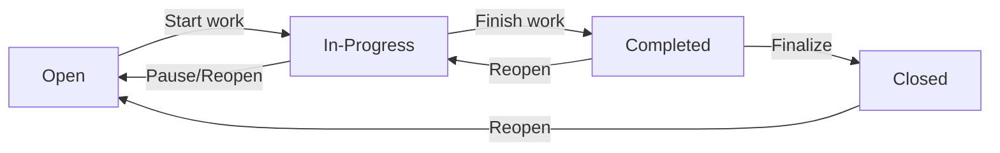

Each status change is recorded in the task history for audit purposes, capturing the previous status, new status, timestamp, and the user who made the change.

### Task Classification

Tasks are classified by priority level to guide scheduling and resource allocation decisions. The priority levels are:

- **Low**: Minimal urgency, can be addressed when convenient
- **Medium**: Standard priority, should be completed within normal workflow
- **High**: Significant urgency, requires attention before lower priority items
- **Urgent**: Critical priority, demands immediate attention and resource allocation

Priority helps employees and managers understand which tasks should be addressed first when multiple assignments compete for attention.

### Task Planning Attributes

Tasks support planning through optional attributes that help estimate and schedule work. The estimated hours field allows specifying the expected effort required to complete the task, supporting project budgeting and capacity planning. An optional due date establishes when the task should be completed, enabling deadline tracking and scheduling. These planning attributes help manage workload distribution and identify tasks at risk of missing deadlines.

### Task Assignment

Tasks can be optionally assigned to a specific employee who is responsible for completing the work. The assigned employee must be a member of the project to which the task belongs. When assigned, the task appears in the employee's personal dashboard and task lists. Unassigned tasks remain available for any project member to pick up. Assignment can be changed as needed throughout the task lifecycle to accommodate changing priorities or workload rebalancing.

### Task Hierarchy

Tasks support a single level of nesting to enable simple work breakdown structures. A task can optionally reference a parent task, establishing a parent-child relationship. Child tasks represent sub-tasks or components of the parent task's overall work. The nesting is limited to one level—child tasks cannot themselves have children. This constraint maintains simplicity while allowing basic decomposition of complex work items. When viewing a parent task, its child tasks are visible as sub-items.

### Task Scope and Project Context

Every task belongs to exactly one project and cannot exist independently outside of a project. The project context determines which employees can view and work on the task—only project members have access to tasks within that project. Tasks can have time logged against them only by employees assigned to the parent project. The task inherits the organization's data isolation boundaries through its project association, ensuring complete separation between organizations.

## TaskHistory Concept

TaskHistory represents an audit record documenting changes to a task's status over time, providing a chronological trail of the task's progression through its lifecycle. Each history entry captures the timestamp when the status change occurred, recording exactly when the transition took place. The entry stores both the previous status and the new status, clearly showing the direction of the state change. The history also records which user performed the status change, establishing accountability for the modification. This audit trail enables reviewing how tasks have progressed, identifying bottlenecks, and understanding the timeline of work completion. Task history entries are immutable records that cannot be modified or removed once created, ensuring the integrity of the audit trail. The history provides valuable context for project management and post-project analysis of workflow efficiency.

### TaskHistory as Audit Record

TaskHistory represents a formal audit record that documents each modification made to a task's status. This entity serves as a chronological trail that captures the progression of work throughout a task's lifecycle. Each history entry corresponds to a single status change event and provides a permanent record of when and how a task transitioned from one state to another. The audit record preserves the complete lineage of status modifications, enabling stakeholders to review the history of work progression and understand the sequence of state changes that brought the task to its current condition.

### Status Change Attributes

Each TaskHistory entry captures essential details about a specific status transition. The entry records the precise timestamp when the status change occurred, establishing when the transition took place. The history entry stores the previous status value, documenting the state of the task before the change occurred. The entry also records the new status value, indicating the state the task transitioned to. These attributes together provide a complete picture of the status change event, showing both the origin state and the destination state along with the exact moment of transition.

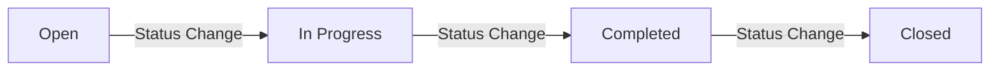

### User Accountability

Each TaskHistory entry establishes clear accountability for status changes by recording which user performed the modification. This creates an unambiguous link between the action and the person who authorized or executed it. The user accountability attribute ensures that any status modification can be traced back to a specific individual, supporting transparency and responsibility in task management. This attribution enables managers and team members to identify who initiated particular workflow transitions, facilitating communication about work progress and providing context when reviewing the task's evolution.

### Immutable Audit Trail

TaskHistory entries form an immutable audit trail that cannot be modified or removed once created. This immutability ensures the integrity and reliability of the historical record, preserving an accurate and tamper-proof account of all status changes. The permanent nature of these entries guarantees that the chronological history of a task remains consistent and trustworthy over time. Organizations can rely on this immutable trail for post-project analysis, compliance verification, and workflow optimization without concern that historical records could be altered or deleted.

### Task Progression History

TaskHistory provides a comprehensive view of task progression history by aggregating all status change events in chronological order. This historical view enables reviewing how tasks have moved through various stages of completion, identifying patterns in workflow execution, and understanding the timeline of work completion. The progression history serves as valuable context for project management decisions and supports post-project analysis of workflow efficiency. By examining the complete history of status changes, managers can identify bottlenecks, measure cycle times between states, and optimize future project workflows based on actual historical performance data.

## Timelog Concept

A Timelog represents a single time entry recording work performed by an employee on a specific date. Each timelog captures the date when the work was performed and the duration in minutes representing how long the employee spent on the activity. The timelog must be associated with a project that the employee is assigned to, establishing what body of work the time was spent on. An optional task association allows for more granular tracking of time against specific activities within the project. An optional description field allows employees to document what was accomplished during the time period. A billable flag indicates whether the time should be charged to clients or counted as billable hours versus internal or non-billable work. Timelogs can only be modified by the employee who created them unless the user has special permissions to manage time entries. Once a timelog is included in a submitted or approved timesheet, it becomes locked and cannot be modified or removed by the employee.

### Timelog Definition

A timelog represents a continuous period of time spent by a person on a specific activity or task. It records when work started, when it ended, and what work was performed during that interval.

Each timelog is created by and belongs to exactly one person who performed the work. The person creating the timelog is referred to as the owner.

A timelog can optionally be associated with a higher-level grouping entity such as a project, task, or category to provide context about what type of work was performed.

Timelogs serve as the primary record for tracking effort expenditure, enabling reporting on time distribution across activities and supporting billing or payroll processes where applicable.

### Timelog Attributes

A timelog consists of the following information:

**Temporal Information**
- Start time: The exact moment when the recorded work period began
- End time: The exact moment when the recorded work period concluded
- Duration: The calculated length of the time interval between start and end, typically expressed in hours and minutes

**Descriptive Information**
- Description: An optional text explanation of what work was performed during this time period
- Activity type: A classification indicating the nature of work performed (for example, development, meeting, research, or administrative work)

**Association Information**
- Related project: An optional reference to the project this work contributed to
- Related task: An optional reference to the specific task or work item this time was spent on
- Tags: Optional labels that enable flexible categorization and filtering

**Recording Metadata**
- Creation timestamp: When this timelog record was first entered into the system
- Source: How the timelog was created (for example, manual entry, timer-based recording, or import)

### Timelog Lifecycle States

A timelog exists in one of several states that reflect its status in the recording and approval workflow:

**Draft**: The initial state when a timelog is first created. Draft timelogs are visible only to their owner and can be freely edited or deleted. A draft timelog may have incomplete information.

**Recorded**: The timelog has been submitted as a complete record of work performed. Once recorded, the timelog becomes visible to authorized reviewers and managers. The owner may still edit the timelog within a defined time window after recording.

**Approved**: The timelog has been reviewed and accepted by an authorized approver. Approved timelogs are considered final and typically should not be modified except through a formal correction process.

**Rejected**: The timelog has been reviewed and deemed invalid or inaccurate by an authorized approver. A rejected timelog is returned to the owner for correction or deletion.

**Disputed**: The timelog is under review due to questions about its accuracy or validity raised by an authorized reviewer. While disputed, the timelog remains visible but flagged for resolution.

### State Transitions

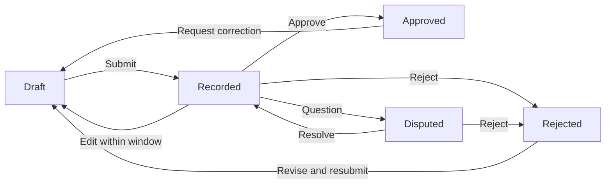

A timelog in Draft state can transition to Recorded when the owner submits it as a complete work record.

A Recorded timelog can transition back to Draft if edited within the allowed time window before approval. Once submitted, it can be Approved, Rejected, or marked as Disputed by authorized reviewers.

A Rejected timelog returns to Draft for the owner to correct and resubmit.

A Disputed timelog returns to Recorded when the dispute is resolved, or to Rejected if the dispute confirms the timelog is invalid.

An Approved timelog can return to Draft only through a formal correction request initiated by an authorized approver or administrator.

### Timelog Relationships

**Ownership Relationship**
Each timelog is owned by exactly one person who performed the work. The owner has primary responsibility for creating, editing, and submitting their timelogs. An owner can view all timelogs they have created regardless of state.

**Project Association**
A timelog may optionally reference a project, indicating that the time recorded was spent contributing to that project's goals. A project can have multiple associated timelogs from multiple people.

**Task Association**
When more granular tracking is needed, a timelog may reference a specific task or work item. Multiple timelogs can reference the same task to show cumulative effort.

**Approval Chain**
A timelog may be reviewed and acted upon by one or more authorized approvers. Approvers are typically managers or project leads who have been granted authority to approve time for specific projects or teams.

**Audit Trail**
A timelog maintains a history of significant changes including submission, approval, rejection, and modifications. This history captures who made each change and when it occurred.

## Timesheet Concept

A Timesheet represents a collection of time entries for a specific employee covering a complete work week from Monday through Sunday. Each timesheet has a week start date marking the Monday of the week and a week end date marking the Sunday, defining the time period covered. The timesheet aggregates the total hours from all included timelogs, providing a summary of time worked during the week. A status field tracks the timesheet through its lifecycle as draft, submitted, approved, or rejected. Draft timesheets can be modified by the employee, while submitted timesheets await review by authorized approvers. Approved timesheets lock all included timelogs, preventing further modifications and confirming the hours as finalized. Rejected timesheets return to draft status with a required rejection reason explaining what needs correction. The timesheet records when it was submitted for approval and when it was reviewed, along with who performed the review action. Only one timesheet per week can be in submitted or approved status for each employee.

### Weekly Time Collection

A Timesheet represents a collection of time entries (timelogs) for a specific employee covering a complete work week. The timesheet serves as a container that aggregates all time logged by an employee during a single week, providing a consolidated view of their work activity. When a draft timesheet is created for a week, it automatically includes all timelogs belonging to that employee that fall within the week's date range. The employee can then add or remove timelogs from the draft timesheet before submission, allowing them to curate which time entries are included in their weekly report. A timesheet must contain at least one timelog to be eligible for submission.

### Week Boundaries

Each timesheet is bound to a specific calendar week defined by a week start date and a week end date. The week start date marks the Monday of the week and represents the first day of the timesheet period. The week end date marks the Sunday of the week and represents the last day of the timesheet period. Together, these dates define the complete seven-day period covered by the timesheet. All timelogs included in a timesheet must have dates that fall within this Monday-through-Sunday range. The system enforces that timesheets always align to complete weeks starting on Monday and ending on Sunday, regardless of when the employee actually creates or submits the timesheet.

### Total Hours Summary

The timesheet maintains a total hours value that represents the sum of all duration minutes from the timelogs included in the timesheet, converted to hours. This total provides a quick summary of the time worked during the week without requiring manual calculation. The total hours is calculated dynamically based on the current set of timelogs associated with the timesheet, meaning it updates automatically as timelogs are added or removed from a draft timesheet. The total hours value is visible to the employee for their own timesheets and to users with permission to view all employees' timesheets.

### Timesheet Status Lifecycle

Each timesheet progresses through a defined status lifecycle that governs its state and the actions that can be performed on it. The four possible statuses are: draft, submitted, approved, and rejected. The status determines whether the timesheet can be modified, who can view or act upon it, and what operations are permitted. A timesheet always begins in draft status when created. From draft, it can transition to submitted when the employee is ready for review. From submitted, an approver can transition it to either approved or rejected. From rejected, the timesheet returns to draft status for correction and resubmission. Once approved, a timesheet remains in approved status permanently and cannot return to any other status.

### Draft Timesheet

A timesheet in draft status is a work-in-progress that the employee is actively preparing for submission. In draft status, the employee can freely add or remove timelogs from the timesheet, allowing them to adjust which time entries are included before finalizing. Draft timesheets are only visible to the owning employee and to users with permission to view all employees' timesheets. A draft timesheet can be modified without restriction until the employee chooses to submit it. If a timesheet is rejected during the review process, it returns to draft status to allow the employee to make corrections based on the rejection reason provided.

### Submitted Timesheet

A timesheet in submitted status has been formally presented by the employee for review and approval. When a draft timesheet is submitted, the system records the submission timestamp marking when the action occurred. Once submitted, the timesheet becomes visible to users with time approval permission, who can then review the included timelogs and decide whether to approve or reject the timesheet. While in submitted status, the employee cannot modify the timesheet or any timelogs included within it. A timesheet cannot be submitted if it contains no timelogs or if another timesheet for the same week is already in submitted or approved status.

### Approved Timesheet

A timesheet in approved status has been reviewed and formally accepted by an authorized approver. When a submitted timesheet is approved, the system records the review timestamp and identifies the user who performed the approval. Once approved, the timesheet locks all included timelogs, preventing any further edits or deletions to those time entries. The approved status represents final confirmation that the hours recorded are accurate and authorized. An approved timesheet cannot be returned to draft or submitted status, and the employee cannot modify any timelogs that were part of the approved timesheet.

### Rejected Timesheet

A timesheet in rejected status indicates that an authorized approver reviewed the submission and determined it requires correction. When rejecting a timesheet, the approver must provide a rejection reason explaining what needs to be corrected or why the submission was not accepted. The system records the review timestamp and the reviewer identification when the rejection occurs. Upon rejection, the timesheet automatically returns to draft status, allowing the employee to view the rejection reason and make the necessary corrections. The employee can then resubmit the corrected timesheet for approval.

### Submission and Review Tracking

The timesheet maintains timestamps that track key events in its lifecycle. The submission timestamp records when the employee submitted the draft timesheet for approval. The review timestamp records when an approver acted upon a submitted timesheet, either approving or rejecting it. The reviewer identification records which user performed the approval or rejection action. These tracking fields provide an audit trail of the timesheet's journey through the approval workflow. The rejection reason captures the explanation provided by the reviewer when a timesheet is rejected, giving the employee guidance on what corrections are needed.

### Single Timesheet Per Week Constraint

The system enforces a constraint that only one timesheet per week can exist in submitted or approved status for each employee. This ensures there is always a single, unambiguous record of time for each work week. If an employee already has a timesheet in submitted or approved status for a given week, they cannot create or submit another timesheet for that same week. However, multiple draft timesheets can exist for different purposes or testing, but only one can be submitted. If a submitted timesheet is rejected and returned to draft status, the employee can resubmit that same timesheet after making corrections, maintaining the single submission constraint.

## Timer Concept

A Timer represents a live, running time tracking session that an employee uses to record work in real-time. Each employee can have at most one active timer at any given moment, ensuring accurate time tracking without overlapping entries. When started, the timer records the timestamp when tracking began and requires selection of a project to charge the time against. An optional task can be selected to further categorize the work being performed. An optional description allows the employee to document what they are working on while the timer runs. The timer continues running indefinitely until explicitly stopped by the employee, with no automatic timeout or stop mechanism. When stopped, the timer calculates the elapsed duration and can generate a timelog entry with that duration rounded to the nearest minute. The timer can also be discarded without creating a timelog if the tracking session was started in error or is no longer needed. The running timer can be viewed at any time to check how long the current session has been active.

### Timer as Live Time Tracking Session

A Timer represents a live, ongoing time tracking session that enables employees to record work duration in real-time as it happens. The timer captures the exact moment when tracking begins, establishing a start timestamp that serves as the reference point for all subsequent duration calculations.

The system enforces a strict constraint that each employee may have at most one active timer at any given moment. This single-active-timer policy prevents overlapping time entries and ensures accurate, non-conflicting work records. If an employee attempts to start a new timer while another is already running, the system prevents this action to maintain data integrity.

Once started, the timer runs indefinitely without any automatic timeout or stop mechanism. The timer continues tracking elapsed time until the employee explicitly chooses to stop or discard it. There is no maximum duration limit, no idle detection, and no automatic termination based on time of day or session length. This design accommodates various work patterns, including long-running tasks that may span multiple hours.

### Timer Attributes and Context

When an employee starts a timer, they must specify a project to associate the tracked time with. The project selection determines where the resulting time entry will be allocated within the organization's project structure. Only projects that the employee is assigned to are eligible for selection.

Employees may optionally select a task within the chosen project to provide more granular categorization of their work. Task selection is not mandatory; the timer can run with only a project association when work does not correspond to a specific defined task.

An optional description field allows employees to document what they are working on while the timer runs. This description can be added when the timer starts or edited during the tracking session, enabling employees to update their work notes as the session progresses.

The running timer maintains a live view of the elapsed duration, calculated as the time difference between the start timestamp and the current moment. This elapsed time display updates continuously, allowing employees to monitor how long their current session has been active.

### Timer Completion and Disposal

When an employee stops a running timer, the system calculates the total elapsed duration by measuring the time between the start timestamp and the stop moment. This calculated duration is rounded to the nearest minute for consistent time entry records.

Upon stopping, the timer session can be converted into a permanent timelog entry that captures the final duration, associated project, optional task, and description for the employee's time records.

Alternatively, employees may discard a running timer without saving any time entry. Discarding terminates the tracking session immediately without creating a timelog, which is useful when a timer was started in error or the tracked session is no longer relevant. No record of the elapsed time is retained when a timer is discarded.

The timer supports viewing its current state at any point during the tracking session, allowing employees to check start time, elapsed duration, project association, task association, and description while the session remains active.

## ActivityLog Concept

An ActivityLog represents a recorded audit entry documenting significant actions and events that occur within the organization. Each log entry captures a timestamp indicating exactly when the action took place. The entry identifies which user performed the action, establishing accountability for the activity. The action type classifies what kind of event occurred, such as employee invitations, deactivations, contract changes, project modifications, task status updates, timesheet approvals, or role assignments. The log also identifies the target entity affected by the action, such as a specific employee, project, or timesheet. Additional details provide context about what specifically changed or occurred during the action. Activity logs serve as an immutable audit trail for compliance, security monitoring, and operational transparency within the organization. The full activity log is accessible to authorized users with appropriate permissions, providing visibility into organizational operations and changes over time.

### ActivityLog Definition and Purpose

An activity log entry represents a captured record of a significant event or action that occurs within an organization. Each entry serves as an immutable audit trail entry that documents what happened, when it happened, and who was responsible.

The activity log functions as a compliance record, providing organizations with a verifiable history of operations for regulatory requirements and internal governance. These records cannot be altered or deleted, ensuring the integrity of the organizational history.

The log also serves as an operational transparency log, giving authorized stakeholders visibility into organizational changes, employee actions, and system events. This transparency supports accountability, security monitoring, and operational oversight.

Activity log entries are automatically generated by the system when significant actions occur across various domains including employee management, project operations, time tracking, and role administration. The collection of all entries forms a comprehensive audit trail of organizational activity over time.

### ActivityLog Core Attributes

Each activity log entry captures several essential pieces of information that together provide complete context about the recorded action.

**Action Timestamp**
Every log entry includes an action timestamp that records the exact moment when the action occurred. This timestamp provides temporal ordering for events and enables chronological analysis of organizational activity.

**User Who Performed the Action**
The entry identifies the user who performed the action, establishing clear accountability. This attribution links every significant operation to a specific individual within the organization.

**Action Type Classification**
The action type classification categorizes the nature of the event that occurred. Defined action types include employee invitation events, employee deactivation events, employee reactivation events, contract creation events, contract modification events, project creation events, project archival events, project completion events, project deletion events, task status change events, timesheet submission events, timesheet approval events, timesheet rejection events, and role assignment events.

**Target Entity Identification**
The log entry identifies the target entity affected by the action. This identification specifies which business object was modified or involved in the action, such as a specific employee record, project, task, or timesheet.

**Action Details Context**
Additional action details context provides supplementary information about what specifically occurred. These details may include before and after values, rejection reasons for timesheet reviews, or other contextual data that helps reconstruct the full circumstances of the action.

# Domain Relationships

Describe how concepts relate to each other from a business perspective.

## Conceptual Relationships

Describe how concepts relate to each other in business terms.

### Organization as Root Container

An Organization serves as the top-level container for all business data within the platform. The Organization has a one-to-many relationship with its constituent entities:

- An Organization owns multiple Employees (via OrganizationMember records)
- An Organization owns multiple Departments
- An Organization owns multiple Projects
- An Organization owns multiple Roles
- An Organization owns multiple ActivityLog entries

All data within the Organization is strictly isolated from other Organizations. An employee in Organization A cannot access projects, timelogs, or any data belonging to Organization B, even if the same user account has membership in both Organizations.

This ownership relationship means that when an Organization is deleted, all of its owned entities are permanently removed from the system. The Organization is the aggregate root for multi-tenancy data isolation.

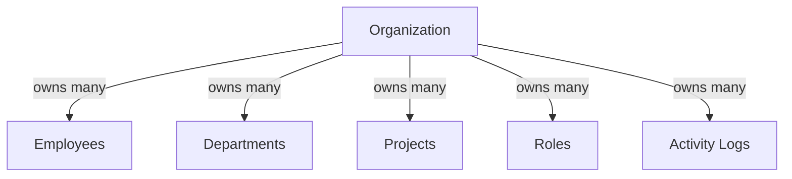

### User and Organization Membership

A User account represents a person's identity across the entire platform. A User can belong to multiple Organizations simultaneously through OrganizationMember associations. This creates a many-to-many relationship between Users and Organizations.

Each OrganizationMember record represents a single membership link between one User and one Organization. This association contains:
- The role assigned to the User within that Organization
- Optional department assignment
- Optional position or job title
- Employment type classification

The User maintains a global profile (display name, avatar, phone number) that is shared across all Organizations they belong to. Changes to the User's profile are visible in all Organizations.

When a User logs in, they must select which Organization context to work in. All subsequent actions are filtered to show only data belonging to that selected Organization. The User can switch Organizations without logging out and re-authenticating.

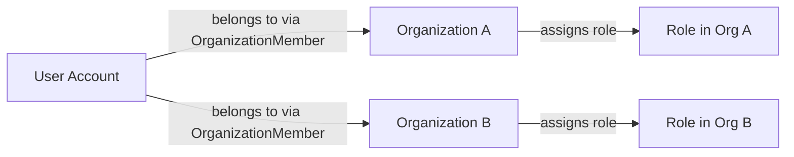

### Role Assignment and Permissions

A Role defines a set of permissions available to Organization members. Each Organization has its own Role definitions, creating a one-to-many relationship where an Organization owns multiple Roles.

The Role belongs to exactly one Organization. Roles are not shared across Organizations—each Organization manages its own permission configurations independently.

Each OrganizationMember is assigned exactly one Role within their Organization. This creates a many-to-one relationship where multiple OrganizationMembers can share the same Role, but each OrganizationMember has only one Role at any given time.

The Role assignment determines what actions the member can perform:
- Organization management permissions
- Employee management permissions
- Project management permissions
- Time tracking and approval permissions
- Report viewing permissions

When a member's Role is changed, their permissions update immediately. A Role that has members assigned to it cannot be deleted until those members are reassigned to different Roles.

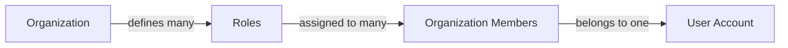

### Department Hierarchy

A Department is an organizational unit within an Organization. Each Organization can have multiple Departments, creating a one-to-many ownership relationship.

Departments support a single level of nesting through a self-referential parent-child relationship:
- A Department can optionally belong to one parent Department
- A Department can have multiple child Departments
- This creates a two-level hierarchy (parent and children, no grandchildren)

OrganizationMembers can optionally belong to one Department. This is a many-to-one relationship where multiple employees can be assigned to the same Department, and each employee can be in at most one Department (or none).

When a Department is deleted:
- The Department entity is removed
- Employees previously assigned to that Department have their department association set to null
- The employees themselves are not deleted or deactivated

Departments provide a way to group employees for organizational and filtering purposes but do not affect permission levels.

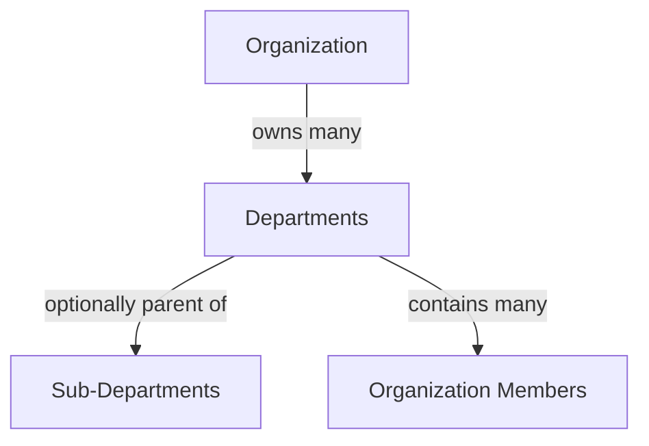

### Employee Contract History

An OrganizationMember (Employee) can have multiple Employment Contracts over time, creating a one-to-many relationship. Each Contract belongs to exactly one OrganizationMember.

Contracts represent the historical record of employment terms. The relationship enforces that:
- An employee has zero or more Contracts (one historical record per employment period)
- Only one Contract can be active at any time (the one with no end date, or the most recent if all have end dates)
- Creating a new Contract automatically ends the previous active Contract

A Contract captures:
- The employment period (start date and optional end date)
- Compensation terms (pay rate and pay period type)
- Working hours commitment
- Optional notes

Past Contracts (those with an end date) are immutable—they cannot be edited. Only the current active Contract can be modified. This preserves the integrity of historical employment records.

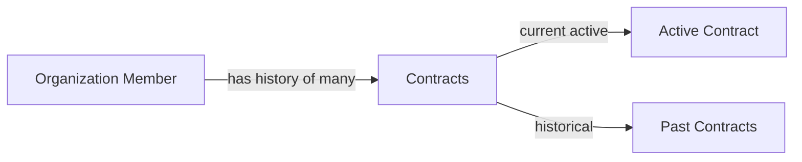

### Project Membership and Assignment

A Project belongs to exactly one Organization. The Organization owns multiple Projects, establishing a one-to-many relationship.

Projects are associated with OrganizationMembers through ProjectMember associations, creating a many-to-many relationship with additional attributes:
- An OrganizationMember can be assigned to multiple Projects
- A Project can have multiple OrganizationMembers assigned to it
- Each ProjectMember assignment includes a project-specific role (member or project-lead)

The ProjectMember role within a project is independent of the Organization-level Role. An Employee (with limited Organization permissions) can be a project-lead on a specific Project, giving them task management authority limited to that project.

Projects have a lifecycle status (active, archived, completed). Only active Projects can receive new timelogs. Archived or completed Projects preserve their existing timelog history but cannot accept new time entries.

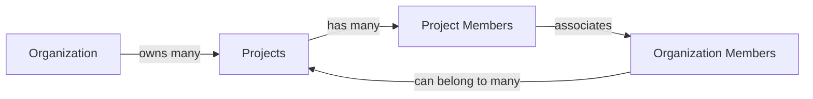

### Task Structure and Assignment

A Task belongs to exactly one Project. Each Project can have multiple Tasks, creating a one-to-many ownership relationship.

Tasks can have a single level of nesting for subtasks:
- A Task can optionally have one parent Task
- A Task can have multiple child Tasks (subtasks)
- Only one level of nesting is supported (no grandchild tasks)

Tasks can optionally be assigned to an OrganizationMember who must be a member of the Project. This creates a many-to-one relationship where multiple Tasks can be assigned to the same employee, but each Task has at most one assignee (or none).

Tasks have a status workflow tracked through TaskHistory entries:
- Each Task has a current status (open, in-progress, completed, closed)
- Each status change creates a TaskHistory record
- TaskHistory belongs to the Task and captures the old status, new status, who made the change, and when

Tasks can also have associated Timelogs when employees log time against specific work items.

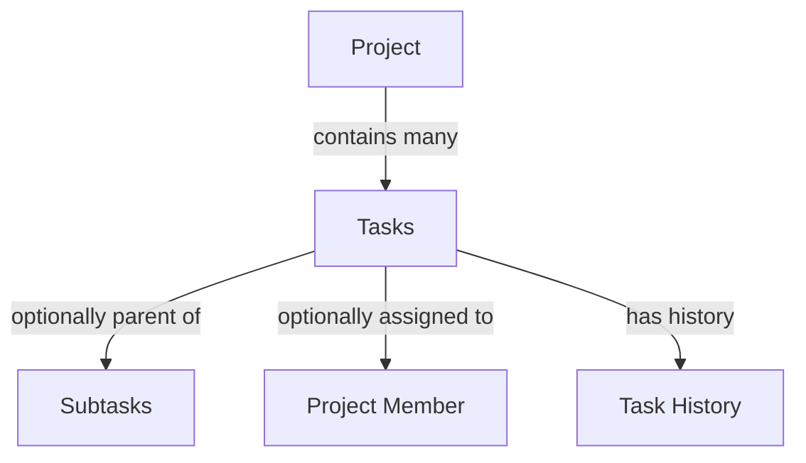

### Time Tracking Data Relationships

Time tracking data consists of three related concepts: Timelogs, Timesheets, and Timers. All three belong to an OrganizationMember (the employee who created them).

**Timelogs** represent individual time entries:
- A Timelog belongs to one OrganizationMember
- A Timelog belongs to one Project (must be a project the employee is assigned to)
- A Timelog optionally belongs to one Task (must be within the selected Project)

**Timesheets** are weekly collections of Timelogs:
- A Timesheet belongs to one OrganizationMember
- A Timesheet contains multiple Timelogs for a specific week (Monday through Sunday)
- Each Timelog can be included in at most one Timesheet
- When a Timesheet is approved, all included Timelogs become locked (cannot be edited or deleted)

**Timers** represent live, in-progress time tracking:
- A Timer belongs to one OrganizationMember
- At most one Timer can be active per OrganizationMember at any time
- When stopped, a Timer creates a Timelog with the calculated duration

The relationship between Timesheets and Timelogs is that a Timesheet aggregates its owner's Timelogs for a specific week range.

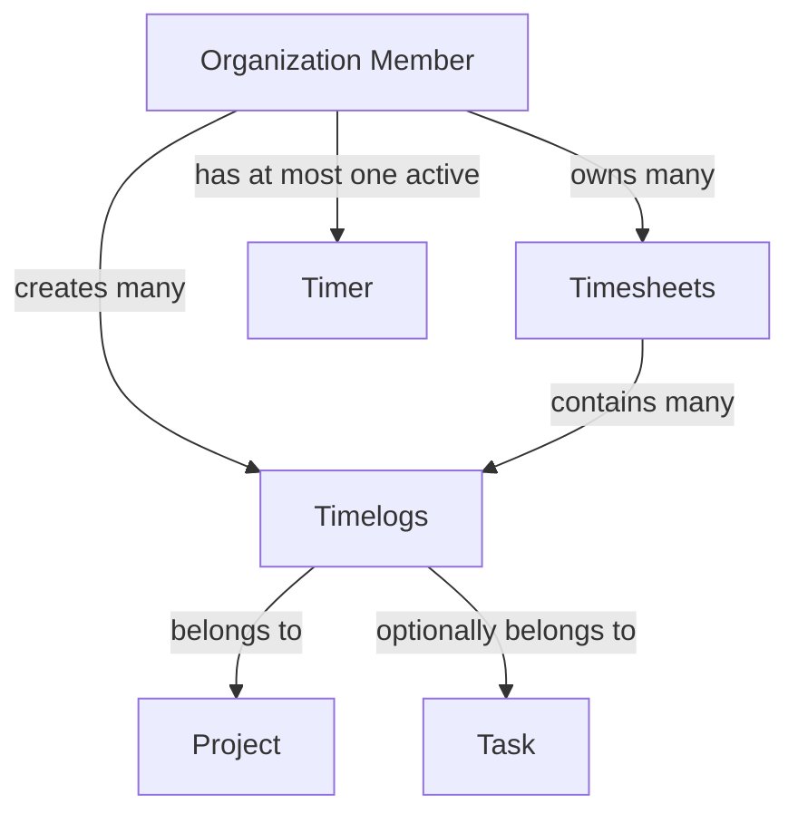

### Activity Log and Audit Trail

The ActivityLog maintains a record of significant actions performed within an Organization. Each ActivityLog entry belongs to exactly one Organization and is performed by exactly one User.

The ActivityLog captures:
- What action was performed (action type)
- Who performed it (User reference)
- When it occurred (timestamp)
- What entity was affected (target entity type and identifier)
- Additional context details

The ActivityLog has a many-to-one relationship with Organizations (many entries per Organization) and a many-to-one relationship with Users (many entries performed by the same User across potentially multiple Organizations).

Unlike other entities owned by Organizations, ActivityLog entries are typically retained even when the target entities are deleted, providing a complete audit trail of what happened within the Organization.

Logged actions include employee lifecycle events, contract changes, project state transitions, task status changes, timesheet approvals, and role assignments.

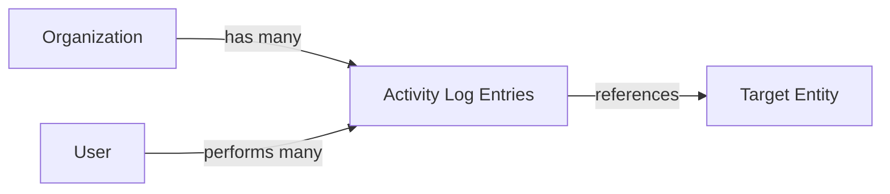

### Cross-Cutting Ownership Summary

The following ownership and association patterns apply across the domain:

**Organization as Aggregate Root:**
- Organization owns: Employees (OrganizationMembers), Departments, Projects, Roles, ActivityLogs
- When Organization is deleted, all owned entities are permanently removed

**User as Cross-Organization Identity:**
- User belongs to multiple Organizations via OrganizationMember associations
- User owns: global profile data (display name, avatar, phone)
- User performs actions recorded in ActivityLog across Organizations

**Employee (OrganizationMember) as Work Actor:**
- OrganizationMember belongs to one Organization
- OrganizationMember belongs to one User account
- OrganizationMember is assigned one Role
- OrganizationMember optionally belongs to one Department
- OrganizationMember owns: Contracts, Timelogs, Timesheets, Timers
- OrganizationMember is assigned to Projects via ProjectMember
- OrganizationMember is assigned Tasks

**Project as Work Container:**
- Project belongs to one Organization
- Project owns: Tasks, ProjectMembers
- Project aggregates Timelogs from assigned members

**Hierarchical Relationships:**
- Department: one level of parent-child nesting
- Task: one level of parent-child nesting (subtasks)
- Contract: sequential history with one active at a time

**Association Constraints:**
- Timelogs must reference Projects the employee is assigned to
- Tasks must reference Projects and can only be assigned to project members
- Timesheets aggregate Timelogs by week and employee
- All queries are scoped to the currently selected Organization context

## Lifecycle and Retention

Describe concept lifecycle states and transitions only. Detailed retention/recovery policies belong in 05-non-functional. Operation details belong in 03-functional-requirements.

### Organization Lifecycle

An organization begins in an active state upon creation during user sign-up. The organization remains active as long as it exists, with all associated data accessible to its members.

An organization may be deleted by its owner only when specific conditions are met. The deletion can proceed when all pending timesheets across the organization have been resolved through approval or rejection. Additionally, there must be no active employee contracts remaining in the organization.

When an organization is deleted, all data belonging to that organization is permanently removed. This includes all employee records, projects, tasks, timelogs, timesheets, departments, and custom roles. The owner's user account remains intact but becomes unaffiliated with any organization.

An organization owner must transfer ownership to another member or delete the organization before they can delete their own account if they are the sole owner.

### Employee Lifecycle

An employee within an organization exists in one of two states: active or deactivated.

Employees begin in the active state upon invitation acceptance. In the active state, employees can log time, submit timesheets, access assigned projects, and perform all actions permitted by their role.

An employee may transition to the deactivated state. Deactivated employees cannot log new time entries or submit timesheets. However, all historical data belonging to the employee, including past timelogs, timesheets, and task assignments, is preserved within the organization.

Deactivated employees may be reactivated at any time by users with appropriate permissions. Upon reactivation, the employee regains all capabilities and access associated with their role and project assignments.

The employee record maintains the deactivation history, and the transition between states is logged in the activity log for audit purposes.

### Role Lifecycle

Roles within an organization exist as either built-in or custom types.

Built-in roles (Owner, Manager, Employee) exist permanently within the organization and cannot be deleted. These roles provide the foundational permission structure for the organization.

Custom roles are created by organization owners with specific names and permission sets. Custom roles exist in an active state from creation until deletion.

A custom role may be deleted only when no employees are currently assigned to it. When a custom role is deleted, employees previously assigned to that role must be reassigned to another role before the deletion can proceed.

When an organization is deleted, all custom roles within that organization are permanently removed along with the organization data.

### Contract Lifecycle

An employee may have multiple contracts over their tenure, representing the complete employment history. Contracts exist in one of two states: active or ended.

At any given time, an employee has exactly one active contract. The active contract represents the current employment terms including pay rate, pay period, and working hours.

When a new contract is created for an employee, the previously active contract automatically transitions to ended status. The end date of the previous contract is set to the day immediately preceding the new contract's start date.

Ended contracts serve as immutable historical records. Once a contract has ended, it cannot be modified. The contract history provides a complete audit trail of employment terms changes.

The active contract can be modified to reflect changes in employment terms. Such modifications are permitted for the current active contract only, preserving the integrity of historical records.

When an employee is deactivated, their active contract remains in the system as part of the employment history. When an organization is deleted, all contracts for all employees in that organization are permanently removed.

### Project Lifecycle

Projects progress through a defined lifecycle with three states: active, archived, and completed.

Projects begin in the active state upon creation. In the active state, the project can receive new timelogs from assigned employees, tasks can be created and modified, and new members can be assigned to the project.

A project may transition to the archived state. Archived projects are preserved for historical reference and reporting but cannot receive new timelogs. Existing timelogs associated with archived projects remain intact. Task modifications may be restricted for archived projects.

A project may transition to the completed state. Completed projects represent finished initiatives with all work concluded. Like archived projects, completed projects cannot receive new timelogs, but all historical data is preserved.

Projects in the active, archived, or completed states may be deleted only when they have no associated timelogs. If any timelog entries exist for the project, the deletion is blocked until all timelogs are removed.

When an organization is deleted, all projects within that organization are permanently removed regardless of their state or whether they contain timelogs.

### Task Lifecycle

Tasks follow a status workflow through four states: open, in-progress, completed, and closed.

Tasks begin in the open state upon creation. In this state, the task is available for assignment and work has not yet begun.

When work commences, the task transitions to the in-progress state. This state indicates active work is being performed on the task.

Upon completion of work, the task transitions to the completed state. This state signifies that all work items have been addressed.

Tasks may then transition to the closed state, representing final resolution. Closed tasks are considered finished and typically require no further action.

Each status change is recorded in the task history, capturing the timestamp, the previous status, the new status, and the user who made the change. This provides a complete audit trail of task progression.

Tasks may have subtasks, forming a parent-child relationship with one level of nesting. When a parent task's status changes, subtask statuses are not automatically updated. Each task maintains its own independent status.

When a project is deleted, all tasks within that project are permanently removed. When an organization is deleted, all tasks across all projects are permanently removed.

### Timesheet Lifecycle

Timesheets follow a four-state lifecycle: draft, submitted, approved, and rejected.

Timesheets begin in the draft state when created for a specific week. In the draft state, employees can add or remove timelogs from the timesheet. The draft represents work in progress that has not yet been submitted for review.

When the employee is ready for review, the timesheet transitions to the submitted state. In this state, the timesheet is locked for modification by the employee and awaits review by an authorized approver. A timesheet cannot be submitted if it contains no timelogs, or if another timesheet for the same week is already submitted or approved.

Upon review, the timesheet may transition to the approved state. Approved timesheets represent accepted time records for the week. All timelogs included in an approved timesheet are locked and cannot be edited or deleted by the employee.

Alternatively, the timesheet may transition to the rejected state. Rejection includes a reason provided by the reviewer. Rejected timesheets automatically return to draft status, allowing the employee to make corrections and resubmit.

The timesheet maintains timestamps for submission and review actions, along with identification of the reviewing user. When an employee is deactivated, draft and submitted timesheets remain in the system. When an organization is deleted, all timesheets are permanently removed.

### Timelog Data Retention

Timelogs exist as individual time entries that may be included in timesheets. The retention and modifiability of timelogs depends on their association with timesheets.

Timelogs that are not part of any timesheet remain freely editable and deletable by the employee who created them. These timelogs represent independent time entries that have not been submitted for approval.

Timelogs included in a draft timesheet can be edited or removed from the timesheet by the employee. However, they cannot be deleted entirely if they remain associated with the draft.

Timelogs included in a submitted timesheet are locked for employee modification. The employee cannot edit or delete these timelogs while the timesheet awaits review.

Timelogs included in an approved timesheet are permanently locked. Neither the employee nor users with time management permissions can edit or delete approved timelogs. This preserves the integrity of approved time records.

Users with appropriate permissions may edit or delete any employee's timelogs that are not part of an approved timesheet.

When a timesheet is rejected and returns to draft status, the included timelogs become editable again. When an organization is deleted, all timelogs within that organization are permanently removed regardless of their status.

### Timer Data Retention

Timers represent active time tracking sessions. Each employee may have at most one active timer at any given time.

An active timer continues running indefinitely until explicitly stopped or discarded by the employee. There is no automatic timeout or expiration mechanism for running timers.

When a timer is stopped, a timelog is created with the calculated duration from the start time to the stop time. The duration is rounded to the nearest minute. Once stopped, the timer ceases to exist as an independent entity and only the resulting timelog remains.

When a timer is discarded, no record is retained. The timer is removed without creating a timelog, and no historical trace of the discarded timer session remains.

When an employee logs out or switches organizations, any running timer continues uninterrupted. The timer is not automatically stopped or discarded.

When an employee is deactivated, any active timer they have is discarded without creating a timelog. When an organization is deleted, all timer data for employees in that organization is permanently removed.

### Activity Log Retention

Activity log entries represent an immutable audit trail of significant actions within the organization. Each entry captures the timestamp, the user who performed the action, the action type, the target entity, and relevant details.

Activity log entries are created automatically by the system when specific actions occur. These include employee invitations, deactivations and reactivations, contract creations and modifications, project lifecycle changes, task status changes, timesheet submissions and approvals, and role assignments.

Once created, activity log entries cannot be modified or deleted by any user, including organization owners. This immutability ensures the integrity of the audit trail.

Activity log entries are associated with the organization in which the action occurred. When an organization is deleted, all activity log entries for that organization are permanently removed.

The activity log provides a complete historical record for compliance and debugging purposes, preserving accountability for all significant system actions.

### Department Deletion Impact

Departments serve as organizational units for grouping employees. Departments may be deleted when they are no longer needed.

When a department is deleted, employees who were assigned to that department have their department assignment cleared. The employees themselves are not deleted or deactivated, and all other employee data including timelogs, timesheets, and project assignments remain intact.

If a department has child departments (one level of nesting supported), the deletion behavior for child departments depends on implementation design. Parent departments may be deleted independently of child departments, or deletion may require child departments to be removed first.

When a parent department is deleted, employees assigned to child departments retain their assignments to those child departments. The parent relationship is removed from the child departments.

Department deletion is irreversible. When an organization is deleted, all departments within that organization are permanently removed.

# Business Categories and State Flows

Business category classifications and state flow definitions.

## Business Category Definitions

Define all business category classifications with their allowed values and descriptions.

### Employment Type Classification

Employees are classified by their employment type, which determines their working arrangement with the organization.

**Full-Time**
Employees working standard full hours as defined by the organization or local regulations. These employees typically have a regular schedule and receive full employment benefits.

**Part-Time**
Employees working fewer hours than the standard full-time schedule. These employees have a reduced work commitment compared to full-time employees.

**Contractor**
External workers engaged on a contractual basis. Contractors are typically not considered permanent employees and may have different arrangements regarding benefits and working conditions.

**Intern**
Temporary positions typically for students or trainees gaining work experience. Interns are engaged for a fixed duration and are often limited in the scope of their responsibilities.

### Employee Status Classification

Each employee in an organization has a status indicating their current standing.

**Active**
The employee is currently engaged with the organization and can perform all system functions including logging time and submitting timesheets. Active employees appear in organizational lists and reports by default.

**Deactivated**
The employee is no longer active in the organization. Deactivated employees cannot log time or submit timesheets, but their historical data including past timelogs and submitted timesheets remains accessible. Deactivated employees can be returned to active status if needed.

### Project Status Classification

Projects progress through defined states during their lifecycle.

**Active**
The project is currently operational and can receive new timelogs. Employees can be assigned to active projects, and tasks can be created and modified within them.

**Archived**
The project is no longer actively worked on. Archived projects preserve all existing data including timelogs and task history, but new timelogs cannot be added. Archived projects can be reactivated if needed.

**Completed**
The project has reached its conclusion. Like archived projects, completed projects cannot receive new timelogs but retain all historical data for reporting purposes.

### Task Status Classification

Tasks track work progress through defined states.

**Open**
The task has been created but work has not yet started. The task is visible to assigned employees and available for work assignment.

**In-Progress**
Work has begun on the task. This status indicates active development or execution of the task requirements.

**Completed**
The task work has been finished. All required deliverables have been produced and the task objectives have been met.

**Closed**
The task has been finalized and no further action is required. Closed tasks are considered resolved and may have been verified or approved.

### Task Priority Classification

Tasks are assigned priority levels indicating their relative importance or urgency.

**Low**
The task has minimal urgency and can be addressed after higher priority items. These tasks have flexible timelines.

**Medium**
The task has standard priority and should be completed within normal workflow timeframes.

**High**
The task requires expedited attention and should take precedence over medium and low priority tasks.

**Urgent**
The task demands immediate attention and should be prioritized above all other work. Urgent tasks typically have significant consequences if delayed.

### Timesheet Status Classification

Timesheets move through a defined workflow for approval and processing.

**Draft**
The timesheet is being prepared by the employee and can be freely modified. Timelogs can be added or removed from draft timesheets. Draft timesheets have not been submitted for review.

**Submitted**
The employee has submitted the timesheet for approval. The timesheet and its associated timelogs are now locked from modification pending review. Only users with timesheet approval permission can change the status from submitted.

**Approved**
The timesheet has been reviewed and accepted by an authorized approver. All timelogs included in an approved timesheet are locked and cannot be edited or deleted. Approved timesheets represent confirmed work records.

**Rejected**
The timesheet was reviewed but not accepted. The timesheet returns to draft status, allowing the employee to make corrections and resubmit. A rejection requires the approver to provide a reason explaining why the timesheet was not accepted.

### Contract Pay Period Classification

Employment contracts specify how pay is calculated based on time periods.

**Hourly**
Pay is calculated based on actual hours worked. The pay rate represents compensation per hour of work performed.

**Daily**
Pay is calculated based on days worked. The pay rate represents compensation for each full or partial day of work.

**Weekly**
Pay is calculated based on weeks worked. The pay rate represents compensation for each week of employment.

**Monthly**
Pay is calculated based on months of service. The pay rate represents compensation for each month of employment, regardless of the number of days or hours worked.

### Project Member Role Classification

Employees assigned to projects have a role designation within that project.

**Member**
The employee can participate in the project, view project information, log time against project tasks, and view assigned tasks. Members have standard project participation rights.

**Project Lead**
The employee has enhanced responsibilities within the project including creating and managing tasks, assigning tasks to other members, and overseeing project execution. Project leads can modify task properties and manage the task workflow within their assigned project.

### Timelog Billability Classification

Time entries are classified by whether the time is billable to clients or internal.

**Billable**
The time spent is chargeable to a client or external party. Billable hours are typically included in client invoices and revenue calculations.

**Non-Billable**
The time spent is internal and not charged to clients. Non-billable hours include administrative work, internal meetings, training, and other non-revenue-generating activities.

### Role Permission Classification

The system supports various permissions that can be assigned to roles.

**Organization Management**
Permission to edit organization settings including name, description, logo, currency, timezone, and fiscal start month.

**Employee Management**
Permission to invite new employees, edit employee records, assign departments and positions, deactivate and reactivate employees, and manage employment contracts.

**Employee Viewing**
Permission to view the employee list, employee details, and employee contract information.

**Project Management**
Permission to create, edit, and delete projects and tasks, manage project memberships, and archive or complete projects.

**Project Viewing**
Permission to view projects, tasks, and project member information.

**Time Management**
Permission to edit or delete any employee's timelogs, regardless of who created them.

**Timesheet Approval**
Permission to view submitted timesheets and approve or reject them.

**Time Viewing (All)**
Permission to view all employees' timelogs and timesheets across the organization.

**Report Viewing**
Permission to access organization reports including time reports, project budget reports, and weekly summaries.

## State Transitions

Define valid state transition paths for stateful concepts.

### Project Status Lifecycle

A project progresses through distinct states during its lifecycle. The valid project statuses are: active, archived, and completed.

**State Transition Rules:**

An active project is the default state for new projects. An active project can receive new timelogs and accept task assignments.

From active, a project may transition to archived. An archived project preserves all existing timelogs and tasks but cannot receive new timelogs. This state is used for temporarily inactive projects that may resume later.

From active, a project may also transition to completed. A completed project is finished work that cannot receive new timelogs. This represents a finalized closure.

Archived and completed projects share similar restrictions - neither accepts new timelogs. The distinction is semantic: archived projects may be reactivated, while completed projects represent finality.

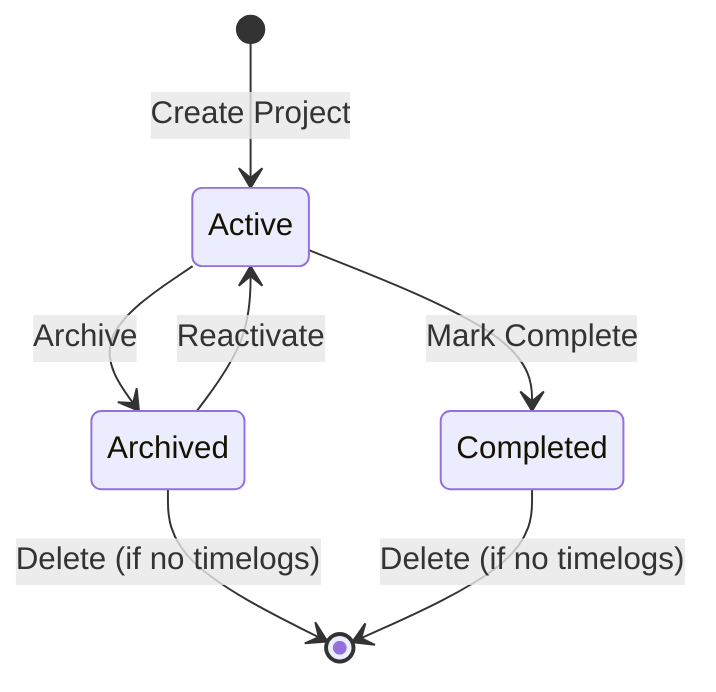

A project can only be deleted when it has no associated timelogs, and only administrators or those with appropriate permissions may delete projects. Deletion is permanent and removes all project data including tasks and membership records.

### Task StatusWorkflow

A task progresses through a workflow defined by its status. The valid task statuses are: open, in-progress, completed, and closed.

**State Transition Rules:**

A newly created task begins in open status. An open task is available for assignment and work but has not yet been started.

From open, a task may transition to in-progress when work begins. An in-progress task indicates active work is being performed.

From in-progress, a task may transition to completed when work is finished. A completed task indicates the work has been successfully finished.

From completed, a task may transition to closed to indicate final closure and archival.

From open, a task may also transition directly to closed if the work is no longer needed or canceled.

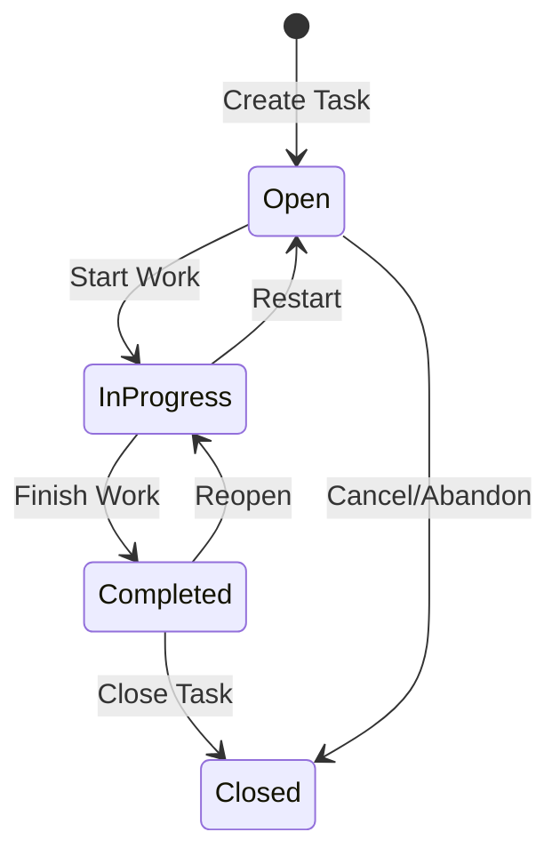

Each status change is recorded in the task history with the timestamp, previous status, new status, and the user who made the change. This creates an audit trail of the task's progression through its lifecycle.

### Timesheet Approval Workflow

A timesheet follows a formal approval workflow with statuses: draft, submitted, approved, and rejected.

**State Transition Rules:**

A timesheet begins as a draft when created for a specific week. In draft status, the employee can freely add, remove, or modify timelogs. The timelogs associated with a draft timesheet remain editable.

From draft, an employee may submit the timesheet for approval. A timesheet can only be submitted if it contains at least one timelog. Once submitted, the timelogs within the timesheet become locked from editing by the employee.

From submitted, a reviewer with approval permission may either approve or reject the timesheet.

If approved, the timesheet status changes to approved. All included timelogs remain locked. The timesheet is now finalized for that week.

If rejected, the timesheet returns to draft status. A rejection reason must be provided. The employee receives the rejection reason and can modify the timesheet and resubmit. Timelogs become editable again when returned to draft.

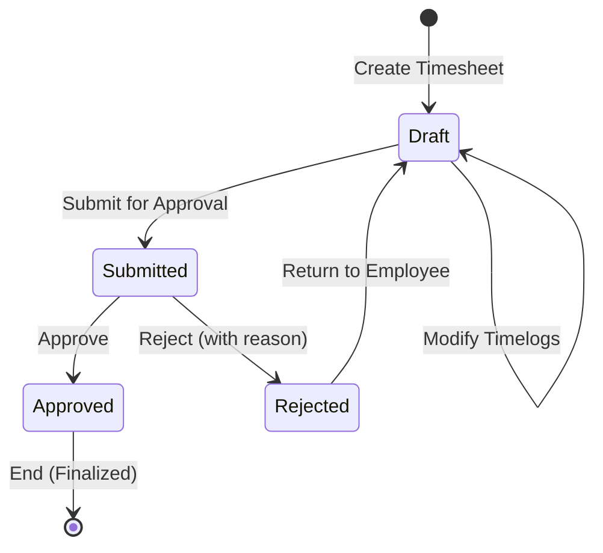

Only one timesheet per employee per week can exist in submitted or approved status. A new timesheet cannot be submitted for a week that already has a submitted or approved timesheet.

### Employee Status Lifecycle

An employee within an organization has a status indicating their employment state: active or deactivated.

**State Transition Rules:**

A new employee record begins in active status upon invitation acceptance. An active employee can log time, create timelogs, submit timesheets, and access projects they are assigned to.

From active, an employee's status may transition to deactivated by a manager with appropriate permissions. Common reasons include leave of absence, termination, or end of contract.

A deactivated employee cannot log into the organization's workspace, create timelogs, or submit timesheets. However, all historical data including past timelogs and submitted timesheets is preserved and accessible to those with viewing permissions.

From deactivated, an employee may transition back to active if they return to work or were deactivated in error.

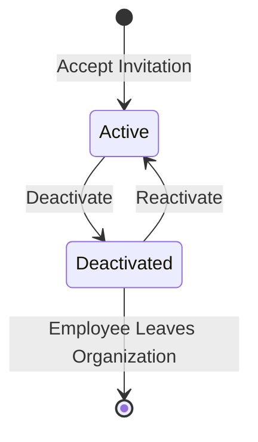

Only one status change occurs at a time. There is no automatic transition - every status change requires explicit action by an authorized user.

### Contract Lifecycle

An employee may have multiple contracts over time, representing different employment terms. However, only one contract can be active at any given moment for each employee.

**Contract State Rules:**

A contract is considered active when the current date falls between its start date and end date. If the end date is null, the contract is ongoing indefinitely from the start date.

When a new contract is created for an employee, the system automatically ends the previous active contract by setting its end date to the day before the new contract's start date. This ensures contract continuity without overlap.

A contract without an end date remains active indefinitely until explicitly ended by creating a new contract or manual termination.

Past contracts with an end date are immutable historical records. They cannot be edited - their terms remain fixed as a record of employment history.

The current active contract can be edited to adjust terms, provided no new contract has superseded it.

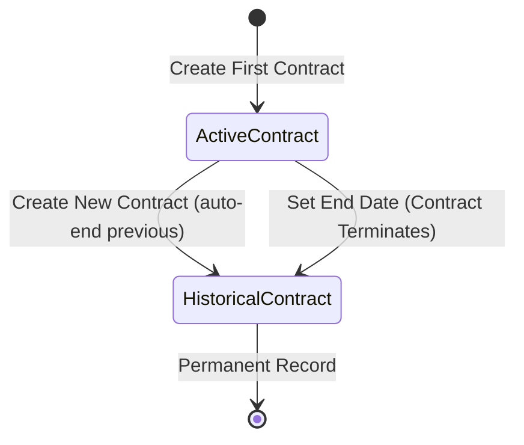

Contracts provide the historical employment context for time tracking, payroll calculations, and employment verification.

### Timer Runtime State Flow

A timer represents real-time work tracking and has an implicit binary state: running or stopped.

**Timer State Rules:**

When an employee starts a timer, it enters the running state. Each employee can have at most one running timer at any time. Starting a timer requires selecting a project and optionally a task.

While running, the timer continuously tracks elapsed time from its start timestamp. The employee can modify the project, task, or description of a running timer.

From running, a timer transitions to stopped when the employee stops it. Upon stopping, the system calculates the elapsed duration, rounds it to the nearest minute, and creates a timelog record with that duration.

From running, a timer may also be discarded. Discarding removes the timer without creating a timelog, losing any tracked time.

A timer that is forgotten continues running indefinitely - there is no automatic timeout. The employee is responsible for stopping their timer.

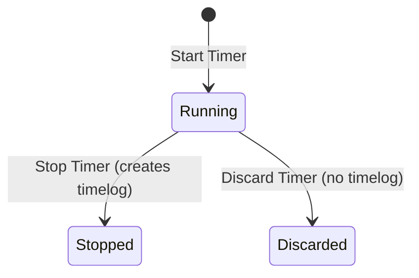

There is no paused state. A timer is either actively running or stopped. Stopping and later starting creates a new timer instance.