**erpHrm — What operations users can perform, use cases, business workflows**

What operations users can perform, use cases, business workflows

# Core Business Operations

What the system must do for each business concept.

## Organization Operations

Organizations represent the top-level business entities in this multi-tenant platform. Users create an organization during initial sign-up by providing a name, optional description, logo image, currency preference, timezone, and fiscal start month. Organization owners have full control and can edit all organization settings at any time to reflect changes in business requirements. Deleting an organization is restricted by business rules: the system prevents deletion when pending timesheets exist or when active employee contracts are present. When permitted, organization deletion permanently removes all associated employees, projects, tasks, timelogs, and timesheets, while the owner's user account remains intact but becomes unassociated. Users can belong to multiple organizations and must select an organization context when logging in, directing all subsequent operations to that organization scope. Users can switch between organizations without logging out, enabling seamless multi-organization workflows. All platform data and operations are strictly isolated per organization.

### Organization Creation During Sign-Up

Users create an organization during the initial sign-up process. The user provides the organization name, an optional description, a logo image, a currency preference (such as USD, EUR, or KRW), a timezone, and the fiscal start month. Upon successful creation, the user becomes the organization owner with full administrative access. The organization serves as the top-level container for all business data including employees, projects, and time tracking records. This creation establishes the foundation for the multi-tenant platform architecture where each organization operates as an independent business entity with complete data isolation from other organizations.

**Workflow:**
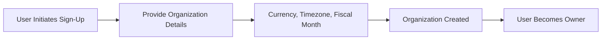

### Organization Settings Management

Organization owners can edit all organization settings at any time to reflect changes in business requirements. Editable settings include the organization name, description, logo image, currency preference, timezone, and fiscal start month. The currency setting affects how pay rates and financial reports are displayed throughout the organization. The timezone setting ensures that all timestamps, due dates, and reporting periods are interpreted correctly for the organization's geographic location. The fiscal start month determines the organization's reporting year boundaries for annual reports and budget cycles. Changes to organization settings take effect immediately and apply to all subsequent operations within the organization context.

### Organization Deletion Restrictions

Organization owners can delete their organization only when specific business conditions are satisfied. The system prevents organization deletion when pending timesheets exist within the organization, ensuring that all employee time submissions are properly resolved through approval or rejection before the organization can be removed. The system also blocks deletion when active employee contracts are present, preventing the removal of organizations with ongoing employment relationships. These restrictions protect data integrity and ensure proper business closure procedures. The owner must either resolve all pending timesheets and wait for contracts to end, or explicitly terminate contracts before deletion can proceed.

### Cascading Data Deletion

When an organization deletion is permitted, the system permanently removes all associated business data. This includes all employees and their records, all projects and their associated tasks, all timelogs recorded by employees, and all timesheets submitted for approval. The deletion operation cascades through the entire organizational hierarchy, ensuring complete cleanup of all tenant-specific data. The owner's user account remains intact but becomes unassociated with any organization, preserving the user's identity and profile for potential future use with other organizations. This cascading deletion ensures complete data removal while maintaining the multi-tenant platform's data isolation guarantees.

### Multi-Organization Membership

Users can belong to multiple organizations simultaneously within the platform. Each organization membership is independent, with separate roles, permissions, and employee records per organization. When a user belongs to multiple organizations, they must select an organization context when logging in. This selection directs all subsequent operations to that organization's scope, including viewing projects, logging time, and accessing reports. Users can switch between organizations without logging out, enabling seamless workflows across multiple organizational contexts. The platform enforces strict data isolation between organizations, ensuring that users only see and interact with data from their currently selected organization context.

### Organization Data Isolation

All platform data and operations are strictly isolated per organization. Employees in one organization cannot view, access, or interact with data from another organization. This data isolation applies to all entities including employees, projects, tasks, timelogs, timesheets, and reports. API requests and system operations automatically enforce organization context on every request, ensuring that queries only return data belonging to the active organization context. Users who belong to multiple organizations experience complete separation between organizational data, with no cross-organization visibility or data leakage. This multi-tenant architecture ensures that each organization operates as an independent business entity with complete privacy and security isolation from all other organizations on the platform.

## User Operations

Users establish platform access through email and password-based sign-up, which automatically creates their global user account. Authentication requires valid email and password credentials to access the system. Users maintain security by changing their passwords through the account settings. The platform supports multi-organization membership, allowing a single user account to belong to multiple organizations simultaneously. During login, users select one organization to establish their working context, and all subsequent operations are scoped to that organization. Users can seamlessly switch organizations during their session without requiring re-authentication. Account deletion is permitted with specific constraints: users who are sole owners of organizations must first transfer ownership or delete those organizations. When an account is deleted, employee records in other organizations are marked as deactivated rather than removed, preserving historical business data integrity.

### User Registration and Authentication

Users establish access to the platform through a registration process that creates their global account. The sign-up process requires a valid email address and password. Upon successful registration, the system creates a user account that can be used across all organizations the user will join.

The authentication process requires users to provide their registered email address and password. Successful authentication grants access to the system and initiates a user session.

For users who belong to multiple organizations, the login process includes an organization context selection step. After providing credentials, the user selects which organization they intend to work with for the current session. This organization selection establishes the operational scope for all subsequent actions.

If a user belongs to only one organization, the system automatically selects that organization as the current context upon login, bypassing the selection step.

The authentication process verifies the provided credentials against the stored account information. Invalid credentials result in access being denied.

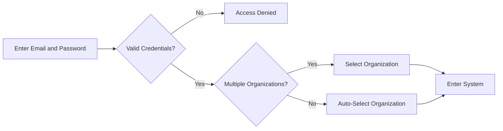

### Password Management

Users can change their account password through the account settings. The password change process requires the user to provide their current password as verification before setting a new password. This security measure ensures that only authorized users can modify account credentials.

The system validates the current password against the stored credentials. If the current password does not match, the password change request is rejected.

Once the current password is verified, the user can enter a new password. The system accepts the new password and updates the account credentials for future authentication attempts.

The password management functionality is part of account security management and allows users to maintain control over their account access.

### Multi-Organization Membership

The platform supports multi-organization membership for a single user account. A user can belong to multiple organizations simultaneously while maintaining a single set of global account credentials.

Each organization membership is independent, with separate roles, permissions, and employee records. The user's affiliation with each organization is tracked separately, allowing the same account to function in different capacities across different organizations.

When a user is invited to an organization or accepts an invitation, their account is linked to that organization through an organization member record. This record captures the user's role and employment details specific to that organization.

The system maintains organization affiliation management by tracking all organizations a user belongs to and enabling seamless transitions between them.

### Organization Context Management

User session context management ensures that all operations are scoped to the currently selected organization. When a user logs in and selects an organization, that organization becomes the active context for the entire session.

All data visibility and operations are filtered to show only information belonging to the selected organization. This includes projects, tasks, timelogs, employee records, and all other organization-scoped data.

Users can switch organizations during an active session without requiring re-authentication. The organization switching process updates the session context to the newly selected organization. All subsequent operations are then scoped to this new organization context.

The organization context applies to all user actions including viewing data, creating records, submitting timesheets, and accessing reports. Data isolation between organizations is strictly maintained based on the current context.

Users who belong to only one organization have that organization set as their permanent context, and organization switching options are not presented.

### Account Deletion

Users can delete their account from the platform. Account deletion is subject to specific constraints that ensure business data integrity and prevent orphaned organizations.

If the user is the sole owner of any organization, the account deletion is blocked. The user must either transfer ownership of those organizations to another member or delete the organizations entirely before proceeding with account deletion.

When an account is deleted, the user's global profile and authentication credentials are removed from the system. However, employee records in organizations where the user was a member are not deleted. Instead, these employee records are marked as "deactivated" status.

This approach to historical data preservation ensures that business records such as timelogs, timesheets, project assignments, and task histories remain intact for organizational reporting and audit purposes. The deactivated status indicates that the employee no longer has active access but their historical contributions remain part of the organization's data.

The deactivated employee records retain their historical data associations, allowing organizations to maintain complete records of past work and project contributions even after the user's account is deleted.

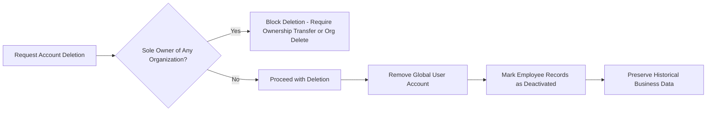

### Global User Profile

Each user has a global profile that is shared across all organizations they belong to. The profile contains personal information and preferences that apply to the user account regardless of which organization context is active.

The global profile includes the user's display name, avatar image, and phone number. These attributes are stored at the account level and are visible across all organization memberships.

Users can edit their global profile information at any time. Changes to the profile are immediately reflected across all organizations where the user is a member, ensuring consistency of user information throughout the platform.

The display name appears throughout the system in place of the user's email address, providing a more personalized experience. The avatar image provides visual identification of the user across the platform. The phone number is stored as optional contact information.

The global user profile is distinct from organization-specific employee records. While the profile contains personal information shared across organizations, employee records contain organization-specific details such as department assignment, position title, and employment type.

## OrganizationMember Operations

Organization memberships represent the relationship between users and organizations, defining each member's role and employment details. Users with employee management permissions can invite new employees by sending email invitations, which either link to existing accounts or create pending invitations for new users. Upon signing up with a pending invitation email, users are automatically added to the corresponding organizations. Each membership record captures the user's role within the organization, department assignment, position or title, employment type classification, and current status. Users with appropriate permissions can edit employee records including department, position, and employment type assignments. Members can be deactivated, preventing them from logging time or submitting timesheets while preserving all historical data. Deactivated members can be reactivated when needed. Users with view permissions can access paginated employee lists and apply filters by department, employment type, or status, as well as search by name.

### Employee Invitation

Users with employee management permissions can invite new employees to an organization by sending an email invitation. When inviting a user by email address, the system checks whether a user account already exists with that email. If an account exists, the user is immediately added to the organization as an employee with an assigned role. If no account exists with the provided email, the system creates a pending invitation record associated with that email address and the inviting organization. When a new user signs up using an email address that matches one or more pending invitations, the system automatically adds that user to all corresponding organizations, converting the pending invitations into active organization memberships. The new employee receives the role specified in the invitation at the time of automatic assignment. This invitation flow ensures that users can be pre-registered for organizations before creating their accounts, streamlining the onboarding process for new hires.

### Employee Role and Employment Details Management

Each organization member has a role that defines their permissions within that organization (defined in Role Operations). Members with appropriate permissions can change an employee's role assignment. Members can optionally be assigned to a department, which can be nested one level deep (defined in Department Operations). The employee record captures the member's position or job title within the organization. Employment type classification includes full-time, part-time, contractor, or intern options. Users with employee management permissions can edit the department, position, and employment type fields on any employee record. All changes to role or employment details take effect immediately and apply to the employee's access and capabilities within the organization.

### Employee Status Management

Each employee has a status indicating whether they are active or deactivated. Active employees can perform all permitted actions including logging time, submitting timesheets, and accessing project data. Users with employee management permissions can deactivate employees when they leave the organization or need their access temporarily suspended. When an employee is deactivated, they are immediately prevented from logging time entries or submitting timesheets. All historical data including timelogs, timesheets, project assignments, and tasks remain preserved and accessible. Deactivated employees can be reactivated by users with appropriate permissions, which restores their full capabilities according to their role and the organization's current settings. The reactivation process does not create new records but resumes the existing membership with its historical data intact.

### Employee Discovery and Retrieval

Users with employee viewing permissions can access a paginated list of all employees in their organization. The list displays key information including employee names, roles, departments, and statuses. Users can filter the employee list by department to see members of a specific team. The list can be filtered by employment type to view only full-time, part-time, contractor, or intern staff. Status filters allow viewing only active or deactivated employees. A search function enables finding employees by entering their display name or partial name matches. These filtering and search capabilities help managers and administrators locate specific employees quickly within organizations of any size. All employee discovery operations are scoped to the current organization context and do not reveal data from other organizations.

## Role Operations

Roles define permission sets that control what actions members can perform within an organization. The system provides three immutable built-in roles: Owner with full system access including role and member management, Manager with capabilities to manage employees, projects, approve timesheets, and view reports, and Employee with permissions limited to time tracking, timesheet submission, and viewing personal data. Organization owners can create custom roles with unique names and specific permission combinations from the available set. Available permissions include organization management, employee management, employee viewing, project management, project viewing, time management, timesheet approval, viewing all time records, and report access. Owners can modify custom role definitions to adapt to evolving business needs. Custom roles can only be deleted when no employees are currently assigned to them. Each employee is assigned exactly one role, and users with employee management permissions can reassign roles as organizational responsibilities change.

### Built-in Roles

The system provides three built-in roles that exist in every organization: Owner, Manager, and Employee.

### Owner Role
The Owner role has full access to all features within the organization. Owners can manage organization settings, create and manage roles, and manage organization members. The Owner role includes all available permissions.

### Manager Role
The Manager role has permissions to manage employees, manage projects, approve timesheets, and view reports. Managers cannot edit organization settings or manage roles.

### Employee Role
The Employee role has permissions to track time, submit timesheets, and view personal data. Employees cannot access other employees' data or organizational reports.

### Built-in Role Immutability
The three built-in roles (Owner, Manager, Employee) cannot be deleted. The permissions associated with built-in roles cannot be modified.

### Custom Role Creation

Users with organization management permission can create custom roles. Each custom role requires a name unique within the organization and a set of permissions selected from the available permission set.

When creating a custom role, the user specifies which permissions members with this role will possess. The system validates that at least one permission is assigned to the role.

Custom roles allow organizations to define specialized permission combinations that match their specific business needs beyond the three built-in roles.

### Permission Set Configuration

Each role (built-in or custom) has a permission set that determines what actions members with that role can perform. The available permissions are:

- **Organization Management**: Permission to edit organization settings including name, description, logo, currency, timezone, and fiscal start month.
- **Employee Management**: Permission to invite new employees, edit employee records (department, position, employment type), and deactivate or reactivate employees.
- **Employee Viewing**: Permission to view the employee list and employee details including contracts and historical data.
- **Project Management**: Permission to create, edit, archive, complete, and delete projects and tasks within projects.
- **Project Viewing**: Permission to view all projects and tasks in the organization.
- **Time Management**: Permission to edit or delete any employee's timelogs regardless of who created them.
- **Timesheet Approval**: Permission to approve or reject submitted timesheets from any employee.
- **All Time Records Viewing**: Permission to view all employees' timelogs and timesheets.
- **Report Viewing**: Permission to access organization reports including time reports, project budget reports, and weekly summary reports.

Permissions are additive. When multiple permissions are assigned to a role, the member has access to all operations covered by those permissions.

### Custom Role Editing

Users with organization management permission can edit custom roles. Editing allows modification of the role name and the permission set.

When permissions are added to a role, all members currently assigned to that role immediately gain the new permissions. When permissions are removed from a role, all members currently assigned to that role immediately lose those permissions.

Built-in roles cannot be edited. The name and permission set of Owner, Manager, and Employee roles are fixed.

### Custom Role Deletion

Users with organization management permission can delete custom roles. A custom role can only be deleted when no employees are currently assigned to that role.

If any employee is assigned to the custom role, deletion is blocked until those employees are reassigned to different roles. Deleting a role does not affect the employees; they simply lose the permissions associated with that role until assigned a new one.

Built-in roles cannot be deleted regardless of assignment status.

### Role Assignment to Employees

Each employee in an organization is assigned exactly one role. The role assignment determines what actions the employee can perform within that organization.

Users with employee management permission can assign roles to employees during the invitation process or when editing existing employee records.

### Single Role per Employee
An employee cannot have multiple roles simultaneously. The system enforces a one-to-one relationship between employees and roles within an organization.

### Role Reassignment
Users with employee management permission can change an employee's role assignment at any time. When an employee's role is changed:
- The employee immediately loses permissions associated with the previous role
- The employee immediately gains permissions associated with the new role
- The employee's data and work history remain intact
- The system records the role change in the activity log

Role reassignment allows organizations to adapt to changing responsibilities, promotions, or department transfers without creating new employee records.

## Department Operations

Departments provide organizational structure for grouping employees within an organization. Each department has a name and optional description, and supports one level of parent-child nesting to model hierarchical team structures. Users with organization management permissions can create departments to reflect the company's organizational chart. Department definitions can be edited as organizational structures evolve. Deleting a department removes the grouping but preserves all associated employee records by setting their department assignment to null, ensuring no data loss occurs. All organization members can view the list of departments, enabling employees to understand the organizational structure and identify appropriate contacts. Departments are primarily used for employee classification, filtering, and reporting purposes within the broader human resource management workflows.

### Department Creation

Users with organization management permission can create departments to establish the organizational structure within their organization.

Each department requires a name that identifies the department within the organization. An optional description may be provided to explain the department's purpose, responsibilities, or scope.

Departments support one level of parent-child nesting to model hierarchical team structures. When creating a department, an optional parent department may be specified. This allows representation of organizational hierarchies such as departments containing sub-departments or divisions containing teams. A department can have at most one parent department, and the system enforces that only one level of nesting is permitted—parent departments cannot themselves have parent departments.

The department becomes immediately available for employee assignment and organizational classification once created. The department's identifying color or visual indicator is determined by the system to ensure consistency across the organization.

### Department Editing

Users with organization management permission can edit existing departments to reflect changes in organizational structure or to correct information.

The department name can be modified to reflect renaming or restructuring. The department description can be updated, added, or removed as organizational needs evolve.

The parent department assignment can be changed to reposition the department within the organizational hierarchy. When changing the parent department, the system validates that the new parent does not already have a parent department, maintaining the one-level nesting constraint. A department can be moved to have no parent, becoming a top-level department, or can be assigned under a different eligible parent department.

Changes to department definitions apply immediately and affect how employees are classified and how organizational reports are structured.

### Department Deletion

Users with organization management permission can delete departments that are no longer needed.

When a department is deleted, all employee records previously assigned to that department have their department assignment cleared. The employees themselves are not deleted—their accounts, employment history, timelogs, timesheets, and all other data remain intact. Only the association between the employee and the deleted department is removed.

Similarly, if a parent department is deleted, any child departments under it have their parent assignment cleared, becoming top-level departments. The child departments themselves are not deleted.

Deleting a department is permanent and cannot be undone. Once deleted, the department name becomes available for reuse if the organization wishes to create a new department with the same name.

### Department Viewing and Organizational Structure

All organization members can view the list of departments within their organization. This enables employees to understand the organizational structure and identify appropriate contacts or reporting lines.

The department list displays each department's name, description, and hierarchical position. Departments with parent departments are displayed in a way that visually represents the reporting structure, showing which departments report to others.

The organizational structure view helps employees navigate the company hierarchy and understand team relationships. Top-level departments appear as primary organizational units, with their child departments displayed as subordinate units.

The department list may be presented in an expanded view showing all departments in a hierarchical tree, or as a flat list with parent department indicators, depending on the viewing context.

### Department Usage for Employee Classification

Departments serve as the primary mechanism for classifying and grouping employees within the organization.

Each employee may be optionally assigned to exactly one department, establishing their organizational affiliation. This assignment is used throughout the system for organizing employee lists, filtering views, and generating reports.

The employee list can be filtered by department, allowing users to view only employees within a specific organizational unit. This supports common workflows such as viewing all members of the Engineering department or all employees reporting to a particular division.

Department-based reporting uses department assignments to aggregate data by organizational unit. Time reports, activity summaries, and other organizational analytics can be grouped by department to show metrics for specific teams or divisions.

Department assignments are reflected in employee profiles and directory listings, making it easy to identify which organizational unit an employee belongs to.

## Contract Operations

Contracts capture employment terms and compensation details for each organization member, serving as a historical record of employment agreements. Each contract specifies a required start date, optional end date indicating ongoing employment when null, pay rate as a numeric value, pay period frequency, and required working hours per week. Members can have multiple contracts over time, but only one contract may be active at any given moment. Users with employee management permissions can create new contracts for employees, which automatically terminates the previous active contract by setting its end date to the day before the new contract begins. Active contracts can be edited to correct errors or update terms, but past contracts are immutable to maintain accurate historical records. Employees can view their own contract history, and users with viewing permissions can access any employee's contract information. Contracts are essential for calculating labor costs, determining work capacity, and maintaining compliance records.

### Contract Creation

Users with employee management permission can create new employment contracts for organization members.

Each contract must specify a start date indicating when the employment terms take effect. Contracts may specify an end date; when no end date is provided, the contract is considered ongoing with no predetermined termination date. Each contract must specify a pay rate as a numeric value representing the compensation amount. Each contract must specify a pay period frequency indicating how often payment is calculated, with options including hourly, daily, weekly, or monthly periods. Each contract must specify working hours per week indicating the expected time commitment, such as forty hours for standard full-time arrangements.

An organization member may have multiple contracts over time, but only one contract may be active at any given moment. When a new contract is created for a member who already has an active contract, the system automatically terminates the previous contract by setting its end date to the day immediately before the new contract's start date. This ensures continuous employment coverage without overlapping active contracts.

New contracts may include optional notes for additional context about the employment arrangement.

### Contract Modification

Users with employee management permission can edit the currently active contract for an organization member. Active contract editing allows corrections to errors or updates to employment terms that take effect immediately.

Past contracts that have been superseded by newer contracts are immutable and cannot be modified. This immutability preserves the historical accuracy of employment records for audit and reference purposes. Once a contract has been automatically terminated by the creation of a subsequent contract, or manually ended by setting an end date, it becomes a permanent historical record.

Only the active contract may have its pay rate, pay period, working hours, end date, or notes modified. The start date of any contract cannot be changed once established, as this would disrupt the chronological integrity of the contract history.

### Contract Viewing

Organization members can view their own complete contract history, including all past contracts and the current active contract. This allows employees to reference their historical employment terms and track changes in compensation or working arrangements over time.

Users with employee viewing permission can view the contract history of any organization member. This access supports management oversight, payroll verification, and human resource administration.

Contract viewing displays the start date, end date (if applicable), pay rate, pay period, working hours per week, and any notes associated with each contract. The active contract is visually distinguished from historical contracts for clarity.

### Contract Business Purpose

Contracts serve as the authoritative source for labor cost calculations within the organization. The pay rate and pay period specified in each contract determine the cost basis for time logged by organization members, enabling accurate payroll processing and project cost allocation.

Contracts establish work capacity expectations by defining working hours per week. This information supports resource planning, availability forecasting, and workload distribution decisions across projects and teams.

The contract history maintained for each organization member creates a compliance record documenting employment terms over time. This audit trail supports regulatory requirements, dispute resolution, and organizational transparency regarding compensation and working conditions.

## Project Operations

Projects represent work initiatives that organize tasks and time tracking within an organization. Each project requires a name and color code for visual identification, with an optional description providing additional context. Projects have a defined status that progresses through active, archived, or completed states, with budget hours, start date, and end date available as optional planning parameters. Users with project management permissions can create projects to initiate new work streams. Project details can be edited to respond to changing requirements. Projects can be archived or marked complete, which prevents new timelogs from being recorded while preserving existing time data. Deletion is restricted to projects that have no associated timelogs to prevent data loss. Users with viewing permissions can access all projects through a paginated interface and filter by status to focus on relevant initiatives. Projects serve as the primary container for task management and time allocation tracking.

### Project Creation

Users with project management permission can create new projects to represent work initiatives within their organization.

When creating a project, the user must provide a name that identifies the project within the organization. The name serves as the primary identifier and should be unique within the organization to avoid confusion.

The user must also select a color code for the project. This color code is used for visual identification throughout the user interface, making it easy to distinguish projects in lists, calendars, and reports.

The user may optionally provide a description that explains the project's purpose, scope, or any other relevant details. This description helps team members understand what the project encompasses.

The project is created with an initial status of active, making it immediately available for task creation and time logging.

If the name is not provided, the creation request is rejected.

### Project Attributes and Planning

Projects support optional planning attributes that help manage resources and timelines.

Budget hours can be specified to set a total estimated hours limit for the project. This serves as a planning baseline against which actual logged hours can be compared in reports. Projects without budget hours are excluded from budget utilization reports.

A start date may be specified to indicate when work on the project is expected to begin. An end date may be specified to indicate when work on the project is expected to conclude. These dates are for planning purposes and do not restrict time logging operations.

All attributes including budget hours, start date, and end date can be modified after project creation to accommodate changing project requirements.

### Project Status Lifecycle

Projects progress through a defined status lifecycle that controls their operational state.

A new project begins in the active status. Active projects can receive new timelogs and are available for task creation and assignment. This is the primary working state for ongoing projects.

When work on a project is temporarily suspended or the project is no longer actively being developed, the project can be moved to archived status. Archived projects preserve all existing data but cannot receive new timelogs.

When a project has been finished and all work is complete, the project can be moved to completed status. Like archived projects, completed projects preserve all existing data but block new timelogs from being recorded.

The status of a project can be changed between these states as needed based on the project's lifecycle and organizational requirements.

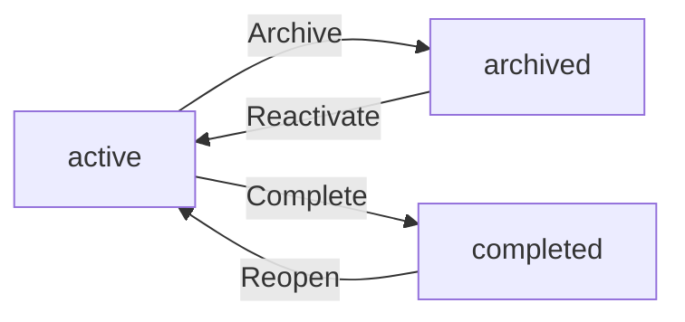

### Project Editing

Users with project management permission can modify project details to reflect changing requirements or correct information.

The project name can be edited to better reflect the current scope or to correct the initial name.

The color code can be changed to adjust the visual identification of the project in the interface.

The description can be updated to reflect changes in project scope, add new information, or correct existing details.

Budget hours, start date, and end date can all be modified as project planning evolves.

All edits take effect immediately and apply to all future operations on the project.

### Project Archiving and Completion

Users with project management permission can transition projects to non-active states when work is suspended or finished.

When a project is archived, it enters a state where no new timelogs can be recorded against it. This prevents continued time logging on projects that are no longer actively being worked on. All historical timelogs recorded before archiving are preserved and remain visible in reports and timesheets.

When a project is marked as completed, it similarly blocks new timelogs while preserving all existing time tracking data. This state indicates that all work on the project has been finished.

If a project needs to resume active work, it can be reactivated from either archived or completed status, returning it to the active state where new timelogs can again be recorded.

Archived and completed projects remain visible in the project list and continue to serve as containers for their associated tasks and historical timelogs.

### Project Deletion

Users with project management permission can delete projects that are no longer needed, subject to specific restrictions to prevent accidental data loss.

A project can only be deleted if it has no timelogs associated with it. This restriction ensures that time tracking data is not inadvertently lost. If the project has any timelogs logged against it, the deletion request is rejected.

When a project is deleted, all associated data including tasks and project memberships are also removed. This is a permanent operation.

Projects that have been archived or completed can be deleted if they meet the no-timelogs requirement. Active projects with no timelogs can also be deleted.

Before deleting a project that has timelogs, the user must first remove or reassign those timelogs through appropriate time management operations.

### Project List Viewing

Users with project viewing permission can access the list of all projects in their organization.

The project list is paginated to manage large numbers of projects efficiently. Users can navigate through pages to view all projects.

Projects in the list display key information including name, color code, status, and optionally budget utilization information.

The list can be filtered by status to show only projects in specific states. Available filters include active, archived, and completed statuses. This allows users to focus on relevant projects based on their current needs.

Users can view project details by selecting a project from the list, which shows the full project information including description, dates, budget hours, associated tasks, and project members.

### Project as Task Container

Projects serve as the primary organizational container for task management within the system.

Each project can contain multiple tasks that represent discrete units of work. These tasks are created and managed within the context of their parent project.

Tasks within a project can be assigned to employees who are members of that project. The project membership determines which employees can be assigned to its tasks.

The project provides the organizational context for task status workflows, priority management, and due date tracking.

Project leads, who are assigned the project-lead role on a project, can manage tasks within their assigned projects including creating, editing, and monitoring task progress.

Users with project management permission can manage tasks across all projects in the organization.

### Project as Time Allocation Tracker

Projects function as the primary mechanism for organizing and tracking time allocation within the organization.

Employees log timelogs against projects to record time spent on work. Each timelog must be associated with a specific project that the employee is assigned to.

Projects accumulate timelogs from all employees who log time against them, building a comprehensive record of effort expended.

When budget hours are specified, the system can compare actual logged hours against the planned budget to provide utilization metrics and reports.

Time reports can group and filter timelogs by project, showing how organizational time is distributed across different initiatives.

The association between timelogs and projects is preserved even when projects are archived or completed, maintaining historical time allocation data for reporting and analysis.

## ProjectMember Operations

Project memberships establish which employees are assigned to specific projects and define their responsibilities within those projects. Users with project management permissions can assign employees to projects, creating a relationship that enables task assignment and time tracking for that project. Each membership specifies the employee, project, and assigned role which can be either member or project-lead. Project leads have elevated privileges to manage tasks within their assigned project, including creating, editing, and monitoring task progress. Employees may be assigned to multiple projects simultaneously to support cross-functional work. Users with appropriate permissions can remove employees from projects when assignments change or conclude. All employees can view the projects to which they are assigned, providing clarity on their current responsibilities and enabling navigation to relevant project workspaces. Project memberships control access to project-specific data and operations.

### Project Membership Creation

Users with project management permission can assign employees to projects, establishing a project membership relationship between an employee and a project. Creating a project membership requires selecting an employee who belongs to the organization and a project within that organization. The employee must not already be a member of the target project. Upon creation, the membership is established with an assigned role of either member or project-lead. Creating a project membership enables the employee to view project details, track time against the project, and receive task assignments within that project. The system records the membership creation in the activity log.

### Project Role Assignment

Each project membership includes an assigned role that defines the employee's responsibilities within the project. The available roles are member and project-lead. When creating a project membership, the user with project management permission selects the appropriate role for the employee. The member role provides standard participation rights including viewing project information, tracking time, and working on assigned tasks. The project-lead role provides elevated privileges including creating tasks within the project, editing existing tasks, and managing task assignments for other project members. Users with project management permission can change an employee's role within a project after the membership is created. Role changes are recorded in the activity log.

### Project Lead Task Management Privileges

Employees assigned the project-lead role within a project gain task management privileges limited to that specific project. Project leads can create new tasks within their assigned project, specifying task titles, descriptions, status, priority, estimated hours, due dates, and assignments. Project leads can edit existing tasks within their project, including modifying task details and reassigning tasks to other project members. Project leads can view all tasks within their project regardless of assignment. When a project lead changes a task's status, the system automatically records the status change in the task history. Project leads cannot manage tasks in projects where they hold only the member role.

### Multi-Project Employee Assignments

An employee can be assigned to multiple projects simultaneously, enabling cross-functional participation across different teams and initiatives. When assigning an employee to an additional project, a new project membership is created with the appropriate role for that specific project assignment. An employee may hold different roles in different projects, such as project-lead in one project and member in another. The employee's project assignments are independent of each other. An employee may be removed from one project while remaining active on other projects. The system maintains separate membership records for each project assignment, allowing independent role management and removal.

### Project Member Removal

Users with project management permission can remove employees from projects when project assignments conclude or change. Removing a project member terminates their membership in that specific project but does not affect their employment status in the organization or their membership in other projects. Upon removal, the employee can no longer view project details, track time against the project, or receive new task assignments for that project. Existing timelogs recorded by the employee for the project are preserved for historical and reporting purposes. Existing task assignments to the employee remain recorded in the task history. Users cannot remove themselves from a project if they are the only project lead assigned to that project.

### Viewing Assigned Projects

Employees can view a list of all projects to which they are assigned, providing clarity on their current project responsibilities and enabling navigation to project workspaces. The assigned project list displays project names, descriptions, color codes, and the employee's assigned role in each project. Employees can filter the project list by project status to view active, archived, or completed projects separately. Employees can navigate from the project list to individual project workspaces to view project details, tasks, and timelogs. The project list is paginated for organizations with many projects. Users with organization-wide project viewing permission can see all projects in the organization, not just those they are assigned to.

### Project Access Control and Eligibility

Project membership controls access to project-specific data and operations within the system. Only employees who are members of a project can view that project's details, tasks, and associated timelogs. Only project members can log time entries against a project. Only project members are eligible to be assigned tasks within a project. Project members can view their own timelogs for the project and, depending on their permissions, may view other members' timelogs. Project membership status determines eligibility for project-specific reporting and time tracking features. The system enforces project-based access control on all project-specific operations, ensuring data isolation between projects at the membership level.

## Task Operations

Tasks represent discrete units of work within projects, tracking progress from creation through completion. Each task requires a title with optional description, and maintains a status that flows through open, in-progress, completed, and closed states. Tasks have priority levels of low, medium, high, or urgent to guide work sequencing. Optional estimated hours, due dates, and assigned employees support project planning and resource allocation. Tasks support one level of subtask nesting through parent-child relationships for work breakdown. Project leads can create and modify tasks within their projects, while users with project management permissions have broader task editing capabilities across all projects. Assigned employees must be project members to ensure proper access control. Task status changes are automatically recorded with timestamps in the task history, capturing who made each change. Employees can view tasks in their assigned projects and apply filters by status, priority, or assigned person, with sorting available by due date, priority, or creation date.

### Task Creation

Project leads can create tasks within projects where they hold the lead role.
Users with the project management permission can create tasks within any project in the organization.

When creating a task, the following information must be provided:
- A title for the task, which is required and identifies the work item
- An optional description that provides additional details about the work to be performed
- A priority level selected from low, medium, high, or urgent
- A status, which begins as open when the task is first created

Additional optional information may be specified:
- Estimated hours representing the anticipated time required to complete the task
- A due date by which the task should be completed
- An assigned employee who will perform the work, who must be a member of the project
- A parent task, creating a subtask relationship limited to one level of nesting

The task is created within a specific project and is automatically associated with that project. The creating user is recorded as the task creator.

### Task Status Workflow

Tasks progress through a defined status workflow that tracks work from initiation to closure.

The available statuses are:
- Open: the task has been created but work has not yet begun
- In-progress: work on the task is actively being performed
- Completed: the work defined by the task has been finished
- Closed: the task has been finalized and no further action is required


Status transitions can occur in any direction based on the actual state of work. When a task status changes, the system automatically records the transition in the task history.

### Task Prioritization and Planning Attributes

Each task is assigned a priority level that guides work sequencing and resource allocation.

The available priority levels are:
- Low: minimal urgency, can be addressed after higher priority items
- Medium: standard priority for routine work
- High: important work that should take precedence over medium and low priority tasks
- Urgent: critical work requiring immediate attention

Tasks may optionally include planning information:
- Estimated hours: a numeric value representing the anticipated time required to complete the work, used for project budgeting and scheduling
- Due date: a calendar date by which the task should be completed, used for timeline management and scheduling work

When specified, the due date and estimated hours are visible to project members and are used in project planning and reporting.

### Task Assignment and Membership Restriction

Tasks can be assigned to specific employees to designate responsibility for completing the work.

Assignment follows these rules:
- Only employees who are members of the project can be assigned to tasks within that project
- A task may be created without an assigned employee, leaving it unassigned for later allocation
- An assigned employee can be changed at any time by users with appropriate permissions
- The assigned employee is visible to all project members

The restriction that assigned employees must be project members ensures that only individuals with legitimate access to the project can be designated as responsible for project work.

### Subtasks and Parent-Child Relationships

Tasks support a single level of parent-child relationships for breaking down work into smaller components.

When creating a task:
- An optional parent task may be specified, establishing this task as a subtask
- A task can have at most one parent task
- A task can have multiple child tasks (subtasks)
- The system enforces a one-level nesting limit, meaning a task that is already a subtask cannot have its own subtasks

Parent-child relationships are visible when viewing task details. When a parent task is viewed, its subtasks are displayed. The hierarchy helps organize complex work into manageable pieces while maintaining a flat structure for simplicity.

### Task Modification

Tasks can be modified by users with appropriate permissions to update information as work progresses.

Project leads can modify tasks within the projects where they hold the lead role. This includes updating the title, description, priority, estimated hours, due date, assigned employee, and parent task relationship.

Users with project management permission can modify any task within the organization, regardless of project assignment.

When a task's status is changed during modification, the system automatically records the status transition in the task history, capturing the old status, new status, timestamp of the change, and the user who made the change. This automatic recording creates an immutable audit trail of all status changes.

### Task Discovery and Browsing

Employees can view tasks in projects where they are assigned as members. This visibility ensures employees can see the work items relevant to their project participation.

The task list supports filtering to help employees locate specific tasks:
- Filter by status to view only open, in-progress, completed, or closed tasks
- Filter by priority to focus on urgent or high-priority work
- Filter by assigned employee to see tasks assigned to specific individuals

The task list supports sorting to organize tasks according to different criteria:
- Sort by due date to view tasks in chronological order of their deadlines
- Sort by priority to group tasks by urgency level
- Sort by creation date to view tasks in the order they were added to the project

Employees can view detailed information about individual tasks, including the full description, status history, assigned employee, estimated hours, due date, and any subtasks.

## TaskHistory Operations

Task history provides an immutable audit trail of status changes throughout a task's lifecycle. Each history entry captures the precise moment a status transition occurred, documenting both the previous status and the new status achieved. The system automatically records which user initiated the status change, establishing accountability for task progression decisions. This audit trail enables project managers and team members to review the complete evolution of work items, identifying when tasks were started, completed, or moved to closed states. Task history supports project retrospectives by revealing patterns in task progression and identifying bottlenecks where tasks remained in particular states for extended periods. The history is created automatically whenever task status is modified and cannot be manually altered, ensuring data integrity for project reporting and compliance purposes. This permanent record supplements the current task state to provide full context for project stakeholders.

### Automatic Status Change Recording

When a user modifies the status of a task, the system automatically creates a history entry capturing this transition.

The automatic recording occurs immediately upon successful status modification, ensuring no state changes go undocumented. The system intercepts every status update operation and generates a corresponding audit entry before completing the modification.

Manual creation of history entries is prohibited. Users cannot directly add entries to the task history through any interface. The system only accepts history entries that are automatically generated as a consequence of legitimate task status modifications performed by authorized users.

If a task modification does not include a status change (such as editing the description, priority, or assigned employee without changing status), no history entry is created. This ensures the history contains only meaningful status transitions rather than cluttering the audit trail with non-state-changing edits.

### Audit Trail Data Capture

Each history entry documents the complete context of a status transition for future reference and accountability.

The entry records the previous status of the task before the change occurred. This establishes the starting point of the transition and enables understanding of what state the task was leaving.

The entry records the new status that the task entered as a result of the change. This establishes the destination of the transition and completes the documentation of the state change.

The entry captures the exact timestamp when the status change occurred. This temporal record enables chronological sequencing of events and supports timeline analysis for project retrospectives.

The entry identifies the user who performed the status change. This attribution establishes accountability for task progression decisions and enables managers to understand who moved work items between states.

The combination of previous status, new status, timestamp, and user identification provides a complete picture of each workflow transition, supporting both operational accountability and analytical review.

### History Immutability and Integrity Protection

Task history forms an immutable audit trail that cannot be altered once created, ensuring data integrity for compliance and reporting purposes.

History entries cannot be edited after creation. Once a status change is recorded, the documented information (previous status, new status, timestamp, and user who made the change) remains permanently fixed. This prevents tampering with historical records and maintains the reliability of the audit trail.

History entries cannot be deleted by any user, regardless of their permission level. The audit trail is append-only, meaning entries accumulate over time without removal. This preservation guarantees that the complete history of task state changes remains available for future review.

The system prevents manual alteration of history through any administrative or technical interface. Users cannot modify timestamps, change the attributed user, or alter status values in existing entries. This strict immutability ensures the history serves as a trustworthy record for project reporting, compliance documentation, and dispute resolution.

The immutable nature of task history enables reliable bottleneck identification analysis, as the timestamps provide accurate duration calculations for each status period that cannot be manipulated.

### Task History Viewing

Authorized users can view the complete chronological history of status changes for any task they have access to.

Users with permission to view a task can access its associated history entries. The history is displayed in chronological order, showing the sequence of status transitions from task creation through to its current state.

Each history entry displays the previous status, the new status, the exact date and time of the change, and the user who made the modification. This presentation enables quick understanding of how the task has progressed through its lifecycle.

The history view supports status change accountability by clearly attributing each transition to a specific user. Project managers can review who moved tasks between states and when those changes occurred.

The chronological presentation of history entries reveals the task's lifecycle evolution, showing the path from initial creation through various states to completion or closure. This timeline view helps stakeholders understand the progression and identify any unusual delays or rapid transitions.

### Retrospective Analysis and Compliance Support

The accumulated task history across projects enables valuable analytical insights for process improvement and compliance documentation.

Project teams can use historical data to review task lifecycle evolution patterns during retrospectives. By examining the sequence and timing of status changes, teams can identify common paths that tasks take and discover where processes might be streamlined.

The timestamp data in history entries enables task progression pattern analysis. Teams can calculate how long tasks typically remain in each status, identify which transitions occur most frequently, and recognize patterns that indicate healthy or problematic workflow execution.

History data supports bottleneck identification by revealing where tasks tend to stall. Extended durations between status changes highlight stages in the workflow where work accumulates, enabling managers to target process improvements at specific pain points.

The immutable audit trail provides compliance documentation by creating a permanent record of task state changes with full attribution. This record satisfies audit requirements by demonstrating when work was performed, who performed it, and how tasks progressed through defined workflow states.

Project reporting leverages history data to generate metrics on task flow efficiency, completion rates, and cycle time. These reports help management understand organizational productivity and identify trends in work execution across projects and teams.

## Timelog Operations

Timelogs capture individual time entries recorded by employees for work performed on specific dates. Each timelog requires the date worked, duration logged, and project assignment, with optional task association when work relates to a specific task. Employees can add descriptions explaining accomplished work and mark entries as billable or non-billable. Employees may only create timelogs for themselves, ensuring individual accountability for time reporting. Self-editing of timelogs is permitted only when the entry is not part of an approved timesheet, preventing alteration of locked historical records. Self-deletion requires that the timelog is not included in any submitted or approved timesheet, protecting timesheet integrity. Users with time management permissions can edit or delete any employee's timelogs to correct errors or address policy violations. Users with view-all-time permissions can access every employee's timelogs for oversight and reporting. All employees can view their personal timelog history. Timelogs support pagination for large datasets and can be filtered by date range, project, task, or billable status for focused review and analysis.

### Timelog Creation

Individual time entries represent discrete work sessions recorded by employees. Each timelog must capture:

- **Date worked** (required): The calendar date on which the work was performed. The system validates that the date is not a future date. (defined in 04-business-rules.md)
- **Duration** (required): Time spent working, recorded in whole minutes. The system allows durations from a minimum threshold up to a daily maximum to prevent data entry errors.
- **Project assignment** (required): Every timelog must be associated with a project. Employees may only select from projects to which they have been assigned as members. (defined in 01-actors-and-auth.md)
- **Task association** (optional): When work relates to a specific task, the timelog may reference that task. The task must belong to the selected project.
- **Work description** (optional): A free-text field explaining what was accomplished during the time period. This provides context for review and reporting.
- **Billable classification** (required): Each timelog is marked as either billable or non-billable. The default is billable, but employees can change this for internal activities or non-chargeable work.

Employees may only create timelogs for themselves. Self-registration ensures individual accountability for time reporting accuracy. The system prevents employees from logging time on behalf of others.

### Timelog Editing

Employees may modify their own timelogs under specific conditions to correct errors or add missing details.

**Self-Editing Rules:**
- Employees may edit the date, duration, project, task, description, and billable status of their own timelogs.
- **Critical Restriction:** Timelogs that are part of an approved timesheet cannot be edited by the employee. This restriction protects locked historical records and prevents alteration of already-reviewed time entries. (defined in 04-business-rules.md)

**Time Management Permission:**
- Users holding the time management permission (defined in 01-actors-and-auth.md) may edit any employee's timelogs regardless of timesheet status.
- This permission exists to allow supervisors, administrators, or designated timekeepers to correct errors, address policy violations, or adjust entries on behalf of employees who are unavailable.

When a timelog is edited, the system records the modification for audit purposes.

### Timelog Deletion

Employees may remove their own timelogs when they were created in error or are no longer relevant.

**Self-Deletion Rules:**
- Employees may delete their own timelogs only when those entries are not included in any submitted or approved timesheet.
- **Critical Restriction:** Timelogs that are part of a submitted timesheet (awaiting approval) or an approved timesheet (locked) cannot be deleted by the employee. This restriction protects timesheet integrity during the review process and preserves historical records that have been supervisor-approved. (defined in 04-business-rules.md)

**Time Management Permission:**
- Users holding the time management permission (defined in 01-actors-and-auth.md) may delete any employee's timelogs.
- This capability enables administrators to remove duplicate entries, correct significant errors, or clean up test data without requiring employee action.

Deleted timelogs are permanently removed from the system along with any associations to timesheets.

### Timelog Listing and Filtering

The system provides multiple viewing modes for timelogs depending on user permissions.

**Personal Timelog Viewing:**
- All employees can view their own timelog history. This personal view includes all timelogs they have created across all time periods.

**Organization-Wide Timelog Access:**
- Users holding the view-all-time permission (defined in 01-actors-and-auth.md) can access every employee's timelogs within the organization. This supports oversight, auditing, and comprehensive reporting requirements.

**Filtering Capabilities:**
The timelog list supports multiple filters for focused review:

| Filter | Purpose |
|--------|---------|
| **Date range** | View timelogs between specific start and end dates |
| **Project** | Show only timelogs for a selected project |
| **Task** | Display timelogs associated with a specific task |
| **Billable status** | Filter to show only billable, only non-billable, or all timelogs |

**Pagination:**
Timelog lists are paginated to handle large datasets efficiently. Pagination parameters control the number of records displayed per page and navigation between pages.

These viewing and filtering capabilities support time reporting oversight by managers and finance teams who need to review employee time entries for payroll, billing, and project cost tracking purposes.

## Timesheet Operations

Timesheets aggregate timelogs into weekly bundles for employee submission and managerial approval. Each timesheet covers a complete week from Monday through Sunday, automatically calculating total hours from included timelogs. Employees create draft timesheets for specific weeks, which automatically include all their timelogs for that period. Draft timesheets allow employees to add or remove timelogs before submission to ensure accuracy. Submission requires at least one timelog and prohibits submission when another timesheet for the same week is already submitted or approved, preventing duplicate workflows. Once submitted, users with approval permissions can review and approve timesheets, which locks all included timelogs against further modification. Approvers can also reject timesheets with a required explanation, returning them to draft status for employee correction and resubmission. Rejected timesheets include the provided reason to guide necessary changes. Employees can view their own timesheet history with pagination and filter by status or date range. This approval workflow ensures time data accuracy and establishes locked records for payroll processing.

### Timesheet Formation

A timesheet aggregates an employee's timelogs into a weekly bundle covering Monday through Sunday. When an employee creates a draft timesheet for a specific week, the system automatically includes all timelogs the employee has logged during that complete week period. Each timesheet tracks the week start date (Monday) and week end date (Sunday). The system calculates total hours by summing the duration in minutes of all included timelogs and converting to hours. Employees can manually add timelogs to a draft timesheet if they were omitted during creation, or remove timelogs if they were incorrectly included.

### Timesheet Submission Requirements

Employees can submit a draft timesheet for approval. A timesheet cannot be submitted if it contains no timelogs—at least one timelog entry is required for submission. The system prevents duplicate submissions: a timesheet cannot be submitted for a week where another timesheet for the same employee and same week is already in submitted or approved status. This ensures only one workflow exists per employee per week.

### Timesheet Approval and Rejection Workflow

Users with timesheet approval permission can view submitted timesheets and choose to approve or reject them. Approved timesheets transition to approved status and lock all included timelogs, preventing any further editing or deletion of those timelogs to maintain payroll record integrity. When rejecting a submitted timesheet, the approver must provide a rejection reason explaining why the timesheet cannot be approved. Rejected timesheets return to draft status, allowing the employee to modify the timelogs or timestamps and resubmit for approval.

### Timesheet Retrieval and Browsing

Employees can view their own timesheets but cannot view other employees' timesheets unless they have explicit viewing permissions. The timesheet list displays all timesheets belonging to the requesting employee with pagination for large result sets. Employees can filter their timesheet list by status (draft, submitted, approved, rejected) to locate specific timesheets in the workflow. Employees can also filter by date range to view timesheets within particular week ranges. This supports historical review and auditing of past payroll periods.

### Payroll Record Locking on Approval

Approved timesheets serve as locked payroll records. Once a timesheet is approved, all timelogs included in that timesheet are locked and cannot be edited or deleted by anyone, including users with time management permissions. This locking mechanism ensures that approved timesheets represent an immutable record of time worked for payroll processing purposes, preventing retroactive changes that could affect salary calculations.

## Timer Operations

The timer enables real-time time tracking for employees to capture work duration as it happens. Each employee may have at most one active timer at any moment, preventing concurrent time tracking across multiple activities. Starting a timer requires selection of an assigned project, with optional task specification to categorize the work being performed. The running timer tracks start timestamp, project, task, and a description of ongoing work. Employees can stop their active timer, which automatically creates a timelog with duration calculated from start to stop time, rounded to the nearest minute. If work should not be recorded, employees can discard the timer without creating a timelog. Employees can view their currently running timer to confirm active tracking and monitor elapsed time. The timer continues indefinitely if not manually stopped, with no automatic timeout, accommodating various work patterns including long sessions. While running, employees can modify the description and change the associated project or task to correct categorization errors. This live tracking complements manual timelog entry by capturing time precisely as work occurs.

### Starting a Timer

WHEN an employee selects a timer start action, THE system SHALL require selection of an assigned project before the timer can begin.

An employee can have at most one active timer at any moment. WHEN an employee attempts to start a second timer while another is active, THE system SHALL reject the request.

WHILE starting a timer, THE employee MAY optionally select a task that belongs to the chosen project.

WHEN a timer starts, THE system SHALL record the start timestamp automatically, capturing the exact moment tracking begins.

The employee MAY enter a description of the ongoing work when starting the timer, describing what work is being performed during this session.

Starting a timer enables real-time time tracking, allowing employees to capture work duration as it happens rather than estimating after completion.

### Viewing a Running Timer

The employee SHALL be able to view their currently running timer at any time to confirm active tracking and monitor elapsed time.

WHILE a timer is running, THE system SHALL display the elapsed time to the employee, updated continuously.

If an employee forgets to stop their timer, THE system SHALL allow the timer to continue running indefinitely with no automatic timeout, accommodating various work patterns including long sessions.

The timer provides live tracking as a complement to manual timelog entry by capturing time precisely as work occurs.

### Editing a Running Timer

WHILE a timer is running, THE employee SHALL be able to edit the description of the ongoing work.

WHILE a timer is running, THE employee SHALL be able to change the associated project, provided the new project is one they are assigned to.

WHILE a timer is running, THE employee SHALL be able to change the associated task, or remove a task association entirely.

These editing capabilities allow categorization correction when mistakes are made in initial project or task selection.

### Stopping a Timer

WHEN an employee stops their active timer, THE system SHALL automatically create a timelog entry with the calculated duration.

The duration SHALL be calculated as the difference between the start timestamp (recorded when timer began) and the stop timestamp, rounded to the nearest minute.

The created timelog SHALL include the project, optional task, and description from the timer session.

The timelog created SHALL be subject to all standard timelog business rules and restrictions.

### Discarding a Timer

WHEN an employee discards their active timer, THE system SHALL terminate the timer without creating any timelog entry.

Discarding a timer is appropriate when the tracked time should not be recorded, such as when the timer was started accidentally or for non-work activities.

No duration calculation or timelog creation occurs when a timer is discarded.

## ActivityLog Operations

Activity logs provide comprehensive audit records of significant actions performed within an organization. Each log entry captures the precise timestamp when an action occurred, identifies the user who performed the action, specifies the action type, indicates the target entity affected, and records relevant details about the change. The system automatically generates log entries for critical business events including employee invitations, deactivations, and reactivations, contract creation and modifications, project lifecycle events such as creation, archiving, completion, and deletion, task status changes, timesheet submission, approval, and rejection actions, and role assignments or changes. Users with organization management permissions can access the complete activity log to review organizational history and maintain oversight of system usage. The activity log supports pagination for handling large volumes of entries across extended time periods. Users can filter the log by action type, specific user, or date range to focus on particular events or investigate specific timeframes. This audit trail supports compliance requirements, security monitoring, and operational troubleshooting.

### Automatic Activity Logging

### Overview
The system automatically generates activity log entries for significant business events across the organization. Each entry captures the timestamp when the action occurred, the user who performed it, the type of action, the target entity affected, and relevant details about the change.
### Automatic Recording
Activities are recorded automatically when users perform specific operations. No manual log creation is supported.
### Log Entry Components
Each activity log entry always contains:
- Timestamp - the exact date and time when the action occurred
- User - the person who performed the action
- Action Type - a classification identifying the type of work performed
- Target Entity - the business object affected by the action (type and identifier)
- Details - relevant information describing what changed or what occurred

### Activity Log Entry Structure

### Timestamp Recording
The system captures the precise moment when each logged action begins execution. This timestamp serves as the authoritative record of when the activity occurred and is immutable once recorded.
### User Identification
Each log entry identifies the authenticated user who performed the action. This enables accountability tracking and identifies who initiated changes within the organization.
### Action Type Classification
The system categorizes actions into predefined types that describe the nature of the activity performed. This classification enables filtering and analysis of organizational activities.
### Target Entity Tracking
Log entries reference the specific business entity that was affected by the action, including the entity type and business identifier. This supports tracing what objects were modified or interacted with during operations.
### Action Detail Recording
The system records contextual details relevant to each action type. Details vary by action type and capture the specifics of what occurred, such as status changes, value updates, or workflow transitions.
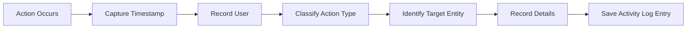

### Loggable Actions

### Employee Lifecycle Events
The following employee-related actions are automatically logged:
- Employee invitation sent
- Employee account activated via invitation
- Employee deactivated
- Employee reactivated
### Contract Events
The following contract-related actions are automatically logged:
- Contract created for an employee
- Contract updated (current active contract modified)
### Project Lifecycle Events
The following project-related actions are automatically logged:
- Project created
- Project archived
- Project marked as completed
- Project deleted
### Task Events
The following task-related actions are automatically logged:
- Task status changed (includes old status, new status, who made the change, and when)
### Timesheet Events
The following timesheet-related actions are automatically logged:
- Timesheet submitted for approval
- Timesheet approved
- Timesheet rejected
### Role Events
The following role-related actions are automatically logged:
- Role assigned to employee
- Role changed for employee

### Viewing the Activity Log

### View Permission
Only users with organization management permission can view the activity log. Regular employees cannot access the organization's activity log.
### Full Organizational Access
Organization managers see the complete history of all logged actions across the entire organization, spanning all employees, projects, and business entities.
### Log Presentation
The activity log presents entries in reverse chronological order, with the most recent actions displayed first for immediate visibility of current activity.

### Activity Log Browsing and Filtering

### Pagination
The activity log supports pagination to handle large volumes of entries efficiently. Users navigate through pages of results to review historical activities.
### Action Type Filtering
Users can filter the activity log to show only specific types of actions, such as viewing only employee invitations or only project-related activities.
### User-Based Filtering
Users can filter the activity log to show only actions performed by a specific individual, enabling focused review of one person's activities.
### Date Range Filtering
Users can filter the activity log to show only activities that occurred within a specified date range, supporting investigation of events during particular timeframes.

### Activity Log Business Value

### Compliance Audit Trail
The activity log provides an immutable audit trail that organizations can use for compliance purposes, demonstrating accountability for business decisions and data changes.
### Security Monitoring
The activity log supports security monitoring by recording sensitive operations like employee deactivations, role changes, and data deletions, enabling detection of unusual activity patterns.
### Operational Troubleshooting
The activity log facilitates operational troubleshooting by providing a complete history of state changes and administrative actions, helping identify the sequence of events leading to current conditions.
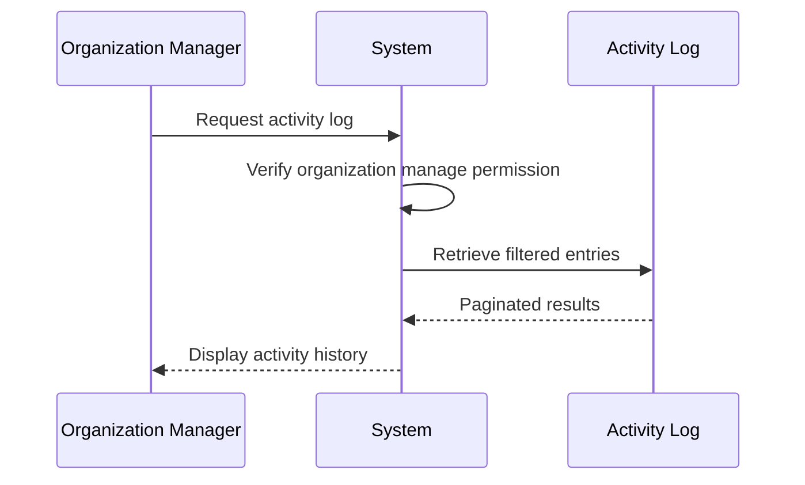

# Error Scenarios and Edge Cases

Business-level error scenarios, edge case coverage, and expected system behaviors for exceptional conditions.

## Organization Error Scenarios

An organization owner cannot delete their organization if any pending timesheets require review and approval. The deletion attempt fails when active employee contracts exist within the organization. When an organization name is not provided during sign-up, the creation request cannot proceed. Attempting to change organization currency without proper permissions results in access denied. If a user's account is the sole owner of an organization, they must transfer ownership or delete the organization before they can delete their personal account. When deleting an organization, all associated data including employees, projects, tasks, timelogs, and timesheets are permanently removed while the owner's user account remains intact.

### Organization Deletion Blocked by Pending Timesheets

When an owner attempts to delete an organization, the system verifies there are no timesheets awaiting review. A timesheet in submitted status indicates employee hours that require approval before the organization can be safely dissolved. If any submitted timesheets exist for any employee within the organization, the deletion operation is prevented. The system communicates to the owner that pending timesheets block organization deletion, and the owner must ensure all timesheets are either approved or rejected before proceeding with deletion.

### Organization Deletion Blocked by Active Contracts

Organization deletion requires all employee contracts to be inactive. The system checks for any contracts where the end date has not been set, indicating an ongoing employment relationship. If active contracts exist for any employee, the organization cannot be deleted. The owner must first end or complete all active contracts before attempting organization deletion. This ensures no employment relationships remain unresolved when the organization ceases to exist.

### Organization Name Required for Creation

Creating an organization during sign-up requires an organization name to be provided. The organization name identifies the organization across the platform and appears in organization selection interfaces. Without a name, the organization cannot be created and the sign-up process cannot complete. The system prompts the user to enter an organization name before proceeding with account creation.

### Currency Setting Modification Requires Permission

Only users with organization management permissions can modify the organization currency setting. The currency determines how monetary values are displayed and calculated throughout the organization, including pay rates in contracts and budget reporting. If a user without the appropriate permission attempts to change the currency, the system rejects the modification request. This ensures consistent financial data handling by restricting changes to authorized personnel only.

### Sole Owner Account Deletion Restriction

When a user attempts to delete their personal account, the system verifies whether they are the sole owner of any organization. If the user is the only owner of an organization, the account deletion is blocked. The user must either transfer ownership of that organization to another user, or delete the organization entirely, before they can delete their account. This prevents organizations from being left without any owner, which would leave the organization in an unmanageable state.

### Organization Data Cascade Deletion

When an organization is successfully deleted, all data associated with that organization is permanently removed. This includes all employee records, all project definitions and their associated tasks, all logged time entries and timesheets, all departments, all custom roles, and all activity log entries. The data cascade ensures complete data isolation removal and prevents orphaned records. This deletion is irreversible and all organization data is permanently erased from the system.

### Owner Account Retention on Organization Deletion

The owner who deletes an organization retains their user account after the organization deletion completes. While all organization-specific data is removed, the owner's personal account—including their email, password, profile information, and avatar—remains intact. The owner can subsequently join other organizations or create a new organization if desired. This separation of user identity from organization membership allows users to maintain their accounts independently from organization lifecycle events.

## User Error Scenarios

Users cannot sign up with an email address that has already been registered in the system. Login attempts with incorrect password credentials are rejected. When a user belongs to multiple organizations, they must select which organization context to work in before performing any organization-scoped actions. Attempting to change a password without providing the current correct password fails. A user account cannot be deleted while the user remains the sole owner of an organization without first transferring ownership or deleting that organization. When a user account is deleted, their employee records in other organizations are automatically marked as deactivated rather than removed. Users who sign up with a pending invitation email are automatically added to those organizations upon successful registration.

### Duplicate Email Registration

When a user attempts to register with an email address that is already associated with an existing account in the system, the registration attempt is rejected. The system prevents duplicate email registrations to maintain unique user identification. The user is informed that the email address is already registered and is prompted to either log in with the existing account or use a different email address for registration.

### Authentication Failures

When a user attempts to log in with a valid email address but provides an incorrect password, the authentication attempt is rejected. The system does not grant access to the account. The user is informed that the credentials provided are incorrect without specifying whether the email or password was wrong, to prevent account enumeration attacks.

### Organization Context Requirements

When a user belongs to multiple organizations and attempts to perform an action that requires organization context without having selected an active organization, the action is blocked. The system requires the user to explicitly select which organization they wish to work in before proceeding. Multi-organization users must select an organization context immediately after login or when switching between organizations without logging out.

### Password Change Validation

When a user attempts to change their password without providing their current correct password, the password change request is rejected. The system requires verification of the current password as an additional security measure before allowing the password to be modified. This prevents unauthorized password changes if a user's session is compromised.

### Account Deletion Restrictions

When a user attempts to delete their account while they remain the sole owner of one or more organizations, the account deletion is blocked. The system prevents the deletion to avoid leaving organizations without any owner. The user must first either transfer ownership of the organization to another member or delete the organization completely before their account can be deleted.

### Account Deletion Side Effects

When a user account is deleted, the system automatically marks all employee records associated with that user across all organizations they belong to as deactivated. The employee records are not permanently removed to preserve historical data integrity including timelogs and timesheets. The user's profile information is removed, but the employee record remains in a deactivated state.

### Invitation Auto-Association

When a user signs up with an email address that has pending invitations to organizations, the system automatically associates the newly created account with those organizations upon successful registration. The user is immediately granted membership to all organizations that invited the email address prior to registration. No additional invitation acceptance step is required for pre-existing pending invitations.

## OrganizationMember Error Scenarios

Inviting a user by email to an organization where they are already a member results in a duplicate membership error. An employee cannot log time or submit timesheets while their status is deactivated. When deactivating an employee, their historical timelog and timesheet data remains preserved and accessible. Reactivating a deactivated employee restores their ability to log time and submit timesheets. If an employee belongs to a custom role that gets deleted, they must be reassigned to a different role before the deletion can proceed. Employees can only be invited to organizations by users possessing the employee management permission. An invitation sent to an existing user account results in immediate membership addition, while invitations to non-existing emails create pending records awaiting sign-up completion.

### Duplicate Member Invitation Blocking

WHEN a user attempts to invite an employee by email, IF the email address already belongs to a member of the same organization, THEN the system SHALL reject the invitation request and inform the user that the person is already a member.

### Deactivated Employee Time Logging Restriction

WHILE an employee's status is deactivated, THEN the system SHALL prevent that employee from logging time entries or submitting timesheets.

WHEN a deactivated employee attempts to create a timelog, THEN the system SHALL reject the request and indicate that their account is currently inactive.

### Deactivated Employee Data Preservation

WHEN the system deactivates an employee, THEN all historical timelogs and timesheets associated with that employee SHALL be preserved and remain accessible.

### Employee Reactivation Permission Restoration

WHEN an employee's status changes from deactivated to active, THEN the system SHALL immediately restore their ability to log time and submit timesheets.

### Role Deletion Constraint with Assigned Employees

WHEN a user attempts to delete a custom role, IF one or more employees are currently assigned to that role, THEN the system SHALL reject the deletion request and inform the user that the role cannot be deleted while employees are assigned to it.

WHEN a role deletion is blocked due to assigned employees, THEN the user SHALL be required to reassign all affected employees to a different role before the deletion can proceed.

### Employee Invitation Permission Requirements

WHEN a user attempts to invite an employee to an organization, IF the user does not possess the employee management permission, THEN the system SHALL reject the invitation request.

### Existing User Auto-Addition vs Pending Invitation Flow

WHEN an invitation is sent to an email address that already has an existing user account in the system, THEN the system SHALL immediately add that user to the organization as a member.

WHEN an invitation is sent to an email address that does not have an existing user account, THEN the system SHALL create a pending invitation record awaiting completion of sign-up.

WHEN a new user signs up with an email address that has pending invitations, THEN the system SHALL automatically add the user to all organizations that have pending invitations for that email address.

## Role Error Scenarios

Built-in roles including Owner, Manager, and Employee cannot be deleted from the organization. Attempting to delete a custom role while employees are currently assigned to it blocks the deletion. Each employee must have exactly one role assigned at all times; removing a role assignment without providing a replacement fails. Users without employee management permission cannot modify role assignments for other employees. Modified role permissions take effect immediately for all employees assigned to that role. Custom roles can be edited to change their name and permission set, but built-in roles have fixed permission configurations that cannot be altered. Organization owners automatically have full access to all features regardless of their assigned role.

### Built-in Role Deletion Blocked

- IF a user attempts to delete the built-in Owner, Manager, or Employee roles, THEN THE system SHALL reject the action.
- FOR built-in roles, THE system SHALL permanently protect them from deletion regardless of user permission.
- WHEN a delete request targets a built-in role, THEN THE system SHALL return an error indicating that built-in roles cannot be deleted.


### Custom Role Delete Blocked by Assigned Employees

- IF a custom role has one or more employees currently assigned to it, THEN THE system SHALL reject attempts to delete that role.
- WHEN a delete request targets a custom role with assigned employees, THEN THE system SHALL return an error indicating that the role is in use.
- THE system SHALL only allow deletion of custom roles that have no employees assigned.


### Employee Must Have Exactly One Role

- THE system SHALL ensure that every employee has exactly one role assigned at all times.
- WHEN an attempt is made to remove a role assignment from an employee without providing a replacement role, THEN THE system SHALL reject the operation.
- IF a role modification would leave an employee without any assigned role, THEN THE system SHALL block the change.


### Role Assignment Change Without Permission Fails

- IF a user without `employee:manage` permission attempts to modify the role assignment of any employee, THEN THE system SHALL reject the operation.
- WHEN a role assignment change is requested by an unauthorized user, THEN THE system SHALL return an error indicating insufficient permissions.
- THE system SHALL verify that the requesting user has `employee:manage` permission before allowing any role assignment modification.


### Role Permission Changes Apply Immediately

- WHEN permission changes are saved to a custom role, THEN THE system SHALL immediately apply the updated permissions to all employees currently assigned to that role.
- THE system SHALL ensure that permission modifications take effect without requiring affected employees to log out or refresh their session.
- IF an employee is performing an action when their role permissions change, THEN THE system SHALL enforce the new permission set on their next action.


### Built-in Role Permissions Fixed

- THE system SHALL not allow modification of the permission set for built-in roles (Owner, Manager, Employee).
- IF an attempt is made to edit the permissions of a built-in role, THEN THE system SHALL reject the operation.
- THE Owner role SHALL permanently have full access to all features.
- THE Manager role SHALL permanently have management-level permissions including employee and project management and timesheet approval.
- THE Employee role SHALL permanently have self-service permissions limited to tracking time and managing their own data.


### Owner Full Access Regardless of Role Assignment

- THE system SHALL grant organization owners full access to all features regardless of which role is displayed in their employee record.
- IF a user is the organization owner, THEN THE system SHALL bypass role-based permission checks and allow all operations.
- THE owner status SHALL override any role assignment limitations for permission verification purposes.


## Department Error Scenarios

Deleting a department automatically sets all employees previously assigned to that department to have no department assignment. Departments support only one level of nesting, meaning a department cannot have a parent that already has a parent department. Creating a department without providing a name fails validation. Only users with organization management permission can create, edit, or delete departments. When editing a department, changing its parent to create a circular reference is prevented. Employees can view the department list but cannot modify department information without proper permissions. Department deletion does not affect employee records beyond removing the department association.

### Department Delete Cascades to Employee Department Assignment

WHEN an organization attempts to delete a department that has employees assigned to it, THE system SHALL set the department reference for all affected employees to null before completing the deletion.

IF an employee is assigned to a department at the time of department deletion, THEN THE system SHALL remove the department assignment from the employee record, leaving the employee without a department designation.

THE system SHALL NOT prevent department deletion based on the existence of assigned employees, but SHALL automatically clear all department associations.

### One Level Nesting Limit for Department Hierarchy

WHEN creating a department with a parent department, THE system SHALL verify that the parent department does not already have its own parent department.

IF the selected parent department already has a parent (creating a grandparent relationship), THEN THE system SHALL reject the request and prevent the creation of the department.

THE system SHALL enforce that the department hierarchy is limited to one level of nesting: Organization → Parent Department → Child Department.

WHEN editing a department's parent, THE system SHALL apply the same one-level nesting validation, preventing the assignment of a department that already has a parent.

### Department Name Required for Creation

WHEN creating a new department, THE system SHALL require a name to be provided.

IF the name is missing or empty, THEN THE system SHALL reject the creation request.

The name must contain at least one non-whitespace character to be considered valid.

### Department Management Permission Restriction

WHEN a user attempts to create a department, THE system SHALL verify the user has organization management permission (org:manage).

WHEN a user attempts to edit a department, THE system SHALL verify the user has organization management permission (org:manage).

WHEN a user attempts to delete a department, THE system SHALL verify the user has organization management permission (org:manage).

IF the user lacks the required permission, THEN THE system SHALL reject the operation.

### Circular Department Parent Reference Blocked

WHEN editing a department to assign or change its parent department, THE system SHALL validate that the selected parent is not a descendant of the department being edited.

IF assigning the parent would create a circular reference where Department A becomes its own ancestor, THEN THE system SHALL reject the edit request.

THE system SHALL prevent any circular parent-child relationships in the department hierarchy.

### Department List Viewable by All Employees

WHEN any employee requests the department list, THE system SHALL allow access regardless of their permission level.

All employees within an organization can view the list of departments and their hierarchical structure.

Viewing individual employee department assignments also does not require special permissions.

### Department Deletion Preserves Employee Records

WHEN a department is deleted, THE system SHALL preserve all employee records.

THE system SHALL only remove the department assignment from employees, without deleting or deactivating the employee records themselves.

Employee historical data, including timelogs, timesheets, and other work records, SHALL remain intact after department deletion.

The deletion of a department SHALL NOT affect employee accounts, contracts, or any data beyond the department association.

## Contract Error Scenarios

Creating a new contract automatically ends the previous active contract by setting its end date to the day before the new contract starts. Only one contract can be active per employee at any given time. Past contracts that have already ended cannot be edited or modified; they serve as immutable historical records. A contract must have a start date and a pay rate to be created successfully. Contracts with a null end date indicate ongoing employment without a predetermined end. Employees can view their own contracts, but viewing other employees' contracts requires employee view permission. Contract creation and editing can only be performed by users with employee management permission.

### Automatic Contract Termination

Creating a new contract automatically ends the previous active contract by setting its end date to the day before the new contract starts.

Only one contract per employee can be active at any given time. When a new contract is created, if an existing contract is active, the system automatically closes the previous contract at the end of day before the new contract begins. This ensures orderly transition of employment terms without overlapping active periods. The previous contract becomes an immutable historical record, while the new contract takes effect from its specified start date.

### Historical Contract Immutability

Past contracts that have already ended cannot be edited or modified; they serve as immutable historical records for audit and reference purposes.

Once a contract has an end date that has passed, or when a new contract auto-terminates an existing active contract, the previous contract becomes read-only. Users cannot change the start date, end date, pay rate, pay period, working hours, or notes of past contracts. This preservation ensures accurate historical tracking of employment terms over time. Any corrections or adjustments must be managed through new contract records rather than editing historical ones.

### Contract Validation Requirements

A contract must have a start date and a pay rate to be created successfully. Contracts with a null end date indicate ongoing employment without a predetermined end date.

When creating a contract, the start date and pay rate are required fields. If either is missing, the contract creation request is rejected. The end date is optional; when left unspecified, the contract remains active indefinitely until a new contract is created or an end date is added to the active contract. This allows organizations to manage both fixed-term and open-ended employment arrangements within the same contract framework.

### Contract Viewing Permissions

Employees can view their own contracts, but viewing other employees' contracts requires employee view permission.

An employee can access and review their complete contract history including current active terms and past agreements. However, access to another employee's contract information is restricted. Users must possess the employee viewing permission (referenced from actor permissions) to access contract records of employees other than themselves. This ensures sensitive employment information remains protected while allowing authorized personnel to perform necessary HR functions.

### Contract Management Authorization

Contract creation and editing can only be performed by users with employee management permission.

Creating new contracts, including the automatic termination of previous contracts, and editing the current active contract require appropriate authorization. Users without employee management permission (referenced from actor permissions) cannot initiate contract creation or modification operations. This restriction applies even when attempting to modify one's own contract, as contract terms represent formal employment agreements that should only be altered by authorized HR personnel.

## Project Error Scenarios

Projects cannot be deleted if any timelogs have been recorded against them, regardless of the timelog status. Archived and completed projects cannot receive new timelogs; attempts to log time against them are rejected. Projects can only be created by users with project management permission. Projects must have a name and a color code for creation to succeed. The project status transitions allow active to archived, active to completed, and archived back to active. Projects without budget hours are excluded from the project budget utilization report. Editing a project's budget or dates can only be performed by users with project management permission, while viewing projects requires project view permission.

### Project Deletion Blocked by Associated Timelogs

A project cannot be deleted if any timelogs have been recorded against it, regardless of the timelog's status. The system checks for existing timelog associations before permitting deletion. If timelogs are found, the deletion request is rejected and the project remains in the system. This ensures historical time tracking data is preserved and prevents data loss. Users must either retain the project or contact an administrator with appropriate permissions if data cleanup is required.

### Archived Project Blocks New Timelogs

Employees cannot log new timelogs against projects with an archived status. When attempting to create a timelog, the system validates the project's status. If the project is archived, the timelog creation is rejected. This restriction maintains data integrity by preventing new activity on projects that are no longer active. Archived projects retain all existing timelogs for reporting and historical purposes but cannot receive new time entries.

### Completed Project Blocks New Timelogs

Employees cannot log new timelogs against projects with a completed status. The system validates project status during timelog creation and rejects attempts to log time against completed projects. This ensures time tracking accuracy by preventing post-completion entries. Completed projects preserve all previously logged time for reporting but are closed to new timelog submissions.

### Project Creation Permission Restriction

Only users who possess the project management permission can create new projects. When a user attempts to create a project, the system verifies their permission set. Users without the required permission are unable to access project creation functionality or submit project creation requests. This restriction ensures project setup is controlled by authorized personnel only.

### Project Requires Name and Color Code

Every project must have a name and a color code specified at the time of creation. The system validates that both fields are provided before creating the project record. If either the name or color code is missing, the creation request is rejected. This ensures all projects have identifiable names for reference and visual color coding for organizational display purposes.

### Project Status Transition Rules

Projects follow specific status transition rules. Active projects can be transitioned to either archived or completed status. Archived projects can be reactivated back to active status. Completed projects have no further transitions available. The system enforces these valid transitions and rejects attempts to move a project to an invalid status state.

### Project Budget Report Exclusion Without Budget

Projects without budget hours specified are excluded from the project budget utilization report. The report only includes projects that have defined budget hour values for comparison against actual logged hours. Projects lacking budget information do not appear in budget analysis views, focusing reporting efforts on projects with defined budget constraints.

## ProjectMember Error Scenarios

Removing an employee from a project does not delete any historical timelogs they recorded against that project. A single employee can be assigned to multiple projects simultaneously. Each project membership specifies the employee's role as either a regular member or project lead. Project leads can manage tasks within their assigned projects, including creating, editing, and changing task status. Users with project management permission can assign or remove any employee from any project. Employees can view which projects they are assigned to but cannot modify project memberships without appropriate permissions. Project lead assignments grant elevated permissions limited to task management within that specific project scope.

### Project Member Removal Data Preservation

When an employee is removed from a project, all historical timelogs that the employee recorded against that project must be preserved. The removal operation must not cascade to delete any associated time tracking data. Employees who have recorded timelogs on a project retain the right to view their own historical timelogs even after project membership removal. The system maintains referential integrity without data loss for audit and reporting purposes. Future time tracking operations by the removed employee against that project are blocked, but past records remain accessible for historical analysis and compliance reporting.

### Employee Multiple Project Assignment

A single employee can hold simultaneous memberships in multiple projects within the same organization. There is no restriction on the number of projects an employee may be assigned to. Each project membership is independent and carries its own role designation. An employee may serve as a project lead on one project while being a regular member on another. The system validates that an employee is assigned to a project before allowing them to select it for time tracking or task assignment.

### Project Member Role Definitions

Each project membership assigns a specific role to the employee: either as a regular member or as a project lead. The role is determined at the time of assignment and can be changed later by authorized users. Regular members can participate in project activities and log time against the project and its tasks. Project leads gain elevated permissions for task management within the scope of that specific project. The role designation affects what operations the employee can perform but does not affect data visibility unless combined with organization-level permissions.

### Project Lead Permissions Scope

Project leads have task management authority limited strictly to the projects where they hold the lead designation. Project leads can create new tasks within their assigned projects. Project leads can edit existing tasks including title, description, priority, due date, and assigned employee within their projects. Project leads can change task status such as marking tasks as in-progress or closed within their projects. Project leads cannot manage tasks in projects where they are only regular members or not assigned at all. Project leads cannot modify project-level settings, delete projects, or manage project memberships.

### Project Membership Modification Requirements

Creating new project memberships requires the user to have project management permission at the organization level. Assigning employees to projects, removing employees from projects, and changing an employee's role within a project all require project management permission. Employees cannot self-assign to projects, self-remove from projects, or change their own project role designation. Project leads can manage tasks but cannot modify project memberships unless they also hold organization-level project management permission. The system validates permission both on the membership modification request and when the change affects the project lead status of existing members.

### Employee Self-View of Project Assignments

Employees can view a list of all projects they are assigned to within the current organization context. The self-view includes project names, color codes for visual identification, and the employee's assigned role within each project. Employees can see basic project information such as status and description for their assigned projects. Employees cannot view the complete project member list or other project details unless they hold organization-level view permissions. The assignment list is filtered to show only the currently authenticated employee's memberships in the selected organization.

## Task Error Scenarios

Tasks can have at most one level of subtask nesting; attempting to create a subtask of a subtask is blocked. Task status changes are automatically recorded in the task history, including the old status, new status, timestamp, and who made the change. Tasks can only be assigned to employees who are members of the project to which the task belongs. Closing a task prevents further status changes unless it is reopened. Project leads can edit tasks within their projects, while users with project management permission can edit any task in the organization. Tasks must have a title to be created successfully. Task priority levels including low, medium, high, and urgent determine visual urgency indicators to project members.

### Subtask Nesting Limitations

The system enforces a one-level nesting restriction on subtasks. A task may have a parent task, and a task may have child tasks, but a child task cannot itself have subtasks.

When a user attempts to create a subtask for a task that already has a parent task, the attempt is rejected.

For example, if Task A has subtask Task B, the system blocks any attempt to create a subtask of Task B.

### Task Assignment Restrictions

Task assignment is restricted to employees who are members of the project containing the task. When creating or editing a task, if an assigned employee is specified, the system validates that the selected employee is a member of the project.

If the selected employee is not assigned to the project, the assignment attempt is rejected and the user must select a valid project member.

### Closed Task Status Change Prevention

A task in the closed status cannot undergo further status changes unless it is reopened first. Once a task reaches the closed state, it is considered finalized and locked from workflow transitions.

To continue working with a closed task, a user with appropriate permissions must first reopen the task to a non-closed status before any status changes can occur.

### Task Creation Validation

Task creation requires a title. The system rejects any task creation attempt where the title is not provided.

When the title is missing, the request fails immediately before any other task attributes are evaluated or stored.

### Task Edit Permission Scope

The scope of task editing permissions is determined by the user's role and project membership level.

Project leads can edit tasks within projects where they are assigned as project lead. This includes modifying task attributes such as title, description, status, priority, estimated hours, due date, assigned employee, and parent task.

Users with project management permission can edit any task in the organization, regardless of project membership or lead status. This provides organization-wide task editing capability.

## TaskHistory Error Scenarios

Task history entries are created automatically whenever a task status changes and cannot be manually created, edited, or deleted by users. Each history entry captures the previous status, the new status, the exact timestamp of the change, and the user who performed the status transition. History records serve as an immutable audit trail of all status changes made to a task throughout its lifecycle. Task history viewing is available to any user who can view the parent task. The system does not record history entries for task field changes other than status transitions; only status changes generate history entries. Task history provides transparency into task lifecycle progression and can be used for project management reporting and accountability tracking.

### Automatic Task History Creation

Task history entries are automatically created by the system whenever a task status changes. Users cannot manually create history entries through any interface or operation. Any attempt to directly create a task history record is blocked by the system. History entries are generated exclusively as a side effect of task status transition operations performed by authorized users.

### History Entry Immutability

Task history entries are immutable records that cannot be modified after creation. Users are not permitted to edit any aspect of a history entry including the old status, new status, timestamp, or the user who performed the change. Any attempt to edit or update an existing history entry is blocked by the system. History records serve as a permanent audit trail of task status changes.

### History Entry Deletion Prevention

Task history entries cannot be deleted by any user regardless of their permission level. Any attempt to remove or delete a history record is blocked by the system. History entries persist for the lifetime of the parent task and cannot be purged, archived, or removed through manual operations.

### History View Permission Requirements

A user can only view a task's history entries if they have permission to view the parent task itself. The system enforces that history visibility is strictly tied to task visibility permissions. If a user attempts to access history for a task they cannot view, the request is denied. Project members can view history for tasks within their assigned projects. Users with project view permissions can access history for all tasks in those projects.

### Status Change as Sole History Trigger

The system only generates history entries when a task's status field changes. Modifications to other task fields such as title, description, priority, estimated hours, due date, or assignment do not create history entries. Status transitions between states (open, in-progress, completed, closed) are the sole trigger for history record creation. Multiple field changes in a single operation only generate a history entry if the status field was among the modified fields.

## Timelog Error Scenarios

Timelogs that are part of an approved timesheet cannot be edited or deleted by the employee who created them. Employees can only create timelogs for themselves and cannot log time on behalf of other employees. Timelogs can only be created for projects to which the employee is assigned as a member. Selecting a task for a timelog is optional, but if selected, the task must belong to the chosen project. Timelogs associated with submitted or approved timesheets are locked from modification and deletion by employees. Users with time management permission can edit or delete any employee's timelogs regardless of timesheet status. Timelog duration is recorded in minutes and must be greater than zero.

### Timelog Modification Restrictions

This section covers error scenarios and access restrictions that apply when employees attempt to create, edit, or delete timelogs. These rules ensure data integrity and enforce proper authorization boundaries.

##### Blocked Operations by Timesheet Status

When a timelog is included in a timesheet with "submitted" or "approved" status, the employee who created the timelog cannot modify or delete it. The system rejects any edit or delete request from the original employee for such locked timelogs.

When a timelog is included in a timesheet with "approved" status, the employee who created the timelog cannot delete it. The system rejects any delete request for approved timelogs.

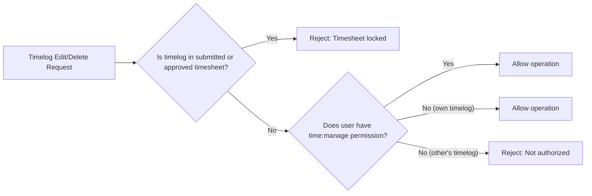

##### Self-Service Only Rule

Employees can only create timelogs for themselves. The system rejects any attempt to create a timelog on behalf of another employee. This restriction ensures accurate time tracking attribution and prevents unauthorized time entries.

##### Project Assignment Requirement

Timelogs can only be created for projects to which the employee is assigned as a member. The system validates that the selected project exists in the employee's assigned project list before allowing timelog creation. If the employee is not a member of the specified project, the request is rejected.

##### Task-to-Project Validation

Selecting a task for a timelog is optional. However, when a task is specified, the system validates that the task belongs to the selected project. If the task does not belong to the chosen project, the request is rejected to maintain data consistency.

##### Duration Validation

Timelog duration must be greater than zero minutes. The system rejects any timelog creation or edit request with zero or negative duration values.

##### Permission-Based Override

Users with the `time:manage` permission can edit or delete any employee's timelogs regardless of timesheet status. This override capability allows administrators to correct errors or make necessary adjustments even when timelogs are locked for regular employees.

Users without the `time:manage` permission who attempt to edit or delete another employee's timelogs will have their requests rejected regardless of timesheet status.

## Timesheet Error Scenarios

A timesheet cannot be submitted for approval if it contains no timelogs; a minimum of one timelog is required for submission. Only one timesheet per employee per week can exist in submitted or approved status; attempting to submit a second timesheet for the same week fails. Once a timesheet is approved, all included timelogs become locked and cannot be modified or deleted by the employee. When a timesheet is rejected, it returns to draft status and the employee can modify and resubmit it; the rejection reason is required and visible to the employee. Timesheets cannot be edited while in submitted status awaiting approval. Approved timesheets cannot be deleted by employees. Users with timesheet approval permission can view, approve, or reject submitted timesheets from any employee.

### Empty Timesheet Submission Blocked

A draft timesheet cannot be submitted for approval if it contains no timelogs. The system prevents submission when the timesheet has zero timelog entries.

WHEN an employee attempts to submit a timesheet draft, THE system SHALL verify the timesheet has at least one timelog entry. IF no timelogs are associated with the timesheet, THEN THE system SHALL reject the submission request and inform the employee that at least one timelog is required before submission.

### Duplicate Week Timesheet Submission Blocked

Only one timesheet per employee per week can exist in submitted or approved status. An employee cannot submit a second timesheet for the same week if another timesheet for that week is already submitted or approved.

WHEN an employee attempts to submit a timesheet draft, THE system SHALL verify no other timesheet exists for the same employee and week combination with status submitted or approved. IF another timesheet exists in submitted or approved status for the same week, THEN THE system SHALL reject the submission request and inform the employee that only one timesheet can be in review per week.

### Approved Timesheet Locks Timelogs

Once a timesheet is approved, all included timelogs become locked and cannot be modified or deleted by the employee who created them. This ensures data integrity and prevents retroactive time manipulation after approval.

WHEN a timesheet is approved, THE system SHALL lock all timelogs included in that timesheet. WHILE a timelog is locked, THE system SHALL prevent the employee from editing the timelog date, duration, project, task, description, or billable flag. WHILE a timelog is locked, THE system SHALL prevent the employee from deleting the timelog. IF an employee attempts to modify or delete a locked timelog, THEN THE system SHALL reject the request and inform the employee the timelog is part of an approved timesheet.

### Rejected Timesheet Returns to Draft

When a timesheet is rejected, it returns to draft status, allowing the employee to modify and resubmit it. The rejection reason provided by the reviewer is visible to the employee.

WHEN a reviewer rejects a submitted timesheet, THE system SHALL change the timesheet status from submitted to draft. WHEN a timesheet is rejected, THE system SHALL preserve the rejection reason for the employee to review. THE system SHALL allow the employee to modify timelogs in the returned draft timesheet and resubmit it for approval.

### Rejection Reason Required on Reject

A rejection reason is required when rejecting a timesheet. The reviewer must provide explanatory text describing why the timesheet was rejected.

WHEN a reviewer attempts to reject a submitted timesheet, THE system SHALL require a rejection reason to be provided. IF the rejection reason is missing or empty, THEN THE system SHALL reject the reject action request and inform the reviewer that a reason is required.

### Submitted Timesheet Editing Blocked

Timesheets cannot be edited while in submitted status awaiting approval. Employees must wait for the review outcome or request the reviewer to reject the timesheet to make modifications.

WHILE a timesheet has status submitted, THE system SHALL prevent the employee from adding or removing timelogs from the timesheet. WHILE a timesheet has status submitted, THE system SHALL prevent the employee from editing the timesheet contents. IF an employee attempts to modify a submitted timesheet, THEN THE system SHALL reject the request and inform the employee the timesheet is awaiting review.

### Approval Permission Required for Approve Reject Actions

Users with timesheet approval permission can view, approve, or reject submitted timesheets from any employee in the organization. Users without this permission cannot perform approval actions.

WHERE a user does not have the timesheet approval permission, THE system SHALL prevent that user from viewing submitted timesheets from other employees. WHERE a user does not have the timesheet approval permission, THE system SHALL prevent that user from approving submitted timesheets. WHERE a user does not have the timesheet approval permission, THE system SHALL prevent that user from rejecting submitted timesheets.

## Timer Error Scenarios

Each employee can have at most one active timer running at any given time; starting a new timer while another is active is blocked. Starting a timer requires selecting a project, and optionally a task, that the employee is assigned to. Timers that are forgotten and left running continue indefinitely without automatic stopping. Employees can edit the description, project, and task of a running timer without stopping it. Discarding a running timer permanently removes it without creating any timelog record. Stopping a timer creates a timelog with the calculated duration rounded to the nearest minute. Employees can view their currently running timer status at any time. Timer data is not accessible to other employees unless they have time view all permission.

### Single Active Timer Constraint

WHILE an employee has an active timer running, IF the employee attempts to start a new timer, THEN THE system SHALL reject the request.

WHEN attempting to start a timer, THE system SHALL check for any existing active timer for the employee.

IF an active timer exists for the employee, THEN THE system SHALL block the new timer creation and notify the employee that only one active timer is allowed.

Employees cannot have concurrent timers running in parallel.

The active timer must be stopped or discarded before a new timer can be started.

### Timer Start Requirements

WHEN an employee starts a timer, THEN THE system SHALL require selection of a project.

IF the employee attempts to start a timer without selecting a project, THEN THE system SHALL reject the request.

WHILE starting a timer, THE employee MAY optionally select a task belonging to the chosen project.

Task selection is optional and not preventing timer start.

IF a task is selected, THEN THE task SHALL belong to the project selected for the timer.

The system SHALL verify project and task assignments are valid for the employee.

### Forgotten Timer Indefinite Runtime

WHEN a timer is started and not stopped by the employee, THEN THE timer SHALL continue running indefinitely.

THE system SHALL NOT automatically stop the timer after any time period.

Forgotten timers maintain their start timestamp and continue incrementing duration without limit.

Employees are responsible for monitoring and stopping their own timers.

IF an employee forgets to stop their timer, THEN THE timer SHALL remain active across sessions, logouts, and re-logins.

The system SHALL display the currently running timer status to alert employees of active timers.

### Running Timer Modification

WHILE a timer is running, THE employee MAY edit the timer description.

WHEN editing a running timer description, THEN THE system SHALL update the description without stopping the timer.

WHILE a timer is running, THE employee MAY change the selected project.

THE system SHALL allow project change for a running timer at any time.

WHILE a timer is running, THE employee MAY change the selected task.

Task change is allowed without interrupting the timer.

IF the project is changed, THEN THE system SHALL clear the selected task if the task does not belong to the new project.

All modifications to a running timer are recorded and applied immediately without stopping the timer.

### Timer Discard Behavior

WHEN an employee discards their running timer, THEN THE system SHALL permanently remove the timer.

IF a timer is discarded, THEN no timelog SHALL be created.

Discarding a timer is irreversible.

THE system SHALL NOT retain any record of a discarded timer.

The discard operation SHALL NOT affect any existing timelogs or timesheets.

Employees can discard their timer at any point while it is running.

### Timer Stop and Timelog Creation

WHEN an employee stops their running timer, THEN THE system SHALL calculate the total duration.

THE system SHALL round the calculated duration to the nearest minute.

Durations less than 30 seconds round down to zero minutes.

Durations of 30 seconds or more round up to the next full minute.

IF the rounded duration is zero minutes, THEN THE system SHALL either reject the timelog creation or create a timelog with minimum one minute duration based on system configuration.

Upon stopping, THE system SHALL create a timelog with the following attributes: date (current date), duration in minutes (rounded), project (selected project), task (selected task if any), description (entered description), billable (default based on project settings).

### Timer Status Visibility

IF an employee does not have an active timer, THEN THE system SHALL indicate no timer is running.

WHILE a timer is active, THE employee SHALL be able to view the timer status including: start timestamp, elapsed duration, selected project, selected task, current description.

Timer status is visible only to the employee who owns it.

Users with time view all permission MAY view running timers of other employees within the same organization.

IF an employee switches organizations, THEN THE system SHALL display the timer status if a timer was started in that organization context.

## ActivityLog Error Scenarios

Activity log entries are created automatically by the system and cannot be manually created, edited, or deleted by users. Each activity log entry captures the timestamp, the user who performed the action, the action type, the target entity affected, and any relevant details. Logged actions include employee invitations, deactivations, reactivations, contract creation and editing, project creation, archiving, completion, deletion, task status changes, timesheet submissions, approvals, rejections, and role assignments or changes. The activity log is strictly isolated per organization; users cannot view activity logs from other organizations. Viewing the activity log requires organization management permission. The activity log supports filtering by action type, user, and date range, and is presented in a paginated format for performance.

### Activity Log Manual Creation Prevention

Activity log entries are created automatically by the system when significant actions occur. WHEN a user attempts to create an activity log entry manually, THEN THE system SHALL reject the request. THE system SHALL generate activity log entries automatically for the following actions:

- Employee invited, deactivated, or reactivated
- Contract created or edited
- Project created, archived, completed, or deleted
- Task status changed
- Timesheet submitted, approved, or rejected
- Role assigned or changed

IF a manual creation attempt is detected, THEN THE system SHALL prevent the entry from being created and return an error.

### Activity Log Manual Editing Prevention

THE activity log entries SHALL be immutable and cannot be modified once created. WHEN a user attempts to edit an existing activity log entry, THEN THE system SHALL reject the request. THE system SHALL preserve all recorded activity log data including timestamp, user who performed the action, action type, target entity, and details in their original state.

### Activity Log Manual Deletion Prevention

Activity log entries constitute an audit trail that must be preserved. WHEN a user attempts to delete an activity log entry, THEN THE system SHALL reject the request. THE system SHALL maintain all activity log entries permanently for the organization's operational history. Even when organizations are deleted, related activity log entries are handled according to the organization's deletion process.

### Activity Log Visibility and Permission Requirements

Organization owners can view activity logs, ensuring accountability and transparency of actions within the organization. WHEN an organization owner accesses the activity log interface, THEN THE activity log SHALL display comprehensive information about actions taken within the organization.

THE activity log SHALL include the following components:

| Component | Description |
|-----------|-------------|
| Timestamp | The exact date and time when the action occurred |
| User | The user who performed the action (identified by their account) |
| Action Type | The category of action performed (e.g., employee_invited, project_created, timesheet_approved) |
| Target Entity | The type and identifier of the entity affected by the action (e.g., Employee, Project, Timesheet) |
| Details | Additional contextual information about the action |

WHEN an unauthorized user attempts to access the activity log, THEN THE system SHALL reject the request and not display any activity log entries.

### Activity Log Organization Data Isolation

THE activity log SHALL be strictly isolated per organization. WHEN a user is viewing the activity log, THEN THE system SHALL display only entries belonging to the currently selected organization. Users SHALL NOT be able to view activity log entries from other organizations even if they belong to those organizations through a different membership.

WHEN a user switches to a different organization context, THEN THE system SHALL clear the current activity log view and require a new request scoped to the newly selected organization.

### Activity Log Filtering and Browsing

THE activity log SHALL support filtering and pagination for efficient browsing and performance. Users can apply the following filters:

- **Action Type**: Filter to show only specific types of actions (e.g., only project-related actions)
- **User**: Filter to show only actions performed by a specific user
- **Date Range**: Filter to show actions within a specified timeframe

THE activity log SHALL be displayed in paginated format. THE system SHALL support the following pagination and browsing expectations:

| Filter Type | Expected Behavior |
|-------------|-------------------|
| Action Type | Multiple action types can be selected as an OR filter |
| User | Single user selection for filtering |
| Date Range | Start and end date inclusive |
| Combined Filters | All selected filters are applied as AND conditions |

WHEN filtering results in no matching entries, THEN THE system SHALL display an empty state message indicating no records match the criteria.

# End-to-End User Scenarios

Cross-domain user scenarios that span multiple concepts, describing complete user journeys.

## Cross-Domain User Scenarios

Define end-to-end user scenarios that span multiple concepts, describing complete user journeys from start to finish.

### Organization Setup and Onboarding Scenario

A user discovers the platform and begins the sign-up process by providing their email and password. During initial registration, the user is prompted to create their first organization. The user provides the organization name, an optional description, uploads an optional logo, selects the organization's currency and timezone, and specifies the fiscal year start month. Upon successful organization creation, the user is automatically assigned as the organization owner and granted the built-in Owner role with all permissions. The user then completes their profile by adding their display name, phone number, and avatar image. The system confirms the organization setup and redirects the user to the organization dashboard.

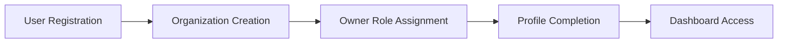

### Employee Invitation and Onboarding Scenario

An organization owner invites a new member by entering their email address. The system checks if the email belongs to an existing user account. If the email has no associated account, a pending invitation is created and the invitation is sent. When the invited person signs up using that email, the system automatically detects the pending invitation and adds them to the organization. If the email already has an account, the user is immediately added to the organization. The inviter then assigns a role to the new member (such as Manager or Employee). The new member receives the invitation notification and accepts it. The member completes their employee record by optionally specifying their department, position, and employment type. If the member requires a contract, a user with employee management permission creates a contract specifying the start date, pay rate, pay period, and working hours. The new member can now log in, select the organization from their context menu, and begin using the platform.

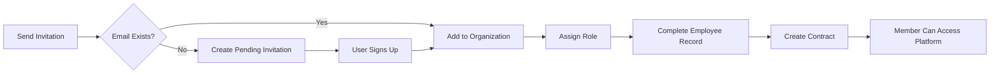

### Time Tracking Workflow Scenario

An employee starts their workday by viewing their dashboard to see tasks assigned to them with status open or in-progress. The employee begins working on a task and starts a timer, selecting the appropriate project and optionally a specific task. The timer runs continuously while the employee works. When the employee finishes the work session, they stop the timer, which automatically creates a timelog entry with the calculated duration rounded to the nearest minute. Alternatively, the employee can manually create a timelog by specifying the date, duration, project, optional task, description, and billable status. Throughout the week, the employee logs multiple timelogs across different projects and tasks. At the end of the week (Sunday), the employee creates a draft timesheet for that week, which automatically includes all timelogs from Monday through Sunday. The employee reviews the timesheet, can add or remove timelogs, and verifies the total hours. Once satisfied, the employee submits the timesheet for approval. A manager with timesheet approval permission reviews the submitted timesheet. The manager can either approve the timesheet, which locks all included timelogs preventing further edits, or reject the timesheet with a reason, returning it to draft status for the employee to correct and resubmit.

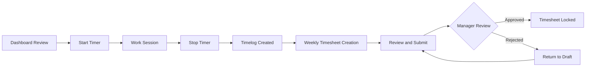

### Project Management Workflow Scenario

A manager with project management permission creates a new project by providing a name, optional description, selecting a color code for visual identification, and setting an optional budget hours estimate and date range. The manager then assigns employees to the project as members, with each member being designated either as a regular member or a project lead. Project leads have the authority to create and manage tasks within their assigned projects. The project lead creates tasks for the project, specifying titles, descriptions, statuses, priorities, estimated hours, due dates, and optionally assigning tasks to specific project members. Tasks can have parent tasks for one level of subtask nesting. Team members view their assigned tasks through their dashboard and project views. As work progresses, task statuses are updated (from open to in-progress to completed), with each status change automatically recorded in the task history audit trail. Team members log time against tasks using timelogs, which feeds into project budget tracking. When the project concludes, a user with project management permission changes the project status to completed or archived, preventing new timelogs while preserving all historical data including timelogs and tasks.

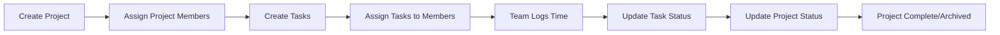

# Real-time Events

WebSocket/SSE event definitions and subscription specifications.

## Organization Events

Organization settings updates are broadcast to organization owners in real-time, ensuring immediate awareness of configuration changes. Organization deletion events notify affected users when an organization they belong to is permanently removed. Organization creation events inform users when they successfully establish a new organization context. Logo image uploads trigger notifications to confirm successful updates to the organization's visual identity. Currency, timezone, and fiscal month setting changes are communicated to owners to ensure awareness of operational configuration updates. Users receive events when they are added to an organization through invitation acceptance.

### Organization Settings Update Events

WHEN an organization's settings are modified, including name, description, currency, timezone, or fiscal start month, THE system SHALL broadcast the updated settings to all connected organization owners in real-time.

WHEN the currency setting is changed, THE system SHALL include the new currency selection in the broadcast notification.

WHEN the timezone configuration is updated, THE system SHALL communicate the new timezone setting to authorized recipients.

WHEN the fiscal month setting is modified, THE system SHALL reflect the new fiscal start month in the real-time notification.

WHILE an organization owner maintains an active connection, THE system SHALL push configuration updates automatically without requiring manual refresh.

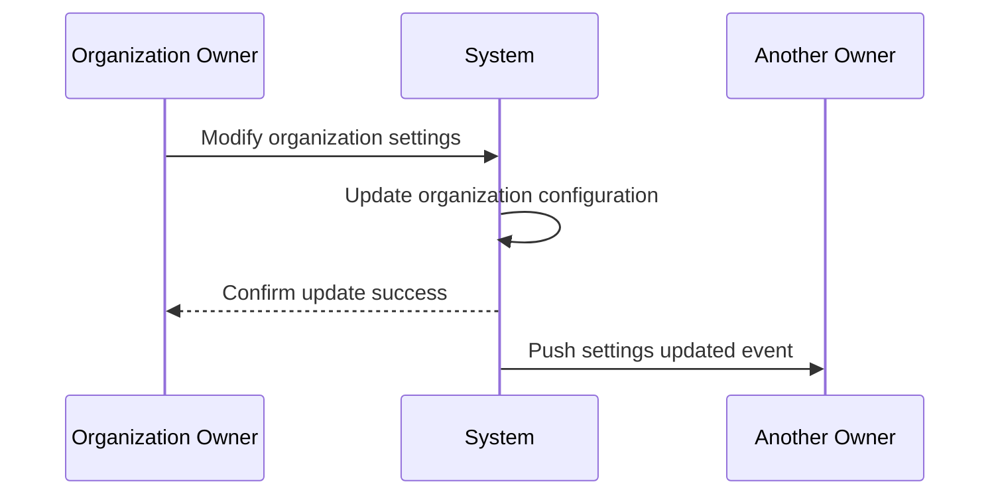

### Organization Deletion Events

WHEN an organization is permanently deleted, THE system SHALL notify all affected users who were members of that organization.

THE notification SHALL include the organization name that was deleted.

IF a user is actively connected when the organization is deleted, THEN THE system SHALL display the deletion alert in real-time.

WHEN an organization owner initiates deletion, THE system SHALL broadcast the pending deletion event to other owners before completing the operation.

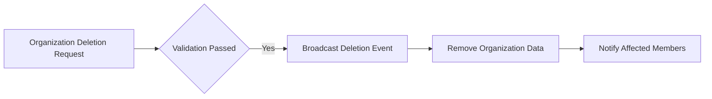

### Organization Creation Events

WHEN a user successfully creates a new organization during sign-up or later, THE system SHALL send a creation confirmation notification to the establishing user.

THE confirmation SHALL include the organization name, establishment timestamp, and initial owner privileges.

WHEN establishing a new organization context in a multi-tenancy environment, THE system SHALL notify the user that the new organization is now their active working context.

WHERE the user creates their first organization, THE system SHALL configure the organization as the default context for subsequent sessions.

WHEN organization creation completes, THE system SHALL grant the creating user full owner access and communicate this assignment through the confirmation event.

### Logo Upload Success Events

WHEN an organization logo image is successfully uploaded, THE system SHALL broadcast a confirmation event to organization owners.

THE confirmation SHALL include the timestamp of successful upload.

IF the logo upload fails validation or storage, THEN THE system SHALL NOT broadcast a success event.

WHETHER replacing an existing logo or uploading for the first time, THE system SHALL notify authorized users of the successful update.

The logo upload success notification allows owners to verify the organization's visual identity has been updated across all organizational contexts.

### Organization Invitation Accepted Events

WHEN a user accepts an invitation to join an organization, THE system SHALL notify the inviting user and organization owners in real-time.

THE notification SHALL include the newly joined member's display name and acceptance timestamp.

WHEN an invited user completes registration and is automatically added to pending organizations, THE system SHALL broadcast an invitation-accepted event for each organization joined.

IF the invitation acceptance changes the organization's total member count, THEN THE system SHALL include the updated member information in the notification payload.

WHERE multiple users are invited simultaneously, each acceptance SHALL generate an individual event for tracking recruitment progress.

## User Events

User profile updates are communicated to the account holder to confirm successful changes to display name, avatar, or phone number. Password change events notify users when their account credentials are modified for security awareness. Account deletion confirmations inform users when their personal account is permanently removed from the system. Multi-organization users receive events when switching between organization contexts without requiring re-login. Profile synchronization events notify users when their global profile information is updated across all organizations they belong to.

### Profile Update Notifications

WHEN a user successfully updates their global profile display name, THE system SHALL emit a profile updated notification to the user's active sessions.

WHEN a user successfully updates their global profile avatar image, THE system SHALL emit an avatar image updated notification to the user's active sessions.

WHEN a user successfully updates their global profile phone number, THE system SHALL emit a phone number modified notification to the user's active sessions.

Each profile update notification SHALL include the updated field name and the new value.

Profile updated notifications SHALL be delivered via WebSocket or Server-Sent Events to all active sessions belonging to the user.

IF a user has multiple active sessions across different devices, THEN THE system SHALL emit the profile updated notification to all active sessions.

### Password Change Confirmations

WHEN a user successfully changes their account password, THE system SHALL emit a password changed confirmation to the user's active sessions.

The password changed confirmation SHALL include a timestamp indicating when the change occurred.

WHEN a password change is initiated, THE system SHALL emit a security notification alert immediately after successful password modification.

Password changed confirmations SHALL be delivered via WebSocket or Server-Sent Events to ensure real-time security awareness.

IF the user has active sessions on other devices, THEN THE system SHALL emit the password changed confirmation to all active sessions to alert the user of the credential modification.

### Account Deletion Alerts

WHEN a user successfully deletes their personal account, THE system SHALL emit an account deleted alert to the user's active sessions before terminating the sessions.

The account deleted alert SHALL include a confirmation message indicating the permanent removal of the account from the system.

Account deleted alerts SHALL be the final event delivered to the user's sessions before disconnection.

WHEN an account deletion is triggered, THE system SHALL broadcast the account deleted alert to all WebSocket connections associated with the user before closing the connections.

### Organization Context Switching Events

WHEN a user switches between organization contexts without logging out, THE system SHALL emit an organization context switched event to the user's current session.

The organization context switched event SHALL include the unique identifier of the newly selected organization.

WHEN a user selects a different organization to work in, THE system SHALL emit the context switch event immediately after the organization context is changed.

Organization context switched events SHALL signal to the client application that all subsequent data requests will be scoped to the newly selected organization.

IF a user belongs to multiple organizations, THEN THE system SHALL emit an organization context switched event each time the user changes their active organization selection.

### Avatar Update Notifications

WHEN a user successfully uploads or updates their avatar image, THE system SHALL emit an avatar image updated notification to the user's active sessions.

The avatar image updated notification SHALL include a reference to the new avatar image.

Avatar image updated notifications SHALL be delivered in real-time via WebSocket or Server-Sent Events.

WHEN an avatar image update is processed, THE system SHALL emit the notification to confirm the successful change of the user's profile picture.

### Phone Number Change Notifications

WHEN a user successfully modifies their phone number in their global profile, THE system SHALL emit a phone number modified notification to the user's active sessions.

The phone number modified notification SHALL indicate that the contact information has been updated without revealing the actual phone number in the event payload.

Phone number modified notifications SHALL be delivered via WebSocket or Server-Sent Events to ensure the user receives immediate confirmation of the contact detail change.

WHEN a phone number modification is saved, THE system SHALL emit the notification to all active sessions belonging to the user.

### Display Name Change Notifications

WHEN a user successfully changes their display name in their global profile, THE system SHALL emit a display name changed notification to the user's active sessions.

The display name changed notification SHALL include the new display name value.

Display name changed notifications SHALL propagate to all active sessions across all organizations the user belongs to, since the display name is part of the global profile.

WHEN a display name modification is confirmed, THE system SHALL emit the notification via WebSocket or Server-Sent Events to provide immediate feedback to the user.

### Global Profile Synchronization Events

WHEN a user's global profile information is updated, THE system SHALL emit a global profile synchronized event to all active sessions across all organizations the user belongs to.

The global profile synchronized event SHALL indicate that profile changes have been applied consistently across all organization contexts.

Global profile synchronized events SHALL be triggered after any successful modification to the user's global profile attributes including display name, avatar image, or phone number.

WHEN a global profile synchronization occurs, THE system SHALL ensure the event is delivered to all active sessions regardless of which organization context is currently selected.

IF a user has active sessions in multiple organization contexts simultaneously, THEN THE system SHALL emit the global profile synchronized event to each active session to maintain profile consistency awareness.

## OrganizationMember Events

Employee invitation events notify users when they receive an invitation to join an organization via email. Role assignment changes are communicated to employees when their permissions are modified within the organization. Deactivation events inform employees when their access is suspended, preventing further time logging or timesheet submissions. Reactivation events notify employees when their access is restored and they can resume normal activities. Department transfer events inform employees when their organizational unit assignment changes. Employment type modifications are communicated when employees transition between full-time, part-time, contractor, or intern classifications.

### Employee Invitation Received

When an organization extends an invitation to a new employee via email, the system notifies the recipient user in real-time if they are currently connected. This event is triggered upon successful creation of a pending invitation record. The notification includes the inviting organization name, the inviter user display name, and the timestamp of the invitation. If the invited email corresponds to an existing user who is online, they receive an immediate notification. If the user is not currently connected, they will see the pending invitation upon their next login and organization context selection. The event enables the invited user to take immediate action to accept or review the invitation.

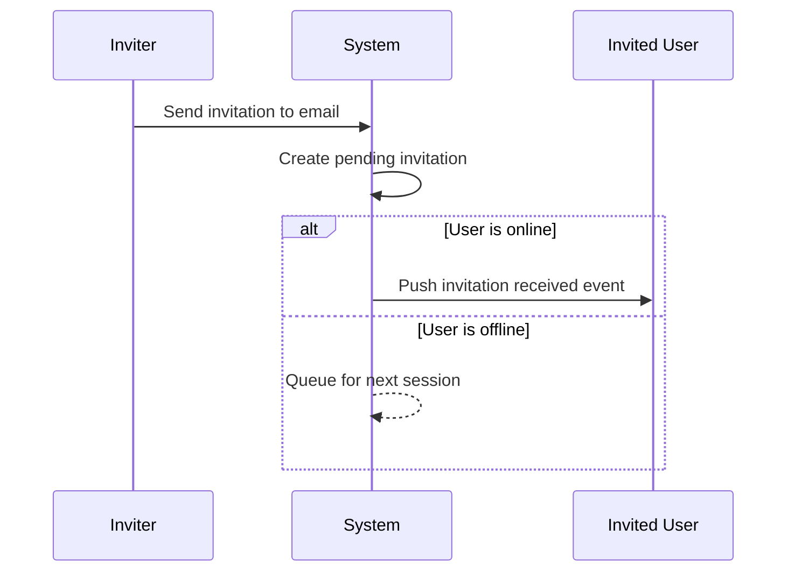

### Role Assigned Notification

When an employee's role assignment changes within an organization, the system emits a notification to the affected employee in real-time. This event is triggered when a user with employee management permission modifies the role assigned to an organization member. The notification includes the previous role name, the new role name, and the user who performed the change. The affected employee receives immediate notification of their permission scope change. This enables employees to understand their current capabilities within the organization context. The event is scoped to the organization where the role change occurred.

### Employee Deactivated Alert

When an employee's access to an organization is suspended through deactivation, the system sends an alert to the affected employee in real-time. This event is triggered when a user with employee management permission changes an employee status from active to deactivated. The notification includes the deactivation timestamp and the user who performed the deactivation. The employee is informed that they can no longer log time, submit timesheets, or access organization-specific features. This alert provides immediate awareness of access revocation. The event ensures the employee understands their account status change without attempting prohibited actions.

### Employee Reactivated Confirmation

When a previously deactivated employee is restored to active status, the system sends a confirmation notification to the affected employee in real-time. This event is triggered when a user with employee management permission changes an employee status from deactivated to active. The notification includes the reactivation timestamp and the user who performed the reactivation. The employee is informed that their access has been restored and they can resume normal activities including time logging and timesheet submission. This confirmation ensures the employee is aware that their permissions have been reinstated.

### Department Transfer Completed

When an employee is transferred from one department to another, the system emits a notification to the affected employee in real-time. This event is triggered when a user with employee management permission modifies the department assignment of an organization member. The notification includes the previous department name if applicable, the new department name, and the user who performed the transfer. The employee receives immediate confirmation of their organizational unit reassignment. This notification ensures employees are aware of their current departmental alignment for reporting and organizational structure clarity.

### Employment Type Changed

When an employee's employment type classification changes, the system sends a notification to the affected employee in real-time. This event is triggered when a user with employee management permission modifies the employment type field of an employee record. Valid employment type values include full-time, part-time, contractor, and intern. The notification includes the previous employment type, the new employment type, and the user who made the change. This communication ensures employees are informed of their classification status changes which may affect their working arrangements or contractual terms.

### Position Title Updated

When an employee's position or title is modified, the system emits a notification to the affected employee in real-time. This event is triggered when a user with employee management permission updates the position field of an employee record. The notification includes the previous position title if applicable, the new position title, and the user who performed the update. This notification ensures employees are immediately aware of their role designation changes within the organization hierarchy. The event supports organizational transparency regarding career progression and role assignments.

### Organization Member Added

When a new member is successfully added to an organization, the system broadcasts a notification to relevant parties in real-time. This event is triggered when a pending invitation is accepted or when an existing user is directly added to an organization. For the newly added member, this serves as a confirmation of their successful enrollment. For organization administrators and managers, this event provides awareness of team composition changes. The notification includes the new member display name, the assigned role, and the timestamp of addition. This event supports organizational awareness of membership changes.

### Employee Status Changed

When an employee's status undergoes any change, the system emits a comprehensive status changed event to the affected employee in real-time. This event encompasses transitions between active and deactivated states. The notification includes the previous status value, the new status value, the user who initiated the change, and the timestamp of the status transition. This event serves as a general-purpose notification for any employee status modification, ensuring employees remain informed of their current standing within the organization. The event payload provides complete context for the status change.

## Role Events

Custom role creation events notify organization owners when new permission sets are established. Role permission modifications are communicated to all users assigned to that role, informing them of changed access capabilities. Role deletion events notify affected users when a custom role is removed, requiring role reassignment. Built-in role protection events inform owners when attempts are made to modify system-protected roles. Permission grant events communicate when specific capabilities are added to a role.

### Custom Role Creation Events

When a custom role is created with a specific permission set, the system notifies all organization owners about the new role availability. This event communicates that a new permission configuration has been established in the organization. The notification includes the role name, the permission set assigned, and the user who created the role. Organization owners receive this notification to stay informed about administrative changes to the organization's access control structure.

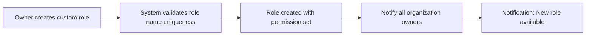

### Role Permission Modification Events

When permissions are modified on an existing custom role, the system communicates these changes to all employees currently assigned to that role. This notification informs affected users about changes to their access capabilities within the organization. The event payload includes the role name, the list of added permissions, the list of removed permissions, and the effective timestamp of the change. Employees receiving this notification can understand what system capabilities they have gained or lost.

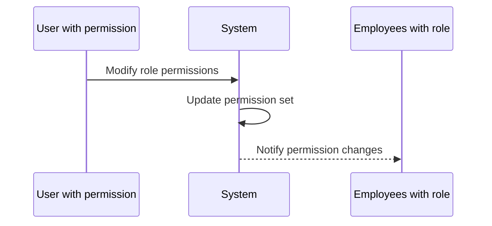

### Role Deletion Notification Events

When a custom role is deleted from the organization, the system notifies all users who were assigned to that role and all organization owners. The notification informs affected employees that their role has been removed and provides guidance on contacting an administrator for reassignment. The system requires all employees previously assigned to the deleted role to receive new role assignments before they can continue normal operations. The event payload includes the deleted role name, the list of affected employees, and a requirement indicator for reassignment.

### Built-in Role Protection Events

When an attempt is made to modify or delete a built-in role (Owner, Manager, or Employee), the system blocks the operation and notifies the requesting user that these roles are system-protected. The notification explains that built-in roles cannot be deleted or renamed, and their core permission sets cannot be modified. Organization owners are informed through system messages when such protection mechanisms are triggered, ensuring transparency about immutable system roles.

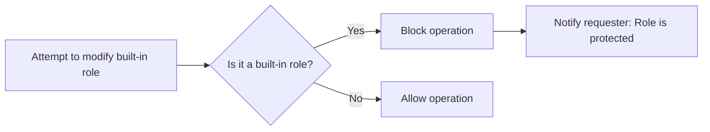

### Permission Grant Alert Events

When specific permissions are granted to a role (either custom or as part of permission set updates), the system generates an alert to employees who have that role assigned. This notification focuses on newly granted capabilities, informing users about additional system functions they can now access. The alert includes the permission names, a description of what each permission enables, and the role to which it was granted. This ensures transparency when expanding user capabilities through permission assignment.

### Employee Role Assignment Events

When a role is assigned to an employee, the system sends a notification to that employee informing them of their new organizational role and associated permissions. The notification includes the role name, a summary of key permissions included in that role, and when the assignment became effective. The employee receives this notification to understand their current access level within the organization and what operations they are authorized to perform.

### Role Reassignment Required Events

When role reassignment is required (such as when a custom role is deleted or an employee's responsibilities change), the system creates a reassignment workflow. The appropriate user with employee management permissions is notified that one or more employees need new role assignments. The system provides a list of affected employees and their previous role, requesting action to assign new roles. Until reassignment is completed, affected employees may have restricted access to system features.

### Permission Set Update Events

When a role's complete permission set is updated (through bulk permission changes), the system sends an update notification to all relevant stakeholders. Organization owners are notified of the permission set change to maintain administrative awareness. Employees assigned to the updated role receive notification of their changed capabilities. The notification includes a summary of the updated permission set, highlighting what has changed from the previous configuration.

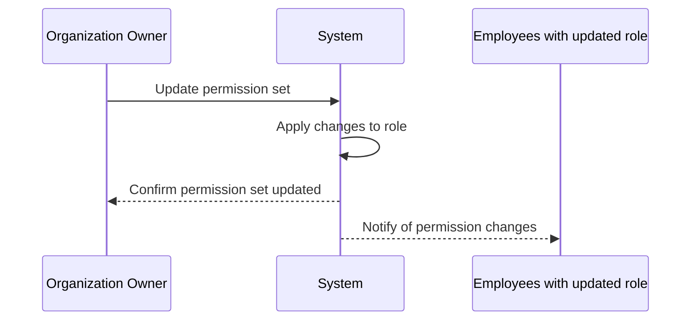

## Department Events

Department creation events notify users with appropriate permissions when new organizational units are established. Department hierarchy changes inform users when parent-child relationships between departments are modified. Department deletion events communicate when departments are removed, triggering automatic nullification of employee department associations. Department description updates are broadcast to inform users of organizational unit detail changes.

### Department Created Notification

When a department is created, the system notifies users who have appropriate permissions within the organization. Users who can manage departments (holding `org:manage` permission) receive a real-time notification when a new organizational unit is established. The notification includes the department name and identifying details of the user who created it.

The creation event provides recipients with immediate awareness of the organization's structural changes. Users who receive this notification can review the new department's configuration and proceed with assigning employees to it.

**Notification Flow**

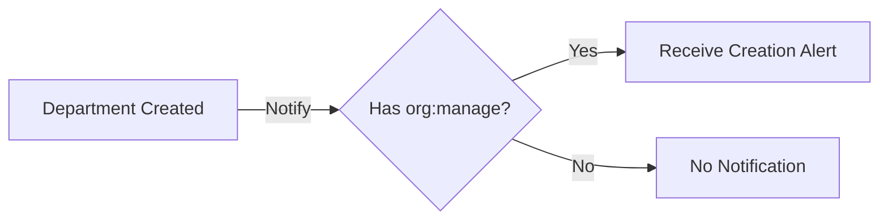

### Department Hierarchy Changed

When the parent-child relationship between departments is modified, the system notifies users who have department hierarchy viewing capabilities. This includes scenarios where:
- A department is assigned a parent department
- A department's parent assignment is removed (becomes top-level)
- A department is reassigned to a different parent department

Users holding `org:manage` permission receive real-time notifications of hierarchy changes. The notification indicates which department's parent relationship changed and the nature of the change (assigned to parent, removed from parent, or changed parent).

When parent departments are assigned, the system ensures only one level of nesting is supported. The notification reflects the updated hierarchical position of the affected department.

**Hierarchy Change Flow**

```mermaid
flowchart LR
    A["Parent Assignment Modified"] -->|"Trigger"| B["Hierarchy Change Event"]
    B -->|"Notify"| C["Users with org:manage"]
    C -->|"View"| D["Updated Department Structure"]
```

### Department Deleted Alert and Employee Department Cleared

When a department is deleted, the system broadcasts an alert to users who manage organizational structure. The deletion event communicates that the department has been removed from the organization.

As a direct consequence of department deletion, all employees previously assigned to that department have their department association automatically cleared (set to null). This cascading effect is communicated as part of the deletion alert or through a related employee update notification.

Users with `org:manage` permission receive the department deletion alert. The notification includes the department name that was removed and confirmation of the deletion completion.

Employees who had their department assignment cleared may receive separate notification depending on the organization's notification policies.

**Deletion and Cascade Flow**

```mermaid
flowchart LR
    A["Department Deleted"] -->|"Trigger Alert"| B["org:manage Users Notified"]
    A -->|"Cascade"| C["Employee Department Cleared"]
    C -->|"Update"| D["Employee Records Updated"]
```

### Department Description Updated and Organizational Unit Modified

When a department's descriptive details are modified, the system notifies appropriate users of the organizational unit changes. This includes updates to:
- Department name
- Department description
- Any other modifiable department attributes

Users with `org:manage` permission receive real-time notifications when any department's descriptive information changes. The notification identifies which department was modified and what type of change occurred.

Department description updates are broadcast to ensure organizational directory information remains current across the system. These events help maintain data consistency for users who reference department information in their workflows.

The notification does not include the full content of the change (such as the new description text) but signals that a review of the department details may be warranted.

## Contract Events

New contract creation events notify employees when their employment terms are updated, automatically ending previous active contracts. Contract end date modifications inform employees when ongoing contracts are scheduled to conclude. Pay rate change events communicate updates to compensation terms for hourly, daily, weekly, or monthly arrangements. Working hours modification events notify employees when their weekly hour requirements change. Active contract replacement events inform employees when superseding contracts take effect.

### New Contract Created

When a new contract is created for an employee, the system notifies the employee that their employment terms have been updated. The notification includes the contract start date, pay rate, pay period frequency, and working hours per week. If a previous contract existed, the employee is additionally informed that their previous contract has been automatically ended.

The following flowchart illustrates the new contract event flow:

```mermaid
flowchart LR
    A["Contract Creation Request"] --> B{"Previous Active<br/>Contract Exists?"}
    B -->|"Yes"| C["End Previous Contract<br/>(End Date = Start Date - 1 Day)"]
    B -->|"No"| D["Create New Contract"]
    C --> D
    D --> E["Notify Employee:<br/>New Contract Created"]
    C --> F["Notify Employee:<br/>Previous Contract Ended"]
```

**Event Payload:** The notification contains the new contract effective date, compensation details including monetary amount and payment frequency, weekly hour requirements, and optional notes from the employer.

**Timing:** The notification is sent immediately upon successful contract creation, ensuring the employee is promptly informed of their updated employment terms.

**Recipients:** Only the employee to whom the contract belongs receives the notification. Other organization members do not receive this event.

### Contract Ended Automatically

When a new contract is created for an employee who already has an active contract, the system automatically terminates the previous contract by setting its end date. The employee receives a notification that their previous employment terms have concluded.

**Automatic Termination Rules:**
- The previous contract's end date is set to the day before the new contract's start date
- Only one contract can remain active at any time for a given employee
- Historical contracts are preserved and cannot be modified after termination

**Event Triggers:**
- When management creates a replacement contract for an existing employee
- When an employee's employment terms are being updated with new conditions
- When a contract type conversion occurs (e.g., from intern to full-time)

**Employee Notification:** The employee is informed that their previous contract has ended and their new contract terms are now in effect. The notification includes the effective end date of the previous contract for their records.

### Pay Rate Updated

When the pay rate of an employee's active contract is modified, the system notifies the employee of the compensation update. The notification communicates the updated monetary amount and the payment period (hourly, daily, weekly, or monthly) to which it applies.

**Pay Rate Modification Scenarios:**
- Salary increases or decreases as approved by management
- Pay period conversion (e.g., transitioning from hourly to salaried)
- Correction of previously entered incorrect pay rate information
- Adjustment reflecting promotion or role change

**Notification Content:**
- Previous pay rate amount (for employee reference)
- New pay rate amount
- Pay period frequency (hourly, daily, weekly, monthly)
- Effective date of the change
- Optional explanatory notes from management

**Restriction:** Only the currently active contract's pay rate can be modified. Past contracts remain immutable as historical records and cannot be edited.

### Working Hours Modified

When the working hours requirement per week is modified on an employee's active contract, the system notifies the employee of the schedule change. The notification clarifies the new weekly hour expectation and when the change takes effect.

**Working Hours Modification Scenarios:**
- Transition between full-time and part-time status
- Seasonal adjustment of weekly hour requirements
- Correction of previously entered incorrect hour information
- Adaptation to new organizational policies

**Notification Content:**
- Previous weekly hour requirement
- New weekly hour requirement
- Effective date of the change
- Contextual information if provided by management

**Impact on Time Tracking:** Employees may need to adjust their time logging expectations based on the new weekly hour requirements. This change may affect timesheet approval workflows and reporting calculations.

**Immutable History:** Past contracts cannot have their working hours modified, preserving the historical record of what was expected during each employment period.

### Contract Start Date Set

When a contract start date is established or modified on an employee's active contract, the system may notify the employee depending on organizational notification preferences. The start date marks when employment terms take effect and compensation calculations begin.

**Start Date Event Scenarios:**
- New employee onboarding with initial contract activation
- Future-dated contract where start date is approaching
- Modification of existing start date due to administrative corrections
- Contract renewal with new effective date

**Notification Triggers:**
- Immediate notification when start date is set or changed
- Optional reminder notification when the start date approaches (if scheduled in advance)

**Event Content:**
- Contract start date
- Pay rate effective from this date
- Working hours effective from this date
- Associated employment type classification

**Relationship to Contract Ending:** Setting a new contract start date automatically triggers the end date calculation for any previous active contract, ensuring no date overlap occurs between employment term records.

### Contract End Date Scheduled

When an end date is scheduled on an employee's active contract (converting an ongoing contract to fixed-term), the system notifies the employee of the planned conclusion of their current employment terms. If the end date is modified on an existing fixed-term contract, the employee is similarly informed of the new scheduled end date.

**End Date Scheduling Scenarios:**
- Conversion from ongoing employment to fixed-term contract
- Extension of an existing fixed-term contract
- Early termination scheduling
- Administrative correction of end date information

**Notification Content:**
- Scheduled contract end date
- Remaining duration until contract conclusion
- Whether this represents a contract extension, reduction, or initial scheduling
- Any accompanying notes about the employment conclusion

**Null End Date Removal:** When an end date is removed from a contract (converting from fixed-term to ongoing), the employee is notified that their employment is now continuous without a scheduled end date.

**Future Planning:** Employees can use this information for personal career planning, knowing when their current employment terms are scheduled to conclude or continue indefinitely.

### Employment Terms Updated

When any aspect of an employee's employment terms is updated—including pay rate, working hours, pay period, or contract dates—the system aggregates these changes and notifies the employee that their overall employment terms have been modified. This serves as a comprehensive summary notification when multiple aspects change simultaneously.

**Comprehensive Update Scenarios:**
- Complete contract replacement with new terms
- Simultaneous adjustment of compensation and working hours
- Promotion with new role, pay, and hour requirements
- Department transfer with associated employment term changes

**Summary Notification Content:**
- Complete set of current employment terms after modifications
- Reference to previous terms for comparison
- List of specific fields that were modified
- Effective date for the new terms
- Historical timeline of recent contract changes

**Audit Trail:** This event is also recorded in the activity log for organizational compliance and record-keeping purposes, documenting who made the changes and when they occurred.

**Employee Acknowledgment:** While the system sends automatic notifications, employees may be required to acknowledge receipt of significant employment term changes depending on organizational policies.

### Contract History Recorded

Each time a contract is created, modified, or automatically ended, a record is added to the employee's contract history. When new historical entries are recorded, relevant authorized users may receive notifications depending on the organization's audit and notification settings.

**History Recording Events:**
- New contract creation adds a historical record of active employment
- Contract modification creates a record of previous state
- Automatic contract termination preserves the concluded employment period
- Contract deletion (if permitted) removes the historical entry

**Notification Recipients:**
- The employee always receives notification when their contract history is updated
- Users with employee management permissions may receive notifications for employees they oversee
- Organization owners may receive summary reports of all contract history changes

**Historical Record Content:**
- Contract effective period (start and end dates)
- Pay rate and pay period at the time
- Working hours requirement
- Employment type classification
- Timestamp of when the record was created or modified

**Immutability Guarantee:** Once a contract becomes historical (is no longer the active contract), its record cannot be modified or deleted, ensuring a reliable employment history for both the organization and the employee. When history is viewed, employees see their complete employment timeline with all terms that were in effect during each period.

## Project Events

Project creation events inform users with project viewing permissions when new work initiatives are established. Project status changes communicate when projects transition between active, archived, or completed states. Budget hour allocation updates notify stakeholders when project resource planning estimates are modified. Project archiving events inform assigned members that no new timelogs can be recorded against the project. Project completion confirmations signal successful conclusion of work initiatives. Project deletion events notify affected users when projects without associated timelogs are permanently removed.

### Project Creation Notification

Users with `project:view` permission can subscribe to receive real-time notifications when new projects are created within their organization.

WHEN a project is created, THE system SHALL broadcast a project creation event notification to all subscribed users with `project:view` permission within the organization.

The project creation event SHALL include:
- The project name
- The project description
- The color code assigned to the project
- The initial status of the project
- The user who created the project
- The timestamp when the project was created
- Optional start and end dates if specified
- Optional budget hours if specified

Event-driven: WHEN a user creates a project, THE system SHALL notify all subscribed users with viewing permissions within 500ms of the successful creation.

Users SHALL be able to subscribe to these events per-organization, and the subscription SHALL be scoped to the currently selected organization context.

If a user does not have `project:view` permission for the organization, THE system SHALL NOT send project creation notifications to that user.

Multiple users creating projects simultaneously SHALL result in individual event broadcasts for each creation.

This enables team members to immediately become aware of new work initiatives without requiring manual refresh or polling of the project list.

### Project Status Change Notifications

Users with `project:view` permission can subscribe to receive real-time notifications when a project's status changes.

WHEN a project's status transitions between active, archived, or completed, THE system SHALL broadcast a status change event to all subscribed users with viewing permissions.

The project status change event SHALL include:
- The project name and identifier
- The old status value
- The new status value
- The user who initiated the status change
- The timestamp of the change
- Description if provided during the change

WHEN a project transitions to archived status, THE system SHALL broadcast an archiving alert to subscribed users.

The project archived alert SHALL indicate:
- The project is now archived
- New timelogs cannot be recorded against this project
- Existing timelogs remain preserved

WHEN a project transitions to completed status, THE system SHALL broadcast a completion confirmation to subscribed users.

The project completed confirmation SHALL indicate:
- The project work has been successfully concluded
- The project is marked as completed
- Final status and any completion notes

State-driven: WHILE a project is in archived or completed status, THE system SHALL NOT broadcast new timelog event notifications for that project.

Users SHALL receive notifications regardless of whether they are project members or not, provided they have `project:view` permission.

This ensures stakeholders are immediately informed when projects become unavailable for time tracking or when work initiatives conclude.

### Project Deletion Warning

Users with `project:view` permission can subscribe to receive real-time notifications when a project is deleted.

WHEN a project is permanently deleted, THE system SHALL broadcast a project deletion warning to all subscribed users with viewing permissions.

The project deleted warning SHALL include:
- The project name that was deleted
- The user who performed the deletion
- The timestamp of deletion
- A warning that all associated project data (tasks, memberships) is permanently removed
- Note that timelogs are NOT deleted when a project is deleted (timelogs preserve project reference)

Event-driven: WHEN a project is deleted, THE system SHALL send the deletion notification within 500ms of the successful deletion.

The deletion warning SHALL only be sent if the project met the deletion criteria (no associated timelogs).

If a deletion is rejected due to associated timelogs, THE system SHALL NOT broadcast a deletion event; instead, the user attempting deletion SHALL receive an error response.

Subscribed users SHALL receive the deletion warning even if they were project members, allowing them to be aware that the project no longer exists.

This ensures team members are informed when work initiatives are permanently removed, preventing confusion when previously accessible projects are no longer available.

### Project Attribute Modification Notifications

Users with `project:view` permission can subscribe to receive real-time notifications when project attributes are modified.

### Budget Hours Update
WHEN budget hours for a project are added, modified, or removed, THE system SHALL broadcast a budget hours updated event to subscribed users.

The budget hours update event SHALL include:
- The project name
- The previous budget hours value (if any)
- The new budget hours value (if any)
- The user who made the change
- The timestamp of the modification
- Calculated percentage of budget consumed (based on actual logged hours)

### Color Code Modification
WHEN a project's color code is changed, THE system SHALL broadcast a project color code change event to subscribed users.

The color code change event SHALL include:
- The project name
- The previous color code
- The new color code
- The user who made the change
- The timestamp of the modification

### Date Range Modifications
WHEN a project's start date, end date, or both are modified, THE system SHALL broadcast a project date range modified event to subscribed users.

The date range modification event SHALL include:
- The project name
- The previous start date (if any)
- The new start date (if any)
- The previous end date (if any)
- The new end date (if any)
- The user who made the change
- The timestamp of the modification

If a project description, name, or other editable fields are changed, THE system SHALL similarly broadcast attribute change notifications to subscribed users.

All attribute change events SHALL be scoped to the organization and only sent to users with `project:view` permission.

These notifications ensure team members are aware of changes to project planning parameters, budget expectations, visual identifiers, or scheduling constraints.

## ProjectMember Events

Project assignment events notify employees when they are added to a new project team. Project removal events inform employees when their assignment to a project is terminated. Project role elevation events communicate when employees are promoted from team member to project lead status. Project lead assignment events notify users when they receive task management responsibilities within a project. Team composition changes inform project leads when new members join their project.

### Project Member Added Event

The system emits a "project member added" event when a user with project management permission assigns an employee to a project.

**Event Payload:**
- The assigned employee's identifier
- The project identifier where the employee was assigned
- The assigned project role (member or project-lead)
- The user who performed the assignment
- The timestamp of the assignment

**Event Recipients:**
- The newly assigned employee receives this event to notify them of their project assignment
- Project leads for the affected project receive this event to inform them of new team members
- Users with permission to view all projects receive this event

**Purpose:**
This event ensures that employees are immediately notified when they gain access to a new project, enabling them to begin logging time and viewing project tasks without delay.

```mermaid
flowchart LR
    A["Assign Employee to Project"] --> B["Create Project Membership"] --> C["Emit 'project member added' Event"] --> D["Notify Assigned Employee"] --> E["Notify Project Leads"]
```

### Project Member Removed Event

The system emits a "project member removed" event when a user with project management permission removes an employee's assignment from a project.

**Event Payload:**
- The removed employee's identifier
- The project identifier from which the employee was removed
- The employee's previous project role at time of removal
- The user who performed the removal
- The timestamp of the removal

**Event Recipients:**
- The removed employee receives this event to notify them that they no longer have access to the project
- Project leads for the affected project receive this event to inform them of team composition changes
- Users with permission to view all projects receive this event

**Behavior Notes:**
Removing a project member does not delete or affect any existing timelogs created by that employee for the project. Historical time tracking data is preserved for reporting purposes.

```mermaid
flowchart LR
    A["Remove Employee from Project"] --> B["Delete Project Membership"] --> C["Emit 'project member removed' Event"] --> D["Notify Removed Employee"] --> E["Notify Project Leads"]
```

### Promoted to Project Lead Event

The system emits a "promoted to project lead" event when an employee's project role is changed from "member" to "project-lead" status.

**Event Payload:**
- The promoted employee's identifier
- The project identifier where the promotion occurred
- The previous role (member)
- The new role (project-lead)
- The user who performed the promotion
- The timestamp of the promotion

**Event Recipients:**
- The promoted employee receives this event to notify them of their new task management responsibilities
- Other project leads for the affected project receive this event
- Users with permission to view all projects receive this event

**Privileges Conferred:**
Upon receiving this event, the promoted employee gains the ability to create, edit, and manage tasks within the project, including assigning tasks to other project members and changing task status.

```mermaid
flowchart LR
    A["Change Member Role to Project-Lead"] --> B["Update Project Membership"] --> C["Emit 'promoted to project lead' Event"] --> D["Notify Promoted Employee"]
```

### Project Role Changed Event

The system emits a "project role changed" event when an employee's role within a project is modified. This includes promotions to project lead, demotions from project lead to member, or any other role transitions.

**Event Payload:**
- The affected employee's identifier
- The project identifier where the role change occurred
- The previous project role
- The new project role
- The user who performed the role change
- The timestamp of the change

**Event Recipients:**
- The affected employee receives this event to inform them of their updated responsibilities
- Project leads for the affected project receive this event
- Users with permission to view all projects receive this event

**Distinction from "Promoted to Project Lead":**
While "promoted to project lead" specifically handles elevation to leadership status, this event covers all role transitions including demotions or lateral role changes within the project hierarchy.

```mermaid
flowchart LR
    A["Modify Project Member Role"] --> B["Update Project Membership Role"] --> C["Emit 'project role changed' Event"] --> D["Notify Affected Employee"] --> E["Notify Project Leads"]
```

### Team Composition Updated Event

The system emits a "team composition updated" event whenever the membership of a project team changes, including additions, removals, or role modifications of any team member.

**Event Payload:**
- The project identifier whose team composition changed
- The type of change (member added, member removed, role modified)
- The affected employee's identifier
- The current total count of project members
- The list of current project leads
- The timestamp of the composition change

**Event Recipients:**
- All current project members receive this event to maintain awareness of their team composition
- Project leads receive this event to track their team's makeup
- Users with permission to view all projects receive this event

**Purpose:**
This event provides a holistic notification mechanism that keeps all stakeholders informed about team dynamics, enabling project leads to effectively manage resource allocation and workload distribution.

```mermaid
flowchart LR
    A["Any Team Membership Change"] --> B["Process Change"] --> C["Emit 'team composition updated' Event"] --> D["Broadcast to All Project Members"]
```

### Project Assignment Received Event

The system emits a "project assignment received" event to notify an employee when they have been added to a new project team.

**Event Payload:**
- The receiving employee's identifier
- The project identifier they were assigned to
- The project name and color code (for UI display)
- The assigned project role (member or project-lead)
- The user who assigned them
- The timestamp of the assignment

**Event Recipients:**
- The assigned employee is the primary recipient of this event

**Purpose:**
This event serves as a direct notification to employees about their new project involvement, distinct from general project member notifications. It enables immediate UI updates in the employee's dashboard showing the new project in their available projects list.

**Related Events:**
This event typically fires concurrently with "project member added" but targets specifically the assigned employee for personal dashboard updates.

```mermaid
sequenceDiagram
    participant U as User with Permission
    participant S as System
    participant E as Assigned Employee
    U->>S: Assign employee to project
    S->>S: Create membership
    S-->>E: Emit 'project assignment received'
    E->>E: Update dashboard with new project
```

### Project Lead Assigned Event

The system emits a "project lead assigned" event when an employee receives project-lead responsibilities, whether through initial assignment with lead role or through subsequent promotion.

**Event Payload:**
- The assigned project lead's employee identifier
- The project identifier where they received lead status
- The project name and color code
- Whether the assignment was initial (new member as lead) or promotion (existing member elevated)
- The user who performed the assignment
- The timestamp of the assignment

**Event Recipients:**
- The newly assigned project lead receives this event
- Other existing project leads for the project receive this event
- Users with permission to view all projects receive this event

**Privileges Activated:**
This event signals that the recipient now has task management privileges within the project, including creating tasks, editing tasks, changing task status, and assigning tasks to project members.

```mermaid
flowchart LR
    A["Assign Project-Lead Role"] --> B["Create or Update Membership"] --> C["Emit 'project lead assigned' Event"] --> D["Notify New Project Lead"] --> E["Notify Other Project Leads"]
```

## Task Events

Task creation events notify project members when new work items are added to projects they are assigned to. Task assignment events inform employees when tasks are delegated to them personally. Task status progression events communicate when tasks move through open, in-progress, completed, and closed states. Priority escalation events notify assignees when task urgency is elevated to high or urgent levels. Due date modification events inform affected users when task deadlines are adjusted. Subtask creation events notify parent task assignees when child tasks are established.

### Task Creation Notification


When a new task is created within a project, the system notifies all project members about the new work item.

The notification is triggered immediately after a project lead or a user with appropriate permissions successfully creates a task.
The system identifies all project members assigned to the parent project, including both regular members and project leads.
The notification includes the task title, the name of the person who created it, the project name, and the timestamp of creation.

The notification is sent to all project members except the person who created the task.


### Task Assignment Notification


When a task is assigned to a specific employee, the system notifies that employee about the new assignment.

The notification is triggered when a project lead or a user with appropriate permissions sets or changes the assigned employee field on a task.
The system sends the notification to the employee who was just assigned to the task.
The notification includes the task title, the project name, the name of the person who made the assignment, the priority level of the task, and the due date if one is set.
The employee receives the notification only if they are a member of the project.
If the assignment is changed from one employee to another, only the newly assigned employee receives the notification.


### Task Status Change Notification


When a task status changes, the system notifies relevant project members about the status progression.

The notification is triggered whenever a task moves between any of the following statuses: open, in-progress, completed, or closed.
For status changes to "completed", all project members receive a notification indicating the task has been finished.
For status changes to "closed", all project members receive a notification indicating the task has been closed.
For status changes to "in-progress" or "open", only the assigned employee and project leads receive the notification.
The notification includes the task title, the previous status, the new status, who made the change, and the timestamp.
When a task transitions to "completed" status and has an assigned employee, a confirmation notification is sent to the assignee acknowledging their work completion.


### Task Priority Escalation Notification


When a task priority is elevated to "high" or "urgent", the system notifies the assigned employee about the urgency increase.

The notification is triggered when a project lead or a user with appropriate permissions changes a task's priority from "low" or "medium" to either "high" or "urgent".
The system sends the notification to the currently assigned employee for that task.
The notification includes the task title, the previous priority level, the new priority level, and who made the change.
The system also notifies project leads when any task in their project receives a priority escalation.
Priority escalation notifications are sent immediately to ensure timely awareness of urgent work items.


### Task Due Date Modification Notification


When a task due date is modified, the system notifies affected users about the deadline adjustment.

The notification is triggered when a project lead or a user with appropriate permissions adds, changes, or removes a due date on a task.
The system sends the notification to the assigned employee if one exists.
If the due date is moved earlier (deadline shortened), the notification is marked with higher urgency.
The notification includes the task title, the previous due date if any, the new due date, and who made the change.
Project leads also receive notification when due dates are modified on tasks within their projects.
When a due date is removed entirely, the notification indicates that the deadline has been cleared.


### Subtask Creation Notification


When a subtask is created under a parent task, the system notifies the parent task assignee about the new child task.

The notification is triggered when a project lead or a user with appropriate permissions creates a task with a parent task reference (one level of nesting only).
The system sends the notification to the employee assigned to the parent task, if one exists.
The notification includes the subtask title, the parent task title, the project name, and who created the subtask.
If the subtask is immediately assigned to an employee upon creation, that employee also receives an assignment notification.
When a parent task already has subtasks, creating additional subtasks sends notifications for each new subtask individually.


### Task Completion Confirmation


When a task reaches "completed" status, the system sends a completion confirmation to acknowledge the work is finished.

The confirmation is sent to the employee who was assigned to the task when it was marked as completed.
The confirmation includes the task title, the project name, the completion timestamp, and the name of the person who marked it complete.
Project leads receive a summary notification when any task in their project is completed, regardless of assignment.
If the completed task has a parent task, the parent task assignee receives a notification indicating a subtask has been completed.
The completion confirmation serves as acknowledgment that the assigned work has been successfully delivered.


### Estimated Hours Updated Notification


When estimated hours are updated on a task, the system notifies affected users about the scope adjustment.

The notification is triggered when a project lead or a user with appropriate permissions adds, increases, or decreases the estimated hours on a task.
The system sends the notification to the assigned employee if one exists.
If the estimated hours are increased significantly (more than 25% increase), the notification highlights the scope expansion.
The notification includes the task title, the previous estimated hours if any, the new estimated hours, and who made the change.
Project leads receive notification when estimated hours are updated on tasks within their projects.
For tasks with parent tasks, updating estimated hours on a subtask does not automatically recalculate or notify about parent task estimates.


## TaskHistory Events

Task status change history events provide audit trail notifications showing transitions between workflow states. Status modification events capture when project leads or authorized users update task progression. Historical status recording events ensure accountability by logging who made status changes and when transitions occurred.

### Task Status Transition Event

When a task status is modified by a project lead or a user with appropriate permissions, the system broadcasts a real-time event to all subscribed clients viewing tasks within the same project. 

The task status transition event includes the task identifier, the previous status value, the new status value, the timestamp when the change occurred, and the user who performed the modification. Clients subscribed to task updates for that project receive the notification immediately.

Subscribers must have permission to view the task to receive the event. Users without project membership or appropriate role assignment do not receive status change notifications for that task.

### Status Change History Recorded Event

When a task status change occurs, the system automatically persists a history entry recording the transition details. Simultaneously, the system emits a real-time notification that a new audit trail entry has been created.

The status change history recorded event contains the task reference, the old status value, the new status value, the identification of the user who made the change, and the exact timestamp of the transition. This event enables real-time audit trail displays and activity monitoring dashboards.

Clients subscribed to task history updates for a specific task receive notifications when new history entries are recorded for that task.

### Workflow State Updated Event

When a task transitions through its workflow, the system broadcasts a workflow state updated event to notify interested parties of the progression change. This event is dispatched after the status change has been validated and persisted.

The workflow state update notification includes the task identifier, the updated status value representing the new workflow state, the name of the workflow stage, and the timestamp when the state change took effect.

Project members who are subscribed to task workflow updates receive these events to stay informed of task progression without requiring manual refresh.

### Task Audit Trail Entry Event

When a task audit trail entry is created, the system generates a real-time event to support live audit dashboards and activity feeds. This event signals that accountability information has been logged.

The task audit trail entry event carries the task reference, the change type (status modification), the actor who performed the action, the timestamp of the action, and a summary of the change details sufficient for audit display purposes.

Users with appropriate viewing permissions who are subscribed to audit notifications receive these events. The event supports compliance monitoring and real-time activity tracking within projects.

### Status Change Timestamp Logged Event

When any task history record is created, including status changes, the system emits a status change timestamp logged event. This event specifically highlights the temporal aspect of the change for time-sensitive monitoring applications.

The event payload includes the task identifier, the recorded timestamp, the type of change that occurred, and the sequence information if multiple changes occur in rapid succession. The timestamp represents when the change was committed to the audit trail.

Clients monitoring task activity timelines receive these events to maintain accurate chronologies of task modifications.

## Timelog Events

Timelog creation events inform employees when time entries are successfully recorded against their account. Timelog modification events notify users when previously logged entries are updated by themselves or administrators with time management permissions. Timelog deletion confirmations communicate when time entries are permanently removed. Billable status change events inform users when the billing classification of their logged time is modified. Project allocation events notify users when their timelogs are reassigned to different projects or tasks.

### Timelog Creation Events

When an employee successfully creates a timelog, the system emits a timelog created confirmation event.
This event notifies the employee that their time entry has been recorded against their account.
The event includes the date of the timelog, the duration logged, the associated project, and any attached task.
When a timer is stopped and automatically converted to a timelog, a timelog created confirmation event is emitted to inform the employee that their time has been logged.
Employees receive timelog created confirmation events only for timelogs they create themselves.
Users with time management permissions who create timelogs on behalf of other employees do not trigger timelog created confirmation events for those employees.

```mermaid
sequenceDiagram
    participant E as Employee
    participant S as System
    participant N as Notification Bus
    E->>S: Create timelog or stop timer
    S->>S: Validate and save timelog
    S->>N: Emit timelog created event
    N-->>E: Receive confirmation notification
```

### Timelog Modification Events

When a timelog is modified, the system emits a timelog modified notification event.
This event notifies the affected employee that one of their time entries has been updated.
The event indicates which attributes of the timelog were changed, such as the description, date, or billable status.
When the billable status of a timelog is changed from billable to non-billable or vice versa, a billable status changed event is emitted as part of the modification notification.
When the duration of a timelog is updated, a time entry duration updated event is emitted to reflect the change in logged hours.
Employees receive modification notifications when they edit their own timelogs.
Employees do not receive modification notifications when their timelogs are part of an approved timesheet, as such timelogs cannot be modified.
Users with time management permissions who modify any employee's timelog trigger timelog modified notification events for the affected employee.

```mermaid
sequenceDiagram
    participant E as Employee
    participant M as Manager
    participant S as System
    participant N as Notification Bus
    M->>S: Modify employee timelog
    S->>S: Validate and update timelog
    S->>N: Emit modification event
    N-->>E: Receive notification
    Note over E: Notified of changes to their timelog
```

### Timelog Deletion Events

When a timelog is permanently removed, the system emits a timelog deleted alert event.
This event confirms to the employee that a time entry has been removed from their record.
Employees receive deletion alerts only for timelogs they delete themselves.
Employees do not receive deletion alerts for timelogs that are part of submitted or approved timesheets, as such timelogs cannot be deleted.
Users with time management permissions who delete any employee's timelog trigger timelog deleted alert events for the affected employee.
The deletion alert indicates the date and project association of the removed timelog so the employee can identify which entry was deleted.

```mermaid
flowchart LR
    A["Employee deletes timelog"] --> B{"Is timesheet approved?"}
    B -->|No| C["Timelog deleted"]
    B -->|Yes| D["Deletion blocked"]
    C --> E["Emit deletion alert"]
    E --> F["Employee notified"]
```

### Project and Task Reassignment Events

When a timelog's project association is changed, the system emits a project allocation modified event.
This event notifies the employee that their logged time has been reassigned to a different project.
When a timelog's task association is updated, the system emits a task assignment updated event.
This event informs the employee that their time entry has been reassigned to a different task within the same or a different project.
Project allocation modified and task assignment updated events are emitted as part of timelog modification notifications.
These events indicate the previous project or task assignment and the new assignment.
Employees receive these events when their own timelogs are reassigned.
Users with time management permissions who reassign timelogs trigger project allocation modified and task assignment updated events for the affected employees.

```mermaid
sequenceDiagram
    participant E as Employee
    participant M as Manager
    participant S as System
    participant N as Notification Bus
    M->>S: Reassign timelog to different project
    S->>S: Update project allocation
    S->>N: Emit project allocation event
    N-->>E: Receive reassignment notification
    Note over E: Informed of project change
```

## Timesheet Events

Timesheet submission events notify managers with approval permissions when employees submit weekly time summaries for review. Timesheet approval events inform employees when their submitted timesheets are accepted, locking included timelogs from further modification. Timesheet rejection events communicate when submissions are returned to draft status with required correction reasons. Draft creation events notify employees when weekly timesheet drafts are auto-generated from their timelogs. Status progression events inform users as timesheets move through draft, submitted, approved, and rejected states.

### Timesheet Subscribed for Approval Event

When an employee submits a draft timesheet for approval, the system publishes a timesheet submission event.

#### Event Trigger
The event is triggered when an employee successfully executes a timesheet submission operation, changing the timesheet status from draft to submitted.

#### Notification Recipients
Users with the timesheet approval permission receive this event notification. The event is scoped to the organization context of the submitting employee.

#### Event Content
The event includes:
- Employee identifier who submitted the timesheet
- Week start date (Monday) of the timesheet
- Week end date (Sunday) of the timesheet
- Total hours in the submission
- Submission timestamp
- Timesheet identifier

#### Diagram
```mermaid
sequenceDiagram
    participant E as Employee
    participant S as System
    participant M as Manager (with approval permission)
    E->>S: Submit timesheet
    S->>S: Validate and update status to submitted
    S-->>M: Timesheet submitted for approval event
```

### Timesheet Approved Confirmation Event

When a user with timesheet approval permission approves a submitted timesheet, the system publishes a timesheet approval confirmation event.

#### Event Trigger
The event is triggered upon successful approval of a submitted timesheet, changing its status from submitted to approved.

#### Notification Recipients
The employee who owns the timesheet receives this event notification. No other organization members receive this notification by default.

#### Event Content
The event includes:
- Timesheet identifier
- Week start and end dates
- Approving user identifier
- Approval timestamp
- Total approved hours
- Status changed to approved

#### Associated Effects
Upon approval (defined in Timelogs Locked on Approval), all timelogs included in the timesheet are locked from further modification or deletion.

### Timesheet Rejected with Reason Event

When a user with timesheet approval permission rejects a submitted timesheet, the system publishes a timesheet rejection event.

#### Event Trigger
The event is triggered upon rejection of a submitted timesheet, changing its status from submitted to rejected and returning it to draft state.

#### Notification Recipients
The employee who owns the timesheet receives this event notification.

#### Event Content
The event includes:
- Timesheet identifier
- Week start and end dates
- Rejecting user identifier
- Rejection timestamp
- Rejection reason (required field from the rejection operation)
- Total hours in the rejected timesheet
- Status changed to rejected

#### Post-Rejection Flow
Following rejection, the employee may modify the timesheet and resubmit it, which triggers the timesheet resubmitted event.

### Draft Timesheet Created Event

The system publishes a draft timesheet creation event when a timesheet is created in draft status.

#### Creation Scenarios
Draft timesheets may be created through:
- Employee-initiated creation for a specific week
- Automatic generation when timelogs exist without a corresponding timesheet for that week

#### Event Trigger
The event fires when a new timesheet record transitions into draft status, either through explicit creation or automatic generation processes.

#### Notification Recipients
The employee who owns the timesheet receives this event notification.

#### Event Content
The event includes:
- Timesheet identifier
- Week start date (Monday)
- Week end date (Sunday)
- Initial total hours (calculated from included timelogs)
- Number of timelogs included
- Creation timestamp

### Timesheet Status Changed Event

The system publishes a timesheet status change event whenever a timesheet transitions between any two states in its lifecycle.

#### Status Lifecycle
The timesheet progresses through the following states:
draft → submitted → approved
         ↓ rejected → draft (cycle repeats)

#### Event Trigger
This event fires for every status transition including:
- Draft to submitted (employee submission)
- Submitted to approved (manager approval)
- Submitted to rejected (manager rejection with reason)
- Rejected to draft (automatic on rejection)
- Draft to submitted (resubmission after rejection)

#### Event Content
The event includes:
- Timesheet identifier
- Previous status
- New status
- User who triggered the change
- Timestamp of change
- Week dates

#### Relationship to Specific Events
This general status change event fires in addition to (or as an alternative to) the more specific events (timesheet submitted for approval, approved confirmation, rejected with reason) depending on implementation scope.

### Timelogs Locked on Approval Event

When a timesheet is approved, the system publishes a timelogs lock event signifying that included time entries are now immutable.

#### Event Trigger
The event fires immediately after a timesheet approval confirmation event, as part of the same approval transaction.

#### Lock Scope
The lock applies to all timelogs that are included in the approved timesheet:
- Timelogs lose edit capability
- Timelogs lose delete capability
- Timelogs remain visible and reportable

#### Event Content
The event includes:
- Timesheet identifier
- Total number of timelogs locked
- List of affected timelog identifiers (optional)
- Approval timestamp
- Week dates

#### Notification Recipients
This event may be received by:
- The employee owning the timesheet (to confirm their time entries are now locked)
- Users with time management permission (for audit purposes)

#### Diagram
```mermaid
flowchart LR
    A["Timesheet Submitted"] -->|"Approve"| B["Timesheet Approved"]
    B -->|"Trigger"| C["Timelogs Lock Event"]
    C -->|"Result"| D["Timelogs Locked"]```

### Weekly Timesheet Generated Event

The system publishes a weekly timesheet generation event when an automated process creates a timesheet covering a weekly period.

#### Generation Triggers
Weekly timesheets may be auto-generated when:
- An employee logs time for a week that has no existing timesheet record
- A scheduled process creates draft timesheets for active employees at week boundaries
- The first timelog is created for a week

#### Weekly Period Definition
The timesheet covers a Monday-to-Sunday period. The week start date is always a Monday, and the week end date is always the following Sunday.

#### Event Content
The event includes:
- Timesheet identifier
- Week start date (Monday)
- Week end date (Sunday)
- Employee identifier
- Total hours at generation time
- Number of timelogs included
- Generation timestamp
- Indicate if auto-generated or employee-initiated

#### Relationship to Draft Creation
This event is a specialized form of the draft timesheet created event, specifically indicating automated weekly aggregation behavior.

### Timesheet Resubmitted Event

When an employee resubmits a timesheet that was previously rejected, the system publishes a timesheet resubmission event.

#### Event Trigger
The event fires when a timesheet in rejected status is submitted again, transitioning its status from rejected back to submitted.

#### Prerequisites for Resubmission
A resubmission event can only fire when:
- The timesheet was previously in rejected status
- The employee has modified the timesheet contents (or is resubmitting unchanged)
- No other timesheet for the same week is in submitted or approved status

#### Event Content
The event includes:
- Timesheet identifier
- Week start and end dates
- Resubmission timestamp
- Previous rejection timestamp
- Previous rejecting user
- New total hours
- Status changed from rejected to submitted

#### Notification Recipients
Users with timesheet approval permission receive this event, enabling them to review and approve the resubmitted timesheet.

### Pending Timesheet Alert Event

The system publishes pending timesheet alert events to notify users of timesheets requiring attention.

#### Alert Types
Two categories of pending alerts exist:

**For Managers (with approval permission):**
Alert fires when timesheets are awaiting approval. This includes new submissions and resubmissions that require review action.

**For Employees:**
Alert fires when:
- A draft timesheet exists but has not been submitted for the current week
- The week is nearing its end with unsubmitted hours
- A previously rejected timesheet remains in draft status awaiting corrections

#### Event Content
The event includes:
- Alert type (manager-pending-approvals or employee-pending-submission)
- Number of timesheets pending
- Week reference if applicable
- Timestamp of alert generation
- Recipient identifier

#### Delivery Timing
Pending alerts may be delivered:
- Immediately upon status change (real-time)
- Periodically (digest of pending items)
- Triggered by scheduled checks (end of week reminders)

#### Digest Mode
In periodic digest mode, the event aggregates all pending timesheets for the recipient rather than individual per-timesheet events.

## Timer Events

Timer start events notify employees when real-time tracking begins for a new work session. Timer stop events communicate when running timers are stopped and converted into completed timelogs. Timer discard events inform users when active timers are abandoned without creating time entries. Running timer update events provide ongoing status for currently active time tracking sessions. Project association events notify users when running timers are linked to specific projects or tasks.

### Timer Start Notification and Live Tracking Activation

When an employee starts a new timer, the system emits a timer start event that confirms real-time tracking has begun. This notification includes the start timestamp, selected project and optional task assignment, and the initial description. The event signals that live tracking is now active for this employee's session. The start notification is delivered to the employee who initiated the timer, providing confirmation that the tracking session is being recorded.

### Ongoing Timer Status Updates

While a timer is running, the system provides ongoing status updates reflecting the current elapsed duration. These updates include the total time elapsed since the timer started, the active project and task associations, and the current timer description. The status events enable real-time monitoring of active tracking sessions, allowing employees to view their current progress without stopping the timer.

### Timer Stop and Timelog Conversion

When an employee stops their running timer, the system emits a timer stop event indicating the tracking session has ended. Simultaneously, the system converts the timer into a completed timelog entry and emits a conversion confirmation event. The event payload includes the final duration (rounded to the nearest minute), the project and task references, description, and a reference to the created timelog. This confirms that the timer has been saved as a permanent time entry.

### Timer Discard Alert Event

When an employee chooses to discard their active timer without saving, the system emits a timer discard alert. This event confirms that the running timer has been abandoned and no timelog entry has been created. The alert includes the timer's start time and the time it was discarded for record-keeping purposes. The discard notification ensures the employee is aware that the tracked time has not been recorded.

### Timer Project and Task Assignment Events

During an active tracking session, employees may change the project or task associated with their running timer. When this occurs, the system emits a project assignment event notifying the user of the updated association. The event payload contains the previous project and task references, the new project and task references, and the timestamp of the change. This ensures the employee has confirmation of the corrected project linkage for their current time tracking.

### Timer Description Update Events

Employees can modify the description of a running timer while tracking is in progress. When a description is updated, the system emits a description change event that includes the previous description text, the new description text, and the timestamp of the modification. This event ensures the description history is tracked during the live session and confirms the update has been applied to the running timer.

## ActivityLog Events

Activity log entry events notify administrators when significant system actions are recorded for audit purposes. Employee lifecycle events log invitations, deactivations, and reactivations for compliance tracking. Contract modification events capture creation and editing of employment agreements. Project state change events archive creation, archival, completion, and deletion activities. Task workflow events record status transitions for accountability. Timesheet workflow events log submissions, approvals, and rejections. Role assignment events capture permission changes for security auditing.

### Activity Log Entry Events

WHEN a significant action is performed in the system, THE erpHrm system SHALL broadcast an activity logged notification to subscribed administrators.

WHEN an activity is recorded, THE erpHrm system SHALL include the following event payload: timestamp, user who performed the action, action type, target entity type, target entity identifier, and descriptive details.

When an organization admin has `org:manage` permission, THEY SHALL receive real-time notifications for activities within their organization.

The activity logged notification SHALL be categorized by action type for filtering purposes.
When an activity log entry is created, THE erpHrm system SHALL ensure the notification is delivered to all active subscriber sessions for that organization.

### Employee Lifecycle Events

WHEN a user with `employee:manage` permission completes an employee invitation, THE erpHrm system SHALL broadcast an employee invited recorded event.

WHEN an employee is invited, THE erpHrm system SHALL include in the event payload: inviting user identifier, invited email address, role assigned, and invitation timestamp.

WHEN a user with `employee:manage` permission deactivates an employee, THE erpHrm system SHALL broadcast an employee deactivated logged event.

WHEN an employee is deactivated, THE erpHrm system SHALL include in the event payload: deactivating user identifier, deactivated employee identifier, reason if provided, and deactivation timestamp.

WHEN an employee is reactivated, THE erpHrm system SHALL broadcast an employee reactivated logged event with reactivation details.

These employee lifecycle events SHALL be grouped under the EMPLOYEE_LIFECYCLE action type category for compliance tracking purposes.

### Contract Modification Events

WHEN a user with `employee:manage` permission creates a new employment contract, THE erpHrm system SHALL broadcast a contract created audit entry event.

WHEN a contract is created, THE erpHrm system SHALL include in the event payload: creating user identifier, employee identifier, contract start date, pay period, pay rate, working hours per week, and contract creation timestamp.

WHEN a user with `employee:manage` permission edits an active contract, THE erpHrm system SHALL broadcast a contract modified audit entry event.

WHEN a contract is automatically ended due to a new contract creation, THE erpHrm system SHALL broadcast a contract auto-ended audit entry event with both old and new contract identifiers.

These contract modification events SHALL be categorized under the CONTRACT action type for employment history auditing.

### Project State Change Events

WHEN a user with `project:manage` permission creates a project, THE erpHrm system SHALL broadcast a project created logged event.

WHEN a project is created, THE erpHrm system SHALL include in the event payload: creating user identifier, project name, project color code, and creation timestamp.

WHEN a project status changes to archived, THE erpHrm system SHALL broadcast a project archived logged event.

WHEN a project status changes to completed, THE erpHrm system SHALL broadcast a project completed logged event.

WHEN a user with `project:manage` permission deletes a project, THE erpHrm system SHALL broadcast a project deleted logged event.

WHEN a project status changes, THE erpHrm system SHALL include in the event payload: modifying user identifier, old status, new status, and change timestamp.

These project state change events SHALL be categorized under the PROJECT action type for audit purposes.

### Task Workflow Events

WHEN a project lead or user with `project:manage` permission changes a task status, THE erpHrm system SHALL broadcast a task status changed recorded event.

WHEN a task status is modified, THE erpHrm system SHALL include in the event payload: changing user identifier, task identifier, project identifier, old status, new status, and change timestamp.

WHEN a task is created, THE erpHrm system SHALL broadcast a task created logged event with creation details.

WHEN a task is assigned to an employee, THE erpHrm system SHALL broadcast a task assigned logged event.

WHEN a task is marked as completed or closed, THE erpHrm system SHALL include completion timestamp and completion user in the event payload.

These task workflow events SHALL be categorized under the TASK action type for accountability tracking.

### Timesheet Workflow Events

WHEN an employee submits a timesheet for approval, THE erpHrm system SHALL broadcast a timesheet submitted logged event.

WHEN a timesheet is submitted, THE erpHrm system SHALL include in the event payload: submitting employee identifier, week start date, week end date, total hours, and submission timestamp.

WHEN a user with `time:approve` permission approves a timesheet, THE erpHrm system SHALL broadcast a timesheet approved logged event.

WHEN a timesheet is approved, THE erpHrm system SHALL include in the event payload: approving user identifier, timesheet owner identifier, week covered, and approval timestamp.

WHEN a user with `time:approve` permission rejects a timesheet, THE erpHrm system SHALL broadcast a timesheet rejected logged event.

WHEN a timesheet is rejected, THE erpHrm system SHALL include in the event payload: rejecting user identifier, timesheet owner identifier, rejection reason provided, and rejection timestamp.

These timesheet workflow events SHALL be categorized under the TIMESHEET action type for payroll audit purposes.

### Role Assignment Events

WHEN a user with `employee:manage` permission assigns a role to an employee, THE erpHrm system SHALL broadcast a role assigned audit entry event.

WHEN a role assignment is changed, THE erpHrm system SHALL include in the event payload: making user identifier, affected employee identifier, previous role identifier, new role identifier, and change timestamp.

WHEN a user with `org:manage` permission creates a custom role, THE erpHrm system SHALL broadcast a role created logged event.

WHEN a custom role's permissions are modified, THE erpHrm system SHALL broadcast a role permissions modified logged event.

WHEN a user with `org:manage` permission deletes a custom role, THE erpHrm system SHALL broadcast a role deleted logged event.

These role assignment events SHALL be categorized under the ROLE action type for security auditing and permission change tracking.

# File Storage

File upload capabilities, media processing, and storage requirements.

## File Upload and Management

Define file upload capabilities, supported formats, processing requirements, and access control for stored files.

### File Upload Operations

Users can upload files to the system for use as organizational or personal assets.

Organizations support uploading a logo image through the organization settings interface. The logo image represents the organization visually across the platform interface.

Users can upload an avatar image through their profile settings. The avatar image is shared across all organizations the user belongs to and appears in user interfaces throughout the platform.

File uploads are handled through standard file selection interface. The system accepts files submitted by users and processes them for storage.

Uploaded files are associated with either an organization (for logos) or a user account (for avatars). When an organization logo is updated, the previous logo image is replaced. When a user avatar is updated, the previous avatar image is replaced.

Users can remove their avatar image, reverting to a default placeholder. Organization owners can remove the organization logo, reverting to a default placeholder.

If a file upload fails due to network interruption or invalid file format, the upload is rejected and the user must retry.

### Media Processing

The system accepts specific file formats for uploaded media. Logo and avatar images must be in common image formats including JPEG, PNG, and GIF.

Uploaded image files are processed for consistency. The system generates appropriately sized variants for different display contexts. Logo images are processed for display in headers, lists, and detail views. Avatar images are processed for display in user listings, profile views, and small icon contexts.

If the uploaded file exceeds the maximum size limit, the upload is rejected with appropriate feedback. If the uploaded file is not a supported image format, the upload is rejected.

The system validates that uploaded files are valid image files and not corrupted or malicious content. Invalid or corrupted files are rejected without being stored.

Images with transparency are preserved where the format supports it. Color profiles are handled to ensure consistent display across devices.

### Storage Management

Files are stored in persistent cloud storage accessible to the application. Each file receives a unique identifier that serves as its reference within the system.

File storage is organized to separate organizational assets from user personal assets. Organization logo files are stored in organization-scoped storage. User avatar files are stored in user-scoped storage.

Storage references are recorded in the system database to associate files with their owning entities. When an organization logo is uploaded, the storage reference is recorded with the organization record. When a user avatar is uploaded, the storage reference is recorded with the user profile.

Files are retained in storage as long as their associated entity exists. When an organization is deleted, its logo file is removed from storage. When a user account is deleted, the user's avatar files are removed from storage.

Replaced files are removed from storage after the new file is successfully stored and associated. This ensures storage is not consumed by obsolete file versions.

The system maintains file integrity by verifying stored files can be retrieved and displayed correctly.

### File Access Control

File access is controlled based on the visibility requirements of the owning entity.

Organization logo images are accessible to all users who have access to the organization. This includes all members of the organization and may include external contexts where the organization is referenced.

User avatar images are accessible to any user who can view the user's presence in the system. This includes members of shared organizations and contexts where the user is mentioned or referenced.

File access is validated on each retrieval request. Users cannot access files by guessing identifiers or bypassing access controls. File URLs include access tokens or signatures that expire to prevent unauthorized linking.

When an organization becomes inaccessible to a user (due to organization deletion, user removal, or organization switch), the user no longer has access to that organization's logo files. When viewing data from a different organization context, organization-scoped files from the previous context are no longer accessible.

### Attachment Handling

Files function as attachments to primary entities in the system. Logo images attach to organizations. Avatar images attach to user profiles.

Each entity can have at most one attachment of a given type. An organization has exactly one logo attachment. A user has exactly one avatar attachment.

Attachments are mandatory for certain visual representations. If no attachment exists, the system displays a default placeholder image appropriate to the context.

Attachment association is atomic. When a file is uploaded as an attachment, the system either completes both the file storage and the entity association, or neither. Partial states where the file exists but is not associated, or is associated but the file is missing, are not permitted.

Attachment metadata is surfaced in the system. Users can see when an avatar or logo was last updated. File size information may be displayed for management purposes.

Attachment lifecycle follows the owning entity. When an organization is deleted, its logo attachment is removed. When a user account is deleted, all avatar attachments are removed. Attachment deletion is permanent and cannot be undone.