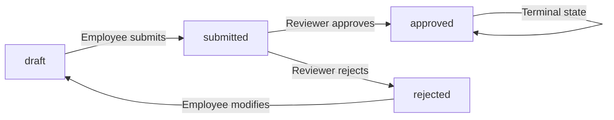

**erpHrm — Business rules, validation constraints, data browsing expectations, error scenarios**

Business rules, validation constraints, data browsing expectations, error scenarios

# Domain Business Rules

Per-concept business rules, validation logic, and domain constraints.

## Organization Rules

Each organization must have a unique name within the system that clearly identifies the tenant. The organization requires a currency designation for financial reporting and payroll calculations. A timezone must be specified to ensure proper date and time display across all features. The fiscal start month determines how financial reports and budgeting periods are calculated throughout the year. The optional description field allows organizations to document their purpose or additional context. An optional logo image can be uploaded for visual identification in the interface. Organization owners can modify these settings at any time to reflect changes in business operations. Deletion of an organization requires verification that no pending timesheets exist and no active employee contracts remain. When deleted, all associated data including employees, projects, tasks, timelogs, and timesheets are permanently removed from the system. The owner account persists but loses all organizational associations upon deletion completion.

### Validation Constraints

Each organization must have a name that is unique across the entire platform. No two organizations can share the same name. The name must clearly identify the tenant and be meaningful within the business context. If an organization name is already in use, the system rejects the creation request. The name may be modified later, but the uniqueness constraint applies to all name changes.

Each organization must designate a currency for financial reporting and payroll calculations. Valid currency options include United States Dollar (USD), Euro (EUR), Korean Won (KRW), and other standard international currencies. The currency designation affects how monetary values are displayed and calculated throughout the organization's reports and employee contracts.

Each organization must specify an IANA timezone string to ensure proper date and time display across all features. This timezone determines how dates and times are presented to users and how date-based calculations are performed. The timezone must be a valid, recognized timezone identifier.

Each organization must specify a fiscal start month that determines how financial reports and budgeting periods are calculated throughout the year. The fiscal start month represents the first month of the organization's fiscal year. This affects annual reporting periods and budget cycle calculations.

The organization may include an optional description field to document its purpose or provide additional context. The description has no length constraints but should be concise and informative. (defined in [Organization Validation Rules])

The organization may include an optional logo image for visual identification in the interface. The logo is displayed in organization-specific contexts and helps users identify which organization they are currently working within. (defined in [Organization Validation Rules])

## User Rules

Every user account requires a unique email address that serves as the primary identifier for authentication. Users must set a password during account creation that meets security requirements for access protection. The global profile includes an optional display name for personalization across all organizations. Users may upload an optional avatar image to represent themselves visually throughout the platform. An optional phone number can be added to the profile for contact purposes. Users can modify their profile information at any time and changes reflect immediately across all organization contexts. Password changes require verification of the current password before setting a new one. Account deletion requires that users either transfer ownership of sole-owned organizations or delete those organizations first. When an account is deleted, employee records in other organizations are marked as deactivated rather than removed. Historical data associated with deactivated employees remains accessible for reporting and audit purposes.

### User Account Validation

### Email Uniqueness Constraint

Each user account must have a unique email address that serves as the primary identifier across the entire platform. No two user accounts may share the same email address. If a registration attempt uses an email already associated with an existing account, the request is rejected.

### Password Authentication Requirements

Users must provide a password during account creation to enable authentication. Passwords are required for all login attempts and must be verified before granting access. Users attempting to log in with an incorrect password are denied access.

### Multi-Organization Membership Rules

A single user account may be associated with multiple organizations simultaneously. There is no limit to the number of organizations a user can join. Each organization membership is independent, and the user must select an active organization context before performing organization-scoped actions. Users can switch between organization contexts without logging out and back in.

### Sole Owner Constraint

A user who is the sole owner of an organization cannot delete their account until they either transfer ownership to another user or delete the organization. This constraint ensures no organization is left without an owner. The system validates ownership status before permitting account deletion.

### User Profile Validation

### Global Profile Display Name

Users may optionally set a display name in their global profile. The display name is shared across all organizations the user belongs to and appears throughout the platform to identify the user. Changes to the display name take effect immediately across all organization contexts.

### Optional Avatar Image

Users may optionally upload an avatar image to their global profile. The avatar image visually represents the user across all organizations. Users can add, change, or remove their avatar at any time. Avatar changes are reflected immediately across all organization contexts.

### Optional Phone Number

Users may optionally add a phone number to their global profile. The phone number serves as supplementary contact information. Users can add, modify, or remove their phone number at any time. Phone number changes apply globally across all organization memberships.

### Profile Modification Rights

Users have exclusive rights to modify their own global profile information, including display name, avatar image, and phone number. No other user, including organization owners or administrators, can modify another user's global profile. Profile modifications are permitted at any time and take effect immediately.

### Account Security Rules

### Password Change Verification

Users may change their account password at any time. To change a password, the user must first verify their current password. If the current password verification fails, the password change request is rejected. This verification prevents unauthorized password changes by parties who may have gained temporary access to an active session.

### Ownership Transfer Requirement

Before a user can delete their account while being the sole owner of an organization, they must first transfer ownership to another active organization member. The transfer recipient must be an existing member of the organization. Once ownership is transferred, the previous owner may proceed with account deletion.

### Account Deletion Consequences

### Deactivated Employee Status

When a user deletes their account, their employee records in organizations where they are not the sole owner are marked as deactivated. The user account itself is removed, but the historical employee record remains in a deactivated state to preserve organizational data integrity.

### Historical Data Preservation

All historical data associated with a deleted user's employee records is preserved. This includes timelogs, timesheets, task assignments, project contributions, and activity log entries. The data remains accessible for reporting, auditing, and historical reference within the organization. Deactivated employee records cannot perform new actions but existing historical data remains viewable.

## OrganizationMember Rules

Each employee within an organization must be assigned exactly one role that governs their permissions and access levels. Invitations are sent via email and create a pending status until the recipient accepts or registers. Existing users who receive invitations are immediately added to the organization upon acceptance. New users who receive invitations are automatically enrolled in pending organizations upon completing registration. Each member record includes optional department assignment for organizational structure. An optional position or title field documents the employee's role within the company hierarchy. Employment type classification distinguishes between full-time, part-time, contractor, and intern designations. Active members can log time, submit timesheets, and access permitted features throughout the platform. Deactivated members retain their historical records but cannot perform time tracking or submission activities. Reactivation restores all previous permissions and capabilities without data loss. Department assignment becomes null if the associated department is deleted from the organization.

### OrganizationMember Role Assignment Rules

**Role Assignment Constraints**

WHEN a user is invited to an organization, THE system SHALL assign the designated role specified in the invitation.

IF the inviting user does not have permission to assign the requested role, THEN THE system SHALL reject the invitation request.

**Role Hierarchy Rules**

WHILE an organization member holds an owner role, THE system SHALL allow that member to assign any role to other members.

WHILE an organization member holds an admin role, THE system SHALL allow that member to assign member or viewer roles to other members.

IF a member attempts to assign a role higher than their own in the hierarchy, THEN THE system SHALL reject the role assignment request.

**Self-Assignment Restrictions**

IF a member attempts to modify their own role, THEN THE system SHALL reject the request unless the member is the sole remaining owner performing a role downgrade.

### OrganizationMember Invitation Rules

**Invitation Eligibility**

WHEN an organization member initiates an invitation, THE system SHALL validate that the inviter has active membership status.

IF the inviter's membership is suspended or removed, THEN THE system SHALL reject any pending invitations created by that member.

**Duplicate Invitation Prevention**

IF an invitation is sent to an email address that already has a pending invitation to the same organization, THEN THE system SHALL reject the duplicate invitation request.

IF an invitation is sent to an email address associated with an existing active member of the organization, THEN THE system SHALL reject the invitation request.

**Invitation Expiration**

WHEN an invitation is created, THE system SHALL set an expiration period for the invitation.

IF an invitation is accepted after its expiration date, THEN THE system SHALL reject the acceptance request.

IF an invitation expires, THE system SHALL mark the invitation as expired and prevent further acceptance.

### OrganizationMember Removal Rules

**Removal Permissions**

WHEN a removal request is initiated, THE system SHALL validate that the requester has a role equal to or higher than the target member's role.

IF the requester has a lower role than the target member, THEN THE system SHALL reject the removal request.

**Sole Owner Protection**

IF a removal request targets the last remaining owner of the organization, THEN THE system SHALL reject the removal request.

**Self-Removal Conditions**

WHEN an organization member initiates self-removal, THE system SHALL allow the removal IF the member is not the sole remaining owner.

IF a sole owner attempts self-removal without designating another owner, THEN THE system SHALL reject the removal request.

**Post-Removal Data Handling**

WHEN an organization member is removed, THE system SHALL immediately revoke all organization access permissions.

WHILE a member maintains an active status, THE system SHALL preserve their organizational contributions and activity history.

### OrganizationMember Status Transition Rules

**Suspension Rules**

WHEN an organization owner or admin initiates a member suspension, THE system SHALL change the member's status to suspended.

WHILE a member is suspended, THE system SHALL prevent the member from accessing organization resources.

IF a suspended member attempts to access organization resources, THEN THE system SHALL reject the request.

**Reactivation Rules**

WHEN an organization owner or admin initiates member reactivation, THE system SHALL restore the member's previous active role and permissions.

**Membership Validation on Access**

WHEN an organization member attempts to perform any organization action, THE system SHALL verify the member has active membership status.

IF the member's status is not active, THEN THE system SHALL reject the action request.

### OrganizationMember Data Visibility Rules

**Member List Access**

WHILE a user has active membership in an organization, THE system SHALL allow viewing the organization's member list.

**Role-Based Visibility**

WHERE an organization has sensitive member information, THE system SHALL restrict visibility based on the viewer's role.

WHILE a viewer has a member-level role or below, THE system SHALL display only basic member information.

WHILE a viewer has an admin-level role or above, THE system SHALL display comprehensive member information including role assignment dates.

**External Visibility**

IF a non-member attempts to view organization member information, THEN THE system SHALL reject the visibility request.

## Role Rules

Every organization begins with three immutable built-in roles that cannot be removed from the system. The Owner role grants comprehensive access to all organizational features including role and member management. The Manager role enables employee and project oversight along with timesheet approval and report viewing capabilities. The Employee role provides time tracking, personal timesheet submission, and self-data viewing permissions. Custom roles can be created with unique names and specific permission combinations beyond the built-in set. Each permission in a custom role controls access to a specific functional area of the platform. The organization management permission allows editing of settings and viewing activity logs. Employee management permissions control the ability to add, modify, or view employee records. Project management permissions govern creation, modification, and viewing of project structures. Time management permissions determine who can edit, approve, or view time entries across the organization. Report viewing permission grants access to organization-wide analytics and summary data. Custom roles cannot be deleted while any employees remain assigned to prevent orphaned permissions.

### Built-in Role Immutability

Every organization begins with three built-in roles that are permanently available and cannot be removed from the system.

The Owner role is immutable and cannot be modified or deleted. This role automatically grants comprehensive access to all organizational features.

The Manager role is immutable and cannot be modified or deleted. This role is designed for organizational oversight and operational management.

The Employee role is immutable and cannot be modified or deleted. This role provides baseline access for time tracking and self-service functions.

**Error Condition**: If an attempt is made to delete a built-in role, the system rejects the request.

**Error Condition**: If an attempt is made to modify the permissions of a built-in role, the system rejects the request.

### Permission System Rules

Each permission within the system controls access to a specific functional area of the platform.

The organization management permission allows editing of organizational settings and access to activity logs. Users with this permission can modify the organization's name, description, logo, currency, timezone, and fiscal start month.

The employee management permission enables adding new employees, editing existing employee records, and deactivating employees. This permission also allows viewing the complete employee list and individual employee details.

The employee viewing permission allows viewing the employee list and individual employee details, but does not allow modifications.

The project management permission enables creating new projects, editing project details, archiving projects, marking projects as complete, and deleting projects. This permission also allows creating, editing, and deleting tasks within projects.

The project viewing permission allows viewing all projects and their tasks, but does not allow modifications.

The time management permission allows editing or deleting any employee's timelogs, regardless of who created them. This provides administrative override capabilities for time entries.

The timesheet approval permission allows approving or rejecting submitted timesheets. Users with this permission can view all submitted timesheets within the organization.

The time viewing permission allows viewing all employees' timelogs and timesheets across the organization, providing comprehensive visibility into time tracking data.

The report viewing permission grants access to organization-wide analytics and summary reports, including time reports, project budget reports, and weekly summaries.

**Business Rule**: The Owner role automatically includes all permissions and cannot have permissions removed.

**Business Rule**: The Manager role includes employee management, employee viewing, project management, project viewing, timesheet approval, time viewing, and report viewing permissions.

**Business Rule**: The Employee role includes only the permissions necessary for time tracking, submitting timesheets, and viewing personal data.

### Custom Role Validation

Organization owners can create custom roles beyond the three built-in roles.

Each custom role must have a name that is unique within the organization.

Each custom role must have at least one permission assigned to it.

Custom roles can contain any combination of available permissions without restriction.

**Validation Rule**: If a custom role is created without a name, the request is rejected.

**Validation Rule**: If a custom role name duplicates an existing role name within the same organization, the request is rejected.

**Validation Rule**: If a custom role is created without any permissions assigned, the request is rejected.

### Role Assignment and Deletion Constraints

Each employee within an organization must be assigned exactly one role.

When an employee is invited to the organization, they must be assigned a role as part of the invitation process.

Role assignments can be changed at any time by users with employee management permission.

Custom roles can be modified after creation, including changing the role name and adjusting the permission set.

**Deletion Constraint**: A custom role cannot be deleted while any employees remain assigned to it.

**Error Condition**: If an attempt is made to delete a custom role that has one or more employees assigned to it, the system rejects the request.

**Error Condition**: If an attempt is made to change an employee's role to a role that does not exist, the system rejects the request.

**Error Condition**: If an attempt is made to remove the last owner from an organization (by changing their role or removing them), the system rejects the request to ensure the organization always has at least one owner.

## Department Rules

Each department requires a name that identifies the organizational unit within the company structure. An optional description field allows documentation of the department's purpose, responsibilities, or scope. Departments support a single level of nesting through an optional parent department reference. This hierarchical structure allows for simplified organization of teams and reporting relationships. All employees can view the complete list of departments for reference and navigation purposes. Department creation and modification require appropriate organizational management permissions. Deletion of a department does not affect employee records but removes the department assignment from associated members. Employees formerly assigned to a deleted department show null department status until reassigned. Department names should be unique within the organization to prevent confusion during employee assignment. The parent department reference must belong to the same organization to maintain data integrity. Cyclical parent references are not permitted in the department hierarchy.

### Department Creation and Naming Rules

### Name Requirement

Each department must have a name that uniquely identifies the organizational unit within the organization context. The name is required and cannot be empty.

### Optional Description

A department may have an optional description that documents the department's purpose, responsibilities, or scope within the organization.

### Organization-Scoped Uniqueness

Department names must be unique within the same organization. The system SHALL reject an attempt to create a department with a name that already exists in that organization.

**EARS:**
- IF a department creation request is submitted AND the provided name matches an existing department name in the same organization, THEN the system SHALL reject the request.

### Description Constraints

The description field, when provided, SHALL accept any textual content without length restrictions.

### Department Hierarchy Constraints

### Parent Department Reference

A department may optionally reference another department as its parent, creating a hierarchical relationship. This reference is optional and may be null.

### Single Level Nesting Support

The department hierarchy supports one level of nesting only. A department may have a parent department, but a parent department itself cannot have another parent (no grandparent relationships).

**EARS:**
- IF a department is designated as a parent department AND that department already has a parent, THEN the system SHALL reject the assignment to prevent multi-level nesting.

### Same Organization Parent Requirement

Any parent department reference must belong to the same organization as the child department. Cross-organization parent references are not permitted.

**EARS:**
- IF a parent department is specified for a department AND the parent department belongs to a different organization, THEN the system SHALL reject the request.

### No Circular References

Circular parent references are prohibited. A department cannot reference itself as its own parent, either directly or indirectly through the parent chain.

**EARS:**
- IF a department parent assignment is requested AND the target parent is the same department OR the target parent is a descendant of the department being edited, THEN the system SHALL reject the request to prevent circular references.

### Department Deletion and Assignment Rules

### Deletion Behavior

When a department is deleted, the department record itself is removed from the system. Department deletion does not affect employee records or other entities in the system.

### Null Department Assignment on Deletion

All employees assigned to a deleted department SHALL have their department assignment set to null. These employees show no department affiliation until reassigned to a different department.

**EARS:**
- WHEN a department is deleted, THEN the system SHALL set the department assignment to null for all employees previously assigned to that department.

### Pre-Deletion Validation

Before allowing department deletion, the system SHALL verify that the user has the required permission to manage organization settings. The system SHALL NOT check for employee assignments; deletion proceeds regardless of current assignments.

### Department Viewing and Access Rules

### Employee View Access

All employees within an organization can view the complete list of departments. No special permissions are required to browse the department list.

### Hierarchical Structure Display

When displaying departments, the system SHALL present the hierarchical structure clearly, showing parent-child relationships where they exist. Departments without parents appear at the top level, with their child departments listed beneath them.

### Filtering and Browsing

The department list can be browsed by all organization members. The list supports standard pagination for organizations with many departments.

### Error Conditions for Department Operations

### Duplicate Name Error

If a department creation or update request specifies a name that already exists within the organization, the request is rejected with an indication that the name must be unique.

### Invalid Parent Reference Error

If a parent department is specified that does not exist, belongs to a different organization, or would create a circular reference, the request is rejected.

### Multi-Level Nesting Error

If an attempt is made to assign a parent department that already has its own parent (creating a grandparent relationship), the request is rejected to enforce single-level nesting.

### Permission Denied Error

If a user without organization management permission attempts to create, edit, or delete a department, the request is rejected.

## Contract Rules

Every employee contract must specify a start date that marks the beginning of the employment period. The end date is optional and when omitted indicates an ongoing employment relationship without termination. Each contract requires a pay rate expressed as a numeric value for compensation calculations. The pay period defines how the rate applies whether hourly, daily, weekly, or monthly. Working hours per week must be documented to establish expected time commitments and capacity. An optional notes field allows additional documentation about terms, conditions, or special arrangements. Only one contract can remain active for an employee at any given moment in time. Creating a new contract automatically terminates the previous active contract the day before the new start date. Historical contracts maintain immutable records that cannot be modified after creation. Employees can view their own complete contract history for reference and verification. Users with employee view permission can access any employee's contract details for administrative purposes. Contract dates must follow chronological order to maintain accurate employment timelines.

### Contract Field Validation Rules

Each contract must specify a start date that defines when the employment terms become effective. The start date is required and cannot be omitted.

The end date is optional. When an end date is omitted, the contract represents an ongoing employment relationship without a predetermined termination date. When an end date is provided, it marks the final day of the employment period under those specific terms.

The pay rate must be provided as a numeric value representing the compensation amount. This value is required for all contracts.

The pay period must be specified to define how the pay rate applies. Valid pay period options are hourly, daily, weekly, or monthly. This specification determines the frequency at which the pay rate is calculated.

Working hours per week must be documented as a numeric value to establish the expected time commitment and capacity for the employee. This value is required for all contracts.

Contract notes are optional and allow for additional documentation about specific terms, conditions, special arrangements, or other relevant employment details that are not captured in structured fields.

### Active Contract Constraint and Automatic Termination

Only one contract may remain active for an employee at any given moment in time. An active contract is defined as one where the current date falls between the start date and the end date (inclusive), or where the start date has passed and no end date is specified.

When a new contract is created for an employee who already has an active contract, the system automatically terminates the previous active contract. The end date of the previous contract is set to the day immediately before the new contract's start date, ensuring no gap or overlap exists between consecutive contracts.

If an attempt is made to create a new contract with a start date that falls within an existing active contract's date range, the existing contract is terminated the day before the new start date as per the automatic termination rule.

### Contract Immutability and Historical Record Integrity

Contracts represent historical employment records and must maintain immutable integrity once created. Past contracts—defined as any contract whose start date is earlier than the current date—cannot be edited or modified after creation.

Only the currently active contract may be edited, and only specific fields may be modified: the end date (to terminate employment), the pay rate, working hours per week, and notes. The start date of any contract, whether active or past, cannot be changed after creation.

When an active contract is terminated by setting an end date, that contract becomes a historical record and immediately falls under immutability rules. No further modifications are permitted to historical contracts.

This immutability ensures accurate historical tracking of employment terms for audit purposes, payroll verification, and compliance documentation.

### Chronological Date Validation

All contract dates must follow logical chronological order to maintain accurate employment timelines.

The start date must not be later than the end date when both are specified. An end date, if provided, must be equal to or later than the corresponding start date.

When creating a new contract, the start date must not precede the start date of any existing contract for the same employee unless the previous contract has already been properly terminated with an end date.

If a new contract's start date creates a gap with a previous contract's end date, this gap is permitted and represents a period of non-employment or unpaid leave. However, overlapping date ranges between any two contracts for the same employee are prohibited.

When an end date is added to an active contract to terminate employment, that end date must not be earlier than the contract's start date.

### Contract Viewing Access Rules

Employees may view their own complete contract history including all past contracts and their current active contract. This access allows employees to reference and verify their employment terms, compensation history, and work arrangements.

Users with employee view permission may access the contract details of any employee within the organization. This administrative access supports payroll processing, human resource management, and organizational planning activities.

Contracts are displayed in chronological order based on start date, with the most recent contract appearing first. For each contract, all fields including start date, end date (if applicable), pay rate, pay period, working hours per week, and notes are visible to authorized viewers.

When viewing contracts, the system clearly indicates which contract is currently active and which are historical records.

### Contract Creation Error Conditions

The request to create a contract is rejected if the start date is not provided.

The request is rejected if the pay rate is not provided or is not a valid numeric value.

The request is rejected if the pay period is not provided or is not one of the valid options: hourly, daily, weekly, or monthly.

The request is rejected if working hours per week is not provided or is not a valid numeric value.

The request is rejected if the end date is provided but is earlier than the start date.

The request is rejected if the referenced employee does not exist in the organization.

The request to edit a contract is rejected if the contract is a historical record (start date is in the past) and the modification attempts to change fields other than those permitted for the currently active contract.

The request to edit a contract is rejected if the modification would create a date overlap with another contract for the same employee.

The request is rejected if the user attempting to create or edit the contract does not have employee management permission.

## Project Rules

Each project requires a name that identifies the work initiative within the organization. An optional description field provides space for documenting project objectives, scope, and background information. A color code is mandatory for visual distinction in timelines, calendars, and reporting interfaces. Project status follows a lifecycle of active, archived, or completed states that control data entry permissions. Optional budget hours establish a planned capacity limit for resource planning and tracking. Optional start and end dates define the expected timeline for project execution and completion. Archived or completed projects block new time entries while preserving existing logged hours. Project deletion is only permitted when no timelogs have been recorded against the project. Projects with any associated time entries must remain in the system for historical accuracy and reporting integrity. All organization members with appropriate view permissions can access the project list and details. Project filtering by status allows users to focus on currently relevant work initiatives. Budget utilization calculations compare logged hours against planned capacity for progress assessment.

### Project Identification and Display Rules

Every project must have a name that uniquely identifies the work initiative within the organization. The name field is mandatory for project creation and cannot be omitted. An optional description field may be provided to document project objectives, scope, background information, or other relevant details. A color code is required for every project to enable visual distinction in timeline displays, calendar views, reporting interfaces, and other visualization contexts where project identification through color coding improves usability and accessibility.

### Project Status and Lifecycle Constraints

A project exists in one of three status states that control data entry permissions and visibility:

- **Active**: The project accepts new timelogs and is available for time tracking activities
- **Archived**: The project is no longer actively tracked but remains visible for historical reference; new timelogs cannot be recorded against archived projects
- **Completed**: The project has reached its conclusion; new timelogs cannot be recorded against completed projects

If the status is either archived or completed, the system must reject any attempt to create new timelogs for that project. This constraint preserves data integrity by preventing post-hoc modifications to concluded work initiatives.

### Project Timeline and Budget Constraints

Projects may optionally specify budget hours that establish a planned capacity limit for resource planning and tracking purposes. When budget hours are specified, the system calculates budget utilization by comparing the total logged hours against the planned capacity, expressed as a percentage of consumption. Projects without specified budget hours are excluded from budget utilization calculations and reports.

Projects may optionally define start and end dates to establish the expected timeline for execution and completion. The end date must not precede the start date if both are specified.

### Project Deletion and Data Integrity Rules

A project can only be permanently deleted from the system when it has zero associated timelogs. This constraint ensures historical accuracy and reporting integrity by preventing removal of projects that have recorded time entries.

If any timelogs exist for the project, deletion is prohibited and the project must remain in the system to preserve the historical time tracking data. Projects with associated time entries can be archived or marked as completed instead of deleted.

When a project cannot be deleted due to existing timelogs, the user is informed that the project contains time entries and cannot be removed.

### Project Data Access and Filtering Rules

Access to project information is governed by view permissions. Users with project view permission can access the complete project list and individual project details. Users without this permission cannot view project information.

The project list supports filtering by status, allowing users to focus on currently relevant work initiatives by selecting active, archived, or completed projects. This filtering capability helps manage visibility when the organization maintains a large portfolio of projects across different lifecycle stages.

Budget utilization tracking displays the consumption percentage for projects with defined budget hours, comparing actual logged hours against planned capacity to assess progress and identify projects approaching or exceeding their allocated resources.

## ProjectMember Rules

Project assignment requires that an employee first be a member of the parent organization. Employees can be assigned to multiple projects simultaneously to reflect their involvement across different initiatives. Each project membership includes a designated role that determines capabilities within that specific project context. The member role allows time tracking and task participation without management responsibilities. The project-lead role grants task management capabilities within the assigned project scope. Project leads can create, modify, and oversee tasks but cannot manage other project members. Users with project management permission can assign or remove members from any project. Employees can view all projects where they have been assigned as members for their own reference. Project membership is required for an employee to log time against that project's activities. Task assignment is restricted to employees who are members of the containing project.

### Organization Membership Prerequisite

WHEN assigning an employee to a project, THE <system> SHALL validate that the employee is already a member of the parent organization.

IF an organization membership cannot be found for the employee in the specified organization, THEN THE <system> SHALL reject the project assignment request.

If a user attempts to assign an employee who has been deactivated in the organization to a project, THE <system> SHALL reject the assignment.

### Multiple Project Assignment

WHERE an employee is available for assignment, THE <system> SHALL allow the employee to be assigned to multiple projects simultaneously.

IF an employee is already assigned to a project, THEN THE <system> SHALL permit additional assignments to other projects.

There is no limit to the number of projects an employee may be assigned to simultaneously.

### Member Role Designation

WHEN creating a project membership, THE <system> SHALL assign a project role designation to distinguish capabilities within the project.

The member role designation restricts the employee to basic project participation without management authority.

Employees with the member role designation can:
- Track time against project activities
- View project tasks
- Be assigned to tasks within the project

### Project-Lead Role Designation

WHEN assigning a project lead, THE <system> SHALL assign the project-lead role designation.

The project-lead role designation grants task management capabilities within the assigned project scope.

Users with the project-lead role designation can:
- Create tasks within the project
- Edit tasks within the project
- Change task status and priority
- Manage task assignments for the project
- Cannot manage other project members (defined in Organization Membership Prerequisite)

### Task Management by Leads

WHILE an employee holds the project-lead role designation, THE <system> SHALL grant task management capabilities limited to the assigned project.

Task management by leads includes authority to:
- Create new tasks with required title and optional description
- Modify existing task properties including status, priority, due date, and estimated hours
- Reassign tasks to other project members
- Create subtasks (one level of nesting only)

Task management by leads excludes authority to:
- Archive or complete the project
- Delete the project
- Add or remove project members
- Access organization-level settings

### Project Management Permission Constraints

IF a user does not have project management permission (permission `project:manage`), THEN THE <system> SHALL restrict the user from performing project administration functions.

Users without project management permission cannot:
- Create new projects
- Edit project details (name, description, color code, budget hours, dates)
- Delete projects
- Add or remove project members from any project

IF a user lacks project management permission for a specific project but holds project-lead designation, THEN THE <system> SHALL restrict their capabilities to task management scope only.

### Member Assignment Authority

WHERE project management permission is held, THE <system> SHALL allow the user to assign members to any project within the organization.

Member assignment authority includes the ability to:
- Add employees to projects with either member or project-lead role designation
- Remove existing members from projects
- Change the role designation of existing project members

Only users with project management permission have member assignment authority.

Users without project management permission cannot exercise member assignment authority, even within projects where they serve as project leads.

### Employee Self-View of Projects

WHERE an employee is authenticated, THE <system> SHALL allow the employee to view the list of all projects they are assigned to.

Employee self-view of projects includes:
- Project name and description
- Project status (active, archived, completed)
- Assigned role designation within each project (member or project-lead)
- Color code for visual identification

Employees cannot view projects they are not assigned to, regardless of organization membership.

### Project Membership for Time Logging

WHEN logging time, THE <system> SHALL require that the employee has project membership for the selected project.

IF an employee attempts to create a timelog for a project without project membership, THEN THE <system> SHALL reject the timelog creation.

Project membership validation occurs at timelog creation time.

If an employee's project membership is removed after timelogs have been created, THE <system> SHALL preserve the existing timelogs while preventing new timelogs until membership is restored.

### Task Assignment Restriction

WHEN assigning a task to an employee, THE <system> SHALL validate that the assigned employee is a member of the containing project.

Task assignment restriction applies to:
- New task creation with initial assignment
- Task reassignment to a different employee

IF the target employee is not a member of the project containing the task, THEN THE <system> SHALL reject the task assignment.

The task assignment restriction ensures that only project members can be responsible for task completion.

## Task Rules

Every task requires a title that briefly describes the work item for identification and reference. An optional description field allows detailed documentation of requirements, acceptance criteria, or instructions. Task status tracks progression through open, in-progress, completed, and closed states. Priority levels categorize tasks as low, medium, high, or urgent for workload management. Optional estimated hours help with capacity planning and timeline projections. An optional due date establishes deadlines for task completion and scheduling. Task assignment is optional and when present must reference a project member who will perform the work. Parent task references enable one level of subtask nesting for breaking down complex work items. Project leads can create and modify tasks within their assigned projects. Project managers can create and modify tasks across all projects in the organization. Status change history is automatically recorded for audit and tracking purposes. Task filtering by status, priority, and assignee helps users focus on relevant work items. Sorting capabilities by due date, priority, and creation date support different workflow management approaches.

### Task Title Requirement

Every task must have a title that briefly describes the work item. The title is required and must not be empty. When a title is absent, the system rejects the task creation or update request.

### Optional Description

A task may include a description field to provide detailed documentation of requirements, acceptance criteria, or instructions. The description is optional and may be left empty.

### Status Progression

Task status tracks progression through defined states (defined in 02-domain-model.md). Valid statuses are: open, in-progress, completed, and closed. Status changes must follow logical progression: a task in open status may transition to in-progress; from in-progress, it may transition to completed; from completed, it may transition to closed. Any regression to a previous status is prevented once a task has advanced.

### Priority Categorization

Each task is assigned a priority level (defined in 02-domain-model.md) from the following options: low, medium, high, or urgent. The priority categorization aids in workload management and scheduling decisions across the organization.

### Optional Estimated Hours

Tasks may include an estimated hours field to support capacity planning and timeline projections. The estimated hours value is optional and represents the anticipated effort required to complete the task. When provided, the value must be a positive number representing hours.

### Optional Due Date

Tasks may include a due date to establish deadlines for completion and scheduling. The due date is optional. When a due date is specified, it must be a valid future or present date relative to the task's creation or update timestamp. It is invalid to set a due date in the past.

### Optional Assignee Requirement

Assigning a task to an employee is optional. When specified, the assigned employee (defined in 02-domain-model.md) must be a member of the task's parent project (defined in 02-domain-model.md). The system validates that the selected assignee has a project membership record for the associated project. If the assignee is not a project member, the assignment is rejected.

### Single Level Subtask Nesting

Tasks support one level of subtask nesting through a parent task reference. A task may reference another task as its parent, making it a subtask. However, a task that already has a parent task cannot itself have child tasks; only a top-level task (one without a parent) can have subtasks. This enforces a maximum nesting depth of one level. The parent task, if specified, must belong to the same project as the child task.

### Project Lead Task Authority

Project leads have authority to create, edit, and delete tasks only within projects where they are assigned the project-lead role (defined in 02-domain-model.md). WHEN a user attempts to perform task operations on a project, IF the user does not have the project-lead role for that specific project AND does not have organization-level project management permission (defined in 01-actors-and-auth.md), THEN the operation is rejected.

### Project Manager Task Authority

Users with the organization-level `project:manage` permission (defined in 01-actors-and-auth.md) have authority to create, edit, and delete tasks across all projects within the organization context. This permission overrides project-level restrictions and grants full task management capabilities.

### Automatic Status History

WHEN a task status is changed, THE system SHALL automatically create a history entry recording: the timestamp of the change, the previous status, the new status, and the user who made the change. Each status change generates exactly one history entry. The history entries are immutable once recorded.

### Multi-Criteria Filtering

Task browsing supports filtering by multiple criteria simultaneously. Valid filter combinations include: status (one or more of open, in-progress, completed, closed), priority (one or more of low, medium, high, urgent), and assigned employee (a specific employee or unassigned). Multiple filters can be applied together to narrow results. When no filter is specified, all tasks matching the user's view permissions are returned.

### Flexible Sorting Options

Task browsing supports sorting by multiple fields. Valid sort options include: due date (ascending or descending), priority level (ascending or descending), and creation date (ascending or descending). Priority ordering follows: urgent > high > medium > low. Only one sort field and direction may be active at a time.

### Task Validation Error Scenarios

IF the task title is empty or consists only of whitespace, THEN the system SHALL reject the request. IF the due date is specified and is earlier than the current date, THEN the system SHALL reject the request. IF the assigned employee is specified but is not a member of the task's project, THEN the system SHALL reject the request. IF a task is attempted to be assigned as its own parent (self-referencing), THEN the system SHALL reject the request. IF a task is attempted to have a parent task that itself has a parent (exceeding one nesting level), THEN the system SHALL reject the request.

## TaskHistory Rules

Every task status change generates a history entry that documents the transition for audit purposes. Each history record captures the timestamp when the status modification occurred. The previous status value is preserved to show the state before the change. The new status value records the resulting state after the transition is applied. The user who performed the status change is identified in the history entry for accountability. This creates an immutable chronological record of all task progression events. Task history enables tracking of workflow bottlenecks and completion timelines. The complete history trail supports process analysis and team performance evaluation. History entries cannot be modified or deleted to maintain data integrity and trustworthiness. All project members can view the task history for transparency and context understanding.

### Automatic History Generation

Every task status change automatically generates a history entry without requiring explicit user action to create the record. The system captures a history entry whenever a task transitions between any two status values, including transitions to the same status value if such an operation is attempted. The history generation occurs atomically with the status change operation, ensuring that no status modification is recorded without its corresponding audit trail entry. The history entry is linked to the originating task and preserves all contextual information necessary to reconstruct the state change event.

### Status Change Audit Data

Each history entry captures the precise timestamp when the status modification occurred, recording the exact moment of the transition. The previous status value is preserved within the entry to document the task state before the change was applied. The new status value is recorded to show the resulting state after the transition. The user who performed the status change operation is identified and associated with the history entry to establish accountability for the modification. This combination of timestamp, previous status, new status, and user identification creates a complete audit data set for each task state transition.

### Immutable Chronological Record

Task history entries form an immutable chronological record of all task progression events. History entries cannot be modified after creation to maintain data integrity and trustworthiness of the audit trail. History entries cannot be deleted by any user or administrative action to ensure the completeness of the historical record. The chronological sequence of history entries is preserved based on the recorded timestamps, creating an ordered timeline of task status changes. This immutable record enables tracking of workflow bottlenecks by analyzing time spent in each status state.

### Member View Access

All project members can view the complete task history for any task within their assigned projects, ensuring transparency and context understanding. Users with project viewing permissions have read-only access to the full chronological history trail. The history view displays entries in descending chronological order by default, showing the most recent status changes first. Each history entry is displayed with its captured timestamp, previous status, new status, and the user who performed the change.

### Workflow and Performance Analysis Support

The complete history trail supports process analysis by documenting the full lifecycle of each task from creation through completion. The chronological record enables identification of workflow bottlenecks by measuring durations between status transitions. Team performance evaluation is supported through analysis of task completion timelines and status progression patterns. The audit trail completeness ensures that all task state changes are accounted for without gaps or missing entries. Historical task data can be aggregated to identify trends in task resolution times and status distribution across projects.

## Timelog Rules

Each timelog requires a specific date that identifies when the work was performed. Duration must be recorded in minutes to provide precise time tracking granularity. The associated project must be one where the employee has active membership assignment. Optional task reference must belong to the selected project when specified. An optional description field allows documentation of what work was accomplished during the time period. The billable flag defaults to true but can be toggled to mark time as non-billable when appropriate. Employees can only create timelogs for their own time tracking purposes. Personal timelog editing is permitted only when the entry is not part of an approved timesheet. Personal timelog deletion is allowed only when the entry is not included in any submitted or approved timesheet. Users with time management permission can modify or delete any employee's timelogs regardless of timesheet status. All timelogs are preserved when associated with submitted or approved timesheets for billing and reporting accuracy.

### Timelog Field Requirements

Each timelog requires a specific date that identifies when the work was performed. Duration must be recorded in minutes to provide precise time tracking granularity. An optional description field allows documentation of what work was accomplished during the time period. The billable flag defaults to true but can be toggled to mark time as non-billable when appropriate.

- THE system SHALL require a specific date for each timelog that indicates when the work was performed.
- THE system SHALL record timelog duration in whole minutes.
- WHERE a work description is provided, THE system SHALL accept and store the descriptive text of activities performed.
- THE system SHALL set the billable indicator to true by default for all new timelogs.
- THE system SHALL allow users to change the billable indicator from true to false when logging non-billable time.

### Project and Task Assignment Validation

Every timelog must be associated with a project where the employee has active membership assignment. When a task is specified, it must belong to the selected project to ensure data consistency.

- THE system SHALL validate that the selected project is one where the employee has active project membership.
- IF an employee attempts to log time against a project where they are not assigned, THEN THE system SHALL reject the request.
- THE system SHALL allow timelogs to be created without specifying a task.
- WHERE a task reference is provided, THE system SHALL validate that the task belongs to the selected project.
- IF a specified task does not belong to the selected project, THEN THE system SHALL reject the timelog creation or update request.

### Timelog Creation Constraints

Employees can only create timelogs for their own time tracking purposes to maintain data integrity and accountability.

- THE system SHALL restrict timelog creation so employees can only create timelogs for their own employee record.
- IF an employee attempts to create a timelog for another employee, THEN THE system SHALL reject the request.
- THE system SHALL associate each new timelog with the creating employee automatically.

### Timelog Modification and Deletion Constraints

Personal timelog editing is permitted only when the entry is not part of an approved timesheet. Personal timelog deletion is allowed only when the entry is not included in any submitted or approved timesheet. Users with time management permission can modify or delete any employee's timelogs regardless of timesheet status.

- IF a timelog is included in an approved timesheet, THEN THE system SHALL reject edit requests from the owning employee.
- IF a timelog is included in a submitted or approved timesheet, THEN THE system SHALL reject deletion requests from the owning employee.
- WHERE a user possesses time management permission, THE system SHALL permit editing of any employee's timelogs without timesheet status restrictions.
- WHERE a user possesses time management permission, THE system SHALL permit deletion of any employee's timelogs without timesheet status restrictions.
- THE system SHALL preserve timelogs in their original state when they are associated with submitted or approved timesheets to maintain billing and reporting accuracy.

## Timesheet Rules

Each timesheet covers a complete week from Monday through Sunday for consistent reporting periods. The week start date is always a Monday and the week end date is always a Sunday. Status tracks progression through draft, submitted, approved, and rejected states. Total hours are calculated from all included timelogs for summary and validation purposes. Submission requires at least one timelog to be included in the timesheet. Only one timesheet per week can exist in submitted or approved status for any employee. Draft timesheets can have timelogs added or removed before final submission. Submitted timesheets are reviewed by users with approval permission for verification and acceptance. Approved timesheets lock all included timelogs preventing further modifications. Rejected timesheets return to draft status with a required explanation for the rejection reason. Employees can view and modify rejected timesheets before resubmitting for approval. Review timestamps document when approval or rejection actions occurred. The reviewing user is recorded for accountability in the approval process.

### Week Period Definition

A timesheet covers a fixed seven-day period from Monday through Sunday.

The week start date must always be a Monday. The week end date must always be a Sunday, calculated as the Saturday six days after the start date.

The system enforces that timesheets cannot be created for partial weeks or custom date ranges. All reporting and calculations assume complete Monday-through-Sunday cycles.

Employees can only create one draft timesheet per week. If a draft already exists for a given week, the system returns the existing draft rather than creating a duplicate.

### Status State Machine

Timesheets progress through four distinct states: draft, submitted, approved, and rejected.

A timesheet begins in draft status when created. From draft, it can transition to submitted when the employee submits it for approval. From submitted, it can transition to either approved or rejected based on reviewer action. From rejected, it returns to draft status for correction and resubmission.

Approved timesheets are terminal states and cannot transition to any other status. Draft timesheets can be deleted by the owning employee. Submitted and approved timesheets cannot be deleted.

The following diagram illustrates the state transitions:

### Validation Rules

A timesheet cannot be submitted unless it contains at least one timelog. If an employee attempts to submit an empty timesheet, the submission is rejected with an appropriate error.

Only one timesheet per employee per week can exist in submitted or approved status. If an employee attempts to submit a timesheet for a week where another timesheet is already submitted or approved, the submission is rejected.

Draft timesheets do not count toward this uniqueness constraint—multiple drafts may exist temporarily, but only one can be submitted per week.

Total hours displayed on a timesheet are calculated by summing the duration of all included timelogs. The calculation is performed in real-time when timelogs are added or removed from the draft.

### Timesheet Modification Rules

While in draft status, employees can freely add timelogs to or remove timelogs from the timesheet. Timelogs can only be added if they belong to the same employee and fall within the timesheet's week period.

Once a timesheet is submitted, its included timelogs become locked and cannot be edited or deleted by the employee who created them. The timelogs remain visible and contribute to the total hours calculation.

Users with time management permission can edit or delete timelogs even when included in submitted or approved timesheets, overriding the standard lock.

When a timesheet is approved, all included timelogs become permanently locked. No further modifications can be made to these timelogs by any employee-level action. Users with time management permission retain the ability to modify timelogs regardless of timesheet status.

When a timesheet is rejected, it returns to draft status and the included timelogs are unlocked. The employee can then modify the timelogs or add/remove them from the timesheet before resubmitting.

### Review and Rejection Requirements

When rejecting a timesheet, the reviewer must provide a rejection reason explaining why the timesheet was not approved. The system prevents rejection without a reason being supplied.

The rejection reason is stored with the timesheet and is visible to the employee who submitted it. This allows the employee to understand what corrections are needed before resubmission.

Upon approval or rejection, the system records the exact timestamp of the review action. This timestamp indicates when the decision was made.

The system also records which user performed the review, establishing accountability for the approval or rejection decision. This reviewer identification is stored with the timesheet record.

Reviewers with approval permission can view all timesheets in submitted status across the organization. They can approve or reject any submitted timesheet regardless of which employee submitted it.

## Timer Rules

Each employee can maintain only one active timer at any given moment for focused tracking. Starting a timer requires selection of a project where the employee has membership rights. An optional task can be selected from the chosen project for more granular tracking. A description can be added to document what activity the timer is measuring. The timer records the exact timestamp when tracking began for duration calculation. Stopping the timer creates a timelog with duration rounded to the nearest minute. Discarding the timer removes the tracking session without creating any time record. Employees can view their currently running timer status at any time. The timer continues running indefinitely if not manually stopped by the employee. No automatic stop mechanism exists to prevent data loss from forgotten timers. Running timers can be modified to change project, task, or description before stopping. The timer interface shows elapsed time in real-time for monitoring purposes.

### Timer Creation and Activation Rules

### Single Active Timer Constraint

WHILE an employee has an active timer, THE system SHALL prevent the creation of any additional timers for that employee.

IF an employee attempts to start a new timer, THEN THE system SHALL prevent the action and return an error.

### Project Selection Requirement

WHEN starting a timer, THE user SHALL select a project (defined in 02-domain-model.md).

IF the selected project does not have the employee as a project member, THEN THE system SHALL reject the timer start request.

### Optional Task Selection

WHERE a project is selected, THE user MAY optionally select a task within that project.

IF a task is selected, THEN THE system SHALL validate that the task belongs to the selected project.

IF the task does not belong to the selected project, THEN THE system SHALL reject the selection.

### Optional Activity Description

WHERE a timer is active, THE user MAY add a description documenting the activity.

THE description SHALL be optional and have no minimum length requirement.

WHEN stopping or editing a timer, THE user MAY modify the description.

### Start Timestamp Recording

WHEN a timer is started, THE system SHALL record the exact timestamp of the start action.

THE start timestamp SHALL be used to calculate duration when the timer is stopped.

### Timer Execution and Display Rules

### Indefinite Running Duration

WHILE a timer is active, THE system SHALL continue tracking elapsed time without any maximum duration limit.

THE timer SHALL accumulate time continuously regardless of how long it has been running.

### No Automatic Stop

WHILE a timer is active, THE system SHALL NOT automatically stop or pause the timer based on elapsed time.

THE system SHALL NOT implement idle detection or timeout mechanisms that would stop an active timer.

### Real-Time Elapsed Display

WHILE a timer is active, THE system SHALL display the current elapsed time to the employee.

THE system SHALL update the displayed elapsed time in real-time or at regular intervals.

THE displayed elapsed time SHALL be calculated as the difference between the current time and the recorded start timestamp.

### Timer Completion and Discard Rules

### Nearest Minute Rounding

WHEN a timer is stopped, THE system SHALL calculate the total duration in minutes.

THE system SHALL round the calculated duration to the nearest minute using standard rounding rules.

IF the seconds portion is 30 or greater, THE system SHALL round up to the next minute.

IF the seconds portion is less than 30, THE system SHALL round down to the current minute.

### Discard Without Record

WHEN a timer is active, THE employee SHALL have the option to discard the timer.

IF an employee discards a timer, THEN THE system SHALL remove the timer without creating any timelog or time record.

WHEN a timer is discarded, THE system SHALL NOT preserve the start timestamp as a data record.

### Timer Modification Rules

### Mid-Run Modification Allowed

WHILE a timer is active, THE employee SHALL be able to modify the project association.

WHILE a timer is active, THE employee SHALL be able to modify the task association (including removing it).

WHILE a timer is active, THE employee SHALL be able to modify the description.

IF the timer is modified to reference a different project, THEN THE system SHALL validate that the employee is a member of the new project.

IF the employee is not a member of the newly selected project, THEN THE system SHALL reject the modification.

## ActivityLog Rules

Each activity log entry captures the precise timestamp when an action occurred in the system. The user who performed the action is identified for accountability and traceability purposes. Action types categorize entries by the kind of operation that was executed. Target entities identify which records were affected by the logged action. Detailed information provides context about the specific changes or events that transpired. Employee-related actions include invitations, deactivations, and reactivations for personnel tracking. Contract actions capture creation and modification events for employment history. Project actions document creation, archival, completion, and deletion milestones. Task status changes are logged to track workflow progression and completion patterns. Timesheet actions record submissions, approvals, and rejections for audit trails. Role assignments and changes are tracked for permission audit and security review. Organization management permission is required to view the complete activity log history.

### Activity Log Entry Requirements

THE system SHALL capture the exact timestamp when each significant action occurs. THE timestamp SHALL include both date and time components with granularity sufficient for audit trail purposes.

THE system SHALL identify the user who performed each logged action for accountability and traceability purposes (defined in [01-actors-and-auth.md]).

THE system SHALL categorize each activity log entry by action type using a predefined enumeration of action categories.

### Employee Action Logging

WHEN an employee is invited to an organization, THE system SHALL log the invitation action including the inviter and invitee information.

WHEN an employee is deactivated, THE system SHALL log the deactivation action including the deactivator and the affected employee.

WHEN an employee is reactivated, THE system SHALL log the reactivation action including the reactivator and the affected employee.

### Contract Action Logging

WHEN a contract is created for an employee, THE system SHALL log the contract creation action.

WHEN an active contract is edited, THE system SHALL log the contract modification action.

THE system SHALL include contextual details about the contract in the activity log entry.

### Project Milestone Logging

WHEN a project is created, THE system SHALL log the project creation action.

WHEN a project is archived, THE system SHALL log the project archival action.

WHEN a project is marked as completed, THE system SHALL log the project completion action.

WHEN a project is deleted, THE system SHALL log the project deletion action.

THE system SHALL record milestone information for each logged project action.

### Task Status Change Logging

WHEN a task status changes, THE system SHALL automatically log the status transition action.

THE system SHALL record the previous status and the new status in the activity log entry.

THE system SHALL identify the user who initiated the status change.

### Timesheet Workflow Logging

WHEN a timesheet is submitted for approval, THE system SHALL log the submission action.

WHEN a timesheet is approved, THE system SHALL log the approval action including the approver.

WHEN a timesheet is rejected, THE system SHALL log the rejection action including the rejector and the rejection reason.

### Role Assignment Logging

WHEN a role is assigned to an employee, THE system SHALL log the role assignment action.

WHEN an employee's role is changed, THE system SHALL log the role change action including both the previous and new role.

### Activity Log Access Control

THE system SHALL restrict access to view the full activity log history to users with organization management permission (`org:manage`) (defined in [01-actors-and-auth.md]).

IF a user without organization management permission attempts to view the activity log, THEN the system SHALL reject the request.

# Data Browsing Expectations

Business expectations for how users browse, find, and navigate through lists of data.

## List Browsing Expectations

Define business expectations for how users find, filter, and browse lists.

### Filtering Rules

Lists throughout the system support filtering based on the attributes of the listed items. Filter options should align with the business concepts defined in Domain Model.

**Employee List Filters**
Employees can be filtered by the following criteria:
- Department: show only employees belonging to the selected department (defined in Department Rules)
- Employment type: show only employees with the selected employment type — full-time, part-time, contractor, or intern (defined in OrganizationMember Rules)
- Status: show only employees with the selected status — active or deactivated (defined in OrganizationMember Rules)
Multiple filters can be applied simultaneously to narrow results.
Employees can also search the list by name, which performs a partial match against display names.

**Project List Filters**
Projects can be filtered by status: active, archived, or completed (defined in Project Rules).

**Task List Filters**
Tasks can be filtered by:
- Status: open, in-progress, completed, or closed (defined in Task Rules)
- Priority: low, medium, high, or urgent (defined in Task Rules)
- Assigned employee: show only tasks assigned to the selected employee (must be a project member)

**Timelog List Filters**
Timelogs can be filtered by:
- Date range: start date and end date inclusive
- Project: show only timelogs for the selected project
- Task: show only timelogs for the selected task (must belong to the selected project if project filter is also applied)
- Billable status: billable or non-billable (defined in Timelog Rules)

**Timesheet List Filters**
Timesheets can be filtered by:
- Status: draft, submitted, approved, or rejected (defined in Timesheet Rules)
- Date range: based on week start dates within the specified range

**Activity Log Filters**
The activity log can be filtered by:
- Action type: specific action categories such as employee invited, employee deactivated, contract created, project created, task status changed, timesheet submitted, role assigned, etc. (defined in ActivityLog Rules)
- User: show only actions performed by the selected user
- Date range: timestamp within the specified range

### Sorting Rules

Sorting allows users to order list items based on specific attributes in ascending or descending order.

**Task List Sorting**
Tasks can be sorted by the following attributes:
- Due date: orders tasks by their due date (tasks without due dates appear at the end)
- Priority: orders tasks by priority level — urgent, high, medium, low
- Creation date: orders tasks by when they were created

**Default Sorting Behavior**
When no explicit sort is specified, lists should display items in a business-meaningful order:
- Employee lists display alphabetically by display name
- Project lists display active projects first, then archived, then completed, with alphabetical ordering within each status group
- Timelog lists display in reverse chronological order (most recent first)
- Timesheet lists display in reverse chronological order by week start date
- Activity log displays in reverse chronological order (most recent actions first)

### Pagination Rules

Pagination divides large lists into manageable pages to ensure system performance and usability.

**Page Size**
The standard page size for paginated lists is 20 items per page. This applies to:
- Employee lists
- Project lists
- Task lists
- Timelog lists
- Timesheet lists
- Activity log

**Navigation**
Users can navigate through pages using:
- Next page and previous page controls
- Direct page number selection when applicable

**Item Counts**
Paginated list responses indicate the total number of items available and the current page being viewed, enabling users to understand the full scope of data.

**Filtering and Pagination Interaction**
When filters are applied, pagination operates on the filtered result set. The total item count reflects only items matching the applied filters.

**Sorting and Pagination Interaction**
Sorting is applied before pagination. When users change the sort order, they return to the first page of results.

# Error Conditions

Business error scenarios and how the system should respond.

## Error Scenarios

Describe error conditions and expected system responses in natural language.

### Authentication and Authorization Errors

WHEN a user attempts to log in with an email address that does not exist in the system, THEN the request SHALL be rejected as an authentication failure.

WHEN a user attempts to log in with an incorrect password, THEN the request SHALL be rejected as an authentication failure.

IF a user attempts to access organization data without being a member of that organization, THEN the request SHALL be rejected as an authorization failure.

IF a user attempts to perform an action without the required permission for that action, THEN the request SHALL be rejected and the user SHALL be notified that they lack the necessary permissions.

WHEN an organization context is not selected during a user session, THEN requests requiring organization context SHALL be rejected until the user selects an organization.

WHEN a deactivated employee attempts to perform actions that require an active status, THEN the request SHALL be rejected and the user SHALL be notified that their account is deactivated.

### Deletion Constraints and Dependencies

IF an organization owner attempts to delete an organization while pending timesheets exist, THEN the deletion request SHALL be rejected and the owner SHALL be notified to resolve all pending timesheets first.

IF an organization owner attempts to delete an organization while active employee contracts exist, THEN the deletion request SHALL be rejected and the owner SHALL be notified to terminate all active contracts first.

IF an organization owner attempts to delete a custom role that still has employees assigned to it, THEN the deletion request SHALL be rejected and the owner SHALL be required to reassign those employees first.

IF a user attempts to delete their account while being the sole owner of an organization, THEN the deletion request SHALL be rejected and the user SHALL be required to transfer ownership or delete the organization first.

IF a parent department is deleted, THEN all employees assigned to that department SHALL have their department set to null rather than being deleted along with the department.

IF a department is deleted, THEN any child departments SHALL retain their parent reference as null.

### Employee and Contract Validation Errors

WHEN creating an employee contract, IF the start date is not provided, THEN the request SHALL be rejected.

IF a new contract start date precedes the current active contract's start date, THEN the request SHALL be rejected and the user SHALL be notified that contracts cannot overlap inappropriately.

IF a user attempts to edit a past contract that has already ended, THEN the request SHALL be rejected and the user SHALL be notified that historical contracts are immutable.

WHEN inviting an employee by email, IF the email address format is invalid, THEN the request SHALL be rejected.

IF a user attempts to deactivate an already deactivated employee, THEN the request SHALL be rejected as a redundant operation.

IF a user attempts to reactivate an already active employee, THEN the request SHALL be rejected as a redundant operation.

### Project State and Deletion Errors

IF a project with timelogs associated attempts to be deleted, THEN the deletion request SHALL be rejected and the user SHALL be notified to remove or reassign associated timelogs first.

IF a user attempts to archive or complete a project that is already archived or completed, THEN the request SHALL be rejected as a state conflict.

IF a user attempts to add timelogs to an archived or completed project, THEN the request SHALL be rejected and the user SHALL be notified that timelogs cannot be added to inactive projects.

IF a project is created without a name, THEN the request SHALL be rejected.

IF a project is created without a color code, THEN the request SHALL be rejected.

### Time Tracking Validation Errors

IF an employee attempts to create a timelog for a project they are not assigned to, THEN the request SHALL be rejected and the employee SHALL be notified of the project membership requirement.

IF an employee attempts to create a timelog with a task that does not belong to the selected project, THEN the request SHALL be rejected as a consistency violation.

IF an employee attempts to edit or delete a timelog that is part of an approved timesheet, THEN the request SHALL be rejected and the employee SHALL be notified that approved timesheets cannot be modified.

IF an employee attempts to delete a timelog that is part of any submitted or approved timesheet, THEN the request SHALL be rejected and the deletion SHALL be prevented.

WHEN creating a timelog, IF the date is not provided, THEN the request SHALL be rejected.

WHEN creating a timelog, IF the duration in minutes is not provided, THEN the request SHALL be rejected.

### Timesheet Submission and Approval Errors

IF an employee attempts to submit a timesheet that contains no timelogs, THEN the submission request SHALL be rejected and the employee SHALL be notified that at least one timelog is required.

IF an employee attempts to submit a timesheet for a week where another timesheet is already submitted or approved, THEN the submission request SHALL be rejected to prevent duplicate submissions.

IF a user with approval permissions attempts to approve an already approved timesheet, THEN the request SHALL be rejected as a redundant operation.

IF a user attempts to reject a timesheet without providing a rejection reason, THEN the rejection request SHALL be rejected and the user SHALL be required to enter a reason.

IF a user attempts to approve or reject a timesheet that is still in draft status, THEN the request SHALL be rejected and the user SHALL be notified that only submitted timesheets can be reviewed.

### Timer Operation Errors

WHEN rejecting a timesheet, IF no rejection reason is provided, THEN the rejection SHALL not proceed and the user SHALL be prompted to enter a reason.

IF an employee attempts to start a timer while already having an active timer running, THEN the new timer start request SHALL be rejected and the employee SHALL be notified that only one timer can be active at a time.

IF an employee attempts to stop or discard a timer when no timer is active, THEN the request SHALL be rejected as no operation is possible.

WHEN stopping a timer, IF the calculated duration results in zero minutes, THEN the system SHALL either reject the timelog creation or handle it according to minimum duration policy.

### Task Assignment and Creation Errors

IF a task is created without a title, THEN the request SHALL be rejected.

IF a subtask is created with a parent task that already has a parent, THEN the request SHALL be rejected as only one level of nesting is allowed.

IF a task is assigned to an employee who is not a member of the project, THEN the assignment SHALL be rejected and the user SHALL be required to add the employee to the project first.

IF a user attempts to change task status without having appropriate permissions, THEN the request SHALL be rejected and the user SHALL be notified of the permission requirement.

### Project Membership Errors

IF a user attempts to assign an employee to a project when the employee is already a member of that project, THEN the assignment request SHALL be rejected as a duplicate operation.

IF a project lead attempts to create or edit tasks in a project where they are no longer assigned as a lead, THEN the request SHALL be rejected and the assignment SHALL be verified against current project membership.

IF an employee attempts to perform an action on a task in a project they are not assigned to, THEN the request SHALL be rejected.

### Data Retrieval Not Found Scenarios

WHEN an organization does not have any matching employees for the applied filters, THEN an empty result set SHALL be returned to indicate no matches were found.

WHEN a project search yields no results, THEN an empty result set SHALL be returned.

IF a requested resource does not exist, THEN the request SHALL be rejected and the user SHALL be notified that the resource was not found.

WHEN filtering lists by multiple criteria, IF no items match all criteria simultaneously, THEN an empty result set SHALL be returned rather than an error.

# File Validation Rules

Validation rules and policies for file uploads and storage.

## File Validation and Policies

Define file type restrictions, virus scanning requirements, content validation, and retention policies for uploaded files.