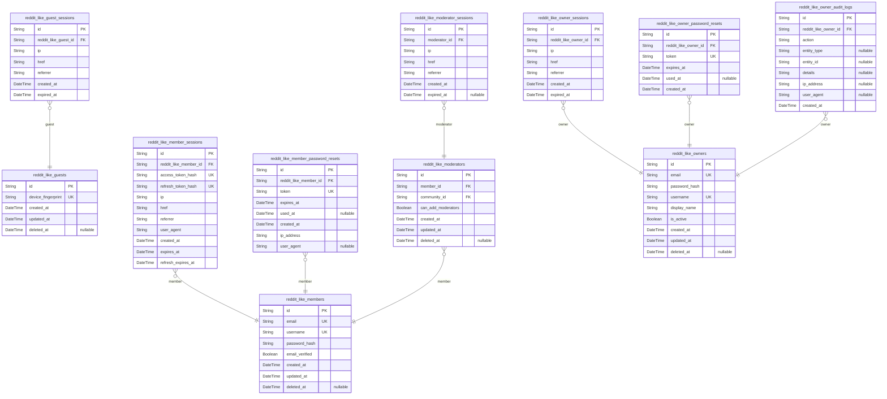
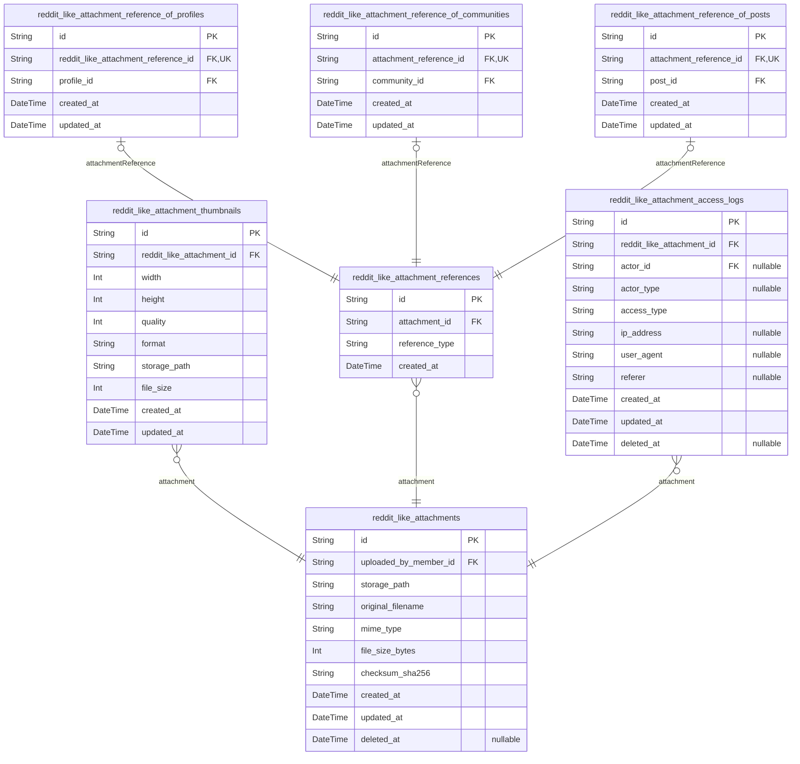
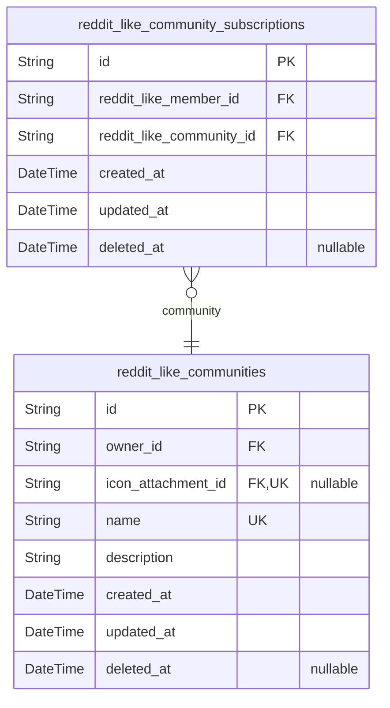
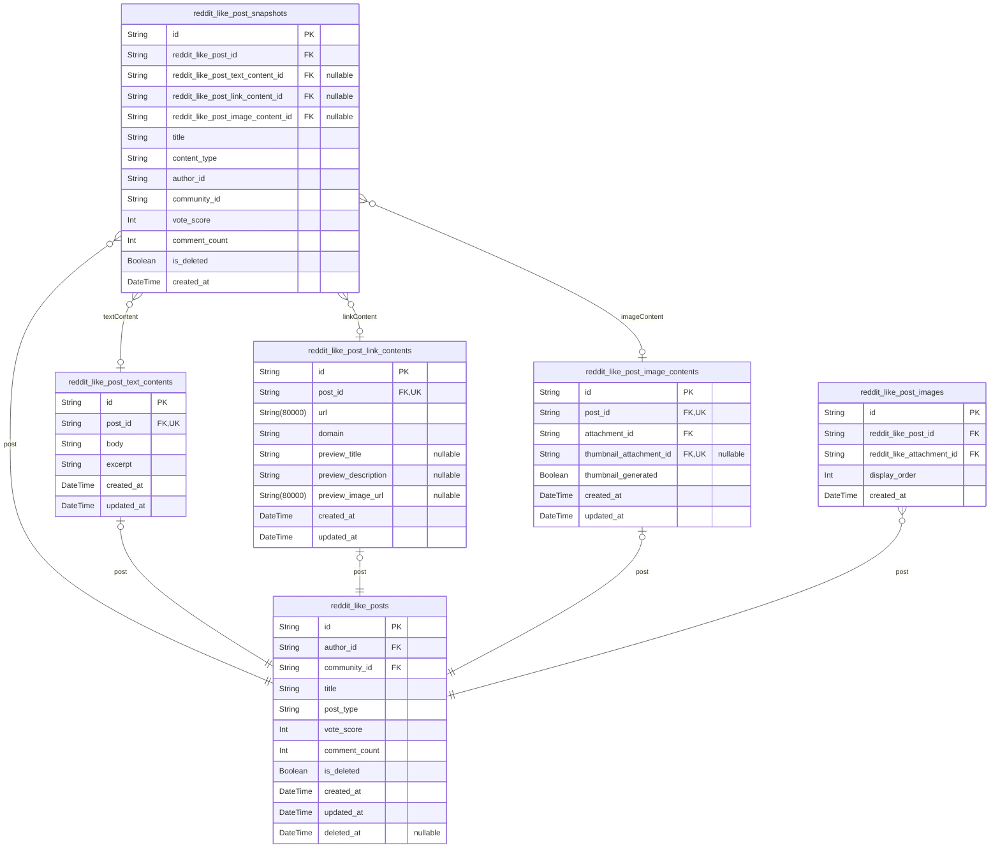
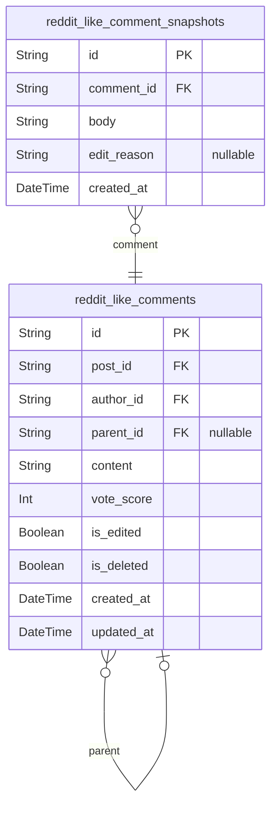
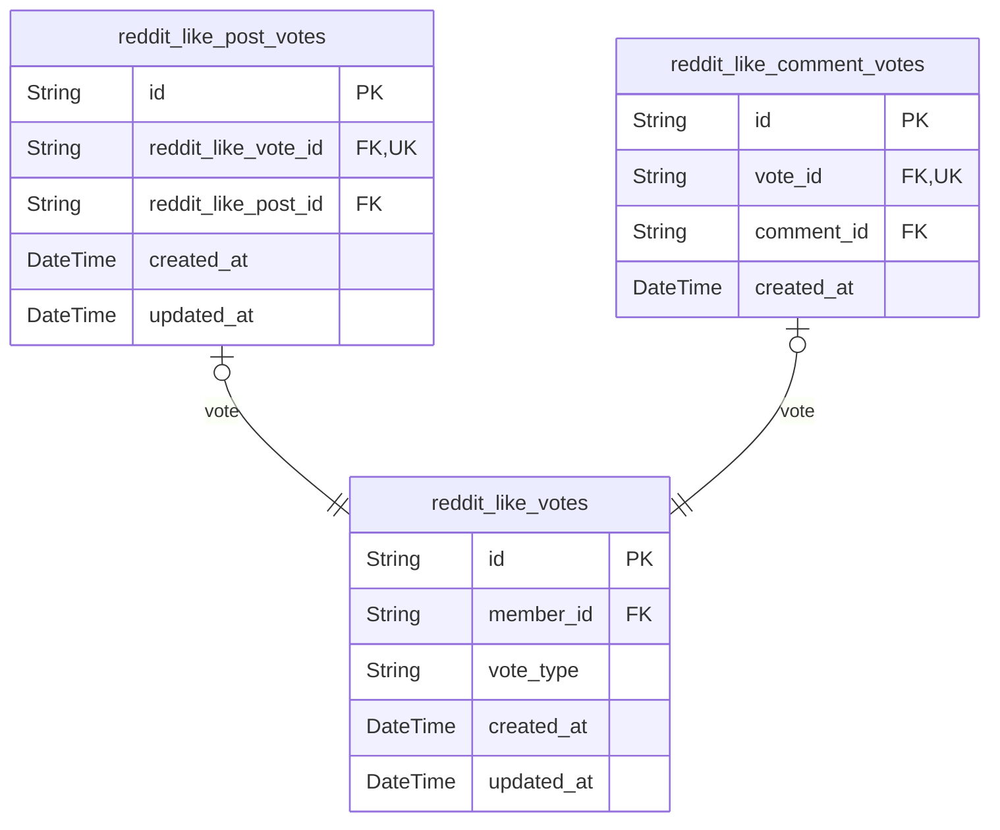
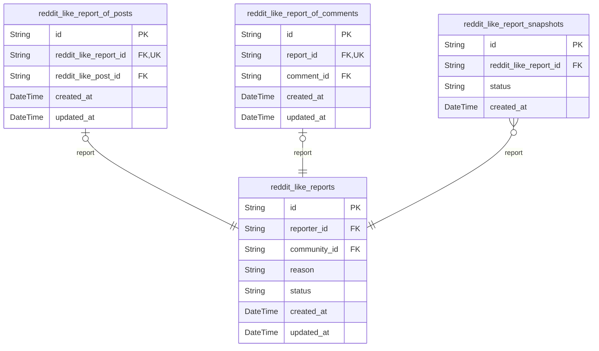

# Prisma Markdown

> Generated by [`prisma-markdown`](https://github.com/samchon/prisma-markdown)

- [Actors](#actors)
- [Systematic](#systematic)
- [Communities](#communities)
- [Posts](#posts)
- [Comments](#comments)
- [Votes](#votes)
- [Moderation](#moderation)

## Actors

### `reddit_like_guests`

Temporary guest accounts for unauthenticated visitors to the platform.
Guests are identified by device fingerprint and can browse public content
without registration. Each guest actor record represents a unique
device/browser combination that allows the platform to maintain session
continuity and basic personalization for non-registered users. Guest
accounts are ephemeral and may be cleaned up periodically.

Properties as follows:

- `id`: Primary Key.
- `device_fingerprint`
  > Unique device identifier generated from browser and device
  > characteristics. Used to recognize returning guest visitors.
- `created_at`: Timestamp when the guest account was first created.
- `updated_at`: Timestamp when the guest account was last updated.
- `deleted_at`
  > Timestamp for soft delete. When set, the guest account is considered
  > expired/inactive.

### `reddit_like_guest_sessions`

Temporary session tokens for guest access to public content. Tracks guest
browsing sessions for unauthenticated visitors identified by device
fingerprint. Each session is linked to a temporary guest record and
includes connection metadata for security and analytics. Sessions
automatically expire after a configured timeout period.

Properties as follows:

- `id`: Primary Key.
- `reddit_like_guest_id`: Belonged guest's [reddit_like_guests.id](#reddit_like_guests).
- `ip`: Client IP address for the guest session.
- `href`: Initial page URL where the guest session was established.
- `referrer`: HTTP referrer header from the initial request.
- `created_at`: Timestamp when the session was created.
- `expired_at`: Timestamp when the session expires and becomes invalid.

### `reddit_like_members`

Registered member accounts representing authenticated users in the
reddit_like platform.

Members are the primary user type with full platform access. Each member
has unique email credentials for authentication and a public username for
identification. Members can create communities, submit posts, write
comments, vote on content, subscribe to communities, and participate in
community moderation when assigned.

This table serves as the canonical identity record for the member actor
type, storing authentication credentials and core profile identifiers.
Extended profile data (karma, display preferences) is stored in {@link
reddit_like_user_profiles} via 1:1 relationship.

Members can hold multiple [reddit_like_member_sessions](#reddit_like_member_sessions) for
authentication across devices, and use {@link
reddit_like_member_password_resets} for account recovery when credentials
are forgotten.

Properties as follows:

- `id`: Primary Key.
- `email`: Unique email address used for authentication and account recovery.
- `username`: Public display name uniquely identifying the member across the platform.
- `password_hash`
  > BCrypt hashed password for authentication. Never store plaintext
  > passwords.
- `email_verified`
  > Whether the member's email address has been verified through confirmation
  > process.
- `created_at`: Timestamp when the member account was created.
- `updated_at`: Timestamp of the most recent account update.
- `deleted_at`: Soft deletion timestamp. Null indicates active account.

### `reddit_like_member_sessions`

JWT session tokens for member authentication with access and refresh
token support.

Each record represents an active authentication session for a registered
member, storing JWT token identifiers for access and refresh tokens along
with connection metadata. Sessions are used to track authenticated state
and enable token revocation. When a member logs in, a new session is
created with JWT tokens. The access token has a shorter expiration while
the refresh token allows obtaining new access tokens without
re-authentication.

Properties as follows:

- `id`: Primary Key.
- `reddit_like_member_id`: Belonged member's [reddit_like_members.id](#reddit_like_members).
- `access_token_hash`
  > Hash of the JWT access token for revocation tracking and session
  > identification.
- `refresh_token_hash`: Hash of the JWT refresh token for token rotation and revocation tracking.
- `ip`: IP address from which the session was initiated.
- `href`: URL path where the login/session creation occurred.
- `referrer`: Referrer URL that led to the login/session creation.
- `user_agent`: User agent string of the client browser or application.
- `created_at`: Timestamp when the session was created.
- `expires_at`: Timestamp when the access token expires.
- `refresh_expires_at`: Timestamp when the refresh token expires.

### `reddit_like_member_password_resets`

Password reset tokens for member account recovery.

Stores temporary tokens issued when members request password resets. Each
token has an expiration time and can only be used once. Once a token is
used to reset a password, it is marked as consumed via used_at timestamp.

Password reset tokens provide a secure mechanism for members to regain
access to their accounts without requiring the current password. The
token must be kept confidential and has a limited lifespan to prevent
abuse.

Related to [reddit_like_members](#reddit_like_members) as the authentication target.

Properties as follows:

- `id`: Primary Key.
- `reddit_like_member_id`
  > Member who requested the password reset. References {@link
  > reddit_like_members.id}.
- `token`
  > Unique password reset token string. Cryptographically secure random value
  > sent to member's email for identity verification.
- `expires_at`
  > Timestamp when the reset token becomes invalid. Members must complete
  > password reset before this time.
- `used_at`
  > Timestamp when the token was consumed to reset the password. Null until
  > used. Prevents token reuse after successful reset.
- `created_at`: Timestamp when the reset token was created.
- `ip_address`
  > IP address from which the reset token was requested. Used for security
  > auditing and fraud detection.
- `user_agent`: User agent string from the requesting client. Used for security auditing.

### `reddit_like_moderators`

Links members to communities where they hold moderation privileges.
Moderators authenticate as regular members (authorization-level
distinction), and this table grants them governance capabilities within
specific communities including content deletion, user bans, and report
review.

Moderator privileges are scoped to individual communities. Each record
represents a member's authority to moderate a specific community,
including whether they can recruit additional moderators.

Properties as follows:

- `id`: Primary Key.
- `member_id`: The member who holds moderator privileges. [reddit_like_members.id](#reddit_like_members).
- `community_id`
  > The community where the member has moderation authority. {@link
  > reddit_like_communities.id}.
- `can_add_moderators`
  > Whether this moderator can add other moderators to the community. Owners
  > can always add moderators; this flag allows delegation of recruitment
  > authority to trusted moderators.
- `created_at`: When the moderator role was assigned.
- `updated_at`: When the moderator role was last modified.
- `deleted_at`
  > Soft delete timestamp for removed moderator roles. Preserves history
  > while revoking active privileges.

### `reddit_like_moderator_sessions`

Session tracking table for moderator login sessions.

Moderator sessions record authentication events and connection context
for audit trail purposes. Each session represents a login event with
captured metadata (IP, referrer, user agent href). Sessions are
append-only for audit compliance.

Belongs to [reddit_like_moderators](#reddit_like_moderators) as the actor table.

Properties as follows:

- `id`: Primary Key.
- `moderator_id`: Belonged moderator's [reddit_like_moderators.id](#reddit_like_moderators).
- `ip`: Client IP address for session audit trail.
- `href`: Request origin URL or user agent href for session context tracking.
- `referrer`: HTTP referer header for session audit trail tracking request origin.
- `created_at`: Timestamp when the session was established.
- `expired_at`: Timestamp when the session expires or was terminated.

### `reddit_like_owners`

Community owner accounts representing users with admin-level privileges
and enhanced security requirements. Owners are authenticated actors who
can create communities, appoint moderators, and perform elevated
moderation actions. Each owner has unique authentication credentials and
manages community governance. [reddit_like_communities](#reddit_like_communities) reference
owners as creators, and [reddit_like_owner_sessions](#reddit_like_owner_sessions) track login
sessions.

Properties as follows:

- `id`: Primary Key.
- `email`: Unique email address used for owner authentication and account recovery.
- `password_hash`: Hashed password for secure authentication.
- `username`: Unique username for public identification and profile display.
- `display_name`
  > Human-readable display name shown in community ownership and moderation
  > contexts.
- `is_active`: Whether the owner account is currently active and can authenticate.
- `created_at`: Timestamp when the owner account was created.
- `updated_at`: Timestamp when the owner account was last updated.
- `deleted_at`
  > Soft deletion timestamp for owner account deactivation. Null if account
  > is active.

### `reddit_like_owner_sessions`

JWT session tokens for owner authentication with elevated security
session tracking.

Stores active authentication sessions for community owners, capturing
connection metadata for security auditing. Each session represents a
logged-in owner session with JWT token lifecycle management. Sessions are
append-only for audit purposes and expire automatically for security.

Properties as follows:

- `id`: Primary Key.
- `reddit_like_owner_id`: Belonged owner's [reddit_like_owners.id](#reddit_like_owners).
- `ip`: Client IP address for security tracking.
- `href`: Current page URL at session creation.
- `referrer`: Referrer URL for tracking session origin.
- `created_at`: Session creation timestamp.
- `expired_at`: Session expiration timestamp for automatic logout.

### `reddit_like_owner_password_resets`

Password reset token storage for owner account recovery with enhanced
security validations. Each record represents a single password reset
request containing a cryptographically secure token sent to the owner's
registered email. Tokens are single-use and time-limited to prevent
abuse. [reddit_like_owners](#reddit_like_owners)

Properties as follows:

- `id`: Primary Key.
- `reddit_like_owner_id`: Target owner's [reddit_like_owners.id](#reddit_like_owners).
- `token`
  > Cryptographically secure random token sent to owner's email for password
  > reset verification.
- `expires_at`: Token expiration timestamp after which the reset request becomes invalid.
- `used_at`
  > Timestamp when the token was consumed for password reset, marking it as
  > used to prevent replay attacks.
- `created_at`: Timestamp when the password reset request was created.

### `reddit_like_owner_audit_logs`

Audit trail logging owner actions for community management accountability.

Records all significant actions performed by community owners, including
community creation, moderator assignments, user bans, and other
administrative operations. Provides an immutable history for security
review and accountability purposes.

Each entry captures the owner who performed the action, the type of
action, the affected entity (if applicable), and request metadata for
forensic analysis.

Properties as follows:

- `id`: Primary Key.
- `reddit_like_owner_id`: Owner who performed the action. [reddit_like_owners.id](#reddit_like_owners)
- `action`
  > Type of action performed (e.g., 'create_community', 'add_moderator',
  > 'remove_moderator', 'ban_user', 'delete_post').
- `entity_type`
  > Type of entity affected by the action (e.g., 'community', 'user', 'post',
  > 'comment'). Null for actions without a specific target entity.
- `entity_id`
  > Identifier of the specific entity affected. {@link
  > reddit_like_communities.id} or other entity IDs.
- `details`
  > Additional context or parameters about the action in human-readable
  > format.
- `ip_address`: IP address from which the action was performed for security tracking.
- `user_agent`: User agent string of the client that performed the action.
- `created_at`: Timestamp when the action was performed.

## Systematic

### `reddit_like_attachments`

Core file metadata table storing uploaded file information including
storage location, original filename, MIME type, file size, and integrity
checksum. Serves as the central repository for all file uploads across
the platform including user profile avatars, community icons, and post
images.

Properties as follows:

- `id`: Primary Key.
- `uploaded_by_member_id`
  > Reference to the member who uploaded this file. {@link
  > reddit_like_members.id}
- `storage_path`: Absolute or relative path to the file in storage system.
- `original_filename`: Original filename provided by the user during upload.
- `mime_type`: MIME type of the file (e.g., image/png, application/pdf).
- `file_size_bytes`: Size of the file in bytes.
- `checksum_sha256`: SHA-256 hash of the file content for integrity verification.
- `created_at`: Timestamp when the file was uploaded.
- `updated_at`: Timestamp when the file metadata was last modified.
- `deleted_at`: Timestamp for soft delete. Null if the file record is active.

### `reddit_like_attachment_thumbnails`

Generated thumbnail variants for image attachments. Stores multiple
size/quality variants of uploaded images to enable optimized delivery
based on client requirements. Each row represents a specific thumbnail
configuration (dimensions, quality, format) for a source image. {@link
reddit_like_attachments}

Properties as follows:

- `id`: Primary Key.
- `reddit_like_attachment_id`: Source attachment's [reddit_like_attachments.id](#reddit_like_attachments).
- `width`: Thumbnail width in pixels.
- `height`: Thumbnail height in pixels.
- `quality`
  > Compression quality percentage (1-100). Higher values mean better quality
  > but larger file size.
- `format`: Image format of the thumbnail. Values: jpeg, png, webp.
- `storage_path`: File system path or object storage key where the thumbnail file is stored.
- `file_size`
  > Thumbnail file size in bytes for cache management and bandwidth
  > estimation.
- `created_at`: When the thumbnail was generated.
- `updated_at`: When the thumbnail record was last modified.

### `reddit_like_attachment_references`

Polymorphic junction table serving as the main entity for linking file
attachments to various business entities in the system. This table
establishes the base relationship between an attachment and the type of
entity it references (profile avatar, community icon, post image). The
actual entity-specific link is stored in subtype tables following the
polymorphic ownership pattern. Supports attachment reuse across different
entity types while maintaining referential integrity.

[reddit_like_attachments](#reddit_like_attachments) - Parent attachment record
[reddit_like_attachment_reference_of_profiles](#reddit_like_attachment_reference_of_profiles) - Profile avatar links
[reddit_like_attachment_reference_of_communities](#reddit_like_attachment_reference_of_communities) - Community
icon/banner links
[reddit_like_attachment_reference_of_posts](#reddit_like_attachment_reference_of_posts) - Post image links

Properties as follows:

- `id`: Primary Key.
- `attachment_id`: Parent attachment being referenced. [reddit_like_attachments.id](#reddit_like_attachments)
- `reference_type`
  > Type of entity this attachment references: 'profile' for user avatars,
  > 'community' for community icons/banners, 'post' for post images.
  > Determines which subtype table contains the actual entity link.
- `created_at`: Timestamp when the attachment reference was created.

### `reddit_like_attachment_access_logs`

Audit trail tracking file access events for security compliance and
access monitoring.

Records every access to attachment files including who accessed them,
when, and from where. Supports security analysis, compliance auditing,
and usage analytics. References the accessed attachment and the actor who
performed the access (guest, member, moderator, or owner).

[reddit_like_attachments](#reddit_like_attachments)

Properties as follows:

- `id`: Primary Key.
- `reddit_like_attachment_id`: Referenced attachment's [reddit_like_attachments.id](#reddit_like_attachments).
- `actor_id`
  > Actor who accessed the file. Nullable for unauthenticated/guest access.
  > [reddit_like_members.id](#reddit_like_members) or other actor tables.
- `actor_type`
  > Type of actor who accessed: 'guest', 'member', 'moderator', 'owner', or
  > null for system/anonymous access.
- `access_type`
  > Type of access performed: 'view', 'download', 'thumbnail_view',
  > 'metadata_read', etc.
- `ip_address`
  > IP address from which the access originated. Nullable for
  > privacy-compliant logging.
- `user_agent`
  > User agent string of the client browser/application. Nullable for
  > privacy-compliant logging.
- `referer`: HTTP referer header indicating the source page of the access request.
- `created_at`: Timestamp when the access event occurred.
- `updated_at`: Timestamp when the record was last updated.
- `deleted_at`
  > Soft delete timestamp for audit retention policies. Null if record is
  > active.

### `reddit_like_attachment_reference_of_profiles`

Subtype table for polymorphic attachment references specifically linking
attachments to user profiles as avatar images.

This table implements the subtype pattern for the attachment reference
polymorphic relationship, where attachment_references serves as the main
entity with a reference_type discriminator, and this table provides the
profile-specific linkage. Each record represents a single avatar image
attachment for a specific user profile.

The 1:1 relationship with attachment_references ensures that each
attachment reference can be associated with at most one profile,
maintaining data integrity for the polymorphic pattern.

Properties as follows:

- `id`: Primary Key.
- `reddit_like_attachment_reference_id`
  > Belonged attachment reference's {@link
  > reddit_like_attachment_references.id}. Links to the main polymorphic
  > attachment reference entity.
- `profile_id`
  > Belonged member's [reddit_like_members.id](#reddit_like_members). The member profile that
  > owns this avatar attachment.
- `created_at`: When the attachment reference link was created.
- `updated_at`: When the attachment reference link was last updated.

### `reddit_like_attachment_reference_of_communities`

Subtype table linking attachment references to communities for icons and
banners. This table extends the polymorphic attachment_references entity
to specifically associate files with communities, supporting community
branding elements like icons and banner images. Each record represents a
single attachment reference assigned to a community.

Properties as follows:

- `id`: Primary Key.
- `attachment_reference_id`
  > Reference to the attachment reference entity. {@link
  > reddit_like_attachment_references.id}
- `community_id`: Target community for this attachment. [reddit_like_communities.id](#reddit_like_communities)
- `created_at`: When this attachment reference was created.
- `updated_at`: When this attachment reference was last updated.

### `reddit_like_attachment_reference_of_posts`

Subtype table linking attachment references to posts for image content.
Represents the post-specific implementation of the polymorphic attachment
reference pattern.

This table maintains a 1:1 relationship with
reddit_like_attachment_references where the reference_type is 'post'. It
establishes the concrete link between an attachment and a specific post
entity, enabling image content within posts.

The separation into subtype tables allows type-safe querying and
maintains referential integrity with specific entity types.

Properties as follows:

- `id`: Primary Key.
- `attachment_reference_id`
  > Parent attachment reference's {@link
  > reddit_like_attachment_references.id}. Establishes 1:1 relationship with
  > the polymorphic attachment reference.
- `post_id`
  > Target post's [reddit_like_posts.id](#reddit_like_posts). Links the attachment to a
  > specific post.
- `created_at`: Record creation timestamp.
- `updated_at`: Last update timestamp.

## Communities

### `reddit_like_communities`

Community represents a themed discussion forum centered around a specific
topic or interest.

Each Community is identified by a unique name that distinguishes it
across the entire platform. The name serves as the primary identifier
that users reference when searching for, subscribing to, or posting
within a Community.

Communities include a description text explaining their purpose, topic
focus, and participation guidelines. An optional icon image provides
visual branding and recognition in listings and feeds.

Communities are owned by the member who created them and serve as the
primary organizing structure for content on the platform.

Properties as follows:

- `id`: Primary Key.
- `owner_id`
  > Owner member's [reddit_like_members.id](#reddit_like_members). The member who created and
  > owns this community.
- `icon_attachment_id`
  > Icon image attachment's [reddit_like_attachments.id](#reddit_like_attachments). Optional
  > visual branding for the community.
- `name`
  > Unique community name serving as the primary identifier across the
  > platform.
- `description`
  > Community description explaining its purpose, topic focus, and
  > participation guidelines.
- `created_at`: Timestamp when the community was created.
- `updated_at`: Timestamp when the community was last updated.
- `deleted_at`: Soft delete timestamp. Null if community is active, set when deleted.

### `reddit_like_community_subscriptions`

User subscriptions to communities representing membership relationships.

Each record indicates that a member has subscribed to a community,
granting them access to post content and receive community posts in their
Home Feed. Subscriptions use soft delete to track unsubscription events
while maintaining audit history.

The combination of member and community is unique - a user cannot have
multiple active subscriptions to the same community simultaneously.

Properties as follows:

- `id`: Primary Key.
- `reddit_like_member_id`: The member who subscribed to the community. [reddit_like_members.id](#reddit_like_members)
- `reddit_like_community_id`: The community being subscribed to. [reddit_like_communities.id](#reddit_like_communities)
- `created_at`: When the subscription was created.
- `updated_at`: When the subscription was last updated.
- `deleted_at`
  > When the subscription was soft deleted (unsubscribed). Null if actively
  > subscribed.

## Posts

### `reddit_like_posts`

Main posts table representing user-created content shared within
communities. Each post has a required title and is published to a
specific community by an author. Posts serve as the primary content unit
for discussion and engagement. Posts can be of different types (text,
link, image) with type-specific content stored in child tables. The
vote_score tracks net votes (upvotes minus downvotes) and comment_count
tracks the number of comments. Supports soft delete for content
moderation.

Properties as follows:

- `id`: Primary Key.
- `author_id`: Author who created the post. [reddit_like_members.id](#reddit_like_members)
- `community_id`: Community where the post is published. [reddit_like_communities.id](#reddit_like_communities)
- `title`
  > Post title summarizing the content. Displayed in feeds and as the entry
  > point for engagement.
- `post_type`
  > Type of post content: 'text', 'link', or 'image'. Determines which child
  > table contains the detailed content.
- `vote_score`
  > Net vote score calculated as upvotes minus downvotes. Determines post
  > visibility and ranking in feeds.
- `comment_count`
  > Number of comments on this post. Updated when comments are added or
  > deleted.
- `is_deleted`
  > Soft delete flag indicating the post has been removed. When true, post is
  > hidden from feeds but retained for referential integrity.
- `created_at`: Timestamp when the post was created.
- `updated_at`: Timestamp when the post was last updated.
- `deleted_at`: Timestamp when the post was soft deleted. Null if post is active.

### `reddit_like_post_snapshots`

Point-in-time snapshots capturing post state for edit history and audit
trail.

Records the complete state of a post at a specific moment in time, enabling
historical tracking of changes, content restoration, and moderation
auditing.
Each snapshot preserves the post's title, content type, associated content
reference, engagement metrics (vote score, comment count), and ownership
information as they existed when the snapshot was created.

Snapshots are created automatically when posts are edited, providing an
immutable audit trail of content modifications. [reddit_like_posts](#reddit_like_posts)

Properties as follows:

- `id`: Primary Key.
- `reddit_like_post_id`
  > Parent post's [reddit_like_posts.id](#reddit_like_posts). References the post whose
  > state is being captured.
- `reddit_like_post_text_content_id`
  > Reference to text content if post was text-type at snapshot time. {@link
  > reddit_like_post_text_contents.id}
- `reddit_like_post_link_content_id`
  > Reference to link content if post was link-type at snapshot time. {@link
  > reddit_like_post_link_contents.id}
- `reddit_like_post_image_content_id`
  > Reference to image content if post was image-type at snapshot time.
  > [reddit_like_post_image_contents.id](#reddit_like_post_image_contents)
- `title`
  > Post title at the time of snapshot. Preserves the title text as it
  > existed when this snapshot was captured.
- `content_type`
  > Content type identifier at snapshot time. Values: 'text', 'link',
  > 'image'. Indicates which content subtype table was active.
- `author_id`
  > User ID of post author at snapshot time. Preserves ownership information
  > for audit purposes.
- `community_id`
  > Community ID where post was published at snapshot time. Preserves
  > community context.
- `vote_score`
  > Vote score (upvotes minus downvotes) at snapshot time. Captures
  > engagement metrics.
- `comment_count`: Number of comments at snapshot time. Captures discussion activity level.
- `is_deleted`
  > Whether post was marked as deleted at snapshot time. Preserves deletion
  > state for audit.
- `created_at`
  > Timestamp when this snapshot was created. Indicates when the post state
  > was captured.

### `reddit_like_post_text_contents`

Text-type post content storage containing the full body text and preview
excerpt for text posts. Each record represents the content portion of a
text-type post with a one-to-one relationship to the parent post. The
body field stores the complete user-written content while excerpt
provides a preview summary for list views and feed displays.

Properties as follows:

- `id`: Primary Key.
- `post_id`
  > Parent post's [reddit_like_posts.id](#reddit_like_posts). One-to-one relationship since
  > each text post has exactly one content record.
- `body`
  > Full body text content written by the user. Contains the complete post
  > content for text-type posts.
- `excerpt`
  > Preview excerpt or summary of the post content. Used for feed displays,
  > list views, and search result previews.
- `created_at`: Record creation timestamp when the text content was first stored.
- `updated_at`: Last modification timestamp when the text content was updated.

### `reddit_like_post_link_contents`

Link-type post content storing URL, extracted domain, and preview
metadata for link posts.

This subsidiary table stores the specific content for posts of type
'link'. Each link post has exactly one link content record containing the
external URL, extracted domain for display purposes, and optional preview
metadata (title, description, image) typically fetched via OpenGraph or
similar protocols.

Link contents are created and managed through their parent post entity.
When a link post is created, the system extracts the domain from the URL
and may fetch preview metadata to enhance the post display. {@link
reddit_like_posts}

Properties as follows:

- `id`: Primary Key.
- `post_id`: Reference to the parent link post. [reddit_like_posts.id](#reddit_like_posts)
- `url`: The external URL that this link post points to. Must be a valid URI.
- `domain`
  > Extracted domain from the URL for display and filtering purposes (e.g.,
  > 'example.com').
- `preview_title`
  > Optional preview title fetched from the linked page's OpenGraph or meta
  > tags.
- `preview_description`
  > Optional preview description fetched from the linked page's OpenGraph or
  > meta tags.
- `preview_image_url`
  > Optional preview image URL fetched from the linked page's OpenGraph or
  > meta tags.
- `created_at`: When this link content record was created.
- `updated_at`: When this link content record was last updated.

### `reddit_like_post_image_contents`

Image-type post content table storing image file references and thumbnail
generation status for posts with image content type.

This subsidiary table holds image-specific metadata for posts, linking to
the attachment system for actual file storage. It tracks whether
thumbnails have been generated for optimized image delivery.

Relationships:
- Belongs to [reddit_like_posts](#reddit_like_posts) via post_id (1:1 relationship)
- References [reddit_like_attachments](#reddit_like_attachments) for the main image file
- Optionally references [reddit_like_attachments](#reddit_like_attachments) for the thumbnail
variant

Properties as follows:

- `id`: Primary Key.
- `post_id`
  > Reference to the parent post's {@link
  > reddit_like_post_image_contents.id}. One-to-one relationship with posts
  > table.
- `attachment_id`: Reference to the image file in [reddit_like_attachments.id](#reddit_like_attachments).
- `thumbnail_attachment_id`
  > Optional reference to the generated thumbnail in {@link
  > reddit_like_attachments.id}.
- `thumbnail_generated`: Whether thumbnails have been generated for this image post content.
- `created_at`: Timestamp when the image content record was created.
- `updated_at`: Timestamp when the image content record was last updated.

### `reddit_like_post_images`

Gallery images associated with image-type posts. Supports multiple images
per post with ordering for gallery display. Links posts to attachment
files stored in the attachment system. Each image represents one file in
a post's image gallery.

Properties as follows:

- `id`: Primary Key.
- `reddit_like_post_id`
  > Parent post's [reddit_like_posts.id](#reddit_like_posts). The image-type post
  > containing this image.
- `reddit_like_attachment_id`
  > Image file's [reddit_like_attachments.id](#reddit_like_attachments). The actual image file
  > stored in the attachment system.
- `display_order`
  > Display sequence order within the post's image gallery. Lower values
  > appear first.
- `created_at`: When the image was added to the post.

## Comments

### `reddit_like_comments`

User comments on posts with support for threaded hierarchical discussions.

Each comment belongs to a specific post and is authored by a member.
Comments can be top-level replies to posts or nested replies to other
comments, creating unlimited depth discussion threads through the
parent_id self-reference.

Comments track their lifecycle state through is_edited and is_deleted
flags. When deleted, comments remain in the database with is_deleted=true
to preserve thread continuity for nested replies below them. The
vote_score aggregates community opinion on comment quality.

[reddit_like_posts](#reddit_like_posts) contains the parent posts.
[reddit_like_members](#reddit_like_members) contains the comment authors.
[reddit_like_comment_snapshots](#reddit_like_comment_snapshots) tracks edit history for audit trails.

Properties as follows:

- `id`: Primary Key.
- `post_id`: Parent post this comment belongs to. [reddit_like_posts.id](#reddit_like_posts)
- `author_id`: Member who authored this comment. [reddit_like_members.id](#reddit_like_members)
- `parent_id`
  > Parent comment for threaded replies. Null for top-level comments. {@link
  > reddit_like_comments.id}
- `content`
  > The text content of the comment. Required non-empty text containing the
  > user's response or contribution to the discussion.
- `vote_score`
  > Net vote score calculated as upvotes minus downvotes. Can be positive,
  > zero, or negative.
- `is_edited`
  > Flag indicating whether the comment has been edited after initial
  > creation. True if the author has modified the content.
- `is_deleted`
  > Soft delete flag preserving thread continuity. When true, the comment
  > content is hidden but the comment remains to maintain nested reply
  > structure.
- `created_at`: Timestamp when the comment was first created.
- `updated_at`
  > Timestamp when the comment was last modified, including edits or soft
  > delete operations.

### `reddit_like_comment_snapshots`

Point-in-time snapshots capturing comment content for audit trail and
history tracking when comments are edited.

Each snapshot records the state of a comment's body content at the moment
of modification, preserving complete edit history for accountability and
content recovery. This table is append-only and serves as an immutable
audit log.

References [reddit_like_comments](#reddit_like_comments) as the parent comment entity.

Properties as follows:

- `id`: Primary Key.
- `comment_id`
  > Parent comment's [reddit_like_comments.id](#reddit_like_comments) at the time of this
  > snapshot.
- `body`: The comment body content as it existed at the time of this snapshot.
- `edit_reason`: Optional reason provided by the user when editing the comment.
- `created_at`: Timestamp when this snapshot was created.

## Votes

### `reddit_like_votes`

Main vote entity tracking user votes on content (posts and comments).

The `reddit_like_votes` table serves as the base polymorphic entity for
all voting activity in the platform. It tracks which member cast the
vote, the vote type (upvote or downvote), and timestamps. The actual
content target (post or comment) is determined by records in the subtype
tables: [reddit_like_post_votes](#reddit_like_post_votes) for post votes and {@link
reddit_like_comment_votes} for comment votes.

**Vote Lifecycle:**
- Votes are created when members click upvote/downvote buttons
- Members can change their vote (upvote ↔ downvote)
- Only one vote per member per content item (enforced by unique
constraint in subtype tables)
- Vote counts contribute to the karma scoring system

**Polymorphic Pattern:**
This table contains the shared vote data. The subtype tables link this
vote to either a post or a comment, creating a clean polymorphic
relationship without nullable foreign keys or type discrimination fields.

Properties as follows:

- `id`: Primary Key.
- `member_id`
  > Voting member's [reddit_like_members.id](#reddit_like_members). The user who cast this
  > vote.
- `vote_type`
  > Type of vote cast: 'upvote' or 'downvote'. Determines whether this vote
  > adds or subtracts from the content's score.
- `created_at`: Timestamp when the vote was first cast.
- `updated_at`
  > Timestamp when the vote was last changed (e.g., user changed from upvote
  > to downvote).

### `reddit_like_post_votes`

Subtype table linking votes to posts in the polymorphic voting system.
Each record represents a vote cast on a specific post, with a 1:1
relationship to the main vote entity. This table enables the polymorphic
pattern where votes can target either posts or comments, but never both
simultaneously.

Properties as follows:

- `id`: Primary Key.
- `reddit_like_vote_id`: Reference to the parent vote entity. [reddit_like_votes.id](#reddit_like_votes)
- `reddit_like_post_id`: Reference to the post being voted on. [reddit_like_posts.id](#reddit_like_posts)
- `created_at`: Timestamp when the vote-post link was created.
- `updated_at`: Timestamp when the vote-post link was last updated.

### `reddit_like_comment_votes`

Subtype table for votes on comments, implementing the polymorphic voting
pattern.

Each record represents a 1:1 relationship with a vote in
reddit_like_votes, specifically linking that vote to a comment target.
This table enables the polymorphic design where votes can target either
posts or comments through separate subtype tables.

[reddit_like_votes](#reddit_like_votes) — The main vote entity containing user, vote
type, and timestamp.
[reddit_like_comments](#reddit_like_comments) — The comment being voted on.

Properties as follows:

- `id`: Primary Key.
- `vote_id`: Reference to the main vote entity. [reddit_like_votes.id](#reddit_like_votes)
- `comment_id`: The comment being voted on. [reddit_like_comments.id](#reddit_like_comments)
- `created_at`: When the vote-comment association was created.

## Moderation

### `reddit_like_reports`

Main report entity for content violations submitted by users targeting
posts or comments within communities.

Reports allow users to flag inappropriate content for moderator review.
Each report captures the reporting user's identity, the community
context, the reason for reporting, and the current review status. The
actual target content (post or comment) is linked through child subtype
tables to maintain clean polymorphic relationships.

Reports progress through a lifecycle from 'pending' (awaiting review) to
either 'approved' (violation confirmed, action taken) or 'dismissed' (no
violation found). Status transitions are tracked via {@link
reddit_like_report_snapshots} for audit purposes.

Properties as follows:

- `id`: Primary Key.
- `reporter_id`: The member who submitted this report. [reddit_like_members.id](#reddit_like_members)
- `community_id`
  > The community where the reported content exists. {@link
  > reddit_like_communities.id}
- `reason`
  > The reason provided by the reporter for why the content violates
  > community guidelines.
- `status`
  > Current review status of the report: 'pending' (awaiting moderator
  > review), 'approved' (violation confirmed), or 'dismissed' (no violation
  > found).
- `created_at`: Timestamp when the report was submitted.
- `updated_at`: Timestamp when the report was last modified.

### `reddit_like_report_of_posts`

Subtype table linking reports to specific posts when the report target is
a post.

This table implements the polymorphic ownership pattern for the Report
entity, allowing reports to target either posts or comments. Each record
represents a report that specifically targets a post within a community.
The relationship with reddit_like_reports is 1:1, ensuring a report
targets exactly one content type (either a post or a comment, never
both).

[reddit_like_reports](#reddit_like_reports) represents the main report entity with common
fields like reporter, reason, status, and community. This subtype table
provides the specific post reference.
[reddit_like_posts](#reddit_like_posts) is the target content being reported.
[reddit_like_report_of_comments](#reddit_like_report_of_comments) is the counterpart table for
reports targeting comments.

Properties as follows:

- `id`: Primary Key.
- `reddit_like_report_id`
  > Belonged report's [reddit_like_reports.id](#reddit_like_reports). References the main
  > report entity.
- `reddit_like_post_id`
  > Target post's [reddit_like_posts.id](#reddit_like_posts). References the post being
  > reported.
- `created_at`: Creation time of the record.
- `updated_at`: Last update time of the record.

### `reddit_like_report_of_comments`

Subtype table linking reports to specific comments when the report target
is a comment.

This table implements the polymorphic ownership pattern for content
reports in the moderation system.
Reports can target either posts or comments, and this subtype table
establishes the relationship
when a user reports a comment for violating community standards.

Each record represents a 1:1 relationship between a report and the
specific comment being flagged.
The report entity in [reddit_like_reports](#reddit_like_reports) contains the reporter,
reason text, community context,
and resolution status, while this subtype identifies which comment was
reported.

[reddit_like_reports](#reddit_like_reports)
[reddit_like_comments](#reddit_like_comments)

Properties as follows:

- `id`: Primary Key.
- `report_id`: Reference to the main report entity. [reddit_like_reports.id](#reddit_like_reports)
- `comment_id`: The reported comment being flagged. [reddit_like_comments.id](#reddit_like_comments)
- `created_at`: When this report-comment association was created.
- `updated_at`: When this record was last updated.

### `reddit_like_report_snapshots`

Point-in-time snapshots of report states capturing status transitions for
audit trail purposes.

Records the complete history of report status changes as moderators
review and resolve content reports. Each snapshot preserves the report
state at a specific moment, enabling accountability tracking and
reconstruction of the moderation workflow lifecycle from initial
submission (pending) through final resolution (approved or dismissed).

Snapshots are append-only and immutable, creating a permanent audit trail
of all moderation decisions.

Properties as follows:

- `id`: Primary Key.
- `reddit_like_report_id`: Target report's [reddit_like_reports.id](#reddit_like_reports).
- `status`
  > Report status at the time of snapshot. One of: 'pending', 'approved',
  > 'dismissed'. Captures the current state in the moderation workflow.
- `created_at`
  > Timestamp when this snapshot was captured, marking the point in time of
  > the status transition.
