**redditLike — Business concepts, relationships, and states from user perspective**

Business concepts, relationships, and states from user perspective

# Domain Concepts

Describe what each concept means in the business domain and its key attributes.

## User Concept

User represents an individual account that authenticates on the platform. Every User has a unique email address used for sign-up and login, along with a unique username chosen at registration that identifies them across the community. Users create a password during registration to secure their account. A User serves as the central identity for all activity on the platform, including creating posts, writing comments, voting on content, joining communities, and serving as community owners or moderators. When a User deletes their account, all associated content including posts and comments are also removed from the platform.

### User Identity and Authentication Credentials

A User represents an individual account holder who authenticates on the platform. Each User must provide a unique email address during registration, which serves as the primary identifier for logging into the account. Users select a unique username at registration that publicly identifies them across all communities and content on the platform. To secure access, Users create a password during the registration process. The email address and password combination is required for authentication. Both the email address and username must remain unique across the entire platform—no two Users may share the same email address, and no two Users may share the same username. The username becomes the persistent public identifier displayed on all posts, comments, and votes made by the User.

### Content Ownership and Platform Relationships

A User serves as the central identity for all content creation and interaction on the platform. Users own all posts they create within communities. Users own all comments they write on posts, including replies to other comments. Users express opinions by casting votes on posts and comments authored by others. Users establish memberships by subscribing to communities of interest. Users may hold moderator roles in communities, which grants them authority to manage content and enforce community rules. Users can be banned from specific communities by moderators, which restricts their ability to participate in those communities while still allowing them to view content. Users can flag inappropriate content by submitting reports for moderator review. A User's complete activity history includes all authored posts, written comments, cast votes, community subscriptions, and moderation roles.

### Account Deletion and Content Removal

Users have the ability to permanently delete their account from the platform. When a User deletes their account, the system removes all posts authored by that User from the platform. When a User deletes their account, the system removes all comments written by that User from the platform. The account deletion action is irreversible and results in the complete removal of the User's identity, authentication credentials, and all associated content contributions. Content removal affects all communities where the User previously posted or commented, ensuring no orphaned content remains after account deletion.

## UserProfile Concept

UserProfile holds the public-facing information for a User account. It contains a display name that appears alongside the user's content, an optional bio text section where users can write about themselves, and an optional avatar image for visual identification. The UserProfile is what other users see when viewing someone's profile page, distinct from the private email used for authentication. The profile aggregates a user's total karma score under karma and provides visibility into all posts and comments they've authored across communities.

### UserProfile Definition

UserProfile represents the public-facing identity of a user account within the platform. It contains all information visible to other users when viewing someone's profile page, separate from the private authentication credentials.

Each user account has exactly one UserProfile that is automatically created upon account registration.

### Display Name
Users may optionally set a display name on their profile. When set, the display name appears alongside the user's content throughout the platform. If no display name is set, the username is displayed instead.

### Bio Description
Users may optionally provide a bio text description on their profile. This free-form text allows users to share information about themselves, their interests, or other relevant details with the community.

### Avatar Image
Users may optionally upload an avatar image to visually identify themselves. The avatar appears next to the user's posts, comments, and profile page. If no avatar is uploaded, a default placeholder is shown.

### Public Visibility
The UserProfile and all its attributes are publicly visible to all users of the platform, including guests who are not logged in. This visibility includes the display name, bio, avatar, karma score, post history, and comment history.

### Karma Display

The UserProfile aggregates and displays a single karma score representing the user's reputation across the platform.

### Karma Calculation
The karma score is the sum of all upvotes received on the user's posts and comments, minus all downvotes received on the user's posts and comments.

### Karma Visibility
The total karma score is publicly displayed on the user's profile page alongside their other profile information. The score updates in real-time as other users vote on the user's content.

### Karma Range
The karma score can be positive, zero, or negative depending on the reception of the user's contributions to the platform.

### User Content History

The UserProfile provides aggregated access to all content authored by the user across the platform.

### Post History
The profile displays a complete list of all posts the user has created in any community. Each entry shows the post title, the community it was posted in, the vote score, and when it was posted.

### Comment History
The profile displays a complete list of all comments the user has written. Each entry shows the comment content, the post it was commented on, the vote score, and when it was posted.

### Content Ordering
Posts and comments are displayed in separate lists, each sorted by most recent first by default. Users viewing a profile can see the full history of the user's contributions to the platform.

## Community Concept

Community represents a themed discussion forum created by users for sharing content around specific topics. Each Community has a unique name that identifies it across the platform, a description text explaining its purpose or rules, and an optional icon image for visual branding. Communities host posts and foster discussion among subscribed members. The user who creates a Community becomes its owner by default. Communities track subscriber counts to indicate their popularity and activity level. Subscribers can post content within the Community, and only subscribers have posting privileges.

### Community Identity

A Community represents a themed discussion forum centered around a specific topic or interest. Each Community is identified by a unique name that distinguishes it across the entire platform. The name serves as the primary identifier that users reference when searching for, subscribing to, or posting within a Community.

Each Community includes a description text that explains its purpose, topic focus, and any specific rules or guidelines for participation. This description helps users understand what content is appropriate for the Community before they choose to subscribe or post.

Communities may optionally display an icon image that provides visual branding and recognition. This icon appears alongside the Community name in listings, feeds, and post displays to help users quickly identify content from communities they follow.

### Community Ownership

Every Community has a single owner who is responsible for its creation and overall management. The owner is the user account that originally created the Community and holds the highest authority within that Community's moderation hierarchy.

The owner has exclusive privileges including the ability to add moderators to assist with Community management, remove existing moderators from their roles, and make decisions about Community policy. The ownership relationship establishes clear accountability for the Community's operation and content standards.

Ownership can be conceptualized as a special administrative role that cannot be removed by other moderators and persists until the owner voluntarily transfers ownership or deletes their account.

### Community Membership and Participation

Communities operate on a subscription-based membership model. Users can subscribe to any Community to become a member, and they may unsubscribe at any time to leave. The platform tracks subscriber counts for each Community, displaying this number to indicate the Community's size and popularity.

Subscription membership carries specific posting privileges. Only users who are currently subscribed to a Community may create new posts within that Community. This requirement ensures that participants have made an explicit commitment to the Community before contributing content.

Subscription status also determines feed inclusion. Posts from subscribed Communities appear in a user's personalized Home Feed, while posts from unsubscribed Communities only appear in the Popular Feed or when explicitly viewing that Community's dedicated page.

Banned users represent a special membership category. A banned user remains subscribed in terms of database relationship but loses posting and commenting privileges within that specific Community. Banned users can still view Community content but cannot participate in discussions.

### Community as Themed Forum

A Community functions as a themed forum that aggregates content and discussion around a specific subject matter. This thematic organization allows users with shared interests to discover relevant content, engage in focused discussions, and build communities of practice around particular topics.

The themed nature of Communities enables content curation through topical grouping. Users browsing a Community encounter posts specifically related to that Community's declared theme, creating a cohesive reading experience distinct from the mixed-content Popular Feed.

Communities serve as the primary container for posts on the platform. Every post must belong to exactly one Community, and posts cannot exist independently outside of Community association. This containment relationship ensures all content is contextualized within an appropriate thematic framework and subject to relevant Community moderation.

## Subscription Concept

Subscription represents the relationship between a User and a Community they follow. It tracks which users are members of which communities and enables posting privileges for subscribers. When a User subscribes to a Community, they gain access to create posts there and see posts from that Community in their Home Feed. Subscriptions are optional and can be established or removed at any time. The subscription relationship also serves as the foundation for community membership moderation, as banned users are restricted from interacting with communities regardless of their subscription status.

### User-Community Relationship

A subscription represents the relationship between a user and a community they choose to follow. This relationship connects a single user to a single community, establishing that the user has elected to receive content from that community and participate in its discussions. Each subscription links one specific user to one specific community, and a user may have subscriptions to multiple communities simultaneously. The subscription relationship is the foundation upon which community participation is built.

### Membership Tracking

Subscriptions serve as the mechanism for tracking which users are members of which communities. The presence of a subscription indicates active membership, while its absence indicates non-membership. The system tracks when each subscription was established, providing a record of when the user joined the community. This membership information is used to determine access privileges and to count the total number of subscribers for each community.

### Home Feed Inclusion

A user's Home Feed contains posts only from communities to which they have an active subscription. When a user subscribes to a community, posts from that community become eligible to appear in the user's Home Feed. If a user unsubscribes from a community, posts from that community are removed from the user's Home Feed. The subscription acts as the filter that determines which content appears in this personalized feed.

### Posting Requirement

A user must have an active subscription to a community before they can create a post in that community. The subscription status is verified when a user attempts to publish a post. If the user is not subscribed to the target community, the post creation is not permitted. This requirement ensures that only users who have explicitly joined a community can contribute content to it.

### Opt-In Membership

Community membership is entirely voluntary and opt-in. Users decide which communities to join based on their interests. No user is automatically subscribed to any community upon account creation. Users can establish a subscription at any time and can remove it at any time without restriction. This opt-in model ensures that users have full control over which communities appear in their feeds and which communities they can post to.

### Subscription Status

A subscription exists in one of two states at any given time: active or inactive. An active subscription indicates the user is currently a member of the community, with full access to post and receive content in their Home Feed. An inactive (non-existent) subscription indicates the user is not a member of the community and lacks posting privileges and Home Feed inclusion. There are no additional states, pending approvals, or expiration mechanisms for subscriptions.

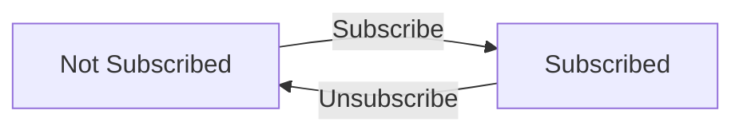

## Post Concept

Post represents user-created content shared within a Community. Every Post requires a title and belongs to one of three content types: a text post containing written content, a link post containing a URL reference, or an image post containing an uploaded image file. Posts are authored by Users within a specific Community and serve as the primary content unit for discussion. Each Post tracks its creation time and accumulates votes from users to calculate its vote score. The Post serves as the parent container for comments, which form threaded discussions beneath it. Posts appear in multiple feed contexts including Home Feed, Popular Feed, and Community Feed.

### Post Definition

A Post represents user-created content shared within a Community. Every Post is authored by a single User and published to a specific Community. Posts serve as the primary content unit that enables discussion and interaction within the platform.

Each Post has a required title that summarizes the content. The title is the primary identifier users see when browsing feeds and serves as the entry point for engagement.

Posts are created at a specific point in time and maintain a permanent association with their author and community. When viewing a Post, users can see its complete content, authorship information, community affiliation, vote score, comment count, and creation time.

Posts function as containers for Comments, enabling threaded discussions beneath each piece of content. All Comments written on a Post are logically grouped and displayed together.

Posts accumulate votes from users over time. The vote score represents the net result of upvotes minus downvotes and determines the Post's visibility and ranking in feeds.

### Content Types

Every Post must be one of three mutually exclusive content types: text post, link post, or image post. The content type determines what information the Post contains and how it is displayed to users.

**Text Post**
A text post contains written content provided by the author. This content can span multiple paragraphs and supports free-form text expression. When displayed in feed views, text posts show the first 200 characters of their content as a preview.

**Link Post**
A link post contains a URL referencing external content. The URL points to a resource outside the platform, such as a news article, video, or website. When displayed, link posts show the domain name extracted from the URL (for example, "youtube.com" or "github.com") to inform users where the link leads.

**Image Post**
An image post contains an uploaded image file. The image is stored by the platform and displayed as the primary content of the Post. When displayed in feed views, image posts show a thumbnail representation of the uploaded image.

A Post's content type is determined at creation and cannot be changed after the Post is published. This ensures consistent user expectations about what type of content will be displayed.

### Vote Score

Each Post maintains a vote score that represents the collective opinion of users who have voted on it. The vote score is calculated as the total number of upvotes minus the total number of downvotes.

The vote score can be positive, zero, or negative. A positive score indicates more upvotes than downvotes, while a negative score indicates more downvotes than upvotes. The score directly impacts how Posts are ranked and sorted in feeds.

Vote scores are used in multiple feed sorting algorithms:
- Hot sorting considers Posts with high vote scores that were created recently
- Top sorting ranks Posts purely by vote score, optionally filtered by time period
- Controversial sorting identifies Posts with high total vote activity but scores close to zero

The vote score is a dynamic value that changes as users cast, change, or remove their votes. Each user's vote contributes either positively (upvote) or negatively (downvote) to the score.

### Comment Container

A Post serves as the parent container for Comments, establishing the discussion thread for that piece of content. All Comments written in response to a Post are logically grouped and displayed beneath it.

Comments can be nested within the Post's discussion thread. A Comment may be a direct reply to the Post itself, or it may be a reply to another Comment. This creates a hierarchical tree structure of unlimited depth, where each Post can have multiple top-level Comments, and each Comment can have multiple reply Comments.

The Post tracks the total number of Comments in its discussion thread, including all nested replies at any depth. This comment count is displayed alongside the Post in feed views and on the Post detail page.

When a Post is deleted, all Comments within its discussion thread are also removed. This ensures that discussions do not persist without their parent content context.

### Feed Display

Posts appear in three distinct feed contexts within the platform, each serving different user needs and visibility rules.

**Home Feed**
The Home Feed shows Posts exclusively from Communities the user is subscribed to. This feed is personalized based on the user's subscription choices and is only available to logged-in users.

**Popular Feed**
The Popular Feed shows Posts from all Communities across the platform, regardless of subscription status. This feed is available to all users, including those who are not logged in.

**Community Feed**
The Community Feed shows only Posts published to a specific Community. This feed is available to all users and displays the collective content of that Community.

When displayed in any feed, each Post shows: title, author username, community name, current vote score, total comment count, and time since posted. Additionally, the display varies by content type: text posts show a content preview (first 200 characters), link posts show the destination domain, and image posts show a thumbnail.

### Community Posting Relationship

Every Post exists within the context of exactly one Community. The Community defines the audience, topic scope, and moderation rules for the Post.

The relationship between a User and Community determines whether the User can create Posts in that Community. A User must be subscribed to a Community before they can publish Posts to it. This subscription requirement ensures that users engaging with a Community have demonstrated interest in its content.

Posts maintain a permanent association with their Community. When browsing a Community, users see all Posts published to that Community. The Community serves as the organizational boundary that groups related content together.

Community moderators have authority over all Posts published within their Community, regardless of who authored the Post. This includes the ability to remove Posts that violate Community guidelines.

## Comment Concept

Comment represents user-generated text responses to Posts or other Comments. Comments can be nested with unlimited depth, allowing for threaded discussions with replies on replies. Each Comment contains content text and tracks when it was created. Comments accumulate votes from users to calculate their vote score, similar to posts. Comments serve as the discussion mechanism within posts and can be authored by any user with posting permissions in the community. The nested structure enables complex conversation threads where users can respond directly to specific points.

### Comment Content and Response

A Comment represents a piece of text content written by a user in response to a Post or another Comment. Each Comment must contain content — the written text that forms the user's response or contribution to the discussion. The content is the primary information carried by a Comment and represents the user's expressed opinion, information, or reaction. Comments serve as the atomic unit of discussion within posts, containing the actual substance of conversations. When a user authors a Comment, they create response content that becomes visible to other users viewing the discussion.

### Reply Nesting and Threaded Discussion

Comments support a hierarchical reply structure that enables threaded discussions. Any Comment can be a reply to either a Post (top-level comment) or to another Comment (nested reply). This creates discussion threads where conversations branch from the main post into multiple sub-conversations. The reply structure has no depth limit — replies can have replies, which can have further replies, allowing unlimited nesting depth. This enables complex conversation patterns where users directly respond to specific points made by others, creating tree-like discussion structures that preserve context and conversation flow.

The threaded discussion structure means that every Comment exists within a hierarchy:
- Top-level comments respond directly to the Post
- Nested replies respond to specific comments, creating sub-threads
- The depth can extend indefinitely to support deep conversations

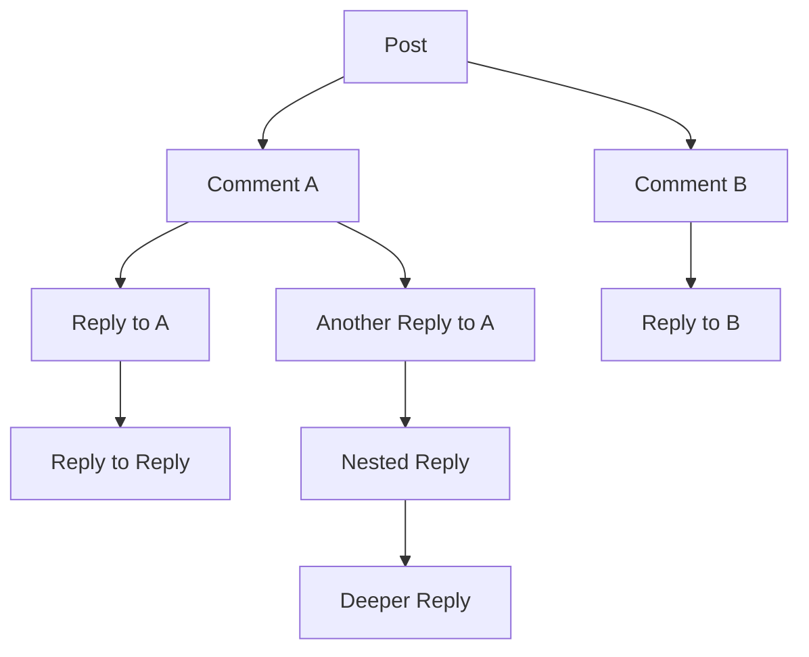

### Comment Vote Score

Each Comment accumulates votes from users to determine its vote score. The vote score represents the community's collective opinion on the Comment's quality or relevance. The score is calculated as the total number of upvotes minus the total number of downvotes received by that Comment. This score serves as a measure of the Comment's perceived value within the discussion and affects its visibility and ranking relative to other Comments. Comments with higher vote scores indicate broader community approval, while negative scores indicate disapproval.

### Comment Lifecycle States

A Comment transitions through several states during its lifecycle:
- **Active**: The Comment is visible and part of the discussion thread. This is the normal state for Comments that have been created and not removed.
- **Edited**: The author has modified the Comment's content after initial creation. The Comment remains visible but reflects updated content.
- **Deleted**: The Comment has been removed by its author. The Comment may remain in the structure with an indication it was deleted, preserving the thread continuity for nested replies below it.

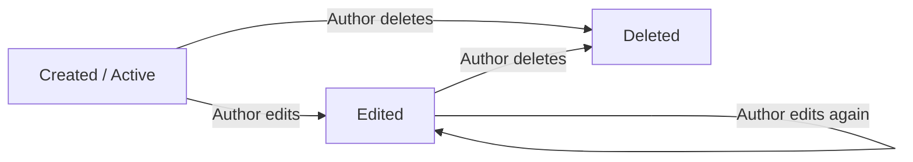

## Vote Concept

Vote represents a user's expressed opinion on a Post or Comment. A Vote can be either an upvote indicating approval or a downvote indicating disapproval. Each user can cast only one Vote per content item. Votes contribute to the total score calculation for content, which equals upvotes minus downvotes. Votes are reversible, meaning users can change from upvote to downvote or remove their Vote entirely. Vote activity also affects user karma, with each vote on a user's content impacting their total karma score positively or negatively depending on the vote type.

### Vote Definition

A vote is a user's selection or choice submitted in response to a specific poll. Each vote represents an opinion or preference expressed by a participant within the context of a poll's scope. Votes are the core data elements that aggregate into poll results.

A vote is created when a user submits their selection to a poll they are eligible to participate in. Once cast, a vote is permanently associated with both the poll it was submitted to and the user who cast it.

### Vote Attributes

A vote contains the following business attributes:

**Selection Content**: The actual choice made by the user, which corresponds to one of the available options defined by the parent poll. This may be a single option or multiple options depending on the poll configuration.

**Submission Timestamp**: The date and time when the vote was cast, captured automatically by the system at the moment of submission.

**Anonymity Status**: An indication of whether the vote was cast anonymously (decoupled from the user's identity in result displays) or is attributable to the casting user.

**Modification History**: For votes that allow changes while the poll is open, a record of previous selections and when changes occurred is maintained.

### Vote Relationships

A vote exists within the following business relationships:

**Parent Poll**: Every vote belongs to exactly one poll. A poll may have zero or many votes. The vote inherits certain attributes from its parent poll, such as availability period and option definitions.

**Casting User**: A vote is cast by exactly one user. Depending on anonymity settings, this relationship may be retained for record-keeping but hidden from result displays. The system tracks which votes belong to which users to enforce participation rules (maximum votes per user, change permissions).

**Selected Options**: A vote references one or more options defined by the parent poll. The number of selectable options is constrained by the poll's configuration (single-choice vs. multiple-choice).

### Vote States and Lifecycle

A vote transitions through the following states during its lifecycle:

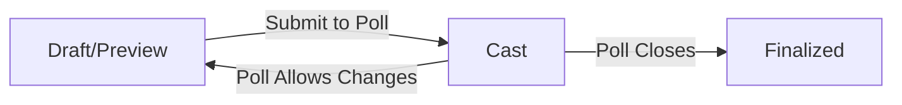

**Draft/Preview**: A preliminary state where the user has selected options but has not yet submitted the vote. The system may retain preview selections to allow users to return and complete submission later. Draft votes are not counted in poll results.

**Cast**: An active vote that has been submitted to a poll and is included in result calculations. While in this state, if the parent poll permits changes, the vote may return to draft state temporarily during modification.

**Finalized**: The terminal state reached when the parent poll closes or ends. Finalized votes cannot be modified and remain permanently associated with the poll results.

## ModeratorRole Concept

ModeratorRole represents the authority relationship between a User and a Community they help manage. The community creator holds the owner role with highest authority including the ability to add and remove other moderators. Other ModeratorRoles grant users permission to moderate content and users within the community, including deleting posts, deleting comments, banning users, and viewing reports. Moderators with this role can add additional moderators but cannot remove each other or the owner. The role defines a hierarchy of moderation authority within community governance.

### ModeratorRole Definition

A ModeratorRole represents the authority granted to a User to manage a Community. This role establishes a governance relationship where designated users help maintain community standards and enforce rules within that community. The role connects a user to a community with specific moderation privileges.

### Role Hierarchy and Governance Structure

The community governance structure consists of two authority levels: the owner and moderators. The user who creates a community automatically becomes its owner, holding the highest authority. The owner can add and remove any moderators. Other users with a ModeratorRole have moderation capabilities but operate at a lower authority level than the owner.

Moderators with the appropriate permission can add additional moderators to help manage the community. However, only the owner can remove moderators. A moderator cannot remove the owner or other moderators from their role. This creates a clear hierarchy where the owner retains ultimate control over the moderation team while allowing trusted moderators to expand the team as needed.

Each moderator role includes an indication of whether that moderator can add other moderators, allowing the owner to delegate recruitment authority selectively.

### Moderation Authority and Capabilities

Users with a ModeratorRole have authority to perform content moderation actions within the community. This includes the ability to delete any post in the community regardless of who authored it, and to delete any comment within the community. These deletion capabilities help moderators remove content that violates community rules or platform policies.

For user moderation, moderators can ban users from the community, preventing those users from creating posts or writing comments within that community. Moderators can also unban users to restore their posting privileges, and can view the complete list of banned users in the community. Banned users retain the ability to view content in the community but cannot participate by posting or commenting.

Moderators can access the report review queue to view all reports submitted for content in their community. Each report shows the reported post or comment, the user who submitted the report, and the reason provided. Moderators can approve a report to remove the reported content, or dismiss the report to keep the content. Once dismissed, reports are removed from the review queue.

## Ban Concept

Ban represents a restriction preventing a User from creating Posts or Comments within a specific Community. Bans are issued by moderators to enforce community rules and maintain quality standards. A Ban can optionally include a reason explaining why it was issued. Banned users retain the ability to view content in the community but lose all posting and commenting privileges. Bans are community-specific and do not affect a user's activity in other communities. Moderators can review and revoke bans to restore user participation rights.

### Ban Restrictions on User Activity

A Ban is a restriction placed on a user within a specific community that prevents them from creating new content while preserving their ability to access existing content. When a ban is in effect, the affected user cannot create posts in the community. The user also cannot write comments or replies on any posts within that community. These restrictions apply only to content creation activities—banned users retain full read access to all posts, comments, and other public content within the community. The posting and commenting restrictions remain active until the ban is revoked by a moderator or expires if a time limit was set. This restriction mechanism allows communities to enforce behavioral standards without completely excluding users from consuming the community's knowledge and discussions.

### Ban Reason Documentation

Every ban includes a reason text that explains why the restriction was imposed. The reason is provided by the moderator who issues the ban and serves as documentation for both the affected user and other moderators. The reason describes the specific behavior or violation that led to the enforcement action. When a user attempts to create content while banned, they may reference this reason to understand the basis for their restriction. The reason text helps maintain transparency in moderation decisions and provides a record for reviewing whether the ban remains appropriate over time.

### Community-Specific Restriction Scope

Bans are strictly scoped to a single community and do not affect user privileges elsewhere on the platform. A user banned in one community can continue to participate normally in all other communities where they are not banned. The restriction applies only within the specific community where the ban was issued. This community-specific approach allows each community to set and enforce its own standards independently. A user may be banned in multiple communities simultaneously, with each ban operating independently. The isolation of bans per community ensures that moderation decisions in one community do not unnecessarily impact a user's participation in unrelated communities with different rules and cultures.

### Moderator Enforcement and Ban Revocation

Only users holding moderator authority within a community can issue bans. The moderator initiating a ban must have the appropriate role in that specific community. When a ban is issued, it is recorded with the identity of the issuing moderator for accountability. Moderators can also revoke existing bans to restore a user's full participation rights. Revocation removes all posting and commenting restrictions immediately, allowing the affected user to resume normal activity in the community. The revocation action is also attributed to the moderator who performs it. This enforcement and revocation process gives communities flexibility to correct mistakes, show leniency for improved behavior, or adjust restrictions as circumstances change.

## Report Concept

Report represents a user's flagging of potentially problematic Post or Comment content for moderator review. Reports require a reason explaining the concern. Reports track the content item being reported, the user who submitted the report, and the provided reason text. Moderators can view pending reports and take action by either approving the report resulting in content deletion, or dismissing the report which removes it from the review queue. Reports serve as the community-driven content moderation mechanism that helps moderators identify content violating community standards.

### Report Purpose and Content Flagging

Report represents the mechanism through which users flag potentially problematic content for moderator attention. Any user may submit a report against any post or comment they believe violates community standards or platform guidelines.

When a user identifies content that may constitute a violation, they initiate the reporting process by selecting the content item and providing an explanation of their concern. This content flagging capability enables community members to participate in maintaining content quality and identifying material that requires moderator intervention.

The reporting system captures the identity of the user submitting the report, the specific content item being flagged, and the timestamp when the report was submitted. This information establishes accountability and provides context for moderator review.

### Report Reason and Tracking

Every report must include a reason explaining why the content is being flagged. The reason is a required text description that helps moderators understand the nature of the concern and evaluate whether the reported content violates community standards.

The report reason should describe the perceived violation clearly enough for moderators to make an informed assessment. Examples of report reasons might include spam, harassment, misinformation, off-topic content, or violations of specific community rules.

Reports are tracked in association with both the reporting user and the reported content. This tracking maintains a record of who raised concerns about specific content and allows moderators to identify patterns of problematic behavior or repeated reports against the same content or users.

### Moderator Review Queue and Report Resolution

Submitted reports enter a moderator review queue where they await assessment by community moderators. Each report initially has a pending status, indicating it requires moderator attention and decision.

Moderators access the review queue to view all pending reports for their community. Each entry in the queue displays the reported content, the identity of the reporting user, and the provided reason for the report.

Moderators evaluate each report and make one of two determinations:

**Report Approval**: When a moderator determines the reported content does violate community standards, they approve the report. This action results in the deletion of the reported content and removal of the report from the review queue.

**Report Dismissal**: When a moderator determines the reported content does not violate community standards, they dismiss the report. This action preserves the content and removes the report from the review queue, indicating moderator review is complete.

This community moderation workflow enables moderators to efficiently process user concerns and maintain content quality through collective oversight.

# Domain Relationships

Describe how concepts relate to each other from a business perspective.

## Conceptual Relationships

Describe how concepts relate to each other in business terms.

### User-to-Profile Relationship

A user has exactly one profile (defined in Module 1 UserProfile Concept). This is a one-to-one association where the profile extends the user with additional public information not used for authentication. The profile contains the display name, bio text, avatar image, and karma score.

Deleting a user also deletes their associated profile. The profile cannot exist independently of its user.

### User-to-Community via Subscription

A user has a many-to-many relationship with communities through the subscription concept. When a user subscribes to a community, a subscription association is created. Users can subscribe to many communities, and communities can have many subscribers.

This belongs-to relationship is required for creating posts in a community—only users who have an active subscription to a community may create posts there.

The home feed is derived from this relationship, showing posts only from communities the user has subscribed to.

### Community Ownership

Every community has exactly one owner, which is the user who created the community (defined in Module 1 Community Concept). This is a belongs-to relationship from community to user.

The owner has special authority compared to other relationships—only the owner can remove moderators. The ownership relationship persists until the community is deleted and cannot be transferred based on the current requirements.

### Community-to-Posts Relationship

A community has a one-to-many relationship with posts. Each post belongs to exactly one community, and a community contains many posts. This belongs-to relationship determines:

- Which community feed displays the post
- Which users can create posts (must be subscribed)
- Which moderators have authority over the post

When a community is deleted, all its posts are also deleted.

### User-to-Posts Authorship

A user has a one-to-many relationship with posts they have authored. Each post has exactly one author (the user who created it). This ownership relationship grants the author permanent rights to edit or delete their own posts, regardless of their role in the community.

When a user deletes their account, all posts they authored are also deleted.

### Content Hierarchy: Posts and Comments

Posts and comments form a hierarchical relationship. A post has many comments (one-to-many), and each comment belongs to exactly one post.

Comments additionally have a self-referential relationship for replies—each comment can have many reply comments, and each reply comment belongs to one parent comment. This creates a nested tree structure with unlimited depth.

Both posts and comments maintain their individual ownership (belongs-to user) within this hierarchy.

### User-to-Content via Voting

Users have a many-to-many relationship with both posts and comments through voting. A user can vote on many posts and comments, and each post or comment can receive votes from many users. Each user can cast only one vote per piece of content (either upvote or downvote).

This relationship affects karma—the user who authored the voted content receives karma adjustments based on votes cast by other users. When a vote is removed, both the vote relationship and the karma impact are eliminated.

### User-to-Community via Moderation

Users have a many-to-many relationship with communities through moderator roles. A user can be a moderator of many communities, and a community can have many moderators. This relationship includes a hierarchy: the community owner has the highest authority, moderators have elevated authority, and regular members have base authority.

Moderators can add other moderators, but only owners can remove moderators. This relationship grants authority to delete any post or comment in the community, ban and unban users, and view reports.

### User-to-Community via Bans

Users have a many-to-many relationship with communities through bans. A user can be banned from many communities, and a community can ban many users. This is a restricted belongs-to relationship that prevents the banned user from creating posts or comments in that community while still allowing them to view content.

Bans are issued by moderators, creating a relationship between the ban record and the issuing moderator. When a ban is lifted, the association is removed.

### User-to-Content via Reporting

Users have a reporting relationship with posts and comments. Any user can report many posts and comments, and each post or comment can have many reports from different users. This many-to-many relationship (defined in Module 1 Report Concept) creates a review queue for moderators.

Reports are associated with the community containing the reported content, allowing moderators to view all pending reports for their community. Each report record maintains associations with the reporter, the reported content, and the community.

## Lifecycle and Retention

Describe concept lifecycle states and transitions only. Detailed retention/recovery policies belong in 05-non-functional. Operation details belong in 03-functional-requirements.

### Account Lifecycle

### User Account States

A user account exists in one of two states: active or deleted.

**Active State**
An active account allows the user to perform all permitted actions including creating posts, writing comments, voting on content, creating communities, and subscribing to communities.

**Deleted State**
When a user deletes their account, the account transitions to a deleted state. The user's posts and comments are also deleted as part of this transition. Once deleted, the account cannot be reactivated, though the username may become available for new registrations.

### Account Deletion Flow

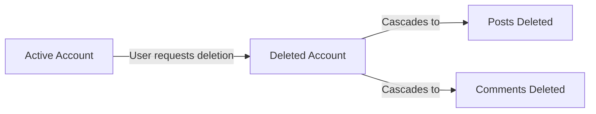

### Profile Retention

User profile information including display name, bio, and avatar is retained only while the account is active. When the account is deleted, this profile information is removed. Karma scores associated with deleted accounts are no longer visible on the platform.

### Content Lifecycle

### Post Lifecycle

Posts exist in one of two states: published or deleted.

**Published State**
A published post is visible to all users who can access its community. Published posts can be voted on, commented on, and reported. The post author can edit the post content while in this state.

**Deleted State**
A post transitions to deleted state when:
- The post author chooses to delete it
- A moderator deletes it from the community
- The author's account is deleted

Deleted posts are no longer visible in feeds or community views. Votes and comments on deleted posts remain for karma calculation purposes but the post content itself is no longer accessible.

### Comment Lifecycle

Comments exist in one of two states: active or deleted.

**Active State**
An active comment is visible within its post's comment thread. Active comments can receive replies, votes, and reports. The comment author can edit the content while active.

**Deleted State**
A comment transitions to deleted state when:
- The comment author chooses to delete it
- A moderator deletes it from the community
- The author's account is deleted

Deleted comments remain in the comment thread structure to preserve conversation context, but their content is no longer visible. Replies to deleted comments remain visible.

### Report Lifecycle

### Report States

Reports exist in one of three states: pending, approved, or dismissed.

**Pending State**
When a user submits a report, it enters the pending state. Pending reports are visible to community moderators in the review queue. Each pending report includes the reported content, the reporting user, and the reason provided.

**Approved State**
When a moderator approves a report, it transitions to the approved state. Approval causes the reported content (post or comment) to be deleted. The report is retained for record-keeping purposes.

**Dismissed State**
When a moderator dismisses a report, it transitions to the dismissed state. The reported content remains published. Dismissed reports are removed from the moderator's review queue.

### Report Flow

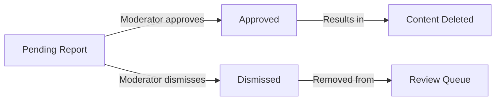

### Ban Lifecycle

### Ban States

Bans exist in one of two states: active or expired.

**Active State**
An active ban prevents the banned user from creating posts or comments in the community. The user can still view content in the community. Active bans appear in the community's banned user list.

**Expired State**
A ban transitions to expired state when:
- A moderator manually unbans the user
- The ban reaches its expiration date (if one was set)

Expired bans no longer restrict the user's ability to post or comment. The ban record may be retained for moderation history purposes.

### Ban Duration Types

Bans may be issued with or without an expiration date:
- **Temporary bans** have a specific expiration date after which they automatically expire
- **Permanent bans** remain active until manually revoked by a moderator

# Business Categories and State Flows

Business category classifications and state flow definitions.

## Business Category Definitions

Define all business category classifications with their allowed values and descriptions.

### Post Type Categories

Posts are classified into exactly one of three content types based on their primary media format.

### Text Post
A text post contains written content authored directly within the platform. The content is plain text and serves as the entire body of the post.

### Link Post
A link post contains a reference to an external resource identified by a uniform resource locator. The post title describes the external content, and the link directs users to view that content outside the platform.

### Image Post
An image post contains a visual media file uploaded by the author. The image is hosted within the platform and displayed as the primary content of the post.

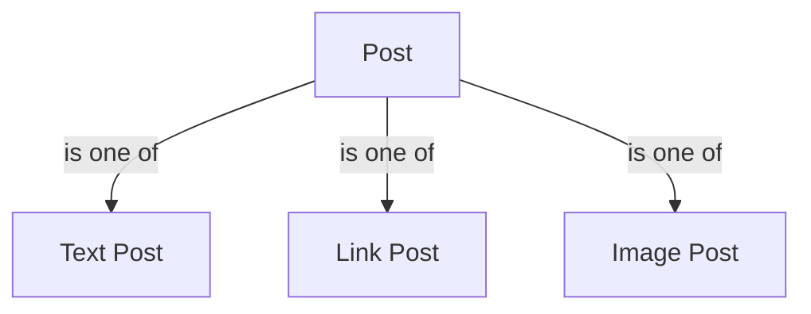

### Vote Type Categories

Votes express user sentiment toward content. Each vote is classified into one of two mutually exclusive sentiment categories.

### Upvote
An upvote expresses positive sentiment or agreement with the content. When cast, it increases the content's vote score by one and increases the author's karma by one.

### Downvote
A downvote expresses negative sentiment or disagreement with the content. When cast, it decreases the content's vote score by one and decreases the author's karma by one.

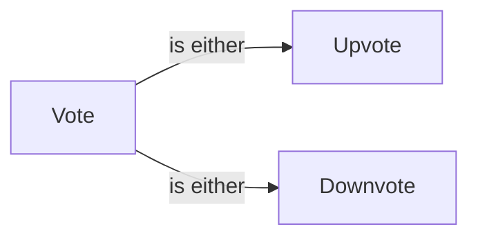

### Report Status Categories

Reports progress through a defined lifecycle from submission to resolution. Each report is classified into exactly one status category indicating its current state in the moderation workflow.

### Pending
A newly submitted report awaiting moderator review. The reported content remains visible while the report is pending. This is the initial status for all reports.

### Approved
A report that moderators have validated as violating community guidelines. When a report is approved, the reported content is deleted and the report is considered resolved.

### Dismissed
A report that moderators have reviewed and determined not to violate community guidelines. The reported content remains visible and the report is removed from the review queue.

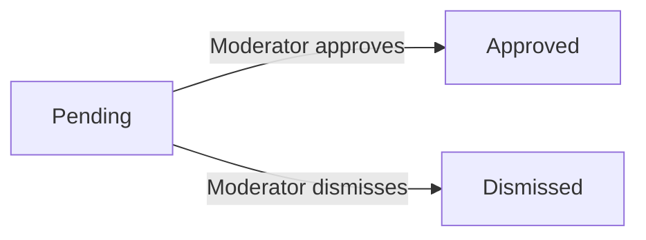

### Feed Sorting Categories

Content feeds can be organized according to different sorting criteria. Each sorting category defines a specific ordering of posts based on engagement metrics, recency, or vote patterns.

### Hot
Posts ordered by a combination of recency and engagement volume. Posts receiving many upvotes in a short time period appear higher in the feed than older posts or posts with less engagement.

### New
Posts ordered strictly by creation time. The most recently created posts appear first, regardless of engagement or vote score.

### Top
Posts ordered by total vote score from highest to lowest. This category requires an additional time filter to specify the relevant period.

### Controversial
Posts ordered by engagement patterns where many votes exist but the score is close to zero. These posts generate significant discussion with divided opinion.

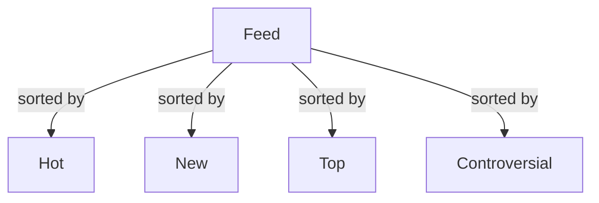

### Time Filter Categories

When viewing posts sorted by Top, users must specify a time period that defines the scope of content considered. Each time filter category specifies a date range relative to the current moment.

### Today
Includes only posts created within the current calendar day.

### This Week
Includes only posts created within the last seven days.

### This Month
Includes only posts created within the last thirty days.

### This Year
Includes only posts created within the last 365 days.

### All Time
Includes all posts ever created on the platform without date restriction.

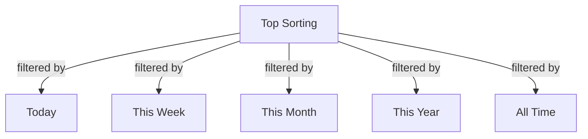

### Comment Sorting Categories

Comments on a single post can be organized according to different sorting criteria. Each category defines a specific ordering of comments within the discussion thread.

### Best
Comments ordered by vote score from highest to lowest. Comments with the most positive community reception appear first.

### New
Comments ordered strictly by creation time. The most recently written comments appear first, regardless of vote score.

### Controversial
Comments ordered by engagement patterns where many votes exist but the score is close to zero. These comments generate significant disagreement among readers.

## State Transitions

Define valid state transition paths for stateful concepts.

### Report Review Workflow

A report is created with pending status when a user submits it.

Moderators review pending reports and take one of two actions:
- Approve the report: the reported content is deleted and the report status changes to approved
- Dismiss the report: the content remains and the report status changes to dismissed

Once a report is approved or dismissed, no further action can be taken on that report.

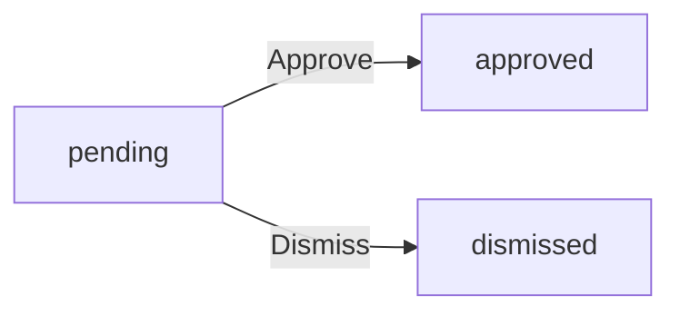

Reports in approved or dismissed status are removed from the moderator's review queue.

### Content Deletion Workflow

Posts and comments exist in an active state when created.

The author can delete their own post or comment at any time, transitioning it to deleted state.

Moderators can delete any post or comment in their community, transitioning it to deleted state.

Deleted posts no longer appear in feeds or community listings.
Deleted comments are hidden from view but may retain their structural position in reply threads.

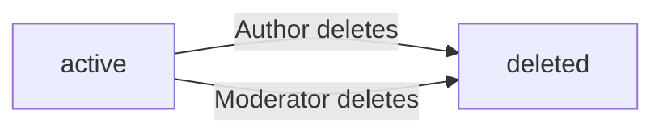

Once deleted, content cannot be restored to active state.

### Vote State Transitions

A user has no vote on a post or comment initially.

From no vote, a user can:
- Cast an upvote
- Cast a downvote

From upvote, a user can:
- Change to downvote
- Remove the vote entirely

From downvote, a user can:
- Change to upvote
- Remove the vote entirely

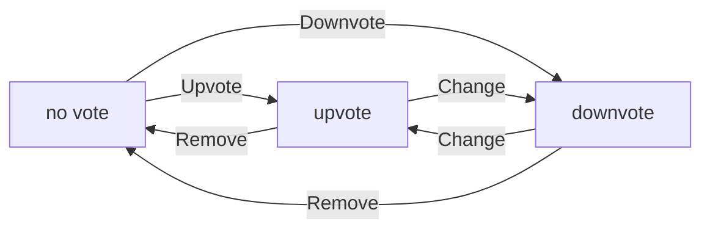

Each transition immediately updates the vote score and the content author's karma accordingly.

### Account Deletion Workflow

A user account exists in active state after registration is complete.

The account owner can delete their account, transitioning it to deleted state.

When an account is deleted:
- The user profile is removed
- All posts created by the user are deleted
- All comments written by the user are deleted
- The username may be released for reuse by new registrations

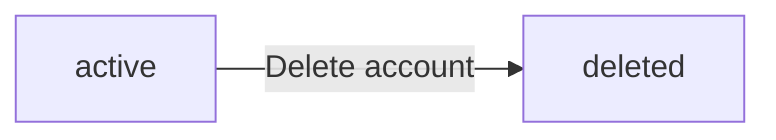

Deleted accounts cannot be reactivated.

### Ban Lifecycle

A banned user is restricted from creating posts or comments in the community where the ban was issued.

A ban begins in active state when a moderator issues it.

An active ban can end in two ways:
- A moderator manually unbans the user
- The ban reaches its expiration date if one was set

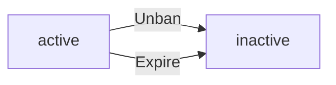

Once inactive, the user may create posts and comments in that community again. Bans without expiration dates remain active until manually unbanned.