**redditLike — What operations users can perform, use cases, business workflows**

What operations users can perform, use cases, business workflows

# Core Business Operations

What the system must do for each business concept.

## User Operations

Users create accounts by providing an email address, a password, and choosing a unique username that identifies them across the platform. Users authenticate themselves by entering their registered email address and password to access their account and platform features. Users may change their account password to maintain security or after suspected compromise. Users can permanently delete their account, which removes all associated data including every post and comment they have created throughout their history on the platform. Account deletion is irreversible and affects all content ownership traces. Username uniqueness is enforced across the entire platform to prevent identity confusion. Email addresses must be unique to prevent duplicate registrations.

### User Registration

Users can create a new account by providing an email address, a password, and a unique username.

The system presents a registration form requesting the following information:
- Email address: must be unique across the platform (no other account may use this email)
- Username: must be unique across the platform and identifies the user throughout the system
- Password: required for authentication

The system validates that the email address is not already registered. If the email is already in use, the registration request is rejected.

The system validates that the username is not already taken. If the username is already in use, the registration request is rejected.

Upon successful registration, the system creates a new user account with the provided information. The user can immediately authenticate using their email address and password.

### Registration Flow
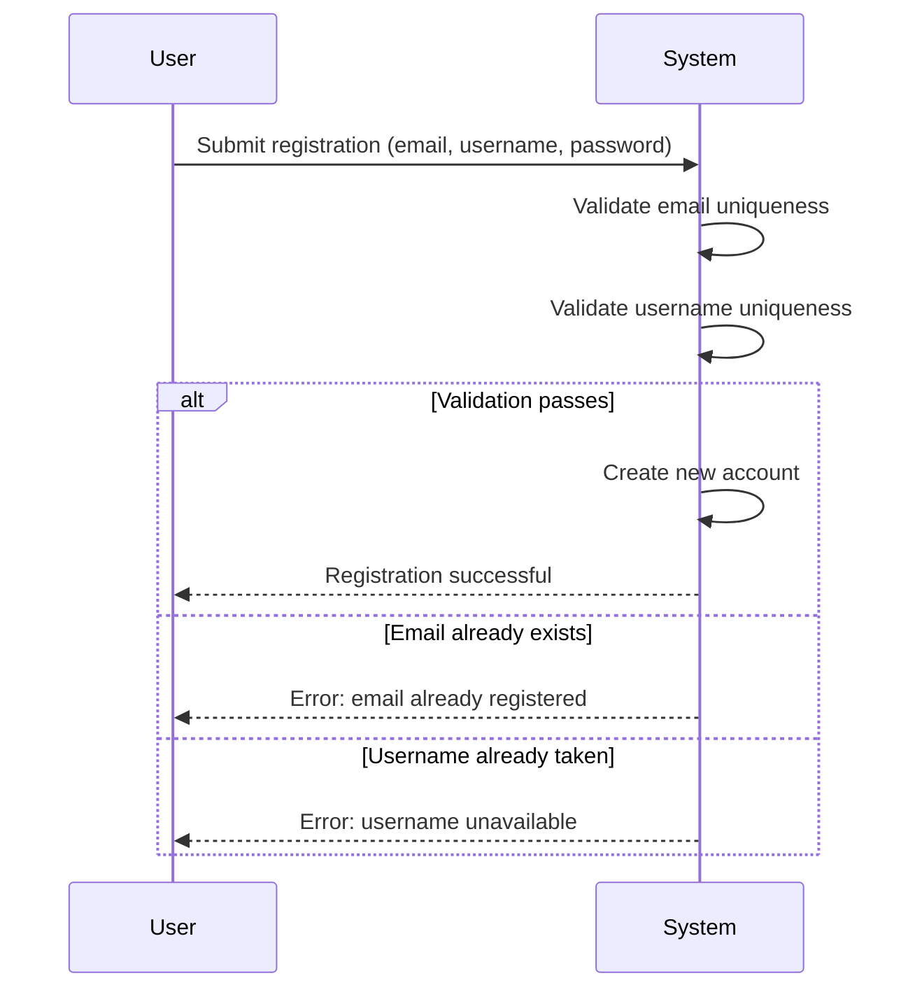

### User Authentication

Users can authenticate to access their account and platform features by providing their registered email address and password.

The system presents an authentication form requesting:
- Email address (registered with the account)
- Password (associated with the email)

The system verifies that the email address corresponds to an existing account and that the provided password matches the account credentials.

If authentication succeeds, the user gains access to their account and all features available to authenticated members.

If authentication fails due to incorrect email or password, the request is rejected without revealing which specific field was incorrect.

### Password Change

Authenticated users can change their account password to maintain security or after suspected compromise.

The user must provide their current password to authorize the change. The system validates that the current password matches before accepting the new password.

The user specifies a new password to replace the current one.

If the current password is incorrect, the change request is rejected and the password remains unchanged.

Upon successful validation, the system updates the account to use the new password. The user must use the new password for subsequent authentication attempts.

### Account Deletion

Users can permanently delete their account from the platform. This action is irreversible and removes all content associated with the user.

When an account is deleted, the following cascading effects occur:
- All posts created by the user are removed from the platform
- All comments written by the user are removed from the platform
- All votes cast by the user are removed
- All subscriptions are cancelled
- All moderator roles held by the user are relinquished
- All reports filed by the user are removed
- The user's profile information is deleted
- The account itself is permanently closed

The system may retain certain information required by platform policies (as defined in data retention policies), but the user account and all public content are removed.

Deleted accounts cannot be recovered. The username and email address may become available for new registrations after deletion (subject to platform policies).

## UserProfile Operations

Each user has a public profile that displays their chosen display name, a bio text describing themselves, and an avatar image representing their identity. Users can modify their own display name, bio text, and avatar image at any time to keep their profile current. Any user can view another user's profile page to learn more about them. A profile page displays the user's display name, bio text, and avatar image prominently. The profile shows the user's total accumulated karma score calculated from votes on their posts and comments. The profile includes a complete list of all posts created by that user. The profile includes a complete list of all comments written by that user.

### Viewing User Profiles

Any user can view the profile page of any other user on the platform. The profile page is publicly accessible and displays the user's chosen identity information.

When viewing a profile, the following information is displayed:
- The user's display name (if set) or username
- The user's bio text description
- The user's avatar image
- The user's total karma score
- A complete list of all posts created by that user
- A complete list of all comments written by that user

Profile pages can be accessed by both logged-in users and logged-out visitors. The profile view does not reveal private account information such as email address or password.

### Editing Own Profile

Users can modify their own profile information at any time. The editable profile fields include:
- Display name: an optional name shown instead of the username
- Bio: an optional text description about the user
- Avatar: an optional profile image representing the user's identity

Users can update any combination of these fields in a single operation. Changes take effect immediately and are visible to all other users viewing the profile.

Only the profile owner can modify their own profile information. Users cannot edit the profiles of other users.

### Karma Score Display

Each user's profile prominently displays their total karma score. The karma score is a single numerical value representing the net sum of all votes received on the user's posts and comments across all communities.

The karma score increases by one point for each upvote received on any of the user's posts or comments. The karma score decreases by one point for each downvote received. When a user removes their vote, the karma score adjusts accordingly to reflect the removal.

The karma score can be negative if the user has received more downvotes than upvotes. The current karma total is always visible on the user's profile page.

### User Post List on Profile

A user's profile page includes a complete listing of all posts they have created across all communities. The post list displays summary information for each post including:
- Post title
- Community where the post was created
- Vote score
- Comment count
- Time since the post was created
- For text posts: a preview of the content
- For image posts: a thumbnail preview
- For link posts: the domain of the URL

Posts are displayed in reverse chronological order by default, with the most recently created posts appearing first. The list includes all posts regardless of their current status, including posts that may have been deleted by moderators.

### User Comment List on Profile

A user's profile page includes a complete listing of all comments they have written across all posts and communities. The comment list displays:
- The comment content
- The post where the comment was made
- The community containing that post
- The vote score of the comment
- The time since the comment was created
- An indication if the comment is a reply to another comment

Comments are displayed in reverse chronological order, with the most recent comments appearing first. The list includes all comments regardless of their location or current status.

## Community Operations

Any registered user can create a new community by providing a unique name, description text explaining the community's purpose, and an icon image representing the community. The user who creates a community automatically becomes its owner with full control rights. All users can browse a complete list of all communities existing on the platform. Users can search for specific communities by entering a community name to find relevant groups. Each community displays its current subscriber count publicly to show its popularity and activity level. Community names must be unique across the platform to avoid identification conflicts. Communities serve as containers for posts and discussions on specific topics.

### Community Creation

Any registered member can create a new community by providing a name, a description explaining the community's purpose, and optionally an icon image.

The community name must be unique across the entire platform. If another community already uses the requested name, the creation request is rejected.

The member who creates a community automatically becomes its owner. The owner has full control rights over the community, including the ability to manage moderators and moderate content.

Upon successful creation, the community is immediately available for other users to discover, browse, and subscribe to.

Members can create multiple communities. There is no limit on how many communities a single member can own.

### Community Discovery and Search

All users, including guests who are not logged in, can view a list of all communities that exist on the platform.

The community list displays each community's name, description, icon, and current subscriber count. The subscriber count indicates how many members are currently subscribed to that community.

Users can search for communities by entering all or part of a community name. The search returns communities whose names match or contain the search term.

When search yields no matching communities, the system indicates that no results were found.

Communities are displayed in the list in a consistent order, typically sorted by name alphabetically or by popularity based on subscriber count.

### Viewing Community Details

When viewing a specific community, users see the community's name, description, icon, subscriber count, and the username of the community owner.

The community page displays all posts that have been created within that community, sorted according to the user's selected feed preference.

For logged-in members who are subscribed to the community, the interface indicates their subscription status and provides the option to unsubscribe.

For logged-in members who are not subscribed, the interface provides the option to subscribe.

Guests who are not logged in can view community content but cannot subscribe or create posts.

## Subscription Operations

Users can subscribe to any community they wish to follow and receive content from. Users can unsubscribe from communities they no longer wish to follow. Users can view a complete list of all communities they are currently subscribed to. Subscription to a community is mandatory before a user can create posts within that community. Subscription status determines which posts appear in the user's personalized home feed. Users have the flexibility to manage their subscriptions by adding or removing communities at any time. Subscription relationships connect users to communities for content access and participation.

### Subscribe to Community

### FR-SUB-001: Subscribe Operation
Members can subscribe to any community that exists on the platform.

### FR-SUB-002: Subscription Association
When a member subscribes to a community, the system records the subscription relationship between the member and the community.

### FR-SUB-003: Subscription Timestamp
The system records when the subscription was created.

### FR-SUB-004: Duplicate Subscription Prevention
If a member attempts to subscribe to a community they are already subscribed to, the request is rejected.

### FR-SUB-005: Post-Creation Subscription Effect
Once subscribed, the member becomes eligible to create posts in that community.

### FR-SUB-006: Home Feed Subscription Effect
Once subscribed, posts from that community appear in the member's home feed.

### FR-SUB-007: Immediate Effect
Subscriptions take effect immediately upon successful completion.

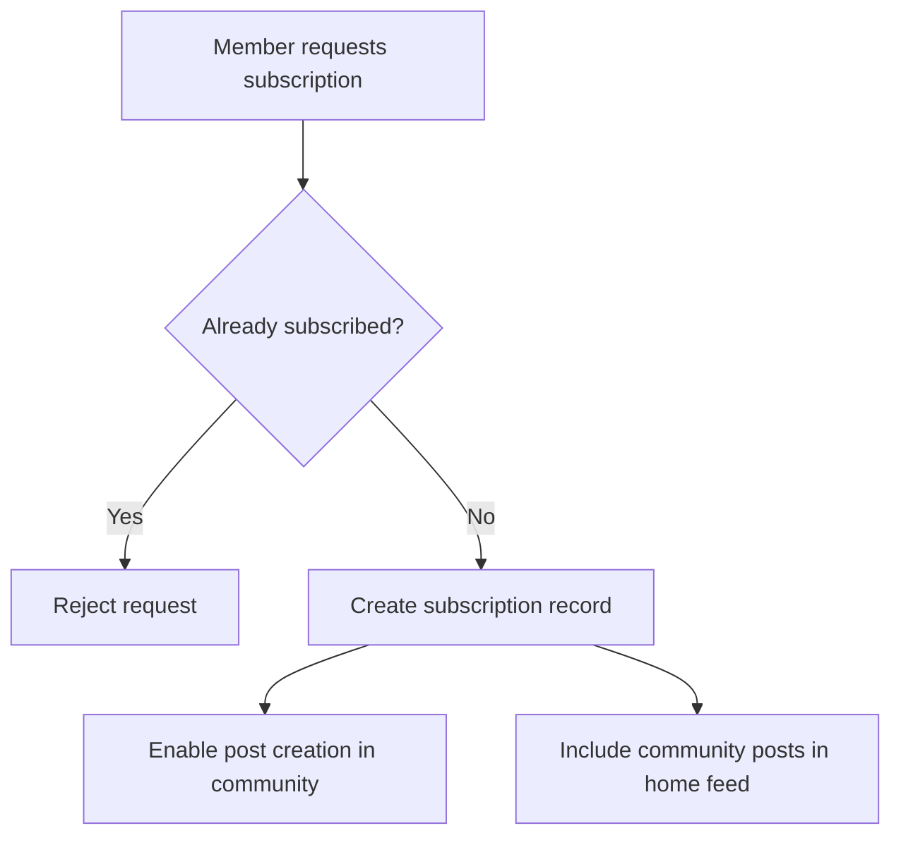

### Unsubscribe from Community

### FR-SUB-008: Unsubscribe Operation
Members can unsubscribe from any community they are currently subscribed to.

### FR-SUB-009: Subscription Removal
When a member unsubscribes, the system removes the subscription relationship.

### FR-SUB-010: Unsubscribe Timestamp
The system records when the unsubscription occurred for audit purposes.

### FR-SUB-011: Post-Creation Restriction After Unsubscribe
Once unsubscribed, the member can no longer create new posts in that community until they resubscribe.

### FR-SUB-012: Home Feed Exclusion After Unsubscribe
Once unsubscribed, posts from that community no longer appear in the member's home feed.

### FR-SUB-013: Not Subscribed Error
If a member attempts to unsubscribe from a community they are not subscribed to, the request is rejected.

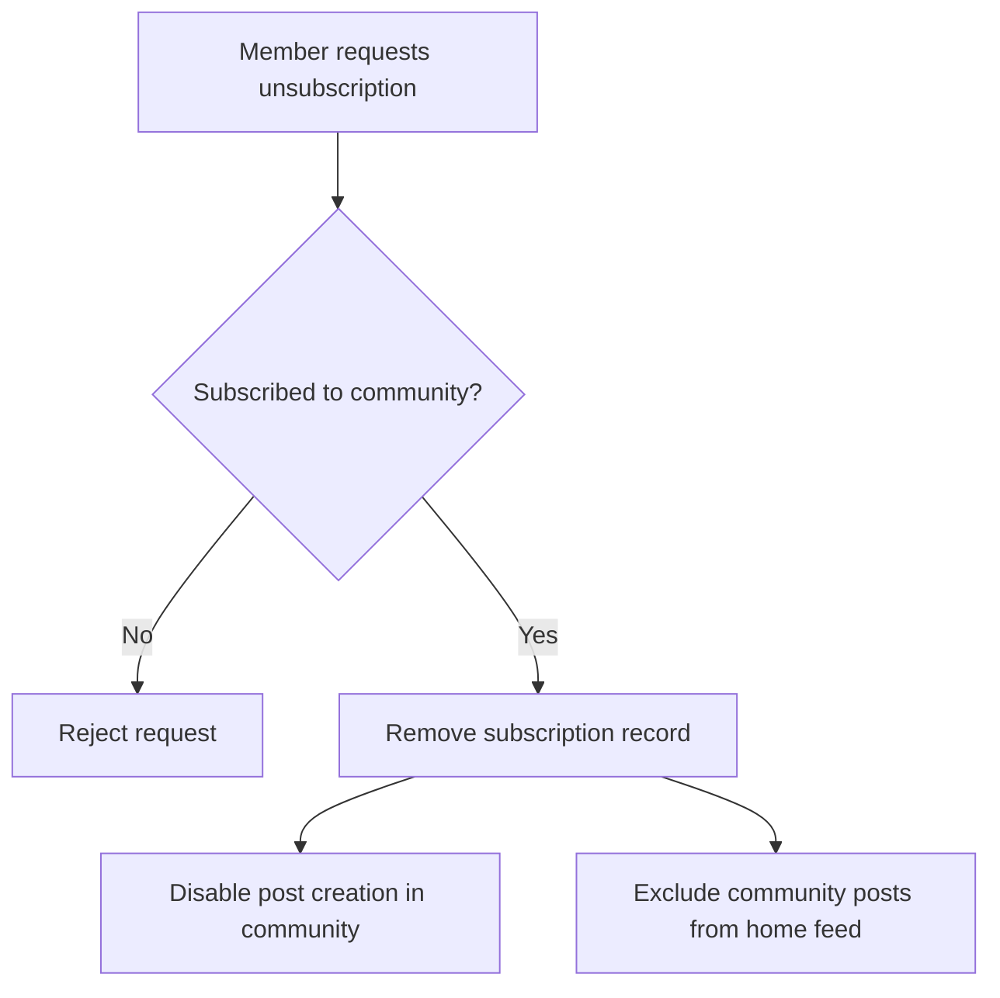

### View Subscribed Communities

### FR-SUB-014: Subscribed Communities List
Members can view a complete list of all communities they are currently subscribed to.

### FR-SUB-015: List Content
The subscribed communities list displays each community's name, description, icon, and subscriber count.

### FR-SUB-016: Subscription Count Display
For each community in the list, the total number of subscribers is shown.

### FR-SUB-017: Empty List State
If a member has no subscriptions, the system displays an appropriate empty state message indicating no subscriptions exist.

### FR-SUB-018: Subscription Management Access
The subscribed communities list provides options to unsubscribe from any listed community.

### FR-SUB-019: Navigation to Communities
Each entry in the subscribed communities list links to the respective community page.

### Subscription Requirements for Post Creation

### FR-SUB-020: Subscription Prerequisite
Members must be subscribed to a community before they can create posts in that community.

### FR-SUB-021: Subscription Verification
When a member attempts to create a post, the system verifies the member is subscribed to the target community.

### FR-SUB-022: Unsubscribed Member Restriction
If a member attempts to create a post in a community they are not subscribed to, the post creation is blocked.

### FR-SUB-023: Subscription at Time of Creation
The member must have an active subscription at the moment of post creation. Past subscriptions that have been cancelled do not permit post creation.

### FR-SUB-024: One-Time Check
Subscription verification occurs at the time of post creation. If a member unsubscribes after creating a post, the existing post remains in the community.

### Home Feed Based on Subscriptions

### FR-SUB-025: Home Feed Scope
The home feed displays posts exclusively from communities the member is currently subscribed to.

### FR-SUB-026: Authentication Requirement
Access to the home feed requires the user to be authenticated as a member.

### FR-SUB-027: Guest Restriction
Guests cannot access the home feed and must view the popular feed instead.

### FR-SUB-028: Feed Population
The system aggregates posts from all communities the member is subscribed to and displays them in the home feed.

### FR-SUB-029: Subscription-Driven Updates
When a member subscribes to a new community, posts from that community immediately become eligible to appear in the home feed.

### FR-SUB-030: Unsubscription-Driven Removal
When a member unsubscribes from a community, posts from that community are immediately excluded from the home feed.

### FR-SUB-031: Empty Feed State
If a member has no subscriptions, the home feed displays an appropriate empty state encouraging the member to discover and subscribe to communities.

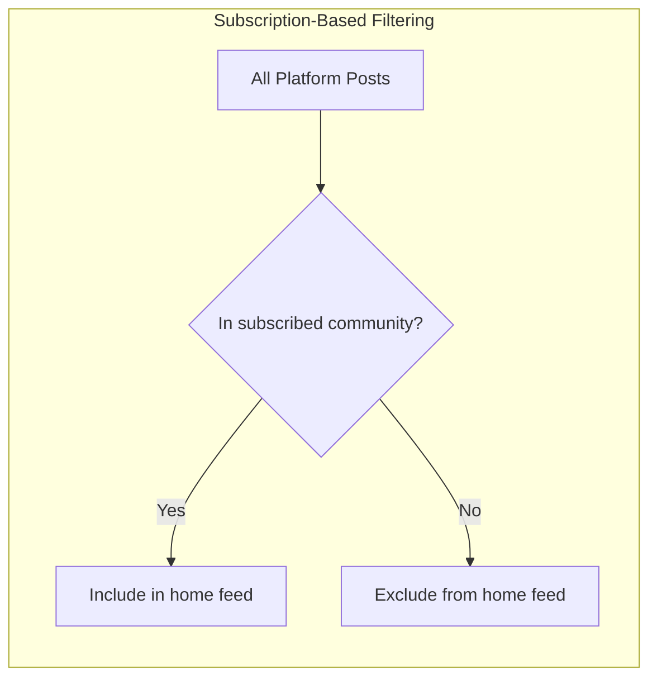

### Subscription Management by Users

### FR-SUB-032: Self-Management Only
Members can only manage their own subscriptions. They cannot subscribe or unsubscribe on behalf of other members.

### FR-SUB-033: Flexible Subscription Changes
Members have the flexibility to subscribe and unsubscribe from communities at any time without restriction.

### FR-SUB-034: No Subscription Limits
Members can subscribe to any number of communities; there is no maximum subscription limit.

### FR-SUB-035: Resubscription Allowed
Members who have previously unsubscribed from a community may subscribe again at any time.

### FR-SUB-036: Subscription History
The system maintains records of current subscriptions only; historical subscription data is not retained after unsubscription.

### FR-SUB-037: Discoverability
The system provides mechanisms for members to discover communities to subscribe to, including browsing all communities and searching by name.

## Post Operations

Users can create posts in any community they have subscribed to. Every post must have a title which is always required. Posts can be one of three types: text posts containing written content, link posts containing a URL to external content, or image posts containing an uploaded image file. Users can edit their own posts after creation to correct errors or update information. Users can delete their own posts which removes them from the platform. When viewing a single post, users see the title, full content, author username, community name, vote score, comment count, and when it was posted. Posts are displayed differently in feeds based on their type with text previews, image thumbnails, or link domains shown.

### Post Creation

Users can create a post in any community they have subscribed to (subscription requirement defined in Subscription Operations). Every post must have a title, which is always required and cannot be empty.

Posts can be created in one of three types:

**Text Post**
- Contains written text content provided by the user
- The content can be any length and supports formatting

**Link Post**
- Contains a URL linking to external content
- The URL must be valid and accessible
- The system extracts and displays the domain name (e.g., "youtube.com") when showing the post in feeds

**Image Post**
- Contains an uploaded image file
- The system generates a thumbnail for display in feeds
- Users can view the full image when opening the post

When creating a post, the user selects the community, provides the required title, chooses the post type, and provides the appropriate content based on the selected type (text content, URL, or image upload). The post is automatically associated with the creating user as the author and timestamped with the creation time.

### Editing Posts

Users can edit their own posts after creation to correct errors or update information. When editing a post, users can modify:
- The title (always required)
- The content, URL, or image depending on the post type

The post type cannot be changed after creation—a text post cannot become a link post, and vice versa. When a post is edited, the system records the edit timestamp. The original creation time remains unchanged. Other users can see that the post has been edited, but the full edit history is not displayed.

### Deleting Posts

Users can delete their own posts, which removes them from the platform. When a post is deleted:
- The post no longer appears in any feeds or community listings
- The post cannot be viewed by other users
- All comments on the post remain visible (defined in Comment Operations)
- The vote score and karma adjustments from votes on this post are preserved for historical purposes
- The post is marked as deleted but may be retained in the system for moderation purposes (defined in Non-Functional requirements)

Users cannot delete posts created by other users unless they have moderator privileges for that community (defined in ModeratorRole Operations).

### Single Post View

When viewing a single post, users see the following details:
- The post title (prominently displayed)
- The full content based on post type:
  - Text posts: complete text content
  - Link posts: the full URL with optional preview
  - Image posts: the full-size uploaded image
- The username of the author who created the post
- The community name where the post was created
- The current vote score (total upvotes minus downvotes)
- The total number of comments on the post
- The time since the post was created (e.g., "3 hours ago")
- An indicator if the post has been edited

The single post view also displays all comments on the post in a threaded format, allowing users to read and participate in discussions (defined in Comment Operations). Voting controls allow users to upvote, downvote, or remove their vote on the post (defined in Vote Operations).

### Post Feed Display

Posts appear differently in feeds depending on their type to provide appropriate previews:

**Text Posts in Feeds**
- Display the first 200 characters of the text content as a preview
- If the content exceeds 200 characters, show an ellipsis or "read more" indicator

**Image Posts in Feeds**
- Display a thumbnail of the uploaded image
- The thumbnail maintains aspect ratio and fits within standard feed dimensions
- Clicking the thumbnail opens the full post view

**Link Posts in Feeds**
- Display the domain name extracted from the URL (e.g., "youtube.com", "github.com")
- The domain helps users understand the external source before clicking

**Common Feed Elements**
All posts in feeds display:
- Title
- Author username
- Community name
- Current vote score
- Comment count
- Time since posted

This display format applies to all three feed types: Home Feed, Popular Feed, and Community Feed (feed behaviors defined in Subscription Operations and Community Operations).

## Comment Operations

Users can write comments on any post to participate in discussions. Users can reply to any existing comment creating threaded conversations. Replies can have additional replies with no depth limit allowing complex discussion threads. Users can edit their own comments to correct mistakes or clarify their points. Users can delete their own comments which removes them from the discussion. Each comment displays the author username, content text, vote score, time since posted, and any nested replies. Comments support sorting by best score, newest first, or controversial votes. Deleted comments are removed from the thread entirely.

### Comment Creation on Posts

Members can write comments on any post to participate in discussions. When creating a comment, the member must provide text content. The comment is automatically associated with the creating member as the author and linked to the post being discussed. The comment records when it was created. Banned members cannot create comments in the community where they are banned.

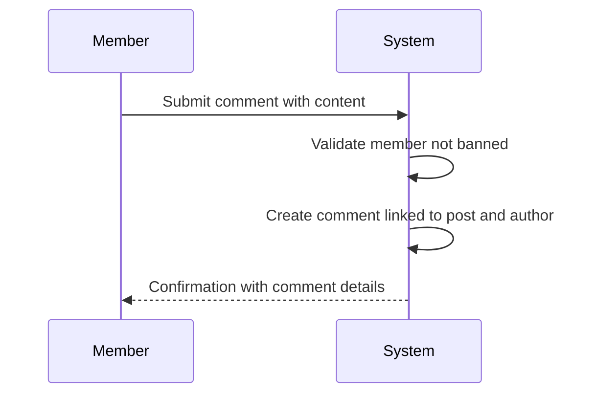

### Replying to Comments

Members can reply to any existing comment, creating threaded conversations. When replying to a comment, the member provides text content and the reply is linked to the parent comment. Replies can have their own replies with no depth limit, allowing complex discussion threads to form. Each reply maintains its connection to the original post through the parent comment chain. Banned members cannot reply to comments in the community where they are banned.

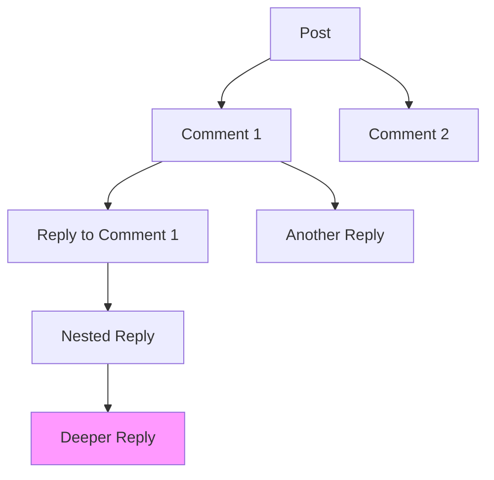

### Comment Editing

Members can edit their own comments to correct mistakes or clarify their points. When editing a comment, the member can modify the text content. The comment records when it was last edited. Members cannot edit comments written by other members.

If the comment has been deleted, it cannot be edited.

### Comment Deletion

Members can delete their own comments. When a comment is deleted, it is removed from the discussion thread entirely and no longer visible to any users. Deleting a comment does not delete its replies; replies remain in the thread. Members cannot delete comments written by other members.

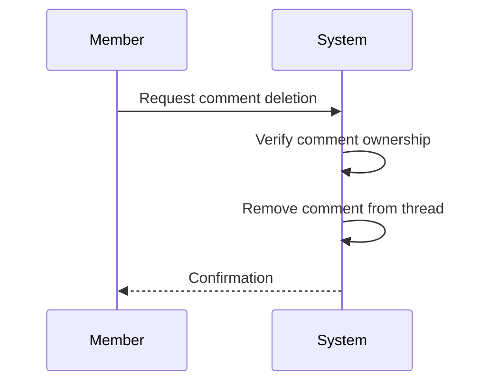

### Comment Display and Threading

Each comment displays the author username (defined in UserProfile Operations), content text, vote score, and time since posted. Comments show any nested replies in a threaded format. The system retrieves and displays the full comment tree for a post, including all replies at every depth level.

Deleted comments do not appear in the thread.

### Comment Sorting

Comments on a post can be sorted by three methods:

- **Best**: comments with the highest vote score appear first
- **New**: most recently created comments appear first  
- **Controversial**: comments with many votes but score close to zero appear first

Members can change the sorting method when viewing a post's comments.

## Vote Operations

Users can upvote posts to increase their score and indicate positive reception. Users can downvote posts to decrease their score and indicate negative reception. Each user can only cast one vote per post to prevent manipulation. Users can change their vote from upvote to downvote or vice versa if their opinion changes. Users can remove their vote entirely returning the post to an unvoted state. The same voting rules apply to comments with upvotes, downvotes, changes, and removals. Vote score equals total upvotes minus total downvotes and can be negative. When someone upvotes or downvotes a user's content, that user's karma score adjusts accordingly. Removing a vote causes the karma to adjust back.

### Upvoting Posts and Comments

WHEN a guest views content, THE system SHALL NOT allow the guest to cast votes.

WHEN a member views a post or comment, THE system SHALL display the current vote score of that content.

WHEN a member chooses to upvote a post, THE system SHALL accept the upvote and increase that post's vote score by one.

WHEN a member chooses to upvote a comment, THE system SHALL accept the upvote and increase that comment's vote score by one.

WHEN a member successfully upvotes a post, THE system SHALL increase the author user profile's karma score by one.

WHEN a member successfully upvotes a comment, THE system SHALL increase the author user profile's karma score by one.

THE system SHALL prevent a member from upvoting content they have authored.

### Downvoting Posts and Comments

WHEN a member chooses to downvote a post, THE system SHALL accept the downvote and decrease that post's vote score by one.

WHEN a member chooses to downvote a comment, THE system SHALL accept the downvote and decrease that comment's vote score by one.

WHEN a member successfully downvotes a post, THE system SHALL decrease the author user profile's karma score by one.

WHEN a member successfully downvotes a comment, THE system SHALL decrease the author user profile's karma score by one.

THE system SHALL allow vote scores to become negative when downvotes exceed upvotes.

THE system SHALL prevent a member from downvoting content they have authored.

### Vote Change Direction

THE system SHALL enforce that each member can cast at most one vote per post.

THE system SHALL enforce that each member can cast at most one vote per comment.

IF a member attempts to vote on content they have already voted on, THEN THE system SHALL allow the member to change the vote direction from upvote to downvote or vice versa.

WHEN a member changes their vote from upvote to downvote on a post, THE system SHALL decrease the post's vote score by two to reflect the removal of the upvote and addition of the downvote.

WHEN a member changes their vote from upvote to downvote on a comment, THE system SHALL decrease the comment's vote score by two.

WHEN a member changes their vote from downvote to upvote on a post, THE system SHALL increase the post's vote score by two.

WHEN a member changes their vote from downvote to upvote on a comment, THE system SHALL increase the comment's vote score by two.

WHEN a member changes their vote direction, THE system SHALL adjust the author user profile's karma score accordingly by two points in the direction of the new vote.

### Vote Removal

WHEN a member removes their vote from a post, THE system SHALL delete the vote and adjust the post's vote score to remove the effect of that vote.

WHEN a member removes their vote from a comment, THE system SHALL delete the vote and adjust the comment's vote score to remove the effect of that vote.

WHEN a member removes an upvote from a post, THE system SHALL decrease the post's vote score by one.

WHEN a member removes a downvote from a post, THE system SHALL increase the post's vote score by one.

WHEN a member removes an upvote from a comment, THE system SHALL decrease the comment's vote score by one.

WHEN a member removes a downvote from a post, THE system SHALL increase the post's vote score by one.

WHEN a member removes their vote from content, THE system SHALL reverse the karma adjustment that was applied when the vote was cast, decreasing karma by one for removed upvotes and increasing karma by one for removed downvotes.

WHEN a member views content they have previously voted on, THE system SHALL display the member's current vote status to indicate whether they have upvoted, downvoted, or not voted.

### Vote Score Calculation

THE system SHALL calculate a post's vote score as the total number of upvotes minus the total number of downvotes cast on that post.

THE system SHALL calculate a comment's vote score as the total number of upvotes minus the total number of downvotes cast on that comment.

THE system SHALL allow vote scores to be zero when upvotes equal downvotes.

THE system SHALL allow vote scores to be negative when downvotes exceed upvotes.

WHEN displaying posts in feeds, THE system SHALL show each post's calculated vote score.

WHEN displaying comments on a post, THE system SHALL show each comment's calculated vote score.

THE system SHALL use vote scores as the primary sorting criterion for the Top feed sort option, with higher scores appearing first.

THE system SHALL use vote scores combined with recency as sorting criteria for the Hot and Controversial feed sort options.

### Karma Adjustment from Votes

THE system SHALL maintain a karma score for each user profile, representing the cumulative effect of votes received on their content.

WHEN a member upvotes a user's post, THE system SHALL increase that user's karma score by one.

WHEN a member upvotes a user's comment, THE system SHALL increase that user's karma score by one.

WHEN a member downvotes a user's post, THE system SHALL decrease that user's karma score by one.

WHEN a member downvotes a user's comment, THE system SHALL decrease that user's karma score by one.

WHEN a member removes their upvote from a user's content, THE system SHALL decrease that user's karma score by one to reverse the original karma adjustment.

WHEN a member removes their downvote from a user's content, THE system SHALL increase that user's karma score by one to reverse the original karma adjustment.

THE system SHALL allow user karma scores to become negative when a user receives more downvotes than upvotes on their content.

WHEN a member changes their vote from upvote to downvote, THE system SHALL decrease the author's karma by two.

WHEN a member changes their vote from downvote to upvote, THE system SHALL increase the author's karma by two.

WHEN displaying a user profile, THE system SHALL show the user's current karma score.

THE system SHALL NOT adjust karma when a member votes on their own content.

## ModeratorRole Operations

The community creator automatically becomes the owner with highest authority over the community. The owner can add moderators to help manage the community. The owner can remove moderators from their position. Moderators can add other moderators to expand the moderation team. Moderators cannot remove the owner from their position. Moderators cannot remove each other from their positions. Only the owner has the authority to remove moderators. The moderation hierarchy ensures clear authority lines with owner at the top and moderators below.

### Moderator Role Assignment

WHEN a user creates a community, THE system SHALL automatically assign the community creator as the owner with the highest moderation authority.

WHEN the owner of a community adds a moderator, THE system SHALL create a moderator role association between the designated user and the community.

THE system SHALL allow the owner to add any member as a moderator of their community.

THE system SHALL support assigning moderator roles with the ability to add other moderators as an optional permission.

WHEN a moderator is successfully added, THE system SHALL grant that user moderator privileges including content deletion and user banning within that community.

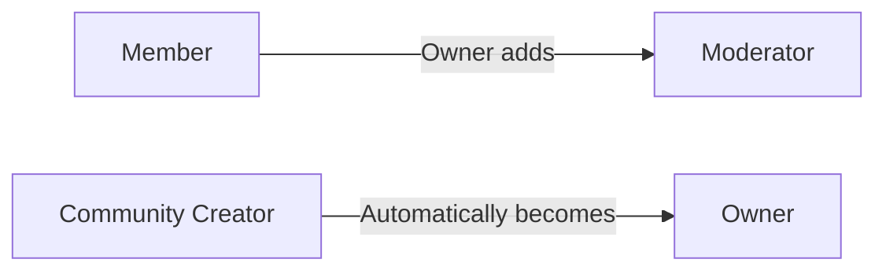

### Moderator Role Expansion

WHILE a user holds a moderator position in a community with permission to add moderators, THE system SHALL allow that moderator to add other members as additional moderators.

THE system SHALL prevent moderators from adding moderators to communities where they do not hold moderator status.

THE system SHALL allow moderators to assign the same add-moderator permission to newly added moderators.

WHEN a moderator adds another moderator, THE system SHALL record which moderator performed the addition action.

THE system SHALL grant newly added moderators the same content management and user moderation capabilities as existing moderators.

### Moderator Removal Authority

THE system SHALL restrict the removal of moderators to only the community owner.

THE system SHALL prevent any moderator from removing the owner from their moderation position.

THE system SHALL prevent moderators from removing other moderators from their positions.

WHEN the owner attempts to remove a moderator, THE system SHALL validate that the requesting user is the owner of the specified community.

WHEN a moderator removal is performed by the owner, THE system SHALL immediately revoke all moderation privileges from the removed user for that community.

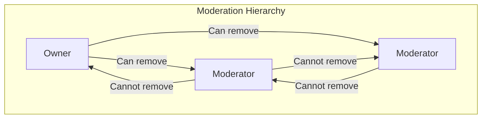

### Moderator Privileges and Constraints

WHILE a user holds moderator status in a community, THE system SHALL allow that user to:
- Delete any post within that community regardless of authorship
- Delete any comment within that community regardless of authorship
- Ban users from that community
- Unban users from that community
- View the list of banned users in that community
- View all reports submitted for content within that community
- Approve reports which results in content deletion
- Dismiss reports which results in content remaining

THE system SHALL enforce that moderator privileges apply only within the community where the moderator role was assigned.

THE system SHALL preserve moderator status until explicitly removed by the owner, regardless of the moderator's subscription status to the community.

## Ban Operations

Moderators can ban users from their community to prevent problematic participation. Moderators can unban users to allow them to participate again. Moderators can view the complete list of banned users in their community. Banned users cannot create new posts in the community they are banned from. Banned users cannot write comments in the community they are banned from. Banned users can still view all content in the community despite their restrictions. Bans can include an optional reason explaining why the action was taken.

### Ban User from Community

A moderator can ban a user from the community they moderate to prevent further participation from problematic users.

When banning a user, the moderator must specify the target user to be banned. The system prevents a moderator from banning themselves. The system prevents a moderator from banning the community owner.

A moderator may provide an optional reason explaining why the ban is being issued. When provided, this reason text is stored with the ban record and can be viewed by other moderators.

When a ban is successfully created, the banned user is immediately restricted from participating in that community.

The system records which moderator issued the ban and when the ban was created.

### Unban User from Community

A moderator can unban a previously banned user from their community to allow that user to participate again.

When unbanning a user, the moderator must specify the target user to be unbanned. The system verifies the user is currently banned in that community.

When an unban is successfully processed, the user's restrictions are immediately removed and they can resume normal participation in the community, including creating posts and writing comments.

The system records which moderator performed the unban action.

### View Banned Users List

Moderators can view a complete list of all users currently banned from their community.

The banned users list displays for each banned entry: the banned user's username and profile information, which moderator issued the ban, when the ban was created, and any optional reason that was provided when the ban was issued.

This list allows moderators to review current bans and identify which users may be candidates for unbanning based on time elapsed or changed circumstances.

### Banned User Participation Restrictions

WHEN a user is banned from a community, THE system SHALL prevent that user from creating new posts in that community.

WHEN a user is banned from a community, THE system SHALL prevent that user from writing comments on posts in that community.

WHEN a user is banned from a community, THE system SHALL prevent that user from replying to comments on posts in that community.

WHILE a user is banned from a community, THE system SHALL allow that user to continue viewing all content in that community including posts and comments.

WHILE a user is banned from a community, THE system SHALL allow that user to view the community's public information including its name, description, icon, and subscriber count.

The banned user retains the ability to participate normally in other communities where they are not banned.

## Report Operations

Users can report any post that violates community rules or platform guidelines. Users can report any comment that violates community rules or platform guidelines. When submitting a report, users must provide a reason explaining the violation. Moderators can view all reports submitted for content in their community. Each report displays the reported content, the user who reported it, and the reason provided. Moderators can approve a report which results in deletion of the reported content. Moderators can dismiss a report which keeps the content and removes the report from the list. Dismissed reports are permanently removed from the report list.

### Report Creation

THE member SHALL report any post that violates community rules or platform guidelines by providing a reason explaining the violation.

THE member SHALL report any comment that violates community rules or platform guidelines by providing a reason explaining the violation.

WHEN a member submits a report, THE system SHALL require the reason text to be provided.

THE report SHALL capture the reporting member, the reason provided, and the content being reported at the time of submission.

A member SHALL NOT submit more than one report for the same content item.

### Report Review by Moderators

THE moderator SHALL view all reports submitted for content within their community.

EACH report displayed to moderators SHALL show the reported content, the member who reported it, and the reason provided.

Reports SHALL be displayed in the order they were submitted, with the most recent reports appearing first.

THE system SHALL distinguish between pending reports and those that have been resolved.

### Report Resolution

THE moderator SHALL approve a pending report, which SHALL result in deletion of the reported content.

THE moderator SHALL dismiss a pending report, which SHALL keep the reported content and remove the report from the list.

WHEN a moderator approves a report, THE system SHALL delete the reported post or comment and update the report status to approved.

WHEN a moderator dismisses a report, THE system SHALL permanently remove the report from the report list.

THE system SHALL not allow re-reporting of the same content item by the same member after a report has been dismissed.

# Error Scenarios and Edge Cases

Business-level error scenarios, edge case coverage, and expected system behaviors for exceptional conditions.

## User Error Scenarios

When signing up, if a user tries to register with an email address that already exists in the system, the operation must be rejected and the user informed that the email is already in use. Similarly, if a user attempts to choose a username that has already been taken by another user, the system must prevent this and require a different username choice. During login attempts, if the provided password does not match the password associated with the email address, the system must reject the login and inform the user of the authentication failure without revealing whether the email exists in the system. When changing passwords, if the user provides an incorrect current password, the change operation must be rejected. If a user attempts to delete their account, all posts and comments created by that user are also deleted from the system as specified in the requirements.

### Registration Duplicate Validation

IF a user attempts to register with an email address that already exists in the system, THEN THE system SHALL reject the registration request AND inform the user that the email address is already in use.

IF a user attempts to register with a username that has already been taken by another user, THEN THE system SHALL reject the registration request AND require the user to choose a different username.

The system SHALL check for existing email addresses BEFORE creating a new user account.

The system SHALL check for existing usernames BEFORE creating a new user account.

### Login Authentication Failure

IF a user provides an incorrect password during login authentication, THEN THE system SHALL reject the login request AND inform the user of the authentication failure.

THE system SHALL NOT reveal whether the provided email address exists in the system when rejecting an incorrect password.

THE system SHALL treat authentication failures uniformly regardless of whether the email exists or the password is incorrect.

### Password Change Validation

IF a user provides an incorrect current password when attempting to change their password, THEN THE system SHALL reject the password change request AND inform the user that the current password is incorrect.

THE system SHALL verify the current password matches the stored password BEFORE applying any password changes.

THE system SHALL require the correct current password for all password change operations initiated by the user.

### Account Deletion Content Removal

WHEN a user deletes their account, IF the user has created any posts, THEN THE system SHALL delete all posts created by that user.

WHEN a user deletes their account, IF the user has written any comments, THEN THE system SHALL delete all comments written by that user.

THE system SHALL delete all user content as part of the account deletion process.

## UserProfile Error Scenarios

Users can only edit their own profile information including display name, bio text, and avatar image. If a user attempts to modify another user's profile, the system must reject this operation. When viewing profiles, if a user tries to access a profile for a username that does not exist in the system, the system must handle this as a missing resource scenario. The display name and bio fields are optional, so there are no validation errors for empty values in these fields. The avatar image upload may fail if the file format is not supported or if the file size exceeds limits, though the specific constraints are handled in the File Storage module.

### Unauthorized Profile Modification

A user attempts to modify another user's profile information.

IF a user attempts to edit a profile that belongs to another user, THEN THE system SHALL reject the operation.

IF a user submits a request to update display name, bio, or avatar for a profile they do not own, THEN THE system SHALL NOT apply any changes.

WHEN an unauthorized profile modification is attempted, THEN THE system SHALL inform the user that they can only edit their own profile.

### Missing Profile Retrieval

A user attempts to view a profile for a username that does not exist in the system.

IF a user requests a profile for a username that does not exist, THEN THE system SHALL reject the request.

WHEN a profile is requested for a non-existent user, THEN THE system SHALL inform the user that the profile was not found.

THE system SHALL NOT display profile information when the requested username does not correspond to an existing user account.

### Display Name Validation

A user updates their display name field.

THE display name field SHALL be optional.

IF a user submits an empty or blank display name, THEN THE system SHALL accept the update and store the empty value.

THE system SHALL NOT reject profile updates solely due to missing display name content.

### Bio Text Validation

A user updates their bio text field.

THE bio field SHALL be optional.

IF a user submits an empty or blank bio, THEN THE system SHALL accept the update and store the empty value.

THE system SHALL NOT reject profile updates solely due to missing bio content.

### Avatar Format Validation

A user uploads an image file as their avatar.

IF a user submits a file that is not in a supported image format, THEN THE system SHALL reject the upload.

THE system SHALL only accept image file formats for avatar uploads.

WHEN an unsupported file format is submitted, THEN THE system SHALL inform the user that only image files are allowed.

### Avatar Size Validation

A user uploads an image file that exceeds size limits for avatar storage.

IF a user submits an image file larger than the maximum allowed size, THEN THE system SHALL reject the upload.

WHEN an oversized file is submitted, THEN THE system SHALL inform the user that the file exceeds the size limit.

THE system SHALL enforce maximum file size constraints for avatar uploads.

## Community Error Scenarios

When creating a community, if a user attempts to use a community name that is already in use by another community, the system must reject the creation and inform the user that the name must be unique. Only the user who creates a community becomes its owner, and ownership cannot be transferred based on the requirements. When searching for communities by name, if no communities match the search criteria, the system returns an empty result set rather than an error. If a user attempts to view a community that does not exist, the system must handle this as a missing resource scenario. The community creator has the highest authority and cannot be removed by moderators.

### Duplicate Community Name Error

WHEN a user attempts to create a community, IF the chosen name is already in use by an existing community, THEN THE system SHALL reject the creation request.

THE system SHALL inform the user that the community name must be unique and is already taken.

THE system SHALL prompt the user to choose a different name.

### Community Name Uniqueness Requirement

THE community name SHALL be unique across the platform.

THE system SHALL enforce uniqueness at the time of community creation.

THE system SHALL prevent any two communities from sharing the same name.

### Community Creator Ownership

WHEN a user creates a community, THE system SHALL automatically designate that user as the community owner.

THE owner SHALL possess the highest authority within the community.

THE system SHALL not permit transfer of ownership to another user based on current requirements.

### Community Not Found Error

WHEN a user attempts to view a community, IF the requested community does not exist, THEN THE system SHALL handle this as a missing resource scenario.

THE system SHALL inform the user that the community could not be found.

### Empty Search Results Handling

WHEN a user searches for communities by name, IF no communities match the search criteria, THEN THE system SHALL return an empty result set.

THE system SHALL not generate an error when search returns zero matching communities.

THE system SHALL display a message indicating no communities were found matching the search terms.

### Owner Removal Protection

IF a user is the community owner, THEN moderators SHALL NOT be able to remove that user from their moderator role.

THE system SHALL prevent any moderator from removing the community owner.

WHILE a user holds the owner position in a community, THE system SHALL reject any attempt by moderators to remove that user's authority.

## Subscription Error Scenarios

If a user attempts to subscribe to a community they are already subscribed to, the system must handle this duplicate subscription attempt appropriately. Similarly, if a user tries to unsubscribe from a community they are not currently subscribed to, the system must handle this as an invalid operation. A critical business rule is that users can only create posts in communities they are subscribed to, so any attempt to create a post in an unsubscribed community must be rejected. When viewing the home feed, only logged-in users can access it, so logged-out users attempting to access this feed must be informed that authentication is required.

### Duplicate Subscription Attempt

When a user attempts to subscribe to a community they are already subscribed to, the system SHALL reject the duplicate subscription attempt.
The system SHALL inform the user that they are already subscribed to this community.
No changes SHALL be made to the user's subscription status.
The user's subscription list SHALL remain unchanged.

### Unsubscribe When Not Subscribed

When a user attempts to unsubscribe from a community they are not currently subscribed to, the system SHALL reject the unsubscription request.
The system SHALL inform the user that they are not subscribed to this community.
No changes SHALL be made to the user's subscription status.
The user SHALL remain in their current unsubscribed state for that community.

### Post Creation Requires Subscription

When a user attempts to create a post in a community they are not subscribed to, the system SHALL reject the post creation request.
The system SHALL inform the user that subscription to the community is required before creating posts.
The post SHALL NOT be created.
The user SHALL be prompted to subscribe to the community first.

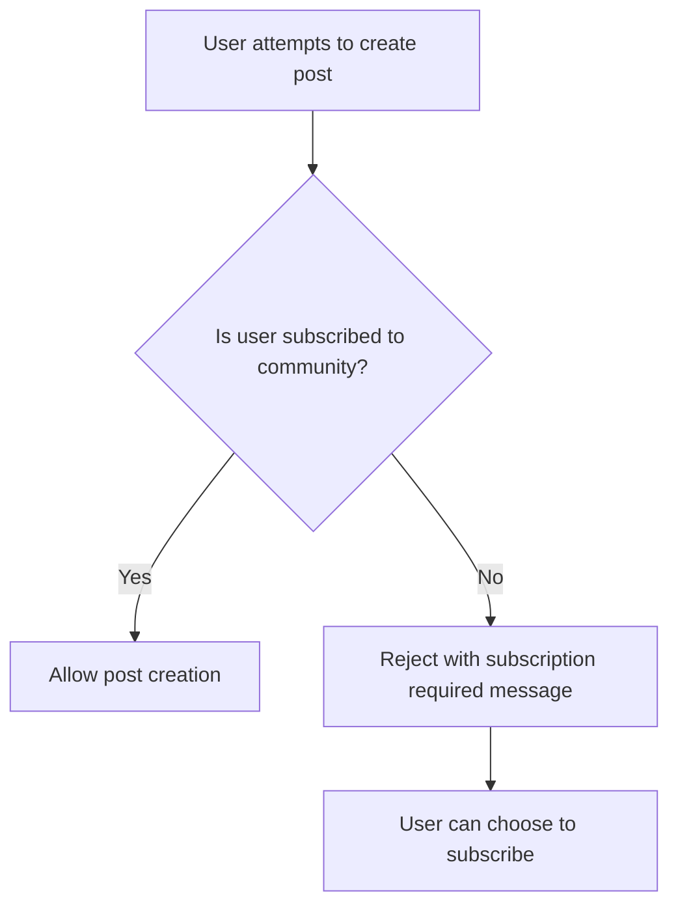

### Home Feed Requires Authentication

When a guest (logged-out user) attempts to access the home feed, the system SHALL reject the request.
The system SHALL inform the user that authentication is required to view the home feed.
The home feed SHALL NOT be displayed.
The user SHALL be informed that only logged-in users can access personalized home feeds based on their subscriptions.

### Subscribe to Non-Existent Community

When a user attempts to subscribe to a community that does not exist, the system SHALL reject the subscription request.
The system SHALL inform the user that the community could not be found.
No subscription SHALL be created.
The user's subscription list SHALL remain unchanged.

### View Subscribed Communities When None Exist

When a user views their list of subscribed communities and has no active subscriptions, the system SHALL display an empty state message.
The system SHALL inform the user that they are not currently subscribed to any communities.
The system MAY suggest browsing available communities or searching for communities to subscribe to.
The empty list SHALL be clearly distinguishable from a loading state or error condition.

## Post Error Scenarios

Every post must have a title, so any attempt to create a post without providing a title must be rejected by the system. Posts must be one of three types: text post, link post, or image post. If a user attempts to create a post with an invalid type or with content that does not match the declared type, the operation must fail. Users can only edit and delete their own posts, so any attempt by a user to modify or remove another user's post must be rejected. When viewing a single post, if the post has been deleted or does not exist, the system must handle this appropriately. Banned users cannot create posts in the communities where they are banned, so such attempts must be rejected.

### Missing Title Error

WHEN a user attempts to create a post without providing a title, THEN THE system SHALL reject the request.

The title is a required field for all posts regardless of post type. If the user submits a post creation request with an empty or missing title, the system does not create the post and informs the user that a title is required.

### Invalid Post Type Error

WHEN a user attempts to create a post with an invalid type or with content that does not match the declared type, THEN THE system SHALL reject the request.

Posts must be one of three types: text post, link post, or image post. If the user specifies a type outside these three options, or if the provided content does not match the type (for example, providing text content for a link post type), the system does not create the post and informs the user of the valid type requirements.

### Cannot Edit Other User's Post

IF a user attempts to modify a post they did not create, THEN THE system SHALL reject the request.

Users have exclusive rights to edit their own posts. The system verifies the requesting user's identity against the post's author before permitting any edit operation. If the user is not the original author, the edit request is denied.

### Cannot Delete Other User's Post

IF a user attempts to remove a post they did not create, THEN THE system SHALL reject the request.

Users have exclusive rights to delete their own posts. The system verifies the requesting user's identity against the post's author before permitting any deletion operation. If the user is not the original author, the deletion request is denied.

### Post Not Found Error

IF a user attempts to view, edit, or delete a post that has been removed or does not exist, THEN THE system SHALL reject the request.

When a post has been deleted by its author or a moderator, or if the specified post identifier does not correspond to any existing post, the system informs the user that the requested content is not available.

### Banned User Cannot Create Posts

IF a banned user attempts to create a post in a community where they are banned, THEN THE system SHALL reject the request.

Users who have been banned from a community cannot create new posts in that community. The system checks the user's ban status for the target community before permitting post creation. If the user is currently banned, the post creation request is denied.

### Text Link Image Type Requirement

THE system SHALL require every post to be exactly one of three types: text post, link post, or image post.

A text post contains text content written by the user. A link post contains a URL to external content. An image post contains an uploaded image file. The user must specify which type of post they are creating, and the system validates that the submitted content matches the declared type before creating the post.

## Comment Error Scenarios

Users can write comments on any post, but if a user attempts to comment on a post that has been deleted or does not exist, the system must reject this operation. Users can reply to any comment, and replies can have replies with no depth limit as specified in the requirements, so there is no maximum nesting level error. Users can only edit and delete their own comments, so attempts to modify or remove another user's comments must be rejected. Banned users cannot create comments in the communities where they are banned, even when replying to existing comments. When a comment is deleted, its replies may remain in the system, creating orphaned reply scenarios that the system must handle appropriately.

### Commenting on Invalid Posts

When a user attempts to create a comment on a post that does not exist, the system rejects the operation. When a user attempts to create a comment on a post that has been deleted, the system rejects the operation. Users can only successfully comment on posts that are currently available in the system.

### Editing Other Users' Comments

Users can only edit comments they have created. When a user attempts to modify a comment authored by another user, the system rejects the request. This restriction ensures users cannot alter content posted by others.

### Deleting Other Users' Comments

Users can only delete comments they have created. When a user attempts to remove a comment authored by another user, the system rejects the request. Community moderators have separate authority to delete comments within their communities as defined in the moderation requirements.

### Banned User Comment Restrictions

Users who have been banned from a community cannot create new comments on posts in that community. Banned users also cannot reply to existing comments in that community. When a banned user attempts to submit a comment or reply in a community where they are banned, the system rejects the operation.

### Unlimited Reply Nesting Depth

The system allows users to reply to any comment regardless of how deeply nested it is in the reply thread. There is no maximum depth limit for nested replies. Users can create replies to existing replies indefinitely without encountering depth limit restrictions or errors.

### Preserved Replies After Comment Deletion

When a comment is deleted, any replies to that comment remain in the system and continue to be visible. These replies persist even though the parent comment has been removed. Users can continue to reply to comments that remain in the system, including replies to comments whose parent has been deleted, maintaining the thread structure for remaining discussion.

## Vote Error Scenarios

Each user can only vote once per post or comment, so any attempt by a user to submit multiple votes on the same content must be rejected or treated as a vote change operation instead. Users can change their vote from upvote to downvote or vice versa, which is the expected behavior rather than an error. Users can remove their vote entirely, which is also valid behavior. When calculating karma, if a user has more downvotes than upvotes, their karma score becomes negative, which is explicitly allowed by the requirements. If a user attempts to vote on content that has been deleted, the system must reject this operation. Vote scores are calculated as total upvotes minus total downvotes, and can result in negative scores for individual posts or comments.

### One Vote Per User Per Content Constraint

WHEN a member attempts to cast a vote on a post or comment where they already have an existing vote, THE system SHALL reject the duplicate vote attempt.

THE system SHALL treat an attempt to vote again on the same content as an error condition, not as a new vote.

THE system SHALL allow a member to change their existing vote from upvote to downvote or from downvote to upvote.

THE system SHALL allow a member to remove their existing vote entirely.

WHEN a guest attempts to cast a vote, THE system SHALL reject the request and require authentication.

### Voting on Deleted Content

WHEN a member attempts to vote on a post that has been deleted, THE system SHALL reject the vote operation.

WHEN a member attempts to vote on a comment that has been deleted, THE system SHALL reject the vote operation.

IF the content is no longer visible to regular members, THEN THE system SHALL prevent any new vote operations on that content.

THE system SHALL return an error indicating that voting is not permitted on deleted content.

### Vote Score Calculation Behavior

THE system SHALL calculate the vote score of a post or comment as the total number of upvotes minus the total number of downvotes.

THE system SHALL allow the vote score to become negative when there are more downvotes than upvotes.

WHEN a member casts an upvote, THE system SHALL increase the content's vote score by 1.

WHEN a member casts a downvote, THE system SHALL decrease the content's vote score by 1.

WHEN a member removes their upvote, THE system SHALL decrease the content's vote score by 1.

WHEN a member removes their downvote, THE system SHALL increase the content's vote score by 1.

### Karma Score Behavior

THE system SHALL allow a user's karma score to become negative when they receive more downvotes than upvotes across all their posts and comments.

WHEN a member's post or comment receives an upvote, THE system SHALL increase that member's karma by 1.

WHEN a member's post or comment receives a downvote, THE system SHALL decrease that member's karma by 1.

WHEN a vote is removed from a member's post or comment, THE system SHALL adjust that member's karma accordingly.

THE system SHALL NOT impose any minimum limit on karma scores.

## ModeratorRole Error Scenarios

Only the community owner can add moderators, so if a moderator who is not the owner attempts to add another moderator, the system must reject this operation. The owner can remove moderators, but moderators cannot remove each other or the owner. If a moderator attempts to remove another moderator or the owner, the system must reject this unauthorized action. Moderators cannot remove the owner under any circumstances. If an attempt is made to add a user who is already a moderator to the moderator role again, the system must handle this duplicate assignment appropriately. The community creator is always the owner with the highest authority and this status cannot be transferred or removed by others.

### Unauthorized Moderator Addition

#### Unauthorized Moderator Addition by Non-Owner

IF a moderator who is not the community owner attempts to add another user as a moderator, THEN the system SHALL reject the operation and inform the user they lack the required authority.

#### Owner Authority for Moderator Addition

WHERE a user is the community owner, THE system SHALL allow that user to add other members as moderators to the community.

#### Moderator Self-Addition Prevention

IF a moderator attempts to add themselves to the moderator role again, THEN the system SHALL reject the operation as the user already holds moderator status.

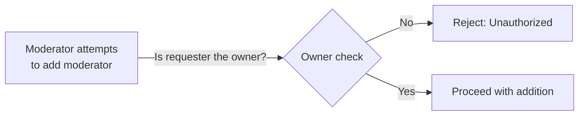

### Unauthorized Moderator Removal

#### Moderator Cannot Remove Other Moderators

IF a moderator who is not the community owner attempts to remove another moderator, THEN the system SHALL reject the operation and maintain the target moderator's status.

#### Only Owner Can Remove Moderators

WHERE the user performing a moderator removal is the community owner, THE system SHALL allow the removal of moderators from the community.

#### Self-Removal by Moderators

WHILE a user holds moderator status in a community, THE system SHALL allow that user to voluntarily relinquish their moderator role without requiring owner intervention.

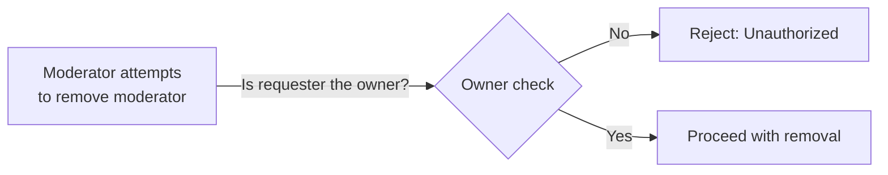

### Owner Removal Protection

#### Moderators Cannot Remove Owner

IF a moderator attempts to remove the community owner from their role, THEN the system SHALL reject the operation regardless of the moderator's other permissions.

#### Owner Status Is Permanent

WHILE a user is the creator of a community, THE system SHALL maintain that user's owner status and prevent any removal of that status by other users.

#### Owner Authority Supersedes All

THE system SHALL ensure that no moderator action can affect the owner's status, permissions, or role assignment within their created community.

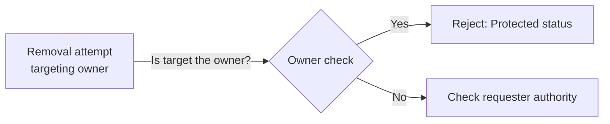

### Duplicate Moderator Assignment

#### Duplicate Moderator Assignment Prevention

IF a user who is already a moderator in the community is selected for moderator role assignment, THEN the system SHALL reject the duplicate assignment and inform the requester that the user already holds moderator status.

#### Existing Moderator Detection

WHEN a user attempts to add a moderator, THE system SHALL first verify whether the target user already has moderator status in that community.

#### Duplicate Assignment Notification

IF a duplicate moderator assignment is attempted, THEN the system SHALL provide clear feedback indicating that the target user is already a moderator and no further action is needed.

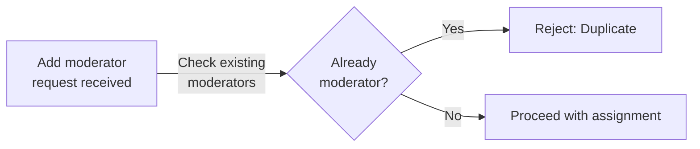

### Ownership Transfer Restrictions

#### Ownership Cannot Be Transferred

THE system SHALL NOT provide any mechanism for transferring community ownership from the creator to another user.

#### Owner Has Highest Authority

THE system SHALL ensure that the community creator maintains the highest authority level that cannot be overridden by any moderator or other user.

#### Creator Ownership Is Immutable

ONCE a user creates a community, THE system SHALL permanently associate that user as the owner with privileges that cannot be removed, transferred, or diminished by other users.

#### No Ownership Succession Mechanism

THE system SHALL NOT implement any feature allowing ownership succession, ownership reassignment, or ownership handover to another user.

## Ban Error Scenarios

Only moderators can ban users from a community, so attempts by regular users to ban others must be rejected. If a moderator attempts to ban a user who is already banned from the community, the system must handle this duplicate ban attempt appropriately. Similarly, if a moderator tries to unban a user who is not currently banned, this invalid operation must be handled. Banned users cannot create posts or comments in the community where they are banned, but they can still view content in that community. If a banned user attempts to post or comment, the system must reject the operation and inform them of their banned status. Moderators can view the list of banned users, but only for communities where they have moderator privileges.

### Ban Operation Permission Requirements

#### Moderator Authority for Bans

IF the user does not have moderator role in the community, THEN THE system SHALL reject any attempt to ban another user from that community.

IF the user does not have moderator role in the community, THEN THE system SHALL reject any attempt to unban a user from that community.

#### Moderator Authority for Viewing Banned Users

IF the user does not have moderator role in the community, THEN THE system SHALL reject any attempt to view the list of banned users for that community.

#### Ban Action Logging

WHEN a moderator successfully bans a user, THE system SHALL record the action with the moderator who issued the ban.

WHEN a moderator successfully unbans a user, THE system SHALL record the action with the moderator who issued the unban.

### Duplicate Ban Attempt Handling

#### Existing Ban Detection

IF a user is already banned from a community, THEN THE system SHALL reject any attempt to ban that same user again.

WHEN a moderator attempts to ban an already banned user, THE system SHALL notify the moderator that the user is currently banned.

#### Unban Non-Banned User Error

IF a user is not currently banned from a community, THEN THE system SHALL reject any attempt to unban that user.

WHEN a moderator attempts to unban a user who is not banned, THE system SHALL notify the moderator that the user is not currently banned from the community.

### Banned User Posting Restrictions

#### Post Creation Blocked

IF a user is banned from a community, THEN THE system SHALL reject any attempt by that user to create a post in that community.

WHEN a banned user attempts to create a post in a community where they are banned, THE system SHALL notify the user that they are banned and cannot create posts in that community.

#### Comment Creation Blocked

IF a user is banned from a community, THEN THE system SHALL reject any attempt by that user to create a comment on any post in that community.

WHEN a banned user attempts to create a comment in a community where they are banned, THE system SHALL notify the user that they are banned and cannot comment in that community.

### Banned User Viewing Permissions

#### Content Access for Banned Users

IF a user is banned from a community, THE system SHALL allow that user to view all content in that community including posts and comments.

WHEN a banned user views community content, THE system SHALL display posts and comments normally without restrictions.

WHILE a user is banned from a community, THE system SHALL not restrict their ability to browse or read any public content in that community.

### Banned User List Access

#### Moderator View of Banned Users

IF a user has moderator role in a community, THE system SHALL allow that user to view the complete list of all users banned from that community.

WHEN a moderator views the banned user list, THE system SHALL display for each banned user: the username, when the ban was issued, which moderator issued the ban, and the ban reason if provided.

WHERE a ban has an optional expiration timestamp, THE system SHALL display the expiration date for that ban in the banned user list.

## Report Error Scenarios

When reporting a post or comment, users must provide a reason text, so any report submission without a reason must be rejected. Only moderators can view reports for their community, so regular users attempting to access the report list must be denied access. If a user attempts to report content that has already been deleted, the system must handle this appropriately. Each report shows the reported content, who reported it, and the reason, but if the reported content is deleted before the moderator reviews the report, the system must handle this missing content scenario. Moderators can approve a report which deletes the content, or dismiss it which keeps the content. Once a report is dismissed, it is removed from the report list and cannot be reviewed again.

### Report Submission Without Reason

When a user attempts to report a post or comment, the report submission must include a reason text. If the user submits a report without providing a reason, the system must reject the submission and inform the user that a reason is required. The report is not created and no moderator notification occurs.

### Non-Moderator Report Access

Only users with moderator privileges for a community may view the list of reports for that community. If a user who is not a moderator for a specific community attempts to access the reports list for that community, the system must deny access. Members and guests cannot view reports under any circumstances.

### Reporting Already Deleted Content

If a user attempts to report a post or comment that has already been deleted, the system must reject the report submission. Since deleted content is no longer visible or actionable in the community, reporting it serves no moderation purpose. The system informs the user that the content cannot be reported because it no longer exists.

### Reported Content Deleted Before Review

When a moderator views a report that references content that was deleted after the report was created but before the moderator reviewed it, the system must display an indication that the reported content is no longer available. The report still shows who reported it, the reason provided, and when it was reported. The moderator may still choose to approve the report (confirming the deletion was appropriate) or dismiss the report.

### Approve Report Deletes Content

When a moderator approves a report, the reported content (post or comment) is permanently deleted from the system. Upon approval, the content becomes unavailable to all users. The report status changes to approved and the resolved timestamp is recorded.

### Dismiss Report Keeps Content

When a moderator dismisses a report, the reported content (post or comment) remains visible and accessible to all users. The content is not deleted or modified in any way. The report status changes to dismissed and the resolved timestamp is recorded.

### Dismissed Reports Removed from List

Once a report is dismissed, it is immediately removed from the active reports list that moderators view. Dismissed reports cannot be reviewed again or re-opened. The dismissed status is recorded for historical purposes but the report no longer appears in the pending reports queue.

# End-to-End User Scenarios

Cross-domain user scenarios that span multiple concepts, describing complete user journeys.

## Cross-Domain User Scenarios

Define end-to-end user scenarios that span multiple concepts, describing complete user journeys from start to finish.

### New User Onboarding Journey

A guest visits the platform and decides to join the community. The guest navigates to the registration page and provides an email address, password, and unique username. The system validates that the email and username are not already in use. Upon successful registration, the user becomes a member and is automatically authenticated.

The new member is prompted to set up their profile by optionally providing a display name, bio text, and avatar image. The member can skip this step and complete it later. Once profile setup is complete (or skipped), the member lands on the popular feed showing trending posts from across all communities.

The member browses the list of available communities and uses the search function to find communities matching their interests. The member selects a community and views its details including description, subscriber count, and recent posts. The member subscribes to the community, which enables post creation privileges in that community.

The member navigates back to the home feed, which now displays posts from their subscribed community. The member views a post that interests them, reads the full content, and scrolls through the comments. The member upvotes the post, increasing both the post score and the author's karma. The member decides to join the conversation by writing a comment on the post.

### Content Discovery and Engagement Journey

A member visits the platform to discover new content. The member first views their home feed, which aggregates posts from all communities they have subscribed to. The member switches between different sorting options to find content: Hot shows recent popular posts, New shows the freshest content, Top shows highest-scoring posts with optional time filters (today, this week, this month, this year, all time), and Controversial shows posts with many votes but balanced scores near zero.

The member selects a post from the feed and views its full details. The post display shows the title, full content (or preview for text posts), author username, community name, vote score, comment count, and posting time. For text posts, the first portion of content is shown with an option to expand. For link posts, the external domain is displayed. For image posts, a thumbnail is shown.

The member decides to engage with the content by casting a vote. If the member has not voted on this post before, their upvote or downvote is recorded and the post score adjusts accordingly. If the member has already voted, they may change their vote direction or remove their vote entirely. The member's vote affects the post author's karma score.

The member reads through existing comments sorted by Best, New, or Controversial. The member upvotes helpful comments and downvotes unhelpful ones. The member replies to an existing comment, creating a nested thread. The reply appears immediately in the thread with the member's username and current timestamp.

### Community Building and Administration Journey

A member decides to create a new community around a specific topic. The member navigates to the community creation interface and provides a unique community name, description text, and optional icon image. The system validates that no community with the chosen name already exists. Upon creation, the member becomes the community owner with full administrative privileges.

The owner configures the new community and then invites other members to join by promoting the community. Other members discover the community through search or browsing and subscribe. The owner designates trusted subscribers as moderators by assigning them moderator roles. Moderators receive permissions to manage community content and membership.

A moderator identifies inappropriate content within the community. The moderator reviews the content and decides to remove it by deleting the post or comment. The moderator may also ban the user responsible from the community, preventing them from creating future posts or comments while still allowing them to view content. The banned user receives no further posting privileges in that community.

The moderator reviews the list of banned users periodically and decides to unban a user who has served sufficient time or demonstrated changed behavior. The unbanned user regains full posting and commenting privileges in the community.

### Content Moderation and Reporting Workflow

A member encounters content that violates community guidelines while browsing. The member selects the report option on the post or comment and provides a detailed reason for the report. The report is submitted and enters a pending status for moderator review.

A moderator for that community accesses the moderation interface and views all pending reports for their community. Each report displays the reported content in its current state, the username of the reporting member, the reason provided, and the timestamp of the report.

The moderator evaluates the report against community standards. If the moderator determines the content violates guidelines, they approve the report which results in deletion of the reported post or comment. The approval action removes the content from public view and removes the report from the pending list.

If the moderator determines the content does not violate guidelines, they dismiss the report. Dismissing the report removes it from the pending reports list without affecting the reported content. The dismissed report is no longer visible in the moderation queue.

After content is removed through report approval, the author of that content sees the removal when viewing their profile. The content is no longer visible to other users in feeds, community pages, or post threads.

### Karma and Reputation Building Journey

A member creates high-quality content that attracts positive engagement. The member authors a post in a subscribed community with an engaging title and relevant content. Other members discover the post through feeds and community browsing, and many upvote the post. Each upvote increases the post score and simultaneously increases the author's karma score by one.

The member also writes helpful comments on various posts throughout the platform. Other members upvote these comments, further increasing the author's karma. The accumulated karma is visible on the member's profile page, serving as a reputation indicator for the community.

The member's profile page aggregates their activity and reputation. Visitors to the profile see the member's display name, bio, avatar, total karma score, complete list of authored posts with vote scores and comment counts, and complete list of written comments with their respective vote scores.

If the member receives downvotes on their content due to disagreements or low-quality contributions, their karma decreases accordingly. Karma can become negative if downvotes exceed upvotes across all the member's content. The member continues to build reputation by creating valuable content that earns positive engagement from the community.

# File Storage

File upload capabilities, media processing, and storage requirements.

## File Upload and Management

Define file upload capabilities, supported formats, processing requirements, and access control for stored files.

### Avatar Image Upload

THE system SHALL allow a member to upload an avatar image for their own user profile.

WHEN a member uploads an avatar image, THE system SHALL replace any previously uploaded avatar for that member.

THE system SHALL associate the uploaded avatar image with the member's user profile.

THE system SHALL allow a member to remove their uploaded avatar without replacing it.

IF the upload fails, THEN THE system SHALL notify the member and retain the previous avatar if one exists.

### Community Icon Upload

THE system SHALL allow a community owner to upload an icon image for their community.

THE system SHALL allow moderators to upload a community icon image WHERE the moderator has been granted appropriate permissions by the community owner.

WHEN a community icon is uploaded, THE system SHALL replace any previously uploaded icon for that community.

THE system SHALL associate the uploaded icon image with the community.

THE system SHALL allow a community owner to remove the community icon without replacing it.

### Post Image Upload

WHEN a member creates an image-type post, THE system SHALL accept an image file upload.

THE system SHALL associate the uploaded image with the created post.

THE system SHALL reject the post creation IF the image upload is not provided for an image-type post.

WHEN an image is uploaded for a post, THE system SHALL store the image for display within the post content.

THE system SHALL support the image being displayed in both the post detail view and post feed listings with a thumbnail representation.

### File Access Control

THE system SHALL allow any user to view avatar images associated with any user profile.

THE system SHALL allow any user to view icon images associated with any community.

THE system SHALL allow any user to view images associated with any image-type post.

THE system SHALL retrieve and display the appropriate image file WHEN a user requests to view content containing an uploaded image.

IF the requested image file does not exist or is unavailable, THEN THE system SHALL display a default placeholder instead.