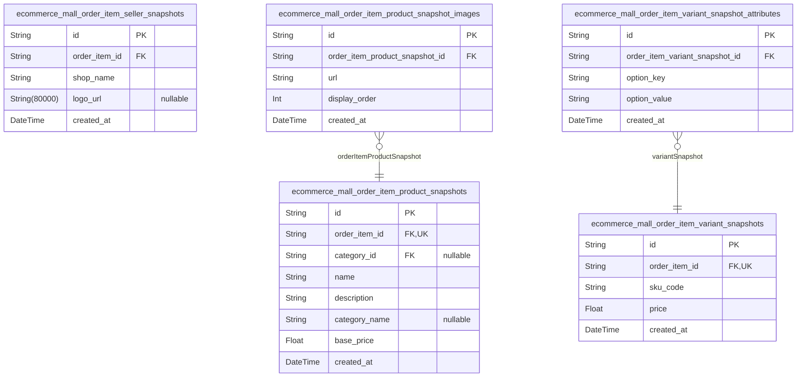
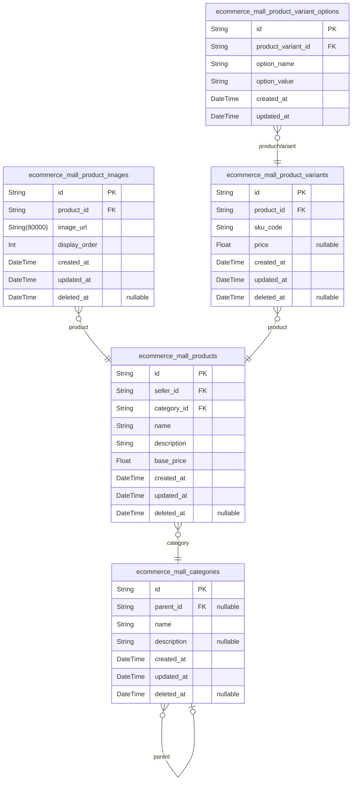
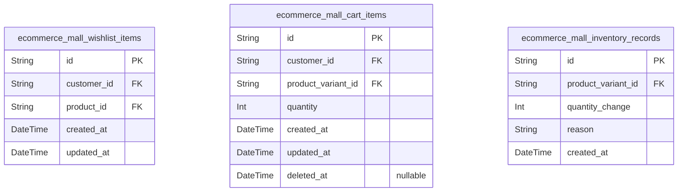
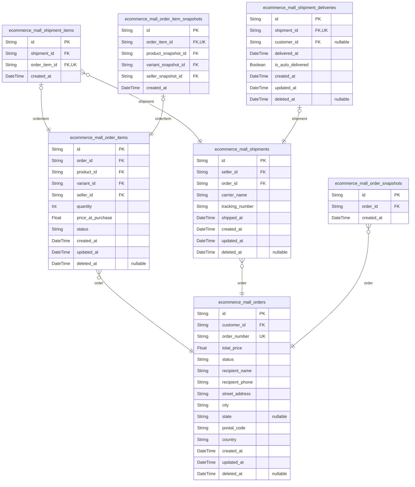
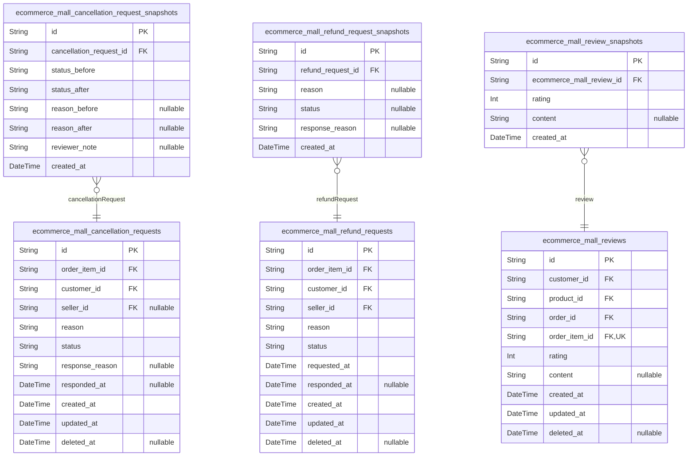
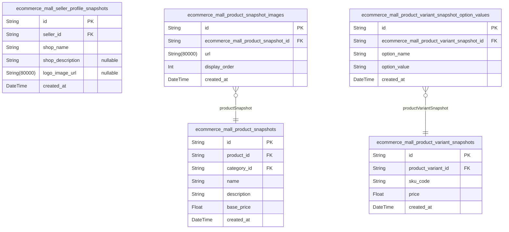
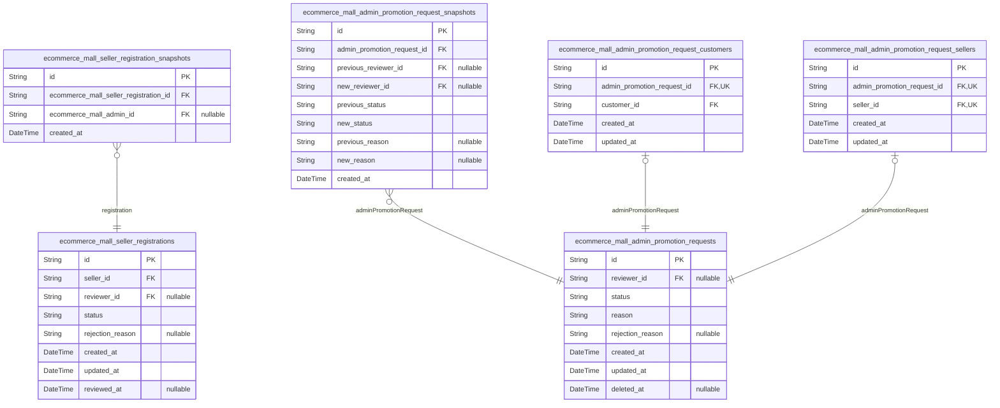

# Prisma Markdown

> Generated by [`prisma-markdown`](https://github.com/samchon/prisma-markdown)

- [Actors](#actors)
- [Systematic](#systematic)
- [Products](#products)
- [Shopping](#shopping)
- [Orders](#orders)
- [ServiceRequests](#servicerequests)
- [Snapshots](#snapshots)
- [Administration](#administration)

## Actors

```mermaid
erDiagram
"ecommerce_mall_guests" {
  String id PK
  DateTime created_at
  DateTime updated_at
  DateTime deleted_at "nullable"
}
"ecommerce_mall_guest_sessions" {
  String id PK
  String ecommerce_mall_guest_id FK
  String ip
  String href
  String referrer
  DateTime created_at
  DateTime expired_at
}
"ecommerce_mall_customers" {
  String id PK
  String email UK
  String password_hash
  DateTime created_at
  DateTime updated_at
  DateTime deleted_at "nullable"
}
"ecommerce_mall_customer_sessions" {
  String id PK
  String ecommerce_mall_customer_id FK
  String ip
  String href
  String referrer
  DateTime created_at
  DateTime expired_at
}
"ecommerce_mall_customer_password_resets" {
  String id PK
  String customer_id FK
  String token UK
  DateTime expires_at
  DateTime created_at
}
"ecommerce_mall_sellers" {
  String id PK
  String email UK
  String password_hash
  String approval_status
  DateTime created_at
  DateTime updated_at
  DateTime deleted_at "nullable"
}
"ecommerce_mall_seller_sessions" {
  String id PK
  String ecommerce_mall_seller_id FK
  String ip
  String href
  String referrer
  DateTime created_at
  DateTime expired_at
}
"ecommerce_mall_seller_password_resets" {
  String id PK
  String seller_id FK
  String token UK
  DateTime expires_at
  DateTime created_at
}
"ecommerce_mall_admins" {
  String id PK
  String email UK
  String password_hash
  String grade
  String status
  String nickname "nullable"
  DateTime created_at
  DateTime updated_at
  DateTime deleted_at "nullable"
}
"ecommerce_mall_admin_sessions" {
  String id PK
  String admin_id FK
  String ip
  String href
  String referrer
  DateTime expired_at
  DateTime created_at
}
"ecommerce_mall_admin_password_resets" {
  String id PK
  String admin_id FK
  String token UK
  DateTime created_at
  DateTime expired_at
}
"ecommerce_mall_admin_audit_logs" {
  String id PK
  String ecommerce_mall_admin_id FK
  String action
  String resource_type "nullable"
  String resource_id "nullable"
  String details "nullable"
  String ip "nullable"
  String user_agent "nullable"
  DateTime created_at
}
"ecommerce_mall_super_admins" {
  String id PK
  String email UK
  String password_hash
  String grade
  DateTime created_at
  DateTime updated_at
  DateTime deleted_at "nullable"
}
"ecommerce_mall_super_admin_sessions" {
  String id PK
  String super_admin_id FK
  String ip
  String href
  String referrer
  DateTime created_at
  DateTime expired_at
}
"ecommerce_mall_super_admin_password_resets" {
  String id PK
  String super_admin_id FK
  String token UK
  DateTime created_at
  DateTime expires_at
  DateTime used_at "nullable"
}
"ecommerce_mall_super_admin_audit_logs" {
  String id PK
  String super_admin_id FK
  String action_type
  String description
  String target_type "nullable"
  String target_id "nullable"
  String ip_address
  String user_agent
  DateTime created_at
}
"ecommerce_mall_guest_sessions" }o--|| "ecommerce_mall_guests" : ecommerceMallGuest
"ecommerce_mall_customer_sessions" }o--|| "ecommerce_mall_customers" : customer
"ecommerce_mall_customer_password_resets" }o--|| "ecommerce_mall_customers" : customer
"ecommerce_mall_seller_sessions" }o--|| "ecommerce_mall_sellers" : seller
"ecommerce_mall_seller_password_resets" }o--|| "ecommerce_mall_sellers" : seller
"ecommerce_mall_admin_sessions" }o--|| "ecommerce_mall_admins" : admin
"ecommerce_mall_admin_password_resets" }o--|| "ecommerce_mall_admins" : admin
"ecommerce_mall_admin_audit_logs" }o--|| "ecommerce_mall_admins" : admin
"ecommerce_mall_super_admin_sessions" }o--|| "ecommerce_mall_super_admins" : superAdmin
"ecommerce_mall_super_admin_password_resets" }o--|| "ecommerce_mall_super_admins" : superAdmin
"ecommerce_mall_super_admin_audit_logs" }o--|| "ecommerce_mall_super_admins" : superAdmin
```

### `ecommerce_mall_guests`

Temporary guest accounts for unauthenticated visitors accessing login and
registration endpoints.

Guests are temporary browser sessions that allow visitors to access
authentication endpoints before registering. Unlike registered customers,
sellers, or administrators, guests do not have credentials or persistent
identity.

Each guest account can have multiple temporary session tokens stored in
the [ecommerce_mall_guest_sessions](#ecommerce_mall_guest_sessions) table. Guest accounts are
automatically cleaned up after expiration and do not persist beyond the
current browsing session.

Properties as follows:

- `id`: Primary Key.
- `created_at`: Record creation timestamp.
- `updated_at`: Record last update timestamp.
- `deleted_at`: Soft deletion timestamp.

### `ecommerce_mall_guest_sessions`

Guest session tokens tracking JWT authentication sessions for
unauthenticated guest visitors. Stores connection metadata (IP, referrer)
and session lifecycle timestamps. Belongs to {@link
ecommerce_mall_guests}.

Properties as follows:

- `id`: Primary Key.
- `ecommerce_mall_guest_id`: Belonged guest's [ecommerce_mall_guests.id](#ecommerce_mall_guests).
- `ip`: IP address.
- `href`: URL.
- `referrer`: Referrer.
- `created_at`: Created at.
- `expired_at`: Expired at.

### `ecommerce_mall_customers`

Registered customer accounts with email and password authentication.

This table stores the core identity information for customers who
purchase products on the platform. Each customer has exactly one account
identified by their email address. The password is stored as a hash for
security.

When a customer deletes their account:
- Their profile information in [ecommerce_mall_customer_profiles](#ecommerce_mall_customer_profiles)
is deleted
- Their orders and order history are preserved (for seller records and
legal purposes)
- Their reviews are preserved but displayed as "deleted user"

Customers authenticate using email and password. Session management is
handled in the separate [ecommerce_mall_customer_sessions](#ecommerce_mall_customer_sessions) table,
and password reset tokens are stored in {@link
ecommerce_mall_customer_password_resets}.

Properties as follows:

- `id`: Primary Key.
- `email`
  > Customer's email address used for login and communications. Must be
  > unique across all customers.
- `password_hash`
  > Hashed password for authentication. The actual password is never stored
  > in plain text.
- `created_at`: Timestamp when the customer account was created.
- `updated_at`: Timestamp when the customer account was last updated.
- `deleted_at`
  > Timestamp when the customer account was soft deleted. Null if account is
  > active. Used for account deletion preservation of orders and reviews.

### `ecommerce_mall_customer_sessions`

JWT session tokens tracking customer authentication sessions with access
and refresh tokens. Sessions record connection context (IP, headers,
referrer) and temporal fields for security auditing. Each customer can
have multiple active sessions. Sessions are append-only records that
expire according to security policies.

Properties as follows:

- `id`: Primary Key.
- `ecommerce_mall_customer_id`: Customer who owns this session. [ecommerce_mall_customers.id](#ecommerce_mall_customers)
- `ip`: Client IP address from which the session was established.
- `href`: Page URL where the session was initiated.
- `referrer`
  > HTTP Referer header value indicating the source page that linked to the
  > login endpoint.
- `created_at`: Timestamp when the session was created.
- `expired_at`
  > Timestamp when the session expires. Sessions are considered invalid after
  > this time.

### `ecommerce_mall_customer_password_resets`

Password reset tokens for customer password recovery. Each token
represents a temporary password reset request linked to a customer
account. Tokens expire after a configured duration and are single-use.

Properties as follows:

- `id`: Primary Key.
- `customer_id`: Belonged customer's [ecommerce_mall_customers.id](#ecommerce_mall_customers)
- `token`
  > Unique password reset token string sent to customer email for
  > verification.
- `expires_at`: Token expiration timestamp. Tokens become invalid after this time.
- `created_at`: Token creation timestamp.

### `ecommerce_mall_sellers`

Registered seller accounts with authentication credentials and approval
workflow status.

Sellers are member-type actors who sell products on the platform. Each
seller must register with email and password, then obtain administrator
approval before listing products. The approval_status field tracks the
seller's standing: pending (awaiting approval), approved (can sell),
rejected (must reapply), or suspended (administrative action).

Account deletion is soft-deleted via deleted_at and only allowed when no
pending orders, cancellations, or refunds exist. When deleted, products
are hidden but order history and snapshots are preserved for
legal/compliance purposes.

[ecommerce_mall_seller_sessions](#ecommerce_mall_seller_sessions) tracks login sessions.
[ecommerce_mall_seller_password_resets](#ecommerce_mall_seller_password_resets) handles password recovery.
[ecommerce_mall_seller_registrations](#ecommerce_mall_seller_registrations) manages approval workflow
with rejection reasons.

Properties as follows:

- `id`: Primary Key.
- `email`: Unique email address used for login and account identification.
- `password_hash`: Bcrypt hashed password for authentication.
- `approval_status`
  > Account approval state: pending, approved, rejected, or suspended.
  > Controls seller's ability to list products.
- `created_at`: Timestamp when the seller account was created.
- `updated_at`: Timestamp of the most recent account update.
- `deleted_at`
  > Soft deletion timestamp. Null if account is active. Set when seller
  > deletes account (if no pending transactions).

### `ecommerce_mall_seller_sessions`

Session records for seller authentication tracking JWT tokens with access
and refresh tokens. Each session captures connection context (IP, href,
referrer) and temporal boundaries for security auditing. Sessions are
append-only records that track login events for compliance and security
analysis.

Properties as follows:

- `id`: Primary Key.
- `ecommerce_mall_seller_id`: Belonged seller's [ecommerce_mall_sellers.id](#ecommerce_mall_sellers).
- `ip`: Client IP address at session creation.
- `href`: Request origin URL or referer header.
- `referrer`: Full referrer URL from request headers.
- `created_at`: Session creation timestamp.
- `expired_at`: Session expiration timestamp for security.

### `ecommerce_mall_seller_password_resets`

Password reset tokens for seller password recovery.

Stores unique tokens with expiration timestamps that allow sellers to
reset their passwords securely. Each token belongs to a specific seller
and becomes invalid after the expiration time. Tokens are created when a
password reset is requested and deleted after use or expiration. The
table supports the authentication recovery workflow by ensuring tokens
are unique and time-limited.

Properties as follows:

- `id`: Primary Key.
- `seller_id`: Belonged seller's [ecommerce_mall_sellers.id](#ecommerce_mall_sellers).
- `token`: Unique password reset token string for authentication recovery.
- `expires_at`: Expiration timestamp when the token becomes invalid.
- `created_at`: Record creation timestamp.

### `ecommerce_mall_admins`

Administrator accounts with authentication credentials and privilege levels.

This table represents administrators who manage the e-commerce platform.
Administrators have elevated privileges including approving seller
registrations, managing categories, overseeing orders/products, and
suspending/banning users.

There are two administrator grades: regular administrators and super
administrators. Super administrators can promote/demote other
administrators and approve admin promotion requests.

Administrators authenticate using email and password. Session management
is handled by [ecommerce_mall_admin_sessions](#ecommerce_mall_admin_sessions). Password reset
tokens are managed by [ecommerce_mall_admin_password_resets](#ecommerce_mall_admin_password_resets).
Administrator actions are audited through {@link
ecommerce_mall_admin_audit_logs}.

Account status tracks whether an administrator is active, suspended, or
banned. Suspended/banned administrators cannot log in or perform
administrative actions.

All administrator data modifications are tracked with snapshots for audit
trail purposes.

Properties as follows:

- `id`: Primary Key.
- `email`
  > Administrator's email address used for login. Must be unique across all
  > administrator accounts.
- `password_hash`
  > BCrypt hashed password for authentication. Never store plain text
  > passwords.
- `grade`
  > Administrator privilege level. Valid values: 'regular', 'super_admin'.
  > Regular admins can approve sellers, manage categories, and oversee
  > platform. Super admins can additionally promote/demote administrators and
  > approve admin promotion requests.
- `status`
  > Account status for login and access control. Valid values: 'active',
  > 'suspended', 'banned'. Only 'active' administrators can log in and
  > perform actions.
- `nickname`
  > Display name or alias for the administrator shown in audit logs and
  > system interfaces. Optional but recommended for identification.
- `created_at`: Timestamp when the administrator account was created.
- `updated_at`: Timestamp when the administrator account was last modified.
- `deleted_at`
  > Soft deletion timestamp. When set, the account is considered deleted but
  > preserved for audit trail integrity.

### `ecommerce_mall_admin_sessions`

JWT session tokens for administrator authentication tracking.

Administrator login sessions are recorded with connection metadata (IP,
href, referrer) for security auditing and session lifecycle management.
Each session represents a logged-in administrator with an access token
that expires for security purposes.

Sessions are append-only and represent a complete authentication audit
trail. When an admin logs out or the session expires, the record is
preserved for security analysis.

Referenced by: [ecommerce_mall_admins.id](#ecommerce_mall_admins)

Properties as follows:

- `id`: Primary Key. Session identifier.
- `admin_id`
  > Belonged administrator's [ecommerce_mall_admins.id](#ecommerce_mall_admins). Links the
  > session to the authenticated admin account.
- `ip`
  > IP address from which the session was initiated. Captured for security
  > auditing and anomaly detection.
- `href`
  > The full URL of the page where the login was initiated. Used for tracking
  > session origin.
- `referrer`
  > HTTP Referrer header value indicating the previous page before login.
  > Captured for security audit trail.
- `expired_at`
  > Timestamp when the session token expires. After this time, the session is
  > no longer valid for authentication.
- `created_at`: Timestamp when the session was created (login time).

### `ecommerce_mall_admin_password_resets`

Password reset tokens for administrator account recovery.

Stores temporary tokens used for administrator password reset flows. Each
record represents a single password reset attempt with an expiration
timestamp for security. Tokens are automatically invalidated after
expiration. Related to the parent administrator via {@link
ecommerce_mall_admins}.

Properties as follows:

- `id`: Primary Key.
- `admin_id`: Belonged administrator's [ecommerce_mall_admins.id](#ecommerce_mall_admins).
- `token`: Unique password reset token sent via email for security verification.
- `created_at`: When the password reset token was created.
- `expired_at`: When the password reset token expires and becomes invalid.

### `ecommerce_mall_admin_audit_logs`

Audit log table recording all administrator actions for security
monitoring and compliance tracking. Each entry captures who performed an
action, what action was taken, which resource was affected, and
contextual metadata including IP address and user agent for forensic
analysis.

Properties as follows:

- `id`: Primary Key.
- `ecommerce_mall_admin_id`
  > The administrator who performed the action. References {@link
  > ecommerce_mall_admins.id}.
- `action`
  > The specific action performed by the administrator (e.g.,
  > 'approve_seller', 'suspend_user', 'delete_product').
- `resource_type`
  > The type of resource affected by this action (e.g., 'seller', 'product',
  > 'order', 'user').
- `resource_id`: The unique identifier of the affected resource.
- `details`
  > Additional details about the action in JSON or text format, such as
  > before/after values or reason.
- `ip`
  > IP address from which the action was performed for security audit
  > purposes.
- `user_agent`: User agent string of the browser/client used for the action.
- `created_at`: Timestamp when the audit log entry was created.

### `ecommerce_mall_super_admins`

Super administrator accounts representing the highest privilege level in
the platform hierarchy.

Super administrators have elevated privileges including:
- Approving/rejecting administrator promotion requests
- Promoting regular administrators to super administrator
- Demoting super administrators to regular administrator (except themselves)
- Managing the administrator hierarchy and grade levels

Each super admin requires email-based authentication with password login.
Super admin accounts can be soft deleted but historical audit data is
preserved.

This table serves as the canonical identity record for super administrators.

Properties as follows:

- `id`: Primary Key.
- `email`
  > Login email address for super administrator authentication. Must be
  > unique across all super admin accounts.
- `password_hash`
  > Hashed password for secure authentication. Never store plain text
  > passwords.
- `grade`
  > Administrator grade level indicating super administrator status. Fixed
  > value identifying highest privilege tier.
- `created_at`: Timestamp when the super administrator account was created.
- `updated_at`: Timestamp of the last update to the super administrator account.
- `deleted_at`
  > Soft delete timestamp. Non-null indicates account deletion while
  > preserving audit history.

### `ecommerce_mall_super_admin_sessions`

Super administrator session tokens for authentication and session
management.

Stores JWT access and refresh tokens along with connection context
metadata (IP address, page URL, referrer) for audit and security
purposes. Records when the session was established and when it expires.

Belongs to [ecommerce_mall_super_admins](#ecommerce_mall_super_admins) and represents active
login sessions for super administrators with elevated system privileges.

Properties as follows:

- `id`: Primary Key.
- `super_admin_id`: Belonged super administrator's [ecommerce_mall_super_admins.id](#ecommerce_mall_super_admins)
- `ip`: IP address of the client connecting the session.
- `href`: URL where the session was initiated.
- `referrer`: Referrer URL from the session initiation request.
- `created_at`: Creation time of the session record.
- `expired_at`: Expiration time when the session becomes invalid.

### `ecommerce_mall_super_admin_password_resets`

Password reset tokens for super administrator accounts. Stores temporary
tokens used to verify identity during password recovery workflows. Each
token has an expiration time for security and can only be used once.

Properties as follows:

- `id`: Primary Key.
- `super_admin_id`
  > Super administrator requesting the password reset. {@link
  > ecommerce_mall_super_admins.id}
- `token`
  > Unique password reset token. Cryptographically secure random string used
  > in password reset links.
- `created_at`: Timestamp when the password reset request was created.
- `expires_at`
  > Timestamp when the token expires and becomes invalid. Set based on
  > security policy (typically 1 hour).
- `used_at`
  > Timestamp when the token was successfully used to reset the password.
  > Null until consumed.

### `ecommerce_mall_super_admin_audit_logs`

Audit log tracking critical security events performed by super
administrators. Records all significant actions taken by super admins
including administrator promotions/demotions, system-level configuration
changes, and sensitive operations. Each entry captures the action type,
affected entity, contextual information (IP address, user agent), and
timestamp for security auditing and compliance purposes.

Properties as follows:

- `id`: Primary Key.
- `super_admin_id`: Belonged super administrator's [ecommerce_mall_super_admins.id](#ecommerce_mall_super_admins).
- `action_type`
  > Type of action performed (e.g., 'admin_promote', 'admin_demote',
  > 'system_config_change', 'force_action').
- `description`
  > Detailed description of the action performed including relevant context
  > and parameters.
- `target_type`
  > Type of entity affected by the action (e.g., 'admin', 'seller',
  > 'customer', 'system'). Null for general system actions.
- `target_id`
  > UUID of the affected entity. Null for general system actions or when not
  > applicable.
- `ip_address`: IP address from which the action was performed for security tracking.
- `user_agent`: User agent string of the browser/client used for the action.
- `created_at`: Timestamp when the audit log entry was created.

## Systematic

### `ecommerce_mall_order_item_product_snapshots`

Immutable snapshot of product state at time of purchase, preserving name,
description, category, and base price for each order item. Created when
an order is placed successfully to ensure accurate historical record for
dispute resolution and legal compliance. Related to {@link
ecommerce_mall_order_items} via 1:1 relationship. Image URLs are stored
in a normalized child table.

Properties as follows:

- `id`: Primary Key.
- `order_item_id`
  > Belonged order item's [ecommerce_mall_order_items.id](#ecommerce_mall_order_items). Establishes
  > 1:1 relationship to preserve product state at purchase time.
- `category_id`
  > Category reference at time of purchase. {@link
  > ecommerce_mall_categories.id}. Nullable if category was deleted after
  > purchase.
- `name`
  > Product name at time of purchase. Preserved exactly as displayed to
  > customer during checkout.
- `description`
  > Product description at time of purchase. Preserved for historical record
  > and dispute resolution.
- `category_name`
  > Category name at time of purchase. Denormalized to preserve category
  > state even if category is later renamed or deleted.
- `base_price`
  > Product base price at time of purchase. Preserved in order currency for
  > accurate pricing history.
- `created_at`
  > Timestamp when snapshot was created. Immutable record of when the product
  > state was captured.

### `ecommerce_mall_order_item_variant_snapshots`

Immutable snapshots capturing product variant state at time of purchase.

Preserves the exact SKU code, option values, and price of a product
variant when an order was placed. These snapshots are critical for
dispute resolution and serve as legal proof of what variant was actually
purchased. Each order item has exactly one corresponding variant snapshot
at creation time.

Individual option values (Color, Size, etc.) are stored in the {@link
ecommerce_mall_order_item_variant_snapshot_attributes} child table to
maintain 1NF compliance.

References the order item and provides the complete variant state as it
existed at purchase. [ecommerce_mall_order_items](#ecommerce_mall_order_items)

Properties as follows:

- `id`: Primary Key.
- `order_item_id`
  > Belonged order item's [ecommerce_mall_order_items.id](#ecommerce_mall_order_items). Enforces 1:1
  > relationship - each order item has exactly one variant snapshot.
- `sku_code`: SKU code of the variant at time of purchase.
- `price`: Price per unit of the variant at time of purchase.
- `created_at`: Timestamp when the snapshot was created (order placement time).

### `ecommerce_mall_order_item_seller_snapshots`

Immutable snapshots of seller profile states captured at the time of
order purchase.

This table preserves the exact shop name and logo of the seller at the
moment an order item was created, ensuring that historical order records
remain accurate even if the seller later changes their profile
information. This is critical for dispute resolution, legal compliance,
and maintaining accurate order history in an e-commerce platform where
money is exchanged.

These snapshots are linked to order items via {@link
ecommerce_mall_order_items} and cannot be modified or deleted once
created. The preserved data includes the seller's public identity
information (shop name and logo) that was visible to the customer at the
time of purchase.

Properties as follows:

- `id`: Primary Key.
- `order_item_id`
  > The order item this seller snapshot belongs to. References {@link
  > ecommerce_mall_order_items.id}. Captures which specific order line item
  > this seller profile state is associated with.
- `shop_name`
  > The seller's shop name at the time of purchase. Preserved exactly as it
  > appeared when the order was placed, regardless of subsequent changes to
  > the seller's profile.
- `logo_url`
  > The URL to the seller's shop logo image at the time of purchase.
  > Preserves the visual identity of the seller as it appeared when the order
  > was created.
- `created_at`
  > Timestamp when this snapshot was created. Records exactly when the seller
  > profile state was captured during order processing.

### `ecommerce_mall_order_item_product_snapshot_images`

Normalized child table storing individual product image URLs for order
item product snapshots. Each row represents one image belonging to a
specific product snapshot captured at order time, with display ordering
to preserve sequence (first image serves as thumbnail/main image). This
table ensures 1NF compliance by decomposing the image array into
individual atomic records rather than storing as JSON.

Properties as follows:

- `id`: Primary Key.
- `order_item_product_snapshot_id`
  > Belonged product snapshot's {@link
  > ecommerce_mall_order_item_product_snapshots.id}. Links the image to the
  > specific product snapshot captured at order time.
- `url`
  > URL or file path to the product image. Captures the image location at the
  > time of order.
- `display_order`
  > Display ordering for images within the product snapshot. Lower values
  > appear first. The first image (display_order = 0 or minimum value) serves
  > as the main/thumbnail image.
- `created_at`: Timestamp when the image snapshot was created.

### `ecommerce_mall_order_item_variant_snapshot_attributes`

Normalized child table storing individual option key-value pairs for
product variant snapshots at time of order purchase.

Each row represents one option attribute (e.g., Color: Red, Size: Large)
belonging to a specific order item variant snapshot. This table exists to
maintain First Normal Form (1NF) compliance by decomposing the variant
options data structure into atomic key-value records rather than storing
composite data.

The table stores option names (like 'Color', 'Size') and their
corresponding values (like 'Red', 'Large') as separate rows linked to the
parent variant snapshot. This enables historical preservation of exact
variant specifications at order time for dispute resolution and audit
purposes.

Each variant snapshot can have multiple attributes. A unique constraint
prevents duplicate option keys within the same variant snapshot.
Attributes are immutable after creation as part of the immutable snapshot
pattern.

Properties as follows:

- `id`: Primary Key.
- `order_item_variant_snapshot_id`
  > Parent variant snapshot's {@link
  > ecommerce_mall_order_item_variant_snapshots.id}. Links this option
  > attribute to the specific variant snapshot it describes.
- `option_key`
  > The option category or attribute name (e.g., 'Color', 'Size',
  > 'Material'). Represents what characteristic this option describes for the
  > product variant.
- `option_value`
  > The specific value for this option (e.g., 'Red', 'Large', 'Cotton'). The
  > actual selection made for the option attribute.
- `created_at`
  > Timestamp when this snapshot attribute was created. Part of the immutable
  > snapshot record for audit trail purposes.

## Products

### `ecommerce_mall_categories`

Product categories with hierarchical structure supporting one level of
nesting (parent/subcategory relationship).

Categories organize products into browsable hierarchies for customer
navigation. Each category can optionally have a parent category, creating
a two-level hierarchy (top-level categories and subcategories).
Categories are managed exclusively by administrators.

When a category is deleted, products in that category become
uncategorized but remain in the system. The soft delete pattern preserves
category history for existing orders and audit purposes.

Properties as follows:

- `id`: Primary Key.
- `parent_id`
  > Parent category's [ecommerce_mall_categories.id](#ecommerce_mall_categories). Null for
  > top-level categories.
- `name`
  > Category name displayed to customers. Must be unique within the same
  > parent category.
- `description`: Optional category description for display purposes.
- `created_at`: Timestamp when the category was created.
- `updated_at`: Timestamp when the category was last modified.
- `deleted_at`: Soft delete timestamp. Null if category is active.

### `ecommerce_mall_products`

Main product listings in the e-commerce platform. Each product is owned
by a seller and categorized under a specific category. Products serve as
the foundation for the catalog, containing basic information like name,
description, and base price. The actual purchasable SKUs are managed
through child product variants. Products support soft deletion to
maintain referential integrity with historical orders while being
removable from active listings. Product changes are audited through
snapshot records for dispute resolution.

Properties as follows:

- `id`: Primary Key.
- `seller_id`: Product owner seller's [ecommerce_mall_sellers.id](#ecommerce_mall_sellers).
- `category_id`: Product category's [ecommerce_mall_categories.id](#ecommerce_mall_categories).
- `name`: Product name displayed to customers.
- `description`: Detailed product description.
- `base_price`: Base price of the product. Variant-specific prices can override this.
- `created_at`: When the product was created.
- `updated_at`: When the product was last updated.
- `deleted_at`: Soft delete timestamp. Null if product is active.

### `ecommerce_mall_product_images`

Product images associated with products in the e-commerce platform.

Stores image URLs for each product with display ordering.
The first image in the order serves as the main product thumbnail.
Images can be reordered by updating the display_order field.

Images are managed through their parent product and do not support
independent operations.
Changes to images are included in product snapshots for audit trails.

[ecommerce_mall_products](#ecommerce_mall_products)

Properties as follows:

- `id`: Primary Key.
- `product_id`: Belonged product's [ecommerce_mall_products.id](#ecommerce_mall_products).
- `image_url`: URL to the uploaded product image file.
- `display_order`
  > Display ordering index for the image within the product. First image (0)
  > serves as the main thumbnail.
- `created_at`: Creation time of the record.
- `updated_at`: Last update time of the record.
- `deleted_at`: Deletion timestamp for soft delete. Null if the image is active.

### `ecommerce_mall_product_variants`

SKU-level product variants representing specific combinations of product
options. Each variant belongs to a product and has a unique SKU code
within that product. Variants can have optional price overrides. Stock
quantity is tracked separately via inventory_records. When variants are
deleted, they are soft-deleted to preserve order history. Individual
option values are stored in the normalized
ecommerce_mall_product_variant_options child table.

Properties as follows:

- `id`: Primary Key.
- `product_id`: Belonged product's [ecommerce_mall_products.id](#ecommerce_mall_products).
- `sku_code`
  > Unique SKU code within the product. Combined with product_id for
  > uniqueness constraint.
- `price`
  > Optional variant-specific price that overrides the product's base price.
  > Null when using product's base price.
- `created_at`: Timestamp when the variant was created.
- `updated_at`: Timestamp when the variant was last updated.
- `deleted_at`: Soft delete timestamp. Null if active, set when variant is deleted.

### `ecommerce_mall_product_variant_options`

Individual option value records for product variants, ensuring 1NF (First
Normal Form) compliance by decomposing variant options into atomic
key-value pairs.

Each row represents one option type and its corresponding value for a
specific product variant (e.g., option_name='Color', option_value='Red').
This normalization enables efficient querying by specific option types
(e.g., "find all variants with Color=Red") and eliminates JSON/array
storage within string fields.

Related entities:
- Belongs to [ecommerce_mall_product_variants](#ecommerce_mall_product_variants) - each variant can
have multiple option records
- Used by [ecommerce_mall_cart_items](#ecommerce_mall_cart_items) and {@link
ecommerce_mall_order_items} to identify specific variant selections
- Referenced in [ecommerce_mall_product_variant_snapshots](#ecommerce_mall_product_variant_snapshots) to
preserve option state at point-in-time

Properties as follows:

- `id`: Primary Key.
- `product_variant_id`
  > Belonged product variant's [ecommerce_mall_product_variants.id](#ecommerce_mall_product_variants).
  > Establishes which variant this option value belongs to.
- `option_name`
  > The option type/key (e.g., 'Color', 'Size', 'Material'). Represents the
  > classification dimension for this option value. Required field - every
  > variant option must have a type name.
- `option_value`
  > The specific value for this option type (e.g., 'Red', 'Large', 'Cotton').
  > Represents the concrete selection value within the option classification.
  > Required field - every variant option must have a value.
- `created_at`
  > Record creation timestamp. Automatically set when the option value is
  > first created.
- `updated_at`
  > Record last update timestamp. Automatically updated when the option value
  > is modified.

## Shopping

### `ecommerce_mall_wishlist_items`

Customer wishlist entries linking customers to saved products at the
product level (not variant level).

This table captures the "save for later" functionality where customers
can bookmark products they are interested in purchasing later. Wishlist
entries are independent entities managed by customers and can be
searched, filtered, and browsed separately from the cart.

When a product is deleted by a seller, wishlist items referencing that
product are automatically removed (cascade delete). This table links to
[ecommerce_mall_customers](#ecommerce_mall_customers) for ownership and {@link
ecommerce_mall_products} for the saved product reference.

Properties as follows:

- `id`: Primary Key.
- `customer_id`
  > Belonged customer's [ecommerce_mall_customers.id](#ecommerce_mall_customers). References the
  > customer who saved the product to their wishlist.
- `product_id`
  > Belonged product's [ecommerce_mall_products.id](#ecommerce_mall_products). References the
  > product saved in the wishlist.
- `created_at`: Creation time of the wishlist entry.
- `updated_at`
  > Last update time of the wishlist entry. Updated when the entry is
  > modified or accessed.

### `ecommerce_mall_cart_items`

Customer shopping cart entries linking customers to specific product
variants with quantities.

Each cart item represents a product variant that a customer intends to
purchase. When a customer adds the same variant to their cart again,
quantities are combined rather than creating separate line items. This is
enforced by a unique constraint on the customer and variant combination.

Cart items track the desired quantity for each variant. The actual
availability and stock status is checked at checkout time, not when
adding to cart.

Properties as follows:

- `id`: Primary Key.
- `customer_id`: Belonged customer's [ecommerce_mall_customers.id](#ecommerce_mall_customers).
- `product_variant_id`: Belonged product variant's [ecommerce_mall_product_variants.id](#ecommerce_mall_product_variants).
- `quantity`: Quantity of the variant in the cart.
- `created_at`: Creation time of the cart item.
- `updated_at`: Last update time of the cart item.
- `deleted_at`: Soft delete timestamp. If set, the cart item is considered removed.

### `ecommerce_mall_inventory_records`

Inventory quantity change records for product variants tracking
restocking, order deductions, cancellations, and adjustments.

Each record represents a single inventory movement event - whether stock
was added (positive quantity_change) or removed (negative
quantity_change). The cumulative sum of all records for a variant
represents the current stock level.

Common record types include:
- Restocking: Positive quantity_change when sellers add inventory
- Order deduction: Negative quantity_change when orders are placed
- Cancellation refund: Positive quantity_change when orders are cancelled
- Refund restoration: Positive quantity_change when refunds are processed
- Adjustment: Positive or negative quantity_change for inventory corrections

Records are immutable and serve as an audit trail for inventory
management and dispute resolution. {@link
ecommerce_mall_product_variants}

Properties as follows:

- `id`: Primary Key.
- `product_variant_id`: Target variant's [ecommerce_mall_product_variants.id](#ecommerce_mall_product_variants).
- `quantity_change`
  > Quantity change amount. Positive values indicate stock increase
  > (restocking, cancellations, refunds). Negative values indicate stock
  > decrease (order placement, adjustments).
- `reason`
  > Reason for the inventory change. Examples: 'restock', 'order_placed',
  > 'order_cancelled', 'refund_processed', 'inventory_adjustment',
  > 'damaged_goods'.
- `created_at`: When the inventory record was created.

## Orders

### `ecommerce_mall_orders`

Order headers created when payment succeeds, representing a completed
purchase by a customer. Each order tracks the customer who placed it, a
unique order number for reference, the total price of all items, and the
overall order status derived from its items. The shipping address is
stored as a snapshot at order time since customer addresses can be edited
or deleted later. Orders support soft deletion to preserve historical
transaction records while maintaining data retention policies. Related
order items and shipments are managed in separate tables.

Properties as follows:

- `id`: Primary Key.
- `customer_id`
  > Customer who placed the order. References {@link
  > ecommerce_mall_customers.id}.
- `order_number`
  > Unique order number for customer reference and support inquiries. Format
  > typically includes timestamp and sequence.
- `total_price`: Total price of all items in the order, calculated at checkout time.
- `status`
  > Overall order status derived from item statuses: paid (all items paid),
  > shipped (any item shipped), delivered (all items delivered), cancelled
  > (all items cancelled), refunded (all items refunded), partially_completed
  > (mixed states).
- `recipient_name`
  > Name of the recipient for shipping, captured from the address at order
  > time.
- `recipient_phone`
  > Phone number of the recipient for shipping contact, captured from the
  > address at order time.
- `street_address`: Street address line for delivery, captured from the address at order time.
- `city`: City for delivery, captured from the address at order time.
- `state`: State or province for delivery, captured from the address at order time.
- `postal_code`: Postal or ZIP code for delivery, captured from the address at order time.
- `country`: Country for delivery, captured from the address at order time.
- `created_at`: Timestamp when the order was created (payment succeeded).
- `updated_at`: Timestamp when the order was last updated.
- `deleted_at`
  > Soft delete timestamp. Null if order is active, set when deleted for data
  > retention.

### `ecommerce_mall_order_items`

Individual purchased product variants within an order representing a
specific product-variant combination with quantity and price at time of
purchase. Each order item tracks its own status lifecycle independently
(paid, shipped, delivered, cancelled, refunded), allowing different items
within the same order to have different fulfillment states. Order items
preserve purchase-time state through separate snapshot tables: {@link
ecommerce_mall_order_item_product_snapshots}, {@link
ecommerce_mall_order_item_variant_snapshots}, and {@link
ecommerce_mall_order_item_seller_snapshots}.

Properties as follows:

- `id`: Primary Key.
- `order_id`: Belongs to order's [ecommerce_mall_orders.id](#ecommerce_mall_orders) containing this item.
- `product_id`
  > Belongs to product's [ecommerce_mall_products.id](#ecommerce_mall_products) at time of
  > purchase.
- `variant_id`
  > Belongs to product variant's [ecommerce_mall_product_variants.id](#ecommerce_mall_product_variants)
  > specifying SKU and options.
- `seller_id`
  > Belongs to seller's [ecommerce_mall_sellers.id](#ecommerce_mall_sellers) who sold the
  > product variant.
- `quantity`: Number of units purchased for this product variant.
- `price_at_purchase`
  > Price per unit at time of purchase (preserved from variant price,
  > allowing for historical accuracy).
- `status`
  > Current fulfillment status of this order item: 'paid', 'shipped',
  > 'delivered', 'cancelled', or 'refunded'.
- `created_at`: Timestamp when the order item was created (order placed).
- `updated_at`: Timestamp when the order item was last updated.
- `deleted_at`
  > Soft delete timestamp for when order item is logically deleted (kept for
  > seller records and legal purposes).

### `ecommerce_mall_shipments`

Packages sent by sellers containing one or more order items from the same
seller.

Shipments represent the physical packaging and dispatch of purchased
items. Unlike orders which can span multiple sellers,
a shipment always originates from exactly one seller. When a seller
prepares to ship items, they group eligible order
items (those with status 'paid') into a single shipment, providing
carrier and tracking information.

Key business rules:
- A shipment can contain multiple order items only if they are from the
same seller
- Different sellers always ship separately (separate shipments)
- Creating a shipment automatically updates the status of all included
order items to 'shipped'
- Customers view shipment tracking information per order to monitor
delivery status
- Delivery confirmation is tracked separately via {@link
ecommerce_mall_shipment_deliveries}
- The order items in a shipment are linked through the junction table
[ecommerce_mall_shipment_items](#ecommerce_mall_shipment_items)

Snapshots are not created for shipments as the tracking information
(carrier, number) is immutable once set.

Properties as follows:

- `id`: Primary Key.
- `seller_id`
  > Belonged seller's [ecommerce_mall_sellers.id](#ecommerce_mall_sellers). The seller who
  > created and sent this shipment.
- `order_id`
  > Belonged order's [ecommerce_mall_orders.id](#ecommerce_mall_orders). The order this
  > shipment fulfills.
- `carrier_name`
  > Name of the shipping carrier (e.g., 'FedEx', 'UPS', 'DHL', 'USPS'). Used
  > for tracking and display to customers.
- `tracking_number`
  > Tracking number provided by the carrier for this shipment. Customers use
  > this to track package delivery status.
- `shipped_at`
  > Timestamp when the seller marked this shipment as shipped. Used to
  > calculate delivery windows and for order status derivation.
- `created_at`: Creation timestamp.
- `updated_at`: Update timestamp.
- `deleted_at`
  > Soft deletion timestamp. Shipments are rarely deleted (only for
  > corrections before delivery), but soft delete is preserved for data
  > integrity.

### `ecommerce_mall_shipment_items`

Junction table linking order items to shipments, establishing a
many-to-many relationship where a single shipment can contain multiple
order items. Each order item can only belong to one shipment. This table
is automatically managed when sellers create shipments and select items
to include.

Properties as follows:

- `id`: Primary Key.
- `shipment_id`
  > Reference to the parent shipment containing this order item. {@link
  > ecommerce_mall_shipments.id}
- `order_item_id`
  > Reference to the order item included in this shipment. {@link
  > ecommerce_mall_order_items.id}
- `created_at`: Timestamp when this shipment-item association was created.

### `ecommerce_mall_order_item_snapshots`

Junction table linking order items to their corresponding purchase-time
snapshots. When a customer places an order, the system creates snapshots
of the product, variant, and seller profile states at that exact moment.
This table maintains those relationships, ensuring complete historical
preservation of what was purchased from whom and at what price - critical
for dispute resolution and legal compliance in an e-commerce platform
handling monetary transactions.

Properties as follows:

- `id`: Primary Key.
- `order_item_id`: Belonged order item's [ecommerce_mall_order_items.id](#ecommerce_mall_order_items).
- `product_snapshot_id`
  > Associated product snapshot's {@link
  > ecommerce_mall_order_item_product_snapshots.id}. Captures product name,
  > description, category, and base price at purchase time.
- `variant_snapshot_id`
  > Associated variant snapshot's {@link
  > ecommerce_mall_order_item_variant_snapshots.id}. Captures SKU code,
  > option values, and price at purchase time.
- `seller_snapshot_id`
  > Associated seller snapshot's {@link
  > ecommerce_mall_order_item_seller_snapshots.id}. Captures shop name and
  > logo at purchase time.
- `created_at`: When the snapshot relationship was created (when the order was placed).

### `ecommerce_mall_order_snapshots`

Point-in-time snapshots of entire orders created for audit trails and
significant status changes.

References the complete state captured in the parent order table. The
shipping_address_id preserves the address reference at the time of
snapshot for audit purposes. Snapshots are immutable records that cannot
be modified or deleted.

Created automatically when orders undergo significant state changes or
when audit records are required for compliance and legal purposes.

Properties as follows:

- `id`: Primary Key.
- `order_id`: Belonged order's [ecommerce_mall_orders.id](#ecommerce_mall_orders).
- `created_at`: When the snapshot was created.

### `ecommerce_mall_shipment_deliveries`

Delivery confirmation records tracking when shipments are delivered and
by whom confirmed.

Each shipment has exactly one delivery record created when delivery is
confirmed - either manually by the customer or automatically after 14
days. This table preserves the delivery timestamp and confirmation method
for audit trails and order status tracking.

Relationships:
- [ecommerce_mall_shipments](#ecommerce_mall_shipments) - The shipment being delivered (1:1)
- [ecommerce_mall_customers](#ecommerce_mall_customers) - The customer who confirmed delivery
(nullable for auto-delivery)

Properties as follows:

- `id`: Primary Key.
- `shipment_id`: Belonged shipment's [ecommerce_mall_shipments.id](#ecommerce_mall_shipments).
- `customer_id`
  > Customer who confirmed delivery. [ecommerce_mall_customers.id](#ecommerce_mall_customers).
  > Null when automatically delivered by system after 14 days.
- `delivered_at`: Timestamp when the shipment was marked as delivered.
- `is_auto_delivered`
  > Whether delivery was automatically confirmed by system after 14-day
  > window (true) or manually confirmed by customer (false).
- `created_at`: Record creation timestamp.
- `updated_at`: Record last update timestamp.
- `deleted_at`: Soft deletion timestamp. Null if not deleted.

## ServiceRequests

### `ecommerce_mall_cancellation_requests`

Customer cancellation requests for paid-but-unshipped order items. When a
customer wants to cancel an order item that has been paid for but not yet
shipped, they submit a cancellation request with a reason. The seller
then reviews the request and either approves or rejects it. Every
approval or rejection creates a snapshot that preserves the state of the
request for audit purposes. Cancellation requests preserve the state of
the order item and restore stock quantities when approved.

Properties as follows:

- `id`: Primary Key.
- `order_item_id`
  > Belonged order item's [ecommerce_mall_order_items.id](#ecommerce_mall_order_items). The specific
  > order item the customer wants to cancel.
- `customer_id`
  > Requesting customer's [ecommerce_mall_customers.id](#ecommerce_mall_customers). The customer
  > who submitted the cancellation request.
- `seller_id`
  > Responding seller's [ecommerce_mall_sellers.id](#ecommerce_mall_sellers). The seller who
  > owns the order item and responds to the request. Nullable initially, set
  > when seller reviews.
- `reason`
  > Customer's reason for requesting cancellation. This explains why the
  > customer wants to cancel the order item.
- `status`
  > Current status of the cancellation request. Values: 'pending' (awaiting
  > seller response), 'approved' (seller approved, item cancelled),
  > 'rejected' (seller rejected the request).
- `response_reason`
  > Seller's reason for approving or rejecting the cancellation request.
  > Explanation provided when the seller responds to the request.
- `responded_at`
  > Timestamp when the seller responded to the request (approved or
  > rejected). Null while status is pending.
- `created_at`: Creation time of record.
- `updated_at`: Update time of record.
- `deleted_at`
  > Soft delete timestamp. Records are soft-deleted per platform data
  > retention policy.

### `ecommerce_mall_cancellation_request_snapshots`

Immutable point-in-time snapshots of cancellation requests capturing the
state before and after approval or rejection events. Each snapshot
preserves the complete state of a cancellation request at a specific
moment in time, including status transitions and reason changes.
Snapshots are append-only and immutable to support audit trails and
dispute resolution.

Properties as follows:

- `id`: Primary Key.
- `cancellation_request_id`
  > Belonged cancellation request's {@link
  > ecommerce_mall_cancellation_requests.id}.
- `status_before`
  > The cancellation request status before the change. Valid values may
  > include 'pending', 'approved', 'rejected', 'cancelled'.
- `status_after`
  > The cancellation request status after the change. Valid values may
  > include 'pending', 'approved', 'rejected', 'cancelled'.
- `reason_before`
  > The cancellation reason provided by the customer before the change, if
  > any.
- `reason_after`: The cancellation reason provided by the customer after the change, if any.
- `reviewer_note`
  > Optional note or explanation provided by the seller when approving or
  > rejecting the cancellation request.
- `created_at`
  > Timestamp when this snapshot was created, capturing the exact moment of
  > the state change.

### `ecommerce_mall_refund_requests`

Customer refund requests for delivered order items within the 7-day
return window.

Refund requests are created by customers for order items that have been
delivered. Each request tracks the refund reason, current status in the
approval workflow, and timestamps for both request creation and seller
response. The seller of the product reviews the request and can approve
or reject it. When the seller responds, a corresponding snapshot is
created in the separate refund_request_snapshots table to preserve the
request state and response for audit purposes.

Refund requests maintain the complete lifecycle: pending →
approved/rejected. If a request is rejected, the customer may submit a
new request within the 7-day window. Approved refunds restore stock
quantities via inventory records.

Key relationships:
- Belongs to a specific [ecommerce_order_items](#ecommerce_order_items) representing the
delivered item
- Created by a [ecommerce_mall_customers](#ecommerce_mall_customers) customer (the buyer)
- Reviewed by a [ecommerce_mall_sellers](#ecommerce_mall_sellers) seller (the seller of the
product)
- Snapshots captured in [ecommerce_mall_refund_request_snapshots](#ecommerce_mall_refund_request_snapshots)

Properties as follows:

- `id`: Primary Key.
- `order_item_id`
  > Reference to the order item being requested for refund. Links to {@link
  > ecommerce_mall_order_items.id}.
- `customer_id`
  > Reference to the customer requesting the refund. Links to {@link
  > ecommerce_mall_customers.id}.
- `seller_id`
  > Reference to the seller who reviews and responds to the refund request.
  > Links to [ecommerce_mall_sellers.id](#ecommerce_mall_sellers).
- `reason`: Customer's explanation for why they are requesting a refund.
- `status`: Current status of the refund request: pending, approved, or rejected.
- `requested_at`: Timestamp when the customer submitted the refund request.
- `responded_at`
  > Timestamp when the seller responded to the refund request. Null if still
  > pending.
- `created_at`: Record creation timestamp.
- `updated_at`: Record last update timestamp.
- `deleted_at`: Soft delete timestamp. Allows customers to cancel pending refund requests.

### `ecommerce_mall_refund_request_snapshots`

Point-in-time snapshots of refund request states captured when a seller
responds (approves or rejects). Refund requests allow customers to
request refunds for delivered order items within a 7-day window. When a
seller reviews and responds to a request, a snapshot is created
preserving the complete state including the original reason, status
transition, and response reason for audit trails and dispute resolution.

Snapshots are immutable records that serve as legal evidence of the
refund request state at the moment of seller response. They cannot be
modified or deleted.

Properties as follows:

- `id`: Primary Key.
- `refund_request_id`: Belonged refund request's [ecommerce_mall_refund_requests.id](#ecommerce_mall_refund_requests).
- `reason`
  > Customer's refund request reason at the time of snapshot. Preserves the
  > original explanation for why the refund was requested.
- `status`
  > Status of the refund request at the time of snapshot. Values: 'pending',
  > 'approved', 'rejected'. Captures the state after seller response.
- `response_reason`
  > Seller's response reason at the time of snapshot. Contains the
  > explanation provided by the seller when approving or rejecting the refund
  > request.
- `created_at`
  > Timestamp when the snapshot was created. Records the exact moment the
  > refund request state was preserved for audit purposes.

### `ecommerce_mall_reviews`

Customer reviews and ratings for purchased products.

Reviews represent customer feedback on products they have purchased and
received. Each review is linked to a specific order item (purchased
variant), and contains a mandatory star rating (1-5) and optional text
content. Reviews can only be created after the associated order item has
been delivered.

Reviews support edit history through the {@link
ecommerce_mall_review_snapshots} table. When a review is edited, a
snapshot of the previous state is automatically created. Reviews can be
soft-deleted by customers, but snapshots are preserved indefinitely for
audit purposes.

Reviews belong to a [ecommerce_mall_customers](#ecommerce_mall_customers), a {@link
ecommerce_mall_products}, an [ecommerce_mall_orders](#ecommerce_mall_orders), and a
specific [ecommerce_mall_order_items](#ecommerce_mall_order_items). The product's average rating
is calculated from all non-deleted reviews.

Properties as follows:

- `id`: Primary Key.
- `customer_id`: Reviewing customer's [ecommerce_mall_customers.id](#ecommerce_mall_customers).
- `product_id`: Reviewed product's [ecommerce_mall_products.id](#ecommerce_mall_products).
- `order_id`: Associated order's [ecommerce_mall_orders.id](#ecommerce_mall_orders).
- `order_item_id`
  > Specific order item (purchased variant) being reviewed. {@link
  > ecommerce_mall_order_items.id}.
- `rating`
  > Star rating from 1 to 5. Required field representing customer's
  > satisfaction level with the purchased product.
- `content`
  > Optional text review content. Free-form customer feedback about their
  > experience with the product.
- `created_at`: Timestamp when the review was first created.
- `updated_at`: Timestamp when the review was last modified.
- `deleted_at`
  > Soft deletion timestamp. When set, the review is considered deleted but
  > snapshots are preserved.

### `ecommerce_mall_review_snapshots`

Immutable snapshots of review states capturing rating and content at the
time of each edit. Created whenever a customer modifies their review to
preserve the previous state for audit trails and dispute resolution.
Snapshots cannot be modified or deleted.

Properties as follows:

- `id`: Primary Key.
- `ecommerce_mall_review_id`: Belonged review's [ecommerce_mall_reviews.id](#ecommerce_mall_reviews).
- `rating`: Rating value (1-5 stars) at the time of snapshot.
- `content`
  > Text content of the review at the time of snapshot. Empty if review had
  > no text content.
- `created_at`: When the snapshot was created (when the review was edited).

## Snapshots

### `ecommerce_mall_product_snapshots`

Immutable snapshots of product states capturing the complete product
information at a specific point in time. Preserves product name,
description, category reference, base price, and associated images for
audit trails and dispute resolution. Every edit to a product creates a
new snapshot, ensuring historical data integrity for an e-commerce
platform handling financial transactions. Snapshots are append-only and
cannot be deleted or modified after creation. Related images are stored
in [ecommerce_mall_product_snapshot_images](#ecommerce_mall_product_snapshot_images).

Properties as follows:

- `id`: Primary Key.
- `product_id`
  > Belonged product's [ecommerce_mall_products.id](#ecommerce_mall_products). References the
  > product being snapshotted.
- `category_id`
  > Category reference at time of snapshot. Belonged category's {@link
  > ecommerce_mall_categories.id}.
- `name`
  > Product name at the time of snapshot. Preserves the exact product title
  > for historical reference.
- `description`
  > Product description at the time of snapshot. Preserves the complete
  > product description text.
- `base_price`
  > Base price of the product at the time of snapshot. Stores the exact price
  > value for historical record.
- `created_at`
  > Timestamp when the snapshot was created. Records the exact moment the
  > snapshot was taken.

### `ecommerce_mall_product_variant_snapshots`

Immutable snapshots of product variant states capturing SKU code and
price at a point in time for audit trails and dispute resolution in an
e-commerce platform.

Each snapshot represents the complete state of a product variant at a
specific moment, preserving historical data even if the parent variant is
modified or deleted. Option values are stored in a normalized child table
to maintain 1NF compliance.

Properties as follows:

- `id`: Primary Key.
- `product_variant_id`
  > Reference to the product variant being snapshotted. {@link
  > ecommerce_mall_product_variants.id}
- `sku_code`: SKU code of the variant at the time of snapshot.
- `price`: Price of the variant at the time of snapshot in decimal format.
- `created_at`
  > Timestamp when this snapshot was created. Immutable snapshots are
  > append-only.

### `ecommerce_mall_seller_profile_snapshots`

Immutable snapshots of seller profile states capturing the complete state
of a seller's shop profile at a specific point in time. Each snapshot
preserves the shop name, description, and logo image URL as they existed
when the snapshot was created. These snapshots serve as an immutable
audit trail for dispute resolution, enabling administrators and the
platform to review historical states of seller profiles even after
subsequent edits or account deletions. Snapshots are created whenever a
seller edits their profile content and are referenced by order items to
preserve the seller's shop identity at the time of purchase.

Properties as follows:

- `id`: Primary Key.
- `seller_id`
  > Reference to the seller whose profile state is being captured. Links to
  > the seller's identity in [ecommerce_mall_sellers.id](#ecommerce_mall_sellers).
- `shop_name`
  > The shop name of the seller at the time the snapshot was created.
  > Preserves the exact shop name that was displayed to customers.
- `shop_description`
  > The shop description of the seller at the time the snapshot was created.
  > Preserves the brand representation and store narrative. May be null if no
  > description was set.
- `logo_image_url`
  > The URL of the seller's logo image at the time the snapshot was created.
  > Preserves the visual identity of the shop. May be null if no logo image
  > was set.
- `created_at`
  > Timestamp when this snapshot was created to preserve the seller profile
  > state. Captures the exact moment of the profile edit that triggered this
  > snapshot.

### `ecommerce_mall_product_snapshot_images`

Stores images associated with a product snapshot, preserving the image
URLs/paths and display order at the time of snapshot.

Each snapshot can have multiple images with ordering where the first
image serves as the main/thumbnail. This table enables complete
reconstruction of the product's visual presentation at any point in time
for dispute resolution and audit purposes.

Images are stored with their display order to maintain the exact
presentation sequence that customers would have seen. The first image
(order = 1) serves as the thumbnail/main image, while subsequent images
provide additional product views.

[ecommerce_mall_product_snapshots](#ecommerce_mall_product_snapshots)

Properties as follows:

- `id`: Primary Key.
- `ecommerce_mall_product_snapshot_id`: Belonged product snapshot's [ecommerce_mall_product_snapshots.id](#ecommerce_mall_product_snapshots).
- `url`: URL or path to the image file stored at the time of snapshot.
- `display_order`
  > Display order of the image within the snapshot. First image (1) is the
  > main/thumbnail image.
- `created_at`: When this snapshot image record was created.

### `ecommerce_mall_product_variant_snapshot_option_values`

Normalized key-value store for product variant snapshot option values.
Each row represents a single option key-value pair (e.g.,
option_name='Color', option_value='Red') belonging to a specific {@link
ecommerce_mall_product_variant_snapshots}. This table ensures 1NF
compliance by decomposing variant options from JSON/array storage into
separate atomic records, enabling efficient filtering and querying by
specific option types.

Properties as follows:

- `id`: Primary Key.
- `ecommerce_mall_product_variant_snapshot_id`
  > Belonged product variant snapshot's {@link
  > ecommerce_mall_product_variant_snapshots.id}.
- `option_name`
  > The name of the option (e.g., 'Color', 'Size', 'Material'). Represents
  > the key in the key-value pair for variant configuration.
- `option_value`
  > The value of the option (e.g., 'Red', 'Large', 'Cotton'). Represents the
  > value in the key-value pair for variant configuration.
- `created_at`: Creation time of the record.

## Administration

### `ecommerce_mall_seller_registrations`

Tracks seller registration applications and their approval workflow status.

Each seller submits a registration application that must be reviewed by
an administrator before they can sell products on the platform. The
registration records the submission timestamp, current approval status,
and if rejected, the reason provided by the reviewing administrator.

Key relationships:
- [ecommerce_mall_sellers](#ecommerce_mall_sellers): The seller who submitted this
registration application
- [ecommerce_mall_admins](#ecommerce_mall_admins): The administrator who reviewed and
processed the application
- [ecommerce_mall_seller_registration_snapshots](#ecommerce_mall_seller_registration_snapshots): Snapshots
capturing state changes for audit trails

The registration flows through three statuses:
- "pending": Application submitted, awaiting administrator review
- "approved": Administrator approved, seller can now list products
- "rejected": Administrator rejected with a provided reason; seller can
reapply

Properties as follows:

- `id`: Primary Key.
- `seller_id`
  > The [ecommerce_mall_sellers.id](#ecommerce_mall_sellers) of the seller who submitted this
  > registration application.
- `reviewer_id`
  > The [ecommerce_mall_admins.id](#ecommerce_mall_admins) of the administrator who reviewed
  > this application. Set when status changes from pending to approved or
  > rejected.
- `status`
  > Current approval status of the registration application. Values:
  > 'pending' (awaiting review), 'approved' (seller can sell), 'rejected'
  > (administrator denied, reason provided).
- `rejection_reason`
  > Reason provided by the administrator when rejecting the application. Only
  > populated when status is 'rejected'. Required for audit and for sellers
  > to understand why their application was denied.
- `created_at`: Timestamp when the seller submitted the registration application.
- `updated_at`
  > Timestamp of the last update to this record, typically when it was
  > reviewed by an administrator.
- `reviewed_at`
  > Timestamp when an administrator reviewed and processed this application.
  > Set when status changes from pending to approved or rejected.

### `ecommerce_mall_seller_registration_snapshots`

Immutable snapshots of seller registration state changes for audit trail
and dispute resolution.

This table captures point-in-time records when a seller registration is
reviewed by an administrator. Each entry represents a review event,
recording which administrator performed the review and when.

Snapshots are append-only and immutable - they can never be deleted or
modified once created. They reference the parent {@link
ecommerce_mall_seller_registrations.id} table to provide context. The
actual registration state (status, rejection_reason) at the time of
review is stored in the parent table; this snapshot records the review
event metadata (who and when).

For administrators, these snapshots provide a complete audit trail of all
review actions performed on registrations.

Properties as follows:

- `id`: Primary Key.
- `ecommerce_mall_seller_registration_id`
  > Reference to the parent seller registration that this snapshot belongs
  > to. Links the snapshot to the original registration record in {@link
  > ecommerce_mall_seller_registrations.id}.
- `ecommerce_mall_admin_id`
  > Reference to the administrator who reviewed the registration when this
  > snapshot was created. Links to [ecommerce_mall_admins.id](#ecommerce_mall_admins).
- `created_at`
  > Timestamp when this snapshot was created. Represents the exact moment the
  > review event was recorded for the audit trail.

### `ecommerce_mall_admin_promotion_requests`

Tracks user requests to become administrators and their review workflow
status.

This table contains the main entity for administrator promotion requests
submitted by customers or sellers who wish to become administrators. Each
request includes a reason for the promotion and tracks the review status
through the approval workflow.

For polymorphic ownership (requester can be either Customer or Seller),
this table uses the main entity + subtype pattern:
- [ecommerce_mall_admin_promotion_request_customers](#ecommerce_mall_admin_promotion_request_customers) for customer
requests
- [ecommerce_mall_admin_promotion_request_sellers](#ecommerce_mall_admin_promotion_request_sellers) for seller requests

When a request is approved, the user becomes a regular administrator.
When rejected, the rejection reason is recorded in rejection_reason field
and the user may submit a new request.

Requests transition through statuses: pending → approved OR pending →
rejected.

Related entities:
- [ecommerce_mall_admin_promotion_request_customers](#ecommerce_mall_admin_promotion_request_customers) - subtype for
customer requests
- [ecommerce_mall_admin_promotion_request_sellers](#ecommerce_mall_admin_promotion_request_sellers) - subtype for
seller requests
- [ecommerce_mall_admins](#ecommerce_mall_admins) - reviewer who processes the request via
reviewer_id
- [ecommerce_mall_admin_promotion_request_snapshots](#ecommerce_mall_admin_promotion_request_snapshots) - audit trail
when status changes occur

Properties as follows:

- `id`: Primary Key.
- `reviewer_id`: Administrator who reviewed the request. [ecommerce_mall_admins.id](#ecommerce_mall_admins)
- `status`
  > Current status of the promotion request. Values: 'pending', 'approved',
  > 'rejected'
- `reason`: Requester's reason for wanting to become an administrator
- `rejection_reason`
  > Reason provided by the reviewer if the request is rejected. Null if
  > approved or still pending.
- `created_at`: When the promotion request was submitted
- `updated_at`: When the promotion request was last updated
- `deleted_at`: Soft delete timestamp. If set, the record is logically deleted.

### `ecommerce_mall_admin_promotion_request_snapshots`

Immutable snapshots of admin promotion request state changes for audit
trail and dispute resolution.

This table captures the complete state transition of administrator
promotion requests whenever their status changes. Each record represents
a point-in-time capture of the request at the moment of change,
preserving both the previous and new state values along with the reviewer
identity.

**Business Context**
Since this platform handles administrative privilege changes, all state
modifications must be auditably preserved to support compliance, security
reviews, and potential disputes about who was promoted and when.

**Key Relationships**
- Belongs to [ecommerce_mall_admin_promotion_requests](#ecommerce_mall_admin_promotion_requests) - the parent
promotion request
- Captures reviewer identity at time of snapshot via {@link
ecommerce_mall_admins}
- Referenced only for audit and historical review purposes

**Important Behavioral Notes**
- Appended only when promotion request status changes
- Never updated or deleted (immutable audit trail)
- Each status change creates exactly one snapshot record
- Enables reconstruction of entire request history chronologically

Properties as follows:

- `id`: Primary Key.
- `admin_promotion_request_id`
  > The parent admin promotion request being snapshotted. {@link
  > ecommerce_mall_admin_promotion_requests.id}
- `previous_reviewer_id`
  > The administrator who last reviewed this request before this change.
  > [ecommerce_mall_admins.id](#ecommerce_mall_admins)
- `new_reviewer_id`
  > The administrator who processed this state change (approver/rejecter).
  > [ecommerce_mall_admins.id](#ecommerce_mall_admins)
- `previous_status`
  > The status of the promotion request before this state change. Valid
  > values: 'pending', 'approved', 'rejected'.
- `new_status`
  > The status of the promotion request after this state change. Valid
  > values: 'approved', 'rejected'. Snapshots record transitions to final
  > states.
- `previous_reason`
  > The rejection or approval reason associated with the previous reviewer
  > action, if any. Preserved for complete audit trail.
- `new_reason`
  > The rejection reason provided when rejecting, or the promotion notes when
  > approving. Captures the reviewer's explanation for the state decision.
- `created_at`
  > Timestamp when this snapshot was created (when the promotion request
  > status changed).

### `ecommerce_mall_admin_promotion_request_customers`

Polymorphic subtype table linking administrator promotion requests to the
requesting customer. Enforces a 1:1 relationship with the parent
promotion request entity, ensuring each promotion request is associated
with exactly one customer. This table implements the polymorphic
ownership pattern where promotion requests can be initiated by either
customers or sellers.

Properties as follows:

- `id`: Primary Key.
- `admin_promotion_request_id`
  > Belonged admin promotion request's {@link
  > ecommerce_mall_admin_promotion_requests.id}. References the parent
  > promotion request entity with 1:1 relationship.
- `customer_id`
  > Requesting customer's [ecommerce_mall_customers.id](#ecommerce_mall_customers). Identifies the
  > customer who submitted the promotion request.
- `created_at`: Record creation timestamp.
- `updated_at`: Record last update timestamp.

### `ecommerce_mall_admin_promotion_request_sellers`

Polymorphic subtype for seller requests to become administrators. Links
promotion requests to the requesting seller with unique constraint
enforcing 1:1 relationship. When a seller submits a promotion request,
this table records the association between the request and the seller's
identity.

Properties as follows:

- `id`: Primary Key.
- `admin_promotion_request_id`
  > Linked admin promotion request's {@link
  > ecommerce_mall_admin_promotion_requests.id}.
- `seller_id`: Requesting seller's [ecommerce_mall_sellers.id](#ecommerce_mall_sellers).
- `created_at`: Creation timestamp.
- `updated_at`: Last update timestamp.
