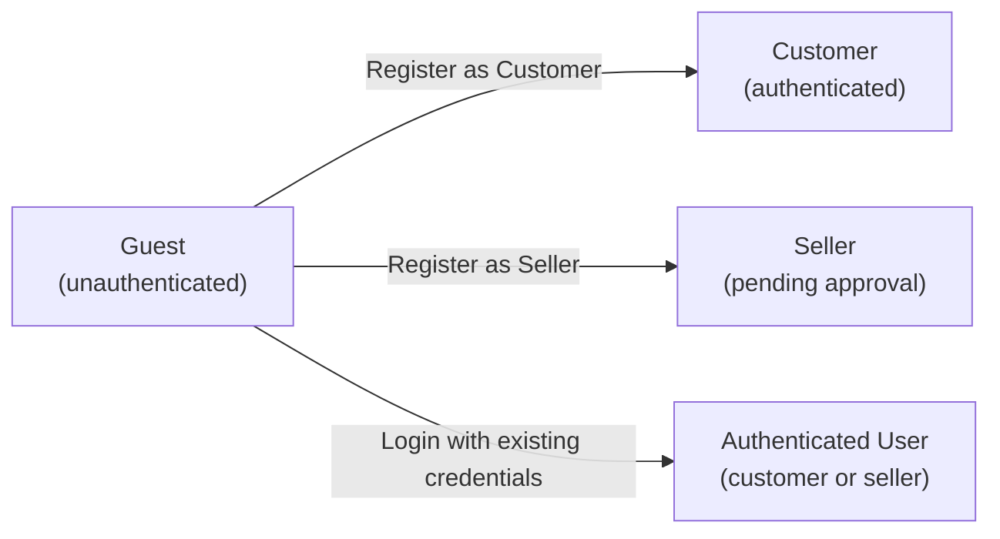
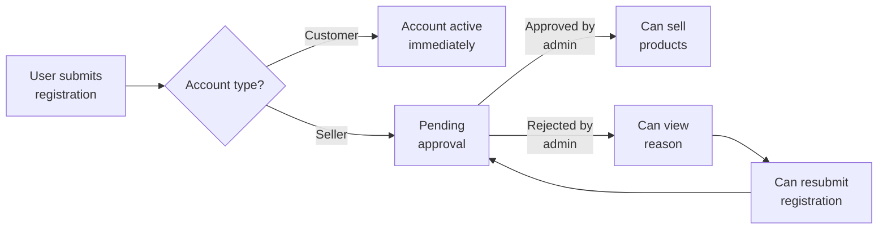
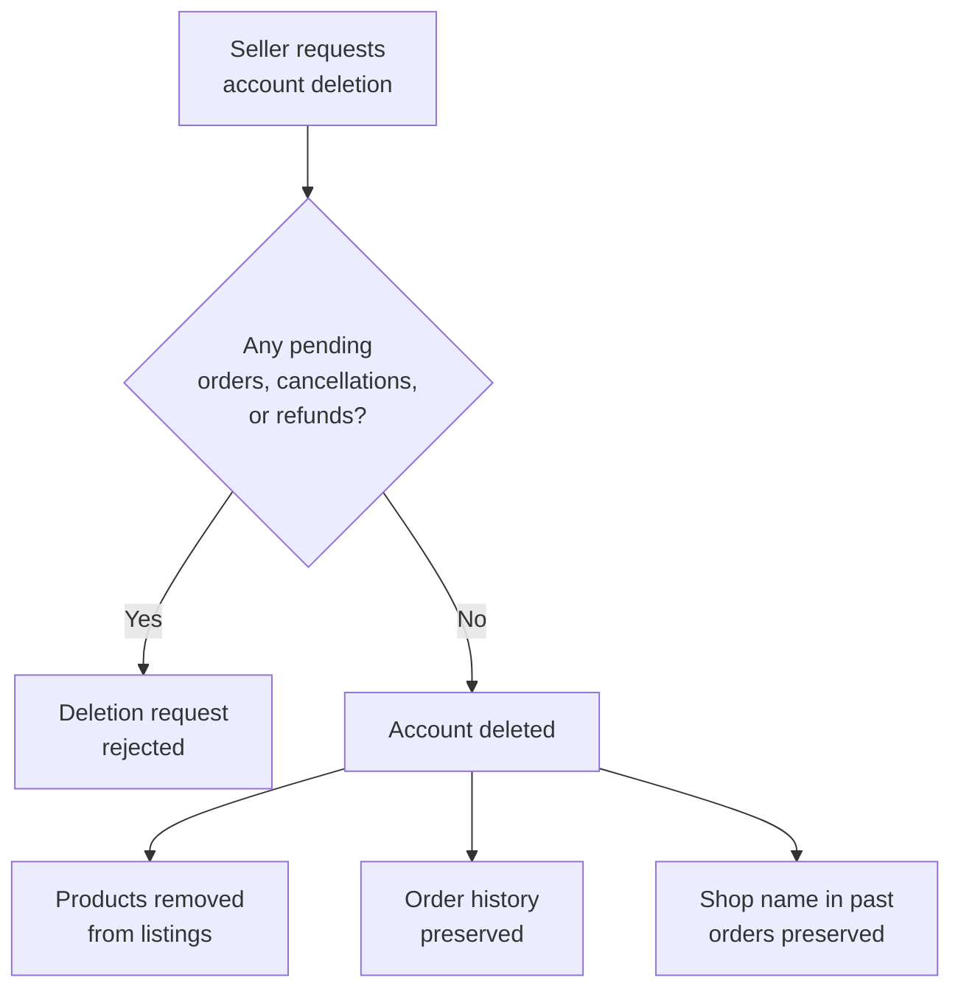

**ecommerceMall — Actor definitions, permission matrix, authentication, session, account lifecycle**

Actor definitions, permission matrix, authentication, session, account lifecycle

# Actor Definitions

Define all user actor types with their identity, permissions, and access boundaries.

## guest Actor

Guests are unauthenticated visitors who have not yet registered or logged into the platform. The platform requires registration to use any features, meaning guests have no ability to browse products or access platform functionality. Guests can only access the registration page to create a new customer or seller account. Guests can access the login page to authenticate with existing credentials. Guests cannot view product listings, search results, or product detail pages. Guests cannot add items to a shopping cart or wishlist. Guests have no profile data, order history, or saved addresses on the platform. All platform features require authentication, effectively blocking guests from any meaningful interaction beyond account creation.

### Guest Identity and Definition

### Definition

A guest is an unauthenticated visitor who has not yet registered for or logged into a platform account. Guests represent individuals who may become customers or sellers but have not completed the registration process.

### Characteristics

Guests possess no persistent identity within the platform. They cannot be associated with orders, reviews, wishlist items, or any other platform data. Guests have no profile information, saved addresses, or order history on the platform.

Guests are temporary visitors whose session exists only until they either register, log in, or leave the platform. No data persists between guest visits.

### Access Permissions and Limitations

### Platform Access Policy

The platform requires registration to use any features. This policy creates an authentication barrier that prevents guests from accessing core platform functionality.

### Permitted Actions

Guests may only access pages related to account creation and authentication. Specifically, guests can:

- Access the registration page to create a new customer account
- Access the registration page to create a new seller account
- Access the login page to authenticate with existing credentials

### Prohibited Actions

Guests have no guest browsing privileges. All platform features beyond account creation and login are inaccessible to unauthenticated visitors. Guests cannot:

- View product listings or catalogs
- View product search results
- View individual product detail pages
- Browse product categories
- Add items to a shopping cart
- Add items to a wishlist
- Access customer or seller dashboards
- View order history or order details
- Write or view product reviews
- Access any authenticated user functionality

### Limited Platform Access Consequence

The registration required policy ensures that guests have extremely limited platform access. The platform effectively blocks all meaningful interaction until authentication is completed. This design choice eliminates anonymous browsing and ensures all platform activity is attributable to registered accounts.

### Authentication Barrier

### Purpose

The authentication barrier ensures that every user interacting with the platform is a registered and identifiable entity. This supports the platform's snapshot principle for dispute resolution and creates accountability for all transactions.

### Registration Requirement

All platform features require authentication. Guests must create an account before accessing any functionality beyond login and registration pages.

### Account Creation Requirement

Guests who wish to use the platform must complete one of the following:

- Create a customer account with email and password registration
- Create a seller account with email and password registration (subject to administrator approval)

No anonymous or temporary account options exist. Account creation is mandatory for platform usage.

### Guest State Transitions

### Transition Triggers

A guest transitions to an authenticated state through one of the following actions:

- Completing customer registration with valid email and password
- Completing seller registration with valid email and password (becomes authenticated but requires approval before selling)
- Logging in with valid existing credentials

### Session Termination

Guest sessions terminate upon browser closure or when the guest navigates away from the platform. No session persistence or "remember me" functionality exists for guests.

## customer Actor

Customers are registered users who purchase products from sellers on the platform. Customers must sign up with an email and password to access any platform features. Customers can search products by name and filter results by category, price range, and stock availability. Customers can view detailed product information including images, descriptions, variants, and reviews. Customers can manage multiple shipping addresses with recipient details and set one as the default. Customers can add products to their wishlist and manage their shopping cart with quantity adjustments. Customers can proceed through checkout, review order summaries, and complete payment for purchases. Customers can view their complete order history, track shipments with carrier information, and confirm delivery. Customers can write reviews for delivered products and request cancellations or refunds for order items. Customers can edit their profile display name and phone number at any time.

### Customer Identity and Registration

A customer is a registered buyer who purchases products from sellers on the platform. The platform requires registration to use any features—guest browsing is not permitted.

Customers must sign up using an email address and password. The email address serves as the unique identifier for the customer's account. Upon registration, the customer gains access to all platform features available to registered buyers.

Customers authenticate using their registered email and password. Once authenticated, the customer can access their account and perform all permitted operations.

Customers can change their account password at any time. The new password replaces the previous one for future authentication attempts.

Customers can delete their account. When a customer deletes their account:
- Their profile information is permanently deleted
- Their orders and order history are preserved for seller records and legal purposes
- Their reviews remain visible but are attributed to "deleted user"

### Product Discovery Permissions

Customers can browse products available on the platform. Customers can search for products by name. The search returns products from all sellers matching the search terms.

Customers can filter search results by the following criteria:
- Category: narrow results to products within a specific category or subcategory
- Price range: set minimum and maximum price boundaries
- Stock availability: show only products with at least one in-stock variant

Customers can sort search results by:
- Newest first: most recently added products appear first
- Price low to high: ascending order by price
- Price high to low: descending order by price

Search results are presented in paginated format. Each result displays the product's main image, name, base price or price range, seller shop name, and average customer rating.

### Product Detail and Wishlist Permissions

Customers can view detailed information for any product. The product detail page displays all product images, name, description, category, seller shop name with a link to the seller's profile, all available variants with prices and stock status, average rating, total review count, and individual customer reviews.

Customers can add products to their personal wishlist. The wishlist stores products (not specific variants) for later consideration. Customers can view their wishlist as a paginated list. Customers can remove products from their wishlist at any time. If a seller deletes a product, it is automatically removed from all customer wishlists.

### Shopping Cart Permissions

Customers can add product variants to their shopping cart. Adding to cart requires selecting a specific variant with its option values (such as color and size), not just the base product. Customers specify the quantity when adding items to cart.

If a customer adds a variant already present in their cart, the quantities are combined rather than creating a separate line item.

Customers can view their complete shopping cart. The cart displays each item with the product name, selected variant options, unit price, quantity, and line subtotal. The cart also shows the total price for all items.

Customers can change the quantity of any item in their cart. Customers can remove items from their cart entirely.

The cart displays warnings when a variant's available stock is less than the quantity in the cart. If a variant is deleted by the seller or becomes out of stock, it is marked as unavailable in the cart.

### Address Management Permissions

Customers can maintain multiple shipping addresses on their account. Each address includes recipient name, phone number, street address, city, state or province, postal code, and country.

Customers can add new shipping addresses at any time. Customers can edit existing address information. Customers can delete addresses they no longer need.

Customers can designate one address as the default shipping address. The default address is automatically preselected during checkout but can be changed for individual orders.

### Order and Checkout Permissions

Customers can proceed to checkout from their shopping cart. Items marked as unavailable cannot be checked out.

During checkout, customers must select a shipping address for the order. The default address is preselected, but customers may choose a different saved address.

Customers can review the complete order summary before finalizing the purchase. The summary displays the list of items with their prices, the selected shipping address, and the total price.

After reviewing, customers confirm the order and proceed to payment. Payment is processed through an external payment gateway. If payment fails, the order is not created and customers can retry. If payment succeeds, the order is created.

Once an order is placed, the shipping address cannot be changed.

### Order History and Tracking Permissions

Customers can view a list of all their orders. The order history is paginated and sorted with newest orders first.

Each order in the list displays the order number, date placed, total price, and overall order status. Customers can view the full details of any order.

Order details include the list of items with product name, variant, quantity, price, and individual item status; the shipping address; and a list of shipments with tracking information showing which items are included in each shipment.

Customers can view tracking information for each shipment including the carrier name and tracking number.

Customers can confirm delivery for shipments. Confirming delivery updates all items in that shipment to delivered status.

### Review and Rating Permissions

Customers can write reviews for products they have purchased. A review can only be submitted after the corresponding order item has been delivered.

Each review consists of a rating from 1 to 5 stars and optional text content. Customers can submit one review per product per order.

Customers can edit their own reviews after submission. Every edit creates a snapshot preserving the previous state.

Customers can delete their own reviews. Deleted reviews are hidden from public view but snapshots are preserved for record-keeping purposes.

### Cancellation and Refund Request Permissions

Customers can request cancellation for individual order items with status "paid" (not yet shipped). Cancellation requests must include a reason.

Customers can request refunds for individual order items with status "delivered". Refund requests must include a reason and can only be submitted within 7 days of the item being delivered.

Cancellation and refund requests are reviewed by the respective seller. The seller can approve or reject each request. When the seller responds, a snapshot of the request state is created.

If a cancellation is approved, the item is cancelled and a refund is processed for that item only. Cancelled items restore their stock quantities.

If a refund is approved, the item is refunded and stock quantities are restored. The remaining items in the order continue processing normally.

### Profile Management Permissions

Customers can edit their profile information at any time. The customer profile includes a display name and phone number.

Customers can modify their display name. Customers can modify their phone number.

Profile changes are applied immediately and affect how the customer is identified in future interactions with sellers and the platform.

## seller Actor

Sellers are registered users who list and sell products to customers on the platform. Sellers must sign up with an email and password and receive administrator approval before they can list products. Sellers can view their registration approval status and resubmit if their initial application is rejected. Sellers maintain a shop profile containing a shop name, description, and logo image that customers can view. Sellers can create products with names, descriptions, categories, and base prices. Sellers manage product variants with unique SKU codes, option values, variant-specific prices, and stock quantities. Sellers can upload multiple product images and reorder them to set a main thumbnail. Sellers can view and manage inventory through history records showing quantity changes and reasons. Sellers can view order items for their products and create shipments with carrier names and tracking numbers. Sellers respond to customer cancellation requests for paid items and refund requests for delivered items. Sellers can access a dashboard showing product counts, order statistics, and pending request summaries.

### Seller Identity

A seller is a registered merchant on the platform who lists and sells products to customers. Sellers are distinct from customers and maintain a separate account type, though a customer account may request promotion to become a seller.

Sellers must sign up with an email address and password. Sellers cannot access any selling features until they receive administrator approval. Sellers maintain a shop profile visible to customers.

Sellers are the owners of the products they create and have exclusive management rights over their product catalog, inventory, and order fulfillment for their own products.

### Seller Registration and Approval

Sellers register using an email address and password. Upon registration, the seller account enters a pending approval state and cannot create products or access seller features until approved.

Sellers can view their current approval status at any time. The approval status can be: pending, approved, or rejected.

If a seller's registration is rejected, they can view the rejection reason provided by the administrator. Rejected sellers may submit a new registration request after addressing the issues identified in the rejection reason.

Sellers cannot list products, create variants, or access the seller dashboard while their account status is pending or rejected. Only approved sellers may perform selling activities.

### Seller Account Deletion Restrictions

Sellers may request deletion of their account only when specific conditions are met. A seller account cannot be deleted if there are any pending order items with paid or shipped status for any of their products. A seller account cannot be deleted if there are any pending cancellation requests or pending refund requests for any of their products.

When a seller deletes their account, all their products are removed from public listings. Order history and order snapshots are preserved for record-keeping purposes. The seller's shop name in past orders remains visible to customers who purchased from that shop.

### Seller Profile Management

Each seller maintains a shop profile containing a shop name, shop description, and logo image. The shop profile is publicly visible to customers browsing the platform.

Sellers can edit their shop name, shop description, and logo image at any time. Every edit to the seller profile creates a snapshot that records the previous state of the profile. Snapshots are immutable and cannot be deleted.

Customers can view seller profiles to learn more about the shops they purchase from. The shop profile information at the time of purchase is preserved in order snapshots for dispute resolution purposes.

### Product Management Permissions

Sellers can create products with a name, description, category assignment, and base price. Products belong to the seller who created them, and only that seller may edit or delete the product.

Sellers can edit their own products including the name, description, category, and base price. Every product edit creates a snapshot preserving the previous state of the product including all fields and associated images.

Sellers can delete their own products only if there are no pending order items with paid or shipped status for any variant of the product. Sellers cannot delete products that have pending cancellation requests or pending refund requests for any variant.

Deleting a product removes all its variants and inventory records from active listings. Deleted products no longer appear in search results or category listings.

Sellers can view snapshots of their own products to see historical states. Snapshots are preserved even after product deletion.

### Variant and Image Management Permissions

Sellers can add multiple variants to their products. Each variant has a unique SKU code, option values (such as color and size), an optional variant-specific price, and a stock quantity.

Sellers can edit variant details including the SKU code, option values, and price. Every variant edit creates a snapshot preserving the previous state.

Sellers can delete variants only if there are no pending order items with paid or shipped status for that specific variant. Sellers cannot delete variants that have pending cancellation requests or pending refund requests.

Sellers can upload multiple images for each product. Sellers can reorder images to designate which image appears first as the main thumbnail. Sellers can delete images from their products. Image changes are included in product snapshots.

A product must have at least one variant to be purchasable. Products with no variants remain visible in search results but are shown as unavailable for purchase.

### Inventory Management Permissions

Sellers manage stock quantities for each variant through inventory history records. Sellers can add inventory by specifying a positive quantity change and a reason for the restock. Sellers can subtract inventory by specifying a negative quantity change and a reason for the adjustment or loss.

Sellers can view the complete inventory history for each variant, showing all quantity changes with reasons and timestamps. Current stock is calculated from the sum of all inventory records.

Order placement automatically creates negative inventory records for purchased variants. Order cancellation and refund automatically create positive inventory records to restore stock.

Sellers cannot modify or delete existing inventory records. Inventory records are permanent for audit purposes.

### Order Fulfillment Permissions

Sellers can view order items for their products that require shipping. Sellers can select one or more of their order items to include in a shipment. Items from different sellers cannot be combined into a single shipment.

When creating a shipment, sellers must provide the carrier name and tracking number. All items in the same shipment share the same tracking information.

Sellers cannot modify or delete shipments after creation. Tracking information is visible to customers for delivery monitoring.

### Request Response Permissions

Sellers can view cancellation requests submitted by customers for order items with paid status. Sellers can approve or reject each cancellation request. When responding to a cancellation request, sellers see the reason provided by the customer.

If a seller approves a cancellation request, the order item is cancelled and the customer receives a refund for that item. If rejected, the order item remains in paid status and continues processing.

Sellers can view refund requests submitted by customers for order items with delivered status. Customers may request refunds within 7 days of delivery. Sellers can approve or reject each refund request.

Every response to a cancellation or refund request creates a snapshot of the request state preserving the decision and any associated information. Snapshots are immutable and support dispute resolution.

### Seller Dashboard Access

Sellers can access a dashboard showing a summary of their shop performance. The dashboard displays the total number of products in their catalog, the total number of order items for their products, the number of pending cancellation requests requiring response, and the number of pending refund requests requiring response.

Sellers can view a complete list of all order items for their products. Sellers can filter order items by status to identify items requiring attention.

The dashboard provides an overview of shop activity but does not include customer personal information beyond what is necessary for order fulfillment.

### Permission Boundaries

Sellers cannot view or manage products belonging to other sellers. Sellers cannot view orders or order items that do not contain their products. Sellers cannot access customer account information beyond shipping addresses for orders containing their products.

Sellers cannot create or modify product categories. Sellers cannot approve their own registration or promotion requests. Sellers cannot view administrator functions or other seller's administrative data.

Suspended sellers cannot create new products or edit existing products. Suspended sellers can still view and process existing orders, respond to cancellation and refund requests, and create shipments for items already paid. Suspended sellers' products are hidden from search and category listings and cannot be purchased by customers.

## admin Actor

Administrators are users with elevated privileges for platform oversight and governance. Administrators exist in two grades: regular administrators and super administrators. Regular administrators can view pending seller registration requests and approve or reject seller applications with rejection reasons. Administrators can suspend seller accounts to hide products from search and category listings while allowing sellers to process existing orders. Administrators can unsuspend sellers to restore their full selling capabilities. Administrators create and manage product categories including subcategories with names and descriptions. Administrators can view all products on the platform regardless of ownership and access complete product snapshot histories. Administrators can delete any product for policy violations. Administrators can view all orders across the platform and perform force-cancellations or force-refunds for individual items or entire orders. Administrators can ban customers and sellers to prevent login access or unban previously restricted accounts.

### Administrator Identity and Grades

Administrators are users with elevated privileges responsible for platform oversight and governance. The system recognizes two grades of administrators: regular administrators and super administrators.

Regular administrators have access to seller management, category management, product oversight, order oversight, and user account management functions. Super administrators possess all regular administrator capabilities plus additional privileges including the ability to review and approve administrator promotion requests, promote regular administrators to super administrator status, and demote other super administrators to regular administrator status.

A user becomes an administrator by submitting a promotion request that is approved by a super administrator. Once approved, the user gains regular administrator grade by default. Administrators cannot demote themselves.

All administrator actions are performed within the context of platform governance to maintain marketplace integrity and enforce platform policies.

### Seller Registration Management

Administrators review and manage pending seller registration requests as part of platform oversight responsibilities.

Administrators can view the complete list of seller applications awaiting review. Each application displays the applicant's submitted information including shop name, shop description, and any provided documentation.

When reviewing a seller application, administrators may either approve or reject the registration. If rejecting, administrators must provide a reason explaining the decision. The rejection reason is visible to the applicant, allowing them to address concerns and submit a new registration request.

Approved sellers gain immediate ability to create products and sell on the platform. Rejected sellers remain in rejected status until they submit a new registration request.

### Seller Account Control

Administrators can suspend seller accounts to enforce platform policies without terminating the account entirely.

When a seller is suspended:
- All products from that seller are hidden from search results and category listings
- Customers cannot purchase any products from the suspended seller
- The seller retains ability to process existing orders including shipping items and responding to cancellation or refund requests
- The seller cannot create new products or edit existing products

Administrators can unsuspend seller accounts at any time. Upon unsuspension, the seller's products become visible in search and category listings again, and the seller regains full selling capabilities including product creation and editing.

Suspension status is separate from approval status. A seller may be approved but suspended, or approved and active.

### Category Management

Administrators are responsible for creating and maintaining the product category structure that organizes all products on the platform.

Administrators can create new categories with a name and description. Categories can optionally have parent categories, allowing for one level of subcategory nesting. A category with a parent category is a subcategory; a category without a parent is a top-level category.

Administrators can edit existing category names and descriptions to reflect changes in the marketplace or correct errors. Category hierarchy cannot be changed after creation—a subcategory cannot be moved to become a top-level category, and a top-level category cannot be assigned a parent.

Administrators can delete categories. When a category is deleted, any products previously assigned to that category become uncategorized. Deleted categories cannot be recovered.

### Product Oversight

Administrators have comprehensive visibility into all products on the platform regardless of ownership for policy enforcement and dispute resolution.

Administrators can view all products created by any seller, including products that are hidden, suspended, or deleted. The product view includes all product details, variants, images, and current status.

Administrators can access the complete snapshot history for any product. Snapshots preserve the state of a product at every point of modification including previous versions of the product name, description, category, base price, and images. Administrators can view variant snapshots showing historical SKU codes, option values, and pricing.

Administrators can delete any product for policy violations or other governance reasons. Product deletion removes the product from search and category listings and prevents further purchases. Deleted products are preserved in the system with their snapshot history intact for record-keeping and dispute resolution purposes.

### Order Oversight

Administrators can view all orders placed on the platform regardless of customer or seller for monitoring and intervention purposes.

The order view includes complete order details: order number, date, customer information, shipping address, all order items with their statuses, shipment tracking information, and any cancellation or refund requests.

Administrators can perform force-cancellation of individual order items or entire orders. Force-cancellation immediately changes the item status to cancelled, processes a refund to the customer, and restores stock quantities through inventory records. Force-cancellation can be performed regardless of the item's current status or seller approval.

Administrators can perform force-refund of individual order items or entire orders. Force-refund immediately changes the item status to refunded and restores stock quantities. This action is available for items in any status and does not require seller approval.

Force actions are intended for exceptional circumstances such as fraud, policy violations, or dispute resolution where normal seller-controlled processes are insufficient or inappropriate.

### User Account Management

Administrators can ban customers and sellers to prevent platform access for policy violations, fraud prevention, or other governance reasons.

When a customer is banned:
- The customer cannot log in to their account
- Existing orders and order history remain intact
- Reviews written by the customer remain visible but are attributed to the deleted user state

Administrators can unban previously banned customers, restoring their full account access immediately.

When a seller is banned:
- The seller cannot log in to their account
- All products are hidden from search and category listings
- Existing orders remain active and the seller can continue processing them through shipping and responding to cancellation or refund requests

Administrators can unban previously banned sellers. Upon unbanning, the seller regains login access and their products become visible again.

Banning is separate from deletion and suspension. Banned accounts remain in the system with their data preserved; banning only prevents authentication and access.

## superAdmin Actor

Super administrators are the highest level administrators with additional user management privileges beyond regular administrators. Super administrators can view the list of pending requests from users seeking to become administrators. Super administrators can approve or reject requests to become an administrator based on the submitted reason. Super administrators can promote regular administrators to super administrator status. Super administrators can demote other super administrators to regular administrator status when necessary. Super administrators cannot demote themselves to prevent situations where no super administrator remains on the platform. Super administrators inherit all regular administrator capabilities including seller management, category management, product oversight, order oversight, and user banning. Super administrators serve as the final authority for administrator grade assignments on the platform.

### Super Administrator Identity and Privilege Level

The super administrator represents the highest privilege level within the platform's administrative hierarchy. Super administrators hold the super administrator grade, which supersedes the regular administrator grade in terms of authority and access scope. All super administrators inherit regular administrator capabilities, including seller management, category management, product oversight, order oversight, and user banning functions. This inheritance ensures that super administrators can perform all platform oversight duties without restriction while maintaining additional elevated privileges exclusive to their grade.

### Administrator Promotion Request Review

Super administrators can view pending admin requests submitted by users seeking to become administrators. Each request includes a reason provided by the requesting user. Super administrators evaluate these requests and exercise user elevation authority to either approve or reject the request. When a super administrator approves an admin request, the requesting user becomes a regular administrator. When rejecting a request, the super administrator may provide feedback to the requester. This approval workflow ensures that administrative access is granted only after appropriate review by the highest authority level.

### Administrator Grade Promotion

Super administrators possess exclusive authority for promoting regular administrators to super administrator status. This promotion capability allows super administrators to elevate other administrators when additional high-level oversight is required. The promotion action permanently changes the target administrator's grade from regular to super, granting them all super administrator privileges including the ability to review pending admin requests and manage other administrators' grades.

### Administrator Grade Demotion

Super administrators can demote other super administrators to regular administrator status when necessary. This demotion capability forms part of the administrator grade management responsibilities. However, self demotion prevention is enforced: super administrators cannot demote themselves. This restriction ensures that at least one super administrator remains active on the platform at all times, preventing scenarios where no user retains the highest privilege level needed for critical administrative decisions.

# Authentication Flows

Registration, login, logout, and session management from a user perspective.

## Registration and Login

Define user registration and login flows including validation and error handling.

### Actor Definitions

The platform recognizes five distinct actor types that interact with the system.

**Guest**
An unauthenticated visitor who has not registered or logged in. Guests cannot browse products or use any platform features. The only actions available to guests are viewing the login page and registering for an account.

**Customer**
A registered buyer who has created an account with an email address and password. Customers can browse products, make purchases, manage their profile, and access order history. Customers are authenticated via email and password login.

**Seller**
A registered merchant who has created an account with an email address and password. Sellers can create and manage products, process orders, and manage their shop profile. Sellers require administrator approval before they can begin selling. Sellers are authenticated via email and password login.

**Administrator**
A platform oversight role with elevated privileges for managing sellers, categories, and platform content. There are two grades of administrators: regular administrator and super administrator. Administrators may be promoted from existing customer or seller accounts.

**Super Administrator**
The highest privilege level responsible for managing other administrators, reviewing administrator promotion requests, and overseeing platform governance. Super administrators can promote or demote other administrators.

### Guest Access Limitations

Guests have extremely limited access to the platform. The platform requires registration to use any features—there is no guest browsing capability.

Guests may only:
- View the login page
- Access the registration pages for customer and seller accounts

Guests cannot:
- Browse or search products
- View product details
- View categories
- Add items to cart
- View seller profiles
- Access any authenticated features

Any attempt by a guest to access protected features is redirected to the login page.

### Customer Registration

Customers register for accounts to access the platform's shopping features.

**Registration Requirements**
Customers sign up by providing an email address and password. The email address serves as the unique identifier for the account. The email address must not already be associated with an existing customer or seller account.

**Registration Process**
The customer submits their email address and password through the registration form. Upon successful validation, the account is created immediately and the customer can log in. No additional approval is required for customer accounts.

**Profile Creation**
Upon registration, a customer profile is automatically created. The profile initially contains empty fields for display name and phone number, which the customer can edit after logging in.

### Seller Registration

Sellers register for accounts to sell products on the platform. Seller registration includes an approval process.

**Registration Requirements**
Sellers sign up by providing an email address and password. The email address serves as the unique identifier for the account. The email address must not already be associated with an existing customer or seller account.

**Initial Registration**
The seller submits their email address and password through the seller registration form. Upon successful validation, the seller account is created with a pending approval status. The seller cannot list products or conduct sales until approved.

**Approval Workflow**
After account creation, the seller must complete their profile with a shop name, shop description, and logo image. The registration request is then reviewed by an administrator. The administrator may approve or reject the registration.

**Viewing Approval Status**
Sellers can view their current approval status at any time. The status may be: pending (awaiting review), approved (authorized to sell), or rejected (registration denied).

**Rejection and Resubmission**
If a registration is rejected, the seller can view the rejection reason provided by the administrator. Rejected sellers may submit a new registration request after addressing the rejection reasons.

### Login Process

All registered users authenticate via email and password login.

**Customer Login**
Customers log in using the email address and password provided during registration. Upon successful authentication, the customer gains access to browse products, manage their cart and wishlist, place orders, and manage their account.

**Seller Login**
Sellers log in using the email address and password provided during registration. Upon successful authentication, the seller gains access to their seller dashboard. However, selling privileges are only available if the seller account has been approved by an administrator.

**Administrator Login**
Administrators and super administrators log in using the same email and password credentials as their underlying customer or seller account. The system recognizes their administrator status upon login and grants appropriate elevated privileges.

**Authentication Failure**
If the provided email address does not exist or the password does not match, the login attempt is rejected. The system does not reveal which specific credential was incorrect to prevent account enumeration attacks.

### Actor Permission Summary

The following matrix summarizes high-level permissions by actor type:

**Guest**
- View login page
- Register for customer or seller accounts

**Customer**
- Browse and search products
- View product details and reviews
- Manage wishlist and shopping cart
- Place orders and manage addresses
- Write product reviews for delivered items
- Edit personal profile
- Change password and delete account

**Seller (Approved)**
- Create and manage products and variants
- Manage inventory and process shipments
- View and respond to cancellation and refund requests
- View shop dashboard and sales reports
- Edit shop profile
- Change password and delete account (subject to pending order restrictions)

**Seller (Pending or Rejected)**
- Edit shop profile
- View approval status and rejection reasons
- Resubmit registration after rejection

**Administrator**
- Approve or reject pending seller registrations
- Suspend or unsuspend seller accounts
- Create, edit, and delete product categories
- View all products and orders
- Force-cancel or force-refund orders
- Ban or unban customers and sellers

**Super Administrator**
- All administrator permissions
- View and process administrator promotion requests
- Promote regular administrators to super administrator
- Demote super administrators to regular administrator (cannot demote themselves)

## Session and Logout

Define session behavior and logout from a user perspective.

### Session Establishment and Persistence

When a user successfully authenticates with valid credentials, the system establishes a session that maintains their authenticated state. The session binds the user to their actor type (customer, seller, administrator, or super administrator) and persists across navigation and actions. While a session is active, the user can access features permitted for their actor type without providing credentials for each request.

Sessions enable the platform's requirement that registration is mandatory for all features. The system verifies the presence of a valid session before granting access to any functionality. Users without an active session are considered guests and can only access the login and registration pages.

The session maintains the user's identity and actor classification throughout their interaction with the platform until the session is terminated through logout or other termination conditions.

### Logout

Users can terminate their active session through the logout action. When a user logs out, the system invalidates the current session and revokes access to all protected features. After logout, the user is treated as a guest and must log in again to access any platform features.

Logout can be initiated by the user at any time while a session is active. Upon successful logout, the system clears the authenticated state and requires re-authentication for subsequent access attempts.

### Session Security

Sessions are tied to individual user accounts and enforce the boundary between authenticated users and guests. The system validates the session on each request to ensure the user is properly authenticated and authorized for the requested action.

If a session becomes invalid or is terminated (such as when a user is banned by an administrator or deletes their account), the system revokes access immediately. Users whose sessions are terminated mid-use are redirected to the login page when they attempt subsequent actions.

The session mechanism prevents unauthorized access to customer accounts, seller shops, and administrative functions by requiring valid authentication credentials to establish a session.

# Account Lifecycle

Account creation, deletion, and password management.

## Account Management

Define how users create accounts, delete accounts, and change passwords.

### Account Creation

### Registration Process

Users must register before accessing any platform features. Guest browsing is not permitted.

**Customer Registration**

Customers register by providing an email address and creating a password. The email address serves as the unique identifier for the customer account. Upon successful registration, a customer profile is created and the customer can immediately begin using platform features.

**Seller Registration**

Sellers register by providing an email address and creating a password. The email address serves as the unique identifier for the seller account. After registration, the seller account enters a pending approval state.

Sellers must wait for administrator approval before they can create products or conduct any selling activities. Sellers can view their current approval status, which may be pending, approved, or rejected.

If a seller registration is rejected, the seller can view the rejection reason provided by the administrator. Rejected sellers may submit a new registration request for reconsideration.

**Administrator Promotion**

Any registered user, whether customer or seller, may submit a request to become an administrator. The request must include a reason explaining why they want administrative access.

Only super administrators can review pending administrator promotion requests. Super administrators can approve or reject these requests. When approved, the user becomes a regular administrator.

### Account Deletion

### Customer Account Deletion

Customers may delete their account at any time. When a customer deletes their account, the following occurs:

- The customer's profile information is permanently removed
- The customer's shipping addresses are deleted
- The customer's authentication credentials are deleted
- The customer's orders and order history are preserved for seller records and legal purposes
- The customer's reviews remain visible but are attributed to "deleted user" instead of the customer's name
- The customer can no longer log into the platform

### Seller Account Deletion

Sellers may request account deletion subject to business constraints. A seller cannot delete their account if any of the following conditions exist:

- There are pending order items with paid or shipped status for any of the seller's products
- There are pending cancellation requests for any of the seller's products
- There are pending refund requests for any of the seller's products

When a seller deletes their account, the following occurs:

- All of the seller's products are removed from public listings and search results
- All product variants and inventory records associated with the seller's products are deleted
- The seller's shop profile is deleted
- The seller's authentication credentials are deleted
- Order history is preserved, including order item snapshots
- The seller's shop name in past orders is preserved to maintain historical records
- The seller can no longer log into the platform

### Password Change

### Password Modification

Both customers and sellers can change their account password at any time while logged in. The password change process requires the user to provide their current password for verification before setting a new password.

The system verifies that the provided current password matches the stored credentials. If the current password is incorrect, the password change request is rejected and the user must retry with the correct current password.

Upon successful password change, the new password immediately becomes the active credential for the account. The user must use the new password for all subsequent login attempts.

There is no restriction on how frequently users can change their password. Users may change their password as often as desired for security purposes.