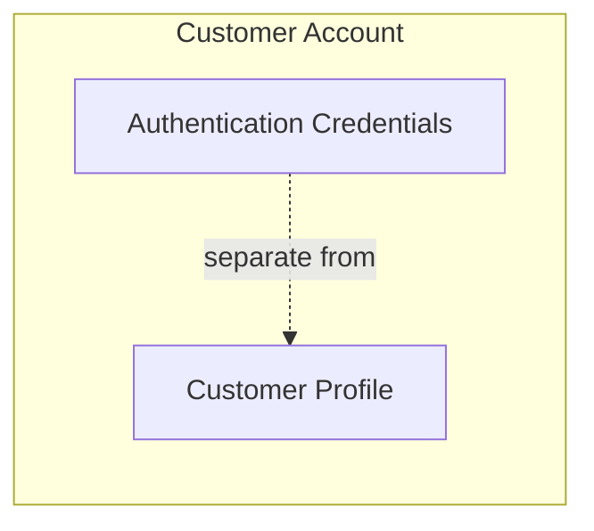
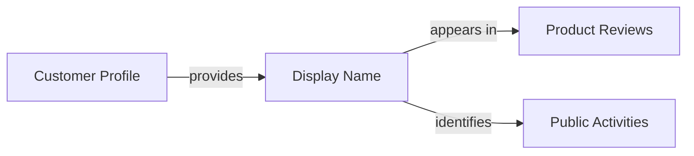
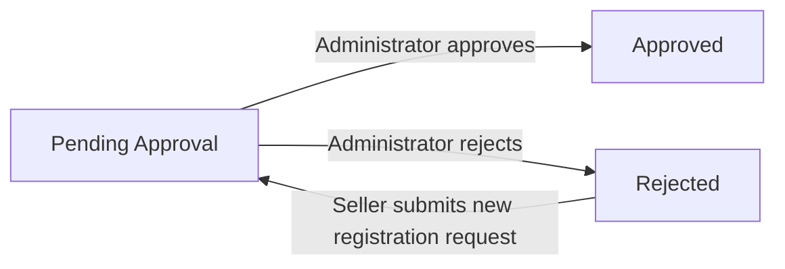
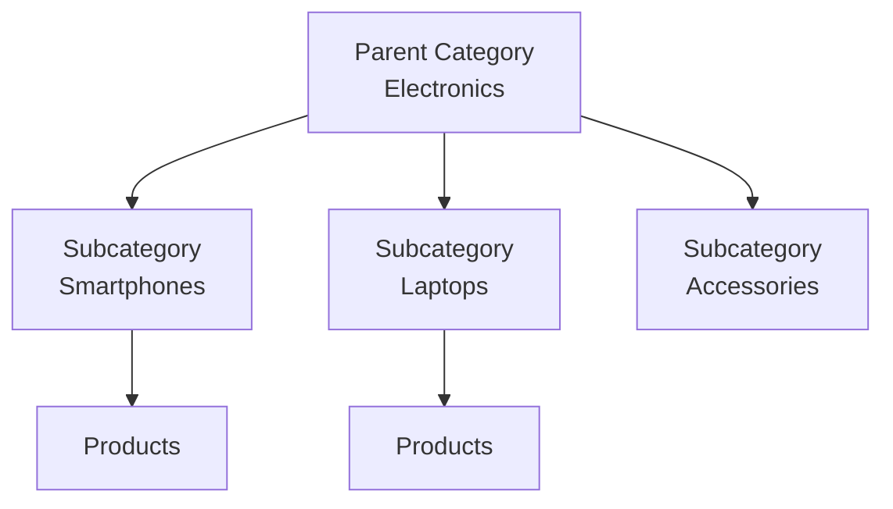
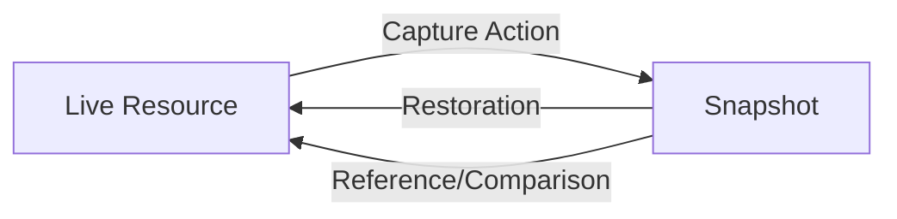
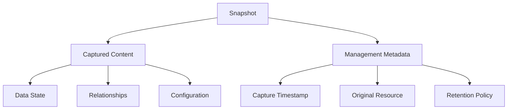
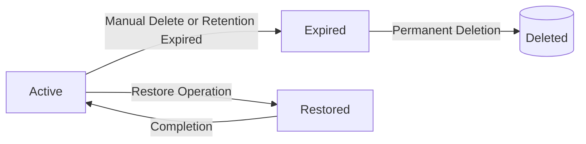
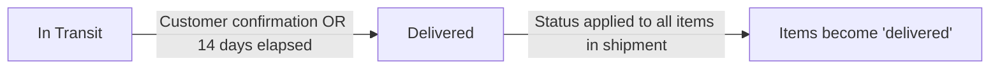
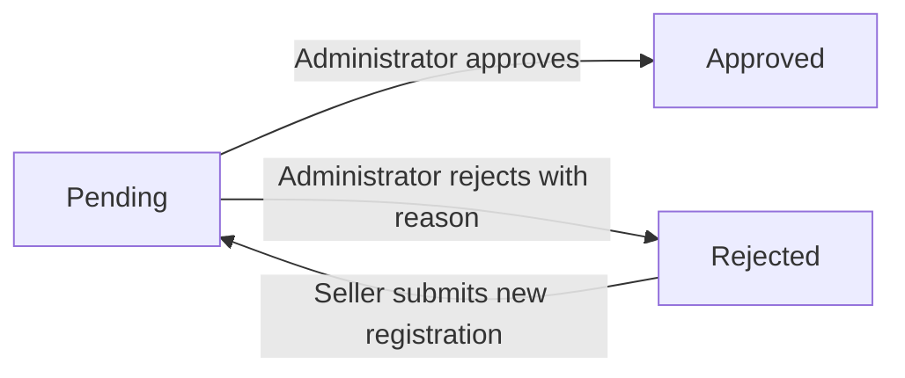
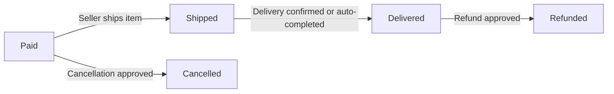

**ecommerceMall — Business concepts, relationships, and states from user perspective**

Business concepts, relationships, and states from user perspective

# Domain Concepts

Describe what each concept means in the business domain and its key attributes.

## Customer Concept

A Customer represents a registered buyer on the e-commerce platform who can browse products, make purchases, and interact with sellers. Each customer must create an account using an email address and password to access any platform features, as guest browsing is not permitted. The customer entity tracks the account status which determines whether the user can log in and perform actions on the platform. Customers maintain their credentials for authentication purposes and can update their password as needed. When a customer decides to leave the platform, they can delete their account, which removes their personal profile information while preserving their order history and reviews for legal and record-keeping purposes. Deleted customer reviews remain visible to other users but are attributed to a generic "deleted user" designation.

### Customer Definition

A Customer represents a registered buyer on the e-commerce platform who serves as a primary business actor in purchase transactions. The platform requires all users to complete registration before accessing any features, as guest browsing is not permitted.

A customer must create an account using an email address that uniquely identifies them within the system. Once registered, the customer receives purchase authorization to browse products, add items to their shopping cart, place orders, write reviews, and interact with sellers.

The customer entity maintains the core identity of a buyer within the business domain, establishing the foundation for all purchasing activities and platform interactions. Customers can have multiple addresses for shipping, maintain a wishlist of desired products, hold items in their shopping cart, place orders, write product reviews, and submit requests to become administrators.

Each customer maintains ownership of their personal data and transactional history throughout their relationship with the platform.

### Authentication Credentials

Customers authenticate themselves using email-based credentials. The email address serves as the unique identifier for the customer's account and must be provided during both registration and login.

Customers establish a password during registration that is used to verify their identity when logging in. The password credential protects access to the customer's account and must be provided alongside the email address during authentication.

Customers can change their password at any time after registration. This capability allows customers to maintain account security by updating their credentials periodically or when they suspect unauthorized access.

The combination of email address and password credentials forms the complete authentication mechanism that controls login access to the platform. Without valid credentials, a user cannot access any customer-facing features.

### Account Status

Each customer account maintains an account status that determines whether the user can log in and perform actions on the platform. The account status controls the customer's ability to access their account and use platform features.

When a customer account is in an active state, the customer has full login access and can perform all authorized actions including browsing products, placing orders, and managing their profile.

Administrators can change a customer's account status to a banned state. Banned customers cannot log in to the platform and cannot access any customer features. The account remains in the system but is inaccessible to the customer.

Administrators can restore login access by changing the account status back to active, allowing the customer to resume normal platform usage. The account status serves as the primary mechanism for enforcing access control over customer accounts.

### Account Deletion

Customers have the ability to delete their account when they choose to leave the platform. Account deletion initiates a permanent removal process that affects the customer's data while preserving certain records for legal and business purposes.

When a customer deletes their account, profile removal occurs for all personal identification information. The customer's display name, phone number (defined in Customer Profile Concept), and authentication credentials are permanently removed from active systems.

Order history preservation is maintained for all orders placed by the customer. Orders and their associated order items remain in the system to support seller records, financial tracking, and legal compliance requirements. The order history continues to reference that a purchase occurred, but the association to the deleted customer's personal identity is removed.

Deleted user attribution is applied to any reviews the customer has written. These reviews remain visible on product pages to preserve the integrity of product ratings and feedback for other customers. However, the reviews are attributed to a generic "deleted user" designation rather than the customer's name, indicating that the original author is no longer an active platform user.

The account deletion process is irreversible. Once completed, the customer cannot recover their account or personal data, though they may register a new account using the same email address if desired.

## CustomerProfile Concept

A CustomerProfile represents the publicly visible and editable personal information associated with a customer account beyond authentication credentials. The profile contains a display name that represents the customer in reviews and public-facing areas of the platform. A phone number is included in the profile for communication purposes related to orders and delivery coordination. Customers have the ability to modify their display name and phone number at any time to keep their information current. The profile information is separate from the authentication credentials, allowing customers to update personal details without affecting their login credentials. This separation ensures that customers can maintain accurate contact information while preserving the security of their authentication data.

### Customer Profile Definition

A Customer Profile represents the collection of personal information associated with a customer account that exists beyond the authentication credentials. The profile serves two primary purposes: establishing the customer's public identity within the platform community and maintaining accurate contact information for order-related communications. Each customer account is associated with exactly one profile. The profile information is separate and distinct from the authentication credentials (email and password), allowing customers to update their personal details without affecting their ability to log into the platform. When a customer account is created, a profile is automatically established with default values that the customer can subsequently customize. The profile remains active for the lifetime of the customer account and is removed when the account is deleted.

### Public Identity and Representation

The display name is the primary attribute through which a customer is identified publicly on the platform. This name appears in association with customer activities such as product reviews and public-facing interactions. The display name represents the customer's chosen public identity and may differ from their authentication email address, providing customers with flexibility in how they present themselves to other platform users. When a customer posts a review, the display name from their profile is shown as the reviewer identifier. If a customer deletes their account, their reviews remain visible on the platform but are displayed with an indicator showing they were written by a deleted user rather than showing the original display name.

The display name is an editable attribute, allowing customers to change their public representation at any time without affecting their account history or authentication. Changes to the display name apply immediately to new activities but do not retroactively alter the attribution of existing reviews.

### Contact Information

The phone number stored in the customer profile serves as the primary contact method for order-related communications and delivery coordination. This contact information is used by sellers and delivery services to reach customers regarding shipping arrangements, delivery confirmations, or order issues. The phone number is considered essential communication details for completing the purchase workflow successfully.

The phone number is an editable attribute that customers can update as needed. Changes to the phone number apply to future orders and do not affect the contact information associated with orders that have already been placed. For placed orders, the contact information is preserved as part of the order details and remains unchanged even if the customer subsequently updates their profile phone number. This preservation ensures that historical orders maintain accurate records of how the seller could contact the customer at the time of purchase.

The phone number is distinct from the recipient phone number that can be specified per shipping address. While the profile phone number serves as the default contact method, customers may provide alternative phone numbers for specific shipping addresses when the recipient differs from the account holder.

### Editable Attributes and Personal Details

The customer profile contains editable attributes that customers can modify at any time to maintain current and accurate personal details. The editable attributes include the display name and the phone number. These personal details are fully under customer control and can be updated without requiring administrator approval or going through a verification process.

Profile editing allows customers to keep their information current as circumstances change. Customers may update their display name to reflect a preference change, name change, or branding decision. Customers may update their phone number when they change phone service providers, get a new device, or need to use a different contact number for platform activities.

When profile editing occurs, the updated values replace the previous values in the active profile. The previous values are not preserved as snapshots because profile information is considered personal preference data rather than transaction-critical information. However, snapshots of the profile information are captured at the time of order placement and are stored with the order items to preserve the historical state for reference purposes.

The editable attributes in the customer profile are limited to information that does not affect authentication or account ownership. Email address and password, which are used for authentication, are managed separately from the profile and have their own modification workflows with appropriate security verification.

## Seller Concept

A Seller represents a merchant or business entity that offers products for sale on the e-commerce platform. Sellers register using an email address and password for authentication purposes. Each seller has an account status that indicates whether they can actively sell on the platform, pending administrative approval. The seller entity tracks whether the account is approved, pending review, or suspended based on administrator decisions. Sellers can change their passwords for security purposes and delete their accounts under specific conditions related to pending transactions. Account deletion is restricted when the seller has pending orders, cancellation requests, or refund requests that require resolution.

### Seller Entity Definition

A Seller represents a merchant or business entity that offers products for sale on the e-commerce platform. The Seller is the product vendor responsible for listing merchandise, managing inventory, processing orders, and handling customer service related to their products. As a commercial account, the Seller entity distinguishes business operators from regular customers who only purchase items. Each seller maintains a distinct identity separate from customer accounts, though an individual may hold both account types using the same email credentials. The seller entity serves as the ownership anchor for all products, inventory records, orders, and shipments associated with that business.

### Seller Authentication

Sellers authenticate using email address and password credentials. During registration, sellers provide a unique email address that serves as their account identifier and a password for secure access. The authentication system verifies the provided email and password combination when sellers attempt to access their accounts. Sellers may change their password at any time after account creation to maintain security. The platform requires successful authentication before granting access to seller-specific features such as product management, order processing, and shop configuration.

### Account Approval Status

Every seller account maintains an approval status that controls selling privileges on the platform. The approval status exists in one of three states: pending, approved, or rejected. Newly registered seller accounts begin in the pending state and cannot list products or receive orders until transitioning to approved status. The approved state grants full selling privileges including product creation, inventory management, and order fulfillment. The rejected state indicates that the registration request was denied by platform administrators, preventing selling privileges but allowing the applicant to view the rejection reason and submit a new registration request.

### Administrator Approval

Seller accounts require explicit approval from platform administrators before granting selling privileges. Upon registration submission, the request enters a review queue accessible to administrators. Administrators evaluate the registration based on platform policies and business verification requirements. Approved registrations transition the seller account to active status immediately. Rejected registrations require administrators to provide a specific rejection reason that the applicant can view. Rejected applicants may address the cited issues and submit a new registration request for reconsideration. This approval workflow ensures only legitimate businesses operate on the platform.

### Account Suspension

Platform administrators possess the authority to suspend seller accounts as a disciplinary or protective measure. When suspended, a seller account enters a restricted state where the seller cannot create new products or modify existing product listings. Suspended sellers retain the ability to process existing orders including shipping items and responding to cancellation or refund requests to ensure customer service continuity. Products from suspended sellers become hidden from search results and category browsing, and customers cannot purchase these products. Administrators may reverse suspension to restore full selling privileges when the underlying issues are resolved.

### Seller Deletion Constraints

Seller accounts may be deleted only when specific business conditions are satisfied to protect transactional integrity. Account deletion is permanently blocked when the seller has pending order items awaiting shipment or delivery, as these represent financial obligations to customers. Additionally, deletion is prohibited when pending cancellation requests or refund requests exist for any of the seller's products, as these disputes require seller participation for resolution. The platform performs verification checks against these constraints before permitting deletion requests. Once deleted, the seller's products are removed from active listings, though order history, snapshots, and the shop name in past orders remain preserved for record-keeping and legal purposes.

### Pending Transaction Checks

The platform enforces pending transaction checks before allowing seller account deletion to prevent abandonment of active business obligations. The verification process examines all order items associated with the seller's products for statuses indicating incomplete fulfillment, specifically paid or shipped states that require seller action. The system also inspects for open cancellation requests awaiting seller response and pending refund requests requiring seller decision. Only when zero pending transactions exist across all these categories may the deletion proceed. These checks ensure customers receive ordered items and dispute resolution remains available throughout the order lifecycle.

## SellerProfile Concept

A SellerProfile represents the public-facing shop identity and branding information for a seller on the platform. The profile includes a shop name that identifies the business to customers browsing and purchasing products. A shop description provides additional context about the seller's business, products, or values to help customers make informed purchasing decisions. The profile may include a logo image that visually represents the seller's brand identity in product listings and shop pages. Every modification to the shop name, description, or logo creates a snapshot to preserve the historical state for dispute resolution and record-keeping purposes. The seller profile information is visible to customers who view products or access the seller's dedicated shop page.

### Shop Identity

Every seller profile is identified by a shop name that serves as the public-facing business identifier across the platform. The shop name appears on product listings, search results, and order confirmations to help customers recognize the seller. Each shop name must be unique within the platform to prevent confusion between different sellers. The shop name is the primary means by which customers identify and remember a particular seller's business.

### Profile Content and Brand Representation

A seller profile includes a shop description that provides context about the seller's business, products, or values to help customers make informed purchasing decisions. The shop description may contain information about the seller's specialty, business history, or unique selling propositions. Sellers may include a logo image as part of their profile to establish visual branding and create brand recognition among customers. The logo image serves as the visual identity of the shop and appears alongside the shop name in product listings and dedicated shop pages. Together, the shop name, description, and logo image form the complete brand identity that represents the seller's business to customers browsing the platform.

### Public Visibility and Customer Access

Seller profile information is publicly visible to all customers who view products or access the seller's dedicated shop page. When customers browse product listings, they can see the seller's shop name and logo image associated with each product. Customers can navigate to a seller's public shop profile page to view the complete profile information including the shop name, description, and logo. The public shop profile serves as the business representation for the seller, allowing customers to learn more about who they are purchasing from before making a buying decision.

### Editable Attributes and Change Tracking

Sellers can modify their shop name, shop description, and logo image as their business evolves. All three attributes are considered editable shop attributes that sellers may update through their account settings. Whenever any editable attribute is modified, the system automatically creates a snapshot to preserve the previous state of the profile. Snapshots capture the complete profile state including the shop name, description, and logo image values before the change was made. Snapshots record when the change was made and what values were modified. Snapshots are immutable and cannot be deleted, ensuring a permanent historical record is maintained for dispute resolution and auditing purposes. Both the seller and administrators can view these snapshots to understand how the profile has changed over time.

### Order-Context Preservation

When a customer places an order, a snapshot of the seller's profile is captured and stored with each order item at the time of purchase. This snapshot preserves the shop name and logo image exactly as they appeared when the transaction occurred. The preserved profile information allows customers to identify which seller they purchased from even if the seller later changes their shop name or logo. Order history displays the snapshot version of the seller profile rather than current values to maintain historical accuracy of past transactions.

## SellerRegistration Concept

A SellerRegistration represents the formal application submitted by a user requesting permission to sell products on the platform. The registration tracks the current status of the application, indicating whether it is pending administrator review, approved, or rejected. If an application is rejected, the system records a rejection reason to inform the applicant why they were not approved. The registration captures the timestamp when the application was initially submitted for processing. Rejected sellers have the opportunity to submit a new registration request after addressing the issues identified in the rejection reason. The registration entity serves as the gateway control mechanism ensuring only approved and vetted sellers can list products for sale.

### SellerRegistration Definition and Purpose

A SellerRegistration represents the formal application submitted by a prospective seller requesting permission to sell products on the platform. This entity serves as the gateway control mechanism ensuring only approved and vetted sellers can list products for sale. The registration captures all information necessary for administrators to evaluate whether an applicant meets the platform's standards for becoming a seller. Each SellerRegistration belongs to exactly one seller account and tracks the complete history of that seller's application attempts.

### Registration Status and Approval Workflow

Each SellerRegistration tracks its current position within the approval process through a registration status. The registration begins in a pending approval state upon submission and can transition to approved or rejected based on administrator review. The status indicates whether the application is awaiting administrator review, has been accepted, or was declined.

When a registration is pending, it awaits administrator review as part of the seller vetting process. Administrators examine the application to determine if the applicant meets platform requirements for selling. This review process ensures only qualified vendors gain selling privileges.

Upon approval, the associated seller account gains the ability to create and list products. Upon rejection, the registration preserves the decision for future reference.

### Rejection Reason and Reapplication

When a SellerRegistration is rejected, the system records a rejection reason that explains why the application did not meet platform standards. This reason provides actionable feedback to the applicant regarding deficiencies in their shop profile, documentation, or other qualification criteria.

A seller whose registration was rejected may submit a new registration request after addressing the identified issues. This reapplication process allows prospective sellers to correct deficiencies and seek approval again. Each new registration request creates a distinct SellerRegistration record, maintaining the immutable history of previous applications while evaluating the new submission independently.

### Submission Timestamp and Application Timing

Each SellerRegistration captures the exact submission timestamp when the seller application was initially submitted. This timestamp records when the seller entered the approval queue and serves as the reference point for tracking how long an application has been pending administrator review.

The seller application process formally begins when a user submits their registration request. This action creates the SellerRegistration entity with an initial pending status and the current timestamp, initiating the approval workflow. The submission timestamp is immutable and preserved even if the registration is later rejected or if the seller submits subsequent applications.

## Administrator Concept

An Administrator represents a privileged user responsible for overseeing platform operations, managing seller approvals, and maintaining marketplace integrity. Administrators are assigned a grade that determines their level of authority, either as a regular administrator or a super administrator. Super administrators possess elevated privileges including the ability to promote other administrators, manage administrator grades, and oversee the promotion request process. Regular administrators have access to operational functions such as seller management, category administration, product oversight, order intervention, and user management. The administrator grade system creates a hierarchy that enables both operational management and governance oversight of the administrative team itself.

### Administrator Overview

An Administrator represents a trusted platform overseer responsible for maintaining marketplace integrity and ensuring smooth platform operations. Administrators are existing customers or sellers who have been granted additional privileges through a formal promotion process.

Administrators serve as the primary governance layer of the platform, with responsibilities spanning seller verification, content moderation, dispute resolution, and operational oversight. Their role is essential for maintaining trust in a marketplace where financial transactions occur between independent buyers and sellers.

Key aspects of the Administrator concept:
- Administrators begin as regular platform users (customers or sellers) before gaining elevated privileges
- The administrator role is additive — users retain their original customer or seller identity while gaining administrative capabilities
- All administrative actions are subject to audit through the snapshot system
- Administrators cannot modify their own grade or promotion status

## AdminPromotionRequest Concept

An AdminPromotionRequest represents a formal petition submitted by an existing user seeking to gain administrative privileges on the platform. The request includes a reason that explains why the user believes they should be granted administrative access. The request tracks its current status indicating whether it is pending review, approved, or rejected by a super administrator. A timestamp records when the request was reviewed and processed by the approving or rejecting super administrator. These requests enable the platform to expand its administrative team while maintaining control over who can access privileged functions. Only super administrators can review and make decisions on these promotion requests.

### AdminPromotionRequest Definition

An AdminPromotionRequest represents a formal petition submitted by an existing platform user seeking to gain administrative privileges. This entity captures the privilege elevation request process, allowing qualified users to express interest in becoming an administrator candidate. The request serves as the gateway for admin team expansion, ensuring that only vetted individuals gain access to privileged platform functions. Each access request contains the petitioner's justification and tracks the review outcome.

### Request Attributes

Each promotion request includes a reason provided by the requesting user that explains why they believe they should be granted administrative access. The reason should describe relevant experience, qualifications, or motivation for seeking elevated privileges. The request is linked to the user who submitted it, establishing the petitioner's identity.

### Request Status Lifecycle

Every AdminPromotionRequest maintains a status that indicates its current position in the review process. The status begins as pending review status when first submitted. The request remains in this state until a super administrator evaluates the petition. Upon decision, the status transitions to either approved or rejected. A timestamp records when the request was reviewed and processed.

### Review Authority

Only super administrators possess the authority to evaluate promotion requests. When a super administrator reviews a request, they examine the provided reason and make a determination. Super administrator approval is required for any privilege elevation to occur. The review process ensures that administrative powers are granted only to appropriate candidates who meet platform standards.

### Platform Governance Role

AdminPromotionRequests serve as a controlled mechanism for platform growth and governance. The promotion workflow enables organic expansion of the administrative team without compromising security. By requiring formal petitions and super administrator review, the platform maintains oversight of who can perform privileged operations while allowing for responsible admin team expansion.

## Category Concept

A Category represents a classification system that organizes products into logical groupings for customer browsing and discovery. Each category has a name that identifies the group and a description that explains what types of products belong within that classification. Categories can be organized hierarchically with one level of nesting, allowing parent categories to contain subcategories for more granular organization. The parent-child relationship between categories enables customers to navigate from broad product classes to more specific subsets. Categories are created and managed exclusively by administrators to maintain consistency across the platform. Products must be assigned to a category or subcategory when created by sellers.

### Category Definition

A Category represents a classification system that organizes products into logical groupings for customer browsing and discovery. Each category has a name that uniquely identifies the group within the platform's classification system. The name serves as the primary identifier customers see when browsing the catalog.

Each category also has a description that explains what types of products belong within that classification. The description helps customers understand the scope and purpose of the category, guiding their browsing decisions and setting expectations for what products they will find within that grouping.

Categories function as the primary mechanism for product organization on the platform, enabling customers to discover products through structured navigation rather than relying solely on search functionality.

### Hierarchical Organization

Categories support a hierarchical structure with one level of nesting. This means a category can exist as either a parent category or a subcategory, but subcategories cannot have further child categories.

A parent category represents a broad classification of products. Parent categories can contain multiple subcategories that represent more specific subsets of the parent classification.

A subcategory belongs to exactly one parent category. The relationship creates a two-tier hierarchy: parent categories at the top level and subcategories nested beneath them.

Products can be assigned to either a parent category directly or to a subcategory. When assigned to a subcategory, the product is implicitly part of that subcategory's parent category hierarchy.

This one-level nesting limit ensures the classification system remains simple and navigable for customers while still providing sufficient granularity for product organization.

### Product Classification and Grouping

Categories serve as the mechanism for grouping related products together. All products on the platform must be assigned to a category when created by sellers. This assignment determines where the product appears in the platform's browsing structure.

The classification system enables customers to discover products by navigating through categories of interest. When customers browse a category, they see all products directly assigned to that category as well as products assigned to any of its subcategories.

Product grouping through categories creates logical collections that help customers compare similar items and explore alternatives within the same classification. This organizational approach supports both targeted shopping when customers know what category they need and exploratory browsing when customers are discovering available products.

When a category is deleted, products previously assigned to that category become uncategorized. Uncategorized products remain visible in search results but do not appear in category browsing until reassigned to another category.

### Administrator Management

Categories are created and managed exclusively by administrators. Sellers cannot create, modify, or delete categories. This centralized management ensures consistency in the platform's classification system and prevents fragmentation or duplication of categories.

Administrators are responsible for defining the category structure, including creating parent categories, establishing appropriate subcategories, and writing clear descriptions that help both sellers and customers understand each category's purpose.

Only administrators can edit category names and descriptions. Only administrators can delete categories when they are no longer needed or need to be reorganized.

This administrator-managed approach maintains a uniform taxonomy across the platform, ensuring that all sellers use the same classification system and that customers experience consistent category navigation regardless of which seller's products they are viewing.

## Product Concept

A Product represents a merchandise item offered for sale by a seller on the e-commerce platform. Each product has a name that identifies the item to customers and a description that provides detailed information about features, specifications, and usage. The product has a base price that serves as the default price point when variants do not specify their own pricing. Products are organized within categories to help customers discover items through browsing. Every product is owned by the seller who created it and maintains ownership until deletion. The product entity supports snapshot creation to preserve its complete state including all fields whenever modifications are made.

### Product Definition and Core Attributes

A Product represents a merchandise item offered for sale by a seller on the e-commerce platform. Each product functions as a customer-facing item that displays in search results and category listings to potential buyers.

Each product has a name that identifies the item to customers. The name is required and serves as the primary identifier customers see when browsing or searching.

Each product has a description that provides detailed information about features, specifications, and usage. The description is required and helps customers understand what they are purchasing.

Each product has a base price that serves as the default price point when variants do not specify their own pricing. The base price represents the standard cost of the item before any variant-specific adjustments.

Products belong to the seller who created them. The seller maintains ownership of the product until deletion, controlling all aspects of the product listing including its content, pricing, and availability.

### Product Organization

Each product is organized within a category to help customers discover items through browsing. The category assignment helps classify the product alongside similar merchandise and enables filtering in search results.

Categories can include parent categories and subcategories. When a product is assigned to a subcategory, it is considered part of that specific classification while remaining discoverable through the parent category structure.

Products without a category assignment appear as uncategorized and may be harder for customers to discover through browsing, though they remain accessible through direct search.

### Product State Preservation Through Snapshots

Whenever editable product fields are modified, the system creates a snapshot to preserve the previous state. This snapshot captures the complete state of the product at a specific point in time.

The editable product fields subject to snapshot creation include: the product name, product description, category assignment, base price, and all associated product images. Each modification to any of these fields triggers snapshot creation.

Product state preservation through snapshots records: when the change was made, what fields were changed, and the values before and after the modification. These snapshots are immutable and cannot be deleted or altered after creation.

Snapshots include the complete state of all product variants at the moment of the product change. This means the snapshot captures not only the product's own fields but also the current state of every variant including SKU codes, option values, and variant-specific prices.

Snapshots serve as historical records for dispute resolution and audit purposes. Sellers can view snapshots of their own products, and administrators can view snapshots of any product on the platform. Snapshots remain preserved even after a product is deleted from active listings.

## ProductVariant Concept

A ProductVariant represents a specific purchasable configuration of a product defined by particular option combinations. Each variant has a unique SKU code that serves as its distinct identifier across the platform inventory system. The variant specifies option values that define its characteristics, such as color and size combinations. A variant may have its own price that overrides the product's base price, or it may inherit the base price if no override is specified. Stock quantity is tracked individually for each variant to manage inventory at the specific configuration level. Variants can only be deleted when no pending orders, cancellations, or refunds are associated with that specific configuration.

### ProductVariant Definition

A ProductVariant represents a specific purchasable configuration of a product defined by particular option combinations. Each variant constitutes a distinct inventory unit that customers can add to their cart and purchase. A product must have at least one variant to be purchasable; products with no variants are visible in search but shown as unavailable.

A variant belongs to exactly one product and is identified by a unique SKU code across the platform. The variant captures a specific product configuration through its option values, such as color and size combinations, that differentiate it from other variants of the same product.

### SKU Code and Unique Identifier

Each ProductVariant is assigned a unique SKU code that serves as its distinct identifier across the platform inventory system. The SKU code is required for every variant and must be unique platform-wide to prevent identification conflicts.

The SKU code functions as the primary unique identifier for inventory tracking, order processing, and stock management. No two variants may share the same SKU code, ensuring unambiguous reference to specific product configurations in all business operations.

### Option Values and Configuration

A ProductVariant specifies option values that define its particular characteristics and distinguish it from other variants of the same product. Option values represent attributes such as color, size, material, or other distinguishing features relevant to the product category.

The combination of option values constitutes the product configuration for that variant. For example, a variant might represent "Red / Large" or "Blue / Small" as specific configurations. These option values are stored as part of the variant definition and are preserved in snapshots when orders are placed.

### Variant-Specific Price and Price Override

Each ProductVariant may have its own price that can override the product's base price. When a variant-specific price is set, it takes precedence over the base price for that configuration. If no variant-specific price is specified, the variant inherits the product's base price.

This price override mechanism allows sellers to charge different amounts for different configurations of the same product. For example, a larger size or premium color might have a higher price than the base configuration. The price applied at the time of purchase is preserved in order item records and snapshots.

### Stock Quantity and Inventory Unit

Each ProductVariant maintains its own stock quantity tracked individually to manage inventory at the specific configuration level. The stock quantity represents the number of units available for purchase of that particular variant.

Stock quantity is managed through inventory history records (defined in InventoryRecord Concept) rather than snapshots. Current stock is calculated by summing all inventory records for that variant. When stock reaches zero, the variant is shown as out of stock and cannot be added to cart.

Each variant functions as an independent inventory unit, allowing granular tracking of availability for each product configuration.

### Variant Deletion Constraints

A ProductVariant can only be deleted when specific business conditions are met to protect order integrity and transaction history. A variant cannot be deleted if there are pending order items with paid or shipped status for that variant. Additionally, a variant cannot be deleted if there are pending cancellation or refund requests associated with that variant.

These deletion constraints ensure that variants involved in active transactions remain in the system until all related business processes are completed. Once all pending orders, cancellations, and refunds are resolved, the variant may be removed from the product. Deleting a variant removes it from customer-facing listings but preserves historical records through snapshots and order item references.

## ProductImage Concept

A ProductImage represents a visual representation of a product that helps customers evaluate the item before purchase. Each image has a URL that locates the image file for display on product pages and listings. The images are arranged in a specific order with the first image serving as the main thumbnail representation in search results and category listings. Multiple images can be associated with a single product to show different angles, features, or usage scenarios. Changes to the image collection including additions, deletions, or reordering are captured in product snapshots to preserve the visual state at any point in time. The sort order determines the sequence in which images are presented to customers viewing the product details.

### ProductImage Definition

A ProductImage represents a visual representation of a product that helps customers evaluate the item before purchase. It serves as a customer evaluation aid by providing visual evidence of the product's appearance, features, and condition. The primary purpose is to bridge the gap between physical inspection and online shopping by allowing customers to visually assess products remotely.

### Image URL

Each ProductImage has a URL that locates the image file for display on product pages and listings. The URL enables the system to retrieve and render the visual content for customer viewing across various pages including search results, category listings, product detail pages, and wishlist displays.

### Thumbnail Display and Main Image

The first image in the sequence serves as the main thumbnail representation. This main image appears in search results and category listings to give customers a quick visual reference of the product. The thumbnail display provides a preview that helps customers identify products at a glance before deciding to view full details. Only the main image is shown in condensed product listings, while all images are available on the product detail page.

### Image Ordering and Sort Order

ProductImages are arranged in a specific sequence determined by their sort order value. The sort order determines the presentation sequence when customers view product details. The image with the lowest sort order value appears first and serves as the main thumbnail. Sellers can reorder images to highlight different features or present the product in the most appealing sequence.

### Multiple Angles and Product Visualization

A Product can have multiple ProductImages associated with it to show different angles, features, or usage scenarios. This multi-image approach enables comprehensive product visualization, allowing customers to examine items from various perspectives including front views, side views, detail shots, and lifestyle context images. Multiple angles help customers better understand product dimensions, materials, and appearance, reducing uncertainty in purchase decisions.

### Snapshot Inclusion

Changes to the image collection including additions, deletions, or reordering are captured in product snapshots to preserve the visual state at any point in time. When a snapshot is created, the current collection of images and their sort order is recorded as part of the product's historical state. This ensures that order records and historical references maintain an accurate representation of how the product appeared to customers at the moment of purchase or at any specific point in time.

### Relationship to Product

A ProductImage belongs to exactly one Product. A Product can have many ProductImages associated with it. When a Product is deleted, all associated ProductImages are also removed from active listings. However, image references within historical snapshots remain preserved to maintain accurate records of past transactions and product states.

## InventoryRecord Concept

An InventoryRecord represents a single transaction in the stock management history for a product variant tracking quantity changes over time. Each record captures the quantity change as a positive number for stock additions through restocking or order cancellations, or as a negative number for stock reductions through sales or adjustments. The record includes a reason that explains why the quantity change occurred, such as restocking, order placement, cancellation, refund, or loss adjustment. A timestamp marks exactly when the inventory change took place for chronological tracking purposes. The current stock level is calculated by aggregating all inventory records for a specific variant. These records form an immutable audit trail of all stock movements for accountability and reconciliation.

### Inventory Record Fundamentals

An Inventory Record represents a single entry in the perpetual stock management system for a product variant. Each record documents one discrete stock movement event, capturing both the magnitude of change and the circumstances surrounding it.

The quantity change attribute indicates the number of units added to or removed from stock during this transaction. This value may be positive when stock increases or negative when stock decreases.

The change reason explains the business context that triggered this inventory movement. Valid reasons include restocking from suppliers, customer order placement, order cancellation, refund processing, loss adjustment for damaged or missing inventory, or manual correction of discrepancies.

The transaction timestamp records the exact moment when the inventory change occurred. This temporal marker establishes the chronological position of the record within the stock history and enables precise tracking of when each movement took place.

Every inventory record is permanently associated with exactly one product variant, creating a complete historical ledger of all stock activities for that specific purchasable configuration.

### Transaction Types and Directionality

Inventory records classify stock movements by direction based on whether they increase or decrease available quantity.

Positive transactions represent stock additions to the available inventory pool. Restocking occurs when sellers receive new inventory from suppliers and add units to their sellable stock. Order cancellations and refunds automatically generate positive inventory records to restore stock that was previously reserved for orders that will not complete.

Negative transactions represent stock reductions from the available inventory pool. Order placement creates negative inventory records when customers successfully purchase variants, immediately reducing available stock by the purchased quantity. Loss adjustments reflect inventory shrinkage due to damage, expiration, theft, or counting discrepancies identified during physical inventory checks.

The directional nature of each transaction is encoded within the quantity change value itself—positive numbers for additions and negative numbers for reductions—enabling the system to calculate net stock positions through arithmetic aggregation.

### Audit Trail and Stock Calculation

The complete collection of inventory records for a product variant constitutes its stock history, forming an immutable audit trail of all quantity movements over time. This chronological record enables sellers to trace every change to their inventory from initial stocking through current levels.

Chronological tracking relies on the transaction timestamps to order records sequentially. When reviewing stock history, records sort by timestamp from earliest to most recent, creating a timeline view of inventory activity that supports trend analysis and discrepancy investigation.

The current stock level calculation derives from aggregating all inventory records for a specific variant. The system sums the quantity change values across every record—the net result equals the current available stock. This calculation runs on demand and reflects the real-time position after accounting for all historical movements.

The inventory audit trail supports accountability by preserving the complete context for each stock change: what changed, when it changed, and why it changed. This transparency enables sellers to reconcile physical inventory counts against system records and investigate the root causes of any discrepancies. All inventory records remain permanently accessible as part of the platform's financial accountability framework for transactions involving monetary exchange.

## WishlistItem Concept

A WishlistItem represents a customer's saved interest in a product they may wish to purchase in the future without immediately adding it to their cart. The wishlist stores products at the general product level rather than specific variants, allowing customers to monitor items while deciding on specific options later. A timestamp records when the product was added to the wishlist for sorting and management purposes. If a seller deletes a product from the platform, it is automatically removed from all customer wishlists where it was saved. The wishlist serves as a bookmarking system that helps customers track interesting products across browsing sessions. Customers can maintain multiple items in their wishlist for future consideration and purchase decisions.

### WishlistItem Definition

A WishlistItem represents a customer's saved interest in a product they may wish to purchase in the future. It serves as a bookmarking mechanism that allows customers to track products across browsing sessions without immediately committing to a purchase. The wishlist functions as a personal collection where customers can monitor items of interest while taking time to decide on specific purchase options.

Each WishlistItem belongs to exactly one customer and references exactly one product. A customer may have multiple WishlistItems, each representing a different product they are tracking for future consideration.

### Product Level Association

WishlistItems are associated with products at the general product level rather than specific variant configurations. When a customer saves a product to their wishlist, they bookmark the entire product entry without specifying particular option combinations such as size or color.

This general product level association allows customers to monitor items while deferring variant selection decisions until they are ready to purchase. When viewing a wishlisted product later, the customer can review all available variants and their respective stock statuses before making a final selection.

### Timestamp Recording

Each WishlistItem records the date and time when the product was originally added to the customer's wishlist. This timestamp supports chronological sorting of wishlist contents, allowing customers to view their saved items in order of when they were added.

The timestamp provides temporal context for purchase consideration, helping customers identify how long they have been monitoring specific products and supporting wishlist management workflows based on recency.

### Automatic Removal on Product Deletion

When a seller deletes a product from the platform, all WishlistItems referencing that product are automatically removed from every customer's wishlist where they were saved. This automatic cleanup ensures that customers do not retain references to products that are no longer available for purchase.

The removal occurs immediately upon product deletion without requiring customer action. Customers are not notified when wishlisted items are removed due to product deletion.

### Wishlist as Customer Collection

A customer's wishlist represents their personal collection of products under consideration for future purchase. The wishlist serves as a product monitoring tool that enables customers to:

- Save interesting products discovered during browsing for later review
- Track products across multiple browsing sessions
- Compare saved items before making purchase decisions
- Quickly access previously identified products of interest

The wishlist operates as a holding area between product discovery and purchase commitment, supporting extended consideration periods for purchase decisions.

## CartItem Concept

A CartItem represents a selected product variant that a customer intends to purchase with a specified quantity. Unlike wishlist items, cart items are specific to a particular variant with defined options such as color and size. Each cart item tracks the quantity the customer wishes to buy of that specific variant configuration. A timestamp records when the item was initially added to the cart for reference purposes. When a customer attempts to add the same variant to their cart again, the quantities are combined rather than creating separate line items. Cart items are temporary selections that either proceed to checkout or remain in the cart for future completion of the purchase.

### CartItem Definition

A CartItem represents a specific product variant that a customer has selected with the intent to purchase. Unlike a wishlist item which captures general interest in a product, a cart item reflects immediate purchase intent and is always tied to a specific variant with defined options such as color, size, or other configurations. Each cart item belongs to exactly one customer and references exactly one product variant, establishing a clear link between the buyer and their chosen product configuration.

A cart item serves as a temporary holding place for purchase selections before the customer proceeds to checkout. It captures the customer's desired quantity for a specific variant and maintains a record of when the selection was first added to the cart. This temporal information helps track how long items have been held in the cart, which can be relevant for inventory management and cart expiration considerations.

The cart item represents an intermediate state between browsing and purchasing. It is not a committed order but rather a collection of intended purchases that the customer may proceed to buy, modify, or abandon. This temporary nature distinguishes cart items from order items, which represent completed transactions.

### CartItem Attributes

Each cart item contains a quantity attribute that specifies how many units of the selected variant the customer wishes to purchase. This quantity is a positive integer representing the count of identical variants the customer intends to buy.

The added timestamp records the moment when the variant was first added to the customer's cart. This timestamp remains unchanged even if the customer later modifies the quantity, preserving the original addition date for reference purposes. The timestamp helps establish the timeline of customer interest and can be used to track how long items have been held in cart without purchase.

A cart item is always associated with exactly one customer and exactly one product variant. This dual association creates the link between a specific buyer and their chosen product configuration, enabling the system to maintain separate carts for each customer while allowing multiple customers to have the same variant in their respective carts.

### Variant-Specific Selection

Cart items operate at the variant level rather than the product level, meaning each cart item references a specific product variant with defined option values such as color, size, material, or other distinguishing attributes. This variant-specific approach ensures that customers select exact configurations they intend to purchase, including the precise SKU code that identifies that specific combination of options.

This granularity distinguishes cart items from wishlist items, which capture interest at the general product level without specifying particular variants. When a customer adds an item to their cart, they must choose a specific variant with its associated price and stock availability. The cart item preserves this specific selection, ensuring that the customer purchases exactly the configuration they selected.

The variant-specific nature also means that different variants of the same product appear as separate line items in the cart, even if they share the same base product. For example, a customer adding both a "Red / Large" variant and a "Blue / Medium" variant of the same shirt would see two distinct cart items, each with its own quantity and price.

### Quantity Aggregation Behavior

When a customer attempts to add a variant to their cart that already exists in their cart, the system combines the quantities rather than creating a separate line item. This aggregation behavior ensures that each unique variant appears only once per customer's cart, with a single cumulative quantity representing the total desired amount of that variant.

The quantity combination occurs by summing the existing quantity with the newly requested quantity, updating the cart item to reflect the total desired amount. The added timestamp remains unchanged from the original addition, preserving the historical record of when the customer first expressed interest in that variant.

This aggregation approach maintains cart clarity and simplifies checkout by preventing duplicate line items for the same variant. It allows customers to incrementally build their desired quantity through multiple add-to-cart actions while maintaining a consolidated view of their selections.

### Temporary Selection and Purchase Intent

A cart item represents temporary purchase intent rather than a committed transaction. Items remain in the cart until the customer either proceeds to checkout and completes payment, removes them, or the cart expires. This temporary status means that cart items do not guarantee inventory reservation; stock availability is only verified and allocated at checkout time.

The cart serves as preparation for checkout, allowing customers to review their selections, verify quantities, and confirm their choices before initiating the purchase process. During this preparation phase, customers can modify quantities, remove items, or add additional variants without any financial commitment.

Because cart items reflect purchase intent but not completed orders, they are subject to stock availability constraints at checkout. A variant that was in stock when added to the cart may become out of stock before checkout completion. The system must validate current stock levels during checkout and warn customers if any items in their cart are no longer available in the requested quantities.

## Order Concept

An Order represents a completed purchase transaction containing one or more items a customer has bought through the platform. Each order has a unique order number that serves as a reference identifier for tracking and customer service purposes. The order tracks the total price which is the sum of all items purchased within that transaction. An overall status reflects the collective state of all items in the order, derived from the individual statuses of each order item. The order maintains a reference to the shipping address where all items in the order will be delivered. Orders serve as permanent transaction records that are preserved even when customer accounts are deleted for legal and business record requirements.

### Order Definition and Purpose

An Order represents a completed purchase transaction on the platform. It serves as the formal record of a customer's commitment to buy goods from one or more sellers through the e-commerce marketplace. Each order captures the moment when payment has been successfully processed and the commercial transaction is finalized. Orders function as the central aggregation point for all purchased items, pricing information, delivery details, and transaction history. The order concept provides customers with a transaction identifier for tracking their purchases and enables sellers to fulfill their obligations to deliver goods. Orders establish a permanent record of commercial activity that supports customer service inquiries, dispute resolution, financial reconciliation, and legal compliance requirements.

### Order Attributes

Every order has a unique order number assigned at creation that serves as the primary transaction identifier for reference by customers, sellers, and administrators. The order number provides a convenient way to locate and discuss specific transactions across all platform interactions. Each order maintains a total price representing the complete monetary value of all items purchased within that transaction. The total price aggregates the individual prices of all order items at the time of purchase. An overall status reflects the collective state of the order based on the combined statuses of all contained order items. The order maintains a reference to the shipping address selected by the customer during checkout, establishing where all physical items in the order should be delivered. This shipping address reference remains fixed after order creation and cannot be modified, preserving the delivery instructions as they existed at the time of purchase.

### Order Status Derivation

The overall status of an order is derived from the individual statuses of all order items contained within it. When all items in an order share the same status, the order assumes that collective status. If every item has status paid, the order status becomes paid. If all items are delivered, the order status becomes delivered. If all items are cancelled, the order status becomes cancelled. If all items are refunded, the order status becomes refunded. When items have mixed statuses, the order status reflects the most advanced state present among items, with shipped status appearing when any item is shipped but none are yet delivered. Orders containing items with divergent final states, such as some delivered and some refunded, receive a partially completed status to indicate the order has reached multiple different conclusions for different items. This derivation approach provides customers and sellers with a quick summary of order progress while acknowledging the independent lifecycle of each purchased item.

### Order as Permanent Record

Orders serve as permanent transaction records that persist on the platform for legal record preservation and business accountability. When a customer deletes their account, all associated orders and order history remain preserved in the system. This preservation supports seller record-keeping requirements, financial auditing, tax compliance

## OrderItem Concept

An OrderItem represents a single line within an order specifying a purchased product variant, its quantity, and its individual status. Each order item captures the quantity of the specific variant that the customer purchased. The price at the time of purchase is preserved with the order item to maintain historical accuracy even if product prices change later. An individual status tracks the progression of that specific item through the fulfillment process from paid to shipped to delivered or potentially cancelled or refunded. Order items from the same seller can be grouped into shipments for delivery purposes. Each item maintains its own lifecycle within the order, allowing independent cancellation or refund without affecting other items in the same order.

### Order Item Definition

An order item represents a single line entry within a customer order that records the purchase of a specific product variant. Each order item functions as a distinct purchase record documenting what the customer bought, how many units were purchased, and the price paid at the moment of transaction. The order item maintains its own state throughout the fulfillment process, enabling independent tracking and management of each purchased item within the larger order context.

### Purchased Variant and Quantity

Every order item is tied to exactly one product variant, representing the specific configuration of options the customer selected such as color and size combinations. The quantity purchased records how many units of that variant were bought in this transaction. When a customer purchases multiple units of the same variant, they are consolidated into a single order item with the total quantity rather than creating separate line entries.

### Historical Pricing

The order item preserves the price at purchase time, capturing the exact amount charged for each unit of the variant when the order was placed. This historical pricing ensures that order records remain accurate even if the seller later changes the product or variant prices. The preserved price represents the final amount agreed upon during checkout, including any variant-specific price overrides that may have applied at that moment.

### Individual Item Status

Each order item maintains its own individual status that tracks where that specific line item stands in the fulfillment process. The status begins as paid when the order is successfully placed and payment is confirmed. From there, the item progresses through shipped when the seller dispatches it, and finally to delivered when the customer receives it. Alternatively, the item may transition to cancelled if the purchase is called off before shipping, or to refunded if returned after delivery.

### Fulfillment Progression

The fulfillment progression for an order item follows a linear path from payment through delivery. Upon successful order placement, the item enters the paid status and awaits seller action. Once the seller ships the item, it advances to shipped status. The progression completes when the customer confirms receipt or when automatic delivery confirmation occurs after a designated period. Cancellation and refund represent alternative terminal states that bypass the normal fulfillment flow.

### Shipment Grouping

Order items from the same seller can be grouped together into shipments for logistical efficiency. A single shipment may contain multiple order items from the same seller that are dispatched together in one physical package. All items grouped into the same shipment share identical tracking information including carrier name and tracking number. Items from different sellers are never combined into the same shipment and always ship separately.

### Independent Lifecycle

Each order item operates on an independent lifecycle within its parent order, allowing actions on one item without affecting others. A customer may request cancellation for a single item while other items in the same order continue processing normally. Similarly, a refund request applies to individual items rather than the entire order. When items are cancelled or refunded, their stock quantities are restored through inventory records while the remaining items proceed through their own fulfillment paths. The overall order status derives from the collective states of its independent item lifecycles.

### Per-Item Tracking

The platform provides per-item tracking capabilities that allow all parties to monitor the status of each specific purchase line. Customers can view the current status and tracking information for each item within their order history. Sellers can track which of their items require shipping, which are in transit, and which have been delivered. Administrators maintain oversight of all order items across the platform for dispute resolution and policy enforcement purposes.

## Shipment Concept

A Shipment represents a physical package containing one or more order items from the same seller that is dispatched to a customer. The shipment tracks the carrier name identifying which logistics company is handling the delivery. A tracking number associated with the shipment allows both the seller and customer to monitor the package's progress during transit. The shipment records when it was shipped to establish the timeline for delivery confirmation and automatic status updates. Multiple order items from the same seller can be bundled into a single shipment or sent separately based on the seller's discretion. Shipments from different sellers are always separate because each seller independently handles their own fulfillment operations.

### Physical Package

A Shipment represents a physical package dispatched from a seller to a customer containing purchased goods. The shipment serves as the unit of fulfillment for order items that have been paid for and are ready for delivery. Each shipment is created by a seller when they are ready to dispatch one or more order items to the customer.

A shipment contains tracking information that enables both the seller and customer to monitor the package's journey through the delivery network. The shipment remains active from the moment it is created until delivery is confirmed.

### Carrier Name and Tracking Number

Every shipment specifies a carrier name that identifies which logistics company or postal service is handling the delivery. The carrier name allows customers to know which delivery service to expect and which tracking website or system to use for monitoring.

Each shipment has a unique tracking number assigned by the carrier. The tracking number enables the seller and customer to follow the package's progress through the carrier's logistics network from dispatch to final delivery. The tracking number is provided by the seller at the time of shipment creation and is displayed to the customer for delivery monitoring purposes.

### Shipment Timing

A shipment records the timestamp when it was shipped to establish the official dispatch time. This shipment timestamp serves as the reference point for calculating delivery timelines and automatic status updates.

The timestamp is used to determine when the automatic delivery confirmation should occur if the customer does not manually confirm receipt. The system uses the shipment timestamp plus a defined period to determine when items in the shipment should be automatically marked as delivered.

### Order Item Bundling and Same-Seller Grouping

A single shipment can contain one or more order items from the same seller. The seller has discretion to bundle multiple items into one shipment or dispatch them as separate shipments based on factors such as item availability, packaging requirements, or shipping preferences.

All items within a shipment must belong to the same seller because each seller independently manages their own inventory and fulfillment operations. When a seller creates a shipment, they select which of their pending order items to include in that particular package.

Different sellers always ship separately. Items from different sellers cannot be combined into a single shipment because each seller handles their own packaging, carrier selection, and dispatch timing independently.

### Separate Seller Shipments

When a customer places an order containing items from multiple sellers, each seller creates their own shipments independently. The order may therefore have multiple associated shipments, each with their own carrier, tracking number, and dispatch timing.

This separation ensures that each seller maintains control over their fulfillment process while allowing customers to track each package separately. Customers can view the tracking information for each shipment independently and confirm delivery on a per-shipment basis rather than per-order basis.

### Delivery Monitoring

The shipment enables delivery monitoring through the combination of carrier name and tracking number. Customers can use this information to check the current location and status of their package through the carrier's external tracking systems.

The shipment tracks when it was shipped and when it was delivered. Delivery confirmation can occur either when the customer manually confirms receipt of the package or automatically after a defined period has elapsed since the shipment timestamp. When delivery is confirmed, all order items contained within that shipment are updated to reflect their delivered status.

## CancellationRequest Concept

A CancellationRequest represents a customer's formal petition to cancel a specific order item that has been paid but not yet shipped. The request includes a reason explaining why the customer wishes to cancel the purchase. A status tracks whether the request is pending seller review, approved, or rejected. A timestamp records when the cancellation request was created to maintain chronological records. When a seller responds to the request, a snapshot is created to preserve the state of the request at that decision point. Approved cancellations result in the item being cancelled and stock quantities being restored through an inventory record. The cancellation process operates at the individual item level rather than the entire order level.

### Cancellation Request Definition

A CancellationRequest represents a customer's formal petition to cancel a specific order item. The request operates at the individual item level rather than the entire order level, allowing customers to cancel particular items while allowing other items in the same order to continue processing normally. Cancellation requests apply only to order items that have been paid but not yet shipped.

### Cancellation Request Attributes

Each cancellation request includes a reason provided by the customer explaining the motivation for cancellation. The request maintains a status that indicates whether the request is pending seller review, has been approved, or has been rejected. A creation timestamp records when the cancellation request was submitted, establishing the chronological sequence of events for audit purposes.

### Cancellation Request Snapshots

When a seller responds to a cancellation request, a snapshot is created to preserve the state of the request at the moment of the decision. This snapshot captures the response and the values of the request at that point in time. Snapshots are immutable historical records that cannot be modified or deleted, serving as evidence for dispute resolution.

### Cancellation Request Business Context

Cancellation requests are only valid for order items in the paid status that have not yet been shipped. Once an item has been shipped, the cancellation mechanism is no longer applicable. When a cancellation request is approved, the system creates an inventory record to restore the stock quantities for the affected product variant, returning the items to available inventory.

## RefundRequest Concept

A RefundRequest represents a customer's formal petition to return a delivered item and receive their money back. The request includes a reason explaining why the customer is dissatisfied with the delivered product. A status indicates whether the request is pending seller decision, approved, or rejected. A timestamp records when the refund request was submitted to track the seven-day eligibility window from delivery. When a seller responds to the request, a snapshot preserves the state of the request at the time of the decision. Approved refunds result in the item being marked as refunded and stock quantities being restored through inventory records. The refund process applies only to items that have been delivered and must be requested within seven days of delivery confirmation.

### RefundRequest Definition and Purpose

A RefundRequest represents a customer's formal petition to return a delivered order item and receive their money back. Unlike cancellation requests which occur before shipment, refund requests apply only to items that have already been delivered to the customer.

The refund process exists to protect customers who receive unsatisfactory products after delivery. When a customer is dissatisfied with a delivered item, they may submit a refund petition explaining their reasons. The request initiates a review process where the seller evaluates the customer's concerns and decides whether to approve or reject the return.

Each refund request is permanently associated with a specific order item. An order item may have multiple refund requests over its lifetime if previous requests were rejected, though only one request can be active at any given time.

**Business Importance:**
The refund mechanism serves as the final recourse in the customer-seller transaction lifecycle. It ensures customers can recover their funds for delivered products that fail to meet expectations, while giving sellers an opportunity to evaluate and respond to quality concerns. The seven-day eligibility window balances customer protection with seller business interests.

### RefundRequest Attributes and Eligibility

A refund request consists of several key attributes that define its state and validity.

**Customer Reason:**
The customer must provide a reason explaining why they are dissatisfied with the delivered product and seek a return. This reason text accompanies the request and informs the seller's decision. The reason is required at submission time.

**Submission Timestamp:**
A timestamp records exactly when the refund request was submitted. This timestamp is critical for determining eligibility, as refunds must be requested within seven days of the item's delivery confirmation.

**Seven-Day Eligibility Window:**
Refund requests are only valid if submitted within seven days from when the order item status became "delivered." Items delivered more than seven days ago are no longer eligible for refund requests. The system uses the submission timestamp and delivery timestamp to validate this eligibility constraint.

**Status Values:**
The refund request status indicates its current position in the review process:
- **Pending:** The request has been submitted and is awaiting the seller's review and decision
- **Approved:** The seller has approved the refund; the item will be marked as refunded and payment returned to the customer
- **Rejected:** The seller has rejected the refund request; the item remains in its current state

**Delivered Items Only:**
Refund requests can only be submitted for order items with "delivered" status. Items that are paid, shipped, cancelled, or already refunded cannot have new refund requests submitted.

### RefundRequest Lifecycle and Snapshots

The refund request follows a defined lifecycle from submission through resolution, with snapshots preserving each significant state change.

**Submission Phase:**
When a customer submits a refund request, the system validates that the order item is in "delivered" status and that the seven-day eligibility window has not expired. Upon validation, the request is created with "pending" status and the current timestamp is recorded as the submission time.

**Pending Decision Status:**
While pending, the refund request awaits seller review. During this period, the seller can view the customer's reason and decide whether to approve or reject the request. The item's order continues processing normally, and the order item status remains "delivered" during this review period.

**Snapshot on Response:**
When the seller responds to a pending refund request—whether approving or rejecting—a snapshot is automatically created. This snapshot captures the complete state of the refund request at the moment of decision, including the reason text, the response decision, and any response timestamp. Snapshots are immutable and serve as permanent records for dispute resolution.

**Approval Outcome:**
When a refund request is approved:
- The order item status changes to "refunded"
- The customer receives their money back for that item
- Stock quantities are restored through a positive inventory record
- If all items in the parent order become refunded, the overall order status changes to "refunded"

**Rejection Outcome:**
When a refund request is rejected:
- The order item status remains "delivered"
- No financial transaction occurs
- The customer may submit a new refund request if still within the seven-day window

**Stock Restoration:**
Approved refunds trigger automatic stock restoration. The system creates a positive inventory record for the variant, increasing the available stock quantity by the refunded amount. This ensures returned inventory becomes available for future customers.

## Review Concept

A Review represents a customer's feedback and rating for a product they have purchased and received. Each review includes a rating expressed on a scale of one to five stars indicating the customer's satisfaction level. The review may contain text content providing detailed written feedback about the product experience. A timestamp records when the review was initially created and displayed on the product page. Reviews can only be submitted for products from delivered orders ensuring the customer has actually received the item. Every edit to a review creates a snapshot to preserve the historical content for transparency. Deleted reviews are hidden from public display but their snapshots remain preserved in the system.

### Review Definition and Core Attributes

A Review represents customer feedback and a satisfaction rating for a product that was purchased and received. Each review serves as a satisfaction indicator expressing the customer's assessment of their product experience.

**Rating System**
Every review includes a star rating expressed as a numeric value from one to five stars, where one star indicates the lowest satisfaction and five stars indicates the highest satisfaction. This star rating provides a quick visual and quantitative measure of customer sentiment that helps other buyers evaluate products.

**Written Feedback**
A review may include text content containing detailed written feedback about the customer's experience with the product. While the rating provides a numeric score, the text content allows customers to explain their assessment, describe specific aspects of the product, and share qualitative insights that benefit other shoppers.

**Creation Record**
Each review is recorded with a creation timestamp indicating when the customer submitted the feedback. This timestamp establishes the chronological order of reviews and helps display the most recent customer experiences first.

**Product Relationship**
Reviews are permanently associated with the specific product being evaluated. The review contributes to the product's overall reputation and average rating calculation (defined in [Product Concept]).

**Customer Relationship**
Reviews are authored by the customer who submits them, creating a record of that customer's feedback history. The customer's identity is displayed alongside their review for accountability and transparency.

### Review Submission Requirements

Reviews can only be submitted under specific conditions that ensure feedback legitimacy and relevance.

**Delivered Order Requirement**
A customer may only write a review for a product from an order item whose status is "delivered". This requirement ensures that customers have actually received and experienced the product before providing feedback. Orders that are still pending payment, awaiting shipment, in transit, or cancelled do not qualify for review submission.

**Purchase Verification**
The system verifies that the customer has purchased the specific product through a completed delivery before allowing review submission. This prevents fraudulent or unsubstantiated reviews from non-purchasers.

**Single Review Per Order**
A customer may write one review per product per order. If a customer purchases the same product multiple times across different orders, they may submit separate reviews for each delivered purchase, reflecting potentially different experiences over time.

### Review History and Preservation

The system maintains complete historical records of all review activity to ensure transparency and accountability in customer feedback.

**Edit Snapshots**
Every time a customer edits their review, the system creates a snapshot that preserves the previous state of the review. The snapshot records the rating, text content, and timestamp of the edit. This creates an immutable audit trail showing how the review has evolved over time, which is valuable for dispute resolution and maintaining feedback integrity.

**Deleted Review Preservation**
When a customer deletes their review, the review is hidden from public display on the product page, but all snapshots of that review remain preserved in the system. The historical record of the review's existence, its content history, and its snapshots cannot be deleted. This preservation ensures that the system maintains a complete audit trail even when customers remove their visible feedback.

**Snapshot Viewing**
Review snapshots can be viewed by the review author and administrators. This access allows verification of what was originally written and how the review has changed, supporting transparency in customer feedback management.

**Average Rating Calculation**
Only non-deleted reviews are included in the calculation of a product's average rating. Deleted reviews do not contribute to the product's overall rating score, ensuring the displayed average reflects currently active customer sentiment.

## Address Concept

An Address represents a physical location where orders are shipped and delivered to customers. The address records a recipient name identifying the person who will receive the packages at this location. A phone number is included to facilitate communication between delivery personnel and the recipient for coordination purposes. The street address provides the specific location details including building number and street name. The city, state or province, postal code, and country components complete the full geographical location for routing purposes. Customers can maintain multiple addresses and designate one as the default for streamlined checkout. Once an order is placed, the shipping address is permanently associated with that order and cannot be changed.

### Address Definition and Purpose

An Address represents a physical location where orders are shipped and delivered to customers. Each address serves as a destination point for packages ordered through the platform. Customers can maintain multiple addresses simultaneously, allowing them to specify different delivery locations for different orders based on their needs. An address is used during the checkout process to determine where purchased items will be sent.

### Address Components

Each address consists of several components that together form a complete delivery location. The recipient name identifies the person who will receive packages at this location. A contact phone number is included to facilitate communication between delivery personnel and the recipient for coordination purposes. The street address provides the specific location details including building number and street name. The city identifies the urban area for delivery routing. The state or province specifies the regional administrative division. The postal code provides a standardized code for mail sorting and routing systems. The country identifies the nation where the address is located for international shipping purposes.

### Default Address Designation

Among all addresses maintained by a customer, one may be designated as the default shipping address. The default address is automatically selected during checkout unless the customer chooses a different address. Designating a default address streamlines the checkout process for customers who frequently ship to the same location. Customers may change which address is designated as default at any time. When a new address is set as default, any previous default designation is automatically removed.

### Address Lifecycle and Order Association

Once an order is placed, the selected shipping address becomes permanently associated with that order. The address information at the time of order placement is preserved with the order and cannot be changed afterward. This permanent association ensures that delivery records reflect the actual destination as specified when the purchase was made. Changes to an address in the customer's address book do not affect addresses already associated with placed orders. If a customer deletes an address from their address book, any orders already using that address retain the address information for record-keeping purposes.

## Snapshot Concept

A Snapshot represents an immutable historical record that preserves the complete state of an entity at a specific point in time for accountability and dispute resolution. The snapshot identifies the type of entity being captured such as product, variant, seller profile, order item, review, or request. It records the specific entity identifier to link the snapshot to the original record. The snapshot stores all relevant data including values before and after changes, timestamps of when the modification occurred, and details about what was changed. Snapshots are created whenever editable data is modified to maintain an audit trail in this financial transaction environment. These records are immutable and cannot be deleted, remaining accessible to relevant parties including owners and administrators for resolving disputes or investigating issues.

### Snapshot Definition and Purpose

A Snapshot represents a point-in-time capture of a specific resource state within the system. It serves as a frozen record that preserves the exact condition of a resource at a particular moment, enabling restoration, auditing, historical analysis, and rollback capabilities.

Snapshots are created explicitly by users or automatically by the system based on configured policies. Each Snapshot is permanently associated with the resource from which it was captured and cannot exist independently.

The primary business purposes of Snapshots include:
- **Recovery**: Restoring a resource to a previous known-good state
- **Audit Trail**: Maintaining historical records of resource evolution
- **Experimentation**: Creating safe rollback points before making changes
- **Compliance**: Preserving resource states for regulatory or contractual requirements

### Snapshot Content and Metadata

A Snapshot captures the complete state of a resource at the moment of creation. This includes all user-defined content, configuration settings, and relationships that constitute the resource's functional state.

Each Snapshot is characterized by the following attributes:

**Core Attributes:**
- **Resource Reference**: The originating resource from which the Snapshot was captured
- **Capture Timestamp**: The exact date and time when the Snapshot was created
- **Creation Trigger**: Indicates whether the Snapshot was created manually by a user or automatically by system policy
- **Description**: An optional user-provided text explaining the purpose or context of the Snapshot

**Content Scope:**
The Snapshot includes a complete copy of the resource's state, preserving:
- All data content existing at the capture moment
- All configuration parameters and settings
- Relationship references to other resources
- Tags, labels, and categorization metadata

**Management Metadata:**
- **Retention Classification**: Defines how long the Snapshot must be preserved
- **Access Permissions**: Indicates which users or roles may view, restore, or delete the Snapshot
- **Size Indicator**: Approximate storage footprint of the captured state

### Snapshot Lifecycle and States

Snapshots progress through a defined lifecycle from creation through potential restoration or eventual deletion.

**Active State**
When first created, a Snapshot enters the Active state. In this state:
- The Snapshot is available for viewing and comparison
- Restoration operations may be performed
- The Snapshot can be deleted by authorized users
- Automatic retention policies are evaluated

**Restored State**
When a Snapshot is used to restore a resource:
- The target resource's current state is replaced with the Snapshot content
- The Snapshot itself remains intact and available
- A new Snapshot may be automatically created to preserve the pre-restoration state
- The restoration action is logged for audit purposes

**Expired State**
Snapshots may transition to Expired based on retention policies:
- Manual deletion by authorized users
- Automatic removal upon reaching retention limits
- System cleanup of orphaned Snapshots

**Lifecycle Rules:**
- A Snapshot cannot be modified after creation; it is immutable
- Multiple Snapshots of the same resource may coexist
- Restoration does not delete the source Snapshot
- Expired Snapshots are permanently removed and cannot be recovered

**Validation Constraints:**
- Restoration is only permitted when the target resource exists and the user has appropriate permissions
- A Snapshot cannot be created if the resource is in a transitional or locked state
- Duplicate Snapshot creation within a short timeframe may be throttled to prevent resource exhaustion

# Domain Relationships

Describe how concepts relate to each other from a business perspective.

## Conceptual Relationships

Describe how concepts relate to each other in business terms.

### Customer-Seller Relationship Model

The platform distinguishes between two primary user types: customers and sellers. A user holds a customer account when they register to purchase products. A user holds a seller account when they apply to sell products on the platform.

A person can hold both a customer account and a seller account simultaneously. These accounts are independent entities—they have separate profiles, separate authentication sessions, and separate activity histories.

**Relationship to CustomerProfile**
Each customer account has exactly one CustomerProfile (has-one relationship). The customer profile stores the public-facing display name and contact phone number used when placing orders. The profile belongs to exactly one customer account (belongs-to relationship).

**Relationship to Address**
Each customer account has multiple shipping addresses (has-many relationship). An address belongs to exactly one customer account (belongs-to relationship). When a customer creates an order, they select one of their addresses as the shipping destination.

**Relationship to SellerProfile**
Each seller account has exactly one SellerProfile (has-one relationship). The seller profile contains the shop name, description, and logo that customers see when browsing products. The seller profile belongs to exactly one seller account (belongs-to relationship).

**Relationship to SellerRegistration**
Each seller account has multiple registration attempts (has-many relationship). A seller registration belongs to exactly one seller account (belongs-to relationship). This captures the history of approval attempts, including rejected applications with reasons.

### Product Hierarchy and Ownership

**Category Hierarchy**
Categories form a one-level parent-child hierarchy. A parent category has multiple subcategories (has-many relationship). Each subcategory belongs to exactly one parent category (belongs-to relationship). Categories without a parent are top-level categories.

Products belong to exactly one category (belongs-to relationship). A category has many products (has-many relationship). This category can be either a top-level category or a subcategory.

**Product Ownership**
Each product is owned by exactly one seller (belongs-to relationship). A seller owns many products (has-many relationship). Product ownership determines who can edit, delete, or manage inventory for that product. Only the owning seller or an administrator can modify a product.

**Product to Variant Relationship**
Each product has multiple variants (has-many relationship). Each variant belongs to exactly one product (belongs-to relationship). A product must have at least one variant to be purchasable. Products without variants appear as unavailable in search results.

**Product to Image Relationship**
Each product has multiple images (has-many relationship). Each image belongs to exactly one product (belongs-to relationship). Images are ordered, with the first image serving as the main thumbnail for search results and category listings.

**Variant to Inventory Relationship**
Each variant has multiple inventory records (has-many relationship). Each inventory record belongs to exactly one variant (belongs-to relationship). Inventory records track quantity changes over time—positive changes for restocking and negative changes for sales or adjustments.

### Order and Payment Structure

**Order Relationship to Customer**
Each order belongs to exactly one customer (belongs-to relationship). A customer has many orders (has-many relationship). Orders are created only when payment succeeds.

**Order Relationship to OrderItems**
An order contains multiple order items (has-many relationship). Each order item belongs to exactly one order (belongs-to relationship). Order items within an order may come from different sellers.

**OrderItem Relationships**
Each order item references exactly one product (belongs-to relationship), exactly one product variant (belongs-to relationship), and exactly one seller (belongs-to relationship). The product, variant, and seller relationships capture what was purchased and who sold it.

**OrderItem Ownership**
An order item is conceptually owned by the seller who supplied the product, not by the customer who purchased it. Sellers manage order items through their dashboards: shipping items, responding to cancellation requests, and processing refunds.

**Shipment Relationships**
Each shipment belongs to exactly one seller (belongs-to relationship) and exactly one order (belongs-to relationship). A seller creates shipments for multiple order items simultaneously. A shipment contains multiple order items (has-many relationship). Each order item appears in exactly one shipment (belongs-to relationship when shipped).

## Lifecycle and Retention

Describe concept lifecycle states and transitions only. Detailed retention/recovery policies belong in 05-non-functional. Operation details belong in 03-functional-requirements.

### Customer Account Lifecycle and Retention

### Customer Account Deletion Flow

When a customer chooses to delete their account, the following lifecycle rules apply:

- The customer's profile information is permanently deleted
- The customer's orders and order history remain preserved for seller records and legal purposes
- The customer's reviews remain in the system but are displayed as authored by "deleted user"
- The customer's wishlist items are removed
- The customer's cart items are removed
- The customer's addresses are deleted
- Authentication credentials are invalidated

### Customer Account State

A customer account exists in one of two states:
- Active: Normal operational state with full platform access
- Deleted: Entirely removed from active customer list, with historical transactional data retained

### Data Retention After Customer Deletion

The following data persists after customer account deletion:
- Order records (order number, date, total price, status)
- Order items (product name, variant, quantity, price at purchase)
- Review records (rating, text content) with author association anonymized
- Cancellation request records
- Refund request records
- Snapshots of all review edits

### Seller Account Lifecycle and Retention

### Seller Account Deletion Prerequisites

A seller can delete their account only when the following conditions are met:
- No pending order items with "paid" status awaiting shipment
- No pending order items with "shipped" status awaiting delivery confirmation
- No pending cancellation requests awaiting seller response
- No pending refund requests awaiting seller response

If any of these conditions exist, the seller must resolve them before account deletion is permitted.

### Seller Account Deletion Flow

When a seller deletes their account, the following lifecycle rules apply:
- All products are removed from listings and category browsing
- All product variants are removed from search results
- All inventory records associated with the seller's variants are deleted
- Order history remains preserved, including product snapshots and seller profile snapshots from time of purchase
- The seller's shop name in past orders is retained
- The seller profile shows as deleted but historical records remain accessible
- Authentication credentials are invalidated

### Seller Account States

A seller account progresses through the following states:
- Pending: Registration submitted, awaiting administrator approval
- Approved: Account approved, full seller capabilities enabled
- Rejected: Registration rejected, seller may submit new registration request
- Active: Normal operational state (post-approval)
- Suspended: Account suspended by administrator, products hidden but order processing continues for existing orders
- Deleted: Account removed, products delisted, historical data retained

### Product and Variant Lifecycle and Retention

### Product Deletion Prerequisites

A seller can delete a product only when the following conditions are met:
- No order items with "paid" status exist for any variant of the product
- No order items with "shipped" status exist for any variant of the product
- No pending cancellation requests exist for any variant of the product
- No pending refund requests exist for any variant of the product
- No pending order items awaiting seller action

### Product Deletion Flow

When a product is deleted, the following lifecycle rules apply:
- The product is removed from all category listings
- The product no longer appears in search results
- The product is removed from all customer wishlists
- All product variants are deleted
- All product images are removed
- All inventory records for all variants are deleted
- All product snapshots are preserved and remain viewable
- Order items referencing this product remain intact with their saved snapshots

### Variant Deletion Prerequisites

A seller can delete a variant only when the same conditions as product deletion are met for that specific variant:
- No order items with "paid" or "shipped" status
- No pending cancellation or refund requests
- No pending orders awaiting seller action

### Variant Deletion Flow

When a variant is deleted:
- The variant is marked as unavailable
- Cart items containing this variant are marked as unavailable
- Inventory records for the variant are deleted
- Variant snapshots are preserved
- Order items referencing this variant remain intact with their saved snapshots

### Product and Variant States

Products and variants exist in the following states:
- Draft: Created but not yet listed (if applicable)
- Active: Listed and available for purchase
- Out of Stock: Variant has zero stock quantity
- Deleted: Removed from listings, only historical data remains

Deleted products and variants remain in historical records with their snapshots preserved for dispute resolution purposes.

### Order Lifecycle and Retention

### Order Lifecycle States

An order progresses through the following lifecycle states based on the status of its items:

**Overall Order States:**
- Paid: All items have "paid" status
- Shipped: Any item has "shipped" status, no items yet "delivered"
- Delivered: All items have "delivered" status
- Cancelled: All items have "cancelled" status
- Refunded: All items have "refunded" status
- Partially Completed: Mixed states across items (e.g., some delivered, some cancelled or refunded)

**Order Item States:**
- Paid: Payment completed, awaiting seller shipment
- Shipped: Seller has shipped, awaiting delivery confirmation
- Delivered: Customer confirmed delivery or auto-confirmed after 14 days
- Cancelled: Item was cancelled before shipment
- Refunded: Item was refunded after delivery

### Order Data Retention

Order records are preserved indefinitely for:
- Seller record-keeping and accounting purposes
- Customer purchase history reference
- Legal and regulatory compliance
- Dispute resolution

Order data includes:
- Order number and creation timestamp
- Total price
- Shipping address
- Item details with snapshots from purchase time
- Shipment information
- Cancellation and refund request records with snapshots

### Snapshot Archival and Immutability

### Snapshot Creation Triggers

Snapshots are created automatically when any of the following entities are modified:
- Products: When name, description, category, base price, or images change
- Product Variants: When SKU code, option values, or price change
- Seller Profiles: When shop name, description, or logo change
- Reviews: When rating or text content is edited
- Cancellation Requests: When status changes or seller responds
- Refund Requests: When status changes or seller responds

### Snapshot Content

Each snapshot captures:
- Timestamp of when the change was made
- Identity of what was changed
- Values before the change
- Values after the change
- Reason for the change (if applicable)

For product snapshots specifically:
- All product fields (name, description, category, base price, images)
- All variant snapshots at that moment in time

For order items:
- Product snapshot at time of purchase
- Variant snapshot at time of purchase
- Seller profile snapshot at time of purchase

### Snapshot Immutability

Snapshots are immutable historical records with the following characteristics:
- Once created, snapshots cannot be modified
- Snapshots cannot be deleted by any user or administrator
- Snapshots persist even after the parent entity is deleted
- Snapshots provide a complete audit trail for dispute resolution
- Snapshots are viewable by entity owners and administrators

### Snapshot Retention

Snapshots are retained indefinitely for:
- Historical reference of entity states at any point in time
- Order verification and customer service
- Dispute resolution between customers and sellers
- Platform administration and policy enforcement

Snapshots are linked to:
- Products (even after deletion)
- Variants (even after deletion)
- Seller profiles (even after account deletion)
- Order items (preserved as purchase-time state)
- Reviews (for edit history)
- Cancellation and refund requests (for decision history)

### Supporting Entity Lifecycle Policies

### Category Deletion

When an administrator deletes a category:
- The category is removed from the category list
- Products previously in that category become uncategorized
- Products remain visible in search and other categories
- No product or variant data is deleted

### Address Deletion

When a customer deletes an address:
- The address is permanently removed from the customer's address book
- Past orders referencing that address retain the address information as it existed at order time
- The deleted address does not affect historical order records

### Administrator Promotion Request Lifecycle

Administrator promotion requests have the following lifecycle:
- Submitted: Customer or seller submits request with reason
- Pending: Awaiting super administrator review
- Approved: Request granted, user becomes regular administrator
- Rejected: Request denied, user may submit new request

Approved requests result in permanent role elevation. Rejected requests are retained for audit purposes.

### Seller Registration Lifecycle

Seller registrations have the following lifecycle:
- Submitted: Seller provides registration information
- Pending: Awaiting administrator approval
- Approved: Seller can list products and sell
- Rejected: Administrator provides reason, seller may submit new registration

Registration history is retained for platform governance and audit purposes.

# Business Categories and State Flows

Business category classifications and state flow definitions.

## Business Category Definitions

Define all business category classifications with their allowed values and descriptions.

### Business Category Hierarchy

A Business Category is the primary taxonomy system for organizing all products on the platform. The platform supports a hierarchical classification with a maximum nesting depth of two levels: parent categories (top-level) and subcategories (one level below). Each category possesses a distinct name that uniquely identifies it and a descriptive text that explains the category's scope and product membership criteria.

Categories are exclusively managed by the administrator role. Sellers and customers cannot create, modify, or remove categories; they can only select or browse existing classifications.

### Product Classification Types

The platform maintains two primary classification types for organizing merchandise. Each classification type serves a distinct organizational purpose and has specific structural constraints.

**Category Classification (Taxonomy)**
Categories represent the navigational and browsing structure for customers. Products belong to exactly one category, which can be either a top-level parent category or a child subcategory. Categories are essential for product discovery through browsing and filtering.

**Ownership Classification (Seller Attribution)**
Products are inherently classified by their owning seller through the seller profile relationship. This classification enables customers to browse or search products from specific merchants, view seller-specific storefronts, and track order responsibility.

### Status Types and Allowed Values

The platform uses several enumerated status types to track the state of entities throughout their lifecycle. Each status type has defined allowed values with specific semantic meanings.

**Account Status**
Accounts (both customer and seller) operate under the following allowed values:
- Active: The account is fully functional and can access all permitted features
- Banned: The account has been administratively suspended and cannot access the platform
- Deleted: The account has been voluntarily terminated by the user (retained for record purposes)

**Seller Approval Status**
Seller registration requests progress through these allowed values:
- Pending: The registration is awaiting administrative review
- Approved: The seller has been authorized to list and sell products
- Rejected: The registration was denied; the seller may submit a new request

**Administrator Grade**
Administrators are classified into:
- Regular Administrator: Can manage sellers, categories, and perform oversight functions
- Super Administrator: Has all regular administrator privileges plus the ability to promote/demote other administrators

**Product Availability Status**
Products have visibility status affecting customer discovery:
- Available: Product is listed, has at least one variant, and can be purchased
- Out of Stock: Product exists but no variants have positive inventory
- Suspended: Product has been hidden by administrator action
- Deleted: Product has been removed by the seller (preserved in historical records)

### Order Lifecycle Status Types

Order processing involves multiple interrelated status types that track items from payment through fulfillment.

**Order Item Status**
Each purchased variant within an order maintains its own independent status with these allowed values:
- Paid: Payment confirmed; item awaits seller shipment
- Shipped: Item has been dispatched by the seller
- Delivered: Item has been received by the customer (confirmed or auto-completed)
- Cancelled: Item was cancelled before shipment
- Refunded: Item was returned and refunded after delivery

**Order Status (Derived)**
The parent order status is calculated from constituent item statuses:
- Paid: All items have status "paid"
- Shipped: At least one item is "shipped" and none are "delivered"
- Delivered: All items have status "delivered"
- Cancelled: All items have status "cancelled"
- Refunded: All items have status "refunded"
- Partially Completed: Items have mixed terminal statuses (delivered/cancelled/refunded combinations)

### Request and Petition Status Types

Requests for administrative actions and post-purchase customer service follow defined status progressions.

**Cancellation Request Status**
Cancellation petitions for paid-but-unshipped items have these allowed values:
- Pending: Awaiting seller response
- Approved: Seller accepted cancellation; item cancelled and stock restored
- Rejected: Seller denied cancellation; item continues to fulfillment

**Refund Request Status**
Refund petitions for delivered items have these allowed values:
- Pending: Awaiting seller response (must be within 7 days of delivery)
- Approved: Seller accepted refund; item marked refunded and stock restored
- Rejected: Seller denied refund; no further action taken

**Administrator Promotion Request Status**
User petitions for elevated administrative privileges have these allowed values:
- Pending: Awaiting super administrator review
- Approved: User promoted to administrator grade
- Rejected: Request denied; user remains at current role

### Shipment Status Classification

Tracking packages through the delivery network involves status values that reflect the physical shipment state.

**Shipment Delivery Status**
Shipments created by sellers for order items have these allowed values:
- In Transit: Shipment created and tracking information recorded; items marked "shipped"
- Delivered: Customer confirmed receipt or automatic 14-day delivery confirmation elapsed

## State Transitions

Define valid state transition paths for stateful concepts.

### Seller Registration Status Flow

A seller registration progresses through three states: pending, approved, and rejected.

**Transitions:**
- A newly submitted registration starts in the pending state.
- When an administrator approves the registration, the registration transitions from pending to approved.
- When an administrator rejects the registration, the registration transitions from pending to rejected, and a rejection reason is recorded.
- A rejected seller may submit a new registration request, starting the cycle again at pending.

### Order Item Status Lifecycle

Each order item follows a lifecycle from payment through resolution.

**States:**
- Paid: The item has been purchased, payment confirmed, awaiting shipment.
- Shipped: The seller has dispatched the item in a shipment.
- Delivered: The item has been confirmed as received by the customer.
- Cancelled: The order was cancelled before shipment.
- Refunded: The item was returned and refunded after delivery.

**Valid Transitions:**
- Paid → Shipped: When the seller creates a shipment containing this item.
- Shipped → Delivered: When the customer confirms delivery or 14 days pass since shipment.
- Paid → Cancelled: When a cancellation request is approved by the seller.
- Delivered → Refunded: When a refund request is approved by the seller.

**Constraints:**
- Once cancelled, an item cannot transition to any other state.
- Once refunded, an item cannot transition to any other state.
- Shipped items cannot be cancelled; they must be delivered and then refunded if necessary.

### Order Status Derivation

The order status is derived from the aggregate state of its order items and is not set directly.

**States:**
- Paid: All items in the order have status paid.
- Shipped: At least one item is shipped, and no items are delivered yet.
- Delivered: All items in the order have status delivered.
- Cancelled: All items in the order have status cancelled.
- Refunded: All items in the order have status refunded.
- Partially Completed: The order contains a mix of delivered, refunded, or cancelled items.

**Status Derivation Rules:**
- If every item is paid → Order status is paid.
- If any item is shipped and no items are delivered → Order status is shipped.
- If every non-cancelled item is delivered → Order status is delivered.
- If every item is cancelled → Order status is cancelled.
- If every item is refunded → Order status is refunded.
- For any other combination (e.g., some delivered and some refunded) → Order status is partially completed.

**Automatic Transitions:**
- Order status changes automatically as item statuses change; no direct status updates on orders occur.
- When the last remaining active item is cancelled or refunded, the order transitions to cancelled or refunded respectively.

### Dispute Request Status Flow

Cancellation and refund requests follow similar state flows from submission to resolution.

**Cancellation Request States:**
- Pending: The request has been submitted by the customer and awaits seller response.
- Approved: The seller has approved the cancellation; refund is processed and stock is restored.
- Rejected: The seller has rejected the cancellation request.

**Refund Request States:**
- Pending: The request has been submitted by the customer within 7 days of delivery.
- Approved: The seller has approved the refund; refund is processed and stock is restored.
- Rejected: The seller has rejected the refund request.

**Transition Rules for Both Request Types:**
- All requests start in the pending state upon submission.
- From pending, the request can transition to either approved or rejected based on seller decision.
- Once approved or rejected, the request state is final and cannot change.
- A snapshot is created when the seller responds, capturing the decision and timestamp.

### Product Visibility and Availability States

Products exist in states that determine their visibility and purchase availability.

**Product Visibility States:**
- Visible: The product appears in search results and category listings and can be viewed by customers.
- Hidden: The product does not appear in search results or category listings.
- Deleted: The product has been removed by the seller or administrator.

**Variant Availability States:**
- Available: The variant has stock quantity greater than zero and can be added to cart.
- Out of Stock: The variant has stock quantity of zero and cannot be added to cart.

**Product State Transitions:**
- Visible ↔ Hidden: Sellers and administrators can toggle this state;
- When a seller is suspended, all their products transition from visible to hidden automatically.
- When a seller is unsuspended, their products may transition back to visible.
- Any state → Deleted: Sellers can delete their own products; administrators can delete any product.
- Deletion is permanent; the product no longer appears anywhere except in historical orders and snapshots.

**Variant State Transitions:**
- Available → Out of Stock: When inventory decrements to zero through sales or adjustments.
- Out of Stock → Available: When inventory is restocked above zero.
- Products with no available variants are shown as unavailable even if the product itself is visible.

### Account Status State Transitions

Customer, seller, and administrator accounts each have status states controlling access and capabilities.

**Common Account States:**
- Active: The account is in good standing with full access to platform features.
- Banned: The account has been restricted by administrators and cannot log in.
- Suspended (Seller only): The seller account has limited functionality imposed by administrators.

**Transition Rules:**

**Customer Accounts:**
- Active → Banned: Administrator action; customer cannot log in.
- Banned → Active: Administrator unban action.

**Seller Accounts:**
- Active → Suspended: Administrator action; products hidden, cannot create or edit products, but can process existing orders.
- Suspended → Active: Administrator unsuspension; products become visible again.
- Active/Suspended → Banned: Administrator action; complete lockout.
- Banned → Active: Administrator unban action.

**Account Deletion:**
- Customers can delete their own accounts when they choose; this removes profile data but preserves order history.
- Sellers can delete their own accounts only when no pending orders or disputes exist; products are deleted but order history preserved.
- Deleted accounts cannot be recovered; customers/sellers must create new accounts to use the platform again.