**ecommerceMall — What operations users can perform, use cases, business workflows**

What operations users can perform, use cases, business workflows

# Core Business Operations

What the system must do for each business concept.

## Customer Operations

Customers must register an account before using any platform features. Guests cannot browse products or use any functionality without logging in. Registration requires providing a unique email address and a secure password. After registration, customers can log in using their registered email and password. Customers have the ability to change their password at any time while logged in. Customers can permanently delete their account when they no longer wish to use the service. When an account is deleted, the customer's profile information is completely removed from the system. However, the customer's past orders and order history are preserved for seller records and legal compliance purposes. Additionally, any reviews written by the customer remain visible but are displayed as being from a deleted user. This ensures business continuity while respecting the customer's right to remove their personal data.

### User Account Registration

#### User Account Registration

##### 4.1.1 Account Creation Requirements

**EARS Format:**
- WHEN a User provides valid registration information, THE System SHALL create a new User account.
- WHERE email activation is required, THE System SHALL send a verification email to the User's provided email address.
- WHEN the User clicks the verification link, THE System SHALL activate the User account.

**Registration Flow:**

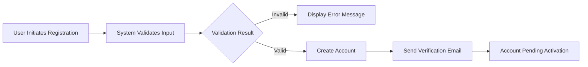
```mermaid
flowchart LR
    A["User Initiates Registration"] --> B["System Validates Input"]
    B --> C{"Validation Result"}
    C -->|"Invalid"| D["Display Error Message"]
    C -->|"Valid"| E["Create Account"]
    E --> F["Send Verification Email"]
    F --> G["Account Pending Activation"]
```

##### 4.1.2 Password Requirements

- THE System SHALL require passwords to be at least 8 characters in length.
- THE System SHALL require passwords to contain at least one uppercase letter, one lowercase letter, and one number.
- WHEN a User attempts to set a password that does not meet complexity requirements, THE System SHALL reject the password and display the complexity requirements to the User.

### Customer Profile Management

#### Customer Profile Management

##### 4.2.1 Customer Data Update Permissions

**EARS Format:**
- WHILE a Customer session is authenticated, THE System SHALL allow the Customer to update their own profile information.
- IF the Customer attempts to change their email address, THEN THE System SHALL verify the new email address before updating it.
- THE System SHALL maintain a history of changes to sensitive customer data including name, email, and phone number.

**Update Process:**

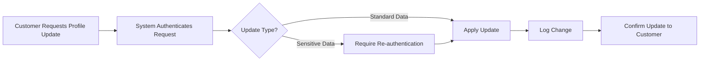
```mermaid
flowchart LR
    A["Customer Requests Profile Update"] --> B["System Authenticates Request"]
    B --> C{"Update Type?"}
    C -->|"Sensitive Data"| D["Require Re-authentication"]
    C -->|"Standard Data"| E["Apply Update"]
    D --> E
    E --> F["Log Change"]
    F --> G["Confirm Update to Customer"]
```

##### 4.2.2 Data Visibility Rules

- THE System SHALL allow Customers to view their complete profile information.
- THE System SHALL NOT display masked data (like full credit card numbers) in Customer-facing profile views.
- WHERE data privacy regulations apply, THE System SHALL restrict the visibility of certain personal data fields.

## CustomerProfile Operations

Each customer account has an associated profile containing personal information. The profile includes the customer's display name which appears on reviews and communications. The profile also stores the customer's phone number for order-related contact purposes. Customers can update their display name at any time to change how they appear to others. Customers can also edit their phone number when their contact information changes. These profile updates allow customers to maintain accurate personal information. The display name helps personalize the shopping experience and build identity on the platform. The phone number serves as a backup communication channel for order confirmations and delivery coordination. Both pieces of information help sellers and the platform communicate effectively with customers about their purchases.

### Profile Creation

When a customer completes registration, a profile is automatically created and associated with the customer account.

The profile initially contains empty values for the display name and phone number. The customer may populate these fields immediately after registration or at a later time.

The profile is linked to the customer account and cannot exist independently. If the customer account is deleted, the profile is deleted along with it, while orders and reviews remain preserved per the account deletion policy.

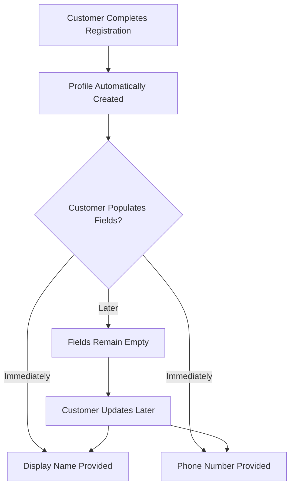
```mermaid
graph TD
    A["Customer Completes Registration"] --> B["Profile Automatically Created"]
    B --> C{"Customer Populates Fields?"}
    C -->|"Immediately"| D["Display Name Provided"]
    C -->|"Immediately"| E["Phone Number Provided"]
    C -->|"Later"| F["Fields Remain Empty"]
    F --> G["Customer Updates Later"]
    G --> D
    G --> E
```

### Viewing Profile Information

Customers can view their own profile information at any time after logging in.

The profile view displays the current display name and phone number stored in the customer's profile. Both fields may show as empty if the customer has not yet provided this information.

The profile serves as the canonical source for the customer's personal details used across the platform, including communications with sellers and delivery coordination.

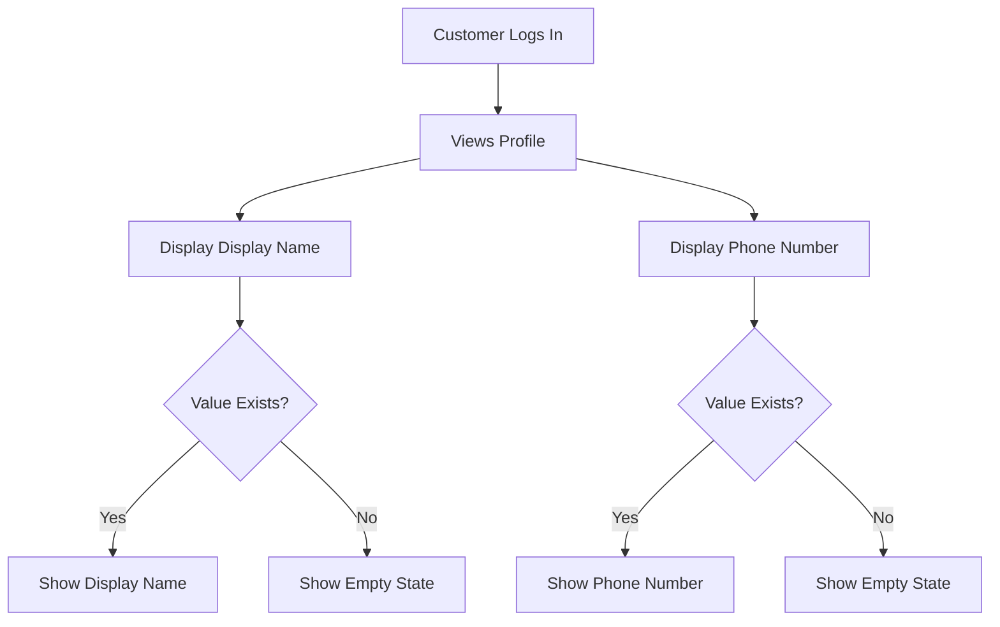
```mermaid
graph TD
    A["Customer Logs In"] --> B["Views Profile"]
    B --> C["Display Display Name"]
    B --> D["Display Phone Number"]
    C --> E{"Value Exists?"}
    D --> F{"Value Exists?"}
    E -->|"Yes"| G["Show Display Name"]
    E -->|"No"| H["Show Empty State"]
    F -->|"Yes"| I["Show Phone Number"]
    F -->|"No"| J["Show Empty State"]
```

### Updating Display Name

Customers can change their display name at any time to update how they appear to others on the platform.

When updating the display name, the customer provides a new value that will be used in all future contexts where the customer's identity is displayed, including reviews and platform communications.

The updated display name appears immediately on new reviews and other customer-generated content. Existing reviews continue to display the display name that was current when each review was written.

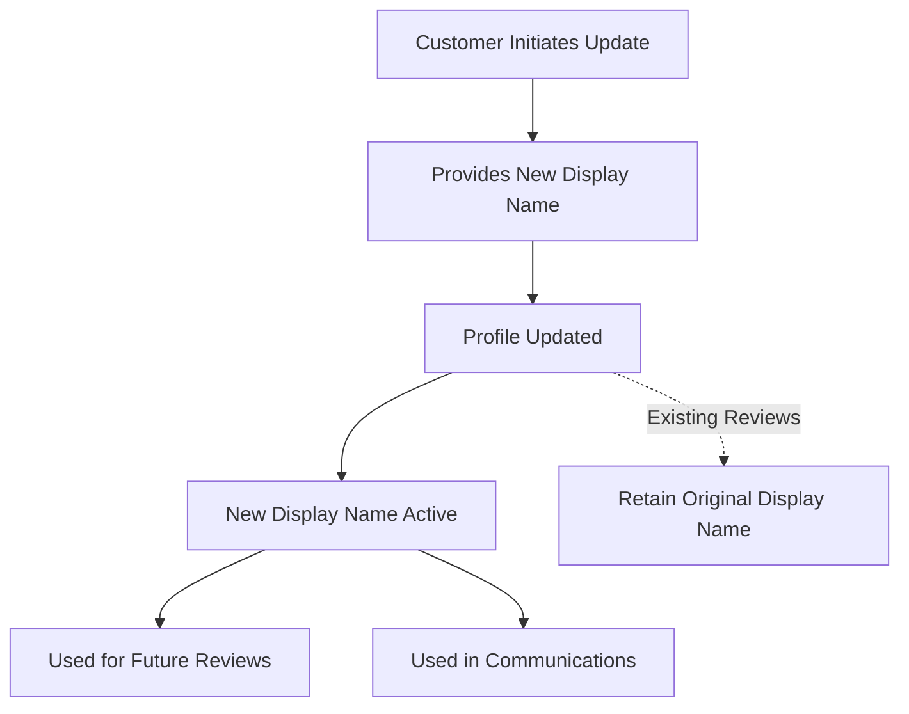
```mermaid
graph TD
    A["Customer Initiates Update"] --> B["Provides New Display Name"]
    B --> C["Profile Updated"]
    C --> D["New Display Name Active"]
    D --> E["Used for Future Reviews"]
    D --> F["Used in Communications"]
    C -.->|"Existing Reviews"| G["Retain Original Display Name"]
```

### Updating Phone Number

Customers can edit their phone number at any time to ensure their contact information remains accurate.

When updating the phone number, the customer provides a new value that will be used for order-related communications and delivery coordination.

The phone number serves as a backup communication channel when email contact is insufficient or when delivery services require phone contact for scheduling purposes.

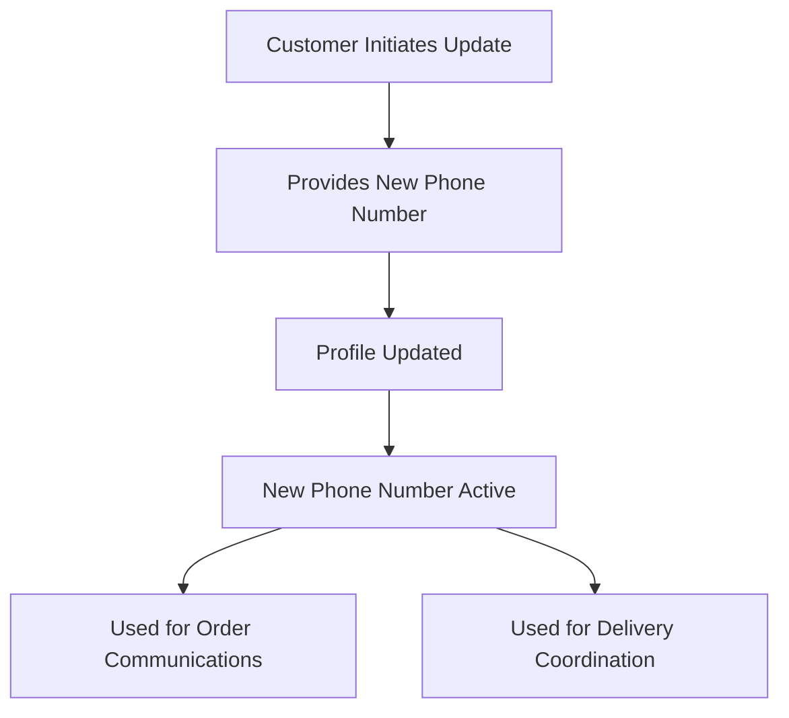
```mermaid
graph TD
    A["Customer Initiates Update"] --> B["Provides New Phone Number"]
    B --> C["Profile Updated"]
    C --> D["New Phone Number Active"]
    D --> E["Used for Order Communications"]
    D --> F["Used for Delivery Coordination"]
```

### Profile Usage Context

The display name from the customer profile appears in several contexts across the platform to establish customer identity.

When a customer writes a review, the display name at the time of writing is associated with that review and shown to other customers viewing the product.

If a customer deletes their account, their reviews remain visible but the associated identity is shown as "deleted user" rather than the original display name, preserving the review content while anonymizing the author.

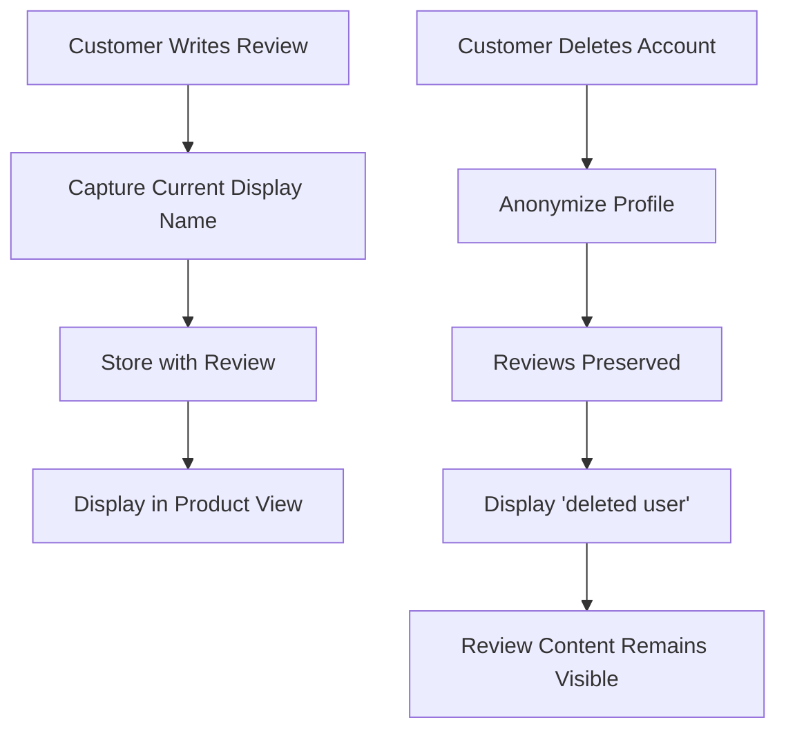
```mermaid
graph TD
    A["Customer Writes Review"] --> B["Capture Current Display Name"]
    B --> C["Store with Review"]
    C --> D["Display in Product View"]
    
    E["Customer Deletes Account"] --> F["Anonymize Profile"]
    F --> G["Reviews Preserved"]
    G --> H["Display 'deleted user'"]
    H --> I["Review Content Remains Visible"]
```

## Seller Operations

Sellers register for accounts using an email address and password, similar to customers. Sellers log in using their registered email and password credentials. Sellers can change their password at any time for security purposes. New seller accounts require administrator approval before they are permitted to list and sell products. Sellers can view their current approval status which may be pending, approved, or rejected. If a seller's registration is rejected, they can view the specific reason provided by administrators. Rejected sellers have the opportunity to submit a new registration request with corrected or additional information. Sellers may delete their account only under specific conditions. Account deletion is blocked if the seller has any pending orders in paid or shipped status. Account deletion is also blocked if there are pending cancellation or refund requests. When deletion is permitted and executed, the seller's products are removed from all listings. The seller's order history and snapshots remain preserved for business records. The shop name associated with past orders is retained for customer reference.

### Seller Authentication

Sellers access the platform using email and password credentials established during registration. Sellers authenticate by providing their registered email address and password. The system verifies the credentials and grants access upon successful validation. Sellers may change their password at any time while logged in. To change a password, the seller must provide their current password and the new password. The system validates the current password before applying the change.

### Approval Status Monitoring

Sellers can view their current account approval status at any time. The approval status indicates whether the account is pending review, approved for selling, or rejected. For accounts with rejected status, the system displays the rejection reason provided by administrators. This allows sellers to understand what corrections or additional information may be needed for successful registration.

### Re-registration After Rejection

Sellers whose registration requests were rejected may submit a new registration request. When submitting a new request, the seller can provide corrected or additional information addressing the previously stated rejection reason. Each re-registration request undergoes the same administrator review process as initial registrations. The seller's approval status updates to pending upon submission of the new request.

### Account Deletion Prerequisites

Sellers may request deletion of their account only when specific business conditions are met. The system verifies that the seller has no order items in paid status awaiting shipment. The system verifies that the seller has no order items in shipped status pending delivery confirmation. The system verifies that no cancellation requests are pending review for any of the seller's order items. The system verifies that no refund requests are pending review for any of the seller's order items. If any of these conditions exist, the deletion request is blocked until all pending items are resolved.

### Account Deletion Execution

When an account deletion is executed after meeting all prerequisites, the system performs several preservation and cleanup operations. The seller's products are removed from all search results and category listings, making them unavailable for purchase. The product records, variants, and inventory data are deleted. The seller's order history and associated snapshots remain preserved for business records and potential dispute resolution. The shop name associated with past orders is retained and displayed to customers viewing their order history, ensuring customers can identify where purchases were made even after seller departure.

## SellerProfile Operations

Each seller has a profile that represents their shop on the platform. The profile includes the shop name which identifies the seller to customers. The profile contains a shop description that explains what the seller offers. The profile also includes a logo image that visually represents the shop brand. Sellers can edit their shop name, description, and logo at any time. Every edit to the seller profile automatically creates a snapshot to preserve the previous state. These snapshots enable tracking of how the shop profile has evolved over time. Customers can view seller profiles to learn more about shops before making purchases. The profile information helps build trust and brand recognition. Snapshots provide an audit trail for dispute resolution and historical record-keeping.

### Shop Profile Overview

Each seller has a profile that represents their shop on the platform. The profile consists of three core elements: the shop name, the shop description, and the logo image.

The shop name serves as the primary identifier for the seller and appears on product listings, order confirmations, and throughout the customer experience. This name establishes the shop identity that customers recognize and remember.

The shop description provides space for sellers to explain their business, product specialties, policies, or brand story. This helps build trust with potential customers and communicates the shop's unique value proposition.

The logo image provides visual brand representation. This image appears alongside the shop name in search results, product pages, and order details, creating consistent visual recognition for the shop.

When customers view a product, they see the seller's shop name and logo, allowing them to identify which shop is offering the item. This visibility helps customers make informed purchasing decisions based on shop reputation and brand familiarity.

### Profile Editing Operations

Sellers can modify their shop profile at any time through the profile editing interface. When editing, sellers can change the shop name, update the shop description, and upload a new logo image.

Sellers may edit any combination of these fields in a single update. For example, a seller might update only the logo image, or simultaneously change the shop name and description while keeping the existing logo.

The system applies profile edits immediately upon confirmation. Once saved, the new profile information becomes visible to customers viewing the seller's products and shop page.

Profile editing is available to sellers regardless of their approval status, allowing new sellers to refine their brand presentation before receiving administrator approval to sell. However, suspended sellers retain the ability to view their profile even though they cannot modify it until the suspension is lifted.

### Automatic Snapshot Creation on Profile Changes

Every edit to a seller profile automatically creates a snapshot that preserves the previous state. This snapshot records the complete profile information as it existed before the change, including the shop name, shop description, and logo image.

Each snapshot captures the timestamp of when the change occurred and identifies what fields were modified. The snapshot preserves the exact values of all profile fields, ensuring a complete historical record of the shop's brand evolution.

Snapshots are immutable and cannot be altered or deleted after creation. This immutability ensures the integrity of the historical record for dispute resolution and audit purposes.

The snapshot mechanism applies to all profile modifications, whether the seller updates a single field or makes comprehensive changes. Even minor edits such as correcting a typo in the shop description trigger snapshot creation.

### Customer Viewing of Seller Profiles

Customers can view seller profiles to learn more about shops before making purchase decisions. The profile view displays the current shop name, shop description, and logo image.

When viewing a product detail page, customers see the seller's shop name prominently displayed. The shop name serves as a link that customers can follow to view the full seller profile.

The seller profile page presents the complete brand representation including the logo image at full size and the full shop description text. This gives customers comprehensive information about the seller's business.

Customers viewing a seller profile can also see all products currently offered by that seller. This cross-product visibility helps customers discover additional items from shops they trust.

Even when a seller's account is later deleted, customers viewing their order history continue to see the shop name as it appeared at the time of purchase. This preservation ensures customers can always identify where they purchased items.

### Profile History and Snapshot Viewing

Sellers can view the complete history of their profile changes through the snapshot viewing interface. This history shows all previous versions of the profile in chronological order.

Each entry in the profile history displays the timestamp of the change and the values of all profile fields at that point in time. Sellers can compare different versions to see how their shop name, description, and logo have evolved.

Snapshots are preserved indefinitely and remain accessible even after subsequent edits or account deletion. This long-term retention supports dispute resolution by allowing sellers to demonstrate what information was displayed at specific points in time.

Administrators can view snapshots for any seller profile on the platform. This oversight capability enables administrators to investigate disputes and verify what shop information was presented to customers during specific transactions.

## SellerRegistration Operations

Seller registration is a formal process that requires administrative review. When a user applies to become a seller, their registration enters a pending status awaiting administrator evaluation. Administrators review registration requests to ensure sellers meet platform standards and requirements. Administrators can approve registrations, allowing the seller to immediately begin listing products. Administrators can also reject registrations if the applicant does not meet requirements. When rejecting a registration, administrators must provide a specific reason explaining the decision. Rejected applicants can view this reason and address the issues before submitting a new request. The registration process includes tracking of when the request was submitted. The status and any rejection reasons are visible to the applying seller throughout the process.

### Registration Submission

A user who wishes to become a seller may submit a seller registration request. The registration request requires the user's email and password credentials as required by the User model. Upon submission, the registration is created with a pending status awaiting administrative review. The system records the submission timestamp indicating when the request was submitted. Each seller account is associated with its registration history as defined in the Seller model.

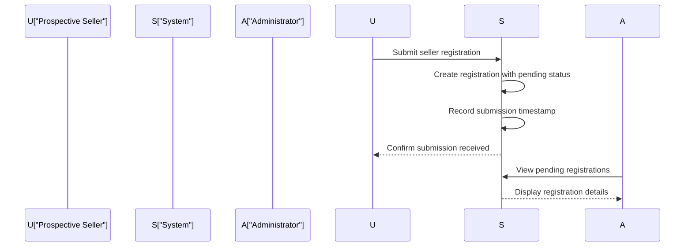
```mermaid
sequenceDiagram
    participant U["Prospective Seller"]
    participant S["System"]
    participant A["Administrator"]
    U->>S: Submit seller registration
    S->>S: Create registration with pending status
    S->>S: Record submission timestamp
    S-->>U: Confirm submission received
    A->>S: View pending registrations
    S-->>A: Display registration details
```

### Pending Status and Status Tracking

Sellers can view the current approval status of their registration at any time. The approval status indicates whether the registration is pending review, has been approved (matching the approval status in the Seller model), or has been rejected. Sellers with pending status must wait for administrator review before they can begin selling. The status is visible on the seller's account dashboard and is updated automatically when administrators make a decision.

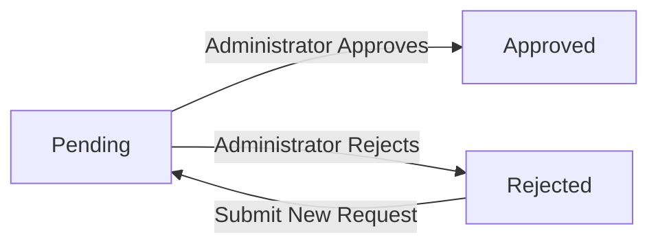
```mermaid
flowchart LR
    A["Pending"] -->|"Administrator Approves"| B["Approved"]
    A -->|"Administrator Rejects"| C["Rejected"]
    C -->|"Submit New Request"| A
```

### Administrator Review

Administrators can view a list of all seller registrations awaiting review. Each pending registration displays the applicant's information including email and associated user details for evaluation. Administrators assess whether the applicant meets the platform's standards and requirements for selling. Based on this assessment, administrators can either approve the registration to allow the applicant to become a seller, or reject the registration if the applicant does not meet the requirements.

### Registration Approval

When an administrator approves a seller registration, the applicant's approval status changes to approved, consistent with the Seller model definition. Once approved, the seller can immediately begin creating products and conducting business on the platform. The approved status grants full seller privileges including product creation, inventory management, and order fulfillment capabilities.

### Registration Rejection

When an administrator rejects a seller registration, the approval status changes to rejected. The administrator must provide a specific rejection reason explaining why the registration was denied. The rejection reason is saved and becomes visible to the rejected applicant. The rejection reason helps the applicant understand what requirements were not met and what issues need to be addressed.

### Re-submission After Rejection

A seller whose registration has been rejected may submit a new registration request after addressing the issues described in the rejection reason. There is no limit on the number of registration attempts. Each new submission creates a fresh registration record with pending status and a new submission timestamp. The seller can view the rejection reason from their previous attempt to guide their re-submission.

## Administrator Operations

Users can submit requests to become administrators of the platform. There are two administrator grades: regular administrator and super administrator. Super administrators have exclusive authority to promote regular administrators to super administrator status. Super administrators can also demote other super administrators to regular administrator status. Super administrators cannot demote themselves to prevent the platform from being left without super administrator oversight. Administrators have elevated privileges for managing the platform including seller approvals and user management. The system maintains records of administrator actions for accountability. Administrator grades determine the scope of management capabilities available to each administrator.

## AdminPromotionRequest Operations

Users who wish to become administrators submit a promotion request with a reason explaining their qualifications. Super administrators can view a list of all pending promotion requests awaiting their review. Super administrators evaluate each request based on the reason provided and other criteria. Super administrators can approve promotion requests, granting the user administrator privileges. Super administrators can also reject requests if the applicant is not suitable. When approving a request, the user becomes a regular administrator with appropriate permissions. The system tracks when each request was reviewed by a super administrator. The request status indicates whether it is pending, approved, or rejected. Only super administrators have the authority to process these promotion requests.

### Promotion Request Submission

### Promotion Request Submission

Non-administrator users (customers and sellers) may submit a request to become an administrator. The request must include a reason explaining the user's qualifications and motivation for seeking administrator privileges.

**WHEN** a customer or seller submits a promotion request  
**GIVEN** they do not currently have administrator status  
**THEN** the system SHALL create a new promotion request with pending status  
**AND** record the reason provided by the requester.

Each user may only have one pending promotion request at any given time. Once submitted, the request enters a pending state awaiting review by a super administrator.

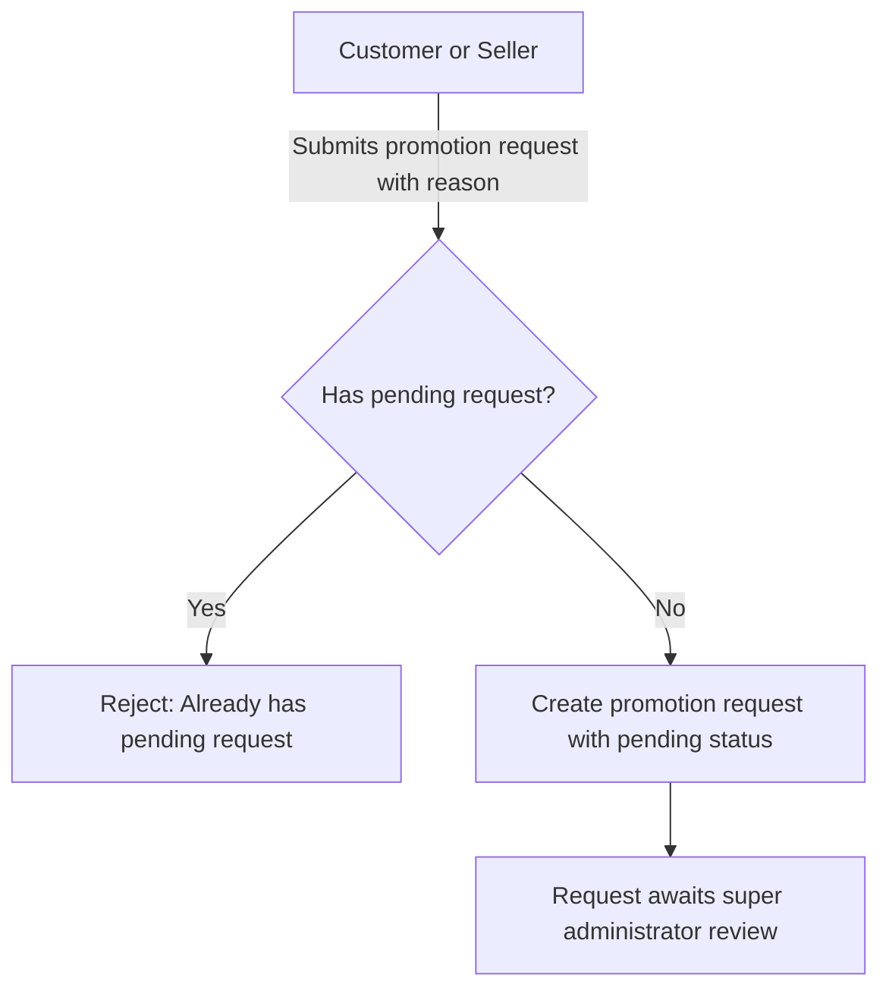
```mermaid
flowchart TD
    A["Customer or Seller"] -->|"Submits promotion request with reason"| B{"Has pending request?"}
    B -->|"Yes"| C["Reject: Already has pending request"]
    B -->|"No"| D["Create promotion request with pending status"]
    D --> E["Request awaits super administrator review"]
```

### Pending Requests List

### Pending Requests List

Super administrators can view a list of all pending administrator promotion requests awaiting their review. The list displays requests sorted by submission date with the oldest requests shown first.

**WHEN** a super administrator views pending promotion requests  
**THEN** the system SHALL display all requests with pending status  
**AND** sort them by submission date in ascending order.

Each entry in the list shows the requester's identity, the reason provided, and the submission date. Super administrators can access the full details of any individual request to evaluate its merits.

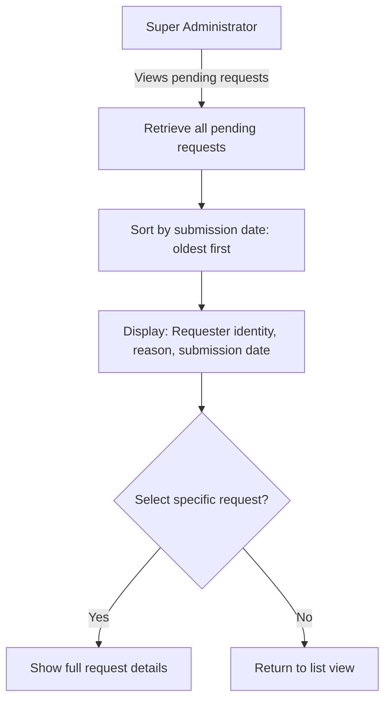
```mermaid
flowchart TD
    A["Super Administrator"] -->|"Views pending requests"| B["Retrieve all pending requests"]
    B --> C["Sort by submission date: oldest first"]
    C --> D["Display: Requester identity, reason, submission date"]
    D --> E{"Select specific request?"}
    E -->|"Yes"| F["Show full request details"]
    E -->|"No"| G["Return to list view"]
```

### Super Administrator Review

### Super Administrator Review

Super administrators evaluate each promotion request based on the reason provided by the applicant. The review process involves examining the user's qualifications, platform history, and stated motivations.

**WHEN** a super administrator reviews a pending promotion request  
**THEN** the system SHALL display the requester's information and stated reason  
**AND** allow the super administrator to either approve or reject the request.

Super administrators have sole authority to process these promotion requests. Regular administrators cannot approve or reject promotion requests.

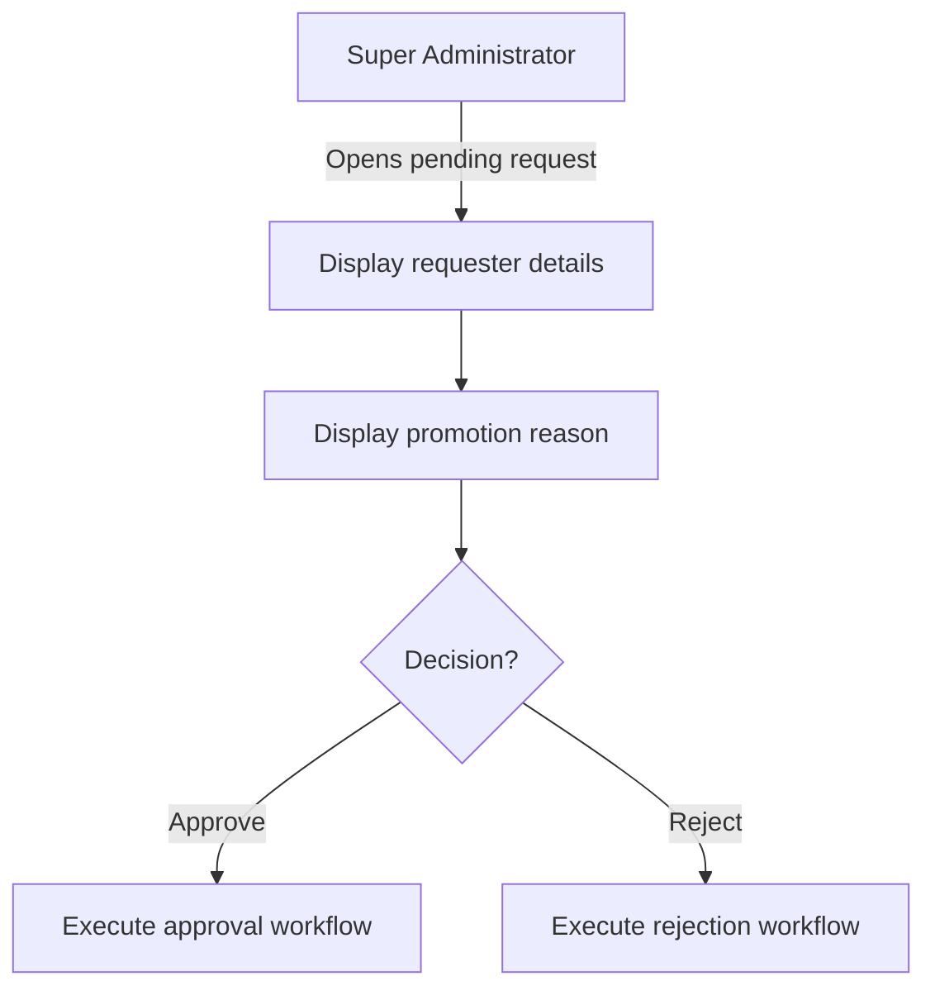
```mermaid
flowchart TD
    A["Super Administrator"] -->|"Opens pending request"| B["Display requester details"]
    B --> C["Display promotion reason"]
    C --> E{"Decision?"}
    E -->|"Approve"| F["Execute approval workflow"]
    E -->|"Reject"| G["Execute rejection workflow"]
```

### Request Approval

### Request Approval

When a super administrator approves a promotion request, the requesting user becomes a regular administrator.

**WHEN** a super administrator approves a promotion request  
**GIVEN** the request is in pending status  
**THEN** the system SHALL change the request status to approved  
**AND** record the review timestamp  
**AND** grant administrator privileges to the requesting user.

The approval grants the user administrator privileges including access to seller management, category management, product oversight, order oversight, and user management functions.

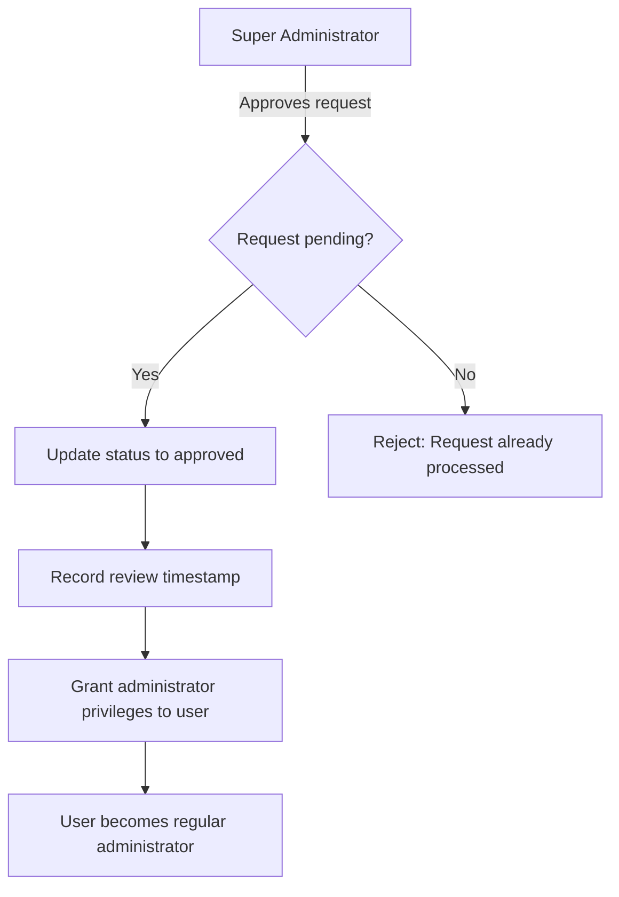
```mermaid
flowchart TD
    A["Super Administrator"] -->|"Approves request"| B{"Request pending?"}
    B -->|"Yes"| C["Update status to approved"]
    C --> D["Record review timestamp"]
    D --> E["Grant administrator privileges to user"]
    E --> F["User becomes regular administrator"]
    B -->|"No"| G["Reject: Request already processed"]
```

### Request Rejection

### Request Rejection

When a super administrator rejects a promotion request, the user remains in their current role without administrator privileges.

**WHEN** a super administrator rejects a promotion request  
**GIVEN** the request is in pending status  
**THEN** the system SHALL change the request status to rejected  
**AND** record the review timestamp.

Users whose requests are rejected may submit a new promotion request at a later time if they wish to reapply.

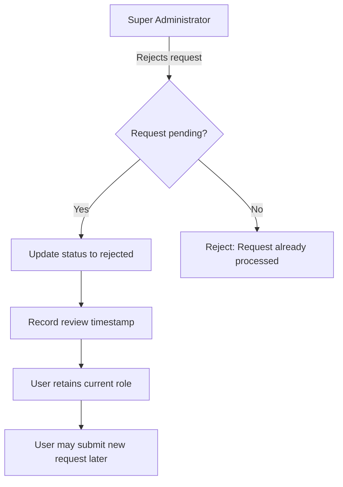
```mermaid
flowchart TD
    A["Super Administrator"] -->|"Rejects request"| B{"Request pending?"}
    B -->|"Yes"| C["Update status to rejected"]
    C --> D["Record review timestamp"]
    D --> E["User retains current role"]
    E --> F["User may submit new request later"]
    B -->|"No"| G["Reject: Request already processed"]
```

### Request Status Tracking

### Request Status Tracking

Each promotion request maintains a status indicating its current state in the review process.

**WHEN** a promotion request is created  
**THEN** the system SHALL set its status to pending.

**WHEN** a super administrator reviews a request  
**THEN** the system SHALL update the status to approved or rejected  
**AND** record the review timestamp capturing the exact date and time of the decision.

The possible statuses are: pending (awaiting review), approved (request granted), and rejected (request denied). The review timestamp is preserved as part of the request record.

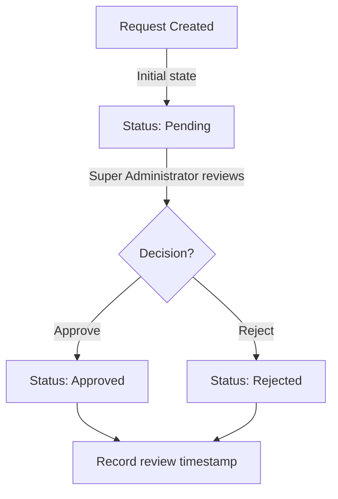
```mermaid
flowchart TD
    A["Request Created"] -->|"Initial state"| B["Status: Pending"]
    B -->|"Super Administrator reviews"| C{"Decision?"}
    C -->|"Approve"| D["Status: Approved"]
    C -->|"Reject"| E["Status: Rejected"]
    D --> F["Record review timestamp"]
    E --> F
```

## Category Operations

Products on the platform are organized into categories to help customers find items. Categories can contain subcategories creating a one-level nesting structure. Each category has a name that identifies it to customers and a description that explains what products it contains. Only administrators have the authority to create new categories and subcategories. Only administrators can edit existing category names and descriptions. Only administrators can delete categories from the system. When a category is deleted, products in that category become uncategorized but remain on the platform. Customers can browse the complete list of all available categories. Customers can view all products within a specific category or subcategory. Categories help organize the product catalog and improve discoverability.

### Category Creation and Management

Administrators can create new categories to organize products on the platform.

Each category requires a name that uniquely identifies it within the platform's catalog structure. The name is displayed to customers when browsing the category list and viewing products.

Each category has an optional description that explains what types of products the category contains. The description helps customers understand the purpose and scope of the category.

Only users with administrator privileges can create categories. Non-administrator users, including customers and sellers, cannot create new categories or subcategories.

When creating a category, administrators specify whether it is a top-level category or a subcategory of an existing parent category.

### Category Hierarchy and Subcategories

Categories support a one-level nesting structure, meaning a category can have subcategories, but subcategories cannot have further nested subcategories.

A category designated as a parent category can contain multiple subcategories. Each subcategory belongs to exactly one parent category.

When browsing a parent category, customers can see both the subcategories within it and the products directly associated with the parent category.

The one-level nesting limitation ensures the category structure remains simple and navigable for customers.

### Category Editing

Administrators can edit the name and description of existing categories at any time.

Changes to a category name immediately affect how the category is displayed throughout the platform, including in product listings, search filters, and navigation menus.

Changes to a category description update the explanatory text shown to customers when browsing that category.

Only administrators can edit category information. Sellers and customers cannot modify category names or descriptions.

### Category Deletion and Uncategorized Products

Administrators can delete categories from the platform when they are no longer needed.

When a category is deleted, any products previously associated with that category become uncategorized. Uncategorized products remain on the platform and can still be found through search and direct links, but they do not appear when customers browse by category.

If a parent category with subcategories is deleted, all its subcategories are also deleted. Products in those subcategories become uncategorized.

Category deletion requires administrator privileges and cannot be performed by sellers or customers.

### Category Browsing and Product Filtering

Customers can view a complete list of all available categories on the platform. The category list shows both top-level categories and their nested subcategories in a hierarchical display.

When a customer selects a category, they see all products associated with that category. If the selected category is a parent category with subcategories, the product listing includes products from both the parent category and all its subcategories.

Category browsing results can be combined with other filtering options such as price range and stock availability to refine the product selection.

Products are displayed with their main image, name, price or price range, seller shop name, and average rating when customers browse by category.

## Product Operations

Sellers create products to list for sale on the platform. Each product requires a name, description, category selection, and base price. Products belong exclusively to the seller who created them. Sellers can edit their own products to update any information. Every edit to a product creates a snapshot preserving the previous state including all fields and images. Sellers can delete their own products only when specific conditions are met. Deletion is blocked if any variant has pending order items in paid or shipped status. Deletion is also blocked if there are pending cancellation or refund requests for any variant. When deletion is permitted, the product and all its variants and inventory records are removed. Deleted products no longer appear in search results or category listings. Sellers can view snapshots of their own products. Administrators can view snapshots of any product for oversight purposes. Snapshots are preserved indefinitely even after product deletion for dispute resolution and record-keeping.

### Product Creation

Sellers can create products to list on the platform for customer purchase.

A product requires a name, a description, a category selection, and a base price. The name and description must be provided for the product to be created. The category can be a main category or a subcategory. The base price represents the default price for the product.

Products are exclusively owned by the seller who created them. Only the owning seller can modify or delete the product. The product is associated with the seller's shop and appears in the seller's product management interface.

Upon creation, the product is in an active state and becomes visible in search results and category listings once it has at least one variant.

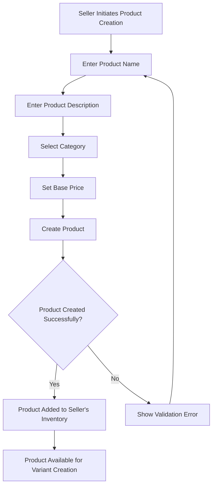
```mermaid
flowchart TD
    A["Seller Initiates Product Creation"] --> B["Enter Product Name"]
    B --> C["Enter Product Description"]
    C --> D["Select Category"]
    D --> E["Set Base Price"]
    E --> F["Create Product"]
    F --> G{"Product Created Successfully?"}
    G -->|"Yes"| H["Product Added to Seller's Inventory"]
    G -->|"No"| I["Show Validation Error"]
    I --> B
    H --> J["Product Available for Variant Creation"]
```

### Product Editing

Sellers can edit their own products to update information. Sellers cannot edit products owned by other sellers.

Editable information includes the product name, description, category, and base price. Sellers can also modify product images as part of the editing process.

Every edit to a product creates a snapshot that preserves the previous state. The snapshot records the timestamp of the change and captures all product fields including the name, description, category, base price, and all associated images at that moment.

Snapshots are immutable and cannot be modified after creation. Snapshots serve as historical records for dispute resolution and audit purposes.

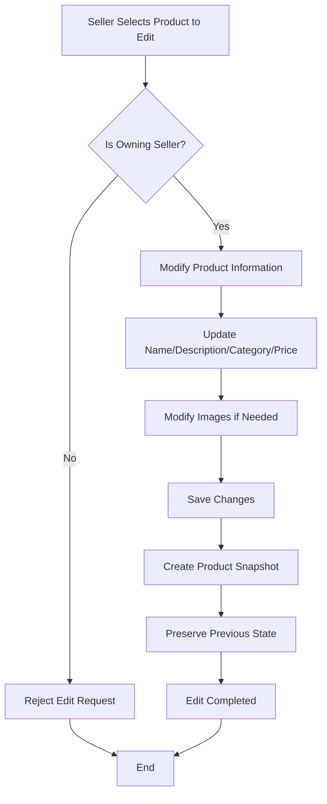
```mermaid
flowchart TD
    A["Seller Selects Product to Edit"] --> B{"Is Owning Seller?"}
    B -->|"No"| C["Reject Edit Request"]
    B -->|"Yes"| D["Modify Product Information"]
    D --> E["Update Name/Description/Category/Price"]
    E --> F["Modify Images if Needed"]
    F --> G["Save Changes"]
    G --> H["Create Product Snapshot"]
    H --> I["Preserve Previous State"]
    I --> J["Edit Completed"]
    C --> K["End"]
    J --> K
```

### Product Deletion

Sellers can delete their own products when specific business conditions are satisfied. Deletion is not permitted when there are pending business transactions that must be preserved.

Deletion is blocked if any variant of the product has order items with paid or shipped status that have not been completed, cancelled, or refunded. Deletion is also blocked if there are pending cancellation requests for any variant of the product. Deletion is further blocked if there are pending refund requests for any variant of the product.

When deletion is permitted, the product and all its variants are removed from the system. All inventory records associated with the variants are also deleted. The product no longer appears in search results or category listings. The product is removed from customer wishlists automatically.

Order history and snapshots are preserved even after product deletion. Past orders referencing the product continue to display the product information as it existed at the time of purchase through the preserved snapshots.

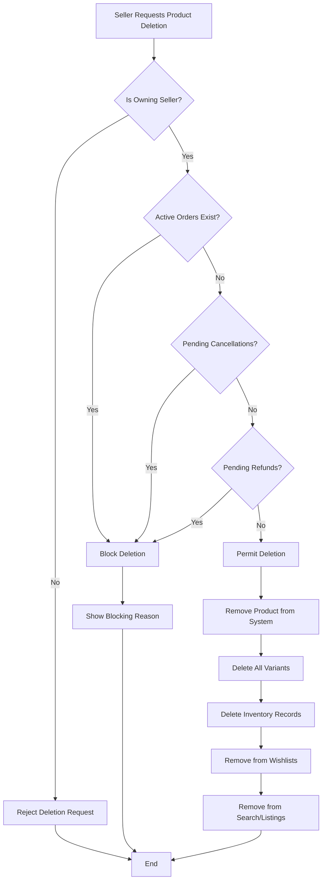
```mermaid
flowchart TD
    A["Seller Requests Product Deletion"] --> B{"Is Owning Seller?"}
    B -->|"No"| C["Reject Deletion Request"]
    B -->|"Yes"| D{"Active Orders Exist?"}
    D -->|"Yes"| E["Block Deletion"]
    D -->|"No"| F{"Pending Cancellations?"}
    F -->|"Yes"| E
    F -->|"No"| G{"Pending Refunds?"}
    G -->|"Yes"| E
    G -->|"No"| H["Permit Deletion"]
    H --> I["Remove Product from System"]
    I --> J["Delete All Variants"]
    J --> K["Delete Inventory Records"]
    K --> L["Remove from Wishlists"]
    L --> M["Remove from Search/Listings"]
    E --> N["Show Blocking Reason"]
    C --> O["End"]
    N --> O
    M --> O
```

### Product Snapshot Viewing

Product snapshots provide a complete historical record of all changes made to a product over time.

Sellers can view snapshots of their own products. The snapshot view shows the product state at each point of modification including all fields and images as they existed at that time. Sellers can use snapshots to track changes and resolve disputes with customers.

Administrators can view snapshots of any product on the platform. This oversight capability allows administrators to investigate disputes and verify product information regardless of ownership.

Snapshots are preserved permanently and cannot be deleted. Even after a product is deleted, its snapshots remain accessible to the owning seller and administrators for record-keeping and dispute resolution purposes. Product snapshots include snapshots of all variants at the time of the product modification, preserving the complete product state.

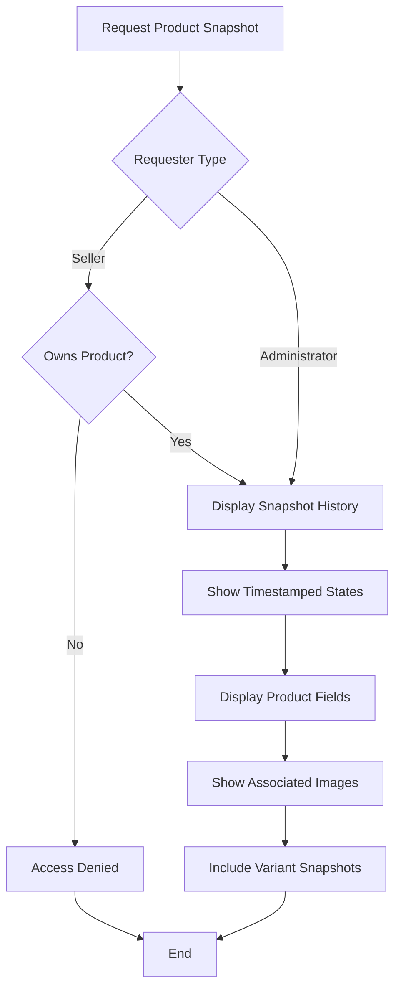
```mermaid
flowchart TD
    A["Request Product Snapshot"] --> B{"Requester Type"}
    B -->|"Seller"| C{"Owns Product?"}
    C -->|"No"| D["Access Denied"]
    C -->|"Yes"| E["Display Snapshot History"]
    B -->|"Administrator"| E
    E --> F["Show Timestamped States"]
    F --> G["Display Product Fields"]
    G --> H["Show Associated Images"]
    H --> I["Include Variant Snapshots"]
    D --> J["End"]
    I --> J
```

## ProductVariant Operations

Products can have multiple variants representing different combinations of options. Each variant has a unique SKU code that identifies it, option values specifying the variant characteristics, an optional price that can override the base price, and a stock quantity that starts at zero. Sellers can add variants to their products to offer different options. Sellers can edit variant details including SKU code, option values, and price. Every edit to a variant creates a snapshot preserving the previous state. Sellers can delete variants only under specific conditions. Deletion is blocked if the variant has pending order items in paid or shipped status. Deletion is also blocked if there are pending cancellation or refund requests for that variant. A product must have at least one variant to be purchasable by customers. Products without any variants are still visible in search results but are shown as unavailable for purchase. Variants allow sellers to offer different sizes, colors, or other options for the same product.

### Variant Creation

Sellers can add variants to their products to offer different options such as sizes, colors, or other characteristics.

When creating a variant, the seller must provide:
- A SKU code that uniquely identifies the variant across the entire platform
- Option values that specify the variant's characteristics (for example, color: "Red" and size: "Large")
- An optional price that overrides the product's base price
- The initial stock quantity, which starts at zero by default

The variant is automatically associated with the product it was created for.

If the SKU code is already in use by another variant, the creation request is rejected.

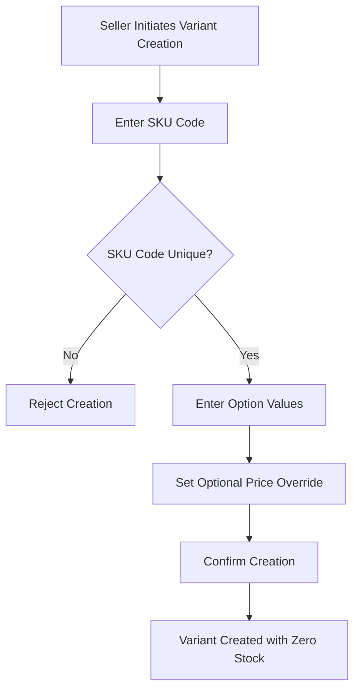
```mermaid
flowchart TD
    A["Seller Initiates Variant Creation"] --> B["Enter SKU Code"]
    B --> C{"SKU Code Unique?"}
    C -->|No| D["Reject Creation"]
    C -->|Yes| E["Enter Option Values"]
    E --> F["Set Optional Price Override"]
    F --> G["Confirm Creation"]
    G --> H["Variant Created with Zero Stock"]
```

### SKU Code Uniqueness

Every variant must have a unique SKU code that distinguishes it from all other variants on the platform.

When a seller attempts to create or edit a variant, the system verifies that the provided SKU code is not already assigned to another variant.

If a duplicate SKU code is detected, the request is rejected and the seller must provide a different code.

### Option Values

Each variant represents a specific combination of options that describe its characteristics.

Option values define the distinguishing attributes of a variant, such as color, size, material, or other product-specific properties.

Sellers can specify multiple option values for a single variant to create combinations like "Red / Large" or "Blue / Small".

The combination of option values helps customers identify and select the exact variant they want to purchase.

### Price Override

Variants inherit the product's base price by default.

Sellers can optionally set a different price for a specific variant to account for differences in materials, sizes, or other value-affecting attributes.

When a price is specified for a variant, it overrides the base price for that variant only.

If no variant-specific price is set, the base price applies at checkout.

### Stock Quantity

Each variant maintains its own stock quantity that represents the number of units available for purchase.

The stock quantity starts at zero when a variant is created.

Stock quantity is managed through inventory history records that track all additions and subtractions.

When stock reaches zero, the variant is displayed as "out of stock" and cannot be added to the cart.

The current stock is calculated by summing all inventory records associated with the variant.

### Variant Editing

Sellers can edit the details of their existing variants.

Editable fields include:
- The SKU code
- The option values
- The price override

When a seller modifies any of these fields, the changes are applied to the variant.

### Snapshot Creation on Variant Edit

Every time a seller edits a variant, the system automatically creates a snapshot that preserves the previous state.

The snapshot records:
- The timestamp when the change was made
- The values before the change (previous SKU code, option values, and price)
- The values after the change

Snapshots are immutable and cannot be modified or deleted.

Sellers can view the snapshots of their own variants to track changes over time.

Snapshots are preserved even if the variant or the parent product is later deleted.

### Variant Deletion Conditions

Sellers can delete variants from their products only when specific conditions are met.

A variant cannot be deleted if:
- There are pending order items in "paid" or "shipped" status for that variant
- There are pending cancellation requests for that variant
- There are pending refund requests for that variant

The system checks these conditions before allowing deletion.

If any blocking condition exists, the deletion request is rejected.

```mermaid
flowchart TD
    A["Seller Requests Variant Deletion"] --> B{"Pending Order Items?"}
    B -->|Yes| C["Reject Deletion"]
    B -->|No| D{"Pending Cancellation Requests?"}
    D -->|Yes| C
    D -->|No| E{"Pending Refund Requests?"}
    E -->|Yes| C
    E -->|No| F["Allow Deletion"]
```

### Purchasable Requirement

A product must have at least one variant to be purchasable by customers.

Products without any variants are still visible in search results and category listings to maintain catalog visibility.

When customers view a product without variants, it is clearly displayed as "unavailable" and cannot be added to the cart.

Sellers cannot complete checkout for products that have no variants.

### Unavailable Display

Products without variants are shown in search results and category pages with a visual indication that they are unavailable for purchase.

Similarly, individual variants with zero stock are displayed as "out of stock" on the product detail page.

Out-of-stock variants cannot be selected for purchase and are visually distinguished from available variants.

### Product Options

Options are the characteristics that differentiate variants of the same product.

Common product options include size, color, material, style, or other distinguishing attributes.

Each variant represents a unique combination of these options.

The set of available options and their values are defined when variants are created and can be modified through variant editing.

## ProductImage Operations

Sellers can upload multiple images for each product to showcase it visually. The first image uploaded serves as the main thumbnail image for the product. Sellers can reorder images to change which one appears first. Sellers can delete images from their products when they want to remove or replace them. All image changes are included in product snapshots to maintain a complete visual history. Images help customers evaluate products before making purchase decisions. The main thumbnail appears in search results and category listings. Additional images provide detailed views from different angles or show product features. Image management allows sellers to present their products professionally.

### Image Upload

Sellers can upload multiple images for each product to showcase it visually.

Each uploaded image is associated with the specific product and becomes part of its visual presentation.
Sellers may upload images one at a time or in batches.
The system accepts common image formats for product photography.

The first image uploaded for a product automatically becomes the main thumbnail image.
The main thumbnail appears in search results and category listings to help customers identify the product.
Additional images provide detailed views from different angles or show product features.

Images help customers evaluate products before making purchase decisions.
High-quality visual presentation allows sellers to present their products professionally.

### Main Thumbnail Designation

The first image in the sequence serves as the main thumbnail for the product.

The main thumbnail is displayed in:
- Search result listings
- Category browsing pages
- Product listing cards
- Wishlist views

The main thumbnail provides the primary visual representation of the product to potential customers.
When customers browse or search for products, the main thumbnail is the first visual element they see.

Sellers can change which image serves as the main thumbnail by reordering the images.
When the order changes, the new first image automatically becomes the main thumbnail.

### Image Reordering

Sellers can reorder the images associated with their products.

Reordering allows sellers to:
- Change which image appears first as the main thumbnail
- Arrange images in a logical sequence for customer viewing
- Prioritize the most appealing or representative images

The reordering operation changes the display sequence of images on the product detail page.
Images are displayed to customers in the order defined by the seller.

When images are reordered, the new first image automatically becomes the main thumbnail.
This affects how the product appears in search results and category listings.

### Image Deletion

Sellers can delete images from their products.

Image deletion is allowed when:
- The seller owns the product
- The image is no longer needed or relevant
- The image needs to be replaced with a better version

When an image is deleted:
- The image is removed from the product's image collection
- The image no longer appears on the product detail page
- If the deleted image was the main thumbnail, the next image in sequence becomes the new main thumbnail
- If no images remain, the product has no thumbnail

Deleted images are included in product snapshots to maintain a complete visual history.
The snapshot preserves the state of images before the deletion occurred.

### Snapshot Inclusion

All image changes are included in product snapshots.

When a product snapshot is created, it captures:
- The complete set of images at that moment
- The order of images
- Which image was designated as the main thumbnail

Snapshots record the visual state of the product for:
- Dispute resolution
- Historical reference
- Order item preservation

Image changes that trigger snapshot creation include:
- Uploading new images
- Reordering existing images
- Deleting images

Snapshots are immutable and cannot be modified or deleted.
Snapshots are preserved even after product deletion.
Relevant parties (product owners and administrators) can view snapshots for reference.

## InventoryRecord Operations

Each product variant has its stock quantity managed through inventory history records. Each inventory record tracks a quantity change which can be positive for restocking or negative for orders and adjustments. Every record includes a reason explaining why the change occurred and a timestamp of when it happened. The current stock is calculated by summing all inventory records for that variant. Sellers can add inventory by specifying a positive quantity and providing a reason for the restock. Sellers can subtract inventory by specifying a negative quantity and providing a reason for the adjustment or loss. When customers place orders, the system automatically creates negative inventory records corresponding to the quantities purchased. When orders are cancelled or refunded, the system automatically creates positive inventory records to restore the stock. Sellers can view the complete inventory history for each of their variants. When stock reaches zero, the variant is displayed as out of stock and cannot be added to shopping carts.

### Inventory Record Structure

Each product variant maintains a complete history of stock quantity changes through inventory records. Every inventory record represents a single quantity change event and contains three essential pieces of information: the quantity change amount, the reason for the change, and the timestamp when the change occurred.

The quantity change can be positive when stock is added to inventory, or negative when stock is removed from inventory. Positive changes occur during restocking operations, order cancellations, and refund processing. Negative changes occur when customers place orders or when sellers manually adjust inventory for loss or damage.

Every inventory record must include a reason that explains why the quantity change occurred. Reasons help sellers track the cause of inventory movements for auditing and dispute resolution purposes.

The system automatically records the exact date and time when each inventory change occurs. This timestamp creates an immutable audit trail showing precisely when stock levels changed.

Inventory records are append-only and cannot be modified or deleted after creation. This ensures the integrity of the inventory history for financial and legal accountability.

### Current Stock Calculation

The current stock quantity for each variant is calculated dynamically by summing all inventory records associated with that variant. This calculation aggregates all positive changes (restocking, cancellations, refunds) and all negative changes (orders, adjustments) to arrive at the present stock level.

The system performs this calculation whenever stock information is needed, ensuring that the displayed stock quantity always reflects the complete history of inventory movements. Sellers viewing their inventory always see the up-to-date calculated stock level.

When customers view products, the calculated stock quantity determines whether variants are available for purchase. Variants with calculated stock greater than zero are shown as available, while variants with calculated stock of zero or less are shown as out of stock.

### Manual Stock Addition (Restocking)

Sellers can manually add stock to their variants through the restocking operation. When restocking, the seller specifies the quantity to add (a positive number) and provides a reason explaining the source of the new stock.

Upon restocking, the system creates a new inventory record with the positive quantity change, the provided reason, and the current timestamp. The variant's calculated stock increases by the restocked amount.

Common restocking reasons include receiving new shipments from suppliers, manufacturing completion, or returns of sellable merchandise. Sellers can restock any quantity needed, and there is no upper limit on stock levels.

Restocking operations are immediately reflected in the inventory history and become visible to the seller when viewing the variant's stock details.

### Manual Stock Subtraction (Adjustment)

Sellers can manually remove stock from their variants through the adjustment operation. When adjusting inventory downward, the seller specifies the quantity to remove (recorded as a negative number) and provides a reason explaining why the stock is being reduced.

Upon adjustment, the system creates a new inventory record with the negative quantity change, the provided reason, and the current timestamp. The variant's calculated stock decreases by the adjusted amount.

Common adjustment reasons include inventory loss, damage, spoilage, internal use, or counting discrepancies discovered during physical inventory checks. Sellers can only adjust stock down to zero; attempts to reduce stock below zero are rejected.

Adjustment operations are immediately reflected in the inventory history and become visible to the seller when viewing the variant's stock details.

### Automatic Inventory Changes

The system automatically creates inventory records when customers place orders. When an order is successfully placed and payment is confirmed, the system deducts the purchased quantity from each variant's stock by creating negative inventory records.

Each ordered variant receives its own inventory record with the negative quantity equal to the number of units purchased. The reason indicates that the change resulted from a customer order. The timestamp reflects the exact moment the order was placed.

This automatic deduction ensures that stock levels decrease immediately upon purchase, preventing overselling. The deducted stock is reserved for the specific order and cannot be purchased by other customers.

The system also automatically restores stock when cancellations or refunds are approved. When a cancellation request is approved for an item with "paid" status, the system creates a positive inventory record restoring the cancelled quantity to stock. When a refund request is approved for a delivered item, the system similarly creates a positive inventory record to return the refunded quantity to available stock.

These automatic restoration records include reasons indicating they resulted from cancellation or refund processing, along with timestamps of when the approval occurred.

### Inventory History Viewing

Sellers can view the complete inventory history for each of their product variants. The inventory history displays all inventory records in chronological order, showing the full audit trail of stock movements.

Each entry in the inventory history shows the quantity change (positive or negative), the reason for the change, and the timestamp when it occurred. The history includes both manually created records from restocking and adjustments, and automatically created records from orders, cancellations, and refunds.

Sellers can review inventory history to understand stock level fluctuations, track the timing of restocking operations, verify that order deductions were processed correctly, and investigate any discrepancies between expected and actual stock levels.

The inventory history is read-only and cannot be modified. This preserves the integrity of the financial and operational record for the seller's business and potential dispute resolution.

### Out of Stock Display

When a variant's calculated stock quantity reaches zero, the system displays the variant as out of stock on the product detail page. Customers viewing the product see clear indication that the variant is currently unavailable for purchase.

Out of stock variants cannot be added to shopping carts. If a customer attempts to add an out of stock variant to their cart, the request is rejected and the customer is informed that the item is unavailable.

If a variant in a customer's cart becomes out of stock before checkout (due to another customer purchasing the last units), the cart displays a warning indicating the stock shortage. The customer cannot proceed to checkout with unavailable items in their cart.

Variants remain in the out of stock state until a positive inventory record increases the calculated stock above zero, either through seller restocking or through automatic restoration from cancellations or refunds. Once stock becomes available again, the variant is shown as purchasable and can be added to carts.

## WishlistItem Operations

Customers can add products to their personal wishlist for future consideration. The wishlist stores products rather than specific variants allowing customers to decide on options later. Customers can view their complete wishlist which is displayed with pagination for easy browsing. Customers can remove products from their wishlist when they are no longer interested. When a seller deletes a product from the platform, it is automatically removed from all customer wishlists. The wishlist helps customers save items they might want to purchase later. Wishlist items show when the product was added. The wishlist persists across customer sessions so items remain saved until removed.

### Adding Items to Wishlist

#### Adding Items to Wishlist

WHEN a customer views a product, THE SYSTEM SHALL provide the ability to add the product to the customer's wishlist.

THE SYSTEM SHALL associate the added item with the customer who initiated the addition.

WHEN an item is added to a wishlist, THE SYSTEM SHALL capture the current product details including product name, price, and product image at the time of addition.

THE SYSTEM SHALL record the date when the item was added to the wishlist.

IF the product is already present in the customer's wishlist, THEN THE SYSTEM SHALL reject the addition request.

IF the product is not available or has been removed from the catalog, THEN THE SYSTEM SHALL reject the addition request.

```mermaid
flowchart TD
    A["Customer Views Product"] --> B{"Product Available?"}
    B -->|"Yes"| C{"Already in Wishlist?"}
    B -->|"No"| D["Reject Addition"]
    C -->|"No"| E["Capture Product Details"]
    C -->|"Yes"| D
    E --> F["Create WishlistItem"]
    F --> G["Record Addition Date"]
    G --> H["Confirm Addition Success"]
```

### Removing Items from Wishlist

#### Removing Items from Wishlist

THE SYSTEM SHALL allow customers to remove individual items from their wishlist.

WHEN a removal request is initiated, THE SYSTEM SHALL confirm the item exists in the customer's wishlist.

WHEN an item is removed, THE SYSTEM SHALL dissociate the item from the customer and remove it from the wishlist listing.

IF the item does not exist in the customer's wishlist, THEN THE SYSTEM SHALL reject the removal request.

IF the customer is not authenticated, THEN THE SYSTEM SHALL reject the removal request.

```mermaid
flowchart TD
    A["Customer Initiates Removal"] --> B{"Customer Authenticated?"}
    B -->|"Yes"| C{"Item Exists in Wishlist?"}
    B -->|"No"| D["Reject Removal"]
    C -->|"Yes"| E["Remove WishlistItem"]
    C -->|"No"| D
    E --> F["Confirm Removal Success"]
```

### Updating Item Details

#### Updating Item Details

THE SYSTEM SHALL allow customers to modify item-specific preferences after the item has been added to their wishlist.

THE SYSTEM SHALL support adding or editing free-text notes associated with the item.

THE SYSTEM SHALL support updating item-specific preferences such as desired color, size, or variant selections.

WHEN an update is submitted, THE SYSTEM SHALL validate that the customer is authenticated.

IF the item does not exist in the customer's wishlist, THEN THE SYSTEM SHALL reject the update request.

```mermaid
flowchart TD
    A["Customer Initiates Update"] --> B{"Customer Authenticated?"}
    B -->|"Yes"| C{"Item Exists in Wishlist?"}
    B -->|"No"| D["Reject Update"]
    C -->|"Yes"| E["Apply Preference Changes"]
    C -->|"No"| D
    E --> F["Confirm Update Success"]
```

### Recording Purchase Status

#### Recording Purchase Status

THE SYSTEM SHALL allow customers to mark wishlist items as purchased.

THE SYSTEM SHALL allow customers to mark wishlist items as reserved for future purchase.

THE SYSTEM SHALL allow customers to reset items to unclaimed status.

WHEN an item is marked as purchased, THE SYSTEM SHALL capture the status change with timestamp.

THE SYSTEM SHALL visually distinguish purchased items from available items within the wishlist display.

THE SYSTEM SHALL maintain the purchase status history including date and changer information.

```mermaid
flowchart TD
    A["Customer Updates Status"] --> B{"Valid Status Value?"}
    B -->|"Yes"| C{"Item Exists in Wishlist?"}
    B -->|"No"| D["Reject Status Update"]
    C -->|"Yes"| E["Record Status Change"]
    C -->|"No"| D
    E --> F["Capture Timestamp"]
    F --> G["Update Visual Indicators"]
    G --> H["Confirm Status Update"]
```

### Moving Items Between Wishlists

#### Moving Items Between Wishlists

THE SYSTEM SHALL allow customers to move items from one wishlist to another within their account.

WHEN an item is moved, THE SYSTEM SHALL remove the item from the source wishlist and add it to the destination wishlist.

THE SYSTEM SHALL preserve all item details, notes, and preferences during the move operation.

THE SYSTEM SHALL record the new addition date in the destination wishlist context.

IF the destination wishlist already contains the same product, THEN THE SYSTEM SHALL reject the move request.

IF either wishlist does not exist or is not owned by the customer, THEN THE SYSTEM SHALL reject the move request.

```mermaid
flowchart TD
    A["Customer Initiates Move"] --> B{"Source Wishlist Exists?"}
    B -->|"Yes"| C{"Destination Wishlist Exists?"}
    B -->|"No"| D["Reject Move"]
    C -->|"Yes"| E{"Both Owned by Customer?"}
    C -->|"No"| D
    E -->|"Yes"| F{"Product in Destination?"}
    E -->|"No"| D
    F -->|"No"| G["Remove from Source"]
    F -->|"Yes"| D
    G --> H["Add to Destination"]
    H --> I["Preserve Details & Notes"]
    I --> J["Record New Date"]
    J --> K["Confirm Move Success"]
```

## CartItem Operations

Customers can add specific product variants to their shopping cart. When adding to cart, customers must select a specific variant and specify the desired quantity. If the same variant is already present in the cart, the quantities are combined rather than adding a separate line item. Customers can view their entire cart showing each item with product name, variant options, price per unit, quantity, and subtotal. Customers can change the quantity of items already in their cart. Customers can remove items from their cart entirely. The cart displays the total price of all items combined. If a variant's available stock is less than the quantity in the cart, a warning is displayed to the customer. If a variant is deleted by the seller or becomes out of stock, it is marked as unavailable in the cart. The cart serves as a temporary holding area before checkout.

### Adding Items to Cart

Customers can add product variants to their shopping cart. When adding an item, the customer must select a specific variant of the product, not just the product itself.

Each cart addition requires the customer to specify the desired quantity of the selected variant. The quantity must be a positive whole number.

If the customer attempts to add a variant that is already present in their cart, the system combines the quantities rather than creating a separate line item. The existing cart item's quantity is increased by the newly specified amount.

The system validates that the selected variant exists and is available for purchase before allowing the addition to the cart.

```mermaid
flowchart LR
    A["Select Variant"] --> B["Specify Quantity"]
    B --> C{"Variant Already in Cart?"}
    C -->|Yes| D["Combine Quantities"]
    C -->|No| E["Create New Cart Item"]
    D --> F["Update Cart"]
    E --> F
```

### Viewing Cart Contents

Customers can view the complete contents of their shopping cart at any time. The cart view displays each item as a distinct line with the following information: the product name, the specific variant options selected (such as color and size), the unit price of the variant, the quantity in the cart, and the subtotal for that line item.

The product name displayed reflects the current name of the product at the time of viewing.

The variant options displayed show the specific combination of attributes that define the selected variant, such as "Red / Large" or "Blue / Small".

The price displayed for each item shows the unit price of the variant multiplied by the quantity in the cart.

The cart also displays the total price, which is the sum of all line item subtotals in the cart.

The cart view indicates when each item was originally added to the cart.

### Modifying Cart Items

Customers can change the quantity of any item already in their cart. When modifying quantity, the customer specifies a new positive whole number. If the customer sets the quantity to zero, the item is removed from the cart.

Customers can remove items from their cart entirely at any time. Removing an item deletes it from the cart without affecting other items.

When an item is removed, the cart total is recalculated to reflect the remaining items.

If a customer reduces the quantity of an item, the subtotal for that line item is recalculated accordingly.

```mermaid
flowchart LR
    A["View Cart"] --> B{"Customer Action"}
    B -->|Change Quantity| C["Update Quantity"]
    B -->|Remove Item| D["Delete from Cart"]
    C --> E["Recalculate Subtotal"]
    D --> F["Recalculate Total"]
    E --> G["Update Cart Display"]
    F --> G
```

### Cart Validation and Warnings

The system continuously validates the stock availability of all items in the cart. If a variant's available stock quantity is less than the quantity in the customer's cart, a warning is displayed to alert the customer of the stock shortage.

If a variant is deleted by the seller, it is automatically marked as unavailable in the customer's cart. The item remains visible in the cart but is clearly indicated as unavailable for purchase.

If a variant becomes out of stock (stock quantity reaches zero), it is marked as unavailable in the cart. The item remains in the cart but cannot be checked out until stock is replenished.

Unavailable items are visually distinguished from available items in the cart view.

The cart prevents customers from increasing the quantity of an item beyond the available stock. If a customer attempts to set a quantity exceeding available stock, the system either caps the quantity at the available amount or displays an error message.

### Cart as Temporary Holding Area

The shopping cart serves as a temporary holding area for items the customer intends to purchase. Items remain in the cart until the customer proceeds to checkout, removes them, or their session expires.

The cart preserves the customer's selections across browsing sessions, allowing customers to accumulate items over time before making a purchase decision.

Cart contents are specific to each customer and cannot be accessed or modified by other customers.

When a customer proceeds to checkout, the current state of the cart is used to generate the order summary. The cart serves as the source of truth for what items will be included in the order.

Unavailable items in the cart cannot be checked out. The customer must either remove unavailable items or wait for them to become available before proceeding with the purchase.

```mermaid
sequenceDiagram
    participant C as Customer
    participant Cart as Shopping Cart
    participant Checkout as Checkout Process
    C->>Cart: Add items over time
    C->>Cart: View and modify cart
    C->>Cart: Proceed to checkout
    Cart->>Checkout: Pass available items
    Checkout->>Checkout: Validate items
    Checkout-->>Cart: Return if items unavailable
```

## Order Operations

Customers proceed to checkout from their shopping cart to complete purchases. Unavailable items block the checkout process and must be removed first. Customers must select a shipping address or use their default address for delivery. Customers can review the complete order summary before finalizing the purchase. The summary shows all items with their prices, the selected shipping address, and the total price. Once an order is placed, the shipping address cannot be changed. After reviewing, customers confirm the order and proceed to payment processing through an external payment gateway. Payment can either succeed or fail based on the external processor. If payment fails, the order is not created and customers can retry the payment. If payment succeeds, the order is officially created and the purchase process completes. Order creation triggers stock reduction, cart clearing, and order item generation.

### Checkout Initiation

Customers can initiate checkout from their shopping cart. The checkout process begins when the customer confirms their intent to purchase the items in their cart.

The system validates that the cart contains at least one item before allowing checkout to proceed. If the cart is empty, checkout cannot be initiated.

The system checks the availability of each cart item before proceeding. Any item that is unavailable blocks the checkout process. An item is considered unavailable if:
- The variant has been deleted by the seller
- The variant is out of stock
- The variant's current stock quantity is less than the quantity requested in the cart

Customers must remove or resolve all unavailable items before they can continue to checkout.

```mermaid
flowchart LR
    A["Cart Review"] --> B{"Cart Empty?"}
    B -->|Yes| C["Block Checkout"]
    B -->|No| D["Check Item Availability"]
    D --> E{"Items Available?"}
    E -->|No| F["Display Unavailable Items"]
    F --> G["Customer Resolves Issues"]
    G --> D
    E -->|Yes| H["Proceed to Address Selection"]
```

### Shipping Address Selection

During checkout, customers must select a shipping address for order delivery. The system presents the customer's saved addresses for selection.

Customers can choose to use their default shipping address, which automatically populates the shipping information without requiring manual selection. If no default address is set, the customer must explicitly select one of their saved addresses.

The selected shipping address is displayed for confirmation before the order is placed. The address information includes recipient name, phone number, street address, city, state or province, postal code, and country.

### Order Summary Review

Before placing the order, customers can review a complete order summary. The summary displays all information needed to confirm the purchase:

- List of all items to be purchased, including product name, variant options, individual price, quantity, and line subtotal for each item
- Selected shipping address with full recipient and location details
- Total price representing the sum of all item prices

This review step allows customers to verify all order details are correct before proceeding to payment confirmation. Customers can navigate back to modify their cart or change the shipping address if needed.

### Address Change Prohibition After Placement

Once an order is placed and payment is successfully processed, the shipping address cannot be changed. The address selected during checkout becomes permanently associated with that order.

This prohibition exists because the order enters the fulfillment process immediately upon successful payment. Sellers begin preparing shipments based on the provided address, and modifications could disrupt logistics operations.

If a customer needs to deliver to a different location, they must cancel the relevant order items (if still in paid status) and place a new order with the correct address.

### Payment Processing

After reviewing the order summary, customers confirm their intent to purchase and proceed to payment. Payment is processed through an external payment gateway integration.

The system transmits the order total amount to the external payment processor. The customer completes payment authentication and authorization through the external gateway interface.

Payment processing can result in one of two outcomes:

**Payment Success**: The external gateway confirms successful charge authorization. The system proceeds to order creation.

**Payment Failure**: The external gateway returns a failure status due to insufficient funds, authentication failure, card rejection, or other processing errors. The order is not created, and the customer's cart remains unchanged.

```mermaid
flowchart LR
    A["Order Summary"] --> B["Confirm Payment"]
    B --> C["External Gateway"]
    C --> D{"Payment Result"}
    D -->|Success| E["Create Order"]
    D -->|Failure| F["Return to Review"]
    F --> A
```

### Order Creation Trigger

Order creation is triggered automatically upon successful payment confirmation from the external gateway. The creation process establishes the complete order record and initiates fulfillment workflows.

When order creation is triggered, the system performs the following operations:

**Stock Reduction**: For each purchased variant, the stock quantity is decreased by the purchased amount.

**Cart Clearing**: All items included in the order are removed from the customer's shopping cart.

**Order Record Creation**: A new order record is created containing an order number, total price, timestamp, and the customer association.

**Order Item Generation**: Each purchased variant becomes an order item with:
- Quantity purchased
- Price at time of purchase
- Initial status of "paid"
- Snapshots preserving the product, variant, and seller profile state at purchase time

**Shipment Preparation**: Order items are made available for sellers to view and fulfill through the shipping workflow.

### Payment Failure Recovery

When payment fails, the system does not create an order. The customer's cart remains intact with all items preserved.

Customers can retry the payment process. They may:
- Return to the order review step and attempt payment again
- Modify their cart contents and restart checkout
- Update their payment method through the external gateway

No inventory is reserved during the checkout process, so stock availability is re-validated on each retry attempt.

## OrderItem Operations

When an order is successfully placed, each purchased variant becomes an order item. An order item records the product variant purchased, the quantity ordered, and the price at the time of purchase. If a customer buys multiple units of the same variant, they become one order item with the appropriate quantity. Order items inherit snapshots of the product and variant state at the moment of purchase. Order items also inherit a snapshot of the seller's profile at the time of purchase. Each order item has its own independent status that tracks its fulfillment progress. Order items from different sellers within the same order are tracked separately. Each order item can be individually cancelled or refunded without affecting other items. Order items are grouped into shipments when the seller prepares them for delivery. Order items transition through statuses from paid to shipped to delivered or alternative end states.

### Order Item Creation

When an order is successfully placed, the system creates an order item for each unique product variant purchased.

An order item records the specific product variant being purchased, linking it to the original product listing and variant definition. The order item captures the quantity of units ordered for that variant, consolidating multiple units of the same variant into a single order item rather than creating separate entries.

The order item preserves the price at the time of purchase, recording the amount the customer paid per unit. This preserved price remains fixed even if the seller later changes the product or variant pricing.

Each order item is associated with the seller who owns the product, enabling order items from different sellers to be tracked and processed independently within the same customer order.

### Snapshot Inheritance

Every order item inherits three snapshots that preserve the state of related entities at the moment of purchase.

The product snapshot captures the product name, description, category assignment, and base price as they existed when the order was placed. This ensures that even if the seller later edits or deletes the product, the customer's order history displays the accurate product information from the time of purchase.

The variant snapshot captures the SKU code, option values, and variant-specific price as they existed at purchase time. This preserves the exact configuration of the item ordered, including color, size, or other options selected by the customer.

The seller profile snapshot captures the shop name and logo as they appeared when the order was placed. This ensures that order history displays the correct seller identity even if the seller later changes their shop name or deletes their account.

These snapshots are immutable and serve as the authoritative record for dispute resolution, ensuring all parties can reference the exact terms of the transaction.

### Independent Status Tracking

Each order item maintains its own independent status that tracks its fulfillment progress separately from other items in the same order.

The status progression follows this sequence: when payment succeeds, the order item begins with status "paid" and awaits seller shipment. When the seller includes the item in a shipment, the status advances to "shipped". When the customer confirms delivery or the automatic delivery period elapses, the status becomes "delivered".

Alternative terminal statuses include "cancelled" for items that were cancelled before shipment, and "refunded" for items that were returned after delivery.

Because each order item tracks its own status independently, items within the same order can exist in different states simultaneously. One item may be delivered while another awaits shipment, or some items may be cancelled while others proceed normally. The overall order status is derived from the collective states of its items.

### Multi-Seller Order Support

The system supports orders containing items from multiple different sellers, with each seller's items tracked as separate order items within the unified order.

When a customer places an order containing products from different sellers, the system creates distinct order items for each seller's products. Each order item maintains its association with its respective seller, enabling separate fulfillment processes.

Different sellers always ship their items separately, with each seller creating their own shipments containing only their own order items. A seller cannot include items belonging to another seller in their shipments.

Each seller can view and manage only the order items for products they own. Sellers process cancellations and refunds only for their own items, without visibility into or control over items belonging to other sellers.

### Item-Level Cancellation

Customers may request cancellation for individual order items without affecting other items in the same order.

Cancellation is only permitted for items with status "paid" that have not yet been shipped. Once an item has been shipped or delivered, cancellation is no longer available and the customer must pursue refund instead.

The cancellation request includes a reason provided by the customer. The seller of that specific item reviews the request and may approve or reject it. When the seller responds, a snapshot of the cancellation request state is created for record-keeping.

If the seller approves the cancellation, the order item status changes to "cancelled" and a refund is processed for that item only. The stock quantity for the cancelled variant is restored through an inventory record. Other items in the order continue processing normally.

When all items in an order are cancelled, the overall order status becomes "cancelled".

### Item-Level Refund

Customers may request a refund for individual order items after delivery, without affecting other items in the same order.

Refund requests are only permitted for items with status "delivered". The refund must be requested within seven days of that item being marked as delivered. Refund requests submitted after this window expires are not accepted.

The refund request includes a reason provided by the customer. The seller of that specific item reviews the request and may approve or reject it. When the seller responds, a snapshot of the refund request state is created for record-keeping.

If the seller approves the refund, the order item status changes to "refunded". The stock quantity for the refunded variant is restored through an inventory record. Other items in the order are unaffected.

When all items in an order are refunded, the overall order status becomes "refunded".

### Shipment Grouping

Order items are grouped into shipments when sellers prepare them for delivery. A shipment represents a physical package containing one or more order items from the same seller.

When creating a shipment, the seller selects one or more of their order items with status "paid" to include in that shipment. The seller provides carrier name and tracking number information for the package.

All order items included in the same shipment share the same tracking information and delivery confirmation. When the shipment is created, all included items simultaneously change status from "paid" to "shipped".

Delivery confirmation occurs at the shipment level rather than the individual item level. When the customer confirms delivery of the shipment, all items within it change status to "delivered" simultaneously. If the customer does not confirm delivery, items automatically convert to "delivered" status after fourteen days from the shipping date.

A seller may choose to ship items individually in separate shipments or bundle multiple items together in one shipment, provided all items belong to that seller.

## Shipment Operations

Shipments are packages sent by sellers containing one or more order items. Different sellers always create separate shipments even for items in the same order. Sellers can choose to ship items individually or bundle multiple items together in one shipment. When creating a shipment, sellers select which of their items to include. Sellers provide tracking information including the carrier name and tracking number. All items within the same shipment share identical tracking information. When a shipment is created, all included items change status to shipped. Customers can view tracking information for each shipment on their order. Customers confirm delivery for the entire shipment rather than individual items. When customers confirm delivery, all items in that shipment change status to delivered. If customers do not manually confirm delivery, items automatically change to delivered fourteen days after shipping.

### Shipment Creation and Item Selection

#### Shipment Creation from Paid Items

WHEN a seller has order items with status "paid", THE seller SHALL create a shipment containing one or more of their items.

#### Same-Seller Item Bundling

THE seller SHALL create shipments containing only items from the same seller. Items from different sellers SHALL NOT be combined in the same shipment even when they belong to the same customer order.

#### Item Selection for Shipment

WHEN creating a shipment, THE seller SHALL select which of their paid order items to include in the shipment. THE system SHALL present the seller with a list of their order items that have status "paid" and are awaiting shipment.

THE system SHALL allow the seller to select multiple items from the same seller for inclusion in a single shipment.
THE system SHALL prevent the creation of shipments with no selected items.

```mermaid
flowchart TD
    A["Seller Views Paid Items"] --> B["Select Items from Same Seller"]
    B --> C["Validate Selection"]
    C -->|"Has Selected Items"| D["Create Shipment"]
    C -->|"No Items Selected"| E["Show Error"]
    D --> F["Associate Tracking Info"]
    F --> G["Update Item Status to Shipped"]
```

### Tracking Information Management

#### Carrier Name and Tracking Number Entry

WHEN creating a shipment, THE seller SHALL provide the carrier name (the shipping company or courier service) and the tracking number issued by that carrier.

THE carrier name SHALL be a required field for shipment creation.
THE tracking number SHALL be a required field for shipment creation.

#### Shared Tracking Across Shipment Items

THE system SHALL associate the same tracking information (carrier name and tracking number) with all order items included in a single shipment.
THE tracking information SHALL be accessible to the customer for viewing delivery progress.

```mermaid
flowchart LR
    A["Shipment Creation"] --> B["Enter Carrier Name"]
    B --> C["Enter Tracking Number"]
    C --> D["Associate with All Items in Shipment"]
    D --> E["Make Visible to Customer"]
```

### Status Transition to Shipped

#### Automatic Item Status Update on Shipment Creation

WHEN a shipment is created, THE system SHALL immediately change the status of all included order items from "paid" to "shipped".

THE system SHALL record the shipping timestamp for the shipment.
THE shipment creation SHALL trigger the status update for all items within that shipment simultaneously.
THE overall order status SHALL update to reflect that at least one item has been shipped (referencing Order status derivation rules).

### Customer Tracking View

#### Viewing Shipment Tracking Information

THE customer SHALL view tracking information for each shipment associated with their order.

THE customer view SHALL display the carrier name and tracking number for each shipment.
THE customer view SHALL group order items by shipment, showing which items are included in each shipment.
THE customer SHALL access tracking information from their order details page.

### Delivery Confirmation and Completion

#### Customer-Initiated Delivery Confirmation

THE customer SHALL confirm delivery for an entire shipment (not individual items within the shipment).

WHEN the customer confirms delivery of a shipment, THE system SHALL change the status of all order items within that shipment from "shipped" to "delivered".
THE system SHALL record the delivery timestamp for the shipment.
THE overall order status SHALL update to reflect delivery progress.

#### Automatic Delivery After Fourteen Days

IF the customer does not manually confirm delivery within fourteen days of the shipment being created, THEN THE system SHALL automatically change the status of all items in that shipment from "shipped" to "delivered".

THE automatic status change SHALL occur exactly fourteen days after the shipment creation timestamp.
THE system SHALL preserve the fourteen-day window for customer-initiated confirmation before triggering automatic delivery.

```mermaid
flowchart TD
    A["Shipment Created"] --> B{"Within 14 Days?"}
    B -->|"Customer Confirms"| C["Manual Delivery Confirmation"]
    B -->|"14 Days Elapsed"| D["Automatic Delivery Conversion"]
    C --> E["Update All Items to Delivered"]
    D --> E
    E --> F["Record Delivery Timestamp"]
    F --> G["Update Order Status"]
```

## CancellationRequest Operations

Customers can request cancellation for individual order items with paid status that have not yet shipped. Cancellation requests must include a reason explaining why the customer wants to cancel. The seller of that specific item reviews the cancellation request. Sellers can either approve or reject the cancellation request. When a seller responds to a request, a snapshot of the request state is created preserving the decision and any comments. If approved, that specific item is cancelled and a refund is processed for that item only. Cancelled items trigger the restoration of their stock quantities through inventory records. The remaining items in the order continue processing normally unaffected by the cancellation. If all items in an order become cancelled, the entire order status changes to cancelled. Cancellation allows customers to back out of purchases before shipping occurs.

### Cancellation Request Submission

#### Per Item Cancellation

WHEN a customer has an order item with status "paid", THE system SHALL allow the customer to submit a cancellation request for that specific item.

IF an order item has status other than "paid" (such as shipped, delivered, cancelled, or refunded), THEN THE system SHALL reject the cancellation request.

THE system SHALL process cancellation requests on a per-item basis, not for entire orders.

#### Reason Provision

WHEN submitting a cancellation request, THE customer SHALL provide a reason explaining why they want to cancel the item.

THE system SHALL require the cancellation reason to be non-empty text.

THE system SHALL store the provided reason with the cancellation request.

#### Duplicate Request Prevention

IF a cancellation request already exists for an order item with status "pending", THEN THE system SHALL reject any additional cancellation requests for that same item.

THE system SHALL display the existing pending cancellation request to the customer instead of allowing a new submission.

```mermaid
flowchart LR
    A["Customer submits cancellation request"] --> B{"Order item status?"}
    B -->|"Paid"| C{"Existing pending request?"}
    B -->|"Other"| D["Reject: item not eligible"]
    C -->|"No"| E["Create cancellation request"]
    C -->|"Yes"| F["Show existing request"]
```

### Seller Review Process

#### Cancellation Request Visibility

WHEN a seller has order items with pending cancellation requests, THE system SHALL display these requests to the seller in their dashboard.

THE system SHALL show the following information for each cancellation request:
- The order item details (product name, variant, quantity)
- The customer's provided reason
- The date the request was submitted
- The order number

#### Seller Response Actions

WHEN viewing a pending cancellation request, THE seller SHALL have the option to either approve or reject the request.

THE system SHALL require the seller to make an explicit decision (approve or reject) before submitting their response.

IF the seller rejects the request, THE system SHALL require the seller to provide a rejection reason explaining why the cancellation cannot be granted.

THE system SHALL record the seller's decision and the timestamp of the response.

```mermaid
flowchart LR
    A["Pending request visible"] --> B["Seller reviews details"]
    B --> C{"Approve or Reject?"}
    C -->|"Approve"| D["Record approval"]
    C -->|"Reject"| E["Provide rejection reason"]
    E --> F["Record rejection"]
```

### Snapshot Creation on Response

#### Automatic Snapshot Generation

WHEN a seller responds to a cancellation request (either approving or rejecting), THE system SHALL automatically create a snapshot of the cancellation request state.

THE snapshot SHALL capture:
- The original request reason provided by the customer
- The seller's decision (approved or rejected)
- The rejection reason (if applicable)
- The timestamp of the seller's response
- The status before and after the response

THE system SHALL preserve the snapshot immutably and associate it with the cancellation request.

THE snapshot SHALL be viewable by the customer who submitted the request, the seller who responded, and administrators.

### Cancellation Approval Outcomes

#### Single Item Refund Processing

WHEN a seller approves a cancellation request, THE system SHALL process a refund for that specific order item only.

THE refund amount SHALL equal the price at purchase multiplied by the quantity of the cancelled item.

THE system SHALL update the order item status to "cancelled" upon approval.

#### Stock Restoration

WHEN an order item is cancelled through an approved cancellation request, THE system SHALL automatically create a positive inventory record to restore the stock quantity.

THE inventory record SHALL reference the specific product variant that was cancelled.

THE system SHALL record the reason for the inventory change as related to the cancellation.

#### Order Status Cascade

WHEN all order items in an order have status "cancelled", THE system SHALL update the overall order status to "cancelled".

IF an order has mixed statuses (some cancelled, some in other states), THEN THE system SHALL maintain the appropriate status reflecting the remaining active items.

THE system SHALL notify the customer when their cancellation request is approved and the item is cancelled.

```mermaid
flowchart LR
    A["Cancellation approved"] --> B["Process refund for item"]
    B --> C["Update item status to cancelled"]
    C --> D["Restore stock quantity"]
    D --> E{"All items cancelled?"}
    E -->|"Yes"| F["Update order status to cancelled"]
    E -->|"No"| G["Maintain order status"]
    F --> H["Notify customer"]
    G --> H
```

### Cancellation Rejection Outcomes

#### Order Continuation

IF a seller rejects a cancellation request, THEN THE system SHALL maintain the order item's status as "paid".

THE rejected order item SHALL continue through the normal order processing workflow.

THE system SHALL notify the customer of the rejection and display the seller's rejection reason.

#### No Refund or Stock Change

IF a cancellation request is rejected, THEN THE system SHALL NOT process any refund for that item.

IF a cancellation request is rejected, THEN THE system SHALL NOT create any inventory records or modify stock quantities.

THE snapshot of the rejection SHALL be preserved for dispute resolution purposes.

### Cancellation Request Viewing

#### Customer View

THE customer SHALL be able to view all cancellation requests they have submitted.

THE system SHALL display the current status of each request (pending, approved, rejected).

THE system SHALL show the full history including the original reason and any seller response.

#### Seller View

THE seller SHALL be able to view all cancellation requests for their order items.

THE system SHALL allow filtering of requests by status (pending, approved, rejected).

THE system SHALL display the snapshots associated with each request showing the decision history.

#### Administrator View

THE administrator SHALL be able to view all cancellation requests on the platform.

THE system SHALL allow administrators to view snapshots for dispute resolution purposes.

## RefundRequest Operations

Customers can request refunds for individual order items with delivered status. Refund requests must be submitted within seven days of the item being delivered. Refund requests must include a reason explaining why the customer is requesting a refund. The seller of that specific item reviews and responds to the refund request. Sellers can either approve or reject refund requests based on their policies. When a seller responds, a snapshot of the request state is created preserving the decision. If approved, that specific item is marked as refunded. Refunded items trigger the restoration of their stock quantities through inventory records. The remaining items in the order are unaffected by the refund of one item. If all items in an order become refunded, the entire order status changes to refunded. The seven-day window ensures timely resolution of delivery issues.

### Refund Request Submission

Customers can request a refund for individual items within an order. Each refund request applies to exactly one order item, not the entire order.

A refund request can only be submitted for items that have been delivered. Items with any other status (paid, shipped, cancelled, or already refunded) are not eligible for refund requests.

Refund requests must be submitted within seven days of the item being marked as delivered. After this seven-day window expires, customers can no longer request a refund for that item.

When submitting a refund request, customers must provide a reason explaining why they are requesting the refund. The reason is required and helps sellers understand the customer's concern.

Each order item can only have one active refund request at a time. Customers cannot submit duplicate refund requests for the same item while a previous request is still pending.

### Seller Review and Response

When a customer submits a refund request, the seller who sold that item is notified and can review the request. Sellers can view the reason provided by the customer and the details of the order item.

Sellers can either approve or reject the refund request based on their policies and assessment of the situation.

When a seller responds to a refund request by either approving or rejecting it, the system automatically creates a snapshot of the request state. The snapshot preserves the response decision, timestamp, and the state of the request at the time of response.

Refund request snapshots are immutable and cannot be modified or deleted after creation. They serve as a permanent record for dispute resolution purposes.

Sellers should respond to refund requests in a timely manner to ensure good customer service.

### Refund Processing and Order Impact

When a seller approves a refund request, the corresponding order item is marked as refunded. This status change applies only to that specific item, leaving other items in the same order unaffected.

Upon approval, the stock quantity for the refunded item's variant is restored through an inventory record. A positive inventory record is created automatically to reflect the returned stock.

The overall order status is derived from the collective status of its items. If all items in an order become refunded, the entire order status changes to refunded to reflect that the complete order has been returned.

If only some items are refunded while others remain in other statuses (delivered, paid, shipped, or cancelled), the order status becomes partially completed to indicate mixed states.

Customers can view the status of their refund requests in their order history. Refunded items are clearly indicated alongside other items in the order details.

## Review Operations

Customers can write reviews for products they have purchased. Reviews can only be written after the order item status becomes delivered confirming receipt. Customers can write one review per product per order preventing duplicate reviews for the same purchase. Each review includes a rating from one to five stars which is required. Reviews can optionally include text content describing the customer's experience. Reviews are displayed on the corresponding product detail page. Reviews are sorted by newest first so recent feedback appears prominently. Customers can edit their own reviews to update their rating or text. Every edit to a review creates a snapshot preserving the previous version. Customers can delete their own reviews when they no longer want them visible. Snapshots of reviews remain preserved even after deletion for record integrity. Product average ratings are calculated from all non-deleted reviews. Reviews help other customers make informed purchase decisions.

### Review Creation

A customer can write a review for a product after purchasing it. A review can only be written when the corresponding order item has reached delivered status, confirming that the customer has received the product.

A customer can write exactly one review per product per order. If a customer purchases the same product in multiple orders, they can write separate reviews for each order.

When writing a review, the customer must provide a rating from one to five stars. This rating represents the customer's satisfaction with the product.

The customer may optionally include text content describing their experience with the product. The text content is not required to submit a review.

If the order item has not reached delivered status, the customer cannot write a review for that product. If the customer has already written a review for a product from a specific order, they cannot write another review for the same product from that same order.

**Business Process Flow:**

```mermaid
flowchart LR
    A["Order Delivered"] --> B["Customer Views Order"]
    B --> C{"Review Already Exists?"}
    C -->|No| D["Enable Review Button"]
    D --> E["Customer Writes Review"]
    E --> F["Select Rating 1-5"]
    F --> G["Add Optional Text"]
    G --> H["Submit Review"]
    H --> I["Review Published"]
    C -->|Yes| J["Review Button Disabled"]
```

### Review Display

Reviews are displayed on the product detail page associated with the product being reviewed. This allows prospective customers to read feedback from previous purchasers before making their own purchasing decision.

When multiple reviews exist for a product, they are sorted by newest first. The most recent reviews appear at the top of the list, ensuring that customers see the most current feedback prominently.

Each displayed review shows the rating given by the customer and the text content if provided. The date the review was written is also displayed.

Reviews remain visible on the product page even if the customer who wrote them deletes their account. In such cases, the review is shown as originating from a deleted user, but the review content and rating remain visible to maintain the integrity of product feedback.

**Business Process Flow:**

```mermaid
flowchart LR
    A["Product Page Requested"] --> B["Retrieve Product Reviews"]
    B --> C["Filter: Non-deleted Reviews Only"]
    C --> D["Sort: Newest First"]
    D --> E["Load Review Data"]
    E --> F["Display Author Name"]
    E --> G["Display Rating Stars"]
    E --> H["Display Review Content"]
    E --> I["Display Review Date"]
    F --> J["Render Product Page"]
    G --> J
    H --> J
    I --> J
```

### Review Editing

A customer can edit their own reviews to update their rating or text content. Only the original author of a review can modify it.

When a review is edited, a snapshot is automatically created to preserve the previous state of the review. The snapshot records the rating and text content before the changes were made.

The snapshot includes information about when the change occurred and what values were modified. The previous version of the review remains preserved and cannot be altered.

Administrators can view the full history of a review through its snapshots for dispute resolution purposes. The current version of the review reflects the most recent edit.

### Review Deletion

A customer can delete their own reviews when they no longer want them to be publicly visible on the product page. Only the original author can delete their review.

When a review is deleted, it no longer appears in the public listing on the product page. However, all snapshots of the review remain preserved and cannot be deleted.

The preserved snapshots maintain a complete record of the review's existence, including all versions created through edits. This ensures data integrity for financial and legal purposes, as reviews relate to commercial transactions.

Administrators retain access to view deleted reviews and their snapshots for oversight and dispute resolution purposes. The deletion action itself is recorded as part of the review's history.

### Average Rating Calculation

Each product has an average rating calculated from all non-deleted reviews for that product. This average rating represents the overall customer satisfaction with the product.

Only reviews that have not been deleted are included in the average rating calculation. If a review is deleted, its rating is excluded from the average.

The average rating is displayed on the product listing page alongside the product name, price, and main image. This allows customers to quickly assess product quality while browsing.

On the product detail page, both the average rating and the total count of reviews are displayed. This provides customers with context about how many reviews contributed to the average.

The average rating is recalculated whenever a review is created, edited, or deleted to ensure it always reflects the current set of active reviews.

**Business Process Flow:**

```mermaid
flowchart LR
    A["Review Event Occurs"] --> B{"Event Type"}
    B -->|Create| C["Recalculate Average"]
    B -->|Edit| C
    B -->|Delete| C
    C --> D["Include Non-deleted Reviews Only"]
    D --> E["Sum All Rating Values"]
    E --> F["Divide by Review Count"]
    F --> G["Update Product Average Rating"]
    G --> H["Display on Product List"]
    G --> I["Display on Product Detail"]
```

## Address Operations

Customers can add multiple shipping addresses to their account. Each address includes the recipient name, phone number, street address, city, state or province, postal code, and country. Customers can edit existing addresses when information changes. Customers can delete addresses they no longer need. Customers can designate one address as their default shipping address. The default address is automatically selected during checkout unless changed. Addresses are used for order delivery and help sellers ship products to the correct location. Multiple addresses allow customers to ship to home, work, or gift recipients. Accurate address information is essential for successful delivery. Customers manage their addresses through their account settings.

### Address Creation

Customers can add new shipping addresses to their account. Each address must include the recipient name, phone number, street address, city, state or province, postal code, and country. All fields are required when creating an address. When a customer creates their first address, it is automatically designated as the default shipping address. The system allows customers to maintain multiple addresses simultaneously to support shipping to different locations such as home, work, or gift recipients.

### Address Editing

Customers can edit any existing address in their account. When editing an address, customers can modify any of the address fields: recipient name, phone number, street address, city, state or province, postal code, or country. The edited address retains its default or non-default status after modification. Address edits are reflected immediately and affect future orders. Orders already placed using the previous version of the address retain the original information.

### Address Deletion

Customers can delete addresses they no longer need from their account. If the deleted address was designated as the default shipping address, the customer must select a different address to become the new default before the deletion can proceed. Deleted addresses are removed from the customer's address list and are no longer available for selection during checkout. When a customer deletes their account, all their addresses are automatically deleted.

### Default Address Management

Customers can designate any of their saved addresses as the default shipping address. Only one address can be the default at any given time. When a customer sets an address as default, any previously default address loses that designation automatically. Customers can change the default address at any time through their account settings. The default address selection is stored with the customer's preferences.

### Address Usage in Checkout

During the checkout process, the default shipping address is automatically pre-selected for the customer. Customers can review the pre-selected address and choose to use it or select a different address from their saved addresses. Customers must select a valid shipping address to complete checkout. If no addresses exist, the customer is prompted to create one before proceeding. The selected shipping address is recorded with the order at the time of placement and cannot be changed afterward.

### Address Viewing

Customers can view a list of all their saved addresses. The list displays each address with its complete information and indicates which address is currently set as the default. Customers can view individual address details including the recipient name, phone number, and full address components. The address list is accessible from the customer's account settings and during the checkout process.

## Snapshot Operations

Snapshots are created automatically whenever editable data is modified on the platform. Snapshots record when the change was made, what was changed, and the values before and after the change. Snapshots apply to products including all fields and images, product variants including SKU code and pricing, seller profiles including shop name and logo, order items preserving the state at purchase, reviews including ratings and text, cancellation requests including reason and status changes, and refund requests including reason and status changes. Snapshots are immutable records that cannot be altered or deleted. Snapshots are viewable by relevant parties such as data owners and administrators. Snapshots serve as an audit trail for dispute resolution and business record keeping. The snapshot principle ensures financial transactions and business changes are fully traceable. Snapshots remain preserved even when the original data is deleted. This comprehensive audit capability supports platform integrity and trust.

### Automatic Snapshot Creation

Snapshots are created automatically when editable data is modified on the platform. The creation of a snapshot is an integral part of any modification operation on tracked entities.

The following actions trigger automatic snapshot creation:
- Product edits create product snapshots
- Product variant updates create variant snapshots
- Seller profile modifications create seller profile snapshots
- Order item creation creates purchase-time snapshots
- Review edits or rating changes create review snapshots
- Cancellation request responses create request snapshots
- Refund request responses create request snapshots

Each snapshot captures the complete state of the entity at the moment of modification. The snapshot creation occurs as part of the modification transaction, ensuring that the snapshot and the new state are committed together or not at all.

Snapshots are never created manually. THE system SHALL ensure snapshot creation for all tracked modifications without requiring explicit user action.

### Timestamp and Change Recording

Every snapshot records essential metadata that identifies when and why the snapshot was created.

Each snapshot includes the following timing information:
- Timestamp showing when the change occurred
- Identification of what data was modified
- Values before the change was made
- Values after the change was made

The timestamp uses the system clock at the moment of commit and captures the precise moment of the change. What changed is described through a clear indication of the modification type and the fields affected.

The before and after values represent the complete state of the affected data. For simple field changes, this shows the previous value and the new value. For complex entities, this captures the full entity state before and after modification.

The change reason may be captured when relevant to provide context for the modification.

### Snapshot Types and Coverage

Snapshots are created for specific entity types based on business requirements for audit and accountability.

**Product Snapshots**
WHEN a product is edited, THE system SHALL create a product snapshot containing all product fields including name, description, category, base price, and images. The product snapshot also includes snapshots of all variants at that moment, preserving the complete state of the product and its variants at any point in time.

**Variant Snapshots**
WHEN a product variant is edited, THE system SHALL create a variant snapshot capturing the SKU code, option values, price, and stock quantity at that moment.

**Seller Profile Snapshots**
WHEN a seller profile is edited, THE system SHALL create a profile snapshot preserving the shop name, description, and logo in their state before the modification.

**Order Item Snapshots**
WHEN an order item is created during successful order placement, THE system SHALL save snapshots of the product, variant, and seller profile at that moment. These preserve the product name, description, variant options, seller shop name, and prices as they existed at the time of purchase.

**Review Snapshots**
WHEN a review is edited, THE system SHALL create a review snapshot preserving the rating and text content before the edit.

**Cancellation Request Snapshots**
WHEN a seller responds to a cancellation request, THE system SHALL create a snapshot preserving the request state, reason, and status changes.

**Refund Request Snapshots**
WHEN a seller responds to a refund request, THE system SHALL create a snapshot preserving the request state, reason, and status changes.

### Immutability and Viewing Permissions

Snapshots are immutable records that serve business purposes after creation.

Once created, snapshots cannot be modified, altered, or deleted. THE system SHALL enforce the immutability of snapshots to ensure the integrity of historical data for auditing and dispute resolution purposes. Even when the original entity is deleted, its snapshots are preserved.

Snapshots are created as complete records containing all necessary data for future reference. No updates to snapshots are permitted under any circumstances.

Viewing permissions for snapshots are determined by business rules. Relevant parties include:
- Data owners can view snapshots of their own data
- Administrators can view snapshots of any data on the platform
- Sellers can view snapshots of their own products and variants
- Customers can view snapshots related to their orders

THE viewing interface SHALL present snapshots in chronological order with clear indication of what changed between versions. Users can compare snapshot states to understand the evolution of data over time.

### Audit Trail and Dispute Resolution

Snapshots form the foundation of the platform's audit trail and dispute resolution capabilities.

THE comprehensive audit trail SHALL record the entire history of business-relevant modifications. This includes product price changes, variant availability updates, profile modifications, and order-related state changes.

For dispute resolution, THE system SHALL provide snapshots as evidence showing:
- The product state at time of purchase
- The record of seller profile at time of transaction
- The history of cancellation and refund request processing
- The timeline of review modifications

THE audit trail SHALL support investigation of disputes by showing exactly what data existed at any point in time. This enables verification of claims about product descriptions, pricing, and availability.

Snapshots are retained according to data ownership and retention policies. Preservation of snapshot data is a core commitment of the platform to ensure fair resolution of disputes and maintain business records integrity.

```mermaid
flowchart LR
    A["Entity Modification"] --> B["Transaction Commit"]
    B --> C["Snapshot Creation"]
    C --> D["Data Persistence"]
    D --> E["Audit Trail Entry"]
    
    F["Dispute Investigation"] --> G["Snapshot Retrieval"]
    G --> H["State Comparison"]
    H --> I["Resolution Decision"]
```

# Error Scenarios and Edge Cases

Business-level error scenarios, edge case coverage, and expected system behaviors for exceptional conditions.

## Customer Error Scenarios

Customers who have been banned by administrators cannot log in to the platform and will receive an appropriate notification. When a customer attempts to delete their account, the system must verify and reject the request if they have any active orders, ensuring business continuity. During account deletion, the system preserves order history and reviews as required, while anonymizing review authorship to "deleted user". Customers cannot register with an email address that is already in use by an existing customer or seller account. If a customer attempts to change their password, they must provide their current password correctly before setting a new one. The platform requires registration for all features, preventing any guest access attempts.

### Banned Customer Login Attempt

IF a banned customer attempts to log in, THEN the system SHALL reject the authentication request.
IF a banned customer attempts to log in, THEN the system SHALL display a notification informing the customer that their account has been banned and that they should contact platform support for assistance.
THE system SHALL prevent banned customers from accessing any platform features regardless of previous authentication tokens or session data.
THE system SHALL distinguish between authentication failure due to invalid credentials and authentication failure due to account ban status.
IF a customer is banned WHILE they have an active session, THEN the system SHALL terminate the session upon the next request and require re-authentication.

### Account Deletion with Active Orders

IF a customer requests account deletion, THEN the system SHALL verify whether the customer has any active orders with status "paid" or "shipped".
IF a customer has active orders with status "paid" or "shipped" THEN the system SHALL reject the account deletion request.
IF a customer has active orders with status "paid" or "shipped", THEN the system SHALL notify the customer that account deletion is not permitted while orders are pending completion.
THE system SHALL allow account deletion only when all order items associated with the customer have reached a terminal status (delivered, cancelled, or refunded).
IF a customer requests account deletion AND has no active orders, THEN the system SHALL proceed with the deletion process after confirming the customer's intent.

### Order History Preservation

WHEN a customer account is deleted, THEN the system SHALL preserve all order records associated with that customer.
THE system SHALL retain order history even after the customer's profile information has been removed.
THE order history SHALL remain accessible to sellers who fulfilled the orders and to administrators for record-keeping and legal purposes.
THE system SHALL ensure that product snapshots, variant snapshots, and seller profile snapshots attached to order items remain intact and viewable.
THE preserved order data SHALL include all financial transaction records, shipment information, and tracking history.

### Review Anonymization After Deletion

WHEN a customer account is deleted, THEN the system SHALL anonymize all reviews authored by that customer.
THE system SHALL replace the customer's display name with "deleted user" on all existing reviews.
THE review content, ratings, and timestamps SHALL be preserved and remain publicly visible on product pages.
THE system SHALL prevent the anonymized reviews from being attributed to any new or existing customer account.
THE original authorship information SHALL not be recoverable through the customer-facing interface.

### Duplicate Email Registration

IF a customer attempts to register with an email address that is already associated with an existing customer account, THEN the system SHALL reject the registration request.
IF a customer attempts to register with an email address that is already associated with an existing seller account, THEN the system SHALL reject the registration request.
THE system SHALL not disclose whether an email address is already registered to prevent account enumeration attacks.
THE system SHALL prompt the prospective registrant to use the password recovery feature if the email is already associated with an account.
THE system SHALL enforce uniqueness of email addresses across both customer and seller account types.

### Password Change Verification

IF a customer requests to change their password, THEN the system SHALL require the customer to provide their current password.
IF the provided current password does not match the stored credentials, THEN the system SHALL reject the password change request.
IF the provided current password matches the stored credentials, THEN the system SHALL permit the customer to set a new password.
THE system SHALL validate that the new password meets platform security requirements before accepting the change.
THE system SHALL invalidate all existing sessions for that customer account upon successful password change.

### Guest Access Blocked

IF a guest user who has not authenticated attempts to access any platform feature, THEN the system SHALL deny access.
THE system SHALL redirect unauthenticated users to the login or registration page.
THE system SHALL not display any product listings, search results, category browsing, or seller information to guest users.
THE system SHALL not permit guest users to add items to a cart or wishlist.
THE platform SHALL require successful authentication as either a customer or seller before any functional access is granted.

## CustomerProfile Error Scenarios

When editing their profile, customers must provide a valid display name as this field is required and cannot be left blank. Phone number validation ensures that customers enter contact information in an acceptable format for order-related communications. If a customer's account is deleted, their profile information including display name and phone number is permanently removed from the system. Customers can only edit their own profiles and cannot modify profile information belonging to other users. The system should handle cases where customers attempt to update profile information with malformed or invalid data by rejecting such requests.

### Required Display Name Validation

THE system SHALL reject a profile update WHEN a customer attempts to save their profile without providing a display name.
THE system SHALL prevent profile creation or update WHEN the display name field is submitted as empty or contains only whitespace characters.
THE system SHALL notify the customer of the missing display name requirement with a clear message explaining that this field cannot be left blank.

### Phone Number Format Validation

THE system SHALL validate the format of phone numbers submitted during profile editing.
THE system SHALL reject phone numbers that contain non-numeric characters where digits are expected, or that fail to meet the acceptable format patterns for order-related communications.
THE system SHALL provide clear feedback to customers when an invalid phone number format is detected, indicating the acceptable format requirements.

### Profile Deletion with Account

WHEN a customer deletes their account, THE system SHALL permanently remove all associated profile information including the display name and phone number.
THE system SHALL ensure that profile deletion occurs as part of the account deletion process and cannot be undone.
THE system SHALL retain snapshots or historical records of profile information where required for legal or operational purposes, while marking the data as belonging to a deleted entity.

### Profile Ownership Boundary

THE system SHALL enforce boundaries that prevent customers from accessing or modifying profile information that does not belong to them.
THE system SHALL reject profile viewing or editing requests WHEN the target profile is associated with a different customer account.
THE system SHALL verify ownership before processing any profile-related operation, ensuring customers can only interact with their own profile data.

### Invalid Data Rejection

THE system SHALL reject profile edit requests WHEN the submitted data is malformed, invalid, or does not meet the defined data quality standards.
THE system SHALL validate all profile fields including display name and phone number before accepting any changes.
THE system SHALL prevent persistence of invalid data to the profile records and notify the customer of the specific validation failures encountered.

### Self-Profile Editing Only

THE system SHALL restrict profile editing operations so that customers can only modify their own profiles.
THE system SHALL prevent any customer from submitting edits to another customer's profile information.
THE system SHALL verify that the authenticated customer matches the profile owner before allowing edit operations to proceed.

## Seller Error Scenarios

A seller cannot delete their account if they have any pending orders in paid or shipped status, as this would disrupt customer transactions. Account deletion is also blocked when there are pending cancellation or refund requests that require seller attention. When a seller is suspended by an administrator, they cannot create new products or edit existing ones, though they must still process existing orders. Suspended sellers' products are hidden from search results and cannot be purchased, but remain in the system. Sellers must wait for administrator approval before they can begin selling, and attempting to list products before approval will be rejected. Rejected sellers can submit new registration requests but cannot operate until approved.

### Account Deletion Blocked by Pending Orders

The system SHALL verify that a seller has no pending order items with statuses "paid" or "shipped" before allowing account deletion.

IF the seller attempts to delete their account AND has order items with status "paid", THEN the system SHALL reject the deletion request.

IF the seller attempts to delete their account AND has order items with status "shipped" that have not yet been delivered, THEN the system SHALL reject the deletion request.

IF the account deletion is blocked due to pending orders, THEN the system SHALL inform the seller that they must complete or process all pending orders before deletion can proceed.

The system SHALL allow account deletion only after all order items have reached terminal statuses: "delivered", "cancelled", or "refunded".

### Pending Cancellation Request Blocking

WHEN a seller requests account deletion, THE system SHALL check for outstanding cancellation requests awaiting seller response.

IF the seller has any cancellation requests with status "pending" awaiting their decision, THEN the system SHALL reject the account deletion request.

WHEN the account deletion is blocked by pending cancellation requests, THE system SHALL display a notification listing the number of requests requiring attention.

The system SHALL unblock account deletion only after all cancellation requests have been resolved through approval or rejection by the seller.

### Pending Refund Request Blocking

WHEN a seller requests account deletion, THE system SHALL verify there are no pending refund requests that require seller review.

IF the seller has pending refund requests with status "pending" awaiting their response, THEN the system SHALL reject the account deletion request.

WHEN account deletion is prevented by pending refund requests, THE system SHALL inform the seller that all refund requests must be processed before account closure.

The system SHALL permit account deletion only after all refund requests have received a decision from the seller.

### Suspended Seller Product Creation Blocked

WHEN a seller with "suspended" account status attempts to create a new product, THE system SHALL reject the request.

IF a suspended seller submits a product creation request, THEN the system SHALL return an error indicating the account is suspended and product creation is prohibited.

WHEN a suspended seller attempts to edit an existing product, THE system SHALL reject the modification request.

The system SHALL create a snapshot when a seller's account status changes to "suspended" to record the transition for audit purposes.

### Suspended Seller Product Visibility

WHILE a seller's account status is "suspended", THE system SHALL hide all products belonging to that seller from search results.

WHILE a seller's account status is "suspended", THE system SHALL exclude all products belonging to that seller from category browsing listings.

IF a customer attempts to view a suspended seller's product via direct link, THEN the system SHALL display the product as unavailable for purchase.

WHILE suspended, THE system SHALL prevent any products from being added to customer carts.

The system SHALL preserve all product data during suspension so products become visible again upon account unsuspension.

### Pre-Approval Selling Attempt

IF a seller with "pending" approval status attempts to create a product, THEN the system SHALL reject the request.

WHERE a seller has not received administrator approval, THE system SHALL block all product creation attempts.

IF a seller with "rejected" approval status attempts to create products, THEN the system SHALL reject the request until a new registration is submitted and approved.

WHEN a pre-approval selling attempt is blocked, THE system SHALL display a notification directing the seller to check their approval status.

The system SHALL only enable product creation operations after the seller's approval status changes to "approved".

### Rejected Seller Retry Process

IF a seller's registration status is "rejected", THEN the system SHALL allow the seller to submit a new registration request.

WHEN a rejected seller submits a new registration, THE system SHALL create a new registration record with status "pending".

IF a seller was previously rejected, THE system SHALL require the seller to provide updated information addressing the previous rejection reason before resubmission.

WHEN a new registration is submitted by a previously rejected seller, THE system SHALL notify administrators of the new pending request.

The system SHALL maintain a history of all registration attempts for audit purposes, including rejection reasons and resubmission dates.

## SellerProfile Error Scenarios

Every edit to a seller's shop name, description, or logo creates an immutable snapshot for audit purposes, and these snapshots cannot be deleted or modified. If a seller's account is deleted, their shop name is preserved in past order records to maintain historical accuracy. Sellers cannot edit their profile information while their account is suspended by administrators. When a seller deletes their account, their profile information is removed but shop name references in order history remain intact. Sellers must maintain unique shop names that distinguish their business from other sellers on the platform.

### Immutable Profile Snapshots

Seller profile snapshots are created automatically whenever sellers modify their shop name, description, or logo. These snapshots capture the complete state of the profile before the change occurred, including the timestamp and identity of the seller making the modification.

Snapshot entries cannot be modified, edited, or altered after creation. Sellers attempting to tamper with or delete historical snapshots will have their requests rejected. Administrators also cannot modify or delete snapshot records, as these serve as the audit trail for dispute resolution.

If a seller disputes the accuracy of a snapshot, they may submit a new edit to their profile, which will generate a new snapshot showing the current state. The historical snapshot remains unchanged and serves as the permanent record of what the profile contained at that specific point in time.

### Account Deletion Profile Cleanup

Seller accounts cannot be deleted if there are any pending orders with paid or shipped status remaining in the system. Sellers attempting account deletion while pending orders exist will receive a rejection message and must wait until all orders reach delivered, cancelled, or refunded status.

Seller accounts cannot be deleted if there are any pending cancellation or refund requests for their products. The system will block deletion until the seller responds to all pending requests and those requests reach a final state.

When account deletion proceeds successfully, the seller's profile information including shop name, description, and logo are removed from active records. The seller's products are immediately hidden from search results and category listings, making them unavailable for new purchases.

Order history and product snapshots associated with past transactions are preserved for legal and audit purposes. These records remain accessible to administrators and relevant parties for dispute resolution.

### Suspended Profile Editing Blocked

When an administrator suspends a seller account, the seller's ability to edit their profile is immediately blocked. Any attempt by a suspended seller to modify their shop name, description, or logo will be rejected with an indication that the account is under suspension.

Suspended sellers can still view their profile information and access read-only data, but all modification operations are disabled until the suspension is lifted. This includes logo uploads and any attempts to reorder or update profile elements.

Administrators have the authority to unsuspend seller accounts, at which point normal profile editing capabilities are restored. The suspension state itself is recorded but does not generate a profile snapshot, as snapshots only capture content changes, not account status changes.

If a seller attempts to log in and access profile editing while suspended, they will see their current profile but will be prevented from making any modifications until the administrative suspension is removed.

### Historical Order Shop Name Retention

The shop name displayed on order confirmations, order history, and past transaction records remains unchanged even if the seller later edits their profile or deletes their account. Each order item preserves a snapshot of the seller's profile at the time of purchase, ensuring that historical records accurately reflect the seller's identity when the transaction occurred.

Customers viewing their order history will see the shop name exactly as it appeared when they placed the order, not the seller's current shop name. This applies to all past orders regardless of when they were placed.

When a seller deletes their account, their shop name continues to appear in order history, shipments, and transaction records. The system maintains these references to preserve the integrity of the historical purchase record.

Seller profile snapshots included with order items contain the complete profile state at purchase time, including shop name, description, and logo. These snapshots remain accessible to the customer who placed the order and to administrators for oversight purposes.

### Shop Name Preservation After Deletion

If a seller changes their shop name after a customer has placed an order, the original shop name remains preserved in that specific order record. The customer will continue to see the original shop name when viewing order details, shipping notifications, and delivery confirmations.

Order-level shipments and tracking information display the seller's shop name as it existed at the time the order was created. Subsequent profile edits do not retroactively modify historical order displays.

When calculating product ratings and reviews, the shop name shown alongside each review reflects the seller's current shop name at the time the review is displayed. However, order-specific references within the review context continue to show the historical shop name from when the purchase occurred.

If a seller deletes their account and a customer later views their order history, the seller is displayed as "deleted user" or similar placeholder in contexts where the seller's current identity is irrelevant, but the original shop name from the order snapshot is displayed in all transaction-related views.

## SellerRegistration Error Scenarios

Sellers who have already submitted a registration request and are awaiting approval cannot submit duplicate requests until their current application is processed. If a seller's registration is rejected, they can view the specific rejection reason provided by administrators before submitting a new request. Rejected sellers must submit a completely new registration request rather than editing their existing one. Sellers cannot operate or list products until their registration status changes from pending to approved. If a seller attempts to register with an email already in use by another customer or seller, the system will reject the duplicate registration attempt.

### Duplicate Registration Request Blocking

IF a seller already has a registration request with "pending" status, THEN THE system SHALL reject any additional registration submission from that seller.

When a seller attempts to submit a registration request while one is already pending, THE system SHALL display a message informing the seller that their previous submission is still under review.

### Rejection Reason Visibility

WHEN an administrator rejects a seller registration, THE system SHALL preserve the rejection reason provided by the administrator.

THE rejected seller SHALL be able to view the specific reason for the rejection when checking their registration status. The rejection reason includes explanatory text clarifying why the registration was not approved.

### New Request Submission After Rejection

WHEN a seller registration is rejected, THE seller SHALL be able to submit a completely new registration request at any time.

THE seller SHALL NOT be permitted to edit or resubmit the previously rejected request - a fresh registration must be created. Upon submission of a new registration request, THE system SHALL treat this as a separate application with "pending" status, subject to standard administrator review.

### Pre-Approval Operation Blocking

WHILE a seller registration status is "pending" or "rejected", THE seller SHALL be blocked from performing any selling operations.

THE blocked operations include:
- Creating products
- Editing existing products
- Managing inventory
- Receiving orders

THE seller interface SHALL indicate that selling features are unavailable until registration is approved. Upon approval, THE seller SHALL gain immediate access to all selling features.

### Email Already Registered Error

IF a seller attempts to register using an email address already associated with an existing customer account or another seller account, THEN THE system SHALL reject the registration attempt.

WHEN an email conflict is detected, THE system SHALL notify the user that the email is already registered and prompt them to use a different email address or log in to their existing account.

## Administrator Error Scenarios

Super administrators cannot demote themselves to regular administrator status, ensuring at least one super administrator always exists on the platform. When suspending a seller, administrators must ensure the seller can still process existing orders while being blocked from new product creation. Regular administrators cannot approve or reject other administrator promotion requests; only super administrators have this authority. When force-cancelling orders, administrators trigger automatic refunds and stock restoration that cannot be reversed. Force-refund actions by administrators immediately process refunds regardless of seller approval. Administrators cannot delete snapshots as they are immutable records for dispute resolution.

### Self-Demotion Prevention

IF a super administrator attempts to demote themselves, THEN the system SHALL reject the request.

WHEN a super administrator selects themselves as the target for demotion, THEN the system SHALL display an error indicating that self-demotion is not permitted.

THE system SHALL prevent any action that would result in a super administrator losing their super administrator status when initiated by that same super administrator.

```mermaid
flowchart LR
    A["Super Admin selects self for demotion"] --> B{"Is target self?"}
    B -->|"Yes"| C["Reject request"]
    B -->|"No"| D["Process demotion"]
```

### Super Administrator Minimum Requirement

IF a demotion request would result in zero super administrators remaining, THEN the system SHALL reject the request.

WHEN processing a demotion from super administrator to regular administrator, THE system SHALL first verify that at least one other super administrator account exists.

THE system SHALL maintain a minimum of one active super administrator account at all times.

IF the demotion would reduce the super administrator count to zero, THEN the system SHALL display an error message indicating that at least one super administrator must remain.

### Suspended Seller Order Processing Allowance

WHILE a seller account has suspended status, THE system SHALL allow the seller to view and process existing orders.

WHILE a seller account has suspended status, THE system SHALL permit the seller to create shipments for paid order items.

WHILE a seller account has suspended status, THE system SHALL permit the seller to respond to pending cancellation requests.

WHILE a seller account has suspended status, THE system SHALL permit the seller to respond to pending refund requests.

WHILE a seller account has suspended status, THE system SHALL block the seller from creating new product listings.

WHILE a seller account has suspended status, THE system SHALL block the seller from editing existing product information.

```mermaid
flowchart LR
    A["Seller Suspended"] --> B["Can Process Existing Orders"]
    A --> C["Can Respond to Cancellation Requests"]
    A --> D["Can Respond to Refund Requests"]
    A --> E["Cannot Create New Products"]
    A --> F["Cannot Edit Existing Products"]
```

### Regular Admin Promotion Authority Limit

IF a regular administrator attempts to review an administrator promotion request, THEN the system SHALL reject the attempt.

THE system SHALL restrict the approval of administrator promotion requests to super administrators only.

THE system SHALL restrict the rejection of administrator promotion requests to super administrators only.

IF a regular administrator attempts to access the pending administrator promotion requests list, THEN the system SHALL deny access.

### Force-Cancel Irreversibility

WHEN an administrator executes a force-cancel action on an order or order item, THE system SHALL immediately process the cancellation without requiring seller confirmation.

ONCE a force-cancel action has been executed, THE system SHALL not provide any mechanism to undo or reverse the cancellation.

WHEN a force-cancel is executed, THE system SHALL automatically trigger refund processing for the cancelled items.

WHEN a force-cancel is executed, THE system SHALL automatically restore stock quantities through inventory records.

THE system SHALL treat force-cancelled items as permanently cancelled with no option for reinstatement.

### Force-Refund Immediate Processing

WHEN an administrator executes a force-refund action on an order or order item, THE system SHALL immediately process the refund without awaiting seller approval.

THE system SHALL bypass the standard seller review workflow when an administrator initiates a force-refund.

IF a force-refund is executed, THEN the system SHALL immediately change the affected order item status to refunded.

WHEN a force-refund is processed, THE system SHALL automatically restore stock quantities for the refunded items through inventory records.

THE system SHALL not permit sellers to reject or delay force-refund actions initiated by administrators.

### Snapshot Deletion Blocked

IF an administrator attempts to delete any snapshot record, THEN the system SHALL reject the deletion request.

THE system SHALL prevent the deletion of product snapshots regardless of administrator authority level.

THE system SHALL prevent the deletion of cancellation request snapshots regardless of administrator authority level.

THE system SHALL prevent the deletion of refund request snapshots regardless of administrator authority level.

THE system SHALL prevent the deletion of review snapshots regardless of administrator authority level.

THE system SHALL prevent the deletion of seller profile snapshots regardless of administrator authority level.

THE system SHALL ensure that all snapshots remain immutable and permanently retained for dispute resolution purposes.

## AdminPromotionRequest Error Scenarios

Users who are already administrators cannot submit promotion requests as they already possess administrative privileges. A user cannot submit multiple pending promotion requests simultaneously; they must wait for a decision on their current request. Once a promotion request is approved or rejected, it becomes a permanent record that cannot be modified or resubmitted. Regular administrators attempting to review promotion requests will be denied access as this authority is reserved for super administrators. When a regular administrator is promoted to super administrator, the change is recorded and cannot be undone by themselves.

### Already Administrator Request Rejection

#### Already Administrator Request Rejection

IF a Customer or Seller attempts to submit an AdminPromotionRequest AND the user already possesses Administrator privileges, THEN THE system SHALL reject the request and notify the user that they already hold administrative access.

This validation applies to both regular administrators and super administrators. Users with any Administrator grade are prevented from submitting promotion requests, as they have already achieved administrative status. The system checks the user's current role before allowing a promotion request submission.

```mermaid
flowchart LR
    A["User initiates promotion request"] --> B{"User has Administrator role?"}
    B -->|"Yes"| C["Reject request"]
    B -->|"No"| D["Allow request submission"]
    C --> E["Notify: Already has admin access"]
```

### Duplicate Pending Request Blocking

#### Duplicate Pending Request Blocking

IF a Customer or Seller attempts to submit an AdminPromotionRequest AND the user has an existing AdminPromotionRequest with status 'pending', THEN THE system SHALL reject the new request and inform the user that they must wait for their current request to be reviewed.

A user may only have one pending promotion request at any given time. This prevents duplicate submissions and ensures the review queue remains manageable. The user must wait for their pending request to be either approved or rejected before submitting a new request.

```mermaid
flowchart LR
    A["User submits promotion request"] --> B{"Existing pending request?"}
    B -->|"Yes"| C["Reject new request"]
    B -->|"No"| D["Create new request"]
    C --> E["Notify: Pending request exists"]
```

### Approved Request Immutability

#### Approved Request Immutability

IF an AdminPromotionRequest has status 'approved' OR 'rejected', THEN THE system SHALL prevent any modifications to the request.

Once a super administrator has made a decision on a promotion request, the request becomes immutable for audit and record-keeping purposes. The decision is permanent and cannot be altered. Users whose requests were rejected may submit a completely new promotion request rather than attempting to modify the original decision.

```mermaid
flowchart LR
    A["Attempt to modify request"] --> B{"Request status?"}
    B -->|"approved"| C["Reject modification"]
    B -->|"rejected"| C
    B -->|"pending"| D["Allow modification"]
    C --> E["Notify: Request is finalized"]
```

### Regular Admin Review Authority Denied

#### Regular Admin Review Authority Denied

IF a regular Administrator attempts to review an AdminPromotionRequest, THEN THE system SHALL deny access to the review functionality.

Only super administrators possess the authority to view the list of pending promotion requests and make approval or rejection decisions. Regular administrators cannot access the promotion request review interface or perform any review actions. This ensures that promotion decisions are centralized with the highest level of administrative authority.

```mermaid
flowchart LR
    A["Administrator accesses review"] --> B{"Administrator grade?"}
    B -->|"super"| C["Allow review access"]
    B -->|"regular"| D["Deny access"]
    D --> E["Notify: Insufficient authority"]
```

### Super Promotion Irreversibility by Self

#### Super Promotion Irreversibility by Self

IF a super Administrator attempts to demote themselves from super administrator to regular administrator, THEN THE system SHALL reject the self-demotion action.

Super administrators can promote regular administrators to super administrator status and can demote other super administrators to regular administrator, but they cannot perform self-demotion. This constraint ensures that there is always at least one super administrator available to manage the system and prevents scenarios where the last super administrator removes their own elevated privileges.

```mermaid
flowchart LR
    A["Super admin attempts self-demotion"] --> B{"Target is self?"}
    B -->|"Yes"| C["Reject demotion"]
    B -->|"No"| D["Allow demotion"]
    C --> E["Notify: Cannot self-demote"]
```

## Category Error Scenarios

Only administrators can create, edit, or delete categories; sellers and customers attempting these actions will be denied. When a category is deleted, all products previously in that category become uncategorized but remain in the system. Categories can only have one level of subcategories, and attempting to create nested levels beyond this will be rejected. Category names must be unique to prevent confusion in product organization. If a category has subcategories, deleting the parent category may affect the subcategory structure and associated products. Administrators cannot create circular category relationships where a category becomes its own ancestor.

### Non-Administrator Category Modification Blocking

### Non-Administrator Category Modification Blocking

```mermaid
flowchart LR
    A["Actor Request:<br/>Create/Edit/Delete Category"] --> B{"Actor Type?"}
    B -->|"Administrator"| C["Operation Permitted"]
    B -->|"Customer or Seller"| D["Request Rejected"]
    style D fill:#ffcccc
```

#### Category Creation Restrictions

- IF a customer attempts to create a category, THEN THE system SHALL reject the request.
- IF a seller attempts to create a category, THEN THE system SHALL reject the request.
- THE system SHALL permit category creation ONLY WHEN the actor is an administrator.

#### Category Edit Restrictions

- IF a customer attempts to edit a category name, THEN THE system SHALL reject the request.
- IF a customer attempts to edit a category description, THEN THE system SHALL reject the request.
- IF a seller attempts to edit a category name, THEN THE system SHALL reject the request.
- IF a seller attempts to edit a category description, THEN THE system SHALL reject the request.
- THE system SHALL permit category modification ONLY WHEN the actor is an administrator.

#### Category Deletion Restrictions

- IF a customer attempts to delete a category, THEN THE system SHALL reject the request.
- IF a seller attempts to delete a category, THEN THE system SHALL reject the request.
- THE system SHALL permit category deletion ONLY WHEN the actor is an administrator.

### Products Becoming Uncategorized on Category Deletion

### Products Becoming Uncategorized on Category Deletion

```mermaid
flowchart LR
    A["Administrator Deletes Category"] --> B["Category Marked Deleted"]
    B --> C["Products Lose Category Assignment"]
    C --> D["Products Remain Searchable"]
    C --> E["Products Remain Purchasable"]
    style C fill:#ffffcc
```

#### Category Deletion Product State

- WHEN an administrator deletes a category, THEN THE system SHALL remove the category assignment from all products previously assigned to that category.
- THE system SHALL retain uncategorized products in a visible state.
- THE system SHALL include uncategorized products in search results.
- THE system SHALL permit customers to purchase uncategorized products.

#### Administrator Limitations

- THE system SHALL NOT prevent products from becoming uncategorized during category deletion.
- THE system SHALL apply the uncategorized state automatically upon category removal.

### One-Level Subcategory Nesting Limit

### One-Level Subcategory Nesting Limit

```mermaid
flowchart TD
    A["Category Hierarchy"] --> B["Parent Category"]
    B --> C["Subcategory Level 1"]
    C --> D{"Create Subcategory?"}
    D -->|"Attempt Level 2"| E["Request Rejected"]
    D -->|"Valid Level 1"| F["Creation Permitted"]
    style E fill:#ffcccc
```

#### Hierarchy Depth Enforcement

- THE system SHALL support maximum one level of subcategories under any parent category.
- THE system SHALL enforce a maximum category hierarchy depth of two levels.

#### Nested Subcategory Creation Prevention

- IF an administrator attempts to create a subcategory under an existing subcategory, THEN THE system SHALL reject the request.

#### Subcategory Move Restrictions

- IF an administrator attempts to move a subcategory to become a child of another subcategory, THEN THE system SHALL reject the request.
- THE system SHALL maintain category hierarchy such that subcategories cannot have child subcategories.

### Duplicate Category Name Prevention

### Duplicate Category Name Prevention

```mermaid
flowchart LR
    A["Category Name Input"] --> B{"Name Exists?"}
    B -->|"Name Already Used"| C["Request Rejected"]
    B -->|"Name Unique"| D["Operation Permitted"]
    style C fill:#ffcccc
```

#### Creation-Time Duplicate Prevention

- THE system SHALL enforce unique category names across the entire category structure.
- IF an administrator attempts to create a new category with a name matching an existing category, THEN THE system SHALL reject the request.

#### Rename-Time Duplicate Prevention

- IF an administrator attempts to rename a category to a name matching an existing category, THEN THE system SHALL reject the request.

#### Uniqueness Scope and Comparison

- THE system SHALL apply category name uniqueness checks to both parent categories and subcategories.
- THE system SHALL perform category name uniqueness comparisons case-insensitively.
- THE system SHALL reject names that are visually similar due to case differences.

### Parent Category Deletion Impact on Subcategories

### Parent Category Deletion Impact on Subcategories

```mermaid
flowchart TD
    A["Administrator Initiates<br/>Parent Category Deletion"] --> B["System Displays Cascade Warning"]
    B --> C{"Administrator Confirms?"}
    C -->|"Cancelled"| D["Deletion Aborted"]
    C -->|"Confirmed"| E["Parent Category Deleted"]
    E --> F["All Subcategories Deleted"]
    E --> G["Products in Parent:<br/>Uncategorized"]
    F --> H["Products in Subcategories:<br/>Uncategorized"]
    style E fill:#ffcccc
    style F fill:#ffcccc
```

#### Cascade Deletion Behavior

- WHEN an administrator deletes a parent category, THEN THE system SHALL delete all subcategories under that parent category.
- WHEN a parent category is deleted, THEN THE system SHALL remove category assignments from all products in the deleted parent category.
- WHEN subcategories are deleted due to parent deletion, THEN THE system SHALL remove category assignments from all products in those deleted subcategories.

#### Administrator Warning and Confirmation

- THE system SHALL display a warning to the administrator about the cascade effects before confirming parent category deletion.
- THE system SHALL inform the administrator that products will become uncategorized.
- THE system SHALL permanently delete the parent category and all its subcategories upon administrator confirmation.
- THE system SHALL abort the deletion operation if the administrator cancels the confirmation.

### Circular Category Relationship Prevention

### Circular Category Relationship Prevention

```mermaid
flowchart TD
    A["Category Move Request"] --> B{"Target is Self?"}
    B -->|"Yes"| C["Request Rejected:<br/>Self-Reference"]
    B -->|"No"| D{"Target is Descendant?"}
    D -->|"Yes"| E["Request Rejected:<br/>Circular Reference"]
    D -->|"No"| F["Move Permitted"]
    style C fill:#ffcccc
    style E fill:#ffcccc
```

#### Self-Reference Prevention

- THE system SHALL prevent a category from being assigned as its own subcategory.
- THE system SHALL reject any operation that would make a category a subcategory of itself.

#### Descendant Loop Prevention

- IF an administrator attempts to move a category to become a subcategory of one of its existing subcategories, THEN THE system SHALL reject the request.
- IF an administrator attempts to move a category to become a subcategory of any of its descendants, THEN THE system SHALL reject the request.

#### Tree Structure Integrity

- THE system SHALL maintain the category structure as a proper tree without cycles.
- THE system SHALL validate move operations to ensure acyclic relationships.

## Product Error Scenarios

Sellers cannot delete a product if any of its variants have pending order items in paid or shipped status. Product deletion is blocked when there are pending cancellation or refund requests for any variant of the product. Products without at least one variant are displayed in search but marked as unavailable for purchase. When a product is deleted, all its variants and inventory records are also removed from the system. Deleted products no longer appear in search results or category listings but their snapshots remain for audit purposes. Sellers can only edit or delete products they own; attempting to modify another seller's products is prohibited. Products in deleted categories become uncategorized but remain visible if not deleted by their seller.

### Deletion Blocked by Pending Order Items

When a seller attempts to delete a product, the system shall check whether any variant of that product has associated order items in paid or shipped status.

If any variant has pending order items awaiting shipment, the deletion request shall be rejected and the product shall remain in the system.

If any variant has been paid for but not yet shipped, the deletion request shall be rejected to ensure customers receive their purchased items.

The seller shall be informed that deletion is blocked due to outstanding orders and can proceed only after those orders are completed, cancelled, or refunded.

### Deletion Blocked by Pending Cancellation Requests

When a seller attempts to delete a product, the system shall check whether any variant of that product has pending cancellation requests awaiting seller review.

If any variant has an unresolved cancellation request, the deletion request shall be rejected and the product shall remain active.

The seller shall respond to all pending cancellation requests before being permitted to delete the product.

This ensures that cancellation workflows can complete properly and inventory restoration can be processed if cancellations are approved.

### Deletion Blocked by Pending Refund Requests

When a seller attempts to delete a product, the system shall check whether any variant of that product has pending refund requests awaiting seller review.

If any variant has an unresolved refund request, the deletion request shall be rejected and the product shall remain active.

The seller shall respond to all pending refund requests before being permitted to delete the product.

This ensures that refund workflows can complete properly and inventory restoration can be processed if refunds are approved.

### Product Without Variant Unavailability

Products that have no associated variants shall be displayed in search results and category listings for customer visibility.

Such products shall be clearly marked as unavailable for purchase and cannot be added to the shopping cart.

The product detail page shall indicate that the product is currently unavailable and encourages customers to check back later.

A product shall have at least one variant before customers can select options and add it to their cart.

### Cascade Deletion of Variants and Inventory

When a product is successfully deleted, all associated variants shall be automatically removed from the system in a single operation.

All inventory records belonging to those variants shall also be removed as part of the deletion process.

Product images associated with the deleted product shall be removed from the product listing.

The cascade deletion shall occur only after all blocking conditions have been verified and the deletion is confirmed valid.

Once deleted, the product, its variants, and inventory records shall no longer appear in seller management interfaces or customer-facing listings.

### Deleted Product Search Exclusion

Deleted products shall be automatically excluded from all search results regardless of the search terms used.

Deleted products shall not appear in category browsing pages or product listings.

Deleted products shall not be visible in wishlists and shall be automatically removed from any customer's wishlist where they previously appeared.

Administrators shall retain the ability to view deleted products and their complete snapshot history for audit and dispute resolution purposes.

Sellers shall be able to view their own deleted products through a dedicated archive or history interface that displays snapshot records.

### Cross-Seller Modification Blocked

Sellers shall only modify products that they themselves created and own.

When a seller attempts to edit or delete a product belonging to another seller, the request shall be rejected.

The system shall verify product ownership before permitting any modification operations including editing product details, managing variants, uploading images, or deleting the product.

Administrators shall have the authority to view and modify any product on the platform for policy enforcement purposes.

Cross-seller modification attempts shall be logged for security review and audit purposes.

## ProductVariant Error Scenarios

Each variant must have a unique SKU code across the entire platform, and duplicate SKU submissions will be rejected. Sellers cannot delete a variant that has pending order items in paid or shipped status to prevent transaction disruption. Variant deletion is blocked when there are pending cancellation or refund requests for that specific variant. If a variant's stock quantity reaches zero, it is displayed as out of stock and cannot be added to customer carts. When a variant is deleted, its inventory history records are preserved for audit purposes. Sellers cannot create variants for products they do not own. Products must maintain at least one variant to be purchasable, and deleting the last variant renders the product unavailable.

### Unique SKU Code Enforcement

IF a seller attempts to create a ProductVariant with a SKU code that already exists for another variant in the system, THEN THE system SHALL reject the creation request.

IF a seller attempts to modify a ProductVariant's SKU code to a value that already exists for another variant, THEN THE system SHALL reject the modification request.

THE system SHALL validate SKU code uniqueness before persisting any ProductVariant creation or modification.

### Variant Deletion Blocked by Pending Order Items

IF a seller attempts to delete a ProductVariant AND there exist OrderItems associated with that variant having status of Paid or Shipped, THEN THE system SHALL reject the deletion request.

THE system SHALL check for pending OrderItems before allowing any ProductVariant deletion operation.

### Variant Deletion Blocked by Pending Cancellation Requests

IF a seller attempts to delete a ProductVariant AND there exist CancellationRequests with status Pending for OrderItems containing that variant, THEN THE system SHALL reject the deletion request.

THE system SHALL check for unresolved CancellationRequests before allowing ProductVariant deletion.

### Variant Deletion Blocked by Pending Refund Requests

IF a seller attempts to delete a ProductVariant AND there exist RefundRequests with status Pending for OrderItems containing that variant, THEN THE system SHALL reject the deletion request.

THE system SHALL check for unresolved RefundRequests before allowing ProductVariant deletion.

### Zero Stock Unavailability

WHEN a ProductVariant's stock quantity reaches zero, THE system SHALL mark the variant as out of stock.

IF a customer attempts to add an out-of-stock ProductVariant to their CartItem, THEN THE system SHALL prevent the addition.

WHILE a ProductVariant is out of stock, THE system SHALL display an out-of-stock indicator on the product detail page.

IF a ProductVariant in a Customer's cart becomes out of stock, THEN THE system SHALL display a warning indicating insufficient stock availability.

### Cross-Seller Variant Creation Prevention

IF a seller attempts to create a ProductVariant for a Product that belongs to another seller, THEN THE system SHALL reject the creation request.

THE system SHALL verify product ownership before allowing any ProductVariant creation operation.

IF a seller attempts to access ProductVariant management for a Product they do not own, THEN THE system SHALL prevent access.

### Last Variant Deletion Product Unavailability

WHEN a seller deletes the last remaining ProductVariant of a Product, THE system SHALL mark the Product as unavailable for purchase.

THE system SHALL display Products with no variants as unavailable in search results and category listings.

IF a Product has no variants, THEN THE system SHALL prevent customers from adding it to their cart or proceeding to checkout.

## ProductImage Error Scenarios

The first image in a product's image list serves as the main thumbnail and cannot be left undefined when images exist. When all images are deleted from a product, the product may lack visual representation in listings. Image reordering must maintain a valid sequence with the first position always occupied when images are present. Sellers can only manage images for products they own; they cannot add, delete, or reorder images belonging to other sellers. Image changes are included in product snapshots, creating an immutable record of visual changes over time. When a product is deleted, its associated images are also removed from the system.

### Main Thumbnail Requirement

Every product that has images must have one image designated as the main thumbnail. The first image in the product's image sequence serves as the main thumbnail and is displayed in product listings and search results. When a seller uploads the first image for a product, that image automatically becomes the main thumbnail. The main thumbnail cannot be undefined when images exist for a product.

### Empty Image List Consequence

When a product has no images, it cannot display a visual representation in product listings, search results, or on the product detail page. Products without images are still visible in search and category listings but appear without a thumbnail. Customers may be less likely to engage with products lacking visual representation.

### Invalid Reorder Sequence Prevention

When reordering product images, the system ensures that the first position in the sequence is always occupied when images are present. Sellers can reorder images by specifying a new sequence, and the system validates that the resulting sequence is continuous and complete without gaps. The first position must contain an image if any images exist for the product.

### Cross-Seller Image Management Blocked

Sellers can only manage images for products they own. The system prevents sellers from uploading, deleting, or reordering images belonging to products created by other sellers. If a seller attempts to modify images for a product they do not own, the request is rejected.

### Image Changes in Snapshots

When a product snapshot is created during product editing, the snapshot includes the complete state of the product's images at that moment. This includes which images existed, their sequence order, and the image content. Image changes trigger product snapshot creation, preserving an immutable record of the product's visual presentation history.

### Product Deletion Image Cascade

When a product is deleted by its seller or an administrator, all images associated with that product are also removed from the system. This ensures no orphaned images remain after product deletion. The removal of images occurs as part of the product deletion process.

## InventoryRecord Error Scenarios

Sellers cannot subtract inventory in quantities that would result in negative stock levels, preventing overselling scenarios. When processing orders, if stock is insufficient to fulfill the requested quantity, the order placement will fail or adjust accordingly. Inventory records are immutable once created and cannot be deleted or modified, ensuring audit integrity. Order cancellations and refunds automatically create positive inventory records that restore stock quantities. Order placement automatically creates negative inventory records that decrease available stock. Sellers must provide a reason for inventory adjustments to maintain accountability. When a variant is deleted, its inventory history is preserved for historical tracking and audit purposes.

### Negative Stock Prevention

Ubiquitous: THE InventoryRecord SHALL NOT result in negative ProductVariant stock quantity after validation completes.
WHEN a Seller attempts to create an inventory adjustment record with a negative quantityChange value, THE InventoryRecord component SHALL validate that the ProductVariant's current stockQuantity is greater than or equal to the absolute value of the adjustment.
IF the adjustment would cause the ProductVariant's stockQuantity to fall below zero, THEN THE system SHALL reject the inventory adjustment request and SHALL NOT create the InventoryRecord.
WHILE the negative stock condition exists, THE ProductVariant SHALL prevent any subsequent inventory subtraction attempts that would further reduce the stockQuantity below zero.

### Insufficient Stock Order Blocking

WHEN a Customer attempts to place an Order, THE Order component SHALL verify that sufficient InventoryRecord aggregate stockQuantity exists for each ProductVariant in the Cart.
WHILE any ProductVariant's available stockQuantity is less than the requested purchase quantity, THE system SHALL block the Order submission process and SHALL notify the Customer of the specific ProductVariants with insufficient stock.
WHERE stock is insufficient, THE system SHALL require the Customer to adjust CartItem quantities before permitting Order placement.
THE Order SHALL only proceed to creation status when all ProductVariants referenced by OrderItems have stockQuantity greater than or equal to the requested purchase quantities.

### Immutable Inventory Records

THE InventoryRecord SHALL be immutable after creation and SHALL NOT be modified or deleted by any Actor including Seller, Administrator, or Super Administrator.
WHEN an error is discovered in a previously created InventoryRecord, THE system SHALL require a corrective InventoryRecord entry rather than altering the existing record.
THE InventoryRecord's createdAt and reason fields SHALL maintain permanent audit integrity for all stock movements throughout the ProductVariant lifecycle.
WHERE InventoryRecord correction is required, THE system SHALL create a new InventoryRecord with an appropriate changeReason that references the corrective action.

### Cancellation Automatic Stock Restoration

WHEN an OrderItem cancellation is approved, THE system SHALL automatically create a positive quantityChange InventoryRecord for the associated ProductVariant.
THE InventoryRecord created for cancellation SHALL have a quantityChange value equal to the positive integer representation of the cancelled OrderItem quantity.
WHILE the cancellation InventoryRecord is being created, THE system SHALL set the InventoryRecord reason to indicate the stock restoration resulted from OrderItem cancellation.
WHERE automatic stock restoration occurs, THE restored stock SHALL become immediately available for subsequent Customer purchases without requiring manual Seller intervention.

### Refund Automatic Stock Restoration

WHEN a RefundRequest for a delivered OrderItem is approved, THE system SHALL automatically create a positive quantityChange InventoryRecord for the associated ProductVariant.
THE InventoryRecord created for refund approval SHALL have a quantityChange value equal to the positive integer representation of the refunded OrderItem quantity.
WHILE the refund InventoryRecord is being created, THE system SHALL set the InventoryRecord reason to indicate the stock restoration resulted from OrderItem refund approval.
WHERE automatic stock restoration occurs from refund, THE restored stock SHALL become immediately available for subsequent Customer purchases without requiring manual Seller intervention.

### Required Adjustment Reason

THE system SHALL require a non-empty reason for all manual InventoryRecord entries created by Sellers.
WHEN a Seller attempts to create an inventory adjustment (either positive restocking or negative adjustment/loss), THE system SHALL validate that a reason is provided.
IF the inventory adjustment request does not include a reason, THEN THE system SHALL reject the request and SHALL NOT create the InventoryRecord.
WHERE inventory adjustments occur, THE reason field SHALL maintain accountability and audit trail documentation including explanatory text such as supplier restock, damaged goods, inventory count correction, or promotional allocation.

### Variant Deletion History Preservation

WHEN a Seller deletes a ProductVariant, THE system SHALL preserve all existing InventoryRecord entries associated with that ProductVariant.
THE preserved InventoryRecord history SHALL remain accessible for audit, dispute resolution, and compliance purposes.
WHILE the ProductVariant is in deleted status, THE InventoryRecord entries SHALL maintain the complete chronological record of stock movements throughout the ProductVariant's lifecycle.
WHERE ProductVariant deletion occurs, THE InventoryRecord audit trail SHALL support historical tracking and compliance requirements even after the ProductVariant no longer exists in the active Product catalog.

## WishlistItem Error Scenarios

When a seller deletes a product, it is automatically removed from all customer wishlists without notification. Customers cannot add the same product to their wishlist multiple times; duplicate additions are prevented. If a product becomes unavailable or is hidden due to seller suspension, it may remain in wishlists but indicate unavailability. Wishlist items refer to products rather than specific variants, so variant availability is checked at cart addition time. Customers can only view and manage their own wishlist items, not those of other customers. When a product is added to the wishlist, the timestamp is recorded for sorting purposes.

### Automatic Removal on Product Deletion

WHEN a seller deletes a product, THE ecommerceMall platform SHALL automatically remove all WishlistItem entries associated with that product from every Customer's wishlist.

This automatic removal process ensures that customers do not retain references to products that are no longer available in the system. The removal occurs immediately upon product deletion without requiring customer notification or confirmation. Deleted WishlistItem entries are permanently removed and cannot be recovered.

**Affected Entities**: Product, WishlistItem, Customer

```mermaid
flowchart LR
    A["Seller Deletes Product"] --> B["Product Deleted"]
    B --> C["Find Related WishlistItems"]
    C --> D["Remove All Associated WishlistItems"]
    D --> E["Customers See Updated Wishlists"]
```

### Duplicate Wishlist Addition Prevention

WHEN a Customer attempts to add a Product to their wishlist that already exists in their wishlist, THE ecommerceMall platform SHALL prevent the duplicate addition and maintain the existing WishlistItem entry.

The system ensures that each Product can appear only once in a Customer's wishlist. The existing WishlistItem entry, including its original timestamp, remains unchanged. The system discards the redundant addition request without creating additional entries or penalty.

**Affected Entities**: Customer, Product, WishlistItem

```mermaid
flowchart LR
    A["Customer Requests Add to Wishlist"] --> B{"Product Already in Wishlist?"}
    B -->|"Yes"| C["Discard Duplicate Request"]
    B -->|"No"| D["Create New WishlistItem"]
    C --> E["Return Existing Entry"]
    D --> F["Return New Entry"]
```

### Unavailable Product Wishlist Indication

WHEN a Product referenced by a Customer's WishlistItem becomes unavailable, THE ecommerceMall platform SHALL indicate this unavailability status in the wishlist view while preserving the WishlistItem entry.

Products become unavailable due to seller suspension, product deletion by the seller, or stock depletion across all ProductVariants. The system marks the WishlistItem with an unavailable status indicator. Customers cannot proceed to checkout with unavailable wishlist items. The WishlistItem persists in the list for reference purposes unless the associated Product is deleted, which triggers automatic removal.

**Affected Entities**: Customer, WishlistItem, Product, ProductVariant

```mermaid
flowchart LR
    A["Product Becomes Unavailable"] --> B{"Check Wishlist References"}
    B --> C["Mark WishlistItem as Unavailable"]
    C --> D["Customer Views Wishlist"]
    D --> E["See Unavailable Indicator"]
```

### Product-Level Not Variant-Level Wishlist

THE ecommerceMall platform SHALL track wishlist entries at the Product level rather than at the specific ProductVariant level.

When Customers add items to their wishlist, they bookmark the entire Product, not a specific combination of options such as size or color. Variant selection occurs later when the customer adds the item to their shopping cart. The wishlist displays the Product's main image, base price or price range, and general availability based on whether any ProductVariants are in stock, rather than displaying individual variant details.

**Affected Entities**: Customer, WishlistItem, Product, ProductVariant

### Cross-Customer Wishlist Access Blocked

WHEN any access attempt is made to wishlist data, THE ecommerceMall platform SHALL restrict Customers to viewing and managing only their own WishlistItem entries.

The system enforces strict access controls that prevent Customers from viewing, modifying, or removing WishlistItem entries belonging to other Customers. Each Customer's wishlist is private and isolated from other Customers. Access attempts targeting wishlist data for a different Customer account are rejected, ensuring wishlist privacy across the platform.

**Affected Entities**: Customer, WishlistItem

```mermaid
flowchart LR
    A["Access Request to Wishlist"] --> B{"Is Requester the Owner?"}
    B -->|"No"| C["Access Denied"]
    B -->|"Yes"| D["Access Granted"]
    C --> E["Return Privacy Error"]
    D --> F["Display Wishlist Data"]
```

## CartItem Error Scenarios

When adding a variant to cart that is already present, quantities are combined rather than creating duplicate line items. If a variant's available stock is less than the quantity in cart, the system displays a stock warning to the customer. Variants that are deleted by sellers or marked as out of stock are shown as unavailable in the cart and cannot be checked out. Unavailable items cannot proceed through checkout and must be removed or resolved before order placement. Customers can only view and modify cart items in their own cart, not other customers' carts. When a successful order is placed, all items in the cart are automatically removed. Adding a variant to cart requires selecting a specific variant; generic product-level additions are not permitted.

### Duplicate Variant Addition Handling

WHEN a customer attempts to add a product variant to their cart that already exists in the cart, THE ecommerceMall system SHALL combine the quantities of the existing CartItem and the new addition.

IF the existing CartItem has a quantity of 2 and the customer adds 3 more of the same ProductVariant, THEN the ecommerceMall system SHALL reflect a single CartItem entry with a combined quantity of 5.

THE ecommerceMall system SHALL subject the combined quantity to the same stock availability checks as a new CartItem addition.

```mermaid
flowchart LR
    A["Customer adds existing variant"] --> B{"Variant exists in cart?"}
    B -->|"YES"| C["Combine quantities"]
    B -->|"NO"| D["Create new CartItem"]
    C --> E["Validate combined stock"]
    D --> E
    E --> F["Update cart"]
```

### Stock Availability Warnings

WHILE a customer views their cart, THE ecommerceMall system SHALL display a warning indicator for any CartItem where the quantity exceeds the ProductVariant's current available stock.

THE warning indicator SHALL clearly identify which specific ProductVariant has insufficient stock without preventing the customer from viewing or modifying the cart.

IF any CartItem in the cart has insufficient stock, THEN the ecommerceMall system SHALL prevent the customer from proceeding to checkout.

```mermaid
flowchart LR
    A["View Cart"] --> B["Check stock levels"]
    B --> C{"Stock sufficient?"}
    C -->|"NO"| D["Display warning indicator"]
    C -->|"YES"| E["Show normal status"]
    D --> F{"Attempt checkout?"}
    F -->|"YES"| G["Block checkout"]
    F -->|"NO"| H["Allow cart modification"]
```

### Unavailable Variant Handling

WHEN a ProductVariant has been deleted by a Seller, THE ecommerceMall system SHALL automatically mark the corresponding CartItem as unavailable.

WHEN a ProductVariant has zero stock quantity, THE ecommerceMall system SHALL automatically mark the corresponding CartItem as unavailable.

THE ecommerceMall system SHALL display a clear status indicator for unavailable CartItems that distinguishes them from available items.

WHILE a CartItem is marked as unavailable, THE ecommerceMall system SHALL prevent quantity modification for that CartItem.

IF unavailable CartItems exist in the cart, THEN the ecommerceMall system SHALL require their removal before checkout can proceed.

```mermaid
flowchart LR
    A["Variant deleted or out-of-stock"] --> B["Mark CartItem unavailable"]
    B --> C["Display unavailable status"]
    C --> D["Block quantity modification"]
    D --> E{"Attempt checkout?"}
    E -->|"YES"| F["Require removal"]
    E -->|"NO"| G["Allow cart viewing"]
```

### Checkout Blocking for Unavailable Items

IF the cart contains any unavailable CartItems, THEN the ecommerceMall system SHALL block the checkout process.

THE ecommerceMall system SHALL prevent progression to the shipping address selection step until all unavailable CartItems have been removed from the cart.

THE ecommerceMall system SHALL inform the customer which specific ProductVariants are preventing checkout completion.

```mermaid
flowchart LR
    A["Initiate Checkout"] --> B{"Unavailable items present?"}
    B -->|"YES"| C["Block checkout"]
    B -->|"NO"| D["Proceed to shipping"]
    C --> E["Display unavailable items"]
    E --> F["Require removal"]
    F --> G{"Items removed?"}
    G -->|"YES"| D
    G -->|"NO"| C
```

### Cart Access Boundary Enforcement

THE ecommerceMall system SHALL only allow customers to view and modify CartItems belonging to their own Customer account.

IF a Customer attempts to access or modify another Customer's CartItems, THEN the ecommerceMall system SHALL reject the access attempt.

THE ecommerceMall system SHALL require the Customer to be authenticated as the cart owner for all CartItem operations.

```mermaid
flowchart LR
    A["Cart operation request"] --> B{"Authenticated as owner?"}
    B -->|"YES"| C["Allow operation"]
    B -->|"NO"| D["Reject access"]
    C --> E["Execute operation"]
    D --> F["Log rejection"]
```

### Automatic Cart Clearance on Order Completion

WHEN a customer successfully places an Order, THE ecommerceMall system SHALL automatically remove all CartItems from the customer's cart.

THE automatic removal SHALL occur after payment confirmation and Order creation.

IF an Order is successfully placed, THEN the cart SHALL become empty regardless of whether all CartItems were included in the Order.

```mermaid
flowchart LR
    A["Payment confirmed"] --> B["Create Order"]
    B --> C["Clear all CartItems"]
    C --> D["Cart becomes empty"]
    D --> E["Order confirmation displayed"]
```

## Order Error Scenarios

If payment processing fails, the order is not created and the customer can retry the payment process. Once an order is successfully placed, the shipping address cannot be changed to prevent delivery complications. Mixed status scenarios occur when some items are delivered while others are refunded, resulting in a partially completed order status. If all items in an order are cancelled, the entire order status becomes cancelled. If all items in an order are refunded, the entire order status becomes refunded. Orders with items from multiple sellers may have different shipment timings and tracking information per seller. Customers can only view their own order history and cannot access orders belonging to other customers.

### Payment Failure and Retry Flow

When payment processing fails, the order is not created and no order record exists in the system. The customer receives notification of the payment failure and remains on the checkout review page. The customer's cart contents are preserved unchanged. The customer can retry the payment process by confirming the order again. Each retry attempt initiates a new payment processing request. There is no limit on the number of retry attempts. If payment ultimately succeeds, the order is created normally with the originally selected shipping address and cart items.

### Post-Placement Order Immutability

Once an order is successfully placed and payment is confirmed, the shipping address associated with that order becomes immutable. Neither the customer nor any administrator can modify the shipping address after order creation. This immutability prevents delivery complications that could arise from address changes after the seller has begun fulfillment. If the customer discovers an address error after placement, they must cancel the affected items (if still in paid status) and place a new order with the correct address.

### Order Status Derivation Scenarios

The overall order status is automatically derived from the statuses of its individual order items.

**Partially Completed Orders**
When an order contains items in mixed terminal states, the order status becomes partially completed. This occurs when some items are delivered while others are cancelled or refunded. For example, if two items are delivered and one item is refunded, the order status is partially completed. The customer can view which specific items are in each status within the order details.

**All Items Cancelled Cascade**
When all items in an order have been cancelled, the entire order status automatically changes to cancelled. This cascade occurs regardless of the original order status. Once all items are cancelled, no further action can be taken on the order.

**All Items Refunded Cascade**
When all items in an order have been refunded, the entire order status automatically changes to refunded. This cascade applies when every order item has gone through the refund approval process. A fully refunded order cannot be modified further.

### Cross-Customer Order Access Control

Customers can only view orders that belong to their own account. Access to order details, order history, and shipment tracking is restricted to the customer who placed the order. If a customer attempts to access an order number belonging to another customer, the request is denied. Administrators can view all orders on the platform for oversight purposes. The order list in a customer's account only displays their own orders, paginated with the most recent orders first.

## OrderItem Error Scenarios

Order items with status paid cannot be shipped if they have pending cancellation requests that are later approved. Items that have been cancelled cannot subsequently be shipped or delivered. Items with status delivered are eligible for refund requests within a 7-day window, after which refunds are no longer possible. Each item's status tracks independently, allowing some items to be delivered while others remain in paid or shipped status. When an item is cancelled or refunded, its stock quantity is automatically restored through inventory records. Sellers can only view and manage order items for products they own, not items belonging to other sellers. Order items preserve snapshots of the product, variant, and seller profile at the time of purchase for historical accuracy.

### Item Shipping Constraints

#### 4.2.8.1 Item Shipping Constraints

Sellers cannot ship order items that have pending cancellation requests. IF an order item has a pending cancellation request, THEN THE system SHALL prevent shipment creation for that item.

Sellers cannot ship order items that have already been cancelled. IF an order item status is cancelled, THEN THE system SHALL prevent any shipping operations for that item.

Sellers cannot ship order items that have already been delivered. IF an order item status is delivered, THEN THE system SHALL exclude that item from shipping operations.

Sellers cannot ship order items that have already been refunded. IF an order item status is refunded, THEN THE system SHALL exclude that item from shipping operations.

```mermaid
flowchart LR
    subgraph "Shipping Validation"
        A["Seller Initiates Shipment"] --> B{"Check Item Status"}
        B -->|"Status: Paid"| C["Allow Shipment"]
        B -->|"Pending Cancellation"| D["Block: Cancellation Pending"]
        B -->|"Status: Cancelled"| E["Block: Already Cancelled"]
        B -->|"Status: Delivered"| F["Block: Already Delivered"]
        B -->|"Status: Refunded"| G["Block: Already Refunded"]
    end
```

### Refund Eligibility Constraints

#### 4.2.8.2 Refund Eligibility Constraints

Customers can only request refunds for order items with status delivered. IF an order item status is not delivered, THEN THE system SHALL reject the refund request.

Refund requests must be submitted within 7 days of delivery confirmation. IF more than 7 days have elapsed since the item was marked as delivered, THEN THE system SHALL reject the refund request and notify the customer that the refund period has expired.

Each order item can only have one active refund request at a time. IF an order item has a pending refund request, THEN THE system SHALL prevent the customer from submitting additional refund requests for that item.

The 7-day refund window is calculated per item based on that item's individual delivery confirmation timestamp. IF items in the same order were delivered at different times, THEN THE system SHALL calculate separate refund eligibility windows for each item.

```mermaid
flowchart LR
    subgraph "Refund Eligibility Check"
        A["Customer Requests Refund"] --> B{"Item Status = Delivered?"}
        B -->|"No"| C["Reject: Item Not Delivered"]
        B -->|"Yes"| D{"Refund Request Pending?"}
        D -->|"Yes"| E["Reject: Request Already Pending"]
        D -->|"No"| F{"Within 7 Days of Delivery?"}
        F -->|"Yes"| G["Allow Refund Request"]
        F -->|"No"| H["Reject: Refund Window Expired"]
    end
```

### Independent Item Status Lifecycle

#### 4.2.8.3 Independent Item Status Lifecycle

Each order item maintains its own independent status throughout the order lifecycle. IF an order contains multiple items, THEN THE system SHALL track status separately for each item.

An order can contain items with different statuses simultaneously. IF items within an order have different statuses, THEN THE system SHALL assign the order status as partially completed.

Order item status transitions follow independent paths per item. IF one item in an order is cancelled, THEN THE system SHALL NOT change the status of other items in that order.

Cancellation or refund of one item does not affect the status of other items in the same order. IF an order item is cancelled or refunded, THEN remaining items in the order SHALL continue their normal status progression.

```mermaid
flowchart TB
    subgraph "Multi-Item Order Status Example"
        A["Order #1234"] --> B["Item 1: Product A"]
        A --> C["Item 2: Product B"]
        A --> D["Item 3: Product C"]
        
        B --> B1["Status: Delivered"]
        C --> C1["Status: Shipped"]
        D --> D1["Status: Cancelled"]
        
        B1 --> B2["Refund Requested"]
        C1 --> C2["Pending Delivery"]
        D1 --> D2["Stock Restored"]
        
        B2 --> E["Order Status: Partially Completed"]
        C2 --> E
        D2 --> E
    end
```

### Automatic Stock Restoration

#### 4.2.8.4 Automatic Stock Restoration

When an order item is cancelled, THE system SHALL automatically create an inventory record to restore the stock quantity to the product variant. IF a cancellation request is approved, THEN THE system SHALL increment the variant's stock quantity by the cancelled item quantity.

When an order item is refunded, THE system SHALL automatically create an inventory record to restore the stock quantity to the product variant. IF a refund request is approved, THEN THE system SHALL increment the variant's stock quantity by the refunded item quantity.

Stock restoration occurs immediately upon approval of cancellation or refund requests. WHEN a cancellation or refund is approved, THEN THE system SHALL execute the item status change and inventory adjustment as a single atomic operation.

```mermaid
flowchart LR
    subgraph "Stock Restoration Flow"
        A["Cancellation/Refund Approved"] --> B["Create Inventory Record"]
        B --> C["Record Reason: Cancellation/Refund Restoration"]
        C --> D["Increment Variant Stock"]
        D --> E["Update Item Status"]
        E --> F["Stock Available for New Orders"]
    end
```

### Cross-Seller Item Access Restrictions

#### 4.2.8.5 Cross-Seller Item Access Restrictions

Sellers can only view order items for products they own. IF a seller attempts to view order items, THEN THE system SHALL only display items belonging to that seller's products.

Sellers can only manage shipping for order items related to their own products. IF a seller initiates a shipment, THEN THE system SHALL only allow selection of items they own.

Sellers can only respond to cancellation requests for order items of their own products. IF a seller views pending cancellation requests, THEN THE system SHALL only display requests for items they own.

Sellers can only respond to refund requests for order items of their own products. IF a seller views pending refund requests, THEN THE system SHALL only display requests for items they own.

The seller dashboard only displays order items and statistics for the logged-in seller's products. IF a seller accesses their dashboard, THEN THE system SHALL exclude items, orders, and statistics belonging to other sellers.

```mermaid
flowchart LR
    subgraph "Seller Access Control"
        A["Seller Authenticated"] --> B{"Retrieve Order Items"}
        B --> C["Filter: product.sellerId = seller.id"]
        C --> D{"Requested by Customer?"}
        D -->|"Yes"| E["Items from Seller A"]
        D -->|"Yes"| F["Items from Seller B"]
        D -->|"Yes"| G["Items from Seller C"]
        E --> H["Seller A Dashboard"]
        F --> I["Seller B Dashboard"]
        G --> J["Seller C Dashboard"]
    end
```

### Snapshot Immutability

#### 4.2.8.6 Snapshot Immutability

Order item snapshots are immutable and cannot be modified after creation. IF an order item is created, THEN THE system SHALL preserve the product snapshot, variant snapshot, and seller profile snapshot without subsequent modification.

Snapshots are preserved even if the original product, variant, or seller profile is later modified. IF a seller updates their product information, THEN THE system SHALL NOT update existing order item snapshots.

Snapshots serve as the authoritative source for order item display and dispute resolution. WHEN displaying historical order information, THEN THE system SHALL reference the preserved snapshots rather than current product or seller data.

```mermaid
flowchart TB
    subgraph "Snapshot Preservation"
        A["Order Item Created"] --> B["Capture Product Snapshot"]
        A --> C["Capture Variant Snapshot"]
        A --> D["Capture Seller Profile Snapshot"]
        
        B --> E["Product Data: Immutable"]
        C --> F["Variant Data: Immutable"]
        D --> G["Seller Data: Immutable"]
        
        H["Subsequent Changes"] --> I["Product Updated"]
        H --> J["Variant Modified"]
        H --> K["Seller Profile Changed"]
        
        E --> L["Historical Display: Snapshots"]
        F --> L
        G --> L
    end
```

## Shipment Error Scenarios

A shipment cannot be created without including at least one order item, preventing empty shipment records. Items from different sellers cannot be combined into a single shipment as they ship independently. When a shipment is created, all included items change to shipped status simultaneously. If a customer confirms delivery for a shipment, all items within that shipment are marked as delivered together. Items automatically change to delivered status 14 days after shipping if the customer does not manually confirm. A shipment's tracking information is shared by all items within that shipment. Sellers can only create shipments for their own products and cannot ship items belonging to other sellers.

### Empty Shipment Prevention

Sellers cannot create a shipment without selecting at least one order item to include. The system rejects any attempt to submit a shipment creation request that contains no items. This ensures every shipment record corresponds to an actual package containing products.

When a seller initiates the shipment creation process, they must select one or more items from their pending orders. If the seller attempts to proceed without making any selections, the system displays an error indicating that at least one item must be selected. The shipment is not created until valid items are included.

**Error Condition**: If a seller submits a shipment request with no items selected, the request is rejected.

### Cross-Seller Shipment Restrictions

Items from different sellers cannot be combined into a single shipment. Each seller manages their own shipping independently, and the system enforces this separation at the business level.

When creating a shipment, sellers can only select items that belong to their own shop. The system filters the available items to show only those where the seller is the product owner. If a seller attempts to include an item belonging to another seller, the system blocks this action.

This restriction ensures proper accountability and tracking, as each shipment is associated with exactly one seller who is responsible for packaging, carrier selection, and delivery.

```mermaid
flowchart TD
    A[Seller Initiates Shipment] --> B{Select Items}
    B -->|Check Item Ownership| C{All Items Belong to Seller?}
    C -->|Yes| D[Create Shipment]
    C -->|No| E[Reject Cross-Seller Selection]
    E --> F[Show Error: Cannot Ship Other Sellers' Items]
```

**Error Condition**: If a seller attempts to include another seller's items in their shipment, the selection is rejected.

### Simultaneous Item Status Updates

When a shipment is successfully created, all order items included in that shipment change to shipped status simultaneously. This ensures consistency between the shipment record and the individual item statuses.

The system processes the status change as an atomic operation—either all items in the shipment are updated to shipped status, or the shipment creation fails entirely. This prevents partial updates where some items show as shipped while others remain in paid status.

Once the shipment is created with tracking information, customers can view the updated status for all included items. The order status is recalculated based on the new item statuses according to the rules defined in the Order Status section.

```mermaid
sequenceDiagram
    participant S as Seller
    participant Sys as System
    participant I1 as Order Item 1
    participant I2 as Order Item 2
    S->>Sys: Create Shipment with Items 1 & 2
    Sys->>Sys: Validate Items Belong to Seller
    Sys->>I1: Update Status to Shipped
    Sys->>I2: Update Status to Shipped
    Sys-->>S: Shipment Created Successfully
```

### Shipment-Level Delivery Confirmation

Customers confirm delivery at the shipment level rather than individually for each item. When a customer marks a shipment as delivered, all order items within that shipment are automatically updated to delivered status together.

This design reflects the physical reality that items shipped together in one package arrive together. Customers review the shipment as a whole and confirm receipt of all included items simultaneously.

The delivery confirmation updates all items in the shipment to delivered status in a single atomic operation. Once confirmed, these items become eligible for refund requests according to the refund policy time window.

**Business Rule**: Items within the same shipment share the same delivery confirmation and delivered timestamp.

### Automatic Delivery Conversion

If a customer does not manually confirm delivery within 14 days after the shipment is created, the system automatically converts all items in that shipment to delivered status. This ensures orders progress to completion even without explicit customer action.

The 14-day window begins when the seller creates the shipment and provides tracking information. The system tracks this timeframe and triggers the automatic status change when the period expires.

Items automatically converted to delivered status are treated identically to manually confirmed deliveries for purposes of refund eligibility and order status calculation. The refund request window opens from this automatic delivery date.

**Edge Case**: If the customer confirms delivery on day 13, the automatic conversion is cancelled and the manual confirmation timestamp is used.

### Shared Tracking Information

All order items within a single shipment share the same tracking information. When a seller creates a shipment, they provide a carrier name and tracking number that applies to the entire package.

Customers viewing their order details see the tracking information at the shipment level. All items included in that shipment display the same carrier and tracking number. This accurately represents that these items travel together in one package.

Sellers cannot assign different tracking numbers to individual items within the same shipment. If items require separate tracking, the seller must create separate shipments.

**Business Rule**: A shipment has exactly one carrier name and one tracking number that applies to all included items.

## CancellationRequest Error Scenarios

Customers can only request cancellation for items with status paid; items that are already shipped or delivered cannot be cancelled. Only one cancellation request can be active per order item at a time; duplicate requests are prevented. Once a cancellation request is approved or rejected, a snapshot of that decision is created and cannot be modified. If a seller approves a cancellation, the item status changes to cancelled and a refund is processed automatically. When an item is cancelled, its stock quantity is restored through an inventory record. Sellers can only respond to cancellation requests for products they own. Cancellation requests must include a reason provided by the customer.

### Shipped and Delivered Item Cancellation Blocking

#### Shipped and Delivered Item Cancellation Blocking

Customers can only request cancellation for order items that have not yet been shipped.

**Event-Driven Error Conditions:**

WHEN an order item has status shipped, IF a customer attempts to create a cancellation request for that item, THEN the system SHALL reject the cancellation request.

WHEN an order item has status delivered, IF a customer attempts to create a cancellation request for that item, THEN the system SHALL reject the cancellation request.

**Business Rule:** Items that have been shipped or delivered must follow the refund process instead of the cancellation process. The system SHALL block cancellation requests at the business logic level and SHALL inform the customer to initiate a refund request instead.

```mermaid
flowchart LR
    A["Order Item Status"] --> B{Status Check}
    B -->|STATUS pending| C["Allow Cancellation"]
    B -->|STATUS shipped| D["Block Cancellation"]
    B -->|STATUS delivered| E["Block Cancellation"]
    D --> F["Prompt Refund Process"]
    E --> F
```

### Duplicate Cancellation Request Prevention

#### Duplicate Cancellation Request Prevention

Only one cancellation request can exist for an order item at any given time.

**Unwanted Scenario Error Prevention:**

IF a cancellation request for an order item exists AND that request has status pending, THEN IF a customer attempts to create a new cancellation request for the same order item, THEN the system SHALL reject the duplicate submission.

**Business Rule:** The system SHALL enforce one active cancellation request per order item to prevent confusion and ensure sellers process one request at a time per item. The customer SHALL NOT be able to submit multiple pending cancellation requests simultaneously.

**State-Driven Validation:**

WHILE a cancellation request has status pending for a specific order item, THEN the system SHALL prevent the creation of any new cancellation requests for that same order item.

### Cancellation Snapshot Immutability

#### Cancellation Snapshot Immutability

When a cancellation request is resolved, a snapshot is created to preserve the decision state.

**Ubiquitous Requirements:**

THE system SHALL automatically create a CancellationRequestSnapshot when a cancellation request status changes to approved or rejected.

THE snapshot SHALL record the final status, the response timestamp, and the responding seller identity.

**Unwanted Modification Prevention:**

IF the cancellation request snapshot entity exists, THEN the system SHALL prevent any modification or deletion of that snapshot record.

**State-Driven Preservation:**

WHILE a cancellation request snapshot exists, THEN the system SHALL preserve the snapshot immutably to ensure a permanent audit trail for dispute resolution.

### Approval Automatic Refund and Stock Restoration

#### Approval Automatic Refund and Stock Restoration

When a seller approves a cancellation request, automatic business processes trigger.

**Event-Driven Actions:**

WHEN a seller changes a cancellation request status to approved, THEN the system SHALL automatically perform two actions:

1. THE system SHALL immediately change the associated order item status to cancelled.
2. THE system SHALL automatically create an inventory record with a positive quantity change equal to the cancelled quantity, with the reason indicating the cancellation.

**State-Driven Requirements:**

WHILE a cancellation request has status approved, THEN the order item SHALL maintain cancelled status and SHALL NOT be available for shipment.

**Business Rule:** No manual stock adjustment is required from the seller. The system SHALL automatically restore stock quantity for the purchased variant upon cancellation approval.

### Cross-Seller Cancellation Response Restriction

#### Cross-Seller Cancellation Response Restriction

Sellers can only respond to cancellation requests for products they own.

**Access Control Error Conditions:**

IF a seller attempts to approve a cancellation request, AND the order item associated with that request belongs to a different seller, THEN the system SHALL block that approval action.

IF a seller attempts to reject a cancellation request, AND the order item associated with that request belongs to a different seller, THEN the system SHALL block that rejection action.

**Business Rule:** Each seller SHALL ONLY see and act upon cancellation requests related to their own products. The system SHALL enforce ownership verification before allowing any cancellation request response actions.

**State-Driven Visibility:**

WHILE a seller is viewing the cancellation requests list, THEN the system SHALL ONLY display cancellation requests for order items where the sellerId matches the authenticated seller.

### Required Cancellation Reason

#### Required Cancellation Reason

Every cancellation request must include a reason provided by the customer.

**Unwanted Submission Prevention:**

IF a customer attempts to submit a cancellation request, AND the request does not contain a cancellation reason, THEN the system SHALL reject the submission.

**Business Rule:** The cancellation reason is mandatory and SHALL be preserved in the request record. The reason SHALL be included in any CancellationRequestSnapshot created upon resolution of the cancellation request.

**Ubiquitous Requirement:**

THE system SHALL require a cancellation reason for every cancellation request submission.

## RefundRequest Error Scenarios

Refund requests can only be submitted for items with status delivered; paid or shipped items are not eligible. The 7-day refund window begins when an item is delivered, and requests submitted after this period are rejected. Customers can only submit one refund request per delivered item; duplicate requests are prevented. Once a refund request is approved or rejected, a snapshot is created that cannot be modified. If a seller approves a refund, the item status changes to refunded. Refunded items have their stock quantities restored through inventory records. Sellers can only respond to refund requests for their own products. Refund requests must include a reason provided by the customer.

### Refund Eligibility Based on Delivery Status

#### Non-Delivered Refund Ineligibility

Refund requests can only be submitted for items that have been delivered. Items with status paid or shipped are not eligible for refund requests.

If a customer attempts to submit a refund request for an item that has not been delivered, the request is rejected. The customer must wait until the item status changes to delivered before a refund can be requested.

```mermaid
flowchart LR
    A["Customer Submits Refund"] --> B{"Item Status"}
    B -->|"paid / shipped"| C["Request Rejected"]
    B -->|"delivered"| D["Request Accepted"]
```

### Refund Request Time Window

#### 7-Day Window Expiration Blocking

Refund requests must be submitted within 7 days of the item being delivered. The 7-day refund window begins when an item's status changes to delivered.

If a customer attempts to submit a refund request after the 7-day window has expired, the request is rejected. The customer cannot request a refund for items delivered more than 7 days ago.

```mermaid
flowchart LR
    A["Delivery Date"] --> B["7-Day Window Starts"]
    B --> C{"Current Date"}
    C -->|"Within 7 days"| D["Refund Request Accepted"]
    C -->|"After 7 days"| E["Refund Request Rejected"]
```

### Duplicate Request Prevention

#### Duplicate Refund Request Prevention

Customers can submit only one refund request per delivered order item. Once a refund request has been submitted for an item, no additional refund requests can be created for that same item.

If a customer attempts to submit a duplicate refund request for an item that already has a pending refund request, the request is rejected.

```mermaid
flowchart LR
    A["Customer Submits Refund"] --> B{"Existing Refund Request?"}
    B -->|"Yes"| C["Request Rejected - Duplicate"]
    B -->|"No"| D["Request Accepted"]
```

### Refund Request Snapshots

#### Refund Snapshot Immutability

When a seller responds to a refund request (approving or rejecting it), a snapshot of the refund request state is automatically created. The snapshot records the status, response, and timestamp.

Refund request snapshots are immutable and cannot be modified or deleted after creation. The snapshot preserves the state of the refund request at the time of the seller's response for dispute resolution purposes.

```mermaid
flowchart LR
    A["Seller Responds"] --> B["Snapshot Created"]
    B --> C["Snapshot Records Status, Response, Timestamp"]
    C --> D["Immutable Storage"]
```

### Automatic Status Change on Approval

#### Approval Automatic Status Change

When a seller approves a refund request, the associated order item's status automatically changes from delivered to refunded. This status change occurs immediately upon approval.

The refund approval and status change are atomic - the item cannot remain in delivered status after a refund has been approved.

```mermaid
flowchart LR
    A["Seller Approves Refund"] --> B["Order Item Status Changed"]
    B --> C["delivered → refunded"]
```

### Automatic Stock Restoration

#### Refund Automatic Stock Restoration

When a refund request is approved, the stock quantity for the refunded item's variant is automatically restored. An inventory record is created with a positive quantity change reflecting the returned item.

The inventory record includes the reason for the stock restoration and the timestamp. This ensures that refunded items become available for purchase again.

```mermaid
flowchart LR
    A["Refund Approved"] --> B["Stock Restored"]
    B --> C["Inventory Record Created"]
    C --> D["Item Available for Purchase"]
```

### Seller Authorization Boundaries

#### Cross-Seller Refund Response Blocked

Sellers can only respond to refund requests for items belonging to their own products. A seller cannot approve or reject refund requests for items sold by other sellers.

If a seller attempts to respond to a refund request for an item that does not belong to them, the action is rejected. Only the seller who originally sold the item has authority to process refund requests for that item.

```mermaid
flowchart LR
    A["Seller Attempts Response"] --> B{"Item Belongs to Seller?"}
    B -->|"No"| C["Action Rejected"]
    B -->|"Yes"| D["Action Accepted"]
```

### Required Refund Reason

#### Required Refund Reason

Customers must provide a reason when submitting a refund request. The reason is a required field and must contain descriptive text explaining why the refund is being requested.

If a customer attempts to submit a refund request without providing a reason, the request is rejected. The reason field cannot be empty or contain only whitespace.

## Review Error Scenarios

Customers can only write reviews for products they have purchased, and only after the order item status is delivered. Each customer can write only one review per product per order; duplicate reviews for the same purchase are prevented. Reviews can be edited after creation, and each edit creates an immutable snapshot of the previous version. Deleted reviews are preserved as snapshots but no longer contribute to the product's average rating. When a customer's account is deleted, their reviews remain visible but show "deleted user" as the author. Customers can only edit or delete reviews they wrote; they cannot modify other customers' reviews. Reviews without text content are permitted as long as a rating is provided.

### Review Eligibility Errors

**Non-Purchased Product Review Blocked**

When a customer attempts to write a review for a product they have not purchased, the request is rejected. The system verifies purchase history by checking for a delivered order item associated with both the customer and the product. If no matching order item exists, the review creation is blocked and the customer is informed that reviews can only be written for products they have purchased.

**Non-Delivered Item Review Blocked**

When a customer attempts to write a review for a product they purchased but the order item status is not "delivered", the request is rejected. The system requires the order item to have status "delivered" before a review can be created. If the order item has status "paid", "shipped", "cancelled", or "refunded", the review creation is blocked and the customer is informed that reviews can only be written after the item has been delivered.

**Unowned Order Item Review Blocked**

When a customer attempts to write a review referencing an order item that belongs to a different customer, the request is rejected. The system verifies that the order item's order belongs to the requesting customer. If the order item is not associated with the requesting customer's order, the review creation is blocked.

### Review Creation Constraints

**Duplicate Review Per Product Per Order Prevention**

When a customer attempts to create a second review for the same product from the same order, the request is rejected. The system enforces a one-review-per-product-per-order rule by checking for existing reviews with the same customer, product, and order combination. If a review already exists for that combination, the new review creation is blocked and the customer is informed that they have already reviewed this product from this order.

**Rating-Only Review Validation**

When a customer submits a review with only a rating and no text content, the request is accepted. The system requires the rating field (1 to 5 stars) to be present, but the text content field is optional. Reviews without text content are valid and stored. If the rating is missing, the review creation is rejected.

**Invalid Rating Value Rejection**

When a customer submits a review with a rating value outside the valid range (less than 1 or greater than 5), the request is rejected. The system validates that the rating is an integer within the range of 1 to 5 stars. If an invalid rating value is provided, the review creation is blocked and the customer is informed of the valid rating range.

### Review Modification and Authorization Errors

**Cross-Customer Review Modification Blocked**

When a customer attempts to edit or delete a review written by a different customer, the request is rejected. The system verifies that the requesting customer is the original author of the review by comparing the customer identifier on the review with the requesting customer. If the review was written by a different customer, the modification or deletion request is blocked and the customer is informed they can only modify their own reviews.

**Review Edit Snapshot Creation**

When a customer successfully edits their review, the system automatically creates a snapshot of the review before the changes are applied. The snapshot preserves the previous rating and text content values. The snapshot is immutable and cannot be modified or deleted. Snapshots are retained for dispute resolution and audit purposes, allowing administrators to view the complete edit history of a review.

**Non-Existent Review Modification Blocked**

When a customer attempts to edit or delete a review that does not exist, the request is rejected. The system verifies the existence of the review before processing the modification or deletion. If the review identifier does not correspond to an existing review, the request is blocked.

### Review Deletion and Display Scenarios

**Deleted Review Rating Exclusion**

When a review is deleted by its author, the review's rating is immediately excluded from the product's average rating calculation. The deleted review remains stored in the system with its snapshots preserved, but it is marked as deleted and no longer contributes to the product's average rating or review count displayed to customers. Only non-deleted reviews are included in rating calculations.

**Account Deletion Author Anonymization**

When a customer deletes their account, all reviews written by that customer remain visible on product pages. However, the author information is anonymized and displayed as "deleted user" instead of the customer's display name. The review content, rating, and date are preserved and continue to contribute to the product's average rating. The link between the review and the deleted customer account is severed for privacy purposes.

**Deleted Product Review Display**

When a product is deleted by its seller, reviews for that product remain in the system with their snapshots preserved. However, the reviews are no longer accessible through the product detail page since the product itself is no longer available. The reviews and their snapshots are retained for historical and dispute resolution purposes.

## Address Error Scenarios

Customers must set one address as the default for shipping, which is used when no specific selection is made during checkout. If a customer deletes their default address, they must select a new default or the system may prevent checkout until one is designated. Each address requires complete information including recipient name, phone number, street address, city, state or province, postal code, and country. Customers can only manage addresses in their own address book; they cannot view or modify other customers' addresses. When a customer's account is deleted, their addresses are removed from the system. During checkout, if no valid shipping address is selected or available, the order cannot be placed. Address edits apply to future orders; existing orders preserve the address used at the time of purchase.

### Default Address Constraints

This section defines business rules for default shipping address handling and the error conditions that occur when default address constraints are violated.

#### First Address Default Assignment
WHEN a customer adds their first address to their address book, THEN the system SHALL automatically designate that address as the customer's default shipping address.

WHEN the first address is automatically designated as default, THEN the system SHALL inform the customer of this default designation.

#### Default Address Uniqueness Enforcement
WHEN a customer has multiple addresses in their address book, THEN the system SHALL enforce that exactly one address SHALL be designated as the default shipping address at any given time.

WHEN a customer attempts to designate an existing non-default address as the new default, THEN the system SHALL automatically revoke the default status from the previously designated default address AND assign default status to the newly selected address.

WHEN a default address designation is transferred, THEN the system SHALL notify the customer of the change in default designation.

#### Default Address Deletion Prevention
WHEN a customer attempts to delete an address that is currently designated as their default shipping address, THEN the system SHALL verify whether at least one other address exists in the customer's address book.

WHEN a customer attempts to delete their default address AND they have at least one other address available, THEN the system SHALL reject the deletion request AND require the customer to first designate a different address as the new default before allowing deletion of the current default.

WHEN a customer has exactly one address in their address book, THEN the system SHALL allow deletion of that address AND remove the default shipping address designation, resulting in the customer having no default shipping address.

#### Checkout Without Default Address Blocking
WHEN a customer attempts to proceed to checkout AND they have no default shipping address designated, THEN the system SHALL block the checkout process.

WHEN checkout is blocked due to missing default address, THEN the system SHALL present the customer with options to either add a new shipping address OR select an existing address from their address book.

WHEN a customer has no addresses in their address book, THEN the system SHALL require the customer to add at least one complete address before checkout can proceed.

### Address Field Validation Errors

This section defines business validation rules for address field completeness and format requirements, specifying error conditions when address fields are incomplete or invalid.

#### Required Field Enforcement
WHEN a customer attempts to add a new shipping address or modify an existing address, THEN the system SHALL validate that ALL of the following fields are provided and non-empty: recipient name, phone number, street address, city, state or province, postal code, AND country.

WHEN any required address field is missing, empty, or contains only whitespace characters, THEN the system SHALL reject the address creation or modification attempt AND display a message identifying which specific fields require completion.

WHEN a customer attempts to save an address with incomplete required fields, THEN the system SHALL prevent the address from being saved to the customer's address book.

#### Phone Number Format Validation
WHEN a customer provides a phone number for a shipping address, THEN the system SHALL validate that the phone number follows an acceptable format for the specified country.

WHEN a provided phone number fails format validation, THEN the system SHALL reject the address submission AND request the customer to provide a valid phone number.

WHEN a phone number format is validated, THEN the validation SHALL accommodate common international formats including country codes, area codes, and standard national number patterns.

#### Address Content Validation
WHERE address content validation is performed, THE system SHALL verify that recipient name, street address, city, state or province, AND country fields contain meaningful content that is not obviously invalid or nonsensical.

WHEN address content validation detects entries consisting solely of random characters, repeated single characters, or other clearly non-representative values, THEN the system SHALL reject the address submission AND request corrected information.

WHERE postal code validation is performed, THEN the system SHALL accept postal codes as provided without enforcing rigid format patterns, recognizing that postal code formats vary internationally.

#### Excessive Address Entries Prevention
WHILE a customer's address book contains the maximum allowable number of saved addresses, THEN the system SHALL reject attempts to add additional addresses.

WHEN a customer attempts to add an address beyond the maximum allowed, THEN the system SHALL inform the customer of the limit AND require deletion of an existing address before adding a new one.

### Cross-Customer Address Access Errors

This section defines business error conditions and security boundaries preventing customers from accessing or manipulating addresses belonging to other customers.

#### Address Ownership Verification
WHEN a customer attempts to view, edit, delete, or set as default any address in the system, THEN the system SHALL first verify that the address belongs to the requesting customer.

WHEN a customer attempts to perform any operation on an address that does not belong to them, THEN the system SHALL reject the request AND SHALL NOT reveal whether the requested address exists in the system.

WHEN a customer attempts to access an address belonging to another customer, THEN the system SHALL respond identically to the response given when a non-existent address is requested, preventing address ID enumeration attacks.

WHEN an ownership violation is detected, THEN the system SHALL not perform the requested operation AND SHALL log the unauthorized access attempt for security review.

#### Address Listing Boundary Enforcement
WHEN a customer views their address book, THEN the system SHALL display ONLY addresses where the customer identifier matches the requesting customer.

WHEN a customer searches or filters their addresses, THEN the system SHALL scope ALL results to addresses owned by that customer.

WHERE address-related operations are performed, THEN the system SHALL enforce the customer ownership boundary at ALL permission check points including view, create, edit, delete, and default designation operations.

WHEN a seller attempts to access customer addresses, THEN the system SHALL reject ALL such attempts regardless of the seller's relationship to orders or shipments involving that customer, as address information SHALL remain accessible only to the customer who owns the address.

### Account Deletion Address Cascade

This section defines business rules and error handling related to address data when a customer account is deleted.

#### Address Removal on Account Deletion
WHEN a customer deletes their account, THEN the system SHALL permanently delete ALL addresses associated with that customer's address book.

WHEN addresses are deleted due to account deletion, THEN the deletion SHALL be irreversible AND the addresses SHALL NOT be recoverable by the customer after account deletion completes.

WHEN account deletion is initiated, THEN the system SHALL process address deletion as part of the account deletion workflow, ensuring NO orphaned address records remain in the system.

#### Post-Deletion Address State
AFTER customer account deletion completes, THEN the system SHALL contain ZERO addresses associated with the deleted customer.

WHERE order records exist for the deleted customer, THEN the shipping address information preserved in those order records through address snapshots SHALL remain intact AND visible for order history purposes.

WHEN an Administrator views historical orders from deleted customers, THEN the shipping address information displayed SHALL be the snapshot preserved at order placement time, NOT the deleted address from the customer's address book.

WHEN a customer attempts to recover a deleted account, IF such recovery is supported, THEN the recovered account SHALL have NO addresses in the address book, as address deletion is permanent upon account deletion.

### Checkout Address Validation Failures

This section defines error conditions and business rules when address validation fails during the checkout process.

#### Missing Address Blocking
WHEN a customer attempts to place an order AND they have ZERO addresses in their address book, THEN the system SHALL block the order placement.

WHEN order placement is blocked due to missing addresses, THEN the system SHALL require the customer to add at least one complete shipping address before proceeding.

WHEN a customer attempts to place an order AND they have addresses but have NOT selected a shipping address for the current order AND no default address is designated, THEN the system SHALL block the order placement AND require explicit selection of a shipping address.

#### Incomplete Address Rejection
WHEN a customer selects an address for an order during checkout, THEN the system SHALL validate that ALL required address fields are complete and non-empty.

WHEN the selected address is found to have incomplete required fields, THEN the system SHALL reject the address for use in the order AND require the customer to either complete the address information OR select a different address.

WHEN an address was valid at the time of being saved but is later found to have incomplete information during checkout validation, THEN the system SHALL treat the address as incomplete AND require correction or replacement.

WHEN an address is edited during the checkout process AND the edit results in incomplete required fields, THEN the system SHALL reject the modified address for use in the order AND require completion of all required fields.

#### Address Change During Checkout Restriction
WHEN a customer has proceeded to checkout and selected a shipping address, IF the customer modifies that address in their address book, THEN the system SHALL NOT automatically update the selected shipping address for the current order.

WHEN a customer wishes to use a modified address for their current order, THEN they SHALL explicitly re-select that address in the checkout interface to use the updated version.

### Historical Order Address Preservation Constraints

This section defines business rules ensuring historical order address integrity is maintained regardless of subsequent changes to the customer's address book.

#### Address Snapshot at Order Placement
WHEN an order is successfully placed, THEN the system SHALL capture a complete snapshot of the shipping address information as it existed at the time of order placement.

WHEN the order address snapshot is created, THEN it SHALL include ALL fields: recipient name, phone number, street address, city, state or province, postal code, AND country.

WHERE snapshot creation is performed, THEN the snapshot SHALL preserve the address state at the exact moment of order placement, independent of the current state of the customer's address book.

#### Address Independence from Customer Book Changes
WHEN a customer views an existing order's shipping information, THEN the system SHALL display the address snapshot as it was at order placement time, NOT the current state of the address if it still exists in the customer's address book.

WHEN a customer edits an existing address in their address book after placing orders, THEN the address snapshots in ALL historical orders SHALL remain unchanged AND SHALL NOT reflect the edits made to the customer's address book.

WHEN a customer deletes an address from their address book after placing orders with that address, THEN the address snapshots in existing orders SHALL remain intact AND SHALL continue to display the address as it was at order placement time.

WHEN a customer deletes their entire account, THEN the address snapshots preserved in their historical orders SHALL remain visible within those order records for administrative, legal, and customer service purposes.

WHERE order history is viewed, THEN the displayed shipping address SHALL always represent the delivery destination agreed upon at purchase time, regardless of subsequent address book modifications or deletions.

## Snapshot Error Scenarios

Snapshots are immutable records that cannot be deleted, modified, or tampered with by any user including administrators. When editable data is modified, a snapshot is automatically created capturing what changed, when it changed, and the values before and after. Product snapshots include complete product fields and all variant snapshots at that moment in time. Snapshots are retained even after the original entity is deleted, preserving historical records for dispute resolution. Only relevant parties can view snapshots: owners can view their own snapshots, and administrators can view any snapshot. Snapshots serve as the authoritative record for resolving disputes about past states of products, profiles, orders, and reviews. No user can create snapshots manually; they are system-generated in response to data modifications.

### Snapshot Immutability Violations

##### Snapshot Modification Attempts

Any attempt to modify snapshot content after creation is rejected. Snapshots record the exact state of data at a specific moment and serve as the authoritative historical record for dispute resolution.

If any user or system process attempts to alter snapshot data, fields, or metadata, the operation is rejected.

##### Snapshot Data Tampering Prevention

Snapshots contain the complete record of what data existed, when it existed, and what changed. The system enforces that no entity can modify:
- The captured data values (before and after states)
- The timestamp of when the change occurred
- The identity of what was changed
- The reason for the change (if recorded)

```mermaid
flowchart TD
    A["Modification Request"] --> B{Is Target a Snapshot?}
    B -->|Yes| C["Reject Operation"]
    B -->|No| D["Proceed with Modification"]
    D --> E["Create New Snapshot"]
    C --> F["Return Immutability Error"]
```

##### Immutability Enforcement Scope

The immutability guarantee applies to all snapshot types:
- Product snapshots and their embedded variant snapshots
- Seller profile snapshots
- Order item snapshots (product, variant, and seller profile snapshots)
- Review snapshots
- Cancellation request snapshots
- Refund request snapshots

No actor, including super administrators, can override snapshot immutability.

### Snapshot Deletion Prevention

##### Deletion Request Blocking

Any request to delete a snapshot is rejected. Snapshots are permanent records required for:
- Legal compliance and audit trails
- Dispute resolution between customers and sellers
- Platform integrity verification

If a user or administrator attempts to delete a snapshot, the system rejects the operation.

##### Cascade Deletion Protection

When an entity is deleted (such as a product, review, or user account), the system must preserve all associated snapshots. The deletion of the parent entity does not cascade to snapshots.

Snapshots remain accessible even when:
- The original product is deleted by the seller
- The review is deleted by the customer
- The seller account is deleted
- The customer account is deleted

```mermaid
flowchart LR
    A["Entity Deleted"] --> B["Preserve Snapshots"]
    B --> C["Remove Entity from Active Listings"]
    C --> D["Snapshots Remain Accessible"]
    D --> E["Available for Dispute Resolution"]
```

##### Administrator Deletion Authority Limit

Super administrators cannot delete snapshots. There is no override mechanism, emergency deletion function, or administrative privilege that permits snapshot removal. This restriction ensures:
- Complete audit trails for financial transactions
- Immutable records for legal proceedings
- Consistent dispute resolution evidence

### Unauthorized Snapshot Creation Attempts

##### Manual Creation Blocking

Snapshots are created exclusively by the system in response to data modifications. Any attempt by a user to manually create a snapshot through an API, interface, or other mechanism is rejected.

The system validates that snapshot creation requests originate from:
- Internal system processes triggered by data changes
- Automated workflows that detect modifications

The system rejects snapshot creation requests from:
- Customer users
- Seller users  
- Administrator users
- External integrations or scripts

##### Synthetic Snapshot Prevention

Attempts to create synthetic snapshots that falsify historical data are blocked. The system ensures snapshots can only capture actual state changes with accurate timestamps.

If a process attempts to create a snapshot with:
- A future timestamp
- A timestamp predating the entity's creation
- Fabricated before/after values
- Non-existent entity references

The operation is rejected.

```mermaid
sequenceDiagram
    participant U as User/System
    participant S as Snapshot Service
    participant V as Validation Layer
    U->>S: Attempt Snapshot Creation
    S->>V: Validate Origin
    V-->>S: Manual Creation Detected
    S-->>U: Reject - Unauthorized Creation Attempt
```

### Snapshot Viewing Access Violations

##### Unauthorized Snapshot Access

Snapshots can only be viewed by authorized parties. Access violations occur when:
- A customer attempts to view another customer's order snapshots
- A seller attempts to view another seller's product snapshots
- A user attempts to view snapshots of entities they do not own

If an unauthorized viewing request is made, the system rejects the request.

##### Owner Viewing Rights

The owner of the snapshotted entity can view snapshots of their own data:
- Sellers can view snapshots of their own products and profile
- Customers can view snapshots of their own reviews
- Sellers can view snapshots of cancellation and refund requests for their items

##### Administrator Override Viewing

Administrators can view any snapshot on the platform for oversight and dispute resolution purposes. Regular administrators and super administrators have equal viewing authority.

```mermaid
flowchart TD
    A["Snapshot View Request"] --> B{Is User Owner?}
    B -->|Yes| C["Grant Access"]
    B -->|No| D{Is User Administrator?}
    D -->|Yes| C
    D -->|No| E["Reject Access"]
    E --> F["Return Unauthorized Error"]
```

### Product Snapshot Completeness Errors

##### Missing Variant Snapshot Errors

Product snapshots must include snapshots of all variants at the moment of the product change. If a system error causes a product snapshot to be created without complete variant snapshot data, this represents a data integrity failure.

When a product snapshot is created, it must capture:
- All product fields (name, description, category, base price, images)
- A complete snapshot of every variant (SKU code, option values, price)
- The relationship between the product and its variants

##### Orphaned Variant Snapshot Handling

If a variant is modified independently, a variant snapshot is created. However, product-level snapshots must capture the complete variant state. Inconsistencies between product snapshots and variant snapshots are resolved by:
- Treating the product snapshot as the authoritative record of the complete state at that moment
- Variant snapshots serving as detailed records of individual variant changes

##### Incomplete Order Item Snapshot Errors

When an order is placed, order items must include complete snapshots. Errors occur if:
- The product snapshot is missing required fields
- The variant snapshot does not match the purchased variant
- The seller profile snapshot is incomplete

The system validates snapshot completeness before order confirmation.

### Snapshot Retention After Entity Deletion

##### Entity Deletion Snapshot Persistence

When an entity is deleted, its snapshots must remain accessible. Errors in retention include:
- Accidental cascade deletion of snapshots when entities are removed
- Loss of snapshot access due to foreign key constraints
- Snapshot data corruption during entity deletion

The system ensures snapshots are stored independently with:
- No foreign key dependencies that prevent retention
- Complete copied data (not references to deleted entities)
- Stable access paths that do not depend on the original entity's existence

##### Deleted User Review Snapshot Handling

When a customer deletes their account:
- Their reviews are preserved with snapshots
- The review attribution changes to "deleted user"
- Review snapshots remain accessible for dispute resolution
- The original customer identity in snapshots is preserved for legal purposes

##### Deleted Seller Data Retention

When a seller deletes their account:
- Product snapshots are preserved even though products are removed from listings
- Order item snapshots retain the seller's shop name and logo as they appeared at purchase time
- Profile snapshots remain for historical record

```mermaid
flowchart LR
    A["Entity Deletion"] --> B["Mark Entity as Deleted"]
    B --> C["Remove from Active Operations"]
    C --> D["Preserve All Snapshots"]
    D --> E["Maintain Access Paths"]
```

### Dispute Resolution Snapshot Authority

##### Snapshot as Authoritative Evidence

In disputes between customers and sellers, snapshots serve as the authoritative record. The system guarantees that:
- Snapshots accurately reflect the state of data at a specific time
- Snapshots cannot be altered to favor either party
- Snapshots provide complete context for resolution decisions

Disputes that cannot be resolved through snapshot evidence are escalated to administrators.

##### Missing Snapshot Dispute Handling

If a dispute arises and the relevant snapshot is missing or corrupted:
- The system logs the integrity failure
- The dispute is escalated to super administrators
- The platform assumes liability for the missing evidence
- Platform policies determine resolution in the absence of snapshot evidence

##### Snapshot Timestamp Verification

For dispute resolution, the timestamp in snapshots is considered authoritative. Challenges to snapshot validity based on timing are resolved by:
- System clock audit trails
- Sequential snapshot ordering verification
- Cross-reference with other system logs

```mermaid
sequenceDiagram
    participant C as Customer
    participant S as Seller
    participant A as Administrator
    participant SN as Snapshot System
    C->>A: Raise Dispute
    S->>A: Provide Counter-Claim
    A->>SN: Request Relevant Snapshots
    SN-->>A: Return Immutable Records
    A->>A: Review Timestamped Evidence
    A-->>C: Resolution Based on Snapshots
    A-->>S: Resolution Based on Snapshots
```

### System-Level Snapshot Integrity Errors

##### Snapshot Creation Failure Errors

If the system fails to create a snapshot when data is modified:
- The modification is rolled back to ensure consistency
- The error is logged for administrator review
- The user is notified that the operation failed

No data modification proceeds without successful snapshot creation.

##### Snapshot Data Corruption Detection

The system detects potential snapshot corruption through:
- Checksum validation of snapshot data
- Verification of before/after state consistency
- Validation that snapshot timestamps are sequential for the same entity

If corruption is detected:
- The corrupted snapshot is quarantined
- Administrators are alerted
- Backup snapshots (if available) are used for dispute resolution

##### Concurrent Modification Snapshot Conflicts

When concurrent modifications occur, the system ensures:
- Each modification creates a separate snapshot
- Snapshots are ordered by actual modification time
- No snapshot overwrites or merges with another
- The complete history is preserved even with rapid successive changes

# End-to-End User Scenarios

Cross-domain user scenarios that span multiple concepts, describing complete user journeys.

## Cross-Domain User Scenarios

Define end-to-end user scenarios that span multiple concepts, describing complete user journeys from start to finish.

### Customer Registration and First Purchase Journey

A visitor arrives at the platform and must register before browsing. The visitor provides an email address and password to create a customer account. After registration, the customer completes their profile by adding a display name and phone number.

The customer adds a shipping address with recipient details including name, phone number, street address, city, state or province, postal code, and country. This address is set as the default shipping address.

The customer browses product categories and uses the search function to find products by name. The customer filters results by category, price range, and in-stock availability. The customer sorts results by newest first, price low to high, or price high to low.

The customer selects a product and views its detail page showing all images, description, category, seller information, available variants with prices and stock status, and customer reviews. The customer chooses a specific variant by selecting the desired option values.

The customer adds the selected variant to their shopping cart, specifying the quantity. The system verifies the requested quantity does not exceed available stock. If the customer adds the same variant again, quantities are combined rather than creating separate cart entries.

The customer proceeds to checkout and reviews the order summary showing all cart items with product names, variant options, individual prices, quantities, and subtotals. The customer selects the shipping address or uses the default address. The system blocks checkout if any items are unavailable or out of stock.

The customer confirms the order and proceeds to payment through the external payment gateway. Upon successful payment, the order is created with status "paid". Stock quantities are automatically decreased for each purchased variant, and the purchased items are removed from the customer's cart.

The customer receives an order confirmation and can view the order in their order history. The order shows the order number, date, total price, and overall status. The customer can view detailed order information including each item's status.

```mermaid
sequenceDiagram
    participant V as Visitor
    participant S as System
    participant PG as Payment Gateway
    V->>S: Register with email and password
    S-->>V: Account created
    V->>S: Complete profile (display name, phone)
    V->>S: Add shipping address
    V->>S: Search and browse products
    V->>S: Add variant to cart
    V->>S: Proceed to checkout
    V->>S: Select shipping address
    V->>PG: Process payment
    PG-->>S: Payment success
    S->>S: Create order, reduce stock, clear cart
    S-->>V: Order confirmation
```

### Seller Registration and First Sale Journey

A user registers as a seller by providing an email address and password. The user submits a seller registration request including shop name, shop description, and logo image. The registration status is set to "pending" pending administrator review.

An administrator reviews the seller registration request and approves it. The seller receives notification of approval and can now access seller features. The seller completes their profile by editing shop details if needed.

The seller creates a product by providing a name, description, selecting a category or subcategory, and setting a base price. The seller uploads multiple product images and arranges them in order, with the first image serving as the main thumbnail. Each product edit creates a snapshot preserving the previous state.

The seller creates product variants by defining option values such as color and size. Each variant receives a unique SKU code, may have a price override, and starts with zero stock quantity. A snapshot is created for each variant modification.

The seller adds inventory by creating inventory records with positive quantity changes, specifying the restock quantity and reason. The current stock is calculated from the sum of all inventory records. The product becomes available for purchase when at least one variant has positive stock.

A customer places an order containing one of the seller's product variants. The seller views the order item in their dashboard with status "paid". The seller prepares the item for shipping.

The seller creates a shipment by selecting the paid order item and entering tracking information including carrier name and tracking number. The order item status changes to "shipped". The customer can view the tracking information.

After the customer confirms delivery or the 14-day automatic delivery period elapses, the order item status changes to "delivered". The seller can view the completed order in their order history.

```mermaid
sequenceDiagram
    participant U as User
    participant A as Administrator
    participant S as System
    participant C as Customer
    U->>S: Register as seller
    U->>S: Submit registration with shop details
    A->>S: Review and approve registration
    S-->>U: Approval notification
    U->>S: Create product with images
    U->>S: Create variants with SKUs
    U->>S: Add inventory (restock)
    C->>S: Place order
    S-->>U: New paid order notification
    U->>S: Create shipment with tracking
    S-->>C: Shipment notification
    C->>S: Confirm delivery
    S->>S: Update item status to delivered
```

### Product Return and Refund Journey

A customer has an order item with status "delivered". Within 7 days of delivery, the customer decides to request a refund for this item. The customer navigates to their order history and selects the delivered item.

The customer submits a refund request providing a reason for the return. The system validates that the request is within the 7-day window and that no existing refund request exists for this item. The refund request status is set to "pending".

The seller receives notification of the pending refund request and reviews the customer's reason. The seller can approve or reject the request. When the seller responds, a snapshot of the request state is created preserving the decision and timestamp.

If the seller approves the refund, the order item status changes to "refunded". The system automatically creates a positive inventory record to restore the stock quantity. The refund is processed through the payment system.

If the seller rejects the refund, the request status changes to "rejected" and the order item retains its "delivered" status. The customer can view the rejection but cannot submit another refund request for the same item.

The overall order status updates based on the refund. If all items in the order are refunded, the order status becomes "refunded". If some items are refunded and others remain delivered, the order status becomes "partially completed".

```mermaid
flowchart TD
    A[Item Delivered] -->|Within 7 days| B[Customer Submits Refund Request]
    B --> C{Seller Reviews}
    C -->|Approve| D[Item Status: Refunded]
    C -->|Reject| E[Request Status: Rejected]
    D --> F[Restore Stock via Inventory Record]
    D --> G[Process Payment Refund]
    E --> H[Item Remains Delivered]
    D --> I{All Items Refunded?}
    I -->|Yes| J[Order Status: Refunded]
    I -->|No| K[Order Status: Partially Completed]
```

### Order Cancellation Before Shipping Journey

A customer has placed an order and the payment has been successfully processed. One or more order items have status "paid" indicating the seller has not yet shipped them. The customer decides to cancel one or more items.

The customer selects the paid order item and submits a cancellation request with a reason. The system validates that the item has not yet been shipped. The cancellation request status is set to "pending".

The seller receives notification of the cancellation request and reviews the reason. The seller can approve or reject the request. When responding, a snapshot of the request state is created.

If the seller approves the cancellation, the order item status changes to "cancelled". The system automatically creates a positive inventory record to restore the stock quantity for that item. The refund is processed for the cancelled item's value.

If the seller rejects the cancellation, the request status changes to "rejected" and the order item remains in "paid" status awaiting shipment. The customer can view the rejection but cannot submit another cancellation request for the same item.

The overall order status updates based on cancellation outcomes. If all items are cancelled, the order status becomes "cancelled". If some items are cancelled and others continue processing, the order status reflects the mixed state.

The seller ships any remaining paid items according to the normal shipping workflow.

```mermaid
flowchart LR
    A[Order Placed] --> B[Items: Paid Status]
    B --> C[Customer Requests Cancellation]
    C --> D{Seller Approves?}
    D -->|Yes| E[Item: Cancelled]
    D -->|No| F[Item: Remains Paid]
    E --> G[Restore Stock]
    E --> H[Process Refund]
    F --> I[Seller Ships Item]
    E --> J{All Items Cancelled?}
    J -->|Yes| K[Order: Cancelled]
    J -->|No| L[Order: Mixed Status]
```

### Product Review and Rating Journey

A customer has an order item with status "delivered". The customer navigates to the order details and selects the delivered item to write a review. The system validates that the customer has not already reviewed this product from this order.

The customer submits a review with a rating from 1 to 5 stars and optional text content. The review is created and associated with the product, customer, and order. The product's average rating is recalculated including this new review.

Other customers viewing the product detail page can see this review in the reviews section. Reviews are displayed sorted by newest first. Each review shows the rating, text content, review date, and reviewer identifier.

The original reviewer can edit their review to change the rating or text content. Each edit creates a snapshot preserving the previous review state. The product's average rating is recalculated based on the updated review.

The reviewer can delete their review. Deleted reviews no longer appear to other customers and are excluded from the product's average rating calculation. However, snapshots of the review and its edit history are preserved for record-keeping.

If the reviewer deletes their customer account, their reviews remain visible but are shown as being from a "deleted user" while preserving the rating and content.

```mermaid
sequenceDiagram
    participant C as Customer
    participant S as System
    participant V as Other Visitors
    C->>S: Order item delivered
    C->>S: Submit review with rating and text
    S->>S: Calculate average rating
    V->>S: View product page
    S-->>V: Display review in list
    C->>S: Edit review
    S->>S: Create snapshot, update rating
    C->>S: Delete review
    S->>S: Exclude from average, preserve snapshots
```

### Wishlist to Purchase Journey

A customer browsing products discovers items they are interested in but not ready to purchase immediately. The customer adds these products to their wishlist. The wishlist stores products at the product level, not specific variants.

The customer can view their wishlist at any time, which displays all saved products in a paginated list. Each wishlist entry shows the product's main image, name, base price or price range, seller shop name, and average rating.

Later, the customer returns to their wishlist to review saved items. The customer selects a product from the wishlist to view its detail page. The customer chooses a specific variant by selecting option values such as color and size.

The customer adds the selected variant to their shopping cart. The wishlist entry remains until the customer explicitly removes it. The customer proceeds through the normal checkout process to purchase the item.

If a seller deletes a product, that product is automatically removed from all customer wishlists. Customers are not notified of this removal; the item simply no longer appears in their wishlist.

The customer can remove products from their wishlist at any time without purchasing them.

```mermaid
flowchart LR
    A[Customer Browses Products] --> B[Add to Wishlist]
    B --> C[Wishlist Storage]
    C --> D[Return to Wishlist Later]
    D --> E[Select Product]
    E --> F[Choose Variant]
    F --> G[Add to Cart]
    G --> H[Proceed to Checkout]
    C --> I[Product Deleted by Seller]
    I --> J[Auto-Remove from Wishlist]
```

### Multi-Seller Order and Shipment Journey

A customer adds products from multiple different sellers to their shopping cart. Each cart item is associated with a specific product variant from a specific seller. The customer proceeds to checkout.

The customer reviews the order summary showing all items grouped by their respective sellers. The customer selects a single shipping address for the entire order. The customer confirms payment and the order is created.

The order contains multiple order items from different sellers, each with status "paid". Each seller independently views only their own items in their seller dashboard. The order status is "paid" as all items share this status.

Each seller prepares their items for shipment independently. Seller A creates a shipment containing their items and enters tracking information. The status of Seller A's items changes to "shipped". The overall order status changes to "shipped" because at least one item is shipped.

Seller B creates a separate shipment for their items with different tracking information. Seller B's items change to "shipped". The customer can view both shipments with their respective tracking details in the order details.

The customer receives the shipment from Seller A and confirms delivery. All items in Seller A's shipment change to "delivered". The order status remains "shipped" because Seller B's items are not yet delivered.

After 14 days from shipping, Seller B's items automatically change to "delivered" if the customer has not manually confirmed. Once all items are delivered, the overall order status changes to "delivered".

```mermaid
sequenceDiagram
    participant C as Customer
    participant S as System
    participant SA as Seller A
    participant SB as Seller B
    C->>S: Add items from Seller A and B to cart
    C->>S: Checkout and pay
    S->>S: Create order with items from both sellers
    SA->>S: Create shipment for their items
    S->>S: Update Seller A items to shipped
    SB->>S: Create shipment for their items
    S->>S: Update Seller B items to shipped
    C->>S: Confirm delivery of Seller A shipment
    S->>S: Update Seller A items to delivered
    Note over S: 14 days pass
    S->>S: Auto-update Seller B items to delivered
    S->>S: Order status becomes delivered
```

### Administrator Oversight and Intervention Journey

A customer submits a complaint about a product violation. An administrator logs into the system and navigates to the product oversight section. The administrator searches for and views the reported product.

The administrator reviews the product details, seller information, and any associated snapshots showing the product's history. The administrator determines the product violates platform policies.

The administrator deletes the product, which removes it from search and category listings. The product and its variants are no longer visible or purchasable. Snapshots of the product are preserved for records.

A seller contacts support about an issue with an order. The administrator navigates to the order oversight section and locates the specific order. The administrator views the complete order details including all items, statuses, and shipments.

The administrator determines the order requires intervention. The administrator force-cancels a specific order item, creating a refund for the customer and restoring stock quantities via inventory records. A snapshot of this action is preserved.

Another situation requires a refund after delivery. The administrator force-refunds a delivered order item, updating its status and processing the refund. The stock is restored and snapshots are created.

The administrator reviews pending seller registration requests and approves legitimate sellers while rejecting suspicious applications with documented reasons. The administrator can suspend seller accounts that violate policies, which hides their products but allows processing of existing orders.

```mermaid
flowchart TD
    A[Administrator Login] --> B{Task Type}
    B -->|Product Violation| C[View Product Details]
    C --> D[Review Snapshots]
    D --> E[Delete Product]
    B -->|Order Issue| F[View Order Details]
    F --> G[Review Items and Statuses]
    G --> H{Intervention Type}
    H -->|Pre-shipment| I[Force-Cancel Item]
    H -->|Post-delivery| J[Force-Refund Item]
    B -->|Seller Review| K[Review Registration]
    K --> L{Decision}
    L -->|Approve| M[Activate Seller]
    L -->|Reject| N[Document Reason]
    L -->|Violation| O[Suspend Seller]
```

# File Storage

File upload capabilities, media processing, and storage requirements.

## File Upload and Management

Define file upload capabilities, supported formats, processing requirements, and access control for stored files.

### Product Image Upload

Sellers can upload multiple images for each product they own.

When uploading images, the following applies:
- The first uploaded image becomes the main image (thumbnail) for the product
- Sellers can upload additional images to showcase the product from different angles
- Images are associated with the specific product and are included in product snapshots when the product is edited

**Image Upload Workflow**
```mermaid
flowchart LR
    A["Seller selects product"] --> B["Upload image file"]
    B --> C["System processes and stores image"]
    C --> D["Image associated with product"]
    D --> E["First image becomes main thumbnail"]
```

Sellers can only upload images to products they own. Administrators can oversee product images as part of their product oversight responsibilities.

### Seller Logo Upload

Sellers can upload a logo image for their seller profile. The logo represents the seller's shop and appears on:
- The seller's profile page that customers can view
- Product listings alongside the shop name
- Order items (a snapshot is preserved at time of purchase)

**Logo Upload Workflow**
```mermaid
flowchart LR
    A["Seller accesses profile"] --> B["Upload logo image"]
    B --> C["System processes and stores image"]
    C --> D["Logo displayed on profile"]
    D --> E["Snapshot created of profile change"]
```

When a seller edits their logo, a snapshot of the seller profile is created that preserves the previous logo state. This snapshot is used when displaying historical order information.

### Image Management and Organization

**Image Reordering**
Sellers can reorder the images associated with their products. The image order determines which image appears as the main thumbnail (first position) and the sequence in which additional images are displayed to customers.

**Image Deletion**
Sellers can delete images from their products. When an image is deleted:
- The image is removed from the product's image list
- The change is included in the next product snapshot when the product is edited
- If the deleted image was the main thumbnail, the next image in sequence becomes the main thumbnail

**Image Change Tracking**
All image changes (uploads, reordering, deletions) are tracked through the product snapshot system. Each product snapshot includes the complete set of images and their order at the time the snapshot was created.

### Media Storage Requirements

Uploaded files are stored securely and associated with their respective entities (products or seller profiles).

**File Retention Policies**
- Product images are retained as long as the product exists
- When a product is deleted, its associated images are also deleted
- Seller profile logos are retained as long as the seller account exists
- Snapshots preserve image references even after original images are deleted, maintaining historical accuracy for orders

**Access Control**
- Product images are publicly viewable by all users browsing the platform
- Seller logos are publicly viewable by all users
- Only the owning seller can upload, reorder, or delete their product images
- Only the owning seller can upload or change their profile logo
- Administrators can view all product images as part of their oversight duties

**Storage Integrity**
Files are stored in a manner that ensures they remain accessible for display purposes. The system maintains the association between stored files and their corresponding product or seller profile records.

### Attachment Associations

Files uploaded to the system are attached to specific business entities and serve defined purposes.

**Product Image Attachments**
- Multiple images can be attached to a single product
- Each attachment represents a visual representation of the product
- Attachments are ordered to establish display sequence
- All product image attachments are included when creating product snapshots

**Seller Logo Attachments**
- One logo image can be attached to a seller profile
- The logo attachment represents the seller's brand identity
- Logo attachments are included when creating seller profile snapshots

**Snapshot Preservation**
When snapshots are created for products or seller profiles, the attachment information is preserved to maintain historical accuracy. This ensures that:
- Past orders display the product images and seller logo as they appeared at the time of purchase
- Review and dispute resolution can reference the exact visual state of products and sellers at any point in time

# External Integrations

Third-party API contracts, webhook handlers, and integration specifications.

## Integration Contracts

Define external API dependencies, authentication methods, request/response formats, and error handling for third-party integrations.

### Payment Gateway Integration

THE ecommerceMall SHALL integrate with an external payment gateway to process customer payments.

WHEN a customer confirms an order, THE ecommerceMall SHALL submit payment details to the external payment gateway for authorization.

THE ecommerceMall SHALL support payment authorization, capture, and settlement through the external payment gateway.

### Authentication Methods

THE ecommerceMall SHALL authenticate with the external payment gateway using secure credentials before submitting payment requests.

THE ecommerceMall SHALL establish and maintain an authenticated session with the payment gateway for the duration of the payment transaction.

IF authentication with the payment gateway fails, THEN THE ecommerceMall SHALL notify the customer of the payment processing error and SHALL NOT proceed with order creation.

### Request and Response Formats

THE ecommerceMall SHALL format payment requests according to the payment gateway's specified contract, including order total, currency, payment method, and transaction reference.

THE ecommerceMall SHALL submit payment requests containing the customer's payment information through a secure channel to the external gateway.

WHEN the payment gateway returns a response, THE ecommerceMall SHALL parse the response to determine the payment result status.

THE ecommerceMall SHALL accept and process payment response data including transaction ID, payment status, timestamp, and authorization code.

### Payment Failure Handling

IF the payment gateway returns a failure status, THEN THE ecommerceMall SHALL cancel the payment transaction and SHALL NOT create the Order.

WHEN payment fails, THE ecommerceMall SHALL notify the customer of the payment failure and provide options to retry or modify payment details.

THE ecommerceMall SHALL ensure that no InventoryRecord is created for quantity reduction and no CartItem is removed when payment fails.

### Payment Success Handling

WHEN the payment gateway returns a success status, THEN THE ecommerceMall SHALL create the Order with orderNumber and totalPrice.

THE ecommerceMall SHALL create an InventoryRecord with quantityChange reflecting the quantity purchased for each ProductVariant when payment succeeds.

THE ecommerceMall SHALL remove the corresponding CartItem entries from the customer's cart upon successful payment.

THE ecommerceMall SHALL create OrderItem entries with status "paid" and associate ProductSnapshot, ProductVariantSnapshot, and SellerProfileSnapshot for each order item.