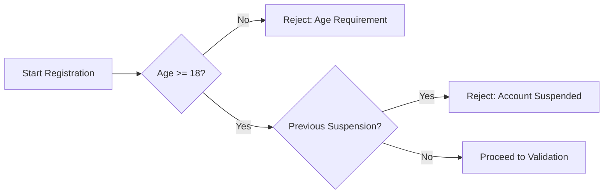
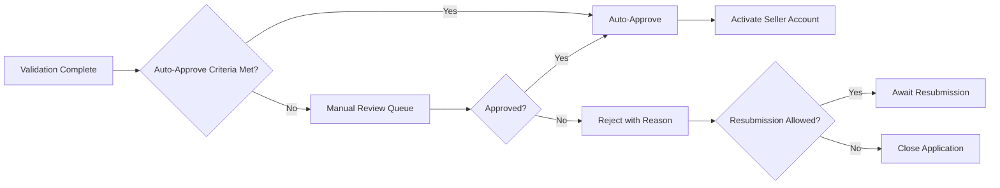
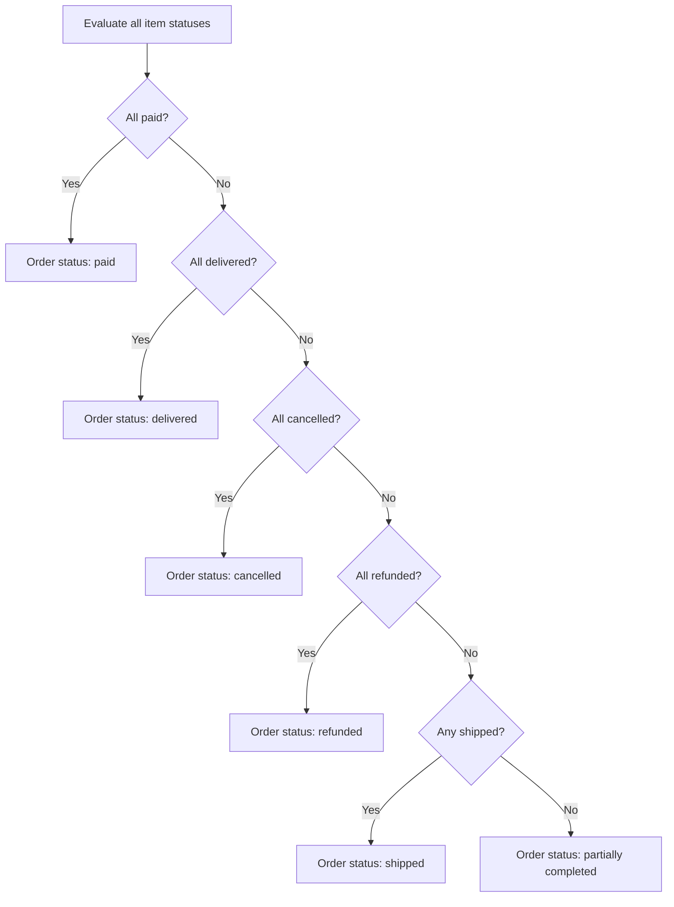

**ecommerceMall — Business rules, validation constraints, data browsing expectations, error scenarios**

Business rules, validation constraints, data browsing expectations, error scenarios

# Domain Business Rules

Per-concept business rules, validation logic, and domain constraints.

## Customer Rules

Customer registration requires a unique email address and a password for authentication. The platform enforces mandatory registration with no guest browsing allowed, meaning every visitor must authenticate before accessing any features. Password changes are permitted after successful login verification. Account deletion is allowed but preserves order history and reviews for legal and seller record purposes, with reviews displayed anonymously as "deleted user". Email addresses must be unique across the system and serve as the primary identifier for login credentials.

### Email Uniqueness Constraint

Each customer account must be associated with a unique email address that serves as the primary identifier for authentication.

The system shall reject any registration request where the provided email address is already registered to an existing customer account.

Email addresses cannot be shared across multiple customer accounts, ensuring one-to-one correspondence between email addresses and customer identities.

### Mandatory Registration Requirement

The platform requires mandatory registration for all users, with no guest browsing permitted.

The system shall restrict access to all platform features until the user has successfully authenticated as a registered customer.

Unauthenticated users attempting to access any feature shall be denied access and redirected to authenticate.

All product browsing, search functionality, wishlist, cart, and purchase operations require active customer authentication.

### Password-Based Authentication

Customer authentication relies on password-based verification tied to the registered email address.

The system shall authenticate customers upon presentation of a valid email and password combination.

During registration, customers must provide a password to secure their account.

Authenticated customers may change their password at any time by verifying their current credentials.

Password changes require immediate effect, invalidating any existing authenticated sessions at the system's discretion.

### Account Deletion Data Handling

When a customer chooses to delete their account, the system shall process the deletion according to the following rules:

**Profile Information Removal**
The system shall permanently delete all customer profile information including display name and phone number.

**Order History Preservation**
The system shall retain all order records and order history associated with the customer account for legal compliance and seller record purposes. Order details remain accessible to sellers and administrators.

**Review Handling**
The system shall preserve all reviews submitted by the customer. These reviews remain visible on product pages but are attributed to "deleted user" rather than the customer's identity.

**Cart and Wishlist Cleanup**
The system shall remove all items from the customer's shopping cart and wishlist upon account deletion.

### Registration and Authentication Error Scenarios

**Duplicate Email Error**
If a registration request specifies an email address already registered to an existing account, the system shall reject the registration and inform the user that the email is already in use.

**Invalid Credentials Error**
If a login attempt presents an email and password combination that does not match any registered account, the system shall reject the authentication request without distinguishing whether the email or password was incorrect.

**Deleted Account Error**
If authentication is attempted using credentials associated with a previously deleted account, the system shall reject the request and indicate that the account does not exist.

**Missing Required Fields Error**
If a registration request is submitted without a required email address or password, the system shall reject the request and indicate the missing required information.

**Banned Account Error**
If authentication is attempted for an account that has been banned by administrators, the system shall reject the request and indicate that the account has been suspended.

## CustomerProfile Rules

Each customer maintains exactly one profile containing a display name and phone number. The display name serves as the public identifier for the customer in reviews and other visible interactions. Both display name and phone number are editable after account creation. The profile information is deleted when the customer deletes their account, though associated order history remains preserved. Display names should be unique or allow duplicates based on platform policy. Phone numbers support contact purposes for order fulfillment and delivery coordination.

### Single Profile Per Customer

Each customer account maintains exactly one profile. The profile is created automatically when the customer completes registration. No customer can have multiple profiles, and no profile can exist without an associated customer account. The profile serves as the container for the customer's public-facing information and contact details. When a customer account is created, the profile is initialized with empty fields that the customer must subsequently populate.

### Display Name Requirements

The display name is a required field in the customer profile. The display name serves as the public identifier for the customer across the platform, particularly in review listings where the customer's identity is shown. The display name must be provided before the profile is considered complete. The display name may be shown alongside customer reviews and other public interactions on the platform. Changes to the display name are immediately reflected in new reviews, but existing reviews retain the display name that was current at the time of the review's creation.

### Phone Number Requirements

The phone number is a required field in the customer profile. The phone number serves as the primary contact method for order-related communications, delivery coordination, and customer service purposes. The phone number must be provided before the profile is considered complete. The phone number is used in conjunction with shipping addresses to facilitate delivery and is accessible to sellers only for the purpose of fulfilling orders placed by the customer.

### Editable Profile Fields

Customers may edit both their display name and phone number at any time after account creation. Both fields remain editable throughout the lifetime of the account. Profile edits take effect immediately upon saving. There is no restriction on the frequency of profile edits. When a customer modifies their profile, the new values replace the previous values without creating snapshots, as profile information is not subject to the snapshot principle that applies to transactional data. Customers can edit their profile through the account settings interface.

### Profile Deletion with Account

When a customer deletes their account, the customer profile is permanently deleted along with the account credentials. The deletion of the profile includes the removal of the display name and phone number from active records. However, order history and associated records are preserved for legal and business purposes. In preserved order records, the customer is identified as a deleted user rather than by their former display name. Reviews written by the customer remain visible but are attributed to a deleted user, maintaining the review content while anonymizing the author identity.

### Display Name Uniqueness

Display names must be unique across the platform. No two customers may share the same display name. When a customer attempts to set or change their display name, the system verifies that the requested name is not already in use by another customer. If the display name is already taken, the request is rejected and the customer must choose a different display name. This uniqueness constraint applies to all active accounts. When an account is deleted, its display name may become available for reuse by new or existing customers.

### Contact Information for Orders

The phone number in the customer profile serves as the default contact number for all orders placed by the customer. When a customer adds a shipping address, they may specify a different phone number for that specific address, which overrides the profile phone number for deliveries to that address. If no address-specific phone number is provided, the system uses the phone number from the customer profile. The phone number is communicated to sellers for the sole purpose of order fulfillment and is included in shipping information provided to delivery services. Sellers may use this contact information to coordinate delivery or resolve issues with the order.

## Seller Rules

Seller registration requires a unique email address and password, subject to administrator approval before selling privileges are granted. Sellers must view their current approval status which can be pending, approved, or rejected. Rejected sellers receive a rejection reason and may submit a new registration request. Account deletion is restricted when pending orders exist in paid or shipped status, or when pending cancellation or refund requests are active. Upon deletion, all products are removed from listings while order history and shop name references in past orders remain preserved for record integrity.

### Registration and Approval Rules

### Administrator Approval Requirement

Sellers must obtain administrator approval before they can list products or conduct any selling activities on the platform. The approval process begins automatically upon successful account creation. Until approval is granted, seller accounts remain in a pending state with no selling privileges.

### Approval Status Visibility

Sellers must be able to view their current approval status at any time. The status indicates whether the account is pending review, has been approved, or has been rejected. This visibility allows sellers to understand when they can begin selling or if additional action is required.

### Rejection Reason Display

When a seller registration is rejected, the specific reason for rejection must be displayed to the seller. The rejection reason provides actionable feedback that allows the seller to address issues before submitting a new registration request.

### Re-Registration After Rejection

Rejected sellers are permitted to submit a new registration request after addressing the issues identified in the rejection reason. There is no restriction on the number of registration attempts, but each submission requires administrator review and approval before selling privileges are granted.

### Account Deletion Restrictions

### Pending Orders Restriction

A seller cannot delete their account while any of their order items have a paid or shipped status. This restriction ensures that sellers remain accountable for fulfilling orders that customers have already paid for or that are in transit.

### Pending Cancellation Restriction

A seller cannot delete their account while any cancellation requests for their products are pending. This restriction ensures sellers remain available to respond to and process cancellation requests from customers.

### Pending Refund Restriction

A seller cannot delete their account while any refund requests for their products are pending. This restriction ensures sellers remain available to review and process refund requests from customers.

### Products Removal on Deletion

When a seller successfully deletes their account, all products belonging to that seller must be removed from search results and category listings. The products are no longer visible or purchasable by customers.

### Order History Preservation

When a seller deletes their account, their order history and all associated snapshots must be preserved. The shop name associated with past orders must remain visible to customers who purchased from that seller, maintaining the integrity of historical transaction records for legal and customer reference purposes.

### Deletion Blocking Error Scenarios

### Error: Pending Orders Exist

If a seller attempts to delete their account while they have order items with paid or shipped status, the deletion request is rejected. The seller must either fulfill these orders or wait until they are delivered before attempting deletion again.

### Error: Pending Cancellation Requests Exist

If a seller attempts to delete their account while cancellation requests are pending for any of their order items, the deletion request is rejected. The seller must respond to all pending cancellation requests before attempting deletion again.

### Error: Pending Refund Requests Exist

If a seller attempts to delete their account while refund requests are pending for any of their order items, the deletion request is rejected. The seller must respond to all pending refund requests before attempting deletion again.

## SellerProfile Rules

Each seller maintains exactly one profile containing shop name, shop description, and logo image. The shop name appears in product listings and order records. Every edit to the profile automatically creates a snapshot preserving the previous state for dispute resolution. The shop name in past orders remains preserved even after seller account deletion. Customers can view seller profiles to browse shop information. Profile snapshots are immutable and cannot be deleted, serving as an audit trail for all modifications.

### Profile Uniqueness Constraints

Each seller account maintains exactly one profile. A seller cannot create multiple profiles for the same account. The profile is created automatically when the seller account is approved. If a seller account is deleted, the profile is also removed, but snapshots of previous profile states remain preserved.

The profile cannot exist independently of a seller account. When a seller registration is pending or rejected, no profile exists yet. The profile is only established upon seller approval.

### Shop Name Requirements

The shop name is a required field in the seller profile. The shop name must be unique across all active seller profiles on the platform—no two sellers may share the same shop name simultaneously. The shop name appears in product listings, search results, and order records.

When a seller edits their shop name, the change takes effect immediately for future product listings and orders. Previous orders preserve the shop name that existed at the time of purchase through the order item snapshot mechanism. Deleted or suspended seller profiles do not release their shop names for reuse by other sellers if those profiles still have associated order history.

If a seller attempts to change their shop name to one already in use by another active seller, the request is rejected.

### Shop Description Field

The shop description is an optional field in the seller profile. Sellers may provide a description to inform customers about their shop, products, or policies. There is no minimum length requirement for the shop description.

The shop description is displayed on the seller's public profile page. Changes to the shop description take effect immediately upon saving.

### Logo Image Support

The logo image is an optional field in the seller profile. Sellers may upload a single image to represent their shop visually. The logo appears on the seller's profile page and alongside their shop name in product listings.

If no logo is uploaded, the system displays a default placeholder image. When a seller uploads a new logo image, the previous logo is replaced and the change is reflected immediately. The logo image at the time of each order purchase is preserved in the order item snapshot.

### Profile Snapshot Creation Rules

Every edit to the seller profile automatically creates a snapshot that preserves the complete previous state. Snapshot creation occurs whenever any of the following fields are modified: shop name, shop description, or logo image.

The snapshot records: the timestamp of the change, the identity of the seller who made the change, and the complete values of all profile fields before the modification. Each snapshot is immutable and cannot be altered or deleted after creation.

Single-field edits and multi-field edits both trigger exactly one snapshot capturing the state prior to all changes in that editing session. Snapshots serve as an audit trail for dispute resolution and preserve the historical state of seller information.

### Snapshot Immutability and Access

Profile snapshots are permanent records that cannot be modified or deleted by any user or administrator. Once created, a snapshot remains in the system indefinitely, even if the associated seller account is deleted.

The seller who owns the profile may view all snapshots of their own profile. Administrators may view snapshots of any seller profile on the platform. Customers cannot view profile snapshots—they only see the current profile state.

Snapshots are stored to preserve the exact state of the profile at specific points in time, including the shop name, description, and logo image as they existed at that moment.

### Order Preservation Rules

When an order item is created, a snapshot of the seller's profile at that moment is captured and stored with the order item. This snapshot preserves: the shop name, shop description, and logo image exactly as they appeared at the time of purchase.

The seller profile snapshot attached to an order item remains unchanged even if the seller later modifies their profile or deletes their account. This ensures that customers always see the seller information that was current when they made their purchase.

If a seller deletes their account, the shop name from the profile snapshot continues to appear in the customer's order history. The snapshot preserves the seller's identity for historical and legal purposes even after the seller is no longer active on the platform.

### Profile Visibility Rules

Seller profiles are publicly visible to all registered customers. Any customer may view a seller's profile page, which displays the current shop name, shop description, and logo image. Customers access seller profiles by clicking the shop name on product listings or order details.

Suspended seller accounts remain visible in the platform's records, but their products are hidden from search and category listings. The seller profile page for a suspended account remains accessible if the customer navigates to it directly through order history or existing links.

Deleted seller accounts no longer have active profiles, but their historical profile information remains accessible through order snapshots in customer order history.

### Error Scenarios

**Duplicate Shop Name**: If a seller attempts to save a profile with a shop name already in use by another active seller, the request is rejected.

**Missing Required Field**: If a seller attempts to save a profile without providing a shop name, the request is rejected.

**Non-Existent Profile Access**: If a customer attempts to view a seller profile for a seller that does not exist or has been deleted without any order history, the request is rejected.

**Pending Seller Access**: If a seller whose registration is still pending attempts to access or edit a profile, the request is rejected because the profile does not yet exist.

**Rejected Seller Access**: If a seller whose registration has been rejected attempts to access or edit a profile, the request is rejected because the profile does not yet exist.

## SellerRegistration Rules

Seller registration requests include a submission timestamp and track status through pending, approved, or rejected states. Administrators can view all pending requests and must provide a rejection reason when denying registration. Rejected sellers can submit new registration requests addressing previous concerns. The registration record maintains the original submission time and tracks when the request was reviewed. Only approved sellers gain product creation and selling privileges on the platform.

### Registration Eligibility Rules

#### Seller Registration Eligibility

BEFORE a seller account can be created, THE system SHALL verify the registrant meets eligibility requirements.

**Required Eligibility Criteria:**

- The registrant must be at least 18 years old
- The registrant must have a valid tax identification number
- The registrant must provide a verifiable business address
- The registrant must not have a previously suspended seller account

**Age Verification Rule:**
WHEN a user attempts to register as a seller, THE system SHALL validate that the provided date of birth indicates the user is at least 18 years old.

**Suspended Account Rule:**
IF the registrant's email address or business identification number matches a previously suspended seller account, THEN THE system SHALL reject the registration and notify the registrant of the suspension status.

#### Business Entity Requirements

WHERE the registrant represents a business entity, THE system SHALL require:
- Official business registration number
- Legal business name
- Business type classification (sole proprietorship, partnership, corporation)

WHERE the registrant is an individual seller, THE system SHALL require:
- Government-issued identification number
- Personal tax identification number

### Information Validation Rules

#### Required Information Validation

WHEN a seller registration is submitted, THE system SHALL validate all required information is provided.

**Mandatory Information Fields:**

| Field | Validation Rule | Error Condition |
|-------|-----------------|-----------------|
| Email address | Must be valid format and unique | IF invalid format or duplicate, THEN reject |
| Phone number | Must be valid international format | IF invalid format, THEN reject |
| Business name | Required, 2-100 characters | IF missing or outside length, THEN reject |
| Business address | Must include street, city, country | IF incomplete, THEN reject |
| Tax identification | Required, format varies by country | IF invalid format for country, THEN reject |

**Email Uniqueness Rule:**
IF the provided email address already exists in the system for another seller account, THEN THE system SHALL reject the registration with a message indicating the email is already in use.

**Phone Verification Rule:**
THE system SHALL require phone number verification via SMS code before completing registration.

IF the verification code is not entered within 30 minutes of request, THEN THE system SHALL require a new verification code to be sent.

**Address Validation Rule:**
THE system SHALL validate that the provided business address is deliverable using address verification services.

IF the address cannot be verified, THEN THE system SHALL prompt the registrant to confirm or correct the address.

#### Document Upload Requirements

WHERE business registration documents are required, THE system SHALL accept:
- Business license or registration certificate
- Tax registration certificate
- Bank account verification document

IF uploaded documents are illegible or expired, THEN THE system SHALL reject the upload and request clear, current documents.

### Duplicate Detection Rules

#### Business Identity Duplicate Prevention

THE system SHALL prevent duplicate seller registrations by detecting matching business identifiers.

**Detection Criteria:**

WHEN a registration is submitted, THE system SHALL check for existing accounts matching:
- Tax identification number
- Business registration number
- Business name and address combination

**Duplicate Handling Rules:**

IF the tax identification number matches an existing active seller account, THEN THE system SHALL reject the registration and suggest account recovery options.

IF the business registration number matches an existing pending registration, THEN THE system SHALL notify the registrant that an application is already in process and provide the application reference number.

IF the business name and address combination matches an existing account with 90% similarity, THEN THE system SHALL flag the registration for manual review.

#### Email and Phone Deduplication

THE system SHALL enforce unique email addresses and phone numbers across all seller accounts.

IF a registrant attempts to use an email already associated with a buyer account, THEN THE system SHALL allow the registration and link the existing email, subject to identity verification.

IF a phone number is already associated with another seller account, THEN THE system SHALL reject the registration unless the registrant can prove ownership of the phone number.

### Approval Workflow Rules

#### Registration Review and Approval

After validation is complete, THE system SHALL route the seller registration through an approval workflow.

**Automatic Approval Rules:**

THE system SHALL automatically approve registrations WHERE:
- All documents are valid and legible
- No duplicate business identifiers detected
- Address verification succeeds
- Phone verification is complete
- Registrant passes automated risk assessment

**Manual Review Requirements:**

IF any of the following conditions exist, THEN THE system SHALL route the registration to manual review:
- Business name contains restricted words (e.g., trademarked terms, prohibited categories)
- Address is in a high-risk region
- Documents require human verification
- Similar business name exists in the same geographic area
- Registrant has limited transaction history as a buyer

**Review Timeline Rule:**
WHILE a registration is under manual review, THE system SHALL provide the registrant with an estimated review timeframe.

IF manual review exceeds 5 business days, THEN THE system SHALL send a status update notification to the registrant.

**Decision Communication Rules:**

WHEN a registration is approved, THE system SHALL immediately notify the registrant and activate seller capabilities.

WHEN a registration is rejected, THE system SHALL notify the registrant with specific reasons for rejection and indicate whether resubmission is permitted.

IF rejection is due to documentation issues, THEN THE system SHALL allow resubmission with corrected documents within 30 days of initial rejection.

### Registration Data Retention Rules

#### Rejected Application Retention

THE system SHALL retain rejected seller registration data for fraud prevention purposes.

**Retention Periods:**

IF a registration is rejected due to fraud indicators, THEN THE system SHALL retain the application data for 7 years.

IF a registration is rejected for incomplete information, THEN THE system SHALL retain the data for 90 days to allow resubmission.

IF a registration is rejected for eligibility reasons, THEN THE system SHALL retain the data for 2 years.

**Data Purge Rules:**

WHEN the retention period expires, THE system SHALL automatically purge personal identification documents.

THE system SHALL maintain anonymized statistical data indefinitely for analysis purposes.

#### Approved Account Data

THE system SHALL retain all seller registration documentation for the lifetime of the seller account plus 7 years after account closure.

IF a seller account is suspended or terminated, THEN THE system SHALL retain registration data for 7 years beyond the termination date for legal and audit purposes.

## Administrator Rules

Administrators exist in two grades: regular administrator and super administrator. Super administrators can promote regular administrators to super status and demote other super administrators, but cannot demote themselves. Any user including customers and sellers can submit a request to become an administrator with a stated reason. Super administrators review pending promotion requests and approve or reject them. Approved users become regular administrators with platform oversight capabilities.

### Administrator Grade Structure

The administrator role exists in two distinct grades: regular administrator and super administrator. Regular administrators possess platform oversight capabilities including seller management, category management, product oversight, order oversight, and user management. Super administrators possess all regular administrator capabilities plus additional authority over administrator promotion and demotion. The grade assignment is determined at the time of promotion request approval, with all newly approved administrators beginning as regular administrators.

### Promotion and Demotion Authority

Super administrators have the exclusive authority to change the grade of other administrators. A super administrator can promote a regular administrator to super administrator status. A super administrator can also demote another super administrator to regular administrator status. These grade changes take effect immediately upon action by the super administrator. Only super administrators can modify administrator grades; regular administrators cannot promote or demote other administrators regardless of target grade.

### Self-Demotion Prevention

A super administrator cannot demote themselves to regular administrator status. This rule ensures that at least one super administrator always remains on the platform to maintain administrative hierarchy integrity. If a super administrator wishes to reduce their authority level, another super administrator must perform the demotion. The system prevents any action that would result in a super administrator removing their own super administrator status.

### Promotion Request Submission

Any registered user on the platform can submit a request to become an administrator. This includes customers, sellers, or users with no prior special status. The submission must include a reason explaining why the user seeks administrator privileges. (Request status states and review timestamps are defined in AdminPromotionRequest Rules in Module 1.)

### Super Administrator Review Authority

Only super administrators can review pending administrator promotion requests. Super administrators can view the complete list of pending requests along with the submitted reasons. When reviewing, a super administrator can approve the request, which grants the requester regular administrator status, or reject the request. Regular administrators cannot review or act upon administrator promotion requests regardless of their other oversight capabilities. (Detailed request states and response requirements are defined in AdminPromotionRequest Rules in Module 1.)

## AdminPromotionRequest Rules

Promotion requests include a text reason explaining the user's qualification for administrator privileges. Requests track status through pending, approved, or rejected states with a reviewed timestamp upon decision. Only super administrators can review and respond to pending promotion requests. Approved requests immediately grant regular administrator grade to the requesting user. The request record preserves the original reason and review outcome for audit purposes.

### Reason Text Requirement

Users submitting an administrator promotion request must provide a text explanation describing their qualifications, experience, or rationale for seeking administrator privileges.

The reason field is mandatory and cannot be left blank. The system rejects submissions without a provided reason, prompting the user to complete this field before the request can be recorded.

### Request Status Lifecycle

Each administrator promotion request progresses through one of three statuses during its lifecycle.

**Pending Status**
Newly submitted requests begin in pending status and remain in this state until reviewed by a super administrator.

**Approved Status**
When a super administrator approves the request, the status changes to approved.

**Rejected Status**
When a super administrator rejects the request, the status changes to rejected.

### Reviewed Timestamp

When a super administrator responds to a pending promotion request—either approving or rejecting it—the system records the exact timestamp of this review action.

The reviewed timestamp is set once at the moment of decision and remains immutable thereafter. This timestamp provides an audit trail showing when the promotion decision was made.

### Super Administrator Exclusive Review Authority

Only users holding super administrator grade may view pending administrator promotion requests and take action on them.

Regular administrators cannot access the list of pending promotion requests, cannot view the details of submitted requests, and cannot approve or reject any request.

If a regular administrator attempts to access promotion request review functions, the request is denied.

### Immediate Grade Assignment on Approval

When a super administrator approves a promotion request, the requesting user is immediately granted regular administrator grade.

The grade assignment takes effect at the moment of approval, without delay or additional verification steps. The user gains all permissions and access rights associated with regular administrator status upon this assignment.

The promotion request record remains in the system with approved status to preserve the audit trail of the grade change.

## Category Rules

Categories organize products hierarchically with exactly one level of subcategory nesting allowed. Each category contains a name and description for customer browsing. Only administrators can create, edit, or delete categories. Products assigned to deleted categories become uncategorized but remain in the system. Category deletion does not cascade to product deletion. Customers can browse the complete category list and view products within each category. Subcategories maintain a parent-child relationship with their parent category.

### Category Hierarchy Constraints

The category system supports a maximum of one level of nesting. A category may be designated as a parent category, and any category with a parent is considered a subcategory.

A category may have zero or more subcategories assigned to it. A subcategory must reference exactly one parent category. Subcategories cannot have their own subcategories—the nesting depth is strictly limited to one level.

A category designated as a parent may contain products directly, or its subcategories may contain products, or both. There is no restriction preventing products from being assigned to a parent category that also has subcategories.

When a parent category is deleted, all of its subcategories become uncategorized. The subcategories themselves are not deleted, but their parent relationship is removed.

### Category Field Requirements

Each category must have a name. The name is used for display purposes in navigation menus, category listings, and product organization interfaces.

Each category must have a description. The description provides additional context about what types of products belong in that category and is displayed to customers browsing the category.

The name and description are required fields when creating a category. Editing a category allows modification of both the name and description.

### Category Management Permissions

Only administrators have permission to create new categories. Customers and sellers cannot create categories.

Only administrators have permission to edit existing categories. This includes modifying the name, description, or parent category assignment.

Only administrators have permission to delete categories. Customers and sellers cannot delete categories.

Administrators can view all categories including those with no products assigned.

### Category Deletion Rules

When a category is deleted, products that were assigned to that category become uncategorized. The products themselves remain in the system with all their data intact.

Category deletion does not trigger deletion of any products. Product deletion is a separate operation that must be performed explicitly.

When a category with subcategories is deleted, those subcategories remain in the system but lose their parent assignment. The subcategories themselves are not deleted, but they become top-level categories without a parent.

Deleting a subcategory (a category that has a parent) does not affect its parent category. The parent category continues to exist and may have other subcategories or products assigned to it.

### Category Browsing Access

All customers can view the complete list of categories available on the platform. This includes both parent categories and subcategories.

Customers can view products within any category by selecting that category. When viewing a parent category, customers may see products assigned directly to that parent as well as products assigned to its subcategories, depending on implementation.

Category browsing does not require authentication. However, the platform requires registration to use any features, so in practice only authenticated customers browse categories.

The category list is displayed in a hierarchical format showing parent categories and their associated subcategories.

### Category Validation and Error Scenarios

If an attempt is made to create a subcategory of a subcategory (nesting deeper than one level), the request is rejected.

If a category name is not provided when creating a category, the request is rejected.

If a category description is not provided when creating a category, the request is rejected.

If a non-administrator attempts to create, edit, or delete a category, the request is rejected.

If an attempt is made to assign a parent category that does not exist, the request is rejected.

If an attempt is made to delete a category that does not exist, the request is rejected.

If an attempt is made to edit a category that does not exist, the request is rejected.

## Product Rules

Products require a name, description, category selection, and base price at minimum. Products must belong to exactly one seller who created them. Category selection can include subcategories. Products without any variants are visible in search but marked as unavailable for purchase. Deletion requires no pending order items in paid or shipped status and no pending cancellation or refund requests for any variant. Every edit creates a snapshot preserving the complete previous state including all fields and variant information. Deleted products disappear from search and category listings but snapshots remain preserved.

### Product Field Validation

Every product must have a name provided during creation. The name cannot be empty.

Every product must have a description provided during creation. The description cannot be empty.

Every product must be assigned to exactly one category during creation. The category selection can be a main category or a subcategory.

Every product must have a base price specified during creation. The base price must be a positive number greater than zero.

If any required field is missing or invalid during product creation, the request is rejected.

If the selected category does not exist, the request is rejected.

### Seller Ownership Constraint

Every product must be owned by exactly one seller who created it. The seller ownership cannot be transferred to another seller.

Only the owning seller can edit, delete, or manage the product. Other sellers cannot access or modify products they do not own.

Administrators can view any product for oversight purposes but cannot modify product ownership.

### Product Availability Based on Variants

A product must have at least one variant to be purchasable. Products without any variants are visible in search results and category listings but are shown as unavailable for purchase.

When a customer views a product with no variants, they cannot add it to cart. The product detail page displays an unavailable status indicating the product cannot be purchased.

Sellers can create products without variants initially and add variants later to make the product available for purchase.

### Product Deletion Constraints

A product can only be deleted if all of its variants satisfy the deletion conditions.

A product cannot be deleted if any variant has pending order items with status "paid" or "shipped". Pending order items indicate active transactions that must be completed before the product can be removed.

A product cannot be deleted if any variant has pending cancellation requests awaiting seller response.

A product cannot be deleted if any variant has pending refund requests awaiting seller response.

If any of these conditions exist for any variant of the product, the deletion request is rejected. The seller must resolve all pending transactions, cancellations, and refunds before attempting deletion again.

### Snapshot Creation on Edit

Every time a product is edited, a snapshot is automatically created to preserve the complete previous state. This snapshot captures all product fields including name, description, category, base price, and all associated images.

The snapshot also includes snapshots of all product variants at that moment, capturing each variant's SKU code, option values, price, and stock quantity.

Snapshots record when the change was made, what fields were changed, and the values before and after the modification.

Snapshots are immutable and cannot be modified or deleted. They remain preserved even after the product is deleted.

Snapshots can be viewed by the owning seller and administrators for dispute resolution and audit purposes.

### Deletion Effect on Listings

When a product is deleted, it is immediately removed from all search results and category listings. Deleted products no longer appear in product browsing pages.

The product detail page becomes inaccessible to customers browsing the platform.

If a deleted product exists in customer wishlists, it is automatically removed from those wishlists.

If a deleted product's variants exist in customer shopping carts, those cart items are marked as unavailable.

Order items that reference the deleted product remain intact in order histories. The product snapshots saved with those order items preserve the product information at the time of purchase.

### Product Editing Error Conditions

If a seller attempts to edit a product they do not own, the request is rejected.

If a seller attempts to assign a non-existent category to a product, the request is rejected.

If a seller attempts to set a negative or zero base price, the request is rejected.

If a suspended seller attempts to edit their product, the request is rejected. Suspended sellers cannot modify product information even for their own products.

### Product Deletion Error Conditions

If a seller attempts to delete a product they do not own, the request is rejected.

If a seller attempts to delete a product that has pending order items in "paid" or "shipped" status, the request is rejected.

If a seller attempts to delete a product that has pending cancellation requests for any variant, the request is rejected.

If a seller attempts to delete a product that has pending refund requests for any variant, the request is rejected.

If a suspended seller attempts to delete their product, the request is rejected.

## ProductVariant Rules

Each variant represents a unique combination of option values such as color and size. Variants require a unique SKU code across the platform, option value specifications, and starting stock quantity of zero. Price can override the base price or inherit it when not specified. Stock quantity is required and defaults to zero. Deletion requires no pending order items in paid or shipped status and no pending cancellation or refund requests. Every edit creates a snapshot preserving previous SKU code, option values, and price. A product must have at least one variant to be purchasable.

### SKU Code Uniqueness

Each product variant must have a unique SKU code across the entire platform. The SKU code serves as a unique identifier for inventory tracking and order fulfillment. No two variants may share the same SKU code, regardless of which seller created them or which product they belong to. If a seller attempts to create or update a variant with a SKU code that already exists, the request is rejected.

**Error Conditions**
- If the SKU code is already in use by another variant, the request is rejected.
- If the SKU code is missing or empty, the request is rejected.

### Option Values Specification

Each variant represents a specific combination of product options such as color, size, material, or other configurable attributes. Option values must be explicitly specified for each variant to distinguish it from other variants of the same product. The combination of option values within a product must be unique—no two variants of the same product may have identical option value combinations.

**Error Conditions**
- If a variant is created with option value combinations that already exist for another variant of the same product, the request is rejected.
- If required option values are missing, the request is rejected.

### Price Override Capability

Each variant may have its own price that overrides the product's base price. When a variant-specific price is provided, it takes precedence over the base price for that variant. When no variant-specific price is provided, the variant inherits the product's base price. This allows sellers to charge different prices for different configurations of the same product.

**Business Rules**
- If a variant price is specified, it must be used instead of the base price.
- If no variant price is specified, the base price is used.
- Variant prices may be higher or lower than the base price.

### Initial Stock Configuration

Every newly created variant starts with a stock quantity of zero. Sellers must explicitly add inventory through the inventory management system before the variant becomes available for purchase. This ensures that stock quantities are intentionally set and tracked through proper inventory records.

**Business Rules**
- New variants are created with zero stock quantity.
- Variants with zero stock are displayed as out of stock.
- Out of stock variants cannot be added to the shopping cart.

### Deletion Constraints

A variant can only be deleted when there are no pending transactions that would be disrupted by its removal. Specifically, deletion is prohibited when there are order items in paid or shipped status, or when there are pending cancellation or refund requests associated with the variant.

**Business Rules**
- A variant cannot be deleted if any order items for that variant have status paid.
- A variant cannot be deleted if any order items for that variant have status shipped.
- A variant cannot be deleted if there are pending cancellation requests for order items of that variant.
- A variant cannot be deleted if there are pending refund requests for order items of that variant.

**Error Conditions**
- If any order items for the variant are in paid status, the deletion request is rejected.
- If any order items for the variant are in shipped status, the deletion request is rejected.
- If there are pending cancellation requests for the variant, the deletion request is rejected.
- If there are pending refund requests for the variant, the deletion request is rejected.

### Snapshot Creation on Edit

Every edit to a variant creates a snapshot that preserves the previous state. Snapshots record the complete set of variant attributes including SKU code, option values, and price at the moment before the change. Snapshots are immutable and serve as an audit trail for dispute resolution.

**Business Rules**
- Any modification to SKU code triggers snapshot creation.
- Any modification to option values triggers snapshot creation.
- Any modification to price triggers snapshot creation.
- Snapshots include all variant fields at the time of the change.
- Snapshots cannot be modified or deleted.
- Snapshots remain preserved even if the variant is later deleted.

### Minimum Variant Requirement for Purchase

A product must have at least one variant to be purchasable. Products with no variants are visible in search results and category listings but are shown as unavailable for purchase. Customers cannot add products without variants to their cart or complete checkout for such products.

**Business Rules**
- Products with zero variants cannot be purchased.
- Products with zero variants display an unavailable status to customers.
- Search and category listings include products without variants but indicate they are unavailable.

## ProductImage Rules

Products support multiple images with sort order determining display sequence. The first image serves as the main thumbnail in product listings. Images can be reordered to change which appears first. Sellers can delete individual images from their products. Image additions, deletions, and reordering are included in product snapshots. Changes to images trigger snapshot creation alongside other product modifications. The main thumbnail appears in search results and category listings.

### Image Count and Storage Constraints

### Multiple Images Support
A product may have zero or more images associated with it. There is no upper limit defined for the number of images per product.

### Minimum Image Requirement
A product can exist without any images. Products without images display a placeholder or default image in listings and detail pages.

### Product Visibility
Products are visible in search results and category listings regardless of whether they have images. The absence of images does not prevent a product from being listed or purchased.

### Sort Order and Thumbnail Rules

### Sort Order Determination
Each product image has a sort order value that determines its position in the display sequence. Sort order values are sequential integers starting from 1.

### First Image as Thumbnail
The image with sort order 1 serves as the main thumbnail for the product. This thumbnail appears in product listings, search results, and category browsing pages.

### Thumbnail Display Locations
The main thumbnail appears in:
- Search result listings
- Category product listings
- Wishlist displays
- Cart item summaries
- Order item summaries
- Related product recommendations

### Image Sequence Display
On the product detail page, images are displayed in ascending sort order. The first image (sort order 1) is shown as the primary image, with subsequent images available for viewing.

### Image Reordering Rules

### Reordering Capability
Sellers can change the sort order of images to modify which image appears first and the sequence of additional images.

### Reordering Constraints
When reordering images:
- Sort orders must remain sequential without gaps
- Each image must have a unique sort order within the product
- The reordering operation can affect one or multiple images simultaneously

### Thumbnail Change on Reorder
When the image at sort order 1 is changed (either by moving another image to position 1 or moving the current first image to a different position), the thumbnail for the product changes immediately to reflect the new first image.

### Individual Image Deletion Rules

### Deletion Authorization
Only the seller who owns the product can delete images from that product. Administrators can delete images from any product.

### Deletion Constraints
When an image is deleted:
- The sort orders of remaining images are automatically adjusted to maintain sequential ordering
- If the deleted image was at sort order 1 (the thumbnail), the next image in sequence becomes the new thumbnail
- If the deleted image was the only image, the product displays without a thumbnail

### Deletion Timing
Images can be deleted at any time regardless of the product's status or existing orders. There are no restrictions on deleting images based on order status or inventory state.

### Image Changes in Snapshots

### Snapshot Inclusion
All image-related changes are included in product snapshots. When a snapshot is created for a product, the current state of all associated images is preserved.

### Image Data in Snapshots
Each product snapshot includes:
- The complete list of images present at the time of the snapshot
- The sort order of each image
- The image file reference or identifier
- The timestamp when the image was added

### Snapshot Triggers
A product snapshot is created when any of the following image operations occur:
- A new image is added to the product
- An existing image is deleted from the product
- The sort order of images is modified
- Images are reordered

### Historical Image State
Snapshots preserve the exact image state at the time of each product modification. This allows viewing what images were associated with a product at any historical point in time, even if those images have since been deleted or reordered.

### Image Validation Rules

### File Format Requirements
Uploaded images must be in supported image formats. Unsupported file types are rejected.

### File Size Limits
Each uploaded image must not exceed the maximum file size limit. Oversized files are rejected.

### Image Content Validation
Uploaded files must be valid image files. Corrupted or non-image files uploaded with image extensions are rejected.

### Duplicate Prevention
The system prevents the same image file from being uploaded multiple times for the same product. Attempts to upload duplicate images are rejected.

### Image Error Scenarios

### Upload Failures
If an image upload fails due to network interruption, file corruption, or storage issues, the upload is rejected and the seller must retry.

### Invalid File Type
If a seller attempts to upload a file that is not a supported image format, the upload is rejected with an indication of supported formats.

### File Too Large
If an uploaded image exceeds the maximum file size limit, the upload is rejected with information about the size limit.

### Reordering Validation Errors
If a reordering operation results in invalid sort order values (duplicate positions, gaps, or non-sequential numbering), the operation is rejected.

### Deletion of Non-Existent Image
If a seller attempts to delete an image that does not exist or has already been deleted, the request is rejected.

### Unauthorized Deletion Attempt
If a user who does not own the product (and is not an administrator) attempts to delete an image, the request is rejected.

## InventoryRecord Rules

Inventory records track quantity changes with positive values for restocking and negative values for orders or adjustments. Each record requires a quantity change amount, reason text, and automatic timestamp. Current stock calculates as the sum of all inventory records for a variant. Sellers manually add inventory for restocking with quantity and reason. Sellers manually subtract inventory for adjustments or losses with quantity and reason. Order placement automatically creates negative inventory records. Order cancellation or refund automatically creates positive inventory records restoring stock.

### Inventory Record Creation Rules

**Positive Quantity for Restocking**
When sellers manually add inventory to restock a product variant, the quantity change must be a positive number representing the amount added to stock.

**Negative Quantity for Orders and Adjustments**
When inventory is deducted due to order placement, manual adjustment, or loss reporting, the quantity change must be a negative number representing the amount removed from stock.

**Reason Text Requirement**
Every inventory record must include a reason text that explains why the quantity change occurred. Manual entries require the seller to provide a reason. Automatic entries (order placement, cancellation, refund) include a system-generated reason indicating the source transaction.

**Automatic Timestamp**
Each inventory record is automatically assigned a timestamp indicating when the record was created. This timestamp is system-generated and cannot be modified.

### Stock Calculation Rules

**Sum Calculation for Current Stock**
The current stock quantity for a product variant is calculated by summing all quantity changes from every inventory record associated with that variant. This sum includes positive values from restocking, cancellations, and refunds, and negative values from orders and adjustments.

**Stock Display Thresholds**
When the calculated sum of all inventory records for a variant equals or falls below zero, the variant is displayed as "out of stock". Variants with positive calculated sums are displayed as "in stock" with the specific quantity shown.

### Manual Inventory Entry Rules

**Manual Restocking Entry**
Sellers can create inventory records to add stock to a variant. When restocking, sellers must specify the quantity being added (as a positive number) and provide a reason describing the source of the new stock (e.g., "new shipment received", "manufacturing completed").

**Manual Adjustment Entry**
Sellers can create inventory records to remove stock for reasons other than sales. When adjusting inventory downward, sellers must specify the quantity being removed (as a negative number) and provide a reason describing why the adjustment is necessary (e.g., "damaged in warehouse", "inventory count correction", "expired items").

**Validation Constraints**
- The quantity change must not be zero
- The reason text must not be empty
- Sellers can only create inventory records for variants belonging to their own products

### Automatic Inventory Adjustments

**Automatic Order Placement Deduction**
When a customer successfully places an order and payment is confirmed, the system automatically creates an inventory record for each purchased variant. The quantity change is negative, equal to the quantity purchased, with a system-generated reason indicating the associated order.

**Automatic Cancellation Restoration**
When a cancellation request for an order item is approved, the system automatically creates an inventory record for that variant. The quantity change is positive, equal to the cancelled quantity, with a system-generated reason indicating the associated cancellation. This restoration increases the available stock by the cancelled amount.

**Automatic Refund Restoration**
When a refund request for an order item is approved, the system automatically creates an inventory record for that variant. The quantity change is positive, equal to the refunded quantity, with a system-generated reason indicating the associated refund. This restoration increases the available stock by the refunded amount.

### Inventory Record Error Scenarios

**Invalid Quantity Values**
If a seller attempts to create an inventory record with a quantity change of zero, the request is rejected because zero-value changes do not affect stock calculation.

**Missing Reason Text**
If a seller attempts to create a manual inventory record without providing a reason, the request is rejected because the reason field is required for audit purposes.

**Insufficient Stock for Display**
If a seller attempts to manually subtract more inventory than the calculated current stock (resulting in a negative sum), the system accepts the record but marks the variant as out of stock. The inventory history preserves the record of the adjustment even when stock becomes negative.

**Unauthorized Variant Access**
If a seller attempts to create an inventory record for a variant that does not belong to their own product, the request is rejected.

**Viewing Unauthorized History**
If a seller attempts to view the inventory history of a variant they do not own, the request is rejected. Only the seller who owns the product can view its variant inventory records.

## WishlistItem Rules

Wishlist items reference products rather than specific variants. Customers can add products to their wishlist for future consideration. The wishlist displays products with pagination for browsing. When a seller deletes a product, it automatically removes from all customer wishlists. Wishlist items track when the product was added. Customers can remove individual items from their wishlist. Products remain in wishlists regardless of stock availability or variant status.

### Product-Level Association

Wishlist items reference products rather than specific product variants.

### Product vs Variant Association
When a customer adds an item to their wishlist, they add the entire product, not a specific variant. The wishlist displays the product with all its available variants when viewed. This allows customers to track products of interest without committing to a specific size, color, or other variant option at the time of adding.

### Implications for Display
The wishlist shows the product name, main image, base price or price range, and seller information. Variant-specific details such as individual stock levels or variant-specific pricing are displayed contextually when viewing the wishlist, but the wishlist entry itself is tied to the product entity.

### Business Rule
A customer can have only one wishlist entry per product. Adding the same product again does not create a duplicate entry; the existing wishlist entry remains unchanged.

### Automatic Removal on Product Deletion

Wishlist entries are automatically removed when the referenced product is deleted.

### Deletion Cascade Rule
When a seller deletes a product from their catalog, the system automatically removes that product from all customer wishlists. This ensures that customers do not maintain references to products that no longer exist in the marketplace.

### No Notification Requirement
The removal occurs silently without requiring customer confirmation or notification. The product simply disappears from the customer's wishlist view on their next access.

### Preservation During Suspension
If a seller account is suspended, their products are hidden from search and category listings but remain in customer wishlists. Only permanent product deletion triggers automatic removal from wishlists.

### Wishlist Pagination Configuration

Customer wishlists support pagination for browsing large collections.

### Pagination Requirements
When a customer views their wishlist, the results are paginated to ensure manageable page load times and readable presentation. The system supports navigating through multiple pages of wishlist items.

### Sorting Behavior
Wishlist items are sorted by the time they were added, with the most recently added items appearing first by default. This allows customers to quickly see their newest interests.

### Empty State Handling
When a customer has no items in their wishlist, the system displays an empty state message rather than pagination controls.

### Addition Timestamp Tracking

Each wishlist entry records when the product was added.

### Timestamp Purpose
The system tracks the date and time when a customer adds a product to their wishlist. This timestamp serves as the basis for default sorting (newest first) and provides customers with temporal context for their saved items.

### Immutability of Addition Time
Once recorded, the addition timestamp for a wishlist entry does not change. The timestamp represents the original moment of interest, not the most recent view or interaction with the wishlist entry.

### Display Consideration
The addition timestamp may be displayed to the customer to help them remember when they saved each product, particularly useful for time-sensitive purchasing decisions or tracking how long an item has been in their wishlist.

### Manual Removal Capability

Customers can manually remove individual products from their wishlist.

### Removal Authorization
Only the customer who owns the wishlist can remove items from it. No other actors, including administrators or sellers, can modify a customer's wishlist contents directly (except through product deletion as described in the automatic removal rule).

### Removal Action
When a customer removes an item from their wishlist, the entry is immediately deleted. This action does not require confirmation if the customer initiates the removal through the designated removal control.

### Removal Scope
Removing a product from the wishlist affects only that customer's wishlist. Other customers who have the same product in their wishlists retain their entries unaffected.

### Stock Status Independence

Products remain in wishlists regardless of stock availability.

### Stock Status Rule
A product remains in a customer's wishlist even if all its variants are out of stock. The wishlist serves as a persistent interest list, not a cart or reservation system. Stock levels do not affect wishlist membership.

### Variant Status Rule
Similarly, wishlist entries persist regardless of individual variant availability. If specific variants become unavailable while others remain in stock, the product stays in the wishlist with visibility into which variants are currently purchasable.

### Seller Status Independence
Products remain in wishlists even if the seller is temporarily suspended. However, as noted in the automatic removal rule, permanent product deletion does remove the item from wishlists.

### Error Scenarios for Wishlist Operations

The following error conditions apply to wishlist operations.

### Duplicate Addition Prevention
If a customer attempts to add a product that is already in their wishlist, the request is processed as a no-operation. The existing wishlist entry remains unchanged, and no error is presented to the customer.

### Invalid Product Reference
If a customer attempts to add a product that does not exist or has been deleted, the request is rejected. The customer is informed that the product is unavailable.

### Authentication Requirement
Unauthenticated users cannot add items to a wishlist. If an unauthenticated user attempts to add a product, they are directed to authenticate first. There is no guest wishlist functionality.

### Removal of Non-Existent Entry
If a customer attempts to remove a wishlist entry that does not exist or has already been removed, the request is processed silently with no error presented.

## CartItem Rules

Cart items reference specific variants with selected quantity. Adding the same variant combines quantities rather than creating separate lines. Quantity changes are permitted while the item remains in the cart. Stock warnings appear when cart quantity exceeds available inventory. Deleted or out-of-stock variants display as unavailable in the cart. Unavailable items cannot proceed to checkout. Cart displays subtotal per item and total for all items combined. Items can be removed individually from the cart.

### Variant Selection

Customers must select a specific variant when adding an item to their cart. A variant represents a combination of options such as color and size. Items in the cart always reference a specific variant, not just a product in general. The cart displays the product name along with the selected variant options for each item.

### Quantity Combination

When a customer adds a variant to their cart that is already present, the quantities are combined into a single line item rather than creating separate entries. For example, if a customer adds two units of a variant and later adds three more of the same variant, the cart shows one item with a quantity of five. This combination happens automatically upon addition.

### Quantity Modification

Customers may change the quantity of any item in their cart while the item remains in the cart. The quantity can be increased or decreased to any positive whole number. When the quantity is reduced to zero, the item is removed from the cart. Quantity changes are permitted at any time before checkout begins.

### Stock Warning

When the quantity of a variant in the cart exceeds the available stock for that variant, a warning is displayed to the customer. The warning indicates that the desired quantity is not currently available. This warning appears on the cart page and remains visible until the customer reduces the quantity or stock is replenished.

### Unavailable Marking

Items in the cart are marked as unavailable in two circumstances. First, if the variant has been deleted by the seller, the item is marked as unavailable. Second, if the variant's stock quantity has reached zero, the item is marked as unavailable. Unavailable items remain visible in the cart for customer awareness but are clearly distinguished from available items. Unavailable items cannot be selected for checkout.

### Checkout Blocking

The checkout process cannot proceed while any item in the cart is marked as unavailable. Customers must either remove unavailable items or reduce quantities to match available stock before proceeding to checkout. The system prevents order placement when unavailable items are present in the cart.

### Price Display

The cart displays pricing information at two levels. Each item shows a subtotal calculated as the item price multiplied by the quantity. The cart also displays a total price representing the sum of all item subtotals. Prices reflect the current variant price at the time of viewing the cart.

### Item Removal

Customers may remove individual items from their cart at any time. Removal eliminates the item entirely regardless of quantity. Removed items cannot be recovered and must be added again if desired. Removal is permanent and takes effect immediately upon confirmation.

## Order Rules

Orders contain one or more order items which may be from different sellers. Each order receives a unique order number for reference. The total price aggregates all order item prices. Overall order status derives from individual item statuses: all paid means order paid, any shipped means order shipped, all delivered means order delivered, all cancelled means order cancelled, all refunded means order refunded, mixed states mean partially completed. Payment failure prevents order creation and allows retry. Successful payment creates the order and clears cart items.

### Order Composition Rules

An order must contain at least one order item to be valid. An order may contain multiple order items representing different products or variants purchased by the customer.

Order items within a single order may originate from different sellers. There is no restriction requiring all items in an order to come from the same seller.

When multiple order items from the same seller exist within an order, those items may be grouped into a single shipment or shipped separately at the seller's discretion.

When order items from different sellers exist within the same order, each seller must create separate shipments for their respective items. Different sellers cannot combine items into a shared shipment.

The order maintains a reference to the customer who placed it. All order items within the order are associated with this same customer.

### Order Number Rules

Every order must be assigned a unique order number at the time of successful creation. The order number serves as the primary reference identifier for customers, sellers, and administrators to locate and discuss specific orders.

The system must ensure that no two orders share the same order number. The order number must remain unchanged throughout the entire lifecycle of the order.

Order numbers must be displayed in order lists, order detail views, and all communications related to the order. Customers can search for or reference their orders using this number.

### Order Pricing Rules

The total price of an order is calculated as the sum of the prices of all order items included in that order. Each order item price represents the unit price at the time of purchase multiplied by the quantity purchased.

The order total must be calculated and recorded at the time of order creation. This recorded total serves as the authoritative price for the order regardless of subsequent changes to product prices in the catalog.

Any refunds or partial cancellations adjust the effective amount paid but do not modify the original order total. The original total price is preserved for record-keeping purposes.

### Order Status Derivation Rules

The overall status of an order is automatically derived from the individual statuses of its constituent order items. The system determines the order status by evaluating the collective state of all items according to the following rules:

**All Items Paid**: When every order item within the order has status "paid", the order status is "paid".

**Any Item Shipped**: When at least one order item has status "shipped" and no items have status "delivered", the order status is "shipped".

**All Items Delivered**: When every order item within the order has status "delivered", the order status is "delivered".

**All Items Cancelled**: When every order item within the order has status "cancelled", the order status is "cancelled".

**All Items Refunded**: When every order item within the order has status "refunded", the order status is "refunded".

**Mixed or Partial States**: When order items have a combination of different terminal statuses (for example, some delivered and some refunded, or some delivered and some cancelled), the order status is "partially completed".

The following diagram illustrates the status derivation logic:

The order status is recalculated automatically whenever any order item changes status. The derived status is read-only and cannot be directly modified independent of the underlying item statuses.

### Payment and Order Creation Rules

An order is only created when payment is successfully processed. If payment fails or is declined by the external payment gateway, no order record is created.

When payment fails, the customer is notified of the failure and given the opportunity to retry the payment process. The cart contents are preserved so the customer may attempt checkout again without re-selecting items.

The system must validate that all items in the cart remain available (in stock and not deleted) before attempting payment processing. If any item becomes unavailable between cart addition and checkout initiation, the checkout process is blocked until the customer resolves the issue.

Upon successful payment, the order is created atomically with all its order items, the order number is assigned, and the corresponding cart items are removed from the customer's cart. Stock quantities are decreased for each purchased variant through inventory records.

### Order Validation and Error Scenarios

**Payment Failure**: If the external payment gateway returns a failure response, the order is not created. The customer receives notification of the payment failure and may retry.

**Insufficient Stock at Checkout**: If any variant in the cart has insufficient stock to fulfill the requested quantity at the time of checkout, the checkout process is blocked. The customer must adjust quantities or remove unavailable items before proceeding.

**Deleted Product or Variant at Checkout**: If a product or variant in the cart has been deleted by the seller at the time of checkout, the checkout process is blocked. The customer must remove the unavailable item from their cart before proceeding.

**Empty Cart**: If the customer attempts to checkout with an empty cart, the request is rejected. The customer must add items to their cart before checking out.

**Missing Shipping Address**: If the customer has not selected or provided a shipping address at the time of checkout, the order cannot be placed. The customer must select or create a shipping address before confirming the order.

**Unavailable Items in Cart**: If any item in the cart is marked as unavailable due to stock depletion or deletion during the checkout process, the order placement is rejected until the customer updates their cart.

**Seller Account Suspended**: If a seller associated with items in the cart has been suspended by an administrator, the items remain in the cart but cannot be purchased. The checkout process is blocked until the customer removes items from suspended sellers.

## OrderItem Rules

Order items represent purchased variants with quantity and price at time of purchase. Price at purchase preserves the variant price regardless of subsequent product changes. Multiple quantities of the same variant consolidate into a single order item. Each order item maintains independent status: paid, shipped, delivered, cancelled, or refunded. Items can be individually cancelled or refunded without affecting other items in the same order. Snapshots preserve product name, description, variant options, and seller profile at purchase time.

### Order Item Structure and Consolidation

Each order item represents a specific product variant purchased by a customer with a specific quantity.

When a customer adds multiple quantities of the same variant to their cart and proceeds to checkout, those quantities consolidate into a single order item rather than creating multiple separate line items. For example, if a customer adds 2 units of the same "Red / Large" variant to their cart, this becomes one order item with quantity 2, not two order items each with quantity 1.

Each order item independently tracks which variant was purchased and the quantity of that variant included in the purchase. The quantity must be a positive whole number representing the count of units purchased.

An order can contain multiple order items from different sellers, with each order item representing a distinct seller's product variant. Items from different sellers never merge into a single order item even if they represent the same underlying product type.

### Price at Purchase Preservation

When an order item is created upon successful payment, the system preserves the exact price of the variant at that moment in time. This price at purchase remains immutable and does not change even if the seller subsequently modifies the product's base price or the variant's override price.

The price at purchase represents the amount the customer actually paid per unit of the variant. The total value of the order item is calculated by multiplying this preserved unit price by the quantity purchased.

If a customer purchased a variant at a price that was later changed by the seller, any future calculations, refunds, or disputes reference the original price at purchase, not the current variant price. This preservation ensures accurate financial records and prevents discrepancies between what the customer paid and what the system records.

### Order Item Status States

Each order item maintains an independent status that represents its current state in the fulfillment lifecycle. The status of each item is tracked separately from other items in the same order, allowing different items to be at different stages simultaneously.

**Paid Status**
An order item begins in "paid" status immediately after successful payment and order creation. This status indicates that the seller has received payment and is responsible for shipping the item. Items remain in paid status until the seller creates a shipment that includes the item.

**Shipped Status**
When a seller includes an order item in a shipment and provides tracking information, the item transitions to "shipped" status. This status indicates the item has left the seller's possession and is in transit to the customer. All items within the same shipment share the same tracking information and transition to shipped status simultaneously when the shipment is created.

**Delivered Status**
An order item transitions to "delivered" status when the customer confirms receipt of the shipment containing the item, or when the automatic delivery confirmation period (14 days from shipping) expires. This status indicates the customer has received the item and the transaction is complete from a fulfillment perspective.

**Cancelled Status**
An order item transitions to "cancelled" status when a cancellation request is approved by the seller or forced by an administrator. This status indicates the item will not be shipped and the customer has been or will be refunded for this item. Cancelled items restore their stock quantity through an inventory record. Items in cancelled status cannot be shipped or refunded again.

**Refunded Status**
An order item transitions to "refunded" status when a refund request is approved by the seller or forced by an administrator after the item was delivered. This status indicates the customer has returned or kept the item but received a refund. Refunded items restore their stock quantity through an inventory record. Items in refunded status cannot be cancelled or refunded again.

### Independent Cancellation and Refund

Each order item can be individually cancelled or refunded without affecting other items in the same order. This per-item approach allows customers to modify specific portions of their order while allowing other items to continue through normal fulfillment.

**Individual Cancellation**
Customers may request cancellation for individual items with "paid" status that have not yet been shipped. The cancellation request applies only to the specific item and does not impact other items from the same order, even if those items are from the same seller. When a cancellation is approved, only that item is cancelled and refunded; remaining items continue processing normally.

If all items in an order become cancelled, the overall order status derives as "cancelled," but this is a computed state rather than a single cancellation action applied to the entire order.

**Individual Refund**
Customers may request a refund for individual items with "delivered" status. The refund request applies only to the specific item and does not impact other items from the same order. When a refund is approved, only that item is refunded; remaining items retain their current status unaffected.

If all items in an order become refunded, the overall order status derives as "refunded," but this is a computed state rather than a single refund action applied to the entire order.

Sellers respond to cancellation and refund requests on a per-item basis, and their decision on one item does not imply any decision on other items from the same customer or order.

### Purchase Time Snapshots

When an order item is created upon successful payment, the system creates immutable snapshots that preserve the exact state of related entities at the moment of purchase. These snapshots ensure that historical records accurately reflect what the customer bought, from whom, and under what terms, regardless of subsequent changes to the underlying data.

**Product Snapshot at Purchase**
A snapshot of the purchased product is created and associated with the order item. This snapshot preserves the product name, description, category assignment, and base price as they existed at the time of purchase. Even if the seller later changes the product name, description, or moves it to a different category, the order item maintains a record of the product's state at purchase time for dispute resolution and reference purposes.

**Variant Snapshot at Purchase**
A snapshot of the purchased variant is created and associated with the order item. This snapshot preserves the variant's SKU code, option values (such as color and size selections), and price as they existed at the time of purchase. Even if the seller later modifies the variant's options, changes the SKU code, or adjusts the price, the order item maintains a record of exactly which variant configuration was purchased and at what price.

**Seller Profile Snapshot at Purchase**
A snapshot of the seller's profile is created and associated with the order item. This snapshot preserves the shop name, shop description, and logo image as they existed at the time of purchase. Even if the seller later renames their shop, changes their description, or updates their logo, the order item maintains a record of the seller's identity and branding at the time of the transaction.

All purchase-time snapshots are immutable and cannot be modified or deleted. They serve as authoritative evidence of the transaction state for customer service, dispute resolution, and historical reporting.

## Shipment Rules

Shipments group one or more order items from the same seller with shared tracking information. Different sellers always ship separately in distinct shipments. Sellers select which of their items to include in each shipment. Shipments require carrier name and tracking number. All items in a shipment share the same tracking details and change to shipped status simultaneously. Customers confirm delivery per shipment, updating all included items to delivered status. Automatic delivery occurs after 14 days from shipping if no customer confirmation.

### Shipment Composition Rules

### Item Grouping Constraints

A shipment must contain at least one order item. Multiple order items may be grouped into a single shipment.

A shipment can only include order items belonging to the same seller. Order items from different sellers cannot be combined into the same shipment. Each seller's items must be shipped separately in distinct shipments.

### Seller-Shipment Isolation

When a customer places an order containing items from multiple sellers, the system creates separate shipment groups for each seller. A seller can only create shipments for their own order items. A seller cannot view or manage shipments belonging to other sellers.

### Tracking Information Requirements

### Required Tracking Fields

Every shipment must include a carrier name. The carrier name identifies the shipping company responsible for delivery (for example, FedEx, UPS, DHL, or a local postal service).

Every shipment must include a tracking number. The tracking number is the unique identifier provided by the carrier for monitoring the package's delivery progress.

### Shared Tracking Across Items

All order items included in the same shipment share identical tracking information. The carrier name and tracking number apply uniformly to every item within the shipment. Customers view the same tracking details for all items in a single shipment.

When a seller enters tracking information, that information is associated with the shipment entity and propagates to all contained order items.

### Status Transition Rules

### Simultaneous Status Updates

When a shipment is created, all order items included in that shipment change to shipped status simultaneously. The status change applies to all items as a single atomic operation.

### Delivery Confirmation

Customers confirm delivery at the shipment level, not at the individual item level. When a customer confirms delivery for a shipment, all order items within that shipment change to delivered status simultaneously.

### Automatic Delivery

If a customer does not manually confirm delivery within 14 days after the shipment is created, the system automatically marks all items in that shipment as delivered. The 14-day countdown begins from the moment the shipment is recorded in the system.

### Shipment Error Scenarios

### Validation Failures

If a seller attempts to create a shipment without selecting any order items, the request is rejected. A shipment must contain at least one item.

If a seller attempts to include order items belonging to another seller in a shipment, the request is rejected. Sellers can only ship their own items.

If the carrier name is missing when creating a shipment, the request is rejected.

If the tracking number is missing when creating a shipment, the request is rejected.

### State-Based Restrictions

If a seller attempts to include an order item that is not in paid status in a shipment, the request is rejected. Only paid items are eligible for shipping.

If a seller attempts to include an order item that is already part of another shipment, the request is rejected. Each order item can only belong to one shipment.

If a customer attempts to confirm delivery for a shipment that is not in shipped status, the request is rejected.

## CancellationRequest Rules

Cancellation requests apply to individual order items with paid status only. Requests include a text reason for the cancellation. Only the seller of the item can approve or reject the request. Snapshot creation occurs when the seller responds to preserve the request state. Approval cancels the item and triggers refund processing for that item only. Rejected items continue normal processing toward shipment. Cancelled items restore stock quantities through positive inventory records. Remaining items in the order proceed unaffected. If all items cancel, the order status becomes cancelled.

### Cancellation Eligibility

WHEN an order item has status "paid", THE system SHALL allow customers to request cancellation for that item.

IF an order item has any status other than "paid", THEN THE system SHALL reject the cancellation request.

A cancellation request applies to a single order item, not to an entire order.

**Error Condition**
IF a customer attempts to request cancellation for an item that is not in "paid" status, THEN THE system SHALL reject the request.

### Cancellation Request Requirements

WHEN a customer submits a cancellation request, THE system SHALL require a text reason.

IF the reason text is missing or empty, THEN THE system SHALL reject the cancellation request.

**Error Condition**
IF a cancellation request is submitted without a reason, THEN THE system SHALL reject the request.

### Seller Approval Authority

WHEN a cancellation request is submitted, THE system SHALL restrict approval and rejection actions to the seller who owns the order item.

IF a user other than the item's seller attempts to respond to a cancellation request, THEN THE system SHALL reject the action.

**Error Condition**
IF an unauthorized user attempts to approve or reject a cancellation request, THEN THE system SHALL reject the action.

### Snapshot Creation on Seller Response

WHEN a seller responds to a cancellation request (approving or rejecting), THE system SHALL create a snapshot of the request state.

The snapshot SHALL preserve the request state at the time of response, including the reason and the response decision.

Snapshots of cancellation requests are immutable and cannot be modified or deleted.

### Approval Consequences

WHEN a seller approves a cancellation request, THE system SHALL perform the following actions:

1. Cancel the order item (change status to "cancelled")
2. Process a refund for that item only
3. Restore the stock quantity through a positive inventory record

IF a cancellation is approved, THE system SHALL trigger refund processing for the cancelled item only.

Stock restoration SHALL occur automatically upon cancellation approval.

### Rejection Handling

WHEN a seller rejects a cancellation request, THE system SHALL leave the order item status unchanged.

IF a cancellation request is rejected, THE order item SHALL continue normal processing toward shipment.

Rejected items SHALL proceed through the standard fulfillment workflow without interruption.

### Order-Level Cancellation Rules

WHEN some items in an order are cancelled, THE system SHALL ensure the remaining items continue processing normally.

IF all items in an order are cancelled, THEN THE system SHALL set the order status to "cancelled".

**Derived Status Rule**
The order status is derived from the collective status of its items. When all items reach "cancelled" status, the order status transitions to "cancelled".

## RefundRequest Rules

Refund requests apply to individual order items with delivered status only. Requests must be submitted within 7 days of item delivery. Requests include a text reason for the refund. Only the seller of the item can approve or reject the request. Snapshot creation occurs when the seller responds to preserve the request state. Approval processes the refund for that item only. Rejected items remain in delivered status with no refund. Refunded items restore stock quantities through positive inventory records. The 7-day window is calculated from delivery confirmation date.

### Refund Request Eligibility

Refund requests can only be submitted for order items with status "delivered". Items with any other status (paid, shipped, cancelled, or already refunded) are not eligible for refund requests.

Customers must submit refund requests within 7 days from the delivery confirmation date. The 7-day window is calculated from the date when the item's status changed to "delivered", which occurs either when the customer confirms delivery of the shipment containing that item or when the automatic delivery confirmation period expires after 14 days from shipping.

If the current date exceeds 7 days from the delivery confirmation date, the system rejects the refund request.

### Refund Request Submission Requirements

Each refund request must include a text reason describing why the customer is requesting the refund. The reason field is required and cannot be empty.

A customer can submit only one refund request per order item. If a previous refund request for the same item was rejected, the customer cannot submit a new request for that item.

The refund request is associated with the specific order item and the seller who sold that item. The request records the submission timestamp.

### Refund Request Approval Authority

Only the seller who sold the item has the authority to approve or reject refund requests for that item. Other sellers, customers, or administrators cannot approve or reject refund requests on behalf of the selling seller.

The seller can view all pending refund requests for items they have sold. The seller must respond to each request by either approving or rejecting it.

### Refund Request Response and Snapshot Creation

When the seller responds to a refund request, the system creates a snapshot of the request state. The snapshot preserves: the response timestamp, the decision (approved or rejected), and the state of the request at the moment of response.

Snapshots are immutable and cannot be modified or deleted. They serve as evidence for dispute resolution.

### Refund Request Approval Outcomes

When a seller approves a refund request:
- The order item's status changes from "delivered" to "refunded"
- The refund is processed for that item only
- A positive inventory record is created for the variant's stock quantity, restoring the stock by the quantity that was purchased
- The order's overall status is recalculated based on the statuses of all its items

When a seller rejects a refund request:
- The order item's status remains "delivered"
- No refund is processed
- No inventory adjustment occurs
- The customer cannot submit another refund request for the same item

### Refund Request Error Scenarios

IF the order item status is not "delivered", THEN the refund request submission is rejected.

IF the current date exceeds 7 days from the delivery confirmation date, THEN the refund request submission is rejected.

IF the refund request reason is missing or empty, THEN the request submission is rejected.

IF a refund request already exists for the order item, THEN the new refund request submission is rejected.

IF a user other than the selling seller attempts to respond to the refund request, THEN the response is rejected.

## Review Rules

Reviews can only be written for products purchased and delivered to the customer. One review is permitted per product per order. Reviews require a rating from 1 to 5 stars. Text content is optional but rating is mandatory. Reviews display on product detail pages sorted by newest first. Customers can edit their own reviews with each edit creating a snapshot. Customers can delete their reviews though snapshots remain preserved. Average product rating calculates from all non-deleted reviews. Reviews from deleted customers display as "deleted user" while remaining visible.

### Purchase and Delivery Eligibility

A customer may only submit a review for a product they have purchased through the platform. The review eligibility requires that the corresponding order item has a "delivered" status. The system validates purchase history before accepting any review submission. Customers cannot review products they have not purchased or for which delivery has not yet been confirmed.

### Review Quantity Limit

Each customer may submit at most one review per product per order. If a customer purchases the same product in multiple separate orders, they may submit one review for each distinct order. Duplicate reviews for the same product within a single order are rejected by the system.

### Mandatory Rating Validation

Every review must include a rating expressed as a whole number of stars. The rating must be at least one star and at most five stars. Zero stars or ratings exceeding five stars are invalid. The customer must provide a rating value when submitting a review. The rating cannot be null or omitted.

### Optional Text Content

A review may include text content describing the customer's experience, but such content is not required. Reviews may be submitted with a rating alone and no accompanying text. When text content is provided, the system stores it with the review record.

### Review Display Sorting

When displaying reviews on a product detail page, the system presents reviews in descending chronological order based on creation timestamp. The most recently submitted reviews appear first. This ordering applies to both the complete review list and any paginated views of reviews.

### Edit Snapshot Creation

Whenever a customer modifies an existing review, the system creates a snapshot preserving the previous state. The snapshot records the prior rating value, prior text content, and the timestamp of the modification. Snapshots are immutable and retained for audit and dispute resolution purposes.

### Deletion Preserves Snapshots

When a customer chooses to delete their review, the text content and rating are removed from public display. However, all previously created snapshots of that review remain preserved and accessible to relevant parties. The deletion operation does not purge historical snapshot records.

### Average Rating Calculation

The system calculates a product's average rating using only reviews that have not been deleted. Deleted reviews are excluded from the average calculation regardless of their original rating value. The average is computed as the arithmetic mean of all active review ratings for that product.

### Deleted User Attribution

When a customer account is deleted, any reviews originally authored by that customer remain visible on product pages. The system replaces the customer's display name with an indicator showing the review was written by a "deleted user". This attribution allows the review content to remain accessible while indicating that the original author is no longer an active platform member.

## Address Rules

Customers can maintain multiple shipping addresses simultaneously. Each address requires recipient name, phone number, street address, city, state or province, postal code, and country. One address can be designated as the default shipping address. Default selection is mandatory for checkout convenience. Addresses can be edited to update any field. Addresses can be deleted regardless of order history since orders preserve address snapshots at purchase time. Phone numbers in addresses support delivery coordination with carriers.

### Address Field Requirements

THE system SHALL allow each customer to maintain multiple shipping addresses simultaneously.

THE system SHALL require the following fields for each address:
- Recipient name (required, for identifying the package recipient)
- Phone number (required, for delivery coordination with carriers)
- Street address (required, the primary location identifier)
- City (required, for regional routing)
- State or province (required, for administrative division routing)
- Postal code (required, for postal routing accuracy)
- Country (required, for international shipping calculations)

IF any required field is missing, THEN THE system SHALL reject the address creation request.

### Default Address Designation

THE system SHALL allow exactly one address per customer to be designated as the default shipping address.

WHEN a customer designates an address as default, THE system SHALL automatically remove the default status from any previously designated default address.

THE system SHALL require at least one default address to exist before a customer can proceed to checkout.

IF no default address exists, THEN THE system SHALL prompt the customer to either select an existing address as default or create and designate a new default address before completing checkout.

### Address Modification Rules

THE system SHALL allow editing of all address fields: recipient name, phone number, street address, city, state or province, postal code, and country.

WHEN an address is edited, THE system SHALL validate that all required fields remain present and valid.

IF a required field is made empty through editing, THEN THE system SHALL reject the edit and preserve the previous valid values.

### Address Deletion With Order History

THE system SHALL allow deletion of addresses regardless of their association with past orders.

WHEN an address is deleted, THE system SHALL NOT delete or modify any order records, because orders preserve complete address snapshots at the time of purchase.

IF the deleted address was designated as the default address, THEN THE system SHALL remove the default designation.

THE system SHALL reject an attempt to delete the customer's only remaining address IF that address is designated as default AND the customer has pending orders requiring shipping address selection.

THE system SHALL automatically remove deleted addresses from all active customer address lists while preserving the integrity of historical order records.

## Snapshot Rules

Snapshots preserve the complete previous state whenever editable data changes. Snapshots record when the change occurred, what was changed, and values before and after. Snapshots apply to products, product variants, seller profiles, order items, reviews, cancellation requests, and refund requests. Snapshots are immutable and cannot be deleted under any circumstances. Relevant parties including owners and administrators can view snapshots for dispute resolution. Product snapshots include all product fields plus all variant snapshots at that moment. Snapshots remain preserved even after the original entity is deleted.

### Snapshot Creation Triggers

Snapshots are created whenever editable data is modified in the system. WHEN data modification occurs, THE system SHALL preserve the complete previous state.

Each snapshot contains:
- The timestamp when the change was made
- The field or attribute that was changed
- The values before the change
- The values after the change
- The reason for the change (if applicable)

The system SHALL create a snapshot BEFORE applying any modification to ensure the previous state is captured in its entirety. WHEN a modification is attempted, THE system SHALL first create the snapshot recording the current state, then apply the changes.

Snapshots record sufficient information to reconstruct the state of the entity at any point in time, enabling dispute resolution and audit trails.

### Snapshot Scope by Entity Type

Different entity types have specific snapshot scopes based on their data structure:

**Product Snapshots**: WHEN a product is edited, THE system SHALL create a snapshot containing all product fields including name, description, category, base price, and all associated images. THE product snapshot SHALL include snapshots of all product variants at that moment, creating a complete product-plus-variants snapshot.

**Product Variant Snapshots**: WHEN a product variant is edited, THE system SHALL create a snapshot containing SKU code, option values, price, and stock quantity. EACH variant snapshot is preserved within its associated product snapshot during product changes.

**Seller Profile Snapshots**: WHEN a seller profile is edited, THE system SHALL create a snapshot containing shop name, shop description, and logo image. Seller profile snapshots are referenced from order items to preserve the seller's information at the time of purchase.

**Order Item Snapshots**: WHEN an order is placed, THE system SHALL create snapshots of the purchased product, variant, and seller profile, associating these with the order item to preserve the transaction state.

**Review Snapshots**: WHEN a review is edited, THE system SHALL create a snapshot containing rating and text content.

**Cancellation Request Snapshots**: WHEN a seller responds to a cancellation request, THE system SHALL create a snapshot of the request state including reason, status, and response.

**Refund Request Snapshots**: WHEN a seller responds to a refund request, THE system SHALL create a snapshot of the request state including reason, status, and response.

### Snapshot Immutability and Access Control

Snapshots are immutable records that cannot be altered once created. THE system SHALL NOT allow any modification to snapshot data after creation. THE system SHALL NOT allow deletion of any snapshot under any circumstances.

IF a request to modify a snapshot is submitted, THEN THE system SHALL reject the request and preserve the snapshot unchanged.

IF a request to delete a snapshot is submitted, THEN THE system SHALL reject the request.

**Access Control Rules**:
- Owners can view snapshots of their own entities (products, profiles, orders, reviews they authored)
- Administrators can view snapshots of any entity on the platform
- Regular users cannot view snapshots of other users' entities

WHEN viewing snapshots, THE system SHALL display:
- The timestamp of the change
- The previous values
- The new values
- The entity state at that point in time

Snapshots remain accessible even when the original entity that created them no longer exists, providing a permanent audit trail for financial and legal purposes.

### Snapshot Preservation After Deletion

Snapshots are preserved permanently even after the original entity has been deleted. WHEN an entity is deleted, THE system SHALL retain all associated snapshots without modification.

**Preservation Rules**:
- Product snapshots remain after product deletion
- Variant snapshots remain after variant deletion (embedded in product snapshots)
- Seller profile snapshots remain after seller account deletion
- Review snapshots remain after review deletion
- Order item snapshots remain accessible through the order
- Order item snapshots preserve the seller shop name in past orders even after seller deletion

WHEN a customer deletes their account, THE system SHALL preserve order snapshots for seller records and legal purposes.

WHEN a seller deletes their account, THE system SHALL preserve order history and order item snapshots including the seller profile snapshot at time of purchase.

Snapshots provide a complete historical record for dispute resolution, accounting audits, and legal compliance regardless of the current existence or state of the original entity.

# Data Browsing Expectations

Business expectations for how users browse, find, and navigate through lists of data.

## List Browsing Expectations

Define business expectations for how users find, filter, and browse lists.

### Filtering Rules

Product lists throughout the platform support filtering to help users find relevant items efficiently.

**Category Filtering**
Customers can filter products by selecting a specific category or subcategory. When a parent category is selected, products from all its subcategories are included. When a subcategory is selected, only products directly assigned to that subcategory are shown.

**Price Range Filtering**
Customers can specify a minimum price, a maximum price, or both. The minimum price, if specified, must be a non-negative value. The maximum price, if specified, must be greater than or equal to the minimum price when both are provided. Products with prices matching the inclusive range are returned.

**Stock Availability Filtering**
Customers can filter to show only products that have at least one variant currently in stock. When this filter is applied, products where all variants have zero stock are excluded from results.

**Order Item Status Filtering (Seller Dashboard)**
Sellers can filter their order items by status to view items requiring specific actions. Available filter values include: paid (awaiting shipment), shipped (in transit), delivered (completed), cancelled, and refunded.

**Administrator List Filtering**
Administrators can filter user lists by account status (active, banned) and seller lists by approval status (pending, approved, rejected, suspended).

### Sorting Rules

Product lists support multiple sorting options to allow customers to arrange results according to their preferences.

**Newest First (Default)**
When no sort option is selected, products are sorted with the most recently created products appearing first. This is the default sort order for all product lists including search results and category browsing.

**Price Sorting (Low to High)**
When sorted by price in ascending order, products are arranged from lowest to highest price. For products with multiple variants having different prices, the lowest variant price is used for sorting purposes.

**Price Sorting (High to Low)**
When sorted by price in descending order, products are arranged from highest to lowest price. For products with multiple variants having different prices, the lowest variant price is used for sorting purposes.

**Review Sorting**
Product reviews are always sorted by newest first, with the most recently submitted reviews appearing at the top of the list.

**Order History Sorting**
Customer order history is always sorted by newest first, with the most recently placed orders appearing at the top of the list.

**Wishlist Sorting**
Wishlist items are sorted by when they were added, with the most recently added products appearing first.

### Pagination Rules

All data lists throughout the platform implement pagination to ensure manageable page load times and optimal user experience.

**Page Size**
Each page displays up to 20 items by default. This applies to product search results, category product listings, order history, wishlists, review lists, and administrative data views.

**Page Navigation**
Users can navigate between pages using next and previous controls. Users can also jump directly to a specific page number if known.

**Total Count Display**
The total number of items matching the current filters is displayed alongside the paginated results, helping users understand the full scope of available data.

**Empty State**
When no items match the applied filters or when a page number exceeds the available data, an empty state message is displayed indicating no results were found.

**Filter and Sort Persistence**
When users navigate between pages, any active filters and sort selections remain applied. Changing filters or sort order resets the view to the first page of results.

# Error Conditions

Business error scenarios and how the system should respond.

## Error Scenarios

Describe error conditions and expected system responses in natural language.

### Account and Registration Error Scenarios

When a customer attempts to register with an email address that already exists in the system, the registration attempt is rejected and no new account is created.

When a seller attempts to register with an email address that is already associated with an existing customer or seller account, the registration attempt is rejected.

When a customer or seller attempts to log in with an email that does not exist in the system, the login attempt fails.

When a user attempts to log in with an incorrect password, the login attempt fails.

When a seller attempts to delete their account while having order items with status "paid" or "shipped" (pending shipment) for any of their products, the account deletion is rejected.

When a seller attempts to delete their account while having any pending cancellation requests that have not been responded to, the account deletion is rejected.

When a seller attempts to delete their account while having any pending refund requests that have not been responded to, the account deletion is rejected.

### Product and Variant Error Scenarios

When a seller attempts to create a product variant with a SKU code that already exists on the platform, the creation is rejected with a duplicate identifier error.

When a seller attempts to delete a product while any of its variants have order items with status "paid" or "shipped", the product deletion is rejected.

When a seller attempts to delete a product variant that has pending cancellation requests, the variant deletion is rejected.

When a seller attempts to delete a product variant that has pending refund requests, the variant deletion is rejected.

When a seller attempts to delete a product while there are pending cancellation requests for any variant of that product, the product deletion is rejected.

When a seller attempts to delete a product while there are pending refund requests for any variant of that product, the product deletion is rejected.

When a customer attempts to add a variant to their cart that has been deleted by the seller, the system marks the item as unavailable prevents adding it to the cart.

When a customer attempts to checkout with items that are marked as unavailable (deleted variants), the checkout is blocked and the customer is notified to remove unavailable items.

When a customer attempts to purchase a variant with stock quantity of zero or less than the requested quantity at checkout time, the checkout is blocked due to insufficient inventory.

### Order Processing Error Scenarios

When a customer attempts to request cancellation for an order item that does not have status "paid", the cancellation request is rejected.

When a customer attempts to request cancellation for an order item that has already been shipped (status "shipped" or "delivered"), the cancellation request is rejected.

When a customer attempts to request a refund for an order item that does not have status "delivered", the refund request is rejected.

When a customer attempts to request a refund more than 7 days after the item was delivered, the refund request is rejected.

When a seller attempts to delete their account while having any pending order items awaiting shipment (status "paid"), the account deletion is rejected.

When an unavailable item exists in a customer's cart at checkout time, the checkout process is blocked and the customer must remove or adjust the unavailable item before proceeding.

### Review Submission Error Scenarios

When a customer attempts to write a review for a product they have not purchased, the review submission is rejected.

When a customer attempts to write a review for an order item before its status is "delivered", the review submission is rejected.

When a customer attempts to write more than one review for the same product from the same order, subsequent review submissions are rejected.

When a customer attempts to submit a review without providing a rating (1 to 5 stars), the submission is rejected as incomplete.

### Inventory and Payment Error Scenarios

When a seller attempts to create a shipment for order items that do not belong to them, the shipment creation is rejected.

When a payment attempt fails during order placement, the order is not created and no inventory is deducted from stock quantities.

When a product variant becomes out of stock (stock quantity reaches zero) after being added to a customer's cart, the cart shows a warning that the item is out of stock and cannot be checked out.

When a customer attempts to modify their shopping cart quantity to exceed available stock for a variant, a warning is displayed indicating insufficient stock availability.

### Operational and Validation Error Scenarios

When a seller attempts to suspend their own account, the operation is rejected as sellers cannot suspend themselves.

When a super administrator attempts to demote themselves, the operation is rejected to ensure at least one super administrator remains.

When an administrator attempts to approve a seller registration that is already approved, the system indicates the status is already approved.

When a customer attempts to add a product to their wishlist that is already present, the system does not create a duplicate entry.

When a user attempts to submit an administrator promotion request while already having a pending request, the new submission is rejected.

When an administrator attempts to reject a seller registration without providing a rejection reason, the rejection is rejected as incomplete.

# File Validation Rules

Validation rules and policies for file uploads and storage.

## File Validation and Policies

Define file type restrictions, virus scanning requirements, content validation, and retention policies for uploaded files.

### File Validation Requirements

Uploaded files must be validated before acceptance into the system.

**Image Upload Validation**

WHEN a seller uploads a logo image for their shop, THE system SHALL validate that the file is an image.

WHEN a seller uploads product images, THE system SHALL validate that each file is an image.

IF a file fails image validation, THEN THE system SHALL reject the upload and notify the seller.

**File Size Constraints**

WHEN a file is uploaded, THE system SHALL check that the file size is within acceptable limits.

IF a file exceeds the maximum size limit, THEN THE system SHALL reject the upload and inform the seller of the size constraint.

**Duplicate File Prevention**

WHEN a file is uploaded, THE system SHALL verify that an identical file has not already been uploaded for the same context.

IF a duplicate file is detected, THEN THE system SHALL reject the upload or notify the seller accordingly.

### Content Type Restrictions

The system applies content type restrictions to uploaded files.

**Permitted Content Types**

WHERE image uploads are supported, THE system SHALL only accept files with content types recognized as images.

THE system SHALL reject files with unrecognized or non-image content types.

**Content Type Verification**

WHEN a file is uploaded, THE system SHALL verify the actual content type matches the declared content type.

IF the actual content type differs from the declared type, THEN THE system SHALL reject the upload.

**File Extension Handling**

THE system SHALL validate that file extensions are consistent with the permitted content types.

IF a file extension does not match the permitted content types, THEN THE system SHALL reject the upload.

### Virus Scanning Requirements

Uploaded files undergo security scanning to protect system integrity.

**Malware Detection**

WHEN a file is uploaded, THE system SHALL scan the file for malicious content.

IF malicious content is detected, THEN THE system SHALL reject the upload, quarantine the file, and alert appropriate administrators.

**Suspicious Content Handling**

IF scanning identifies suspicious patterns or potentially harmful content, THEN THE system SHALL reject the upload and notify the uploader of the security violation.

**Scanning Failure**

IF the virus scan cannot be completed due to technical issues, THEN THE system SHALL reject the upload and prompt the seller to retry.

### File Retention Policies

Uploaded files are subject to retention and cleanup policies.

**Orphaned File Cleanup**

WHEN a product is deleted by a seller, THE system SHALL remove associated product images that are no longer referenced by any product or snapshot.

WHEN a seller account is deleted, THE system SHALL evaluate logo images for retention based on order history requirements.

**Temporary Upload Handling**

Unconfirmed or abandoned uploads (where the seller did not complete the associated action such as saving the product) SHALL be cleaned up after a reasonable temporary retention period.

**Storage Optimization**

THE system SHALL periodically identify and remove unreferenced or orphaned files to optimize storage usage.

**Legal and Compliance Retention**

WHERE files are referenced by order snapshots or other preserved records, THE system SHALL retain such files to ensure order history remains complete and viewable even after product or account deletion.

# Integration Error Handling

Error handling and retry policies for external integrations.

## Integration Failure Policies

Define retry strategies, circuit breaker policies, fallback behavior, and error escalation for external service failures.

### External Payment Failure Handling

WHEN payment processing through the external payment gateway fails, THE system SHALL prevent order creation.
THE system SHALL distinguish between successful and failed payment attempts.
IF payment fails, THEN the order SHALL NOT be created.

### Payment Retry Capability

WHEN a payment attempt fails, THE customer SHALL be able to retry the payment process.
THE system SHALL preserve the shopping cart contents during retry attempts.
THE customer SHALL be able to retry payment multiple times until successful or the cart is modified.

### Transaction Safety on Integration Failure

IF the external payment service fails, THEN the system SHALL halt the checkout process and prevent order record creation.
THE system SHALL NOT create partial or incomplete order records when payment processing fails.

### Cart Preservation as Failure Recovery

WHEN payment fails, THE system SHALL preserve the shopping cart with all selected items and quantities.
THE customer SHALL be able to modify cart contents before retrying payment.
THE system SHALL NOT clear the cart due to payment processing failures.