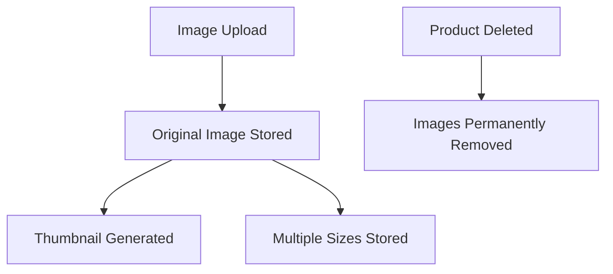
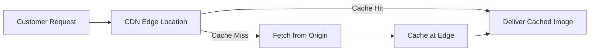
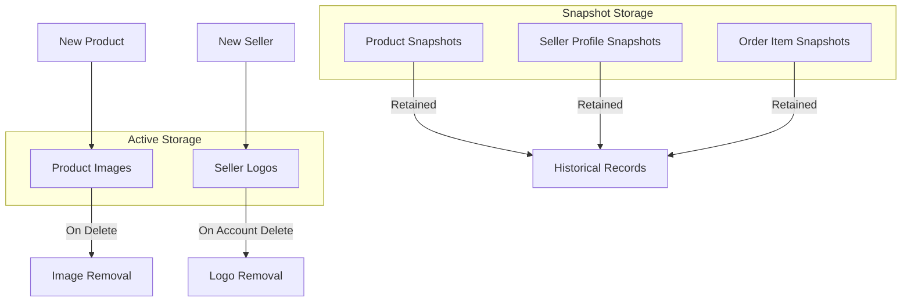

**ecommerceMall — Data ownership, privacy, retention, and recovery policies**

Data ownership, privacy, retention, and recovery policies

# Data Policies

Data ownership, privacy, retention, and recovery policies from a business perspective.

## Data Ownership and Privacy

Define who owns what data, who can access it, and privacy boundaries between users.

### Data Ownership

### Data Ownership

**Customer Data Ownership**
Customers own their account credentials, profile information, shipping addresses, wishlist items, cart contents, orders placed, and reviews written.
When a customer deletes their account, ownership of their profile information is relinquished and the data is removed. However, orders and order history remain in the system under platform custody for legal and business record purposes. Reviews remain published but are disassociated from the customer identity and displayed as originating from a "deleted user".

**Seller Data Ownership**
Sellers own their account credentials, shop profile information (shop name, description, logo), products created, product variants, product images, and inventory records.
When a seller deletes their account, ownership of their shop profile and products is relinquished. Products are removed from listings and are no longer visible to customers. Order history and snapshots remain in the system under platform custody to preserve transaction records.

**Platform Data Ownership**
The platform owns system-level data including categories, administrative records, and snapshot archives. Snapshots are immutable records maintained by the platform for dispute resolution and audit purposes.

**Snapshot Ownership**
Snapshots are owned by the platform and are maintained as immutable audit records. Relevant parties (the original data owner and administrators) have viewing rights to snapshots for dispute resolution purposes, but cannot modify or delete them.

**Order and Transaction Data Ownership**
Order records and associated snapshots (product snapshots, variant snapshots, seller profile snapshots) are co-owned by the platform and the transacting parties. While customers and sellers can view their relevant order data, the platform maintains custody of the complete record for legal and operational purposes.

**Review Data Ownership**
Customers own their review content (rating and text). When a review is deleted by the customer, the review content is removed from public display but snapshots are preserved by the platform. The aggregated rating calculation excludes deleted reviews.

### Data Isolation

### Data Isolation

**Customer Data Isolation**
Each customer's personal data is isolated from other customers. Customers cannot access, view, or modify other customers' profiles, addresses, wishlists, carts, orders, or saved information.
Customer order history is only accessible to the customer who placed the order and to administrators. Sellers can only view order items related to their own products, not complete orders or other sellers' items within the same order.

**Seller Data Isolation**
Each seller's business data is isolated from other sellers. Sellers cannot access, view, or modify other sellers' shop profiles, products, variants, inventory records, or order items.
A seller can only view order items for products they own, even when those items are part of a larger order containing items from other sellers.

**Cross-User Visibility Boundaries**
Public product listings including product names, descriptions, prices, images, and seller shop names are visible to all customers.
Private business data including inventory quantities, inventory history records, cost information, and pending order details are isolated to the respective seller.
Personal customer data including addresses, phone numbers, and account credentials are isolated to the individual customer.

**Administrative Access Isolation**
Administrators can access data across all customers and sellers for oversight purposes. Regular administrators and super administrators have the same data access scope, differing only in their ability to manage other administrators.
Administrative access is granted only to users who have been approved and promoted to administrator status.

**Data Segregation by Entity Type**
Customer data, seller data, and platform system data are logically separated. Customer accounts cannot access seller-specific functions or data, and seller accounts cannot access customer-specific functions or data unless explicitly shared through the transaction process.

### Access Control

### Access Control

**Customer Access Rights**
Customers have full access to their own profile information, shipping addresses, wishlist, shopping cart, order history, and reviews they have written.
Customers can view public product listings, seller shop profiles, categories, and reviews from all customers.
Customers cannot access inventory records, other customers' data, or seller business data beyond what is publicly displayed.

**Seller Access Rights**
Sellers have full access to their own shop profile, product catalog, product variants, product images, inventory records, and order items for their products.
Sellers can view customer shipping addresses only for orders containing their products, and only for the purpose of fulfilling those orders.
Sellers cannot access customer wishlists, carts, or other sellers' business data.
Sellers can view cancellation requests and refund requests only for their own order items.

**Administrator Access Rights**
Administrators have access to all customer accounts, seller accounts, products, orders, categories, and snapshots for platform oversight purposes.
Administrators can view pending seller registration requests and pending administrator promotion requests.
Administrators can perform force actions on orders including force-cancellation and force-refund for dispute resolution.
Super administrators can additionally manage other administrators' grades and review administrator promotion requests.

**Snapshot Access Rights**
Product snapshots and variant snapshots are viewable by the seller who owns the product, and by administrators.
Order item snapshots are viewable by the customer who placed the order, the seller who fulfilled the item, and administrators.
Cancellation request snapshots and refund request snapshots are viewable by the requesting customer, the responding seller, and administrators.
Review snapshots are viewable by the review author and administrators.

**Access During Account States**
Suspended sellers retain access to view their existing orders and respond to cancellation/refund requests, but lose access to create or edit products.
Banned customers and sellers lose all access to the platform including their data, except that order history remains accessible to administrators for record-keeping purposes.

**Default Address Access**
Customers can designate one shipping address as the default for checkout convenience. The default address is used automatically during checkout unless the customer selects a different address.

### Privacy Boundaries

### Privacy Boundaries

**Publicly Visible Information**
The following information is publicly visible to all users including unauthenticated visitors: product listings (names, descriptions, prices, images), category names and descriptions, seller shop names, seller shop descriptions, seller logos, product reviews (ratings and text content), and average product ratings.

**Privately Protected Information**
The following information is private and accessible only to the data owner and administrators: customer email addresses, customer phone numbers, customer display names (only visible on their own reviews), shipping addresses, wishlist contents, cart contents, order history details (except to involved sellers for their items only), and account passwords.

**Transaction-Specific Privacy**
During order processing, sellers can view customer shipping addresses only for the specific items they are fulfilling. Sellers cannot view the complete order if it contains items from other sellers.
Customers can view the seller's shop name and logo associated with each order item, preserved as they appeared at the time of purchase through snapshots.

**Review Privacy**
Reviews are publicly visible once published. However, when a customer deletes their account, their reviews remain visible but are anonymized and shown as originating from a "deleted user" without revealing the original customer identity.
Review snapshots preserve the original content for dispute resolution but are not publicly accessible.

**Data Retention Privacy**
When accounts are deleted, personal identifying information is removed while transaction records are retained in a privacy-preserving manner. Customer profiles are deleted, but orders remain with customer identity anonymized or removed.
Seller shop names are preserved in order history to maintain accurate transaction records, even after seller account deletion.

**Snapshot Privacy**
Snapshots are not publicly accessible. They are available only to the parties involved in the transaction (customer and seller) and to administrators for dispute resolution. Snapshot contents preserve the exact state of data at a point in time and are immutable.

**Administrative Privacy Oversight**
Administrators can access all data for platform management and dispute resolution. This access is logged and restricted to approved administrators only. Administrators cannot modify snapshots or order history records.

## Data Retention and Recovery

Define what happens to deleted data, how long it is retained, and how users can recover it.

### Soft Delete Policy for Account Deletion

When a customer deletes their account, the account and associated profile information are soft deleted and no longer accessible to the customer. The customer's orders and order history are retained for seller records and legal purposes. The customer's reviews are retained but displayed as being from a "deleted user".

When a seller deletes their account, the account and associated seller profile are soft deleted. The seller's products are removed from listings and soft deleted. Order history and order snapshots associated with the seller are preserved. The seller's shop name in past orders is retained for reference purposes.

Soft deleted accounts cannot log in or access the platform. Soft deleted products do not appear in search results or category listings.

### Data Retention Periods

Order records are retained indefinitely to satisfy legal requirements and maintain seller transaction histories. Order snapshots preserving product, variant, and seller profile states at the time of purchase are retained indefinitely.

Product snapshots, variant snapshots, and seller profile snapshots are retained indefinitely and are immutable. These snapshots cannot be modified or deleted even after the associated product, variant, or seller account is deleted.

Inventory records tracking all stock quantity changes are retained indefinitely to maintain a complete audit trail.

Cancellation request snapshots and refund request snapshots capturing the state of requests when responded to are retained indefinitely for dispute resolution purposes.

Review snapshots preserving the content of reviews before edits are retained indefinitely.

### Historical Data Recovery

Administrators can access all snapshots for dispute investigation and resolution purposes. Snapshots provide a complete historical record of entity states at specific points in time.

Sellers can view snapshots of their own products to see historical changes to product information, variant configurations, and pricing. Sellers can view snapshots of their seller profile to track changes to shop information.

Customers can view their order history indefinitely, including access to order details and shipment tracking information for all past orders. Customers can view the state of products at the time of purchase through order item snapshots.

Snapshots serve as the primary mechanism for recovering historical state information and resolving disputes about past transactions or entity configurations.

### Permanent Deletion Criteria

Customer profile information including display name and phone number is permanently deleted when the customer deletes their account. Customer addresses are permanently deleted when the customer deletes their account or deletes individual addresses.

Products are permanently removed from active listings when deleted by the seller or when the seller's account is deleted. Product variants and their inventory records are permanently deleted when the parent product is deleted.

Wishlist items are permanently deleted when the associated product is deleted by the seller.

Cart items are permanently deleted when the customer removes them from the cart or when the associated product variant is deleted.

Administrators can permanently delete products for policy violations. Such deletions remove the product from listings but preserve order snapshots and transaction records.

Snapshots and order records are never permanently deleted as they serve legal and audit purposes.

# Storage Capacity

Storage capacity planning and CDN requirements.

## Storage Capacity Requirements

Define storage requirements and capacity planning for file storage.

### Product Image Storage

Product images are stored for display on product listings and detail pages.

Each product can have multiple images uploaded by the seller. Images are stored in their uploaded format and a thumbnail version is generated from the first image for use in product listings and search results.

When a product is deleted by its seller, all associated product images are permanently removed from storage. When a product is deleted by an administrator for policy violations, all associated product images are permanently removed from storage.

Image storage capacity must accommodate:
- Multiple images per product (number determined by seller uploads)
- Thumbnail versions generated from uploaded images
- Images for all active and suspended products
- Deleted products retain their snapshots but snapshot images are stored separately as part of the snapshot system

**Mermaid Diagram:**

### Seller Logo Storage

Seller logos are stored for display on seller profiles, product detail pages, and order history.

Each seller profile has one logo image. When a seller updates their logo, the new image replaces the previous one in active storage. Previous logo versions are preserved within seller profile snapshots for dispute resolution purposes.

When a seller deletes their account, the current logo image is removed from active storage. Snapshots containing historical logos are retained according to the snapshot retention policy.

Logo storage must accommodate:
- One active logo per seller profile
- Historical logo versions within snapshot records
- Logos for all approved, pending, and suspended sellers

### Snapshot Data Storage

Snapshots preserve historical states of various entities and require dedicated storage capacity.

The following snapshot types contain image or file references that impact storage requirements:

**Product Snapshots**
When a product is modified, a snapshot captures the product state including image references at that point in time. Product snapshots preserve the image set that existed when the snapshot was created.

**Seller Profile Snapshots**
When a seller profile is edited, a snapshot captures the profile state including the logo image reference at that point in time.

**Order Item Snapshots**
Order items contain embedded snapshots of the product, variant, and seller profile at the time of purchase. These snapshots include image references to ensure customers see exactly what they purchased even if the original product or seller profile changes later.

Snapshot storage considerations:
- Snapshots are immutable and retained indefinitely
- Snapshots reference images rather than duplicating them when possible
- Order item snapshots must be preserved for legal and dispute resolution purposes
- Storage capacity planning must account for continuous growth of snapshot records

### Content Delivery Network Requirements

Product images and seller logos are served through a content delivery network to ensure fast loading times for customers across different geographic regions.

CDN distribution applies to:
- Product images displayed in search results, category listings, and product detail pages
- Thumbnail images generated from product uploads
- Seller logos displayed on seller profiles and product pages
- Order history images (from order item snapshots)

CDN requirements:
- Images must be cached at edge locations for rapid delivery
- Multiple image sizes must be supported (thumbnail, standard, high-resolution)
- Cache invalidation must occur when images are updated or deleted
- Image optimization must be applied to reduce bandwidth usage while maintaining quality

**Mermaid Diagram:**

### Storage Capacity Planning

Storage capacity must accommodate the data storage needs of the e-commerce platform.

**File Storage Components**
The following components contribute to storage capacity requirements:

1. **Active Product Images**
   - Storage for all uploaded product images across all sellers
   - Storage for generated thumbnail versions
   - Growth correlates with number of products and images per product

2. **Active Seller Logos**
   - Storage for current seller profile logos
   - Growth correlates with number of approved sellers

3. **Snapshot References**
   - Metadata storage for snapshot records
   - Image reference preservation within snapshots

**Capacity Considerations**
- Storage must scale with platform growth in products and sellers
- Image storage growth is directly proportional to seller activity
- Deleted products remove their images from active storage but snapshots remain
- Seller account deletion removes active logos but profile snapshots remain

**Mermaid Diagram:**

# External Dependency SLOs

Service level objectives for external dependency availability.

## External Dependency SLOs

Define availability expectations, timeout thresholds, and degradation policies for external service dependencies.

### Payment Gateway Integration

The platform integrates with an external payment gateway to process customer payments.

**Availability Expectations**

The payment gateway is an external dependency outside the platform's direct control. Payment processing depends on the availability and responsiveness of this external service.

**Timeout Handling**

Payment requests to the external gateway have a reasonable timeout period. If the gateway does not respond within the timeout window, the payment is considered failed and the customer can retry.

**Degradation Behavior**

When the payment gateway is unavailable or unresponsive:
- Orders cannot be completed until payment processing resumes
- Customers are informed that payment is temporarily unavailable
- Customers can retry the payment once the service is restored
- No order records are created for failed payment attempts

**Error Scenarios**

If payment fails due to gateway unavailability, the order is not created and the customer's cart remains unchanged. The customer retains their cart contents and can attempt checkout again later.