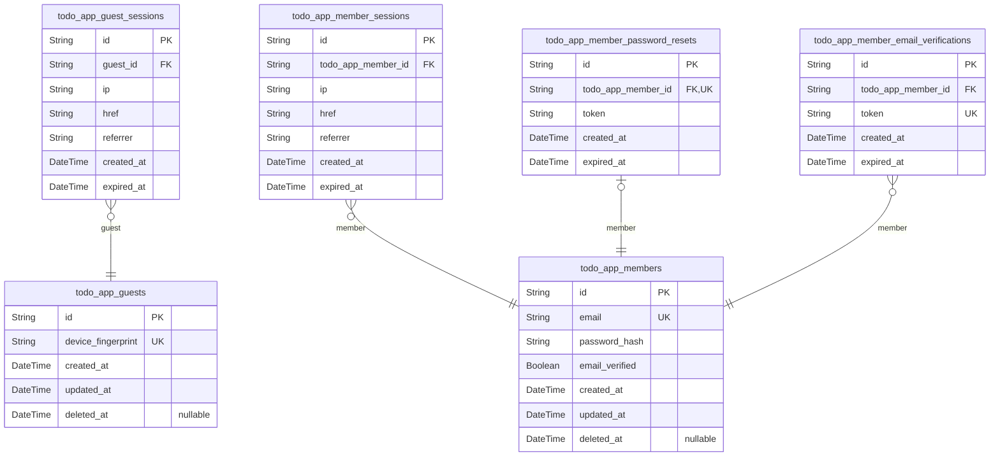
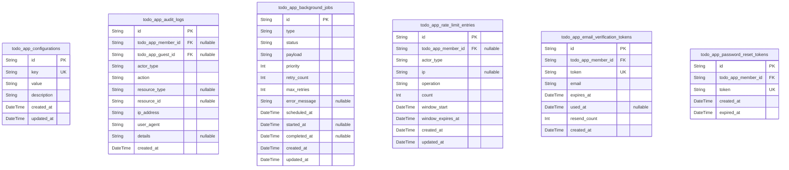
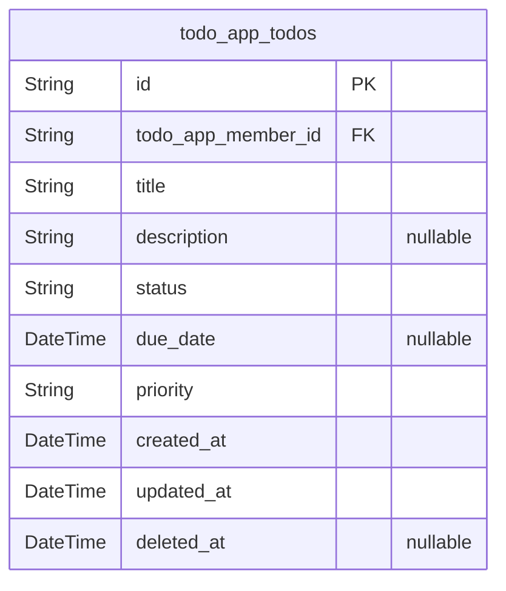

# Prisma Markdown

> Generated by [`prisma-markdown`](https://github.com/samchon/prisma-markdown)

- [Actors](#actors)
- [Systematic](#systematic)
- [Todos](#todos)

## Actors

### `todo_app_guests`

Temporary guest accounts for unauthenticated visitors identified by
device or browser fingerprint.

Guests represent anonymous users who access the application without
registering an account.
Each guest is uniquely identified by a device or browser fingerprint,
allowing the system to associate multiple sessions with the same
anonymous visitor.

Unlike registered members, guests do not have credentials
(email/password) and cannot access member-specific features such as
creating persistent todos.
Guest data is temporary and may be periodically cleaned up by background
processes to maintain system hygiene.

Guest accounts serve as the foundation for guest session management,
enabling limited access to public resources while maintaining session
continuity across page refreshes.

Properties as follows:

- `id`: Primary Key.
- `device_fingerprint`
  > Unique device or browser fingerprint hash for identifying the guest
  > across sessions. Used to associate multiple sessions with the same
  > anonymous visitor.
- `created_at`: Timestamp when the guest account was first created.
- `updated_at`: Timestamp when the guest account was last updated.
- `deleted_at`
  > Timestamp for soft deletion. NULL if the guest account is active, set to
  > timestamp when soft-deleted for cleanup.

### `todo_app_guest_sessions`

Temporary session tokens for guest access to public resources with
limited lifetime.

Guest sessions provide temporary authenticated access for unauthenticated
visitors identified by device or browser fingerprint. Each session is
tied to a specific guest account and tracks connection metadata for
security auditing.

Sessions have a fixed expiration time to ensure security and prevent
indefinite access. When a session expires, the guest must establish a new
session. Unlike member sessions, guest sessions do not support refresh
tokens - they are simple temporary tokens with a single expiration.

The connection metadata (IP address, href, referrer) enables basic
security monitoring and audit trails for guest activity.

Properties as follows:

- `id`: Primary Key.
- `guest_id`: Guest actor who owns this session. [todo_app_guests.id](#todo_app_guests)
- `ip`
  > IP address of the client establishing this session. Used for security
  > auditing and basic access tracking.
- `href`
  > Connection URL (href) from which the session was initiated. Captures the
  > entry point for the guest session.
- `referrer`
  > Referrer URL that led to the session creation. Tracks how guests arrive
  > at the application.
- `created_at`
  > Timestamp when the session was created. Used for session lifecycle
  > tracking and audit purposes.
- `expired_at`
  > Timestamp when the session expires. Sessions must have an expiration time
  > for security. After this time, the session is no longer valid and the
  > guest must establish a new session.

### `todo_app_members`

Registered member accounts representing authenticated users of the Todo
application.

Each member has a unique email address that serves as their primary
identifier and login credential. Members can create and manage personal
todo items with complete data isolation from other members.

The member record stores authentication credentials including a securely
hashed password using bcrypt. Email verification status is tracked to
ensure accounts are activated before full access is granted.

Soft deletion is supported to maintain audit trails and allow for
potential account recovery within a grace period. When a member is
deleted, all associated data including todos, sessions, and verification
tokens are cascaded.

Members serve as the root ownership entity for all todo items in the system.

Properties as follows:

- `id`: Primary Key.
- `email`
  > Unique email address serving as the member's primary identifier and login
  > credential. Must conform to RFC 5322 format standards and be unique
  > across all member accounts.
- `password_hash`
  > Bcrypt hashed password for secure authentication. Stored using bcrypt
  > with cost factor 12 or higher with unique salt per password. Never store
  > plain text passwords.
- `email_verified`
  > Indicates whether the member's email address has been verified through
  > the email verification workflow. Accounts with false value have limited
  > functionality until verification is completed.
- `created_at`
  > Timestamp when the member account was created. Automatically set at
  > account creation time.
- `updated_at`
  > Timestamp when the member account was last modified. Automatically
  > updated on any record change.
- `deleted_at`
  > Timestamp when the member account was soft deleted. Null indicates active
  > account. Supports account recovery and audit trail maintenance.

### `todo_app_member_sessions`

JWT session tokens for member authentication.

Stores active authentication sessions for registered members. Connection
metadata (IP address, referrer, href) is captured for security auditing
and session management.

Sessions support authentication flows. The expired_at field tracks when
the session becomes invalid, requiring the member to re-authenticate.
Multiple concurrent sessions are allowed per member.

Properties as follows:

- `id`: Primary Key.
- `todo_app_member_id`: Belonged member's [todo_app_members.id](#todo_app_members) who owns this session.
- `ip`: IP address from which the session was created.
- `href`: Connection URL or endpoint that initiated the session.
- `referrer`: Referrer URL that led to the session creation.
- `created_at`: When the session was created.
- `expired_at`: When the session expires. Session becomes invalid after this time.

### `todo_app_member_password_resets`

Password reset tokens for secure member password recovery workflow.

Stores unique reset tokens generated when members request password
recovery. Each token is cryptographically secure and bound to a specific
member account. Tokens automatically expire after 1 hour from generation
as a security measure.

The table enforces that only one active reset token exists per member at
any time through a unique constraint. Once a reset is completed or the
token expires, the record is removed.

Properties as follows:

- `id`: Primary Key.
- `todo_app_member_id`: Member requesting password reset. [todo_app_members.id](#todo_app_members)
- `token`: Cryptographically secure reset token sent to member's email.
- `created_at`: Token generation timestamp.
- `expired_at`: Token expiration timestamp. Set to 1 hour after creation.

### `todo_app_member_email_verifications`

Email verification tokens for confirming member email addresses during
registration.

Stores cryptographically secure tokens sent to members' email addresses
when they register for an account. Each token is associated with a
specific member and has a limited lifetime to ensure security.

Tokens expire after 24 hours from generation as per security
requirements. When a member requests verification or resends the
verification email, a new token is generated while previous tokens may
remain in the system until cleanup.

This table supports the email verification workflow during member
registration, ensuring that members have access to the email address they
registered with. Rate limiting for resend requests is handled separately
by the rate limiting system.

Properties as follows:

- `id`: Primary Key.
- `todo_app_member_id`: The member who requested email verification. [todo_app_members.id](#todo_app_members)
- `token`
  > Cryptographically secure verification token sent to the member's email
  > address. Must be unique and unguessable.
- `created_at`: Timestamp when the verification token was generated.
- `expired_at`
  > Timestamp when the verification token expires. Set to 24 hours after
  > creation per security requirements.

## Systematic

### `todo_app_configurations`

System-wide configuration settings storage for application-level parameters.

Stores key-value pairs for system configuration including token expiry
times, rate limits, feature flags, and other application settings. Each
configuration entry has a unique key identifier and a string value that
can represent various data types (serialized as needed).

This table serves as the central registry for tunable system parameters
that administrators can modify without code changes. Configurations are
read frequently during request processing but modified rarely, making
this table primarily read-optimized.

All configuration changes are tracked through created_at and updated_at
timestamps for audit purposes.

Properties as follows:

- `id`: Primary Key.
- `key`
  > Unique configuration key identifier. Used as the lookup key when
  > retrieving configuration values. Must be unique across all
  > configurations.
- `value`
  > Configuration value stored as a string. Complex values should be
  > serialized (JSON, etc.) by the application layer before storage.
- `description`
  > Human-readable description explaining the purpose and usage of this
  > configuration setting. Helps administrators understand what the
  > configuration controls.
- `created_at`: Timestamp when this configuration entry was first created.
- `updated_at`: Timestamp when this configuration entry was last modified.

### `todo_app_audit_logs`

Security audit trail capturing authentication events, account changes,
and system actions.

Stores immutable records of significant system events for security
monitoring, compliance auditing, and troubleshooting purposes. Each log
entry identifies the actor (member or guest), the action performed, the
affected resource, and contextual metadata including IP address and user
agent.

Audit logs are append-only and cannot be modified or deleted, ensuring a
complete historical record of system activity. The polymorphic actor
reference supports tracking actions by both authenticated members and
temporary guest users.

Properties as follows:

- `id`: Primary Key.
- `todo_app_member_id`
  > Reference to the member who performed the action, if applicable. {@link
  > todo_app_members.id}
- `todo_app_guest_id`
  > Reference to the guest who performed the action, if applicable. {@link
  > todo_app_guests.id}
- `actor_type`
  > Type of actor who performed the action. Valid values: 'member', 'guest',
  > 'system'. Used to identify which actor reference field is populated.
- `action`
  > The action that was performed. Examples: 'login', 'logout', 'register',
  > 'password_reset', 'todo_created', 'todo_updated', 'todo_deleted',
  > 'account_updated'.
- `resource_type`
  > Type of resource that was affected by the action, if any. Examples:
  > 'todo', 'member', 'session'. Null for actions without a specific resource
  > target.
- `resource_id`
  > UUID of the affected resource, if applicable. Used with resource_type to
  > identify the specific record.
- `ip_address`
  > IP address from which the action was performed. Used for security
  > analysis and detecting suspicious activity patterns.
- `user_agent`
  > User agent string from the client that performed the action. Captures
  > browser and device information for audit purposes.
- `details`
  > Additional contextual information about the action in JSON format. May
  > include changed fields, old/new values, or other action-specific
  > metadata.
- `created_at`
  > Timestamp when the audit log entry was created. Immutable record of when
  > the action occurred.

### `todo_app_background_jobs`

Asynchronous background job queue for processing system tasks.

Stores tasks that need to be executed outside the request-response cycle,
including email sending, data cleanup operations, and scheduled
maintenance activities.

Each job represents a discrete unit of work with configurable priority,
retry logic, and scheduling. Jobs transition through lifecycle states
from pending to processing to completion or failure.

The queue supports delayed execution through scheduled_at timestamps and
automatic retry mechanisms for transient failures. Failed jobs retain
error messages for debugging and can be manually retried or inspected
through administrative interfaces.

Properties as follows:

- `id`: Primary Key.
- `type`
  > Job type identifier indicating the kind of work to perform. Examples:
  > 'send_email', 'cleanup_data', 'maintenance_task'.
- `status`
  > Current execution status of the job. Valid values: 'pending',
  > 'processing', 'completed', 'failed', 'cancelled'. Status transitions
  > follow queue processing workflow.
- `payload`
  > JSON-serialized job parameters and data required for task execution.
  > Contains job-specific configuration and input data.
- `priority`
  > Job priority level for queue ordering. Higher values indicate higher
  > priority. Default is 0. Jobs with higher priority are processed before
  > lower priority jobs.
- `retry_count`
  > Number of retry attempts already made for this job. Starts at 0 and
  > increments on each retry attempt.
- `max_retries`
  > Maximum number of retry attempts allowed before marking job as
  > permanently failed. Default is 3.
- `error_message`
  > Error message from the last failed execution attempt. Populated when
  > status is 'failed' and cleared on successful retry.
- `scheduled_at`
  > Timestamp when the job is scheduled to execute. Jobs are only eligible
  > for processing when current time is greater than or equal to this
  > timestamp.
- `started_at`
  > Timestamp when job processing began. Null until a worker picks up the job
  > for execution.
- `completed_at`
  > Timestamp when job processing completed, either successfully or with
  > final failure. Null until terminal state reached.
- `created_at`: Timestamp when the job was created and added to the queue.
- `updated_at`
  > Timestamp of last modification to the job record. Updated on status
  > changes, retries, and execution progress.

### `todo_app_rate_limit_entries`

Rate limiting counter entries tracking request counts for authentication
endpoints and API operations.

Stores counters used to enforce rate limits on sensitive operations like
login attempts, registrations, and general API requests. Each entry
tracks requests within a specific time window, with separate tracking
mechanisms for guest users (by IP address) and authenticated members (by
user ID).

Rate limit windows automatically expire based on the configured time
boundaries, with entries tracking both the start time and expiration time
of each window. The system supports different rate limits for different
operation types, allowing fine-grained control over API usage patterns.

Entries are created and managed automatically by the rate limiting
middleware and do not require direct user interaction.

Properties as follows:

- `id`: Primary Key.
- `todo_app_member_id`: Member's [todo_app_members.id](#todo_app_members) for authenticated user rate limiting.
- `actor_type`
  > Actor type identifier for rate limiting context. Values: 'guest' for
  > IP-based tracking, 'member' for authenticated user tracking.
- `ip`
  > IP address for guest user rate limiting. Used when actor_type is 'guest'
  > to track unauthenticated requests.
- `operation`
  > Operation identifier being rate limited. Examples: 'login', 'register',
  > 'password_reset', 'api_request'.
- `count`: Current request count within the rate limit window.
- `window_start`: Start time of the current rate limit window.
- `window_expires_at`
  > Expiration time when the current rate limit window resets and count
  > should be cleared.
- `created_at`: Record creation timestamp.
- `updated_at`: Last update timestamp when count was incremented.

### `todo_app_email_verification_tokens`

Email verification tokens for confirming member email addresses during
registration.

Stores cryptographically secure tokens sent to members when they register
an account. Each token is associated with a specific member and email
address, with a strict 24-hour expiration window from creation time.

The table supports rate limiting through resend_count tracking, allowing
the system to enforce limits on how frequently verification emails can be
resent to the same address. Once a token is successfully used to verify
an email, the used_at timestamp is recorded to prevent reuse.

Tokens that expire without being used are automatically cleaned up by
background processes. This table serves as the infrastructure foundation
for the email verification workflow, ensuring only valid, confirmed email
addresses are associated with member accounts.

Properties as follows:

- `id`: Primary Key.
- `todo_app_member_id`: Member requesting email verification. [todo_app_members.id](#todo_app_members)
- `token`
  > Cryptographically secure verification token sent via email. Must be
  > unique across all tokens.
- `email`
  > Email address being verified. Stored for audit purposes and to support
  > resend functionality even if member changes email.
- `expires_at`
  > Token expiration timestamp. Tokens are valid for 24 hours from creation
  > as per security requirements.
- `used_at`
  > Timestamp when token was consumed for email verification. Null until
  > successfully used.
- `resend_count`
  > Number of times this verification email has been resent. Used for rate
  > limiting to prevent abuse.
- `created_at`: When the verification token was generated.

### `todo_app_password_reset_tokens`

Password reset tokens for secure password recovery workflow.

Stores cryptographically secure tokens generated when members request
password resets. Each token is associated with a specific member account
and has a strict 1-hour expiration time from generation.

Tokens are single-use and invalidated after successful password reset or
upon expiration. This table works in conjunction with the background jobs
system to clean up expired tokens automatically.

The token value must be cryptographically random and sufficiently long to
prevent brute force attacks.

Properties as follows:

- `id`: Primary Key.
- `todo_app_member_id`: Member requesting password reset. [todo_app_members.id](#todo_app_members)
- `token`
  > Cryptographically secure reset token value. Must be unique and random to
  > prevent guessing attacks.
- `created_at`: Timestamp when the reset token was generated.
- `expired_at`
  > Timestamp when the token expires. Must be exactly 1 hour from created_at
  > per security requirements.

## Todos

### `todo_app_todos`

Core todo items representing individual tasks created and managed by
authenticated members.

Each todo belongs to exactly one member and contains structured task
information including title, description, completion status, due date,
and priority level. Members have complete control over their own todos
with strict data isolation preventing access to other users' tasks.

The todo lifecycle includes creation, updates to content and status, soft
deletion for recovery capability, and eventual permanent removal. Status
tracking supports workflow management from pending through completion.

Todos support filtering and sorting operations by status, priority, due
date, and creation time to enable effective task organization and
priority management.

Properties as follows:

- `id`: Primary Key.
- `todo_app_member_id`
  > Owner member who created and manages this todo. {@link
  > todo_app_members.id}
- `title`: Short descriptive title summarizing the todo task. Maximum 200 characters.
- `description`
  > Detailed description providing additional context and information about
  > the todo task. Supports longer text for comprehensive task details.
- `status`
  > Current completion status of the todo. Valid values: pending,
  > in_progress, completed, cancelled.
- `due_date`
  > Optional deadline date and time when the todo task should be completed.
  > Null indicates no specific deadline.
- `priority`: Priority level indicating task urgency. Valid values: low, medium, high.
- `created_at`: Timestamp when the todo was first created.
- `updated_at`: Timestamp when the todo was last modified.
- `deleted_at`
  > Soft delete timestamp. Null indicates active todo, non-null indicates
  > deleted todo available for recovery.
