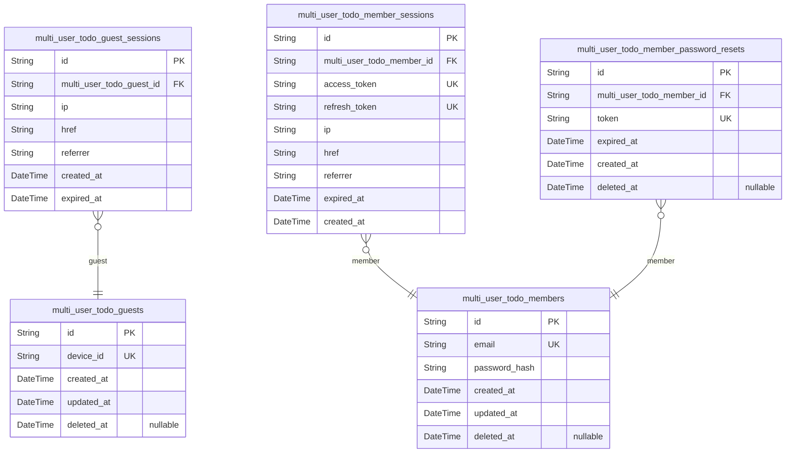
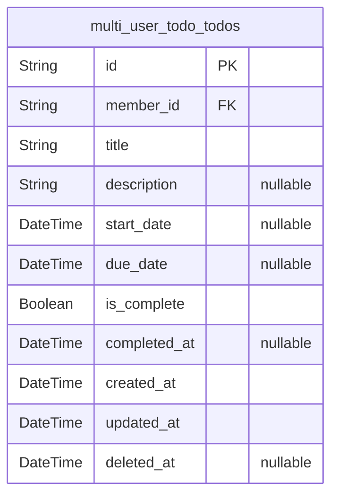
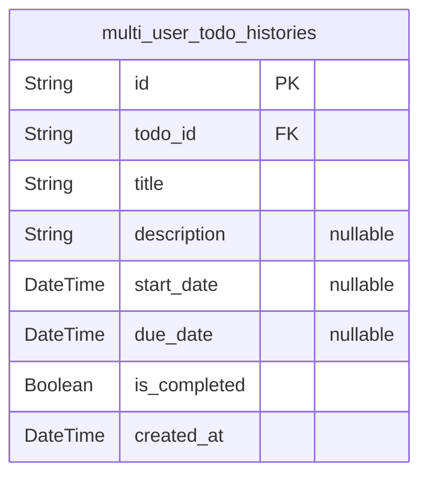

# Prisma Markdown

> Generated by [`prisma-markdown`](https://github.com/samchon/prisma-markdown)

- [Actors](#actors)
- [Todos](#todos)
- [History](#history)

## Actors

### `multi_user_todo_guests`

Guest accounts for unauthenticated visitors identified by device or session.

This table represents temporary guest identities that allow
unauthenticated visitors to interact with the system. Guests are
identified by device information rather than credentials, enabling
immediate access without registration.

**Key Characteristics:**
- Temporary identity for unauthenticated users
- Device-based identification (no email/password required)
- Soft-deletable to support account cleanup
- Supports session-based tracking via [multi_user_todo_guest_sessions](#multi_user_todo_guest_sessions)

**Relationships:**
- Has many [multi_user_todo_guest_sessions](#multi_user_todo_guest_sessions) (1:N) - Tracks active
guest sessions
- Can own todos and other domain entities (through sessions)

**Lifecycle:**
Guests are created when an unauthenticated visitor first accesses the
system. They may optionally be converted to registered members. When
permanently deleted, all associated data (todos, history) is cascaded per
business requirements.

Properties as follows:

- `id`: Primary Key.
- `device_id`
  > Unique device identifier for guest recognition. Used to associate
  > returning visitors with their previous guest account when no session
  > token is available.
- `created_at`: Timestamp when the guest account was created.
- `updated_at`: Timestamp when the guest account was last modified.
- `deleted_at`
  > Soft deletion timestamp. When set, the guest account is considered
  > deleted but data is retained for potential recovery or audit purposes.

### `multi_user_todo_guest_sessions`

Guest session records tracking temporary access tokens for
unauthenticated visitors.

Stores session metadata including IP address, browser href, and referrer
information to provide audit trails of guest activity. Each session is
associated with a guest record and has an expiration time for security.

References [multi_user_todo_guests](#multi_user_todo_guests) for the guest actor identity.
Sessions are append-only records that expire after a defined period.

Properties as follows:

- `id`: Primary Key.
- `multi_user_todo_guest_id`
  > Referenced guest actor's [multi_user_todo_guests.id](#multi_user_todo_guests). Links the
  > session to a specific guest identity for tracking temporary access.
- `ip`
  > Client IP address during session establishment. Used for audit and
  > security tracking.
- `href`: HTTP referrer href from the client request headers. Used for audit trail.
- `referrer`
  > HTTP referrer header value indicating the source page. Used for audit
  > trail and access tracking.
- `created_at`
  > Timestamp when the session was created. Not null - sessions are
  > append-only audit records.
- `expired_at`
  > Timestamp when the session expires. Sessions automatically become invalid
  > after this time for security.

### `multi_user_todo_members`

Registered member accounts with email and password credentials.

This table serves as the identity record for authenticated users
(members) in the system.
Members register with unique email addresses and passwords, which are
used for authentication.
This is the canonical actor table for the member type, serving as the
root of ownership
and permission relationships. All todos, edit histories, and trash items
are owned by
members through foreign key relationships.

Each member can have multiple active sessions ({@link
multi_user_todo_member_sessions}),
and may have password reset tokens ({@link
multi_user_todo_member_password_resets}) during
account recovery workflows.

Properties as follows:

- `id`: Primary Key.
- `email`: Unique email address used as the member's login identifier.
- `password_hash`
  > Hashed password for authentication. Stores the cryptographic hash, never
  > the plain text password.
- `created_at`: Timestamp when the member account was created.
- `updated_at`: Timestamp when the member account was last updated.
- `deleted_at`
  > Timestamp when the member account was soft deleted. Null if account is
  > active.

### `multi_user_todo_member_sessions`

Session records for authenticated member users in the todo application.

This table stores JWT authentication sessions with both access and
refresh tokens, enabling secure user authentication and token refreshing
capabilities. Each session tracks connection metadata including IP
address, referrer URL, and browser information for security auditing
purposes.

Sessions have a defined lifecycle:
- Created when a member successfully logs in
- Expires after a configured time period (expired_at field)
- Can be terminated early through logout operations

Reference: [multi_user_todo_members](#multi_user_todo_members)

Properties as follows:

- `id`: Primary Key.
- `multi_user_todo_member_id`
  > Reference to the authenticated member who owns this session. Links to
  > [multi_user_todo_members.id](#multi_user_todo_members).
- `access_token`
  > JWT access token used for authenticating API requests. Contains encoded
  > user identity and permissions with limited lifespan.
- `refresh_token`
  > JWT refresh token used to obtain new access tokens when the current
  > access token expires. Has a longer lifespan than access tokens.
- `ip`
  > IP address of the client that established this session. Used for security
  > auditing and detecting suspicious access patterns.
- `href`
  > URL or path from which the session was initiated. Captures the entry
  > point of the user's login request.
- `referrer`
  > HTTP referrer header value indicating the previous page the user came
  > from before logging in. Used for analytics and security.
- `expired_at`
  > Timestamp when this session expires and becomes invalid. Access tokens
  > cannot be refreshed after this time.
- `created_at`
  > Timestamp when the session was first created upon successful
  > authentication.

### `multi_user_todo_member_password_resets`

Password reset tokens for member account recovery.

Stores temporary tokens used for password reset flows. When a member
requests a password reset, a token is generated and stored here with an
expiration time. The member receives this token via email and can use it
to establish a new password. Tokens are time-constrained for security and
are soft-deleted after use or expiration.

Belongs to [multi_user_todo_members](#multi_user_todo_members) table through member
relationship.

Properties as follows:

- `id`: Primary Key.
- `multi_user_todo_member_id`
  > Belonged member's [multi_user_todo_members.id](#multi_user_todo_members). Links the reset
  > token to the member account requesting password recovery.
- `token`
  > Unique password reset token. Cryptographically secure random string sent
  > to member's email for account recovery.
- `expired_at`
  > Token expiration timestamp. After this time, the token becomes invalid
  > and cannot be used for password reset. Ensures time-bound security for
  > reset operations.
- `created_at`: Creation time of record.
- `deleted_at`
  > Soft deletion timestamp. Set when token is used for password reset or
  > when manually invalidated.

## Todos

### `multi_user_todo_todos`

Core todo task entity representing a task owned by a member user.

Each todo has a title and optional description, with scheduling support
via start_date and due_date fields. The completion status is tracked
through is_complete boolean and completed_at timestamp. Todos support
soft deletion for trash functionality via deleted_at.

Relationships with other models:
- Belongs to [multi_user_todo_members](#multi_user_todo_members) via member_id - the owner
who created the todo
- Has many [multi_user_todo_histories](#multi_user_todo_histories) via todoId - edit history
records
- Has one [multi_user_todo_trashes](#multi_user_todo_trashes) when soft deleted - trash bin
entry

Business constraints: Todos are scoped to their owner member. When
permanently deleted, associated history records are also removed.

Properties as follows:

- `id`: Primary Key.
- `member_id`
  > Owner member's [multi_user_todo_members.id](#multi_user_todo_members). References the
  > authenticated member who created and owns this todo.
- `title`
  > Task title or name. The brief identifier shown in todo lists and used as
  > the primary display text for the task.
- `description`
  > Detailed task description. Optional extended text providing additional
  > context, instructions, or notes about the todo.
- `start_date`
  > Planned start date for the task. Optional date when work on this todo is
  > scheduled to begin. Used for sorting and filtering.
- `due_date`
  > Deadline date for the task. Optional date by which this todo should be
  > completed. Used for sorting and filtering.
- `is_complete`
  > Completion status flag. True when the todo has been marked as
  > done/finished, false when still pending.
- `completed_at`
  > Timestamp when the todo was marked complete. Set when is_complete
  > transitions from false to true, null when incomplete.
- `created_at`
  > Record creation timestamp. Set when the todo is first created and never
  > modified.
- `updated_at`: Last modification timestamp. Updated whenever any todo field is modified.
- `deleted_at`
  > Soft delete timestamp. Set when the todo is moved to trash, null when
  > active. Used for trash functionality.

## History

### `multi_user_todo_histories`

Historical edit records tracking changes made to todos over time.

Each entry captures the state of a todo after a modification, including the
values that were applied during the edit (title, description, start date,
due date, and completion status). Entries are ordered chronologically with
most recent first, enabling members to view the complete modification
history of their todos. When a todo is permanently deleted, all associated
history entries are cascade removed.

References [multi_user_todo_todos.id](#multi_user_todo_todos) for the associated todo.

Properties as follows:

- `id`: Primary Key.
- `todo_id`: The todo this history entry belongs to. [multi_user_todo_todos.id](#multi_user_todo_todos)
- `title`: The title value after this edit.
- `description`: The description value after this edit.
- `start_date`: The start date after this edit.
- `due_date`: The due date after this edit.
- `is_completed`: The completion status after this edit.
- `created_at`: Timestamp when this history entry was created.
