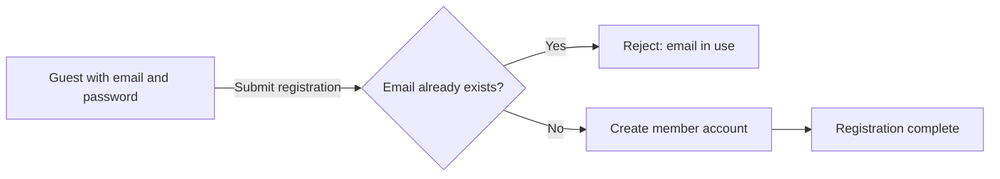
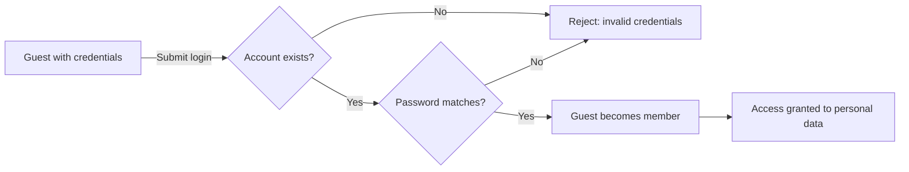

**multiUserTodo — Actor definitions, permission matrix, authentication, session, account lifecycle**

Actor definitions, permission matrix, authentication, session, account lifecycle

# Actor Definitions

Define all user actor types with their identity, permissions, and access boundaries.

## guest Actor

A guest is an unauthenticated visitor who has not yet logged into the application. Guests can access the login screen and registration page where they may create a new account using an email address and password. Guests may also log in if they already possess existing account credentials. Guests cannot view, create, edit, delete, or interact with any todos in the system. Guests cannot access any account management features including password changes or profile editing. Guests have no visibility into any user's todo lists, edit histories, or trash contents. All todo data remains completely inaccessible to guests until they authenticate.

### Guest Identity and Public Access

A guest represents an unauthenticated visitor who has not established any session with the application. Guests may access the public landing page only, where authentication options are presented. Guests may access the login screen where they may perform email-based login using password-based authentication with existing account credentials. Guests may access the registration page where they may complete email and password signup to create a new account. Upon successful authentication or registration, the guest transitions to member status. All other application features remain inaccessible to guests.

### Data Isolation and Restrictions

Guests operate within strict authentication-only boundaries. Guests have no todo visibility and cannot view, search, or access any todo items, lists, or details belonging to any user. Guests have no edit history access and cannot view any historical records of changes to todos. Guests have no trash view and cannot access deleted items or trash contents. Guests have no sorting or filtering capabilities and cannot apply any ordering or criteria to data sets. Guests have no profile access and cannot view or edit user profile information including display names. Guests have no account privileges and cannot access account management functions, change passwords, or delete accounts. Guests have no data access to any user-specific information or protected system resources.

## member Actor

A member is an authenticated user who has successfully logged into the application using their email and password. Members have a personal profile that includes a display name which they can modify at any time. Members can create new todos with titles, descriptions, start dates, and due dates. Members can view their own todo lists with pagination, sorting, and filtering options. Members can mark their todos as complete or incomplete. Members can edit existing todo details and view the complete edit history for any of their todos. Members can move todos to trash, restore them, or permanently delete them. Members can change their password and delete their own account entirely. Members are strictly limited to accessing only their own todos and cannot view other users' data.

### Identity and Authentication Status

A member represents an authenticated user who has successfully completed the login process using their registered email address and password. Verified account holder status is granted upon successful authentication, distinguishing members from unauthenticated visitors. Members receive authorization to access personal account features and private data exclusive to their account.

### Profile Ownership and Management

Members own their display name, which serves as their personal profile identifier. Members can view their current display name and edit it at any time without restriction on modification frequency. Changes to the display name take effect immediately upon saving.

### Data Access Boundaries and Isolation

Members maintain exclusive access to their personal todo data and cannot view, access, or interact with other members' todos under any circumstances. The system enforces strict privacy boundaries that prevent cross-account data visibility or searching. Members attempting to access todo data belonging to other accounts receive access denial.

### Todo Lifecycle Management Permissions

Members have comprehensive permissions to manage todos throughout their lifecycle. Members can create new todos by providing a required title and optional description, start date, and due date. Newly created todos have an incomplete status by default. Members can edit existing todo details including title, description, start date, and due date. Members can toggle the completion status of any todo between complete and incomplete states. Members can view complete details of any individual todo belonging to their account.

### List Organization and Historical Access

Members can organize todo list views using sorting and filtering controls. Members can sort by creation date in newest-first or oldest-first order. Members can sort by start date with earliest first or latest first, where todos without a start date appear at the end of the list. Members can sort by due date with earliest first or latest first, where todos without a due date appear at the end of the list. Members can filter the list to show all todos, only complete todos, or only incomplete todos. Members can view the complete edit history for any todo, with entries displayed from most recent to oldest, including timestamps and value changes.

### Trash Management Permissions

Members can move todos to trash, placing them in a recoverable deletion state separate from the active todo list. Members can view their trashed todos in a dedicated paginated list. Members can restore trashed todos back to their active list at any time. Members can permanently delete individual todos from trash, which removes the todo and its associated edit history completely from the system.

### Account Security and Deletion Permissions

Members can change their account password to maintain security. Members can delete their own account entirely, which permanently removes all associated data including active todos, trashed todos, and edit histories.

# Authentication Flows

Registration, login, logout, and session management from a user perspective.

## Registration and Login

Define user registration and login flows including validation and error handling.

### Registration Process

A guest may create a new account by providing a valid email address and a password.

The email address must be unique across all accounts in the system. If an account already exists with the provided email address, the registration request is rejected.

Both the email address and password are required to complete registration. If either is missing, the registration request is rejected.

Upon successful registration, a new member account is created with the provided email address. The member may immediately log in using the registered credentials.

### Login Process

A guest may authenticate by providing the email address and password associated with their account.

Both the email address and password are required to attempt login. If either is missing, the login request is rejected.

If no account exists with the provided email address, the login request is rejected.

If the provided password does not match the password associated with the account, the login request is rejected.

When authentication succeeds, the guest becomes an authenticated member with access to their own todos and profile management capabilities.

### Session Establishment

After successful login, the member maintains an authenticated session that persists across subsequent interactions with the system.

The authenticated session allows the member to access their personal todo list, create new todos, view existing todos, edit their profile, and perform all other member-level operations without re-authenticating on every action.

The session remains active until the member explicitly terminates it through logout, or until the session expires due to inactivity (as defined in session management policies).

While a session is active, the member cannot register a new account or log in to a different account without first terminating the current session.

## Session and Logout

Define session behavior and logout from a user perspective.

### Session Establishment

When a user successfully logs in with valid email and password, a session is established for that user.

The session allows the user to access authenticated features without re-entering credentials for each action.

While a session is active, the system recognizes the user as authenticated and grants access to their personal todos and account features.

The session is tied to the specific user who logged in and cannot be transferred to another user.

If login credentials are invalid, no session is established and the user remains unauthenticated.

### Session Termination (Logout)

An authenticated user can terminate their session at any time by logging out.

When a user logs out, the session ends immediately and the user is no longer authenticated.

After logout, the user has the same access rights as an unauthenticated visitor.

The user must log in again with email and password to establish a new session and access their todos.

Logging out from one device or browser does not affect active sessions on other devices.

### Account Security (Password Changes)

An authenticated user can change their account password at any time.

When changing a password, the user must provide their current password for verification.

If the current password is incorrect, the change is rejected.

After a successful password change, the user remains authenticated in their current session.

The user must use the new password for all future logins.

If a user forgets their password, they cannot recover access without administrator assistance (the application does not provide automated password recovery).

# Account Lifecycle

Account creation, deletion, and password management.

## Account Management

Define how users create accounts, delete accounts, and change passwords.

### Account Creation

Guests can register for an account by providing a unique email address and a password.

THE system SHALL create a new member account WHEN a guest submits valid registration information including an email address that is not already associated with an existing account and a password.

The email address is required for account creation and must be unique across all accounts in the system.

The password is required for account creation.

IF the email address is already registered to an existing account, THEN THE system SHALL reject the registration request.

Upon successful account creation, the guest becomes a member with a default display name. The member can change their display name after account creation (described in User Profile).

### Account Deletion

Members can delete their account permanently.

THE system SHALL delete a member's account WHEN the member requests account deletion.

When a member's account is deleted, THE system SHALL permanently delete all todos owned by that member, including todos currently in the trash.

When a member's account is deleted, THE system SHALL permanently delete all edit histories associated with that member's todos.

Upon successful account deletion, the member's session is terminated and they are returned to guest status.

The deleted email address becomes available for new account registration.

IF the account deletion request is not initiated by an authenticated member, THEN THE system SHALL reject the request.

### Password Change

Members can change their account password.

THE system SHALL update a member's password WHEN the member provides their current password and a new password.

The current password must be validated before the password change is processed.

IF the provided current password does not match the member's existing password, THEN THE system SHALL reject the password change request.

The new password replaces the previous password for all future authentication attempts.

Members must use the new password for subsequent logins.