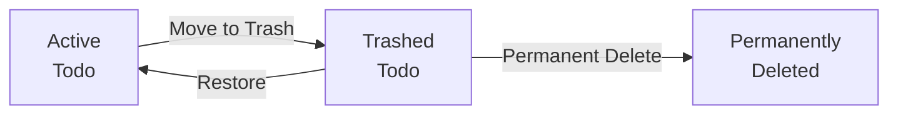
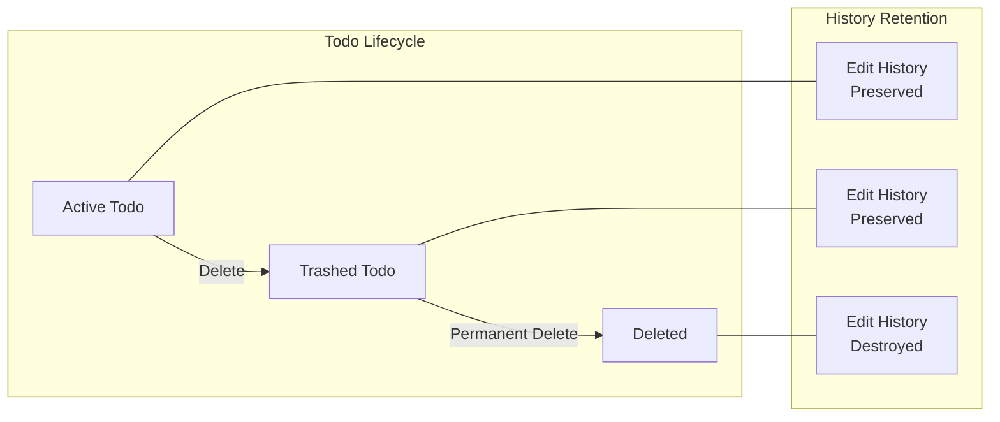
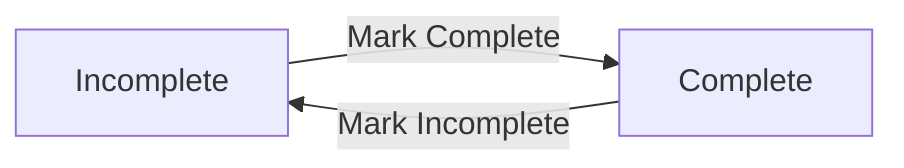
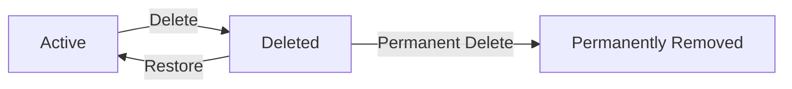
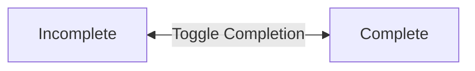
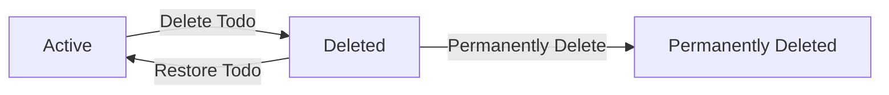

**multiUserTodo — Business concepts, relationships, and states from user perspective**

Business concepts, relationships, and states from user perspective

# Domain Concepts

Describe what each concept means in the business domain and its key attributes.

## User Concept

A User represents an individual person who has registered to use the todo application. Each user is uniquely identified by their email address, which they use to access their account along with a password. Users have a display name that appears in their profile and helps personalize their experience. Email addresses must be unique across the entire system to ensure proper identification. The display name is a piece of profile information that users can customize to their preference. These attributes establish a person's identity within the application and enable access to their private todo data.

### User Registration and Identity

A User is a person who has completed the registration process to create an account within the application. Upon registration, the person obtains a unique account identity distinguished by an email address. This email address serves as the unique identification for the user across the entire system; no two users may share the same email address. Together with the email address, a password is associated with the user account for authentication purposes, establishing the credentials required to verify the user's identity and grant access to their data.

### Profile Information and Data Privacy

Each user possesses personal profile information consisting of a display name that represents the user within the application interface. This profile information personalizes the user's presence in the system. The user's data, including todos and associated records, is governed by strict privacy boundaries; users maintain exclusive private access to their own data, with no visibility or accessibility permitted between different user accounts. This ensures each user's information remains isolated and inaccessible to others.

## Todo Concept

A Todo represents a task or item that a user needs to complete or track. Each todo has a title that describes what needs to be done, which is always required when creating a task. Users can optionally add a description to provide additional details and context about the task. A todo may have a start date indicating when work on the task should begin, and this is optional. A todo may also have a due date indicating when the task should be finished, which is also optional. Every todo has a completion status that indicates whether the task has been finished or remains open. When first created, todos are automatically in an incomplete state.

### Todo as Task Representation

A Todo represents a task or item that a user needs to complete or track. It serves as the central unit of work within the system, allowing users to organize their activities and monitor their progress toward specific goals.

Each todo belongs to exactly one user and exists within that user's private workspace. Users cannot access or view todos created by other users, ensuring complete privacy of task data.

When users create a todo, they describe a specific piece of work they intend to accomplish. This description of the task forms the foundation for tracking progress from inception through completion.

### Task Attributes

Every todo has several attributes that define what the task involves and when it should be worked on.

The title is a brief description of what needs to be done and is always required when creating a todo. Without a title, a todo cannot be created.

The description provides additional details and context about the task. This is optional and can be left empty when the title alone sufficiently describes what needs to be accomplished.

A start date indicates when work on the task should begin. This is optional and can be left unset when the start timing is not yet determined or not relevant to the task.

A due date indicates when the task should be finished. This is optional and can be left unset when there is no specific deadline for the task.

Collectively, these attributes form the complete details of a task, enabling users to adequately plan and track their work.

### Completion Status and Work States

Every todo has a completion status that indicates whether it has been finished or remains open. This status represents whether the work has been accomplished or is still pending.

When a todo is first created, it is automatically in an incomplete state, indicating the task has not yet been finished.

Users can toggle the completion status to mark work as finished when they have completed the task, or revert it to open if they need to resume work on a previously completed item.

These two states — complete and incomplete — provide clear indication of work progress: incomplete todos represent open tasks that still require attention, while complete todos represent finished work that has been accomplished.

## TodoHistory Concept

TodoHistory represents a record of changes made to a todo over time, creating an audit trail of edits. Each history entry captures the exact moment when an edit was performed, recording when the change occurred. When a todo's title is modified, the history preserves what the title was changed to during that specific edit. When a todo's description is updated, the history records the new description value that was applied. When a todo's start date is altered, the history entry reflects the new start date that was set. When a todo's due date is modified, the history captures the new due date value that was saved. These records collectively form a chronological timeline of all modifications made to a todo.

### Todo History Definition and Purpose

A Todo History represents a record of changes made to a todo over time, creating an audit trail of all edits performed on that todo. Each edit record captures the exact moment when an edit was performed, recording when the modification occurred. The edit preservation mechanism ensures that every time a todo's content is modified, a corresponding history entry is created automatically. This change tracking system allows users to see how their tasks have evolved over time, providing a complete modification history from the todo's creation through all subsequent updates. The chronological timeline formed by these records is immutable and serves as a permanent audit trail of all changes.

### History Entry Attributes

Each edit record in the modification history contains specific attributes that capture the state of the todo at the moment of editing. The change timestamp records exactly when the edit was made. When a todo's title is modified, the record preserves the new title value that was applied. When a todo's description is updated, the record stores the new description value that was saved. When a todo's start date is altered, the record reflects the new start date that was set. When a todo's due date is modified, the record captures the new due date value that was saved. Together, these previous values form a complete picture of what changed during each specific edit operation.

## TodoTrash Concept

TodoTrash represents a holding area for todos that have been deleted by their owner but not yet permanently removed from the system. When a todo is moved to trash, the system records the exact moment when this soft deletion occurred. Todos in trash remain recoverable and can be restored to active status by their owner. Each trashed todo maintains its original data including title, description, dates, and completion status while in this state. When a todo is permanently deleted from trash, the system records when this irreversible removal occurred. Permanent deletion also removes all associated history records tied to that todo. The trash concept provides a safety mechanism that prevents immediate data loss while allowing users to recover mistakenly deleted items.

### TodoTrash Definition and Attributes

TodoTrash represents a holding area that maintains todos after their owner has initiated deletion but before permanent removal occurs. Each entry in the trash preserves the complete todo including its title, description, start date, due date, and completion status at the moment of deletion.

A soft deleted todo maintains a reference to its original data and records the exact timestamp when the deletion occurred. This deletion timestamp marks when the todo transitioned from active status to the trash state.

The trash serves as a safety mechanism that prevents immediate data loss while allowing users to recover mistakenly deleted items. Todos within the trash remain restorable and can be returned to active status by their owner at any time before permanent deletion occurs.

Key attributes include:
- The original todo reference (preserving title, description, start date, due date, completion status)
- The deletion timestamp recording when the soft deletion occurred
- The permanent deletion timestamp (set only when irreversible removal is executed)

The trash state maintains data preservation during the period between soft deletion and potential permanent deletion.

### Trash Lifecycle and Recovery

The trash holding area supports two distinct outcomes for deleted todos: restoration or permanent deletion.

Restorable todos can be moved back to the active todo list by their owner. When a todo is restored, it returns to its previous state with all attributes intact including completion status and historical edit records.

Permanent deletion represents irreversible removal from the system. When a todo is permanently deleted from the trash, the system records when this irreversible removal occurred. This operation cascades to remove all associated edit history entries tied to that todo.

The deleted todo list provides owners with a paginated view of their trashed items, allowing them to review contents before deciding on restoration or permanent deletion.

### Account Deletion Cascade

When a user account is deleted, all todos owned by that user undergo permanent removal regardless of their current state. This includes both active todos and any todos residing in the trash holding area.

The account deletion cascade ensures complete data removal:
- All active todos are permanently deleted
- All trashed todos undergo permanent deletion
- All edit history entries for every todo are removed

This cascade applies to all todos across the user's account, including those in various states of completion and those previously soft deleted.

# Domain Relationships

Describe how concepts relate to each other from a business perspective.

## Conceptual Relationships

Describe how concepts relate to each other in business terms.

### User-Todo Ownership

Each user has their own collection of todos. This is an ownership relationship where the user is the sole owner of their todos. When a user is deleted, all their todos (defined in User Concept), including those in trash (defined in TodoTrash Concept), are permanently removed. A todo may only exist in the context of its creating user and cannot be transferred to another user. A todo is always associated with exactly one user.

### Todo-TodoHistory Association

Each todo maintains a history of its edits over time. A todo has many historical entries recording changes made to it. Each history entry (defined in TodoHistory Concept) belongs to exactly one todo and records what changed at a specific point in time. The history entries are ordered by when the edit was made, with the most recent entry first. A todo always has at least zero history entries, and there is no upper limit on how many history entries a todo may accumulate.

### Todo Deletion Relationship

When a todo is deleted by its owner, it moves to a soft-deleted state represented as a trash entry. A deleted todo has a corresponding trash record that preserves the deletion timestamp and tracks when permanent removal may occur. The trash entry belongs to the same user who owned the original todo. A todo in trash may be restored, which removes its trash entry and returns it to the active todo list. A todo may only have one trash entry at any given time.

### User Access Boundaries

The relationship between users and todos is strictly private. Users only have access to their own todos, todo histories, and trash entries. There are no shared, collaborative, or visible relationships between different users' data. A user cannot view, access, or interact with another user's todos, histories, or trash entries under any circumstances.

## Lifecycle and Retention

Describe concept lifecycle states and transitions only. Detailed retention/recovery policies belong in 05-non-functional. Operation details belong in 03-functional-requirements.

### Todo Lifecycle States

A todo traverses through well-defined states during its existence in the system. Understanding these states is fundamental to modeling user interactions.

**State Definitions:**

- **Active**: The todo exists in the user's normal todo list. It can be viewed, edited, marked complete or incomplete, and moved to trash.
- **Trashed**: The todo has been soft-deleted and resides in the trash. It is no longer visible in the normal todo list but can be restored or permanently deleted.
- **Permanently Deleted**: The todo and its associated edit history have been removed from the system entirely and cannot be recovered.

**State Transition Flow:**



- When a user deletes a todo, it transitions from Active to Trashed
- When a user restores a deleted todo, it transitions from Trashed back to Active
- When a user permanently deletes a trashed todo, it transitions to Permanently Deleted

**Cascading Impact:**

The todo's edit history follows the todo's lifecycle. When a todo is moved to trash, its history remains accessible. However, when a todo is permanently deleted from trash, its complete edit history is also permanently removed.

### User Account Deletion Lifecycle

User account deletion has cascading effects on all associated concepts, representing the most comprehensive lifecycle transition in the domain.

**Account Deletion Impact:**

When a user chooses to delete their account, the following occurs:

1. All Active todos belonging to the user transition to a deleted state
2. All Trashed todos belonging to the user transition to a permanently deleted state
3. All edit histories for those todos are permanently removed
4. The user profile and account credentials are removed

**Lifecycle Relationship Diagram:**

```mermaid
flowgraph TD
    U["User Account"] -->|"owns"| A["Active Todos"]
    U -->|"owns"| T["Trashed Todos"]
    U -->|"caused"| H["Edit Histories"]
    
    U -->|"Account Deleted"| D["Permanent Removal"]
    A -->|"cascade"| D
    T -->|"cascade"| D
    H -->|"cascade"| D
```

**Important Distinction:**

Individual todo deletion (soft delete followed by permanent delete) allows for recovery via trash restoration. Account deletion does not involve a recovery period or trash state—all data is immediately and permanently removed.

### Edit History Retention Relationship

The edit history concept has a dependent lifecycle relationship to the associated todo. This relationship defines how historical records are preserved and eventually removed.

**Retention Model:**

Edit history entries are created and retained based on the following rules:

- An edit history entry is created every time a todo is modified
- History entries persist as long as the associated todo exists in the system
- History entries are sorted with the most recent edit appearing first in any history view
- When a todo is in trash, both the todo and its edit history remain retained

**Destruction Conditions:**

Edit history is permanently removed only when:
- The associated todo is permanently deleted from trash
- The user account is deleted (cascading to all owned todos and their histories)

**Visual Representation of Dependency:**



This retention relationship ensures users have access to their complete edit history for any todo they can view, while ensuring complete data removal when appropriate.

# Business Categories and State Flows

Business category classifications and state flow definitions.

## Business Category Definitions

Define all business category classifications with their allowed values and descriptions.

### Todo Completion Status

The system categorizes todos by their completion status using two mutually exclusive values:

**Complete**
A todo that has been marked as finished by its owner. Complete todos are considered resolved tasks and can be filtered separately from incomplete todos.

**Incomplete**
A todo that has not yet been marked as complete. All newly created todos default to this status. Incomplete todos represent active work items that require attention.

A todo can transition between these two states in either direction. There are no restrictions on how many times a todo's completion status can be toggled.



### Todo Deletion Status

The system categorizes todos by their deletion status using two mutually exclusive values:

**Active**
A todo that exists in the normal todo list. Active todos are visible in standard views and can be edited, completed, or deleted. All todos are created with this status.

**Deleted (Soft Deleted)**
A todo that has been moved to the trash by its owner. Deleted todos are no longer visible in the normal todo list but retain their data and edit history. They can be restored to active status or permanently removed.



Permanently removed todos cease to exist in the system along with their edit history.

### Time-Based Sorting Categories

The system supports sorting todos by temporal attributes using the following classification types:

**Creation Date**
The timestamp when a todo was originally created by its owner. Sorting may be in descending order (newest first) or ascending order (oldest first).

**Start Date**
An optional date field indicating when work on a todo should begin. When sorting by start date:
- Todos with an assigned start date appear in chronological order
- Todos without a start date appear at the end of the list regardless of direction
- Sorting may be in ascending order (earliest first) or descending order (latest first)

**Due Date**
An optional date field indicating when a todo should be completed. When sorting by due date:
- Todos with an assigned due date appear in chronological order
- Todos without a due date appear at the end of the list regardless of direction
- Sorting may be in ascending order (earliest first) or descending order (latest first)

All three temporal classifications serve as independent sorting dimensions and can be combined with completion status filters.

## State Transitions

Define valid state transition paths for stateful concepts.

### Todo Completion Status State Flow

A todo's completion status represents whether the user has finished the task. The status flows between two mutually exclusive states.

**Valid States:**
- **Incomplete**: The todo has not been finished (default when created)
- **Complete**: The todo has been finished

**State Transitions:**
- An incomplete todo can become complete when the user marks it as finished
- A complete todo can become incomplete when the user marks it as unfinished
- This is a bidirectional toggle between the two states



### Todo Lifecycle State Flow

A todo progresses through lifecycle states from creation to potential permanent deletion. The lifecycle governs visibility and availability for user operations.

**Valid States:**
- **Active**: The todo is visible in the todo list and available for normal operations
- **Deleted**: The todo has been soft deleted and resides in the trash (no longer visible in the normal todo list)
- **Permanently Deleted**: The todo and its associated history have been irrevocably removed

**State Transitions:**
- When created, a todo begins in the active state
- An active todo can transition to deleted when the user deletes it (soft delete operation)
- A deleted todo can transition back to active when the user restores it from trash
- A deleted todo can transition to permanently deleted when the user chooses permanent deletion
- Permanent deletion is terminal and cannot be reversed



### Todo History Recording Workflow

Each edit operation on a todo triggers a history recording workflow. This workflow captures the state of todo attributes at the moment of change.

**Workflow Trigger:**
- The workflow begins when a user submits an edit to an existing todo
- The workflow only proceeds if the submitted changes differ from current values

**Recording Process:**
- The system captures the timestamp when the edit occurred
- For each attribute that changed, the system records the previous value that was replaced
- The history entry preserves what the title was before the change (if title was modified)
- The history entry preserves what the description was before the change (if description was modified)
- The history entry preserves what the start date was before the change (if start date was modified)
- The history entry preserves what the due date was before the change (if due date was modified)
- Attributes that did not change are not recorded in that specific history entry

**History Accumulation:**
- Multiple edits to the same todo accumulate as separate history entries
- History entries are ordered from most recent to oldest when viewed