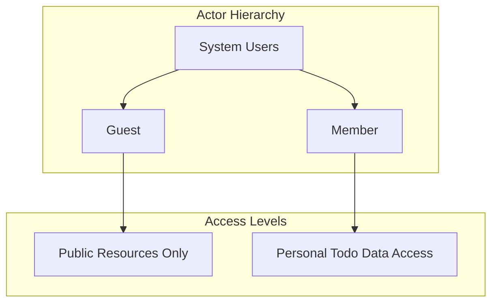
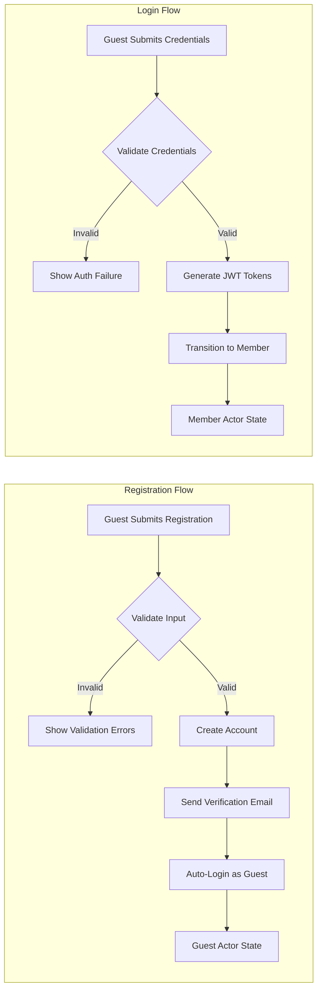
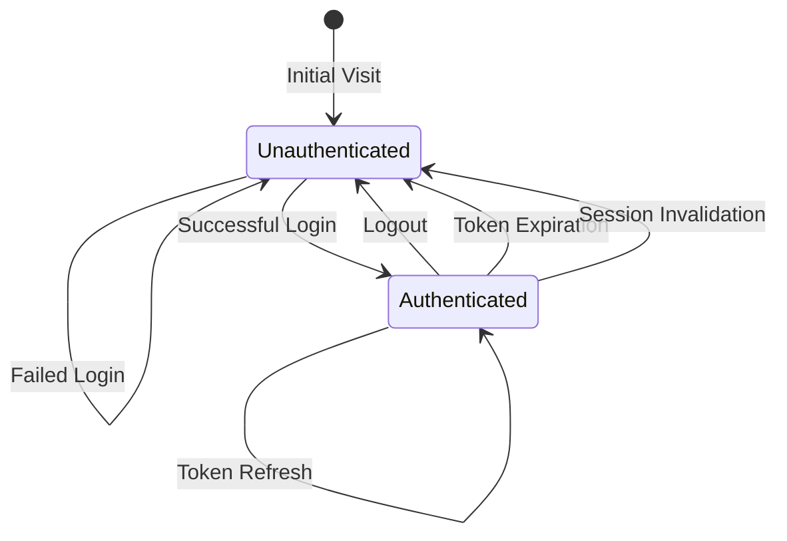
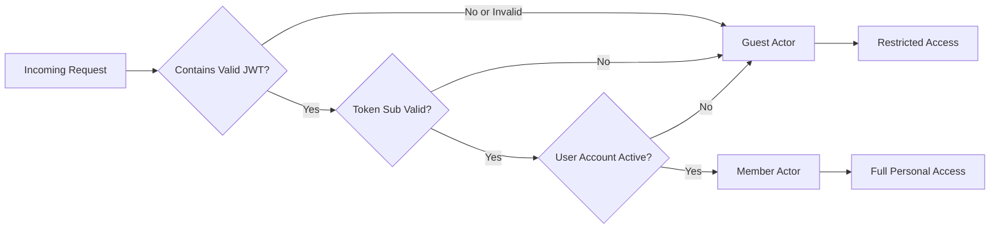

# User Actors and Authentication Requirements

## 1. Actor Overview

### 1.1 Purpose and Scope

The Todo application implements a role-based access control system with clearly defined user actors. Each actor represents a specific category of system user with distinct permissions, capabilities, and access boundaries. The actor model ensures that users can only access their own data and that authentication gates properly protect sensitive operations.

### 1.2 Actor Hierarchy

The system defines a simple two-tier actor hierarchy:



This hierarchy establishes that:
- **Guests** represent unauthenticated visitors with no personal data access
- **Members** represent authenticated users with full access to their own private todo lists
- There is no inheritance between actors - authentication status determines available capabilities

### 1.3 Actor Transition Points

Users transition between actors through specific authentication actions:

| Transition | From Actor | To Actor | Trigger Event |
|------------|------------|----------|---------------|
| Registration | Guest | Member | Successful account creation |
| Login | Guest | Member | Valid credentials submitted |
| Logout | Member | Guest | Explicit logout action executed |
| Session Expiration | Member | Guest | Token/Session becomes invalid |
| Account Deletion | Member | Guest | Account successfully removed |

### 1.4 Design Philosophy

The actor design follows these core principles:

1. **Privacy-First Architecture**: WHEN a user accesses the system, THE system SHALL ensure that each user's todo data is completely isolated and inaccessible to any other user.

2. **Minimal Permissions Principle**: WHEN a user is assigned an actor role, THE system SHALL grant only the permissions necessary for that specific role.

3. **Explicit Authentication**: WHEN a sensitive operation is requested, THE system SHALL require explicit authentication before permitting the operation.

4. **Stateless Session Management**: WHEN authentication state is maintained, THE system SHALL use signed tokens rather than server-side sessions.

## 2. Guest Actor Definition

### 2.1 Actor Identity

**Actor Name**: Guest  
**Classification**: Unauthenticated Visitor  
**Identity State**: No verified identity in the system

### 2.2 Actor Description

A Guest represents any visitor accessing the Todo application without presenting valid authentication credentials. This is the default actor state for all new visitors to the system.

### 2.3 Capabilities

Guests have restricted access limited to public-facing resources and authentication-related functionality:

**Allowed Actions**:
- Access the public landing page and marketing content
- View information about the service features and benefits
- Register for a new account by submitting registration data
- Log in to an existing account by submitting credentials
- Request password reset for forgotten credentials

**Prohibited Actions**:
- Create, view, update, or delete any todo items
- Access any personal user data or todo lists
- Modify account settings or profile information
- Access authenticated-only API endpoints
- View other users' todo data

### 2.4 Business Rules

**WHEN** a Guest attempts to access any member-only resource, **THE** system **SHALL** redirect the user to the login page or return an authentication-required response.

**IF** a Guest provides invalid or malformed credentials during login, **THEN THE** system **SHALL** display a generic authentication failure message without revealing whether the username exists.

**THE** Guest actor **SHALL** automatically transition to Member actor upon successful authentication.

### 2.5 Authentication-Related Operations

Guests may perform the following authentication operations:

| Operation | Purpose | Validation Requirements |
|-----------|---------|----------------------|
| Registration | Create new account | Email format validation, password strength requirements, unique email verification |
| Login | Authenticate existing account | Valid email and password combination |
| Password Reset Request | Initiate password recovery | Valid registered email address |
| Password Reset Confirmation | Complete password recovery | Valid reset token and new password meeting strength requirements |

## 3. Member Actor Definition

### 3.1 Actor Identity

**Actor Name**: Member  
**Classification**: Authenticated User  
**Identity State**: Verified identity with valid authentication token

### 3.2 Actor Description

A Member represents a successfully authenticated user who has established their identity through the authentication system. Members have complete control over their personal todo list and account settings while being completely isolated from other members' data.

### 3.3 Capabilities

Members have full access to their personal data and account management functions:

**Todo Management Capabilities**:
- Create new todo items with title and optional description
- View their complete list of todo items
- Update existing todo items (modify title, description, completion status)
- Mark todos as completed or uncompleted
- Delete individual todo items
- Delete multiple todo items in bulk

**Account Management Capabilities**:
- View and update profile information
- Change account password
- Update email address with verification
- Log out to end the current session
- Request complete account deletion

**Prohibited Actions**:
- View, modify, or delete any other member's todo items
- Access administrative functions
- View system-wide data or user lists
- Modify other users' account information

### 3.4 Business Rules

**THE** Member actor **SHALL** only be able to access and manipulate todo items that are explicitly associated with their own user account.

**WHEN** a Member attempts to access a todo item, **THE** system **SHALL** verify ownership before permitting any read or write operations.

**IF** a Member attempts to access a todo item they do not own, **THEN THE** system **SHALL** return a "not found" response rather than revealing the item exists.

**THE** Member actor **SHALL** automatically transition to Guest actor upon logout or when their authentication token expires.

**WHERE** a Member has been inactive for an extended period exceeding 30 minutes, **THE** system **SHALL** require re-authentication before permitting sensitive operations.

### 3.5 Data Ownership and Isolation

The following table defines the boundary of data access for Members:

| Data Type | Member Access | Other Members' Access |
|-----------|---------------|----------------------|
| Own Todo Items | Full CRUD | No Access |
| Own Profile Data | Full Access | No Access |
| Other Users' Todos | No Access | Full CRUD (for that user) |
| System Configuration | No Access | No Access |
| Public Marketing Content | Read-Only | Read-Only |

## 4. Authentication Requirements

### 4.1 Core Authentication Functions

The system **SHALL** provide the following core authentication functions:

**Registration**:
**WHEN** a Guest submits registration information, **THE** system **SHALL** validate the email format, enforce password strength requirements, verify email uniqueness, and create a new member account.

**Login**:
**WHEN** a Guest submits valid login credentials, **THE** system **SHALL** validate the credentials, generate authentication tokens, and establish an authenticated session.

**Logout**:
**WHEN** a Member requests logout, **THE** system **SHALL** invalidate the current authentication token and terminate the session.

**Email Verification**:
**WHEN** a Member registers or updates their email, **THE** system **SHALL** send a verification email and track verification status.

**Password Reset**:
**WHEN** a Member requests password reset, **THE** system **SHALL** generate a time-limited reset token valid for 24 hours and send it to the registered email address.

**Password Change**:
**WHEN** an authenticated Member changes their password, **THE** system **SHALL** require the current password and validate the new password meets strength requirements.

**Token Refresh**:
**WHEN** an access token expires but the refresh token is valid, **THE** system **SHALL** generate new authentication tokens without requiring re-authentication.

**Account Deletion**:
**WHEN** a Member requests account deletion, **THE** system **SHALL** verify the request through confirmation, remove all user data including todos, and invalidate all tokens.

### 4.2 Authentication Flow Requirements



### 4.3 Password Requirements

**IF** a user attempts to register or change password, **THEN THE** system **SHALL** enforce the following password requirements:

- Minimum length of 8 characters
- Contains at least one uppercase letter
- Contains at least one lowercase letter
- Contains at least one numeric digit
- Contains at least one special character
- Must not be a commonly used weak password

**THE** system **SHALL** store passwords using a cryptographically secure hashing algorithm with salt.

**IF** a user fails authentication three consecutive times within a 15-minute window, **THEN THE** system **SHALL** temporarily rate-limit further authentication attempts from that source for 30 minutes.

## 5. Authorization Matrix

### 5.1 Permission Matrix

The following matrix defines the permissions for each actor across system resources:

| Resource/Action | Guest | Member |
|---------------|:-----:|:------:|
| **Landing Page** | Read | Read |
| **Registration** | Create | Create (redirect to account) |
| **Login** | Execute | Execute (redirect to dashboard) |
| **Logout** | N/A | Execute |
| **View Own Todos** | No Access | Read |
| **Create Todo** | No Access | Create |
| **Update Own Todo** | No Access | Update |
| **Delete Own Todo** | No Access | Delete |
| **View Other's Todos** | No Access | No Access |
| **Modify Account Settings** | No Access | Update |
| **Delete Account** | No Access | Delete |

### 5.2 Authorization Enforcement Points

The system **SHALL** enforce authorization at the following points:

**API Gateway Level**:
- Validate JWT token presence for protected endpoints
- Reject requests with invalid or expired tokens
- Extract user identity from valid tokens

**Service Level**:
- Verify user owns requested resources before data access
- Implement ownership checks for all todo operations
- Enforce categorical restrictions (Guests cannot access member endpoints)

**Data Access Level**:
- Include ownership clauses in all data queries
- Filter results to include only owned data
- Prevent data exposure through query injection

### 5.3 Ownership Verification Rules

**THE** system **SHALL** enforce the following ownership verification rules:

**WHEN** a Member attempts to create a todo, **THE** system **SHALL** automatically associate the todo with the authenticated member's user ID.

**WHEN** a Member attempts to read, update, or delete a todo, **THE** system **SHALL** verify that the todo's owner ID matches the requesting member's ID.

**IF** a todo's owner ID does not match the requesting member's ID, **THEN THE** system **SHALL** treat the todo as non-existent and return a 404 Not Found response.

**THE** system **SHALL NOT** reveal the existence of todos that the requesting user does not own.

## 6. Session Management

### 6.1 Session Lifecycle



### 6.2 Token Expiration and Refresh

**Access Token**:
- Expiration time: 15 minutes after issuance
- Used for: Authenticating API requests
- Storage: Client-side (localStorage with fallback to memory)
- Format: JWT with RS256 or HS256 signature

**Refresh Token**:
- Expiration time: 7 days after issuance
- Used for: Obtaining new access tokens without re-authentication
- Storage: HTTP-only secure cookie (recommended) or encrypted localStorage
- Format: JWT with strong cryptographic signature
- Single-use: Each refresh consumes the old token and issues a new one

**Token Refresh Flow**:
**WHEN** an access token expires during an active user session, **THE** client **SHALL** automatically use the refresh token to obtain new authentication credentials.

**IF** the refresh token is valid, **THEN THE** system **SHALL** issue new access and refresh tokens, invalidating the previous refresh token.

**IF** the refresh token is invalid, expired, or previously used, **THEN THE** system **SHALL** require the user to re-authenticate with credentials.

### 6.3 Session Security Requirements

**WHILE** a user maintains an active session, **THE** system **SHALL** track the following security attributes:

- Last activity timestamp for session timeout detection
- Token issuance time for rotation policies
- IP address changes for anomaly detection
- User agent changes for security alerts

**IF** suspicious session activity is detected (rapid IP changes, impossible travel patterns), **THEN THE** system **SHALL** invalidate the session and require re-authentication.

**THE** system **SHALL** provide functionality for users to view and terminate active sessions from other devices.

### 6.4 Logout and Session Termination

**WHEN** a Member executes logout, **THE** system **SHALL**:
1. Invalidate the current access token
2. Invalidate the associated refresh token
3. Clear any client-side token storage
4. Transition the actor from Member to Guest

**THE** system **SHALL** support "logout from all devices" functionality that invalidates all refresh tokens associated with the user account.

## 7. Token Strategy

### 7.1 JWT Implementation Requirements

The system **SHALL** use JSON Web Tokens (JWT) for authentication with the following specifications:

**Algorithm**: RS256 (RSA with SHA-256) or HS256 (HMAC with SHA-256)  
**Token Type**: Bearer tokens in Authorization header  
**Token Format**: RFC 7519 compliant JWT

### 7.2 JWT Payload Structure

**Access Token Payload**:
```json
{
  "sub": "uuid-of-user",
  "iss": "todo-app",
  "aud": "todo-app-api",
  "iat": 1738212000,
  "exp": 1738212900,
  "jti": "unique-token-id",
  "typ": "access",
  "role": "member"
}
```

**Refresh Token Payload**:
```json
{
  "sub": "uuid-of-user",
  "iss": "todo-app",
  "aud": "todo-app-api",
  "iat": 1738212000,
  "exp": 1738816800,
  "jti": "unique-token-id",
  "typ": "refresh"
}
```

**Required Claims**:
- `sub` (Subject): Unique identifier for the authenticated user (UUID)
- `iss` (Issuer): Identifier of the issuing service
- `aud` (Audience): Intended recipient of the token
- `iat` (Issued At): Timestamp when token was issued
- `exp` (Expiration): Timestamp when token expires
- `jti` (JWT ID): Unique identifier for this specific token
- `typ` (Type): Distinguishes access tokens from refresh tokens

**Optional Claims**:
- `role`: User role for basic authorization decisions
- `email`: User's email address (if needed for client-side UI)

### 7.3 Token Security Requirements

**WHEN** generating JWT tokens, **THE** system **SHALL**:

- Use cryptographically secure random number generation for signing keys
- Store private keys in secure environment variables or key management systems
- Rotate signing keys periodically (recommended: every 90 days)
- Implement key versioning to support gradual rotation
- Never expose private signing keys in client-side code
- Validate all token claims before accepting authentication

**IF** a token is detected in a request to a public endpoint that does not require authentication, **THEN THE** system **SHALL** ignore the token rather than rejecting the request.

### 7.4 Token Storage Guidelines

While token storage is primarily a client-side concern, the system **SHALL** provide documentation recommending:

**Access Token**:
- Store in memory for single-page applications
- Use secure storage mechanisms that prevent XSS exposure
- Never store in localStorage for high-security applications

**Refresh Token**:
- Store in HTTP-only, Secure, SameSite=Strict cookies (recommended)
- If localStorage must be used, encrypt before storage
- Implement token binding to prevent token theft and replay attacks

### 7.5 Token Revocation Strategy

**THE** system **SHALL** implement token revocation for the following scenarios:

- User-initiated logout (invalidate refresh token)
- Password change (invalidate all existing refresh tokens)
- Account compromise suspected (all tokens revoked)
- User-initiated "logout all devices" action
- Administrative account suspension

**THE** system **SHALL** maintain a token blocklist (or equivalent mechanism) to track revoked tokens until their natural expiration.

## 8. Actor State Determination

### 8.1 State Logic Flow



### 8.2 State Transition Triggers

**Guest to Member Transition**:
- Successful login with valid credentials
- Successful registration with immediate login
- Successful token refresh (Guest with expired Member token)

**Member to Guest Transition**:
- Explicit logout action
- Access token expiration without valid refresh token
- Account suspension or deletion
- Token revocation due to security event

**Persistent State**:
- Guest state persists indefinitely unless authentication occurs
- Member state persists for the duration of valid tokens
- State is determined per-request based on token validation

## 9. Error Handling for Authentication

### 9.1 Authentication Failure Scenarios

**Invalid Credentials**:
**WHEN** a user submits invalid credentials, **THE** system **SHALL** return a generic error message: "Invalid email or password" without revealing which field was incorrect.

**Expired Token (Access)**:
**WHEN** an API request includes an expired access token, **THE** system **SHALL** return HTTP 401 with error code `TOKEN_EXPIRED` indicating that token refresh should be attempted.

**Expired Token (Refresh)**:
**WHEN** a token refresh request includes an expired refresh token, **THE** system **SHALL** return HTTP 401 with error code `SESSION_EXPIRED` requiring re-authentication.

**Invalid Token**:
**WHEN** a request includes a malformed or forged token, **THE** system **SHALL** return HTTP 401 with error code `INVALID_TOKEN`.

**Insufficient Permissions**:
**WHEN** an authenticated user attempts an action they are not permitted to perform, **THE** system **SHALL** return HTTP 403 with error code `INSUFFICIENT_PERMISSIONS`.

### 9.2 Rate Limiting for Authentication

**THE** system **SHALL** implement rate limiting on authentication endpoints:

- Login attempts: Maximum 5 attempts per 15-minute window per IP
- Registration attempts: Maximum 3 attempts per hour per IP
- Password reset requests: Maximum 3 requests per hour per email
- Token refresh: No strict limit but monitored for abuse

**IF** rate limits are exceeded, **THEN THE** system **SHALL** return HTTP 429 with appropriate retry-after headers indicating the time until the next allowed request.

## 10. Multi-Device Considerations

### 10.1 Concurrent Session Support

**THE** system **SHALL** allow users to maintain authenticated sessions on multiple devices simultaneously.

**WHERE** a user has sessions on multiple devices, **THE** system **SHALL**:
- Issue separate refresh tokens for each device
- Track session metadata (device type, last activity)
- Allow selective session termination (log out specific devices)

### 10.2 Session Synchronization

**WHEN** a user takes action on one device that affects authentication state (password change, logout all devices), **THE** system **SHALL** eventually invalidate sessions on other devices through token expiration.

**THE** system **SHALL NOT** rely on real-time session synchronization due to stateless JWT architecture.