**multiUserTodo — What operations users can perform, use cases, business workflows**

What operations users can perform, use cases, business workflows

# Core Business Operations

What the system must do for each business concept.

## User Operations

Users can create a new account by providing an email address and password. The system allows users to authenticate by logging in with their registered email and password. Users who wish to update their security credentials can change their existing password. When a user decides to leave the application, they can delete their account which removes all personal data. Account deletion also permanently removes all associated todos including those in the trash. Each user maintains a profile with a display name that can be edited at any time. User profiles are private and users cannot view other users' accounts or information. Access to todos is strictly limited to the owner with no sharing capabilities.

### User Registration

New users can create an account by providing an email address and password. The email address must be unique and not already registered in the system. The password is required for account creation. Upon successful registration, the user account is created and the user can immediately authenticate using the provided credentials. The new account is initialized with default profile settings. The user's todos are empty upon account creation.

### User Authentication

Users can authenticate by providing their registered email address and password. The system validates the credentials and grants access to the user's account upon successful authentication. Authentication is required for all subsequent operations within the application. The authentication flow follows standard credential validation.

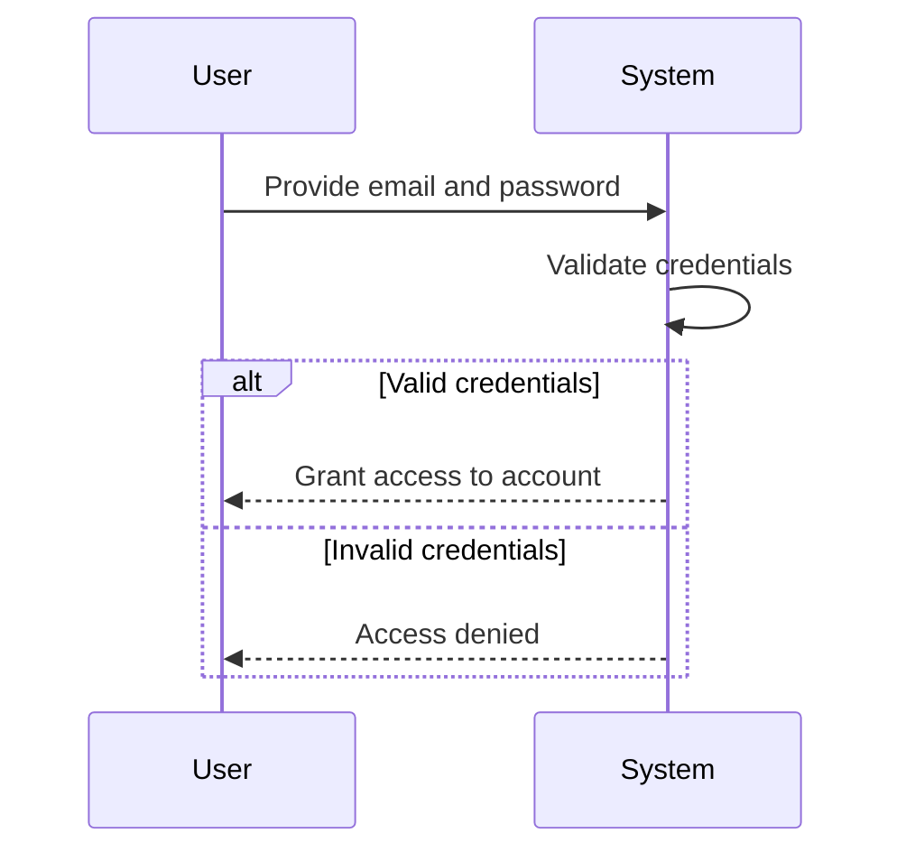

### Password Management

Users can change their existing password while authenticated. The user must provide their current password to authorize the change. Once the current password is verified, the user can set a new password. The system updates the authentication credentials to use the new password for future logins. The password change takes effect immediately and does not impact existing sessions.

### User Profile Management

Each user has a profile containing a display name. Users can view and edit their own display name at any time after authenticating. The display name can be updated without affecting any other account data or todos. Profile information is scoped to each individual user account.

### Account Deletion and Permanent Removal

Users can delete their account, which triggers permanent removal of all associated data. When an account is deleted, all todos owned by the user are permanently removed, including todos currently in the trash. All edit history entries associated with the user's todos are also permanently removed. The deletion operation cannot be undone and the email address becomes available for new registrations. Account deletion requires authentication to verify the requesting user's identity.

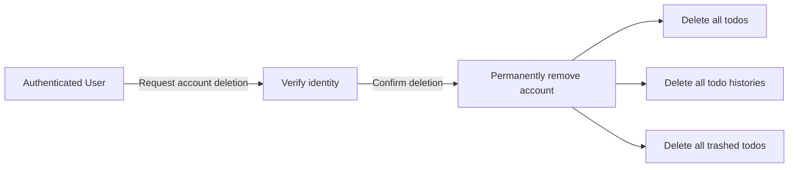

### Profile Privacy and Todo Ownership

User profiles are private. Users can only view and manage their own profile information. Users cannot view other users' profiles or access any information about other accounts. Each todo is owned exclusively by the user who created it. Todo ownership cannot be transferred. Users can only view, edit, complete, delete, and restore their own todos. There is no mechanism for sharing todos or viewing other users' todo lists. The privacy model ensures complete data isolation between user accounts.

## Todo Operations

Users can create new todos by providing a required title and optional description. When creating a todo, users may optionally specify a start date and due date. Newly created todos are marked as incomplete by default until changed by the user. Users can view a paginated list of their todos showing essential information like title, completion status, and dates. The list view shows start date and due date when set, along with the creation date of each todo. Users can open a detailed view to see the full description and all information for a specific todo. Users can toggle the completion status to mark todos as complete or return them to incomplete. Editing a todo allows changes to the title, description, start date, and due date at any time. Users can delete their own todos which moves them out of the normal list view.

### Todo Creation

Authorized users can create a new todo. Creating a todo requires providing a title; this field is mandatory and cannot be left empty. Users may optionally provide a description; if not provided, the description is left empty. Users may optionally specify a start date; if not provided, the start date is left empty. Users may optionally specify a due date; if not provided, the due date is left empty. When a new todo is created, it is marked as incomplete by default. The todo is automatically associated with the creating user. No other user can access or view the created todo. After creation, the todo appears in the creating user's todo list.

### Todo List View

Authorized users can view a list of their own todos. The list is paginated to allow browsing through potentially large collections. Each entry in the list displays: the todo's title; the completion status (complete or incomplete); the start date if one was set; the due date if one was set; and the creation date. Todos without a start date or due date do not display dates in the list entry. The list only includes todos that have not been deleted. Users cannot view another user's todo list.

### Todo Detail View

Authorized users can open a detailed view for any of their own todos. The detail view displays all information associated with the todo: the title; the full description (if any); the completion status; the start date (if set); the due date (if set); and the creation date. The detail view allows the user to see the complete description text, which may be longer than what appears in the list view. Users cannot view the details of another user's todos.

### Todo Completion Status Toggle

Authorized users can change the completion status of their own todos. A todo can be toggled from incomplete to complete. A todo can be toggled from complete back to incomplete. This is a simple two-state toggle operation. The completion status change takes effect immediately and is reflected in both the list view and detail view. Editing the completion status does not create an entry in the edit history.

### Todo Editing

Authorized users can edit their own todos. Editing allows modification of the title. Editing allows modification of the description (including clearing it). Editing allows modification of the start date (including clearing it). Editing allows modification of the due date (including clearing it). The title cannot be cleared during editing; it must always contain a value. When a todo is edited, the system creates an entry in the todo's edit history recording the changes made. The edit history is sorted from most recent to oldest. Users cannot edit another user's todos.

### Todo Soft Delete

Authorized users can delete their own todos. Deleting a todo performs a soft delete—the todo is no longer visible in the normal todo list but is not permanently removed from the system. Deleted todos are moved to a trash area where they can be viewed separately. Soft-deleted todos retain their edit history. Users can restore a soft-deleted todo from the trash, returning it to the normal todo list. Users cannot soft delete another user's todos.

## TodoHistory Operations

Every time a user edits a todo, the system records an entry in the edit history. Each history entry captures the timestamp when the edit was made. The system records what the title was changed to when a title modification occurs. When the description is modified, the new description value is preserved in the history entry. Changes to the start date are captured and saved in the edit history record. Changes to the due date are similarly recorded in the history entry when modified. Users can view the complete edit history for any of their own todos. The history is displayed sorted from most recent edit to oldest. When a todo is permanently deleted from the trash, all associated edit history is also removed.

### Edit History Recording

WHEN a user modifies a todo, THE system SHALL create an entry in the edit history for that todo.

THE system SHALL record the timestamp when the edit was made in each history entry.

WHEN the todo's title is modified during an edit, THE system SHALL record what the title was changed to in the history entry.

WHEN the todo's description is modified during an edit, THE system SHALL record what the description was changed to in the history entry.

WHEN the todo's start date is modified during an edit, THE system SHALL record what the start date was changed to in the history entry.

WHEN the todo's due date is modified during an edit, THE system SHALL record what the due date was changed to in the history entry.

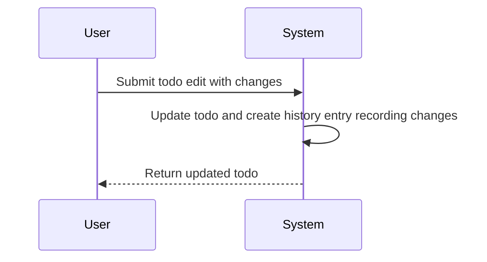

### Edit History Viewing

THE system SHALL allow users to view the complete edit history of any of their todos.

THE system SHALL display edit history entries sorted from most recent to oldest.

THE system SHALL provide history entries in association with the todo they describe.

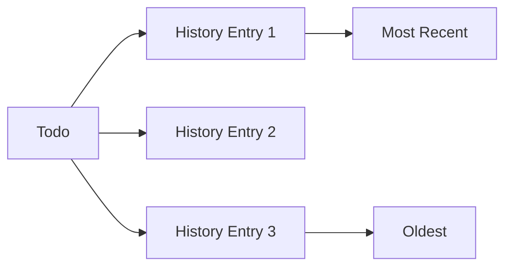

### Edit History Permanent Deletion

WHEN a todo is permanently deleted from the trash, THE system SHALL delete all edit history entries associated with that todo.

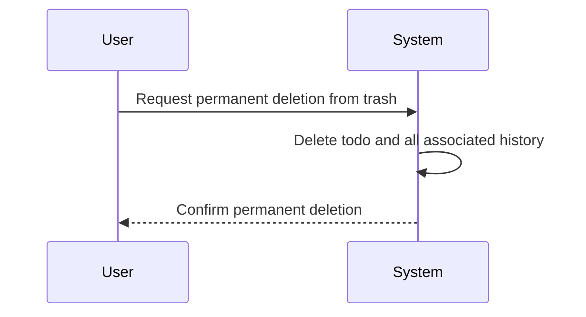

## TodoTrash Operations

Deleted todos are moved to a trash area rather than being immediately removed from the system. Users can view a paginated list of their deleted todos in the trash. The trash contains todos that were previously deleted from the main todo list. Users can restore a deleted todo from the trash back to their normal todo list. Restored todos return with all their information and settings intact. Users can permanently delete a todo from the trash when they no longer need it. Permanent deletion completely removes the todo from the system with no recovery option. When a todo is permanently deleted, all its edit history is also removed. Deleted todos are private and only visible to their owner in the trash view.

### Soft Delete Transition

WHEN a user deletes an active todo, THE system SHALL transition the todo to trashed status to enable future recovery rather than immediate permanent removal.
WHILE transitioning to trashed status, THE system SHALL preserve all todo content including title, description, start date, due date, and completion status.
THE system SHALL record the timestamp marking when the todo enters trashed status.
IF a todo is successfully moved to trash, THEN THE system SHALL immediately remove it from the standard active todo list view.
WHERE soft delete is performed, THE todo SHALL remain inaccessible from normal todo operations until restored or permanently deleted.

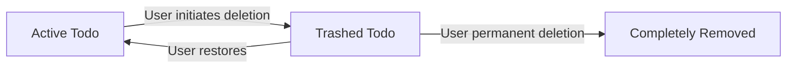

### Trash View and Pagination

WHERE a user accesses their deleted todo management area, THE system SHALL display a paginated list containing only todos owned by that user in trashed status (defined in Module 2 > TodoTrash Error Scenarios).
THE paginated trash list SHALL display for each entry: the todo title, completion status, start date if set, due date if set, and the timestamp when the todo was moved to trash.
IF the user has no todos in trashed status, THEN THE system SHALL present an empty trash view indicating no deleted items are available for recovery.
THE paginated list SHALL support navigation through large quantities of deleted todos without performance degradation.
WHERE trash privacy is enforced, THE system SHALL exclude todos belonging to other users (defined in Module 2 > TodoTrash Error Scenarios).

### Todo Restoration

WHEN a user selects a trashed todo for restoration, THE system SHALL return the todo to active status in the standard todo list.
UPON successful restoration, THE todo SHALL resume visibility in the active todo list and be removed from the trash view.
WHILE restoring a todo, THE system SHALL maintain all associated edit history entries (defined in Module 2 > TodoHistory Error Scenarios).
THE restored todo SHALL retain all content exactly as it existed prior to soft deletion, including title, description, dates, and completion status.
IF a user attempts to restore a todo not in trashed status, THEN THE system SHALL reject the restoration request (defined in Module 2 > TodoTrash Error Scenarios).

### Permanent Deletion

WHEN a user permanently deletes a todo from the trash, THE system SHALL completely remove the todo from the system with no recovery mechanism available.
UPON permanent deletion, THE system SHALL also eliminate all associated edit history entries (defined in Module 2 > TodoTrash Error Scenarios).
THE system SHALL record the timestamp marking when permanent deletion occurs, distinct from the initial soft deletion timestamp.
IF permanent deletion is executed, THEN THE todo SHALL no longer exist in any system view including trash, and restoration SHALL be impossible (defined in Module 2 > TodoTrash Error Scenarios).
WHERE complete removal is requested, THE system SHALL verify the todo currently resides in trashed status before execution (defined in Module 2 > TodoTrash Error Scenarios).

### Trash Access Control and Privacy

WHERE trash operations are attempted, THE system SHALL enforce that users can only access, view, or manage todos within their own private trash area (defined in Module 2 > TodoTrash Error Scenarios).
IF a user attempts to access another user's trash or perform operations on another user's deleted todos, THEN THE system SHALL deny access (defined in Module 2 > TodoTrash Error Scenarios).
THE trash area SHALL maintain complete privacy per user, ensuring deleted todo management remains strictly personal and isolated from other users (defined in Module 2 > TodoTrash Error Scenarios).
IF a user attempts to perform trash-specific operations on a todo in active status, THEN THE system SHALL reject the operation as invalid (defined in Module 2 > TodoTrash Error Scenarios).
WHERE deleted todo management occurs, THE system SHALL validate user ownership before permitting any trash view, restoration, or permanent deletion actions.

# Error Scenarios and Edge Cases

Business-level error scenarios, edge case coverage, and expected system behaviors for exceptional conditions.

## User Error Scenarios

When users attempt to sign up with an email address that is already registered, the system prevents duplicate account creation. Users who enter incorrect email or password during login are denied access to their account. When users attempt to change their password, they must provide their current password, and the system rejects the change if the current password is incorrect. Users who delete their account permanently lose all their data including todos in trash, and this action cannot be undone. Users attempting to view another user's profile are denied access since profiles are private. Deleting an account removes all associated todos and their histories without any recovery option.

### Duplicate Signup Prevention

When a guest attempts to register using an email address that is already associated with an existing member account (defined in Module 1 > User Operations: user sign up), the system rejects the registration attempt to prevent duplicate account creation. The guest receives notification that the email address is already registered, and no new account is created.

### Login Authentication Failure

When a user submits login credentials containing an incorrect email or password (defined in Module 1 > User Operations: user login), the system denies access to the account. The authentication failure response does not indicate which specific credential was incorrect, maintaining security by not revealing whether the email address exists in the system.

### Password Change Verification Failure

When a member attempts to change their account password (defined in Module 1 > User Operations: password change), the system requires the current password for identity verification. If the provided current password does not match the stored credentials, the password change request is rejected, and the existing password remains unchanged.

### Cross-User Profile Access Prevention

When a user attempts to access or view another user's profile information (defined in Module 1 > User Operations: display name editing), the system denies the request. Profiles are private, and users may only access their own profile information.

### Account Deletion with Permanent Data Loss

When a member deletes their account (defined in Module 1 > User Operations: account deletion), the system permanently removes all associated data without any recovery option. This includes all active todos, todos previously moved to trash (defined in Module 1 > TodoTrash Operations: soft delete), and all edit histories (defined in Module 1 > TodoHistory Operations: history deleted with permanent deletion). This action cannot be undone.

## Todo Error Scenarios

When users attempt to create a todo without a title, the system rejects the request since title is required. Users cannot create todos with empty or blank titles as these fail validation. When users try to access, edit, or delete a todo that does not belong to them, access is denied due to privacy requirements. Editing a todo with invalid date values prevents the update from being saved. Sorting by start date places todos without a start date at the end of the list. Sorting by due date places todos without a due date at the end of the list. Users attempting to filter by invalid completion status values receive an error. Accessing a single todo that has been soft-deleted returns a not-found error since it only exists in trash.

### Missing Title on Todo Creation

WHEN a user attempts to create a todo without providing a title, THE system SHALL reject the request and inform the user that a title is required.

WHEN a user provides an empty or blank title (containing only whitespace), THE system SHALL reject the request as if no title was provided.

```mermaid
flowchart LR
    A[\"User submits todo creation\"] --> B{\"Title provided?\"}
    B -->|\"No / Empty\"| C[\"Reject request\"]
    B -->|\"Yes\"| D[\"Create todo\"]
```

### Todo Access Denied for Non-Owners

WHEN a user attempts to access, view, edit, delete, or modify a todo that does not belong to them, THE system SHALL deny the request without revealing whether the todo exists.

WHILE a user attempts to perform any operation on another user's todo, THE system SHALL respond identically to operations performed on non-existent todos, ensuring no information leakage about other users' data.

IF a user tries to view a single todo's detail page that belongs to another user, THEN THE system SHALL display a \"not found\" message rather than an \"access denied\" message.

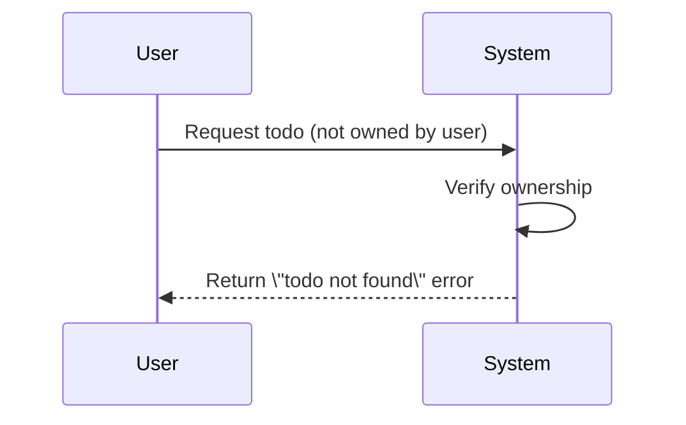

### Private Todo Protection

THE system SHALL ensure each user's todos are completely isolated from other users.

WHEN a user requests a list of their todos, THE system SHALL return only todos belonging to that authenticated user.

WHEN a user searches or filters todos, THE system SHALL restrict results to todos owned by that user.

THERE SHALL BE no mechanism or feature allowing users to view, share, or access another user's todos through any interface or operation.

### Invalid Date Values on Edit

WHEN a user attempts to edit a todo and provides an invalid start date format, THE system SHALL reject the update and inform the user about the invalid date.

WHEN a user attempts to edit a todo and provides an invalid due date format, THE system SHALL reject the update and inform the user about the invalid date.

WHEN a user edits a todo and sets the due date to be earlier than the start date, THE system SHALL reject the request and indicate that the due date cannot precede the start date.

```mermaid
flowchart LR
    A[\"User submits edit\"] --> B{\"Dates valid?\"}
    B -->|\"No\"| C[\"Reject update\"]
    B -->|\"Yes\"| D{\"Due date before<br/>start date?\"}
    D -->|\"Yes\"| C
    D -->|\"No\"| E[\"Save update\"]
```

### Todos Without Start Date Sorting Order

WHEN a user sorts their todos by start date in ascending order (earliest first), THE system SHALL place todos without a start date at the end of the list after all todos with start dates.

WHEN a user sorts their todos by start date in descending order (latest first), THE system SHALL place todos without a start date at the end of the list after all todos with start dates.

WHERE a sort by start date is performed, THE system SHALL preserve the relative order of todos having the same start date value.

### Todos Without Due Date Sorting Order

WHEN a user sorts their todos by due date in ascending order (earliest first), THE system SHALL place todos without a due date at the end of the list after all todos with due dates.

WHEN a user sorts their todos by due date in descending order (latest first), THE system SHALL place todos without a due date at the end of the list after all todos with due dates.

WHERE a sort by due date is performed, THE system SHALL preserve the relative order of todos having the same due date value.

### Soft-Deleted Todo Not Found Error

WHEN a user attempts to access a todo that has been soft-deleted, THE system SHALL return a \"not found\" error as if the todo does not exist.

WHEN a user attempts to edit a soft-deleted todo, THE system SHALL reject the request and indicate the todo was not found.

WHEN a user attempts to complete or toggle a soft-deleted todo, THE system SHALL reject the request and indicate the todo was not found.

WHERE a todo has been moved to trash, THE system SHALL only allow access through the trash-specific operations (view trash list, restore, permanent delete).

### Filter by Invalid Completion Status

WHEN a user attempts to filter todos by an invalid completion status value that is not one of the allowed options (all, complete, incomplete), THE system SHALL reject the filter request and inform the user of valid filter options.

IF a filter request contains an unrecognized completion status parameter, THEN THE system SHALL return an error indicating invalid filter criteria.

THE system SHALL support the following completion status filter values: \"all\" to show both complete and incomplete todos, \"complete\" to show only complete todos, and \"incomplete\" to show only incomplete todos.

```mermaid
flowchart LR
    A[\"User applies filter\"] --> B{\"Status value<br/>valid?\"}
    B -->|\"Invalid / Unknown\"| C[\"Reject filter\"]
    B -->|\"Valid\"| D[\"Apply filter<br/>to todo list\"]
```

## TodoHistory Error Scenarios

When users attempt to view edit history for a todo that does not exist, the system returns an error since there is no history to retrieve. Users cannot access the edit history of todos that belong to other users due to privacy restrictions. When a todo has never been edited, its history remains empty showing no entries. Users viewing history cannot see entries from before they owned the todo since history is tied to the specific todo lifecycle. Attempting to retrieve history for a permanently deleted todo fails because the history was deleted along with the todo.

### History for Non-Existent Todo Error

WHEN a user attempts to view edit history for a todo that does not exist, THE system SHALL reject the request.

IF the requested todo cannot be found in the system, THEN THE system SHALL return an error indicating the todo does not exist.

THE system SHALL prevent access to history records when the associated todo is not present.

The following diagram illustrates the error flow:

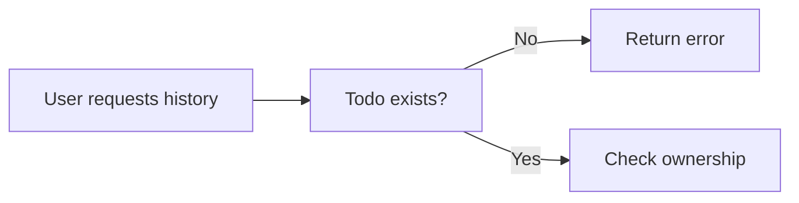

### Access Denied to Other Users' History

IF a user attempts to view edit history for a todo belonging to another user, THEN THE system SHALL reject the request.

THE system SHALL enforce privacy restrictions preventing access to edit history of todos owned by other users.

THE system SHALL verify todo ownership before displaying any history entries.

WHEN access is denied to history, THE system SHALL notify the user that the requested resource is not accessible.

THE system SHALL apply the same privacy rules to edit history as applied to the todos themselves.

### Empty History for Unedited Todo

WHEN a user views edit history for a todo that has never been edited, THE system SHALL display an empty list without error.

THE system SHALL indicate that no edits have been recorded for the requested todo.

THE system SHALL distinguish between empty history and error conditions.

IF a todo has no history entries, THEN THE system SHALL present a clear message stating no edits exist.

THE system SHALL allow users to access the history view even when no edits have been made.

### History Deleted with Permanent Deletion

WHEN a todo is permanently deleted from the trash, THE system SHALL delete all associated edit history entries.

IF a user attempts to retrieve history for a permanently deleted todo, THEN THE system SHALL reject the request.

THE system SHALL ensure no history traces remain after permanent deletion.

THE system SHALL treat attempts to access history for permanently deleted todos the same as attempts to access non-existent todos.

THE system SHALL remove history entries atomically with permanent todo deletion.

### Viewing History for Deleted Todo

WHEN a user views edit history for a todo in the trash, THE system SHALL retrieve and display the historical entries.

THE system SHALL preserve edit history during the soft-delete state.

THE system SHALL allow history access for todos that have been moved to trash but not yet permanently deleted.

THE system SHALL display history entries for deleted todos using the same format as active todos.

THE system SHALL maintain history integrity while the todo remains in trash.

### History Tied to Todo Ownership

THE system SHALL bind edit history access rights to the ownership of the associated todo.

THE system SHALL restrict edit history access to the owner of the todo.

WHEN ownership of a todo is verified, THE system SHALL apply the same verification to the edit history.

THE system SHALL prevent history entries from being accessed separately from their parent todo.

THE system SHALL ensure that transfer or deletion of a todo affects the associated history access rights accordingly.

## TodoTrash Error Scenarios

When users attempt to restore a todo that is not in their trash, the system returns an error since the operation is invalid. Users cannot restore todos from trash that have already been permanently deleted. Attempting to view another user's deleted todos in trash is denied since trash is private per user permanently delete a todo from trash, that todo and its entire edit history are gone. Users attempting to perform trash operations on todos that were never deleted receive errors.

### Restore Non-Existent Todo in Trash

WHEN a user attempts to restore a todo that does not exist in their trash, THE system SHALL reject the request and indicate that the todo is not found in trash.

IF a user attempts to restore a todo that was never created, THEN THE system SHALL reject the request.

WHEN a user attempts to restore a todo that exists in the active todo list but not in trash, THE system SHALL reject the request and indicate that the todo is not in trash.

### Access Denied to Other Users' Trash

WHEN a user attempts to view another user's trash list, THE system SHALL reject the request and prevent access to other users' deleted todos.

IF a user attempts to restore a todo from another user's trash, THEN THE system SHALL reject the request.

IF a user attempts to permanently delete a todo from another user's trash, THEN THE system SHALL reject the request.

THE system SHALL ensure that trash privacy is enforced such that users can only see, access, or modify trash items belonging to their own account.

### Trash Privacy Per User

THE system SHALL maintain complete isolation between users' trash contents.

WHILE a user is viewing their trash, THE system SHALL display only deleted todos belonging to that user.

THE system SHALL prevent any cross-user access to trash contents through direct links, search operations, or any other access method.

Trash visibility SHALL be restricted to the account owner only, with no sharing or delegation capabilities permitted.

### Permanent Deletion Removes History

WHEN a user permanently deletes a todo from trash, THE system SHALL remove all edit history entries associated with that todo.

WHEN permanent deletion is executed, THE system SHALL ensure that no history records remain for the deleted todo.

THE system SHALL reject any subsequent attempts to view edit history for a permanently deleted todo.

IF edit history exists for a todo being permanently deleted, THEN THE system SHALL delete that history as part of the permanent deletion operation.

### Trash Operations on Active Todo Error

IF a user attempts to restore a todo that is currently active (not deleted), THEN THE system SHALL reject the request and indicate that restoration is only possible for deleted todos.

IF a user attempts to execute trash-specific operations on a todo in the active list, THEN THE system SHALL reject the request.

WHEN a user attempts to access trash operations for a todo identifier that corresponds to an active todo, THE system SHALL reject the request.

### Already Permanently Deleted Todo

IF a user attempts to restore a todo that has already been permanently deleted, THEN THE system SHALL reject the request.

IF a user attempts to access a permanently deleted todo in any way, THEN THE system SHALL reject the request and indicate that the resource is no longer available.

WHEN permanent deletion has been completed for a todo, THE system SHALL ensure no subsequent operations can be performed on that todo or its associated data.

IF a user attempts to view details of a permanently deleted todo, THEN THE system SHALL reject the request.

### Trash List Pagination Boundaries

WHEN a user requests a page of deleted todos that exceeds the total number of available deleted todos, THE system SHALL return an empty list without error.

IF the requested page number is greater than the last available page of trash items, THEN THE system SHALL return an empty list.

THE system SHALL handle pagination requests beyond available data gracefully by returning empty results rather than error responses.

WHEN trash list pagination boundaries are reached, THE system SHALL indicate that no more items are available.

# End-to-End User Scenarios

Cross-domain user scenarios that span multiple concepts, describing complete user journeys.

## Cross-Domain User Scenarios

Define end-to-end user scenarios that span multiple concepts, describing complete user journeys from start to finish.

### User Registration and Initial Todo Creation Flow

This scenario describes a complete user journey from account creation to first todo usage.

A guest initiates the account creation process by providing an email and password. Upon successful account creation, the user is authenticated as a member and immediately prompted to customize their profile by setting a display name. The member then proceeds to create their first todo by entering a required title and optionally adding a description, start date, and due date. The newly created todo appears in their personal todo list with an incomplete status by default.

The member can then view their todo list, seeing the newly created todo with its title, completion status, any set dates, and creation date displayed.

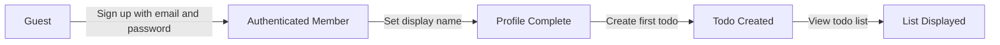

### Full Todo Lifecycle Management Journey

This scenario describes the complete lifecycle of a todo from creation through editing and eventual deletion and recovery.

A member creates a todo with a title, description, start date, and due date. Later, the member realizes the due date needs to be changed, so they edit the todo and update the due date. The system records this edit in the todo's history, capturing the previous due date value and the timestamp of the change.

The member then marks the todo as complete when finished. After some time, the member decides to remove the completed todo and performs a soft delete. The todo disappears from the normal todo list but can still be viewed in the trash. If the member realizes they still need this todo, they can restore it from the trash, returning it to the normal todo list in its last state (complete with the edited due date).

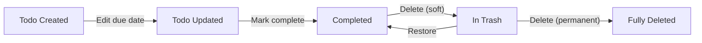

### Todo Organization and Filtering Workflow

This scenario demonstrates how a member organizes and browses their todos using filtering and sorting capabilities.

A member has accumulated multiple todos over time with various completion statuses and dates. To focus on high-priority items, the member filters their todo list to show only incomplete todos. They then sort the filtered list by due date with the earliest due date first, allowing them to identify which tasks need immediate attention.

After completing several tasks, the member switches the filter to show only complete todos to review their accomplishments. They sort this list by creation date with newest first to see recently completed work.

When planning future work, the member removes all filters to see all todos, then sorts by start date with earliest first, with todos lacking a start date appearing at the end of the list.

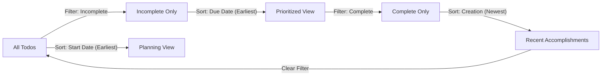

### Account Termination and Cleanup Process

This scenario covers a complete account termination journey and its cascading effects.

A member decides to close their account permanently. They initiate the deletion process, which removes their user profile, display name, and authentication credentials from the system.

Upon account deletion, all data associated with the member is permanently removed. This includes their active todos, any todos stored in the trash, and all edit history entries for those todos. The system performs a comprehensive cleanup without the need for individual item deletion.

This action is irreversible. Once the account is deleted, the member loses all access to the system, and no data recovery is possible.

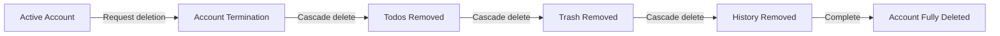