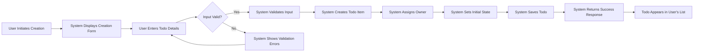
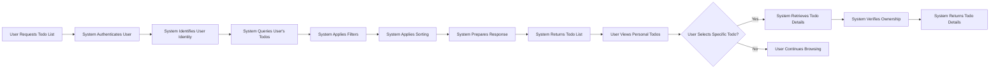
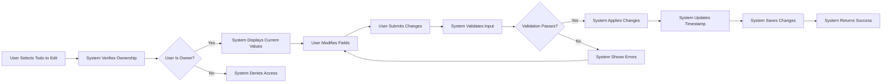
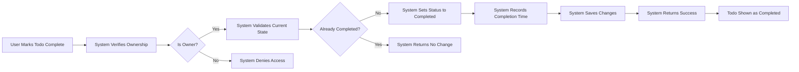
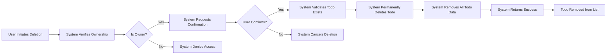
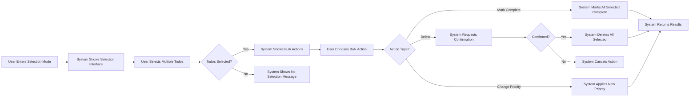
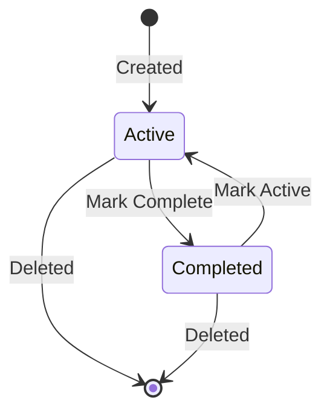

# Todo Workflows

## Overview

This document describes the complete user workflows for managing personal todo items within the Todo application. Each workflow details the step-by-step journey users take when interacting with their private todo lists, including the business rules, validation requirements, and state transitions that govern these interactions.

All workflows are designed with a **privacy-first** approach, ensuring that users can only access and manage their own todo items. The system enforces strict data isolation between users, preventing any cross-user data access or visibility.

---

## Todo Creation Workflow

### Workflow Description

The todo creation workflow enables authenticated members to add new items to their personal todo list. This is the primary entry point for all todo items in the system.

### Step-by-Step Flow

### Business Requirements

**WHEN** a member chooses to create a new todo, **THE** system **SHALL** display a creation interface.

**THE** system **SHALL** require the following information for todo creation:
- A title for the todo item (required, non-empty)
- An optional description providing additional details
- An optional due date for completion
- An optional priority level indicating importance

**WHEN** a member submits todo creation data, **THE** system **SHALL** validate that:
- The title is not empty or contains only whitespace
- The title does not exceed 200 characters
- The description does not exceed 2,000 characters if provided
- The due date is in the future if provided
- The priority level is one of the allowed values: low, medium, high

**IF** validation fails, **THEN THE** system **SHALL** display specific error messages for each invalid field and allow the user to correct the input.

**WHEN** validation succeeds, **THE** system **SHALL** create the todo item with the following properties:
- The authenticated member is set as the exclusive owner
- The creation timestamp is recorded
- The initial status is set to "active" or "pending"
- The completion status is set to false
- A unique identifier is generated for the todo

**THE** system **SHALL** ensure that the newly created todo is immediately accessible only to its owner.

**WHEN** the todo is successfully created, **THE** system **SHALL** confirm the creation to the user and display the new item in their todo list.

### User Experience Requirements

**THE** system **SHALL** provide immediate visual feedback upon successful todo creation.

**THE** system **SHALL** display the newly created todo at the top of the user's todo list or in its appropriate position based on the user's current sorting preference.

---

## Todo Viewing Workflow

### Workflow Description

The todo viewing workflow allows members to access and review their personal collection of todo items. This workflow emphasizes privacy by ensuring users can only view their own todos.

### Step-by-Step Flow

### Business Requirements

**WHEN** a member requests to view their todo list, **THE** system **SHALL** authenticate the request and identify the requesting user.

**THE** system **SHALL** retrieve only those todo items that belong to the authenticated member.

**THE** system **SHALL** never return todo items belonging to other users, regardless of the request parameters.

**WHEN** displaying the todo list, **THE** system **SHALL** present the following information for each todo:
- Todo title
- Current completion status
- Due date (if set)
- Priority level (if set)
- Creation date

**THE** system **SHALL** support filtering the todo list by:
- Completion status (completed, active, or all)
- Priority level (low, medium, high)
- Due date range
- Search term matching title or description

**THE** system **SHALL** support sorting the todo list by:
- Creation date (newest or oldest first)
- Due date (earliest or latest first)
- Priority level (highest or lowest first)
- Title (alphabetical or reverse alphabetical)

**WHEN** a member selects a specific todo to view in detail, **THE** system **SHALL** verify that the requesting user is the owner of that todo.

**IF** a user attempts to view a todo they do not own, **THEN THE** system **SHALL** deny access and return an appropriate error response.

**WHEN** a member views a specific todo, **THE** system **SHALL** display all stored information including:
- Title
- Description
- Creation date and time
- Last modified date and time
- Due date
- Priority level
- Completion status and completion date (if completed)

### Privacy and Access Control

**THE** system **SHALL** enforce strict data isolation at the application level, ensuring no cross-user data leakage.

**THE** system **SHALL** validate ownership on every todo access request, including list retrieval and detail viewing.

---

## Todo Update Workflow

### Workflow Description

The todo update workflow enables members to modify the details of their existing todo items. This includes editing the title, description, due date, and priority, as well as changing the completion status.

### Step-by-Step Flow

### Business Requirements

**WHEN** a member chooses to edit a todo, **THE** system **SHALL** first verify that the member is the owner of that todo.

**IF** the member is not the owner, **THEN THE** system **SHALL** deny the edit request and return an access denied error.

**WHEN** the member is confirmed as the owner, **THE** system **SHALL** display the current values of the todo item.

**THE** system **SHALL** allow the member to modify any of the following fields:
- Title (required field)
- Description (optional)
- Due date (optional)
- Priority level (optional)
- Completion status

**WHEN** a member submits updated todo data, **THE** system **SHALL** apply the same validation rules as during creation:
- Title must be non-empty and not exceed 200 characters
- Description must not exceed 2,000 characters if provided
- Due date must be valid if provided
- Priority must be one of the allowed values

**IF** validation fails, **THEN THE** system **SHALL** display field-specific error messages and preserve the user's input for correction.

**WHEN** validation succeeds, **THE** system **SHALL** update the todo with the new values.

**THE** system **SHALL** automatically record the timestamp of the last modification.

**WHEN** the completion status is changed to "completed", **THE** system **SHALL** record the completion timestamp.

**WHEN** the completion status is changed from "completed" back to "active", **THE** system **SHALL** clear the completion timestamp.

**WHEN** the update is successful, **THE** system **SHALL** confirm the changes to the user.

### Edit History Considerations

**THE** system **SHALL** maintain only the current state of each todo; historical versions of todo content are not retained.

**THE** system **SHALL** record only the most recent modification timestamp, not a full edit history.

---

## Todo Completion Workflow

### Workflow Description

The todo completion workflow handles the specific case of marking a todo as completed. This workflow can be triggered as part of a general update or as a quick one-click action.

### Step-by-Step Flow

### Business Requirements

**WHEN** a member marks a todo as completed, **THE** system **SHALL** verify ownership before processing the request.

**THE** system **SHALL** provide a quick one-click or one-tap action for marking todos as completed.

**WHEN** a todo is marked as completed, **THE** system **SHALL** update the completion status to true.

**THE** system **SHALL** record the exact date and time when the todo was marked as completed.

**IF** a todo is already marked as completed, **THEN THE** system **SHALL** either:
- Take no action and return success, or
- Return an informative message that the todo is already completed

**THE** system **SHALL** allow users to unmark a completed todo, returning it to active status.

**WHEN** a todo is unmarked (returned to active status), **THE** system **SHALL** clear the completion timestamp.

### Visual State Changes

**THE** system **SHALL** provide clear visual distinction between completed and active todos.

**WHEN** a todo is marked as completed, **THE** system **SHALL** visually indicate completion (e.g., strikethrough text, checkmark, different color).

**THE** system **SHALL** allow users to filter their view to show:
- Only active todos
- Only completed todos
- All todos (both active and completed)

---

## Todo Deletion Workflow

### Workflow Description

The todo deletion workflow enables members to permanently remove todo items from their personal list. This action is irreversible and requires appropriate safeguards.

### Step-by-Step Flow

### Business Requirements

**WHEN** a member chooses to delete a todo, **THE** system **SHALL** verify ownership before allowing the deletion.

**IF** the requesting member is not the owner, **THEN THE** system **SHALL** deny the deletion request.

**THE** system **SHALL** request explicit confirmation before permanently deleting a todo.

**WHEN** requesting confirmation, **THE** system **SHALL** clearly indicate:
- That the action is permanent and cannot be undone
- The title of the todo being deleted for verification

**IF** the user cancels the deletion, **THEN THE** system **SHALL** return the user to the previous state without making any changes.

**WHEN** deletion is confirmed and ownership verified, **THE** system **SHALL** permanently remove the todo item from the database.

**THE** system **SHALL** ensure that deletion removes all data associated with the todo, including:
- Title and description
- Due date and priority
- Completion status and timestamps
- Any associated metadata

**THE** system **SHALL** complete the deletion operation atomically to ensure data consistency.

**WHEN** deletion is successful, **THE** system **SHALL** confirm the deletion to the user.

**THE** system **SHALL** immediately remove the deleted todo from the user's displayed list.

### Soft Delete vs Hard Delete

**THE** system **SHALL** perform hard deletion of todo items (permanent removal from storage).

**THE** system **SHALL NOT** retain deleted todo items in a recoverable state or trash folder.

---

## Bulk Operations Workflow

### Workflow Description

The bulk operations workflow enables members to efficiently perform actions on multiple todos simultaneously, improving productivity when managing larger todo lists.

### Step-by-Step Flow

### Business Requirements

**THE** system **SHALL** provide a mechanism for users to select multiple todos for bulk actions.

**WHEN** a user selects multiple todos, **THE** system **SHALL** verify ownership of each selected todo.

**IF** any selected todo does not belong to the requesting user, **THEN THE** system **SHALL** exclude that todo from the operation and inform the user.

**THE** system **SHALL** support the following bulk operations:
- Mark multiple todos as completed
- Mark multiple completed todos as active
- Delete multiple todos
- Change priority level for multiple todos

**WHEN** performing bulk completion, **THE** system **SHALL** apply the completion workflow to each selected todo.

**WHEN** performing bulk deletion, **THE** system **SHALL** request confirmation before permanently removing multiple items.

**THE** confirmation message for bulk deletion **SHALL** indicate the number of items to be deleted.

**WHEN** performing bulk priority changes, **THE** system **SHALL** allow the user to specify the new priority level to apply to all selected todos.

**THE** system **SHALL** process bulk operations efficiently, completing all actions within a reasonable time frame.

**WHEN** bulk operations are complete, **THE** system **SHALL** provide a summary of:
- Number of items successfully processed
- Number of items that failed (if any)
- Specific error messages for any failures

**THE** system **SHALL** ensure that bulk operations maintain data consistency and atomicity where applicable.

### Performance and Safety

**THE** system **SHALL** support bulk operations on up to 50 todos simultaneously.

**IF** a user attempts to select more than 50 todos, **THEN THE** system **SHALL** inform the user of the limit and suggest breaking the operation into smaller batches.

---

## Todo State Transitions

### State Diagram

### State Definitions

**Active State**: The todo has been created but not yet completed. It appears in the active todos list and requires attention.

**Completed State**: The todo has been marked as done. It may appear in the completed todos list and typically requires no further action.

**Deleted State**: The todo has been permanently removed from the system and is no longer accessible.

### Transition Rules

**WHEN** a todo is created, **THE** system **SHALL** place it in the Active state.

**WHEN** a todo transitions from Active to Completed, **THE** system **SHALL** record the completion timestamp.

**WHEN** a todo transitions from Completed to Active, **THE** system **SHALL** clear the completion timestamp.

**WHEN** a todo is deleted from any state, **THE** system **SHALL** permanently remove it without retaining history.

---

## Privacy and Security Throughout Workflows

### Ownership Verification Requirements

**THE** system **SHALL** verify ownership on every single operation that accesses, modifies, or deletes a todo item.

**THE** system **SHALL** perform ownership verification before any data is retrieved or modified.

**WHEN** ownership verification fails, **THE** system **SHALL** return a generic "access denied" or "not found" response without revealing the existence of the requested resource to unauthorized users.

### Data Isolation Requirements

**THE** system **SHALL** ensure that at no point can data from one user's todos be visible to another user.

**THE** system **SHALL** apply ownership filters at the database query level in addition to application-level checks.

### Audit Trail Considerations

**THE** system **SHALL** maintain timestamps for:
- Todo creation
- Last modification
- Completion (if applicable)

**THE** system **SHALL NOT** maintain detailed audit logs of every view or minor interaction with todos.

---

## Error Handling in Workflows

### Common Error Scenarios

**WHEN** a todo operation fails due to network issues, **THE** system **SHALL** retry the operation automatically when possible or inform the user to retry.

**WHEN** a todo is modified by another session (in concurrent scenarios), **THE** system **SHALL** use appropriate conflict resolution strategies or inform the user of the conflict.

**WHEN** a user attempts to perform an operation on a todo that has been deleted by another session, **THE** system **SHALL** inform the user that the todo no longer exists.

**IF** the system encounters an unexpected error during any workflow, **THEN THE** system **SHALL**:
- Log the error internally for diagnostic purposes
- Return a user-friendly error message
- Allow the user to retry the operation
- Maintain data consistency by rolling back any partial changes

---

## Performance Expectations

### Response Time Requirements

**WHEN** a user creates, updates, completes, or deletes a todo, **THE** system **SHALL** complete the operation within 2 seconds under normal conditions.

**WHEN** a user requests their todo list, **THE** system **SHALL** return the results within 1 second for lists containing up to 100 items.

**WHEN** a user requests todo details, **THE** system **SHALL** return the information within 500 milliseconds.

**WHEN** performing bulk operations, **THE** system **SHALL** complete processing at a rate of at least 10 items per second.

### User Feedback During Operations

**FOR** operations that may take longer than 500ms, **THE** system **SHALL** display a loading indicator or progress feedback.

**THE** system **SHALL** prevent users from submitting duplicate requests while an operation is in progress.

---

This document defines the complete business requirements for all todo management workflows. Implementation details including API specifications, database schemas, and technical architecture are at the discretion of the development team based on these business requirements.