# Authentication and Authorization Flows

## 1. Overview

This document defines the complete authentication and authorization flows for the Todo application. The system implements JWT-based authentication with access and refresh tokens, email verification, and secure password management to ensure each user's data remains private and protected.

### 1.1 Authentication Architecture

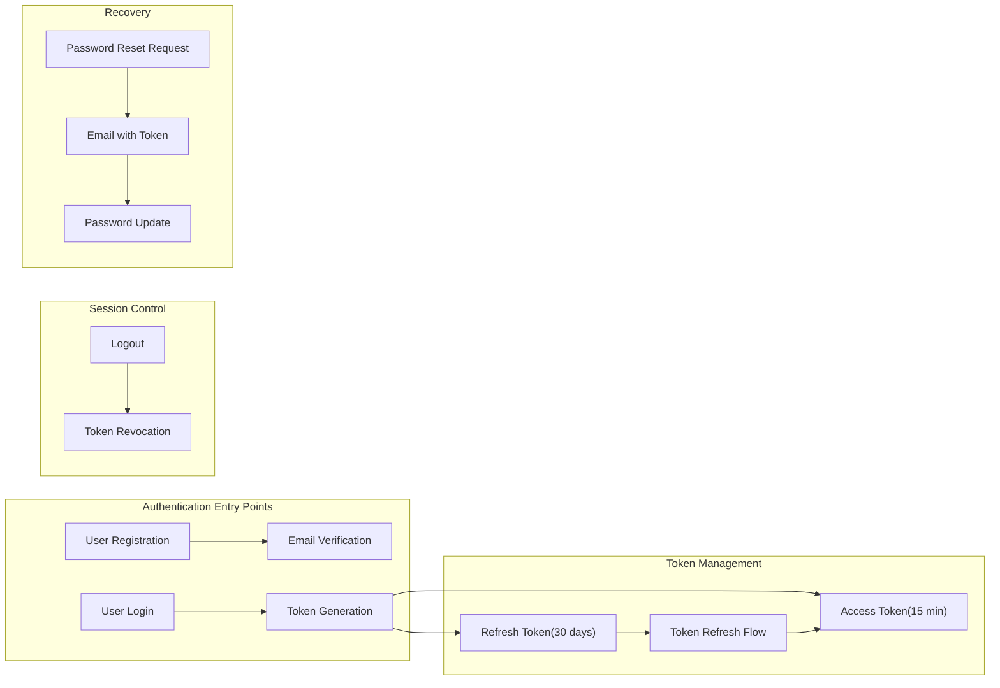

### 1.2 Core Principles

WHEN designing the authentication system, THE system SHALL enforce the following principles:

- **Complete Privacy**: EACH user's todos SHALL be accessible ONLY to the authenticated owner
- **Stateless Authentication**: THE system SHALL use JWT tokens for stateless, scalable authentication
- **Secure Token Storage**: Refresh tokens SHALL be stored securely with rotation on each use
- **Email Verification**: ALL new accounts SHALL verify their email address before full activation
- **Session Control**: USERS SHALL be able to logout and invalidate all active sessions

---

## 2. Registration Flow

### 2.1 Registration Process Overview

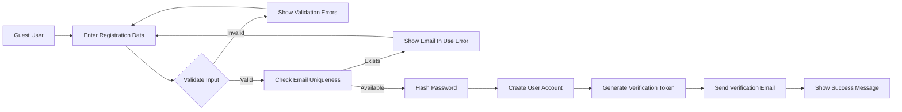

### 2.2 Registration Requirements

WHEN a guest submits registration information, THE system SHALL:

1. **Input Validation**:
   - Validate email format conforms to RFC 5322 standards
   - Ensure password meets minimum security requirements: minimum 8 characters, at least one uppercase letter, one lowercase letter, and one number
   - Confirm password matches the confirmation password field
   - Reject empty or whitespace-only values

2. **Duplicate Prevention**:
   - Check if the email address already exists in the system
   - WHEN the email is already registered, THEN THE system SHALL return a user-friendly error without revealing whether the email exists

3. **Account Creation**:
   - Hash the password using bcrypt with a salt round of 10 or higher
   - Create a new user record with status "pending_verification"
   - Store the registration timestamp

4. **Email Verification Setup**:
   - Generate a cryptographically secure random verification token with minimum 32 bytes
   - Set token expiration to 24 hours from generation
   - Store the hashed verification token associated with the user account

5. **Notification**:
   - Send an email containing the verification link with the plaintext token
   - The verification link SHALL include the token as a URL parameter
   - Display a success message informing the user to check their email

### 2.3 Email Verification Flow

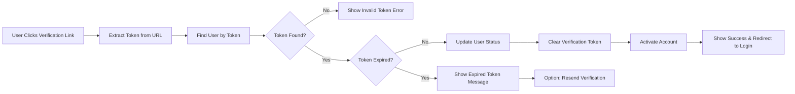

WHEN a user clicks the email verification link, THE system SHALL:

1. **Token Validation**:
   - Extract the verification token from the URL parameter
   - Locate the user account associated with the verification token
   - WHEN no matching token is found, THEN THE system SHALL display an "invalid or expired token" message

2. **Expiration Check**:
   - Verify the token has not exceeded the 24-hour expiration window
   - WHEN the token has expired, THEN THE system SHALL offer the option to request a new verification email

3. **Account Activation**:
   - Update the user account status from "pending_verification" to "active"
   - Clear the verification token from the database to prevent reuse
   - Record the verification timestamp
   - Display a success message confirming email verification
   - Redirect the user to the login page

### 2.4 Resend Verification Email

WHEN a user requests a new verification email, THEN THE system SHALL:

1. Accept the email address from the user
2. WHEN an account exists with that email AND is not yet verified, THEN generate a new verification token
3. Invalidate the previous verification token
4. Send a new verification email with the updated token
5. Display a confirmation message regardless of whether the email exists to maintain security through obscurity

---

## 3. Login Flow

### 3.1 Authentication Process

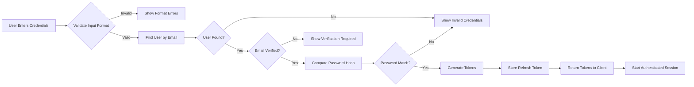

### 3.2 Login Requirements

WHEN a user submits login credentials, THE system SHALL:

1. **Input Validation**:
   - Validate email format is valid
   - Ensure password field is not empty
   - Reject requests with missing or malformed data

2. **Credential Verification**:
   - Locate the user account by email address
   - WHEN no user exists with the provided email, THEN THE system SHALL return a generic "invalid credentials" error
   - Compare the provided password with the stored bcrypt hash
   - WHEN the password does not match, THEN THE system SHALL return a generic "invalid credentials" error

3. **Account Status Check**:
   - Verify the user account is active and not suspended or deleted
   - WHEN the email is not verified, THEN THE system SHALL notify the user to verify their email first

4. **Token Generation** upon successful authentication:
   - Generate a JWT access token with the following payload:
     - `sub` (subject): User ID
     - `email`: User's email address
     - `role`: "member"
     - `iat`: Issued at timestamp
     - `exp`: Expiration timestamp (15 minutes from issuance)
   - Generate a cryptographically secure random refresh token with minimum 32 bytes
   - Set refresh token expiration to 30 days

5. **Session Establishment**:
   - Store the refresh token hash in the database associated with the user
   - Record the token creation timestamp and expiration
   - Optionally store device or agent information for security auditing
   - Return both access token and refresh token to the client

### 3.3 Token Response Structure

THE login response SHALL include:

```json
{
  "access_token": "eyJhbGciOiJIUzI1NiIs...",
  "refresh_token": "a1b2c3d4e5f6...",
  "token_type": "Bearer",
  "expires_in": 900,
  "user": {
    "id": "user-uuid",
    "email": "user@example.com"
  }
}
```

---

## 4. Token Refresh Flow

### 4.1 Refresh Process

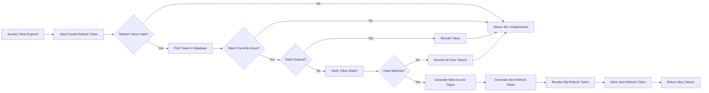

### 4.2 Token Refresh Requirements

WHEN a client presents a refresh token to obtain new access tokens, THE system SHALL:

1. **Token Validation**:
   - Verify the refresh token format is valid
   - Check that the token exists in the database
   - WHEN the token is not found or has been revoked, THEN THE system SHALL return 401 Unauthorized

2. **Expiration Check**:
   - Verify the refresh token has not exceeded its 30-day expiration
   - WHEN the token has expired, THEN THE system SHALL revoke the token and require re-authentication

3. **Security Verification**:
   - Compare the provided token with the stored hash
   - WHEN the token hash does not match, THEN THE system SHALL:
     - Revoke ALL refresh tokens for that user indicating potential token theft
     - Return 401 Unauthorized
     - Log the security event

4. **Token Rotation**:
   - Generate a new access token with 15-minute expiration
   - Generate a new refresh token with 30-day expiration
   - Revoke the old refresh token immediately
   - Store the new refresh token hash in the database
   - Return both new tokens to the client

### 4.3 Refresh Token Security

THE refresh token mechanism SHALL implement the following security measures:

- **One-Time Use**: EACH refresh token SHALL be valid for exactly one use
- **Rotation**: New refresh tokens SHALL be issued with every access token refresh
- **Detection**: WHEN a used refresh token is presented again, THEN THE system SHALL revoke all tokens for that user
- **Binding**: Refresh tokens SHOULD be bound to the client device when possible

---

## 5. Logout Flow

### 5.1 Logout Process

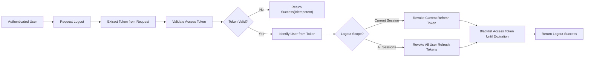

### 5.2 Logout Requirements

WHEN an authenticated user requests logout, THE system SHALL support two modes:

#### 5.2.1 Current Session Logout

WHEN the user chooses to logout from the current session only, THEN THE system SHALL:

1. Validate the access token and identify the user
2. Revoke the refresh token associated with the current session
3. Add the access token to a short-term blacklist until its natural expiration
4. Return a success response
5. Clear any client-side token storage

#### 5.2.2 All Sessions Logout

WHEN the user chooses to logout from all devices or sessions, THEN THE system SHALL:

1. Validate the access token and identify the user
2. Revoke ALL refresh tokens associated with the user account
3. Add the current access token to the blacklist
4. Return a success response
5. Require re-authentication on all devices

### 5.3 Token Blacklist

THE system SHALL maintain a token blacklist mechanism:

- Blacklisted tokens SHALL be stored with their expiration timestamp
- Blacklist entries SHALL be automatically cleaned up after token expiration
- Access tokens presented from the blacklist SHALL be rejected with 401 Unauthorized
- The blacklist SHOULD use a high-performance cache such as Redis for efficiency

---

## 6. Password Reset Flow

### 6.1 Password Reset Request

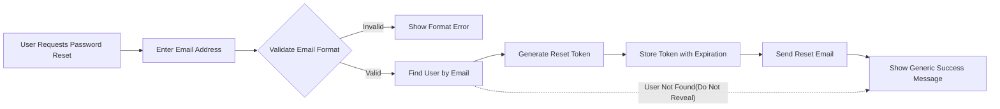

### 6.2 Password Reset Requirements

WHEN a user requests a password reset, THE system SHALL:

1. **Request Validation**:
   - Accept the user's email address
   - Validate the email format
   - Display a generic success message regardless of whether the email exists to prevent email enumeration attacks

2. **Token Generation** only if user exists:
   - Generate a cryptographically secure random reset token with minimum 32 bytes
   - Set token expiration to 1 hour from generation
   - Hash the token before storage
   - Associate the token with the user account
   - Invalidate any previous unused reset tokens for that user

3. **Email Notification**:
   - Send an email containing the password reset link
   - The reset link SHALL include the plaintext token as a URL parameter
   - The email SHALL clearly state the 1-hour expiration

### 6.3 Password Update Process

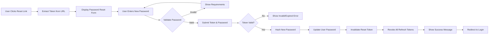

WHEN a user submits a new password with a reset token, THE system SHALL:

1. **Token Validation**:
   - Extract the reset token from the request
   - Locate the user associated with the token
   - Verify the token has not expired within the 1-hour window
   - WHEN the token is invalid or expired, THEN THE system SHALL reject the request

2. **Password Validation**:
   - Validate the new password meets security requirements
   - Ensure the new password matches the confirmation field
   - Reject passwords that match the user's email or common weak passwords

3. **Password Update**:
   - Hash the new password using bcrypt
   - Update the user's password hash in the database
   - Clear the password reset token to prevent reuse
   - Update the "password_changed_at" timestamp

4. **Session Security**:
   - Revoke ALL existing refresh tokens for the user
   - Force re-authentication on all devices
   - Log the password change event for security auditing

5. **Completion**:
   - Display a success message confirming the password update
   - Redirect the user to the login page

---

## 7. Session Validation Flow

### 7.1 Request Authentication Middleware

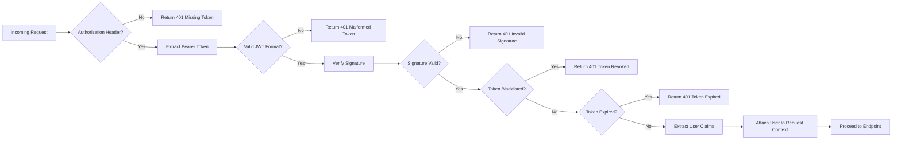

### 7.2 Session Validation Requirements

WHEN processing an authenticated request, THE system SHALL:

1. **Token Extraction**:
   - Check for the Authorization header in the HTTP request
   - WHEN the header is missing, THEN THE system SHALL return 401 Unauthorized
   - Extract the Bearer token from the Authorization header
   - WHEN the format is invalid, THEN THE system SHALL return 401 Unauthorized

2. **Token Verification**:
   - Verify the JWT signature using the secret key
   - WHEN the signature is invalid, THEN THE system SHALL return 401 Unauthorized
   - Decode the token payload

3. **Blacklist Check**:
   - Check if the token exists in the blacklist
   - WHEN the token is blacklisted, THEN THE system SHALL return 401 Unauthorized

4. **Expiration Check**:
   - Verify the token has not expired
   - WHEN the token has expired, THEN THE system SHALL return 401 Unauthorized with a specific "token_expired" error code

5. **User Context**:
   - Extract the user ID from the token subject claim
   - Verify the user account still exists and is active
   - Attach the user context to the request for downstream use
   - Proceed to the requested endpoint

### 7.3 Permission Enforcement

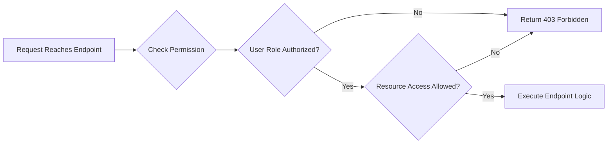

FOR each protected resource, THE system SHALL:

1. Verify the authenticated user has the required role or permissions
2. WHEN accessing a specific resource such as a todo item, THEN verify the user owns that resource
3. WHEN the user does not have permission, THEN THE system SHALL return 403 Forbidden
4. WHEN the user has permission, THEN THE system SHALL process the request

---

## 8. Authorization Flow for Todo Operations

### 8.1 Resource Access Control

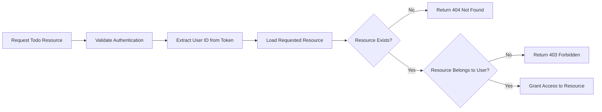

### 8.2 Todo-Specific Authorization Rules

THE system SHALL enforce the following authorization rules for todo operations:

1. **Create Operation**:
   - ONLY authenticated members can create todos
   - THE created todo SHALL be automatically associated with the authenticated user
   - THE user ID in the todo SHALL match the authenticated user's ID

2. **Read Operation**:
   - A user can ONLY read todos that belong to them
   - WHEN a user attempts to read another user's todo, THEN THE system SHALL return 404 Not Found (not 403, to prevent information leakage)

3. **Update Operation**:
   - A user can ONLY update todos that belong to them
   - THE system SHALL verify ownership before allowing any modifications
   - WHEN the todo does not belong to the user, THEN THE system SHALL return 404 Not Found

4. **Delete Operation**:
   - A user can ONLY delete todos that belong to them
   - THE system SHALL verify ownership before allowing deletion
   - WHEN the todo does not belong to the user, THEN THE system SHALL return 404 Not Found

### 8.3 Cross-User Access Prevention

THE system SHALL implement defense-in-depth for data isolation:

- **Query Filtering**: ALL database queries for todos SHALL include a filter by the authenticated user's ID
- **Ownership Verification**: EVEN if a resource ID is provided, THE system SHALL verify the resource belongs to the authenticated user
- **Consistent Error Responses**: THE system SHALL return identical error responses for "not found" and "not authorized" scenarios to prevent user enumeration

---

## 9. Security Event Logging

### 9.1 Logged Security Events

THE system SHALL log the following security events for audit purposes:

| Event | Data Logged | Retention |
|-------|-------------|-----------|
| Failed Login Attempt | Timestamp, email (hashed), IP address, user agent | 90 days |
| Successful Login | Timestamp, user ID, IP address, user agent | 1 year |
| Password Change | Timestamp, user ID, IP address | 1 year |
| Password Reset Requested | Timestamp, email (hashed), IP address | 90 days |
| Password Reset Completed | Timestamp, user ID, IP address | 1 year |
| Token Refresh | Timestamp, user ID, IP address | 90 days |
| Logout | Timestamp, user ID, scope (current/all) | 90 days |
| Suspicious Token Reuse | Timestamp, user ID, IP address, user agent | 1 year |
| Account Created | Timestamp, user ID, email (hashed), IP address | 1 year |
| Email Verified | Timestamp, user ID | 1 year |

### 9.2 Logging Requirements

WHEN logging security events, THE system SHALL:

1. Include accurate timestamps in UTC
2. Hash sensitive data such as email addresses before logging
3. Include IP addresses and user agents for security analysis
4. Store logs in a tamper-resistant format
5. Implement log rotation to manage storage
6. Ensure logs do not contain plaintext passwords or tokens

---

## 10. Error Handling

### 10.1 Authentication Error Responses

THE system SHALL return the following HTTP status codes for authentication errors:

| Scenario | Status Code | Error Code | Message |
|----------|-------------|------------|---------|
| Missing Authorization header | 401 | AUTH_MISSING_TOKEN | "Authentication required" |
| Malformed token | 401 | AUTH_MALFORMED_TOKEN | "Invalid authentication token" |
| Invalid signature | 401 | AUTH_INVALID_SIGNATURE | "Invalid authentication token" |
| Expired token | 401 | AUTH_TOKEN_EXPIRED | "Token has expired, please refresh" |
| Blacklisted token | 401 | AUTH_TOKEN_REVOKED | "Token has been revoked" |
| Invalid credentials | 401 | AUTH_INVALID_CREDENTIALS | "Invalid email or password" |
| Email not verified | 403 | AUTH_EMAIL_NOT_VERIFIED | "Please verify your email address" |
| Insufficient permissions | 403 | AUTH_FORBIDDEN | "Access denied" |
| Invalid refresh token | 401 | AUTH_INVALID_REFRESH | "Invalid refresh token" |
| Expired refresh token | 401 | AUTH_REFRESH_EXPIRED | "Session expired, please login again" |

### 10.2 Rate Limiting

THE system SHALL implement rate limiting for authentication endpoints:

- **Login attempts**: Maximum 5 attempts per 15 minutes per IP address
- **Registration**: Maximum 3 accounts per hour per IP address
- **Password reset requests**: Maximum 3 requests per hour per email
- **Token refresh**: Maximum 10 requests per minute per user
- **Email verification resend**: Maximum 3 requests per hour per email

WHEN a rate limit is exceeded, THEN THE system SHALL return 429 Too Many Requests with a Retry-After header.

---

## 11. Session Configuration

### 11.1 Token Lifetimes

| Token Type | Lifetime | Renewal |
|------------|----------|---------|
| Access Token | 15 minutes | Via refresh token |
| Refresh Token | 30 days | On each use (rotation) |
| Email Verification Token | 24 hours | Manual resend |
| Password Reset Token | 1 hour | New request required |

### 11.2 JWT Configuration

THE JWT tokens SHALL use the following configuration:

- **Algorithm**: HS256 (HMAC with SHA-256)
- **Issuer**: "todoApp"
- **Audience**: "todoApp-api"
- **Secret Key**: Minimum 256-bit cryptographically secure random key
- **Key Rotation**: Secret keys SHOULD be rotated periodically with grace period for old tokens

### 11.3 Cookie Settings (if using cookies)

WHEN using httpOnly cookies for token storage, THEN THE system SHALL:

- Set the `HttpOnly` flag to prevent JavaScript access
- Set the `Secure` flag in production for HTTPS only
- Set `SameSite=Strict` to prevent CSRF attacks
- Set appropriate `Max-Age` matching token expiration
- Use the `Path` attribute to limit cookie scope

---

## 12. Summary

This authentication system ensures:

1. **Complete Data Isolation**: Each user's todos are strictly private through JWT-based authentication and resource-level authorization checks
2. **Secure Token Management**: Short-lived access tokens with automatic rotation of refresh tokens
3. **Account Security**: Email verification, secure password reset, and session revocation capabilities
4. **Audit Trail**: Comprehensive security event logging for monitoring and forensics
5. **Attack Resistance**: Rate limiting, token blacklisting, and consistent error responses to prevent information leakage

WHEN implementing the authentication flows described in this document, THE system SHALL ensure a secure, scalable, and user-friendly authentication experience while maintaining the strict privacy requirements of the Todo application.