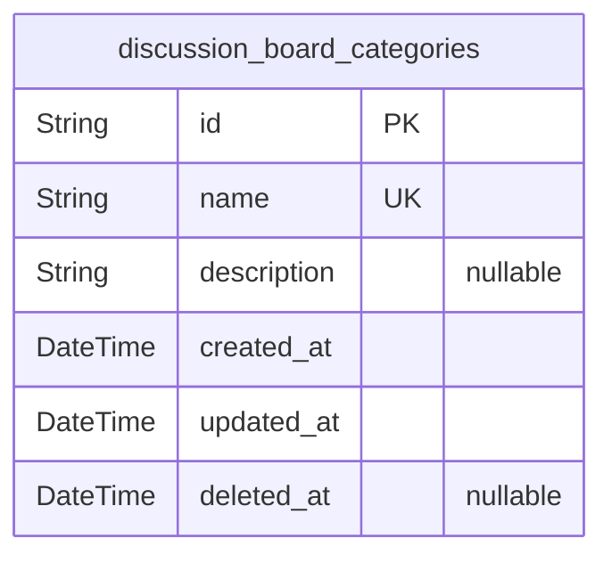
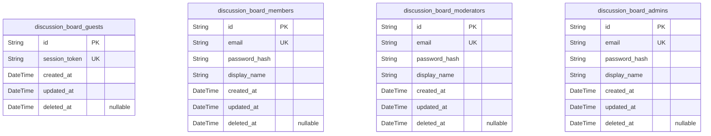
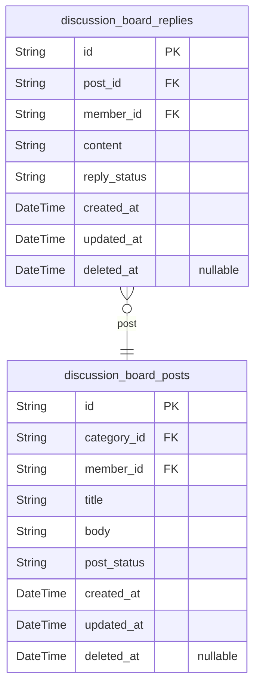
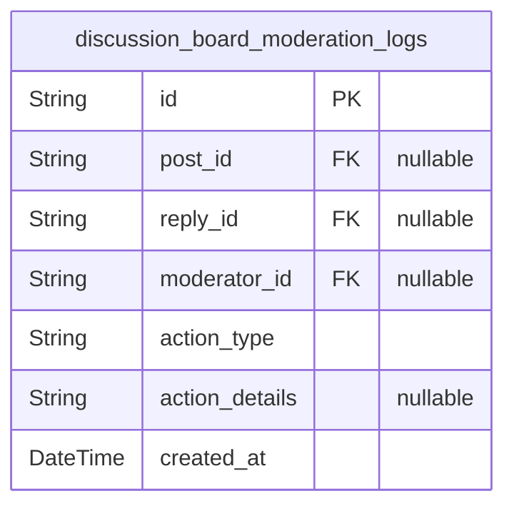

# Prisma Markdown

> Generated by [`prisma-markdown`](https://github.com/samchon/prisma-markdown)

- [Systematic](#systematic)
- [Actors](#actors)
- [Discussions](#discussions)
- [Moderation](#moderation)

## Systematic

### `discussion_board_categories`

Discussion board categories representing the classification domains such
as Economic and Political. Core to content organization and filtering.
This table allows independent CRUD operations and is referenced by posts
within the discussion board domain.

Properties as follows:

- `id`: Primary Key.
- `name`: The unique name of the category, e.g., Economic or Political.
- `description`: Optional detailed description of the category's purpose or scope.
- `created_at`: Timestamp of when the category was created.
- `updated_at`: Timestamp of the last update to the category.
- `deleted_at`: Soft delete timestamp for the category, null if active.

## Actors

### `discussion_board_guests`

Guest users information who do not authenticate but may have session or
visitor footprints. Used to track guest activity and enable browsing
capabilities without login. This entity has minimal fields and no
authentication credentials.

Properties as follows:

- `id`: Primary Key.
- `session_token`: Unique session token to identify guest user session.
- `created_at`: Timestamp when the guest session was created.
- `updated_at`: Timestamp of the last guest session update.
- `deleted_at`: Soft delete timestamp if guest session is invalidated.

### `discussion_board_members`

Registered members who can create discussion topics and replies. Members
have authenticated sessions using email and password hash and can manage
their profiles.

Properties as follows:

- `id`: Primary Key.
- `email`: Member's unique email address for login and communication.
- `password_hash`: Hashed password for member authentication.
- `display_name`: Display name shown publicly in posts and replies.
- `created_at`: Timestamp when the member account was created.
- `updated_at`: Timestamp of the last update to the member account.
- `deleted_at`: Soft delete timestamp if the member account is deactivated.

### `discussion_board_moderators`

Moderator users with elevated privileges to manage and moderate posts and
replies. Moderators authenticate with email and password hash, and can
perform editing and deletion actions.

Properties as follows:

- `id`: Primary Key.
- `email`: Moderator's unique email address for login and communication.
- `password_hash`: Hashed password for moderator authentication.
- `display_name`: Display name shown in moderation logs and actions.
- `created_at`: Timestamp when the moderator account was created.
- `updated_at`: Timestamp of last update to the moderator account.
- `deleted_at`: Soft delete timestamp if the moderator account is deactivated.

### `discussion_board_admins`

Administrator users with full system privileges including user
management, system configuration, and moderation oversight. Admins
authenticate via email and password hash and have full control over
system settings.

Properties as follows:

- `id`: Primary Key.
- `email`: Administrator's unique email address for login and management.
- `password_hash`: Hashed password for administrator authentication.
- `display_name`
  > Display name for administrator identification in audit and management
  > logs.
- `created_at`: Timestamp when the administrator account was created.
- `updated_at`: Timestamp of last update to the administrator account.
- `deleted_at`: Soft delete timestamp if the administrator account is deactivated.

## Discussions

### `discussion_board_posts`

Discussion Board Posts representing user-generated discussion topics
within economic or political categories. Each post is authored by a
member and belongs to one category. Posts contain validated title and
body content with timestamps and status fields for moderation and
lifecycle management. Indexed for efficient searching and browsing with
full-text search support on title and body content. Related to
discussion_board_categories and discussion_board_members for category and
owner relationships.

Properties as follows:

- `id`: Primary Key.
- `category_id`: Belonged category's discussion_board_categories.id.
- `member_id`: Authoring member's discussion_board_members.id.
- `title`: Post title between 5 and 100 characters, validated content.
- `body`: Post body content up to 5000 characters, validated and profanity-checked.
- `post_status`: Status of the post indicating moderation or visibility state.
- `created_at`: Timestamp when the post was created.
- `updated_at`: Timestamp when the post was last updated.
- `deleted_at`: Timestamp when the post was soft deleted; null if active.

### `discussion_board_replies`

Replies to discussion board posts authored by members. Each reply is
attached to a single post and contains validated textual content. Replies
have status fields for moderation, timestamps for auditing, and support
efficient retrieval and filtering. Linked to posts and members with
referential integrity and indexed for performance on common queries
including full-text search on content.

Properties as follows:

- `id`: Primary Key.
- `post_id`: Replied post's discussion_board_posts.id.
- `member_id`: Authoring member's discussion_board_members.id.
- `content`
  > Reply content between 5 and 1000 characters, validated and
  > profanity-checked.
- `reply_status`: Status of the reply indicating moderation or visibility state.
- `created_at`: Timestamp when the reply was created.
- `updated_at`: Timestamp when the reply was last updated.
- `deleted_at`: Timestamp when the reply was soft deleted; null if active.

## Moderation

### `discussion_board_moderation_logs`

Audit log for moderator actions on posts and replies within the
discussion board. This table records the user performing the action
(moderator or admin), the type of action (edit, delete, etc.), associated
post or reply IDs, detailed notes, and timestamps for auditing and
compliance purposes. It ensures a historical record of all moderation
activities and supports accountability and transparency.

Properties as follows:

- `id`: Primary Key.
- `post_id`: Referenced post's discussion_board_posts.id.
- `reply_id`: Referenced reply's discussion_board_replies.id.
- `moderator_id`
  > User performing the moderation action. Can be moderator or admin.
  > References either discussion_board_moderators.id or
  > discussion_board_admins.id but treated as nullable foreign key here.
- `action_type`: Type of moderation action performed, e.g., 'edit', 'delete', 'approve'.
- `action_details`: Detailed notes or comments about the moderation action.
- `created_at`: Timestamp of when the moderation action was performed.
