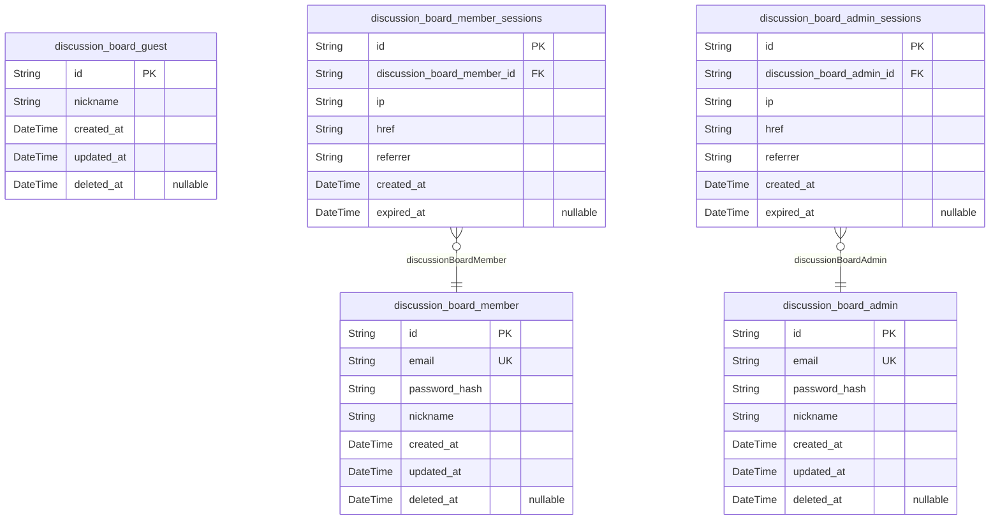
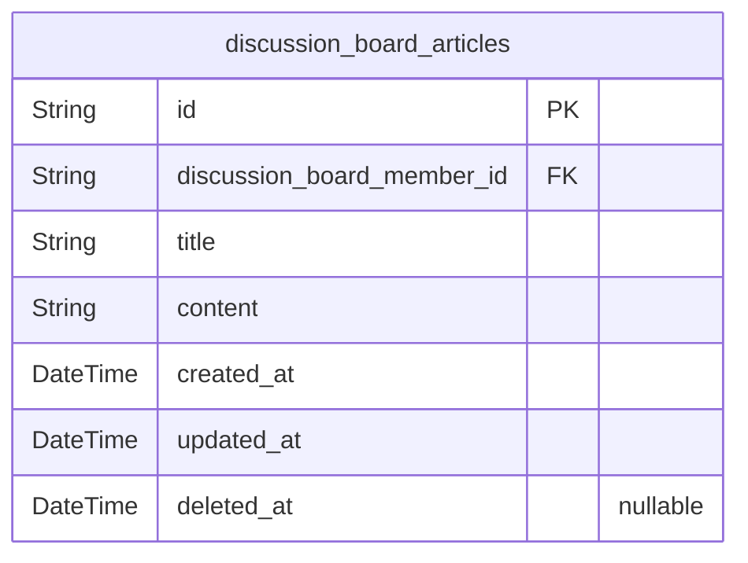
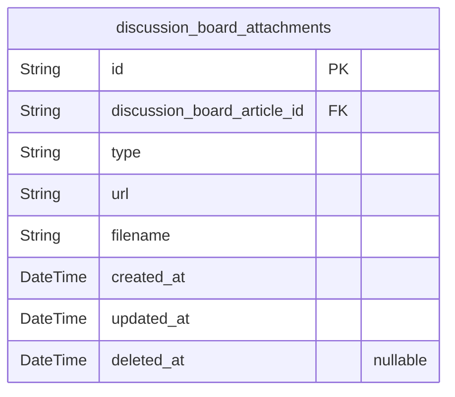
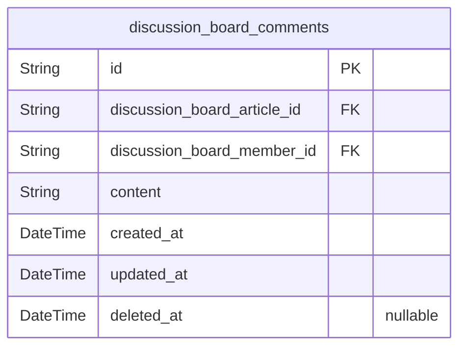

# Prisma Markdown

> Generated by [`prisma-markdown`](https://github.com/samchon/prisma-markdown)

- [Actors](#actors)
- [Articles](#articles)
- [Attachments](#attachments)
- [Comments](#comments)

## Actors

```mermaid
erDiagram
"discussion_board_guest" {
  String id PK
  String nickname
  DateTime created_at
  DateTime updated_at
  DateTime deleted_at "nullable"
}
"discussion_board_member" {
  String id PK
  String email UK
  String password_hash
  String nickname
  DateTime created_at
  DateTime updated_at
  DateTime deleted_at "nullable"
}
"discussion_board_member_sessions" {
  String id PK
  String discussion_board_member_id FK
  String ip
  String href
  String referrer
  DateTime created_at
  DateTime expired_at "nullable"
}
"discussion_board_admin" {
  String id PK
  String email UK
  String password_hash
  String nickname
  DateTime created_at
  DateTime updated_at
  DateTime deleted_at "nullable"
}
"discussion_board_admin_sessions" {
  String id PK
  String discussion_board_admin_id FK
  String ip
  String href
  String referrer
  DateTime created_at
  DateTime expired_at "nullable"
}
"discussion_board_member_sessions" }o--|| "discussion_board_member" : discussionBoardMember
"discussion_board_admin_sessions" }o--|| "discussion_board_admin" : discussionBoardAdmin
```

### `discussion_board_guest`

Unauthenticated guest users, representing visitors with read-only access
to the discussion board.

Guests cannot create accounts or sessions, and have minimal identifying
information mainly for tracking or analytics.

This table allows the system to recognize guest interactions while
maintaining privacy and simplicity.

Properties as follows:

- `id`: Primary key.
- `nickname`
  > Guest user display nickname, optional and may be used for distinguishing
  > guests in anonymous interactions.
- `created_at`: Record creation timestamp.
- `updated_at`: Record last update timestamp.
- `deleted_at`: Soft deletion timestamp; null means active.

### `discussion_board_member`

Registered members of the discussion board capable of creating articles
and comments.

Members can log in with credentials and manage their content.

This table stores essential user information including authentication
data and timestamps for auditing and soft deletion.

Properties as follows:

- `id`: Primary key.
- `email`
  > Email address for authentication and communication. Must be unique across
  > members.
- `password_hash`: Hashed password for secure authentication.
- `nickname`: Display name chosen by the member for identification.
- `created_at`: Record creation timestamp.
- `updated_at`: Record last update timestamp.
- `deleted_at`: Soft deletion timestamp; null means active.

### `discussion_board_member_sessions`

Active session records for registered members, tracking login state and
connection details.

Each session is linked to a member and stores IP address, URL, referrer,
creation time, and expiry time.

This supports authentication session management and audit logging.

Properties as follows:

- `id`: Primary key.
- `discussion_board_member_id`
  > Reference to the member who owns this session. {@link
  > discussion_board_member.id}.
- `ip`: IP address from which the session originated.
- `href`: Full URL of the connection request.
- `referrer`: HTTP referrer URL.
- `created_at`: Session creation timestamp.
- `expired_at`: Session expiry timestamp; null means session is active.

### `discussion_board_admin`

System administrators with full permissions over the discussion board.

Admins can manage all content and users, with login credentials for
authentication.

Timestamps and soft deletion fields help track administrative activity
and account state.

Properties as follows:

- `id`: Primary key.
- `email`
  > Email address for administrator login and communication. Must be unique
  > among admins.
- `password_hash`: Hashed password used for authentication.
- `nickname`: Display name for the administrator user.
- `created_at`: Record creation timestamp.
- `updated_at`: Record last update timestamp.
- `deleted_at`: Soft deletion timestamp; null means active.

### `discussion_board_admin_sessions`

Active session records for administrators, enabling authentication and
audit logging.

Sessions include IP address, connection URL, referrer, creation time, and
optional expiration timestamp.

Linked to the administrator who owns the session, supporting secure
session management.

Properties as follows:

- `id`: Primary key.
- `discussion_board_admin_id`
  > Reference to the administrator owning this session. {@link
  > discussion_board_admin.id}.
- `ip`: IP address of connection origin.
- `href`: Connection URL.
- `referrer`: Referrer URL.
- `created_at`: Session start timestamp.
- `expired_at`: Session end timestamp; null if ongoing.

## Articles

```mermaid
erDiagram
"discussion_board_articles" {
  String id PK
  String discussion_board_member_id FK
  String title
  String content
  DateTime created_at
  DateTime updated_at
  DateTime deleted_at "nullable"
}
```

### `discussion_board_articles`

Articles posted by registered members on economic and political topics.

Each article includes a title and textual content, an author reference to
the registered member who created it, and temporal fields for creation,
updates, and soft deletion. Articles serve as the primary content entity
for the discussion board.

Attachments and comments related to articles are managed separately in
other components to maintain modularity and normalize content storage.

This design supports efficient browsing, editing, and moderation with
clear ownership and audit trail capabilities.

Properties as follows:

- `id`: Primary Key.
- `discussion_board_member_id`
  > Reference to the member who authored the article. {@link
  > discussion_board_member.id}.
- `title`: Title of the article representing its main subject or headline.
- `content`
  > Body content of the article containing detailed economic or political
  > discussion.
- `created_at`: Timestamp marking when the article was created.
- `updated_at`: Timestamp marking the last update to the article.
- `deleted_at`: Timestamp for soft deletion; null if the article is active.

## Attachments

```mermaid
erDiagram
"discussion_board_attachments" {
  String id PK
  String discussion_board_article_id FK
  String type
  String url
  String filename
  DateTime created_at
  DateTime updated_at
  DateTime deleted_at "nullable"
}
```

### `discussion_board_attachments`

Attachments linked to discussion board articles.

Supports both images and files uploaded by members to complement article
content. Each attachment is associated with a single article and contains
metadata such as type (image or file), file URL, and filename.

Attachments are soft deletable to retain audit trails and support content
management workflows.

This table is a subsidiary entity managed through its parent article.

Properties as follows:

- `id`: Primary Key.
- `discussion_board_article_id`: Reference to the parent article. [discussion_board_articles.id](#discussion_board_articles).
- `type`
  > Attachment type indicating whether this is an image or other file. Valid
  > values: 'image', 'file'.
- `url`: URL path to the stored attachment resource.
- `filename`: Original name of the uploaded file.
- `created_at`: Record creation timestamp.
- `updated_at`: Record update timestamp.
- `deleted_at`: Soft deletion timestamp; if set, this record is considered deleted.

## Comments

```mermaid
erDiagram
"discussion_board_comments" {
  String id PK
  String discussion_board_article_id FK
  String discussion_board_member_id FK
  String content
  DateTime created_at
  DateTime updated_at
  DateTime deleted_at "nullable"
}
```

### `discussion_board_comments`

User comments on articles in the discussion board.

Each comment is authored by a registered member and linked to a specific
article. Comments contain text-only content, supporting the core
discussion functionality without attachments. The model supports
creation, update, and soft deletion timestamps to enable auditability and
moderation.

This model has a primary stance reflecting its role as an independently
managed business entity requiring full CRUD operations and search
capabilities across all comments.

Properties as follows:

- `id`: Primary key.
- `discussion_board_article_id`
  > Reference to the article being commented on. {@link
  > discussion_board_articles.id}.
- `discussion_board_member_id`
  > Reference to the member who authored the comment. {@link
  > discussion_board_member.id}.
- `content`
  > Text content of the comment, supporting the discussion without
  > attachments.
- `created_at`: Timestamp when the comment was created.
- `updated_at`: Timestamp when the comment was last updated.
- `deleted_at`: Timestamp for soft deletion; null if not deleted.
