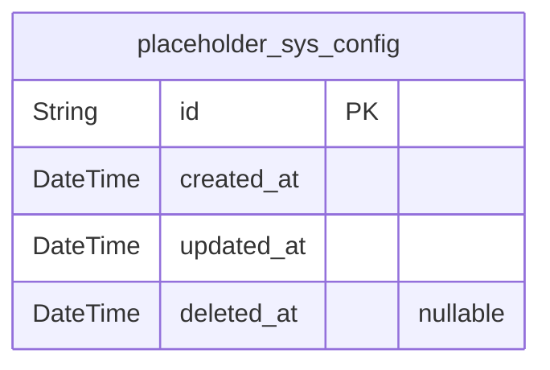
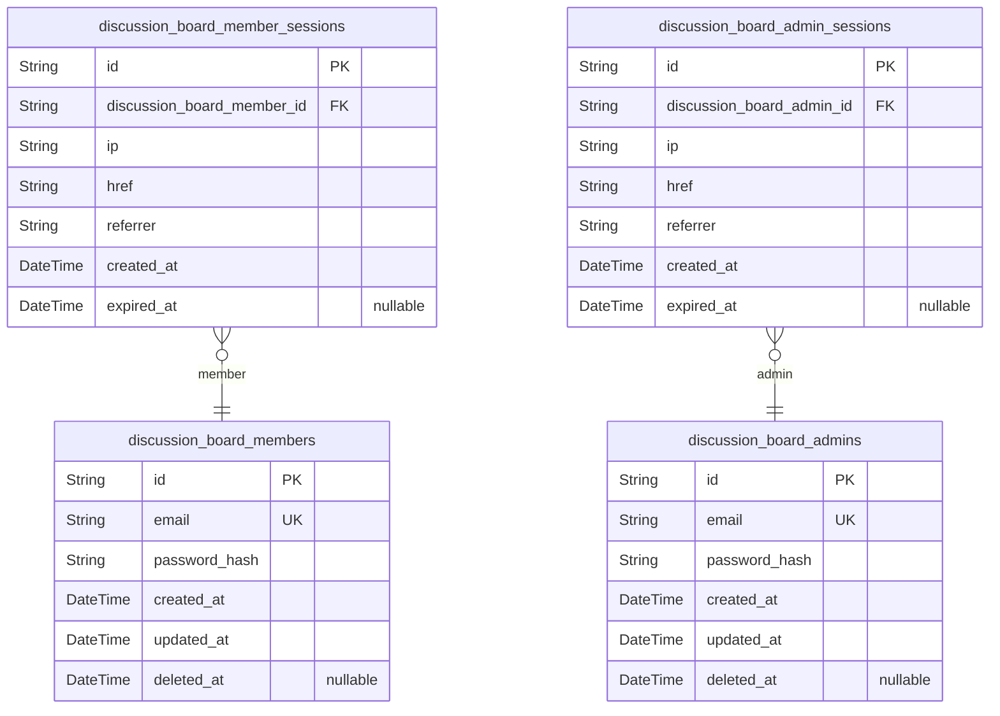
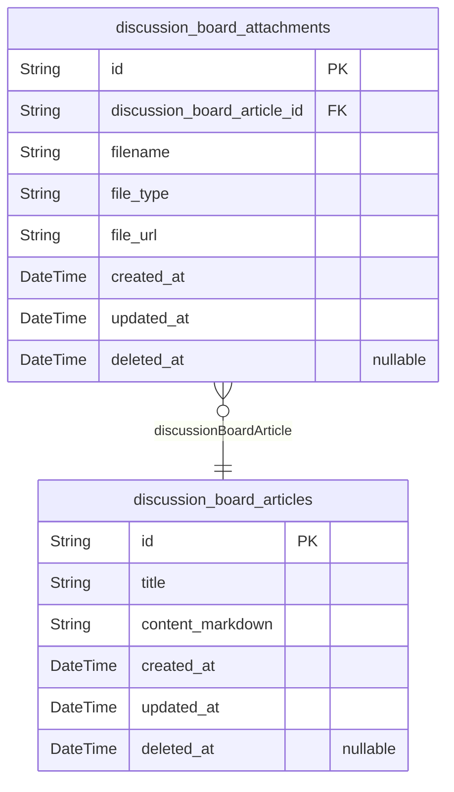

# Prisma Markdown

> Generated by [`prisma-markdown`](https://github.com/samchon/prisma-markdown)

- [Systematic](#systematic)
- [Actors](#actors)
- [Articles](#articles)

## Systematic

```mermaid
erDiagram
"placeholder_sys_config" {
  String id PK
  DateTime created_at
  DateTime updated_at
  DateTime deleted_at "nullable"
}
```

### `placeholder_sys_config`

Placeholder system configuration table for future extensibility within
the Systematic domain. Maintains architectural clarity and readiness for
system-wide settings without current business logic dependencies.

Properties as follows:

- `id`: Primary Key.
- `created_at`: Timestamp when the record was created.
- `updated_at`: Timestamp when the record was last updated.
- `deleted_at`: Timestamp when the record was soft deleted.

## Actors

```mermaid
erDiagram
"discussion_board_members" {
  String id PK
  String email UK
  String password_hash
  DateTime created_at
  DateTime updated_at
  DateTime deleted_at "nullable"
}
"discussion_board_member_sessions" {
  String id PK
  String discussion_board_member_id FK
  String ip
  String href
  String referrer
  DateTime created_at
  DateTime expired_at "nullable"
}
"discussion_board_admins" {
  String id PK
  String email UK
  String password_hash
  DateTime created_at
  DateTime updated_at
  DateTime deleted_at "nullable"
}
"discussion_board_admin_sessions" {
  String id PK
  String discussion_board_admin_id FK
  String ip
  String href
  String referrer
  DateTime created_at
  DateTime expired_at "nullable"
}
"discussion_board_member_sessions" }o--|| "discussion_board_members" : member
"discussion_board_admin_sessions" }o--|| "discussion_board_admins" : admin
```

### `discussion_board_members`

Members who are authenticated users authorized to create and manage
articles and comments within the discussion board system. Members have
personal credentials and are subject to soft deletion. This table stores
member identity, authentication credentials, and metadata.

Properties as follows:

- `id`: Primary Key.
- `email`: Unique email address of the member used for authentication.
- `password_hash`: Password hash for secure authentication of member accounts.
- `created_at`: Date and time when the member account was created.
- `updated_at`: Date and time when the member account was last updated.
- `deleted_at`: Optional deletion timestamp for soft delete.

### `discussion_board_member_sessions`

Active sessions for members representing authenticated login instances.
Each session records connection details, access timestamps, and
expiration, supporting secure session management and auditing.

Properties as follows:

- `id`: Primary Key.
- `discussion_board_member_id`
  > Referenced member id owning this session. {@link
  > discussion_board_members.id}
- `ip`: IP address of the client initiating this session.
- `href`: The connection URL when the session was started.
- `referrer`: The referrer URL for this session connection.
- `created_at`: Timestamp when this session was created.
- `expired_at`: Optional expiration timestamp of the session.

### `discussion_board_admins`

Administrators with elevated privileges managing all content and user
accounts on the discussion board system. Admin accounts are authenticated
with password hashes and support soft deletion.

Properties as follows:

- `id`: Primary Key.
- `email`: Unique email address of the administrator for authentication purposes.
- `password_hash`: Hashed password for administrator account authentication.
- `created_at`: Timestamp when the admin account was created.
- `updated_at`: Timestamp when the admin account was last updated.
- `deleted_at`: Optional timestamp marking soft deletion of the admin account.

### `discussion_board_admin_sessions`

Active session records for administrators managing the discussion board
system. Sessions track connection metadata and support secure
authentication and auditing.

Properties as follows:

- `id`: Primary Key.
- `discussion_board_admin_id`
  > Referenced administrator id owning this session. {@link
  > discussion_board_admins.id}
- `ip`: IP address of the connection client for this session.
- `href`: The URL used to initiate this session connection.
- `referrer`: Referrer URL leading to this session start.
- `created_at`: Timestamp when this admin session was created.
- `expired_at`: Optional expiration timestamp of this session.

## Articles

```mermaid
erDiagram
"discussion_board_articles" {
  String id PK
  String title
  String content_markdown
  DateTime created_at
  DateTime updated_at
  DateTime deleted_at "nullable"
}
"discussion_board_attachments" {
  String id PK
  String discussion_board_article_id FK
  String filename
  String file_type
  String file_url
  DateTime created_at
  DateTime updated_at
  DateTime deleted_at "nullable"
}
"discussion_board_attachments" }o--|| "discussion_board_articles" : discussionBoardArticle
```

### `discussion_board_articles`

Articles posted by members on the discussion board, containing a title
and markdown content. Includes timestamps for creation, updating, and
optional soft deletion. Serves as the main content entity users interact
with.

Properties as follows:

- `id`: Primary Key.
- `title`: Title of the article, up to 200 characters.
- `content_markdown`: Markdown formatted body content of the article.
- `created_at`: Timestamp when the article was created.
- `updated_at`: Timestamp when the article was last updated.
- `deleted_at`: Soft delete timestamp, null if the article is active.

### `discussion_board_attachments`

Attachments associated with discussion board articles. Supports images
and files linked securely to their parent article. Includes filename,
file type, URL/path, and timestamps. Serves as a subsidiary supporting
entity for richer article content.

Properties as follows:

- `id`: Primary Key.
- `discussion_board_article_id`: Belonged article's [discussion_board_articles.id](#discussion_board_articles).
- `filename`: Original filename of the attachment.
- `file_type`: MIME type or file type such as image, pdf, etc.
- `file_url`: URL or storage path of the attachment file.
- `created_at`: Timestamp when the attachment was created.
- `updated_at`: Timestamp when the attachment was last updated.
- `deleted_at`: Soft delete timestamp, null if active.
