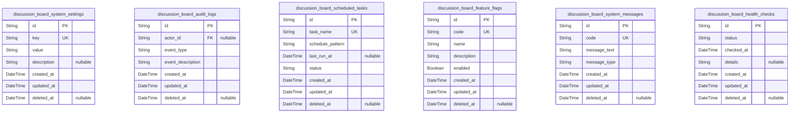
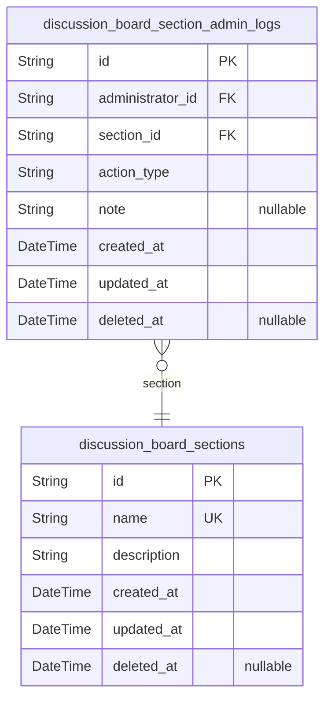
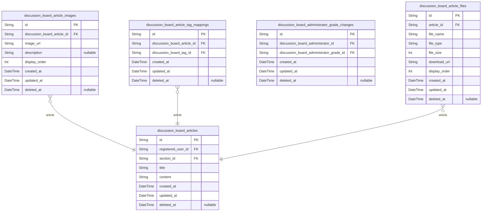
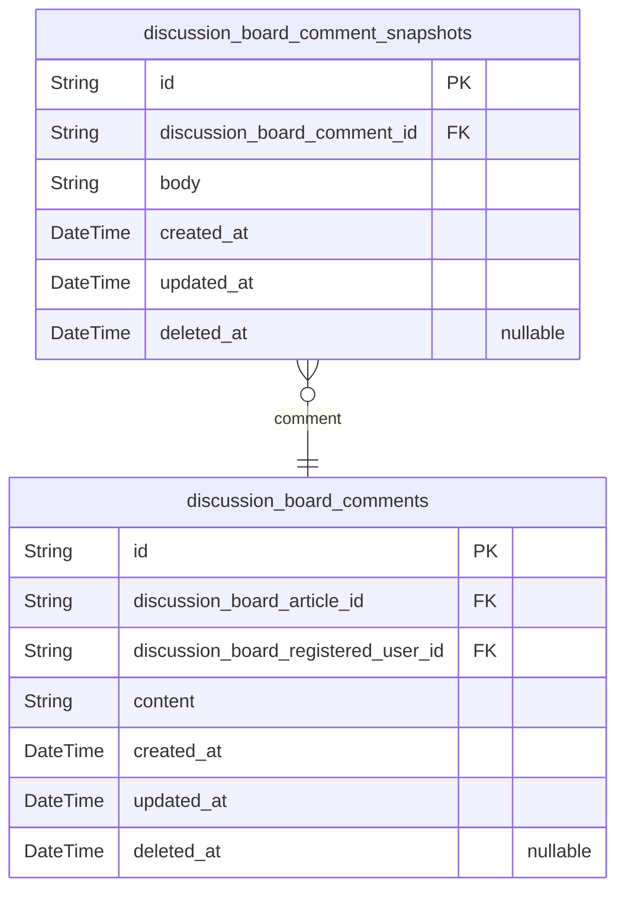
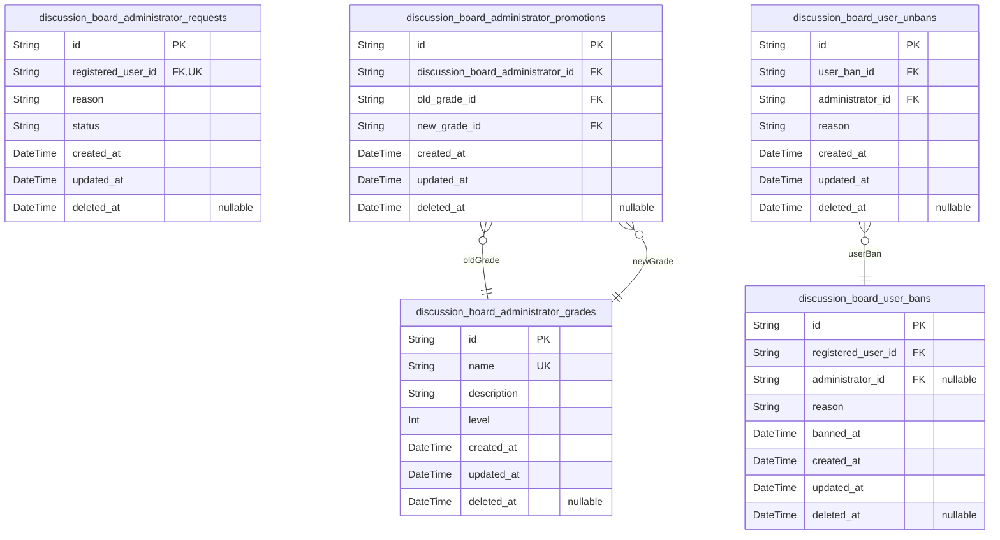
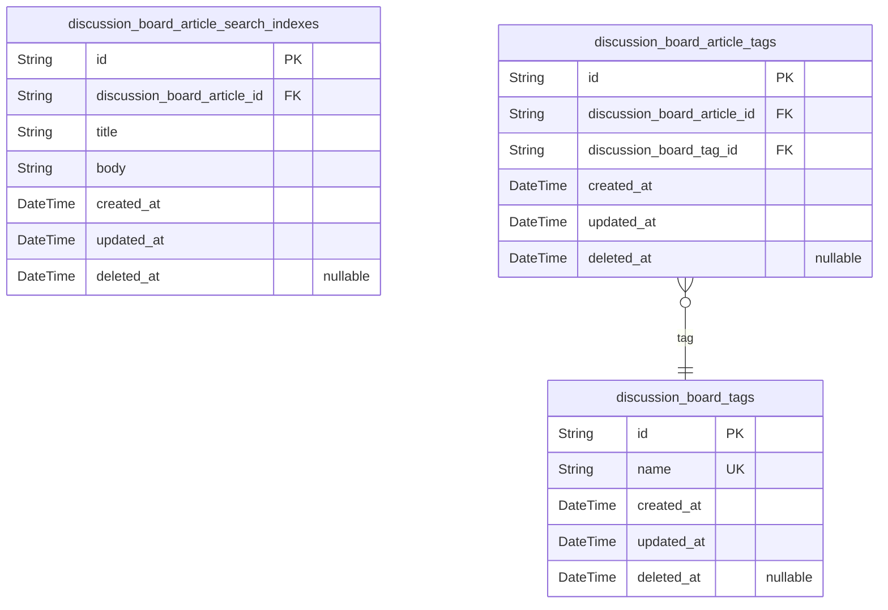
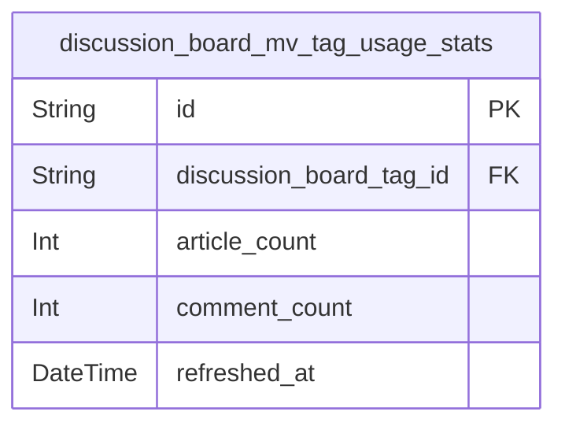

# Prisma Markdown

> Generated by [`prisma-markdown`](https://github.com/samchon/prisma-markdown)

- [Actors](#actors)
- [Systematic](#systematic)
- [Sections](#sections)
- [Articles](#articles)
- [Comments](#comments)
- [Administrator](#administrator)
- [Search](#search)
- [default](#default)

## Actors

```mermaid
erDiagram
"discussion_board_guests" {
  String id PK
  String device_fingerprint UK
  String user_agent
  String ip_address
  String anonymous_id
  DateTime created_at
  DateTime updated_at
  DateTime deleted_at "nullable"
}
"discussion_board_guest_sessions" {
  String id PK
  String discussion_board_guest_id FK
  String ip
  String href
  String referrer
  DateTime created_at
  DateTime expired_at
}
"discussion_board_registered_users" {
  String id PK
  String email UK
  String password_hash
  String display_name
  String bio "nullable"
  Boolean is_banned
  DateTime created_at
  DateTime updated_at
  DateTime deleted_at "nullable"
}
"discussion_board_registered_user_sessions" {
  String id PK
  String registered_user_id FK
  String ip
  String href
  String referrer
  DateTime created_at
  DateTime expired_at
}
"discussion_board_registered_user_password_resets" {
  String id PK
  String registered_user_id FK
  String token UK
  DateTime expired_at
  DateTime created_at
  DateTime updated_at
  DateTime deleted_at "nullable"
}
"discussion_board_registered_user_email_verifications" {
  String id PK
  String registered_user_id FK
  String token UK
  DateTime expired_at
  DateTime created_at
  DateTime updated_at
  DateTime deleted_at "nullable"
}
"discussion_board_administrators" {
  String id PK
  String grade_id FK
  String email UK
  String password_hash
  DateTime created_at
  DateTime updated_at
  DateTime deleted_at "nullable"
}
"discussion_board_administrator_sessions" {
  String id PK
  String administrator_id FK
  String ip
  String href
  String referrer
  DateTime created_at
  DateTime expired_at
  DateTime deleted_at "nullable"
}
"discussion_board_administrator_password_resets" {
  String id PK
  String administrator_id FK
  String token UK
  DateTime expired_at
  DateTime created_at
  DateTime updated_at
  DateTime deleted_at "nullable"
}
"discussion_board_super_administrators" {
  String id PK
  String email UK
  String password_hash
  String display_name
  String bio "nullable"
  DateTime created_at
  DateTime updated_at
  DateTime deleted_at "nullable"
}
"discussion_board_super_administrator_sessions" {
  String id PK
  String super_administrator_id FK
  String ip
  String href
  String referrer
  DateTime created_at
  DateTime expired_at
  DateTime deleted_at "nullable"
}
"discussion_board_super_administrator_password_resets" {
  String id PK
  String discussion_board_super_administrator_id FK,UK
  String token UK
  DateTime expired_at
  DateTime created_at
  DateTime updated_at
  DateTime deleted_at "nullable"
}
"discussion_board_guest_sessions" }o--|| "discussion_board_guests" : guest
"discussion_board_registered_user_sessions" }o--|| "discussion_board_registered_users" : registeredUser
"discussion_board_registered_user_password_resets" }o--|| "discussion_board_registered_users" : registeredUser
"discussion_board_registered_user_email_verifications" }o--|| "discussion_board_registered_users" : registeredUser
"discussion_board_administrator_sessions" }o--|| "discussion_board_administrators" : administrator
"discussion_board_administrator_password_resets" }o--|| "discussion_board_administrators" : administrator
"discussion_board_super_administrator_sessions" }o--|| "discussion_board_super_administrators" : superAdministrator
"discussion_board_super_administrator_password_resets" |o--|| "discussion_board_super_administrators" : superAdministrator
```

### `discussion_board_guests`

Temporary guest accounts identified by device and anonymous attributes.

This table stores records representing unauthenticated guest users
temporarily connected to the discussion board. Each guest is uniquely
identified by device fingerprint and anonymous session attributes to
enable limited tracking and user experience customization without full
registration.

No authentication credentials are stored as guests do not log in.
Temporal fields track creation, update, and soft deletion statuses.

Separate session table discussion_board_guest_sessions tracks login
sessions separately.

Properties as follows:

- `id`: Primary Key.
- `device_fingerprint`
  > A unique string fingerprint identifying the guest's device for session
  > continuity and tracking.
- `user_agent`
  > User-Agent string of the guest's browser or client for analytics and
  > display customization.
- `ip_address`: IP address of the guest for security and limited geo-location features.
- `anonymous_id`
  > Randomly generated anonymous identifier to uniquely represent the guest
  > user without PII.
- `created_at`: Record creation timestamp.
- `updated_at`: Record last update timestamp.
- `deleted_at`: Soft delete timestamp; null if not deleted.

### `discussion_board_guest_sessions`

Temporary session tokens supporting guest access with device recognition,
tracking IP address, visited URL, referrer, and session expiration.
Linked to guest entity for authentication context.

Properties as follows:

- `id`: Primary Key.
- `discussion_board_guest_id`: Reference to the guest account's discussion_board_guests.id.
- `ip`: IP address from which the guest connected.
- `href`: Full URL of the page visited by the guest.
- `referrer`: Referrer URL leading to the guest's session start.
- `created_at`: Timestamp when the session record was created.
- `expired_at`: Timestamp when the session expires and is no longer valid.

### `discussion_board_registered_users`

Registered user accounts with email/password credentials and profile
data. This table stores authentication credentials (email, password
hash), user profile details (display name, bio), and status flags. It is
the main actor table for registered users in the discussion board system
managing economic and political discussions. Includes unique email
constraint for login, and soft delete for account removal.

Properties as follows:

- `id`: Primary Key.
- `email`: User's unique email address used for login and communication.
- `password_hash`: Hash of the user's password for authentication.
- `display_name`: User's display name shown in profiles and articles.
- `bio`: Free-text user biography shown in profile.
- `is_banned`: Flag indicating if the user is banned from login and posting.
- `created_at`: Timestamp when the user account was created.
- `updated_at`: Timestamp when the user account was last updated.
- `deleted_at`: Timestamp when the user account was soft deleted, null if active.

### `discussion_board_registered_user_sessions`

JWT session tokens managing registered user authentication sessions. Each
record represents a login session with metadata for auditing and
security. References the registered user {@link
discussion_board_registered_users.id}.

Properties as follows:

- `id`: Primary Key.
- `registered_user_id`: Belonged registered user [discussion_board_registered_users.id](#discussion_board_registered_users).
- `ip`: Client IP address for session auditing.
- `href`: Request URI that initiated the session.
- `referrer`: HTTP referer header value for session origin.
- `created_at`: Session creation timestamp.
- `expired_at`: Session expiration timestamp.

### `discussion_board_registered_user_password_resets`

Password reset tokens with expiration for registered users, storing
secure tokens linked to registered user accounts for password recovery.

Properties as follows:

- `id`: Primary Key.
- `registered_user_id`: Belonged registered user [discussion_board_registered_users.id](#discussion_board_registered_users).
- `token`: Secure token string for password reset validation.
- `expired_at`: Expiration datetime for the reset token.
- `created_at`: Record creation timestamp.
- `updated_at`: Record update timestamp.
- `deleted_at`: Soft deletion timestamp; null if not deleted.

### `discussion_board_registered_user_email_verifications`

Email verification tokens to manage user email confirmation process for
registered users. Each record associates a unique token with a registered
user along with expiration and timestamps.

Properties as follows:

- `id`: Primary Key.
- `registered_user_id`: Belonged registered user's [discussion_board_registered_users.id](#discussion_board_registered_users).
- `token`: Unique email verification token string.
- `expired_at`: Datetime when this verification token expires.
- `created_at`: Record creation timestamp.
- `updated_at`: Record last updated timestamp.
- `deleted_at`: Record soft deletion timestamp, nullable.

### `discussion_board_administrators`

Administrator accounts with elevated privileges and role management. This
table stores login credentials for administrators, including email and
password hash, and links to their grade/role in the system.
Administrators have full user capabilities plus administrative powers
such as managing sections, deleting articles and comments, and banning
users.

Properties as follows:

- `id`: Primary Key.
- `grade_id`
  > Administrator grade reference. {@link
  > discussion_board_administrator_grades.id}.
- `email`: Unique email address used for administrator login credentials.
- `password_hash`: Password hash for secure authentication.
- `created_at`: Record creation timestamp.
- `updated_at`: Record last updated timestamp.
- `deleted_at`: Soft deletion timestamp, null if active.

### `discussion_board_administrator_sessions`

JWT session tokens managing administrator authentication sessions. Stores
session metadata including IP address, URL initiated from, referrer,
creation and expiration timestamps. Linked to owning administrator via
foreign key administrator_id referencing discussion_board_administrators.
Enables authentication lifecycle management and session auditing.

Properties as follows:

- `id`: Primary Key.
- `administrator_id`: Owning administrator's [discussion_board_administrators.id](#discussion_board_administrators).
- `ip`: IP address from which the session was created.
- `href`: The full URL of the page used to initiate the session.
- `referrer`: Referrer URL indicating the previous page before session creation.
- `created_at`: Timestamp when the session was created.
- `expired_at`: Timestamp when the session expires, marking session invalidity.
- `deleted_at`: Timestamp marking soft deletion of the session; null if active.

### `discussion_board_administrator_password_resets`

Password reset tokens for administrators to enable secure password
recovery. This table links each token to an administrator account and
records the token value, expiration timestamp, and auditing timestamps
(creation, update, deletion).

Properties as follows:

- `id`: Primary Key.
- `administrator_id`
  > The administrator account this token belongs to. {@link
  > discussion_board_administrators.id}
- `token`: Secure random token string for password reset validation.
- `expired_at`: Expiration timestamp after which the token is invalid and unusable.
- `created_at`: Record creation timestamp.
- `updated_at`: Record last update timestamp.
- `deleted_at`: Soft deletion timestamp; null if not deleted.

### `discussion_board_super_administrators`

Super administrator accounts represent the highest-level privileged users
in the system with full control over administrative roles and
permissions. This table stores essential authentication data such as
unique email and hashed passwords, profile display name and bio for
identification, and supports soft deletion for account lifecycle
management. It serves as the root actor entity for super administrators
and relates to session and password reset tables.

Properties as follows:

- `id`: Primary Key.
- `email`
  > Unique email address used for login and identification of the super
  > administrator.
- `password_hash`: Hashed password value for authenticating the super administrator.
- `display_name`: Display name for the super administrator profile, shown in the UI.
- `bio`
  > Optional biography or description text for the super administrator
  > profile.
- `created_at`: Timestamp recording when the super administrator account was created.
- `updated_at`: Timestamp recording when the super administrator account was last updated.
- `deleted_at`
  > Timestamp marking when the super administrator account was soft deleted,
  > if applicable.

### `discussion_board_super_administrator_sessions`

JWT session tokens that manage authentication sessions for super
administrators. Each session records connection context including IP
address, referrer URL, and user agent (href). Sessions are time-limited
with creation and expiration timestamps to ensure security and
auditability.

Properties as follows:

- `id`: Primary Key.
- `super_administrator_id`
  > The associated super administrator's {@link
  > discussion_board_super_administrators.id}.
- `ip`: IP address from which the session originated.
- `href`: User agent or originating URL captured for session tracking.
- `referrer`: Referrer URL from the client during session initiation.
- `created_at`: Timestamp when the session was created.
- `expired_at`: Timestamp when the session will expire, enforcing session lifecycle.
- `deleted_at`: Timestamp for soft deletion of the session record, if applicable.

### `discussion_board_super_administrator_password_resets`

Password reset tokens for super administrators to secure sensitive
accounts. Each token uniquely identifies a password reset request and
includes expiration for security. References the owning super
administrator account.

Properties as follows:

- `id`: Primary Key.
- `discussion_board_super_administrator_id`
  > Owning super administrator's {@link
  > discussion_board_super_administrators.id}.
- `token`: Unique token string used for password reset authentication.
- `expired_at`: Expiration time for the password reset token to maintain security.
- `created_at`: Timestamp when the password reset token was created.
- `updated_at`: Timestamp when the password reset token was last updated.
- `deleted_at`: Soft delete flag indicating when the token was invalidated or removed.

## Systematic

```mermaid
erDiagram
"discussion_board_system_settings" {
  String id PK
  String key UK
  String value
  String description "nullable"
  DateTime created_at
  DateTime updated_at
  DateTime deleted_at "nullable"
}
"discussion_board_audit_logs" {
  String id PK
  String actor_id FK "nullable"
  String event_type
  String event_description
  DateTime created_at
  DateTime updated_at
  DateTime deleted_at "nullable"
}
"discussion_board_scheduled_tasks" {
  String id PK
  String task_name UK
  String schedule_pattern
  DateTime last_run_at "nullable"
  String status
  DateTime created_at
  DateTime updated_at
  DateTime deleted_at "nullable"
}
"discussion_board_feature_flags" {
  String id PK
  String code UK
  String name
  String description
  Boolean enabled
  DateTime created_at
  DateTime updated_at
  DateTime deleted_at "nullable"
}
"discussion_board_system_messages" {
  String id PK
  String code UK
  String message_text
  String message_type
  DateTime created_at
  DateTime updated_at
  DateTime deleted_at "nullable"
}
"discussion_board_health_checks" {
  String id PK
  String status
  DateTime checked_at
  String details "nullable"
  DateTime created_at
  DateTime updated_at
  DateTime deleted_at "nullable"
}
```

### `discussion_board_system_settings`

Global application settings and configuration parameters for system-wide
features. Each setting is represented by a unique key and associated
value, optionally accompanied by a detailed description. This table
enables dynamic configuration management of the discussion board platform
without code changes.

Properties as follows:

- `id`: Primary Key.
- `key`: Unique identifier for the configuration setting.
- `value`: Value associated with the configuration key.
- `description`: Optional detailed description of the setting.
- `created_at`: Timestamp when the setting was created.
- `updated_at`: Timestamp when the setting was last updated.
- `deleted_at`: Timestamp when the setting was soft deleted, if applicable.

### `discussion_board_audit_logs`

Audit log entries recording all system-level events for security and
operational tracing. Each record represents an event with timestamp,
type, actor reference (if applicable), and descriptive details for audit
and forensic analysis.

Properties as follows:

- `id`: Primary Key.
- `actor_id`
  > Referencing the actor who triggered the event, nullable since not all
  > events have an associated actor. Referenced registered user's {@link
  > discussion_board_registered_users.id}.
- `event_type`: Type of the event logged, e.g., 'login', 'article_creation', 'ban_action'.
- `event_description`
  > Detailed description or message associated with the event for auditing
  > purposes.
- `created_at`: Timestamp when the log entry was created.
- `updated_at`: Timestamp when the log entry was last updated.
- `deleted_at`: Timestamp when the log entry was soft deleted, if applicable.

### `discussion_board_scheduled_tasks`

This table stores metadata for system scheduled tasks including task
name, schedule pattern, last run timestamp, operational status, and
timestamps for audit and soft deletion. It enables tracking and
management of automated system jobs within the discussion board platform.

Properties as follows:

- `id`: Primary Key.
- `task_name`: The unique name identifying the scheduled task.
- `schedule_pattern`: Cron-style schedule pattern specifying when the task should run.
- `last_run_at`: Timestamp of the last execution time of the scheduled task.
- `status`: Current operational status of the task. E.g., active, inactive, paused.
- `created_at`: Timestamp when the scheduled task metadata was created.
- `updated_at`: Timestamp when the scheduled task metadata was last updated.
- `deleted_at`: Timestamp for soft deletion. Null if not deleted.

### `discussion_board_feature_flags`

System-wide feature flags to enable or disable functionalities
dynamically, controlling application features at runtime. This table
holds the unique code, descriptive name, detailed description, enabled
status, and timestamps for creation, updates, and optional soft deletion.

Properties as follows:

- `id`: Primary Key.
- `code`: Unique code identifier for the feature flag used in the system.
- `name`: Human-readable name of the feature flag for display purposes.
- `description`: Detailed explanation of what the feature flag controls.
- `enabled`: Flag indicating whether the feature is currently enabled or disabled.
- `created_at`: Timestamp when this feature flag record was created.
- `updated_at`: Timestamp when this feature flag record was last updated.
- `deleted_at`: Timestamp when this feature flag was soft-deleted, if applicable.

### `discussion_board_system_messages`

Contains error and notification message templates used throughout the
system for consistent messaging and localization support.

Properties as follows:

- `id`: Primary Key.
- `code`: Unique code identifier for the message template.
- `message_text`: The error or notification message content.
- `message_type`: Category or type of the message, e.g., error, warning, info.
- `created_at`: Timestamp when the message template was created.
- `updated_at`: Timestamp when the message template was last updated.
- `deleted_at`: Timestamp when the message template was soft-deleted; null if active.

### `discussion_board_health_checks`

Log of system health checks and monitoring events for operational
insight. Captures periodic health status with details for reliability and
alerting.

Properties as follows:

- `id`: Primary Key.
- `status`: Status of the health check. Examples include 'OK', 'WARNING', or 'ERROR'.
- `checked_at`: Timestamp when the health check occurred.
- `details`: Optional detailed information or error messages from the health check.
- `created_at`: Timestamp when the record was created.
- `updated_at`: Timestamp when the record was last updated.
- `deleted_at`: Timestamp for soft deletion, if applicable.

## Sections

```mermaid
erDiagram
"discussion_board_sections" {
  String id PK
  String name UK
  String description
  DateTime created_at
  DateTime updated_at
  DateTime deleted_at "nullable"
}
"discussion_board_section_admin_logs" {
  String id PK
  String administrator_id FK
  String section_id FK
  String action_type
  String note "nullable"
  DateTime created_at
  DateTime updated_at
  DateTime deleted_at "nullable"
}
"discussion_board_section_admin_logs" }o--|| "discussion_board_sections" : section
```

### `discussion_board_sections`

The core thematic categories under which articles are organized, with
unique names and descriptions. Sections provide an organizational
structure to group articles by topic and facilitate users in browsing
relevant content. Administrators manage section creation and
modification. This table stores section metadata such as the unique name
and detailed description along with timestamps for creation, update, and
soft deletion.

Properties as follows:

- `id`: Primary Key.
- `name`: Unique name of the section.
- `description`: Detailed textual description of the section's purpose and scope.
- `created_at`: Timestamp when the section was created.
- `updated_at`: Timestamp when the section was last updated.
- `deleted_at`: Timestamp when the section was soft deleted, if applicable.

### `discussion_board_section_admin_logs`

Administrative logs recording creation, modification, and deletion
actions performed on discussion board sections by administrators. Each
record captures the administrator responsible, the section affected, the
type of action performed, timestamps for auditing, and optional notes for
additional context.

Properties as follows:

- `id`: Primary Key.
- `administrator_id`
  > Administrator who performed the action. {@link
  > discussion_board_administrators.id}.
- `section_id`
  > Section on which the administrative action was performed. {@link
  > discussion_board_sections.id}.
- `action_type`
  > Type of administrative action performed on the section, e.g., creation,
  > modification, deletion.
- `note`: Optional text notes providing additional context about the action.
- `created_at`: Timestamp when the admin action log was created.
- `updated_at`: Timestamp when the admin action log was last updated.
- `deleted_at`: Timestamp when the log was soft-deleted. Null if not deleted.

## Articles

```mermaid
erDiagram
"discussion_board_articles" {
  String id PK
  String registered_user_id FK
  String section_id FK
  String title
  String content
  DateTime created_at
  DateTime updated_at
  DateTime deleted_at "nullable"
}
"discussion_board_article_images" {
  String id PK
  String discussion_board_article_id FK
  String image_url
  String description "nullable"
  Int display_order
  DateTime created_at
  DateTime updated_at
  DateTime deleted_at "nullable"
}
"discussion_board_article_tag_mappings" {
  String id PK
  String discussion_board_article_id FK
  String discussion_board_tag_id FK
  DateTime created_at
  DateTime updated_at
  DateTime deleted_at "nullable"
}
"discussion_board_administrator_grade_changes" {
  String id PK
  String discussion_board_administrator_id FK
  String discussion_board_administrator_grade_id FK
  DateTime created_at
  DateTime updated_at
  DateTime deleted_at "nullable"
}
"discussion_board_article_files" {
  String id PK
  String article_id FK
  String file_name
  String file_type
  Int file_size
  String download_url
  Int display_order
  DateTime created_at
  DateTime updated_at
  DateTime deleted_at "nullable"
}
"discussion_board_article_images" }o--|| "discussion_board_articles" : article
"discussion_board_article_tag_mappings" }o--|| "discussion_board_articles" : article
"discussion_board_article_files" }o--|| "discussion_board_articles" : article
```

### `discussion_board_articles`

Articles created by registered users including title, content, section
association, and timestamps. Each article belongs to a registered user
(author) and a section. Attachments, images, and tags are managed
separately.

Properties as follows:

- `id`: Primary Key.
- `registered_user_id`
  > Author of the article, references registered user. {@link
  > discussion_board_registered_users.id}.
- `section_id`
  > Section under which the article is published. {@link
  > discussion_board_sections.id}.
- `title`: Title of the article, must be non-empty.
- `content`: Content of the article, full text.
- `created_at`: Timestamp when the article was created.
- `updated_at`: Timestamp of the last article update.
- `deleted_at`: Timestamp when the article was soft deleted; null if active.

### `discussion_board_article_images`

Images attached to articles with metadata and display order.

This table stores information about images uploaded and associated with
discussion board articles. It supports multiple images per article and
maintains display order for presentation purposes. Each image record has
creation, update, and soft delete timestamps.

Properties as follows:

- `id`: Primary Key.
- `discussion_board_article_id`
  > Article to which this image is attached. {@link
  > discussion_board_articles.id}
- `image_url`: URL or path of the image file attached to the article.
- `description`: Optional description or caption for the image.
- `display_order`: Display order of the image within the article.
- `created_at`: Timestamp when the image record was created.
- `updated_at`: Timestamp when the image record was last updated.
- `deleted_at`: Timestamp marking when the image record was soft deleted.

### `discussion_board_article_tag_mappings`

Junction table associating articles with multiple tags for flexible
categorization. Each record links one article to one tag, enabling
many-to-many relationships. Ensures no duplicate article-tag pairs for
data integrity.

Properties as follows:

- `id`: Primary Key.
- `discussion_board_article_id`: Reference to the article's [discussion_board_articles.id](#discussion_board_articles).
- `discussion_board_tag_id`: Reference to the tag's [discussion_board_tags.id](#discussion_board_tags).
- `created_at`: Record creation timestamp.
- `updated_at`: Record last update timestamp.
- `deleted_at`: Soft deletion timestamp; NULL if not deleted.

### `discussion_board_administrator_grade_changes`

Record of promotions and demotions of administrators for audit and
management. Tracks which administrator had their grade changed, to what
grade, and when. Enables auditing of administrator grade history over
time.

Properties as follows:

- `id`: Primary Key.
- `discussion_board_administrator_id`
  > The administrator whose grade was changed, referencing
  > discussion_board_administrators.id.
- `discussion_board_administrator_grade_id`
  > The grade assigned to the administrator in this record, referencing
  > discussion_board_administrator_grades.id.
- `created_at`: Record creation timestamp.
- `updated_at`: Last record update timestamp.
- `deleted_at`: Soft delete timestamp; if set, record is considered deleted.

### `discussion_board_article_files`

Files attached to articles including metadata for download URLs, file
type, size, and display order. Each file belongs to a single article and
supports multiple files per article for management and retrieval.

Properties as follows:

- `id`: Primary Key.
- `article_id`
  > The article to which this file is attached, referenced by
  > discussion_board_articles.id.
- `file_name`: Name of the uploaded file including extension.
- `file_type`: MIME type of the file, e.g., 'application/pdf', 'image/png'.
- `file_size`: Size of the file in bytes.
- `download_url`: URL for downloading the file.
- `display_order`: Order of file display among multiple files attached to the same article.
- `created_at`: Timestamp when the file record was created.
- `updated_at`: Timestamp when the file record was last updated.
- `deleted_at`: Timestamp indicating soft deletion of the file record, if applicable.

## Comments

```mermaid
erDiagram
"discussion_board_comments" {
  String id PK
  String discussion_board_article_id FK
  String discussion_board_registered_user_id FK
  String content
  DateTime created_at
  DateTime updated_at
  DateTime deleted_at "nullable"
}
"discussion_board_comment_snapshots" {
  String id PK
  String discussion_board_comment_id FK
  String body
  DateTime created_at
  DateTime updated_at
  DateTime deleted_at "nullable"
}
"discussion_board_comment_snapshots" }o--|| "discussion_board_comments" : comment
```

### `discussion_board_comments`

User-written comments linked to articles in the discussion board system.
Stores content, author reference, timestamps, and supports soft deletion.
Enables user and admin comment management compliant with business
requirements.

Properties as follows:

- `id`: Primary Key.
- `discussion_board_article_id`: Belonged article's [discussion_board_articles.id](#discussion_board_articles).
- `discussion_board_registered_user_id`: Author registered user's [discussion_board_registered_users.id](#discussion_board_registered_users).
- `content`: Comment content text written by the user.
- `created_at`: Timestamp when the comment was created.
- `updated_at`: Timestamp when the comment was last updated.
- `deleted_at`: Timestamp when the comment was soft deleted, null if active.

### `discussion_board_comment_snapshots`

Audit trail storing historical snapshots of user comments for audit,
versioning, and recovery purposes. Each snapshot retains the full state
of comment content, author information, and timestamps at a specific
point in time, ensuring traceability of changes. The table references the
original comment in discussion_board_comments and supports historical
browsing and rollback functionalities.

Properties as follows:

- `id`: Primary Key.
- `discussion_board_comment_id`: Original comment's discussion_board_comments.id.
- `body`: Comment content snapshot at the time of recording.
- `created_at`: Snapshot creation timestamp.
- `updated_at`: Snapshot last update timestamp.
- `deleted_at`: Soft deletion timestamp, if the snapshot is logically deleted.

## Administrator

```mermaid
erDiagram
"discussion_board_administrator_requests" {
  String id PK
  String registered_user_id FK,UK
  String reason
  String status
  DateTime created_at
  DateTime updated_at
  DateTime deleted_at "nullable"
}
"discussion_board_administrator_grades" {
  String id PK
  String name UK
  String description
  Int level
  DateTime created_at
  DateTime updated_at
  DateTime deleted_at "nullable"
}
"discussion_board_administrator_promotions" {
  String id PK
  String discussion_board_administrator_id FK
  String old_grade_id FK
  String new_grade_id FK
  DateTime created_at
  DateTime updated_at
  DateTime deleted_at "nullable"
}
"discussion_board_user_bans" {
  String id PK
  String registered_user_id FK
  String administrator_id FK "nullable"
  String reason
  DateTime banned_at
  DateTime created_at
  DateTime updated_at
  DateTime deleted_at "nullable"
}
"discussion_board_user_unbans" {
  String id PK
  String user_ban_id FK
  String administrator_id FK
  String reason
  DateTime created_at
  DateTime updated_at
  DateTime deleted_at "nullable"
}
"discussion_board_administrator_promotions" }o--|| "discussion_board_administrator_grades" : oldGrade
"discussion_board_administrator_promotions" }o--|| "discussion_board_administrator_grades" : newGrade
"discussion_board_user_unbans" }o--|| "discussion_board_user_bans" : userBan
```

### `discussion_board_administrator_requests`

Requests submitted by users to become administrators including the reason
for request and current approval status. Each request is linked to the
registered user who submitted it and timestamps track its lifecycle.

Properties as follows:

- `id`: Primary Key.
- `registered_user_id`
  > The registered user who submitted the administrator request, referenced
  > by [discussion_board_registered_users.id](#discussion_board_registered_users).
- `reason`
  > User-provided text explaining the reason for requesting administrator
  > privileges.
- `status`: Current status of the request, e.g., 'pending', 'approved', or 'rejected'.
- `created_at`: Timestamp when the administrator request was created.
- `updated_at`: Timestamp when the administrator request was last updated.
- `deleted_at`: Timestamp when the administrator request was soft deleted, if applicable.

### `discussion_board_administrator_grades`

Administrator grades defining regular and super administrator roles. Each
grade represents a distinct level of permissions and authority within the
administration system.

Properties as follows:

- `id`: Primary Key.
- `name`: Unique name of the administrator grade, e.g., 'regular', 'super'.
- `description`: Description explaining the permissions and responsibilities of this grade.
- `level`: Integer level to define ordering and comparison of administrator grades.
- `created_at`: Record creation timestamp.
- `updated_at`: Timestamp of last update to the record.
- `deleted_at`: Timestamp marking soft deletion of the record; null if active.

### `discussion_board_administrator_promotions`

Records of administrator promotions and demotions between grades,
capturing the administrator involved, old grade, new grade, and
timestamps for audit and management purposes.

Properties as follows:

- `id`: Primary Key.
- `discussion_board_administrator_id`
  > Administrator who was promoted or demoted, references {@link
  > discussion_board_administrators.id}.
- `old_grade_id`
  > Previous grade of the administrator before promotion or demotion,
  > references [discussion_board_administrator_grades.id](#discussion_board_administrator_grades).
- `new_grade_id`
  > New grade of the administrator after promotion or demotion, references
  > [discussion_board_administrator_grades.id](#discussion_board_administrator_grades).
- `created_at`: Timestamp when the promotion or demotion occurred.
- `updated_at`: Timestamp when the record was last updated.
- `deleted_at`: Timestamp to indicate soft deletion of the record.

### `discussion_board_user_bans`

Ban records capturing banned user identities, ban reasons, and ban
timestamps. Each record links to the banned registered user and the
administrator who executed the ban, preserving audit trail and enabling
moderation control.

Properties as follows:

- `id`: Primary Key.
- `registered_user_id`: Banned registered user. [discussion_board_registered_users.id](#discussion_board_registered_users).
- `administrator_id`
  > Administrator who performed the ban. {@link
  > discussion_board_administrators.id}.
- `reason`: Reason for banning the user.
- `banned_at`: Timestamp when the ban was applied.
- `created_at`: Record creation timestamp.
- `updated_at`: Record last update timestamp.
- `deleted_at`: Soft deletion timestamp, null if not deleted.

### `discussion_board_user_unbans`

Records of unbanning actions performed on banned users with timestamps
and references to the banning record and the administrator who performed
the unban. Enables audit and accountability for user unbanning events in
the system.

Properties as follows:

- `id`: Primary Key.
- `user_ban_id`
  > The ban record that this unban entry is lifting. {@link
  > discussion_board_user_bans.id}.
- `administrator_id`
  > The administrator who performed the unban action. {@link
  > discussion_board_administrators.id}.
- `reason`: Reason or note explaining why the user was unbanned.
- `created_at`: Record creation timestamp.
- `updated_at`: Record last update timestamp.
- `deleted_at`: Record deletion timestamp for soft delete, if applicable.

## Search

```mermaid
erDiagram
"discussion_board_tags" {
  String id PK
  String name UK
  DateTime created_at
  DateTime updated_at
  DateTime deleted_at "nullable"
}
"discussion_board_article_search_indexes" {
  String id PK
  String discussion_board_article_id FK
  String title
  String body
  DateTime created_at
  DateTime updated_at
  DateTime deleted_at "nullable"
}
"discussion_board_article_tags" {
  String id PK
  String discussion_board_article_id FK
  String discussion_board_tag_id FK
  DateTime created_at
  DateTime updated_at
  DateTime deleted_at "nullable"
}
"discussion_board_article_tags" }o--|| "discussion_board_tags" : tag
```

### `discussion_board_tags`

Tags used by articles for categorization and filtering. Each tag has a
unique name and supports soft deletion and full-text search for efficient
tagging capabilities.

Properties as follows:

- `id`: Primary Key.
- `name`: Unique name of the tag used for categorizing articles.
- `created_at`: Record creation timestamp.
- `updated_at`: Record last update timestamp.
- `deleted_at`: Soft deletion timestamp, if the tag is deleted.

### `discussion_board_article_search_indexes`

Searchable text index records for articles enabling efficient full-text
search. This table stores preprocessed and tokenized text content to
optimize search queries. Each record references an article and contains
indexed fields for title and body text, supporting rapid full-text search
operations.

Properties as follows:

- `id`: Primary Key.
- `discussion_board_article_id`: Referenced article's [discussion_board_articles.id](#discussion_board_articles).
- `title`: Text content of the article's title indexed for search.
- `body`: Text content of the article's body indexed for search.
- `created_at`: Record creation timestamp.
- `updated_at`: Last record update timestamp.
- `deleted_at`: Soft delete timestamp; null if not deleted.

### `discussion_board_article_tags`

Many-to-many relationship between articles and tags enabling flexible
categorization and filtering of articles by tags. Connects each tag to
one or more articles and each article to multiple tags, facilitating
efficient searching and filtering.

Properties as follows:

- `id`: Primary Key.
- `discussion_board_article_id`
  > Referencing article's unique identifier. The target article associated
  > with this tag. [discussion_board_articles.id](#discussion_board_articles)
- `discussion_board_tag_id`
  > Referencing tag's unique identifier. The associated tag for the article.
  > [discussion_board_tags.id](#discussion_board_tags)
- `created_at`: Record creation timestamp.
- `updated_at`: Record last update timestamp.
- `deleted_at`: Soft deletion timestamp; null if not deleted.

## default

```mermaid
erDiagram
"discussion_board_mv_tag_usage_stats" {
  String id PK
  String discussion_board_tag_id FK
  Int article_count
  Int comment_count
  DateTime refreshed_at
}
```

### `discussion_board_mv_tag_usage_stats`

Materialized view aggregating tag usage statistics to optimize search and
filtering performance in discussion board articles. Provides precomputed
counts of articles and comments per tag with refresh timestamps.

Properties as follows:

- `id`: Primary Key.
- `discussion_board_tag_id`
  > References the tag aggregated in this usage statistic. {@link
  > discussion_board_tags.id}
- `article_count`: Number of articles tagged with this tag.
- `comment_count`: Number of comments associated with articles tagged by this tag.
- `refreshed_at`: Timestamp when this materialized view entry was last refreshed.
